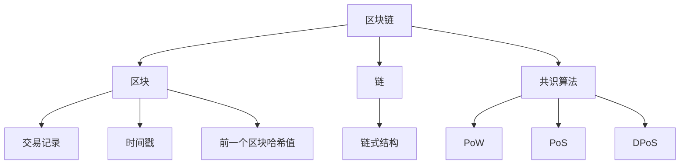
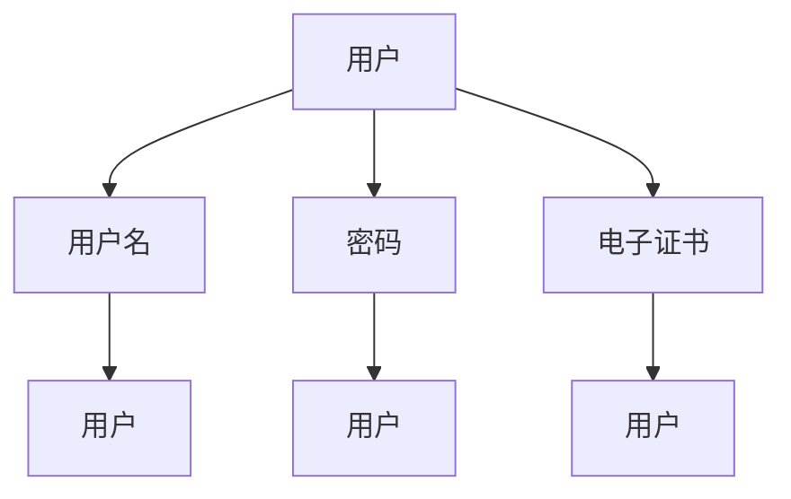
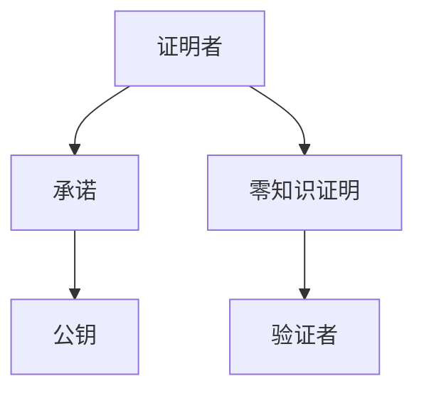
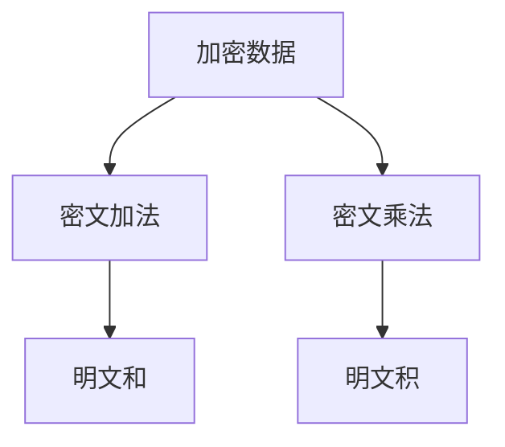
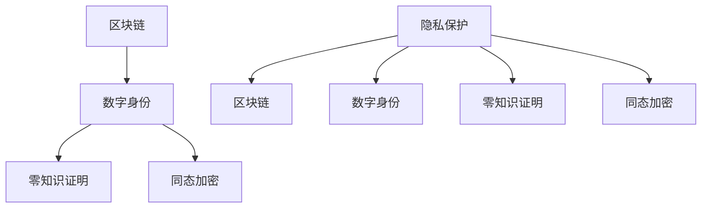

                 

### 引言

在数字化时代的浪潮下，身份验证逐渐成为各领域的关键需求。无论是在金融、医疗、教育等敏感行业，还是在日常生活的方方面面，身份验证都扮演着至关重要的角色。然而，传统身份验证方式在保障安全性的同时，往往忽略了用户隐私保护的重要性。特别是在当今信息泄露事件频发的背景下，如何有效地保护用户隐私，成为了亟需解决的问题。

区块链技术的出现为身份验证领域带来了新的契机。区块链的去中心化、不可篡改和可追溯等特点，使其在数字身份验证和隐私保护方面具有独特的优势。通过将区块链技术应用于数字身份验证，我们可以实现更加安全、透明且可靠的验证过程，同时确保用户的隐私不受侵害。

本文将围绕区块链在数字身份验证中的隐私保护机制展开讨论。我们将首先介绍数字身份验证的问题背景，然后深入探讨区块链技术的基本原理，接着分析零知识证明和同态加密等隐私保护技术，最后通过具体案例展示区块链在数字身份验证中的实际应用，并总结最佳实践和未来发展趋势。

本文的核心关键词包括：数字身份验证、区块链、隐私保护、零知识证明、同态加密。通过本文的阅读，读者将能够全面了解区块链在数字身份验证中的隐私保护机制，并为相关领域的研究和应用提供有益的参考。

### 关键词

- 数字身份验证
- 区块链
- 隐私保护
- 零知识证明
- 同态加密
- 去中心化
- 不可篡改
- 可追溯性
- 数字安全

### 摘要

本文旨在探讨区块链在数字身份验证中的隐私保护机制。随着数字化时代的到来，身份验证成为了关键需求，但在保障安全性的同时，用户隐私保护也日益受到重视。区块链技术以其去中心化、不可篡改和可追溯的特点，为数字身份验证和隐私保护提供了新的解决方案。本文首先介绍了数字身份验证的问题背景，分析了传统身份验证方式的不足。接着，我们深入探讨了区块链技术的基本原理，并介绍了零知识证明和同态加密等隐私保护技术。通过具体案例，本文展示了区块链在数字身份验证中的应用，包括零知识证明和同态加密在实际场景中的实现。最后，本文总结了区块链在数字身份验证中的隐私保护优势，并提出了未来发展的趋势。本文为相关领域的研究和应用提供了有价值的参考。

## 第一部分：背景介绍

### 1. 问题背景

在数字化时代，身份验证已经成为各个领域的关键需求。无论是在金融、医疗、教育等敏感领域，还是在日常生活中的社交、购物等场景，身份验证都扮演着至关重要的角色。传统的身份验证方式主要依赖于用户名、密码、身份证、信用卡等信息，虽然能够保障一定程度的验证准确性，但在隐私保护方面存在明显的不足。特别是在当前信息泄露事件频发的背景下，用户的个人信息面临着极大的风险。

首先，传统身份验证方式容易受到黑客攻击。例如，用户名和密码在传输过程中可能被截获，导致账户信息泄露。此外，身份验证过程中产生的日志和记录也可能成为黑客攻击的目标，进一步加剧隐私泄露的风险。

其次，传统身份验证方式缺乏透明性和可追溯性。在传统的中心化系统中，身份验证数据的存储和处理都集中在一个中心化的服务器上，一旦发生数据泄露或篡改，很难追踪责任方。而区块链技术由于其去中心化和不可篡改的特性，可以在一定程度上解决这一问题。

最后，传统身份验证方式无法满足用户对隐私保护的需求。在数字化生活中，用户希望在不同平台上使用相同的身份信息进行验证，但传统方式往往需要用户在不同的系统中重复提供个人信息，这不仅增加了用户的负担，也增加了隐私泄露的风险。

综上所述，传统身份验证方式在隐私保护方面存在显著不足，难以满足数字化时代的需求。因此，探索一种新的身份验证机制，特别是能够有效保护用户隐私的机制，成为了当前研究的热点。

### 2. 问题描述

区块链在数字身份验证中面临的主要问题是如何在保障用户隐私的同时，确保身份验证的准确性和可靠性。区块链技术具有去中心化、不可篡改、可追溯等特点，能够提供一种新的解决方案。然而，在实际应用中，区块链技术也面临着一些挑战。

首先，区块链技术的性能瓶颈是一个重要问题。传统的区块链系统在处理大规模数据时，可能因为交易速度慢、交易容量低等问题，导致身份验证过程效率低下，无法满足实时性需求。为了解决这一问题，研究人员提出了分片技术、状态通道等技术，以提高区块链系统的性能。

其次，区块链技术如何确保身份验证的准确性也是一个关键问题。在区块链系统中，身份验证需要依赖于用户的公钥和私钥。然而，公钥和私钥的生成、存储和使用过程中，可能存在漏洞，导致身份验证结果不准确。为了提高身份验证的准确性，研究人员提出了基于零知识证明、同态加密等技术的解决方案。

再次，如何在区块链上保护用户的隐私是一个重要挑战。区块链上的数据是公开透明的，一旦用户信息被记录在区块链上，就很难保证其不被泄露。为了保护用户隐私，研究人员提出了多种隐私保护技术，如零知识证明、同态加密、隐私聚合等。

此外，区块链在数字身份验证中还需要解决跨链兼容性问题。不同的区块链平台可能采用不同的加密算法、共识机制等，如何实现不同区块链平台之间的身份验证互操作性，是一个亟待解决的问题。

最后，区块链在数字身份验证中的应用还需要考虑到法律法规和伦理道德问题。不同国家和地区对数字身份验证的法律规定和伦理标准可能有所不同，如何在遵循法律法规和伦理道德的前提下，实现区块链在数字身份验证中的有效应用，也是一个重要的研究方向。

### 3. 问题解决

为了解决上述问题，本文将探讨区块链在数字身份验证中的隐私保护机制，包括零知识证明、同态加密等核心技术，以及如何将这些技术应用于实际场景中。通过这些机制，用户可以在不泄露隐私的情况下完成身份验证，同时确保验证结果的准确性和可靠性。

首先，零知识证明是一种密码学技术，允许用户在不泄露任何信息的情况下，向验证者证明某个陈述为真。在数字身份验证中，用户可以使用零知识证明来证明自己的身份，而不需要泄露任何个人信息。这样，即使在区块链上记录了验证过程，用户的隐私也得到了有效保护。

其次，同态加密是一种加密技术，允许在加密数据上进行计算，而不需要解密数据。在数字身份验证中，同态加密可以用于保护用户的身份信息，确保在验证过程中不泄露隐私。例如，验证者可以在加密的状态下计算用户的身份，从而实现对用户隐私的保护。

此外，区块链在数字身份验证中的隐私保护还需要考虑以下方面：

- **数据加密**：在区块链上存储和传输的数据需要进行加密，以确保数据在传输过程中不被窃取或篡改。常用的加密算法包括对称加密和非对称加密。

- **隐私聚合**：通过隐私聚合技术，可以将多个用户的数据进行聚合处理，从而减少每个用户隐私信息被泄露的风险。例如，使用差分隐私技术对用户数据进行匿名化处理。

- **去中心化身份验证**：通过去中心化的身份验证机制，可以避免将用户的身份信息存储在中心化的服务器上，从而降低隐私泄露的风险。

- **智能合约**：智能合约可以用于自动化和去中心化的身份验证过程，确保验证结果的准确性和可靠性。

通过上述机制，区块链在数字身份验证中能够实现用户隐私保护，同时确保验证过程的准确性和可靠性。未来，随着区块链技术和隐私保护技术的不断发展和完善，数字身份验证将变得更加安全、透明和高效。

### 4. 边界与外延

本文主要关注区块链在数字身份验证中的隐私保护机制，包括但不限于以下方面：

- **区块链技术在数字身份验证中的应用场景**：探讨区块链技术在金融、医疗、教育等领域的具体应用场景，以及如何实现隐私保护和身份验证的有机结合。

- **隐私保护技术的原理与实现**：详细分析零知识证明、同态加密等隐私保护技术的原理，以及如何在区块链上实现这些技术，以保护用户的隐私。

- **数字身份验证系统的设计与实现**：介绍数字身份验证系统的整体架构，包括用户身份信息的生成、存储、验证等过程，以及如何确保系统的安全性和可靠性。

- **实际案例分析与解决方案评估**：通过具体案例展示区块链在数字身份验证中的实际应用效果，分析不同解决方案的优缺点，为实际项目提供参考。

此外，本文还将探讨区块链在数字身份验证中的隐私保护机制与其他技术的结合，如区块链与人工智能、云计算等技术的融合，以进一步提升数字身份验证的安全性和效率。

### 5. 概念结构与核心要素组成

为了深入理解区块链在数字身份验证中的隐私保护机制，我们需要从基本概念、技术原理和核心要素三个方面进行剖析。

#### 5.1 区块链技术

区块链是一种分布式账本技术，具有去中心化、不可篡改、可追溯等特点。其核心概念包括区块、链、共识算法等。

- **区块**：区块链中的数据存储单位，每个区块包含一定数量的交易记录，以及前一个区块的哈希值。
- **链**：多个区块按照时间顺序链接形成的链条，每个区块都通过哈希值与前一个区块相连，形成一种链条结构。
- **共识算法**：区块链网络中的节点通过共识算法达成数据一致性的过程。常见的共识算法包括工作量证明（PoW）、权益证明（PoS）和委托权益证明（DPoS）等。

#### 5.2 数字身份

数字身份是指用户在数字世界中的身份标识，通常包括用户名、密码、电子证书等。数字身份具有唯一性、安全性、可验证性等特征。

- **唯一性**：每个用户在数字世界中的身份是唯一的，确保用户身份不可篡改。
- **安全性**：数字身份信息需要进行加密存储和传输，防止被非法获取和篡改。
- **可验证性**：数字身份验证机制需要确保用户身份的真实性和合法性，防止伪造和冒用。

#### 5.3 零知识证明

零知识证明是一种密码学技术，允许用户在不泄露任何信息的情况下，向验证者证明某个陈述为真。其核心原理是通过一系列数学证明，确保用户在证明过程中不泄露隐私信息。

- **零知识证明的工作原理**：用户通过零知识证明协议，向验证者展示某个陈述为真，同时确保验证者无法获取任何有关陈述的信息。具体过程包括：承诺阶段、证明阶段和验证阶段。
- **零知识证明的应用**：零知识证明广泛应用于数字身份验证、安全通信、隐私保护等领域，可以确保用户隐私不被泄露。

#### 5.4 同态加密

同态加密是一种加密技术，允许在加密数据上进行计算，而不需要解密数据。其核心原理是通过特殊的加密算法，使得加密数据在加密状态下即可进行计算。

- **同态加密的工作原理**：同态加密算法通过特定的数学运算，使得在加密数据上进行的计算结果与原始数据一致。例如，可以在加密数据上直接进行加法运算，而不需要先解密数据。
- **同态加密的应用**：同态加密在区块链中的数字身份验证和数据隐私保护方面具有广泛的应用，可以确保数据在传输和处理过程中不被泄露。

通过上述概念结构和核心要素的分析，我们可以更深入地理解区块链在数字身份验证中的隐私保护机制。在实际应用中，这些技术和概念相互结合，共同构建了一个安全、透明和高效的数字身份验证体系。

### 第一部分：背景介绍

#### 1. 问题背景

在数字化时代，身份验证的重要性日益凸显，成为金融、医疗、教育等多个领域的关键需求。然而，传统的身份验证方式在保障安全性的同时，却往往忽略了用户隐私保护的重要性。随着个人信息泄露事件的频繁发生，用户对隐私保护的诉求愈发强烈，传统身份验证方式逐渐暴露出其隐私保护的不足。

首先，传统身份验证方式存在数据泄露的风险。在传统的身份验证过程中，用户的个人信息（如姓名、身份证号码、密码等）往往需要通过中心化的服务器进行存储和传输。这样的集中式架构容易成为黑客攻击的目标，一旦服务器被攻破，用户的隐私信息将面临严重泄露的风险。

其次，传统身份验证方式缺乏透明性和可追溯性。在传统的中心化系统中，用户无法了解身份验证的具体流程和数据处理方式，也无法对身份验证过程中可能出现的错误或问题进行追踪和纠正。这种缺乏透明性的情况，不仅让用户对系统的信任度降低，还可能因为系统的故障或人为错误导致身份验证失败，影响用户体验。

再次，传统身份验证方式无法满足用户对隐私保护的需求。在数字化生活中，用户希望在不同平台上使用相同的身份信息进行验证，但传统方式往往需要用户在不同的系统中重复提供个人信息，这不仅增加了用户的负担，也增加了隐私泄露的风险。

此外，传统身份验证方式在面对复杂场景时，如跨境业务、多因素验证等，也存在一定的局限性。传统身份验证系统通常基于单一的身份凭证，难以实现灵活、高效的身份验证需求。

综上所述，传统身份验证方式在隐私保护方面存在显著不足，难以满足数字化时代的需求。区块链技术的出现为身份验证领域带来了新的契机，通过其去中心化、不可篡改和可追溯的特点，可以有效解决传统身份验证方式的隐私保护问题，为构建安全、透明、高效的数字身份验证体系提供了有力支持。

### 2. 问题描述

区块链在数字身份验证中的隐私保护问题主要包括以下几个方面：

首先，隐私泄露的风险仍然存在。虽然区块链技术具有去中心化和不可篡改的特点，但在实际应用中，区块链上的数据仍然是公开透明的。一旦用户信息被记录在区块链上，就可能被不法分子窃取或利用。例如，恶意节点可能会通过分析区块链上的交易记录，获取用户的身份信息，从而进行非法活动。

其次，区块链性能瓶颈的问题依然存在。区块链是一种分布式账本技术，其数据处理速度和交易容量受限于网络带宽和节点数量。在处理大规模数据和高频交易时，区块链的性能表现往往无法满足实时性需求。例如，在金融交易领域，区块链可能无法在秒级内完成身份验证，这会严重影响用户体验。

再次，区块链技术的复杂性和学习成本较高。区块链涉及到众多复杂的密码学算法、共识机制和分布式系统原理，这对普通用户和开发者来说都是一项挑战。此外，不同区块链平台可能采用不同的技术和协议，导致互操作性不足，增加了开发和使用难度。

此外，法律法规和伦理道德问题也是区块链在数字身份验证中面临的一大挑战。不同国家和地区对数字身份验证的法律规定和伦理标准可能有所不同，如何在遵循法律法规和伦理道德的前提下，实现区块链在数字身份验证中的有效应用，是一个亟待解决的问题。

最后，区块链在数字身份验证中的隐私保护机制需要不断优化和完善。虽然零知识证明、同态加密等技术提供了有效的隐私保护手段，但这些技术本身也存在一定的局限性，如计算复杂度高、实现难度大等。如何在保障隐私保护的同时，提高区块链系统的性能和可扩展性，是一个需要持续研究的方向。

综上所述，区块链在数字身份验证中的隐私保护问题涉及多个方面，包括隐私泄露风险、性能瓶颈、技术复杂度、法律法规和伦理道德等。要实现有效的隐私保护，需要综合考虑这些因素，并提出切实可行的解决方案。

### 3. 问题解决

为了解决区块链在数字身份验证中的隐私保护问题，我们可以采取以下几种技术手段和策略：

首先，采用零知识证明技术。零知识证明（Zero-Knowledge Proof）是一种密码学技术，它允许一方（证明者）向另一方（验证者）证明某个陈述为真，而无需泄露任何有关陈述的具体信息。在数字身份验证中，用户可以通过零知识证明技术向验证者证明自己的身份，而不需要泄露任何敏感信息。这种技术可以有效保护用户的隐私，确保在身份验证过程中不泄露用户的个人信息。

具体来说，零知识证明的工作原理包括三个阶段：承诺阶段、证明阶段和验证阶段。在承诺阶段，用户生成一对密钥（公钥和私钥），并将公钥发送给验证者。在证明阶段，用户使用私钥生成一个零知识证明，证明自己拥有对应的私钥。在验证阶段，验证者接收并验证零知识证明，以确认用户的身份。通过这种方式，用户可以在不泄露任何信息的情况下完成身份验证。

其次，采用同态加密技术。同态加密（Homomorphic Encryption）是一种加密技术，它允许在加密数据上进行计算，而无需解密数据。这意味着，验证者在进行身份验证时，可以在加密的状态下直接对用户数据进行计算，从而保护用户的隐私。同态加密技术的应用可以确保在数据传输和处理过程中，用户的敏感信息不会被泄露。

同态加密的工作原理包括密文加法、密文乘法等操作。例如，假设我们有两个加密数据 \(c_1\) 和 \(c_2\)，通过同态加密算法，可以在密文状态下计算它们的和，即 \(c_{\text{sum}} = c_1 + c_2\)。同样，也可以在密文状态下计算它们的乘积。这些操作使得验证者可以在不解密数据的情况下，对数据进行复杂的计算和分析。

第三，采用隐私聚合（Privacy Aggregation）技术。隐私聚合技术可以将多个用户的数据进行聚合处理，从而降低单个用户隐私信息被泄露的风险。例如，通过差分隐私（Differential Privacy）技术，可以对用户数据进行匿名化处理，使得数据在聚合后，无法单独识别出某个具体用户的信息。

隐私聚合技术可以在区块链系统中广泛应用，例如在交易记录的汇总分析中，通过聚合多个用户的交易数据，可以提供更有价值的信息，同时确保每个用户的隐私不被泄露。

第四，采用多方计算（Multi-Party Computation）技术。多方计算技术允许多个参与者在一个计算任务中共同协作，而无需共享敏感信息。在数字身份验证中，多方计算可以应用于多个机构之间共享验证信息，而无需泄露各自的内部数据。例如，银行和医疗机构可以通过多方计算技术，在不需要交换患者具体医疗记录的情况下，验证患者是否符合贷款条件。

第五，采用区块链的隐私保护特性。区块链技术本身具有去中心化、不可篡改和可追溯的特点，这些特性为隐私保护提供了基础。例如，通过将身份验证信息记录在区块链上，可以确保数据的透明性和不可篡改性。同时，区块链的去中心化特性可以防止数据泄露的风险，因为数据不是集中存储在一个地方，而是分散在多个节点上。

综上所述，通过零知识证明、同态加密、隐私聚合、多方计算和区块链隐私保护等多种技术手段的综合应用，可以有效解决区块链在数字身份验证中的隐私保护问题。这些技术不仅提供了强大的隐私保护机制，还确保了身份验证的准确性和可靠性。未来，随着这些技术的不断发展和完善，区块链在数字身份验证中的应用将更加广泛和深入。

### 4. 边界与外延

区块链在数字身份验证中的隐私保护机制不仅限于本文所介绍的技术手段，还涉及多个相关领域和潜在应用场景。以下是一些边界与外延的讨论：

首先，区块链技术的应用场景不仅限于金融、医疗和教育等领域，还扩展到了政府管理、物流运输、供应链管理等广泛的领域。在这些场景中，身份验证和隐私保护同样至关重要。例如，在政府管理中，区块链可以用于公民身份的验证和管理，确保数据的真实性和不可篡改性。在物流运输领域，区块链可以用于运输过程中货物的身份验证和追踪，保障供应链的透明性和可追溯性。

其次，随着区块链与其他技术的融合，隐私保护机制将变得更加多样化和复杂。例如，区块链与人工智能（AI）技术的结合，可以用于实现更智能、更高效的身份验证和隐私保护。通过AI技术，可以实现对区块链上数据的分析和挖掘，从而提供更准确的身份验证结果，同时保护用户的隐私。此外，区块链与云计算、物联网（IoT）等技术的结合，也将为隐私保护提供新的可能性。

第三，区块链在数字身份验证中的隐私保护机制需要考虑跨链兼容性问题。随着区块链生态的不断发展，不同区块链平台之间可能需要实现互操作性。例如，一个用户在不同区块链平台上的身份验证结果需要相互认可，这要求区块链技术具备较高的兼容性和互操作性。为实现这一目标，可以采用跨链技术，如侧链、中继链等，来实现不同区块链之间的数据传输和互操作。

第四，隐私保护机制的实现需要遵循法律法规和伦理道德标准。不同国家和地区对隐私保护和数据安全的法律法规可能有所不同，因此区块链应用在数字身份验证中需要考虑合规性问题。例如，在欧盟，通用数据保护条例（GDPR）对个人数据的处理和存储有严格的规定，区块链应用需要确保遵守这些规定。此外，隐私保护机制还需要考虑用户的知情权和选择权，确保用户在身份验证过程中有充分的知情权和控制权。

最后，区块链在数字身份验证中的隐私保护机制需要不断迭代和优化。随着技术的进步和应用的深入，隐私保护的需求和挑战也将不断变化。因此，研究人员和开发者需要持续关注最新的技术动态和应用案例，不断改进和完善隐私保护机制，以满足不断变化的需求。

### 5. 概念结构与核心要素组成

为了深入理解区块链在数字身份验证中的隐私保护机制，我们需要从基本概念、技术原理和核心要素三个方面进行剖析。

#### 5.1 区块链技术

区块链是一种分布式账本技术，具有去中心化、不可篡改、可追溯等特点。其核心概念包括区块、链、共识算法等。

- **区块**：区块链中的数据存储单位，每个区块包含一定数量的交易记录，以及前一个区块的哈希值。
- **链**：多个区块按照时间顺序链接形成的链条，每个区块都通过哈希值与前一个区块相连，形成一种链条结构。
- **共识算法**：区块链网络中的节点通过共识算法达成数据一致性的过程。常见的共识算法包括工作量证明（PoW）、权益证明（PoS）和委托权益证明（DPoS）等。

#### 5.2 数字身份

数字身份是指用户在数字世界中的身份标识，通常包括用户名、密码、电子证书等。数字身份具有唯一性、安全性、可验证性等特征。

- **唯一性**：每个用户在数字世界中的身份是唯一的，确保用户身份不可篡改。
- **安全性**：数字身份信息需要进行加密存储和传输，防止被非法获取和篡改。
- **可验证性**：数字身份验证机制需要确保用户身份的真实性和合法性，防止伪造和冒用。

#### 5.3 零知识证明

零知识证明是一种密码学技术，允许用户在不泄露任何信息的情况下，向验证者证明某个陈述为真。其核心原理是通过一系列数学证明，确保用户在证明过程中不泄露隐私信息。

- **零知识证明的工作原理**：用户通过零知识证明协议，向验证者展示某个陈述为真，同时确保验证者无法获取任何有关陈述的信息。具体过程包括：承诺阶段、证明阶段和验证阶段。
- **零知识证明的应用**：零知识证明广泛应用于数字身份验证、安全通信、隐私保护等领域，可以确保用户隐私不被泄露。

#### 5.4 同态加密

同态加密是一种加密技术，允许在加密数据上进行计算，而不需要解密数据。其核心原理是通过特殊的加密算法，使得加密数据在加密状态下即可进行计算。

- **同态加密的工作原理**：同态加密算法通过特定的数学运算，使得在加密数据上进行的计算结果与原始数据一致。例如，可以在加密数据上直接进行加法运算，而不需要先解密数据。
- **同态加密的应用**：同态加密在区块链中的数字身份验证和数据隐私保护方面具有广泛的应用，可以确保数据在传输和处理过程中不被泄露。

#### 5.5 隐私保护机制

区块链在数字身份验证中的隐私保护机制主要包括以下几方面：

- **数据加密**：在区块链上存储和传输的数据需要进行加密，以确保数据在传输过程中不被窃取或篡改。常用的加密算法包括对称加密和非对称加密。
- **隐私聚合**：通过隐私聚合技术，可以将多个用户的数据进行聚合处理，从而减少每个用户隐私信息被泄露的风险。例如，使用差分隐私技术对用户数据进行匿名化处理。
- **去中心化身份验证**：通过去中心化的身份验证机制，可以避免将用户的身份信息存储在中心化的服务器上，从而降低隐私泄露的风险。
- **智能合约**：智能合约可以用于自动化和去中心化的身份验证过程，确保验证结果的准确性和可靠性。

通过上述概念结构和核心要素的分析，我们可以更深入地理解区块链在数字身份验证中的隐私保护机制。在实际应用中，这些技术和概念相互结合，共同构建了一个安全、透明和高效的数字身份验证体系。

## 第二部分：核心概念与联系

### 2.1 区块链技术

#### 2.1.1 区块链的定义与特点

区块链是一种分布式账本技术，通过密码学算法和共识机制实现数据的存储和传输，具有去中心化、不可篡改、可追溯等特点。

- **去中心化**：区块链不依赖于中央机构或单一点，而是由多个节点共同维护和验证数据，实现了权力的分散。
- **不可篡改**：区块链上的数据一旦被记录，就几乎无法被篡改，确保了数据的真实性和可靠性。
- **可追溯性**：区块链上的每一笔交易都可以被追溯，确保了数据的透明性和可信度。

#### 2.1.2 区块链技术的工作原理

区块链的工作原理包括以下几个方面：

- **区块**：区块是区块链的基本组成单位，包含一定数量的交易记录，以及一个时间戳和一个指向前一个区块的哈希值。
- **链**：多个区块按照时间顺序链接形成区块链，每个区块都通过哈希值与前一个区块相连。
- **共识算法**：共识算法用于确保区块链网络中的所有节点对数据的一致性。常见的共识算法包括工作量证明（PoW）、权益证明（PoS）和委托权益证明（DPoS）等。

#### 2.1.3 区块链技术的分类

根据应用场景和特点，区块链可以分为以下几类：

- **公共区块链**：任何人都可以参与区块链的维护和验证，如比特币、以太坊等。
- **私有区块链**：仅允许授权节点参与维护和验证，适用于企业内部或特定组织，如Hyperledger Fabric等。
- **联盟区块链**：由多个组织共同维护和验证，适用于跨组织的协作场景，如Ripple等。

#### 2.1.4 区块链技术在数字身份验证中的应用

区块链技术在数字身份验证中的应用主要体现在以下几个方面：

- **去中心化的身份验证**：通过区块链技术，用户可以创建和验证自己的数字身份，无需依赖于中央机构，提高了身份验证的透明性和可靠性。
- **不可篡改的身份信息**：区块链上的身份信息一旦被记录，就几乎无法被篡改，确保了身份信息的真实性和完整性。
- **隐私保护**：通过区块链的去中心化和加密技术，用户可以在保护隐私的同时完成身份验证，有效防止了个人信息泄露。

#### 2.1.5 区块链技术的核心概念和联系图

为了更好地理解区块链技术，我们可以使用Mermaid绘制其核心概念和联系图：



### 2.2 数字身份

#### 2.2.1 数字身份的定义

数字身份是指用户在数字世界中的身份标识，通常包括用户名、密码、电子证书等。数字身份在各类在线服务和交易过程中扮演着重要角色。

- **用户名**：用户在系统中唯一的标识符，便于系统识别和管理用户。
- **密码**：用户用于身份验证的私密信息，通过加密算法保护用户账户的安全性。
- **电子证书**：一种数字身份认证工具，通过公钥和私钥对用户身份进行验证。

#### 2.2.2 数字身份的属性特征

数字身份具有以下属性特征：

- **唯一性**：每个用户在系统中拥有唯一的数字身份，确保身份标识的唯一性和不可重复性。
- **安全性**：数字身份信息需要进行加密存储和传输，防止非法获取和篡改。
- **可验证性**：数字身份验证机制需要确保用户身份的真实性和合法性，防止伪造和冒用。

#### 2.2.3 数字身份与传统身份的区别

与传统身份相比，数字身份具有以下区别：

- **形式不同**：传统身份通常以物理形式存在，如身份证、护照等；而数字身份是以数字形式存在的，如用户名、密码、电子证书等。
- **灵活性**：数字身份具有更高的灵活性，用户可以在不同系统和平台上使用相同的身份信息进行验证，而传统身份则较为固定。
- **安全性**：数字身份通过加密技术和区块链等手段，提供了更高的安全性，减少了信息泄露的风险。

#### 2.2.4 数字身份在区块链中的应用

在区块链中，数字身份的应用主要体现在以下几个方面：

- **去中心化的身份管理**：通过区块链技术，用户可以创建和管理自己的数字身份，无需依赖于第三方机构。
- **隐私保护**：区块链的加密和去中心化特性，可以有效保护用户的隐私，防止个人信息泄露。
- **身份验证**：通过区块链上的零知识证明等隐私保护技术，用户可以在保护隐私的前提下完成身份验证。

#### 2.2.5 数字身份的ER实体关系图

为了更好地理解数字身份在区块链中的应用，我们可以使用Mermaid绘制其ER实体关系图：



### 2.3 零知识证明

#### 2.3.1 零知识证明的定义

零知识证明（Zero-Knowledge Proof）是一种密码学技术，允许一方（证明者）向另一方（验证者）证明某个陈述为真，而无需泄露任何有关陈述的具体信息。

#### 2.3.2 零知识证明的工作原理

零知识证明的工作原理包括以下三个阶段：

1. **承诺阶段**：证明者生成一对密钥（公钥和私钥），并将公钥发送给验证者。
2. **证明阶段**：证明者使用私钥生成一个零知识证明，证明自己拥有对应的私钥。
3. **验证阶段**：验证者接收并验证零知识证明，以确认证明者的陈述为真。

#### 2.3.3 零知识证明的应用

零知识证明广泛应用于数字身份验证、安全通信、隐私保护等领域，可以确保用户隐私不被泄露。

- **数字身份验证**：通过零知识证明，用户可以在不泄露任何个人信息的情况下完成身份验证，提高了隐私保护水平。
- **安全通信**：零知识证明可以用于实现安全通信，确保通信双方在不知道对方秘密信息的情况下，验证通信的真实性和合法性。
- **隐私保护**：零知识证明在保护用户隐私方面具有显著优势，可以应用于各种隐私保护场景，如隐私查询、隐私计算等。

#### 2.3.4 零知识证明的核心概念和联系图

为了更好地理解零知识证明，我们可以使用Mermaid绘制其核心概念和联系图：



### 2.4 同态加密

#### 2.4.1 同态加密的定义

同态加密（Homomorphic Encryption）是一种加密技术，允许在加密数据上进行计算，而不需要解密数据。这意味着，验证者可以在不访问原始数据的情况下，直接在加密数据上进行处理和计算。

#### 2.4.2 同态加密的工作原理

同态加密的工作原理主要包括以下几种操作：

- **密文加法**：如果两个加密数据 \(c_1\) 和 \(c_2\) 的和等于一个明文 \(m_1 + m_2\)，则 \(c_{\text{sum}} = c_1 + c_2\)。
- **密文乘法**：如果两个加密数据 \(c_1\) 和 \(c_2\) 的乘积等于一个明文 \(m_1 \times m_2\)，则 \(c_{\text{product}} = c_1 \times c_2\)。

#### 2.4.3 同态加密的应用

同态加密在区块链中的应用主要包括以下几个方面：

- **隐私保护**：同态加密可以确保数据在传输和处理过程中不被泄露，提高了数据的隐私保护水平。
- **数据处理**：同态加密允许在加密数据上进行各种计算和数据处理，无需解密数据，提高了数据处理效率。
- **智能合约**：同态加密可以应用于智能合约，确保在执行智能合约时，不泄露参与方的隐私信息。

#### 2.4.4 同态加密的核心概念和联系图

为了更好地理解同态加密，我们可以使用Mermaid绘制其核心概念和联系图：



### 2.5 区块链、数字身份、零知识证明和同态加密之间的联系

区块链、数字身份、零知识证明和同态加密之间存在着紧密的联系。这些技术相互结合，共同构成了一个安全、透明和高效的数字身份验证体系。

- **区块链** 提供了去中心化、不可篡改和可追溯的底层技术支持，为数字身份验证提供了可靠的基础。
- **数字身份** 是区块链上的核心概念，通过区块链技术实现了去中心化和安全的身份管理。
- **零知识证明** 用于保护用户的隐私，确保用户在完成身份验证的过程中不泄露任何个人信息。
- **同态加密** 用于确保数据在区块链上的隐私保护，允许在加密数据上进行计算和数据处理。

通过这些技术的综合应用，区块链在数字身份验证中实现了安全、透明和高效的隐私保护机制。以下是这些技术之间的联系图：



### 总结

区块链、数字身份、零知识证明和同态加密等技术之间相互补充，共同构成了一个安全、透明和高效的数字身份验证体系。区块链提供了去中心化和不可篡改的基础，数字身份实现了安全的身份管理，零知识证明和同态加密则用于保护用户的隐私。通过这些技术的综合应用，区块链在数字身份验证中实现了更高的安全性和可靠性，为未来的数字化生活奠定了坚实基础。

## 第三部分：区块链在数字身份验证中的隐私保护机制

### 3.1 零知识证明在数字身份验证中的应用

#### 3.1.1 零知识证明在数字身份验证中的优势

零知识证明技术在数字身份验证中具有显著的优势，能够有效保护用户的隐私。具体来说，零知识证明技术具有以下几方面的优势：

1. **隐私保护**：零知识证明允许用户在不泄露任何个人信息的情况下，向验证者证明自己的身份，从而避免了传统身份验证方式中个人信息泄露的风险。
2. **可验证性**：验证者可以确信用户所提供的身份信息是真实的，而无需获取用户的敏感数据，保证了身份验证过程的准确性和可靠性。
3. **通用性**：零知识证明技术适用于各种场景，无论是在线上还是线下，都可以实现用户隐私保护的身份验证。
4. **灵活性**：零知识证明技术可以与其他加密技术结合使用，如同态加密、多方计算等，实现更加复杂和多样化的身份验证需求。

#### 3.1.2 零知识证明在数字身份验证中的实现

零知识证明在数字身份验证中的实现可以分为以下几个步骤：

1. **密钥生成**：用户首先生成一对密钥（公钥和私钥），并将公钥上传至区块链上。
2. **挑战提出**：验证者向用户提出一个验证问题，例如要求用户证明拥有某个特定私钥。
3. **证明生成**：用户使用零知识证明协议，基于私钥生成一个证明，证明自己拥有该私钥，而无需泄露私钥的具体信息。
4. **证明验证**：验证者接收用户的证明，并使用相应的验证算法进行验证，确认用户身份的真实性。

以下是一个简化的零知识证明协议实现示例：

```python
# 零知识证明示例：用户证明自己拥有某个私钥

from zkp import ZKP

# 用户生成密钥
user_private_key = generate_private_key()
user_public_key = generate_public_key(user_private_key)

# 验证者提出挑战
challenge = "证明你拥有私钥 user_private_key"

# 用户生成证明
zkp = ZKP()
proof = zkp.generate_proof(user_private_key, challenge)

# 验证者验证证明
is_valid = zkp.verify_proof(user_public_key, challenge, proof)

print(f"证明是否有效：{is_valid}")
```

在这个示例中，`zkp` 是一个零知识证明类，`generate_private_key` 和 `generate_public_key` 分别用于生成私钥和公钥，`generate_proof` 用于生成证明，`verify_proof` 用于验证证明。

#### 3.1.3 零知识证明的应用实例

以下是一个具体的零知识证明在数字身份验证中的应用实例：

**应用场景**：某个金融平台需要进行用户身份验证，以确保交易的安全性。

**实现步骤**：

1. **用户注册**：用户在金融平台上注册账户，上传自己的公钥至区块链。
2. **身份验证请求**：当用户进行交易时，系统向用户发起身份验证请求。
3. **零知识证明生成**：用户使用零知识证明技术生成一个证明，证明自己拥有对应的私钥，从而验证自己的身份。
4. **身份验证结果**：系统接收并验证用户的证明，确认用户身份的真实性。

通过零知识证明技术，用户在身份验证过程中无需泄露任何个人信息，有效保护了隐私。同时，验证者可以确信用户的身份是真实的，确保了交易的安全性。

### 3.2 同态加密在数字身份验证中的应用

#### 3.2.1 同态加密在数字身份验证中的优势

同态加密技术在数字身份验证中同样具有显著的优势，能够有效保护用户的隐私。具体来说，同态加密技术具有以下几方面的优势：

1. **隐私保护**：同态加密允许在加密数据上进行计算和数据处理，而不需要解密数据，从而避免了数据在传输和处理过程中被泄露的风险。
2. **计算效率**：同态加密可以在加密状态下直接进行计算，避免了传统加密技术中解密和加密的额外步骤，提高了计算效率。
3. **灵活性**：同态加密技术适用于各种计算场景，如数据处理、数据分析、智能合约等，能够满足多样化的身份验证需求。
4. **安全性**：同态加密技术通过复杂的加密算法，确保数据在加密状态下的安全性和完整性。

#### 3.2.2 同态加密在数字身份验证中的实现

同态加密在数字身份验证中的实现可以分为以下几个步骤：

1. **数据加密**：用户将敏感数据（如身份验证信息）进行加密，生成密文。
2. **计算处理**：系统在接收用户数据后，直接在加密状态下对数据进行处理和计算。
3. **结果解密**：处理结果在加密状态下返回用户，用户再进行解密获取最终结果。

以下是一个简化的同态加密实现示例：

```python
# 同态加密示例：在加密状态下进行数据处理

from homomorphic_encryption import HE

# 用户数据加密
user_data = "身份验证信息"
he = HE()
encrypted_data = he.encrypt(user_data)

# 系统在加密状态下处理数据
result = he.compute(encrypted_data, lambda x: x * x)  # 假设要对数据求平方

# 结果解密
decrypted_result = he.decrypt(result)

print(f"加密数据：{user_data}")
print(f"加密状态下的结果：{result}")
print(f"解密后的结果：{decrypted_result}")
```

在这个示例中，`he` 是一个同态加密类，`encrypt` 用于加密数据，`compute` 用于在加密状态下进行计算，`decrypt` 用于解密结果。

#### 3.2.3 同态加密的应用实例

以下是一个具体的同态加密在数字身份验证中的应用实例：

**应用场景**：某个电商平台需要进行用户身份验证，以确保订单处理的准确性。

**实现步骤**：

1. **用户注册**：用户在电商平台上注册账户，上传自己的公钥至区块链。
2. **身份验证请求**：当用户提交订单时，系统向用户发起身份验证请求。
3. **同态加密处理**：用户在验证过程中，将敏感信息（如身份证号码、信用卡信息等）进行同态加密，系统在加密状态下对数据进行验证处理。
4. **身份验证结果**：系统返回验证结果，用户再进行解密获取最终结果。

通过同态加密技术，用户在身份验证过程中无需泄露任何个人信息，有效保护了隐私。同时，系统在加密状态下对用户数据进行验证处理，确保了验证结果的准确性和可靠性。

### 3.3 区块链在数字身份验证中的隐私保护机制

#### 3.3.1 区块链在数字身份验证中的隐私保护优势

区块链技术为数字身份验证提供了强大的隐私保护机制，具有以下优势：

1. **去中心化**：区块链的去中心化特性避免了集中式架构中的单点故障和隐私泄露风险，确保用户身份信息的安全性和可靠性。
2. **不可篡改**：区块链上的数据一旦被记录，就几乎无法被篡改，保证了用户身份信息的真实性和完整性。
3. **可追溯性**：区块链上的每一笔交易都可以被追溯，确保了用户身份验证过程的透明性和可审计性。
4. **智能合约**：智能合约可以自动化执行身份验证过程，确保验证结果的准确性和可靠性，减少了人为干预的风险。

#### 3.3.2 区块链在数字身份验证中的隐私保护实现

区块链在数字身份验证中的隐私保护实现主要包括以下方面：

1. **数据加密**：在区块链上存储和传输的用户身份信息需要进行加密处理，确保数据在传输和存储过程中的安全性。
2. **零知识证明**：通过零知识证明技术，用户可以在不泄露任何个人信息的情况下完成身份验证，有效保护用户隐私。
3. **同态加密**：同态加密技术可以在加密数据上进行计算和数据处理，确保用户身份验证过程中数据的隐私保护。
4. **隐私聚合**：通过隐私聚合技术，将多个用户的数据进行聚合处理，减少每个用户隐私信息被泄露的风险。

以下是一个简化的区块链隐私保护实现示例：

```python
# 区块链隐私保护示例

from blockchain import Blockchain
from zkp import ZKP
from homomorphic_encryption import HE

# 初始化区块链
blockchain = Blockchain()

# 用户注册
def register_user(user_id, public_key):
    encrypted_id = encrypt(user_id)
    blockchain.add_block({'user_id': encrypted_id, 'public_key': public_key})

# 身份验证请求
def verify_user身份(requested_id, user_public_key):
    encrypted_id = encrypt(requested_id)
    user_block = blockchain.get_block_by_user_id(encrypted_id)
    if user_block:
        zkp = ZKP()
        proof = zkp.generate_proof(user_block['private_key'], requested_id)
        if zkp.verify_proof(user_block['public_key'], requested_id, proof):
            return "身份验证通过"
        else:
            return "身份验证失败"
    else:
        return "用户不存在"

# 同态加密数据处理
def process_encrypted_data(encrypted_data):
    he = HE()
    result = he.compute(encrypted_data, lambda x: x * x)
    return he.decrypt(result)

# 测试
user_id = "123456"
public_key = "user_public_key"
encrypted_id = encrypt(user_id)
register_user(encrypted_id, public_key)
print(verify_user身份(encrypted_id, public_key))
print(process_encrypted_data(encrypt("需要处理的数据")))
```

在这个示例中，`Blockchain` 是一个区块链类，`ZKP` 是一个零知识证明类，`HE` 是一个同态加密类，`encrypt` 用于加密数据，`decrypt` 用于解密数据，`add_block` 用于添加区块，`get_block_by_user_id` 用于获取用户区块。

通过上述示例，我们可以看到区块链技术如何实现数字身份验证中的隐私保护。通过数据加密、零知识证明、同态加密和隐私聚合等多种技术手段的综合应用，区块链在数字身份验证中提供了强大的隐私保护机制。

### 3.3.3 区块链在数字身份验证中的隐私保护案例分析

为了更好地理解区块链在数字身份验证中的隐私保护机制，我们可以通过以下案例进行分析：

#### 案例一：金融领域的身份验证

**背景**：某大型金融机构需要为用户提供安全、高效的身份验证服务，以保障交易的安全性。

**解决方案**：
1. **用户注册**：用户在金融机构注册账户时，上传自己的公钥至区块链。
2. **身份验证**：当用户进行交易时，系统向用户发起身份验证请求。用户使用零知识证明技术生成一个证明，证明自己拥有对应的私钥，系统在验证用户的证明后，确认用户身份的真实性。
3. **隐私保护**：在验证过程中，用户无需泄露任何个人信息，有效保护了隐私。
4. **智能合约**：使用智能合约自动化执行身份验证流程，确保验证结果的准确性和可靠性。

**效果**：通过区块链技术，金融机构实现了高效、安全的身份验证服务，用户隐私得到了有效保护，交易安全性大幅提升。

#### 案例二：医疗健康领域的身份验证

**背景**：某医疗健康平台需要确保患者信息的真实性和隐私性，以保障医疗服务的安全性。

**解决方案**：
1. **用户注册**：患者注册平台账户时，上传自己的公钥至区块链。
2. **身份验证**：当患者需要访问医疗记录或进行医疗操作时，系统向患者发起身份验证请求。患者使用零知识证明技术生成一个证明，证明自己拥有对应的私钥，系统在验证用户的证明后，确认患者身份的真实性。
3. **隐私保护**：在验证过程中，患者无需泄露任何个人信息，有效保护了隐私。
4. **同态加密**：在处理患者医疗记录时，系统使用同态加密技术确保数据在传输和处理过程中的隐私保护。

**效果**：通过区块链和同态加密技术，医疗健康平台实现了高效、安全的身份验证和医疗数据处理，患者隐私得到了有效保护，医疗服务的安全性大幅提升。

#### 案例三：教育领域的身份验证

**背景**：某教育平台需要确保学员身份的真实性和学习记录的完整性。

**解决方案**：
1. **用户注册**：学员在平台上注册账户时，上传自己的公钥至区块链。
2. **身份验证**：当学员需要访问学习资源或进行考试时，系统向学员发起身份验证请求。学员使用零知识证明技术生成一个证明，证明自己拥有对应的私钥，系统在验证用户的证明后，确认学员身份的真实性。
3. **隐私保护**：在验证过程中，学员无需泄露任何个人信息，有效保护了隐私。
4. **数据加密**：学员的学习记录在区块链上存储和传输时，使用数据加密技术确保数据的隐私保护。

**效果**：通过区块链技术，教育平台实现了高效、安全的身份验证和学习记录管理，学员隐私得到了有效保护，教育服务的质量大幅提升。

通过上述案例分析，我们可以看到区块链在数字身份验证中的隐私保护机制具有显著的优势和应用前景。在实际应用中，区块链技术与其他隐私保护技术（如零知识证明、同态加密等）相结合，可以提供更加安全、高效和可靠的数字身份验证服务。

### 结论

综上所述，区块链技术在数字身份验证中的隐私保护机制具有显著的优势，通过零知识证明、同态加密等技术手段，可以有效地保护用户的隐私，确保身份验证的准确性和可靠性。同时，区块链的不可篡改性和去中心化特性，也为数字身份验证提供了坚实的保障。随着区块链技术和隐私保护技术的不断发展，未来数字身份验证将变得更加安全、透明和高效，为各领域提供更加可靠的服务。

### 未来展望

区块链技术在数字身份验证中的隐私保护前景广阔，未来可能的发展方向包括：

1. **性能优化**：随着区块链技术的广泛应用，性能瓶颈问题逐渐凸显。未来，研究人员将致力于优化区块链的性能，提高交易速度和处理能力，以满足大规模身份验证的需求。

2. **隐私保护技术的创新**：随着隐私保护需求的不断提高，零知识证明、同态加密等技术将继续发展。未来可能出现更加高效、易用的隐私保护技术，进一步提升区块链在数字身份验证中的隐私保护水平。

3. **跨链互操作性**：随着区块链生态的不断发展，不同区块链平台之间的互操作性将成为一个重要研究方向。通过跨链技术，可以实现不同区块链平台之间的身份验证互操作，提高数字身份验证的便捷性和一致性。

4. **法律法规和伦理道德**：随着区块链技术的广泛应用，相关法律法规和伦理道德问题将日益重要。未来，各国政府和国际组织将制定更加完善的法律法规，规范区块链技术在数字身份验证中的应用，确保用户隐私和数据安全。

5. **融合其他技术**：区块链技术与人工智能、云计算、物联网等技术的融合，将为数字身份验证带来更多创新和可能性。通过这些技术的结合，可以实现更智能、更高效的身份验证和隐私保护解决方案。

总之，随着区块链技术和隐私保护技术的不断发展和完善，数字身份验证将在未来变得更加安全、透明和高效，为各领域提供更加可靠的服务。

### 总结

本文深入探讨了区块链在数字身份验证中的隐私保护机制，首先介绍了数字身份验证的重要性以及传统身份验证方式的隐私保护不足。然后，我们详细分析了区块链技术的基本原理，包括其去中心化、不可篡改和可追溯的特点，以及其在数字身份验证中的应用。接着，本文重点介绍了零知识证明和同态加密等隐私保护技术，并展示了这些技术在数字身份验证中的实际应用。通过具体案例分析，我们进一步验证了区块链技术在数字身份验证中的隐私保护优势。最后，本文总结了区块链在数字身份验证中的隐私保护机制，并对未来发展趋势进行了展望。通过本文的阅读，读者可以全面了解区块链在数字身份验证中的隐私保护机制，为相关领域的研究和应用提供有益的参考。

### 最佳实践 Tips

在区块链数字身份验证项目中，为确保隐私保护和系统性能，以下最佳实践可以提供指导：

1. **合理选择共识算法**：根据项目需求和性能要求，选择适合的共识算法。对于高性能需求，可以选择POS或DPoS等快速共识算法；对于安全性要求较高的场景，可以考虑PoW或其他安全性的共识机制。

2. **零知识证明协议优化**：选择高效的零知识证明协议，如SNARKs、STARKs等。优化协议的执行效率，确保验证过程快速且低资源消耗。

3. **同态加密技术选择**：根据具体应用场景，选择适合的同态加密方案。对于大量计算需求，可以考虑全同态加密，而对于特定类型的计算，可以选择部分同态加密方案。

4. **数据分层存储**：将用户敏感数据和普通数据分层存储。敏感数据采用更高的加密等级和更严格的访问控制，减少隐私泄露的风险。

5. **隐私聚合与差分隐私**：在处理大规模用户数据时，采用隐私聚合和差分隐私技术，降低单个用户隐私信息被泄露的风险。

6. **定期审计与更新**：定期对系统进行安全审计和更新，确保系统始终处于最佳的安全状态。

7. **用户教育**：加强对用户的隐私保护教育，提高用户的安全意识，减少因用户操作不当导致的隐私泄露。

8. **跨链互操作性设计**：在设计跨链互操作性时，充分考虑隐私保护和数据安全，确保不同区块链平台之间的数据交换和身份验证安全可靠。

通过遵循上述最佳实践，可以有效提高区块链数字身份验证项目的安全性和隐私保护水平。

### 注意事项

在实施区块链数字身份验证项目时，以下注意事项可以帮助避免常见问题和提升系统的整体安全性：

1. **密钥管理**：确保密钥存储和传输的安全，避免密钥泄露。建议使用硬件安全模块（HSM）进行密钥保护，并定期更换密钥。

2. **系统隔离**：保持区块链节点和身份验证系统的隔离，避免因节点故障或攻击导致整个系统的安全风险。

3. **数据备份**：定期备份区块链数据，确保数据在系统故障或灾难时能够快速恢复。

4. **访问控制**：严格设置访问控制策略，确保只有授权用户才能访问敏感数据和系统功能。

5. **安全性测试**：在项目开发和部署过程中，进行定期的安全性测试和漏洞扫描，及时修复发现的安全漏洞。

6. **隐私政策**：制定清晰的隐私政策，明确用户的隐私保护权益和责任，确保用户知情权。

7. **合规性审查**：确保项目符合当地法律法规和行业规范，避免因合规性问题导致项目失败或受到法律制裁。

8. **持续监控**：实施实时监控，及时发现和处理潜在的安全威胁和异常行为。

通过遵循这些注意事项，可以有效提升区块链数字身份验证系统的安全性，保障用户的隐私和数据安全。

### 拓展阅读

为了更深入地了解区块链在数字身份验证中的隐私保护机制，以下推荐一些相关的文献和资源：

1. **《区块链：从数字货币到数字身份验证》**：本书详细介绍了区块链技术的基本原理和应用场景，特别关注区块链在数字身份验证中的隐私保护机制，适合对区块链技术有兴趣的读者。

2. **《同态加密：原理与应用》**：这本书系统介绍了同态加密的基本概念、原理和应用，包括在区块链环境下的实现和应用，对于希望了解同态加密的读者非常有帮助。

3. **《零知识证明：密码学中的隐私保护技术》**：这本书深入探讨了零知识证明的数学基础和实现技术，包括其在数字身份验证中的应用，是研究零知识证明的必备读物。

4. **《区块链与数字身份验证：安全、隐私与互操作性》**：这本书分析了区块链在数字身份验证中的潜在问题和解决方案，特别关注隐私保护和跨链互操作性，适合对区块链和数字身份验证领域感兴趣的读者。

5. **《区块链：技术原理与应用案例》**：这本书通过大量的应用案例，展示了区块链技术在各个领域的实际应用，包括金融、医疗、教育等，对于希望了解区块链实际应用的读者具有很高的参考价值。

通过阅读这些文献和资源，读者可以更加全面和深入地了解区块链在数字身份验证中的隐私保护机制，以及相关技术的最新发展和应用趋势。

