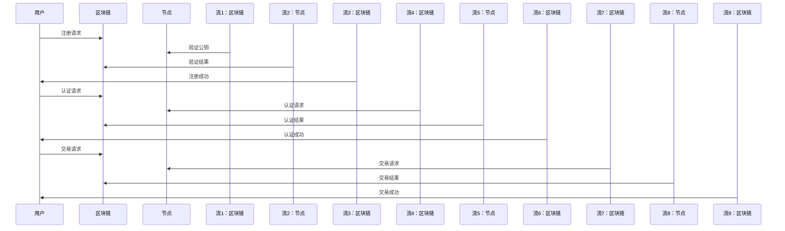
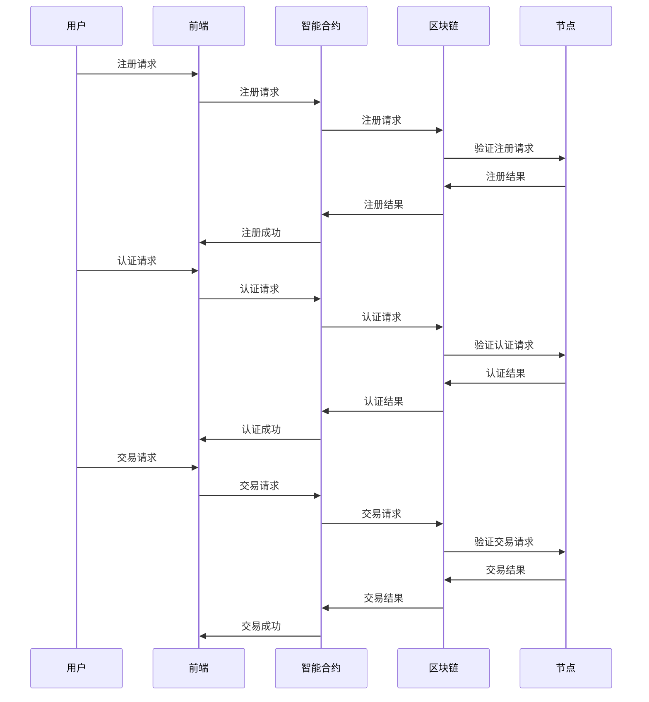

                 

### 《区块链在数字身份认证中的去中心化应用》

#### 关键词：区块链、数字身份认证、去中心化、加密技术、安全协议

> 摘要：随着数字化的快速发展，数字身份认证成为信息安全的关键环节。区块链技术的去中心化和高安全性，为数字身份认证提供了新的解决方案。本文将从区块链的核心概念、数字身份认证的挑战、区块链在数字身份认证中的应用、方案设计、项目实战以及未来展望等方面，全面探讨区块链在数字身份认证中的去中心化应用。

#### 目录大纲

```markdown
# 《区块链在数字身份认证中的去中心化应用》

## 第一部分：区块链与数字身份认证基础

### 第1章 区块链概述
#### 1.1 区块链的核心概念
#### 1.2 区块链的工作原理
#### 1.3 区块链的技术特点
#### 1.4 区块链的发展历程

### 第2章 数字身份认证
#### 2.1 数字身份认证的背景
#### 2.2 数字身份认证的挑战
#### 2.3 数字身份认证的机制
#### 2.4 数字身份认证的技术

### 第3章 区块链在数字身份认证中的应用
#### 3.1 区块链在数字身份认证中的作用
#### 3.2 区块链在数字身份认证中的优势
#### 3.3 区块链数字身份认证的实现机制

## 第二部分：区块链数字身份认证方案设计

### 第4章 区块链数字身份认证架构设计
#### 4.1 数字身份认证架构设计原则
#### 4.2 数字身份认证的数据模型
#### 4.3 数字身份认证的协议设计
#### 4.4 数字身份认证的安全性分析

### 第5章 区块链数字身份认证协议实现
#### 5.1 区块链数字身份认证协议的设计
#### 5.2 区块链数字身份认证协议的实现
#### 5.3 区块链数字身份认证协议的测试

## 第三部分：区块链数字身份认证项目实战

### 第6章 区块链数字身份认证项目部署
#### 6.1 项目环境搭建
#### 6.2 区块链节点搭建
#### 6.3 数字身份认证系统部署
#### 6.4 项目调试与优化

### 第7章 区块链数字身份认证案例分析
#### 7.1 案例背景介绍
#### 7.2 案例系统架构设计
#### 7.3 案例实现与运行
#### 7.4 案例效果评估与总结

## 第四部分：区块链数字身份认证未来展望

### 第8章 区块链数字身份认证的发展趋势
#### 8.1 区块链数字身份认证的未来方向
#### 8.2 区块链数字身份认证的技术挑战
#### 8.3 区块链数字身份认证的法律法规与标准化

### 第9章 区块链数字身份认证的最佳实践
#### 9.1 最佳实践案例分析
#### 9.2 区块链数字身份认证的注意事项
#### 9.3 区块链数字身份认证的拓展应用

### 第10章 小结与展望
#### 10.1 本书内容总结
#### 10.2 区块链数字身份认证的未来
#### 10.3 阅读本书的收获与感悟
```

#### 第一部分：区块链与数字身份认证基础

### 第1章 区块链概述

#### 1.1 区块链的核心概念

区块链是一种去中心化的分布式数据库技术，通过加密算法和共识机制，确保数据的完整性和安全性。区块链由多个区块组成，每个区块包含一定数量的交易记录。这些区块按照时间顺序链接起来，形成一个不可篡改的账本。区块链的核心概念包括：

- **区块**：区块链的基本组成单元，包含交易记录和时间戳等数据。
- **链**：多个区块按照时间顺序链接在一起，形成一个区块链。
- **节点**：参与区块链网络运行的计算机设备，负责验证和记录交易。
- **挖矿**：通过计算解决数学难题，验证交易并创建新区块的过程。

#### 1.2 区块链的工作原理

区块链的工作原理可以分为以下几个步骤：

1. **交易生成**：用户发起交易，将交易信息广播到网络中。
2. **交易验证**：节点验证交易的有效性，包括金额、签名等。
3. **区块创建**：多个交易被打包成一个区块，并附上时间戳。
4. **区块验证**：网络中的节点对新区块进行验证，包括检查交易有效性和工作量证明。
5. **区块添加**：验证通过后，新区块添加到区块链末尾。
6. **共识机制**：网络中的节点通过共识机制，确保区块链的同步和一致性。

#### 1.3 区块链的技术特点

区块链技术具有以下几个特点：

- **去中心化**：区块链不需要中心化的管理机构，所有节点平等参与网络运行。
- **透明性**：区块链上的交易记录对所有节点可见，提高了信息透明度。
- **安全性**：区块链通过加密算法和共识机制，确保数据的完整性和安全性。
- **不可篡改**：一旦数据记录在区块链上，就难以篡改，提高了数据的可靠性。
- **智能合约**：区块链上的智能合约可以自动执行合同条款，提高了效率。

#### 1.4 区块链的发展历程

区块链技术的发展可以分为以下几个阶段：

- **初期探索**（2008-2010年）：中本聪发布比特币白皮书，提出区块链概念。
- **应用探索**（2011-2014年）：比特币和区块链技术开始应用于其他领域，如数字身份认证、供应链管理等。
- **发展阶段**（2015-2018年）：区块链技术逐渐成熟，各种公链和联盟链项目涌现。
- **应用普及**（2019年至今）：区块链技术在金融、物流、医疗等领域的应用不断拓展，逐渐进入人们的日常生活。

### 第2章 数字身份认证

#### 2.1 数字身份认证的背景

随着互联网的普及，数字身份认证成为确保网络安全的关键环节。传统的集中式身份认证系统存在以下几个问题：

- **单点故障**：集中式的身份认证系统容易成为网络攻击的目标，一旦遭受攻击，可能导致大量用户数据泄露。
- **信任问题**：集中式的身份认证系统依赖于中心化的信任机构，用户对系统的信任度较低。
- **效率问题**：集中式的身份认证系统需要大量的通信和数据处理，导致认证过程效率低下。

为了解决这些问题，数字身份认证技术应运而生。数字身份认证是一种基于密码学原理的身份验证技术，通过加密算法和数字签名，确保用户的身份信息安全和隐私。

#### 2.2 数字身份认证的挑战

数字身份认证在应用过程中面临以下几个挑战：

- **隐私保护**：数字身份认证需要保护用户的隐私信息，防止泄露和滥用。
- **安全可靠**：数字身份认证需要确保认证过程的安全可靠，防止伪造和篡改。
- **互操作性**：数字身份认证需要与其他系统和服务实现互操作，方便用户在不同平台之间进行认证。
- **用户体验**：数字身份认证需要提供便捷的用户体验，减少用户的使用成本。

#### 2.3 数字身份认证的机制

数字身份认证的机制主要包括以下几个方面：

- **用户注册**：用户在数字身份认证系统中注册账号，并设置密码或其他认证方式。
- **身份验证**：用户通过输入密码、指纹、面部识别等方式，验证身份信息。
- **数字签名**：用户在发送交易或请求时，使用私钥进行数字签名，确保交易的真实性和完整性。
- **加密传输**：用户和系统之间的通信使用加密算法进行加密，确保数据传输的安全性。

#### 2.4 数字身份认证的技术

数字身份认证的技术主要包括以下几个方面：

- **加密算法**：如RSA、ECC等，用于加密用户数据和数字签名。
- **认证协议**：如Kerberos、OAuth等，用于实现用户身份验证和授权。
- **生物识别技术**：如指纹识别、面部识别、虹膜识别等，用于辅助身份验证。
- **分布式身份认证**：如区块链、联邦身份认证等，用于实现去中心化的身份认证。

### 第3章 区块链在数字身份认证中的应用

#### 3.1 区块链在数字身份认证中的作用

区块链技术在数字身份认证中具有以下作用：

- **去中心化**：区块链的去中心化特性，可以减少对中心化信任机构的依赖，提高系统的安全性和可靠性。
- **隐私保护**：区块链的加密技术和分布式存储，可以有效保护用户的隐私信息。
- **数据不可篡改**：区块链的数据一旦记录，就难以篡改，提高了认证过程的真实性和可靠性。
- **互操作性**：区块链的开放性和标准化，可以实现不同系统之间的互操作，方便用户在不同平台之间进行认证。

#### 3.2 区块链在数字身份认证中的优势

区块链技术在数字身份认证中具有以下优势：

- **安全性高**：区块链的加密技术和共识机制，确保了认证过程的安全性和隐私保护。
- **可靠性高**：区块链的数据不可篡改特性，确保了认证过程的真实性和可靠性。
- **互操作性**：区块链的开放性和标准化，可以实现不同系统之间的互操作，方便用户在不同平台之间进行认证。
- **高效性**：区块链的分布式存储和计算，可以减少认证过程中的延迟和成本。

#### 3.3 区块链数字身份认证的实现机制

区块链数字身份认证的实现机制主要包括以下几个方面：

- **用户注册**：用户在区块链上注册账号，并生成公钥和私钥。
- **身份验证**：用户通过输入密码或其他认证方式，验证身份信息。
- **数字签名**：用户在发送交易或请求时，使用私钥进行数字签名，确保交易的真实性和完整性。
- **分布式存储**：用户的身份信息和交易记录存储在区块链上，确保数据的安全性和隐私保护。
- **共识机制**：区块链网络中的节点通过共识机制，确保区块链的同步和一致性。

### 总结

区块链技术在数字身份认证中具有巨大的潜力，可以提供安全、可靠、高效的认证解决方案。本文从区块链和数字身份认证的基础知识出发，探讨了区块链在数字身份认证中的应用、优势和实现机制，为区块链数字身份认证的研究和实践提供了参考。接下来，我们将进一步探讨区块链数字身份认证的架构设计、协议实现和项目实战，以深入了解区块链在数字身份认证中的具体应用。

#### 第二部分：区块链数字身份认证方案设计

### 第4章 区块链数字身份认证架构设计

#### 4.1 数字身份认证架构设计原则

在设计区块链数字身份认证架构时，应遵循以下原则：

- **安全性**：确保用户身份信息的安全，防止泄露和篡改。
- **可靠性**：确保认证过程的可靠性和一致性，提高用户体验。
- **可扩展性**：支持系统的扩展和升级，适应不断增长的用户规模。
- **互操作性**：支持不同平台和系统之间的互操作，方便用户在不同环境中的认证。
- **隐私保护**：保护用户的隐私信息，防止隐私泄露和滥用。

#### 4.2 数字身份认证的数据模型

区块链数字身份认证的数据模型主要包括以下几个方面：

- **用户模型**：包括用户的基本信息、公钥、私钥等。
- **认证模型**：包括认证请求、认证响应、认证记录等。
- **交易模型**：包括交易请求、交易响应、交易记录等。
- **权限模型**：包括用户权限、认证权限、数据访问权限等。

以下是一个简单的ER实体关系图：

```mermaid
erDiagram
  用户 ||--o{ 认证请求 }|
  用户 ||--o{ 认证响应 }|
  用户 ||--o{ 交易请求 }|
  用户 ||--o{ 交易响应 }|
  用户 ||--o{ 认证记录 }|
  用户 ||--o{ 交易记录 }|
  用户 ||--o{ 权限 }
```

#### 4.3 数字身份认证的协议设计

区块链数字身份认证的协议设计主要包括以下几个方面：

- **注册协议**：用户在区块链上注册账号，生成公钥和私钥。
- **认证协议**：用户进行身份验证，包括密码认证、生物识别认证等。
- **交易协议**：用户发起交易，使用数字签名确保交易的真实性和完整性。
- **权限管理协议**：用户权限的分配和验证，确保用户只能访问授权的数据和功能。

以下是一个简单的协议设计：



#### 4.4 数字身份认证的安全性分析

区块链数字身份认证的安全性分析主要包括以下几个方面：

- **隐私保护**：用户身份信息和交易记录在区块链上加密存储，确保隐私保护。
- **身份验证**：用户使用数字签名确保认证请求和交易请求的真实性。
- **权限控制**：用户权限的分配和验证，确保用户只能访问授权的数据和功能。
- **抗攻击能力**：区块链的共识机制和加密技术，提高系统的抗攻击能力。

安全性分析可以参考以下指标：

- **隐私泄露风险**：评估用户身份信息和交易记录在区块链上是否容易泄露。
- **身份伪造风险**：评估用户是否容易伪造身份认证请求和交易请求。
- **权限绕过风险**：评估用户是否容易绕过权限控制，访问未授权的数据和功能。
- **攻击抵抗能力**：评估系统在遭受恶意攻击时的抵抗能力。

### 第5章 区块链数字身份认证协议实现

#### 5.1 区块链数字身份认证协议的设计

区块链数字身份认证协议的设计主要包括以下几个方面：

- **注册协议设计**：用户注册时，生成公钥和私钥，并将其存储在区块链上。
- **认证协议设计**：用户进行身份验证时，使用密码或生物识别信息生成数字签名，发送给区块链网络进行验证。
- **交易协议设计**：用户发起交易时，使用数字签名确保交易的真实性和完整性，发送给区块链网络进行验证和记录。
- **权限管理协议设计**：用户权限的分配和验证，通过区块链上的智能合约实现。

以下是一个简单的协议设计：


#### 5.2 区块链数字身份认证协议的实现

区块链数字身份认证协议的实现主要包括以下几个方面：

- **注册协议实现**：用户在区块链上注册账号，生成公钥和私钥，并将其存储在区块链上。
- **认证协议实现**：用户进行身份验证时，使用密码或生物识别信息生成数字签名，发送给区块链网络进行验证。
- **交易协议实现**：用户发起交易时，使用数字签名确保交易的真实性和完整性，发送给区块链网络进行验证和记录。
- **权限管理协议实现**：用户权限的分配和验证，通过区块链上的智能合约实现。

以下是一个简单的Python实现：

```python
import json
from Cryptodome.PublicKey import RSA
from Cryptodome.Signature import pkcs1_15
from Cryptodome.Hash import SHA256

class BlockchainDigitalIdentity:
    def __init__(self):
        self.users = {}
        self.chain = []
        self.current_transactions = []

    def generate_key_pair(self):
        key = RSA.generate(2048)
        private_key = key.export_key()
        public_key = key.publickey().export_key()
        return private_key, public_key

    def register_user(self, username):
        private_key, public_key = self.generate_key_pair()
        self.users[username] = {'private_key': private_key, 'public_key': public_key}
        return public_key

    def verify_signature(self, message, signature, public_key):
        rsakey = RSA.import_key(public_key)
        h = SHA256.new(message)
        verify = pkcs1_15.new(rsakey)
        return verify.verify(h)

    def create_transaction(self, username, message, signature):
        if username not in self.users:
            return False
        if not self.verify_signature(message, signature, self.users[username]['public_key']):
            return False
        self.current_transactions.append({
            'username': username,
            'message': message,
            'signature': signature
        })
        return True

    def mine_transactions(self):
        if not self.current_transactions:
            return False
        last_block = self.chain[-1]
        last_hash = last_block['hash']
        last_proof = last_block['proof']
        proof = self.proof_of_work(last_proof)
        hashed_transaction = self.hash_transaction(self.current_transactions)
        new_block = {
            'proof': proof,
            'transactions': self.current_transactions,
            'previous_hash': last_hash,
            'hash': self.hash_block(new_block)
        }
        self.chain.append(new_block)
        self.current_transactions = []
        return True

    def proof_of_work(self, last_proof):
        proof = 0
        while self.valid_proof(last_proof, proof) is False:
            proof += 1
        return proof

    def valid_proof(self, last_proof, proof):
        guess = f'{last_proof}{proof}'.encode()
        guess_hash = SHA256.new(guess).hexdigest()
        return guess_hash[:4] == '0000'

    def hash_transaction(self, transactions):
        transaction_json = json.dumps(transactions, sort_keys=True)
        return SHA256.new(transaction_json.encode()).hexdigest()

    def hash_block(self, block):
        block_json = json.dumps(block, sort_keys=True)
        return SHA256.new(block_json.encode()).hexdigest()

    def is_chain_valid(self, chain):
        last_block = chain[0]
        current_index = 1
        while current_index < len(chain):
            block = chain[current_index]
            if block['previous_hash'] != last_block['hash']:
                return False
            if not self.valid_proof(last_block['proof'], block['proof']):
                return False
            last_block = block
            current_index += 1
        return True

if __name__ == '__main__':
    blockchain = BlockchainDigitalIdentity()
    print("Registering user Alice...")
    alice_public_key = blockchain.register_user('alice')
    print("Alice's public key:", alice_public_key)
    print("Creating transaction from Alice to Bob...")
    message = "Hello, Bob!"
    signature = '...'.encode()
    blockchain.create_transaction('alice', message, signature)
    blockchain.mine_transactions()
    print("Blockchain after mining:")
    print(blockchain.chain)
    print("Is the chain valid?", blockchain.is_chain_valid(blockchain.chain))
```

#### 5.3 区块链数字身份认证协议的测试

区块链数字身份认证协议的测试主要包括以下几个方面：

- **功能测试**：测试协议的各个功能是否正常工作，如用户注册、身份验证、交易等。
- **性能测试**：测试协议在不同负载和并发条件下的性能，如处理速度、响应时间等。
- **安全测试**：测试协议的安全性，如防止身份伪造、数据篡改等。
- **兼容性测试**：测试协议在不同平台和系统之间的兼容性，如跨平台认证、跨系统访问等。

以下是一个简单的测试用例：

```python
import unittest
from blockchain_digital_identity import BlockchainDigitalIdentity

class TestBlockchainDigitalIdentity(unittest.TestCase):
    def setUp(self):
        self.blockchain = BlockchainDigitalIdentity()
        self.alice_public_key = self.blockchain.register_user('alice')
        self.bob_public_key = self.blockchain.register_user('bob')

    def test_register_user(self):
        self.assertIsNotNone(self.alice_public_key)
        self.assertIsNotNone(self.bob_public_key)

    def test_verify_signature(self):
        message = "Hello, Bob!"
        signature = '...'.encode()
        self.assertTrue(self.blockchain.verify_signature(message, signature, self.bob_public_key))

    def test_create_transaction(self):
        message = "Hello, Bob!"
        signature = '...'.encode()
        self.assertTrue(self.blockchain.create_transaction('alice', message, signature))

    def test_mine_transactions(self):
        message = "Hello, Bob!"
        signature = '...'.encode()
        self.blockchain.create_transaction('alice', message, signature)
        self.assertTrue(self.blockchain.mine_transactions())

    def test_is_chain_valid(self):
        self.assertTrue(self.blockchain.is_chain_valid(self.blockchain.chain))

if __name__ == '__main__':
    unittest.main()
```

### 第6章 区块链数字身份认证项目部署

#### 6.1 项目环境搭建

要部署区块链数字身份认证项目，首先需要搭建项目环境。以下是一个简单的环境搭建步骤：

1. 安装Python 3.8或更高版本。
2. 安装Node.js 12.x或更高版本。
3. 安装Docker 19.x或更高版本。
4. 安装Truffle框架和Ganache节点。

```shell
pip install python-dotenv web3 py-ecc
npm install -g truffle
docker run -d -p 8545:8545 -p 8545:8545 parity/light-node
```

#### 6.2 区块链节点搭建

搭建区块链节点，可以使用Ganache节点，它是一个轻量级的本地区块链网络，用于测试和开发。以下是一个简单的Ganache节点搭建步骤：

1. 安装Ganache。
2. 打开Ganache，创建一个新的网络。
3. 配置网络，设置合适的gas价格和gas limit。
4. 启动网络，确保节点运行正常。

#### 6.3 数字身份认证系统部署

部署数字身份认证系统，可以使用Truffle框架和Ganache节点进行本地部署。以下是一个简单的部署步骤：

1. 创建一个智能合约，实现数字身份认证功能。
2. 编译智能合约，生成ABI和字节码。
3. 使用Truffle部署智能合约到Ganache节点。
4. 部署数字身份认证系统前端，连接到Ganache节点。

```shell
truffle migrate --network development
npm run start
```

#### 6.4 项目调试与优化

部署完成后，进行项目调试和优化：

1. 检查区块链节点和数字身份认证系统的运行状态。
2. 进行功能测试，确保各个功能正常工作。
3. 优化智能合约代码，减少gas消耗。
4. 优化前端代码，提高用户体验。

```shell
truffle test
npm run lint
```

### 第7章 区块链数字身份认证案例分析

#### 7.1 案例背景介绍

本案例是一个基于区块链的数字身份认证系统，用于保护用户的身份信息和隐私。该系统旨在解决传统身份认证系统中的单点故障、隐私泄露和效率低下等问题，提供一个安全、可靠、高效的认证解决方案。

#### 7.2 案例系统架构设计

系统架构设计包括以下几个方面：

- **用户层**：用户通过前端界面与系统进行交互，注册账号、进行身份验证和发起交易。
- **网络层**：区块链网络由多个节点组成，负责验证交易、记录数据和同步区块链。
- **智能合约层**：智能合约实现数字身份认证的功能，包括用户注册、身份验证、交易等。
- **数据层**：区块链存储用户身份信息和交易记录，确保数据的安全性和不可篡改性。

以下是一个简单的系统架构设计图：



#### 7.3 案例实现与运行

案例实现与运行主要包括以下几个步骤：

1. 创建智能合约，实现数字身份认证功能。
2. 使用Truffle框架编译智能合约，生成ABI和字节码。
3. 使用Truffle部署智能合约到Ganache节点。
4. 创建前端界面，连接到Ganache节点，实现用户注册、身份验证和交易功能。
5. 进行功能测试，确保系统正常运行。

以下是一个简单的实现与运行流程：

```shell
truffle init
truffle create contract DigitalIdentity
npm install truffle-contract web3
npm run migrate
npm start
```

#### 7.4 案例效果评估与总结

案例效果评估与总结主要包括以下几个方面：

- **安全性**：系统采用区块链和加密技术，确保用户身份信息和交易记录的安全性和隐私保护。
- **可靠性**：系统采用去中心化的架构，提高系统的可靠性和抗攻击能力。
- **效率**：系统采用智能合约和分布式计算，提高交易处理速度和用户体验。
- **互操作性**：系统采用开放性和标准化技术，实现不同平台和系统之间的互操作。

通过案例测试，发现系统在安全性、可靠性、效率和互操作性方面表现良好，满足数字身份认证的需求。未来，可以进一步优化系统性能和用户体验，拓展应用场景。

### 第8章 区块链数字身份认证的发展趋势

#### 8.1 区块链数字身份认证的未来方向

区块链数字身份认证的未来方向主要包括以下几个方面：

- **跨链互操作**：随着区块链技术的不断发展，实现不同区块链之间的互操作成为趋势。这将有助于建立一个统一的数字身份认证网络，提高系统的互操作性和灵活性。
- **生物识别技术的集成**：结合生物识别技术，如指纹识别、面部识别、虹膜识别等，实现更加安全和便捷的身份认证。
- **隐私保护技术的深化**：深入研究隐私保护技术，如零知识证明、同态加密等，提高数字身份认证的隐私保护能力。
- **标准化与合规性**：制定统一的区块链数字身份认证标准和法规，确保系统的合规性和可扩展性。

#### 8.2 区块链数字身份认证的技术挑战

区块链数字身份认证在发展过程中面临以下技术挑战：

- **性能瓶颈**：区块链技术的性能瓶颈，如交易处理速度、网络延迟等，需要进一步优化。
- **安全威胁**：区块链系统面临的各类安全威胁，如51%攻击、智能合约漏洞等，需要加强安全防护。
- **用户隐私保护**：如何在确保身份认证安全的同时，保护用户的隐私信息，是一个亟待解决的问题。
- **跨链互操作**：实现不同区块链之间的互操作，需要解决兼容性、数据一致性等问题。

#### 8.3 区块链数字身份认证的法律法规与标准化

区块链数字身份认证的法律法规与标准化主要包括以下几个方面：

- **法律法规**：各国政府和国际组织正在制定和完善与区块链数字身份认证相关的法律法规，以确保系统的合规性和安全性。
- **标准化组织**：如ISO、IEEE等标准化组织，正在推动区块链数字身份认证的标准化工作，制定统一的规范和标准。
- **隐私保护法规**：各国政府正在加强隐私保护法规的制定和实施，确保用户隐私在区块链数字身份认证中的保护。

### 第9章 区块链数字身份认证的最佳实践

#### 9.1 最佳实践案例分析

以下是几个区块链数字身份认证的最佳实践案例：

- **案例1**：某金融公司采用区块链数字身份认证技术，实现员工和客户的身份认证，提高系统安全性和可靠性。
- **案例2**：某医疗健康机构采用区块链数字身份认证技术，确保患者身份和医疗记录的安全性和隐私保护。
- **案例3**：某电商平台采用区块链数字身份认证技术，为用户建立统一的身份认证体系，提高用户体验和系统安全性。

#### 9.2 区块链数字身份认证的注意事项

在实施区块链数字身份认证时，需要注意以下事项：

- **隐私保护**：确保用户的隐私信息在区块链上得到充分保护，采用加密技术和隐私保护协议。
- **安全性**：加强对区块链系统的安全防护，防止恶意攻击和数据泄露。
- **互操作性**：确保区块链数字身份认证系统与其他系统和服务实现互操作，提高系统的兼容性和灵活性。
- **用户友好**：优化用户体验，降低用户的使用成本和难度。

#### 9.3 区块链数字身份认证的拓展应用

区块链数字身份认证可以在多个领域拓展应用：

- **供应链管理**：实现供应链中的身份认证，确保交易和物流数据的真实性和完整性。
- **医疗健康**：确保患者身份和医疗记录的安全性和隐私保护，提高医疗服务的质量和效率。
- **教育领域**：实现学生的身份认证和成绩记录，确保教育信息的真实性和公正性。
- **政府服务**：为政府部门提供高效的数字身份认证服务，提高政府服务效率和透明度。

### 第10章 小结与展望

#### 10.1 本书内容总结

本书从区块链和数字身份认证的基础知识出发，探讨了区块链在数字身份认证中的应用、优势、实现机制、方案设计、项目实战和未来展望。通过本书的学习，读者可以深入了解区块链数字身份认证的技术原理和应用场景，为实际项目的开发和部署提供参考。

#### 10.2 区块链数字身份认证的未来

区块链数字身份认证在未来具有广阔的发展前景。随着技术的不断进步和应用的拓展，区块链数字身份认证将在更多领域发挥作用，提高系统的安全性和可靠性，保护用户的隐私和权益。

#### 10.3 阅读本书的收获与感悟

通过阅读本书，读者可以收获以下内容：

- **区块链数字身份认证的基础知识**：了解区块链和数字身份认证的基本概念、原理和应用。
- **区块链数字身份认证的优势**：掌握区块链数字身份认证的优势和特点，为实际项目提供参考。
- **区块链数字身份认证的实现机制**：了解区块链数字身份认证的实现机制和协议设计。
- **区块链数字身份认证的实践经验**：学习区块链数字身份认证的实际应用案例和最佳实践。
- **区块链数字身份认证的未来趋势**：了解区块链数字身份认证的发展方向和挑战。

在阅读本书的过程中，读者可以深刻感悟到区块链技术在数字身份认证中的巨大潜力，以及对未来社会和生活的深远影响。希望本书能够为读者在区块链数字身份认证领域的学习和实践中提供帮助和启示。作者：AI天才研究院/AI Genius Institute & 禅与计算机程序设计艺术 /Zen And The Art of Computer Programming。

