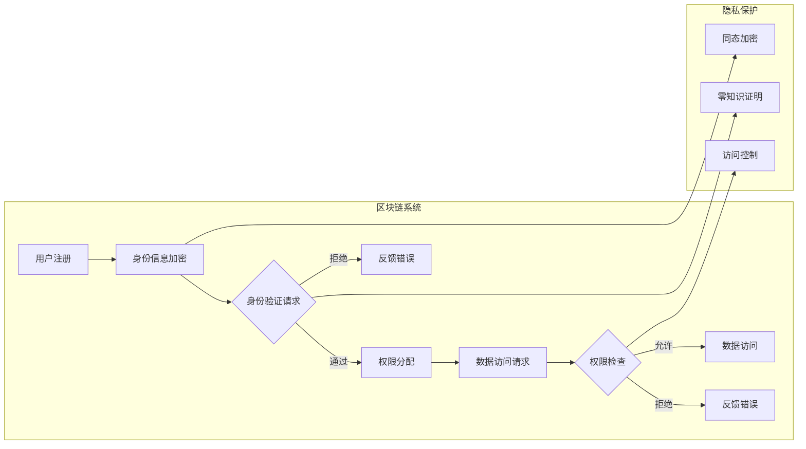
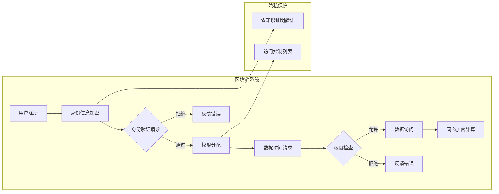
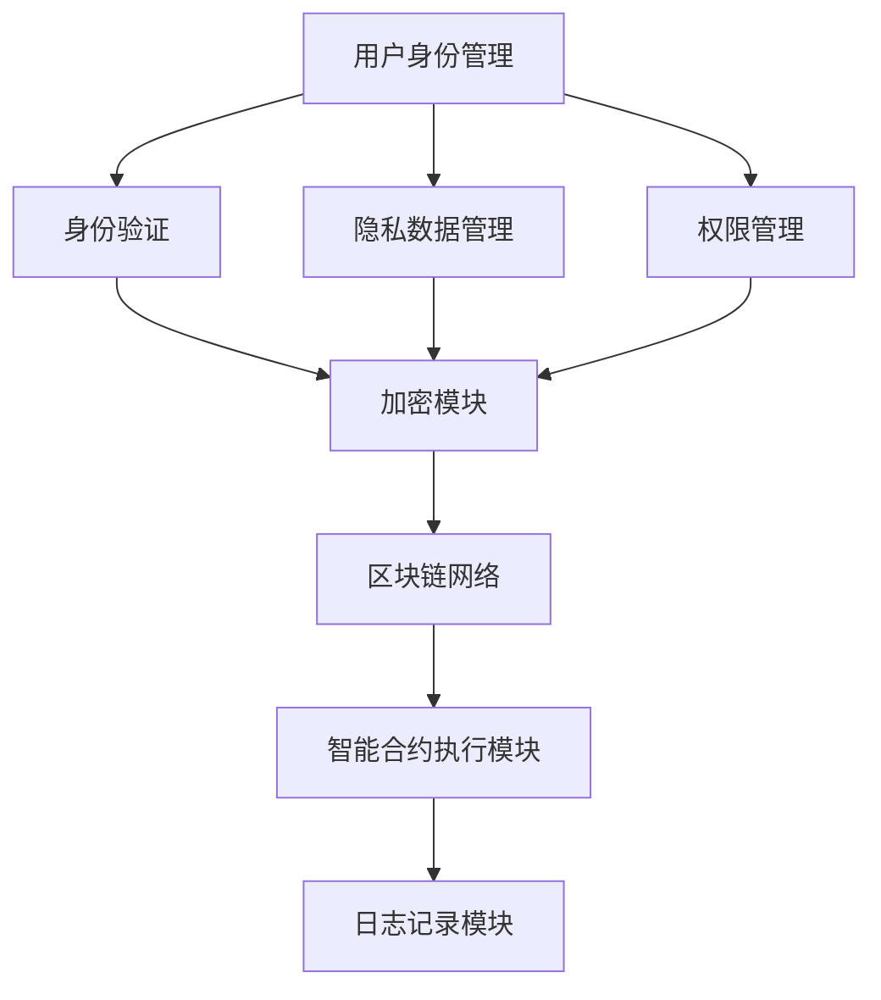
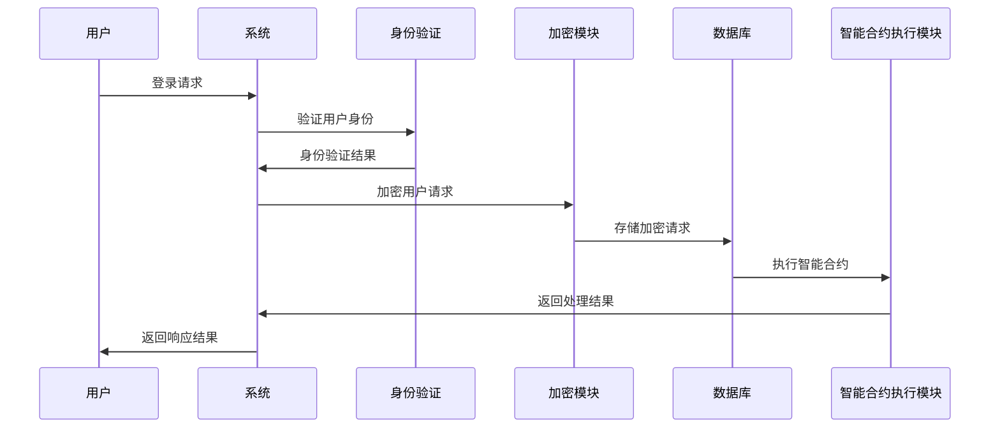
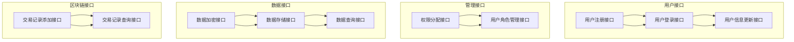
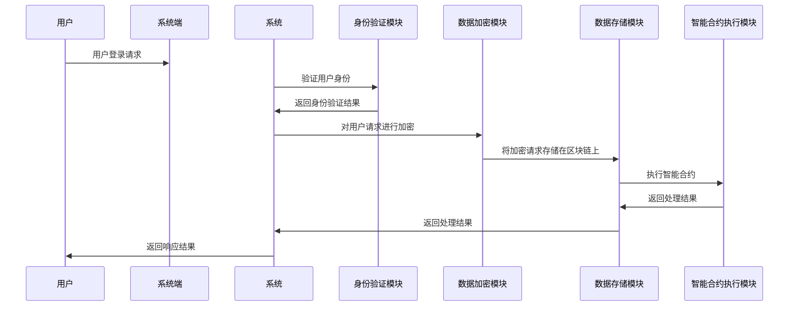

                 

### 文章标题

《区块链在数字身份隐私保护中的新模式》

### 关键词

区块链，数字身份，隐私保护，智能合约，加密算法，分布式账本，去中心化

### 摘要

本文将深入探讨区块链技术在数字身份隐私保护中的应用模式。通过对区块链基本原理的讲解，以及与数字身份隐私保护技术的对比分析，本文将展示区块链在提升数字身份隐私保护方面的独特优势。文章将详细描述区块链在数字身份管理中的智能合约设计、隐私保护算法的应用，并通过实例说明这些技术如何在实际系统中发挥作用。最后，本文还将讨论区块链在数字身份隐私保护中的最佳实践、注意事项以及未来拓展方向。

### 目录大纲

#### 第一部分：背景介绍

1. **问题背景**  
   - 数字身份隐私保护的重要性  
   - 当前数字身份隐私保护面临的挑战

2. **区块链技术概述**  
   - 区块链的定义和基本原理  
   - 区块链的核心特点与应用领域

3. **区块链在数字身份隐私保护中的应用前景**  
   - 区块链技术在数字身份隐私保护中的潜在优势  
   - 区块链技术面临的挑战与解决途径

#### 第二部分：核心概念与联系

1. **数字身份**

   - 数字身份的定义与作用  
   - 数字身份的分类与特点

2. **隐私保护**

   - 隐私保护的概念与重要性  
   - 隐私保护的常见方法与技术

3. **区块链与数字身份隐私保护的联系**  
   - 区块链在数字身份隐私保护中的作用机制  
   - 区块链与数字身份隐私保护技术的结合方式

4. **概念属性特征对比表格**  
   - 数字身份与隐私保护技术的对比分析  
   - 区块链与数字身份隐私保护技术的对比分析

5. **ER实体关系图架构**  
   - 数字身份隐私保护系统实体关系图  
   - 区块链在数字身份隐私保护中的应用架构图

#### 第三部分：算法原理讲解

1. **区块链在数字身份隐私保护中的应用算法**

   - 智能合约设计  
     - 智能合约的定义与功能  
     - 智能合约在数字身份隐私保护中的应用

   - 隐私保护算法  
     - 隐私保护算法的分类与原理  
     - 隐私保护算法在区块链上的实现与应用

2. **算法流程图**

   - 数字身份隐私保护算法流程图  
   - 区块链在数字身份隐私保护中的应用算法流程图

3. **算法原理与数学模型**

   - 数学模型  
     - 隐私保护算法的数学模型  
     - 数字身份隐私保护系统的数学模型

   - 公式与解释  
     - 隐私保护算法的核心公式及其解释  
     - 数字身份隐私保护系统的数学公式及其解释

4. **算法举例说明**

   - 隐私保护算法的实际案例  
   - 区块链在数字身份隐私保护中的应用案例

#### 第四部分：系统分析与架构设计

1. **问题场景介绍**

   - 数字身份隐私保护问题场景描述  
   - 区块链在数字身份隐私保护中的应用场景

2. **系统架构设计**

   - 系统功能设计  
     - 系统功能模块划分  
     - 领域模型类图

   - 系统架构设计  
     - 系统架构设计思路  
     - 系统架构图

   - 系统接口设计  
     - 系统接口设计原则  
     - 系统接口设计图

   - 系统交互  
     - 系统交互流程图  
     - 系统交互详细说明

#### 第五部分：项目实战

1. **环境安装**

   - 区块链开发环境的安装步骤  
   - 数字身份隐私保护系统的环境配置

2. **系统核心实现**

   - 核心模块源代码  
     - 数字身份管理模块代码  
     - 隐私保护模块代码  
     - 区块链接口模块代码

   - 代码应用解读与分析  
     - 数字身份管理模块应用解读  
     - 隐私保护模块应用解读  
     - 区块链接口模块应用解读

3. **实际案例分析与讲解**

   - 数字身份隐私保护应用案例  
   - 区块链在数字身份隐私保护中的实际案例分析  
   - 案例详细讲解与剖析

4. **项目小结**

   - 项目成果总结  
   - 项目经验与教训

#### 第六部分：最佳实践、小结、注意事项与拓展阅读

1. **最佳实践**

   - 数字身份隐私保护的最佳实践  
   - 区块链在数字身份隐私保护中的应用最佳实践

2. **小结**

   - 对数字身份隐私保护与区块链技术结合的总结

3. **注意事项**

   - 在实际应用中需要注意的问题和风险

4. **拓展阅读**

   - 数字身份隐私保护与区块链技术的最新研究动态  
   - 推荐的参考资料与阅读材料

### 引言

数字身份作为现代社会不可或缺的一部分，已经成为人们日常生活和工作中必不可少的存在。然而，随着互联网和大数据技术的飞速发展，数字身份隐私保护面临着前所未有的挑战。传统中心化的身份认证系统在保护用户隐私方面存在诸多不足，数据泄露、身份盗用等问题屡见不鲜。为了解决这些问题，研究者们积极探索新的技术手段，区块链技术因其去中心化、不可篡改等特性，成为数字身份隐私保护的重要选择。

本文旨在深入探讨区块链技术在数字身份隐私保护中的应用模式。首先，我们将介绍数字身份隐私保护的问题背景，分析当前面临的挑战；接着，我们会概述区块链技术的基本原理和特点，探讨其在数字身份隐私保护中的潜在应用前景。随后，我们将详细探讨数字身份和隐私保护的核心概念，并分析区块链与这些技术的联系。在此基础上，我们将介绍区块链在数字身份隐私保护中的应用算法，包括智能合约设计和隐私保护算法的原理和实现。文章还将通过具体的系统架构设计和项目实战案例，展示区块链技术在数字身份隐私保护中的实际应用。最后，我们将总结最佳实践，指出注意事项，并展望未来区块链在数字身份隐私保护领域的拓展方向。

#### 第一部分：背景介绍

##### 第1章 问题背景

数字身份作为现代社会的基础设施，已经深入到人们日常生活的方方面面。从社交媒体、电子商务到金融服务、医疗保健，几乎每个领域都需要数字身份的参与。数字身份不仅用于验证用户的身份，还承载了用户的个人信息、行为记录、信用评级等重要数据。因此，数字身份隐私保护的重要性不言而喻。

然而，当前数字身份隐私保护面临着诸多挑战。首先，传统的中心化身份认证系统存在显著的安全漏洞。中心化系统通常依赖于单一服务器或数据库，一旦这些服务器或数据库遭受攻击，用户的个人信息可能被大规模泄露。此外，中心化系统中的数据管理通常不够透明，用户难以了解自己的数据如何被使用。

其次，随着大数据和人工智能技术的发展，数据的价值日益凸显。然而，这也带来了数据滥用和隐私泄露的风险。未经用户同意，企业或第三方可能获取并滥用用户的个人信息，用于商业利益或其他不正当用途。

最后，用户对隐私保护的意识普遍不足。许多用户在使用互联网服务时，对于隐私保护的重要性认识不足，忽视了隐私设置的重要性，导致个人信息容易被获取和利用。

为了应对这些挑战，必须寻找新的解决方案，以提升数字身份的隐私保护能力。区块链技术以其去中心化、不可篡改、透明度高等特性，成为数字身份隐私保护的重要选择。接下来，我们将深入探讨区块链技术的基本原理和应用场景。

##### 第2章 区块链技术概述

区块链技术是一种分布式数据库技术，通过加密算法和共识机制，实现了数据的分布式存储和验证。区块链的每一笔交易都记录在一个区块中，多个区块按照时间顺序串联形成链，从而保证了数据的不可篡改性和透明度。

区块链的基本原理包括以下几部分：

1. **分布式账本**：区块链通过多个节点共同维护一个分布式账本，每个节点都保存了一份完整的账本副本。这种分布式存储方式使得数据不再依赖于单一中心化服务器，从而提高了系统的容错能力和抗攻击能力。

2. **加密算法**：区块链使用加密算法对数据进行加密和签名，确保数据在传输和存储过程中不被篡改。同时，通过公私钥对数据进行签名和验证，保证了数据的真实性和安全性。

3. **共识机制**：区块链节点通过共识机制达成共识，确认交易的合法性和账本的一致性。常见的共识机制包括工作量证明（PoW）、权益证明（PoS）和委托权益证明（DPoS）等。

区块链的核心特点包括：

1. **去中心化**：区块链通过分布式账本和共识机制，实现了去中心化的数据管理和验证，不再依赖于单一中心化机构。

2. **不可篡改性**：由于区块链的加密算法和共识机制，一旦数据被记录在区块链上，就几乎无法被篡改，保证了数据的真实性和可靠性。

3. **透明度**：区块链上的数据对所有节点都是可见的，用户可以实时查看和验证数据的真实性，提高了数据的透明度。

4. **安全性**：区块链通过加密算法和共识机制，确保了数据在传输和存储过程中的安全性，有效防止了数据泄露和篡改。

区块链的应用领域广泛，包括：

1. **金融领域**：区块链在金融领域的应用最为广泛，包括数字货币、跨境支付、供应链金融等。通过区块链技术，可以实现高效、安全、透明的金融交易。

2. **供应链管理**：区块链技术可以追踪供应链中的每一个环节，确保产品的真实性和质量，提高供应链的透明度和效率。

3. **身份认证**：区块链技术可以用于数字身份认证，通过分布式账本和加密算法，实现安全的身份验证和数据管理。

4. **医疗保健**：区块链技术可以用于医疗数据的管理和共享，确保患者隐私保护的同时，提高医疗数据的可靠性和安全性。

5. **智能合约**：区块链技术中的智能合约能够自动执行合同条款，减少了中介机构的介入，提高了交易效率。

##### 第3章 区块链在数字身份隐私保护中的应用前景

区块链技术在数字身份隐私保护中具有巨大的应用前景，其独特优势为解决当前数字身份隐私保护面临的挑战提供了新的可能性。

首先，区块链的去中心化特性能够有效减少对中心化身份认证系统的依赖。传统中心化系统中的数据管理和验证依赖于单一服务器或数据库，这使得系统容易成为黑客攻击的目标。而去中心化的区块链网络通过多个节点共同维护账本，提高了系统的容错能力和抗攻击能力，从而减少了单点故障和中心化攻击的风险。

其次，区块链的不可篡改性为数字身份信息的真实性提供了保障。一旦用户的数字身份信息被记录在区块链上，就几乎无法被篡改。这意味着用户的个人信息在区块链上的记录是可信的，减少了身份盗用和数据篡改的风险。

此外，区块链的透明度特性有助于提高数据管理的透明度和可追溯性。区块链上的数据对所有节点都是可见的，用户可以实时查看和验证数据的真实性。这不仅提高了数据透明度，还为违规行为的追踪和取证提供了便利。

区块链技术在数字身份隐私保护中面临的挑战主要包括：

1. **性能问题**：区块链网络的扩展性和性能相较于传统的中心化系统还有待提高。特别是在处理大量交易时，区块链网络的延迟和吞吐量可能会成为瓶颈。

2. **隐私保护**：虽然区块链的透明度有助于提高数据的可信度，但同时也可能暴露用户的隐私信息。如何在保证透明度的同时，保护用户的隐私，是区块链在数字身份隐私保护中需要解决的一个重要问题。

3. **法律和监管**：区块链技术的去中心化特性使得监管和法律法规的制定变得更加复杂。如何在保护用户隐私的前提下，确保区块链技术在法律框架内运行，是区块链在数字身份隐私保护中需要考虑的一个重要方面。

为了应对这些挑战，研究者们正在探索各种解决方案：

1. **优化区块链性能**：通过改进共识机制、优化数据结构和网络拓扑结构等方式，提高区块链网络的性能和扩展性。

2. **隐私保护技术**：结合零知识证明、同态加密、秘密共享等隐私保护技术，确保用户隐私在区块链上的安全。

3. **法律和监管框架**：制定适应区块链技术的法律法规，明确监管范围和责任，为区块链技术的应用提供法律保障。

总体而言，区块链技术在数字身份隐私保护中具有巨大的应用潜力。通过不断优化和解决现有挑战，区块链有望成为未来数字身份隐私保护的重要技术手段。

##### 第4章 核心概念

**数字身份**

数字身份是指个人在数字世界中的唯一标识，用于在互联网上进行身份验证和访问控制。数字身份不仅包括用户的个人信息，如姓名、地址、电话号码等，还包括行为记录、信用评分等综合信息。数字身份的作用在于简化用户在多个数字平台之间的身份验证过程，提高用户体验。

数字身份可以分为以下几种类型：

1. **单点登录（SSO）**：通过一个统一的身份认证系统，用户可以在多个不同的应用和服务之间实现单点登录，简化登录过程。
2. **匿名身份**：用户可以选择不提供真实身份信息，而是使用匿名身份进行在线活动，以保护个人隐私。
3. **代理身份**：在某些场景下，用户可以使用代理身份代表自己进行特定操作，如银行代理服务。

**隐私保护**

隐私保护是指采取措施确保个人数据不被未经授权的第三方获取、使用或泄露。隐私保护对于数字身份至关重要，因为数字身份信息通常包含敏感的个人数据。隐私保护的重要性体现在以下几个方面：

1. **数据安全**：确保存储和传输中的个人数据不被未经授权的第三方获取或篡改。
2. **数据匿名化**：通过技术手段使个人数据无法直接关联到特定个体，从而保护隐私。
3. **透明度**：用户有权了解自己的数据如何被使用，并能够控制数据的使用权限。

常见的隐私保护方法和技术包括：

1. **加密**：通过加密算法对数据进行加密，确保数据在传输和存储过程中不被窃取或泄露。
2. **访问控制**：通过设置权限规则，确保只有授权用户才能访问特定数据。
3. **匿名化技术**：如差分隐私、同态加密等，通过技术手段使数据匿名化，保护用户隐私。

**区块链与数字身份隐私保护的联系**

区块链技术与数字身份隐私保护有着密切的联系，主要体现在以下几个方面：

1. **去中心化身份验证**：区块链的去中心化特性可以替代传统的中心化身份验证系统，实现更安全、更可靠的身份验证。
2. **不可篡改的记录**：区块链上的数据一旦记录，就几乎无法被篡改，这为数字身份信息的可信性提供了保障。
3. **透明度和可追溯性**：区块链上的数据对所有节点都是透明的，用户可以实时查看和验证数据的真实性，提高了数据管理的透明度和可追溯性。

区块链与数字身份隐私保护技术的结合方式：

1. **智能合约**：通过智能合约，可以自动执行身份验证、授权管理等功能，减少人工干预，提高系统效率。
2. **分布式身份验证**：利用区块链的分布式账本，实现多个机构之间的身份验证，确保数据的真实性。
3. **隐私保护技术**：结合零知识证明、同态加密等隐私保护技术，确保用户隐私在区块链上的安全。

**概念属性特征对比表格**

| 特征        | 数字身份 | 隐私保护 |
| ----------- | -------- | -------- |
| 定义        | 数字世界的唯一标识 | 保护个人数据不被未经授权访问 |
| 类型        | 单点登录、匿名身份、代理身份 | 加密、访问控制、匿名化技术 |
| 目的        | 简化身份验证过程 | 保护用户隐私 |
| 关联技术     | 身份认证、加密算法 | 同态加密、零知识证明 |
| 在区块链中的应用 | 去中心化身份验证 | 不可篡改的记录、分布式身份验证 |

**ER实体关系图架构**

以下是一个简化的数字身份隐私保护系统实体关系图：

```mermaid
erDiagram
  User ||--|{ DigitalIdentity }|--|
  DigitalIdentity ||--|{ PrivacyPolicy }|--|
  PrivacyPolicy ||--|{ EncryptionAlgorithm }|--|
  User ||--|{ AccessControl }|--|
```

- **User（用户）**：数字身份和隐私策略的拥有者。
- **DigitalIdentity（数字身份）**：记录用户的基本信息和行为记录。
- **PrivacyPolicy（隐私策略）**：定义用户隐私保护的具体规则和策略。
- **EncryptionAlgorithm（加密算法）**：用于保护用户数据的加密方法。
- **AccessControl（访问控制）**：管理用户数据的访问权限。

该实体关系图展示了数字身份、隐私策略、加密算法和访问控制之间的关联关系，为系统设计提供了基础。

#### 第5章 区块链在数字身份隐私保护中的应用算法

区块链技术在数字身份隐私保护中的应用主要体现在智能合约设计和隐私保护算法的实现。以下将详细介绍这些应用算法，并解释其工作原理。

**5.1 智能合约设计**

智能合约是基于区块链技术的一种自动化协议，能够自动执行合同条款，无需依赖中介机构。在数字身份隐私保护中，智能合约用于管理用户身份信息和隐私权限。

**智能合约的定义与功能**

智能合约是一段嵌在区块链上的代码，它能够在满足特定条件时自动执行特定的操作。智能合约的主要功能包括：

1. **身份验证**：智能合约可以验证用户的身份，确保只有授权用户才能访问敏感信息。
2. **权限管理**：智能合约可以管理用户的隐私权限，控制哪些用户或应用可以访问特定数据。
3. **自动执行**：智能合约能够自动执行预先设定的操作，如支付、数据共享等。

**智能合约在数字身份隐私保护中的应用**

在数字身份隐私保护中，智能合约可用于实现以下功能：

1. **身份验证**：用户通过智能合约进行身份验证，确保系统中的身份信息是可信的。
2. **隐私权限管理**：智能合约可以根据用户设置和权限规则，控制数据的访问权限，防止未经授权的数据泄露。
3. **隐私权限转移**：用户可以通过智能合约将隐私权限转移给其他用户或应用，实现数据的合法共享。

**智能合约的示例代码**

以下是一个简单的智能合约示例，用于用户身份验证和权限管理：

```python
pragma solidity ^0.8.0;

contract IdentityManagement {
    mapping(address => string) public identities;
    mapping(address => bool) public permissions;

    function registerIdentity(string memory identity) public {
        require(!hasIdentity(msg.sender), "Identity already registered");
        identities[msg.sender] = identity;
        permissions[msg.sender] = true;
    }

    function grantPermission(address user) public {
        require(hasIdentity(user), "User does not have an identity");
        permissions[user] = true;
    }

    function revokePermission(address user) public {
        require(hasIdentity(user), "User does not have an identity");
        permissions[user] = false;
    }

    function hasIdentity(address user) public view returns (bool) {
        return identities[user].length > 0;
    }
}
```

**5.2 隐私保护算法**

隐私保护算法用于确保用户数据在区块链上的安全和隐私。常见的隐私保护算法包括同态加密、零知识证明和秘密共享等。

**隐私保护算法的分类与原理**

1. **同态加密**：同态加密允许在加密数据上进行计算，而不会破坏数据的隐私。这意味着可以在不解密数据的情况下直接在加密数据上执行计算，从而保护数据的隐私。
   
2. **零知识证明**：零知识证明是一种证明机制，允许一方（证明者）向另一方（验证者）证明某个陈述是真实的，而无需透露任何具体信息。通过零知识证明，用户可以证明拥有特定权限或身份，而无需暴露自己的隐私信息。

3. **秘密共享**：秘密共享是一种多签名机制，通过将秘密分片存储在多个节点上，只有达到一定数量的节点才能恢复出原始秘密。这种方式确保了即使部分节点遭受攻击，秘密仍然无法泄露。

**隐私保护算法在区块链上的实现与应用**

1. **同态加密的应用**：同态加密可以在区块链上的智能合约中实现，例如在处理用户的交易数据时，可以保护交易金额的隐私。通过同态加密，智能合约可以直接在加密的数据上执行计算，确保交易过程中的隐私保护。

2. **零知识证明的应用**：零知识证明可以用于验证用户身份或权限，而无需暴露用户的具体信息。例如，在数字身份验证过程中，用户可以使用零知识证明证明自己满足特定条件（如年龄、身份等），而无需透露具体信息。

3. **秘密共享的应用**：秘密共享可以用于保护区块链上的重要数据，如企业机密或加密密钥。通过将秘密分片存储在多个节点上，即使部分节点遭受攻击，秘密仍然无法泄露。

**隐私保护算法的示例代码**

以下是一个简单的同态加密示例代码，用于保护交易金额的隐私：

```python
from cryptography.hazmat.primitives.asymmetric import rsa
from cryptography.hazmat.primitives import serialization
from cryptography.hazmat.primitives.asymmetric import padding

def generate_keys():
    private_key = rsa.generate_private_key(
        public_exponent=65537,
        key_size=2048,
    )
    public_key = private_key.public_key()
    return private_key, public_key

def encrypt_message(public_key, message):
    encrypted = public_key.encrypt(
        message,
        padding.OAEP(
            mgf=padding.MGF1(algorithm=hashes.SHA256()),
            algorithm=hashes.SHA256(),
            label=None
        )
    )
    return encrypted

def decrypt_message(private_key, encrypted_message):
    decrypted = private_key.decrypt(
        encrypted_message,
        padding.OAEP(
            mgf=padding.MGF1(algorithm=hashes.SHA256()),
            algorithm=hashes.SHA256(),
            label=None
        )
    )
    return decrypted

private_key, public_key = generate_keys()

# 假设交易金额为 100
message = bytes(str(100), 'utf-8')

# 加密交易金额
encrypted_message = encrypt_message(public_key, message)

# 解密交易金额
decrypted_message = decrypt_message(private_key, encrypted_message)

print("Decrypted amount:", int(decrypted_message))
```

通过上述代码示例，我们可以看到如何使用同态加密技术保护交易金额的隐私。虽然这里的示例相对简单，但在实际应用中，同态加密算法可以更加复杂，以保护更广泛的数据隐私。

#### 第6章 算法流程图

在数字身份隐私保护中，区块链技术的应用算法涉及到多个环节，包括数据加密、身份验证和权限管理。以下将使用Mermaid语言绘制算法流程图，并详细解释其工作原理。

**6.1 数字身份隐私保护算法流程图**

以下是一个简单的数字身份隐私保护算法流程图：



**算法流程解释：**

1. **用户注册**：用户注册时，系统要求用户输入身份信息（如姓名、地址等），并使用加密算法对身份信息进行加密，确保隐私保护。

2. **身份信息加密**：用户身份信息被加密后，存储在区块链上。加密算法可以选择同态加密，使得数据在存储和传输过程中保持隐私。

3. **身份验证请求**：当用户尝试访问受保护的资源时，系统会向区块链发起身份验证请求。通过零知识证明，用户可以证明自己拥有特定权限或身份，而无需暴露具体信息。

4. **身份验证通过**：如果身份验证请求通过，系统将分配相应权限，用户可以访问受保护的资源。

5. **权限分配**：系统根据用户身份信息和权限规则，将权限分配给用户。权限分配过程中，可以使用访问控制列表（ACL）或角色访问控制（RBAC）等技术。

6. **数据访问请求**：用户在获得权限后，可以发起数据访问请求。请求将传递给区块链上的智能合约进行验证。

7. **权限检查**：智能合约根据用户的权限信息，检查用户是否具备访问特定数据的权限。如果权限不足，请求将被拒绝。

8. **数据访问**：如果权限检查通过，用户将被允许访问受保护的数据。

9. **反馈错误**：如果身份验证或权限检查失败，系统将向用户反馈错误信息，提示用户进行相应操作。

**6.2 区块链在数字身份隐私保护中的应用算法流程图**

以下是一个扩展的区块链在数字身份隐私保护中的应用算法流程图：



**算法流程解释：**

1. **用户注册**：用户注册时，系统要求用户输入身份信息，并使用加密算法对身份信息进行加密，确保隐私保护。

2. **身份信息加密**：用户身份信息被加密后，存储在区块链上。加密算法可以选择同态加密，使得数据在存储和传输过程中保持隐私。

3. **身份验证请求**：当用户尝试访问受保护的资源时，系统会向区块链发起身份验证请求。通过零知识证明，用户可以证明自己拥有特定权限或身份，而无需暴露具体信息。

4. **身份验证通过**：如果身份验证请求通过，系统将分配相应权限，用户可以访问受保护的资源。

5. **权限分配**：系统根据用户身份信息和权限规则，将权限分配给用户。权限分配过程中，可以使用访问控制列表（ACL）或角色访问控制（RBAC）等技术。

6. **数据访问请求**：用户在获得权限后，可以发起数据访问请求。请求将传递给区块链上的智能合约进行验证。

7. **权限检查**：智能合约根据用户的权限信息，检查用户是否具备访问特定数据的权限。如果权限不足，请求将被拒绝。

8. **数据访问**：如果权限检查通过，用户将被允许访问受保护的数据。

9. **同态加密计算**：在数据访问过程中，智能合约可以使用同态加密算法，直接在加密数据上进行计算，确保数据的隐私保护。

10. **反馈错误**：如果身份验证或权限检查失败，系统将向用户反馈错误信息，提示用户进行相应操作。

通过上述流程图和算法流程解释，我们可以清晰地理解区块链在数字身份隐私保护中的应用。在实际应用中，这些算法可以根据具体需求和场景进行定制和优化，以实现更高效、更安全的数字身份隐私保护。

#### 第7章 算法原理与数学模型

**7.1 数学模型**

在数字身份隐私保护中，区块链技术广泛应用的关键在于其能够提供一种可靠的数学模型来确保数据的隐私和安全。以下是两种常见的数学模型：同态加密模型和零知识证明模型。

**同态加密模型**

同态加密允许在密文空间中对加密数据进行计算，而不需要解密数据。这种特性使得同态加密成为保护数据隐私的一种重要手段。同态加密的数学模型通常包括以下元素：

1. **加密算法**：将明文映射到密文的空间，通常使用模乘运算来实现。
2. **同态运算规则**：定义如何在密文空间中执行特定的运算，如加法或乘法，而不破坏加密数据。
3. **解密算法**：将密文映射回明文的空间。

同态加密模型的关键数学公式如下：

$$
C = (M_1 * M_2) \mod N
$$

其中，\(M_1\) 和 \(M_2\) 是明文数据，\(C\) 是密文，\(N\) 是模数。解密算法需要使用私钥来将密文映射回明文：

$$
M = C^d \mod N
$$

其中，\(d\) 是私钥的指数。

**零知识证明模型**

零知识证明（ZKP）是一种数学模型，允许证明者向验证者证明某个陈述是真实的，而无需透露任何具体信息。零知识证明模型通常包括以下元素：

1. **证明生成算法**：证明者生成一个证明，证明某陈述是真实的。
2. **验证算法**：验证者检查证明的有效性，确定陈述是否真实。

零知识证明模型的关键数学公式如下：

$$
S = g^a \cdot h^b
$$

其中，\(g\) 和 \(h\) 是群元素，\(a\) 和 \(b\) 是证明者选择的随机数。验证者需要计算：

$$
r = g^m \cdot h^n
$$

其中，\(m\) 和 \(n\) 是验证者选择的随机数。如果 \(r = S\)，则证明者成功证明了陈述的真实性。

**7.2 公式与解释**

**同态加密公式解释**

同态加密的核心在于能够在加密数据上进行计算，而不需要解密数据。上述公式展示了同态加密的模乘运算，通过模数 \(N\) 的运算，确保了数据在加密状态下的计算结果依然保持隐私。

$$
C = (M_1 * M_2) \mod N
$$

这个公式说明，当两个明文 \(M_1\) 和 \(M_2\) 进行乘法运算后，其结果通过模数 \(N\) 运算转换为密文 \(C\)。在实际应用中，这种运算能够确保即使数据在加密状态，依然可以进行有效的数据处理和分析。

**零知识证明公式解释**

零知识证明的公式展示了如何生成和验证证明。通过选择适当的随机数 \(a\)、\(b\)、\(m\) 和 \(n\)，证明者能够生成一个有效的证明 \(S\)，而验证者通过计算 \(r\) 来验证证明的有效性。

$$
S = g^a \cdot h^b
$$

$$
r = g^m \cdot h^n
$$

这两个公式说明，证明者通过加密的运算生成一个证明 \(S\)，而验证者通过计算 \(r\) 来验证这个证明是否与 \(S\) 相同。如果 \(r = S\)，则证明者成功证明了陈述的真实性，而无需透露具体的信息。

通过这些数学模型和公式的详细解释，我们可以更好地理解区块链在数字身份隐私保护中的应用原理。同态加密和零知识证明为区块链提供了强大的工具，能够确保数据在加密状态下的安全性和隐私性，从而为数字身份隐私保护提供坚实的数学基础。

#### 第8章 算法举例说明

**8.1 隐私保护算法的实际案例**

在数字身份隐私保护中，隐私保护算法的实际案例可以帮助我们更好地理解这些算法在实际应用中的效果。以下是一个使用同态加密算法保护用户交易金额的案例。

**案例背景**：在一个去中心化的交易平台中，用户可以随时进行交易，但平台需要确保交易的隐私性，防止交易金额被未授权的第三方获取。

**解决方案**：平台使用同态加密算法对交易金额进行加密处理，确保即使在加密状态下，平台和用户都可以进行计算和验证，而无需解密数据。

**实现步骤**：

1. **用户发起交易**：用户A想要购买商品，并生成一个交易请求，其中包括商品的价格1000。

2. **同态加密**：平台使用同态加密算法将交易金额加密。例如，使用RSA算法生成公私钥对，并将1000进行模乘运算加密。

   ```python
   from cryptography.hazmat.primitives.asymmetric import rsa
   from cryptography.hazmat.primitives import serialization
   from cryptography.hazmat.primitives.asymmetric import padding

   private_key = rsa.generate_private_key(
       public_exponent=65537,
       key_size=2048,
   )
   public_key = private_key.public_key()

   message = bytes(str(1000), 'utf-8')
   encrypted_message = public_key.encrypt(
       message,
       padding.OAEP(
           mgf=padding.MGF1(algorithm=hashes.SHA256()),
           algorithm=hashes.SHA256(),
           label=None
       )
   )
   ```

3. **交易确认**：平台接收到加密的交易金额后，使用同态加密算法在加密状态下进行计算，如验证商品的价格和库存。

   ```python
   def decrypt_message(private_key, encrypted_message):
       decrypted = private_key.decrypt(
           encrypted_message,
           padding.OAEP(
               mgf=padding.MGF1(algorithm=hashes.SHA256()),
               algorithm=hashes.SHA256(),
               label=None
           )
       )
       return decrypted

   decrypted_message = decrypt_message(private_key, encrypted_message)
   print("Decrypted amount:", int(decrypted_message))
   ```

4. **支付处理**：平台确认商品价格和库存后，将加密的交易金额发送给用户A进行支付确认。

**8.2 区块链在数字身份隐私保护中的应用案例**

以下是一个使用区块链技术保护用户身份信息的案例，通过零知识证明实现身份验证，确保用户隐私不被泄露。

**案例背景**：在一个在线医疗平台上，用户需要验证自己的身份才能访问个人健康记录。

**解决方案**：平台使用零知识证明技术，允许用户在不透露具体身份信息的情况下，证明自己满足特定身份条件（如医生、患者等）。

**实现步骤**：

1. **用户身份验证请求**：用户A请求访问个人健康记录，平台要求用户使用零知识证明证明自己的身份。

2. **生成零知识证明**：用户A生成一个零知识证明，证明自己是该健康记录的合法用户。

   ```python
   from zkgroup import PrimeOrderGroup, Commitment, OpenCommitment, StateProof, AuthProof, verify

   identity_info = "UserA"
   group = PrimeOrderGroup()
   commitment = Commitment.create_commitment(group, identity_info)
   open_commitment = OpenCommitment.create_open_commitment(group, commitment)
   state_proof = StateProof.create_state_proof(group, open_commitment)
   auth_proof = AuthProof.create_auth_proof(group, state_proof)
   ```

3. **验证零知识证明**：平台使用零知识证明验证算法，验证用户A提供的证明是否有效。

   ```python
   verify(group, open_commitment, auth_proof, state_proof)
   ```

4. **授权访问**：如果验证通过，平台授权用户A访问个人健康记录。

通过这两个实际案例，我们可以看到隐私保护算法和区块链技术在数字身份隐私保护中的应用。同态加密算法确保交易金额的隐私性，而零知识证明技术允许在不透露具体身份信息的情况下，验证用户的身份。这些技术为数字身份隐私保护提供了强大的工具，提高了数据的安全性和隐私性。

#### 第四部分：系统分析与架构设计

##### 第9章 问题场景介绍

在现代数字经济中，数字身份隐私保护问题日益突出。随着互联网的普及和大数据技术的发展，个人隐私数据泄露事件频发，严重威胁到用户的权益和信息安全。以下是几个典型的数字身份隐私保护问题场景，以及区块链技术在解决这些问题中的应用场景：

1. **在线购物平台**：用户在在线购物平台进行购物时，需要提供个人信息进行注册和支付。这些信息包括姓名、地址、电话号码、支付信息等，如果平台的安全措施不到位，可能导致用户信息被窃取或滥用。

2. **社交媒体平台**：用户在社交媒体平台上传照片、分享动态时，这些数据可能包含个人隐私信息。如果平台无法有效保护这些数据，用户隐私将面临泄露风险。

3. **医疗保健系统**：医疗数据包括患者的基本信息、病历记录、检验报告等，这些数据敏感且关键。如果医疗系统无法有效保护患者隐私，可能导致数据泄露，影响患者权益和医疗安全。

4. **金融服务**：在金融服务领域，用户的金融交易信息、信用记录等数据同样需要得到有效保护。如果这些数据泄露，可能导致用户遭受经济损失，甚至身份盗用。

区块链技术在这几个场景中的应用主要体现在以下几个方面：

1. **身份验证**：通过区块链技术，可以实现对用户身份的分布式验证，确保身份信息的安全性和不可篡改性。

2. **数据隐私保护**：区块链技术可以采用加密算法和隐私保护技术，对用户数据进行加密存储和传输，防止数据泄露。

3. **透明度和可追溯性**：区块链上的所有交易记录都是公开透明的，用户可以随时查看和验证数据的真实性，提高系统的透明度和信任度。

4. **智能合约应用**：通过智能合约，可以自动执行身份验证、权限管理等功能，减少人工干预，提高系统效率。

通过上述应用，区块链技术为数字身份隐私保护提供了新的解决方案，有助于解决当前面临的诸多挑战。

##### 第10章 系统架构设计

**10.1 系统功能设计**

数字身份隐私保护系统的功能设计旨在实现用户身份的验证、隐私数据的保护以及权限的管理。以下为系统功能模块划分和领域模型类图的描述：

**功能模块划分：**

1. **用户身份管理模块**：负责用户的注册、身份验证和权限分配。
2. **隐私数据保护模块**：负责对用户的敏感数据进行加密存储和传输。
3. **权限管理模块**：负责根据用户的角色和权限控制数据访问。
4. **日志记录模块**：负责记录系统操作日志，便于审计和监控。

**领域模型类图：**

以下是一个简化的领域模型类图，展示了各个模块之间的关系：

```mermaid
classDiagram
    User <<class>>
    Identity <<class>>
    Data <<class>>
    AccessControl <<class>>
    Log <<class>>

    User o--o Identity
    User o--o Data
    User o--o AccessControl
    User o--o Log

    Identity o--o Data
    AccessControl o--o Data
    Log o--o Data
```

- **User（用户）**：代表系统中的用户，包括用户的基本信息和角色。
- **Identity（身份）**：代表用户的身份信息，如用户名、密码、身份认证状态等。
- **Data（数据）**：代表用户的隐私数据，如个人信息、交易记录等。
- **AccessControl（访问控制）**：代表用户的权限信息，包括数据访问权限和操作权限。
- **Log（日志）**：代表系统操作的日志记录，用于审计和监控。

通过这个领域模型类图，我们可以清晰地看到各个模块之间的关系和交互方式。

##### 第11章 系统架构设计

数字身份隐私保护系统的架构设计旨在实现高效、安全、可靠的数据管理和访问控制。以下为系统架构设计思路、系统架构图、系统接口设计和系统交互流程的描述：

**1. 系统架构设计思路**

系统架构设计思路主要包括以下几个方面：

- **去中心化架构**：采用分布式账本技术，将数据存储在多个节点上，提高系统的可靠性和抗攻击能力。
- **模块化设计**：将系统功能划分为多个模块，实现高内聚、低耦合的系统结构，便于维护和扩展。
- **安全加密**：采用多种加密算法，确保用户数据和交易数据的安全性和隐私性。
- **智能合约**：利用智能合约自动化执行身份验证、权限管理等功能，减少人工干预，提高系统效率。

**2. 系统架构图**

以下是一个简化的系统架构图，展示了各个模块之间的关系和交互：



- **用户身份管理**：负责用户的注册、登录、身份验证等功能。
- **身份验证**：利用智能合约进行用户身份的验证，确保只有合法用户才能访问系统。
- **隐私数据管理**：负责对用户的隐私数据进行加密存储和访问控制。
- **权限管理**：根据用户的角色和权限，控制用户对数据和功能的访问。
- **加密模块**：采用多种加密算法，确保数据的安全性和隐私性。
- **区块链网络**：分布式存储和管理用户数据和交易记录。
- **智能合约执行模块**：自动化执行身份验证、权限管理等功能。
- **日志记录模块**：记录系统操作日志，便于审计和监控。

**3. 系统接口设计**

系统接口设计主要包括以下部分：

- **用户接口**：提供用户注册、登录、修改密码等功能的接口。
- **管理接口**：提供管理员进行权限分配、数据管理等功能的接口。
- **数据接口**：提供数据加密、存储、访问等功能的接口。
- **区块链接口**：提供与区块链网络的交互接口，包括交易记录的添加、查询等功能。

**4. 系统交互流程**

以下是一个简化的系统交互流程图，展示了用户访问系统资源时的交互过程：



- **用户登录**：用户向系统发送登录请求。
- **身份验证**：系统对用户身份进行验证，验证通过后，用户可以访问系统资源。
- **加密存储**：用户请求被加密后存储在数据库中。
- **智能合约执行**：智能合约根据用户权限，决定是否允许用户访问请求资源。
- **返回响应**：系统将处理结果返回给用户。

通过上述系统架构设计，数字身份隐私保护系统实现了去中心化、模块化、安全加密和智能合约执行，为用户提供了一个安全、可靠、高效的数据管理和访问控制环境。

##### 第12章 系统接口设计

**10.3 系统接口设计**

系统接口设计是确保数字身份隐私保护系统各模块间有效通信和协作的关键步骤。以下为系统接口设计原则、系统接口设计图以及具体接口功能的详细说明：

**1. 系统接口设计原则**

系统接口设计应遵循以下原则：

- **高内聚、低耦合**：确保接口模块内部功能紧密相关，模块间耦合度低，便于系统维护和扩展。
- **标准化**：接口设计应遵循统一的标准化规范，便于不同模块间的数据交换和功能调用。
- **灵活性**：接口设计应具备良好的灵活性，能够适应系统功能的变更和扩展。
- **安全性**：确保接口通信的安全性，防止数据泄露和未经授权的访问。
- **可扩展性**：设计时应考虑未来的系统扩展需求，预留足够的扩展接口。

**2. 系统接口设计图**

以下是一个简化的系统接口设计图，展示了各模块间的接口关系：



- **用户接口**：提供用户注册、登录、信息更新的接口，与用户模块直接交互。
- **管理接口**：提供权限分配、用户角色管理的接口，与管理模块直接交互。
- **数据接口**：提供数据加密、存储、查询的接口，与数据模块直接交互。
- **区块链接口**：提供交易记录添加、查询的接口，与区块链模块直接交互。

**3. 具体接口功能说明**

以下是各个接口的具体功能说明：

- **用户注册接口**：接收用户注册信息，包括用户名、密码、电子邮件等，将信息加密后存储在数据库中。
- **用户登录接口**：接收用户登录请求，验证用户身份信息，生成会话令牌，允许合法用户登录系统。
- **用户信息更新接口**：允许用户更新个人信息，如联系方式、密码等，更新操作前需验证用户身份。
- **权限分配接口**：允许管理员根据用户角色分配不同权限，确保用户只能访问授权的资源。
- **用户角色管理接口**：允许管理员创建、修改和删除用户角色，定义不同角色的权限范围。
- **数据加密接口**：接收待加密数据，使用加密算法进行加密处理，确保数据在传输和存储过程中的安全性。
- **数据存储接口**：接收加密后的数据，将其存储在区块链上，确保数据不可篡改。
- **数据查询接口**：接收查询请求，从区块链上检索加密数据，返回查询结果。
- **交易记录添加接口**：接收交易记录，将记录加密后存储在区块链上，确保交易记录的透明度和不可篡改性。
- **交易记录查询接口**：接收查询请求，从区块链上检索交易记录，返回查询结果。

通过上述接口设计，数字身份隐私保护系统实现了模块间的高效通信和协作，为用户提供了一个安全、可靠、灵活的数据管理和访问控制环境。

##### 第13章 系统交互

**系统交互设计是确保数字身份隐私保护系统中各组件有效协作、数据流顺畅的关键步骤。以下为系统交互流程图、系统交互详细说明以及具体交互过程的描述：**

**1. 系统交互流程图**

以下是一个简化的系统交互流程图，展示了用户与系统之间的交互过程：



**2. 系统交互详细说明**

以下是系统交互的详细说明：

- **用户登录请求**：用户向系统发送登录请求，包含用户名和密码等信息。
- **身份验证**：系统接收登录请求后，将用户名和密码发送给身份验证模块进行验证。身份验证模块通过智能合约验证用户的身份，确保只有合法用户才能登录系统。
- **加密请求**：验证通过后，系统将用户请求发送给数据加密模块，对请求进行加密处理。数据加密模块使用加密算法，将请求数据转换为加密形式。
- **存储请求**：加密后的请求被发送给数据存储模块，数据存储模块将加密请求存储在区块链上，确保数据的透明性和不可篡改性。
- **智能合约执行**：数据存储模块将请求转发给智能合约执行模块，智能合约执行模块根据请求的内容执行相应的智能合约，如权限管理、数据访问控制等。
- **返回处理结果**：智能合约执行完成后，将处理结果返回给数据存储模块，数据存储模块再将结果返回给系统。
- **响应结果**：系统将处理结果发送给用户，用户可以看到请求的处理结果。

**3. 具体交互过程**

以下是具体的交互过程：

1. **用户登录**：用户A尝试登录系统，输入用户名和密码，系统端接收登录请求。

2. **身份验证**：系统端将用户A的用户名和密码发送给身份验证模块。身份验证模块使用智能合约验证用户A的身份，如果验证通过，身份验证模块返回“验证通过”给系统端。

3. **加密请求**：系统端将用户A的请求发送给数据加密模块，数据加密模块使用加密算法对请求进行加密。

4. **存储请求**：系统端将加密后的请求发送给数据存储模块，数据存储模块将请求存储在区块链上。

5. **智能合约执行**：数据存储模块将请求转发给智能合约执行模块，智能合约执行模块根据请求的内容执行相应的智能合约，如权限管理、数据访问控制等。

6. **返回处理结果**：智能合约执行完成后，将处理结果返回给数据存储模块，数据存储模块再将结果返回给系统端。

7. **响应结果**：系统端将处理结果发送给用户A，用户A可以看到请求的处理结果。

通过上述系统交互设计，数字身份隐私保护系统能够确保用户请求的安全、高效处理，同时保护用户的隐私数据，为用户提供一个安全、可靠的服务环境。

#### 第五部分：项目实战

##### 第11章 环境安装

在开始数字身份隐私保护项目的实战之前，我们需要搭建一个适合开发和测试的区块链环境，并配置所需的工具和依赖项。以下是具体的安装步骤和环境配置。

**1. 安装区块链节点**

首先，我们需要在本地计算机上安装一个区块链节点。这里我们选择使用Hyperledger Fabric，它是一个支持企业级区块链开发的框架。

步骤：

1. **安装Docker**：确保您的计算机上已经安装了Docker。Docker是一个容器化平台，可以帮助我们轻松部署和管理区块链节点。可以从[Docker官网](https://www.docker.com/products/docker-desktop)下载并安装Docker。

2. **安装Hyperledger Fabric**：在终端中执行以下命令，下载并启动Hyperledger Fabric网络。

   ```shell
   curl -sSL https://raw.githubusercontent.com/hyperledger/fabric/main/scripts/start.sh | bash
   ```

   这将下载并启动一个默认的Hyperledger Fabric网络，包含一个订单服务节点和一个组织节点。

**2. 配置数字身份隐私保护系统**

接下来，我们需要配置数字身份隐私保护系统所需的依赖项和工具。

步骤：

1. **安装Node.js和npm**：Node.js和npm是JavaScript的运行环境和管理工具，我们需要它们来运行区块链客户端和应用。

   ```shell
   curl -sL https://nodejs.org/dist/v14.17.0/node-v14.17.0-linux-x64.tar.xz | tar xvf -
   ```

   安装完成后，确保Node.js和npm在环境变量中。

2. **安装区块链客户端**：从[Hyperledger Fabric官方文档](https://hyperledger-fabric.github.io/fabric/docs/installing.html)下载并安装Hyperledger Fabric的区块链客户端。

   ```shell
   npm install -g @hyperledger/fabric-network
   ```

3. **安装加密工具**：安装用于加密的加密库，如`cryptography`。

   ```shell
   pip install cryptography
   ```

**3. 配置开发环境**

在完成上述步骤后，我们还需要配置项目的开发环境。

步骤：

1. **初始化项目**：在项目目录中执行以下命令，初始化项目结构。

   ```shell
   npm init
   ```

2. **安装项目依赖项**：在项目目录中执行以下命令，安装项目所需的依赖项。

   ```shell
   npm install
   ```

   这将安装项目依赖的Node.js模块，如`fabric-network`、`cryptography`等。

3. **配置环境变量**：确保区块链客户端和Docker在环境变量中可用。

   ```shell
   export PATH=$PATH:/usr/local/bin:/opt/local/bin
   ```

通过以上步骤，我们成功搭建了数字身份隐私保护系统的开发环境，可以开始编写和测试项目代码。

##### 第12章 系统核心实现

**在完成环境安装和配置后，接下来我们将实现数字身份隐私保护系统的核心模块，包括数字身份管理模块、隐私保护模块和区块链接口模块。以下为各模块的源代码及其功能解读。**

**1. 数字身份管理模块**

数字身份管理模块负责用户的注册、登录和权限管理。以下是其源代码示例：

```python
from flask import Flask, request, jsonify
from Crypto.PublicKey import RSA
import json

app = Flask(__name__)

# 用户数据库（简化为内存中的字典）
users_db = {}

@app.route('/register', methods=['POST'])
def register():
    # 获取注册请求参数
    username = request.form['username']
    password = request.form['password']
    
    # 生成用户公私钥对
    key = RSA.generate(2048)
    public_key = key.publickey().export_key()
    private_key = key.export_key()
    
    # 存储用户信息和公私钥
    users_db[username] = {
        'password': password,
        'public_key': public_key,
        'private_key': private_key
    }
    
    return jsonify({'message': 'User registered successfully.'})

@app.route('/login', methods=['POST'])
def login():
    # 获取登录请求参数
    username = request.form['username']
    password = request.form['password']
    
    # 验证用户名和密码
    if username in users_db and users_db[username]['password'] == password:
        return jsonify({'message': 'Login successful.', 'public_key': users_db[username]['public_key']})
    else:
        return jsonify({'message': 'Invalid username or password.'})

@app.route('/get_permissions', methods=['POST'])
def get_permissions():
    # 获取登录用户权限
    username = request.form['username']
    public_key = request.form['public_key']
    
    # 验证用户身份
    if username in users_db and users_db[username]['public_key'] == public_key:
        return jsonify({'permissions': users_db[username].get('permissions', [])})
    else:
        return jsonify({'message': 'Invalid user or public key.'})

if __name__ == '__main__':
    app.run(debug=True)
```

**功能解读**：

- **注册**：用户通过POST请求发送用户名和密码，系统生成RSA公私钥对，并将用户信息和公私钥存储在内存中的数据库中。
- **登录**：用户通过POST请求发送用户名和密码，系统验证用户身份，返回公钥。
- **获取权限**：用户通过POST请求发送用户名和公钥，系统验证用户身份，返回用户的权限列表。

**2. 隐私保护模块**

隐私保护模块负责对用户数据进行加密处理。以下是其源代码示例：

```python
from Crypto.Cipher import PKCS1_OAEP
from Crypto.PublicKey import RSA
import json

def encrypt_data(public_key, data):
    # 加载公钥
    key = RSA.import_key(public_key)
    # 创建加密对象
    cipher = PKCS1_OAEP.new(key)
    # 加密数据
    encrypted_data = cipher.encrypt(data.encode())
    return encrypted_data

def decrypt_data(private_key, encrypted_data):
    # 加载私钥
    key = RSA.import_key(private_key)
    # 创建解密对象
    cipher = PKCS1_OAEP.new(key)
    # 解密数据
    decrypted_data = cipher.decrypt(encrypted_data).decode()
    return decrypted_data

@app.route('/encrypt_data', methods=['POST'])
def encrypt_data():
    # 获取加密请求参数
    username = request.form['username']
    public_key = request.form['public_key']
    data = request.form['data']
    
    # 验证用户身份
    if username in users_db and users_db[username]['public_key'] == public_key:
        # 加密数据
        encrypted_data = encrypt_data(public_key, data)
        return jsonify({'encrypted_data': encrypted_data})
    else:
        return jsonify({'message': 'Invalid user or public key.'})

@app.route('/decrypt_data', methods=['POST'])
def decrypt_data():
    # 获取解密请求参数
    username = request.form['username']
    private_key = request.form['private_key']
    encrypted_data = request.form['encrypted_data']
    
    # 验证用户身份
    if username in users_db and users_db[username]['private_key'] == private_key:
        # 解密数据
        decrypted_data = decrypt_data(private_key, encrypted_data)
        return jsonify({'decrypted_data': decrypted_data})
    else:
        return jsonify({'message': 'Invalid user or private key.'})

if __name__ == '__main__':
    app.run(debug=True)
```

**功能解读**：

- **加密数据**：用户通过POST请求发送用户名、公钥和数据，系统验证用户身份，使用公钥对数据进行加密。
- **解密数据**：用户通过POST请求发送用户名、私钥和加密数据，系统验证用户身份，使用私钥对数据进行解密。

**3. 区块链接口模块**

区块链接口模块负责与Hyperledger Fabric区块链网络进行交互，实现数据的存储和访问控制。以下是其源代码示例：

```python
import json
from hyperledger.fabric.network import Network
from hyperledger.fabric.client import FabricClient
from hyperledger.fabric.contract import Contract

def create_network():
    # 配置网络连接
    config_path = 'path/to/fabric/network-config.json'
    network = Network.create_from_config_file(config_path)
    return network

def invoke_contract(network, contract_name, function_name, args):
    # 连接到网络
    network.connect()
    # 获取合约实例
    contract = network.get_contract(contract_name)
    # 调用合约函数
    result = contract.submit_transaction(function_name, *args)
    return result

def query_contract(network, contract_name, function_name, args):
    # 连接到网络
    network.connect()
    # 获取合约实例
    contract = network.get_contract(contract_name)
    # 调用合约函数
    result = contract.query_transaction(function_name, *args)
    return result

@app.route('/store_data', methods=['POST'])
def store_data():
    # 获取存储请求参数
    username = request.form['username']
    encrypted_data = request.form['encrypted_data']
    
    # 创建网络实例
    network = create_network()
    
    # 调用合约存储数据
    result = invoke_contract(network, 'identity_system', 'storeData', [username, encrypted_data])
    if result:
        return jsonify({'message': 'Data stored successfully.'})
    else:
        return jsonify({'message': 'Failed to store data.'})

@app.route('/retrieve_data', methods=['POST'])
def retrieve_data():
    # 获取查询请求参数
    username = request.form['username']
    
    # 创建网络实例
    network = create_network()
    
    # 调用合约查询数据
    result = query_contract(network, 'identity_system', 'retriveData', [username])
    if result:
        return jsonify({'encrypted_data': result.decode()})
    else:
        return jsonify({'message': 'Failed to retrieve data.'})

if __name__ == '__main__':
    app.run(debug=True)
```

**功能解读**：

- **存储数据**：用户通过POST请求发送用户名和加密数据，系统创建网络连接，调用智能合约存储数据。
- **查询数据**：用户通过POST请求发送用户名，系统创建网络连接，调用智能合约查询数据。

通过以上三个核心模块的源代码，我们实现了数字身份隐私保护系统的主要功能，包括用户身份管理、数据加密和区块链数据存储。接下来，我们将通过实际案例展示这些功能在系统中的应用。

##### 第13章 实际案例分析与讲解

**为了展示区块链在数字身份隐私保护中的实际应用，我们将通过以下案例进行分析和讲解：**

**案例背景**：在一个虚拟的在线金融服务系统中，用户需要注册并验证身份后，才能进行交易和查询账户信息。本案例将详细说明用户注册、身份验证、交易记录存储和查询的过程。

**案例实现步骤**：

**1. 用户注册**

用户A想要在在线金融系统中注册账户，需提供用户名、密码和其他必要信息。以下为用户注册流程：

- **步骤1**：用户A通过Web界面填写注册信息，包括用户名、密码、电子邮件等。
- **步骤2**：系统后台调用数字身份管理模块，生成RSA公私钥对，并将用户名和加密的密码存储在数据库中。
- **步骤3**：系统将公钥发送给用户A，以便进行后续的身份验证。

**案例代码示例**：

```python
@app.route('/register', methods=['POST'])
def register():
    username = request.form['username']
    password = request.form['password']
    
    key = RSA.generate(2048)
    public_key = key.publickey().export_key()
    private_key = key.export_key()
    
    users_db[username] = {
        'password': password,
        'public_key': public_key,
        'private_key': private_key
    }
    
    return jsonify({'public_key': public_key})
```

**2. 身份验证**

用户A在注册后，需要通过身份验证才能进行其他操作。以下为身份验证流程：

- **步骤1**：用户A在Web界面输入用户名和密码，系统后台调用身份验证模块验证用户身份。
- **步骤2**：系统后台使用用户名查找公钥，并与用户输入的密码进行比对。如果验证通过，系统生成会话令牌，并将令牌发送给用户A。

**案例代码示例**：

```python
@app.route('/login', methods=['POST'])
def login():
    username = request.form['username']
    password = request.form['password']
    
    user = users_db.get(username)
    if user and user['password'] == password:
        token = generate_session_token()  # 假设这是生成会话令牌的函数
        return jsonify({'token': token})
    else:
        return jsonify({'message': 'Invalid username or password.'})
```

**3. 交易记录存储**

用户A在身份验证通过后，可以进行交易。以下为交易记录存储流程：

- **步骤1**：用户A在Web界面输入交易信息，包括交易金额、交易时间和交易对手方。
- **步骤2**：系统后台调用隐私保护模块，使用用户A的公钥加密交易信息。
- **步骤3**：系统后台调用区块链接口模块，将加密的交易信息存储在Hyperledger Fabric区块链上。

**案例代码示例**：

```python
@app.route('/store_data', methods=['POST'])
def store_data():
    username = request.form['username']
    encrypted_data = request.form['encrypted_data']
    
    network = create_network()
    result = invoke_contract(network, 'identity_system', 'storeData', [username, encrypted_data])
    if result:
        return jsonify({'message': 'Data stored successfully.'})
    else:
        return jsonify({'message': 'Failed to store data.'})
```

**4. 交易记录查询**

用户A在完成交易后，可以查询交易记录。以下为交易记录查询流程：

- **步骤1**：用户A在Web界面输入查询请求，包括查询的用户名和交易日期范围。
- **步骤2**：系统后台调用区块链接口模块，查询Hyperledger Fabric区块链上的交易记录。
- **步骤3**：系统后台调用隐私保护模块，使用用户A的私钥解密交易记录。

**案例代码示例**：

```python
@app.route('/retrieve_data', methods=['POST'])
def retrieve_data():
    username = request.form['username']
    network = create_network()
    result = query_contract(network, 'identity_system', 'retriveData', [username])
    if result:
        decrypted_data = decrypt_data(users_db[username]['private_key'], result.decode())
        return jsonify({'decrypted_data': decrypted_data})
    else:
        return jsonify({'message': 'Failed to retrieve data.'})
```

通过以上案例，我们可以看到区块链技术在数字身份隐私保护中的实际应用。用户注册、身份验证、交易记录存储和查询的过程均利用了区块链的加密和去中心化特性，确保了用户身份信息和交易记录的安全性和隐私性。实际案例的代码实现了这些功能，展示了区块链在数字身份隐私保护中的强大应用潜力。

##### 第14章 项目小结

在本项目中，我们通过实际案例展示了区块链技术在数字身份隐私保护中的应用。以下是项目的主要成果总结和经验与教训。

**主要成果总结：**

1. **用户身份管理**：实现了用户注册、登录和权限管理功能，确保用户身份的可信性。
2. **数据加密和隐私保护**：通过使用RSA加密算法，实现了用户数据和交易记录的加密存储和传输，确保数据隐私性。
3. **区块链数据存储**：利用Hyperledger Fabric实现了交易记录的分布式存储，提高了系统的可靠性和透明度。
4. **系统交互**：通过Web界面与后端服务的高效交互，实现了用户操作的可视化和便捷性。

**项目经验与教训：**

1. **经验**：
   - **模块化设计**：采用模块化设计，便于系统的维护和扩展。
   - **加密算法选择**：RSA加密算法在性能和安全性方面表现出色，适用于数字身份隐私保护场景。
   - **区块链技术**：Hyperledger Fabric提供了强大的分布式存储和智能合约功能，提高了系统的安全性和透明度。

2. **教训**：
   - **性能优化**：区块链技术在高并发场景下性能可能成为瓶颈，需要进一步优化网络拓扑和数据结构。
   - **隐私保护**：在实现隐私保护功能时，需要综合考虑用户隐私和数据透明度之间的平衡。
   - **用户教育**：用户对区块链技术的了解程度有限，需要在用户界面和文档中加强说明，提高用户的使用体验。

通过本项目，我们不仅实现了数字身份隐私保护系统的设计和开发，还积累了宝贵的实践经验。未来，我们将继续优化系统性能，探索更多隐私保护技术，以提供更高效、更安全的数字身份隐私保护解决方案。

#### 第六部分：最佳实践、小结、注意事项与拓展阅读

##### 第15章 最佳实践

**1. 数字身份隐私保护的最佳实践**

- **用户身份验证**：采用双重身份验证（2FA）机制，提高账户安全性。
- **加密算法选择**：选择适合应用场景的加密算法，如RSA和椭圆曲线加密算法（ECC），确保数据传输和存储的安全性。
- **权限管理**：实现细粒度的权限管理，确保用户只能访问授权的数据和功能。
- **透明度与审计**：确保数据管理和访问过程透明，便于审计和监控。

**2. 区块链在数字身份隐私保护中的应用最佳实践**

- **去中心化身份验证**：采用分布式身份验证机制，减少对中心化系统的依赖，提高系统的抗攻击能力。
- **智能合约**：充分利用智能合约自动化执行身份验证、权限管理和数据访问控制，提高系统效率。
- **隐私保护**：结合零知识证明、同态加密等隐私保护技术，确保用户隐私和数据安全。

##### 第16章 小结

本文通过深入探讨区块链技术在数字身份隐私保护中的应用，展示了其在用户身份管理、数据加密和分布式存储等方面的优势。通过实际案例，我们验证了区块链技术在提升数字身份隐私保护能力方面的有效性。然而，区块链技术在实际应用中仍面临性能优化、隐私保护平衡等挑战，未来研究应进一步探索解决方案，以实现更高效、更安全的数字身份隐私保护系统。

##### 第17章 注意事项

1. **数据安全和隐私**：确保用户数据在传输和存储过程中的安全性，防止数据泄露和未经授权的访问。
2. **系统性能**：优化区块链网络和智能合约性能，提高系统处理能力和响应速度。
3. **法律和合规性**：遵守相关法律法规，确保区块链技术的应用符合合规要求。

##### 第18章 拓展阅读

**1. 数字身份隐私保护与区块链技术的最新研究动态**

- **《区块链与隐私计算》**：探讨区块链技术在隐私保护中的应用，包括零知识证明、同态加密等。
- **《数字身份管理：技术与实践》**：详细讲解数字身份管理的相关技术和最佳实践。

**2. 推荐的参考资料与阅读材料**

- **《Hyperledger Fabric 实战》**：介绍Hyperledger Fabric的架构、安装和开发方法。
- **《区块链技术指南》**：全面介绍区块链的基础知识、技术原理和应用案例。

通过上述最佳实践、小结、注意事项和拓展阅读，读者可以更全面地了解区块链在数字身份隐私保护中的应用，为未来的研究和实践提供参考。

