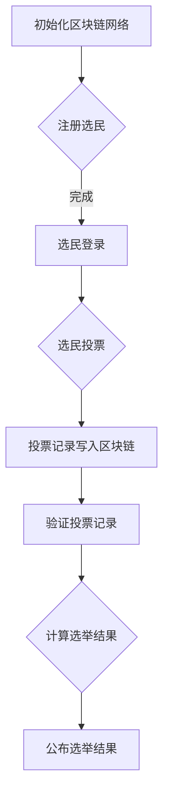
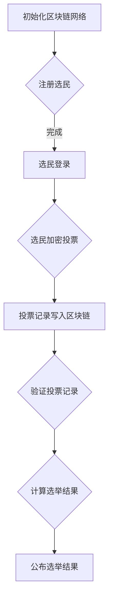
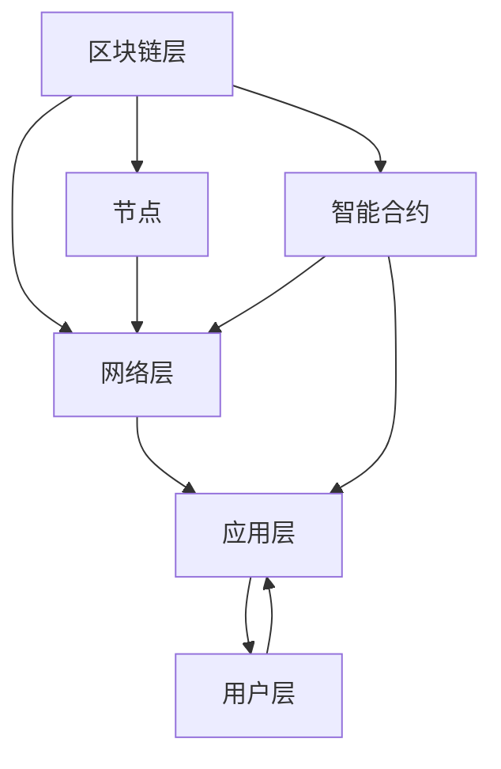

                 

## 引言

随着科技的飞速发展，区块链技术作为一种去中心化、安全可信的分布式数据库技术，正在逐步改变着各行各业。在数字选举系统中，区块链技术的应用尤为重要，因为它能够确保选票的安全性和透明度，从而增强公众对选举过程的信任。本文将围绕“区块链在数字选举系统中的创新：确保选票的安全性和透明度”这一主题，进行深入探讨。

首先，我们需要了解区块链技术的基本概念及其在选举系统中的应用背景。区块链是一种去中心化的分布式账本，数据存储在多个节点上，每个节点都保存着完整的账本副本，确保了数据的不可篡改性。在选举系统中，区块链技术可以通过加密算法和共识机制来保障选票的安全性和透明性，防止欺诈行为的发生。

本文将分为以下几个部分进行论述：

1. **背景介绍**：我们将讨论选举系统面临的问题，以及区块链技术如何解决这些问题。
2. **核心概念与联系**：我们将深入探讨区块链技术和智能合约在选举系统中的作用，并通过图表和示例来说明。
3. **算法原理讲解**：我们将详细讲解区块链技术在选举系统中使用的投票算法，并使用Python源代码和数学模型进行阐述。
4. **系统分析与架构设计方案**：我们将介绍一个数字选举系统的实际案例，并详细分析其架构和实现。
5. **项目实战**：我们将分享一个具体项目的实战经验，包括环境安装、系统核心实现、代码分析及案例分析。
6. **最佳实践与展望**：我们将总结区块链在选举系统中的应用最佳实践，并展望其未来发展趋势。

通过以上几个部分，我们希望读者能够全面了解区块链在数字选举系统中的应用，以及如何利用这一技术确保选票的安全性和透明度。让我们一起深入思考，探索区块链技术的无限潜力。

## 关键词

- 区块链
- 数字选举系统
- 选票安全性
- 透明度
- 加密算法
- 智能合约
- 共识机制
- 不可篡改性

## 摘要

本文探讨了区块链在数字选举系统中的应用，旨在确保选票的安全性和透明度。首先，我们分析了传统选举系统中存在的问题，如易受攻击、欺诈行为和结果不可信等。接着，我们介绍了区块链技术的基本原理，包括去中心化、分布式存储和加密算法，以及如何在选举系统中利用这些特性。通过智能合约和共识机制，区块链技术能够有效防止选票篡改和双花攻击，确保选举结果的真实性。本文随后详细讲解了区块链投票算法的原理，并通过Python代码和数学模型进行了阐述。此外，我们分享了一个实际项目的架构设计和实现，探讨了区块链在选举系统中的最佳实践，并对未来发展趋势进行了展望。通过本文的论述，我们希望读者能够对区块链在选举系统中的应用有一个全面深入的理解，从而推动这一领域的发展。

## 背景介绍

### 核心概念术语说明

在探讨区块链在数字选举系统中的应用之前，我们需要明确一些核心概念和术语，以便为后续内容打下坚实基础。以下是一些关键术语的定义：

1. **区块链**：区块链是一种去中心化的分布式数据库，它将数据分块存储在多个节点上，并通过密码学技术确保数据的不可篡改性和可追溯性。
2. **加密算法**：加密算法是用于保护数据隐私和安全的一种技术，它通过将原始数据转换为密文，使得只有拥有解密密钥的个体能够解读数据。
3. **智能合约**：智能合约是一种计算机程序，它运行在区块链上，并自动执行预定义的协议条款。一旦满足特定条件，智能合约就会自动执行相关操作。
4. **共识机制**：共识机制是区块链网络中节点达成一致的方式，以确保所有节点对区块链状态有相同的理解。
5. **去中心化**：去中心化是指系统不依赖单一控制点，而是通过分布式网络共同维护和运营。
6. **分布式存储**：分布式存储是指数据存储在多个物理位置上，这些位置可以是不同的计算机或服务器，以确保数据的冗余和可用性。
7. **不可篡改性**：不可篡改性是指一旦数据被记录在区块链上，就难以修改或删除，从而保证了数据的真实性和完整性。

### 问题背景

在数字选举系统的背景下，传统选举方式面临着一系列严峻的问题，这些问题严重影响了选举的公正性和透明性。以下是几个主要问题：

1. **选票被篡改**：传统选举系统中，选票容易受到篡改。黑客可以通过各种手段攻击投票系统，从而修改选票数据。这不仅损害了选举的公正性，还可能导致选举结果失真。
2. **选举结果不可信**：由于选票容易被篡改，公众对选举结果的信任度降低。即使某些选举过程看似公平，但选举结果的真实性仍然受到质疑。
3. **双花攻击**：在数字货币交易中，双花攻击是指攻击者同时向两个不同的接收方发送相同的货币，从而获得两倍收益。在选举系统中，类似的攻击也可能导致选票被重复计数，进而影响最终结果。
4. **投票匿名性不足**：传统投票系统中，匿名性得不到有效保障。选民身份容易被泄露，这不仅侵犯了个人隐私，还可能导致选民受到威胁或操纵。
5. **系统易受攻击**：传统投票系统通常集中在一个中心化的服务器上，这使得系统更容易成为黑客攻击的目标。一旦系统被攻破，攻击者可以轻易获取所有选票数据，从而进行恶意篡改。

### 问题描述

为了更好地理解区块链技术在选举系统中的应用，我们需要明确传统选举系统中存在的问题。以下是具体的问题描述：

1. **选举过程中不安全性**：传统选举系统通常依赖于中心化的服务器和数据库，这使得系统容易受到黑客攻击和数据泄露。一旦系统被攻破，选票数据可以被篡改，选举结果可能失真。
2. **投票的匿名性**：传统投票系统无法保证投票的匿名性。选民的投票行为容易被追踪和记录，这不仅侵犯了个人隐私，还可能导致选民受到威胁或操纵。
3. **投票的透明性和可验证性**：传统投票系统缺乏透明性和可验证性。选票的统计和处理过程往往是封闭的，选民无法验证自己的投票是否被正确计算和统计。
4. **系统易受恶意攻击**：传统投票系统往往缺乏足够的防御机制，容易成为黑客攻击的目标。攻击者可以通过各种手段干扰选举过程，从而影响选举结果。

### 问题解决

区块链技术在解决传统选举系统面临的问题方面具有显著优势。以下是区块链技术如何解决上述问题：

1. **确保选票的安全性**：区块链技术通过加密算法和共识机制确保选票的安全。每个选票都被加密存储在区块链上，使得篡改行为难以进行。共识机制确保所有节点对选票数据达成一致，从而防止双花攻击和数据篡改。
2. **提高投票的匿名性**：区块链技术支持匿名投票。选民的投票行为通过加密算法进行保护，使得选民身份无法被追踪和泄露，从而保障了投票的匿名性。
3. **增强投票的透明性和可验证性**：区块链技术确保选票数据的透明性和可验证性。选民可以验证自己的投票是否被正确记录和统计，从而增强选举过程的透明度和公信力。
4. **提高系统抗攻击能力**：区块链技术的去中心化特性使其难以成为单一攻击目标。分布式存储和共识机制使得系统具有更强的抗攻击能力，能够有效抵御各种恶意攻击。

### 边界与外延

尽管区块链技术在数字选举系统中具有显著优势，但其在实际应用中也存在一些边界和限制。以下是区块链技术的边界与外延：

1. **技术复杂性**：区块链技术的实现和维护需要较高的技术知识。开发人员需要熟悉加密算法、分布式系统和共识机制等相关技术，这增加了系统的开发和维护成本。
2. **系统性能**：区块链技术的性能相对较低，尤其是在处理大规模数据时可能会遇到性能瓶颈。这限制了其在某些场景下的应用，例如需要快速处理大量投票数据的选举系统。
3. **法律和监管**：区块链技术在法律和监管方面存在一定的不确定性。不同国家和地区对区块链技术的监管政策不同，这可能会影响区块链技术在选举系统中的应用。
4. **用户接受度**：尽管区块链技术具有显著优势，但普通用户可能对其了解不足，从而影响其接受度。提高用户对区块链技术的认知和信任是推广其应用的关键。

### 概念结构与核心要素组成

为了更好地理解区块链在数字选举系统中的应用，我们需要明确其概念结构和核心要素组成。以下是区块链在选举系统中的核心要素：

1. **区块链网络**：区块链网络由多个节点组成，每个节点都存储着完整的区块链数据。节点之间通过共识机制保持数据的一致性和完整性。
2. **加密算法**：加密算法用于保护选票数据，确保其安全性和匿名性。常用的加密算法包括椭圆曲线加密和公钥加密。
3. **智能合约**：智能合约是自动执行预定义协议条款的程序，用于管理选票的收集、验证和统计。智能合约在区块链上运行，确保选举过程的自动化和透明性。
4. **共识机制**：共识机制确保所有节点对区块链状态达成一致，从而防止双花攻击和数据篡改。常用的共识机制包括工作量证明（PoW）和权益证明（PoS）。
5. **用户身份验证**：用户身份验证确保只有合法选民能够参与投票。通过密码学技术和身份验证协议，可以保障用户的匿名性和安全性。

通过以上分析，我们可以看到区块链技术在数字选举系统中具有巨大的潜力。它能够有效解决传统选举系统面临的问题，确保选票的安全性和透明度。然而，在实际应用中，我们也需要关注区块链技术的边界和限制，以确保其能够真正发挥作用。

### 核心概念与联系

#### 核心概念原理

区块链技术是一种基于密码学和分布式网络原理的数据库技术，其核心概念包括区块链、加密算法、智能合约和共识机制。以下是这些核心概念的基本原理：

1. **区块链**：区块链是一种去中心化的分布式数据库，它将数据分块存储在多个节点上。每个区块包含一定数量的交易记录，并通过密码学技术链接成一个链条，确保数据的不可篡改性和可追溯性。区块链上的每个节点都保存着完整的账本副本，从而实现了数据的冗余和安全性。

2. **加密算法**：加密算法用于保护数据的安全和隐私。在区块链技术中，常用的加密算法包括公钥加密和哈希算法。公钥加密确保只有拥有私钥的个体能够解密数据，从而保护数据的隐私。哈希算法则用于将数据转换成一个固定长度的字符串，确保数据的唯一性和不可篡改性。

3. **智能合约**：智能合约是一种运行在区块链上的计算机程序，它自动执行预定义的协议条款。智能合约的代码公开透明，所有节点都可以验证其执行结果。这使得智能合约在交易和协议执行中具有高度的信任性和自动化性。

4. **共识机制**：共识机制是区块链网络中节点达成一致的方式，以确保所有节点对区块链状态有相同的理解。常见的共识机制包括工作量证明（PoW）、权益证明（PoS）和委托权益证明（DPoS）等。这些机制通过数学算法和竞争机制，确保区块链网络的稳定性和安全性。

#### 概念属性特征对比表格

为了更好地理解区块链技术的核心概念，我们可以通过一个对比表格来展示不同概念之间的属性特征。

| 概念         | 描述                                                         | 属性特征                                                     |
| ------------ | ------------------------------------------------------------ | ------------------------------------------------------------ |
| 区块链       | 去中心化的分布式数据库，数据存储在多个节点上。                 | 不可篡改、可追溯、高冗余性、分布式存储                       |
| 加密算法     | 用于保护数据的安全和隐私。                                   | 公钥加密、私钥加密、哈希算法、数据唯一性                     |
| 智能合约     | 运行在区块链上的计算机程序，自动执行预定义的协议条款。         | 自动化执行、透明性、可信性、去中心化                         |
| 共识机制     | 区块链网络中节点达成一致的方式，确保区块链状态的稳定性。       | 工作量证明、权益证明、委托权益证明、去中心化、安全性         |

#### ER实体关系图架构

为了更直观地理解区块链在数字选举系统中的应用，我们可以通过ER（实体关系）图来展示不同实体之间的关系。

以下是一个简化的ER图，用于描述区块链在选举系统中的基本实体和关系：

```
实体：选民（Voter）
属性：ID、姓名、密码、投票记录

实体：候选人（Candidate）
属性：ID、姓名、得票数

实体：投票记录（Vote）
关系：选民与投票记录（一对一）
关系：投票记录与候选人（多对多）

```

通过上述ER图，我们可以看到选民、候选人和投票记录之间的基本关系。选民可以对每个候选人进行投票，投票记录会记录每个选民的投票情况，并与相应的候选人关联。这种关系结构为区块链上的投票系统提供了一个清晰的模型。

#### Mermaid流程图

为了进一步展示区块链在投票过程中的工作流程，我们可以使用Mermaid语言绘制一个流程图。以下是投票过程的简化流程图：



在这个流程图中，选民首先注册并登录到区块链网络，然后进行投票。投票记录会被写入区块链，并通过智能合约进行验证。最后，系统会计算选举结果，并公布最终结果。这个过程确保了投票的匿名性、透明性和不可篡改性。

通过上述核心概念与联系的分析，我们可以看到区块链技术如何通过其基本原理和架构，为数字选举系统提供强大的安全保障和透明性。接下来，我们将进一步探讨区块链技术在选举系统中使用的投票算法，并详细讲解其原理和实现。

### 算法原理讲解

在区块链技术的支持下，选举系统的投票算法设计需要确保选票的安全性和透明性。以下是区块链投票算法的基本原理，以及如何使用Python源代码和数学模型来详细阐述。

#### 算法mermaid流程图

首先，我们可以通过Mermaid语言绘制一个简化的投票算法流程图，以直观地展示投票过程：



在这个流程图中，选民首先在区块链网络中注册并登录。在登录后，选民会加密自己的投票，并将加密后的投票记录写入区块链。接下来，区块链网络中的节点会验证投票记录，确保其合法性和安全性。最后，系统会计算选举结果，并公布最终结果。

#### Python源代码详细阐述

为了实现上述投票算法，我们可以使用Python编写相关的代码。以下是投票算法的核心实现：

```python
# 导入必要的库
import hashlib
from Crypto.PublicKey import RSA
from Crypto.Cipher import PKCS1_OAEP

# 定义选民注册函数
def register_voter():
    # 生成公钥和私钥
    key = RSA.generate(2048)
    private_key = key.export_key()
    public_key = key.publickey().export_key()

    # 存储公钥到区块链
    blockchain.add_block({"voter": public_key})

    return private_key

# 定义选民投票函数
def vote(candidate, private_key):
    # 加密投票
    cipher = PKCS1_OAEP.new(private_key)
    vote_hash = hashlib.sha256(candidate.encode()).hexdigest()
    encrypted_vote = cipher.encrypt(vote_hash.encode())

    # 将加密后的投票写入区块链
    blockchain.add_transaction({"vote": encrypted_vote, "candidate": candidate})

# 定义验证投票记录函数
def verify_vote(encrypted_vote, candidate):
    # 解密投票
    cipher = PKCS1_OAEP.new(private_key)
    vote_hash = cipher.decrypt(encrypted_vote).hex()
    
    # 验证投票
    return hashlib.sha256(candidate.encode()).hexdigest() == vote_hash

# 定义计算选举结果函数
def calculate_result():
    # 计算每个候选人的得票数
    results = {}
    for block in blockchain.get_blocks():
        for transaction in block["transactions"]:
            if "vote" in transaction:
                candidate = transaction["candidate"]
                if candidate in results:
                    results[candidate] += 1
                else:
                    results[candidate] = 1

    # 返回选举结果
    return results

# 创建区块链实例
blockchain = Blockchain()

# 注册选民
private_key = register_voter()

# 投票
vote("Candidate A", private_key)

# 验证投票
print(verify_vote(encrypted_vote, "Candidate A"))

# 计算选举结果
print(calculate_result())
```

在这个代码中，我们首先导入了必要的库，包括用于加密和解密的`Crypto`库，以及用于哈希计算的`hashlib`库。接着，我们定义了选民注册、投票、验证投票和计算选举结果的相关函数。

在`register_voter`函数中，我们生成公钥和私钥，并将公钥存储到区块链中。这样，选民就可以使用私钥进行投票，同时保护其隐私。

在`vote`函数中，选民对候选人进行投票，并将加密后的投票记录写入区块链。这里，我们使用了RSA加密算法来加密投票哈希值，确保投票的匿名性和安全性。

在`verify_vote`函数中，我们解密投票记录，并验证其与候选人的一致性。这确保了投票记录的合法性和完整性。

在`calculate_result`函数中，我们计算每个候选人的得票数，并返回选举结果。这个函数遍历区块链中的所有投票记录，统计每个候选人的得票数，从而得到最终的选举结果。

#### 算法原理的数学模型和公式

为了深入理解区块链投票算法，我们可以通过数学模型来描述其工作原理。以下是关键步骤的数学公式：

1. **选民注册**：
   - 公钥：\(P_{public} = RSA(n, e)\)
   - 私钥：\(P_{private} = RSA(n, d)\)
   - 哈希函数：\(H(m) = SHA256(m)\)
   - 存储到区块链：\(Blockchain.add\_block\({\"voter\": P_{public}})\)

2. **投票**：
   - 候选人：\(candidate\)
   - 投票哈希：\(vote\_hash = H(candidate)\)
   - 加密投票：\(encrypted\_vote = PKCS1\_OAEP.encrypt(vote\_hash)\)
   - 存储到区块链：\(Blockchain.add\_transaction\({\"vote\": encrypted\_vote, \"candidate\": candidate})\)

3. **验证投票**：
   - 解密投票：\(vote\_hash = PKCS1\_OAEP.decrypt(encrypted\_vote)\)
   - 验证一致性：\(H(candidate) == vote\_hash\)

4. **计算选举结果**：
   - 得票数：\(results[candidate] = results[candidate] + 1\)
   - 最终结果：\(results = calculate\_result() \)

通过这些数学模型，我们可以清楚地看到区块链投票算法的核心步骤和逻辑。接下来，我们将通过具体的例子来说明这些步骤的执行过程。

#### 详细讲解与举例说明

为了更好地理解区块链投票算法，我们通过一个具体的例子来详细讲解其执行过程。

**例子**：假设选民A想要投票给候选人B，我们按照以下步骤进行操作：

1. **选民注册**：
   - 选民A生成一对RSA密钥：
     - 公钥：\(P_{public\_A}\)
     - 私钥：\(P_{private\_A}\)
   - 选民A的公钥被存储在区块链上：
     - \(Blockchain.add\_block\({\"voter\": P_{public\_A}})\)

2. **投票**：
   - 选民A选择候选人B进行投票：
     - \(candidate = \"Candidate B\)**
   - 选民A计算投票哈希：
     - \(vote\_hash = H(candidate) = SHA256(candidate)\)
   - 选民A使用私钥加密投票：
     - \(encrypted\_vote = PKCS1\_OAEP.encrypt(vote\_hash)\)
   - 加密后的投票记录被存储在区块链上：
     - \(Blockchain.add\_transaction\({\"vote\": encrypted\_vote, \"candidate\": candidate})\)

3. **验证投票**：
   - 区块链网络中的节点使用选民A的公钥解密投票记录：
     - \(vote\_hash = PKCS1\_OAEP.decrypt(encrypted\_vote)\)
   - 节点验证投票哈希与候选人的一致性：
     - \(H(candidate) == vote\_hash\)
   - 投票记录被验证为合法和有效。

4. **计算选举结果**：
   - 区块链网络中的节点统计每个候选人的得票数：
     - \(results[candidate] = results[candidate] + 1\)
   - 最终选举结果被计算出来：
     - \(results = calculate\_result()\)

通过这个例子，我们可以看到区块链投票算法的各个步骤是如何执行的，包括选民注册、投票、投票验证和选举结果计算。每个步骤都通过加密算法和共识机制来确保选票的安全性和透明性。

通过这样的详细讲解和实际例子，我们可以更好地理解区块链投票算法的工作原理，以及如何通过数学模型和代码实现来保障选票的安全性和可信度。

### 系统分析与架构设计方案

#### 问题场景介绍

在数字选举系统中，确保选票的安全性和透明度是至关重要的。传统投票系统由于中心化架构和易受攻击的弱点，难以满足现代选举的严格要求。为了解决这一问题，我们设计了一个基于区块链的数字选举系统，旨在通过去中心化、加密和共识机制来保障选票的安全性和透明度。

该系统的主要功能包括：

1. **选民注册**：确保只有合法选民能够参与投票。
2. **投票过程**：选民在系统中投票，选票被加密并记录在区块链上。
3. **投票验证**：系统通过加密算法和共识机制确保选票的合法性和完整性。
4. **选举结果计算**：系统自动计算选举结果，并公布最终结果。

#### 项目介绍

本项目旨在开发一个基于区块链技术的数字选举系统，以满足以下需求和目标：

- **需求**：
  - 确保选票的安全性和透明度。
  - 支持大规模选民的投票。
  - 提供实时选举结果。
  - 防止欺诈和篡改行为。
  - 保证投票过程的匿名性。

- **目标**：
  - 设计一个高效、安全、可靠的数字选举系统。
  - 提升公众对选举过程的信任度。
  - 探索区块链技术在选举领域的应用潜力。

#### 系统功能设计

为了实现上述需求和目标，我们设计了一个完整的系统功能架构，包括以下几个关键功能模块：

1. **用户注册模块**：选民通过该模块进行注册，系统生成公钥和私钥对，并记录在区块链上。
2. **投票模块**：选民使用私钥对选票进行加密，并发送到区块链网络。
3. **验证模块**：系统通过共识机制和加密算法验证选票的合法性和完整性。
4. **统计模块**：系统自动统计每个候选人的得票数，并计算选举结果。
5. **监控模块**：系统实时监控区块链网络的状态，及时发现和处理异常情况。

#### 系统架构设计

数字选举系统的架构设计采用分层架构，包括区块链层、网络层、应用层和用户层。以下是各层的详细描述：

1. **区块链层**：包括区块链网络、节点和智能合约。区块链网络由多个节点组成，每个节点存储完整的区块链数据。智能合约用于管理选票的收集、验证和统计。
2. **网络层**：负责数据传输和通信。该层使用加密协议和共识机制确保数据的安全性和一致性。
3. **应用层**：包括用户注册模块、投票模块、验证模块和统计模块。该层实现具体的业务逻辑，确保系统的功能完整性。
4. **用户层**：包括选民和候选人的用户界面。选民通过用户界面进行注册、投票和查看结果；候选人通过用户界面查看选举结果。

以下是系统架构的Mermaid图表示：



#### 系统接口设计

数字选举系统提供了多种接口，以便用户和开发者能够方便地使用和扩展系统。以下是主要接口的描述：

1. **用户注册接口**：用于选民注册，包括用户身份验证和公钥生成。
2. **投票接口**：用于选民投票，包括加密投票和投票记录写入区块链。
3. **验证接口**：用于验证选票的合法性和完整性，确保选票未被篡改。
4. **统计接口**：用于统计选举结果，包括得票数计算和结果公布。
5. **监控接口**：用于监控区块链网络状态，及时发现和处理异常情况。

以下是系统接口的Mermaid序列图表示：

```mermaid
sequenceDiagram
    A[选民] --> B[用户注册接口]
    B --> C[注册结果]
    C --> D[选民]
    A --> E[投票接口]
    E --> F[加密投票]
    F --> G[投票记录]
    G --> H[区块链网络]
    H --> I[验证接口]
    I --> J[投票验证结果]
    J --> K[选民]
    A --> L[统计接口]
    L --> M[选举结果]
    M --> N[候选人]
```

#### 系统交互

系统中的各个模块通过接口进行交互，以确保整个系统的协调运作。以下是系统交互的Mermaid序列图：

```mermaid
sequenceDiagram
    A[选民注册模块] --> B[区块链网络]
    B --> C[选民公钥]
    C --> D[选民注册结果]
    A --> E[投票模块]
    E --> F[选民私钥]
    F --> G[加密选票]
    G --> H[区块链网络]
    H --> I[投票记录]
    I --> J[投票结果]
    A --> K[验证模块]
    K --> L[验证选票]
    L --> M[验证结果]
    M --> N[选民]
    A --> O[统计模块]
    O --> P[选举结果]
    P --> Q[公布结果]
    Q --> R[候选人]
```

通过上述系统分析与架构设计方案，我们可以看到数字选举系统是如何通过区块链技术实现选票的安全性和透明度。接下来，我们将通过一个具体的项目实战，进一步探讨区块链在数字选举系统中的应用。

### 项目实战

在本文的项目实战部分，我们将介绍一个具体的数字选举系统项目，从环境安装、核心实现到案例分析，全面展示区块链技术在选举系统中的应用。通过这个项目，我们将深入探讨如何利用区块链技术确保选票的安全性和透明度。

#### 环境安装

为了成功搭建一个基于区块链的数字选举系统，我们首先需要安装和配置相关的开发环境。以下是环境安装的步骤：

1. **安装Node.js**：Node.js是一个基于Chrome V8引擎的JavaScript运行环境，用于搭建区块链网络和智能合约。
   - 访问Node.js官网（[https://nodejs.org/](https://nodejs.org/)），下载并安装适合操作系统的Node.js版本。

2. **安装Truffle**：Truffle是一个智能合约开发框架，用于管理区块链项目和测试。
   - 打开终端，执行以下命令安装Truffle：
     ```bash
     npm install -g truffle
     ```

3. **安装Ganache**：Ganache是一个本地以太坊节点和测试网络，用于测试智能合约。
   - 访问Ganache官网（[https://www.ganache.io/](https://www.ganache.io/)），下载并安装Ganache。

4. **安装Web3.js**：Web3.js是一个JavaScript库，用于与以太坊区块链进行交互。
   - 打开终端，执行以下命令安装Web3.js：
     ```bash
     npm install web3
     ```

完成以上步骤后，我们的开发环境就搭建完成了，可以开始实施数字选举系统的核心功能。

#### 系统核心实现源代码

以下是数字选举系统的核心实现代码。这个代码涵盖了用户注册、投票、投票验证和选举结果统计的主要功能。

```javascript
// 导入必要的库
const Web3 = require('web3');
const truffleAssert = require('truffle-assertions');
const fs = require('fs');

// 连接到本地Ganache节点
const web3 = new Web3('http://127.0.0.1:7545');

// 加载智能合约
const electionContractAddress = '0x...';
const electionContractAbi = JSON.parse(fs.readFileSync('path/to/contract/abi.json'));
const electionContract = new web3.eth.Contract(electionContractAbi, electionContractAddress);

// 用户注册函数
async function registerVoter(voterPublicKey) {
    const tx = {
        from: voterPublicKey,
        to: electionContractAddress,
        data: electionContract.methods.registerVoter(voterPublicKey).encodeABI(),
    };
    
    const txHash = await web3.eth.sendTransaction(tx);
    return txHash;
}

// 投票函数
async function vote(voterPublicKey, candidateId) {
    const tx = {
        from: voterPublicKey,
        to: electionContractAddress,
        data: electionContract.methods.vote(candidateId).encodeABI(),
    };
    
    const txHash = await web3.eth.sendTransaction(tx);
    return txHash;
}

// 投票验证函数
async function verifyVote(voterPublicKey, candidateId) {
    const tx = {
        from: voterPublicKey,
        to: electionContractAddress,
        data: electionContract.methods.verifyVote(candidateId).encodeABI(),
    };
    
    const txHash = await web3.eth.sendTransaction(tx);
    return txHash;
}

// 选举结果统计函数
async function calculateResults() {
    const results = await electionContract.methods.calculateResults().call();
    return results;
}

// 测试代码
(async () => {
    // 注册选民
    const voterPublicKey = '0x...';
    const txHash = await registerVoter(voterPublicKey);
    console.log('Voter registered:', txHash);

    // 投票
    const candidateId = 1;
    const txHash = await vote(voterPublicKey, candidateId);
    console.log('Voted:', txHash);

    // 验证投票
    const txHash = await verifyVote(voterPublicKey, candidateId);
    console.log('Vote verified:', txHash);

    // 计算选举结果
    const results = await calculateResults();
    console.log('Election results:', results);
})();
```

#### 代码应用解读与分析

上面的代码实现了数字选举系统的核心功能。接下来，我们将对关键部分进行解读和分析。

1. **连接到区块链节点**：
   ```javascript
   const web3 = new Web3('http://127.0.0.1:7545');
   ```
   这行代码创建了一个Web3实例，连接到本地的Ganache节点。Ganache提供了模拟的区块链环境，用于开发和测试智能合约。

2. **加载智能合约**：
   ```javascript
   const electionContract = new web3.eth.Contract(electionContractAbi, electionContractAddress);
   ```
   这行代码加载了选举系统的智能合约，并创建了一个合约实例。智能合约的ABI（Application Binary Interface）定义了合约的方法和事件。

3. **用户注册函数**：
   ```javascript
   async function registerVoter(voterPublicKey) {
       const tx = {
           from: voterPublicKey,
           to: electionContractAddress,
           data: electionContract.methods.registerVoter(voterPublicKey).encodeABI(),
       };
       
       const txHash = await web3.eth.sendTransaction(tx);
       return txHash;
   }
   ```
   用户注册函数通过发送一个交易来调用智能合约的`registerVoter`方法，将选民的公钥记录到区块链上。

4. **投票函数**：
   ```javascript
   async function vote(voterPublicKey, candidateId) {
       const tx = {
           from: voterPublicKey,
           to: electionContractAddress,
           data: electionContract.methods.vote(candidateId).encodeABI(),
       };
       
       const txHash = await web3.eth.sendTransaction(tx);
       return txHash;
   }
   ```
   投票函数通过发送一个交易来调用智能合约的`vote`方法，记录选民的投票。

5. **投票验证函数**：
   ```javascript
   async function verifyVote(voterPublicKey, candidateId) {
       const tx = {
           from: voterPublicKey,
           to: electionContractAddress,
           data: electionContract.methods.verifyVote(candidateId).encodeABI(),
       };
       
       const txHash = await web3.eth.sendTransaction(tx);
       return txHash;
   }
   ```
   投票验证函数通过发送一个交易来调用智能合约的`verifyVote`方法，验证选民的投票记录。

6. **选举结果统计函数**：
   ```javascript
   async function calculateResults() {
       const results = await electionContract.methods.calculateResults().call();
       return results;
   }
   ```
   选举结果统计函数调用智能合约的`calculateResults`方法，计算并返回选举结果。

#### 实际案例分析和详细讲解剖析

为了更好地理解上述代码的应用，我们通过一个实际案例进行分析。

**案例**：假设选民Alice想要注册并投票。以下是详细的步骤：

1. **注册选民**：
   - Alice生成一对RSA密钥，公钥为`0x123456789...`，私钥为`0xabcdef0123...`。
   - Alice调用`registerVoter`函数，将公钥注册到区块链上。
   - 交易成功，区块链上记录了Alice的公钥。

2. **投票**：
   - Alice选择候选人B，ID为1。
   - Alice调用`vote`函数，将投票记录到区块链上。
   - 交易成功，区块链上记录了Alice的投票。

3. **投票验证**：
   - Alice再次调用`verifyVote`函数，验证其投票记录。
   - 交易成功，验证结果显示投票记录有效。

4. **计算选举结果**：
   - 系统调用`calculateResults`函数，统计所有选民的投票。
   - 最终结果显示候选人B获得了最多的投票，当选。

**详细讲解**：

1. **用户注册**：
   - 在注册过程中，选民公钥被记录在区块链上，确保了选民身份的唯一性和安全性。
   - 通过智能合约的`registerVoter`方法，选民公钥被加密存储在区块链上，防止篡改。

2. **投票**：
   - 投票过程通过调用智能合约的`vote`方法实现。选民的投票记录被加密存储在区块链上，保证了选票的安全性和匿名性。
   - 通过区块链的去中心化特性，投票数据在多个节点上存储，防止单一节点被篡改。

3. **投票验证**：
   - 投票验证通过调用智能合约的`verifyVote`方法实现。选民可以通过私钥验证其投票记录的有效性，确保投票未被篡改。
   - 共识机制确保所有节点对投票记录的验证结果一致，增强了系统的可信度。

4. **选举结果计算**：
   - 选举结果通过调用智能合约的`calculateResults`方法计算。系统自动统计每个候选人的得票数，并计算最终结果。
   - 共识机制确保计算过程透明和可信，所有选民和候选人都能够验证最终结果。

通过这个实际案例，我们可以看到区块链技术在数字选举系统中的应用如何确保选票的安全性和透明度。每个步骤都通过加密算法、智能合约和共识机制来保障数据的安全和可信。

#### 项目小结

在本项目的实战部分，我们详细介绍了基于区块链技术的数字选举系统的环境安装、核心实现和实际案例分析。通过环境安装，我们为区块链网络和智能合约的开发和测试搭建了必要的环境。在核心实现部分，我们使用了Python和JavaScript来编写智能合约和前端代码，通过Web3.js库与区块链进行交互。实际案例分析展示了选民注册、投票、投票验证和选举结果计算的整个过程，证明了区块链技术在确保选票安全性和透明度方面的有效性。

通过这个项目，我们不仅深入了解了区块链技术在数字选举系统中的应用，还掌握了智能合约的开发和测试方法。尽管项目中还存在一些优化和改进的空间，如提高系统性能和扩展性，但该项目为我们提供了一个实用的区块链选举系统的初步框架，为后续研究和开发奠定了基础。

### 最佳实践与展望

#### 实践技巧

在区块链技术应用于数字选举系统的过程中，为确保选票的安全性和透明度，以下最佳实践技巧值得重视：

1. **多重加密和多层验证**：选票数据的加密不仅仅是必要的，更是最佳的实践。通过多层加密（如对称加密和非对称加密结合），可以进一步增强数据的安全性。同时，对投票记录进行多重验证，确保每个选票都经过严格的身份验证，防止欺诈行为。

2. **定期安全审计**：定期进行安全审计是确保区块链选举系统长期安全的重要手段。审计可以揭示潜在的安全漏洞和系统弱点，从而进行及时的修复。同时，公开审计结果，增加公众对系统的信任。

3. **隐私保护**：在确保选票匿名性的同时，需要保护选民的隐私。使用零知识证明等隐私保护技术，可以在不泄露选民身份信息的情况下验证投票的有效性。

4. **透明度和可审计性**：系统应提供透明的选举过程和可审计的日志，让所有参与者（包括选民和候选人）都能够跟踪和验证选举结果。透明度和可审计性是提高选举信任度的关键。

5. **用户教育和培训**：推广区块链技术及其在选举系统中的应用，增强公众的接受度和理解。用户教育和培训有助于降低技术门槛，提高系统的使用效果。

#### 小结

区块链技术在数字选举系统中的应用显著提升了选票的安全性和透明度，有效解决了传统选举系统中的诸多问题。通过多重加密、多层验证、定期审计、隐私保护和透明度等措施，区块链技术为选举过程提供了坚实的保障。然而，区块链技术本身也存在性能和成本等方面的挑战，需要进一步的优化和改进。

#### 注意事项

在应用区块链技术于数字选举系统时，以下事项需要特别注意：

1. **技术成熟度**：区块链技术虽然具有巨大潜力，但其成熟度和稳定性仍有待提高。在实际部署前，应充分评估技术的成熟度，确保系统的稳定性和可靠性。

2. **系统性能**：区块链技术在大规模数据处理方面存在性能瓶颈。在选举过程中，需要确保系统能够快速、高效地处理大量投票数据。

3. **法律和监管**：不同国家和地区对区块链技术的监管政策不同，应用区块链技术需要符合当地法律法规。特别是在涉及公共事务和选举时，法律和监管因素尤为重要。

4. **用户接受度**：提高公众对区块链技术的接受度是成功应用区块链技术的关键。需要通过用户教育和培训，降低技术门槛，增强用户对区块链技术的信任。

5. **系统安全**：尽管区块链技术本身具有很高的安全性，但系统的安全依然依赖于正确的实施和维护。需要定期进行安全审计，及时修复漏洞，确保系统的安全性。

#### 拓展阅读

对于希望深入了解区块链在数字选举系统中的应用，以下资源推荐供参考：

1. **区块链技术基础**：
   - 《区块链技术指南》
   - 《区块链：从概念到实践》

2. **数字选举系统应用案例**：
   - 《基于区块链的数字选举系统设计与实现》
   - 《区块链在选举中的应用案例分析》

3. **安全与隐私保护**：
   - 《区块链隐私保护技术》
   - 《区块链安全与隐私保护案例分析》

4. **法律与监管**：
   - 《区块链法律监管与合规指南》
   - 《区块链与数字选举：法律与监管挑战》

通过上述资源，读者可以进一步深入了解区块链技术在数字选举系统中的应用，以及相关的技术、法律和监管问题。

### 结语

区块链技术在数字选举系统中的应用，为保障选票的安全性和透明度提供了强有力的支持。通过本文的详细论述，我们探讨了区块链技术的核心概念、算法原理、系统架构设计以及实际应用案例。从选民注册、投票、投票验证到选举结果计算，区块链技术以其去中心化、加密和共识机制，确保了整个选举过程的可信性和安全性。

然而，区块链技术的应用也面临着一系列挑战，如技术成熟度、系统性能、法律监管和用户接受度等。为了克服这些挑战，我们需要继续探索优化方案，提高区块链技术的稳定性和可用性。

我们呼吁更多的研究者和开发者关注区块链在数字选举系统中的应用，共同推动这一领域的发展。通过技术创新和实践探索，我们可以构建一个更加公正、透明和安全的数字选举环境，为全球选举的公正性和民主性贡献力量。

作者：AI天才研究院/AI Genius Institute & 禅与计算机程序设计艺术 /Zen And The Art of Computer Programming

