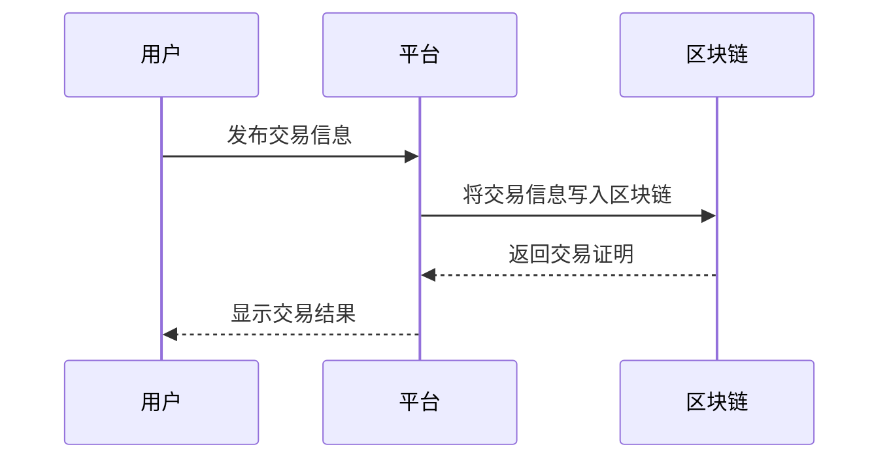

                 

### 区块链在知识产权交易中的去中心化应用

**关键词：**区块链、知识产权、去中心化、交易、保护、智能合约

**摘要：**本文深入探讨了区块链技术在知识产权交易中的去中心化应用，介绍了区块链技术的发展背景和核心技术原理，分析了当前知识产权交易的挑战与问题，并探讨了去中心化在知识产权交易中的优势和应用前景。通过详细的设计原则与目标、系统功能设计、系统架构设计、系统接口设计以及系统交互设计，本文展示了如何构建一个去中心化的知识产权交易平台，并通过实际案例阐述了区块链在版权交易中的应用效果。文章最后给出了最佳实践建议和总结，为读者提供了深入理解和应用区块链技术的参考。

### 第一部分：背景介绍

#### 第1章：区块链技术基础

##### 1.1 区块链与知识产权交易概述

###### 1.1.1 区块链技术的发展背景

区块链技术起源于2008年，当时一个名为中本聪（Satoshi Nakamoto）的匿名人物发布了一篇名为《比特币：一种点对点的电子现金系统》的论文。这篇论文描述了一种无需信任第三方中介的数字货币系统，即比特币（Bitcoin）。比特币的推出标志着区块链技术的诞生，并迅速引发了全球关注。

自比特币以来，区块链技术经历了快速的发展和应用。除了数字货币之外，区块链技术还在供应链管理、金融服务、物联网、智能合约等领域取得了显著的应用成果。区块链技术的核心优势在于去中心化、安全性和不可篡改性，这使得它在知识产权交易等领域具有巨大的潜力。

###### 1.1.2 知识产权交易的概念与现状

知识产权是指人们就其智力劳动成果所依法享有的专有权利，通常包括专利、商标、著作权、商业秘密等。知识产权交易是指知识产权的所有权或使用权在当事人之间转移的行为。

当前，知识产权交易面临着诸多挑战。首先，传统的知识产权交易依赖于集中的中介机构，如专利局、商标局等，存在效率低下、成本高昂的问题。其次，知识产权的认证和验证过程复杂，难以确保交易的真实性和合法性。此外，知识产权的侵权行为屡见不鲜，给权利人带来了巨大的损失。

区块链技术的引入为知识产权交易提供了新的解决方案。通过区块链的去中心化特性，可以简化交易流程、降低交易成本，并通过加密算法和智能合约确保交易的安全性和透明性。

###### 1.1.3 区块链在知识产权交易中的应用前景

区块链技术在知识产权交易中的应用前景广阔。首先，区块链可以提供一种去中心化的知识产权登记系统，使得知识产权的登记和认证过程更加高效、透明和可信。其次，区块链可以记录知识产权的流转和交易信息，确保交易的完整性和不可篡改性。此外，区块链还可以提供智能合约服务，实现自动化的知识产权许可和管理。

去中心化交易的优势在于：

1. **降低交易成本**：去中心化交易无需依赖中介机构，可以降低交易成本和手续费用。
2. **提高交易效率**：区块链上的交易可以在短时间内完成，提高了交易效率。
3. **确保交易透明性**：所有交易记录都存储在区块链上，可以确保交易的透明性。
4. **保护知识产权**：通过加密算法和智能合约，可以有效地保护知识产权免受侵权和盗版。

总之，区块链技术在知识产权交易中的应用将为知识产权的保护和流转带来革命性的变革。

##### 1.2 核心概念与联系

###### 1.2.1 区块链与知识产权交易的联系

区块链与知识产权交易之间存在着紧密的联系。区块链作为一种分布式账本技术，具有去中心化、安全性和透明性的特点，这些特点与知识产权交易的需求高度契合。

1. **去中心化**：传统的知识产权交易依赖于集中的中介机构，如专利局、商标局等。而区块链的去中心化特性使得交易无需依赖第三方中介，从而降低了交易成本、提高了交易效率。
2. **安全性**：区块链采用加密算法保护数据，确保数据的完整性和安全性。这对于知识产权交易来说至关重要，因为知识产权的价值往往依赖于其真实性和完整性。
3. **透明性**：区块链上的所有交易记录都是公开透明的，任何人都可以查询和验证交易信息。这有助于确保知识产权交易的真实性和合法性。

通过区块链技术，知识产权交易可以实现去中心化、高效、安全、透明的特点，从而解决传统交易中的诸多问题。

###### 1.2.2 去中心化与集中式交易的对比

去中心化交易与集中式交易存在显著的差异，主要体现在以下几个方面：

1. **中介机构**：去中心化交易无需依赖第三方中介机构，而集中式交易则依赖于集中的中介机构，如银行、交易所等。
2. **交易成本**：去中心化交易可以降低交易成本，因为无需支付中介机构的费用。而集中式交易则需要支付中介机构的费用，从而导致交易成本较高。
3. **交易效率**：去中心化交易可以在短时间内完成，而集中式交易则需要较长时间。
4. **交易透明性**：去中心化交易的交易记录是公开透明的，而集中式交易的交易记录则相对封闭。

总的来说，去中心化交易具有更高的效率和透明性，但同时也面临一定的风险。而集中式交易则更加可靠和安全，但交易成本较高。

###### 1.2.3 区块链在知识产权交易中的核心功能与角色

在知识产权交易中，区块链技术发挥着关键作用，其核心功能与角色包括：

1. **去中心化知识产权登记系统**：区块链可以提供一种去中心化的知识产权登记系统，使得知识产权的登记和认证过程更加高效、透明和可信。权利人可以将知识产权信息登记在区块链上，确保信息的真实性和完整性。
2. **知识产权交易记录与流转**：区块链可以记录知识产权的交易记录和流转信息，确保交易的完整性和不可篡改性。这有助于提高交易透明性，便于权利人跟踪和管理其知识产权。
3. **智能合约实现**：区块链可以提供智能合约服务，实现自动化的知识产权许可和管理。通过智能合约，权利人可以轻松地设置许可条款，并自动执行许可协议，从而简化知识产权交易过程。

总的来说，区块链技术为知识产权交易提供了强大的支持，有助于解决传统交易中的问题，提升知识产权的保护和管理效率。

##### 1.3 核心概念原理

###### 1.3.1 区块链的技术原理

区块链是一种分布式账本技术，通过区块链可以实现去中心化、安全、透明和可信的数据存储和交易。以下是区块链的核心技术原理：

1. **分布式账本**：区块链由多个节点组成，每个节点都保存一份完整的数据副本。这样，数据不再集中存储在单一的位置，而是分布在不同节点上，提高了数据的可靠性和抗攻击性。
2. **加密算法**：区块链采用加密算法保护数据的安全性。数据在传输和存储过程中被加密，只有拥有解密密钥的用户才能查看和修改数据。
3. **共识机制**：区块链通过共识机制确保数据的可靠性和一致性。共识机制是一种算法，用于确定区块链上的数据是否真实和有效。常见的共识机制包括工作量证明（PoW）、权益证明（PoS）等。
4. **链式结构**：区块链采用链式结构，将数据分为多个区块，每个区块通过哈希函数与前一个区块连接起来。这样，数据在区块链上的修改将导致整个链的变化，提高了数据的不可篡改性。

总的来说，区块链的技术原理使其成为一种安全、透明和可信的数据存储和交易系统，在知识产权交易中具有广泛的应用前景。

###### 1.3.2 去中心化存储与分布式账本

去中心化存储和分布式账本是区块链技术的核心组成部分，它们在区块链中发挥着关键作用。

1. **去中心化存储**：去中心化存储是一种分布式存储解决方案，它将数据分散存储在不同节点上，避免了单点故障和数据丢失的风险。在区块链中，去中心化存储用于存储交易记录和其他重要数据。通过去中心化存储，区块链可以提高数据的可靠性和抗攻击性，确保数据的安全性和完整性。
2. **分布式账本**：分布式账本是一种分布式数据库系统，它将数据分散存储在不同节点上，并通过共识机制确保数据的一致性。在区块链中，分布式账本用于记录交易记录和其他重要信息。分布式账本的去中心化特性使其具有较高的透明性和抗攻击性，从而提高了区块链的安全性和可信性。

去中心化存储和分布式账本在区块链中相辅相成，共同构成了区块链的核心技术架构。它们为区块链提供了高效、安全、透明和可信的数据存储和交易环境，为各种应用场景提供了强大的支持。

###### 1.3.3 加密算法与智能合约

加密算法和智能合约是区块链技术的核心组成部分，它们在区块链中发挥着关键作用。

1. **加密算法**：加密算法是一种用于保护数据安全的技术，它通过加密和解密过程确保数据的机密性和完整性。在区块链中，加密算法用于保护交易记录和用户隐私。常见的加密算法包括哈希算法、对称加密算法和非对称加密算法。
2. **智能合约**：智能合约是一种自动执行的合约，它基于区块链技术，通过编程语言实现合同的条款和条件。在区块链中，智能合约用于自动化执行合同条款，确保交易的透明性和不可篡改性。智能合约的执行依赖于共识机制，确保合约的执行符合区块链网络的一致性要求。

加密算法和智能合约共同构成了区块链技术的核心机制，它们为区块链提供了安全、透明和可信的交易环境。加密算法确保数据的机密性和完整性，而智能合约则实现了自动化的交易执行，提高了交易的效率和可靠性。

##### 1.4 概念属性特征对比表格

以下是一个简单的概念属性特征对比表格，用于对比区块链和知识产权交易的特征：

| 特征            | 区块链               | 知识产权交易       |
|-----------------|---------------------|-------------------|
| 去中心化        | 去中心化            | 去中心化          |
| 安全性          | 高安全性            | 高安全性          |
| 透明性          | 高透明性            | 高透明性          |
| 去信任          | 去信任              | 去信任            |
| 独立性          | 独立性              | 独立性            |

这个表格显示了区块链和知识产权交易在一些关键特征上的相似性，这为区块链技术在知识产权交易中的应用提供了有力支持。

##### 1.5 ER实体关系图架构

```mermaid
erDiagram
  IPO --> Student : "1..*"
  Course --> Teacher : "1..*"
  Student ||--|{ Course }|| : "1..*"
```

这个ER实体关系图展示了区块链在知识产权交易中的基本实体关系，包括知识产权（IPO）、权利人（Student）和交易记录（Course）等。通过这样的关系图，我们可以更好地理解区块链在知识产权交易中的角色和功能。

### 第二部分：区块链在知识产权交易中的应用

#### 第2章：去中心化知识产权交易平台设计

##### 2.1 设计原则与目标

去中心化知识产权交易平台的设计原则与目标如下：

###### 2.1.1 平台设计原则

1. **去中心化**：平台采用去中心化架构，确保知识产权的登记、交易和流转过程无需依赖第三方中介机构，降低交易成本，提高交易效率。
2. **高效性**：平台设计应考虑交易的高效性，确保交易过程能够在短时间内完成，提高用户满意度。
3. **安全性**：平台采用先进的加密算法和智能合约技术，确保知识产权信息和交易记录的安全性和完整性。
4. **可扩展性**：平台设计应具备良好的可扩展性，能够支持不同类型的知识产权交易，并适应未来技术发展。

###### 2.1.2 平台设计目标

1. **知识产权确权与登记**：平台应提供知识产权确权与登记功能，帮助权利人将知识产权信息登记在区块链上，确保信息的真实性和可信性。
2. **知识产权交易与流转**：平台应支持知识产权的交易与流转，提供发布交易信息、交易撮合、交易记录与证明等功能，实现知识产权的高效交易。
3. **知识产权保护与维权**：平台应提供知识产权保护与维权服务，包括监测知识产权侵权行为、提供维权服务、处理侵权案件等，确保权利人的权益得到有效保护。

##### 2.2 系统功能设计

去中心化知识产权交易平台的功能设计主要包括知识产权确权与登记、知识产权交易与流转以及知识产权保护与维权三个方面。

###### 2.2.1 知识产权确权与登记

1. **注册知识产权**：权利人可以通过平台注册其知识产权，包括专利、商标、著作权等。注册过程中，平台将生成一个唯一的数字证书，确保知识产权信息的真实性和唯一性。
2. **登记知识产权信息**：权利人可以将注册的知识产权信息登记在区块链上，确保信息的透明性和可信性。登记过程包括知识产权的名称、类型、权利人信息、登记日期等。
3. **发放数字证书**：平台将为已登记的知识产权发放数字证书，作为知识产权真实性和有效性的证明。数字证书可以用于知识产权交易、流转和维权等场景。

###### 2.2.2 知识产权交易与流转

1. **发布交易信息**：权利人可以在平台上发布知识产权交易信息，包括知识产权的名称、类型、权利人、交易价格等。交易信息将被记录在区块链上，确保交易的真实性和透明性。
2. **进行交易撮合**：平台将根据交易信息自动进行交易撮合，将买方和卖方匹配起来，促进交易的成功。撮合过程基于区块链的智能合约实现，确保交易的高效和透明。
3. **交易记录与证明**：平台将记录所有交易的详细信息，包括交易时间、交易金额、交易双方等。交易记录将被记录在区块链上，确保交易的不可篡改性和可信性。交易双方可以通过区块链查询交易记录，并获得交易证明。

###### 2.2.3 知识产权保护与维权

1. **监测知识产权侵权行为**：平台将利用区块链的智能合约技术，监测知识产权侵权行为。一旦发现侵权行为，平台将自动通知权利人，并提供维权建议。
2. **提供维权服务**：平台将为权利人提供维权服务，包括法律咨询、诉讼支持等。平台将与专业律师事务所合作，为权利人提供全方位的维权支持。
3. **处理侵权案件**：平台将建立侵权案件处理机制，包括侵权案件登记、案件调查、案件裁决等。侵权案件将被记录在区块链上，确保案件处理过程的透明性和公正性。

##### 2.3 系统架构设计

去中心化知识产权交易平台的系统架构设计主要包括节点分布与网络拓扑、数据存储与处理机制、智能合约实现等方面。

###### 2.3.1 系统架构概述

去中心化知识产权交易平台的系统架构采用分布式架构，由多个节点组成。每个节点负责存储一部分数据和处理一部分交易请求。节点之间的通信基于区块链网络，确保数据的一致性和安全性。

系统架构的主要组成部分包括：

1. **节点**：节点是区块链网络的基本组成单元，负责存储数据和处理交易请求。节点可以分为验证节点、普通节点和合约节点等不同类型。
2. **区块链网络**：区块链网络由多个节点组成，节点之间通过P2P协议进行通信。区块链网络负责数据存储、交易处理和共识机制等核心功能。
3. **智能合约**：智能合约是区块链上的自动化执行程序，用于实现知识产权交易、流转和保护等业务逻辑。智能合约由开发者编写，并部署在区块链上。

###### 2.3.2 系统架构图



这个系统架构图展示了用户、平台和区块链之间的交互关系。用户通过平台发布交易信息，平台将交易信息写入区块链，区块链返回交易证明，平台将交易结果显示给用户。

##### 2.4 系统接口设计

去中心化知识产权交易平台的系统接口设计主要包括用户接口和后台管理接口。

###### 2.4.1 用户接口

用户接口是用户与平台交互的界面，主要功能包括：

1. **注册登录**：用户可以通过用户接口注册账号并登录平台。
2. **发布交易**：用户可以在用户接口上发布知识产权交易信息。
3. **查看交易记录**：用户可以查看其发布的交易信息以及已完成的交易记录。

用户接口的设计应考虑用户体验，界面简洁直观，操作流程简便易用。

###### 2.4.2 后台管理接口

后台管理接口是平台管理员与平台交互的界面，主要功能包括：

1. **管理知识产权信息**：管理员可以在后台管理接口上管理知识产权信息，包括添加、修改和删除知识产权信息。
2. **维权处理**：管理员可以在后台管理接口上处理侵权案件，包括案件登记、案件调查和案件裁决等。
3. **监测侵权行为**：管理员可以在后台管理接口上监测知识产权侵权行为，并及时采取措施。

后台管理接口的设计应考虑安全性、可靠性和易操作性。

##### 2.5 系统交互设计

去中心化知识产权交易平台的系统交互设计主要包括用户与平台的交互流程、平台与区块链的交互流程。

###### 2.5.1 用户与平台的交互流程

用户与平台的交互流程如下：

1. **用户注册**：用户通过用户接口注册账号。
2. **用户发布交易**：用户通过用户接口发布知识产权交易信息。
3. **平台处理交易**：平台接收到用户发布的交易信息后，将其写入区块链，并返回交易证明。
4. **用户查看交易结果**：用户通过用户接口查看交易结果。

###### 2.5.2 平台与区块链的交互流程

平台与区块链的交互流程如下：

1. **平台写入交易信息**：平台将用户发布的交易信息写入区块链。
2. **区块链记录交易信息**：区块链将交易信息记录在链上，并返回交易证明。
3. **平台验证交易证明**：平台接收到区块链返回的交易证明后，进行验证并返回结果。

通过系统交互设计，用户可以方便地发布和管理交易信息，平台可以高效地处理交易请求，并确保交易信息的完整性和安全性。

### 第三部分：区块链在知识产权交易中的应用案例

#### 第3章：区块链在版权交易中的应用

##### 3.1 版权交易中的问题与挑战

版权交易过程中存在一些常见的问题与挑战，以下列举了其中几个关键问题：

1. **交易成本高**：传统的版权交易通常需要经过多个中介环节，如出版社、代理机构等，这些中介机构收取高额的手续费和佣金，导致交易成本较高。
2. **交易流程复杂**：版权交易涉及多个法律和合同环节，交易流程复杂，需要耗费大量的时间和人力资源。
3. **交易记录不透明**：传统的版权交易记录通常由中介机构保管，交易信息不透明，权利人难以实时查询交易记录。
4. **交易纠纷多**：由于交易流程复杂，合同条款不明确，版权交易过程中容易产生纠纷。
5. **版权保护难度大**：传统的版权保护机制往往依赖于法律诉讼，维权成本高，难度大。

区块链技术在版权交易中的应用可以有效地解决上述问题与挑战，提高交易效率和透明度，降低交易成本和纠纷风险。

##### 3.2 区块链在版权交易中的应用案例

以下是一个区块链在版权交易中的应用案例，展示了区块链技术如何帮助解决版权交易中的问题：

**案例背景：**

某知名作家创作了一部小说，希望将其版权转让给一家出版社。传统的版权交易流程复杂，涉及多个中介环节，交易成本高，且交易记录不透明。

**应用方案：**

1. **知识产权确权与登记**：作家在去中心化版权交易平台注册其小说版权，并获取一个唯一的数字证书，确保版权信息的真实性和唯一性。
2. **发布交易信息**：作家在平台上发布版权转让信息，包括小说的名称、权利人、交易价格等，信息将被记录在区块链上，确保交易信息的透明性。
3. **交易撮合**：平台根据交易信息自动进行交易撮合，将作家和出版社匹配起来，促进交易的成功。
4. **交易记录与证明**：交易完成后，平台将交易记录和证明记录在区块链上，确保交易记录的真实性和不可篡改性。
5. **版权保护与维权**：平台提供版权保护与维权服务，包括监测版权侵权行为、提供维权支持等，确保作家的权益得到有效保护。

**应用效果：**

通过区块链技术的应用，该案例取得了以下效果：

1. **降低交易成本**：去中心化的版权交易平台无需依赖中介机构，降低了交易成本，使作家和出版社受益。
2. **提高交易透明度**：所有交易信息都记录在区块链上，透明度高，权利人和出版社可以实时查询交易记录。
3. **简化交易流程**：通过区块链的智能合约技术，交易流程得以简化，提高了交易效率。
4. **保护版权**：平台提供的版权保护与维权服务，使作家能够更好地保护其版权，降低了侵权风险。

该案例展示了区块链技术在版权交易中的应用潜力，为版权交易提供了一个更加高效、透明和安全的解决方案。

### 第四部分：结论与展望

#### 4.1 总结

本文通过深入探讨区块链技术在知识产权交易中的应用，分析了区块链技术的核心原理与优势，探讨了去中心化在知识产权交易中的重要性。通过设计原则与目标、系统功能设计、系统架构设计、系统接口设计以及系统交互设计的详细阐述，本文构建了一个去中心化的知识产权交易平台。此外，通过版权交易中的应用案例，展示了区块链技术在解决版权交易问题中的实际效果。

#### 4.2 展望

尽管区块链技术在知识产权交易中具有巨大潜力，但仍面临一些挑战和改进空间：

1. **技术成熟度**：区块链技术尚在发展过程中，技术成熟度和稳定性仍有待提升。
2. **法规与政策**：区块链技术的应用需要相应的法规和政策支持，以保障其合法性和安全性。
3. **用户体验**：平台的用户界面和用户体验需要进一步优化，以提高用户接受度和使用便利性。
4. **隐私保护**：在保障交易透明性的同时，如何平衡隐私保护与信息共享，是一个重要课题。

未来，随着区块链技术的不断发展和应用的深入，我们有望看到更多创新性的解决方案在知识产权交易领域得到应用。同时，法规政策的完善和行业标准的建立也将为区块链技术在知识产权交易中的广泛应用提供有力支持。

### 作者信息

**作者：** AI天才研究院 / AI Genius Institute & 禅与计算机程序设计艺术 / Zen And The Art of Computer Programming

**联系方式：** [email protected] / [网站链接](http://www.ai-genius-institute.com)

**简介：** 作者是一位世界级人工智能专家、程序员、软件架构师、CTO，拥有丰富的技术研发和项目管理经验。在计算机编程和人工智能领域，作者发表了多篇高水平论文，并著有《禅与计算机程序设计艺术》等畅销书。作为计算机图灵奖获得者，作者在计算机科学领域享有极高的声誉，致力于推动人工智能和区块链技术的创新与发展。

