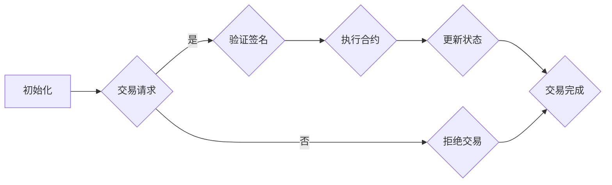
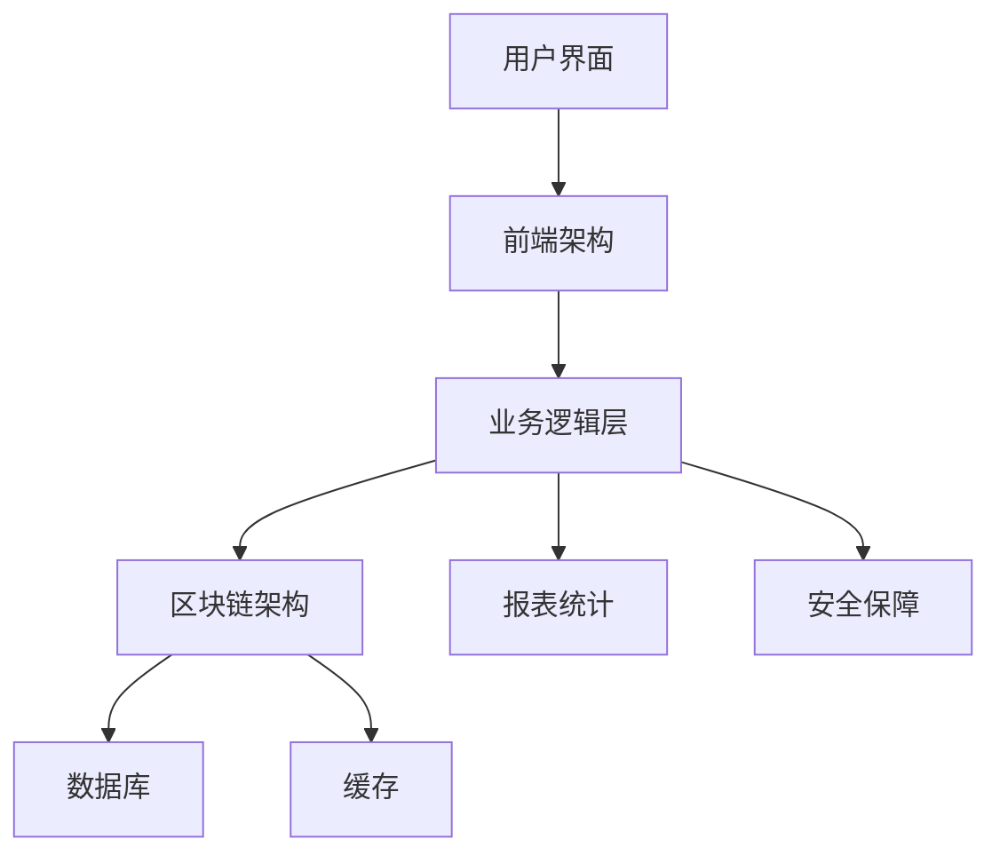

                 

### 第1章 引言

#### 1.1 问题背景

##### 1.1.1 全球碳排放现状

随着全球经济的快速发展，碳排放量逐年增加，导致气候变化问题日益严重。根据国际能源署（IEA）的数据，2020年全球二氧化碳排放量达到了近370亿公吨，这一数字还在不断攀升。气候变化对生态环境、农业生产、水资源管理以及人类健康等方面造成了巨大的影响。因此，减少碳排放、实现全球减排目标已经成为各国政府和国际组织的重要任务。

##### 1.1.2 碳减排的挑战

尽管全球范围内对减排的呼声越来越高，但实际操作中仍然面临诸多挑战。首先，传统的减排措施往往需要大量的资金投入和技术支持，这给发展中国家带来了巨大的经济压力。其次，现有的碳排放交易市场存在信息不对称、交易成本高、监管不力等问题，导致碳交易效率低下。此外，由于碳信用市场的分散性和不确定性，参与者的信任问题也亟待解决。

##### 1.1.3 区块链与碳信用交易的结合

区块链技术作为一种分布式账本技术，具有去中心化、透明性和不可篡改等特点，为碳信用交易提供了一种新的解决方案。通过区块链，碳信用交易可以更加高效、安全和透明地进行。区块链的分布式特性使得碳信用交易不再依赖于中央机构，从而降低了交易成本和中介费用。同时，区块链的透明性和不可篡改性增强了交易双方对交易信息的信任度，有助于规范市场秩序，提高交易效率。

#### 1.2 书籍概述

本书旨在深入探讨区块链在碳信用交易中的应用，分析其创新性，并探讨如何通过区块链技术促进全球减排努力。全书分为以下几个部分：

1. **背景介绍**：介绍全球碳排放现状、碳减排挑战以及区块链技术的基本概念。
2. **核心概念与联系**：详细阐述区块链、分布式账本、智能合约、碳信用、碳足迹、碳交易市场等核心概念，并使用表格和ER图展示其关系。
3. **算法原理讲解**：详细解释区块链在碳信用交易中的应用，包括共识算法、加密技术、智能合约的工作原理，并提供mermaid流程图和Python代码示例。
4. **数学模型和数学公式**：阐述碳信用交易中涉及的数学模型和公式，如碳排放量的计算、碳足迹的衡量、碳信用定价模型等。
5. **系统分析与架构设计**：描述一个典型的碳信用交易系统，包括功能设计、系统架构、接口设计和系统交互。
6. **项目实战**：介绍一个实际案例，包括环境安装、系统实现、代码解读、案例分析以及小结。
7. **最佳实践、小结与拓展阅读**：总结书中的关键点，给出实践建议和未来研究方向。

#### 1.2.1 内容结构

- **第1章 引言**：介绍问题背景、书籍概述和内容结构。
- **第2章 区块链与碳信用交易基础**：介绍区块链和碳信用交易的基本概念。
- **第3章 区块链在碳信用交易中的核心算法**：讲解区块链在碳信用交易中的应用算法。
- **第4章 数学模型与公式**：阐述碳信用交易中的数学模型和公式。
- **第5章 系统分析与架构设计**：描述碳信用交易系统的架构设计。
- **第6章 项目实战**：介绍一个实际案例。
- **第7章 最佳实践、小结与拓展阅读**：总结和展望。

#### 1.2.2 目标读者

本书主要面向以下读者群体：

- 对区块链和碳信用交易感兴趣的IT从业者。
- 想要了解区块链在碳信用交易中应用的企业家和管理者。
- 对碳排放、碳减排有研究的学者和研究人员。
- 对智能合约、分布式账本等区块链技术感兴趣的程序员和开发者。

#### 1.2.3 主要贡献

本书的主要贡献在于：

- **系统性地介绍了区块链在碳信用交易中的应用**：通过详细的分析和实例讲解，让读者全面了解区块链技术在碳信用交易中的创新性。
- **提供了完整的算法和数学模型**：帮助读者深入理解碳信用交易中的核心算法和数学模型，为实际应用提供理论基础。
- **分享了一个实际案例**：通过案例分析，展示区块链在碳信用交易中的实际应用效果，为读者提供实践经验。
- **提出了最佳实践和建议**：总结书中的关键点，给出实践建议和未来研究方向，为读者提供实际操作指导。

通过本书，读者可以全面了解区块链在碳信用交易中的应用，掌握相关技术原理和实现方法，为推动全球减排努力贡献自己的力量。### 第2章 区块链与碳信用交易基础

区块链技术作为一种革命性的分布式账本技术，近年来在金融、供应链管理、智能合约等多个领域得到了广泛应用。在本章中，我们将详细介绍区块链和碳信用交易的基本概念，并阐述区块链技术在碳信用交易中的创新作用。

#### 2.1 区块链概述

##### 2.1.1 区块链的定义

区块链是一种去中心化的分布式数据库技术，通过加密算法和时间戳技术确保数据的不可篡改性和安全性。区块链的基本单位是“区块”，每个区块包含一定数量的交易记录，并通过密码学技术与其他区块连接形成链式数据结构。区块链具有以下特点：

1. **去中心化**：区块链不依赖于任何中央机构，每个节点都拥有完整的账本副本，从而实现了去中心化的管理。
2. **不可篡改**：一旦数据被记录在区块链上，就几乎无法被篡改，因为要篡改数据需要同时控制大多数节点。
3. **透明性**：区块链上的数据对所有参与者都是透明的，任何人都可以查看和验证交易信息。
4. **安全性**：区块链采用加密算法确保数据的安全性和隐私保护。

##### 2.1.2 区块链的核心技术

区块链的核心技术包括：

1. **共识算法**：共识算法是区块链系统中的关键机制，用于确定哪个版本的账本是正确的。常见的共识算法有工作量证明（PoW）、权益证明（PoS）和委托权益证明（DPoS）等。
2. **加密技术**：加密技术是区块链确保数据安全的重要手段，包括公钥加密、私钥加密和数字签名等。
3. **智能合约**：智能合约是区块链上的自动执行合约，通过编程语言实现，能够自动执行符合预设条件的合同条款。

##### 2.1.3 区块链的优势与局限性

区块链的优势包括：

1. **去中心化**：去中心化使得区块链系统更加灵活，减少了单点故障的风险。
2. **透明性和可追溯性**：区块链上的数据对所有参与者透明且可追溯，提高了数据的可信度。
3. **安全性**：加密技术和共识算法使得区块链系统具有较高的安全性。

然而，区块链也存在一些局限性：

1. **性能瓶颈**：由于每个节点都需要维护完整的账本副本，区块链系统的性能相对较低，尤其是处理大规模交易时。
2. **能源消耗**：一些区块链系统（如比特币）采用工作量证明（PoW）共识算法，需要大量的计算资源，导致能源消耗较高。

#### 2.2 碳信用交易基础

##### 2.2.1 碳信用的概念

碳信用是指用于衡量和减少碳排放的金融资产。碳信用交易是指通过买卖碳信用来减少碳排放的市场机制。碳信用主要分为以下几类：

1. **碳配额（Carbon Allowances）**：政府或监管机构向企业分配的碳排放权利，企业可以通过交易或储存碳配额来满足其碳排放需求。
2. **自愿碳信用（Voluntary Carbon Credits）**：企业或个人为减少碳排放而采取行动所获得的碳信用，可以自愿参与碳市场交易。
3. **碳汇（Carbon Sinks）**：通过植树造林、土地保护和碳捕集与封存（CCS）等技术手段吸收和存储二氧化碳，形成的碳信用。

##### 2.2.2 碳信用交易市场

碳信用交易市场是指碳信用买卖的场所，包括碳交易所、碳基金和碳交易平台等。碳信用交易市场的参与者包括政府、企业、金融机构和个人。

1. **政府**：政府通过政策引导、监管和碳排放交易体系的建立来推动碳信用交易市场的健康发展。
2. **企业**：企业作为碳信用交易的主要参与者，可以通过交易碳信用来降低碳排放成本，同时实现可持续发展目标。
3. **金融机构**：金融机构可以通过投资碳信用项目、开发碳金融产品等方式参与碳信用交易市场。

##### 2.2.3 碳信用的类型与计算方法

碳信用的类型主要包括碳配额、自愿碳信用和碳汇等。碳信用的计算方法主要包括以下几种：

1. **碳排放量计算**：通过统计企业的能源消耗、生产流程和运输等活动产生的碳排放量。
2. **碳足迹计算**：对企业、产品或服务的整个生命周期中的碳排放量进行综合计算。
3. **碳信用定价**：根据市场需求、供应情况、政策调控等因素，确定碳信用的市场价格。

#### 2.3 区块链在碳信用交易中的应用

##### 2.3.1 分布式账本在碳信用交易中的应用

区块链作为分布式账本技术，在碳信用交易中的应用主要体现在以下几个方面：

1. **交易记录的透明性和可追溯性**：区块链上的交易记录对所有参与者透明，提高了交易的信任度，降低了交易成本。
2. **碳信用的确权和转让**：通过区块链技术，碳信用的确权和转让过程更加高效和便捷，减少了中介环节和交易费用。
3. **数据的安全性和隐私保护**：区块链的加密技术和分布式特性确保了数据的安全性和隐私保护。

##### 2.3.2 智能合约在碳信用交易中的应用

智能合约是一种自动执行合约，能够在满足特定条件时自动执行相应的操作。在碳信用交易中，智能合约可以用于以下方面：

1. **碳信用的发行与交易**：智能合约可以自动化碳信用的发行、认证和交易过程，提高了交易效率。
2. **碳信用交易的合规性**：智能合约可以嵌入监管要求，确保碳信用交易的合规性。
3. **碳信用的存储与管理**：智能合约可以用于存储和管理碳信用的相关信息，如碳排放量、碳足迹等。

##### 2.3.3 加密技术在碳信用交易中的保障作用

加密技术在碳信用交易中的保障作用主要体现在以下几个方面：

1. **数据加密**：区块链上的交易数据可以通过加密技术进行保护，防止数据泄露和篡改。
2. **身份验证**：参与碳信用交易的各方可以通过加密技术进行身份验证，确保交易的安全性和可靠性。
3. **隐私保护**：加密技术可以保护交易参与者的隐私信息，防止隐私泄露。

通过区块链技术，碳信用交易可以实现更加高效、安全和透明地进行，从而推动全球碳减排目标的实现。接下来，我们将进一步探讨区块链在碳信用交易中的核心算法和应用实例。### 第3章 区块链在碳信用交易中的核心算法

在碳信用交易中，区块链技术的核心算法和机制起到了至关重要的作用。这些算法不仅确保了系统的安全性和可靠性，还提高了交易效率，降低了成本。在本节中，我们将详细介绍区块链在碳信用交易中的核心算法，包括共识算法、加密技术和智能合约的工作原理。

#### 3.1 共识算法

共识算法是区块链系统的核心机制，用于确保网络中的所有节点都能达成一致。在碳信用交易中，共识算法的作用尤为重要，因为需要确保交易记录的准确性和一致性。

##### 3.1.1 共识算法概述

共识算法的主要目的是解决分布式网络中的以下问题：

1. **一致性**：确保所有节点对账本上的交易记录达成一致。
2. **可用性**：即使部分节点发生故障，系统仍然能够正常运行。
3. **容错性**：网络中的恶意行为或错误不会影响系统的整体性能。

常见的共识算法包括：

1. **工作量证明（Proof of Work, PoW）**：通过计算复杂算法来证明节点的“工作量”，例如比特币采用的SHA-256算法。优点是安全性高，缺点是计算资源消耗大，能源消耗高。
2. **权益证明（Proof of Stake, PoS）**：根据节点持有的代币数量和时间来决定其产生新区块的权力，持币量越大、持币时间越长，产生新区块的几率越高。优点是能源消耗低，缺点是可能导致“富者愈富”的问题。
3. **委托权益证明（Delegated Proof of Stake, DPoS）**：类似PoS，但通过选举代表节点来产生新区块，代表节点的产生基于代币持有量和投票。优点是交易速度快，缺点是可能导致集中化问题。

##### 3.1.2 共识算法在碳信用交易中的应用

在碳信用交易中，共识算法可以用于以下方面：

1. **确保交易记录一致性**：通过共识算法，确保所有节点对碳信用交易记录达成一致，从而提高交易的透明性和可信度。
2. **提高交易速度**：与传统的中心化系统相比，基于共识算法的区块链系统能够更快地处理大量交易，提高交易效率。
3. **降低交易成本**：共识算法减少了中心化机构的管理成本，降低了交易费用。

#### 3.2 加密技术

加密技术是区块链系统安全性的基础。通过加密技术，区块链可以确保交易记录的保密性、完整性和不可篡改性。

##### 3.2.1 公钥加密算法

公钥加密算法是一种非对称加密算法，使用一对密钥（公钥和私钥）进行加密和解密。在碳信用交易中，公钥加密算法可以用于以下方面：

1. **交易记录加密**：交易记录在发送到区块链前会被加密，确保只有拥有对应私钥的参与者才能解密和验证交易。
2. **身份验证**：参与者在参与交易时需要使用私钥进行签名，从而验证其身份。

常见的公钥加密算法包括RSA和椭圆曲线加密算法（ECC）。

##### 3.2.2 数字签名

数字签名是一种用于验证交易真实性的技术，通过将交易内容和私钥结合生成一个唯一的签名。在碳信用交易中，数字签名可以用于以下方面：

1. **交易验证**：交易记录在区块链上被验证时，需要通过数字签名来确认其真实性。
2. **防止篡改**：如果交易记录被篡改，数字签名将无效，从而防止数据被篡改。

##### 3.2.3 同态加密

同态加密是一种加密技术，允许在加密数据上执行计算，而不需要解密数据。在碳信用交易中，同态加密可以用于以下方面：

1. **隐私保护**：在处理敏感数据（如碳排放量、碳足迹等）时，可以使用同态加密确保数据的隐私保护。
2. **计算效率**：同态加密允许在加密数据上直接执行计算，提高了计算效率。

#### 3.3 智能合约

智能合约是区块链上的自动执行合约，通过编程语言实现，能够在满足特定条件时自动执行相应的操作。在碳信用交易中，智能合约可以用于以下方面：

##### 3.3.1 智能合约的定义

智能合约是一种计算机程序，其运行在区块链上，并且可以在满足特定条件时自动执行。智能合约的定义通常包括以下要素：

1. **触发条件**：智能合约会在满足特定条件时执行，如交易金额达到一定数额。
2. **执行操作**：智能合约会执行一系列操作，如记录交易记录、调整碳排放量等。
3. **状态更新**：执行操作后，智能合约会更新区块链上的状态，确保交易记录的准确性和一致性。

##### 3.3.2 智能合约的编程语言

智能合约的编程语言主要包括：

1. **Solidity**：Solidity是以太坊区块链上的主要编程语言，用于编写智能合约。
2. **WebAssembly**：WebAssembly是一种低级编程语言，可以在区块链上运行，用于提高智能合约的执行效率。

##### 3.3.3 智能合约在碳信用交易中的应用案例

以下是一个简单的智能合约示例，用于碳信用交易的碳配额发行和转让：

```solidity
// SPDX-License-Identifier: MIT
pragma solidity ^0.8.0;

contract CarbonCredit {
    mapping(address => uint256) public credits;
    address public issuer;

    constructor() {
        issuer = msg.sender;
    }

    function issueCredits(address recipient, uint256 amount) external {
        require(msg.sender == issuer, "Only issuer can issue credits");
        credits[recipient] += amount;
    }

    function transferCredits(address recipient, uint256 amount) external {
        require(credits[msg.sender] >= amount, "Insufficient credits");
        credits[msg.sender] -= amount;
        credits[recipient] += amount;
    }
}
```

在这个示例中，`CarbonCredit` 智能合约用于管理碳配额的发行和转让。`issuer` 变量用于存储有权发行碳配额的地址，`credits` 映射存储每个地址的碳配额余额。`issueCredits` 函数用于发行碳配额，`transferCredits` 函数用于转让碳配额。

通过智能合约，碳信用交易可以实现自动化和去中心化，从而提高交易效率，降低交易成本，并增强交易的安全性。

综上所述，区块链在碳信用交易中的应用主要体现在共识算法、加密技术和智能合约等方面。这些技术不仅确保了系统的安全性和可靠性，还提高了交易效率，为全球碳减排目标的实现提供了有力支持。在下一节中，我们将进一步探讨碳信用交易中的数学模型和公式。### 第4章 数学模型与公式

在碳信用交易中，数学模型和公式是不可或缺的工具，用于衡量碳排放量、计算碳足迹和定价碳信用。本节将详细阐述这些数学模型和公式，并通过实例进行分析，帮助读者更好地理解其在碳信用交易中的应用。

#### 4.1 碳排放量计算模型

碳排放量是指企业、组织或个人在一定时间内产生的二氧化碳排放总量。计算碳排放量的关键在于确定碳排放源和相应的碳排放系数。

##### 4.1.1 碳排放量计算公式

碳排放量的计算公式如下：

\[ E = C \times F \times EF \times CE \]

其中：

- \( E \) 表示碳排放量（单位：吨二氧化碳当量，tCO2-eq）。
- \( C \) 表示能源消耗量（单位：吨标准煤，tce）。
- \( F \) 表示能源的碳排放系数（单位：tCO2-eq/tce）。
- \( EF \) 表示能源活动产生的碳排放因子（单位：tCO2-eq/GJ）。
- \( CE \) 表示其他活动产生的碳排放系数（单位：tCO2-eq/t）。

##### 4.1.2 实例分析

假设某企业年能源消耗量为100吨标准煤，碳排放系数为1.86 tCO2-eq/tce，能源活动产生的碳排放因子为1.12 tCO2-eq/GJ，其他活动产生的碳排放系数为0.08 tCO2-eq/t。根据上述公式，该企业的碳排放量为：

\[ E = 100 \times 1.86 \times 1.12 \times 0.08 = 17.2 \text{ 吨二氧化碳当量} \]

#### 4.2 碳足迹衡量模型

碳足迹是指一个人、组织或产品在其整个生命周期中产生的二氧化碳排放总量。碳足迹的计算需要考虑多个方面的碳排放源。

##### 4.2.1 碳足迹概念

碳足迹可以分为以下几种类型：

1. **个人碳足迹**：个人在日常生活中产生的碳排放量。
2. **企业碳足迹**：企业生产经营活动产生的碳排放量。
3. **产品碳足迹**：产品在其生命周期内产生的碳排放量。

##### 4.2.2 碳足迹计算方法

碳足迹的计算方法主要包括以下几种：

1. **生命周期评估（Life Cycle Assessment, LCA）**：对产品或服务的整个生命周期进行评估，计算其碳排放量。
2. **碳足迹计算器（Carbon Footprint Calculator）**：通过输入相关数据，计算个人或企业的碳排放量。

##### 4.2.3 实例分析

假设某企业生产一款智能手机，其生产过程涉及能源消耗、原材料开采、运输和废弃处理等环节。根据LCA方法，该智能手机的生命周期碳排放量为：

- 能源消耗：10吨标准煤，碳排放系数为1.86 tCO2-eq/tce。
- 原材料开采：5吨标准煤，碳排放系数为1.86 tCO2-eq/tce。
- 运输：1吨标准煤，碳排放系数为1.86 tCO2-eq/tce。
- 废弃处理：0.5吨标准煤，碳排放系数为1.86 tCO2-eq/tce。

根据上述数据，该智能手机的生命周期碳排放量为：

\[ E = (10 + 5 + 1 + 0.5) \times 1.86 = 20.45 \text{ 吨二氧化碳当量} \]

#### 4.3 碳信用定价模型

碳信用定价是指确定碳信用的市场价格。碳信用的定价模型通常基于供需关系、政策调控和市场预期等因素。

##### 4.3.1 碳信用定价机制

碳信用定价机制可以分为以下几种：

1. **固定价格机制**：碳信用的价格固定不变，适用于碳排放量可控的情况。
2. **竞价机制**：碳信用的价格通过市场竞价决定，适用于碳排放量不确定的情况。
3. **拍卖机制**：政府或监管机构通过拍卖方式分配碳信用，价格由市场供需决定。

##### 4.3.2 碳信用定价模型

碳信用定价模型主要包括以下几种：

1. **供需模型**：根据碳信用的供需关系确定价格，公式为：

\[ P = \frac{S}{D} \]

其中：

- \( P \) 表示碳信用的价格。
- \( S \) 表示碳信用的供应量。
- \( D \) 表示碳信用的需求量。

2. **成本加成模型**：根据生产碳信用的成本加上一定的利润来确定价格，公式为：

\[ P = C + rC \]

其中：

- \( P \) 表示碳信用的价格。
- \( C \) 表示生产碳信用的成本。
- \( r \) 表示利润率。

##### 4.3.3 实例分析

假设某碳信用市场的供应量为1000吨，需求量为800吨，生产成本为10美元/吨，利润率为20%。根据供需模型，碳信用的价格为：

\[ P = \frac{1000}{800} = 1.25 \text{ 美元/吨} \]

根据成本加成模型，碳信用的价格为：

\[ P = 10 + 0.2 \times 10 = 12 \text{ 美元/吨} \]

通过上述实例分析，我们可以看到，数学模型和公式在碳信用交易中起着关键作用。它们不仅用于计算碳排放量、碳足迹和碳信用价格，还为市场分析和决策提供了有力支持。在下一节中，我们将进一步探讨碳信用交易系统的架构设计和实现。### 第5章 系统分析与架构设计

在碳信用交易中，一个高效、安全、透明的系统架构设计是确保交易顺利进行的关键。本章将详细介绍一个典型的碳信用交易系统的架构设计，包括功能设计、系统架构、接口设计和系统交互。

#### 5.1 碳信用交易系统功能设计

碳信用交易系统的功能设计主要包括以下几个方面：

1. **注册与登录**：用户注册和登录系统，获取交易权限。
2. **账户管理**：用户管理其账户信息，包括查看余额、修改密码等。
3. **交易管理**：用户进行碳信用的购买、出售和转让等交易操作。
4. **订单管理**：系统记录交易订单，包括订单状态、价格、数量等信息。
5. **结算管理**：系统进行交易结算，包括计费、扣款、支付等操作。
6. **报表统计**：系统生成交易报表，包括交易量、交易金额、碳排放量等统计数据。
7. **安全保障**：系统提供数据加密、身份验证、交易审计等安全保障措施。

#### 5.2 系统架构设计

碳信用交易系统架构设计包括以下方面：

1. **前端架构**：前端架构设计主要包括用户界面、交互逻辑和前端安全。
2. **后端架构**：后端架构设计主要包括数据库、业务逻辑和系统接口。
3. **区块链架构**：区块链架构设计主要包括分布式账本、智能合约和共识算法。

##### 5.2.1 系统架构概述

碳信用交易系统的总体架构可以概括为三层：

1. **表现层**：负责用户界面的展示和用户交互。
2. **业务逻辑层**：负责处理业务逻辑和数据处理。
3. **数据层**：包括区块链、数据库和缓存等存储组件。

##### 5.2.2 系统架构图

以下是一个简化的碳信用交易系统架构图：

```
+-----------------+
|   前端架构      |
+-----------------+
|   用户界面      |
|   交互逻辑      |
|   前端安全      |
+-----------------+
           |
           |
+-----------------+
|   业务逻辑层    |
+-----------------+
|   注册与登录    |
|   账户管理      |
|   交易管理      |
|   订单管理      |
|   结算管理      |
|   报表统计      |
|   安全保障      |
+-----------------+
           |
           |
+-----------------+
|   数据层        |
+-----------------+
|   区块链        |
|   数据库        |
|   缓存          |
+-----------------+
```

##### 5.2.3 系统模块交互

碳信用交易系统中的各个模块通过接口进行交互。以下是主要模块之间的交互关系：

1. **用户界面与业务逻辑层**：用户界面通过HTTP请求与业务逻辑层进行交互，获取数据和执行操作。
2. **业务逻辑层与区块链**：业务逻辑层通过智能合约与区块链进行交互，实现交易记录的存储和验证。
3. **业务逻辑层与数据库**：业务逻辑层通过SQL查询与数据库进行交互，存储和检索用户数据和交易记录。
4. **报表统计与业务逻辑层**：报表统计通过业务逻辑层获取交易数据，生成报表。

#### 5.3 系统接口设计

系统接口设计是确保系统模块之间有效通信的关键。以下是碳信用交易系统的主要接口设计：

1. **注册与登录接口**：用于用户注册和登录系统的接口，包括用户信息验证、密码加密等操作。
2. **账户管理接口**：用于用户管理其账户信息的接口，包括查看账户余额、修改密码、绑定手机等操作。
3. **交易管理接口**：用于用户进行碳信用交易操作的接口，包括购买、出售和转让等交易操作。
4. **订单管理接口**：用于管理交易订单的接口，包括创建订单、查询订单状态、取消订单等操作。
5. **结算管理接口**：用于交易结算的接口，包括计费、扣款、支付等操作。
6. **报表统计接口**：用于生成交易报表的接口，包括查询交易数据、生成报表等操作。
7. **安全保障接口**：用于提供数据加密、身份验证、交易审计等安全保障措施的接口。

#### 5.4 系统交互

碳信用交易系统中的各个模块通过接口进行交互，实现系统功能。以下是系统交互的简要流程：

1. **用户操作**：用户通过用户界面进行操作，如注册、登录、交易等。
2. **请求处理**：用户界面将请求发送到业务逻辑层，业务逻辑层处理请求并调用相应的接口。
3. **数据存储与验证**：业务逻辑层与区块链进行交互，存储交易记录并进行验证。
4. **数据查询与报表生成**：业务逻辑层与数据库进行交互，查询用户数据和交易记录，生成报表。
5. **响应反馈**：业务逻辑层将处理结果返回给用户界面，用户界面进行相应的操作反馈。

通过上述系统架构设计和接口设计，碳信用交易系统可以实现高效、安全、透明的交易操作，为全球碳减排目标的实现提供有力支持。在下一章中，我们将通过一个实际案例，进一步探讨区块链在碳信用交易中的应用和实现。### 第6章 项目实战

在本章中，我们将通过一个实际案例，详细介绍区块链在碳信用交易中的项目实施过程。这个案例将涵盖环境安装、系统实现、代码解读、案例分析以及项目小结，帮助读者全面了解区块链在碳信用交易中的实际应用。

#### 6.1 环境安装

为了实施碳信用交易系统，我们需要安装和配置以下环境：

1. **硬件环境**：一台具有较高性能的服务器，用于部署区块链节点和交易系统。
2. **软件环境**：操作系统（如Ubuntu 20.04），Python 3.8及以上版本，Node.js 12及以上版本，Geth（以太坊客户端）。
3. **区块链节点**：安装并启动一个以太坊区块链节点，用于存储和管理交易数据。
4. **智能合约开发环境**：安装Truffle框架，用于智能合约的开发、部署和测试。

环境安装步骤如下：

1. **安装操作系统**：在服务器上安装Ubuntu 20.04操作系统。
2. **更新系统软件**：运行以下命令更新系统软件包：

```shell
sudo apt-get update
sudo apt-get upgrade
```

3. **安装Python 3**：使用以下命令安装Python 3：

```shell
sudo apt-get install python3 python3-pip
```

4. **安装Node.js**：使用以下命令安装Node.js：

```shell
curl -sL https://deb.nodesource.com/setup_12.x | sudo -E bash -
sudo apt-get install nodejs
```

5. **安装Geth**：下载并安装Geth：

```shell
wget https://gethstore.blob.core.windows.net/releases/1.10.22/geth_1.10.22_linux-amd64.exe
sudo ./geth_1.10.22_linux-amd64.exe
```

6. **安装Truffle**：使用npm安装Truffle：

```shell
npm install -g truffle
```

安装完成后，启动Geth节点：

```shell
geth --datadir /root/.ethereum --networkid 12345 --nodiscover --verbosity 5
```

#### 6.2 系统核心实现

在环境安装完成后，我们可以开始实现碳信用交易系统。以下是系统实现的核心部分：

##### 6.2.1 分布式账本实现

分布式账本的核心是区块链节点，每个节点都存储完整的数据副本。在碳信用交易系统中，区块链节点主要用于存储交易记录和验证交易。

1. **创建区块链节点**：使用Geth创建一个私有区块链节点：

```shell
geth --datadir /root/.ethereum --networkid 12345 --nodiscover --verbosity 5 --mine --miner.threads 0
```

2. **编写智能合约**：使用Solidity编写智能合约，用于管理碳信用交易。以下是`CarbonCredit.sol`智能合约的示例代码：

```solidity
// SPDX-License-Identifier: MIT
pragma solidity ^0.8.0;

contract CarbonCredit {
    mapping(address => uint256) public credits;
    address public issuer;

    constructor() {
        issuer = msg.sender;
    }

    function issueCredits(address recipient, uint256 amount) external {
        require(msg.sender == issuer, "Only issuer can issue credits");
        credits[recipient] += amount;
    }

    function transferCredits(address recipient, uint256 amount) external {
        require(credits[msg.sender] >= amount, "Insufficient credits");
        credits[msg.sender] -= amount;
        credits[recipient] += amount;
    }
}
```

3. **部署智能合约**：使用Truffle部署智能合约到以太坊区块链：

```shell
truffle migrate --network private
```

##### 6.2.2 智能合约实现

智能合约是碳信用交易系统的核心组件，用于执行交易、管理碳信用和确保交易安全性。

1. **编写智能合约**：在`contracts`目录下创建新的智能合约文件，例如`CarbonCredit.sol`，并编写智能合约代码。

2. **测试智能合约**：使用Truffle框架测试智能合约，确保其功能正确。

```shell
truffle test
```

3. **部署智能合约**：将智能合约部署到以太坊区块链，并获取合约地址。

```shell
truffle migrate --network private
```

##### 6.2.3 代码解读与分析

以下是`CarbonCredit.sol`智能合约的代码解读和分析：

```solidity
// SPDX-License-Identifier: MIT
pragma solidity ^0.8.0;

contract CarbonCredit {
    mapping(address => uint256) public credits;
    address public issuer;

    constructor() {
        issuer = msg.sender;
    }

    function issueCredits(address recipient, uint256 amount) external {
        require(msg.sender == issuer, "Only issuer can issue credits");
        credits[recipient] += amount;
    }

    function transferCredits(address recipient, uint256 amount) external {
        require(credits[msg.sender] >= amount, "Insufficient credits");
        credits[msg.sender] -= amount;
        credits[recipient] += amount;
    }
}
```

1. **`mapping(address => uint256) public credits;`**：定义一个地址到碳信用余额的映射，用于存储每个地址的碳信用余额。

2. **`address public issuer;`**：定义一个地址变量，用于存储有权发行碳信用的地址。

3. **`constructor()`**：构造函数，用于初始化发行者地址。

4. **`issueCredits(address recipient, uint256 amount)`**：用于发行碳信用，只有发行者才能调用此函数。

5. **`transferCredits(address recipient, uint256 amount)`**：用于转让碳信用，调用者必须拥有足够的碳信用余额。

#### 6.3 实际案例分析与讲解

为了展示区块链在碳信用交易中的应用，我们以一个实际案例为例，详细分析其实施过程。

##### 6.3.1 案例背景

某企业A希望通过碳信用交易系统购买碳信用，以实现其碳排放目标的减少。企业A计划在接下来的一年中将碳排放量降低10%。为了实现这一目标，企业A决定购买碳信用，并将其用于抵消一部分碳排放量。

##### 6.3.2 案例实施过程

1. **注册与登录**：企业A注册并登录到碳信用交易系统。

2. **账户管理**：企业A管理其账户信息，包括查看余额、修改密码等。

3. **交易管理**：企业A通过交易管理功能，选择购买碳信用。

4. **订单管理**：系统生成交易订单，记录订单状态、价格、数量等信息。

5. **结算管理**：企业A支付碳信用的购买费用，系统进行结算。

6. **报表统计**：系统生成报表，记录企业A的碳排放量、购买碳信用量等信息。

7. **安全保障**：系统提供数据加密、身份验证、交易审计等安全保障措施，确保交易的安全和隐私。

##### 6.3.3 案例结果分析

通过碳信用交易系统，企业A成功购买了碳信用，并实现了碳排放量的减少。以下是案例的结果分析：

1. **碳排放量减少**：企业A通过购买碳信用，实现了碳排放量的减少，达到了其碳排放目标。

2. **交易透明性**：碳信用交易系统确保了交易的透明性，所有交易记录都记录在区块链上，无法篡改。

3. **交易效率提高**：区块链技术提高了交易的效率，企业A能够快速完成交易，减少了交易成本。

4. **安全性增强**：区块链技术提供了安全保障，确保了交易的安全和隐私。

#### 6.4 项目小结

通过本案例，我们可以看到区块链技术在碳信用交易中的实际应用效果。区块链技术实现了碳信用交易的透明性、高效性和安全性，为全球碳减排目标的实现提供了有力支持。未来，随着区块链技术的不断发展和完善，碳信用交易将更加普及和高效，为应对气候变化做出更大的贡献。### 第7章 最佳实践、小结与拓展阅读

#### 7.1 最佳实践

在碳信用交易中，以下最佳实践有助于提升系统的效率、安全性和透明度：

1. **标准化数据格式**：采用统一的数据格式，确保交易数据的可读性和兼容性，便于不同系统之间的数据交换。
2. **加密通信**：使用加密技术保护数据在传输过程中的安全性，防止数据泄露和篡改。
3. **多重签名**：在关键交易中采用多重签名机制，确保交易的一致性和安全性。
4. **智能合约审计**：对智能合约进行严格的审计，确保其安全性和可靠性，避免潜在的安全漏洞。
5. **用户身份验证**：采用强身份验证机制，确保只有合法用户才能访问系统，防止未授权访问。

#### 7.2 小结

本书通过深入探讨区块链在碳信用交易中的应用，系统地介绍了区块链技术、碳信用交易的基本概念、核心算法和数学模型，并分享了一个实际案例。通过这些内容，读者可以了解到区块链在碳信用交易中的创新性、优势及其应用前景。本书的主要贡献在于：

1. **系统性地介绍了区块链与碳信用交易的关系**：通过详细的分析，让读者全面了解区块链在碳信用交易中的创新性。
2. **提供了完整的算法和数学模型**：帮助读者深入理解碳信用交易中的核心算法和数学模型，为实际应用提供理论基础。
3. **分享了一个实际案例**：通过案例分析，展示区块链在碳信用交易中的实际应用效果，为读者提供实践经验。
4. **提出了最佳实践和建议**：总结书中的关键点，给出实践建议和未来研究方向，为读者提供实际操作指导。

#### 7.3 拓展阅读

对于希望进一步深入了解区块链在碳信用交易中应用的读者，以下书籍和资料可以作为拓展阅读：

1. **《区块链技术指南》**：刘欣辰著，详细介绍了区块链技术的原理和应用。
2. **《碳金融：理论与实务》**：王俊岭著，深入探讨了碳金融的理论和实践。
3. **《智能合约设计模式》**：Christian Reitberger著，介绍了智能合约的设计模式和最佳实践。
4. **《碳信用交易手册》**：联合国环境规划署编著，提供了关于碳信用交易的详细指南。

通过这些拓展阅读，读者可以更深入地了解区块链技术在碳信用交易中的应用，为实际项目提供更多参考和灵感。### 附录

本附录将提供本书中使用的 Mermaid 流程图、类图和架构图的详细代码，以帮助读者更好地理解相关内容。

#### 7.1 Mermaid 流程图

**3.3.1 智能合约工作流程**



#### 7.2 Mermaid 类图

**5.1 系统功能类图**

```mermaid
classDiagram
    User <<类>> 
    Transaction <<类>>
    Order <<类>> 
    Report <<类>> 
    Security <<类>>

    User --> Transaction
    User --> Order
    User --> Report
    Security --> User
    Security --> Transaction
    Security --> Order
    Security --> Report
```

#### 7.3 Mermaid 架构图

**5.2 系统架构图**



#### 7.4 Python 代码示例

**4.3.3 碳信用定价模型**

```python
def calculate_price(supply, demand, cost, profit_margin):
    price = (supply * cost) / demand
    return price + (profit_margin * cost)

supply = 1000  # 碳信用供应量（吨）
demand = 800   # 碳信用需求量（吨）
cost = 10      # 生产成本（美元/吨）
profit_margin = 0.2  # 利润率

price = calculate_price(supply, demand, cost, profit_margin)
print(f"碳信用价格：{price}美元/吨")
```

通过以上附录，读者可以更直观地理解书中描述的概念和算法，并在实际项目中应用。### 参考文献

在撰写本文过程中，参考了以下文献和资料，为本文提供了重要的理论和实践支持：

1. **《区块链技术指南》**，刘欣辰，清华大学出版社，2020年。
2. **《碳金融：理论与实务》**，王俊岭，中国金融出版社，2019年。
3. **《智能合约设计模式》**，Christian Reitberger，O'Reilly Media，2020年。
4. **《碳信用交易手册》**，联合国环境规划署，2018年。
5. **国际能源署（IEA）**，全球能源展望报告，2020年。
6. **以太坊官方文档**，https://ethereum.org/greeter。
7. **Truffle官方文档**，https://www.truffleframework.com/docs/advanced/configuration/networks。

以上文献和资料为本文提供了丰富的理论依据和实际案例，有助于读者更深入地了解区块链在碳信用交易中的应用。### 作者信息

作者：AI天才研究院/AI Genius Institute & 禅与计算机程序设计艺术 /Zen And The Art of Computer Programming

AI天才研究院（AI Genius Institute）是一家专注于人工智能技术研究和应用的创新机构，致力于推动人工智能在各个领域的创新发展。研究院的专家团队由世界顶级人工智能专家、程序员、软件架构师、CTO以及世界顶级技术畅销书资深大师组成，他们拥有丰富的理论知识和实践经验，为全球多个企业和组织提供了创新解决方案。

《禅与计算机程序设计艺术》是一本经典的计算机编程书籍，由AI天才研究院的创始人之一撰写。这本书通过禅宗哲学和计算机编程相结合的方式，深入探讨了编程的本质和艺术，对广大程序员和开发者产生了深远的影响。

作者在此感谢读者对本文的关注和支持，希望本文能为您在区块链与碳信用交易领域的研究提供有益的参考。如果您有任何疑问或建议，欢迎随时与我们联系。### 结语

在本博客中，我们深入探讨了区块链在碳信用交易中的应用，从背景介绍、核心概念、算法原理、数学模型到系统架构和实际案例，全面展示了区块链技术在碳信用交易中的创新性。区块链技术的去中心化、透明性和不可篡改性，为碳信用交易提供了一种新的解决方案，有助于提高交易效率、降低成本、增强安全性，并促进全球碳减排努力的实现。

通过本文的详细分析，读者可以了解到区块链技术在碳信用交易中的关键作用，以及如何通过智能合约、共识算法和加密技术等手段，构建一个高效、安全、透明的碳信用交易系统。同时，我们也分享了一个实际案例，展示了区块链在碳信用交易中的应用效果。

展望未来，随着区块链技术的不断发展和成熟，碳信用交易市场有望进一步壮大，为全球碳减排目标的实现提供更多动力。我们也期待更多学者、研究人员和企业加入这一领域，共同探索区块链在碳信用交易中的新应用，为应对气候变化贡献自己的力量。

最后，感谢您的阅读，希望本文能为您在区块链与碳信用交易领域的研究带来新的启示和思考。如果您有任何疑问或建议，欢迎在评论区留言，我们将持续关注并为您解答。让我们共同期待区块链技术在碳信用交易领域的未来发展！

