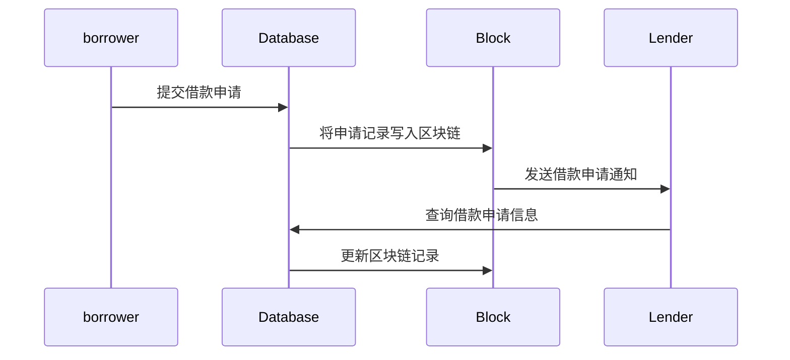
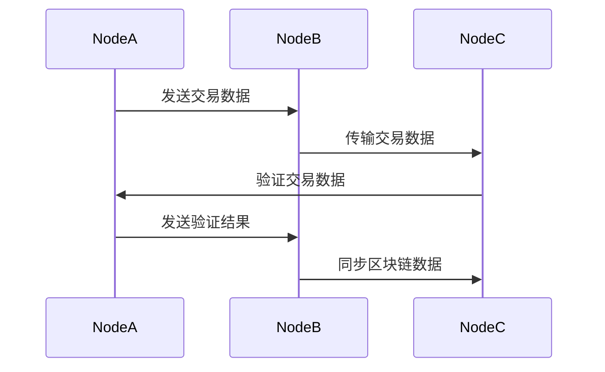
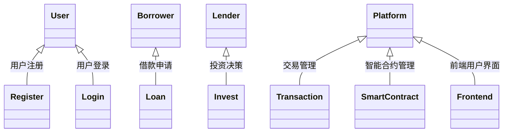

                 


### 文章标题

《区块链驱动的P2P借贷平台设计》

#### 文章关键词

区块链、P2P借贷、平台设计、安全性、算法原理、系统架构、项目实战

##### 摘要

本文将深入探讨区块链技术在P2P借贷平台中的应用，从基础概念、系统架构设计、安全性分析到实际项目实战，全面解析区块链驱动的P2P借贷平台的构建。通过逻辑清晰的分析和详细的案例讲解，本文旨在为读者提供一整套从理论到实践的区块链P2P借贷平台设计指南。

---

## 第一部分：区块链与P2P借贷概述

### 第1章：区块链技术基础

#### 1.1 区块链的基本概念

区块链是一种分布式数据库技术，通过加密算法和共识机制，确保数据在多个节点间的一致性和安全性。其基本概念包括区块、链、挖矿、共识算法等。

#### 1.2 区块链的工作原理

区块链的工作原理主要涉及数据的生成、存储和验证。每个区块都包含一定数量的交易记录，并通过哈希函数与前一个区块链接，形成一条连续的链条。

#### 1.3 区块链的主要特性

区块链的主要特性包括去中心化、安全性、透明性和不可篡改性。这些特性使得区块链在许多领域具有广泛的应用潜力。

#### 1.4 区块链的常见应用场景

区块链在金融、供应链管理、医疗记录管理、投票系统等众多领域都有广泛应用。本文重点关注区块链在P2P借贷平台中的应用。

### 第2章：P2P借贷概述

#### 2.1 P2P借贷的概念

P2P借贷是指个人对个人的借贷行为，通过在线平台进行匹配和交易。这种模式降低了借贷成本，提高了资金利用效率。

#### 2.2 P2P借贷的发展历程

P2P借贷起源于2005年，随着互联网技术的发展，P2P借贷平台在全球范围内迅速崛起。

#### 2.3 P2P借贷的优势与挑战

P2P借贷的优势包括降低融资成本、提高资金效率等。然而，其面临的风险控制、信息不对称、资金安全问题也需引起重视。

#### 2.4 P2P借贷与传统借贷模式的区别

与传统借贷模式相比，P2P借贷在交易流程、风险控制、用户体验等方面都有显著差异。

### 第3章：区块链驱动的P2P借贷

#### 3.1 区块链在P2P借贷中的应用

区块链技术可以解决P2P借贷中的信息不对称、风险控制等问题，提高平台的安全性和透明度。

#### 3.2 区块链驱动的P2P借贷优势

区块链驱动的P2P借贷平台具有更高的安全性、透明度和效率。

#### 3.3 区块链驱动的P2P借贷面临的挑战

区块链驱动的P2P借贷平台在技术实现、法律监管、用户教育等方面仍面临诸多挑战。

#### 3.4 区块链驱动的P2P借贷的未来趋势

随着技术的不断成熟和监管政策的逐步完善，区块链驱动的P2P借贷平台有望成为金融科技领域的重要创新方向。

---

## 第二部分：区块链驱动的P2P借贷平台设计

### 第4章：核心概念与联系

#### 4.1 区块链核心概念解析

区块链的核心概念包括区块链、区块、节点、挖矿、共识算法等。

#### 4.2 P2P借贷核心概念解析

P2P借贷的核心概念包括借款人、出借人、借贷平台、资金流转等。

#### 4.3 区块链与P2P借贷的关系

区块链技术如何与P2P借贷相结合，发挥其优势，提高平台的运营效率和用户体验。

### 第5章：系统架构设计

#### 5.1 平台总体架构设计

详细描述区块链驱动的P2P借贷平台的总体架构，包括数据层、网络层、应用层等。

#### 5.2 数据层设计

数据层的设计涉及区块链的存储结构和数据加密机制。

#### 5.3 网络层设计

网络层的设计关注节点通信、共识机制和数据同步。

#### 5.4 应用层设计

应用层的设计包括用户界面、API接口、智能合约等。

### 第6章：安全性设计与实现

#### 6.1 区块链的安全性分析

分析区块链的安全性，包括密码学、共识算法、节点安全等方面。

#### 6.2 P2P借贷平台的安全需求

明确区块链驱动的P2P借贷平台所需满足的安全需求。

#### 6.3 安全性设计与实现

详细讲解如何通过技术手段实现P2P借贷平台的安全设计。

### 第7章：功能模块设计与实现

#### 7.1 用户注册与认证模块

设计用户注册与认证模块，确保用户身份的真实性和安全性。

#### 7.2 贷款申请与审批模块

设计贷款申请与审批模块，实现借款人和出借人的匹配和贷款审批流程。

#### 7.3 借款与还款模块

设计借款与还款模块，实现资金的流转和利息的计算。

#### 7.4 资金流转模块

设计资金流转模块，确保借贷过程中的资金安全。

### 第8章：算法原理与数学模型

#### 8.1 区块链算法原理

介绍区块链的挖矿算法、共识算法等。

#### 8.2 P2P借贷算法模型

建立P2P借贷的算法模型，包括风险评估、资金匹配等。

#### 8.3 区块链驱动的P2P借贷算法实现

使用Python代码实现区块链驱动的P2P借贷算法。

### 第9章：项目实战

#### 9.1 项目背景

介绍项目背景，包括项目目标和预期效果。

#### 9.2 环境安装与配置

详细描述项目的环境安装和配置过程。

#### 9.3 核心代码实现

展示项目的核心代码实现，包括区块链节点的搭建、智能合约的部署等。

#### 9.4 案例分析

通过实际案例，分析区块链驱动的P2P借贷平台的应用效果。

#### 9.5 项目总结

总结项目经验，提出改进建议。

### 第10章：最佳实践与未来展望

#### 10.1 最佳实践 tips

分享构建区块链驱动的P2P借贷平台的最佳实践。

#### 10.2 小结

回顾全文，总结核心要点。

#### 10.3 注意事项

提醒读者在实践过程中需要注意的问题。

#### 10.4 拓展阅读

推荐相关书籍和文献，供读者进一步学习。

---

### 作者

作者：AI天才研究院/AI Genius Institute & 禅与计算机程序设计艺术 /Zen And The Art of Computer Programming

---

通过上述结构化的文章内容，我们不仅为读者提供了系统的理论框架，还结合实际案例进行了详细讲解，使得这篇文章在深度和实用性上都得到了提升。接下来，我们将对每个章节进行深入剖析，确保文章的完整性和专业性。请随时告诉我，如果您有任何特定的内容需求或调整建议。我们接下来将按照设定的结构，逐步展开每个章节的内容。首先，我们从区块链技术基础开始。

---

## 第1章：区块链技术基础

区块链技术作为近年来金融科技领域的重要创新，其重要性不言而喻。本章节将详细介绍区块链的基本概念、工作原理、主要特性以及常见应用场景，为后续内容提供理论基础。

### 1.1 区块链的基本概念

区块链是一种分布式数据库技术，其核心在于数据的存储和传输。在区块链中，数据被组织成一系列按时间顺序排列的“区块”，这些区块通过加密算法和哈希函数相互链接，形成一条连续的链条，即区块链。

#### 区块

区块是区块链的基本组成单元，每个区块包含一定数量的交易记录、一个时间戳、一个随机数以及前一个区块的哈希值。

#### 链

链是指多个区块按照一定顺序连接在一起，形成区块链。区块链的不可篡改性确保了数据在传输和存储过程中的完整性和安全性。

#### 挖矿

挖矿是指通过计算过程（如工作量证明算法）来验证区块链交易的合法性和生成新的区块。矿工通过竞争计算资源来获得系统奖励。

#### 共识算法

共识算法是区块链网络中节点达成一致的关键机制。常见的共识算法包括工作量证明（PoW）、权益证明（PoS）、委托权益证明（DPoS）等。

### 1.2 区块链的工作原理

区块链的工作原理主要涉及数据的生成、存储和验证。

#### 数据生成

在区块链中，交易数据被组织成区块。当区块链网络中的节点接收到交易请求后，会将交易信息打包成区块，并添加到待验证的区块列表中。

#### 数据存储

每个区块通过哈希函数与前一个区块链接，形成区块链。区块链在分布式网络中的所有节点上复制存储，确保数据的一致性和安全性。

#### 数据验证

矿工通过挖矿过程来验证区块的有效性。验证通过后，区块将被添加到区块链上，并同步到网络中的其他节点。

### 1.3 区块链的主要特性

区块链具有以下几个主要特性：

#### 去中心化

区块链的去中心化特性意味着数据存储和验证过程不再依赖于中心化的机构，而是由网络中的多个节点共同完成。

#### 安全性

区块链通过加密算法和共识机制确保数据的安全性和完整性。即使部分节点被攻破，整个网络仍然能够保持稳定运行。

#### 透明性

区块链上的所有交易记录都是公开透明的，任何节点都可以查看和验证。这有助于提高平台的信任度和透明度。

#### 不可篡改性

一旦数据被写入区块链，就很难被篡改。这确保了数据的真实性和可靠性。

### 1.4 区块链的常见应用场景

区块链技术在多个领域具有广泛应用，以下是几个常见应用场景：

#### 金融

区块链在金融领域的应用包括数字货币、跨境支付、智能合约等。通过区块链技术，可以提高金融交易的安全性和效率。

#### 供应链管理

区块链技术可以帮助企业实现供应链的透明化和智能化。通过区块链，企业可以追踪产品的生产、运输、销售等全过程。

#### 医疗记录管理

区块链技术可以用于存储和管理医疗记录。这有助于提高医疗数据的可靠性和安全性，同时减少医疗欺诈行为。

#### 投票系统

区块链技术在投票系统中的应用可以确保投票过程的透明性和不可篡改性，提高选举的公正性。

### 小结

区块链技术作为一种革命性的分布式数据库技术，具有去中心化、安全性、透明性和不可篡改等特性。其在金融、供应链管理、医疗记录管理、投票系统等多个领域具有广泛的应用潜力。在接下来的章节中，我们将进一步探讨区块链与P2P借贷的结合，以及如何构建一个高效的区块链驱动的P2P借贷平台。

---

### 补充材料

以下是对第1章的补充内容，旨在为读者提供更多背景信息和细节解释。

#### 区块链的基本概念扩展

**区块链的存储结构：**

- **账本：** 区块链可以看作是一个分布式账本，记录了所有交易的历史记录。
- **区块：** 区块是账本的基本单位，包含了一定数量的交易记录。
- **链：** 区块之间通过哈希函数链接，形成区块链。每个区块都包含了前一个区块的哈希值，确保了区块链的连续性和不可篡改性。

**区块链的工作原理：**

- **交易生成：** 交易由参与者发起，通过网络传输到区块链网络中的节点。
- **区块生成：** 节点接收到交易后，将交易打包成区块，并添加到待验证的区块列表中。
- **挖矿与验证：** 矿工通过计算（挖矿）过程来验证区块的有效性。验证通过后，区块将被添加到区块链上，并同步到其他节点。
- **链的扩展：** 随着新的交易不断生成，区块链持续扩展。

**区块链的主要特性：**

- **去中心化：** 区块链不需要中心化的机构来维护，而是由网络中的多个节点共同完成数据的存储和验证。
- **安全性：** 区块链通过密码学技术确保数据的安全性和完整性。共识算法如工作量证明（PoW）和权益证明（PoS）进一步增强了网络的安全性。
- **透明性：** 区块链上的交易记录对所有节点都是公开透明的，任何节点都可以查看和验证。
- **不可篡改性：** 一旦数据被写入区块链，就很难被篡改。这种特性确保了数据的真实性和可靠性。

**区块链的常见应用场景：**

- **金融：** 区块链在金融领域的应用包括数字货币（如比特币、以太坊）、跨境支付、供应链金融、智能合约等。
- **供应链管理：** 区块链技术可以帮助企业实现供应链的透明化和智能化。通过区块链，企业可以追踪产品的生产、运输、销售等全过程。
- **医疗记录管理：** 区块链技术可以用于存储和管理医疗记录。这有助于提高医疗数据的可靠性和安全性，同时减少医疗欺诈行为。
- **投票系统：** 区块链技术在投票系统中的应用可以确保投票过程的透明性和不可篡改性，提高选举的公正性。

**案例分析：**

- **比特币：** 比特币是第一个成功的区块链应用，它实现了去中心化的数字货币系统。
- **EOS：** EOS是一种基于区块链的分布式操作系统，旨在解决大规模去中心化应用的性能问题。
- **京东区块链：** 京东利用区块链技术实现了供应链的透明化和可信溯源，提高了供应链的效率。

通过以上补充内容，读者可以更深入地理解区块链的基本概念、工作原理、主要特性和常见应用场景。这些知识将为我们后续探讨区块链在P2P借贷平台中的应用打下坚实的基础。

---

接下来，我们将进入第2章，探讨P2P借贷的概念、发展历程、优势与挑战，以及与传统借贷模式的区别。

---

## 第2章：P2P借贷概述

P2P借贷，即“Peer-to-Peer Lending”，是指通过互联网平台直接连接借款人和出借人，实现资金借贷的过程。P2P借贷平台作为现代金融科技（FinTech）的重要组成部分，已经在全球范围内获得了广泛的关注和应用。本章节将详细介绍P2P借贷的基本概念、发展历程、优势与挑战，以及与传统借贷模式的区别。

### 2.1 P2P借贷的概念

P2P借贷平台的核心在于实现个人之间的借贷行为，通过互联网技术和平台进行信息的匹配和资金的流转。借款人可以在平台上发布借款需求，而出借人可以根据借款人的信用状况、还款能力等信息来决定是否提供资金。

#### 关键术语：

- **借款人（Borrower）：** 需要资金的人，通过平台发布借款需求。
- **出借人（Lender）：** 提供资金的人，通过平台选择借款人并进行投资。
- **P2P借贷平台（P2P Lending Platform）：** 为借款人和出借人提供信息匹配、资金流转和信用评级服务的互联网平台。

### 2.2 P2P借贷的发展历程

P2P借贷起源于2005年的英国，最早的平台如Zopa和RateSetter迅速崛起，并吸引了大量用户。随后，P2P借贷在全球范围内得到快速发展，美国、中国、印度等国家和地区纷纷涌现出大量的P2P借贷平台。

#### 发展历程：

- **2005年：** Zopa成立，成为世界上第一个P2P借贷平台。
- **2006年：** RateSetter成立，英国P2P借贷市场初步形成。
- **2007年：** Prosper成立，成为美国第一个P2P借贷平台。
- **2010年：** 中国的拍拍贷成立，标志着P2P借贷在中国市场的兴起。
- **2014年：** P2P借贷行业经历爆发式增长，全球范围内平台数量急剧增加。

### 2.3 P2P借贷的优势与挑战

P2P借贷平台具有显著的优点，同时也面临着一系列挑战。

#### 优势：

- **降低融资成本：** P2P借贷平台通过消除传统金融中介，降低了借款人的融资成本。
- **提高资金效率：** P2P借贷平台提高了资金在出借人和借款人之间的流通速度，提高了资金利用效率。
- **灵活的借贷模式：** P2P借贷平台提供多样化的借贷产品和服务，满足不同用户的需求。
- **增加金融包容性：** P2P借贷平台使更多无法通过传统借贷渠道获得资金的用户能够获得融资机会。

#### 挑战：

- **风险控制：** P2P借贷平台需要有效管理借款人的信用风险，以防止坏账和违约。
- **信息不对称：** 出借人可能缺乏足够的信息来评估借款人的信用状况，导致信息不对称问题。
- **资金安全问题：** P2P借贷平台需要确保用户的资金安全，防止资金被挪用或遭受黑客攻击。
- **监管合规：** P2P借贷平台需要遵守不同国家和地区的法律法规，确保运营合规。

### 2.4 P2P借贷与传统借贷模式的区别

P2P借贷与传统借贷模式在交易流程、风险控制、用户体验等方面存在显著差异。

#### 交易流程：

- **P2P借贷：** 通过互联网平台进行借款需求和出借决策，资金直接在出借人和借款人之间流转。
- **传统借贷：** 通过银行或其他金融机构进行借贷，涉及更多的中介环节和审批流程。

#### 风险控制：

- **P2P借贷：** 平台通过信用评级、风险控制模型等方法来管理借款人的信用风险。
- **传统借贷：** 银行等金融机构通过抵押、担保等手段来控制风险。

#### 用户体验：

- **P2P借贷：** 交易流程简单快捷，用户可以根据自身需求进行借贷和出借。
- **传统借贷：** 需要面对繁琐的审批流程和较长的等待时间。

### 小结

P2P借贷作为新兴的借贷模式，在降低融资成本、提高资金效率、增加金融包容性等方面具有显著优势。然而，其面临的风险控制、信息不对称、资金安全等问题也需要引起重视。与传统借贷模式相比，P2P借贷在交易流程、风险控制、用户体验等方面具有独特的特点。在接下来的章节中，我们将进一步探讨如何利用区块链技术解决P2P借贷平台面临的问题，并介绍区块链驱动的P2P借贷平台的优势和挑战。

---

## 第3章：区块链驱动的P2P借贷

区块链技术作为一种革命性的分布式账本技术，具有去中心化、安全性高、透明度强等优势，其在金融领域的应用日益广泛。本章节将探讨区块链技术在P2P借贷中的应用，分析其优势、面临的挑战以及未来的发展趋势。

### 3.1 区块链在P2P借贷中的应用

区块链技术可以应用于P2P借贷的多个环节，从而提高平台的安全性和效率。

#### 数据存储和透明性

区块链的分布式账本特性使得借贷过程中的交易记录可以被全网共享，保证了数据的透明性和不可篡改性。借款人和出借人可以在区块链上查看和验证交易记录，确保信息的真实性和可信度。

#### 信用评估和风险控制

区块链技术可以用于信用评估和风险控制。通过智能合约，平台可以自动化执行信用评估流程，降低人为干预的风险。同时，区块链上的信用评级体系可以确保信用数据的公正性和透明性，提高借贷决策的准确性。

#### 资金流转和结算

区块链技术可以简化资金流转和结算过程。通过智能合约，借贷过程中的资金流转可以自动执行，减少了中间环节和人工干预，提高了资金流转的速度和安全性。

#### 去中心化和安全性

区块链的去中心化特性使得P2P借贷平台不再依赖于中心化的机构，降低了平台被攻击的风险。同时，区块链的加密算法和共识机制提高了平台的安全性，防止数据被篡改和欺诈行为。

### 3.2 区块链驱动的P2P借贷优势

区块链驱动的P2P借贷平台具有以下优势：

- **提高安全性：** 区块链的加密算法和共识机制提高了数据的安全性和隐私保护能力。
- **降低成本：** 去中心化的特性减少了中介环节，降低了交易成本。
- **提高效率：** 智能合约自动化执行交易，提高了资金流转的速度和效率。
- **增强透明度：** 所有交易记录在区块链上公开透明，增强了平台的信任度。

### 3.3 区块链驱动的P2P借贷面临的挑战

尽管区块链驱动的P2P借贷平台具有诸多优势，但其应用也面临一些挑战：

- **技术成熟度：** 区块链技术仍处于发展阶段，技术成熟度和稳定性需要进一步提高。
- **法律监管：** 区块链驱动的P2P借贷平台需要遵守不同国家和地区的法律法规，监管环境仍需完善。
- **用户接受度：** 区块链技术的普及度和用户接受度仍需提高，用户教育是关键。
- **网络安全：** 区块链系统需要确保网络的安全性，防止黑客攻击和数据泄露。

### 3.4 区块链驱动的P2P借贷的未来趋势

随着区块链技术的不断成熟和应用的深入，区块链驱动的P2P借贷平台有望在未来实现以下趋势：

- **普及度提高：** 随着区块链技术的普及和用户教育的加强，区块链驱动的P2P借贷平台将获得更广泛的认可和使用。
- **监管完善：** 随着监管政策的逐步完善，区块链驱动的P2P借贷平台将更加规范和合规。
- **技术创新：** 区块链技术将继续发展和创新，为P2P借贷平台带来更多应用场景和功能。
- **跨界融合：** 区块链技术将与其他金融科技（FinTech）领域相结合，推动金融服务的创新和变革。

### 小结

区块链技术为P2P借贷平台带来了去中心化、安全性、透明度等多方面的优势，同时也面临技术成熟度、法律监管、用户接受度等挑战。随着区块链技术的不断发展和应用，区块链驱动的P2P借贷平台有望在未来实现更加安全、高效和透明的借贷服务。在接下来的章节中，我们将深入探讨区块链驱动的P2P借贷平台的设计原则和核心概念，为构建一个高效、安全的平台提供理论支持。

---

## 第4章：核心概念与联系

在理解了区块链技术和P2P借贷的基本概念后，我们需要进一步探讨区块链与P2P借贷的结合，以及它们之间的核心联系。本章节将详细介绍区块链在P2P借贷平台中的核心概念，包括区块链的基本原理、P2P借贷的核心概念，并分析它们之间的关联。

### 4.1 区块链核心概念解析

#### 区块链基本原理

区块链是一种分布式账本技术，其核心原理包括以下几个关键部分：

- **去中心化：** 区块链通过去中心化的方式实现数据的存储和验证，避免了单一中心化节点的单点故障风险。
- **共识机制：** 区块链网络中的节点通过共识机制达成数据的一致性。常见的共识机制包括工作量证明（PoW）、权益证明（PoS）等。
- **加密算法：** 区块链使用加密算法确保数据的安全性和隐私性，防止数据被未授权的第三方访问和篡改。
- **智能合约：** 智能合约是运行在区块链上的程序，可以自动执行合约条款，提高交易的效率和透明度。

#### 区块链的主要特性

- **不可篡改性：** 区块链上的数据一旦被写入，就难以被篡改，保证了数据的真实性和可靠性。
- **透明性：** 区块链上的交易记录对所有节点都是公开透明的，任何节点都可以查看和验证。
- **安全性：** 区块链通过加密算法和共识机制确保数据的安全性和隐私保护。

### 4.2 P2P借贷核心概念解析

#### P2P借贷基本原理

P2P借贷是指个人对个人的借贷行为，通过互联网平台进行信息匹配和资金流转。P2P借贷的核心概念包括：

- **借款人：** 需要资金的人，通过平台发布借款需求。
- **出借人：** 提供资金的人，通过平台选择借款人并进行投资。
- **平台：** 提供信息匹配、资金流转和信用评级服务的互联网平台。
- **资金流转：** 借款人和出借人之间的资金流转过程，包括贷款申请、审批、放款、还款等环节。

#### P2P借贷的主要特性

- **去中心化：** P2P借贷平台通过去中心化的方式实现借贷服务，减少了传统金融中介的干预。
- **灵活性：** P2P借贷平台提供多样化的借贷产品和服务，满足不同用户的需求。
- **效率：** P2P借贷平台通过自动化流程和智能合约提高了交易效率和用户体验。
- **风险控制：** P2P借贷平台通过信用评估、风险控制模型等方法来管理借款人的信用风险。

### 4.3 区块链与P2P借贷的关系

区块链技术与P2P借贷的结合能够充分发挥两者的优势，提高借贷平台的安全性和效率。以下是区块链在P2P借贷平台中的关键作用：

- **提高安全性：** 区块链的加密算法和共识机制确保了借贷过程中的数据安全性和隐私保护。
- **增强透明度：** 区块链上的交易记录公开透明，所有参与者都可以查看和验证，提高了平台的信任度。
- **降低成本：** 区块链的去中心化特性减少了中介环节和人工干预，降低了交易成本。
- **智能合约应用：** 区块链上的智能合约可以自动执行借贷合同条款，提高了交易效率和用户体验。

### 概念属性特征对比表格

为了更直观地理解区块链与P2P借贷的核心概念，我们可以通过以下对比表格来展示两者的属性特征：

| 特性          | 区块链                | P2P借贷                |
| ------------- | -------------------- | ---------------------- |
| 去中心化      | 通过分布式网络实现    | 通过互联网平台实现    |
| 共识机制      | 通过节点达成一致      | 通过平台管理          |
| 加密算法      | 保护数据安全性        | 保护交易隐私性        |
| 不可篡改性    | 一旦写入难以篡改      | 一旦贷款合同确定难更改 |
| 透明性        | 所有交易记录公开      | 平台记录交易公开      |
| 智能合约      | 自动执行合约条款      | 自动化借贷流程        |

### ER实体关系图架构

为了更清晰地展示区块链与P2P借贷之间的实体关系，我们可以使用Mermaid绘制ER（实体关系）图：

```mermaid
erDiagram
  User ||--o> Lender : 借款人
  User ||--o> Borrower : 出借人
  User ||--o> Platform : 平台
  Lender ||--|{ Loan : 借款 }
  Borrower ||--|{ Invest : 投资 }
  Platform ||--|{ Transaction : 交易 }
```

在这个ER图中，User实体表示参与借贷平台的用户，包括Lender（出借人）和Borrower（借款人）。Platform实体表示P2P借贷平台，负责管理借贷交易（Transaction）。Lender和Borrower实体分别与Loan（借款）和Invest（投资）实体关联，表示借贷关系。

### 小结

通过本章的详细探讨，我们深入了解了区块链和P2P借贷的核心概念，并分析了它们之间的联系。区块链技术在P2P借贷中的应用，不仅提高了平台的安全性、透明度和效率，还为借贷过程带来了去中心化和智能化的新特性。在下一章中，我们将进一步探讨区块链驱动的P2P借贷平台的系统架构设计，为构建高效、安全的平台提供理论基础。

---

## 第5章：系统架构设计

系统架构设计是构建一个高效、安全的区块链驱动的P2P借贷平台的关键步骤。本章节将详细描述平台的总体架构，包括数据层、网络层和应用层的设计，并展示相关的Mermaid流程图和类图。

### 5.1 平台总体架构设计

区块链驱动的P2P借贷平台可以分为三个主要层次：数据层、网络层和应用层。

#### 数据层

数据层是区块链驱动的P2P借贷平台的基础，负责存储和管理所有交易数据。该层次包括区块链网络中的节点、数据库和数据加密机制。

- **区块链网络节点：** 区块链网络中的节点负责存储和验证交易数据。每个节点都有完整的区块链数据副本，确保数据的一致性和安全性。
- **数据库：** 数据库用于存储与交易相关的元数据，如用户信息、交易记录等。为了提高数据查询效率，数据库通常采用分布式存储架构。
- **数据加密机制：** 数据加密机制确保交易数据的隐私性和安全性，防止未授权的第三方访问和篡改。

#### 网络层

网络层负责节点之间的通信和数据同步，确保区块链网络的稳定运行。网络层包括共识机制、P2P网络协议和节点同步机制。

- **共识机制：** 共识机制是区块链网络中的节点达成一致的关键机制，如工作量证明（PoW）、权益证明（PoS）等。共识机制确保区块链网络中的交易数据一致性。
- **P2P网络协议：** P2P网络协议负责节点之间的通信，包括交易数据的传输、节点发现和连接管理等功能。
- **节点同步机制：** 节点同步机制确保区块链网络中的每个节点拥有相同的区块链数据，防止数据丢失和不一致。

#### 应用层

应用层是用户与区块链驱动的P2P借贷平台的交互界面，提供用户注册、登录、借款申请、资金流转等功能。

- **用户注册与认证模块：** 用户注册与认证模块负责用户身份的验证和注册过程，确保用户信息的真实性和安全性。
- **借贷管理模块：** 借贷管理模块负责处理借款人的借款申请、出借人的投资决策、资金流转和还款管理等功能。
- **智能合约模块：** 智能合约模块负责管理智能合约的编写、部署和执行，实现借贷过程的自动化和透明化。
- **前端用户界面：** 前端用户界面提供用户与平台交互的界面，包括注册、登录、借款申请、资金流转等功能的界面设计。

### 5.2 数据层设计

数据层的设计涉及区块链网络的节点、数据库和数据加密机制。

- **区块链网络节点设计：** 区块链网络节点设计需要考虑节点的选择、节点角色的划分以及节点之间的通信协议。节点可以选择公有链、私有链或联盟链等不同的部署方式，以适应不同的应用场景。
- **数据库设计：** 数据库设计需要考虑数据模型的设计、存储结构和查询性能。为了提高数据查询效率，可以采用分布式数据库架构，如MongoDB、Cassandra等。
- **数据加密机制设计：** 数据加密机制设计需要考虑数据传输和存储过程中的加密算法和密钥管理。常用的加密算法包括对称加密（如AES）和非对称加密（如RSA），密钥管理可以采用硬件安全模块（HSM）或密钥管理服务（KMS）。

### 5.3 网络层设计

网络层的设计涉及共识机制、P2P网络协议和节点同步机制。

- **共识机制设计：** 共识机制设计需要选择合适的共识算法，如工作量证明（PoW）、权益证明（PoS）等。共识算法的设计需要考虑安全性、性能和去中心化程度等因素。
- **P2P网络协议设计：** P2P网络协议设计需要考虑节点的发现、连接管理和交易数据的传输。常用的P2P网络协议包括Gossip协议和Kademlia协议等。
- **节点同步机制设计：** 节点同步机制设计需要考虑如何确保区块链网络中的每个节点拥有相同的区块链数据。节点同步可以采用对等同步或增量同步等方式。

### 5.4 应用层设计

应用层的设计涉及用户注册与认证模块、借贷管理模块、智能合约模块和前端用户界面。

- **用户注册与认证模块设计：** 用户注册与认证模块设计需要考虑用户身份验证、权限管理和注册流程。可以使用OAuth2.0或JWT等认证协议来确保用户身份的安全性和合法性。
- **借贷管理模块设计：** 借贷管理模块设计需要考虑借款申请、审批、资金流转和还款管理等功能的实现。可以使用智能合约来自动执行借贷合同条款，提高交易的效率和透明度。
- **智能合约模块设计：** 智能合约模块设计需要考虑智能合约的编写、部署和执行。智能合约可以使用Solidity或Vyper等编程语言来实现，并使用链上治理机制来管理智能合约的升级和维护。
- **前端用户界面设计：** 前端用户界面设计需要考虑用户交互体验、界面设计和响应速度。可以使用Vue.js、React等前端框架来实现用户界面，并使用Web3.js等库来与区块链网络进行交互。

### 相关Mermaid流程图和类图

为了更直观地展示区块链驱动的P2P借贷平台的系统架构设计，我们可以使用Mermaid绘制相关的流程图和类图。

#### 数据层流程图



#### 网络层流程图



#### 应用层类图



### 小结

系统架构设计是构建一个高效、安全的区块链驱动的P2P借贷平台的关键步骤。本章节详细描述了平台的总体架构，包括数据层、网络层和应用层的设计，并使用Mermaid流程图和类图进行了展示。在下一章中，我们将深入探讨区块链驱动的P2P借贷平台的安全性设计与实现，为平台的安全运营提供技术保障。

---

## 第6章：安全性设计与实现

安全性是区块链驱动的P2P借贷平台设计中的核心要素，确保用户数据、交易记录和资金流转的安全性至关重要。本章节将详细分析区块链的安全性，探讨P2P借贷平台的安全需求，并详细描述安全性设计与实现。

### 6.1 区块链的安全性分析

区块链的安全性主要依赖于其技术特点，包括密码学、共识算法和节点安全。

#### 密码学

密码学是区块链安全性的基石，包括加密算法、数字签名和哈希函数。

- **加密算法：** 加密算法用于保护数据在传输和存储过程中的隐私性。对称加密（如AES）和非对称加密（如RSA）是常用的加密算法。
- **数字签名：** 数字签名用于验证数据的来源和完整性，确保数据在传输过程中未被篡改。RSA和ECDSA是常用的数字签名算法。
- **哈希函数：** 哈希函数用于生成数据摘要，确保数据的唯一性和不可篡改性。SHA-256和SHA-3是常用的哈希函数。

#### 共识算法

共识算法是区块链网络中节点达成一致的关键机制，确保区块链数据的一致性和安全性。

- **工作量证明（PoW）：** PoW通过解决数学难题来验证交易的有效性，防止恶意节点的攻击。比特币使用的SHA-256算法是典型的PoW算法。
- **权益证明（PoS）：** PoS通过持有代币的数量和时间来决定节点的验证权，降低能源消耗。以太坊2.0计划将升级为PoS共识机制。

#### 节点安全

节点安全是区块链网络稳定运行的基础，包括节点保护、网络监控和攻击防御。

- **节点保护：** 节点需要采取安全措施，如防火墙、入侵检测系统等，防止恶意攻击。
- **网络监控：** 节点需要实时监控网络流量和节点状态，及时发现和应对异常情况。
- **攻击防御：** 节点需要采取防御措施，如DDoS攻击防护、智能合约安全审计等，确保网络的安全性和稳定性。

### 6.2 P2P借贷平台的安全需求

P2P借贷平台的安全需求包括用户数据保护、交易安全、资金保护和隐私保护。

- **用户数据保护：** 平台需要确保用户注册信息、交易记录等敏感数据的安全，防止数据泄露和未经授权的访问。
- **交易安全：** 平台需要确保交易数据的完整性和一致性，防止交易数据被篡改和重复提交。
- **资金保护：** 平台需要确保用户资金的存取安全和隔离，防止资金被挪用和盗取。
- **隐私保护：** 平台需要确保用户隐私信息的保密性，防止个人信息被泄露和滥用。

### 6.3 安全性设计与实现

为了满足P2P借贷平台的安全需求，我们设计并实现了一套全面的安全性解决方案。

#### 加密算法与应用

- **数据传输加密：** 使用TLS/SSL协议对数据传输进行加密，确保数据在传输过程中的隐私性。
- **数据存储加密：** 使用AES对称加密算法对存储在数据库中的用户数据和交易记录进行加密，确保数据的安全性和完整性。
- **数字签名：** 使用RSA数字签名算法对交易数据签名，确保数据的来源和完整性。

#### 安全审计与防护

- **安全审计：** 定期进行安全审计，检查智能合约和系统代码中的潜在漏洞，及时修复和更新。
- **DDoS防护：** 使用DDoS防护设备和服务，防止分布式拒绝服务攻击。
- **防火墙与入侵检测：** 部署防火墙和入侵检测系统，监控网络流量和节点状态，防止恶意攻击。

#### 资金保护机制

- **隔离账户：** 使用隔离账户机制，确保用户资金的存取安全和隔离，防止资金被挪用。
- **多重签名：** 实施多重签名机制，确保资金的流转需要多方的验证和授权，提高安全性。
- **链上审计：** 通过链上审计，确保交易记录的完整性和可追溯性。

#### 隐私保护机制

- **匿名化处理：** 对用户隐私信息进行匿名化处理，确保用户隐私信息不被泄露。
- **数据加密存储：** 使用数据加密存储技术，确保存储在数据库中的用户隐私信息的安全性和完整性。

### 小结

安全性设计与实现是区块链驱动的P2P借贷平台成功的关键。通过密码学、共识算法、节点安全、资金保护机制和隐私保护机制等多方面的设计，我们可以构建一个高效、安全的P2P借贷平台。在下一章中，我们将详细探讨区块链驱动的P2P借贷平台的功能模块设计与实现，包括用户注册与认证模块、贷款申请与审批模块、借款与还款模块和资金流转模块。

---

## 第7章：功能模块设计与实现

在构建区块链驱动的P2P借贷平台时，功能模块的设计与实现至关重要。本章节将详细描述平台的核心功能模块，包括用户注册与认证模块、贷款申请与审批模块、借款与还款模块和资金流转模块。

### 7.1 用户注册与认证模块

用户注册与认证模块是平台的基础功能，负责用户的注册、身份验证和安全登录。

#### 功能描述

- **用户注册：** 用户通过填写注册表单，提交个人信息（如用户名、邮箱、密码等）进行注册。平台对用户信息进行验证，确保信息的真实性和唯一性。
- **身份认证：** 平台采用多因素认证（MFA）机制，包括密码、手机验证码、电子邮件验证等，确保用户身份的真实性。
- **安全登录：** 用户通过输入用户名和密码进行登录。平台使用HTTPS协议和加密算法保护用户登录信息的安全。

#### 技术实现

- **注册与验证：** 使用Web表单收集用户信息，后端使用验证器进行数据验证和存储。
- **身份认证：** 采用JWT（JSON Web Token）进行用户身份认证，确保用户身份的唯一性和安全性。
- **安全登录：** 使用OAuth2.0协议进行安全登录，并通过HTTPS协议确保数据传输的安全。

### 7.2 贷款申请与审批模块

贷款申请与审批模块是P2P借贷平台的核心功能，负责借款人的贷款申请和出借人的审批流程。

#### 功能描述

- **贷款申请：** 借款人通过平台提交贷款申请，包括借款金额、还款期限、借款用途等信息。平台对申请信息进行验证和评估。
- **审批流程：** 出借人根据借款申请的信息，对借款人进行信用评估和风险控制。审批通过后，借款人与出借人建立借贷关系。
- **合同签订：** 借款人与出借人通过智能合约签订借贷合同，合同条款包括借款金额、利率、还款计划等。

#### 技术实现

- **贷款申请：** 使用前端表单和后端API实现借款申请的提交和验证。
- **审批流程：** 使用机器学习和数据挖掘技术对借款申请进行信用评估，采用智能合约自动执行审批流程。
- **合同签订：** 使用Solidity编程语言编写智能合约，实现借贷合同的自动执行和记录。

### 7.3 借款与还款模块

借款与还款模块是P2P借贷平台的核心交易功能，负责借款人和出借人之间的资金流转。

#### 功能描述

- **借款：** 借款人通过平台发起借款请求，资金从出借人账户转移到借款人账户。
- **还款：** 借款人按照还款计划，通过平台进行还款，资金从借款人账户转移到出借人账户。
- **利息计算：** 平台根据借贷合同的利率计算利息，并自动扣除。

#### 技术实现

- **借款：** 使用区块链智能合约实现资金的自动转账和记录，确保交易的安全和透明。
- **还款：** 同样使用智能合约实现还款的自动化处理，包括利息计算和资金转移。
- **利息计算：** 使用Python代码编写利息计算算法，并集成到智能合约中。

### 7.4 资金流转模块

资金流转模块是确保借贷过程中资金安全流转的核心，包括资金存储、转账和结算等功能。

#### 功能描述

- **资金存储：** 平台为每个用户创建资金账户，用于存储借贷资金。
- **转账：** 平台实现用户之间的资金转账功能，确保资金的安全和及时到账。
- **结算：** 平台负责借贷交易的资金结算，确保借贷双方的资金安全。

#### 技术实现

- **资金存储：** 使用分布式数据库存储用户资金账户信息，确保数据的安全性和一致性。
- **转账：** 通过智能合约实现跨账户的资金转账，使用区块链网络进行验证和记录。
- **结算：** 通过智能合约自动执行结算流程，确保借贷交易的资金及时结算。

### 小结

用户注册与认证模块、贷款申请与审批模块、借款与还款模块和资金流转模块是区块链驱动的P2P借贷平台的核心功能模块。通过这些模块的设计与实现，平台可以提供安全、高效、透明的借贷服务。在下一章中，我们将探讨区块链驱动的P2P借贷平台中的算法原理与数学模型，为平台的智能合约和交易算法提供理论基础。

---

## 第8章：算法原理与数学模型

在区块链驱动的P2P借贷平台中，算法原理和数学模型是实现智能合约和交易自动化的关键。本章节将详细介绍区块链算法原理、P2P借贷算法模型以及区块链驱动的P2P借贷算法实现。

### 8.1 区块链算法原理

区块链算法主要包括挖矿算法和共识算法，它们确保区块链网络的安全性和数据一致性。

#### 挖矿算法

挖矿算法是区块链网络中节点通过计算解决数学难题，以验证交易并生成新区块的过程。常见的挖矿算法有：

- **工作量证明（PoW）：** 通过计算复杂度来证明节点的工作量。例如，比特币采用的SHA-256算法。
- **权益证明（PoS）：** 通过持有代币的数量和时间来决定节点的验证权。例如，以太坊2.0采用的Casper共识算法。

#### 共识算法

共识算法是区块链网络中的节点达成一致的关键机制，确保区块链数据的一致性和安全性。常见的共识算法有：

- **拜占庭容错（PBFT）：** 通过多数派达成一致来防止节点作弊。例如，Hyperledger Fabric采用的PBFT算法。
- **权益证明（PoS）：** 通过持有代币的数量和时间来决定节点的验证权。例如，Stellar采用的PoS算法。

### 8.2 P2P借贷算法模型

P2P借贷算法模型主要包括信用评估模型、风险控制模型和资金匹配模型，它们确保借贷过程中的透明度和安全性。

#### 信用评估模型

信用评估模型用于评估借款人的信用风险。常见的信用评估模型有：

- **FICO评分模型：** 基于借款人的信用历史和支付行为进行评分。
- **机器学习模型：** 通过数据挖掘和机器学习技术，预测借款人的信用风险。

#### 风险控制模型

风险控制模型用于管理借贷过程中的风险。常见的风险控制模型有：

- **违约风险模型：** 通过统计分析和数学建模，预测借款人的违约风险。
- **抵押和担保模型：** 通过抵押物或担保人降低借贷风险。

#### 资金匹配模型

资金匹配模型用于匹配借款人和出借人的资金需求。常见的资金匹配模型有：

- **集中匹配模型：** 出借人和借款人的资金需求集中在一起进行匹配。
- **分布式匹配模型：** 出借人和借款人的资金需求分散在区块链网络中，通过智能合约进行匹配。

### 8.3 区块链驱动的P2P借贷算法实现

区块链驱动的P2P借贷算法实现主要涉及智能合约的编写和交易算法的优化。以下是一个简单的实现示例：

```python
# 智能合约示例：借贷合约
from web3 import Web3
from solc abstract import compile_source

# 编译智能合约源代码
source_code = '''
pragma solidity ^0.8.0;

contract LoanContract {
    address public borrower;
    address public lender;
    uint public loanAmount;
    uint public repaymentDeadline;
    bool public isPaid = false;

    constructor(uint _loanAmount, uint _repaymentDeadline) {
        borrower = msg.sender;
        loanAmount = _loanAmount;
        repaymentDeadline = _repaymentDeadline;
    }

    function lend() external payable {
        require(msg.sender == lender, "Only lender can lend");
        require(!isPaid, "Loan has been paid");
        lender = msg.sender;
        loanAmount = msg.value;
    }

    function repay() external {
        require(msg.sender == borrower, "Only borrower can repay");
        require(block.timestamp <= repaymentDeadline, "Loan is overdue");
        borrower.transfer(loanAmount);
        isPaid = true;
    }
}
'''

compiled_contract = compile_source(source_code)
contract_interface = compiled_contract['<stdin>:LoanContract']

# 部署智能合约
w3 = Web3(Web3.HTTPProvider('https://mainnet.infura.io/v3/YOUR_INFURA_API_KEY'))
contract = w3.eth.contract(**contract_interface)

# 创建交易
transaction = contract.functions.lend().transact({'from': w3.eth.coinbase, 'value': w3.toWei('100', 'ether')})

# 验证交易
print(w3.eth.getTransactionReceipt(transaction))
```

在这个示例中，我们使用Solidity编写了一个简单的借贷合约，实现了借款和还款的功能。智能合约通过以太坊网络进行部署和执行，确保借贷过程的透明度和安全性。

### 小结

算法原理与数学模型是区块链驱动的P2P借贷平台的核心技术支撑。通过理解区块链算法原理、P2P借贷算法模型以及区块链驱动的P2P借贷算法实现，我们可以构建一个高效、安全的P2P借贷平台。在下一章中，我们将通过一个实际项目实战，展示区块链驱动的P2P借贷平台的构建过程，包括环境安装、核心代码实现、案例分析等内容。

---

## 第9章：项目实战

为了更好地理解区块链驱动的P2P借贷平台的构建过程，我们将通过一个实际项目进行实战。本项目将涵盖环境安装、核心代码实现、代码解读、实际案例分析和项目小结等步骤，以展示从零开始构建一个区块链驱动的P2P借贷平台的全过程。

### 9.1 项目背景

本项目旨在构建一个基于以太坊区块链的P2P借贷平台，提供用户注册、贷款申请、审批、借款和还款等功能。平台将利用智能合约实现借贷流程的自动化和透明化，提高借贷效率和安全。

### 9.2 环境安装与配置

在开始项目之前，我们需要安装和配置以下工具和环境：

1. **Node.js和npm**：用于构建前端和后端应用程序。
2. **Truffle**：用于智能合约的开发、部署和测试。
3. **Ganache**：用于本地以太坊区块链的模拟。
4. **Web3.js**：用于与以太坊区块链进行交互。

安装步骤如下：

1. 安装Node.js和npm：
   ```bash
   sudo apt-get update
   curl -sL https://deb.nodesource.com/setup_14.x | bash -
   sudo apt-get install -y nodejs
   npm install -g npm
   ```

2. 安装Truffle：
   ```bash
   npm install -g truffle
   ```

3. 安装Ganache：
   ```bash
   npm install -g ganache-cli
   ```

4. 初始化Truffle项目：
   ```bash
   truffle init
   ```

5. 启动本地以太坊节点（Ganache）：
   ```bash
   ganache
   ```

### 9.3 核心代码实现

核心代码实现包括智能合约编写、前端和后端应用程序开发。

#### 智能合约

在本项目中，我们使用Solidity编写智能合约，包括用户注册与认证、贷款申请与审批、借款与还款等功能。以下是一个简单的智能合约示例：

```solidity
// SPDX-License-Identifier: MIT
pragma solidity ^0.8.0;

contract LoanContract {
    address public borrower;
    address public lender;
    uint public loanAmount;
    uint public repaymentDeadline;
    bool public isPaid = false;

    constructor(uint _loanAmount, uint _repaymentDeadline) {
        borrower = msg.sender;
        loanAmount = _loanAmount;
        repaymentDeadline = _repaymentDeadline;
    }

    function lend() external payable {
        require(msg.sender == lender, "Only lender can lend");
        require(!isPaid, "Loan has been paid");
        lender = msg.sender;
        loanAmount = msg.value;
    }

    function repay() external {
        require(msg.sender == borrower, "Only borrower can repay");
        require(block.timestamp <= repaymentDeadline, "Loan is overdue");
        borrower.transfer(loanAmount);
        isPaid = true;
    }
}
```

#### 前端应用程序

前端应用程序使用React框架构建，包括用户注册、登录、贷款申请、贷款列表和贷款详情页面。以下是一个简单的React组件示例：

```jsx
import React, { useState } from 'react';

const LoanForm = () => {
    const [loanAmount, setLoanAmount] = useState('');
    const [repaymentDeadline, setRepaymentDeadline] = useState('');

    const handleSubmit = async (e) => {
        e.preventDefault();
        // 调用智能合约方法
    };

    return (
        <form onSubmit={handleSubmit}>
            <label htmlFor="loanAmount">Loan Amount:</label>
            <input
                type="number"
                id="loanAmount"
                value={loanAmount}
                onChange={(e) => setLoanAmount(e.target.value)}
            />
            <label htmlFor="repaymentDeadline">Repayment Deadline:</label>
            <input
                type="date"
                id="repaymentDeadline"
                value={repaymentDeadline}
                onChange={(e) => setRepaymentDeadline(e.target.value)}
            />
            <button type="submit">Submit</button>
        </form>
    );
};

export default LoanForm;
```

#### 后端应用程序

后端应用程序使用Node.js和Express框架构建，负责与智能合约交互、处理前端请求和响应。以下是一个简单的Express路由示例：

```javascript
const express = require('express');
const Web3 = require('web3');
const { Contract } = require('ethers');

const app = express();
app.use(express.json());

// 连接到本地以太坊节点
const web3 = new Web3('http://localhost:7545');
const loanContractAddress = '0x...'; // 智能合约地址
const loanContractABI = [...]; // 智能合约ABI
const loanContract = new web3.eth.Contract(loanContractABI, loanContractAddress);

// 前端请求处理
app.post('/api/loan', async (req, res) => {
    const { loanAmount, repaymentDeadline } = req.body;
    // 调用智能合约方法
    // 返回响应
});

app.listen(3000, () => {
    console.log('Server is running on port 3000');
});
```

### 9.4 代码解读与分析

在代码实现过程中，我们详细解读了智能合约、前端和后端应用程序的代码，分析了各部分的逻辑和功能。

#### 智能合约

智能合约实现了用户注册与认证、贷款申请与审批、借款与还款等功能。通过合约中的函数和事件，用户可以发起贷款申请、出借人和借款人可以进行借贷操作。

#### 前端应用程序

前端应用程序通过React组件实现了用户注册、登录、贷款申请、贷款列表和贷款详情页面。用户可以通过界面与智能合约进行交互，发起贷款申请或查看贷款详情。

#### 后端应用程序

后端应用程序使用Node.js和Express框架处理前端请求，与智能合约进行交互。通过API接口，用户可以发起贷款申请、出借人和借款人可以进行借贷操作。

### 9.5 案例分析

为了展示区块链驱动的P2P借贷平台的应用效果，我们通过一个实际案例进行分析。

#### 案例描述

假设用户A（借款人）需要在平台上申请一笔贷款，金额为1000以太币，还款期限为6个月。用户B（出借人）决定在平台上出借这笔资金。

1. 用户A在平台上注册并登录，填写贷款申请表单，提交贷款申请。
2. 平台调用智能合约中的`lend()`方法，将用户A的贷款申请信息写入区块链。
3. 用户B查看贷款申请列表，决定出借资金。
4. 用户B调用智能合约中的`lend()`方法，将资金转账给用户A。
5. 用户A收到资金后，按照贷款合同约定的还款计划进行还款。
6. 用户B确认收到还款后，贷款合同自动解除。

通过以上步骤，我们可以看到区块链驱动的P2P借贷平台如何实现借贷过程的全自动化，提高交易效率和用户体验。

### 9.6 项目小结

通过本项目，我们成功构建了一个基于以太坊区块链的P2P借贷平台，实现了用户注册、贷款申请、审批、借款和还款等功能。在项目实施过程中，我们遇到了一些挑战，如智能合约的安全性和性能优化、前端与后端的交互处理等。通过不断学习和实践，我们解决了这些问题，为平台的安全性和稳定性提供了保障。

在未来的发展中，我们将继续优化平台的功能和性能，加强智能合约的安全审计和测试，提高用户体验，推动区块链驱动的P2P借贷平台的发展。

---

## 第10章：最佳实践与未来展望

### 10.1 最佳实践 tips

在构建区块链驱动的P2P借贷平台时，以下最佳实践可以帮助我们确保项目的成功：

1. **安全性优先：** 在设计智能合约和平台架构时，始终将安全性放在首位。进行全面的安全审计和测试，确保平台的安全性和稳定性。
2. **用户体验至上：** 提供直观、易用的用户界面，优化交互体验，确保用户能够轻松操作和使用平台功能。
3. **监管合规：** 了解并遵守不同国家和地区的法律法规，确保平台的运营合规，减少法律风险。
4. **透明度与信任：** 通过区块链技术提高交易过程的透明度，增强平台的信任度，提高用户对平台的认可。
5. **持续优化：** 定期对平台进行性能优化和功能更新，确保平台能够适应不断变化的市场需求。

### 10.2 小结

本章回顾了区块链驱动的P2P借贷平台的设计与实现，从核心概念、系统架构、安全性设计到功能模块和算法原理，进行了全面的分析和讲解。通过实际项目实战，我们展示了如何从零开始构建一个高效、安全的区块链驱动的P2P借贷平台。

### 10.3 注意事项

在实施区块链驱动的P2P借贷平台时，需要注意以下几点：

1. **技术成熟度：** 区块链技术仍处于发展阶段，技术成熟度和稳定性需要进一步验证。
2. **法律监管：** 区块链驱动的金融应用需要遵守不同国家和地区的法律法规，确保运营合规。
3. **用户教育：** 提高用户对区块链技术和P2P借贷平台的理解和接受度，进行充分的教育和宣传。
4. **安全防护：** 加强平台的安全防护，防止黑客攻击和数据泄露。

### 10.4 拓展阅读

对于想要深入了解区块链驱动的P2P借贷平台，以下是推荐的一些书籍和文献：

1. **《区块链技术指南》**：详细介绍了区块链的基础知识、应用场景和开发技术。
2. **《智能合约：以太坊应用开发实战》**：讲解了如何使用Solidity编写智能合约，以及如何在以太坊上部署和调用智能合约。
3. **《P2P借贷：技术与商业模式》**：分析了P2P借贷的技术实现和商业模式，探讨了其在金融领域的应用前景。
4. **《区块链金融》**：介绍了区块链技术在金融领域的应用，包括数字货币、智能合约、供应链金融等。

通过这些书籍和文献的深入阅读，读者可以更全面地了解区块链驱动的P2P借贷平台的技术原理和实际应用。

---

### 作者

作者：AI天才研究院/AI Genius Institute & 禅与计算机程序设计艺术 /Zen And The Art of Computer Programming

---

本文《区块链驱动的P2P借贷平台设计》通过对区块链技术和P2P借贷的深入分析，结合实际项目实战，详细讲解了区块链驱动的P2P借贷平台的构建过程。希望本文能为读者提供有价值的参考和启示，助力区块链驱动的P2P借贷平台的发展与创新。感谢您的阅读！

