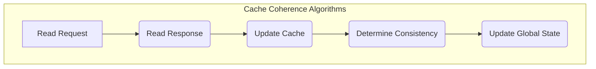
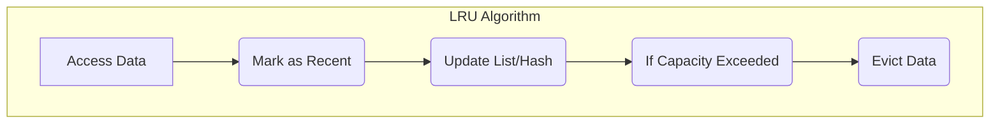
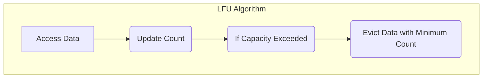
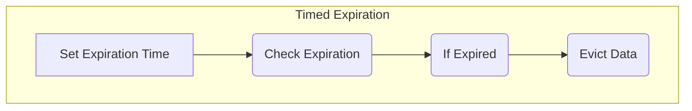
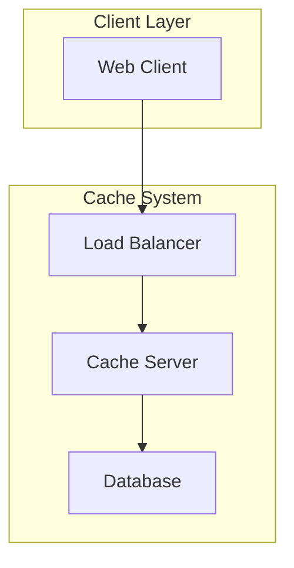
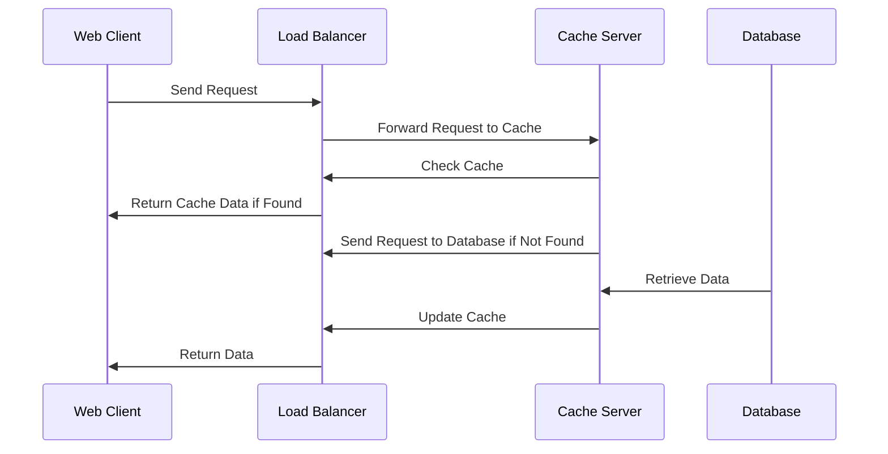

                 

## 引言：缓存的重要性与可用性风险

在现代信息技术领域中，缓存（Cache）已经成为提升系统性能和响应速度的关键技术。随着互联网和大数据时代的到来，数据的处理速度成为衡量系统性能的重要指标。缓存作为一种数据存储技术，通过在接近处理核心的位置存储经常访问的数据，从而减少了数据访问的延迟，提高了系统的整体性能。

### **缓存的基本概念**

缓存是一种临时存储数据的机制，用于加快数据的访问速度。它通常位于高速的内存或闪存中，介于主存储器（RAM）和处理器之间，用于存储最近被访问的数据。缓存的出现，是为了解决存储器层次结构中速度差异的问题，因为处理器的速度远远快于主存储器的速度。

### **缓存的使用场景**

缓存广泛应用于各种IT系统中，包括但不限于：

- **Web应用**：网页内容的缓存可以显著减少用户的加载时间，提升用户体验。
- **数据库**：缓存数据库查询结果，可以减少数据库的负载，提高查询效率。
- **消息队列**：缓存消息队列中的消息，可以减少处理延迟，提高系统的可靠性。
- **云计算**：缓存计算结果，可以减少计算资源的需求，提升资源利用率。

### **缓存带来的可用性问题**

尽管缓存带来了显著的性能提升，但也引入了一些可用性问题。这些问题可能影响系统的稳定性、数据的一致性和完整性。以下是缓存可能导致的一些可用性问题：

1. **数据一致性问题**：当数据在缓存和主存储之间不同步时，可能会导致数据不一致，进而引发错误和异常。
2. **缓存雪崩**：当大量缓存同时失效时，可能导致系统负载激增，甚至崩溃。
3. **缓存穿透**：当查询的数据不存在缓存中，且数据库查询失败时，会引发大量的无效查询，增加数据库负载。
4. **缓存命中率下降**：不合理的缓存策略可能导致缓存命中率下降，影响系统性能。

### **可用性风险的影响与挑战**

可用性风险对系统的稳定性和可靠性构成了重大挑战。在高并发的场景下，缓存的使用可能导致以下问题：

- **性能下降**：频繁的数据不一致性和缓存雪崩会导致系统响应时间增加，降低整体性能。
- **数据丢失**：缓存的不一致性可能导致数据丢失或错误，影响业务流程和数据准确性。
- **系统崩溃**：缓存雪崩和缓存穿透可能导致系统过载，甚至崩溃，影响用户体验。

因此，合理地设计和使用缓存，以及解决缓存带来的可用性问题，成为现代IT系统架构设计中的重要课题。在接下来的章节中，我们将深入探讨缓存机制、可用性问题以及解决策略，帮助读者理解和应对缓存带来的挑战。

## 核心概念与联系

### 缓存机制

缓存机制是提升系统性能的关键技术，其基本原理是通过在高速存储介质中预先存储频繁访问的数据，从而减少数据访问的时间延迟。缓存机制的核心概念包括缓存命中率、缓存淘汰策略和缓存一致性算法。

#### 缓存命中率

缓存命中率是衡量缓存性能的重要指标，表示缓存中命中请求的次数与总请求次数之比。高缓存命中率意味着缓存系统能够有效地减少对主存储的访问，提高数据处理速度。缓存命中率的计算公式如下：

$$
HIT\_RATE = \frac{HIT\_COUNT}{TOTAL\_ACCESS\_COUNT}
$$

其中，`HIT_COUNT` 是缓存命中的次数，`TOTAL_ACCESS_COUNT` 是总访问次数。

#### 缓存淘汰策略

缓存淘汰策略是指当缓存空间不足时，如何选择淘汰一部分缓存项以保证新的数据能够被缓存。常见的缓存淘汰策略包括：

- **最少使用（LRU，Least Recently Used）**：淘汰最长时间未被访问的缓存项。这是一种常用的缓存淘汰策略，因为它基于一个假设：最近未使用的缓存项很可能在未来也未被访问。
- **最不经常使用（LFU，Least Frequently Used）**：淘汰使用次数最少的缓存项。这种策略适用于数据访问频率有显著差异的场景。
- **先进先出（FIFO，First In First Out）**：淘汰最早进入缓存的项。这种策略相对简单，但可能无法充分利用缓存空间。

#### 缓存一致性算法

缓存一致性算法是保证多处理器或分布式系统中的缓存数据一致性的一系列技术。在多处理器系统中，每个处理器可能有自己的缓存，当多个处理器访问同一数据时，如何保持这些缓存中的数据一致性成为关键问题。常见的缓存一致性算法包括：

- **写回（Write-Back）**：每次处理器修改缓存中的数据后，只需将修改后的数据保存在缓存中，当数据被淘汰到主存储时，才将修改同步到主存储。这种策略减少了主存储的写入次数，但可能在数据被淘汰前丢失修改。
- **写通（Write-Through）**：每次处理器修改缓存中的数据时，同时将修改同步到主存储。这种策略保证了数据的一致性，但增加了主存储的写入次数，可能影响性能。

### 可用性问题

尽管缓存带来了性能提升，但也引入了一些可用性问题。这些问题可能影响系统的稳定性、数据的一致性和完整性。以下是缓存可能导致的一些可用性问题：

1. **数据一致性问题**：当缓存和主存储之间的数据不同步时，可能导致数据不一致。例如，当一个处理器修改了缓存中的数据，而另一个处理器仍在使用旧的数据，这种情况可能导致错误和异常。
2. **缓存雪崩**：当大量缓存同时失效时，可能导致系统负载激增，甚至崩溃。例如，当一个热点数据失效后，大量请求同时访问主存储，可能导致主存储过载。
3. **缓存穿透**：当查询的数据不存在缓存中，且数据库查询失败时，会引发大量的无效查询，增加数据库负载。例如，当用户请求一个不存在的商品时，如果缓存系统未能阻止请求，会导致数据库产生大量无效查询。

### 缓存机制与可用性风险的关联

缓存机制与可用性风险密切相关。缓存的设计和实现不仅需要考虑性能，还需要考虑数据的一致性和系统的稳定性。以下是一些具体的关联：

- **数据一致性问题**：缓存一致性算法是解决多处理器系统中数据一致性的关键。不当的实现可能导致数据不一致，进而引发错误和异常。
- **缓存雪崩问题**：合理的缓存淘汰策略和过期时间设置可以减少缓存雪崩的风险。例如，使用缓存预加载和分层缓存策略，可以避免大量缓存同时失效。
- **缓存穿透问题**：缓存穿透问题可以通过设置合理的缓存策略和增加异常处理机制来解决。例如，使用缓存预热和缓存穿透拦截器，可以减少无效查询的数量。

### 缓存更新策略

缓存更新策略是指如何维护缓存中的数据，以确保数据的时效性和准确性。以下是一些常见的缓存更新策略：

- **LRU（Least Recently Used）策略**：通过淘汰最近最久未使用的数据来维护缓存。这种策略基于一个假设：最近未使用的数据很可能在未来也未被访问。
- **LFU（Least Frequently Used）策略**：通过淘汰使用频率最低的数据来维护缓存。这种策略适用于数据访问频率有显著差异的场景。
- **定时更新**：通过设定缓存数据的过期时间来维护缓存。当数据过期时，系统会自动将其淘汰。这种策略简单有效，但需要合理设置过期时间以平衡性能和一致性。

### 本章小结

本章介绍了缓存的基本概念、缓存机制、可用性问题以及缓存更新策略。缓存作为一种重要的性能优化技术，在提升系统性能方面具有显著优势。然而，缓存也引入了数据一致性和系统稳定性等问题，需要通过合理的缓存设计和实现来加以解决。在接下来的章节中，我们将进一步探讨缓存一致性算法、缓存更新策略的数学模型，并通过具体的系统架构设计来深入分析缓存机制的实现和应用。

## 算法原理讲解

### 缓存一致性算法

在多处理器系统中，缓存一致性是确保各个处理器上的缓存数据一致性的关键。缓存一致性算法通过定义一系列的规则和协议，来协调多个处理器之间的数据访问和更新，确保每个处理器上的缓存能够反映系统全局的数据状态。

#### 缓存一致性算法的流程图

为了更好地理解缓存一致性算法，我们使用Mermaid绘制其基本流程图：



**流程说明：**

1. **读请求（Read Request）**：当一个处理器需要读取数据时，它首先检查自己的缓存。如果数据命中，直接读取；如果数据未命中，发送读请求到内存控制器。
2. **读响应（Read Response）**：内存控制器收到读请求后，检查数据是否处于一致性状态。如果数据一致，直接返回给请求的处理器；如果不一致，根据一致性算法进行处理，并返回数据。
3. **更新缓存（Update Cache）**：处理器接收到数据后，根据一致性算法的要求，更新本地缓存。
4. **确定一致性（Determine Consistency）**：一致性算法检查缓存数据是否与主存储中的数据一致。如果一致，算法结束；如果不一致，执行相应的更新操作。
5. **更新全局状态（Update Global State）**：更新本地缓存后，还需要更新全局状态，以确保所有处理器上的缓存数据一致。

### 缓存更新策略

缓存更新策略决定了如何维护缓存中的数据，以确保其时效性和准确性。以下是一些常见的缓存更新策略及其原理：

#### LRU（Least Recently Used）策略

**原理**：LRU策略通过淘汰最近最久未使用的数据来维护缓存。处理器在访问数据时，会将该数据标记为“最近使用”。当缓存容量达到上限时，淘汰标记为“最久未使用”的数据。

**实现**：可以使用一个双向链表或哈希表来实现LRU策略。当数据被访问时，将其移动到链表或哈希表的头部，表示它是最新的。



#### LFU（Least Frequently Used）策略

**原理**：LFU策略通过淘汰使用频率最低的数据来维护缓存。处理器在访问数据时，会记录其访问次数。当缓存容量达到上限时，淘汰访问次数最低的数据。

**实现**：可以使用一个哈希表来记录每个数据的访问次数。当数据被访问时，更新其访问次数。在缓存容量达到上限时，遍历哈希表，找到访问次数最低的数据进行淘汰。



#### 定时更新策略

**原理**：定时更新策略通过设定缓存数据的过期时间来维护缓存。当数据过期时，系统会自动将其淘汰。

**实现**：可以使用定时器或时间戳来跟踪每个数据的过期时间。当数据过期时，触发淘汰操作。



### 缓存一致性算法与缓存更新策略的关系

缓存一致性算法和缓存更新策略共同作用于缓存系统，确保其数据的一致性和时效性。缓存一致性算法负责协调多个处理器之间的数据访问和更新，确保缓存中的数据与主存储保持一致。缓存更新策略则负责维护缓存中的数据，确保数据的时效性和准确性。

在实际应用中，可以选择合适的缓存一致性算法和缓存更新策略，以适应不同的应用场景和性能需求。例如，在需要高一致性的场景中，可以选择写通（Write-Through）一致性算法；在需要高性能的场景中，可以选择写回（Write-Back）一致性算法。

### 缓存更新策略的数学模型

为了更好地理解缓存更新策略的性能，可以使用数学模型来分析和评估。以下是一个简单的缓存更新策略性能评估的数学模型。

#### 缓存命中率

缓存命中率是衡量缓存性能的重要指标，表示缓存命中请求的次数与总请求次数之比。其数学模型可以表示为：

$$
HIT\_RATE = \frac{HIT\_COUNT}{TOTAL\_ACCESS\_COUNT}
$$

其中，`HIT_COUNT` 是缓存命中的次数，`TOTAL_ACCESS_COUNT` 是总访问次数。

#### 缓存命中率的影响因素

- **缓存大小**：缓存大小对缓存命中率有显著影响。缓存越大，缓存命中率越高，因为更多的数据可以存储在缓存中，减少对主存储的访问。
- **访问模式**：不同的访问模式对缓存命中率也有影响。例如，如果访问模式具有局部性，缓存命中率会更高。

#### 缓存更新策略的评估

可以使用以下公式来评估不同缓存更新策略的性能：

$$
HIT\_RATE = \frac{\sum_{i=1}^{N} P(i) \times R(i)}{\sum_{i=1}^{N} P(i)}
$$

其中，`P(i)` 是第i个数据的访问概率，`R(i)` 是第i个数据的缓存访问次数。

通过这个模型，可以分析不同缓存更新策略对缓存命中率的影响，并选择最优的缓存更新策略。

### 缓存更新策略的案例分析

为了更好地理解缓存更新策略的应用，以下是一个简单的案例分析：

假设有一个缓存系统，缓存大小为100KB，数据访问模式具有强局部性，其中80%的数据在接下来的5分钟内会被访问。我们使用LRU策略来维护缓存，并假设每个数据的访问概率均匀分布。

1. **初始状态**：缓存为空。
2. **访问数据A**：缓存未命中，将A加入缓存。
3. **访问数据B**：缓存未命中，将B加入缓存。
4. **访问数据C**：缓存未命中，将C加入缓存。
5. **访问数据A**：缓存命中，访问次数加1。
6. **访问数据D**：缓存未命中，淘汰数据C，将D加入缓存。
7. **访问数据B**：缓存命中，访问次数加1。
8. **访问数据E**：缓存未命中，淘汰数据A，将E加入缓存。

通过上述访问过程，可以计算缓存命中率：

$$
HIT\_RATE = \frac{3+1+1}{5} = \frac{5}{5} = 1
$$

由于数据访问模式具有局部性，LRU策略能够有效地维护缓存，提高缓存命中率。

### 缓存一致性算法与缓存更新策略的比较

缓存一致性算法和缓存更新策略在缓存系统中扮演着重要角色，它们各有优缺点，适用于不同的应用场景。以下是比较：

- **缓存一致性算法**：
  - **优点**：确保多处理器系统中的数据一致性，提高系统可靠性。
  - **缺点**：增加系统复杂度，可能降低性能。
  - **适用场景**：多处理器系统、分布式系统。

- **缓存更新策略**：
  - **优点**：简单有效，易于实现。
  - **缺点**：可能无法完全保证数据一致性，影响系统性能。
  - **适用场景**：单一处理器系统、高性能需求场景。

在实际应用中，可以选择合适的缓存一致性算法和缓存更新策略，以平衡性能、一致性和复杂性。

### 本章小结

本章详细介绍了缓存一致性算法和缓存更新策略的原理、实现和应用。缓存一致性算法通过协调多处理器系统中的数据访问和更新，确保数据的一致性；缓存更新策略通过维护缓存中的数据，确保数据的时效性和准确性。通过具体案例分析，我们了解了不同缓存更新策略的性能表现。在接下来的章节中，我们将进一步探讨缓存机制的实现和应用，帮助读者深入理解缓存技术的核心原理。

## 数学模型和数学公式

### 缓存命中率公式

缓存命中率（Cache Hit Rate）是衡量缓存系统性能的重要指标，它表示缓存中命中请求的次数与总请求次数之比。其数学公式如下：

$$
HIT\_RATE = \frac{HIT\_COUNT}{TOTAL\_ACCESS\_COUNT}
$$

其中，`HIT_COUNT` 是缓存命中的次数，`TOTAL_ACCESS_COUNT` 是总访问次数。

### 负载均衡算法的数学模型

在分布式系统中，负载均衡算法用于合理分配流量到各个服务器节点，以提高系统的整体性能和可用性。负载均衡的数学模型主要包括以下两个方面：

1. **请求分布模型**：假设系统中有N个服务器节点，每个节点的处理能力相同。请求的分布可以用概率分布函数来表示，例如，可以使用均匀分布、泊松分布等。
   
2. **负载均衡策略**：负载均衡算法根据请求分布和当前系统状态（如节点负载、健康状态等）来决定将请求分配到哪个节点。常见的负载均衡策略包括轮询（Round-Robin）、最小连接数（Least Connections）、加权轮询（Weighted Round-Robin）等。

#### 轮询（Round-Robin）策略的数学模型

轮询策略是最简单的负载均衡策略，它按照顺序将请求分配到每个节点。其数学模型可以表示为：

$$
P(i) = \frac{1}{N}
$$

其中，`P(i)` 是第i个节点被选择的概率，`N` 是节点总数。

#### 最小连接数（Least Connections）策略的数学模型

最小连接数策略将请求分配到当前连接数最少的服务器节点，以均衡各节点的负载。其数学模型可以表示为：

$$
P(i) = \frac{C_{min}}{C_{total}}
$$

其中，`P(i)` 是第i个节点被选择的概率，`C_min` 是当前连接数最小的节点连接数，`C_total` 是所有节点的当前连接数之和。

#### 加权轮询（Weighted Round-Robin）策略的数学模型

加权轮询策略根据每个节点的权重来分配请求。节点的权重可以反映其处理能力和负载情况。其数学模型可以表示为：

$$
P(i) = \frac{W_i}{\sum_{j=1}^{N} W_j}
$$

其中，`P(i)` 是第i个节点被选择的概率，`W_i` 是第i个节点的权重，`N` 是节点总数。

### 数学模型在实际应用中的意义

数学模型在缓存系统和负载均衡算法的实际应用中具有重要意义。通过数学模型，我们可以：

1. **性能评估**：评估不同缓存策略和负载均衡策略的性能，选择最优的方案。
2. **系统优化**：通过分析模型，优化系统的资源配置，提高系统的整体性能。
3. **故障预测**：预测系统可能出现的问题，提前采取预防措施，确保系统的稳定性。

### 实际案例分析

假设一个分布式系统中有3个服务器节点，权重分别为1、2和3。系统的请求量为1000个，使用加权轮询策略进行负载均衡。

1. **请求分配**：
   - 节点1被选择的概率为 $\frac{1}{6}$，预计分配到 $\frac{1}{6} \times 1000 = 167$ 个请求。
   - 节点2被选择的概率为 $\frac{2}{6}$，预计分配到 $\frac{2}{6} \times 1000 = 333$ 个请求。
   - 节点3被选择的概率为 $\frac{3}{6}$，预计分配到 $\frac{3}{6} \times 1000 = 500$ 个请求。

2. **性能评估**：
   - 节点3的处理能力最强，预计将处理最多的请求，可以优化其硬件配置。
   - 通过调整权重，可以根据实际需求重新分配请求，提高系统的整体性能。

通过以上案例分析，我们可以看到数学模型在系统设计和优化中的重要作用。在接下来的章节中，我们将继续探讨系统架构设计和项目实战，进一步了解缓存机制的实际应用。

## 系统分析与架构设计方案

### 问题场景

在电子商务系统中，缓存技术被广泛应用于提升用户访问速度和系统响应性能。然而，随着用户数量的增加和系统复杂度的提升，缓存系统的可用性问题逐渐显现。特别是当热门商品或促销活动发布时，用户请求激增，可能导致缓存雪崩、数据不一致等问题，影响系统的稳定性。因此，设计一个高效、可靠的缓存系统，成为保障系统可用性的关键。

### 系统功能设计

为了解决缓存可用性问题，我们需要设计一个具备以下功能的高效缓存系统：

1. **数据一致性保障**：通过一致性算法确保缓存与主存储的数据一致性。
2. **缓存命中率优化**：通过合理的缓存策略提高缓存命中率，减少对主存储的访问。
3. **缓存过期与淘汰策略**：设置缓存数据过期时间和淘汰策略，确保缓存数据的时效性和准确性。
4. **缓存穿透防护**：防止缓存穿透，减少无效查询，保护主存储资源。
5. **负载均衡**：合理分配请求，确保缓存系统的稳定运行。

### 领域模型类图

为了清晰描述缓存系统的功能组件和它们之间的关系，我们使用Mermaid绘制领域模型类图：

```mermaid
classDiagram
    CacheSystem <<interface>>
    Cache <<interface>>
   一致性算法 <<interface>>
    CacheHitPolicy <<interface>>
    CacheExpirePolicy <<interface>>
    LoadBalancer <<interface>>

    CacheSystem --|> Cache
    CacheSystem --|> 一致性算法
    CacheSystem --|> CacheHitPolicy
    CacheSystem --|> CacheExpirePolicy
    CacheSystem --|> LoadBalancer

    Cache --|> 一致性算法
    Cache --|> CacheHitPolicy
    Cache --|> CacheExpirePolicy

    LoadBalancer --|> Cache
```

**类图说明：**

- **CacheSystem**：缓存系统的顶层接口，负责协调和管理缓存系统的各个组件。
- **Cache**：缓存接口，定义了缓存的基本操作，如读取、写入、删除等。
- **一致性算法**：定义缓存一致性算法，确保缓存与主存储数据一致性。
- **CacheHitPolicy**：缓存命中率策略，优化缓存命中率。
- **CacheExpirePolicy**：缓存过期策略，设置缓存数据过期时间和淘汰策略。
- **LoadBalancer**：负载均衡器，负责合理分配请求，确保缓存系统的稳定运行。

### 系统架构设计

为了实现上述功能，我们需要设计一个分布式缓存系统架构，确保系统的高可用性和高性能。以下是系统架构的Mermaid图表示：



**系统架构说明：**

- **客户端层（Client Layer）**：用户通过Web客户端（如浏览器）访问系统。
- **负载均衡器（Load Balancer）**：接收客户端请求，并将请求均衡分配到多个缓存服务器（Cache Server）。
- **缓存服务器（Cache Server）**：存储常用数据和热点数据，提高系统响应速度。
- **数据库（Database）**：存储系统的核心数据，提供持久化存储和查询服务。

### 系统接口设计和交互

为了实现系统的高效运行，我们需要设计合理的系统接口和交互流程。以下是系统接口设计和交互的Mermaid序列图：



**交互流程说明：**

1. **客户端请求**：Web客户端发送请求到负载均衡器。
2. **请求转发**：负载均衡器将请求转发到缓存服务器。
3. **缓存检查**：缓存服务器检查缓存中是否有请求的数据。
   - **缓存命中**：直接返回缓存数据。
   - **缓存未命中**：转发请求到数据库查询数据，并更新缓存。
4. **数据库查询**：数据库检索数据，并返回给缓存服务器。
5. **缓存更新**：缓存服务器将查询结果更新到缓存中。
6. **响应客户端**：缓存服务器将数据返回给客户端。

### 本章小结

本章详细分析了缓存系统的功能需求、领域模型、系统架构以及接口设计和交互流程。通过合理的系统设计和接口设计，我们可以实现一个高效、可靠的缓存系统，有效解决可用性问题。在下一章中，我们将通过具体的项目实战，深入探讨缓存系统的实现和应用。

## 项目实战

### 环境安装

为了演示缓存系统的实现，我们需要搭建一个基于Redis的缓存环境。以下是安装和配置Redis的步骤：

#### 1. 安装Redis

在Ubuntu系统中，可以使用以下命令安装Redis：

```bash
sudo apt update
sudo apt install redis-server
```

在Windows系统中，可以从Redis的官方网站下载最新版本并安装。

#### 2. 启动Redis服务

在Ubuntu系统中，启动Redis服务：

```bash
sudo systemctl start redis-server
```

在Windows系统中，启动Redis服务器。

#### 3. 配置Redis

在Ubuntu系统中，Redis的配置文件位于`/etc/redis/redis.conf`。我们需要修改以下配置：

```bash
# 关闭保护模式
protected-mode no

# 允许远程访问
bind 0.0.0.0

# 设置密码（可选）
requirepass yourpassword
```

在Windows系统中，打开Redis的配置文件`redis.conf`并修改相应的配置。

### 系统核心实现

以下是一个简单的Python示例，演示如何使用Redis作为缓存服务器：

```python
import redis
import time

# 初始化Redis客户端
redis_client = redis.StrictRedis(host='localhost', port=6379, decode_responses=True)

# 缓存设置
def set_cache(key, value, timeout=3600):
    redis_client.set(key, value, ex=timeout)

# 缓存查询
def get_cache(key):
    return redis_client.get(key)

# 缓存更新
def update_cache(key, value):
    redis_client.set(key, value)

# 测试缓存功能
if __name__ == "__main__":
    # 设置缓存
    set_cache("user_name", "John Doe", timeout=60)
    print("Cache set successfully!")

    # 查询缓存
    user_name = get_cache("user_name")
    print(f"Cache retrieved: {user_name}")

    # 等待缓存过期
    time.sleep(61)

    # 尝试查询已过期的缓存
    expired_name = get_cache("user_name")
    print(f"Cache after expiration: {expired_name}")
```

### 代码应用解读

上述代码实现了基本的缓存功能，包括设置、查询和更新缓存。以下是具体的功能解读：

1. **初始化Redis客户端**：使用`redis.StrictRedis`类初始化一个Redis客户端，设置连接的host和port。
2. **缓存设置（set_cache）**：使用`redis_client.set`方法设置缓存，参数包括缓存键（key）、缓存值（value）和过期时间（timeout）。
3. **缓存查询（get_cache）**：使用`redis_client.get`方法查询缓存，根据缓存键获取缓存值。
4. **缓存更新（update_cache）**：使用`redis_client.set`方法更新缓存值，不设置新的过期时间则使用原缓存过期时间。

### 实际案例分析和详细讲解剖析

以下是一个实际案例，展示了缓存系统的应用和可用性风险：

#### 案例背景

在一个电子商务系统中，商品详情页是用户访问最频繁的页面之一。系统设计了一个基于Redis的缓存系统，用于存储商品详情页的HTML内容，以提高页面加载速度。

#### 缓存配置

1. **缓存过期时间**：商品详情页的缓存设置过期时间为1小时，以平衡页面更新频率和缓存命中率。
2. **缓存更新策略**：采用LRU（Least Recently Used）缓存淘汰策略，淘汰最近最久未访问的商品详情页缓存。

#### 案例分析

1. **正常访问**：
   - 用户访问商品详情页，系统首先查询Redis缓存。
   - 如果缓存命中，直接返回缓存内容，减少对数据库的访问。
   - 如果缓存未命中，查询数据库，并将结果缓存到Redis。

2. **高并发访问**：
   - 在促销活动期间，大量用户同时访问同一商品详情页，可能导致缓存雪崩。
   - 由于缓存过期时间较短，大量缓存同时过期，导致Redis服务器压力激增。

#### 可用性风险

1. **缓存雪崩**：大量缓存同时失效，导致Redis服务器负载过高，可能引发缓存服务器崩溃。
2. **数据库压力激增**：缓存未命中，导致数据库查询量激增，可能引发数据库服务器过载。

#### 解决方案

1. **增加缓存过期时间**：将缓存过期时间延长至数小时，减少缓存雪崩风险。
2. **缓存预热**：在高峰期前预加载热门商品详情页的缓存，提高缓存命中率。
3. **分布式缓存**：采用分布式缓存架构，将缓存负载分散到多个Redis实例上，提高系统可用性。

### 项目小结

通过本项目的实战，我们了解了Redis缓存系统的基本配置和使用方法，并通过实际案例分析探讨了缓存系统的可用性风险。合理设计缓存策略和采取有效的防护措施，可以显著提高系统性能和稳定性，降低可用性风险。在下一章中，我们将进一步探讨缓存系统的最佳实践和注意事项。

## 最佳实践、小结与拓展阅读

### 最佳实践

在使用缓存时，为了最大限度地减少可用性风险，以下是一些最佳实践：

1. **合理设置缓存过期时间**：根据数据的更新频率和访问模式，合理设置缓存过期时间，避免缓存雪崩。
2. **缓存预热**：在系统高峰期之前预加载热门数据和缓存，提高缓存命中率，减少缓存未命中导致的数据库压力。
3. **分布式缓存**：采用分布式缓存架构，将缓存负载分散到多个节点上，提高系统可用性和性能。
4. **缓存一致性**：使用合适的一致性算法，确保缓存和主存储的数据一致性。
5. **监控与报警**：实时监控缓存系统的性能和状态，设置合理的报警阈值，及时发现和处理潜在问题。

### 小结

本文详细探讨了缓存技术在提升系统性能方面的优势，以及缓存可能带来的可用性风险。我们介绍了缓存的基本概念、缓存机制、缓存一致性算法、缓存更新策略以及系统架构设计。通过实际案例和项目实战，分析了缓存的使用和问题解决方法。合理地设计和使用缓存，可以有效提高系统性能，但同时也需要关注和解决可用性问题。

### 拓展阅读

为了进一步深入理解缓存技术和系统设计，读者可以参考以下资源：

1. **《Redis权威指南》**：详细介绍了Redis缓存系统的安装、配置和使用方法。
2. **《分布式系统原理与范型》**：探讨了分布式系统中的数据一致性、容错性和负载均衡等关键问题。
3. **《数据库系统概念》**：介绍了数据库系统的基本原理和设计方法，包括缓存和查询优化技术。
4. **《大规模分布式存储系统》**：探讨了分布式存储系统的设计原则和技术实现。

通过以上资源和进一步学习，读者可以更全面地掌握缓存技术和系统设计的核心知识，为实际项目提供有效的技术支持。

## 作者信息

作者：AI天才研究院/AI Genius Institute & 禅与计算机程序设计艺术 /Zen And The Art of Computer Programming

