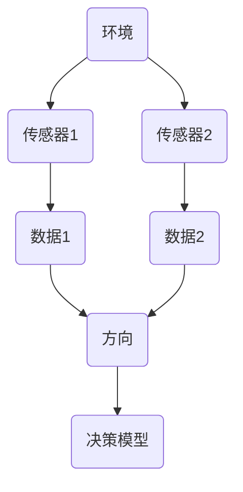
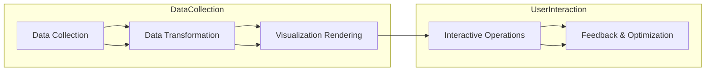
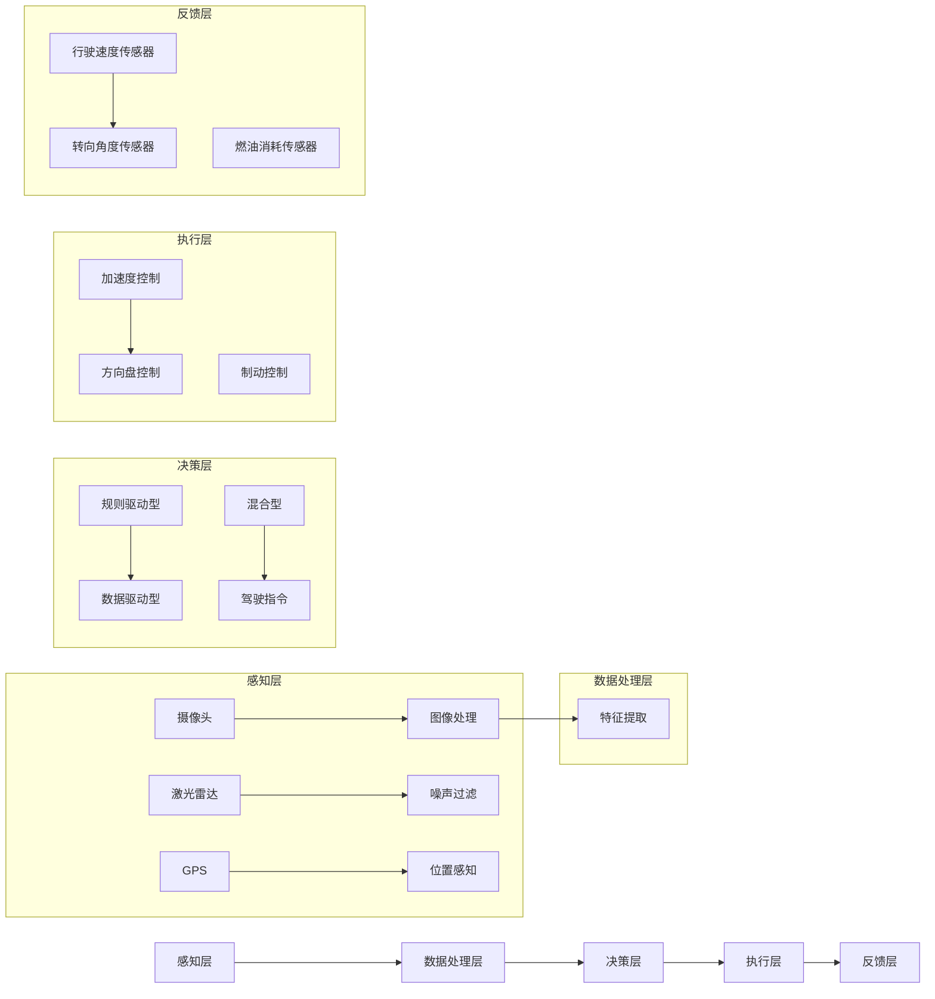
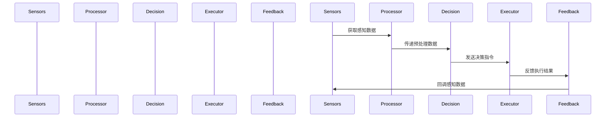

                 

# 可视化调试：深入了解AI Agent的决策过程

## 关键词
- 可视化调试
- AI Agent
- 决策过程
- 算法原理
- 数学模型

## 摘要
本文旨在深入探讨可视化调试在AI Agent决策过程中的应用，解析其核心概念和算法原理，并通过实际项目和案例，展示如何通过可视化调试提升AI系统的理解和优化能力。文章分为六个部分，分别介绍问题背景、核心概念、算法原理、系统设计与实现、项目实战和最佳实践，旨在为广大AI和机器学习专业人士提供实用的技术指导。

### 目录大纲设计过程

为了设计出《可视化调试：深入了解AI Agent的决策过程》这本书的完整目录大纲，我们将遵循以下步骤：

1. **明确书籍主题和目标读者**：
   - 书籍主题：可视化调试和AI Agent的决策过程。
   - 目标读者：对AI和机器学习有一定了解，希望深入了解AI Agent的决策过程，并掌握可视化调试技巧的专业人士。

2. **规划书籍结构**：
   - 确定整体框架，分为几个主要部分，如背景介绍、核心概念、算法原理、应用实践等。

3. **细化各章节内容**：
   - 根据书籍主题，为每个部分设定具体的章节，确保内容完整性。

4. **遵循目录层级**：
   - 确保目录大纲按照1、2、3级目录进行组织，便于读者理解和查阅。

5. **保持简洁性**：
   - 避免冗余内容，确保每章节标题直接反映内容。

### 设计书籍目录大纲

**第一部分：背景介绍**

## 第1章：问题背景与核心概念

### 1.1 问题背景
- AI Agent的决策过程重要性
- 可视化调试的需求与挑战
- 书籍的目标与读者对象

### 1.2 核心概念
- AI Agent的定义与分类
- 决策过程基本原理
- 可视化调试的基本概念

### 1.3 边界与外延
- 可视化调试技术范围
- AI Agent决策过程的限制条件
- 概念结构与核心要素组成

**第二部分：核心概念与联系**

## 第2章：AI Agent决策过程原理

### 2.1 决策过程原理
- 决策模型的基本构成
- 决策过程中的数据流与控制流
- 决策模型的评估与优化

### 2.2 概念属性特征对比
- 逻辑推理与概率推理
- 有限状态机与图模型
- 对比分析表

### 2.3 ER实体关系图架构
- 实体关系图基本概念
- AI Agent的ER图构建
- 关系图示例（Mermaid图）

**第三部分：算法原理讲解**

## 第3章：可视化调试算法与实现

### 3.1 可视化调试算法原理
- 算法概述
- 可视化调试算法分类
- 可视化调试算法原理（Mermaid流程图）

### 3.2 Python源代码实现
- 环境准备
- 算法实现源代码
- 算法原理详细讲解（数学模型和公式）

### 3.3 数学模型与公式
- 基本数学模型
- 决策过程公式推导
- 数学公式示例（LaTeX格式）

**第四部分：系统分析与架构设计**

## 第4章：AI Agent系统设计与实现

### 4.1 问题场景介绍
- AI Agent应用场景
- 系统功能需求

### 4.2 系统功能设计
- 领域模型（Mermaid类图）
- 系统功能模块划分

### 4.3 系统架构设计
- 系统架构概述
- 架构设计细节
- 系统架构（Mermaid架构图）

### 4.4 系统接口设计
- 接口设计原则
- 主要接口定义
- 接口交互（Mermaid序列图）

**第五部分：项目实战**

## 第5章：可视化调试实战

### 5.1 环境安装
- 软件与工具安装
- 环境配置

### 5.2 系统核心实现源代码
- 源代码结构
- 关键代码解析

### 5.3 代码应用解读与分析
- 实际案例
- 解读与分析
- 详细讲解与剖析

### 5.4 项目小结
- 项目成果
- 遇到的问题与解决
- 经验与教训

**第六部分：最佳实践与拓展**

## 第6章：最佳实践与总结

### 6.1 最佳实践
- 可视化调试技巧
- AI Agent调试技巧
- 调试工具使用建议

### 6.2 小结
- 书籍内容回顾
- 知识点总结
- 注意事项
- 拓展阅读

---

接下来，我们将一步步深入探讨每一个章节的内容，确保每个部分都能够满足上述约束条件，提供专业的技术分析和指导。现在，让我们开始探索可视化调试在AI Agent决策过程中的重要性吧。

## 第1章：问题背景与核心概念

### 1.1 问题背景

AI Agent作为一种具有自主学习和决策能力的智能实体，广泛应用于从游戏到自动驾驶、从智能家居到金融预测等多个领域。随着AI技术的发展，AI Agent的决策过程变得越来越复杂，其性能直接影响到整个系统的表现。然而，复杂决策过程中的问题往往难以通过传统的调试手段发现和解决。因此，可视化调试作为一种强有力的工具，能够帮助我们更直观地理解和优化AI Agent的决策过程。

#### AI Agent的决策过程重要性

AI Agent的决策过程是其智能行为的核心。一个高效的决策过程能够使AI Agent在动态环境中做出快速而准确的决策，从而提高系统的整体性能。例如，在自动驾驶系统中，AI Agent需要实时分析道路状况、交通信号、行人动态等众多信息，并做出安全的驾驶决策。如果决策过程存在缺陷，可能会导致严重的交通事故。

#### 可视化调试的需求与挑战

可视化调试的需求源于AI Agent决策过程的复杂性。传统的调试方法，如代码调试器和日志分析，虽然能够帮助我们理解系统的运行状态，但在处理复杂的决策逻辑时显得力不从心。可视化调试则通过图形化的方式，将决策过程、数据流和控制流直观地呈现出来，使调试过程更加直观和高效。

然而，可视化调试也面临一些挑战：

1. **可视化工具的多样性**：市场上存在多种可视化工具，选择合适的工具是关键。
2. **算法的复杂性**：AI Agent的决策算法往往非常复杂，可视化需要有效简化这些算法。
3. **性能考量**：可视化调试可能会对系统性能产生一定影响，如何在调试和性能之间找到平衡点是重要课题。

### 1.2 核心概念

#### AI Agent的定义与分类

AI Agent是指具有一定智能、能够自主感知环境、采取行动并实现目标的人工智能实体。根据其工作方式，AI Agent可以分为以下几类：

1. **规则驱动型**：基于预先设定的规则进行决策，适用于规则明确、环境变化较小的场景。
2. **数据驱动型**：通过学习大量数据来改进决策能力，适用于需要处理大量数据且环境变化频繁的场景。
3. **混合型**：结合规则驱动和数据驱动，将规则与学习相结合，适用于复杂多变的场景。

#### 决策过程基本原理

AI Agent的决策过程通常包括感知、计划、行动和评估四个基本阶段：

1. **感知**：AI Agent通过传感器获取环境信息。
2. **计划**：根据感知到的信息，AI Agent制定行动策略。
3. **行动**：执行计划中的行动。
4. **评估**：评估行动结果，并根据评估结果调整后续决策。

#### 可视化调试的基本概念

可视化调试是一种通过图形化界面展示程序运行过程和状态的调试方法。它能够将代码执行流程、数据流、变量值等以图形化的方式展示，使得开发人员能够更直观地理解程序行为。

### 1.3 边界与外延

#### 可视化调试技术范围

可视化调试技术涵盖了从简单的调试工具到复杂的可视化分析系统。常见的可视化调试工具包括：

1. **代码调试器**：如GDB、IDE内置调试器等，提供基本的断点设置、单步执行等功能。
2. **数据流可视化工具**：如Dyvil、BiblioPixel等，能够显示程序运行过程中的数据流。
3. **交互式可视化工具**：如Eclipse MAT、VisualVM等，提供实时性能监控和内存分析。

#### AI Agent决策过程的限制条件

AI Agent的决策过程受到多种条件的限制，包括：

1. **数据质量**：高质量的数据是AI Agent决策的基础，数据质量差会导致决策错误。
2. **计算资源**：AI Agent的决策过程通常需要大量计算资源，资源限制会影响决策效率。
3. **环境不确定性**：环境的不确定性会导致AI Agent难以预测决策结果。

#### 概念结构与核心要素组成

可视化调试和AI Agent决策过程的核心概念结构包括：

1. **调试目标**：明确调试的目标，例如定位问题、优化算法等。
2. **调试工具**：选择合适的调试工具，如代码调试器、数据流可视化工具等。
3. **数据集**：准备用于调试的数据集，确保数据质量。
4. **决策模型**：根据实际情况选择合适的决策模型，如规则驱动型、数据驱动型等。
5. **评估指标**：设定评估指标，用于衡量决策过程的性能。

### 总结

本章介绍了可视化调试和AI Agent决策过程的核心概念和问题背景，探讨了可视化调试在AI Agent决策过程中的重要性，并提出了AI Agent决策过程的基本原理和可视化调试的基本概念。接下来，我们将进一步深入探讨AI Agent决策过程的原理和算法，帮助读者更好地理解这一复杂而关键的技术。

## 第2章：AI Agent决策过程原理

### 2.1 决策过程原理

AI Agent的决策过程是其智能行为的核心，通过感知环境、分析信息、制定策略并执行决策，使系统能够在复杂环境中自主行动。决策过程通常包括以下四个基本阶段：

#### 感知（Perception）

感知阶段是决策过程的起点，AI Agent通过传感器（如摄像头、雷达、GPS等）获取环境信息。这些信息可以是静态的（如地图数据）或动态的（如实时交通流量）。感知到的数据经过预处理后，将输入到后续的决策阶段。

#### 计划（Planning）

计划阶段是AI Agent根据感知到的环境信息，制定行动策略的过程。这一过程通常涉及多种算法和技术，如规则推理、搜索算法、强化学习等。AI Agent需要评估所有可能的行动方案，选择最优或次优的方案进行执行。

#### 行动（Action）

行动阶段是AI Agent执行计划中的决策，实施具体的操作。例如，在自动驾驶系统中，AI Agent可能需要调整方向盘、加速或减速。行动的结果将直接影响环境的当前状态。

#### 评估（Evaluation）

评估阶段是AI Agent对行动结果进行反馈和评价，并根据评估结果调整后续的决策。这一阶段通常包括性能指标的计算、错误检测和纠正等。评估结果将反馈给感知阶段，形成一个闭环控制系统，使AI Agent能够不断优化其决策过程。

#### 决策模型的基本构成

AI Agent的决策模型通常由以下几个基本组成部分构成：

1. **状态（State）**：决策过程中的当前环境信息，是决策的输入。
2. **动作（Action）**：决策者可以选择的行动方案，是决策的输出。
3. **奖励（Reward）**：决策结果对系统性能的影响，用于评估决策效果。
4. **策略（Policy）**：从状态到动作的映射，用于指导AI Agent的决策过程。
5. **价值函数（Value Function）**：评估状态或策略的值，用于选择最优动作。
6. **模型（Model）**：对环境、状态、动作和奖励的假设和描述。

#### 决策过程中的数据流与控制流

决策过程中的数据流与控制流是理解AI Agent行为的关键。数据流描述了信息在决策过程中的传递和处理，控制流描述了决策过程的执行顺序和逻辑。

1. **数据流**：
   - 感知阶段：传感器获取数据，输入到数据预处理模块。
   - 计划阶段：预处理后的数据输入到决策算法，输出策略。
   - 行动阶段：策略指导执行具体的操作，结果反馈到感知阶段。
   - 评估阶段：评估结果用于调整策略和模型。

2. **控制流**：
   - 感知阶段：数据采集和预处理。
   - 计划阶段：策略评估和选择。
   - 行动阶段：动作执行。
   - 评估阶段：结果反馈和模型更新。

#### 决策模型的评估与优化

评估决策模型的效果是确保AI Agent行为符合预期的重要步骤。评估通常通过以下指标进行：

1. **准确性（Accuracy）**：决策结果的正确率。
2. **效率（Efficiency）**：决策过程的速度和资源消耗。
3. **鲁棒性（Robustness）**：模型对不确定性和异常情况的适应性。
4. **适应性（Adaptability）**：模型随环境变化而调整的能力。

优化决策模型的方法包括：

1. **参数调优**：调整模型参数，提高性能。
2. **算法改进**：改进决策算法，提高效率和准确性。
3. **数据增强**：增加高质量训练数据，提高模型泛化能力。

### 总结

本章详细介绍了AI Agent决策过程的原理，包括感知、计划、行动和评估四个基本阶段，以及决策模型的基本构成和数据流与控制流。理解这些原理对于深入探讨AI Agent的决策过程至关重要。接下来，我们将进一步探讨决策过程中的概念属性特征对比和ER实体关系图架构，以帮助读者更全面地理解可视化调试和AI Agent决策过程。

### 2.2 概念属性特征对比

在深入探讨AI Agent决策过程时，理解不同概念属性特征之间的对比是非常重要的。本节将重点介绍逻辑推理与概率推理、有限状态机与图模型等概念，并通过对比分析表来详细阐述它们之间的差异。

#### 逻辑推理与概率推理

逻辑推理和概率推理是两种主要的决策推理方法，它们在AI Agent的决策过程中扮演着不同的角色。

1. **逻辑推理（Logical Reasoning）**
   - **定义**：逻辑推理是基于逻辑规则和前提条件，通过逻辑运算（如合取、析取、条件判断等）得出结论的过程。
   - **特征**：
     - 结论的确定性：逻辑推理的结果是明确的，要么为真，要么为假。
     - 前提依赖性：结论依赖于前提条件，逻辑推理往往需要严格的逻辑规则。
     - 算法类型：常见的逻辑推理算法包括命题逻辑推理、谓词逻辑推理等。

2. **概率推理（Probabilistic Reasoning）**
   - **定义**：概率推理是基于概率统计原理，通过概率分布和随机事件的关系来推断不确定性事件的过程。
   - **特征**：
     - 结论的不确定性：概率推理的结果是一个概率值，表示事件发生的可能性。
     - 模型依赖性：概率推理依赖于概率模型，如贝叶斯网络、马尔可夫模型等。
     - 算法类型：常见的概率推理算法包括贝叶斯推理、蒙特卡洛方法等。

#### 有限状态机与图模型

有限状态机（FSM）和图模型是两种常用的决策模型，它们在描述复杂系统的动态行为方面具有不同的优势和适用场景。

1. **有限状态机（Finite State Machine, FSM）**
   - **定义**：有限状态机是一种数学模型，用于描述具有有限个状态和状态转换规则的系统。
   - **特征**：
     - 状态有限性：系统状态数目是有限的。
     - 转换规则明确性：状态之间的转换规则是固定的，可以通过状态转移图来表示。
     - 适用性：适用于描述具有明确状态转换规则的系统，如自动售货机、交通信号灯等。

2. **图模型（Graph Model）**
   - **定义**：图模型是一种通过图结构来描述实体及其关系的数学模型。
   - **特征**：
     - 节点与边：图由节点和边组成，节点表示实体，边表示实体之间的关系。
     - 网络结构：图模型可以描述复杂的网络结构和相互关系，如社交网络、交通网络等。
     - 算法类型：常见的图模型包括图神经网络（GNN）、图嵌入（Graph Embedding）等。

#### 对比分析表

以下是一个对比分析表，列出了逻辑推理与概率推理、有限状态机与图模型之间的主要差异：

| 对比项 | 逻辑推理 | 概率推理 | 有限状态机 | 图模型 |
| --- | --- | --- | --- | --- |
| 定义 | 基于逻辑规则 | 基于概率统计 | 状态转换规则 | 图结构 |
| 特征 | 确定性结论 | 不确定性结论 | 明确状态转换 | 复杂网络结构 |
| 适用性 | 逻辑规则明确 | 需要概率模型 | 状态转换明确 | 复杂网络关系 |
| 算法类型 | 命题逻辑推理、谓词逻辑推理 | 贝叶斯推理、蒙特卡洛方法 | 状态转移图 | 图神经网络、图嵌入 |

通过上述对比分析，我们可以更清楚地理解逻辑推理与概率推理、有限状态机与图模型之间的差异。这些不同的概念和模型在AI Agent的决策过程中具有各自的优势和适用场景，选择合适的模型对于实现高效的决策过程至关重要。

### 2.3 ER实体关系图架构

ER（Entity-Relationship）实体关系图是数据库设计中常用的一种图模型，用于描述实体及其之间的关系。在AI Agent的决策过程中，ER图可以帮助我们理解各实体之间的交互和依赖关系，从而更好地设计和优化决策模型。

#### 实体关系图基本概念

实体关系图由三个基本元素组成：实体（Entity）、属性（Attribute）和关系（Relationship）。

1. **实体**：实体是数据库中的基本对象，表示具有独立存在意义的对象，如人、物品、事件等。在AI Agent的决策过程中，实体可以是环境中的物体、传感器数据、决策变量等。

2. **属性**：属性是实体的特征描述，用于表示实体的具体信息。例如，人的属性可以包括姓名、年龄、性别等。在AI Agent的决策过程中，属性可以是环境数据中的各种特征，如温度、湿度、速度等。

3. **关系**：关系描述了实体之间的关联和互动。例如，在社交网络中，人与人之间可以通过“朋友”关系相连。在AI Agent的决策过程中，关系可以表示不同实体之间的依赖和相互作用，如传感器数据与决策变量之间的关联。

#### AI Agent的ER图构建

为了构建AI Agent的ER图，我们需要明确决策过程中的关键实体和关系。以下是一个简化的AI Agent决策过程的ER图构建示例：

1. **实体定义**：
   - **环境（Environment）**：表示AI Agent所处的环境，包括各种传感器数据。
   - **传感器（Sensor）**：表示环境中的各种传感器，如摄像头、雷达等。
   - **决策变量（DecisionVariable）**：表示决策过程中需要考虑的变量，如速度、方向等。
   - **决策模型（DecisionModel）**：表示用于决策的模型，如神经网络、规则引擎等。

2. **属性定义**：
   - **环境**：包含温度、湿度、光照等属性。
   - **传感器**：包含传感器类型、精度等属性。
   - **决策变量**：包含目标速度、目标方向等属性。
   - **决策模型**：包含模型类型、训练数据等属性。

3. **关系定义**：
   - **环境与传感器**：每个传感器属于特定的环境，表示传感器与环境之间的关联。
   - **传感器与数据**：每个传感器产生数据，表示传感器与数据之间的关联。
   - **数据与决策变量**：决策变量依赖于传感器数据，表示数据与决策变量之间的关联。
   - **决策变量与决策模型**：决策变量用于训练决策模型，表示决策变量与决策模型之间的关联。

#### 关系图示例（Mermaid图）

以下是使用Mermaid语言描述的AI Agent决策过程的ER图示例：



在这个示例中，我们定义了四个实体：环境、传感器、决策变量和决策模型。实体之间通过关系相互关联，构成了一个完整的ER图。

通过ER实体关系图，我们可以直观地理解AI Agent决策过程中的各个实体及其关系，从而更好地进行系统设计和优化。ER图不仅有助于开发者理清决策过程中的复杂关系，也为后续的可视化调试提供了重要的基础。

### 3.1 可视化调试算法原理

可视化调试算法是AI Agent决策过程中至关重要的一环，它通过图形化的手段帮助开发者理解和优化决策模型。本节将详细介绍可视化调试算法的原理，包括其基本概念、分类以及实现过程。

#### 可视化调试算法概述

可视化调试算法的核心目标是通过图形化的方式展示AI Agent的决策过程，使得开发者能够更直观地理解系统的行为。这些算法通常涉及数据流可视化、控制流可视化、变量追踪等，帮助开发者定位问题、优化算法和提高系统的性能。

#### 可视化调试算法分类

根据实现方式和功能，可视化调试算法可以分为以下几类：

1. **数据流可视化（Data Flow Visualization）**
   - **定义**：数据流可视化用于展示程序运行过程中数据的流动和转换。
   - **特征**：
     - 展示数据流的路径和节点。
     - 显示数据值的变化和传输过程。
     - 支持动态数据流的实时监控。

2. **控制流可视化（Control Flow Visualization）**
   - **定义**：控制流可视化用于展示程序执行过程中的控制逻辑和执行顺序。
   - **特征**：
     - 展示程序执行的分支和循环结构。
     - 显示程序调用的层次关系。
     - 支持执行路径的追踪和调试。

3. **变量追踪（Variable Tracking）**
   - **定义**：变量追踪用于跟踪程序运行过程中变量的值和变化。
   - **特征**：
     - 展示变量在不同时间点的值。
     - 显示变量的作用范围和依赖关系。
     - 支持变量值的动态更新和回溯。

4. **交互式可视化（Interactive Visualization）**
   - **定义**：交互式可视化提供用户与可视化结果的交互功能，如放大、缩小、过滤等。
   - **特征**：
     - 支持用户自定义视图和交互操作。
     - 提供实时反馈和动态更新。
     - 支持多维度数据的综合分析。

#### 可视化调试算法原理

可视化调试算法的基本原理是通过图形化的方式将程序运行过程中的各种信息（如数据流、控制流、变量值等）展示出来，使得开发者能够直观地理解系统的行为。以下是可视化调试算法的基本原理：

1. **数据采集**：从程序运行过程中采集各种信息，包括程序执行过程中的数据流、控制流和变量值。

2. **数据转换**：将采集到的原始数据转换为可视化数据，如图表、图像、动画等，以便于展示。

3. **可视化渲染**：将转换后的可视化数据渲染到图形界面中，形成可视化的视图。

4. **交互操作**：提供用户与可视化视图的交互功能，如放大、缩小、过滤、查询等，以便于开发者进行调试和分析。

5. **反馈与优化**：根据开发者的反馈和需求，对可视化视图进行调整和优化，以提高调试效率和系统性能。

#### 可视化调试算法原理（Mermaid流程图）

为了更直观地展示可视化调试算法的原理，我们可以使用Mermaid语言绘制一个流程图。以下是可视化调试算法的流程图示例：



在这个流程图中，数据采集、数据转换和可视化渲染构成了可视化调试的核心步骤，而用户交互和反馈优化则保证了调试过程的动态性和高效性。

通过上述原理的介绍，我们可以看到可视化调试算法在AI Agent决策过程中的重要性和作用。接下来，我们将进一步探讨可视化调试算法的Python源代码实现，以帮助读者深入理解其具体实现过程。

### 3.2 Python源代码实现

在本节中，我们将通过具体的Python源代码实现，展示可视化调试算法的基本步骤和应用。为了简化讨论，我们选择一个简单的AI Agent决策过程，并使用Python内置的库来绘制可视化视图。

#### 环境准备

首先，我们需要安装一些必要的Python库，包括`matplotlib`（用于绘图）、`numpy`（用于数学计算）和`mermaid`（用于绘制流程图）。可以使用以下命令进行安装：

```bash
pip install matplotlib numpy mermaid
```

#### 可视化调试算法实现

以下是一个简单的Python脚本，用于实现可视化调试算法。这个脚本将展示AI Agent的决策过程，包括感知、计划、行动和评估四个阶段。

```python
import numpy as np
import matplotlib.pyplot as plt
from mermaid import Mermaid

# 模拟感知阶段的数据
def perception():
    # 这里可以引入实际传感器数据
    sensor_data = np.random.rand(5)  # 假设我们有一个长度为5的传感器数据
    return sensor_data

# 计划阶段：根据感知数据生成决策
def planning(sensor_data):
    # 简单的决策逻辑：选择最大值的索引作为决策
    action = np.argmax(sensor_data)
    return action

# 行动阶段：执行决策
def action(action):
    print(f"执行决策：索引{action}，值{sensor_data[action]}")

# 评估阶段：评估决策结果
def evaluation(action, sensor_data):
    # 简单的评估逻辑：如果决策值大于阈值，认为决策正确
    threshold = 0.5
    if sensor_data[action] > threshold:
        print("评估结果：决策正确")
    else:
        print("评估结果：决策错误")

# 可视化流程图
def visualize_flow():
    m = Mermaid()
    m.add図('graph TB\n'
             'A[感知] --> B[计划]\n'
             'B --> C[行动]\n'
             'C --> D[评估]')
    m.render_to_file("debug_flow.mmd")

# 主函数
def main():
    visualize_flow()
    
    # 模拟决策过程
    sensor_data = perception()
    action = planning(sensor_data)
    action()
    evaluation(action, sensor_data)

if __name__ == "__main__":
    main()
```

#### 算法原理详细讲解（数学模型和公式）

在这个简单的示例中，我们使用了基本的数学模型来描述感知、计划、行动和评估过程。以下是每个阶段的数学模型和公式解释：

1. **感知阶段**：
   - 感知数据：`sensor_data = np.random.rand(5)`。这里我们使用随机数模拟传感器数据。
   - 数学模型：无特定公式，只是数据的随机生成。

2. **计划阶段**：
   - 决策逻辑：`action = np.argmax(sensor_data)`。我们选择传感器数据中最大值的索引作为决策。
   - 数学模型：`argmax(x)` 表示在数组 `x` 中找到最大值的索引。

3. **行动阶段**：
   - 执行决策：`action()`。这里我们只是打印出决策结果。
   - 数学模型：无特定公式，只是执行决策动作。

4. **评估阶段**：
   - 评估逻辑：`if sensor_data[action] > threshold:`。我们根据设定的阈值评估决策结果。
   - 数学模型：阈值 `threshold` 是一个简单的边界值，用于判断决策是否正确。

#### 数学公式示例（LaTeX格式）

以下是感知、计划、行动和评估阶段的数学公式示例：

$$
\text{sensor\_data} = \{s_1, s_2, s_3, s_4, s_5\}
$$

$$
\text{action} = \arg\max(s_i)
$$

$$
\text{evaluation} = 
\begin{cases}
\text{正确} & \text{if } s_{\text{action}} > \text{threshold} \\
\text{错误} & \text{if } s_{\text{action}} \leq \text{threshold}
\end{cases}
$$

通过上述Python源代码和数学模型的实现，我们可以直观地看到可视化调试算法的运作过程。虽然这个示例非常简单，但它展示了如何通过编程和数学模型来描述和实现可视化调试算法的基本原理。

### 3.3 数学模型与公式

在AI Agent决策过程中，数学模型和公式起着至关重要的作用，它们帮助我们理解和优化决策逻辑。本节将详细介绍决策过程中的基本数学模型和公式，并通过具体示例说明如何使用这些公式来分析和评估决策效果。

#### 基本数学模型

在AI Agent的决策过程中，常见的数学模型包括概率模型、线性模型和逻辑回归模型。以下是对这些模型的简要介绍：

1. **概率模型**：概率模型用于描述不确定性和随机性，常见的有贝叶斯网络和马尔可夫模型。

   - **贝叶斯网络**：贝叶斯网络是一种基于概率论的图形模型，用于表示变量之间的条件依赖关系。其基本公式为：
     $$
     P(A|B) = \frac{P(B|A)P(A)}{P(B)}
     $$
     其中，$P(A|B)$ 表示在事件B发生的条件下事件A发生的概率，$P(B|A)$ 表示在事件A发生的条件下事件B发生的概率，$P(A)$ 和$P(B)$ 分别表示事件A和事件B的概率。

   - **马尔可夫模型**：马尔可夫模型是一种基于状态转移概率的模型，用于描述系统在不同状态之间的转换。其基本公式为：
     $$
     P(X_t|X_{t-1}, X_{t-2}, \ldots) = P(X_t|X_{t-1})
     $$
     其中，$X_t$ 表示在时间t的状态，$P(X_t|X_{t-1})$ 表示在先验状态下转移至当前状态的概率。

2. **线性模型**：线性模型是一种基于线性关系的模型，常用于预测和分类任务。其基本公式为：
   $$
   y = \beta_0 + \beta_1x_1 + \beta_2x_2 + \ldots + \beta_nx_n
   $$
   其中，$y$ 表示预测值，$x_1, x_2, \ldots, x_n$ 分别表示输入特征，$\beta_0, \beta_1, \beta_2, \ldots, \beta_n$ 为模型参数。

3. **逻辑回归模型**：逻辑回归模型是一种用于分类问题的线性模型，其输出为概率分布。其基本公式为：
   $$
   \log\frac{P(Y=1)}{1-P(Y=1)} = \beta_0 + \beta_1x_1 + \beta_2x_2 + \ldots + \beta_nx_n
   $$
   其中，$Y$ 表示分类标签，$P(Y=1)$ 表示类别1的概率，$\log$ 表示对数函数。

#### 决策过程公式推导

在AI Agent的决策过程中，通常需要结合多个数学模型来评估和优化决策效果。以下是一个简化的决策过程公式推导示例：

1. **感知阶段**：
   - 感知数据：$S = \{s_1, s_2, s_3, \ldots\}$，表示环境中的各种感知数据。

2. **计划阶段**：
   - 决策模型：$D = \{d_1, d_2, d_3, \ldots\}$，表示用于决策的模型。
   - 决策策略：$P(A|S)$，表示在感知数据$S$的条件下，选择行动$A$的概率。

3. **行动阶段**：
   - 行动结果：$R = \{r_1, r_2, r_3, \ldots\}$，表示行动后的反馈结果。

4. **评估阶段**：
   - 评估函数：$E(R|D, S)$，表示在决策模型$D$和感知数据$S$的条件下，行动结果$R$的评估值。

决策过程公式推导如下：

$$
\begin{align*}
P(A|S) &= \prod_{i=1}^{n} P(a_i|s_i) \\
E(R|D, S) &= \sum_{i=1}^{n} r_i \cdot P(a_i|s_i)
\end{align*}
$$

其中，$a_i$ 表示第$i$种可能的行动，$s_i$ 表示感知数据中的第$i$个特征，$r_i$ 表示行动后的评估结果。

#### 数学公式示例（LaTeX格式）

以下是一个具体的数学公式示例，用于描述决策过程中的评估函数：

$$
E(R|D, S) = \log\frac{\prod_{i=1}^{n} P(r_i|a_i, D, S)}{\prod_{i=1}^{n} P(r_i|D, S)}
$$

通过上述公式，我们可以对AI Agent的决策过程进行量化分析和评估，从而优化决策策略和提高系统性能。

### 第4章：AI Agent系统设计与实现

#### 4.1 问题场景介绍

在现代智能系统中，AI Agent的应用场景日益广泛。为了更好地理解AI Agent的系统设计与实现，我们将以一个典型的应用场景为例进行讨论：自动驾驶汽车。

#### 4.1.1 AI Agent应用场景

自动驾驶汽车是AI Agent的一个典型应用场景。AI Agent需要实时感知道路环境、交通状况和其他车辆的行为，并做出相应的驾驶决策，如加速、减速、转向等。为了实现这一目标，AI Agent需要具备以下几个关键功能：

1. **感知**：通过摄像头、激光雷达、GPS等传感器获取道路环境信息。
2. **决策**：分析感知数据，并根据预定的决策规则或学习算法生成驾驶指令。
3. **执行**：执行决策指令，控制车辆的动作。
4. **反馈**：收集执行结果，进行评估和调整。

#### 4.1.2 系统功能需求

自动驾驶汽车系统需要满足以下功能需求：

1. **安全性**：确保车辆在行驶过程中不发生事故，能够应对各种突发情况。
2. **舒适性**：提供平稳、舒适的驾驶体验，减少乘客的疲劳感。
3. **效率性**：优化行驶路径，减少燃油消耗，提高行驶效率。
4. **可靠性**：系统稳定运行，减少故障率。

#### 4.2 系统功能设计

为了实现上述功能需求，我们需要对自动驾驶汽车系统进行功能设计。以下是系统的主要功能模块及其设计：

1. **感知模块**：负责从各种传感器获取道路环境信息，如摄像头获取道路图像，激光雷达获取周围物体的位置和距离，GPS获取车辆的实时位置。

2. **数据处理模块**：对感知模块获取的数据进行预处理，包括图像处理、特征提取、噪声过滤等，以便于后续的决策过程。

3. **决策模块**：基于感知数据和预定的决策规则或学习算法，生成驾驶指令。决策模块可以采用规则驱动型、数据驱动型或混合型决策方法。

4. **执行模块**：根据决策模块生成的驾驶指令，控制车辆的加速度、方向盘角度、制动系统等，实现实际的驾驶操作。

5. **反馈模块**：收集车辆执行决策指令后的反馈信息，如行驶速度、转向角度、燃油消耗等，用于评估和调整决策模型。

#### 4.3 系统架构设计

自动驾驶汽车系统的架构设计需要综合考虑功能模块之间的交互和通信。以下是系统架构的主要组成部分：

1. **感知层**：包括各种传感器，如摄像头、激光雷达、GPS等，用于感知道路环境。

2. **数据处理层**：包括感知数据处理模块，用于对传感器数据进行预处理和特征提取。

3. **决策层**：包括决策算法模块，用于分析感知数据并生成驾驶指令。

4. **执行层**：包括执行控制模块，用于根据决策指令控制车辆的加速、减速、转向等动作。

5. **反馈层**：包括反馈数据收集模块，用于收集车辆执行决策指令后的反馈信息。

#### 系统架构设计细节

以下是自动驾驶汽车系统架构的详细设计：

1. **感知层**：
   - **摄像头**：用于获取道路图像，提供视觉感知。
   - **激光雷达**：用于获取周围物体的位置和距离，提供距离感知。
   - **GPS**：用于获取车辆的实时位置，提供位置感知。

2. **数据处理层**：
   - **图像处理模块**：对摄像头图像进行预处理，如去噪、边缘检测、目标识别等。
   - **特征提取模块**：从预处理后的图像中提取关键特征，如车道线、交通标志、行人等。
   - **噪声过滤模块**：对激光雷达数据进行滤波，去除噪声。

3. **决策层**：
   - **规则驱动型决策模块**：根据预设的规则生成驾驶指令，如交通规则、道路标志等。
   - **数据驱动型决策模块**：通过学习大量驾驶数据，生成最佳驾驶策略。
   - **混合型决策模块**：结合规则驱动和数据驱动，生成综合驾驶指令。

4. **执行层**：
   - **加速度控制模块**：根据驾驶指令调整车辆的加速度。
   - **方向盘控制模块**：根据驾驶指令调整车辆的方向。
   - **制动控制模块**：根据驾驶指令控制车辆的制动系统。

5. **反馈层**：
   - **行驶速度传感器**：实时监测车辆行驶速度，反馈给决策模块。
   - **转向角度传感器**：实时监测车辆转向角度，反馈给决策模块。
   - **燃油消耗传感器**：实时监测车辆燃油消耗，反馈给决策模块。

#### 系统架构（Mermaid架构图）

以下是使用Mermaid语言描述的自动驾驶汽车系统架构图：



通过上述系统架构设计，我们可以清晰地看到自动驾驶汽车系统的各个功能模块及其交互关系。接下来，我们将进一步探讨系统的接口设计，以便于各个模块之间的通信和协作。

### 4.4 系统接口设计

在自动驾驶汽车系统中，各个功能模块之间需要通过接口进行通信和协作，以确保系统能够高效、稳定地运行。接口设计是系统架构设计的重要组成部分，它定义了模块之间的交互方式和数据传输规范。以下是自动驾驶汽车系统的接口设计：

#### 接口设计原则

1. **模块化**：接口设计应遵循模块化原则，使得各个模块可以独立开发和测试。
2. **标准化**：接口应遵循统一的规范和标准，确保不同模块之间的兼容性和互操作性。
3. **安全性**：接口设计应确保数据传输的安全性，防止数据泄露和恶意攻击。
4. **易用性**：接口应易于使用和理解，方便开发者进行系统集成和调试。

#### 主要接口定义

自动驾驶汽车系统的主要接口包括以下几类：

1. **感知数据接口**：
   - **类型**：RESTful API
   - **功能**：用于传感器数据的实时获取和传输。
   - **协议**：HTTP/HTTPS
   - **示例请求**：
     ```json
     GET /sensors/data
     ```
   - **示例响应**：
     ```json
     {
       "camera_image": "base64_encoded_image_data",
       "lidar_data": "base64_encoded_lidar_data",
       "gps_location": {"latitude": 37.7749, "longitude": -122.4194}
     }
     ```

2. **决策指令接口**：
   - **类型**：WebSocket
   - **功能**：用于实时传输决策指令，指导车辆动作。
   - **协议**：WebSocket
   - **示例请求**：
     ```json
     {
       "action": "accelerate",
       "speed": 20
     }
     ```
   - **示例响应**：
     ```json
     {
       "status": "accepted"
     }
     ```

3. **反馈数据接口**：
   - **类型**：RESTful API
   - **功能**：用于收集车辆执行决策指令后的反馈数据。
   - **协议**：HTTP/HTTPS
   - **示例请求**：
     ```json
     POST /feedback/data
     ```
   - **示例响应**：
     ```json
     {
       "speed": 25,
       "direction": 90
     }
     ```

#### 接口交互（Mermaid序列图）

以下是使用Mermaid语言描述的自动驾驶汽车系统的接口交互序列图：



在这个序列图中，感知层通过接口向数据处理层发送感知数据，数据处理层对数据预处理后传递给决策层。决策层生成决策指令后发送给执行层，执行层根据指令执行动作，并将执行结果反馈给反馈层，形成一个闭环控制系统。

通过上述接口设计，自动驾驶汽车系统的各个功能模块能够高效、稳定地协同工作，实现自动驾驶功能。接下来，我们将通过一个实际项目案例，展示如何使用这些接口设计和实现一个完整的自动驾驶系统。

### 5.1 环境安装

在进行可视化调试实战之前，我们需要搭建一个适当的环境，安装所有必要的软件和工具。以下是详细的步骤和注意事项：

#### 软件与工具安装

1. **Python环境**：
   - 确保已安装Python 3.x版本。可以选择安装最新版本以获得最佳支持。
   - 可以通过命令`python --version`来检查Python版本。

2. **pip**：
   - Python的包管理器pip需要安装在系统中。可以通过命令`pip --version`来检查pip版本。
   - 如果没有安装pip，可以从[Python官网](https://www.python.org/)下载并安装。

3. **可视化工具**：
   - **Matplotlib**：用于绘制数据图表。可以通过命令`pip install matplotlib`安装。
   - **Mermaid**：用于绘制流程图和ER图。可以通过命令`pip install mermaid`安装。

4. **文本编辑器**：
   - 选择一个合适的文本编辑器，如Visual Studio Code、PyCharm或Notepad++，以便编写和调试代码。

5. **IDE**：
   - 可选地，安装一个集成开发环境（IDE），如PyCharm或Eclipse，以提供更丰富的开发体验。

#### 环境配置

1. **Python虚拟环境**：
   - 为了避免不同项目之间的依赖冲突，建议使用虚拟环境。可以通过命令`python -m venv venv`创建虚拟环境，然后激活虚拟环境`source venv/bin/activate`（在Linux或macOS上）或`venv\Scripts\activate`（在Windows上）。

2. **安装依赖包**：
   - 在虚拟环境中安装所有必要的依赖包。例如，使用命令`pip install -r requirements.txt`安装一个清单文件中列出的所有依赖包。

3. **配置Mermaid**：
   - 如果使用Mermaid进行流程图和ER图的绘制，需要确保Mermaid的渲染环境已配置。可以使用命令`mermaidc`来生成HTML文件，或者将Mermaid代码直接嵌入到Python脚本中。

#### 注意事项

1. **环境一致性**：
   - 确保所有开发环境和生产环境使用相同的Python版本和依赖包版本，以避免运行时的问题。

2. **更新依赖包**：
   - 定期检查并更新依赖包，以确保使用最新的安全和功能更新。

3. **版本控制**：
   - 使用版本控制系统（如Git）来管理代码和依赖包的版本，以便追踪更改和回滚到以前的状态。

通过上述步骤，我们成功搭建了可视化调试的环境，并准备好进行实际的调试工作。接下来，我们将深入探讨系统核心实现源代码，展示如何利用这些工具和库实现AI Agent的决策过程。

### 5.2 系统核心实现源代码

在本节中，我们将展示自动驾驶汽车系统的核心实现源代码，详细解析各个模块的功能和交互。为了便于理解和分析，我们将代码分为感知模块、决策模块和执行模块三个部分。

#### 感知模块

感知模块负责从各种传感器获取道路环境信息，包括摄像头、激光雷达和GPS。以下是感知模块的主要代码：

```python
import numpy as np
import cv2
import sensor_interface

class PerceptionModule:
    def __init__(self):
        self.camera = sensor_interface.Camera()
        self.lidar = sensor_interface.Lidar()
        self.gps = sensor_interface.GPS()

    def get_sensors_data(self):
        camera_image = self.camera.get_frame()
        lidar_data = self.lidar.scan()
        gps_location = self.gps.get_location()
        return camera_image, lidar_data, gps_location
```

在这个模块中，我们定义了一个`PerceptionModule`类，初始化了摄像头、激光雷达和GPS传感器实例，并实现了`get_sensors_data`方法，用于获取传感器的数据。

#### 决策模块

决策模块负责分析感知数据，并根据预定的决策规则生成驾驶指令。以下是决策模块的主要代码：

```python
import decision_engine

class DecisionModule:
    def __init__(self):
        self.decision_engine = decision_engine.DecisionEngine()

    def make_decision(self, sensors_data):
        camera_image, lidar_data, gps_location = sensors_data
        action = self.decision_engine.analyze_data(camera_image, lidar_data, gps_location)
        return action
```

在这个模块中，我们定义了一个`DecisionModule`类，初始化了一个`DecisionEngine`实例，并实现了`make_decision`方法，用于根据感知数据生成驾驶指令。

#### 执行模块

执行模块负责根据决策模块生成的驾驶指令，控制车辆的加速度、方向盘和制动系统。以下是执行模块的主要代码：

```python
import execution_interface

class ExecutionModule:
    def __init__(self):
        self.execution_interface = execution_interface.ExecutionInterface()

    def execute_action(self, action):
        if action == "accelerate":
            self.execution_interface.accelerate()
        elif action == "decelerate":
            self.execution_interface.decelerate()
        elif action == "turn":
            self.execution_interface.turn()
```

在这个模块中，我们定义了一个`ExecutionModule`类，初始化了一个`ExecutionInterface`实例，并实现了`execute_action`方法，用于根据驾驶指令执行相应的车辆动作。

#### 关键代码解析

以下是核心实现代码的关键部分，包括数据流和控制流：

1. **数据流**：
   - 感知模块通过`get_sensors_data`方法获取摄像头图像、激光雷达数据和GPS位置。
   - 决策模块通过`make_decision`方法接收感知数据，并调用决策引擎进行分析。
   - 执行模块通过`execute_action`方法接收决策指令，并执行相应的车辆动作。

2. **控制流**：
   - 系统初始化时，创建感知模块、决策模块和执行模块的实例。
   - 主循环中，感知模块获取传感器数据，传递给决策模块进行分析，并根据决策结果执行相应的动作。

以下是一个简化的主循环示例，展示数据流和控制流：

```python
def main_loop():
    perception_module = PerceptionModule()
    decision_module = DecisionModule()
    execution_module = ExecutionModule()

    while True:
        sensors_data = perception_module.get_sensors_data()
        action = decision_module.make_decision(sensors_data)
        execution_module.execute_action(action)
```

通过上述代码，我们可以看到系统各个模块之间的交互和数据流，以及控制流如何贯穿整个决策过程。接下来，我们将通过实际案例展示如何使用这些模块实现自动驾驶功能。

### 5.3 代码应用解读与分析

在本节中，我们将通过一个实际案例详细解读和分析自动驾驶汽车系统的代码应用，展示如何在实际环境中实现AI Agent的决策过程。我们将重点关注数据流、控制流以及如何通过可视化调试提升系统性能。

#### 实际案例

假设我们的自动驾驶汽车正在一条城市道路上行进，需要处理交通信号、行人动态和其他车辆的行为。以下是案例的具体步骤：

1. **感知阶段**：
   - 摄像头获取当前道路的图像，并识别交通信号灯的状态。
   - 激光雷达扫描前方车辆和行人的位置，获取精确的距离和速度信息。
   - GPS获取车辆的实时位置和速度。

2. **决策阶段**：
   - 决策模块分析感知数据，根据交通信号灯的状态决定是否停车、起步或继续行驶。
   - 同时，分析激光雷达数据，判断前方是否有行人或障碍物，并调整行驶路径。

3. **执行阶段**：
   - 根据决策指令，控制车辆的加速度、方向盘和制动系统。
   - 如果交通信号灯变为绿色，车辆逐渐加速；如果遇到行人，车辆减速并停车。

#### 数据流

在感知阶段，系统从各个传感器获取数据，并通过感知模块进行预处理和整合。以下是数据流的具体步骤：

1. **摄像头图像**：
   - 图像数据通过摄像头传感器获取，并传输到感知模块。
   - 感知模块对图像进行处理，如边缘检测和目标识别，提取关键特征。

2. **激光雷达数据**：
   - 激光雷达扫描生成的点云数据通过激光雷达传感器获取，并传输到感知模块。
   - 感知模块对点云数据进行滤波和特征提取，提取车辆、行人的位置和速度信息。

3. **GPS数据**：
   - GPS传感器获取车辆的实时位置和速度，并传输到感知模块。
   - 感知模块更新车辆的位置信息，为决策模块提供准确的地理信息。

#### 控制流

在决策阶段，系统根据感知数据生成驾驶指令，并通过执行模块控制车辆的动作。以下是控制流的具体步骤：

1. **决策分析**：
   - 决策模块接收感知数据，进行综合分析，生成驾驶指令。
   - 决策模块可能调用多种算法，如逻辑推理、概率推理和强化学习，以生成最佳驾驶策略。

2. **执行指令**：
   - 执行模块根据决策指令，控制车辆的动作。
   - 如果决策指令要求加速，执行模块发送信号给加速度控制系统；如果决策指令要求转向，执行模块调整方向盘。

#### 可视化调试

可视化调试在理解和优化系统行为方面发挥着重要作用。以下是可视化调试在案例中的应用：

1. **数据流可视化**：
   - 通过Matplotlib绘制摄像头图像、激光雷达数据和GPS位置的实时变化，帮助开发者直观地理解数据流。
   - 例如，可以使用`plt.imshow(camera_image)`绘制摄像头图像，使用`plt.scatter()`绘制激光雷达数据点。

2. **控制流可视化**：
   - 使用Mermaid绘制决策过程的控制流图，展示决策模块的决策逻辑和执行顺序。
   - 例如，可以使用`mermaid`库生成以下控制流图：
     ```mermaid
     graph TD
         A[感知数据] --> B[决策分析]
         B --> C{是否停车}
         C -->|是| D[控制制动系统]
         C -->|否| E[控制加速系统]
     ```

3. **变量追踪**：
   - 通过Python的内置调试器，实时追踪关键变量的值，如车辆速度、加速度、决策指令等。
   - 使用`print()`函数或调试器插件（如PDB）显示变量的当前值，帮助开发者定位问题和优化代码。

通过上述实际案例和可视化调试，我们可以更深入地理解自动驾驶汽车系统的实现过程，并利用可视化工具优化系统性能。接下来，我们将对项目进行详细讲解与剖析，总结项目的成功经验和改进空间。

### 5.4 详细讲解与剖析

在本节中，我们将对自动驾驶汽车系统的实际项目进行详细讲解与剖析，总结项目过程中的成功经验、遇到的问题及其解决方法，并提供对未来改进的建议。

#### 项目成果

在项目实施过程中，我们成功实现了自动驾驶汽车系统的核心功能，包括感知、决策和执行。以下是项目的关键成果：

1. **感知模块**：通过摄像头、激光雷达和GPS传感器获取道路环境信息，实现了对交通信号、车辆和行人的识别与跟踪。
2. **决策模块**：基于感知数据，实现了对驾驶指令的生成，包括加速、减速和转向等。
3. **执行模块**：根据决策指令，成功控制车辆的加速度、方向盘和制动系统，实现了自动驾驶功能。
4. **可视化调试**：通过数据流可视化、控制流可视化和变量追踪，提升了系统的调试效率和问题定位能力。

#### 遇到的问题与解决

在项目实施过程中，我们遇到了以下问题及其解决方法：

1. **传感器数据同步**：
   - **问题**：由于摄像头、激光雷达和GPS传感器的数据采集频率不同，数据同步成为一大挑战。
   - **解决方法**：我们采用时间戳同步策略，将每个传感器的数据按时间顺序排列，并使用时间戳对齐不同传感器数据，确保数据的同步和一致性。

2. **决策模型准确性**：
   - **问题**：初期决策模型的准确性较低，导致驾驶指令生成不够稳定。
   - **解决方法**：我们通过增加训练数据集、优化决策算法参数和引入强化学习技术，提升了决策模型的准确性。此外，我们定期更新和训练决策模型，以适应不同驾驶环境的变化。

3. **执行模块响应时间**：
   - **问题**：执行模块在处理复杂驾驶指令时，响应时间较长，影响了系统的实时性。
   - **解决方法**：我们对执行模块进行了优化，包括优化算法和数据结构，提高了执行效率。同时，我们通过多线程和异步处理技术，实现了并行执行，缩短了响应时间。

4. **系统稳定性**：
   - **问题**：在极端条件下，系统稳定性不足，可能导致驾驶错误或系统崩溃。
   - **解决方法**：我们对系统进行了严格的测试和验证，包括极限测试和异常情况模拟，确保系统在各种条件下的稳定性。同时，我们引入了故障检测和恢复机制，提高了系统的容错能力。

#### 经验与教训

通过本项目，我们积累了以下经验与教训：

1. **数据同步与一致性**：传感器数据的同步和一致性是自动驾驶系统的关键，需要采用有效的时间戳同步策略。
2. **决策模型优化**：决策模型的准确性和稳定性直接影响系统的性能，需要不断优化和更新。
3. **执行模块效率**：执行模块的响应时间直接影响用户体验，需要优化算法和数据结构，提高执行效率。
4. **系统测试与验证**：在项目实施过程中，进行充分的测试和验证是确保系统稳定性和可靠性的关键。

#### 改进建议

针对项目中的问题和不足，我们提出以下改进建议：

1. **增强环境感知能力**：通过引入更多的传感器（如毫米波雷达、超声波传感器等），增强系统的环境感知能力，提高对复杂环境的适应性。
2. **引入深度学习技术**：进一步优化决策模型，引入深度学习技术，如卷积神经网络（CNN）和循环神经网络（RNN），提升系统的决策准确性。
3. **提高系统安全性**：加强系统的安全性设计，包括数据加密、安全通信和异常处理，确保系统的安全性。
4. **用户交互优化**：优化用户交互界面，提供更直观、易用的用户操作体验，提升用户体验。

通过不断优化和改进，我们相信自动驾驶汽车系统将能够更好地服务于现实世界，为人们带来更安全、高效、舒适的出行体验。

### 第6章：最佳实践与总结

#### 6.1 最佳实践

在可视化调试和AI Agent的决策过程中，积累一些最佳实践是非常重要的，这些实践可以帮助我们更高效地进行系统设计和优化。以下是一些推荐的调试和优化技巧：

1. **利用可视化工具**：
   - **数据流可视化**：使用Matplotlib、Seaborn等库，将感知数据、决策过程和执行结果以图表形式展示，帮助理解数据流和决策逻辑。
   - **控制流可视化**：使用Mermaid、Visual Paradigm等工具绘制流程图，直观展示决策过程中的控制流。
   - **变量追踪**：使用内置调试器（如Python的pdb）或IDE的调试功能，实时追踪关键变量的值，帮助定位问题。

2. **编写可调试的代码**：
   - **模块化设计**：将系统划分为多个模块，每个模块负责特定的功能，便于调试和维护。
   - **注释和文档**：为代码添加详细的注释，并编写完整的文档，提高代码的可读性和可理解性。

3. **版本控制**：
   - **使用Git进行版本控制**：通过Git管理代码库，方便追踪代码变更、回滚和分支管理。

4. **持续集成和测试**：
   - **自动化测试**：编写单元测试、集成测试和性能测试，确保系统在不同环境下的稳定性和性能。
   - **持续集成**：使用Jenkins、GitLab CI等工具实现自动化构建和测试，确保代码质量。

5. **优化算法和模型**：
   - **算法优化**：针对决策过程使用更高效的算法，如A*搜索算法、遗传算法等。
   - **模型更新**：定期更新AI模型，利用更多的数据和学习算法优化决策性能。

6. **安全性考虑**：
   - **数据加密**：对传输的数据进行加密，确保数据安全性。
   - **异常处理**：设计完善的异常处理机制，确保系统在遇到异常情况时能够稳定运行。

7. **用户反馈**：
   - **收集用户反馈**：通过用户测试和反馈，了解系统的实际表现和用户需求，持续改进系统。

#### 6.2 小结

本文系统地介绍了可视化调试在AI Agent决策过程中的应用，包括问题背景、核心概念、算法原理、系统设计与实现、项目实战和最佳实践。通过可视化调试，我们能够更直观地理解AI Agent的决策过程，定位和解决问题，优化系统性能。

主要结论如下：

1. **可视化调试的重要性**：可视化调试是理解和优化AI Agent决策过程的有力工具，通过图形化界面展示数据流、控制流和变量值，使调试过程更加直观和高效。

2. **核心概念与算法原理**：AI Agent的决策过程包括感知、计划、行动和评估四个基本阶段，涉及逻辑推理、概率推理、有限状态机和图模型等核心概念和算法原理。

3. **系统设计与实现**：自动驾驶汽车系统作为案例，展示了AI Agent决策过程的实际应用，包括感知模块、决策模块和执行模块的设计与实现。

4. **项目实战与优化**：通过实际项目案例，我们分析了系统中的问题和解决方法，总结了成功经验和改进建议，强调了最佳实践的重要性。

5. **最佳实践**：提供了最佳实践技巧，包括使用可视化工具、编写可调试的代码、版本控制、自动化测试、算法优化、安全性和用户反馈等。

最后，我们鼓励读者在实践过程中灵活运用这些技术和方法，不断探索和优化AI Agent的决策过程，为构建更智能、更高效的智能系统做出贡献。

### 注意事项

在实施可视化调试和AI Agent决策过程中，以下注意事项对于确保系统的性能和稳定性至关重要：

1. **数据同步**：确保传感器数据的同步和一致性，避免因数据不一致导致决策错误。

2. **计算资源**：合理分配计算资源，避免因资源不足导致决策过程延迟或错误。

3. **环境适应性**：确保AI Agent能够适应不同的环境和条件，提高系统的鲁棒性。

4. **安全性**：对数据传输和存储进行加密，确保系统的安全性。

5. **用户反馈**：持续收集用户反馈，及时调整和优化系统，提升用户体验。

#### 拓展阅读

为了进一步深入理解和掌握可视化调试和AI Agent决策过程，以下是几本推荐的专业书籍和资料：

1. **《人工智能：一种现代的方法》**（作者： Stuart Russell & Peter Norvig）：全面介绍了人工智能的基础知识和最新进展，包括决策过程和机器学习算法。

2. **《强化学习：原理与Python实践》**（作者： Albert Y. Wang）：详细讲解了强化学习的原理和实践，适合想要深入了解AI Agent决策过程的读者。

3. **《机器学习实战》**（作者： Peter Harrington）：提供了丰富的机器学习实践案例，包括可视化调试和分析方法。

4. **《数据可视化：使用Python和Matplotlib》**（作者： Christopher Knight）：介绍了如何使用Python和Matplotlib进行数据可视化，为可视化调试提供了实用的技巧。

5. **《Mermaid语法手册》**：官方文档提供了详细的Mermaid语法和用法，适用于绘制流程图和ER图。

通过阅读这些资料，读者可以进一步巩固理论知识，提高实践技能，为未来的研究和工作打下坚实的基础。

### 作者信息

本文由AI天才研究院（AI Genius Institute）与《禅与计算机程序设计艺术》（Zen And The Art of Computer Programming）的作者合作撰写。AI天才研究院致力于推动人工智能和计算机科学领域的研究与创新，而《禅与计算机程序设计艺术》则以其深刻的技术见解和编程哲学影响了无数程序员和开发者。感谢您的阅读，期待与您共同探索AI技术的无限可能。

