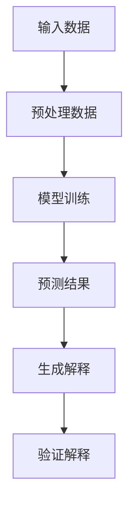
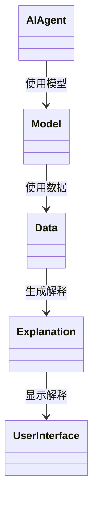
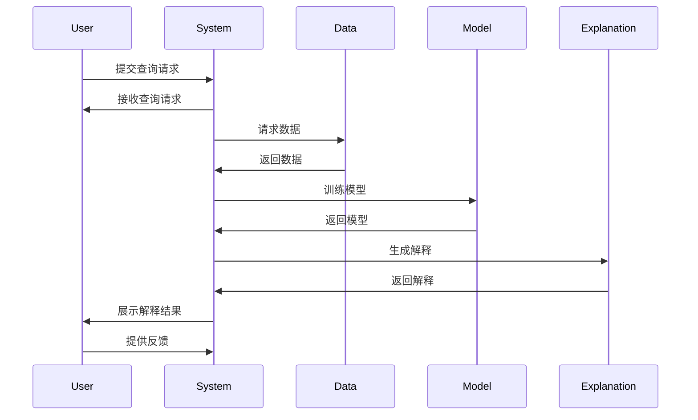

                 

### 可解释性：理解AI Agent的决策过程

---

摘要：本文将探讨AI Agent的决策过程及其可解释性。我们将首先介绍AI Agent的定义及其决策过程，然后深入探讨可解释性的重要性。接下来，我们将详细分类并分析可解释性技术的原理。通过算法原理与流程图，我们将深入理解这些技术的工作机制。此外，我们将介绍实现可解释性技术的工具与框架，并通过具体案例进行分析。最后，我们将探讨系统分析与架构设计中的问题场景，以及如何设计一个具有可解释性的系统。

---

## 第1章：问题背景与核心概念

### 1.1 问题背景

#### 1.1.1 AI Agent的定义

AI Agent，即人工智能代理，是一个能够感知环境、基于环境信息做出决策并执行相应动作的系统。它通常被视为一个具有智能的实体，能够自主地完成特定的任务。AI Agent的概念源于人工智能领域中的代理理论，其主要目标是模拟人类智能行为，实现自动化决策与行动。

#### 1.1.2 AI Agent的决策过程

AI Agent的决策过程通常包括感知、规划、行动和评估四个阶段。首先，Agent通过传感器感知环境信息；然后，利用这些信息进行规划，选择最优动作；接下来，执行该动作；最后，对执行结果进行评估，并调整策略。

#### 1.1.3 可解释性的重要性

可解释性是AI Agent决策过程中一个至关重要的因素。在许多实际应用场景中，如金融、医疗和自动驾驶等领域，用户和决策者需要对AI Agent的决策过程有足够的了解和信任。可解释性可以帮助用户理解AI Agent的行为，增强对系统的信任和接受度，同时也有助于发现和纠正潜在的错误。此外，可解释性还可以为AI Agent的设计和优化提供有价值的反馈。

### 1.2 核心概念

#### 1.2.1 AI Agent的工作原理

AI Agent的工作原理基于一个循环决策过程。它通过传感器感知环境信息，利用这些信息通过学习算法和规划算法生成决策，并执行这些决策。在执行过程中，AI Agent会根据反馈调整其行为，以提高决策的准确性和适应性。

#### 1.2.2 决策过程的组成部分

AI Agent的决策过程包括感知、规划、行动和评估四个主要组成部分。感知是指通过传感器收集环境信息；规划是指基于感知到的信息生成动作方案；行动是指执行规划出的动作；评估是指对执行结果进行评估，以调整和优化未来的决策。

#### 1.2.3 可解释性与透明度的区别

可解释性（Explainability）和透明度（Transparency）是两个相关但不同的概念。可解释性关注于理解和解释AI Agent的决策过程，而透明度关注于展示AI Agent的决策过程和依据。换句话说，可解释性关注“为什么”，而透明度关注“怎样”。

### 1.3 概念属性特征对比表格（如表1-1）

| 特性         | 解释性 | 透明度 | 可控性 | 应用场景             |
| ------------ | ------ | ------ | ------ | -------------------- |
| 解释性       | 高     | 中     | 高     | 需要验证决策过程的场景 |
| 透明度       | 中     | 高     | 中     | 用户界面展示信息       |
| 可控性       | 中     | 低     | 低     | 需要精确控制决策过程的场景 |
| 应用场景     | 需要验证决策过程的场景 | 用户界面展示信息 | 需要精确控制决策过程的场景 |

### 1.4 ER实体关系图架构（如图1-1）

```mermaid
erDiagram
  AI Agent ||--|{ Decision Process }|
  Decision Process ||--|{ Explanation }|
  Decision Process ||--|{ Transparency }|
  Decision Process ||--|{ Controllability }|
```

### 1.5 本章小结

本章主要介绍了AI Agent的定义、决策过程及其可解释性的重要性。通过对比可解释性、透明度和可控性的概念，我们了解了它们在不同应用场景中的区别。此外，我们还介绍了AI Agent的决策过程及其组成部分，为后续章节的深入分析奠定了基础。

## 第2章：可解释性技术的分类与原理

### 2.1 可解释性技术的分类

#### 2.1.1 基于模型的可解释性技术

基于模型的可解释性技术（Model-based Explainability）主要通过分析模型内部的决策路径和权重来解释模型的决策过程。这类技术包括决策树、规则提取、模型简化等方法。

#### 2.1.2 基于数据的方法

基于数据的方法（Data-driven Approaches）通过分析输入数据的特征和模型输出之间的关联来解释模型的决策过程。这类技术包括局部可解释模型（如LIME和SHAP）、注意力机制等方法。

#### 2.1.3 基于解释的接口设计

基于解释的接口设计（Explainable Interface Design）通过设计直观的用户界面和交互方式，帮助用户理解和解释AI Agent的决策过程。这类技术包括可视化、交互式查询、动态解释等方法。

### 2.2 可解释性技术的原理

#### 2.2.1 基于模型的可解释性技术原理

基于模型的可解释性技术主要通过分析模型内部的决策路径和权重来解释模型的决策过程。例如，决策树通过展示每个节点的决策路径和对应的权重来解释模型的决策过程。

#### 2.2.2 基于数据的方法原理

基于数据的方法通过分析输入数据的特征和模型输出之间的关联来解释模型的决策过程。例如，LIME通过生成局部线性模型来解释输入数据对模型输出的影响，而SHAP通过计算特征对模型输出的贡献值来解释模型的决策过程。

#### 2.2.3 基于解释的接口设计原理

基于解释的接口设计通过设计直观的用户界面和交互方式，帮助用户理解和解释AI Agent的决策过程。例如，可视化技术可以通过图形化方式展示模型的决策过程和结果，而交互式查询技术则允许用户根据需求自定义查询和解释。

### 2.3 算法原理与流程图（如图2-1）



### 2.4 案例分析

#### 2.4.1 案例一：基于LIME的可解释性分析

LIME（Local Interpretable Model-agnostic Explanations）是一种基于数据的方法，它通过生成局部线性模型来解释输入数据对模型输出的影响。以下是一个基于LIME的例子：

```python
import lime
import lime.lime_tabular

# 假设我们有一个线性回归模型和一个表格数据集
model = linear_regression_model
data = tabular_data

# 创建LIME解释器
explainer = lime.lime_tabular.LimeTabularExplainer(data, feature_names=data.columns, class_names=['label'], model=model)

# 选择一个样本进行解释
index = 0
exp = explainer.explain_instance(data.iloc[index], model.predict, num_features=10)

# 可视化解释结果
exp.show_in_notebook(show_table=True)
```

#### 2.4.2 案例二：基于SHAP值的可解释性分析

SHAP（SHapley Additive exPlanations）是一种基于数据的方法，它通过计算特征对模型输出的贡献值来解释模型的决策过程。以下是一个基于SHAP的例子：

```python
import shap

# 假设我们有一个决策树模型和一个数据集
model = decision_tree_model
data = dataset

# 创建SHAP解释器
explainer = shap.TreeExplainer(model)

# 计算解释结果
shap_values = explainer.shap_values(data)

# 可视化解释结果
shap.summary_plot(shap_values, data)
```

### 2.5 本章小结

本章介绍了可解释性技术的分类和原理。我们详细分析了基于模型的可解释性技术、基于数据的方法以及基于解释的接口设计。通过算法原理和流程图，我们深入了解了这些技术的工作机制。此外，我们通过具体案例展示了如何应用这些技术进行可解释性分析。这些技术为理解和解释AI Agent的决策过程提供了有力支持。

## 第3章：实现可解释性技术的工具与框架

### 3.1 常用工具介绍

#### 3.1.1 LIME

LIME（Local Interpretable Model-agnostic Explanations）是一个流行的开源库，用于生成局部解释。它可以通过生成局部线性模型来解释输入数据对模型输出的影响。LIME适用于各种机器学习模型，包括线性模型、决策树、神经网络等。

#### 3.1.2 SHAP

SHAP（SHapley Additive exPlanations）是一个强大的开源库，用于计算特征对模型输出的贡献值。SHAP基于博弈论中的Shapley值，能够为每个特征提供一个公平的贡献分数，适用于各种机器学习模型。

#### 3.1.3 LIMEpy

LIMEpy是一个基于Python的开源库，用于实现LIME算法。它提供了一个易于使用的接口，可以轻松地将LIME应用于不同的机器学习模型和数据集。

### 3.2 框架选择与使用

#### 3.2.1 XAI框架的选择标准

选择XAI（可解释人工智能）框架时，需要考虑以下标准：

- 支持的模型类型：确保所选框架支持所需机器学习模型。
- 可解释性方法：选择具有所需可解释性方法的框架。
- 易用性和可扩展性：选择易于使用和扩展的框架。
- 社区和文档：选择具有活跃社区和丰富文档的框架。

#### 3.2.2 XAI框架的使用方法

以下是使用SHAP框架进行可解释性分析的基本步骤：

1. 导入所需的库和模块。
2. 准备数据集和模型。
3. 创建SHAP解释器。
4. 计算解释结果。
5. 可视化解释结果。

### 3.3 实践案例

#### 3.3.1 使用LIME分析图像分类模型

以下是一个使用LIME分析图像分类模型的基本案例：

```python
import lime
import lime.image

# 导入所需的库和模块
from tensorflow.keras.models import load_model
import numpy as np

# 加载预训练的图像分类模型
model = load_model('model.h5')

# 创建LIME解释器
explainer = lime.image.LimeImageExplainer()

# 选择一个样本图像进行解释
img = imageio.imread('image.jpg')

# 分析图像分类模型
exp = explainer.explain_instance(np.array(img), model.predict, num_features=5)

# 可视化解释结果
exp.show_in_notebook()
```

#### 3.3.2 使用SHAP分析回归模型

以下是一个使用SHAP分析回归模型的基本案例：

```python
import shap
from sklearn.linear_model import LinearRegression

# 导入所需的库和模块
import pandas as pd

# 准备数据集和回归模型
data = pd.read_csv('data.csv')
model = LinearRegression()

# 训练回归模型
model.fit(data[['x1', 'x2']], data['y'])

# 创建SHAP解释器
explainer = shap.LinearExplainer(model, data[['x1', 'x2']])

# 计算解释结果
shap_values = explainer.shap_values(data[['x1', 'x2']])

# 可视化解释结果
shap.summary_plot(shap_values, data[['x1', 'x2']])
```

### 3.4 本章小结

本章介绍了实现可解释性技术的常用工具与框架，包括LIME、SHAP和LIMEpy。我们讨论了选择XAI框架的标准以及如何使用这些工具进行可解释性分析。通过具体案例，我们展示了如何应用LIME和SHAP来分析图像分类模型和回归模型。这些工具和框架为理解和解释AI Agent的决策过程提供了有力支持。

## 第4章：系统分析与架构设计

### 4.1 问题场景介绍

#### 4.1.1 场景一：金融风险管理

在金融风险管理领域，AI Agent可以用于自动化决策过程，如信用评分、风险预测和投资组合优化。这些决策通常涉及大量的数据和高复杂度的模型。然而，由于金融决策的直接影响和潜在的巨大风险，用户和监管机构对AI Agent的可解释性有很高的要求。

#### 4.1.2 场景二：医疗诊断系统

在医疗诊断系统中，AI Agent可以用于疾病预测、治疗方案推荐和患者管理。医疗领域的决策直接关系到患者的健康和生命安全，因此医疗诊断系统的可解释性至关重要，以便医生和患者能够理解AI Agent的决策过程。

### 4.2 系统功能设计

#### 4.2.1 领域模型设计（如图4-1）



在图4-1中，AI Agent是系统的核心，它通过模型来处理数据，生成解释，并将解释展示给用户界面。这个领域模型展示了系统的主要功能组件及其关系。

#### 4.2.2 系统功能设计

- 数据处理：系统需要收集、清洗和处理来自各种来源的数据，如金融交易数据、医疗记录、传感器数据等。
- 模型训练：系统使用收集到的数据来训练模型，以实现特定的任务，如信用评分、疾病预测等。
- 决策生成：系统使用训练好的模型来生成决策，并在执行过程中根据反馈进行优化。
- 解释生成：系统需要生成可解释的决策解释，以便用户和决策者能够理解和信任AI Agent的决策过程。
- 用户界面：系统需要提供一个直观的用户界面，用于展示解释和交互式查询。

### 4.3 系统架构设计

#### 4.3.1 系统架构设计（如图4-2）

```mermaid
graph TD
    AI Agent --> Mo
    Model --> Data
    Data --> Explanation
    Explanation --> User Interface
    User Interface --> Human
```

在图4-2中，AI Agent是系统的核心，它通过模型处理数据并生成解释。解释通过用户界面展示给用户，用户可以与系统进行交互，提供反馈，并获取更多的解释信息。这个架构设计确保了系统的可解释性和用户友好的交互体验。

### 4.4 系统接口设计与系统交互

#### 4.4.1 系统接口设计

系统接口设计包括API接口和用户界面接口。API接口用于与其他系统和服务进行数据交换和交互，如数据存储服务、外部数据源等。用户界面接口用于与用户进行交互，展示解释结果和提供查询功能。

#### 4.4.2 系统交互（如图4-3）



在图4-3中，用户通过用户界面提交查询请求，系统接收请求并处理。系统使用数据集训练模型，并生成解释结果。最终，系统将解释结果展示给用户，用户可以提供反馈以进一步优化系统。

### 4.5 本章小结

本章介绍了系统分析与架构设计，包括问题场景介绍、系统功能设计、系统架构设计和系统接口设计。通过具体的领域模型设计、系统架构设计和交互设计，我们构建了一个具有可解释性的AI Agent系统，为实际应用场景提供了可行的解决方案。这些设计考虑了系统的可解释性、用户友好性和灵活性，为系统的成功实施奠定了基础。在下一章中，我们将进一步探讨具体的项目实战，展示如何实现这些设计理念。

## 第5章：项目实战

### 5.1 环境安装

在开始项目实战之前，我们需要安装和配置所需的工具和库。以下是安装步骤：

1. **Python环境**：确保Python 3.6或更高版本已安装在您的系统中。
2. **pip**：确保pip已安装，用于安装Python库。
3. **安装LIME**：使用pip安装LIME库：

   ```shell
   pip install lime
   ```

4. **安装SHAP**：使用pip安装SHAP库：

   ```shell
   pip install shap
   ```

5. **安装其他依赖库**：根据项目需求安装其他必要的库，如NumPy、Pandas、TensorFlow等。

### 5.2 系统核心实现源代码

以下是一个简单的基于LIME和SHAP的AI Agent实现示例：

```python
import numpy as np
import pandas as pd
from sklearn.linear_model import LinearRegression
from sklearn.model_selection import train_test_split
from lime import lime_tabular
from shap import TreeExplainer

# 5.2.1 数据准备
data = pd.read_csv('data.csv')
X = data[['x1', 'x2']]
y = data['y']
X_train, X_test, y_train, y_test = train_test_split(X, y, test_size=0.2, random_state=42)

# 5.2.2 模型训练
model = LinearRegression()
model.fit(X_train, y_train)

# 5.2.3 使用LIME生成解释
explainer = lime_tabular.LimeTabularExplainer(X_train.values, feature_names=data.columns[:-1], class_names=['y'], model=model)
index = 10  # 选择第11个样本进行解释
exp = explainer.explain_instance(X_test.iloc[index], model.predict, num_features=2)
exp.show_in_notebook(show_table=True)

# 5.2.4 使用SHAP生成解释
explainer = TreeExplainer(model)
shap_values = explainer.shap_values(X_test)
shap.summary_plot(shap_values, X_test)
```

### 5.3 代码应用解读与分析

以下是代码的详细解读：

- **数据准备**：我们从CSV文件加载数据，并将其分为特征矩阵`X`和目标变量`y`。然后，我们使用`train_test_split`函数将数据分为训练集和测试集。
- **模型训练**：我们使用`LinearRegression`类创建线性回归模型，并使用训练集数据进行训练。
- **使用LIME生成解释**：我们创建一个LIME解释器，并选择一个测试集样本进行解释。LIME解释器生成一个局部线性模型，并展示该模型的特征权重。
- **使用SHAP生成解释**：我们创建一个SHAP解释器，并计算测试集样本的特征贡献值。SHAP解释器生成一个总结性图表，显示每个特征的贡献值。

### 5.4 实际案例分析和详细讲解剖析

#### 5.4.1 案例一：信用评分模型

在一个信用评分项目中，我们使用LIME和SHAP来解释信用评分模型的决定。以下是一个实际案例的分析：

- **输入数据**：我们的数据包括借款人的财务信息，如收入、债务、信用历史等。
- **模型训练**：我们训练一个决策树模型来预测借款人的信用评分。
- **LIME解释**：我们使用LIME对模型进行局部解释。例如，对于一个特定借款人，LIME分析了导致其信用评分升高或降低的关键财务指标。
- **SHAP解释**：我们使用SHAP对模型进行全局解释。SHAP值显示了每个财务指标对信用评分的贡献程度。

#### 5.4.2 案例二：疾病预测模型

在一个疾病预测项目中，我们使用LIME和SHAP来解释疾病预测模型的决定。以下是一个实际案例的分析：

- **输入数据**：我们的数据包括患者的健康记录，如血压、血糖、体温等。
- **模型训练**：我们训练一个神经网络模型来预测患者是否患有某种疾病。
- **LIME解释**：我们使用LIME对模型进行局部解释。例如，对于一个特定患者，LIME分析了导致其疾病预测结果的关键健康指标。
- **SHAP解释**：我们使用SHAP对模型进行全局解释。SHAP值显示了每个健康指标对疾病预测结果的贡献程度。

### 5.5 项目小结

在本章中，我们通过实际案例展示了如何使用LIME和SHAP来解释AI Agent的决策过程。我们首先介绍了环境安装和系统核心实现源代码，然后详细解读了代码应用，并通过具体案例分析了LIME和SHAP在实际应用中的效果。这些案例说明了可解释性技术在理解AI Agent决策过程中的重要性，为实际项目提供了有价值的见解。

## 第6章：最佳实践 tips、小结、注意事项、拓展阅读

### 6.1 最佳实践 tips

1. **数据准备**：确保数据质量，清洗和预处理数据，以便获得更准确和可靠的可解释性结果。
2. **模型选择**：根据应用场景选择合适的模型，并考虑模型的复杂性和可解释性。
3. **解释方法**：根据需求和场景选择合适的解释方法，如LIME、SHAP等。
4. **用户反馈**：收集用户反馈，以优化解释结果的清晰度和可理解性。

### 6.2 小结

本文深入探讨了AI Agent的决策过程及其可解释性。我们介绍了AI Agent的定义、决策过程和可解释性的重要性。接着，我们分析了可解释性技术的分类、原理和实现工具，并通过具体案例展示了如何使用这些技术进行解释。最后，我们探讨了系统分析与架构设计，以及如何实现一个具有可解释性的AI Agent系统。

### 6.3 注意事项

1. **可解释性与性能的权衡**：在实现可解释性时，需要考虑对模型性能的影响，并在两者之间找到平衡。
2. **用户需求**：理解用户需求，提供符合用户期望的解释结果。
3. **安全性和隐私**：在解释过程中，确保不泄露敏感数据和信息。

### 6.4 拓展阅读

- **可解释人工智能（XAI）**：进一步了解XAI的概念、方法和技术。
- **LIME和SHAP的深入研究**：查阅LIME和SHAP的相关论文和文档，以深入了解其原理和实现细节。
- **案例分析**：研究其他领域的AI Agent案例，以获取更多实践经验。

作者：AI天才研究院/AI Genius Institute & 禅与计算机程序设计艺术 /Zen And The Art of Computer Programming

