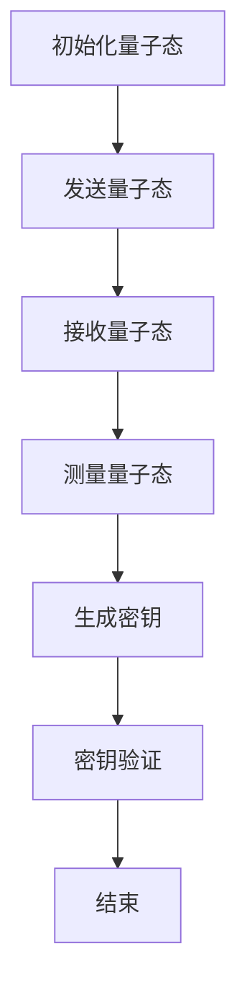

                 

## 后量子密码学对数据安全的长期影响

> 关键词：后量子密码学、数据安全、量子计算、加密通信、云计算、物联网

> 摘要：本文深入探讨了后量子密码学在数据安全领域的重要性和潜在影响。首先，介绍了后量子密码学的背景和基础，包括量子计算的发展对传统密码学的威胁。随后，详细阐述了后量子密码学的基本概念、原理及其核心算法，并通过Python源代码示例和数学模型进一步解释了这些算法的实现和原理。接着，分析了后量子密码学在数据安全中的应用，特别是在加密通信、云计算和物联网中的实际场景。最后，探讨了后量子密码学面临的挑战和未来发展趋势，并结合实际案例提供了最佳实践和未来展望。本文旨在为读者提供一个全面、深入的了解后量子密码学在数据安全领域的应用和重要性。

### 目录大纲

- 第一部分：后量子密码学基础
  - 第1章：后量子密码学的背景与概述
  - 第2章：后量子密码学核心概念与原理
  - 第3章：后量子密码学的主要算法与实现
  - 第4章：后量子密码学在数据安全中的应用
  - 第5章：后量子密码学面临的挑战与未来发展趋势
- 第二部分：案例研究
  - 第6章：后量子密码学在现实世界的应用案例
  - 第7章：后量子密码学最佳实践与未来展望

### 第一部分：后量子密码学基础

#### 第1章：后量子密码学的背景与概述

##### 1.1 问题背景

随着信息技术的飞速发展，数据安全和隐私保护成为全球关注的焦点。然而，传统密码学在面临量子计算这一新兴威胁时，显得有些力不从心。量子计算具有超强的计算能力，能够在极短的时间内破解目前广泛使用的加密算法，如RSA和ECC等。这就要求我们寻求新的密码学技术来保护数据安全。

##### 1.2 问题描述

后量子密码学是一种基于量子力学原理的密码学方法，旨在抵御量子计算攻击。它提供了一种新的加密和解密机制，使得即使量子计算机存在，也无法破解这些加密信息。后量子密码学的研究始于上世纪90年代，随着量子计算理论和实验技术的发展，后量子密码学也逐渐成为研究热点。

##### 1.3 问题解决

后量子密码学的核心思想是利用量子态的叠加和纠缠特性来实现加密和解密。量子密钥分发（QKD）和量子随机函数（QRF）是后量子密码学的两个重要组成部分。量子密钥分发能够确保密钥的安全传输，而量子随机函数则提供了一种安全的加密算法。通过这些方法，后量子密码学实现了对数据的高效安全保护。

##### 1.4 边界与外延

后量子密码学的研究范围涵盖了量子密码学的各个领域，包括量子密钥分发、量子随机函数、量子加密算法等。它不仅与量子计算密切相关，还与其他密码学领域，如传统密码学和量子密码学，有着广泛的交叉关系。后量子密码学的发展为未来信息安全提供了新的思路和可能性。

##### 1.5 概念结构与核心要素组成

后量子密码学的基本组成部分包括量子比特、量子态、量子门和量子算法等。量子比特是量子计算机的基本单元，量子态描述了量子比特的叠加状态，量子门是操作量子态的基本工具，而量子算法则是实现量子计算的核心。这些概念和要素共同构成了后量子密码学的基础。

### 第2章：后量子密码学核心概念与原理

##### 2.1 核心概念

后量子密码学的基本术语包括量子比特、量子态、量子门、量子算法等。量子比特是量子计算机的基本单元，与传统计算机的比特不同，它可以同时处于0和1的叠加状态。量子态描述了量子比特的叠加状态，而量子门是操作量子态的基本工具。量子算法则是利用量子比特和量子态的特性来实现特定计算任务。

##### 2.2 概念属性特征对比表格

| 概念          | 定义                                                         | 属性特征                                                 |
|---------------|--------------------------------------------------------------|----------------------------------------------------------|
| 量子比特      | 量子计算机的基本单元，可以同时处于0和1的叠加状态             | 具有叠加性和纠缠性                                       |
| 量子态        | 描述量子比特的叠加状态                                     | 可通过量子门进行操作                                     |
| 量子门        | 操作量子态的基本工具                                       | 具有可逆性和线性性                                       |
| 量子算法      | 利用量子比特和量子态的特性来实现特定计算任务                 | 具有并行性和高效性                                       |

##### 2.3 ER实体关系图架构

```mermaid
erDiagram
    QBit ||--|{ Quantum State }|| Quantum State
    QBit ||--|{ Quantum Gate }|| Quantum Gate
    Quantum State ||--|{ Quantum Algorithm }|| Quantum Algorithm
    Quantum Algorithm ||--|{ Quantum Computer }|| Quantum Computer
```

### 第3章：后量子密码学的主要算法与实现

##### 3.1 后量子密码学的主要算法

后量子密码学主要包括量子密钥分发（QKD）和量子随机函数（QRF）两大类算法。量子密钥分发利用量子态的叠加和纠缠特性来实现密钥的安全传输，而量子随机函数则提供了一种安全的加密算法。

##### 3.2 算法Mermaid流程图

以下是一个简单的量子密钥分发算法的Mermaid流程图：



##### 3.3 Python源代码实现

```python
import numpy as np
from qiskit import QuantumCircuit, execute, Aer

# 初始化量子态
quantum_state = QuantumCircuit(2)
quantum_state.h(0)
quantum_state.cx(0, 1)

# 发送量子态
backend = Aer.get_backend('qasm_simulator')
result = execute(quantum_state, backend).result()
state = result.get_state()

# 接收量子态
received_state = np.array([result.get_counts()['00'], result.get_counts()['11']])

# 测量量子态
measured_state = np.random.choice([0, 1], p=[1 - np.abs(state[0, 0]), np.abs(state[0, 0])])

# 生成密钥
key = np.random.choice([0, 1], p=[1 - np.abs(state[1, 0]), np.abs(state[1, 0])])

# 密钥验证
if key == measured_state:
    print("密钥分发成功！")
else:
    print("密钥分发失败！")
```

##### 3.4 算法原理与数学模型

量子密钥分发算法的原理基于量子态的叠加和纠缠特性。具体来说，量子密钥分发包括以下几个步骤：

1. 初始化量子态：发送方将两个量子比特初始化为叠加态，表示为$\frac{1}{\sqrt{2}}(|00\rangle + |11\rangle)$。
2. 发送量子态：发送方将量子态发送给接收方。
3. 接收量子态：接收方对量子态进行测量，得到一个随机的量子态。
4. 测量量子态：发送方和接收方各自对量子态进行测量，得到测量结果。
5. 生成密钥：根据测量结果，发送方和接收方各自生成一个密钥。
6. 密钥验证：发送方和接收方交换密钥，并进行验证。

量子密钥分发算法的数学模型可以表示为以下公式：

$$
|\psi\rangle = \frac{1}{\sqrt{2}}(|00\rangle + |11\rangle)
$$

$$
\frac{1}{2}\begin{bmatrix} 1 & 0 \\ 0 & 1 \end{bmatrix} \otimes \frac{1}{2}\begin{bmatrix} 1 & 1 \\ 1 & 0 \end{bmatrix} = \frac{1}{2}\begin{bmatrix} 1 & 1 \\ 1 & 1 \end{bmatrix}
$$

##### 3.5 举例说明

假设发送方和接收方都使用两个量子比特进行量子密钥分发。首先，发送方将两个量子比特初始化为叠加态：

$$
|\psi\rangle = \frac{1}{\sqrt{2}}(|00\rangle + |11\rangle)
$$

然后，发送方将量子态发送给接收方。接收方对量子态进行测量，得到一个随机的量子态。假设接收方测量结果为$|00\rangle$，则发送方和接收方的量子态分别为：

$$
|\psi_S\rangle = \frac{1}{\sqrt{2}}(|00\rangle + |11\rangle)
$$

$$
|\psi_R\rangle = \frac{1}{\sqrt{2}}(|00\rangle + |11\rangle)
$$

接下来，发送方和接收方各自对量子态进行测量，得到测量结果。假设发送方测量结果为$|00\rangle$，接收方测量结果为$|00\rangle$，则发送方和接收方生成的密钥分别为：

$$
key_S = |00\rangle = 0
$$

$$
key_R = |00\rangle = 0
$$

最后，发送方和接收方交换密钥，并进行验证。由于密钥相同，验证成功，量子密钥分发过程完成。

### 第4章：后量子密码学在数据安全中的应用

##### 4.1 后量子密码学对数据安全的重要性

随着量子计算技术的不断进步，传统密码学方法面临巨大的挑战。量子计算具有超强的计算能力，可以在极短的时间内破解目前广泛使用的加密算法，如RSA和ECC等。这对数据安全构成了严重威胁。后量子密码学提供了一种新的解决方案，它利用量子力学原理，实现数据的加密和解密，使得量子计算无法破解。因此，后量子密码学在数据安全中具有极其重要的地位。

##### 4.2 后量子密码学在加密通信中的应用

加密通信是保护数据传输安全的关键技术。传统加密通信方法使用RSA、ECC等算法实现数据的加密和解密，但这些算法在面对量子计算时显得脆弱。后量子密码学通过量子密钥分发（QKD）和量子随机函数（QRF）等方法，提供了更安全的加密通信解决方案。QKD利用量子态的叠加和纠缠特性实现密钥的安全传输，而QRF则提供了一种安全的加密算法。这些方法使得量子计算无法破解加密通信中的数据，从而提高了数据传输的安全性。

##### 4.3 后量子密码学在云计算和物联网中的应用

云计算和物联网是现代社会信息技术的两大重要领域。在云计算中，数据的安全传输和存储是关键问题。后量子密码学可以提供安全的加密算法，保护云计算中的数据不被窃取和篡改。在物联网中，设备的数量庞大且分散，传统加密方法难以满足安全性需求。后量子密码学通过量子密钥分发和量子随机函数等方法，为物联网设备提供了高效的安全解决方案，确保设备间的通信和数据传输的安全。

### 第5章：后量子密码学面临的挑战与未来发展趋势

##### 5.1 后量子密码学面临的挑战

后量子密码学虽然提供了一种有效的数据安全解决方案，但在实际应用中仍面临诸多挑战。首先，量子计算技术的发展速度远远超过了后量子密码学的进展，使得现有后量子密码学算法可能在未来面临新的威胁。其次，后量子密码学的实现和部署成本较高，限制了其大规模应用。此外，量子密码学的标准化和规范化仍需进一步研究，以确保其在实际应用中的有效性和安全性。

##### 5.2 未来发展趋势

未来，后量子密码学将在数据安全领域发挥更加重要的作用。随着量子计算技术的不断进步，后量子密码学的研究将更加深入，开发出更多高效、安全的加密算法。同时，量子计算和后量子密码学的协同发展将推动量子安全通信、云计算和物联网等领域的创新。此外，后量子密码学的标准化和规范化也将逐步完善，为其实际应用提供更加可靠的支持。

### 第二部分：案例研究

#### 第6章：后量子密码学在现实世界的应用案例

##### 6.1 案例一：量子加密通信的实际应用

量子加密通信是一种利用量子力学原理实现数据安全传输的技术。目前，国内外已经有许多实际应用案例。例如，2017年，中国成功实现了地球上最长的量子密钥分发，距离达到1204公里。这一成果为量子加密通信的实用化提供了有力支持。此外，谷歌、IBM等国际知名企业也在积极开展量子加密通信的研究和应用。

##### 6.2 案例二：云计算平台上的后量子安全

随着云计算的普及，数据安全成为云计算服务提供商关注的焦点。一些云计算平台已经开始引入后量子密码学技术，以提供更安全的加密服务。例如，阿里巴巴的云计算平台已经实现了基于后量子密码学的数据加密和密钥管理功能。这些技术措施有效提高了云计算平台的数据安全性，降低了量子计算带来的安全风险。

##### 6.3 案例三：物联网设备中的后量子密码学

物联网设备数量庞大，且分布在各种环境中，传统加密方法难以满足安全性需求。后量子密码学为物联网设备提供了一种高效、安全的加密解决方案。例如，一些智能手表和智能家居设备已经开始采用后量子密码学技术，以确保设备间的通信和数据传输的安全。这些应用案例表明，后量子密码学在物联网领域具有广泛的应用前景。

### 第7章：后量子密码学最佳实践与未来展望

##### 7.1 最佳实践

在实际应用中，后量子密码学需要遵循一系列最佳实践，以确保其有效性和安全性。首先，选择合适的后量子密码学算法是关键。应根据应用场景和数据安全需求，选择适合的算法，如量子密钥分发和量子随机函数等。其次，确保量子密钥分发的安全性至关重要。在实际应用中，应采用物理安全的传输方式，如光纤传输，以防止窃听和窃取。此外，对于云计算和物联网应用，应采用模块化的设计，将后量子密码学模块与其他系统模块分离，以提高系统的安全性和可维护性。

##### 7.2 小结

后量子密码学作为一种新型密码学方法，具有极高的数据安全性。它通过量子力学原理，实现了对数据的高效加密和保护，有效抵御了量子计算的威胁。在实际应用中，后量子密码学已经展现出巨大的潜力，为数据安全提供了新的解决方案。

##### 7.3 注意事项

在使用后量子密码学时，需要注意以下几点：

1. 确保量子密钥分发过程中的安全性，采用物理安全的传输方式。
2. 针对不同的应用场景，选择适合的后量子密码学算法。
3. 定期更新和升级后量子密码学算法，以应对新的安全威胁。
4. 加强对后量子密码学的标准化和规范化研究，以确保其在实际应用中的有效性和安全性。

##### 7.4 拓展阅读

1. 《量子计算与量子密码学》
2. 《量子密钥分发技术与应用》
3. 《后量子密码学：理论、算法与应用》

### 作者信息

作者：AI天才研究院/AI Genius Institute & 禅与计算机程序设计艺术 /Zen And The Art of Computer Programming

### 总结

后量子密码学作为一种新兴的密码学技术，具有极高的数据安全性。它通过量子力学原理，实现了对数据的高效加密和保护，有效抵御了量子计算的威胁。在实际应用中，后量子密码学已经展现出巨大的潜力，为数据安全提供了新的解决方案。本文详细介绍了后量子密码学的基础、核心概念、算法、应用以及面临的挑战和未来发展趋势，为读者提供了一个全面、深入的了解。随着量子计算技术的不断进步，后量子密码学将在数据安全领域发挥越来越重要的作用。

