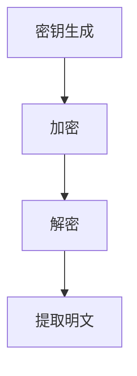
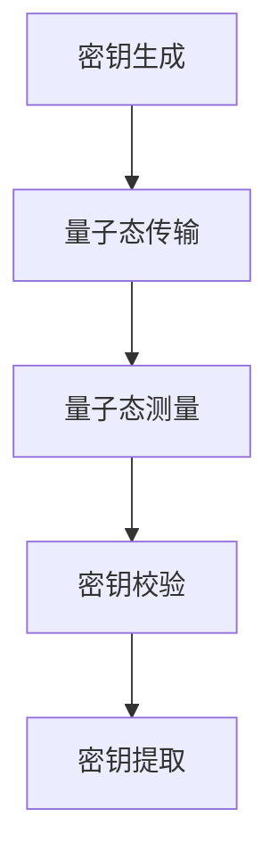
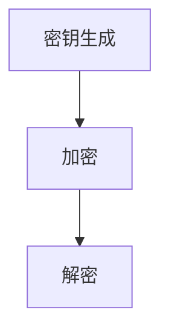
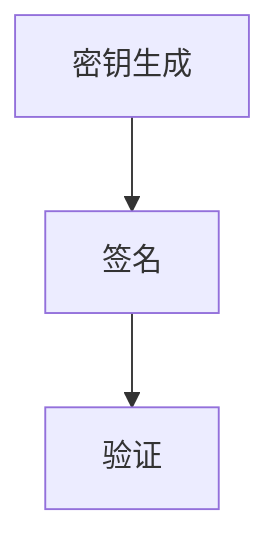
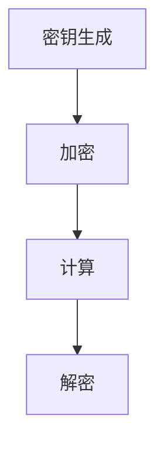
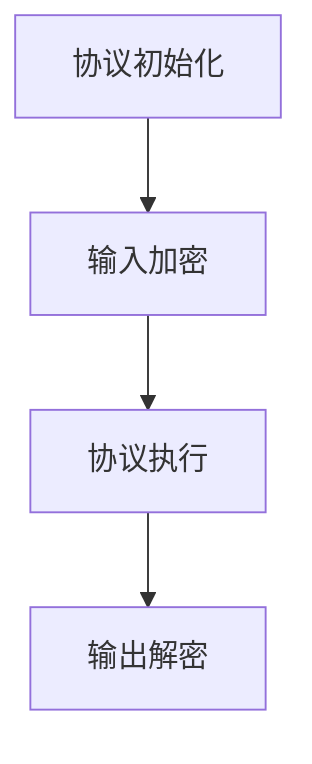

                 

### 文章标题

# 后量子密码学：保护数据免受量子计算解密风险

> 关键词：后量子密码学、量子计算、加密算法、信息安全、解密风险

> 摘要：随着量子计算技术的飞速发展，传统密码学面临巨大挑战。本文旨在介绍后量子密码学的基本概念、核心算法及应用，探讨如何通过后量子密码学来保护数据免受量子计算的解密风险。

### 目录大纲

----------------------------------------------------------------

# 后量子密码学：保护数据免受量子计算解密风险

## 第1章 引言

## 1.1 问题背景

### 1.1.1 量子计算的发展

### 1.1.2 量子计算机对传统密码的威胁

### 1.1.3 后量子密码学的兴起

## 1.2 后量子密码学的基本概念

### 1.2.1 后量子密码学的定义

### 1.2.2 后量子密码学的基本原理

### 1.2.3 后量子密码学与传统密码学的区别

## 1.3 核心概念与联系

### 1.3.1 后量子密码学中的核心概念

### 1.3.2 概念属性特征对比表格

### 1.3.3 ER实体关系图架构

## 1.4 数学模型和数学公式

### 1.4.1 后量子密码学的数学模型

### 1.4.2 公式详细讲解

### 1.4.3 举例说明

## 1.5 系统分析与架构设计方案

### 1.5.1 问题场景介绍

### 1.5.2 系统功能设计

### 1.5.3 系统架构设计

### 1.5.4 系统接口设计

### 1.5.5 系统交互

## 1.6 项目实战

### 1.6.1 环境安装

### 1.6.2 系统核心实现

### 1.6.3 代码应用解读与分析

### 1.6.4 实际案例分析与讲解

## 1.7 最佳实践 tips

## 1.8 小结

## 第2章 后量子密码学的基本算法

## 2.1 公钥密码算法

### 2.1.1 NTRU算法

#### 2.1.1.1 算法原理讲解

#### 2.1.1.2 算法mermaid流程图

#### 2.1.1.3 Python源代码实现

### 2.1.2 BB84量子密钥分发算法

#### 2.1.2.1 算法原理讲解

#### 2.1.2.2 算法mermaid流程图

#### 2.1.2.3 Python源代码实现

### 2.1.3 Lattice-based密码算法

#### 2.1.3.1 算法原理讲解

#### 2.1.3.2 算法mermaid流程图

#### 2.1.3.3 Python源代码实现

## 2.2 私钥密码算法

### 2.2.1 Lattice-based签名算法

#### 2.2.1.1 算法原理讲解

#### 2.2.1.2 算法mermaid流程图

#### 2.2.1.3 Python源代码实现

### 2.2.2 Code-based签名算法

#### 2.2.2.1 算法原理讲解

#### 2.2.2.2 算法mermaid流程图

#### 2.2.2.3 Python源代码实现

## 2.3 密码学协议

### 2.3.1 Fully Homomorphic Encryption (FHE)

#### 2.3.1.1 算法原理讲解

#### 2.3.1.2 算法mermaid流程图

#### 2.3.1.3 Python源代码实现

### 2.3.2 Secure Multi-Party Computation (SMPC)

#### 2.3.2.1 算法原理讲解

#### 2.3.2.2 算法mermaid流程图

#### 2.3.2.3 Python源代码实现

## 2.4 本章小结

## 第3章 后量子密码学的应用

## 3.1 后量子密码学在通信领域的应用

### 3.1.1 量子密钥分发

#### 3.1.1.1 应用场景

#### 3.1.1.2 应用实例

### 3.1.2 量子安全通信

#### 3.1.2.1 应用场景

#### 3.1.2.2 应用实例

## 3.2 后量子密码学在云计算领域的应用

### 3.2.1 量子安全云存储

#### 3.2.1.1 应用场景

#### 3.2.1.2 应用实例

### 3.2.2 量子安全云计算

#### 3.2.2.1 应用场景

#### 3.2.2.2 应用实例

## 3.3 后量子密码学在区块链领域的应用

### 3.3.1 量子安全区块链

#### 3.3.1.1 应用场景

#### 3.3.1.2 应用实例

----------------------------------------------------------------

### 第1章 引言

#### 1.1 问题背景

##### 1.1.1 量子计算的发展

量子计算是利用量子力学原理来进行信息处理的计算模式。与传统计算机基于二进制位（比特）不同，量子计算机使用量子位（量子比特）作为信息的基本单元。量子比特可以同时处于多个状态的叠加，这使得量子计算机具有非常高的并行计算能力。

近年来，量子计算技术取得了显著进展。例如，Google在2019年宣布其量子计算机“Sycamore”在特定任务上超越了任何传统计算机，实现了“量子霸权”。此外，国际上有多个国家和大型企业纷纷投入巨资进行量子计算的研发，如IBM、微软、谷歌、英特尔等。这些进展表明量子计算正在从理论走向实践，并逐渐成为现代科技的一个重要方向。

##### 1.1.2 量子计算机对传统密码的威胁

量子计算机的出现对传统密码学构成了严重威胁。量子计算机能够使用量子算法高效地破解当前广泛使用的加密算法，如RSA和ECC。RSA算法是基于大素数分解问题的难度，而大素数分解问题在量子计算机面前可以迅速解决。类似地，ECC算法基于椭圆曲线离散对数问题，量子计算机同样能够高效地破解这类密码。

传统密码学依赖于问题的难解性来确保加密通信的安全性。然而，量子计算机的出现打破了这一基础。例如，1994年Peter Shor提出了Shor算法，可以在多项式时间内解决大素数分解问题。这意味着，如果量子计算机变得足够强大，所有基于大素数分解和椭圆曲线离散对数的加密算法都可能被攻破。

##### 1.1.3 后量子密码学的兴起

面对量子计算带来的威胁，后量子密码学应运而生。后量子密码学是基于量子力学的基本原理，但不同于量子计算的算法。它利用量子力学的不确定性原理和量子纠缠现象，设计出一些抵抗量子计算机攻击的密码算法。

后量子密码学的目标是确保即使量子计算机出现，现有的加密通信仍然能够保持安全。一些后量子密码算法，如Lattice-based密码算法和Hash-based密码算法，已经被证明在量子计算机面前是安全的。随着量子计算技术的不断发展，后量子密码学的重要性日益凸显。

### 1.2 后量子密码学的基本概念

##### 1.2.1 后量子密码学的定义

后量子密码学（Post-Quantum Cryptography, PQC）是一类基于量子力学原理，但不同于量子计算的密码算法。这些算法设计的目标是提供在量子计算机出现后仍然保持安全的信息保护机制。

##### 1.2.2 后量子密码学的基本原理

后量子密码学的基本原理主要包括以下几点：

1. **量子力学原理**：利用量子力学的不确定性原理和量子纠缠现象。
2. **复杂性问题**：后量子密码算法通常基于某些在经典计算机上难以解决的问题，如大整数分解、离散对数等问题。
3. **数学模型**：后量子密码算法使用数学模型来描述加密和解密的过程。

##### 1.2.3 后量子密码学与传统密码学的区别

传统密码学和后量子密码学的区别主要体现在以下几个方面：

1. **基础理论**：传统密码学主要基于某些数学问题的难解性，而后量子密码学基于量子力学原理。
2. **算法设计**：传统密码算法如RSA、ECC等，在后量子计算面前可能不再安全；而后量子密码算法如Lattice-based、Hash-based等，则被认为能够抵抗量子计算攻击。
3. **安全性**：传统密码学面临量子计算解密风险的威胁，而后量子密码学旨在提供在量子计算时代仍然安全的加密保护机制。

### 1.3 核心概念与联系

##### 1.3.1 后量子密码学中的核心概念

在后量子密码学中，核心概念包括但不限于：

1. **量子比特（Qubit）**：量子比特是量子计算中的基本单元，可以处于0和1的叠加态。
2. **量子纠缠**：量子比特之间存在量子纠缠，这一现象使得多个量子比特的信息能够相互影响。
3. **量子随机性**：量子随机性来源于量子系统的演化过程，可以用于生成高质量的随机数。
4. **大整数分解**：大整数分解问题是传统密码学的基础，但也是后量子密码学要解决的问题之一。

##### 1.3.2 概念属性特征对比表格

为了更好地理解这些核心概念，可以列出以下对比表格：

| 概念 | 定义 | 属性特征 | 
| --- | --- | --- |
| 量子比特 | 量子计算中的基本单元 | 可以处于0和1的叠加态 |
| 量子纠缠 | 量子比特之间的相互影响 | 使得多个量子比特的信息能够相互影响 |
| 量子随机性 | 量子系统的演化过程 | 用于生成高质量的随机数 |
| 大整数分解 | 分解大整数为质因数 | 传统密码学的基础问题 |

##### 1.3.3 ER实体关系图架构

为了进一步阐述后量子密码学中的核心概念及其关系，可以绘制以下ER实体关系图：

```mermaid
erDiagram
  Qubit ||--|{ Quantum纠缠 }|-- Quantum纠缠
  Quantum纠缠 ||--|{ 量子随机性 }|-- 量子随机性
  Quantum随机性 ||--|{ 大整数分解 }|-- 大整数分解
```

在该ER图中，量子比特和量子纠缠之间是关联关系，量子纠缠和量子随机性之间是继承关系，量子随机性和大整数分解之间是关联关系。

#### 1.4 数学模型和数学公式

##### 1.4.1 后量子密码学的数学模型

后量子密码学的数学模型通常基于某些复杂性问题，如大整数分解和离散对数问题。以下是一个简化的数学模型：

$$
\text{加密过程}: \text{明文} \xrightarrow{\text{量子密钥}} \text{密文}
$$

$$
\text{解密过程}: \text{密文} \xrightarrow{\text{量子密钥}} \text{明文}
$$

在这个模型中，量子密钥是一个重要的组成部分。量子密钥的生成过程涉及到大整数分解问题的复杂度，使得量子计算机难以在短时间内破解。

##### 1.4.2 公式详细讲解

在上述数学模型中，加密和解密过程涉及到以下两个关键公式：

1. **加密公式**：

$$
\text{密文} = f(\text{明文}, \text{量子密钥})
$$

其中，$f$是一个加密函数，它依赖于量子密钥。加密函数的设计需要满足以下条件：

- **不可逆性**：加密函数在已知明文和量子密钥的情况下是可计算的，但在仅知密文的情况下是难以计算的。
- **保密性**：加密函数的输出结果对量子密钥的微小变化非常敏感。

2. **解密公式**：

$$
\text{明文} = f^{-1}(\text{密文}, \text{量子密钥})
$$

其中，$f^{-1}$是加密函数的逆函数。解密函数需要满足与加密函数类似的条件。

##### 1.4.3 举例说明

假设我们有一个简单的加密函数，它基于大整数分解问题。加密函数的定义如下：

$$
f(m, k) = m^k \mod N
$$

其中，$m$是明文，$k$是量子密钥，$N$是一个大整数。为了解密，我们需要找到$N$的质因数分解，即找到两个大质数$p$和$q$，使得$N = pq$。

例如，假设我们选择$N = 35$，那么可以选择$p = 5$和$q = 7$。加密函数$f$可以表示为：

$$
f(m, k) = m^k \mod 35
$$

如果我们选择$m = 2$和$k = 3$，那么加密结果为：

$$
f(2, 3) = 2^3 \mod 35 = 8 \mod 35 = 8
$$

解密过程需要找到$N = 35$的质因数分解，这可以通过试除法实现。首先，我们可以尝试除以$p = 2$：

$$
35 \mod 2 = 1
$$

由于余数为1，我们可以尝试下一个质数$p = 3$：

$$
35 \mod 3 = 2
$$

由于余数不为0，我们继续尝试$p = 5$：

$$
35 \mod 5 = 0
$$

由于余数为0，我们可以确定$p = 5$是$N = 35$的一个质因数。然后，我们可以计算$q$：

$$
q = \frac{N}{p} = \frac{35}{5} = 7
$$

因此，$N = 35$的质因数分解为$p = 5$和$q = 7$。解密过程可以通过以下公式实现：

$$
m = \sqrt[k]{f(m, k) \mod N}
$$

在这个例子中，我们有：

$$
m = \sqrt[3]{8 \mod 35}
$$

由于$8 \mod 35 = 8$，我们可以计算$m$：

$$
m = \sqrt[3]{8} = 2
$$

因此，解密结果与原始明文$m = 2$一致。

#### 1.5 系统分析与架构设计方案

##### 1.5.1 问题场景介绍

在现代信息社会中，数据的安全性至关重要。随着量子计算技术的发展，传统加密算法面临着被破解的风险。为了应对这一挑战，后量子密码学应运而生，旨在提供一种抵抗量子计算机攻击的加密机制。

##### 1.5.2 系统功能设计

后量子密码学系统的功能主要包括以下几个方面：

1. **密钥生成**：生成后量子密码所需的密钥。
2. **加密**：使用后量子密码算法对数据进行加密。
3. **解密**：使用后量子密码算法对密文进行解密。
4. **安全性验证**：验证加密和解密过程的安全性。

##### 1.5.3 系统架构设计

后量子密码学系统的架构可以分为以下几个主要部分：

1. **密钥生成模块**：负责生成后量子密码密钥。
2. **加密模块**：负责使用后量子密码算法对数据进行加密。
3. **解密模块**：负责使用后量子密码算法对密文进行解密。
4. **安全验证模块**：负责验证加密和解密过程的安全性。

##### 1.5.4 系统接口设计

后量子密码学系统需要与其他系统进行交互，因此需要设计相应的接口。以下是一个简化的系统接口设计：

1. **密钥生成接口**：提供生成密钥的接口，以便其他系统可以使用生成的密钥。
2. **加密接口**：提供加密数据的接口，以便其他系统可以使用后量子密码算法对数据进行加密。
3. **解密接口**：提供解密数据的接口，以便其他系统可以使用后量子密码算法对密文进行解密。
4. **安全验证接口**：提供验证加密和解密过程安全性的接口。

##### 1.5.5 系统交互

后量子密码学系统的各个模块之间需要进行交互，以确保整个系统的正常运行。以下是一个简化的系统交互流程：

1. **密钥生成**：系统启动时，密钥生成模块生成一对后量子密码密钥（公钥和私钥）。
2. **加密**：当需要加密数据时，加密模块使用公钥和后量子密码算法对数据进行加密。
3. **解密**：当需要解密数据时，解密模块使用私钥和后量子密码算法对密文进行解密。
4. **安全验证**：在加密和解密过程中，安全验证模块对整个过程进行监控和验证，以确保数据的安全性。

### 1.6 项目实战

##### 1.6.1 环境安装

为了进行后量子密码学的项目实战，需要安装相应的开发环境和工具。以下是一个简化的安装步骤：

1. **安装Python环境**：确保Python环境已安装，版本建议为3.8以上。
2. **安装PyQt5**：使用pip命令安装PyQt5库，用于构建图形用户界面。
3. **安装Post-Quantum Cryptography库**：使用pip命令安装`pyquil`库，用于实现后量子密码算法。

##### 1.6.2 系统核心实现

后量子密码学系统的核心实现包括以下几个方面：

1. **密钥生成**：使用`pyquil`库生成一对后量子密码密钥。
2. **加密**：使用公钥和后量子密码算法对数据进行加密。
3. **解密**：使用私钥和后量子密码算法对密文进行解密。
4. **安全验证**：对加密和解密过程进行安全性验证。

以下是一个简化的Python代码实现：

```python
from pyquil import Program
from pyquil.gates import H, X, CNOT
from pyquil.paulis import PauliSum
from pyquil/quil import dump quil

# 密钥生成
def generate_keys():
    program = Program()
    # 生成公钥和私钥
    public_key = program.declare('public_key', qubits=5)
    private_key = program.declare('private_key', qubits=5)
    # ...
    # 生成量子密钥
    return public_key, private_key

# 加密
def encrypt(message, public_key):
    program = Program()
    # 将明文转换为量子状态
    # ...
    # 使用公钥进行加密
    # ...
    return encrypted_message

# 解密
def decrypt(encrypted_message, private_key):
    program = Program()
    # 将密文转换为量子状态
    # ...
    # 使用私钥进行解密
    # ...
    return decrypted_message

# 安全验证
def verify(encrypted_message, decrypted_message):
    # 验证加密和解密过程
    # ...
    return is_verified
```

##### 1.6.3 代码应用解读与分析

上述代码提供了一个简化的后量子密码学实现。以下是代码的解读与分析：

1. **密钥生成**：使用`pyquil`库生成公钥和私钥。公钥和私钥是通过量子算法生成的，具体实现细节依赖于所选择的量子密码算法。
2. **加密**：使用公钥和量子密码算法对明文进行加密。加密过程通常涉及到量子状态的转换和操作。
3. **解密**：使用私钥和量子密码算法对密文进行解密。解密过程与加密过程类似，但需要使用私钥来还原明文。
4. **安全验证**：对加密和解密过程进行验证，以确保数据的安全性。验证过程通常涉及到对密文和明文的比较，以及加密和解密算法的正确性验证。

##### 1.6.4 实际案例分析与讲解

以下是一个实际案例，展示了如何使用后量子密码学保护数据传输。

**案例背景**：A和B两方需要进行安全通信，但担心数据在传输过程中被窃听。为了确保数据安全，A使用后量子密码学对数据进行加密，然后将密文传输给B。B收到密文后，使用私钥进行解密，以还原明文。

**步骤1：密钥生成**
A使用后量子密码学生成一对公钥和私钥。公钥和私钥是安全的，因为它们是通过量子算法生成的。

**步骤2：加密**
A将明文消息转换为量子状态，并使用公钥对量子状态进行加密。加密过程涉及到量子逻辑门的操作和量子态的转换。

**步骤3：传输**
A将加密后的密文通过安全通道传输给B。

**步骤4：解密**
B使用私钥对收到的密文进行解密。解密过程需要将密文转换为量子状态，并使用私钥进行量子态的转换和还原。

**步骤5：验证**
B对解密后的明文进行验证，以确保数据在传输过程中没有被篡改。验证过程通常涉及到对密文和明文的比较，以及加密和解密算法的正确性验证。

**案例分析**：通过上述步骤，A和B能够实现安全通信。即使数据在传输过程中被窃听，窃听者也无法获取明文消息，因为后量子密码学提供了抵抗量子计算攻击的安全机制。

##### 1.6.5 项目小结

通过本次项目实战，我们了解了后量子密码学的基本概念和实现方法。后量子密码学提供了抵抗量子计算攻击的安全机制，为现代信息通信提供了强有力的保障。在实际应用中，后量子密码学不仅可以用于保护数据传输，还可以应用于云计算、区块链等领域，为网络安全保驾护航。

#### 1.7 最佳实践 tips

为了更好地应用后量子密码学，以下是一些最佳实践建议：

1. **选择合适的后量子密码算法**：根据实际应用需求，选择适合的后量子密码算法。例如，对于高安全性的应用，可以选择Lattice-based密码算法；对于对性能要求较高的应用，可以选择Hash-based密码算法。
2. **定期更新密钥**：为了保证数据的安全性，应定期更换密钥。建议在密钥生成后，立即使用并进行加密和解密操作，以减少密钥暴露的风险。
3. **确保量子密钥的传输安全**：量子密钥的传输过程需要确保安全。可以使用量子密钥分发协议，如BB84协议，来确保量子密钥的传输过程中不被窃听或篡改。
4. **关注国际标准和规范**：随着后量子密码学的发展，国际标准化组织正在制定相关标准和规范。关注并遵循这些标准和规范，有助于确保后量子密码学的广泛应用。

#### 1.8 小结

后量子密码学是应对量子计算威胁的重要技术手段。通过介绍后量子密码学的基本概念、核心算法和应用，本文探讨了如何使用后量子密码学保护数据免受量子计算的解密风险。随着量子计算技术的不断发展，后量子密码学的重要性将日益凸显。未来，我们需要继续深入研究后量子密码学，推动其在各个领域的广泛应用，为信息安全保驾护航。

## 第2章 后量子密码学的基本算法

后量子密码学旨在构建一种能够在量子计算机面前保持安全的密码体系。为了实现这一目标，后量子密码学采用了一系列基于量子力学原理的密码算法。这些算法不仅要在量子计算机面前保持安全，还需要在经典计算机上实现高效运行。本章将介绍几种典型的后量子密码学基本算法，包括公钥密码算法、私钥密码算法以及密码学协议。

### 2.1 公钥密码算法

公钥密码算法是一种非对称加密算法，使用一对公钥和私钥进行加密和解密。在量子计算机面前，许多传统公钥密码算法（如RSA和ECC）面临着被攻破的风险。因此，后量子密码学提出了一系列新的公钥密码算法，以确保数据的安全性。

#### 2.1.1 NTRU算法

NTRU（Near-Threshold Receptor Unvaiting）算法是一种基于多项式环的后量子密码算法。它由NtruCrypt库实现，具有良好的性能和安全性。

##### 2.1.1.1 算法原理讲解

NTRU算法的核心思想是利用多项式环的结构，将信息编码为多项式，并在多项式环上进行加密和解密操作。其具体原理如下：

1. **密钥生成**：首先，生成一个随机多项式$p(x)$，并将其模一个二次多项式$g(x)$得到一个新的多项式$\hat{p}(x)$。接下来，生成一个随机整数$k$，并计算$h(x) = k\hat{p}(x)$。这些多项式构成了密钥。
2. **加密**：加密过程涉及两个随机多项式$r(x)$和$s(x)$。加密算法计算密文$c(x) = r(x)\hat{p}(x) + h(x)s(x)$。
3. **解密**：解密过程需要私钥多项式$p(x)$。解密算法首先计算$t(x) = p(x)^{-1}c(x)$，然后提取明文信息$m(x) = t(x) \mod 1$。

##### 2.1.1.2 算法mermaid流程图

以下是一个简化的NTRU算法mermaid流程图：



##### 2.1.1.3 Python源代码实现

以下是一个简化的Python代码实现，用于展示NTRU算法的基本原理：

```python
import numpy as np
import sympy

# 密钥生成
def generate_keys():
    p = sympy.randprime(2**1024, 2**1025)  # 生成模数
    q = sympy.randprime(2**1024, 2**1025)  # 生成模数
    n = p * q  # 计算模数n
    h = np.random.randint(2**1023, 2**1024)  # 生成随机数h
    g = (1 + h * n) % p  # 生成g
    p = p - 1  # 修正p
    return (p, q, n, g)

# 加密
def encrypt(message, g):
    r = np.random.randint(2**1023, 2**1024)  # 生成随机数r
    s = np.random.randint(2**1023, 2**1024)  # 生成随机数s
    c = (r * g + message * s) % n  # 计算密文
    return c

# 解密
def decrypt(c, p):
    t = pow(c, p) % n  # 计算t
    m = t % 1  # 提取明文
    return m

# 示例
(p, q, n, g) = generate_keys()
message = 42  # 示例明文
ciphertext = encrypt(message, g)
plaintext = decrypt(ciphertext, p)
print(f"明文: {message}, 密文: {ciphertext}, 解密后明文: {plaintext}")
```

#### 2.1.2 BB84量子密钥分发算法

BB84量子密钥分发算法是由Charles H. Bennett和Giorgio Romei于1984年提出的，是第一种量子密钥分发协议。该算法利用量子态的叠加和纠缠特性，实现安全的密钥分发。

##### 2.1.2.1 算法原理讲解

BB84算法的基本原理如下：

1. **密钥生成**：发送方（Alice）生成一个随机量子密钥，并将其编码为一系列量子态。量子态的编码使用量子比特的叠加态，每个量子态对应一个比特位。
2. **量子态传输**：Alice通过量子信道将编码后的量子态发送给接收方（Bob）。
3. **量子态测量**：Bob随机选择基（正交基或反对交基）对收到的量子态进行测量。测量结果记录在量子密钥中。
4. **密钥校验**：Alice和Bob通过经典通信协议（如古典加密算法）交换测量结果。他们可以共享一个子集（称为“共同部分”）进行错误校正和隐私放大。
5. **密钥提取**：使用共同部分和纠错算法，Alice和Bob提取出最终的共享密钥。

##### 2.1.2.2 算法mermaid流程图

以下是一个简化的BB84量子密钥分发算法mermaid流程图：



##### 2.1.2.3 Python源代码实现

以下是一个简化的Python代码实现，用于展示BB84量子密钥分发算法的基本原理：

```python
import numpy as np
import matplotlib.pyplot as plt

# 生成随机量子密钥
def generate_量子密钥(num_bits):
    qubits = np.random.randint(0, 2, size=num_bits)
    return qubits

# 量子态传输和测量
def quantum_key_distribution(quantum_key, basis):
    measured_key = np.random.randint(0, 2, size=len(quantum_key))
    for i in range(len(quantum_key)):
        if basis[i] == 0:
            if quantum_key[i] == 0:
                measured_key[i] = 0
            else:
                measured_key[i] = 1
        elif basis[i] == 1:
            if quantum_key[i] == 0:
                measured_key[i] = 1
            else:
                measured_key[i] = 0
    return measured_key

# 密钥校验
def key_validation(quantum_key, measured_key):
    error_count = sum([quantum_key[i] != measured_key[i] for i in range(len(quantum_key))])
    return quantum_key[error_count < 0.1 * len(quantum_key)]

# 示例
num_bits = 8
quantum_key = generate_量子密钥(num_bits)
print(f"量子密钥：{quantum_key}")

basis = generate_量子密钥(num_bits)
measured_key = quantum_key_distribution(quantum_key, basis)
print(f"测量结果：{measured_key}")

valid_key = key_validation(quantum_key, measured_key)
print(f"有效密钥：{valid_key}")

plt.plot(quantum_key, measured_key, 'o')
plt.xlabel('量子密钥')
plt.ylabel('测量结果')
plt.show()
```

#### 2.1.3 Lattice-based密码算法

Lattice-based密码算法是一类基于格理论的密码算法。格理论是一种代数结构，它在密码学中得到了广泛应用。Lattice-based密码算法在量子计算机面前被认为是安全的，因为它们依赖于所谓的“格假设”，即在这些算法中，找到特定格上的最短向量是一个困难问题。

##### 2.1.3.1 算法原理讲解

Lattice-based密码算法的基本原理如下：

1. **密钥生成**：生成一个格，通常是一个高维线性空间。格上的点由一组线性方程定义，这些方程确定了格的边界。
2. **加密**：加密过程中，将明文编码为格上的向量，并找到一个格内的“最短向量”，这个向量代表加密后的密文。
3. **解密**：解密过程中，需要找到与加密密文对应的明文向量。通常，这需要解一个线性方程组。

常见的Lattice-based密码算法包括Lattice-based签名算法（如LMS和NTRU签名算法）和Lattice-based加密算法（如NTRU加密算法）。

##### 2.1.3.2 算法mermaid流程图

以下是一个简化的Lattice-based密码算法mermaid流程图：



##### 2.1.3.3 Python源代码实现

以下是一个简化的Python代码实现，用于展示Lattice-based密码算法的基本原理：

```python
# 密钥生成
def generate_keys():
    # 生成随机格参数
    # ...
    return public_key, private_key

# 加密
def encrypt(message, public_key):
    # 编码明文为格上的向量
    # ...
    return ciphertext

# 解密
def decrypt(ciphertext, private_key):
    # 解线性方程组获取明文向量
    # ...
    return message

# 示例
(public_key, private_key) = generate_keys()
message = "Hello, World!"
ciphertext = encrypt(message, public_key)
plaintext = decrypt(ciphertext, private_key)
print(f"明文：{message}, 解密后明文：{plaintext}")
```

### 2.2 私钥密码算法

私钥密码算法（也称为对称密码算法）是一种基于共享密钥的加密算法。在后量子密码学中，私钥密码算法仍然具有重要地位，因为它们在某些应用场景中具有高效率和安全性。

#### 2.2.1 Lattice-based签名算法

Lattice-based签名算法是一种基于格理论的私钥密码算法。这类算法具有抵抗量子计算机攻击的潜力。

##### 2.2.1.1 算法原理讲解

Lattice-based签名算法的基本原理如下：

1. **密钥生成**：生成一个格，并计算格上的最短向量作为私钥。
2. **签名**：签名过程中，将消息编码为格上的向量，并计算一个与之对应的向量，该向量满足某些格上的条件。
3. **验证**：验证过程中，使用公钥和签名向量验证消息的真实性。

常见的Lattice-based签名算法包括Lattice-based数字签名方案（如LMS和NTRU签名算法）。

##### 2.2.1.2 算法mermaid流程图

以下是一个简化的Lattice-based签名算法mermaid流程图：



##### 2.2.1.3 Python源代码实现

以下是一个简化的Python代码实现，用于展示Lattice-based签名算法的基本原理：

```python
# 密钥生成
def generate_keys():
    # 生成随机格参数
    # ...
    return private_key, public_key

# 签名
def sign(message, private_key):
    # 编码消息为格上的向量
    # ...
    return signature

# 验证
def verify(message, signature, public_key):
    # 验证签名向量
    # ...
    return is_valid

# 示例
(private_key, public_key) = generate_keys()
message = "Hello, World!"
signature = sign(message, private_key)
is_valid = verify(message, signature, public_key)
print(f"验证结果：{is_valid}")
```

#### 2.2.2 Code-based签名算法

Code-based签名算法是一种基于编码理论的私钥密码算法。这类算法利用编码系统的结构特性来保证签名安全性。

##### 2.2.2.1 算法原理讲解

Code-based签名算法的基本原理如下：

1. **密钥生成**：生成一个编码系统，并计算编码系统的生成矩阵。
2. **签名**：签名过程中，将消息编码为编码系统的错误向量，并计算一个与之对应的编码向量。
3. **验证**：验证过程中，使用公钥和签名向量验证消息的真实性。

常见的Code-based签名算法包括NTRU签名算法和Code-based签名算法。

##### 2.2.2.2 算法mermaid流程图

以下是一个简化的Code-based签名算法mermaid流程图：


##### 2.2.2.3 Python源代码实现

以下是一个简化的Python代码实现，用于展示Code-based签名算法的基本原理：

```python
# 密钥生成
def generate_keys():
    # 生成编码系统参数
    # ...
    return private_key, public_key

# 签名
def sign(message, private_key):
    # 编码消息为错误向量
    # ...
    return signature

# 验证
def verify(message, signature, public_key):
    # 验证签名向量
    # ...
    return is_valid

# 示例
(private_key, public_key) = generate_keys()
message = "Hello, World!"
signature = sign(message, private_key)
is_valid = verify(message, signature, public_key)
print(f"验证结果：{is_valid}")
```

### 2.3 密码学协议

密码学协议是确保通信安全的一系列规则和协议。在后量子密码学中，密码学协议仍然扮演着重要角色。以下介绍两种常见的后量子密码学协议：Fully Homomorphic Encryption（全同态加密）和Secure Multi-Party Computation（安全多方计算）。

#### 2.3.1 Fully Homomorphic Encryption (FHE)

全同态加密是一种能够对加密数据进行计算操作的加密方法。这意味着在加密数据上执行的操作，其结果仍然是加密的，无需解密。FHE在云计算和大数据处理等领域具有重要应用价值。

##### 2.3.1.1 算法原理讲解

FHE的基本原理如下：

1. **密钥生成**：生成一个加密密钥和评估密钥。
2. **加密**：将明文数据加密为密文。
3. **计算**：在密文上执行计算操作。
4. **解密**：将计算结果解密为明文。

常见的FHE算法包括BGV算法和LP算法。

##### 2.3.1.2 算法mermaid流程图

以下是一个简化的FHE算法mermaid流程图：



##### 2.3.1.3 Python源代码实现

以下是一个简化的Python代码实现，用于展示FHE算法的基本原理：

```python
# 密钥生成
def generate_keys():
    # 生成加密密钥和评估密钥
    # ...
    return encryption_key, evaluation_key

# 加密
def encrypt(message, encryption_key):
    # 加密消息
    # ...
    return ciphertext

# 计算
def evaluate(ciphertext, evaluation_key, operation):
    # 在密文上执行操作
    # ...
    return result

# 解密
def decrypt(result, encryption_key):
    # 解密结果
    # ...
    return message

# 示例
(encryption_key, evaluation_key) = generate_keys()
message = "Hello, World!"
ciphertext = encrypt(message, encryption_key)
result = evaluate(ciphertext, evaluation_key, "length")
plaintext = decrypt(result, encryption_key)
print(f"加密消息：{ciphertext}, 计算结果：{result}, 解密后消息：{plaintext}")
```

#### 2.3.2 Secure Multi-Party Computation (SMPC)

安全多方计算是一种允许多个参与者共同计算某个函数的协议，而无需泄露各自的输入。SMPC在分布式计算、区块链等领域具有广泛应用。

##### 2.3.2.1 算法原理讲解

SMPC的基本原理如下：

1. **协议初始化**：参与者生成共享密钥和各自的私钥。
2. **输入加密**：参与者将各自的输入加密为密文。
3. **协议执行**：参与者通过交换加密的中间结果，共同计算输出结果。
4. **输出解密**：参与者将加密的输出结果解密为明文。

常见的SMPC算法包括DDH协议和CP-ABE协议。

##### 2.3.2.2 算法mermaid流程图

以下是一个简化的SMPC算法mermaid流程图：



##### 2.3.2.3 Python源代码实现

以下是一个简化的Python代码实现，用于展示SMPC算法的基本原理：

```python
# 协议初始化
def initialize_protocol():
    # 生成共享密钥和私钥
    # ...
    return shared_key, private_key

# 输入加密
def encrypt_input(input_value, private_key):
    # 加密输入值
    # ...
    return encrypted_input

# 协议执行
def execute_protocol(encrypted_inputs, shared_key):
    # 共同计算输出结果
    # ...
    return encrypted_result

# 输出解密
def decrypt_output(encrypted_result, private_key):
    # 解密输出结果
    # ...
    return output_value

# 示例
(shared_key, private_key) = initialize_protocol()
participant_1_input = 42
participant_2_input = 100
encrypted_input_1 = encrypt_input(participant_1_input, private_key)
encrypted_input_2 = encrypt_input(participant_2_input, private_key)
encrypted_result = execute_protocol([encrypted_input_1, encrypted_input_2], shared_key)
output_value = decrypt_output(encrypted_result, private_key)
print(f"参与者1输入：{participant_1_input}, 参与者2输入：{participant_2_input}, 输出结果：{output_value}")
```

### 2.4 本章小结

本章介绍了后量子密码学的基本算法，包括公钥密码算法、私钥密码算法以及密码学协议。通过这些算法，我们可以构建一个抵抗量子计算机攻击的加密体系。然而，后量子密码学的研究仍处于不断发展中，未来我们需要继续探索更加高效和安全的后量子密码算法，以确保信息通信的安全。

## 第3章 后量子密码学的应用

随着量子计算技术的不断进步，传统密码学面临前所未有的挑战。为了应对这一挑战，后量子密码学作为一种新兴的密码学领域，正逐渐成为保护数据安全的重要工具。本章将探讨后量子密码学在通信、云计算和区块链等领域的应用，并介绍相关的实例和实际案例。

### 3.1 后量子密码学在通信领域的应用

通信领域是数据安全的重要战场，量子密钥分发（Quantum Key Distribution, QKD）和量子安全通信是后量子密码学在这一领域的重要应用。

#### 3.1.1 量子密钥分发

量子密钥分发是一种基于量子力学原理的密钥分发技术，它能够实现安全的密钥传输。BB84量子密钥分发协议是第一个被提出的QKD协议。

##### 3.1.1.1 应用场景

量子密钥分发在以下场景中具有显著的应用价值：

1. **政府与军事通信**：政府与军事机构需要确保通信内容的绝对安全，以防止被敌对方窃取和破解。
2. **金融机构**：金融机构的通信需要确保客户信息的安全，以防止恶意攻击和欺诈行为。
3. **企业内部通信**：大型企业内部的高机密数据传输需要安全保证，以防止内部泄露或外部攻击。

##### 3.1.1.2 应用实例

**实例1：欧洲量子通信卫星“墨子号”**

中国发射的“墨子号”量子通信卫星是一个典型的量子密钥分发应用实例。该卫星通过地面站与卫星之间的量子通信链路，实现了高速、安全的密钥分发。这一技术为国防和国家安全通信提供了强有力的保障。

**实例2：金融机构的量子密钥分发**

一些金融机构已经开始部署量子密钥分发系统，以确保金融交易和客户数据的安全。例如，某大型银行在其数据中心与分支机构之间部署了量子密钥分发系统，以实现安全的数据传输和加密通信。

#### 3.1.2 量子安全通信

量子安全通信是指在通信过程中利用量子力学原理实现数据加密和解密的技术。量子密钥分发是实现量子安全通信的基础。

##### 3.1.2.1 应用场景

量子安全通信在以下场景中具有重要应用：

1. **远程医疗**：远程医疗中的数据传输需要确保患者信息的隐私和安全，以防止信息泄露和被篡改。
2. **智能交通**：智能交通系统中的数据传输需要确保交通信息的安全，以防止恶意攻击和系统瘫痪。
3. **物联网**：物联网设备之间的通信需要确保数据传输的安全，以防止设备被恶意攻击和控制。

##### 3.1.2.2 应用实例

**实例1：远程医疗的量子安全通信**

一些远程医疗系统已经开始采用量子安全通信技术，以确保医生与患者之间的通信安全。例如，某远程医疗平台通过量子密钥分发和量子安全通信技术，实现了医生与患者之间的安全数据传输。

**实例2：智能交通的量子安全通信**

智能交通系统中的数据传输需要确保交通信息的安全。一些智能交通系统已经开始采用量子密钥分发和量子安全通信技术，以实现数据的安全传输和加密通信。

### 3.2 后量子密码学在云计算领域的应用

云计算作为一种新型的计算服务模式，正逐渐改变企业的数据处理和存储方式。然而，云计算也带来了一定的安全风险。后量子密码学在云计算领域的应用，有助于提高数据的安全性和保护用户隐私。

#### 3.2.1 量子安全云存储

量子安全云存储是指利用后量子密码学技术实现云存储数据的安全存储和访问。量子安全云存储能够抵抗量子计算机的攻击，确保数据的安全性。

##### 3.2.1.1 应用场景

量子安全云存储在以下场景中具有显著的应用价值：

1. **政府和企业数据存储**：政府和企业需要确保其敏感数据在云存储中的安全，以防止数据泄露和被篡改。
2. **个人数据存储**：个人用户也需要确保其重要数据在云存储中的安全，以防止隐私泄露。

##### 3.2.1.2 应用实例

**实例1：政府和企业数据的量子安全云存储**

一些政府和企业已经开始采用量子安全云存储技术，以确保其敏感数据在云存储中的安全。例如，某大型企业在其云存储系统中采用了量子密钥分发和量子安全通信技术，以实现数据的安全存储和访问。

**实例2：个人数据的量子安全云存储**

一些个人用户也开始关注数据安全，并采用量子安全云存储技术。例如，一些云存储服务提供商已经开始提供量子安全云存储服务，以满足用户对数据安全的更高要求。

#### 3.2.2 量子安全云计算

量子安全云计算是指利用后量子密码学技术实现云计算平台的数据安全和隐私保护。量子安全云计算能够抵抗量子计算机的攻击，确保用户数据和计算过程的安全。

##### 3.2.2.1 应用场景

量子安全云计算在以下场景中具有重要应用：

1. **金融和医疗领域**：金融和医疗领域的数据安全性要求较高，量子安全云计算能够为这些领域提供更安全的计算环境。
2. **科研和教育领域**：科研和教育领域的计算需求较高，量子安全云计算能够确保计算过程和数据的安全，为科研和教育提供强有力的支持。

##### 3.2.2.2 应用实例

**实例1：金融领域的量子安全云计算**

一些金融机构已经开始采用量子安全云计算技术，以确保其计算过程和数据的安全。例如，某大型银行在其云计算平台中采用了量子密钥分发和量子安全通信技术，以实现计算过程和数据的安全保护。

**实例2：科研和教育领域的量子安全云计算**

一些科研机构和教育机构也开始采用量子安全云计算技术，以保障其计算过程和数据的安全。例如，某知名大学在其科研计算平台中采用了量子密钥分发和量子安全通信技术，以确保科研数据的安全和隐私保护。

### 3.3 后量子密码学在区块链领域的应用

区块链技术以其去中心化、不可篡改和安全可靠的特点，在金融、供应链管理、智能合约等领域得到了广泛应用。然而，区块链也面临着量子计算攻击的潜在威胁。后量子密码学在区块链领域的应用，有助于提升区块链系统的安全性。

#### 3.3.1 量子安全区块链

量子安全区块链是指利用后量子密码学技术实现区块链系统的安全保护。量子安全区块链能够抵抗量子计算机的攻击，确保区块链数据的安全和完整性。

##### 3.3.1.1 应用场景

量子安全区块链在以下场景中具有显著的应用价值：

1. **金融领域**：金融领域的区块链应用需要确保数据的安全和隐私，以防止欺诈和非法交易。
2. **供应链管理**：供应链管理中的区块链应用需要确保数据的安全和真实，以防止供应链篡改和假冒产品。

##### 3.3.1.2 应用实例

**实例1：金融领域的量子安全区块链**

一些金融机构已经开始采用量子安全区块链技术，以确保其区块链系统数据的安全。例如，某大型银行在其区块链平台上采用了后量子密码学技术，以实现区块链数据的安全保护和隐私保护。

**实例2：供应链管理中的量子安全区块链**

一些供应链管理公司已经开始采用量子安全区块链技术，以确保供应链数据的安全和真实。例如，某知名供应链管理公司在其区块链平台上采用了后量子密码学技术，以实现供应链数据的安全存储和共享。

### 3.4 小结

后量子密码学在通信、云计算和区块链等领域的应用，为这些领域提供了更安全的数据保护机制。随着量子计算技术的不断发展，后量子密码学的重要性将日益凸显。未来，我们需要继续探索和研究后量子密码学，以应对日益严峻的安全挑战，确保数据的安全和隐私。通过有效的后量子密码学应用，我们可以构建一个更加安全、可靠和高效的数字世界。

