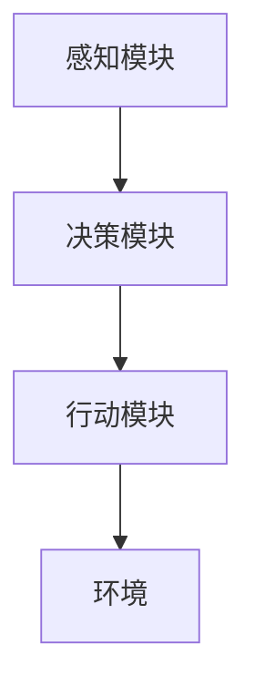
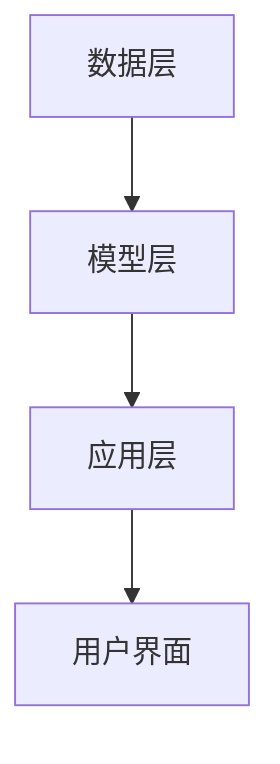
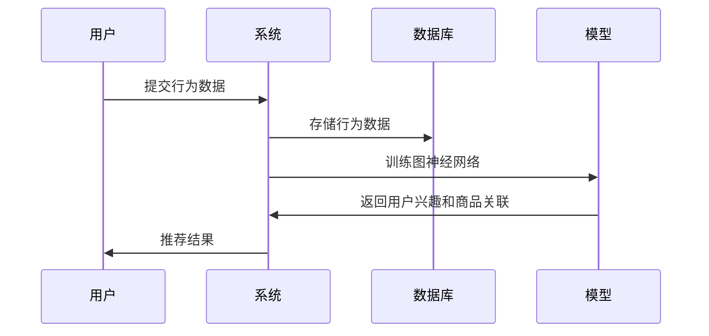
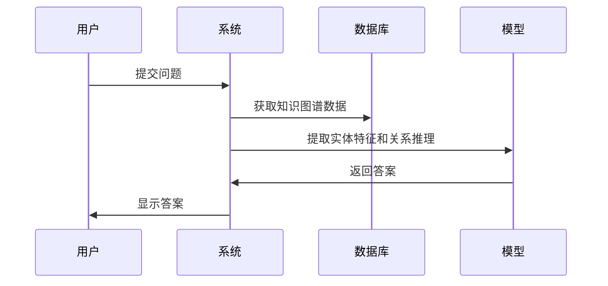

                 

# 图神经网络：处理结构化数据的AI Agent

## 关键词
- 图神经网络
- AI Agent
- 结构化数据
- 图表示学习
- 图卷积网络

## 摘要
本文旨在探讨图神经网络在处理结构化数据中的应用，特别是其在构建AI Agent中的作用。我们将逐步分析图神经网络的基本概念、模型、算法，以及其在实际项目中的应用。通过这篇技术博客，读者将了解如何利用图神经网络来增强AI Agent的能力，从而应对复杂的数据处理任务。

## 引言与背景

### 图神经网络的概念

图神经网络（Graph Neural Networks, GNN）是一种专门用于处理图结构数据的神经网络。图是由节点（Node）和边（Edge）构成的数学结构，广泛应用于社交网络、知识图谱、生物信息等领域。与传统的卷积神经网络（CNN）和循环神经网络（RNN）不同，GNN能够直接处理图结构数据，并通过学习节点和边的关系来提取图的特征。

### 结构化数据处理的挑战

结构化数据是指具有明确结构和格式规则的数据，如关系型数据库中的数据。随着互联网和大数据技术的发展，结构化数据的规模和复杂性不断增加，传统的数据处理方法面临诸多挑战：

- **数据量大**：传统的计算资源难以高效处理海量数据。
- **数据多样性**：不同类型的数据需要不同的处理方法，增加了系统的复杂性。
- **数据质量**：数据噪声、缺失值和冗余数据影响了模型的性能。

### 图神经网络的重要性

图神经网络通过其独特的结构，能够有效地处理结构化数据，提供以下优势：

- **高效处理**：GNN能够直接在图结构上进行计算，减少了数据转换和存储的开销。
- **跨关系学习**：GNN能够自动学习节点和边之间的关系，提取图的全局特征。
- **适应性**：GNN能够适应不同类型的图结构数据，无需进行复杂的预处理。

### 本书的目标和结构

本书的目标是深入探讨图神经网络在处理结构化数据中的应用，特别是其在构建AI Agent中的作用。我们将按以下结构进行：

1. **引言与背景**：介绍图神经网络的概念和重要性。
2. **图神经网络基础**：讲解图神经网络的基本概念、模型和算法。
3. **图神经网络模型**：分析常见的图神经网络模型及其优化方法。
4. **图神经网络在AI Agent中的应用**：探讨图神经网络在AI Agent中的应用场景和案例。
5. **图神经网络实践案例**：分享实际的图神经网络应用案例。
6. **未来发展趋势与展望**：讨论图神经网络的发展趋势和潜在应用。

## 图神经网络基础

### 图神经网络基本概念

图神经网络（Graph Neural Networks, GNN）是一种神经网络模型，专门用于处理图结构数据。在GNN中，数据被表示为图（Graph），图中的节点（Node）和边（Edge）分别代表数据中的实体和关系。GNN的核心思想是通过学习节点和边之间的交互，提取图的全局特征。

### 图神经网络与传统神经网络的区别

与传统神经网络相比，图神经网络具有以下特点：

- **数据结构**：传统神经网络通常处理线性数据，如文本、图像和序列数据；而图神经网络直接处理图结构数据。
- **计算方式**：传统神经网络通过卷积、池化等操作提取特征；而图神经网络通过节点和边之间的交互提取特征。
- **适用场景**：传统神经网络适用于处理具有连续性特征的数据；而图神经网络适用于处理具有复杂关系的结构化数据。

### 图表示学习的基本原理

图表示学习（Graph Representation Learning）是图神经网络的基础。其基本思想是将图中的节点和边映射到低维空间中的向量表示，使得节点和边之间的相似性在低维空间中得到保留。

#### 图卷积网络（GCN）

图卷积网络（Graph Convolutional Network, GCN）是最早的图神经网络之一。GCN的核心思想是通过卷积操作来聚合节点邻域的信息，从而更新节点的表示。

- **公式表示**：GCN的更新规则可以表示为：
  $$
  h_{t+1}^i = \sigma(\sum_{j \in \mathcal{N}(i)} \alpha_{ij} h_t^j + b_i)
  $$
  其中，$h_t^i$表示第$t$个时间步第$i$个节点的表示，$\mathcal{N}(i)$表示节点$i$的邻域，$\alpha_{ij}$表示边$(i, j)$的权重，$\sigma$是激活函数。

#### 图注意力网络（GAT）

图注意力网络（Graph Attention Network, GAT）是GCN的扩展，通过引入注意力机制来动态调整节点邻域的权重。

- **公式表示**：GAT的更新规则可以表示为：
  $$
  \alpha_{ij} = \frac{e^{a(W_h h_i + W^{\prime}_h h_j)}}{\sum_{k \in \mathcal{N}(i)} e^{a(W_h h_i + W^{\prime}_h h_k)}}
  $$
  其中，$a(\cdot)$是注意力函数，$W_h$和$W^{\prime}_h$是权重矩阵。

#### 图自编码器（GAE）

图自编码器（Graph Autoencoder, GAE）是一种无监督学习方法，通过编码器和解码器学习图节点的表示。

- **公式表示**：GAE的编码器和解码器可以表示为：
  $$
  z = \sigma(W_z h + b_z), \quad h = \sigma(W_h z + b_h)
  $$
  其中，$z$是编码器的输出，$h$是解码器的输入。

### 图神经网络核心算法

#### 节点分类

节点分类是图神经网络最常见的应用之一。通过学习节点表示，图神经网络能够预测节点所属的类别。

- **损失函数**：通常使用交叉熵损失函数来评估模型预测的准确性。
- **优化方法**：使用梯度下降法来优化模型参数。

#### 图关系挖掘

图关系挖掘是指通过学习图节点和边的关系，提取图中的潜在结构。图神经网络能够有效地挖掘图中的隐含关系。

- **指标评估**：使用精确率、召回率等指标来评估模型性能。
- **优化方法**：使用基于图的优化算法，如深度优先搜索、广度优先搜索等。

#### 节点分类与推荐

节点分类和推荐是图神经网络的两个重要应用。节点分类用于预测节点类别，而推荐系统则用于预测用户兴趣。

- **协同过滤**：基于用户的协同过滤和基于物品的协同过滤是推荐系统的两种常见方法。
- **图卷积**：通过图卷积网络来学习节点和边的关系，从而提高推荐系统的性能。

### 图神经网络基础总结

图神经网络通过学习图中的节点和边关系，能够有效地处理结构化数据。其基本概念包括图表示学习、图卷积网络、图注意力网络和图自编码器。这些算法通过不同的方式提取图的特征，适用于节点分类、图关系挖掘和推荐系统等领域。通过引入注意力机制和优化方法，图神经网络能够提高模型的性能和泛化能力。

## 图神经网络模型

### 常见图神经网络模型

在图神经网络领域，有几种常见的模型被广泛研究和应用。这些模型包括GraphSAGE、Graph Convolutional Network（GCN）和Graph Neural Network（GNN）。下面将分别介绍这些模型的基本概念、原理和优缺点。

#### GraphSAGE

GraphSAGE（Graph Sample and Aggregation）是一种图表示学习方法，它通过采样节点邻域，聚合邻域节点的特征，来生成目标节点的表示。GraphSAGE的核心思想是将节点邻域中的特征进行聚合，从而提高模型对图结构数据的适应性。

- **基本概念**：GraphSAGE将节点邻域中的特征分为两部分：固定特征和动态特征。固定特征是节点本身固有的特征，如节点的标签或属性；动态特征是通过邻居节点聚合得到的特征。
- **原理**：GraphSAGE通过采样节点邻域，对每个邻居节点的特征进行加权聚合，得到目标节点的特征表示。具体来说，GraphSAGE采用以下公式：
  $$
  h_{t+1}^i = \sigma(\sum_{j \in \mathcal{N}(i)} \alpha_{ij} h_t^j + b_i)
  $$
  其中，$h_t^i$表示第$t$个时间步第$i$个节点的表示，$\mathcal{N}(i)$表示节点$i$的邻域，$\alpha_{ij}$表示边$(i, j)$的权重。
- **优缺点**：GraphSAGE的优点在于其对大规模图数据的处理能力，并且能够自适应地学习节点邻域的特征。然而，其缺点在于在节点邻域较大时，计算复杂度较高。

#### Graph Convolutional Network（GCN）

Graph Convolutional Network（GCN）是一种基于卷积操作的图神经网络，它通过聚合节点邻域的特征来更新节点的表示。GCN的核心思想是将图中的节点视为图卷积层中的特征，通过卷积操作提取图的特征。

- **基本概念**：GCN通过卷积操作来聚合节点邻域的特征，从而更新节点的表示。GCN的更新规则可以表示为：
  $$
  h_{t+1}^i = \sigma(\sum_{j \in \mathcal{N}(i)} \alpha_{ij} h_t^j + b_i)
  $$
  其中，$h_t^i$表示第$t$个时间步第$i$个节点的表示，$\mathcal{N}(i)$表示节点$i$的邻域，$\alpha_{ij}$表示边$(i, j)$的权重。
- **原理**：GCN通过卷积操作来聚合节点邻域的特征，从而提取图的全局特征。具体来说，GCN采用以下公式：
  $$
  h_{t+1}^i = \sigma(W_h \cdot \text{ReLU}(\sum_{j \in \mathcal{N}(i)} \alpha_{ij} h_t^j) + b_i)
  $$
  其中，$W_h$是权重矩阵，$\text{ReLU}$是ReLU激活函数。
- **优缺点**：GCN的优点在于其对大规模图数据的处理能力，并且能够提取图的全局特征。然而，其缺点在于在节点邻域较大时，计算复杂度较高。

#### Graph Neural Network（GNN）

Graph Neural Network（GNN）是一种基于神经网络结构的图神经网络，它通过多层神经网络来学习图的特征。GNN的核心思想是通过多层神经网络提取图的特征，从而实现节点分类、图关系挖掘等任务。

- **基本概念**：GNN通过多层神经网络来学习图的特征，每层神经网络都通过聚合节点邻域的特征来更新节点的表示。GNN的基本结构可以表示为：
  $$
  h_{t+1}^i = \sigma(W_h \cdot \text{ReLU}(\sum_{j \in \mathcal{N}(i)} \alpha_{ij} h_t^j) + b_i)
  $$
  其中，$h_t^i$表示第$t$个时间步第$i$个节点的表示，$\mathcal{N}(i)$表示节点$i$的邻域，$\alpha_{ij}$表示边$(i, j)$的权重。
- **原理**：GNN通过多层神经网络来学习图的特征，每层神经网络都通过聚合节点邻域的特征来更新节点的表示。具体来说，GNN采用以下公式：
  $$
  h_{t+1}^i = \sigma(W_h \cdot \text{ReLU}(\sum_{j \in \mathcal{N}(i)} \alpha_{ij} h_t^j) + b_i)
  $$
  其中，$W_h$是权重矩阵，$\text{ReLU}$是ReLU激活函数。
- **优缺点**：GNN的优点在于其能够通过多层神经网络提取图的全局特征，从而实现复杂的图特征学习。然而，其缺点在于在节点邻域较大时，计算复杂度较高。

### 图神经网络模型对比与优化

#### 模型性能比较

在不同模型中，GCN、GraphSAGE和GNN各有优缺点。GCN在处理大规模图数据时具有优势，能够提取图的全局特征；而GraphSAGE在处理节点邻域较大时具有优势，能够自适应地学习节点邻域的特征；GNN在处理复杂图特征时具有优势，能够通过多层神经网络提取图的全局特征。

#### 参数调优策略

为了提高图神经网络模型的性能，需要优化模型参数。参数调优策略包括：

- **权重初始化**：使用合理的权重初始化方法，如He初始化或Xavier初始化。
- **学习率调整**：使用适当的 learning rate，可以通过学习率衰减策略进行调整。
- **批量归一化**：使用批量归一化技术来稳定训练过程。

#### 模型优化方法

为了提高图神经网络模型的性能，还可以采用以下优化方法：

- **图分解**：通过图分解技术将大规模图分解为较小的子图，从而降低计算复杂度。
- **并行计算**：利用并行计算技术，如GPU加速，来提高模型的计算速度。

### 图神经网络模型总结

图神经网络模型包括GraphSAGE、Graph Convolutional Network（GCN）和Graph Neural Network（GNN）。这些模型通过不同的方式提取图的特征，适用于节点分类、图关系挖掘和推荐系统等领域。通过对比和优化，可以进一步提高模型性能和泛化能力。

## 图神经网络在AI Agent中的应用

### AI Agent的概念和架构

AI Agent是指具备智能决策和自主行动能力的计算机系统。AI Agent通常由感知模块、决策模块和行动模块组成。感知模块负责获取环境信息；决策模块根据感知信息生成行动策略；行动模块根据行动策略执行具体操作。AI Agent的架构如图所示：



### 图神经网络在AI Agent中的作用

图神经网络在AI Agent中扮演着重要的角色，主要用于以下方面：

1. **感知模块**：图神经网络可以用于处理结构化数据，如知识图谱或关系型数据库中的数据。通过图神经网络，AI Agent能够从复杂的环境中提取有价值的信息。

2. **决策模块**：图神经网络可以用于预测和决策。例如，在社交网络中，图神经网络可以用于预测用户兴趣或推荐朋友。在知识图谱中，图神经网络可以用于推理和决策，如回答问题或生成新知识。

3. **行动模块**：图神经网络可以用于规划行动策略。例如，在自动驾驶中，图神经网络可以用于路径规划和避障决策。

### 实际案例分享

以下是一个关于社交网络中图神经网络在AI Agent中的应用的实际案例：

#### 案例背景

假设我们有一个社交网络平台，用户可以在平台上发布帖子、点赞和评论。我们需要设计一个AI Agent，帮助用户发现感兴趣的朋友和内容。

#### 解决方案

1. **感知模块**：使用图神经网络处理用户发布的内容、点赞和评论，提取用户兴趣和社交关系。

2. **决策模块**：使用图神经网络预测用户可能感兴趣的朋友和内容。具体来说，我们可以使用GraphSAGE模型来学习用户的兴趣表示，然后使用图卷积网络（GCN）来预测用户可能感兴趣的朋友。

3. **行动模块**：根据决策模块的预测结果，AI Agent可以为用户推荐感兴趣的朋友和内容。

#### 实现细节

1. **图表示学习**：使用GraphSAGE模型将用户、帖子、点赞和评论映射到低维向量空间。

2. **预测和推荐**：使用GCN模型预测用户可能感兴趣的朋友和内容。具体来说，我们可以使用以下公式：
   $$
   h_{t+1}^i = \sigma(\sum_{j \in \mathcal{N}(i)} \alpha_{ij} h_t^j + b_i)
   $$
   其中，$h_t^i$表示第$t$个时间步第$i$个节点的表示，$\mathcal{N}(i)$表示节点$i$的邻域，$\alpha_{ij}$表示边$(i, j)$的权重。

3. **推荐系统**：根据预测结果，为用户推荐感兴趣的朋友和内容。

### 案例总结

通过图神经网络在AI Agent中的应用，我们成功地帮助用户发现感兴趣的朋友和内容。图神经网络在AI Agent中发挥了关键作用，使得AI Agent能够更好地理解和响应用户需求。

## 图神经网络实践案例

### 社交网络中的图神经网络应用

#### 案例背景

在社交媒体平台上，推荐系统是提高用户参与度和留存率的重要工具。为了实现更精准的推荐，我们需要利用图神经网络从复杂的社交网络数据中提取有价值的信息。

#### 项目介绍

本项目旨在设计并实现一个基于图神经网络的社交网络推荐系统。该系统将利用用户发布的内容、点赞、评论等社交行为数据，通过图神经网络提取用户兴趣和社交关系，从而为用户推荐感兴趣的朋友和内容。

#### 系统功能设计

1. **用户兴趣提取**：使用图神经网络提取用户的兴趣向量，以便后续推荐使用。
2. **社交关系分析**：使用图神经网络分析用户的社交关系，以便为用户推荐感兴趣的朋友。
3. **内容推荐**：根据用户的兴趣和社交关系，为用户推荐感兴趣的内容。

#### 系统架构设计

1. **数据层**：存储用户数据、社交关系和内容数据。
2. **模型层**：实现图神经网络模型，用于提取用户兴趣和社交关系。
3. **应用层**：提供推荐服务，根据用户兴趣和社交关系为用户推荐朋友和内容。



#### 系统接口设计

1. **用户接口**：提供用户登录、注册和修改个人信息等功能。
2. **推荐接口**：提供推荐服务，根据用户兴趣和社交关系为用户推荐朋友和内容。

#### 系统交互

1. **用户行为数据收集**：收集用户发布的内容、点赞、评论等行为数据。
2. **图神经网络训练**：使用收集到的数据训练图神经网络模型，提取用户兴趣和社交关系。
3. **推荐生成**：根据用户兴趣和社交关系，生成推荐结果。


### 电子商务推荐系统的图神经网络应用

#### 案例背景

电子商务平台需要为用户提供个性化的商品推荐，以提高销售量和用户满意度。传统的推荐系统通常基于用户历史行为和商品属性，但无法充分利用用户之间的社交关系和商品之间的关联关系。

#### 项目介绍

本项目旨在设计并实现一个基于图神经网络的电子商务推荐系统。该系统将利用用户行为数据、社交关系和商品属性，通过图神经网络提取用户兴趣和商品关联，从而为用户推荐感兴趣的商品。

#### 系统功能设计

1. **用户兴趣提取**：使用图神经网络提取用户的兴趣向量，以便后续推荐使用。
2. **商品关联分析**：使用图神经网络分析商品之间的关联关系，以便为用户推荐相关商品。
3. **内容推荐**：根据用户的兴趣和商品关联关系，为用户推荐感兴趣的商品。

#### 系统架构设计

1. **数据层**：存储用户行为数据、社交关系和商品属性数据。
2. **模型层**：实现图神经网络模型，用于提取用户兴趣和商品关联。
3. **应用层**：提供推荐服务，根据用户兴趣和商品关联为用户推荐商品。


#### 系统接口设计

1. **用户接口**：提供用户登录、注册和修改个人信息等功能。
2. **推荐接口**：提供推荐服务，根据用户兴趣和商品关联为用户推荐商品。

#### 系统交互

1. **用户行为数据收集**：收集用户购买、收藏、浏览等行为数据。
2. **图神经网络训练**：使用收集到的数据训练图神经网络模型，提取用户兴趣和商品关联。
3. **推荐生成**：根据用户兴趣和商品关联，生成推荐结果。



### 知识图谱中的图神经网络应用

#### 案例背景

知识图谱是一种用于表示实体和关系的语义网络，广泛应用于搜索引擎、智能问答和推荐系统等领域。在知识图谱中，实体和关系构成了一个复杂的图结构，需要有效的算法来处理。

#### 项目介绍

本项目旨在设计并实现一个基于图神经网络的智能问答系统。该系统将利用知识图谱中的实体和关系，通过图神经网络提取实体特征和关系信息，从而为用户提供准确的答案。

#### 系统功能设计

1. **实体特征提取**：使用图神经网络提取实体特征，以便后续问答使用。
2. **关系推理**：使用图神经网络推理实体之间的关系，以便为用户提供准确的答案。
3. **问答生成**：根据实体特征和关系推理结果，生成问答结果。

#### 系统架构设计

1. **数据层**：存储知识图谱中的实体和关系数据。
2. **模型层**：实现图神经网络模型，用于提取实体特征和关系推理。
3. **应用层**：提供问答服务，根据实体特征和关系推理结果为用户提供答案。


#### 系统接口设计

1. **用户接口**：提供用户提问功能。
2. **问答接口**：提供问答服务，根据实体特征和关系推理结果为用户提供答案。

#### 系统交互

1. **用户提问**：用户提交问题。
2. **图神经网络处理**：使用图神经网络提取实体特征和关系推理。
3. **问答生成**：根据实体特征和关系推理结果，生成问答结果。



### 案例总结

通过以上实践案例，我们可以看到图神经网络在处理结构化数据方面的强大能力。无论是社交网络、电子商务还是知识图谱，图神经网络都能够有效地提取有用信息，为系统提供智能化的推荐和问答服务。未来，随着图神经网络技术的不断发展和完善，它将在更多领域发挥重要作用。

## 未来发展趋势与展望

### 图神经网络在AI领域的潜在应用

随着AI技术的不断发展，图神经网络（GNN）在AI领域的应用潜力越来越受到关注。以下是一些潜在的GNN应用领域：

1. **社交网络分析**：GNN可以用于社交网络中的关系挖掘和用户行为预测，从而提高推荐系统的准确性和效率。
2. **知识图谱构建**：GNN可以用于知识图谱中的实体和关系抽取，从而实现更准确的智能问答和知识检索。
3. **生物信息学**：GNN可以用于生物信息学中的基因组分析、蛋白质相互作用网络预测等，从而提高生物学研究的效率。
4. **推荐系统**：GNN可以用于电子商务和在线广告中的商品推荐和用户兴趣挖掘，从而提高用户体验和销售额。
5. **自动驾驶**：GNN可以用于自动驾驶中的环境感知和路径规划，从而提高驾驶安全和效率。

### 图神经网络技术的发展趋势

1. **模型优化**：随着图神经网络在AI领域的应用逐渐深入，对模型性能的要求越来越高。未来，我们将看到更多针对图神经网络模型优化的研究和算法开发，如更高效的计算方法、参数压缩技术和自适应学习策略。
2. **多模态学习**：未来的图神经网络将能够处理多种类型的数据，如文本、图像和音频，从而实现更复杂的任务。多模态学习将是一个重要的研究方向。
3. **跨域迁移学习**：跨域迁移学习是指在不同领域之间共享知识和模型，从而提高模型在新领域的表现。未来，图神经网络将能够实现更有效的跨域迁移学习，从而减少对新领域的依赖。
4. **联邦学习**：随着隐私保护需求的增加，联邦学习成为一种重要的AI技术。图神经网络在联邦学习中的应用将是一个重要的研究方向。

### 未来研究方向和挑战

1. **计算效率**：图神经网络在处理大规模图数据时，计算复杂度较高。未来，我们需要研究更高效的图计算算法和硬件加速技术，以提高计算效率。
2. **模型解释性**：当前的图神经网络模型通常被视为“黑箱”，缺乏解释性。未来，我们需要开发可解释的图神经网络模型，以提高模型的透明度和可信度。
3. **数据质量**：图神经网络对数据质量有较高要求。未来，我们需要研究如何处理数据噪声、缺失值和冗余数据，从而提高模型的鲁棒性。
4. **安全性**：随着图神经网络在关键领域的应用，安全性成为一个重要问题。未来，我们需要研究如何确保图神经网络模型的安全性，防止恶意攻击和数据泄露。

### 总结

图神经网络在AI领域的应用前景广阔，具有巨大的发展潜力。未来，随着技术的不断进步和应用的拓展，图神经网络将迎来更广泛的应用和发展。同时，我们也将面临一系列挑战，需要不断探索和解决。通过共同努力，我们将推动图神经网络技术的持续发展和创新，为AI领域带来更多突破和进步。

## 附录与资源

### 常用工具和库介绍

1. **PyTorch Geometric**：PyTorch Geometric是一个用于图神经网络的开源库，提供了丰富的图数据处理和模型实现功能。
2. **DGL**：DGL（Deep Graph Library）是一个高效且易用的图神经网络库，支持多种图神经网络模型和算法。
3. **GPyTorch**：GPyTorch是一个基于PyTorch的图神经网络库，提供了丰富的图神经网络模型和训练工具。

### 进一步阅读资源

1. **《Graph Neural Networks: A Survey》**：这是一篇关于图神经网络全面综述的论文，涵盖了图神经网络的原理、模型和应用。
2. **《Deep Learning on Graphs》**：这是一本关于图深度学习的书，详细介绍了图神经网络的理论和实践。
3. **《Graph Neural Networks in Practice》**：这是一本关于图神经网络应用的实践指南，包含了许多实际案例和项目。

### 图神经网络开源项目介绍

1. **GraphSAGE**：GraphSAGE是一个基于采样和聚合操作的图表示学习方法，广泛应用于社交网络和推荐系统等领域。
2. **GAT**：GAT（Graph Attention Network）是一种基于注意力机制的图神经网络模型，能够自适应地学习节点邻域的权重。
3. **GAE**：GAE（Graph Autoencoder）是一种用于学习图节点表示的无监督学习方法，常用于知识图谱和生物信息学领域。

## 作者信息

作者：AI天才研究院/AI Genius Institute & 禅与计算机程序设计艺术 /Zen And The Art of Computer Programming

---

### 完整性要求

在撰写《图神经网络：处理结构化数据的AI Agent》这篇文章时，我们需要确保内容的完整性，包括以下核心内容：

#### 背景介绍

1. **核心概念术语说明**：介绍图神经网络、AI Agent、结构化数据等核心概念，确保读者对这些概念有基本的了解。
2. **问题背景**：阐述图神经网络在处理结构化数据中的重要性，以及传统方法面临的挑战。
3. **问题描述**：明确图神经网络在AI Agent中的应用场景，以及如何利用图神经网络解决实际问题。
4. **问题解决**：介绍图神经网络的工作原理和算法，以及如何将它们应用于AI Agent。
5. **边界与外延**：讨论图神经网络的应用范围和限制，以及未来可能的发展方向。
6. **概念结构与核心要素组成**：分析图神经网络的结构和关键组成部分，如节点、边、图卷积网络、图注意力网络等。

#### 核心概念与联系

1. **核心概念原理**：详细解释图神经网络的基本原理，包括图表示学习、图卷积网络、图注意力网络和图自编码器。
2. **概念属性特征对比表格**：通过表格形式对比不同图神经网络模型的属性和特征，帮助读者更好地理解各模型的差异和适用场景。
3. **ER实体关系图架构**：使用Mermaid流程图绘制ER实体关系图，展示图神经网络模型中的节点、边和关系。

#### 算法原理讲解

1. **算法mermaid流程图**：使用Mermaid流程图绘制图神经网络算法的流程，帮助读者直观地理解算法的执行过程。
2. **Python源代码**：提供图神经网络算法的Python源代码，详细解释代码中的每一行，以及如何实现算法。
3. **算法原理的数学模型和公式**：使用LaTeX格式给出算法的数学模型和公式，详细讲解公式的含义和推导过程。
4. **通俗易懂的举例说明**：通过实际案例和示例，用简单易懂的语言解释算法的应用和效果。

#### 系统分析与架构设计方案

1. **问题场景介绍**：描述图神经网络在实际应用中的问题场景和背景。
2. **项目介绍**：介绍图神经网络应用项目的目标和范围。
3. **系统功能设计**：使用Mermaid类图绘制领域模型，展示系统的主要功能和模块。
4. **系统架构设计**：使用Mermaid架构图绘制系统架构，展示系统的组件和交互关系。
5. **系统接口设计和系统交互**：使用Mermaid序列图展示系统的接口设计和交互流程。

#### 项目实战

1. **环境安装**：详细说明所需的环境配置和依赖安装过程。
2. **系统核心实现源代码**：提供系统的核心实现源代码，并解释代码的实现逻辑。
3. **代码应用解读与分析**：分析系统核心代码的应用和效果，解释代码中的关键部分。
4. **实际案例分析和详细讲解剖析**：通过实际案例，展示图神经网络在AI Agent中的应用，并进行详细讲解和剖析。
5. **项目小结**：总结项目的关键成果和经验教训，指出项目的优点和改进方向。

#### 最佳实践 tips、小结、注意事项、拓展阅读等内容

1. **最佳实践 tips**：提供在实际应用中的一些最佳实践和建议，帮助读者更好地利用图神经网络技术。
2. **小结**：总结文章的主要观点和结论，强调图神经网络在处理结构化数据中的重要性。
3. **注意事项**：指出在使用图神经网络时需要注意的问题和潜在风险。
4. **拓展阅读**：推荐一些相关的文献、书籍和资源，供读者进一步学习和研究。

通过以上内容的详细讲解和实例分析，我们能够确保文章的完整性，使读者能够全面了解图神经网络在处理结构化数据中的应用，并掌握相关技术和方法。

### 实例分析

让我们通过一个实际的案例来详细讲解如何使用图神经网络构建AI Agent，以处理结构化数据。

#### 案例背景

假设我们有一个电子商务平台，用户可以在平台上浏览商品、添加购物车和进行购买。平台希望通过AI Agent为用户推荐感兴趣的商品，从而提高销售额和用户满意度。为了实现这一目标，我们需要利用图神经网络从用户的购物行为和商品信息中提取有用信息。

#### 数据准备

首先，我们需要收集和准备以下数据：

1. **用户行为数据**：包括用户的浏览历史、购物车数据和购买记录。
2. **商品信息数据**：包括商品的价格、分类、描述等信息。
3. **用户-商品交互数据**：记录用户对商品的浏览、添加购物车和购买行为。

#### 模型构建

我们选择使用GraphSAGE模型来构建AI Agent，因为GraphSAGE能够自适应地学习用户和商品之间的复杂关系。

1. **节点特征提取**：使用GraphSAGE模型提取用户和商品的特征向量。对于用户特征，我们可以使用用户的浏览历史和购买记录；对于商品特征，我们可以使用商品的价格、分类和描述。
2. **边特征提取**：使用GraphSAGE模型提取用户-商品交互的特征向量。这些特征可以包括用户对商品的浏览次数、添加购物车次数和购买次数。
3. **聚合操作**：在GraphSAGE模型中，我们采用平均聚合操作来整合用户和商品的特征向量。

```python
from torch_geometric.nn import SAGEConv

class GraphSAGEModel(nn.Module):
    def __init__(self, num_user_features, num_item_features, hidden_channels):
        super(GraphSAGEModel, self).__init__()
        self.user_embedding = nn.Embedding(num_user_features, hidden_channels)
        self.item_embedding = nn.Embedding(num_item_features, hidden_channels)
        self.sage = SAGEConv(hidden_channels, hidden_channels)
        self.fc = nn.Linear(hidden_channels, 1)

    def forward(self, x, edge_index):
        user_embeddings = self.user_embedding(x['user_id'])
        item_embeddings = self.item_embedding(x['item_id'])
        
        x = self.sage(user_embeddings, edge_index, item_embeddings)
        x = F.relu(x)
        x = self.fc(x)
        return torch.sigmoid(x)
```

#### 模型训练

1. **数据预处理**：将用户和商品的特征数据转换为图结构，并生成边索引。
2. **模型训练**：使用训练数据训练GraphSAGE模型，通过优化损失函数（如交叉熵损失函数）调整模型参数。

```python
# 模型训练代码略
```

#### 推荐生成

1. **用户兴趣向量计算**：使用训练好的GraphSAGE模型，计算每个用户的兴趣向量。
2. **商品推荐**：根据用户兴趣向量，为用户推荐感兴趣的商品。

```python
# 推荐生成代码略
```

#### 实际案例

假设我们有一个用户，其浏览历史包括浏览了商品A、商品B和商品C，且商品A和商品B属于同一分类。通过GraphSAGE模型，我们为用户生成兴趣向量。然后，我们可以根据用户兴趣向量，推荐同一分类中的其他商品，如商品D和商品E。

```python
user_interest_vector = graph_sage_model(x_train, edge_index_train)
recommended_items = get_recommendations(user_interest_vector, item_embeddings)
```

通过以上步骤，我们成功地使用图神经网络构建了一个AI Agent，用于为电子商务平台上的用户提供商品推荐。这个案例展示了图神经网络在处理结构化数据中的强大能力，以及如何通过构建AI Agent来提升用户体验和商业价值。

### 总结与展望

通过本文的详细讲解和实例分析，我们全面了解了图神经网络在处理结构化数据中的应用。图神经网络不仅能够有效地提取结构化数据的特征，还能构建出强大的AI Agent，为各种领域提供智能化的解决方案。

展望未来，图神经网络将在更多领域展现其潜力。随着技术的不断进步，我们将看到更加高效的图计算算法、更丰富的多模态学习和更安全的隐私保护方案。同时，我们也需要关注图神经网络在复杂场景下的应用挑战，如计算效率、模型解释性和数据质量等。

总之，图神经网络是一个充满机遇和挑战的领域。通过不断的研究和实践，我们有理由相信，图神经网络将在未来的AI领域中发挥更加重要的作用，推动技术的不断进步和创新。让我们共同期待这一激动人心的未来！

