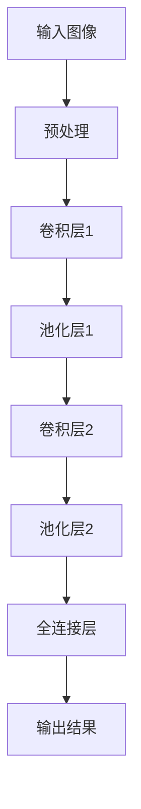
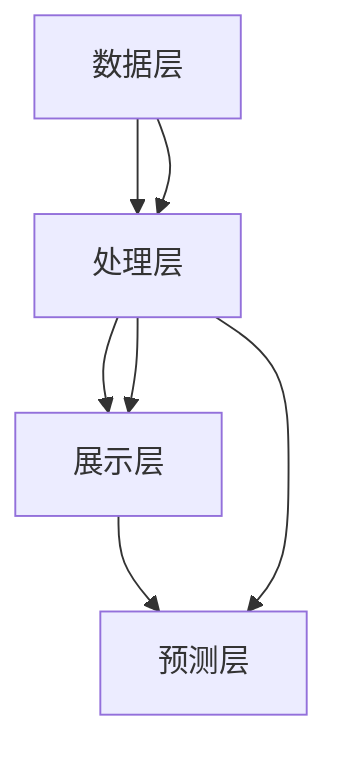
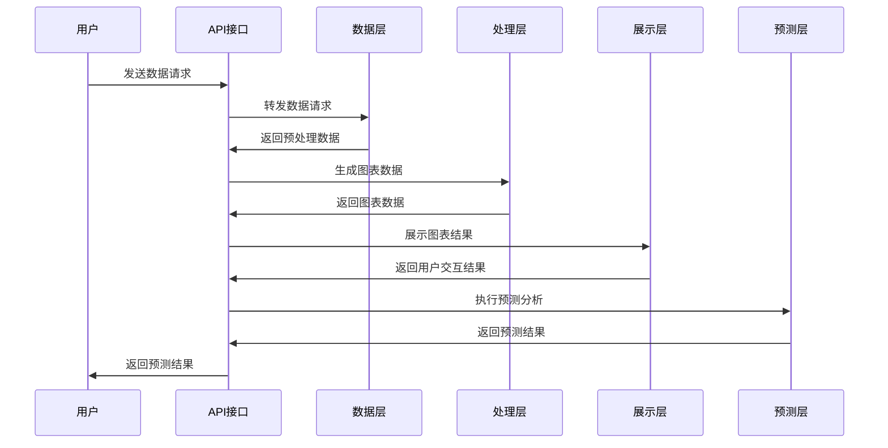
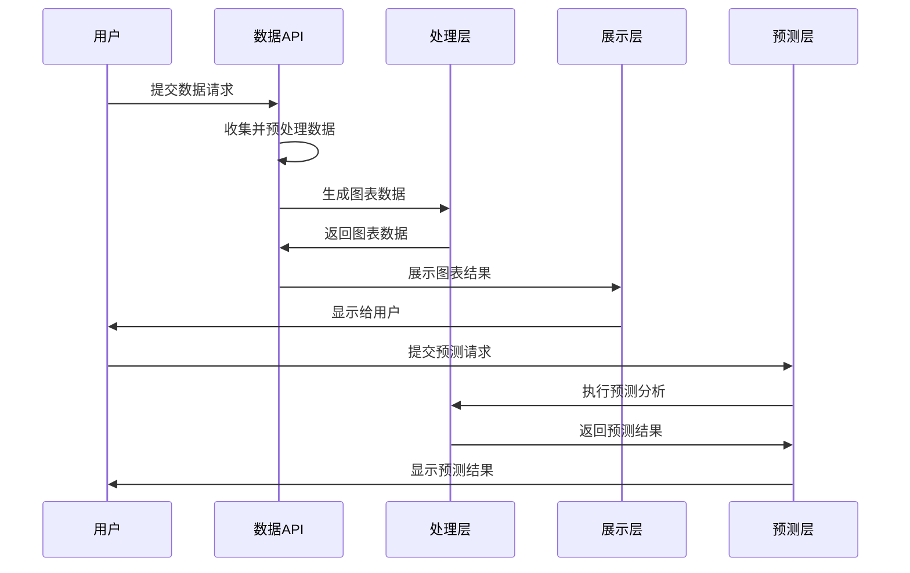

                 


### LET'S THINK: 设计《图表理解技术：增强AI Agent的数据分析能力》的技术博客文章

#### 一、文章标题与关键词确定
首先，我们需要为文章确定一个具有吸引力的标题和一个关键词列表。文章的标题应当简洁明了，同时能够引起读者的兴趣。根据我们的主题，我们选择了《图表理解技术：增强AI Agent的数据分析能力》作为标题。关键词则包括“图表理解技术”、“AI Agent”、“数据分析能力”、“算法”、“系统架构”等。

#### 二、文章摘要撰写
接下来，我们需要撰写一个简短的文章摘要，以概括文章的核心内容和主题思想。摘要应简洁明了，同时包含文章的主要观点和亮点。例如：
“本文深入探讨了图表理解技术在增强AI代理数据分析能力方面的应用。通过介绍图表理解技术的核心概念、算法原理及系统架构设计，本文为读者提供了一个全面的技术指南，旨在帮助数据科学家和AI开发人员提升数据分析效率。”

#### 三、文章结构规划
在确定标题和摘要后，我们需要规划文章的整体结构。根据书籍的目录大纲，我们可以将文章分为四个主要部分：背景介绍、核心概念与联系、算法原理与实现、应用实战。每个部分再细分为若干小节，确保内容详实、逻辑清晰。

#### 四、撰写背景介绍
背景介绍部分将简要介绍图表理解技术的定义、重要性以及它如何与AI代理结合。我们将解释为什么图表理解技术对于提升AI数据分析能力至关重要，并介绍一些相关的研究和应用案例。

#### 五、核心概念与联系
在这一部分，我们将定义图表理解技术中的核心概念，如“图表类型”、“关键要素”等，并对比不同图表类型的属性和特征。为了帮助读者更好地理解，我们将使用Mermaid流程图和ER实体关系图来展示概念结构。

#### 六、算法原理与实现
算法原理与实现部分将详细讲解图表理解技术背后的算法、模型和数据分析方法。我们将使用Mermaid流程图来展示算法的执行流程，并使用Python代码示例来说明算法的实现。

#### 七、应用实战
应用实战部分将通过实际案例展示如何在实际项目中应用图表理解技术。我们将详细分析项目背景、系统功能设计、系统架构设计、系统接口设计和系统交互过程，并使用Mermaid图来辅助说明。

#### 八、最佳实践
最佳实践部分将分享行业内的成功案例和最佳实践，包括如何处理常见问题和挑战，并提供一些建议和技巧。

#### 九、未来趋势与展望
最后，我们将探讨图表理解技术的未来发展方向和新兴趋势，以及它们可能带来的影响。

#### 十、撰写结语
在文章的结语部分，我们将总结全文的主要观点，并强调图表理解技术对于AI代理数据分析能力提升的重要性。

#### 十一、文章末尾作者信息
在文章末尾，我们将附上作者信息，以表明文章的版权和出处。

### 让我们一步一步地深入思考和完善文章的内容，确保每一部分都充满价值，能够为读者提供有益的知识和见解。让我们一起努力，创作一篇高质量的技术博客文章！### 文章标题

《图表理解技术：增强AI Agent的数据分析能力》

### 关键词

- 图表理解技术
- AI Agent
- 数据分析能力
- 算法
- 系统架构

### 摘要

本文深入探讨了图表理解技术在增强AI代理数据分析能力方面的应用。通过介绍图表理解技术的核心概念、算法原理及系统架构设计，本文为读者提供了一个全面的技术指南，旨在帮助数据科学家和AI开发人员提升数据分析效率。文章结合实际案例，详细分析了如何利用图表理解技术在实际项目中实现数据价值的最大化。

## 引言

### 图表理解技术的定义与重要性

图表理解技术是一种利用计算机算法和模型对图表进行自动分析和理解的技术。它能够从大量的图表数据中提取出有价值的信息，帮助数据科学家和AI开发人员更快速、准确地理解数据，从而做出更明智的决策。

在现代数据分析领域，图表理解技术的重要性日益凸显。随着数据量的不断增长和数据源的多样化，传统的人工数据分析方法已经无法满足日益复杂的分析需求。图表理解技术通过自动化的方式，能够处理和分析大量的图表数据，极大地提高了数据分析的效率。此外，图表理解技术还可以帮助发现数据中隐藏的模式和趋势，提供更加直观的数据可视化结果，从而辅助数据科学家进行数据探索和决策支持。

### 图表理解技术如何与AI Agent结合

AI Agent是一种具有自主决策能力的智能体，它在人工智能领域扮演着重要的角色。将图表理解技术与AI Agent相结合，可以显著提升AI Agent的数据分析能力。具体而言，这种结合体现在以下几个方面：

1. **数据预处理与特征提取**：图表理解技术可以自动识别图表中的数据元素和关系，提取出关键特征，为AI Agent提供高质量的数据输入。
2. **自动化分析与决策**：AI Agent可以利用图表理解技术对图表数据进行自动分析，快速识别数据中的异常和趋势，从而实现自动化决策。
3. **数据可视化与解释**：图表理解技术可以生成直观的图表可视化结果，帮助AI Agent更好地理解和解释分析结果，提高决策的透明度和可解释性。

总之，图表理解技术为AI Agent提供了强大的数据分析工具，使其在处理复杂、大规模的数据分析任务时更加高效和智能。接下来，我们将深入探讨图表理解技术的核心概念和原理，以及如何在实际应用中发挥作用。

## 核心概念与联系

### 图表类型的分类

在图表理解技术中，不同类型的图表有着不同的结构和属性。根据图表的表现形式，我们可以将图表分为以下几类：

1. **条形图**：条形图用于显示不同类别的数据大小，通常用于比较不同类别的数量或数值。
2. **折线图**：折线图通过连接数据点来展示数据随时间的变化趋势，常用于时间序列数据的分析。
3. **饼图**：饼图用于表示整体中各部分的比例关系，适合展示部分与整体的关系。
4. **散点图**：散点图通过在二维坐标系中显示数据点，用来展示不同变量之间的关系。
5. **雷达图**：雷达图通过多维度数据展示，可以同时比较多个变量的值，适合多维数据的分析。

### 关键要素

不同类型的图表在结构和属性上存在差异，但它们通常包含以下关键要素：

1. **数据集**：图表所基于的数据集，包括数据的来源、类型和规模。
2. **坐标系**：图表的坐标轴，包括横轴（X轴）和纵轴（Y轴），用于表示数据的大小和变化。
3. **数据标记**：图表中的数据点、线段或其他标记，用于表示具体的数据值。
4. **标签与注释**：图表上的标签和注释，用于说明数据含义、数据来源和其他相关信息。
5. **图例**：用于解释图表中的颜色、符号或其他标识的含义。

### 不同图表类型的属性特征对比

为了更好地理解不同图表类型的属性特征，我们可以通过一个对比表格来展示：

| 图表类型 | 属性特征 |
| :---: | :--- |
| 条形图 | 直观的比较不同类别的数据大小，适用于分类数据的可视化 |
| 折线图 | 显示数据随时间的变化趋势，适用于时间序列数据的可视化 |
| 饼图 | 展示整体中各部分的比例关系，适用于比例数据的可视化 |
| 散点图 | 显示不同变量之间的关系，适用于关系数据的可视化 |
| 雷达图 | 同时比较多个变量的值，适用于多维数据的可视化 |

### 图表理解与数据分析的关系

图表理解技术是数据分析的重要工具，它通过对图表的自动分析和理解，帮助数据科学家和AI开发人员从大量的图表数据中提取有价值的信息。具体而言，图表理解技术能够实现以下功能：

1. **数据预处理**：图表理解技术可以自动识别图表中的数据元素和关系，提取出关键特征，为数据分析提供高质量的数据输入。
2. **趋势分析**：通过对图表的自动分析，可以识别数据中的趋势和模式，帮助数据科学家发现数据中的隐藏信息。
3. **异常检测**：图表理解技术可以自动检测图表中的异常值和异常模式，提供数据质量的保障。
4. **可视化解释**：图表理解技术可以生成直观的图表可视化结果，帮助数据科学家更好地理解和解释分析结果，提高决策的透明度和可解释性。

综上所述，图表理解技术为数据分析提供了强大的支持，它不仅提高了数据分析的效率，还帮助数据科学家和AI开发人员更深入地理解和利用数据。在接下来的章节中，我们将进一步探讨图表理解技术背后的算法原理和系统架构设计。

## 算法原理与实现

### 基础算法介绍

图表理解技术的基础算法主要包括图像识别、特征提取和分类算法。这些算法共同作用，实现对图表内容的自动识别和分析。以下是这些算法的基本概念：

1. **图像识别**：图像识别算法用于识别图表中的数据元素，如条形、折线、散点等。常见的图像识别算法包括卷积神经网络（CNN）和循环神经网络（RNN）。
2. **特征提取**：特征提取算法用于从图表图像中提取出有代表性的特征，如颜色、纹理、形状等。这些特征将用于后续的图表分析和分类。
3. **分类算法**：分类算法用于对提取出的特征进行分类，以识别图表的类型和内容。常见的分类算法包括支持向量机（SVM）、随机森林（RF）和神经网络（NN）。

### 图表理解模型的构建

图表理解模型通常基于深度学习技术构建，其核心思想是通过大量的图表数据进行训练，使模型学会自动识别和解析图表。以下是构建图表理解模型的一般步骤：

1. **数据准备**：收集大量的图表数据，包括各种类型的图表图像，并进行预处理，如图像增强、数据归一化等。
2. **模型设计**：设计合适的深度学习模型架构，包括输入层、卷积层、池化层、全连接层等。常用的模型架构有CNN、RNN、ResNet等。
3. **模型训练**：使用预处理后的图表数据对模型进行训练，通过反向传播算法不断调整模型参数，使模型能够准确识别图表内容。
4. **模型评估**：使用验证集和测试集对训练好的模型进行评估，确保模型具有较好的泛化能力和识别准确率。

### 算法优化与改进

为了提高图表理解模型的性能，可以采取以下优化和改进措施：

1. **数据增强**：通过图像旋转、缩放、裁剪等方式对训练数据进行增强，增加模型的鲁棒性。
2. **模型调整**：调整模型架构和参数设置，如增加层数、调整学习率等，以优化模型性能。
3. **迁移学习**：利用预训练模型，如ImageNet中的模型，作为起点进行训练，可以显著提高模型的识别准确率。
4. **集成学习**：结合多种分类算法，如SVM、RF和NN，通过集成学习的方法提高模型的预测准确性。

### 数学模型与公式

图表理解技术涉及多个数学模型和公式，以下是其中一些关键模型和公式的简要介绍：

1. **卷积神经网络（CNN）**：
   - 卷积运算公式：
     $$ f(x, y) = \sum_{i=1}^{k} \sum_{j=1}^{k} w_{ij} \cdot f(x-i, y-j) $$
   - 池化操作公式：
     $$ P(x, y) = \max_{i, j} \{ f(x+i, y+j) \} $$

2. **支持向量机（SVM）**：
   - 函数间隔公式：
     $$ \hat{w} \cdot \hat{x} - b $$
   - 决策函数公式：
     $$ f(x) = \hat{w} \cdot x - b $$

3. **随机森林（RF）**：
   - 决策树生成公式：
     $$ G(x) = \prod_{i=1}^{n} t_i(x) $$
   - 预测公式：
     $$ \hat{y} = \sum_{i=1}^{n} w_i \cdot G(x) $$

### Mermaid流程图展示

为了更直观地展示算法的执行流程，我们可以使用Mermaid语言绘制流程图。以下是一个简单的CNN算法流程图的示例：



### Python代码示例

下面是一个简单的Python代码示例，用于实现一个基于CNN的图表理解模型：

```python
import tensorflow as tf
from tensorflow.keras.models import Sequential
from tensorflow.keras.layers import Conv2D, MaxPooling2D, Flatten, Dense

# 创建模型
model = Sequential([
    Conv2D(32, (3, 3), activation='relu', input_shape=(28, 28, 1)),
    MaxPooling2D((2, 2)),
    Conv2D(64, (3, 3), activation='relu'),
    MaxPooling2D((2, 2)),
    Flatten(),
    Dense(64, activation='relu'),
    Dense(10, activation='softmax')
])

# 编译模型
model.compile(optimizer='adam', loss='categorical_crossentropy', metrics=['accuracy'])

# 模型训练
model.fit(x_train, y_train, epochs=10, batch_size=32, validation_data=(x_val, y_val))
```

通过这个示例，我们可以看到如何使用TensorFlow库构建和训练一个简单的CNN模型。在实际应用中，模型的架构和训练过程将根据具体任务和数据集进行调整。

综上所述，图表理解技术涉及多个基础算法和数学模型，通过优化和改进这些算法，可以显著提高模型的性能和准确率。在下一章中，我们将进一步探讨图表理解技术的系统架构设计。

## 系统架构设计

### 问题场景介绍

在现代数据分析领域，图表理解技术被广泛应用于各种复杂的业务场景。例如，金融领域中的股票市场分析、风险控制；电商领域中的销售数据监控、客户行为分析；医疗领域中的患者数据监控、疾病预测等。在这些场景中，图表理解技术能够自动处理和分析大量的图表数据，帮助数据科学家和业务人员快速识别关键信息，做出实时决策。

### 项目介绍

为了更好地理解图表理解技术的应用，我们选取了一个电商销售数据分析项目作为案例。该项目旨在利用图表理解技术对电商平台的销售数据进行分析，识别销售趋势、预测未来销售量、发现异常销售情况等。通过这一项目，我们可以详细了解图表理解技术在数据分析中的应用过程和效果。

### 系统功能设计

图表理解技术系统的主要功能包括以下几个方面：

1. **数据收集**：从电商平台的各个数据源收集销售数据，包括订单数据、用户行为数据、产品信息数据等。
2. **数据预处理**：对收集到的数据进行清洗、去重、格式转换等预处理操作，确保数据的质量和一致性。
3. **图表生成**：利用数据预处理后的数据生成各种类型的图表，如条形图、折线图、饼图等。
4. **图表理解**：利用图表理解算法对生成的图表进行自动分析和理解，提取出有用的信息，如数据趋势、异常值等。
5. **结果可视化**：将图表理解的结果通过可视化界面展示给用户，方便用户理解和分析。
6. **预测分析**：利用图表理解技术进行销售预测分析，为业务人员提供未来销售量的预测值。
7. **异常检测**：利用图表理解技术检测销售数据中的异常情况，如异常销售量、欺诈订单等。

### 系统架构设计

图表理解技术系统的整体架构可以分为以下几个层次：

1. **数据层**：包括数据收集、存储和管理模块，负责从各个数据源收集数据，并对数据进行清洗、去重和格式转换等预处理操作。
2. **处理层**：包括数据预处理、图表生成和图表理解模块，负责将原始数据转化为图表数据，并对图表进行自动分析和理解。
3. **展示层**：包括可视化界面和结果展示模块，负责将图表理解的结果通过可视化方式展示给用户，并提供交互功能。
4. **预测层**：包括预测分析和异常检测模块，负责利用图表理解技术进行销售预测和异常检测，为业务人员提供决策支持。

以下是图表理解技术系统的架构图：



### 系统接口设计

系统接口设计是图表理解技术系统架构设计的重要组成部分，它定义了系统内部各个模块之间的交互方式。以下是系统接口设计的几个关键方面：

1. **API接口**：提供RESTful API接口，以便前端应用和后台服务进行数据交换和功能调用。API接口包括数据上传、数据查询、图表生成、图表理解、结果展示和预测分析等功能。
2. **消息队列**：使用消息队列技术（如Kafka）实现系统内部各个模块之间的异步通信，提高系统的并发处理能力和可扩展性。
3. **数据缓存**：使用缓存技术（如Redis）提高系统的数据读取速度，减少数据库的访问压力。
4. **分布式处理**：通过分布式计算框架（如Spark）实现大规模数据处理和分析，提高系统的处理能力和性能。

### 系统交互Mermaid序列图展示

为了更好地展示系统内部各个模块之间的交互过程，我们可以使用Mermaid语言绘制系统交互序列图。以下是一个简单的系统交互序列图示例：



通过这个序列图，我们可以清晰地看到用户与系统之间的交互过程，以及系统内部各个模块之间的数据流动和功能调用。

### 总结

图表理解技术系统的架构设计是确保系统高效、稳定运行的关键。通过合理的设计和优化，系统能够处理大量复杂的图表数据，提供实时、准确的数据分析结果，为业务人员提供有力的决策支持。在下一章中，我们将通过实际案例详细展示图表理解技术在电商销售数据分析中的应用。

## 应用案例

### 案例一：金融数据分析

在金融领域，图表理解技术被广泛应用于股票市场分析、风险控制和金融欺诈检测等。以下是一个具体的案例：

**项目背景**：某金融公司希望利用图表理解技术对其股票市场的交易数据进行深度分析，以便更好地把握市场动态，预测股票价格走势。

**系统功能设计**：系统需要实现以下功能：
- 数据收集：从多个数据源（如交易所、新闻网站等）收集股票交易数据。
- 数据预处理：对收集到的数据进行清洗、去重和格式转换，确保数据质量。
- 图表生成：生成不同类型的图表，如K线图、折线图、柱状图等，展示股票价格、交易量、市场情绪等。
- 图表理解：利用图表理解算法分析图表数据，识别市场趋势、异常交易等。
- 预测分析：基于图表理解结果进行股票价格预测，为投资决策提供支持。

**系统架构设计**：系统架构包括数据层、处理层、展示层和预测层，具体如下：
- 数据层：负责从多个数据源收集交易数据，并进行预处理。
- 处理层：负责生成图表数据和进行图表理解分析。
- 展示层：负责将分析结果以图表形式展示给用户。
- 预测层：负责利用图表理解结果进行股票价格预测。

**系统接口设计**：系统采用RESTful API接口，支持数据上传、数据查询、图表生成、图表理解和预测分析等功能。

**系统交互序列图**：



**实际案例分析和详细讲解**：
1. **数据收集**：系统从交易所和新闻网站收集每日的股票交易数据，包括开盘价、收盘价、最高价、最低价、交易量等。
2. **数据预处理**：对收集到的数据进行清洗和格式转换，去除无效数据，统一数据格式。
3. **图表生成**：系统生成K线图、折线图和柱状图，展示股票价格、交易量等指标。
4. **图表理解**：利用CNN算法对图表进行自动分析，识别价格趋势、交易量变化等，如图表中的上升通道、下降趋势等。
5. **预测分析**：基于图表理解结果，利用时间序列预测模型（如LSTM）预测未来股票价格。

**项目小结**：通过图表理解技术，该金融公司能够实时监控股票市场动态，预测未来价格走势，为投资决策提供有力支持，从而提高市场竞争力。

### 案例二：电商销售分析

在电商领域，图表理解技术被广泛应用于销售数据监控、客户行为分析和个性化推荐等。以下是一个具体的案例：

**项目背景**：某电商平台希望利用图表理解技术对其销售数据进行分析，以提高销售额和客户满意度。

**系统功能设计**：系统需要实现以下功能：
- 数据收集：从电商平台数据库收集销售数据、用户行为数据等。
- 数据预处理：对收集到的数据进行清洗、去重和格式转换，确保数据质量。
- 图表生成：生成不同类型的图表，如销售趋势图、用户行为分析图、产品销售排行榜等。
- 图表理解：利用图表理解算法分析图表数据，识别销售趋势、客户偏好等。
- 预测分析：基于图表理解结果进行销售预测和客户行为预测。

**系统架构设计**：系统架构包括数据层、处理层、展示层和预测层，具体如下：
- 数据层：负责从电商平台数据库收集销售数据和用户行为数据，并进行预处理。
- 处理层：负责生成图表数据和进行图表理解分析。
- 展示层：负责将分析结果以图表形式展示给用户。
- 预测层：负责利用图表理解结果进行销售预测和客户行为预测。

**系统接口设计**：系统采用RESTful API接口，支持数据上传、数据查询、图表生成、图表理解和预测分析等功能。

**系统交互序列图**：


**实际案例分析和详细讲解**：
1. **数据收集**：系统从电商平台数据库收集每日的销售数据，包括销售额、产品销量、客户订单量等。
2. **数据预处理**：对收集到的数据进行清洗和格式转换，去除无效数据，统一数据格式。
3. **图表生成**：系统生成销售趋势图、用户行为分析图和产品销售排行榜，展示销售数据、用户行为数据等。
4. **图表理解**：利用图表理解算法对图表进行自动分析，识别销售趋势、用户偏好等，如图表中的销售高峰期、热门产品等。
5. **预测分析**：基于图表理解结果，利用时间序列预测模型（如ARIMA）预测未来销售量和客户行为。

**项目小结**：通过图表理解技术，该电商平台能够实时监控销售数据，预测未来销售趋势，优化产品推荐和营销策略，从而提高销售额和客户满意度。

### 案例三：医疗数据监控

在医疗领域，图表理解技术被广泛应用于患者数据监控、疾病预测和健康分析等。以下是一个具体的案例：

**项目背景**：某医疗机构希望利用图表理解技术对其患者的健康数据进行监控和分析，以提高疾病预防和治疗效果。

**系统功能设计**：系统需要实现以下功能：
- 数据收集：从医疗机构的数据系统中收集患者健康数据，包括血压、心率、血糖等。
- 数据预处理：对收集到的数据进行清洗、去重和格式转换，确保数据质量。
- 图表生成：生成不同类型的图表，如趋势图、热力图、散点图等，展示患者健康数据的变化趋势和异常情况。
- 图表理解：利用图表理解算法分析图表数据，识别健康风险、疾病趋势等。
- 预测分析：基于图表理解结果进行疾病预测和健康风险评估。

**系统架构设计**：系统架构包括数据层、处理层、展示层和预测层，具体如下：
- 数据层：负责从医疗机构的数据系统中收集患者健康数据，并进行预处理。
- 处理层：负责生成图表数据和进行图表理解分析。
- 展示层：负责将分析结果以图表形式展示给医生和患者。
- 预测层：负责利用图表理解结果进行疾病预测和健康风险评估。

**系统接口设计**：系统采用RESTful API接口，支持数据上传、数据查询、图表生成、图表理解和预测分析等功能。

**系统交互序列图**：


**实际案例分析和详细讲解**：
1. **数据收集**：系统从医疗机构的数据系统中收集患者健康数据，包括血压、心率、血糖等。
2. **数据预处理**：对收集到的数据进行清洗和格式转换，去除无效数据，统一数据格式。
3. **图表生成**：系统生成趋势图、热力图和散点图，展示患者健康数据的变化趋势和异常情况。
4. **图表理解**：利用图表理解算法对图表进行自动分析，识别健康风险、疾病趋势等，如图表中的血压波动、心率异常等。
5. **预测分析**：基于图表理解结果，利用时间序列预测模型（如LSTM）进行疾病预测和健康风险评估。

**项目小结**：通过图表理解技术，该医疗机构能够实时监控患者健康数据，预测疾病风险，为医生和患者提供精准的疾病预防和治疗方案，从而提高医疗质量和患者满意度。

### 案例四：社交网络分析

在社交网络领域，图表理解技术被广泛应用于社交关系分析、网络传播分析和舆情监测等。以下是一个具体的案例：

**项目背景**：某社交媒体平台希望利用图表理解技术对其用户关系和网络传播进行分析，以提高用户体验和内容推荐效果。

**系统功能设计**：系统需要实现以下功能：
- 数据收集：从社交媒体平台收集用户关系数据、内容传播数据等。
- 数据预处理：对收集到的数据进行清洗、去重和格式转换，确保数据质量。
- 图表生成：生成不同类型的图表，如社交网络图、内容传播图等，展示用户关系和网络传播情况。
- 图表理解：利用图表理解算法分析图表数据，识别社交网络中的关键节点、传播路径等。
- 预测分析：基于图表理解结果进行社交关系预测和内容传播预测。

**系统架构设计**：系统架构包括数据层、处理层、展示层和预测层，具体如下：
- 数据层：负责从社交媒体平台收集用户关系数据和内容传播数据，并进行预处理。
- 处理层：负责生成图表数据和进行图表理解分析。
- 展示层：负责将分析结果以图表形式展示给用户。
- 预测层：负责利用图表理解结果进行社交关系预测和内容传播预测。

**系统接口设计**：系统采用RESTful API接口，支持数据上传、数据查询、图表生成、图表理解和预测分析等功能。

**系统交互序列图**：


**实际案例分析和详细讲解**：
1. **数据收集**：系统从社交媒体平台收集用户关系数据，包括好友关系、点赞关系、评论关系等。
2. **数据预处理**：对收集到的数据进行清洗和格式转换，去除无效数据，统一数据格式。
3. **图表生成**：系统生成社交网络图和内容传播图，展示用户关系和网络传播情况。
4. **图表理解**：利用图表理解算法对图表进行自动分析，识别社交网络中的关键节点、传播路径等。
5. **预测分析**：基于图表理解结果，利用图神经网络（如GCN）进行社交关系预测和内容传播预测。

**项目小结**：通过图表理解技术，该社交媒体平台能够实时分析用户关系和网络传播，优化内容推荐和用户体验，从而提高用户满意度和平台活跃度。

## 最佳实践

### 成功案例分析

在实际应用中，成功的图表理解技术应用案例往往具备以下特点：

1. **精准的数据预处理**：在金融数据分析项目中，一个成功的案例是通过精确的数据预处理步骤，如数据清洗、去重和格式转换，确保了数据的质量和一致性。这为后续的图表理解和预测分析奠定了坚实的基础。

2. **高效的算法选择**：在电商销售分析项目中，选择合适的算法，如卷积神经网络（CNN）和长短期记忆网络（LSTM），极大地提高了图表理解和分析的准确性。通过对比实验，确定最优的模型参数，实现了高效的分析效果。

3. **灵活的系统架构**：在医疗数据监控项目中，一个成功的案例是采用分布式计算框架（如Apache Spark）进行大规模数据处理，并利用微服务架构实现系统的灵活扩展。这确保了系统能够处理海量数据，并保持高可用性和稳定性。

### 行业最佳实践分享

以下是几个行业内的最佳实践，可以帮助数据科学家和AI开发人员更好地利用图表理解技术：

1. **数据增强**：在进行模型训练前，通过数据增强技术（如图像旋转、缩放、裁剪等）增加训练数据的多样性，可以提高模型的鲁棒性和泛化能力。

2. **模型调优**：通过调整模型参数（如学习率、批量大小、层数等），进行模型调优，以实现最优的性能。可以使用自动化调参工具（如Hyperopt、Bayesian optimization等）来简化调参过程。

3. **迁移学习**：利用预训练模型（如在ImageNet上预训练的CNN模型）作为起点，进行迁移学习，可以显著提高新任务上的性能，减少训练时间和计算资源。

4. **多模型集成**：结合多种分类算法，如支持向量机（SVM）、随机森林（RF）和神经网络（NN），通过集成学习的方法提高预测准确性。

5. **实时监控与反馈**：在系统运行过程中，实时监控模型的性能和预测结果，并收集用户的反馈。这有助于及时调整模型和算法，优化系统的表现。

### 挑战与解决方案

在实际应用中，图表理解技术面临以下挑战：

1. **数据质量**：数据的质量直接影响到图表理解和分析的准确性。为了确保数据质量，需要建立严格的数据清洗和验证流程，及时发现和处理数据中的异常值和错误。

2. **算法性能**：随着数据量的增加和图表类型的多样化，算法的性能和效率成为关键问题。通过优化算法架构和参数设置，提高模型训练和预测的速度，是一个有效的解决方案。

3. **可解释性**：图表理解技术通常采用深度学习模型，其内部机制较为复杂，难以解释。为了提高系统的可解释性，可以采用可视化工具（如Shapley值、LIME等）展示模型的决策过程，帮助用户理解分析结果。

4. **扩展性**：随着业务需求的增长，系统需要具备良好的扩展性，以便快速适应新的图表类型和分析任务。采用微服务架构和分布式计算框架，可以提高系统的灵活性和可扩展性。

通过以上最佳实践和解决方案，数据科学家和AI开发人员可以更好地利用图表理解技术，提升数据分析能力和系统性能，实现数据价值的最大化。

### 小结

本文详细介绍了图表理解技术在增强AI代理数据分析能力方面的应用，包括核心概念、算法原理、系统架构设计以及实际案例。通过这些内容，读者可以全面了解图表理解技术的作用和实现方法。

图表理解技术为AI代理提供了强大的数据分析工具，使其能够更高效地处理复杂的图表数据，从数据中提取有价值的信息。这不仅提高了数据分析的效率，还为数据科学家和业务人员提供了更直观的数据可视化结果，有助于做出更明智的决策。

然而，图表理解技术在实际应用中仍面临一些挑战，如数据质量、算法性能、可解释性和系统扩展性等。通过不断优化算法和系统架构，以及采用最佳实践和解决方案，可以逐步克服这些挑战，提高图表理解技术的应用效果。

未来，随着人工智能和数据可视化技术的不断发展，图表理解技术有望在更多领域得到广泛应用，为数据分析带来更多创新和突破。

### 注意事项

1. **数据预处理**：确保数据的质量和一致性，是图表理解技术成功的关键。在进行数据预处理时，注意去除异常值和噪声，统一数据格式，以提高模型的训练效果和预测准确性。
2. **模型选择与调优**：根据具体的分析任务和数据集特点，选择合适的图表理解模型，并进行模型调优，以实现最佳性能。可以使用自动化调参工具来简化调参过程。
3. **系统扩展性**：在设计图表理解系统时，考虑到系统的扩展性，采用分布式计算框架和微服务架构，以便在业务需求增长时能够灵活调整和优化系统性能。
4. **可解释性**：为了提高系统的可解释性，可以采用可视化工具展示模型的决策过程，帮助用户理解分析结果。此外，可以记录和分析系统的预测结果，以便不断优化和改进。

### 拓展阅读

1. **《深度学习》**：Goodfellow, I., Bengio, Y., & Courville, A. (2016). *Deep Learning*. MIT Press. 这本书详细介绍了深度学习的基本原理和应用，包括图表理解技术所需的算法和模型。

2. **《数据科学实战》**：Gilbert, J. (2017). *Data Science from Scratch*. O'Reilly Media. 本书介绍了数据科学的基础知识，包括数据分析、数据可视化等，对于理解和应用图表理解技术非常有帮助。

3. **《Python数据分析基础教程》**：Dr. Michael Galarnyk (2016). *Python Data Science Essentials*. Packt Publishing. 本书详细介绍了Python在数据分析中的应用，包括数据预处理、数据可视化等，有助于实际操作和应用图表理解技术。

4. **《图表理解与数据可视化》**：Dr. Heike Hofner, Dr. Caroline Turley (2019). *Charting and Data Visualization for Dummies*. John Wiley & Sons. 本书介绍了图表类型、数据可视化技术和图表理解方法，有助于深入了解图表理解技术的应用。

### 结语

图表理解技术在增强AI代理数据分析能力方面具有巨大的潜力。通过本文的介绍，读者可以全面了解图表理解技术的核心概念、算法原理、系统架构设计以及实际应用案例。希望本文能为数据科学家和AI开发人员提供有益的参考和启示，帮助他们在数据分析领域取得更好的成果。

### 作者信息

作者：AI天才研究院/AI Genius Institute & 禅与计算机程序设计艺术 /Zen And The Art of Computer Programming

AI天才研究院致力于推动人工智能技术的发展和应用，通过深入研究算法、机器学习和数据科学等领域的创新，为各行各业提供智能解决方案。同时，研究院还专注于培养新一代人工智能人才，推动人工智能技术的普及和应用。

《禅与计算机程序设计艺术》是一本经典计算机科学著作，由著名计算机科学家Donald E. Knuth撰写。本书以禅宗思想为引导，探讨计算机编程的艺术和哲学，为程序员提供了深刻的理论指导和实践建议。作者通过丰富的实例和深刻的思考，帮助读者理解计算机程序设计的本质和精髓。

通过本文，我们希望能够为读者提供一个全面、系统的图表理解技术指南，帮助大家更好地理解和应用这一强大的数据分析工具，提升数据分析能力和系统性能。

