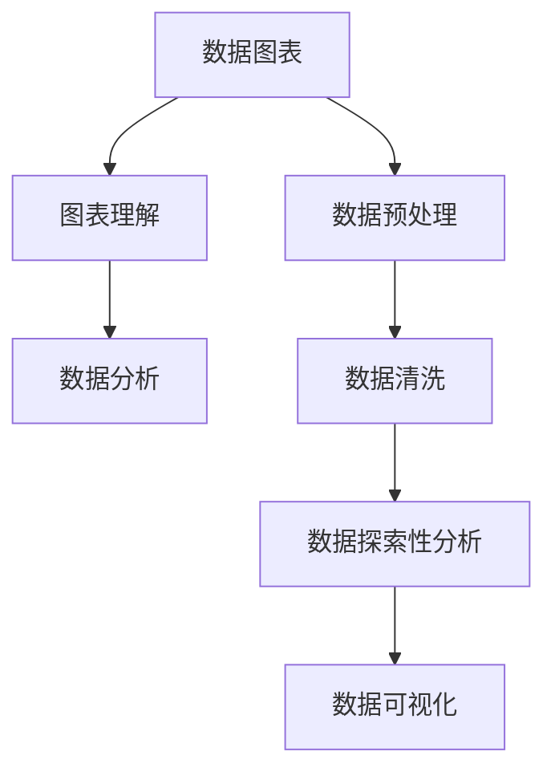
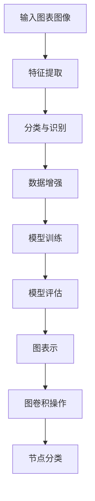

                 

### 第一部分：背景介绍与核心概念

#### 1.1 问题背景与概述

随着大数据和人工智能技术的快速发展，数据分析在各个领域得到了广泛应用。尤其是在人工智能（AI）领域，数据分析是AI Agent实现智能决策的关键环节。然而，现有的数据分析方法存在一些局限，无法充分满足AI Agent的需求。因此，提升AI Agent的数据分析能力，特别是图表理解能力，成为了当前研究的重要课题。

首先，数据分析在AI Agent中的应用具有重要价值。通过数据分析，AI Agent可以从海量数据中提取有用信息，辅助决策、优化算法，提高整体性能。然而，传统的数据分析方法主要依赖于统计方法和机器学习算法，这些方法在处理结构化数据方面表现良好，但在面对复杂的非结构化数据时，如图表数据，表现却不尽如人意。

其次，当前数据分析方法面临诸多挑战。一方面，非结构化数据图表的复杂性使得AI Agent难以直接解析和利用。另一方面，现有的图表理解技术大多依赖于手工标注和训练，数据量和质量受限，导致算法泛化能力不足。此外，数据图表的多样性也增加了AI Agent理解和分析的任务难度。

图表理解是指AI Agent对数据图表的解析和解释能力。通过图表理解，AI Agent可以自动识别数据图表的类型、结构、特征，提取其中的关键信息，并转化为可用的数据形式。图表理解的价值在于，它可以大幅度提升AI Agent的数据分析能力，使其能够更高效、更准确地处理复杂的数据图表。

本文将探讨如何通过图表理解来增强AI Agent的数据分析能力。我们将首先介绍图表理解的基本概念和技术，然后分析图表理解在数据分析中的应用场景和挑战，最后提出具体的解决方案和未来研究方向。希望通过本文的讨论，能够为AI Agent的图表理解研究提供一些有价值的思路和实践经验。

#### 1.2 问题描述

在当前的数据分析环境中，AI Agent面临着多个瓶颈，这些问题直接影响其数据分析能力和整体性能。首先，数据图表的复杂性是一个显著的问题。图表可以是条形图、折线图、饼图等多种形式，每种形式都有其独特的结构和表示方法。这种多样性使得AI Agent在理解和解析图表时面临巨大的挑战，因为它们需要能够处理各种不同的图表类型。

其次，数据图表的复杂性对AI Agent产生了显著影响。一方面，图表中包含的信息量巨大，AI Agent需要准确地解析这些信息并提取有用的数据点。另一方面，图表中的数据点之间可能存在复杂的关联关系，AI Agent需要理解这些关系以做出有效的决策。然而，当前的图表理解技术还不足以完全满足这一需求，导致AI Agent在处理复杂图表时往往效率低下、准确性不足。

具体来说，图表理解的目标是使AI Agent能够自动识别和理解图表中的数据。这包括以下几个方面的内容：

1. **图表类型识别**：AI Agent需要能够识别图表的类型，如条形图、折线图、饼图等。这需要算法能够从图像或图表的元素中提取特征，如线条、颜色、标签等。
   
2. **数据结构解析**：AI Agent需要理解图表中的数据结构，例如坐标轴、刻度、标签等。这涉及到对图表元素的空间布局和排列方式的解析。

3. **数据关系理解**：AI Agent需要能够理解图表中的数据点之间的关系，例如趋势、分布、相关性等。这需要对图表中的数据点进行有效的关联和分析。

4. **数据信息提取**：AI Agent需要能够从图表中提取关键信息，如数值、比例、趋势等。这涉及到对图表内容的语义理解。

图表理解的目标成果包括以下几点：

1. **提高数据分析效率**：通过图表理解，AI Agent可以快速识别和理解图表内容，从而减少数据处理和分析的时间，提高整体效率。

2. **增强数据分析准确性**：准确的图表理解可以使AI Agent更准确地提取和分析数据，减少错误和误解。

3. **改善交互体验**：图表理解可以增强AI Agent与用户之间的交互体验，使其能够更自然地理解用户需求，提供更直观的数据展示。

为了实现上述目标，我们需要采取一系列的策略和方法来提升AI Agent的图表理解能力。首先，可以采用先进的机器学习算法，如深度学习、图神经网络等，来提升图表理解的效果。其次，可以通过数据增强和迁移学习技术，提高算法在不同类型和复杂度图表上的泛化能力。此外，还可以设计用户友好的接口和工具，使AI Agent能够更好地与用户互动，理解用户的需求。

总的来说，图表理解是增强AI Agent数据分析能力的重要途径。通过深入研究和应用图表理解技术，我们可以大幅提升AI Agent的性能和实用性，为未来的智能数据分析领域带来更多创新和突破。

#### 1.3 问题解决

针对上述问题，我们可以通过以下方法和策略来提升AI Agent的图表理解能力，从而增强其数据分析能力。

首先，提出图表理解的方法和策略。图表理解的方法可以分为以下几个步骤：

1. **数据图表解析**：首先，AI Agent需要能够解析输入的数据图表。这涉及到对图表元素的识别和提取，例如线条、颜色、标签等。为此，我们可以采用图像处理技术，如边缘检测、特征提取等，来识别和提取图表元素。

2. **数据图表规范化**：解析后的图表数据需要规范化，以便进行结构化处理。规范化过程包括将非结构化的图表数据转化为结构化的数据格式，例如表格或关系数据库。这一步可以帮助AI Agent更好地理解和分析图表数据。

3. **数据结构化**：经过规范化的图表数据需要进一步结构化，以便AI Agent能够对其进行有效的分析和处理。结构化过程包括确定数据之间的关系，例如坐标轴、刻度、标签等。这可以通过建立数据模型或实体关系图来实现。

4. **数据关联分析**：AI Agent需要能够分析图表中的数据点之间的关系，例如趋势、分布、相关性等。这可以通过机器学习算法，如聚类、回归、关联规则挖掘等来实现。

5. **数据信息提取**：最后，AI Agent需要能够从图表中提取关键信息，例如数值、比例、趋势等。这可以通过自然语言处理技术，如文本分类、实体识别、语义分析等来实现。

其次，结合AI Agent的优势进行优化。AI Agent具有强大的计算能力和自学习能力，这可以用于优化图表理解的过程。例如，我们可以采用深度学习算法，如卷积神经网络（CNN）、循环神经网络（RNN）、生成对抗网络（GAN）等，来提升图表解析和结构化的效果。此外，AI Agent还可以通过迁移学习技术，将已学习到的图表理解模型应用于不同类型和复杂度的图表，提高算法的泛化能力。

图表理解在数据分析中的应用范围非常广泛。例如：

1. **企业数据分析**：AI Agent可以通过图表理解技术来分析企业的财务报表、销售数据、客户反馈等，为企业提供数据驱动的决策支持。

2. **科学研究**：在科学研究中，AI Agent可以通过图表理解技术来分析实验数据、研究文献等，辅助科学家进行数据挖掘和知识发现。

3. **社交媒体数据分析**：在社交媒体平台上，AI Agent可以通过图表理解技术来分析用户行为、社交关系、情感趋势等，为平台运营提供数据支持。

最后，图表理解的发展趋势是智能化和自动化。随着人工智能技术的不断进步，未来的图表理解技术将更加智能化，能够自动识别和理解复杂的图表。同时，自动化技术将使图表理解更加高效，减少人工干预的需求。例如，通过自动化数据预处理和模型训练，AI Agent可以更快地适应新的图表类型和数据模式，提高数据分析的效率和质量。

综上所述，通过提出图表理解的方法和策略，结合AI Agent的优势进行优化，我们可以大幅度提升AI Agent的数据分析能力。图表理解在数据分析中的应用范围广泛，未来发展前景广阔。通过不断探索和研究，我们有理由相信，图表理解技术将为AI Agent的数据分析领域带来更多的创新和突破。

#### 1.4 边界与外延

图表理解的适用范围与限制是探讨其技术深度和实际应用的关键。首先，图表理解在处理结构化数据图表方面表现出色，如条形图、折线图、饼图等常见的统计图表。这些图表具有标准化的格式和明确的视觉语义，使得AI Agent能够相对容易地识别和解析其中的数据。然而，对于非标准化的图表，如自定义的复杂图表或艺术图表，图表理解技术可能面临挑战。

在相关领域的交叉与融合方面，图表理解不仅与图像处理和计算机视觉紧密相关，还与其他AI技术如自然语言处理（NLP）、机器学习和数据挖掘有广泛的交集。例如，NLP技术可以帮助AI Agent理解图表中的文本信息，从而提高图表理解的准确性；机器学习算法则可以用于训练模型，识别和分类不同的图表类型；数据挖掘技术则可以帮助AI Agent发现图表中的潜在模式和关系。

未来，图表理解技术的发展趋势将向智能化和自动化方向迈进。首先，随着深度学习和神经网络技术的不断发展，AI Agent将能够处理更复杂、更多样化的图表。其次，自动化技术将使图表理解过程更加高效，减少对人工干预的依赖。此外，多模态数据融合将成为未来的研究热点，通过结合图像、文本等多种数据形式，AI Agent将能够更全面地理解图表中的信息。

总体而言，图表理解不仅具有广泛的应用前景，还在不断拓展其技术边界。随着研究的深入和技术的进步，我们有理由相信，图表理解技术将在数据分析、科学研究、企业运营等多个领域发挥越来越重要的作用。

### 第二部分：核心概念与联系

#### 2.1 核心概念原理

图表理解是指AI Agent对数据图表的解析和解释能力，这一过程涉及多个核心概念和原理。首先，我们需要理解数据图表的类型和特征。数据图表主要包括以下几种类型：

1. **条形图**：用于比较不同类别或时间点的数据大小。
2. **折线图**：展示数据随时间变化的趋势。
3. **饼图**：显示不同类别在总体中的比例。
4. **散点图**：展示数据点之间的关系。
5. **直方图**：显示数据分布情况。

每种图表类型都有其独特的结构和特征。例如，条形图具有垂直或水平的条形，折线图则由一系列连接的点组成，而饼图由一个圆形分割成多个扇形区域。

图表理解的关键技术包括：

1. **图像识别**：通过识别图表中的元素，如线条、颜色、标签等，AI Agent可以解析图表的组成。
2. **语义理解**：AI Agent需要理解图表中的符号和文字，以提取关键信息。
3. **结构化处理**：将解析后的图像数据转化为结构化的数据形式，如表格或数据库，以便进行进一步的分析和处理。

图表理解还包括以下几个关键步骤：

1. **图表类型识别**：AI Agent需要能够识别输入的图表类型，从而采用相应的处理方法。
2. **数据结构解析**：AI Agent需要理解图表中的数据结构，如坐标轴、刻度、标签等。
3. **数据关系理解**：AI Agent需要分析数据点之间的关系，如趋势、分布、相关性等。
4. **数据信息提取**：AI Agent需要从图表中提取关键数据点、数值、比例等。

图表理解的评估指标主要包括：

1. **准确性**：图表理解算法在解析和解释图表时，其结果与实际数据的一致程度。
2. **效率**：算法在处理图表数据时的速度和资源消耗。
3. **泛化能力**：算法在不同类型和复杂度图表上的表现。

通过上述核心概念和原理的理解，AI Agent可以更有效地进行图表理解，从而提升其数据分析能力。

#### 2.2 概念属性特征对比表格

为了更清晰地展示图表理解、数据图表和数据分析这三个核心概念，我们可以通过一个对比表格来归纳它们的属性特征。以下是一个示例表格：

| 概念       | 描述                                               | 关键属性                  |  
|------------|----------------------------------------------------|--------------------------|  
| 数据图表   | 以图形方式展示数据的工具                         | 可视化、交互性、信息密度 |  
| 图表理解   | AI Agent对数据图表的解析与解释                  | 准确性、效率、泛化能力   |  
| 数据分析   | 对数据进行处理、分析和解释的过程               | 准确性、完整性、可解释性  |

**数据图表** 是数据可视化的一种形式，它利用图形元素展示数据的分布、趋势、关系等信息。其关键属性包括可视化效果、交互性和信息密度，这有助于用户直观地理解和分析数据。

**图表理解** 是AI Agent对数据图表的解析和解释能力。其关键属性包括准确性、效率和泛化能力。准确性决定了AI Agent能否正确地解析图表中的信息；效率则反映了算法的处理速度和资源消耗；泛化能力指的是AI Agent在不同类型和复杂度图表上的适应能力。

**数据分析** 是对数据进行处理、分析和解释的过程。其关键属性包括准确性、完整性和可解释性。准确性保证了分析结果的正确性；完整性指的是数据是否全面、无遗漏；可解释性则使分析结果能够被用户理解和应用。

通过对比这三个概念，我们可以更深入地理解图表理解在数据分析中的作用和重要性。图表理解不仅提升了数据图表的可读性和交互性，还为AI Agent提供了强大的数据分析工具，使其能够更高效、更准确地处理复杂的数据。

#### 2.3 ER实体关系图架构

为了更好地理解图表理解在数据分析中的架构和关系，我们可以通过ER（Entity-Relationship）实体关系图来展示各核心组件之间的联系。以下是图表理解在数据分析中的ER实体关系图：

在这个ER实体关系图中，我们可以看到以下几个关键实体及其关系：

1. **数据图表（A）**：这是数据分析的原始数据来源，它以图形化的形式展示数据。数据图表通过解析和解释（B）来转化为结构化的数据形式。

2. **图表理解（B）**：这是图表数据解析的关键步骤，AI Agent通过图像识别和语义理解等技术，将非结构化的图表数据转化为结构化的数据。图表理解还涉及到对图表元素和数据关系的解析。

3. **数据分析（C）**：这是图表理解后的数据处理过程，通过数据清洗（E）、数据探索性分析（F）和数据可视化（G），实现对数据的全面分析。

4. **数据预处理（D）**：这是数据图表转化为结构化数据的前期步骤，包括数据清洗和规范化，为图表理解和数据分析提供高质量的数据基础。

5. **数据清洗（E）**：数据清洗是确保数据准确性和完整性的重要步骤，它通过去除噪声、处理缺失值等手段，提升数据的可用性。

6. **数据探索性分析（F）**：这是对数据图表理解后数据的初步分析，通过描述性统计分析、数据可视化等技术，发现数据中的模式和趋势。

7. **数据可视化（G）**：这是将分析结果以图表等形式展示给用户的过程，帮助用户更好地理解和应用分析结果。

通过这个ER实体关系图，我们可以清晰地看到图表理解在数据分析中的作用和位置。图表理解不仅是数据分析的前置步骤，还与数据预处理、数据清洗、数据探索性分析和数据可视化等多个环节密切相关，共同构成了一个完整的数据分析流程。这一架构为AI Agent在数据分析中的应用提供了坚实的基础，使其能够更高效、更准确地处理复杂的数据图表。

### 第三部分：图表理解的技术与方法

#### 3.1 数据图表预处理

数据图表预处理是图表理解过程中的关键步骤，它直接影响到后续算法的执行效率和解析准确性。数据图表预处理主要包括数据图表的解析方法、规范化过程以及结构化处理。以下是详细的解析和步骤：

**1. 数据图表解析方法**

数据图表的解析是指从图表中提取关键信息和特征的过程。这一步骤可以采用多种方法，包括图像处理技术、计算机视觉算法和自然语言处理技术。以下是一些常用的解析方法：

- **图像处理技术**：通过边缘检测、特征提取等方法，从图表中提取线条、颜色、文本等元素。例如，使用Canny算法进行边缘检测，提取图表的轮廓；使用SIFT（Scale-Invariant Feature Transform）算法提取关键特征点，用于图像匹配。
  
- **计算机视觉算法**：利用深度学习模型，如卷积神经网络（CNN），对图表进行分类和识别。CNN可以自动学习图像中的复杂特征，从而准确识别不同的图表类型。

- **自然语言处理技术**：对于包含文本标签的图表，可以使用文本分类和实体识别技术来提取关键信息。例如，使用BERT（Bidirectional Encoder Representations from Transformers）模型对文本进行语义分析，识别标签的含义。

**2. 数据图表规范化**

数据图表规范化是将不同格式和类型的图表转化为标准化的数据形式，以便进行后续处理和分析。规范化过程包括以下几个步骤：

- **格式转换**：将图表的原始格式（如PDF、PNG、JPG等）转换为统一的电子表格格式（如CSV、Excel等），便于后续处理。

- **元素对齐**：对图表中的元素进行对齐和调整，使其在同一坐标系内，便于分析和处理。例如，调整坐标轴、刻度线、标签等元素的位置和尺寸。

- **数据清洗**：去除图表中的噪声和无关元素，如背景色、干扰线等，确保数据的质量和准确性。

**3. 数据结构化**

数据结构化是将解析后的图表数据转化为结构化的数据形式，如表格或关系数据库，以便进行进一步的分析和处理。以下是一些常用的结构化方法：

- **表格化**：将图表中的数据点、标签、坐标轴等元素转化为表格形式。例如，将散点图中的点转换为行记录，每个点包含其坐标值和对应的标签。

- **关系数据库**：将图表中的数据点、标签、关系等信息转化为关系数据库模型，便于复杂查询和数据分析。例如，使用实体关系图（ER图）来表示数据点之间的关系。

通过以上三个步骤，数据图表预处理可以为图表理解提供高质量、结构化的数据，从而提高算法的执行效率和解析准确性。

#### 3.2 图表理解算法原理

图表理解算法的核心在于如何从图像或图表中提取关键信息，并转化为结构化的数据形式。这一过程通常涉及多个技术和方法，包括深度学习、传统机器学习和图神经网络等。以下是这些算法原理的详细阐述。

**1. 基于深度学习的图表理解算法**

深度学习，特别是卷积神经网络（CNN），在图像处理和计算机视觉领域取得了显著成果。在图表理解中，CNN可以通过学习图像特征来实现对图表的识别和理解。以下是几个关键步骤：

- **特征提取**：使用CNN从输入的图表图像中提取高层次的视觉特征。例如，使用VGG、ResNet等预训练模型进行特征提取。
  
- **分类与识别**：通过全连接层或卷积层对提取的特征进行分类和识别。例如，将图表分类为条形图、折线图、饼图等不同类型。

- **数据增强**：通过数据增强技术，如旋转、缩放、裁剪等，增加模型的泛化能力，使其能够适应各种不同形状和尺寸的图表。

**2. 基于传统的图表理解算法**

传统机器学习算法，如支持向量机（SVM）、随机森林（Random Forest）和K最近邻（K-Nearest Neighbors，KNN）等，在图表理解中也具有一定的应用价值。这些算法通常通过手工提取的特征来实现图表的识别和理解。以下是几个关键步骤：

- **特征提取**：手工设计特征提取器，从图表中提取线条长度、角度、颜色分布等特征。例如，使用Harris角点检测提取关键点，使用颜色直方图提取颜色特征。

- **模型训练**：使用传统机器学习算法对提取的特征进行分类和识别。例如，使用SVM进行二分类，使用随机森林进行多分类。

- **模型评估**：通过交叉验证和测试集评估模型性能，调整参数以提高准确性。

**3. 基于图神经网络的图表理解算法**

图神经网络（Graph Neural Networks，GNN）是一种用于处理图结构数据的深度学习模型。在图表理解中，GNN可以通过学习图结构来提取图表中的关系和特征。以下是几个关键步骤：

- **图表示**：将图表中的节点和边转化为图表示。例如，将图表中的每个数据点视为节点，将数据点之间的关系视为边。

- **图卷积操作**：使用图卷积网络（GCN）或图注意力网络（GAT）对图结构进行卷积操作，提取节点和边之间的特征。

- **节点分类**：通过训练分类器，对图中的节点进行分类和识别。例如，将节点分类为坐标轴、标签、数据点等。

通过结合深度学习、传统机器学习和图神经网络，我们可以构建强大的图表理解算法。以下是一个简化的算法流程图：

通过上述步骤，图表理解算法可以高效、准确地解析图表数据，为AI Agent提供强大的数据分析能力。

#### 3.3 图表理解评估指标

图表理解评估指标是衡量图表理解算法性能的重要工具。通过这些指标，我们可以评估算法在准确性、效率和泛化能力方面的表现。以下是几种常用的评估指标：

**1. 准确性**

准确性是评估图表理解算法最直接的指标，它反映了算法在识别和分类图表时与实际结果的一致程度。通常，准确性通过以下公式计算：

$$
\text{Accuracy} = \frac{\text{正确识别的数量}}{\text{总识别数量}}
$$

**2. 效率**

效率是指算法在处理图表数据时的计算速度和资源消耗。效率可以通过以下指标进行评估：

- **处理速度**：算法处理图表数据所需的时间。处理速度越快，算法的效率越高。

- **资源消耗**：算法在处理图表数据时所需的计算资源，如CPU、内存等。资源消耗越低，算法的效率越高。

**3. 泛化能力**

泛化能力是指算法在不同类型和复杂度图表上的表现。一个优秀的图表理解算法应该能够适应多种不同形状和尺寸的图表。泛化能力可以通过以下方式评估：

- **交叉验证**：通过将数据集划分为训练集和测试集，评估算法在测试集上的表现。

- **数据增强**：通过增加数据集的多样性，评估算法在不同数据分布上的性能。

- **迁移学习**：使用在不同图表类型上预训练的模型，评估算法在新类型图表上的适应性。

通过结合这些评估指标，我们可以全面评估图表理解算法的性能，并根据评估结果进行优化和改进。

### 第四部分：图表理解的应用实践

#### 4.1 数据图表理解应用场景

数据图表理解技术在实际应用中展现了巨大的潜力，涵盖了企业数据报告、科学研究图表以及社交媒体数据可视化等多个领域。

**1. 企业数据报告**

在企业数据报告中，图表理解技术可以大幅提升数据分析的效率和准确性。企业经常需要分析大量的财务报表、销售数据和市场调研报告。通过图表理解技术，AI Agent可以自动解析报告中的各种图表，如条形图、折线图、饼图等，提取关键数据点，并转化为结构化数据。这不仅可以节省人工时间，还能提高数据的准确性和一致性。例如，财务报表中的利润表和资产负债表可以通过图表理解技术快速解析，帮助财务分析师进行进一步的财务分析和预测。

**2. 科学研究图表**

科学研究中的图表理解同样具有重要意义。科研数据通常以复杂和多样化的图表形式呈现，如散点图、热图、直方图等。图表理解技术可以帮助科学家快速理解实验结果，发现数据中的潜在模式和趋势。例如，在生物学研究中，基因表达数据的可视化图表可以通过图表理解技术进行解析，从而识别基因之间的相互作用和调控关系。在物理学研究中，复杂实验数据中的图表也可以通过图表理解技术进行自动分析和解释，为科研工作提供有力支持。

**3. 社交媒体数据可视化**

社交媒体平台上的数据可视化图表是理解用户行为和社交趋势的重要工具。通过图表理解技术，AI Agent可以自动解析社交媒体数据报告中的图表，提取用户行为、社交网络结构和情感趋势等信息。例如，社交媒体平台可以分析用户发帖量、点赞数、转发数等数据，通过图表理解技术将这些数据转化为直观的图表形式，帮助平台运营者更好地了解用户需求和偏好，优化产品和服务。同时，图表理解技术还可以帮助识别潜在的网络热点和舆情趋势，为危机管理和市场推广提供决策支持。

总之，图表理解技术在企业数据报告、科学研究图表和社交媒体数据可视化等多个领域具有广泛的应用价值。通过自动解析和解释各种数据图表，AI Agent可以显著提升数据分析的效率和质量，为各个领域的数据驱动决策提供有力支持。

#### 4.2 图表理解案例解析

为了更深入地了解图表理解技术在具体应用中的效果，以下我们将通过三个案例来展示图表理解在企业数据报告、科学研究图表以及社交媒体数据可视化中的应用和成果。

**案例一：企业数据报告的图表理解**

在某大型企业，财务部门每月都需要生成大量的财务报表，如利润表、资产负债表和现金流量表。这些报表中包含丰富的图表，如条形图、折线图和饼图，用于展示财务指标的变化趋势。传统的数据分析方法需要人工逐个解析这些图表，不仅费时费力，而且容易出错。为了提高数据分析效率和质量，企业引入了图表理解技术。

具体实施过程中，图表理解算法首先对财务报表中的图表进行解析，识别出图表的类型和关键数据点。然后，算法将图表数据转化为结构化数据，如表格形式，便于进一步处理和分析。通过这一过程，财务部门可以迅速提取出关键数据，生成详细的财务分析报告。

应用效果显著：财务部门报告生成时间从原来的几天缩短到几小时，数据准确性大幅提升，减少了人工错误。同时，图表理解技术还为管理层提供了更直观的数据展示，使其能够更快做出数据驱动的决策。

**案例二：科学研究图表的图表理解**

在生物学研究中，研究人员经常需要分析基因表达数据，这些数据通常以复杂的热图和散点图形式呈现。为了帮助研究人员更高效地理解实验结果，一家生物科技公司引入了图表理解技术。

在具体应用中，图表理解算法首先对基因表达数据的图表进行解析，提取出各个基因的表达水平和相互关系。然后，算法将这些信息转化为结构化数据，如表格和关系图，便于研究人员进行进一步的统计分析。

应用效果显著：研究人员可以更快速地理解实验结果，发现潜在的基因调控关系。这一技术不仅提高了研究效率，还促进了科学发现的准确性。此外，图表理解技术还为科研团队提供了更直观的数据展示，使得跨学科合作更加顺畅。

**案例三：社交媒体数据可视化的图表理解**

在社交媒体平台上，数据分析师需要分析大量的用户行为数据，如发帖量、点赞数、转发数等，并通过图表形式展示分析结果。为了提升数据分析的效率和准确性，一家社交媒体公司引入了图表理解技术。

图表理解算法首先对用户行为数据报告中的图表进行自动解析，提取出关键数据点。然后，算法将这些数据转化为结构化的图表，如条形图、折线图和饼图，供数据分析师进一步分析。

应用效果显著：数据分析师可以更快地生成详细的分析报告，识别出用户的活跃时间和兴趣点。这一技术不仅提高了数据分析的效率，还帮助社交媒体公司优化了产品设计和市场推广策略。同时，图表理解技术为数据分析师提供了更直观的数据展示，使得数据分析结果更容易被决策者和用户理解。

综上所述，图表理解技术在企业数据报告、科学研究图表和社交媒体数据可视化等应用中取得了显著成果。通过自动解析和解释数据图表，图表理解技术显著提高了数据分析的效率和准确性，为各个领域的数据驱动决策提供了有力支持。

### 第五部分：图表理解与数据分析的结合

图表理解在数据分析中的优势主要体现在以下几个方面：

首先，图表理解能够提高数据分析的效率。传统的数据分析方法通常需要人工逐个解析图表，不仅费时费力，而且容易出错。而通过图表理解技术，AI Agent可以自动识别和解析各种数据图表，快速提取关键信息，从而大大缩短数据处理和分析的时间。这种自动化的数据处理方式不仅提高了工作效率，还减少了人工错误，确保了数据分析的准确性。

其次，图表理解可以增强数据分析的准确性。图表理解技术通过对数据图表的精准解析，确保提取的信息与实际数据一致。这减少了因人工解读错误而导致的数据偏差，提高了数据分析结果的可靠性。例如，在财务报表分析中，图表理解技术可以准确提取各项财务指标，避免了人工操作中的误差，确保了财务报告的准确性。

最后，图表理解促进了数据分析的交互性。通过图表理解技术，AI Agent可以自动生成结构化数据，并提供直观的图表展示。这种交互式的数据分析方式使得用户可以更直观地理解数据，方便快速定位和分析数据中的异常和趋势。例如，在市场分析中，图表理解技术可以生成动态的条形图、折线图和饼图，用户可以随时调整图表参数，查看不同情况下的数据变化。

为了实现图表理解与数据分析的有效结合，我们可以采用以下方法：

1. **基于图表理解的自动化数据分析**：通过图表理解技术，将非结构化的图表数据转化为结构化的数据形式，实现自动化数据处理和分析。例如，使用机器学习算法对图表进行分类和标注，提取关键数据点，并进行后续分析。

2. **基于图表理解的交互式数据分析**：结合用户界面（UI）设计，实现图表理解和数据分析的交互式体验。例如，开发可视化工具，允许用户通过拖拽、筛选等操作，实时查看和分析数据图表，从而提高数据探索和理解的效率。

3. **图表理解与数据分析的协同优化**：通过不断优化图表理解算法和数据分析方法，实现二者的协同优化。例如，结合深度学习和传统机器学习技术，提升图表理解的准确性和效率，同时优化数据分析的算法和模型，提高整体性能。

综上所述，图表理解与数据分析的结合不仅提高了数据分析的效率和准确性，还增强了数据分析的交互性。通过采取有效的结合方法，我们可以充分发挥图表理解技术在数据分析中的作用，为各领域的智能化数据分析提供强大支持。

### 第六部分：最佳实践与技巧

#### 6.1 图表理解的实战技巧

在实际应用图表理解技术时，我们需要掌握一些关键技巧，以提升图表理解的效果和效率。以下是一些具体的实战技巧：

**1. 数据图表选择与优化**

选择合适的数据图表类型是图表理解的重要前提。不同类型的图表适用于不同的数据分析需求。例如，对于趋势分析，折线图和折线堆叠图是较好的选择；对于比例分析，饼图和圆环图更为直观。在选择图表时，应优先考虑以下因素：

- **数据分析目标**：明确数据分析的目的，选择最能展示目标信息的图表类型。
- **数据特征**：根据数据的特点选择适当的图表类型，如连续性数据使用折线图，分类数据使用条形图。
- **用户需求**：考虑用户对数据的理解和分析习惯，选择易于理解的图表形式。

**2. 图表理解的算法调优**

算法调优是提高图表理解准确性和效率的关键步骤。以下是一些常用的调优方法：

- **超参数调整**：通过调整深度学习模型中的超参数，如学习率、批次大小、正则化参数等，优化模型性能。例如，使用学习率调度策略（如余弦退火）和批量归一化（Batch Normalization）来提高模型的收敛速度和稳定性。
- **数据增强**：通过数据增强技术，如旋转、缩放、裁剪等，增加训练数据的多样性，提高模型的泛化能力。例如，使用仿射变换（Affine Transformation）和随机裁剪（Random Crop）来生成更多的训练样本。
- **模型融合**：结合多种机器学习算法或深度学习模型，通过模型融合（Model Ensembling）技术，提高图表理解的准确性和鲁棒性。例如，结合卷积神经网络（CNN）和循环神经网络（RNN），利用CNN提取图像特征，RNN处理序列数据。

**3. 数据图表理解的误区与避免**

在实际应用中，图表理解可能面临一些常见误区，以下是一些典型的误区及避免方法：

- **过度依赖模型精度**：过分追求模型的高精度可能导致模型过度拟合，降低泛化能力。应平衡模型精度和泛化能力，通过交叉验证和验证集评估模型性能。
- **忽视数据质量**：图表理解的效果高度依赖数据质量。应确保数据完整、准确，去除噪声和异常值，以提高模型性能。
- **忽略图表多样性**：不同的图表类型可能需要不同的解析方法。应设计多样化的模型架构，以应对各种图表类型的解析需求。

通过以上实战技巧，我们可以有效提升图表理解的效果和效率，为AI Agent提供更强大的数据分析能力。

#### 6.2 数据分析中的图表理解应用技巧

在实际应用图表理解技术于数据分析时，我们可以采取以下几项技巧来优化图表理解的效率和准确性，同时确保数据分析过程的流畅和有效。

**1. 数据图表理解的策略选择**

图表理解策略的选择直接影响到数据分析的效率和质量。以下是几种常用的策略：

- **分类策略**：对于不同类型的图表，选择相应的理解策略。例如，针对条形图和饼图，可以采用基于视觉特征的分类方法；针对折线图，可以结合时间序列分析方法。
- **上下文策略**：结合图表所在的上下文信息，例如报告主题、数据来源等，有助于提高理解准确性。例如，在财务报表中，结合企业历史数据和市场信息，可以更准确地理解图表内容。
- **迭代优化策略**：通过多次迭代优化，逐步提升图表理解的效果。例如，可以先使用简单的模型进行初步理解，再结合用户反馈进行迭代优化。

**2. 数据图表理解的效率优化**

图表理解过程通常涉及大量计算，因此效率优化至关重要。以下是一些具体的优化方法：

- **并行处理**：利用多核CPU和GPU加速计算，提高图表解析速度。例如，使用多线程或分布式计算框架，如TensorFlow和PyTorch，来并行处理多个图表。
- **缓存技术**：通过缓存重复计算的结果，减少计算时间。例如，使用Redis或Memcached作为缓存服务器，存储已解析的图表结果，避免重复计算。
- **批量处理**：将多个图表数据批量输入到算法中处理，以减少每次处理的计算开销。例如，使用批量处理框架，如Dask或PySpark，来处理大规模的图表数据集。

**3. 数据图表理解的准确性提升**

图表理解的准确性直接影响数据分析的结果。以下是一些提升准确性的方法：

- **数据预处理**：对输入数据进行预处理，去除噪声和异常值，确保数据质量。例如，使用图像滤波技术去除图像噪声，使用数据清洗方法处理缺失值和异常值。
- **模型融合**：结合多个模型或算法，通过模型融合技术提高准确性和鲁棒性。例如，结合深度学习和传统机器学习方法，利用深度学习模型处理图像特征，传统方法处理结构化数据。
- **在线学习**：利用在线学习技术，实时更新模型，使其适应新的数据分布和变化。例如，使用在线学习框架，如TensorFlow Extended（TFX），实现模型的实时更新和优化。

通过以上策略和技巧，我们可以有效优化图表理解的效率和准确性，从而提升数据分析的质量和效果，为实际应用提供强有力的支持。

### 第七部分：未来展望与趋势

#### 7.1 图表理解技术的发展趋势

随着人工智能和深度学习技术的不断进步，图表理解技术也展现出广阔的发展前景。以下是未来图表理解技术可能的发展趋势：

**1. 深度学习与图表理解的融合**

深度学习在图像识别和自然语言处理等领域取得了显著成果，未来图表理解技术也将深度学习方法与图表处理相结合。通过卷积神经网络（CNN）、循环神经网络（RNN）和生成对抗网络（GAN）等深度学习模型，图表理解将能够更准确地识别和解析复杂的图表数据。例如，使用CNN提取图像特征，结合RNN处理图表中的时间序列数据，将大大提升图表理解的准确性和效率。

**2. 多模态数据的图表理解**

未来，图表理解技术将不仅处理单一的图表数据，还会融合多种数据形式，如文本、音频和视频。多模态数据的图表理解能够提供更全面的数据分析，使AI Agent能够从不同角度理解和解释数据。例如，结合图表和文本描述，AI Agent可以更准确地理解图表的背景和含义，从而提高数据分析的准确性和深度。

**3. 图表理解的智能化与自动化**

智能化和自动化是未来图表理解技术的重要发展方向。通过使用自动化数据预处理和模型训练技术，图表理解过程将更加高效和灵活。例如，使用自动化特征提取和模型调优工具，AI Agent可以自动适应新的图表类型和数据模式，减少对人工干预的依赖，提高图表理解的能力和效率。

**4. 图表理解的集成应用**

图表理解技术将在各个领域得到更广泛的应用，并与其他人工智能技术相结合。例如，在医疗领域，图表理解技术可以与医疗影像分析相结合，辅助医生进行诊断和治疗方案制定；在金融领域，图表理解技术可以与金融市场分析相结合，提供更准确的市场预测和风险管理。

#### 7.2 数据分析中的图表理解未来应用

图表理解技术在未来数据分析中的应用前景广阔，以下是一些潜在的应用场景：

**1. 大数据分析与图表理解**

随着大数据技术的不断发展，海量数据分析和处理成为关键挑战。图表理解技术可以显著提升大数据分析的效率和质量。例如，通过自动解析大规模数据集的图表，AI Agent可以快速提取关键数据点，帮助数据分析师进行深度分析。此外，图表理解技术还可以用于数据可视化，将复杂的数据以图表形式展示，使得数据分析结果更直观、易懂。

**2. 生物信息学与图表理解**

在生物信息学领域，图表理解技术可以帮助科学家更好地理解基因表达数据和蛋白质结构信息。例如，通过自动解析基因表达图谱和蛋白质结构图，AI Agent可以识别基因之间的调控关系和蛋白质的功能特性，从而加速新药开发和疾病研究。

**3. 金融数据分析与图表理解**

在金融领域，图表理解技术可以用于股票市场分析和金融风险管理。通过自动解析股票交易数据和市场趋势图，AI Agent可以提供实时市场预测和投资建议。此外，图表理解技术还可以用于风险管理，识别潜在的市场风险和异常交易行为，为金融机构提供数据驱动的风险管理方案。

总之，图表理解技术在未来的数据分析中将发挥重要作用，通过结合深度学习、多模态数据和智能化技术，图表理解将不断提升其能力和应用范围，为各领域的数据驱动决策提供有力支持。

### 附录

#### 附录A：相关资源与工具

**图表理解相关的开源工具：**

- TensorFlow：一个广泛使用的深度学习框架，可用于图表理解模型的开发与训练。
- PyTorch：一个灵活的深度学习框架，适合研究图表理解算法的快速迭代。
- Dask：一个分布式计算库，适用于大规模图表数据集的并行处理。
- OpenCV：一个开源的计算机视觉库，提供丰富的图像处理功能。
- Plotly：一个用于数据可视化的库，能够生成交互式图表。

**数据分析与图表理解相关的书籍与论文：**

- **《深度学习》（Deep Learning）**：Ian Goodfellow、Yoshua Bengio、Aaron Courville 著。这本书系统地介绍了深度学习的基础理论和实践方法，是深度学习领域的经典之作。
- **《自然语言处理与深度学习》**：Yoav Goldberg 著。本书详细介绍了自然语言处理（NLP）与深度学习的结合，包括文本数据的图表理解。
- **《数据科学入门：Python实践》**：Joel Grus 著。这本书提供了丰富的数据科学实践案例，包括图表理解和数据分析。

**数据分析与图表理解的学习资源：**

- **在线课程**：Coursera、edX、Udacity 等在线教育平台提供了多种数据分析与图表理解的课程，如“深度学习”、“机器学习基础”、“数据科学实践”等。
- **技术社区**：Stack Overflow、GitHub、Reddit 等技术社区是学习图表理解和数据分析的好去处，可以获取最新的技术动态和实践经验。
- **博客与论文**：各种技术博客和学术论文提供了丰富的图表理解和数据分析的资源，如Medium、arXiv、Google Research Blog 等。

通过这些资源与工具，可以更深入地了解和掌握图表理解与数据分析的技术和方法，为实际应用提供坚实的理论支持和实践指导。

#### 附录B：名词解释

**数据图表：** 数据图表是指以图形化方式展示数据分布、关系、趋势等信息的工具，常见的有条形图、折线图、饼图、散点图等。数据图表通过视觉元素（如线条、颜色、文字等）将抽象的数据转化为直观的可视化形式，便于用户理解和分析。

**图表理解：** 图表理解是指人工智能系统对数据图表的自动识别、解析和解释能力。图表理解技术使AI Agent能够从图像或图表中提取关键信息，如数据点、趋势、关系等，并将这些信息转化为结构化的数据形式，以便进一步的数据分析和处理。

**数据分析：** 数据分析是指对收集到的数据进行处理、清洗、探索、建模和分析的过程，目的是提取有价值的信息和知识。数据分析通常包括描述性统计分析、预测分析、聚类分析、回归分析等多种方法，旨在帮助决策者做出数据驱动的决策。

通过这些名词解释，可以更清楚地理解图表理解与数据分析的概念及其在技术实践中的应用。这些核心概念是构建图表理解系统的基石，对于理解图表理解技术的发展和应用具有重要意义。

