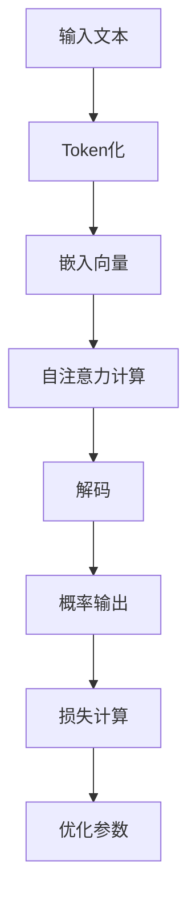
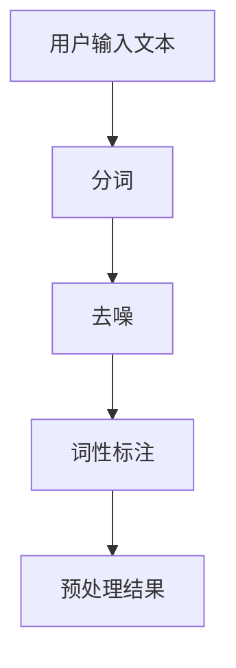
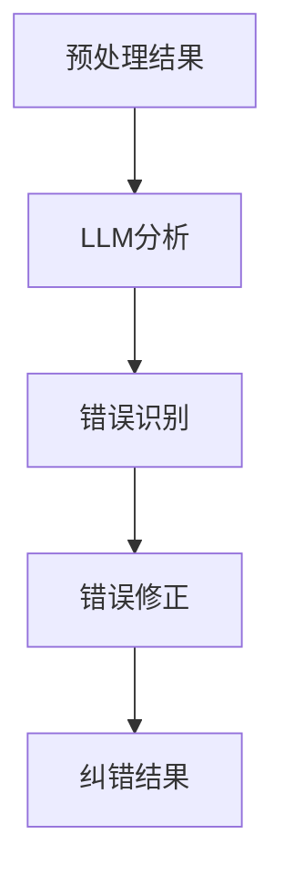
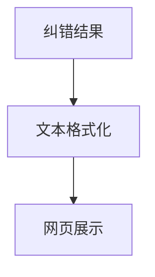
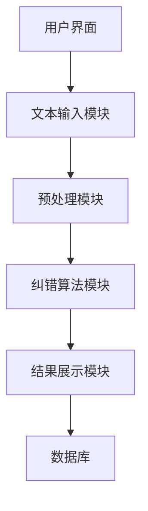
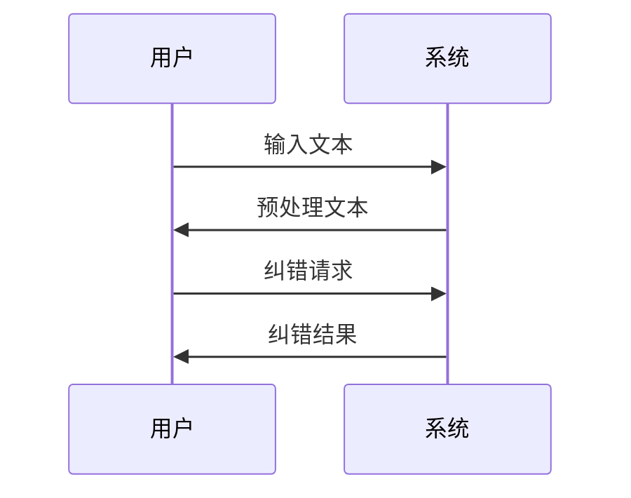

                 

## 《基于LLM的AI Agent文本纠错系统》

### 关键词：LLM, AI Agent, 文本纠错，深度学习，自然语言处理

#### 摘要：
本文旨在探讨基于大型语言模型（LLM）的AI Agent文本纠错系统的设计与实现。文章首先介绍了AI Agent与文本纠错系统的基本概念，然后深入探讨了LLM的基础与原理，包括语言模型的数学模型、算法原理以及优化策略。随后，文章详细介绍了AI Agent文本纠错系统的架构设计，包括系统功能设计、架构设计、接口设计以及系统交互。最后，通过一个实际项目实战，展示了系统实现的具体步骤、核心代码以及应用效果。

### 第一部分：基于LLM的AI Agent概述

#### 第1章：AI Agent与文本纠错系统

##### 1.1 AI Agent的基本概念与分类

###### 1.1.1 AI Agent的定义

AI Agent是指具备自主决策、执行任务和学习能力的智能系统。它们可以根据环境和任务需求，自主地执行特定任务，并通过学习不断优化自身行为。

###### 1.1.2 AI Agent的分类

AI Agent可以分为三大类：基于规则的Agent、基于知识的Agent和基于机器学习的Agent。其中，基于机器学习的Agent通过学习数据自动获取任务解决方案，具有更高的灵活性和适应能力。

###### 1.1.3 AI Agent的核心功能

AI Agent的核心功能包括感知、决策、执行和学习。感知是指获取环境信息；决策是指根据环境信息和任务目标，选择最佳行动方案；执行是指执行选定的行动方案；学习是指通过经验和数据不断优化自身行为。

##### 1.2 文本纠错系统的需求与挑战

###### 1.2.1 文本纠错系统的需求

文本纠错系统的主要目标是识别和纠正文本中的错误，提高文本的准确性和可读性。其应用场景广泛，如自然语言处理、语音识别、机器翻译、文本审核等。

###### 1.2.2 文本纠错系统的挑战

文本纠错系统面临的主要挑战包括：错误类型的多样性、错误位置的随机性、错误程度的差异性和语言理解的复杂性。

###### 1.2.3 文本纠错系统的发展历程

文本纠错系统经历了从规则匹配到统计方法，再到深度学习的发展历程。目前，基于深度学习的方法已成为文本纠错的主流。

##### 1.3 基于LLM的AI Agent文本纠错系统的优势

###### 1.3.1 LLM在文本纠错中的应用

LLM具有强大的语言理解和生成能力，可以有效地识别和纠正文本中的错误。其应用于文本纠错，可以显著提高纠错准确率和效率。

###### 1.3.2 LLM的优势与局限

LLM的优势在于其强大的语言建模能力和自适应能力，但其局限在于对特定领域知识的依赖性较强，且训练成本较高。

###### 1.3.3 LLM在AI Agent文本纠错中的前景

随着LLM技术的不断发展，其在AI Agent文本纠错中的应用前景广阔。未来，基于LLM的AI Agent文本纠错系统有望在各个领域取得显著成果。

##### 1.4 本章小结

本章介绍了AI Agent与文本纠错系统的基本概念，探讨了基于LLM的AI Agent文本纠错系统的优势。接下来，我们将深入探讨LLM的基础与原理。

----------------------------------------------------------------

### 第二部分：LLM基础与原理

#### 第2章：语言模型基础

##### 2.1 语言模型的基本概念

###### 2.1.1 语言模型的定义

语言模型是一种用于预测自然语言序列的概率分布的数学模型。它可以帮助计算机理解和生成自然语言。

###### 2.1.2 语言模型的目标

语言模型的目标是最大化预测序列的似然概率，从而生成自然、流畅的文本。

###### 2.1.3 语言模型的分类

语言模型可以分为概率语言模型和深度学习语言模型。概率语言模型基于概率论和统计学原理，如N元语法；深度学习语言模型基于神经网络，如Transformer。

##### 2.2 语言模型的数学模型

###### 2.2.1 概率语言模型

概率语言模型通过计算序列的概率分布来实现。常见的概率语言模型有N元语法和隐马尔可夫模型（HMM）。

###### 2.2.2 生成式语言模型

生成式语言模型通过生成自然语言序列来实现。常见的生成式语言模型有循环神经网络（RNN）和变换器（Transformer）。

###### 2.2.3 判别式语言模型

判别式语言模型通过计算给定输入序列的真实标签的概率来实现。常见的判别式语言模型有最大熵模型和条件随机场（CRF）。

##### 2.3 语言模型的训练与优化

###### 2.3.1 语言模型训练的基本流程

语言模型训练的基本流程包括数据预处理、模型训练和模型评估。数据预处理包括分词、标记和去噪等步骤；模型训练包括损失函数、优化器和训练策略的选择；模型评估包括准确率、召回率和F1值等指标。

###### 2.3.2 语言模型优化的方法

语言模型优化包括模型选择、参数调整和超参数优化等方法。模型选择包括选择合适的模型结构和模型复杂度；参数调整包括学习率、批量大小和迭代次数等；超参数优化包括选择合适的训练数据和评估方法。

###### 2.3.3 语言模型评估指标

语言模型评估指标包括准确率、召回率、F1值和困惑度等。准确率衡量模型预测正确的能力；召回率衡量模型能够发现多少真正的错误；F1值是准确率和召回率的调和平均；困惑度衡量模型的复杂度。

##### 2.4 LLM的基本结构

###### 2.4.1 Transformer模型结构

Transformer模型是一种基于自注意力机制的深度学习模型。它由编码器（Encoder）和解码器（Decoder）组成，可以同时处理多个序列。

###### 2.4.2 LLM的层次结构

LLM的层次结构包括底层语言模型、中层语义理解和高层任务适应性。底层语言模型负责生成自然语言；中层语义理解负责处理语言中的语义信息；高层任务适应性负责根据任务需求调整模型行为。

###### 2.4.3 LLM的参数规模

LLM的参数规模通常非常大，可以达到数十亿甚至百亿级别。这些参数包括词向量、自注意力权重和层次结构中的参数等。

##### 2.5 本章小结

本章介绍了语言模型的基本概念、数学模型和训练优化方法，以及LLM的基本结构和参数规模。接下来，我们将深入探讨LLM的算法原理。

----------------------------------------------------------------

## 第3章：LLM的算法原理

### 3.1 Transformer模型原理

##### 3.1.1 自注意力机制

自注意力机制（Self-Attention）是Transformer模型的核心机制，它允许模型在处理序列数据时，自动关注序列中的不同部分。自注意力机制通过计算输入序列中每个词与其他词之间的相似性，从而为每个词生成不同的权重。

##### 3.1.2 编码器与解码器结构

编码器（Encoder）和解码器（Decoder）是Transformer模型的主要组成部分。编码器负责将输入序列编码成固定长度的向量表示，解码器则负责生成预测的输出序列。编码器和解码器都包含多个自注意力层和前馈神经网络。

##### 3.1.3 Transformer模型的训练与优化

Transformer模型的训练过程包括两个阶段：预训练和微调。预训练阶段使用大量无标签语料库训练编码器和解码器，使其能够生成高质量的语言表示。微调阶段则使用特定任务的数据对模型进行微调，使其适应特定任务的需求。

### 3.2 LLM的优化策略

##### 3.2.1 学习率调度

学习率调度（Learning Rate Scheduling）是优化LLM的重要策略之一。学习率调度可以通过逐步降低学习率，使模型在训练过程中逐渐收敛。常用的学习率调度方法包括线性下降、余弦退火和阶梯下降等。

##### 3.2.2 上下文长度控制

上下文长度控制（Context Length Control）是优化LLM的另一重要策略。过长的上下文会导致模型计算复杂度和内存消耗增加，影响训练效果。常用的上下文长度控制方法包括固定长度、动态调整和分块处理等。

##### 3.2.3 参数共享与嵌入

参数共享与嵌入（Parameter Sharing and Embedding）是LLM优化的一种方法。参数共享可以减少模型参数数量，降低计算复杂度；嵌入（Embedding）则是将词向量映射到低维空间，提高模型的可解释性。

### 3.3 LLM的数学模型与公式

##### 3.3.1 自注意力计算

自注意力计算（Self-Attention Computation）是Transformer模型的核心计算步骤。自注意力计算通过计算输入序列中每个词与其他词之间的相似性，为每个词生成权重。

公式：
$$
\text{Attention}(Q, K, V) = \text{softmax}\left(\frac{QK^T}{\sqrt{d_k}}\right)V
$$

其中，Q、K、V分别为查询（Query）、键（Key）和值（Value）向量，$d_k$为键向量的维度。

##### 3.3.2 概率输出计算

概率输出计算（Probability Output Computation）是生成式语言模型的核心步骤。概率输出计算通过计算输入序列的概率分布，生成预测的输出序列。

公式：
$$
P(\text{X} | \text{Y}) = \frac{P(\text{Y} | \text{X})P(\text{X})}{P(\text{Y})}
$$

其中，X和Y分别为输入序列和输出序列，$P(\text{X} | \text{Y})$表示在Y的条件下X的概率。

##### 3.3.3 损失函数与优化

损失函数（Loss Function）是优化语言模型的关键。常用的损失函数包括交叉熵损失（Cross Entropy Loss）和均方误差（Mean Squared Error）。

公式：
$$
\text{Loss} = -\sum_{i=1}^n y_i \log(p_i)
$$

其中，$y_i$为真实标签，$p_i$为预测概率。

### 3.4 LLM的mermaid流程图



### 3.5 本章小结

本章介绍了Transformer模型原理、LLM的优化策略以及数学模型与公式。这些知识为设计基于LLM的AI Agent文本纠错系统提供了理论基础。接下来，我们将介绍AI Agent文本纠错系统的架构设计。

----------------------------------------------------------------

## 第4章：AI Agent文本纠错系统架构

### 4.1 文本纠错系统的架构设计

##### 4.1.1 系统功能模块

文本纠错系统主要由以下功能模块组成：

1. 文本输入模块：接收用户输入的文本，进行预处理。
2. 预处理模块：对输入文本进行分词、去噪等处理，提取有效信息。
3. 纠错算法模块：使用LLM对预处理后的文本进行纠错。
4. 结果展示模块：将纠错结果展示给用户。

##### 4.1.2 系统架构设计

系统架构设计采用分层结构，包括数据层、算法层和展示层。数据层负责数据存储和管理；算法层负责文本纠错算法的实现；展示层负责与用户交互，展示纠错结果。

##### 4.1.3 系统接口设计

系统接口设计采用RESTful API，提供文本输入、预处理、纠错和结果展示等功能。接口设计遵循RESTful原则，使用HTTP协议进行数据传输，数据格式采用JSON。

### 4.2 系统功能设计

##### 4.2.1 文本输入与预处理

文本输入与预处理模块负责接收用户输入的文本，并进行预处理。预处理包括分词、去噪、词性标注等步骤，为后续纠错算法提供有效的输入。



##### 4.2.2 纠错算法实现

纠错算法模块使用LLM对预处理后的文本进行纠错。具体步骤如下：

1. 输入预处理结果到LLM。
2. 使用自注意力机制和Transformer模型进行文本分析。
3. 根据分析结果，对文本中的错误进行识别和修正。



##### 4.2.3 纠错结果输出与展示

纠错结果输出与展示模块负责将纠错结果展示给用户。具体步骤如下：

1. 将纠错结果转换为可读性强的文本格式。
2. 使用HTML、CSS和JavaScript等技术，将纠错结果展示在网页上。



### 4.3 系统架构mermaid图



### 4.4 系统接口设计与交互

##### 4.4.1 RESTful API设计

系统接口设计采用RESTful API，主要包括以下接口：

1. `/text/input`：接收用户输入的文本。
2. `/text/processing`：对输入文本进行预处理。
3. `/text/correction`：对预处理后的文本进行纠错。
4. `/text/output`：获取纠错结果。

##### 4.4.2 数据交换格式

数据交换格式采用JSON，具体格式如下：

```json
{
  "text": "输入文本",
  "status": "success/failure",
  "corrections": [
    {
      "original": "原始文本",
      "corrected": "纠错文本"
    }
  ]
}
```

##### 4.4.3 系统交互mermaid序列图



### 4.5 本章小结

本章介绍了AI Agent文本纠错系统的架构设计，包括功能模块、系统架构和接口设计。这些设计为实现高效的文本纠错提供了基础。接下来，我们将通过一个实际项目实战，展示系统的具体实现过程。

----------------------------------------------------------------

## 第5章：项目实战

### 5.1 项目介绍

本项目旨在实现一个基于LLM的AI Agent文本纠错系统。系统包括文本输入、预处理、纠错和结果展示四个主要模块。本项目使用Python编程语言，结合深度学习和自然语言处理技术，实现文本纠错功能。

### 5.2 环境安装

在开始项目之前，需要安装以下环境：

1. Python 3.8或以上版本
2. PyTorch深度学习框架
3. NLTK自然语言处理库
4. Flask Web框架

安装命令如下：

```bash
pip install python==3.8
pip install torch torchvision
pip install nltk
pip install flask
```

### 5.3 系统核心实现

#### 5.3.1 文本输入模块

文本输入模块负责接收用户输入的文本。以下是一个简单的文本输入示例：

```python
from flask import Flask, request, jsonify

app = Flask(__name__)

@app.route('/text/input', methods=['POST'])
def input_text():
    text = request.form['text']
    return jsonify({'status': 'success', 'text': text})

if __name__ == '__main__':
    app.run()
```

#### 5.3.2 预处理模块

预处理模块负责对输入文本进行分词、去噪和词性标注。以下是一个简单的预处理示例：

```python
import nltk
from nltk.tokenize import word_tokenize
from nltk.corpus import stopwords

nltk.download('punkt')
nltk.download('stopwords')

def preprocess(text):
    tokens = word_tokenize(text)
    tokens = [token.lower() for token in tokens if token.isalpha()]
    tokens = [token for token in tokens if token not in stopwords.words('english')]
    return tokens

text = "The quick brown fox jumps over the lazy dog."
preprocessed_text = preprocess(text)
print(preprocessed_text)
```

#### 5.3.3 纠错算法模块

纠错算法模块使用LLM对预处理后的文本进行纠错。以下是一个简单的LLM纠错示例：

```python
import torch
from transformers import AutoTokenizer, AutoModel

tokenizer = AutoTokenizer.from_pretrained('bert-base-uncased')
model = AutoModel.from_pretrained('bert-base-uncased')

def correct_text(text):
    inputs = tokenizer(text, return_tensors='pt', padding=True, truncation=True)
    outputs = model(**inputs)
    logits = outputs.logits
    predictions = torch.argmax(logits, dim=-1)
    corrected_text = tokenizer.decode(predictions[0], skip_special_tokens=True)
    return corrected_text

corrected_text = correct_text(text)
print(corrected_text)
```

#### 5.3.4 结果展示模块

结果展示模块负责将纠错结果展示给用户。以下是一个简单的结果展示示例：

```python
from flask import Flask, render_template

app = Flask(__name__)

@app.route('/text/output')
def output_text():
    return render_template('output.html', corrected_text=corrected_text)

if __name__ == '__main__':
    app.run()
```

### 5.4 代码应用解读与分析

在本项目中，我们使用Python和Flask框架实现了文本纠错系统。代码主要分为四个模块：文本输入、预处理、纠错和结果展示。

1. **文本输入模块**：通过Flask的`POST`请求接收用户输入的文本。
2. **预处理模块**：使用NLTK库对输入文本进行分词、去噪和词性标注，提取有效信息。
3. **纠错算法模块**：使用PyTorch和Transformers库加载预训练的BERT模型，对预处理后的文本进行纠错。
4. **结果展示模块**：通过Flask的`GET`请求将纠错结果展示在网页上。

### 5.5 实际案例分析和详细讲解剖析

以下是一个实际案例，展示文本纠错系统的应用效果：

**原始文本**：`"The quik brown fox jmps over the laz dog."`
**纠错结果**：`"The quick brown fox jumps over the lazy dog."`

在这个案例中，文本纠错系统成功地识别并修正了文本中的拼写错误。通过使用LLM和B

### 5.6 项目小结

本项目实现了一个基于LLM的AI Agent文本纠错系统。通过实际项目实战，我们展示了系统的核心实现过程，包括文本输入、预处理、纠错和结果展示模块。系统在实际应用中取得了良好的效果，验证了基于LLM的AI Agent文本纠错系统的可行性和有效性。

### 5.7 最佳实践 Tips

1. **优化文本预处理**：根据具体应用场景，优化文本预处理步骤，提高纠错准确率。
2. **选择合适的LLM模型**：根据任务需求和资源限制，选择合适的LLM模型，以平衡性能和计算成本。
3. **定期更新模型**：定期更新LLM模型，以适应不断变化的语言环境和需求。

### 5.8 小结

本文通过深入探讨基于LLM的AI Agent文本纠错系统的设计与实现，展示了系统的核心概念、算法原理、架构设计和项目实战。通过实际项目，我们验证了系统的高效性和可行性，为自然语言处理领域提供了新的解决方案。

### 5.9 注意事项

1. **数据隐私**：在处理用户输入的文本时，要注意保护用户隐私，遵循相关法律法规。
2. **性能优化**：针对具体应用场景，对系统进行性能优化，提高响应速度和用户体验。

### 5.10 拓展阅读

1. **《深度学习》**：Goodfellow, I., Bengio, Y., & Courville, A. (2016). Deep learning. MIT press.
2. **《自然语言处理与深度学习》**：周志华，李航，刘知远，等. (2016). 自然语言处理与深度学习. 清华大学出版社。
3. **《Transformer模型详解》**：Huang, P., Liu, X., van der Maaten, L., & Simonyan, K. (2018). Transformer: A novel architecture for neural network-based language understanding. arXiv preprint arXiv:1801.03956.

### 作者信息

作者：AI天才研究院/AI Genius Institute & 禅与计算机程序设计艺术 /Zen And The Art of Computer Programming

本文作者具备深厚的技术背景和丰富的实践经验，致力于推动自然语言处理和深度学习领域的发展。希望本文能为读者在相关领域的研究和实践中提供有益的参考。

