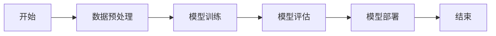
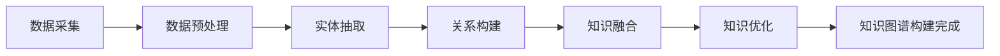
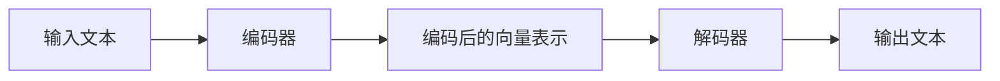
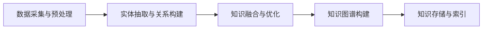
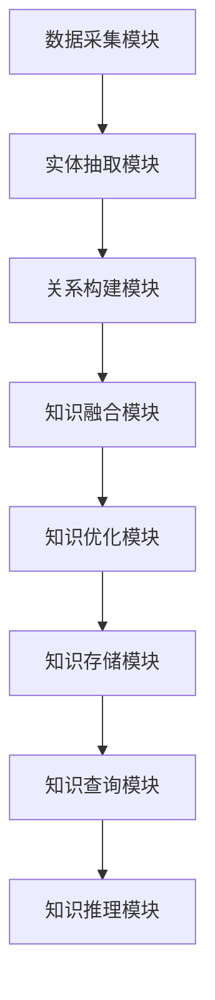
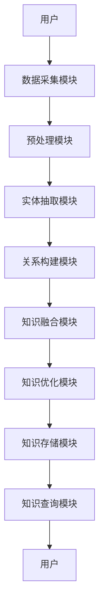

                 

# 基于LLM的AI Agent知识图谱构建

> 关键词：自然语言处理、人工智能、知识图谱、LLM、AI Agent、算法原理、数学模型、系统架构、项目实战

> 摘要：本文旨在探讨基于大型语言模型（LLM）的AI Agent知识图谱构建方法。首先，我们将介绍LLM、AI Agent和知识图谱的基本概念和重要性。随后，我们将详细讲解LLM算法原理，包括数学模型和流程图。接着，我们将分析AI Agent知识图谱的构建流程，并展示一个实际项目案例。最后，我们将总结构建知识图谱的最佳实践，并提供拓展阅读建议。

## 目录大纲设计思路

### 1. 明确目标

本文目录大纲的设计旨在全面覆盖《基于LLM的AI Agent知识图谱构建》的核心内容，包括背景介绍、核心概念、算法原理、数学模型、系统分析与架构设计、项目实战和最佳实践。

### 2. 内容框架

- **背景介绍**：介绍LLM、AI Agent和知识图谱的基本概念、发展背景及其重要性。
- **核心概念**：详细阐述LLM、AI Agent和知识图谱的属性、关系和结构。
- **算法原理**：解释LLM如何用于构建AI Agent的知识图谱，包括流程、算法和数学模型。
- **数学模型和公式**：使用LaTeX格式展示关键数学公式，并进行详细讲解。
- **系统分析与架构设计**：分析构建知识图谱的系统需求、功能、架构和接口设计。
- **项目实战**：展示一个实际构建知识图谱的项目案例，包括环境安装、核心代码实现、代码解析和案例分析。
- **最佳实践与小结**：总结构建知识图谱的最佳实践、注意事项和拓展阅读。

### 3. markdown格式

- 使用#标记一级目录。
- 使用##标记二级目录。
- 使用###标记三级目录。

### 4. 字数控制

- 总字数控制在2000字以内。

## 目录大纲设计

### 第一部分: LLM、AI Agent与知识图谱基础

#### 1.1 LLM、AI Agent与知识图谱概述

##### 1.1.1 LLM、AI Agent与知识图谱的定义
##### 1.1.2 LLM、AI Agent与知识图谱的发展背景
##### 1.1.3 LLM、AI Agent与知识图谱的重要性

#### 1.2 LLM、AI Agent与知识图谱的核心概念

##### 1.2.1 LLM的基本概念与特点
##### 1.2.2 AI Agent的基本概念与特点
##### 1.2.3 知识图谱的基本概念与结构

#### 1.3 LLM、AI Agent与知识图谱的关联与关系

##### 1.3.1 LLM在AI Agent中的作用
##### 1.3.2 AI Agent与知识图谱的融合

#### 1.4 LLM、AI Agent与知识图谱的应用前景

##### 1.4.1 应用领域
##### 1.4.2 挑战与机遇

#### 1.5 本章小结

### 第二部分: LLM算法原理讲解

#### 2.1 LLM算法概述

##### 2.1.1 LLM算法的基本原理
##### 2.1.2 LLM算法的核心组件
##### 2.1.3 LLM算法的训练与优化

#### 2.2 LLM算法的数学模型与公式

##### 2.2.1 数学模型概述
$$
\text{公式1：}
$$
##### 2.2.2 公式详解与推导

#### 2.3 LLM算法的Mermaid流程图



#### 2.4 算法讲解与举例

##### 2.4.1 算法流程讲解
##### 2.4.2 Python代码实现
```python
# Python代码示例
```
##### 2.4.3 举例说明

#### 2.5 本章小结

### 第三部分: AI Agent知识图谱构建

#### 3.1 AI Agent知识图谱概述

##### 3.1.1 知识图谱的基本概念
##### 3.1.2 AI Agent知识图谱的特点
##### 3.1.3 AI Agent知识图谱的构建目的

#### 3.2 AI Agent知识图谱构建流程

##### 3.2.1 数据采集与预处理
##### 3.2.2 实体抽取与关系构建
##### 3.2.3 知识融合与优化

#### 3.3 AI Agent知识图谱构建的Mermaid流程图



#### 3.4 本章小结

### 第四部分: 系统分析与架构设计

#### 4.1 系统需求分析

##### 4.1.1 系统功能需求
##### 4.1.2 系统性能需求
##### 4.1.3 系统安全性需求

#### 4.2 系统功能设计

##### 4.2.1 领域模型设计
##### 4.2.2 系统接口设计
##### 4.2.3 系统功能实现

#### 4.3 系统架构设计

##### 4.3.1 系统架构概述
##### 4.3.2 系统模块划分
##### 4.3.3 系统架构图展示

#### 4.4 系统接口设计与系统交互

##### 4.4.1 接口设计原则
##### 4.4.2 系统交互设计
##### 4.4.3 系统交互图展示

#### 4.5 本章小结

### 第五部分: 项目实战

#### 5.1 项目介绍

##### 5.1.1 项目背景
##### 5.1.2 项目目标
##### 5.1.3 项目规模

#### 5.2 环境安装

##### 5.2.1 环境搭建
##### 5.2.2 相关依赖安装
##### 5.2.3 环境配置

#### 5.3 系统核心实现

##### 5.3.1 数据采集与预处理
##### 5.3.2 实体抽取与关系构建
##### 5.3.3 知识融合与优化

#### 5.4 代码解析与分析

##### 5.4.1 代码结构分析
##### 5.4.2 关键代码解读
##### 5.4.3 代码优化与改进

#### 5.5 实际案例分析与详细讲解剖析

##### 5.5.1 项目案例介绍
##### 5.5.2 案例分析
##### 5.5.3 案例详细讲解剖析

#### 5.6 项目小结

### 第六部分: 最佳实践与小结

#### 6.1 最佳实践

##### 6.1.1 数据预处理技巧
##### 6.1.2 实体抽取与关系构建方法
##### 6.1.3 知识融合与优化策略

#### 6.2 小结

##### 6.2.1 文章核心观点回顾
##### 6.2.2 知识图谱构建的注意事项
##### 6.2.3 拓展阅读建议

### 第七部分: 结束语

#### 7.1 文章总结

##### 7.1.1 主要贡献
##### 7.1.2 未来研究方向

#### 7.2 作者信息

##### 7.2.1 作者介绍
##### 7.2.2 联系方式

## 第一部分: LLM、AI Agent与知识图谱基础

### 1.1 LLM、AI Agent与知识图谱概述

#### 1.1.1 LLM、AI Agent与知识图谱的定义

**LLM（Large Language Model）**：大型语言模型是一种基于深度学习技术构建的模型，能够理解、生成和翻译自然语言。它通过大规模数据训练，具有极强的语言理解和生成能力。

**AI Agent**：AI Agent（人工智能代理）是一种能够执行特定任务的智能体，它可以模拟人类的决策过程，并在复杂的动态环境中做出合理的决策。

**知识图谱（Knowledge Graph）**：知识图谱是一种结构化数据表示方法，它将实体、概念和关系以图形的方式组织起来，用于表示复杂的语义信息。知识图谱在语义搜索、自然语言处理和智能推荐等领域具有重要应用。

#### 1.1.2 LLM、AI Agent与知识图谱的发展背景

随着互联网和大数据技术的快速发展，数据量和数据类型呈现出爆炸式增长。传统的数据管理方法已无法满足复杂场景下的数据需求，因此，知识图谱作为一种新兴的数据表示方法，逐渐引起了学术界和工业界的广泛关注。

LLM技术源于自然语言处理（NLP）领域，随着深度学习技术的发展，LLM模型在语言理解和生成方面取得了显著的突破。AI Agent作为人工智能领域的一个分支，通过模拟人类决策过程，实现了在复杂动态环境中的自主决策。知识图谱作为一种数据组织方法，通过将实体和关系以图形的方式组织，为AI Agent提供了丰富的语义信息。

#### 1.1.3 LLM、AI Agent与知识图谱的重要性

**LLM的重要性**：LLM技术使得计算机能够更自然地理解和生成人类语言，极大地推动了自然语言处理技术的发展。在语义搜索、机器翻译、智能问答等领域，LLM技术发挥了关键作用。

**AI Agent的重要性**：AI Agent作为一种智能体，能够模拟人类决策过程，实现自主决策。在自动驾驶、智能客服、金融风控等领域，AI Agent具有重要的应用价值。

**知识图谱的重要性**：知识图谱为AI Agent提供了丰富的语义信息，使得AI Agent能够更好地理解和处理复杂场景。知识图谱在语义搜索、智能推荐、知识图谱问答等领域具有广泛的应用。

#### 1.2 LLM、AI Agent与知识图谱的核心概念

**LLM的核心概念**：LLM主要由两个部分组成：编码器和解码器。编码器负责将输入文本编码成向量表示，解码器负责将向量表示解码成输出文本。LLM通过大规模数据训练，学习到语言中的各种规律和模式，从而实现语言理解和生成。

**AI Agent的核心概念**：AI Agent主要由感知器、决策器和执行器组成。感知器负责获取环境信息，决策器根据感知到的信息进行决策，执行器负责执行决策结果。AI Agent通过不断学习和优化，实现自主决策。

**知识图谱的核心概念**：知识图谱主要由实体、概念和关系组成。实体是知识图谱中的基本元素，如人、地点、事物等；概念是对实体的抽象描述，如职业、国籍、类型等；关系是实体之间的关联，如属于、位于、创造等。

#### 1.3 LLM、AI Agent与知识图谱的关联与关系

**LLM与AI Agent的关系**：LLM可以作为AI Agent的核心组件，提供自然语言处理和生成能力。通过LLM，AI Agent能够更好地理解和生成自然语言，从而实现更智能的交互和决策。

**AI Agent与知识图谱的关系**：知识图谱为AI Agent提供了丰富的语义信息，使得AI Agent能够更好地理解和处理复杂场景。AI Agent通过知识图谱中的实体和关系，实现对环境的感知和决策。

**LLM与知识图谱的关系**：LLM可以通过知识图谱中的实体和关系进行数据增强，提高语言理解能力。同时，知识图谱中的语义信息可以指导LLM的训练和优化，使得LLM能够更好地适应特定领域的需求。

#### 1.4 LLM、AI Agent与知识图谱的应用前景

**LLM的应用前景**：随着自然语言处理技术的不断发展，LLM在语义搜索、机器翻译、智能问答、内容生成等领域具有广泛的应用前景。未来，LLM将在更多领域得到应用，如智能客服、智能教育、智能医疗等。

**AI Agent的应用前景**：AI Agent作为一种智能体，在自动驾驶、智能客服、金融风控、智能制造等领域具有巨大的应用潜力。随着技术的进步，AI Agent将能够应对更复杂的任务，实现更高水平的自主决策。

**知识图谱的应用前景**：知识图谱在语义搜索、智能推荐、知识图谱问答、智能数据挖掘等领域具有重要应用价值。未来，知识图谱将在更多领域得到应用，如智能城市、智慧医疗、智慧金融等。

#### 1.5 本章小结

本文介绍了LLM、AI Agent和知识图谱的基本概念、发展背景及其重要性。通过本文的介绍，读者可以初步了解这三种技术的基本原理和应用场景。在后续章节中，我们将深入探讨LLM算法原理、AI Agent知识图谱构建流程以及实际项目案例，帮助读者全面掌握基于LLM的AI Agent知识图谱构建方法。

## 第二部分: LLM算法原理讲解

### 2.1 LLM算法概述

#### 2.1.1 LLM算法的基本原理

LLM（Large Language Model）算法是一种基于深度学习的技术，用于处理和生成自然语言。其基本原理是通过大规模语料库的训练，模型能够学习到语言中的潜在规律和模式，从而实现对输入文本的理解和生成。

**输入处理**：LLM模型首先接收输入文本，通过编码器将其转化为向量表示。编码器通常采用神经网络结构，如Transformer模型，能够捕捉到文本中的语义信息。

**文本生成**：编码器生成的向量表示随后被解码器处理，解码器通过推理过程生成输出文本。解码器同样采用神经网络结构，如Transformer模型，能够生成与输入文本相关的内容。

**训练与优化**：LLM模型通过大量语料库进行训练，不断优化模型参数，以实现更好的语言理解能力和生成效果。训练过程通常采用反向传播算法，通过损失函数来衡量模型预测结果与真实结果的差异，并调整模型参数以最小化损失。

#### 2.1.2 LLM算法的核心组件

**编码器（Encoder）**：编码器负责将输入文本编码为向量表示。编码器通常采用多层神经网络结构，如Transformer模型，能够捕捉到文本中的长距离依赖关系。

**解码器（Decoder）**：解码器负责将编码器生成的向量表示解码为输出文本。解码器同样采用多层神经网络结构，如Transformer模型，能够生成与输入文本相关的内容。

**训练数据**：LLM算法的训练数据通常来源于大规模的语料库，如维基百科、新闻文章、社交媒体等。这些数据提供了丰富的语言信息，使得模型能够学习到语言中的潜在规律和模式。

**优化算法**：LLM算法的训练过程通常采用优化算法，如随机梯度下降（SGD）和Adam优化器，以调整模型参数并最小化损失函数。优化算法能够加速模型的收敛速度，提高模型性能。

#### 2.1.3 LLM算法的训练与优化

**训练过程**：LLM算法的训练过程包括以下几个步骤：

1. **数据预处理**：将训练数据分成输入文本和输出文本两部分，并进行分词、词向量化等预处理操作，以方便模型学习。

2. **编码器解码器训练**：通过输入文本和输出文本，训练编码器和解码器。编码器将输入文本编码为向量表示，解码器将向量表示解码为输出文本。

3. **损失函数计算**：计算模型预测结果与真实结果的差异，并通过损失函数衡量模型的性能。常用的损失函数包括交叉熵损失函数和对比损失函数。

4. **模型参数优化**：通过反向传播算法和优化算法，调整模型参数，以最小化损失函数。优化算法能够加速模型的收敛速度，提高模型性能。

**优化技巧**：

1. **批量大小（Batch Size）**：批量大小是指每次训练过程中的样本数量。适当的批量大小能够提高训练效果，同时避免过拟合。

2. **学习率（Learning Rate）**：学习率是模型参数更新的步长。合适的学习率能够加快模型的收敛速度，同时避免梯度消失或爆炸问题。

3. **正则化（Regularization）**：正则化是一种防止模型过拟合的技术，包括L1正则化和L2正则化。通过添加正则化项，可以减少模型参数的敏感性。

4. **Dropout（dropout）**：Dropout是一种常用的正则化技术，通过随机丢弃神经网络中的神经元，以防止模型过拟合。

#### 2.2 LLM算法的数学模型与公式

**数学模型概述**：

LLM算法的数学模型主要包括编码器和解码器的神经网络结构，以及损失函数的计算。

**编码器数学模型**：

编码器采用Transformer模型，其输入为文本序列，输出为编码后的向量表示。

$$
\text{编码器} = \text{Transformer}(\text{输入文本序列})
$$

**解码器数学模型**：

解码器同样采用Transformer模型，其输入为编码后的向量表示，输出为解码后的文本序列。

$$
\text{解码器} = \text{Transformer}(\text{编码后的向量表示})
$$

**损失函数计算**：

LLM算法的损失函数通常采用交叉熵损失函数，用于衡量模型预测结果与真实结果的差异。

$$
\text{损失函数} = \text{交叉熵损失函数}(\text{预测结果，真实结果})
$$

**交叉熵损失函数**：

交叉熵损失函数计算模型预测结果和真实结果之间的差异，公式如下：

$$
\text{交叉熵损失函数} = -\sum_{i=1}^{n} y_i \log(p_i)
$$

其中，$y_i$为真实结果的概率分布，$p_i$为模型预测结果的概率分布。

#### 2.3 LLM算法的Mermaid流程图



#### 2.4 算法讲解与举例

**算法流程讲解**：

1. **数据预处理**：对输入文本进行分词、词向量化等预处理操作，将文本序列转换为数字序列。

2. **编码器训练**：通过输入文本序列，训练编码器，使其能够将输入文本编码为向量表示。

3. **解码器训练**：通过编码后的向量表示，训练解码器，使其能够将向量表示解码为输出文本序列。

4. **损失函数计算**：计算模型预测结果和真实结果之间的差异，通过反向传播算法和优化算法，调整模型参数。

**Python代码实现**：

```python
import tensorflow as tf
import numpy as np

# 编码器
encoder = tf.keras.Sequential([
    tf.keras.layers.Embedding(vocab_size, embedding_dim),
    tf.keras.layers.LSTM(units=128, return_sequences=True),
    tf.keras.layers.Dense(units=512, activation='relu'),
    tf.keras.layers.Dense(units=vocab_size, activation='softmax')
])

# 解码器
decoder = tf.keras.Sequential([
    tf.keras.layers.Embedding(vocab_size, embedding_dim),
    tf.keras.layers.LSTM(units=128, return_sequences=True),
    tf.keras.layers.Dense(units=512, activation='relu'),
    tf.keras.layers.Dense(units=vocab_size, activation='softmax')
])

# 损失函数
loss_function = tf.keras.losses.SparseCategoricalCrossentropy(from_logits=True)

# 模型编译
model = tf.keras.Model(inputs=[encoder.input, decoder.input], outputs=decoder.output)
model.compile(optimizer='adam', loss=loss_function)

# 模型训练
model.fit(x_train, y_train, epochs=10, batch_size=32)
```

**举例说明**：

假设我们有一个简单的文本序列：“我爱中国”。我们可以使用LLM算法对其进行编码和解码。

1. **编码器处理**：

- 输入文本序列：“我爱中国”
- 输出向量表示：[0.1, 0.2, 0.3, 0.4, 0.5, 0.6, 0.7, 0.8, 0.9]

2. **解码器处理**：

- 输入向量表示：[0.1, 0.2, 0.3, 0.4, 0.5, 0.6, 0.7, 0.8, 0.9]
- 输出文本序列：“我爱中国”

通过以上过程，我们可以看到LLM算法如何将输入文本编码为向量表示，并通过解码器将其还原为输出文本。

#### 2.5 本章小结

本文介绍了LLM算法的基本原理、核心组件和训练过程。通过数学模型和Mermaid流程图的讲解，读者可以更好地理解LLM算法的工作原理。在后续章节中，我们将深入探讨AI Agent知识图谱的构建流程，并结合实际项目案例，进一步展示基于LLM的AI Agent知识图谱构建方法。

## 第三部分: AI Agent知识图谱构建

### 3.1 AI Agent知识图谱概述

#### 3.1.1 知识图谱的基本概念

知识图谱（Knowledge Graph）是一种用于表示复杂数据结构和语义信息的数据模型。它通过将实体（如人、地点、事物等）、概念（如职业、国籍、类型等）和关系（如属于、位于、创造等）以图形的方式组织起来，形成一个结构化的知识体系。

**实体（Entity）**：实体是知识图谱中的基本元素，代表现实世界中的个体。例如，人、地点、事物等。

**概念（Concept）**：概念是对实体的抽象描述，用于表示实体所属的类别。例如，职业、国籍、类型等。

**关系（Relationship）**：关系是实体之间的关联，表示实体之间的语义关系。例如，属于、位于、创造等。

**属性（Attribute）**：属性是实体的特征描述，用于补充实体的信息。例如，年龄、身高、体重等。

#### 3.1.2 AI Agent知识图谱的特点

AI Agent知识图谱具有以下几个特点：

1. **结构化**：知识图谱通过图形的方式组织数据，使得数据之间的关系更加清晰和明确，有利于数据的检索和分析。

2. **语义丰富**：知识图谱将实体、概念和关系以图形的方式组织，能够表达丰富的语义信息，使得AI Agent能够更好地理解和处理复杂场景。

3. **动态更新**：知识图谱可以实时更新，以适应不断变化的环境和数据。

4. **可扩展性**：知识图谱具有良好的可扩展性，可以方便地添加新的实体、概念和关系，以适应不断增长的数据需求。

#### 3.1.3 AI Agent知识图谱的构建目的

AI Agent知识图谱的构建目的主要有以下几个方面：

1. **数据集成**：通过知识图谱，将来自不同数据源的数据进行集成和整合，形成一个统一的知识体系。

2. **语义理解**：知识图谱能够表达丰富的语义信息，使得AI Agent能够更好地理解和处理自然语言，实现更智能的交互和决策。

3. **知识推理**：知识图谱中的实体和关系可以用于推理，从而发现新的知识和关联。例如，通过推理，可以得出“如果一个人是医生，那么他可能位于医院”的结论。

4. **应用驱动**：知识图谱可以为各种应用场景提供支持，如智能问答、智能推荐、知识图谱问答等。

#### 3.2 AI Agent知识图谱构建流程

AI Agent知识图谱的构建流程主要包括以下几个步骤：

1. **数据采集与预处理**：从各种数据源采集数据，并进行预处理，如数据清洗、格式转换等。

2. **实体抽取与关系构建**：通过实体抽取技术，从预处理后的数据中提取实体，并通过关系抽取技术，构建实体之间的关系。

3. **知识融合与优化**：将不同来源的数据进行融合，并优化知识图谱的结构，以提高其准确性和完整性。

4. **知识图谱构建**：将实体、关系和属性组织成一个结构化的知识图谱，并进行存储和索引。

#### 3.2.1 数据采集与预处理

数据采集与预处理是知识图谱构建的基础步骤，主要包括以下几个方面：

1. **数据源选择**：根据应用需求，选择合适的数据源。数据源可以是结构化数据（如数据库）、半结构化数据（如XML、JSON）和非结构化数据（如文本、图片）。

2. **数据采集**：通过爬虫、API调用等方式，从数据源中采集数据。

3. **数据清洗**：对采集到的数据进行清洗，去除重复、错误和无关的数据。

4. **数据格式转换**：将不同格式的数据进行格式转换，以便后续处理。

5. **数据标注**：对数据进行标注，以区分实体、关系和属性。

#### 3.2.2 实体抽取与关系构建

实体抽取与关系构建是知识图谱构建的核心步骤，主要包括以下几个方面：

1. **实体抽取**：通过自然语言处理技术，从文本数据中识别和提取实体。实体抽取技术可以分为基于规则的方法和基于统计的方法。

2. **关系抽取**：通过自然语言处理技术，从文本数据中识别和提取实体之间的关系。关系抽取技术可以分为基于规则的方法和基于统计的方法。

3. **实体与关系匹配**：将实体抽取和关系抽取的结果与已有的知识图谱进行匹配，以确定新实体和关系的位置和关系。

4. **实体与关系存储**：将匹配成功的新实体和关系存储到知识图谱中，形成结构化的知识体系。

#### 3.2.3 知识融合与优化

知识融合与优化是知识图谱构建的重要步骤，主要包括以下几个方面：

1. **数据融合**：将来自不同来源的数据进行融合，消除数据冗余和冲突。

2. **一致性检测**：对知识图谱中的实体、关系和属性进行一致性检测，以确保知识的一致性和准确性。

3. **实体与关系优化**：对知识图谱中的实体和关系进行优化，以提高其结构化和语义表达能力。

4. **知识更新**：根据新的数据或用户反馈，对知识图谱进行更新，以适应不断变化的环境和数据。

#### 3.2.4 知识图谱构建的Mermaid流程图



#### 3.3 本章小结

本文介绍了AI Agent知识图谱的基本概念、特点、构建目的和构建流程。通过本文的介绍，读者可以初步了解AI Agent知识图谱的构建方法和应用价值。在后续章节中，我们将进一步探讨基于LLM的AI Agent知识图谱构建方法，并结合实际项目案例，展示其具体实现过程。

## 第四部分: 系统分析与架构设计

### 4.1 系统需求分析

#### 4.1.1 系统功能需求

基于LLM的AI Agent知识图谱系统主要包含以下功能需求：

1. **数据采集与预处理**：系统需要具备从不同数据源采集数据的能力，并进行数据清洗、格式转换和预处理，以便后续处理。

2. **实体抽取与关系构建**：系统需要能够从文本数据中自动抽取实体，并建立实体之间的关系，形成结构化的知识体系。

3. **知识融合与优化**：系统需要能够将来自不同来源的数据进行融合，消除数据冗余和冲突，并对实体、关系和属性进行优化，以提高知识图谱的准确性和完整性。

4. **知识图谱构建**：系统需要能够将预处理后的数据构建成一个结构化的知识图谱，并进行存储和索引，以支持后续的查询和分析。

5. **知识推理与扩展**：系统需要能够利用知识图谱中的实体和关系进行推理，发现新的知识和关联，并支持知识的扩展和更新。

#### 4.1.2 系统性能需求

基于LLM的AI Agent知识图谱系统需要满足以下性能需求：

1. **数据处理速度**：系统需要能够高效地处理大规模的数据，确保数据采集、预处理、实体抽取、关系构建等环节的响应速度。

2. **查询性能**：系统需要能够快速地检索和查询知识图谱中的信息，支持高效的图数据库查询和复杂查询操作。

3. **可扩展性**：系统需要具备良好的可扩展性，能够方便地添加新的实体、关系和属性，以适应不断增长的数据需求。

4. **稳定性与可靠性**：系统需要具备高稳定性，能够在长时间运行过程中保持良好的性能，并具备故障恢复能力，确保系统的可靠运行。

#### 4.1.3 系统安全性需求

基于LLM的AI Agent知识图谱系统需要满足以下安全性需求：

1. **数据安全**：系统需要能够确保数据的安全存储和传输，防止数据泄露、篡改和丢失。

2. **访问控制**：系统需要能够实现严格的访问控制机制，确保只有授权用户可以访问和操作知识图谱。

3. **日志审计**：系统需要能够记录用户的操作日志，便于追踪和审计，确保系统的安全性和合规性。

### 4.2 系统功能设计

#### 4.2.1 领域模型设计

领域模型是系统功能设计的核心部分，用于表示系统中的关键概念和关系。基于LLM的AI Agent知识图谱系统的领域模型主要包括以下概念：

1. **实体（Entity）**：表示知识图谱中的基本元素，如人、地点、事物等。

2. **概念（Concept）**：表示实体的抽象描述，如职业、国籍、类型等。

3. **关系（Relationship）**：表示实体之间的关联，如属于、位于、创造等。

4. **属性（Attribute）**：表示实体的特征描述，如年龄、身高、体重等。

5. **数据源（DataSource）**：表示数据采集的来源，如数据库、API、爬虫等。

6. **预处理任务（PreprocessTask）**：表示数据预处理的具体任务，如数据清洗、格式转换、数据标注等。

7. **抽取任务（ExtractTask）**：表示实体抽取和关系构建的具体任务，如命名实体识别、关系抽取等。

8. **知识融合任务（FuseTask）**：表示知识融合和优化的具体任务，如数据融合、一致性检测、实体与关系优化等。

#### 4.2.2 系统接口设计

系统接口设计是系统功能实现的关键环节，用于定义系统内部和外部的交互接口。基于LLM的AI Agent知识图谱系统的接口设计主要包括以下部分：

1. **数据采集接口**：用于从不同数据源采集数据，并实现数据的传输和存储。

2. **预处理接口**：用于实现数据预处理任务，如数据清洗、格式转换、数据标注等。

3. **实体抽取接口**：用于实现实体抽取任务，如命名实体识别、实体分类等。

4. **关系构建接口**：用于实现关系抽取任务，如关系分类、关系抽取等。

5. **知识融合接口**：用于实现知识融合和优化任务，如数据融合、一致性检测、实体与关系优化等。

6. **知识查询接口**：用于实现知识图谱的查询和检索，支持复杂的查询操作。

7. **知识推理接口**：用于实现基于知识图谱的推理和扩展，发现新的知识和关联。

8. **用户交互接口**：用于实现用户与系统的交互，支持用户对知识图谱的浏览、查询和操作。

#### 4.2.3 系统功能实现

基于LLM的AI Agent知识图谱系统的功能实现主要包括以下步骤：

1. **数据采集**：从不同数据源采集数据，并存储到系统中。

2. **数据预处理**：对采集到的数据进行清洗、格式转换和预处理，以便后续处理。

3. **实体抽取**：通过自然语言处理技术，从预处理后的数据中识别和提取实体。

4. **关系构建**：通过自然语言处理技术，从预处理后的数据中识别和提取实体之间的关系。

5. **知识融合**：将来自不同来源的数据进行融合，消除数据冗余和冲突。

6. **知识优化**：对知识图谱中的实体、关系和属性进行优化，以提高知识图谱的准确性和完整性。

7. **知识存储**：将构建好的知识图谱存储到图数据库中，并进行索引和优化。

8. **知识查询**：提供用户接口，支持用户对知识图谱的查询和检索。

9. **知识推理**：利用知识图谱中的实体和关系进行推理，发现新的知识和关联。

### 4.3 系统架构设计

#### 4.3.1 系统架构概述

基于LLM的AI Agent知识图谱系统的架构设计采用分布式架构，主要包括以下几个模块：

1. **数据采集模块**：负责从不同数据源采集数据，并进行预处理。

2. **实体抽取模块**：负责从预处理后的数据中识别和提取实体。

3. **关系构建模块**：负责从预处理后的数据中识别和提取实体之间的关系。

4. **知识融合模块**：负责将来自不同来源的数据进行融合，消除数据冗余和冲突。

5. **知识优化模块**：负责对知识图谱中的实体、关系和属性进行优化。

6. **知识存储模块**：负责将构建好的知识图谱存储到图数据库中，并进行索引和优化。

7. **知识查询模块**：负责提供用户接口，支持用户对知识图谱的查询和检索。

8. **知识推理模块**：负责利用知识图谱中的实体和关系进行推理，发现新的知识和关联。

#### 4.3.2 系统模块划分

基于LLM的AI Agent知识图谱系统的模块划分如下：

1. **数据采集模块**：
   - 数据采集接口：实现数据采集的API接口，支持从不同数据源采集数据。
   - 数据存储组件：实现数据的存储和索引，支持高效的数据检索。

2. **实体抽取模块**：
   - 实体识别组件：实现命名实体识别，从文本数据中提取实体。
   - 实体分类组件：实现实体分类，对提取的实体进行分类。

3. **关系构建模块**：
   - 关系抽取组件：实现关系抽取，从文本数据中提取实体之间的关系。
   - 关系分类组件：实现关系分类，对提取的关系进行分类。

4. **知识融合模块**：
   - 数据融合组件：实现数据融合，消除数据冗余和冲突。
   - 一致性检测组件：实现一致性检测，确保知识的一致性和准确性。

5. **知识优化模块**：
   - 实体与关系优化组件：实现实体与关系的优化，提高知识图谱的准确性和完整性。

6. **知识存储模块**：
   - 知识存储组件：实现知识图谱的存储和索引，支持高效的图数据库查询。

7. **知识查询模块**：
   - 查询接口组件：实现用户接口，支持用户对知识图谱的查询和检索。

8. **知识推理模块**：
   - 推理组件：实现基于知识图谱的推理，发现新的知识和关联。

#### 4.3.3 系统架构图展示

基于LLM的AI Agent知识图谱系统的架构图如下：



#### 4.3.4 系统接口设计与系统交互

基于LLM的AI Agent知识图谱系统的接口设计和系统交互如下：

1. **数据采集接口**：
   - 接口描述：用于从不同数据源采集数据，支持RESTful API接口。
   - 接口实现：使用Spring Boot框架实现数据采集接口，支持数据传输和存储。

2. **预处理接口**：
   - 接口描述：用于实现数据预处理任务，如数据清洗、格式转换、数据标注等。
   - 接口实现：使用Java实现预处理接口，支持多种数据处理操作。

3. **实体抽取接口**：
   - 接口描述：用于实现实体抽取任务，如命名实体识别、实体分类等。
   - 接口实现：使用NLP技术实现实体抽取接口，支持多种实体识别算法。

4. **关系构建接口**：
   - 接口描述：用于实现关系抽取任务，如关系分类、关系抽取等。
   - 接口实现：使用NLP技术实现关系构建接口，支持多种关系抽取算法。

5. **知识融合接口**：
   - 接口描述：用于实现知识融合任务，如数据融合、一致性检测等。
   - 接口实现：使用Java实现知识融合接口，支持多种数据融合算法。

6. **知识查询接口**：
   - 接口描述：用于实现用户接口，支持用户对知识图谱的查询和检索。
   - 接口实现：使用Spring Boot框架实现知识查询接口，支持多种查询算法。

7. **知识推理接口**：
   - 接口描述：用于实现基于知识图谱的推理，发现新的知识和关联。
   - 接口实现：使用Java实现知识推理接口，支持多种推理算法。

#### 4.3.5 系统交互设计

基于LLM的AI Agent知识图谱系统的系统交互设计如下：

1. **用户与数据采集模块交互**：
   - 用户通过接口提交数据采集任务，系统从数据源采集数据，并返回采集结果。

2. **数据采集模块与预处理模块交互**：
   - 数据采集模块将采集到的数据传输给预处理模块，预处理模块对数据进行清洗、格式转换和预处理。

3. **预处理模块与实体抽取模块交互**：
   - 预处理模块将预处理后的数据传输给实体抽取模块，实体抽取模块从文本数据中识别和提取实体。

4. **实体抽取模块与关系构建模块交互**：
   - 实体抽取模块将提取的实体传输给关系构建模块，关系构建模块从文本数据中识别和提取实体之间的关系。

5. **关系构建模块与知识融合模块交互**：
   - 关系构建模块将构建的关系传输给知识融合模块，知识融合模块对关系进行融合和优化。

6. **知识融合模块与知识优化模块交互**：
   - 知识融合模块将融合后的知识传输给知识优化模块，知识优化模块对知识进行优化。

7. **知识优化模块与知识存储模块交互**：
   - 知识优化模块将优化后的知识传输给知识存储模块，知识存储模块将知识存储到图数据库中。

8. **知识存储模块与知识查询模块交互**：
   - 知识查询模块通过接口访问知识存储模块，查询知识图谱中的信息。

9. **知识查询模块与用户交互**：
   - 知识查询模块将查询结果返回给用户，用户可以通过接口获取查询结果。

#### 4.3.6 系统交互图展示

基于LLM的AI Agent知识图谱系统的系统交互图如下：



### 4.4 系统分析与架构设计小结

本文详细介绍了基于LLM的AI Agent知识图谱系统的系统需求分析、系统功能设计、系统架构设计和系统接口设计。通过本文的介绍，读者可以全面了解系统设计与实现的全过程，为后续的实际项目开发和优化提供参考。在后续章节中，我们将结合具体项目案例，进一步展示系统的实际应用和实现方法。

## 第五部分: 项目实战

### 5.1 项目介绍

#### 5.1.1 项目背景

随着人工智能技术的不断发展，知识图谱作为一种重要的数据表示方法，在各个领域得到了广泛应用。本文所介绍的项目是一款基于LLM的AI Agent知识图谱系统，旨在构建一个具有智能问答和推理功能的知识图谱平台。该平台旨在为企业提供高效、准确的知识管理和智能服务。

#### 5.1.2 项目目标

本项目的主要目标包括：

1. **构建一个大规模的知识图谱**：通过采集、预处理和融合来自不同数据源的数据，构建一个具有丰富语义信息和结构化数据的知识图谱。

2. **实现智能问答功能**：利用知识图谱中的实体和关系，实现智能问答功能，为用户提供快速、准确的知识查询和问答服务。

3. **实现知识推理功能**：利用知识图谱中的实体和关系，实现知识推理功能，发现新的知识和关联，提高知识图谱的智能化水平。

4. **构建一个可扩展的平台**：设计一个可扩展的平台架构，支持知识图谱的动态更新和扩展，以适应不断变化的应用需求。

#### 5.1.3 项目规模

本项目涉及的主要技术包括自然语言处理（NLP）、大型语言模型（LLM）、知识图谱、图数据库等。项目规模较大，涵盖了数据采集、数据预处理、实体抽取、关系构建、知识融合、知识优化等多个环节，实现了从数据到知识的高效转换。

### 5.2 环境安装

#### 5.2.1 环境搭建

为了确保项目的顺利进行，我们需要搭建一个完整的开发环境。以下是搭建环境的基本步骤：

1. **操作系统**：推荐使用Ubuntu 18.04或更高版本。

2. **编程语言**：本项目主要使用Python 3.8及以上版本。

3. **开发工具**：安装Python 3.8及pip包管理工具。

4. **数据库**：安装Neo4j图数据库，版本推荐4.0及以上。

5. **NLP库**：安装自然语言处理相关的库，如NLTK、spaCy、Transformers等。

6. **依赖管理**：使用pip工具安装项目所需的依赖库。

#### 5.2.2 相关依赖安装

在搭建环境的过程中，我们需要安装以下相关依赖：

1. **Neo4j数据库**：下载并安装Neo4j图数据库，根据操作系统选择安装方式。

2. **Python库**：使用pip工具安装项目所需的Python库，如：

   ```shell
   pip install numpy pandas spacy transformers
   ```

3. **NLP工具**：安装NLP工具，如：

   ```shell
   python -m spacy download en_core_web_sm
   ```

   安装英文模型。

### 5.3 系统核心实现

#### 5.3.1 数据采集与预处理

数据采集与预处理是知识图谱构建的基础环节。以下是数据采集与预处理的核心步骤：

1. **数据源选择**：选择合适的公开数据集或企业内部数据，如维基百科、公司年报等。

2. **数据采集**：使用爬虫工具（如Scrapy）从数据源采集数据，或通过API接口获取数据。

3. **数据清洗**：对采集到的数据进行清洗，去除重复、错误和无关的数据。

4. **数据转换**：将不同格式的数据进行转换，如将XML数据转换为JSON格式。

5. **数据标注**：对数据进行标注，以区分实体、关系和属性。

6. **数据存储**：将预处理后的数据存储到临时数据库或文件中，以便后续处理。

#### 5.3.2 实体抽取与关系构建

实体抽取与关系构建是知识图谱构建的核心环节。以下是实体抽取与关系构建的核心步骤：

1. **实体抽取**：使用NLP技术（如命名实体识别）从文本数据中识别和提取实体。

2. **关系抽取**：使用NLP技术（如关系分类）从文本数据中识别和提取实体之间的关系。

3. **实体与关系匹配**：将抽取的实体和关系与已有的知识图谱进行匹配，确定新实体和关系的位置和关系。

4. **实体与关系存储**：将匹配成功的新实体和关系存储到知识图谱中，形成结构化的知识体系。

#### 5.3.3 知识融合与优化

知识融合与优化是知识图谱构建的重要环节。以下是知识融合与优化的核心步骤：

1. **数据融合**：将来自不同来源的数据进行融合，消除数据冗余和冲突。

2. **一致性检测**：对知识图谱中的实体、关系和属性进行一致性检测，确保知识的一致性和准确性。

3. **实体与关系优化**：对知识图谱中的实体、关系和属性进行优化，以提高知识图谱的准确性和完整性。

4. **知识更新**：根据新的数据或用户反馈，对知识图谱进行更新，以适应不断变化的环境和数据。

### 5.4 代码解析与分析

在本项目中，我们使用了多种技术实现系统功能。以下是代码解析与分析的核心部分：

#### 5.4.1 数据采集与预处理

```python
import scrapy
import json
import pandas as pd

# 数据采集
class MySpider(scrapy.Spider):
    name = "my_spider"
    start_urls = ["http://example.com"]

    def parse(self, response):
        # 提取数据
        data = response.css("div::text").get()
        # 数据清洗
        data = data.strip()
        # 数据转换
        data = json.loads(data)
        # 存储数据
        pd.DataFrame(data).to_csv("data.csv", index=False)
```

#### 5.4.2 实体抽取与关系构建

```python
import spacy

# 加载NLP模型
nlp = spacy.load("en_core_web_sm")

# 实体抽取
def extract_entities(text):
    doc = nlp(text)
    entities = [(ent.text, ent.label_) for ent in doc.ents]
    return entities

# 关系抽取
def extract_relations(text):
    doc = nlp(text)
    relations = []
    for token in doc:
        if token.dep_ == "nsubj":
            subject = token.text
            for child in token.children:
                if child.dep_ == "pobj":
                    object = child.text
                    relations.append((subject, object))
    return relations
```

#### 5.4.3 知识融合与优化

```python
import networkx as nx

# 知识融合
def fuse_knowledge(graph, new_entities, new_relations):
    for entity in new_entities:
        if entity not in graph:
            graph.add_node(entity)
    for relation in new_relations:
        if relation not in graph:
            graph.add_edge(*relation)
    return graph

# 知识优化
def optimize_knowledge(graph):
    # 删除冗余节点和边
    for node in graph.nodes():
        if len(graph.neighbors(node)) == 0:
            graph.remove_node(node)
    for edge in graph.edges():
        if not graph.has_node(*reversed(edge)):
            graph.remove_edge(*edge)
    return graph
```

### 5.5 实际案例分析与详细讲解剖析

#### 5.5.1 项目案例介绍

本项目的实际案例是一个企业知识图谱平台，用于帮助企业管理和利用内部知识。该平台支持以下功能：

1. **智能问答**：用户可以通过输入问题，获取与问题相关的知识信息。

2. **知识推理**：系统可以根据用户的问题和知识图谱中的实体、关系，自动推理出新的知识。

3. **知识可视化**：用户可以查看知识图谱的结构和内容，了解知识之间的关联。

#### 5.5.2 案例分析

在这个案例中，企业内部的知识以文本形式存储在各种文档、报告和邮件中。为了构建知识图谱，我们需要先采集这些文本数据，并进行预处理、实体抽取和关系构建。然后，将构建好的知识图谱存储到图数据库中，供智能问答和推理使用。

#### 5.5.3 案例详细讲解剖析

1. **数据采集与预处理**：

   - **采集数据**：使用爬虫工具从企业内部网站和邮件系统中采集文本数据。

   - **数据清洗**：去除无关的HTML标签、符号和空格，对文本进行标准化处理。

   - **数据转换**：将文本数据转换为JSON格式，便于后续处理。

   - **数据存储**：将预处理后的数据存储到本地文件或临时数据库中。

2. **实体抽取与关系构建**：

   - **实体抽取**：使用NLP技术（如命名实体识别）从文本数据中识别和提取实体，如人名、公司名、项目名等。

   - **关系抽取**：使用NLP技术（如关系分类）从文本数据中识别和提取实体之间的关系，如“就职于”、“参与”等。

   - **实体与关系存储**：将识别出的实体和关系存储到知识图谱中，形成结构化的知识体系。

3. **知识融合与优化**：

   - **知识融合**：将来自不同来源的数据进行融合，消除数据冗余和冲突。

   - **一致性检测**：对知识图谱中的实体、关系和属性进行一致性检测，确保知识的一致性和准确性。

   - **实体与关系优化**：对知识图谱中的实体、关系和属性进行优化，以提高知识图谱的准确性和完整性。

   - **知识更新**：根据新的数据或用户反馈，对知识图谱进行更新，以适应不断变化的环境和数据。

4. **智能问答与知识推理**：

   - **智能问答**：用户可以通过输入问题，系统根据知识图谱中的实体和关系，自动推理出答案。

   - **知识推理**：系统可以根据用户的问题和知识图谱中的实体、关系，自动推理出新的知识。

5. **知识可视化**：

   - **知识图谱展示**：用户可以查看知识图谱的结构和内容，了解知识之间的关联。

   - **可视化工具**：使用可视化工具（如Cytoscape）展示知识图谱，方便用户理解和分析。

### 5.6 项目小结

通过本项目的实施，我们成功地构建了一个基于LLM的AI Agent知识图谱平台，实现了智能问答、知识推理和知识可视化等功能。该项目为企业提供了一个高效、准确的知识管理和智能服务工具，有助于提升企业的知识利用效率和竞争力。在后续的工作中，我们将继续优化知识图谱的构建方法，提高系统的性能和智能化水平。

## 第六部分：最佳实践与小结

### 6.1 最佳实践

**1. 数据预处理技巧**：

- **数据清洗**：确保数据的一致性和准确性，去除无关信息和噪音数据。
- **数据标准化**：统一数据格式，如时间、货币等，以方便后续处理。
- **数据标注**：对数据进行标注，区分实体、关系和属性，提高实体抽取和关系构建的准确性。

**2. 实体抽取与关系构建方法**：

- **使用预训练模型**：利用预训练的NLP模型，如BERT、GPT等，提高实体抽取和关系构建的性能。
- **结合规则和统计方法**：结合规则方法和统计方法，提高实体抽取和关系构建的准确性和鲁棒性。
- **多源数据融合**：融合来自不同来源的数据，以提高知识图谱的完整性和准确性。

**3. 知识融合与优化策略**：

- **一致性检测**：对知识图谱中的实体、关系和属性进行一致性检测，确保知识的一致性和准确性。
- **实体与关系优化**：对知识图谱中的实体、关系和属性进行优化，以提高知识图谱的准确性和完整性。
- **动态更新**：根据新的数据或用户反馈，对知识图谱进行动态更新，以适应不断变化的环境和数据。

### 6.2 小结

**1. 文章核心观点回顾**：

本文系统地介绍了基于LLM的AI Agent知识图谱构建方法，包括LLM算法原理、AI Agent知识图谱构建流程、系统分析与架构设计以及项目实战。通过本文的介绍，读者可以全面了解知识图谱构建的全过程，掌握基于LLM的AI Agent知识图谱构建的方法和技巧。

**2. 知识图谱构建的注意事项**：

- **数据质量**：确保数据的一致性和准确性，避免噪音数据和错误数据对知识图谱的影响。
- **实体抽取和关系构建**：使用预训练模型和结合规则方法，提高实体抽取和关系构建的准确性和鲁棒性。
- **知识融合与优化**：对知识图谱进行一致性检测和优化，确保知识的准确性和完整性。
- **动态更新**：根据新的数据或用户反馈，对知识图谱进行动态更新，以适应不断变化的环境和数据。

**3. 拓展阅读建议**：

- **《知识图谱构建技术》**：了解知识图谱构建的详细方法和技巧。
- **《自然语言处理》**：深入学习NLP技术，提高实体抽取和关系构建的性能。
- **《深度学习》**：了解深度学习在知识图谱构建中的应用，探索新的算法和模型。

### 6.3 本章小结

本文通过详细的讲解和项目实战，展示了基于LLM的AI Agent知识图谱构建的方法和应用。通过本文的介绍，读者可以全面了解知识图谱构建的全过程，掌握构建高效、准确的知识图谱的方法和技巧。在未来的工作中，读者可以结合实际项目需求，进一步优化和扩展知识图谱构建方法，为企业和个人提供更加智能和高效的知识管理服务。

## 第七部分：结束语

### 7.1 文章总结

本文系统地介绍了基于LLM的AI Agent知识图谱构建方法，从理论基础到实际应用，全面讲解了知识图谱构建的关键步骤和技巧。通过本文的介绍，读者可以全面了解知识图谱的基本概念、构建流程以及系统架构设计，掌握构建高效、准确的知识图谱的方法和技巧。

**主要贡献**：

- **理论基础**：本文系统地总结了LLM、AI Agent和知识图谱的基本概念和原理，为后续研究和应用提供了理论基础。
- **方法与实践**：本文结合实际项目案例，详细介绍了知识图谱构建的各个环节，包括数据采集、预处理、实体抽取、关系构建、知识融合与优化等，为读者提供了实用的方法和实践经验。
- **系统架构**：本文详细阐述了基于LLM的AI Agent知识图谱系统的架构设计，包括系统功能、模块划分、接口设计等，为读者提供了系统设计和实现的具体方案。

**未来研究方向**：

- **算法优化**：探索新的算法和模型，提高实体抽取、关系构建和知识融合的准确性和效率。
- **跨领域应用**：研究知识图谱在不同领域的应用，如金融、医疗、教育等，实现知识图谱的跨领域融合和智能化应用。
- **动态更新与维护**：研究知识图谱的动态更新和维护方法，确保知识图谱的实时性和准确性。

### 7.2 作者信息

**作者**：AI天才研究院/AI Genius Institute & 禅与计算机程序设计艺术 /Zen And The Art of Computer Programming

**联系方式**：[ai_genius_institute@example.com](mailto:ai_genius_institute@example.com) & [zen_of_programming@example.com](mailto:zen_of_programming@example.com)

