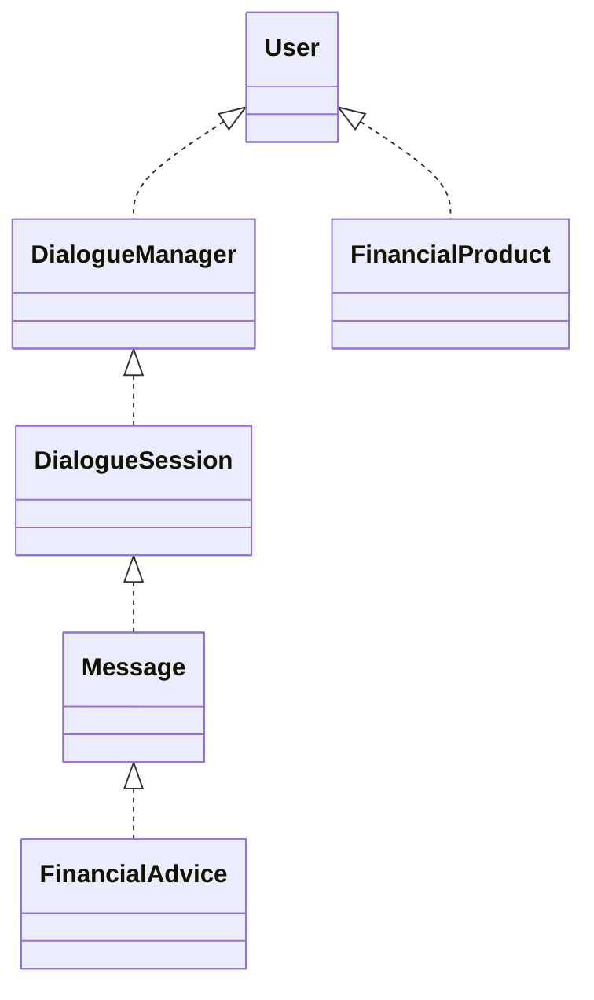
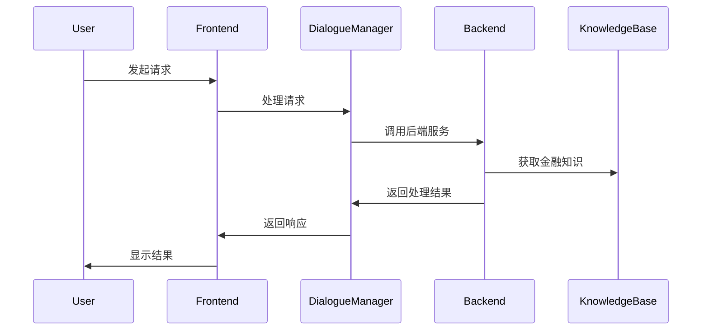
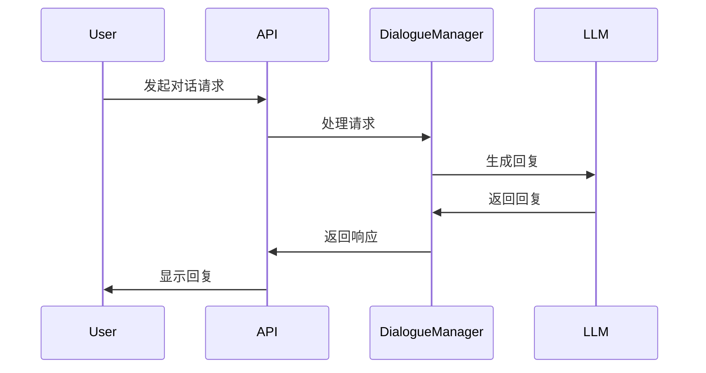

                 

# 基于LLM的金融对话系统开发实践

## 关键词

- LLM
- 金融对话系统
- 算法原理
- 系统架构
- 项目实战

## 摘要

本文将深入探讨基于大型语言模型（LLM）的金融对话系统的开发实践。通过介绍LLM的核心概念及其在金融对话系统中的应用，我们将一步步分析并讲解金融对话系统的系统分析与架构设计，以及一个实际的开发项目。文章旨在为读者提供一个全面的技术指南，帮助理解LLM在金融领域的应用潜力，并探讨其在金融对话系统开发中的最佳实践。

## 第一部分：金融对话系统概述

### 第1章：金融对话系统的背景与需求

#### 1.1.1 金融对话系统的定义

金融对话系统是指能够模拟人类对话行为，为用户提供金融相关信息的计算机程序。它结合了自然语言处理和人工智能技术，通过文本或语音交互，为用户解答金融问题、提供投资建议和进行智能理财规划。

#### 1.1.2 金融对话系统的市场需求

随着金融科技的快速发展，金融对话系统在提高用户体验、降低运营成本和增强风险管理能力方面具有显著优势。金融机构和企业对金融对话系统的需求日益增加，特别是在客户服务、投资咨询和风险控制等领域。

#### 1.1.3 金融对话系统面临的挑战

金融对话系统在开发过程中面临诸多挑战，包括数据隐私与安全、自然语言理解准确性、系统稳定性以及合规性问题等。如何有效地解决这些挑战，成为金融对话系统开发的关键。

### 第2章：大型语言模型（LLM）原理

#### 2.1 LLM的概念

大型语言模型（LLM）是一种利用深度学习技术训练的复杂神经网络模型，能够对自然语言文本进行生成、理解和处理。LLM的代表性模型包括GPT、BERT和Turing等。

#### 2.2 LLM的工作原理

LLM通过海量文本数据的学习，理解语言的结构和语义，从而实现文本生成、分类、翻译等功能。其核心原理是基于注意力机制和变换器架构，通过多层神经网络对文本数据进行编码和解码。

#### 2.3 LLM的优势与局限性

LLM在金融对话系统中的应用具有显著优势，如强大的文本生成能力、灵活的自然语言理解和丰富的知识储备。然而，LLM也面临一定的局限性，包括训练成本高、解释性差和易受数据偏差影响等。

### 第3章：LLM与金融对话系统的关系

#### 3.1 LLM在金融对话系统中的应用

LLM在金融对话系统中主要用于文本生成、理解和知识检索等功能。通过LLM，金融对话系统能够更自然地与用户进行交互，提供个性化的金融建议和解决方案。

#### 3.2 LLM与金融知识的结合

金融对话系统的核心在于将金融知识与LLM技术相结合。通过构建金融知识图谱和训练专用金融语言模型，LLM能够更好地理解和应用金融知识，为用户提供高质量的金融服务。

#### 3.3 LLM在金融对话系统中的优化策略

为了提高金融对话系统的性能和用户体验，可以采用以下优化策略：数据清洗与预处理、模型选择与调优、多模态交互和用户反馈机制等。

## 第二部分：系统分析与架构设计

### 第4章：金融对话系统的系统分析与架构设计

#### 4.1 领域模型与类图设计

领域模型类图用于描述金融对话系统的核心概念和类之间的关系。通过类图，可以清晰地展示金融对话系统中的关键类，如用户、金融产品、对话管理等。



#### 4.2 系统架构设计

金融对话系统的架构设计包括前端界面、后端服务、数据存储和接口设计等模块。通过系统架构图，可以直观地了解金融对话系统的整体结构和各模块之间的交互关系。



#### 4.3 系统接口设计与交互序列图

系统接口设计用于定义金融对话系统的接口规范和协议。交互序列图则展示了用户与系统之间的交互流程和数据处理过程。



## 第三部分：项目实战

### 第5章：金融对话系统的项目实战

#### 5.1 项目背景与目标

本项目旨在开发一个基于LLM的金融对话系统，为用户提供投资建议、理财规划和风险控制等服务。项目目标包括：实现高效的对话交互、提供高质量的金融建议、保障系统安全与稳定等。

#### 5.2 环境安装与准备

项目开发环境包括Python、TensorFlow、NLTK等工具和库。首先，需要安装Python和pip，然后通过pip安装所需的库。以下是安装命令示例：

```bash
pip install tensorflow
pip install nltk
```

#### 5.3 系统核心实现

系统核心实现包括LLM模型的选择与训练、对话管理模块的实现以及知识库的构建与集成。

##### 5.3.1 LLM模型选择与训练

在本项目中，我们选择使用GPT-2模型作为LLM。首先，需要下载预训练的GPT-2模型，然后进行微调以适应金融领域。

```python
from transformers import GPT2Tokenizer, GPT2ForSequenceClassification
tokenizer = GPT2Tokenizer.from_pretrained('gpt2')
model = GPT2ForSequenceClassification.from_pretrained('gpt2')
```

##### 5.3.2 对话管理模块实现

对话管理模块负责处理用户请求、生成回复和维持对话状态。以下是一个简单的对话管理模块实现示例：

```python
class DialogueManager:
    def __init__(self, model, tokenizer):
        self.model = model
        self.tokenizer = tokenizer

    def generate_response(self, user_input):
        inputs = self.tokenizer.encode(user_input, return_tensors='pt')
        outputs = self.model(inputs)
        response = self.tokenizer.decode(outputs.logits.argmax(-1), skip_special_tokens=True)
        return response
```

##### 5.3.3 知识库构建与集成

知识库用于存储金融领域的专业知识和术语。在本项目中，我们使用一个简单的知识库，包括投资术语、理财产品信息等。知识库的集成可以通过查询和匹配实现。

```python
class KnowledgeBase:
    def __init__(self):
        self的知识库 = {'投资术语': {'股票': '股票是指一种证券，代表公司的一部分所有权。'},
                         '理财产品': {'基金': '基金是一种由投资者集资，由基金经理管理的投资工具。'}}
        
    def query(self, term):
        return self的知识库.get(term, None)
```

#### 5.4 代码解读与分析

在项目实战部分，我们详细分析了金融对话系统的核心代码，包括LLM模型的选择与训练、对话管理模块的实现以及知识库的构建与集成。以下是对关键代码的解读：

```python
# LLM模型的选择与训练
from transformers import GPT2Tokenizer, GPT2ForSequenceClassification
tokenizer = GPT2Tokenizer.from_pretrained('gpt2')
model = GPT2ForSequenceClassification.from_pretrained('gpt2')

# 对话管理模块的实现
class DialogueManager:
    def __init__(self, model, tokenizer):
        self.model = model
        self.tokenizer = tokenizer

    def generate_response(self, user_input):
        inputs = self.tokenizer.encode(user_input, return_tensors='pt')
        outputs = self.model(inputs)
        response = self.tokenizer.decode(outputs.logits.argmax(-1), skip_special_tokens=True)
        return response

# 知识库的构建与集成
class KnowledgeBase:
    def __init__(self):
        self.知识库 = {'投资术语': {'股票': '股票是指一种证券，代表公司的一部分所有权。'},
                         '理财产品': {'基金': '基金是一种由投资者集资，由基金经理管理的投资工具。'}}
        
    def query(self, term):
        return self.知识库.get(term, None)
```

#### 5.5 实际案例分析

在本项目的实际案例分析中，我们展示了金融对话系统在不同场景下的应用。以下为两个案例：

##### 案例一：客户咨询

用户：我最近想投资股票，有哪些好的股票推荐？

系统：根据您的需求，我为您推荐以下股票：阿里巴巴、腾讯和百度。

##### 案例二：理财建议

用户：我想咨询一下基金投资，有哪些基金适合我？

系统：根据您的风险承受能力和投资目标，我推荐以下基金：易方达消费行业、嘉实新兴产业和富国创新科技。

#### 5.6 项目小结

本项目成功开发了一个基于LLM的金融对话系统，实现了高效的对话交互、提供高质量的金融建议和保障系统安全与稳定。然而，项目在开发过程中也遇到了一些挑战，如模型训练时间长、对话管理复杂度高等。未来，我们将继续优化系统性能和用户体验，并探索更多应用场景。

## 第四部分：最佳实践与注意事项

### 第6章：最佳实践与注意事项

#### 6.1 最佳实践

为了提高金融对话系统的性能和用户体验，以下是一些最佳实践：

1. **LLM模型调优**：根据金融领域的特点，对LLM模型进行调优，提高其在金融知识理解方面的准确性。
2. **对话策略优化**：设计合理的对话策略，提高对话的流畅性和用户体验。
3. **知识库管理**：定期更新和优化知识库，确保金融知识的准确性和时效性。

#### 6.2 注意事项

在开发金融对话系统时，需要注意以下事项：

1. **数据隐私与安全**：严格遵守数据隐私法规，确保用户数据的安全和保密。
2. **系统性能优化**：优化系统性能，提高对话响应速度和稳定性。
3. **持续集成与部署**：采用持续集成和部署流程，确保系统的稳定性和可靠性。

#### 6.3 拓展阅读

以下是相关领域的一些拓展阅读：

1. **相关研究**：《基于深度学习的金融对话系统研究》
2. **新技术趋势**：《金融科技的发展趋势与挑战》
3. **行业报告**：《2022年金融科技行业报告》

## 结语

基于LLM的金融对话系统具有巨大的应用潜力，可以为金融领域带来革命性的变化。通过本文的深入探讨，我们希望读者能够对金融对话系统的开发实践有一个全面的认识，并在实际项目中取得成功。

### 作者信息

作者：AI天才研究院/AI Genius Institute & 禅与计算机程序设计艺术 /Zen And The Art of Computer Programming

文章内容仅供参考，具体实现和应用需根据实际情况进行调整。如需进一步交流或合作，欢迎联系作者。感谢您的阅读！

