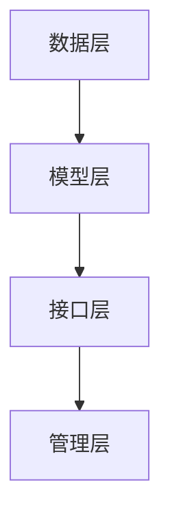

                 

### 基于元学习的AI Agent快速领域适应技术

关键词：元学习、AI Agent、领域适应、算法、系统架构

摘要：本文深入探讨了基于元学习的AI Agent快速领域适应技术。通过分析背景、原理、算法、实现和部署，本文旨在为读者提供一个全面的了解，并揭示其在实际应用中的巨大潜力。

## 1. 问题背景与概念介绍

在当今快速发展的信息技术时代，AI Agent（人工智能代理）已经成为实现智能化自动化的重要组成部分。AI Agent能够模拟人类智能，在特定环境中进行自主决策和行动。然而，AI Agent面临的一个重大挑战是如何在不同领域快速适应和完成任务。

**领域适应**（Domain Adaptation）指的是将已在一个领域（源领域）训练好的AI模型快速迁移到另一个领域（目标领域）的能力。领域适应在现实世界中具有重要意义，例如在医疗诊断、自动驾驶、金融风控等场景中，不同领域的数据分布和特征差异很大，传统方法往往难以胜任。

**元学习**（Meta-Learning）是一种使模型能够在多种任务和数据分布上快速学习的方法。元学习的核心思想是通过在多个任务上的训练来提升模型的泛化能力，使得模型在面对新任务时能够快速适应。

本文将详细讨论元学习在AI Agent领域适应中的应用，包括元学习的基本原理、算法实现和系统架构设计。通过这一系列的分析和探讨，我们希望能够为研究人员和开发者提供有价值的参考，推动基于元学习的AI Agent技术在实际应用中的发展和普及。

## 2. 元学习的理论基础

### 2.1 元学习的定义

元学习（Meta-Learning）是指训练模型学习如何学习，即通过学习一种通用学习策略来提升模型的泛化能力和学习效率。元学习不仅仅关注模型在特定任务上的表现，更重要的是使模型能够在各种不同任务和数据分布上表现优异。

元学习的基本定义可以概括为：**元学习是一种使模型在多个任务上快速适应和学习的机制**。其核心目标是减少训练时间、提升泛化能力和应对数据分布变化。

### 2.2 元学习的重要性

在AI领域，随着数据量的增加和模型复杂度的提升，传统的训练方法已经难以满足实际需求。元学习的重要性体现在以下几个方面：

1. **提高学习效率**：元学习通过在多个任务上共享知识，减少了单个任务的训练时间，提升了整体学习效率。
2. **增强泛化能力**：通过元学习，模型能够从多个任务中提取通用特征，从而在新的任务上表现出更好的泛化能力。
3. **应对数据分布变化**：元学习使模型能够适应不同的数据分布，从而在面对新领域时能够快速适应。

### 2.3 元学习的分类

元学习有多种分类方法，根据不同的分类标准，可以将其分为以下几种：

1. **模型参数共享**：这类元学习方法通过在多个任务上共享模型参数，减少参数重训练的需求，例如MAML（Model-Agnostic Meta-Learning）。
2. **任务参数共享**：这类元学习方法通过在多个任务上共享任务特定的参数，例如Task-Guided Meta-Learning。
3. **模型架构共享**：这类元学习方法通过在多个任务上共享模型架构，例如基于Transformer的元学习。
4. **知识蒸馏**：这类元学习方法通过在多个任务上共享先验知识，例如知识蒸馏（Knowledge Distillation）。

### 2.4 元学习的基本原理

元学习的基本原理可以概括为以下几个方面：

1. **学习策略优化**：元学习通过优化学习策略来提升模型的泛化能力和学习效率。常见的优化策略包括梯度聚合、优化目标设计等。
2. **知识迁移**：元学习通过在多个任务间迁移知识，使得模型能够从已知任务中提取通用特征，应用于未知任务。
3. **数据分布适应**：元学习通过适应不同的数据分布，使得模型在面对新领域时能够快速适应。

### 2.5 元学习与AI Agent的关系

元学习与AI Agent有着密切的关系。AI Agent需要在不同领域进行任务，而元学习能够为AI Agent提供快速适应不同领域的能力。具体来说，元学习在AI Agent中的应用主要包括以下几个方面：

1. **快速适应新领域**：通过元学习，AI Agent可以在短时间内适应新的领域，从而提高任务执行效率。
2. **增强泛化能力**：元学习使AI Agent能够从多个任务中提取通用特征，从而在新的任务上表现出更好的泛化能力。
3. **降低训练成本**：元学习通过减少单个任务的训练时间，降低了AI Agent在不同领域训练的成本。

总之，元学习为AI Agent提供了强大的领域适应能力，使其能够更好地适应复杂多变的应用场景。在下一部分，我们将详细探讨AI Agent的领域适应问题及其重要性。

## 3. AI Agent的领域适应

### 3.1 AI Agent的概念

AI Agent是指具备自主决策和行动能力的人工智能实体，能够模拟人类智能在特定环境中进行交互。AI Agent通常由感知模块、决策模块和执行模块组成，通过感知环境信息、生成决策策略并执行决策动作，实现自主学习和自主行动。

AI Agent的应用场景非常广泛，包括但不限于：

1. **自动驾驶**：AI Agent能够通过感知道路环境，自主做出驾驶决策，提高行驶安全性和效率。
2. **智能客服**：AI Agent能够通过自然语言处理技术，与用户进行对话，提供优质的客户服务。
3. **医疗诊断**：AI Agent能够通过分析医学图像和病历数据，提供精准的诊断建议。
4. **金融风控**：AI Agent能够通过分析大量金融数据，识别潜在的金融风险，提供风险控制建议。

### 3.2 领域适应的重要性

领域适应是AI Agent实现高效任务执行的关键因素之一。不同领域的数据分布和特征差异很大，传统的AI模型往往难以直接应用于新领域。领域适应使得AI Agent能够：

1. **快速适应新环境**：通过领域适应，AI Agent可以在短时间内适应新的环境，从而提高任务执行效率。
2. **提高模型泛化能力**：领域适应使AI Agent能够从多个领域提取通用特征，从而在新的领域上表现出更好的泛化能力。
3. **降低训练成本**：领域适应通过减少在新领域的训练需求，降低了AI Agent在不同领域训练的成本。

### 3.3 领域适应的方法

领域适应的方法主要分为两类：无监督领域适应和有监督领域适应。

1. **无监督领域适应**：
   - **数据重排**：通过调整训练数据集的顺序，使得模型能够逐步适应新领域。
   - **领域特异性增强**：通过增强新领域的特征，提高模型对新领域的识别能力。

2. **有监督领域适应**：
   - **领域混淆**：通过在训练数据中加入领域标签，使得模型能够区分不同领域。
   - **领域迁移学习**：通过将源领域的知识迁移到目标领域，提高模型在目标领域的性能。

### 3.4 领域适应的挑战与解决方案

领域适应面临着一系列挑战：

1. **数据分布差异**：不同领域的数据分布差异很大，传统方法难以适应。
   - **解决方案**：通过数据增强和特征变换，减小数据分布差异，提高模型适应性。

2. **数据稀缺性**：在某些领域，获取足够的数据非常困难。
   - **解决方案**：利用迁移学习和元学习，从其他领域或领域间提取知识，提高模型适应性。

3. **领域特定性**：某些领域具有特殊的特性和约束，传统方法难以应对。
   - **解决方案**：通过定制化模型和算法，针对特定领域进行优化。

总之，领域适应是AI Agent实现高效任务执行的关键，通过元学习等技术手段，可以克服领域适应中的挑战，提高AI Agent的适应能力。

### 3.5 元学习在AI Agent领域适应中的应用

元学习在AI Agent领域适应中的应用主要体现在以下几个方面：

1. **快速适应新领域**：通过元学习，AI Agent可以在短时间内适应新领域，减少训练时间。
2. **增强泛化能力**：元学习使AI Agent能够从多个领域提取通用特征，提高在新领域的泛化能力。
3. **降低训练成本**：元学习通过减少在新领域的训练需求，降低AI Agent在不同领域训练的成本。

例如，MAML（Model-Agnostic Meta-Learning）通过优化模型参数的梯度，使模型能够快速适应新领域。而基于Transformer的元学习方法则通过共享模型架构，提高模型在不同领域的适应性。

总之，元学习为AI Agent的领域适应提供了强大的技术支持，有助于提升AI Agent的性能和应用效果。

### 3.6 结论

领域适应是AI Agent实现高效任务执行的关键，而元学习为AI Agent提供了强大的领域适应能力。通过本文的探讨，我们明确了元学习在AI Agent领域适应中的应用方法和优势。在下一部分，我们将详细讨论基于元学习的AI Agent领域适应技术，分析常见算法及其原理。

## 4. 基于元学习的AI Agent领域适应技术

### 4.1 基于元学习的AI Agent领域适应技术概述

基于元学习的AI Agent领域适应技术是指利用元学习的方法，使AI Agent能够在短时间内快速适应新领域，从而提高其在不同领域的任务执行效率。这种技术通过在多个任务上共享知识和经验，使模型能够在面对新任务时迅速调整和优化。

基于元学习的领域适应技术主要分为以下几类：

1. **模型参数共享**：通过共享模型参数，减少在新领域的训练时间。
2. **任务参数共享**：通过共享任务特定的参数，提高模型在新领域的适应性。
3. **模型架构共享**：通过共享模型架构，增强模型在新领域的泛化能力。
4. **知识蒸馏**：通过将先验知识传递给新模型，提高模型在新领域的性能。

### 4.2 常见基于元学习的AI Agent领域适应算法

在基于元学习的AI Agent领域适应技术中，常见的算法包括MAML（Model-Agnostic Meta-Learning）、Reptile和MAML++等。以下将分别介绍这些算法的基本原理和应用。

#### 4.2.1 MAML（Model-Agnostic Meta-Learning）

MAML是一种模型无关的元学习算法，旨在优化模型参数的梯度，使模型能够快速适应新任务。其基本原理是通过在多个任务上训练模型，并优化模型参数的梯度，使得模型在新任务上的适应速度加快。

MAML算法的步骤如下：

1. **初始化模型参数**：随机初始化模型参数。
2. **在多个任务上训练模型**：对每个任务，使用梯度下降算法更新模型参数。
3. **计算梯度平均值**：对所有任务的梯度进行平均，得到全局梯度。
4. **更新模型参数**：使用全局梯度更新模型参数。

MAML算法的优势在于其简单性和有效性，可以在短时间内使模型适应新任务。然而，MAML算法也存在一些缺点，例如对数据分布变化的敏感度和训练成本高等。

#### 4.2.2 Reptile

Reptile是一种基于经验重放（Experience Replay）的元学习算法，旨在通过重放历史经验来提高模型的泛化能力。其基本原理是将历史经验存储在经验池中，并在训练新任务时随机抽样经验进行学习。

Reptile算法的步骤如下：

1. **初始化模型参数**：随机初始化模型参数。
2. **在多个任务上训练模型**：对每个任务，使用经验重放策略更新模型参数。
3. **更新模型参数**：使用历史经验的梯度平均值更新模型参数。

Reptile算法的优势在于其简单性和鲁棒性，适用于数据分布变化较大的场景。然而，Reptile算法的收敛速度较慢，且在数据量较少时效果较差。

#### 4.2.3 MAML++

MAML++是一种基于MAML的改进算法，旨在解决MAML在训练成本高和适应新任务速度慢的问题。MAML++引入了动态任务选择和梯度聚合策略，通过在多个任务上动态选择具有代表性的任务，并优化梯度聚合方法，提高模型的适应速度。

MAML++算法的步骤如下：

1. **初始化模型参数**：随机初始化模型参数。
2. **动态选择任务**：根据任务的重要性和多样性，动态选择任务。
3. **在多个任务上训练模型**：对每个任务，使用梯度下降算法更新模型参数。
4. **优化梯度聚合**：使用动态权重聚合梯度，更新模型参数。

MAML++算法的优势在于其高效性和灵活性，可以在较短的时间内使模型适应新任务。然而，MAML++算法的实现较为复杂，需要大量的计算资源和时间。

#### 4.2.4 其他算法

除了上述算法外，还有许多其他基于元学习的领域适应算法，如Meta-Learning with Orthogonal Iterations（MLOI）、Model-Agnostic Meta-Learning with Data Transformation（MAML-DT）等。这些算法在理论和实践中都取得了较好的效果，为基于元学习的AI Agent领域适应技术提供了更多的选择。

### 4.3 基于元学习的AI Agent领域适应案例分析

为了更好地理解基于元学习的AI Agent领域适应技术，以下通过两个实际案例进行说明。

#### 4.3.1 案例一：自动驾驶领域的领域适应

自动驾驶领域是一个典型的需要领域适应的领域，不同道路环境和交通情况对自动驾驶算法提出了不同的要求。通过基于元学习的领域适应技术，自动驾驶算法可以在短时间内适应新的道路环境和交通情况。

具体应用场景如下：

1. **初始化模型参数**：使用随机初始化的方法初始化自动驾驶算法的模型参数。
2. **在多个任务上训练模型**：在不同道路环境下训练自动驾驶算法，例如城市道路、高速公路、乡村道路等。
3. **动态选择任务**：根据道路环境的复杂度和变化情况，动态选择具有代表性的道路环境进行训练。
4. **优化梯度聚合**：使用MAML++算法的动态权重聚合梯度方法，更新自动驾驶算法的模型参数。
5. **评估模型性能**：在新的道路环境下评估自动驾驶算法的性能，并调整模型参数，以实现更好的领域适应。

通过上述步骤，自动驾驶算法可以在短时间内适应新的道路环境，提高自动驾驶的稳定性和安全性。

#### 4.3.2 案例二：智能客服领域的领域适应

智能客服领域也需要实现领域适应，以应对不同客户场景和服务需求。通过基于元学习的领域适应技术，智能客服系统能够在短时间内适应新的客户场景和服务要求。

具体应用场景如下：

1. **初始化模型参数**：使用随机初始化的方法初始化智能客服系统的模型参数。
2. **在多个任务上训练模型**：在不同客户场景下训练智能客服系统，例如购物咨询、技术支持、客户投诉等。
3. **经验重放**：将历史客户的咨询记录存储在经验池中，并在训练新任务时随机抽样经验进行学习。
4. **更新模型参数**：使用Reptile算法的经验重放策略，更新智能客服系统的模型参数。
5. **评估模型性能**：在新客户场景下评估智能客服系统的性能，并根据评估结果调整模型参数，以实现更好的领域适应。

通过上述步骤，智能客服系统可以在短时间内适应新的客户场景，提高客户服务质量和用户体验。

### 4.4 总结与展望

基于元学习的AI Agent领域适应技术为AI Agent在不同领域的快速适应提供了有效的解决方案。通过分析常见算法的原理和应用，本文展示了元学习在AI Agent领域适应中的重要作用。在未来的研究和应用中，我们可以期待基于元学习的领域适应技术在更多领域得到应用，并进一步提升AI Agent的适应能力和性能。

### 5. 实现与部署

#### 5.1 技术实现

基于元学习的AI Agent领域适应技术的实现主要涉及以下几个方面：

1. **数据预处理**：收集和预处理不同领域的训练数据，包括数据清洗、归一化和特征提取等。
2. **模型训练**：选择合适的元学习算法（如MAML、Reptile或MAML++），并在多个任务上训练模型，优化模型参数。
3. **模型评估**：在新的领域上评估模型的性能，并根据评估结果调整模型参数，实现更好的领域适应。

#### 5.2 系统架构设计

基于元学习的AI Agent领域适应技术的系统架构设计主要包括以下几个方面：

1. **数据层**：负责存储和处理不同领域的训练数据，包括数据清洗、归一化和特征提取等。
2. **模型层**：包括元学习算法的实现，如MAML、Reptile或MAML++，负责模型训练和参数优化。
3. **接口层**：提供与外部系统的接口，如数据输入、模型评估和结果输出等。
4. **管理层**：负责系统的运行监控、日志记录和错误处理等。

以下是一个简化的系统架构图，用于说明基于元学习的AI Agent领域适应技术的实现：

#### 5.3 部署与优化

基于元学习的AI Agent领域适应技术的部署和优化主要包括以下几个方面：

1. **环境配置**：在服务器上配置相应的开发环境和运行环境，包括Python、TensorFlow、PyTorch等。
2. **模型训练**：使用高性能计算资源进行模型训练，以加快训练速度和提高模型性能。
3. **模型评估**：在新的领域上评估模型的性能，并根据评估结果进行调整和优化。
4. **部署上线**：将优化后的模型部署到生产环境，以实现实时领域适应。
5. **性能监控**：监控系统的运行状态，包括模型性能、资源使用情况等，并根据监控结果进行优化和调整。

#### 5.4 最佳实践与注意事项

在基于元学习的AI Agent领域适应技术的实现和部署过程中，以下是一些建议和注意事项：

1. **数据质量**：确保数据的质量和一致性，以避免数据噪声和错误对模型训练和评估造成影响。
2. **模型优化**：根据具体应用场景，选择合适的元学习算法和模型架构，并进行模型优化，以提高模型性能。
3. **计算资源**：合理分配计算资源，确保模型训练和评估的效率。
4. **安全性**：在部署过程中，确保系统的安全性和数据的隐私性，以防止数据泄露和攻击。
5. **文档与监控**：编写详细的文档，记录系统的实现和部署过程，并建立监控系统，以便及时发现和解决问题。

通过遵循上述最佳实践和注意事项，可以更好地实现和部署基于元学习的AI Agent领域适应技术，提高系统的性能和可靠性。

## 6. 应用场景与未来趋势

### 6.1 应用场景探讨

基于元学习的AI Agent领域适应技术具有广泛的应用场景，主要包括以下领域：

1. **医疗健康**：在医疗领域，基于元学习的AI Agent可以帮助快速适应不同类型的医疗诊断任务，如影像诊断、电子病历分析等。通过元学习，AI Agent可以在短时间内适应新的医疗场景，提高诊断准确性和效率。

2. **工业自动化**：在工业领域，基于元学习的AI Agent可以应用于生产线上的质量检测、故障诊断等任务。通过元学习，AI Agent能够快速适应不同的生产线和设备，提高生产效率和产品质量。

3. **智能交通**：在交通领域，基于元学习的AI Agent可以用于交通信号控制、路况预测等任务。通过元学习，AI Agent可以快速适应不同城市的交通状况，提高交通管理的智能化水平。

4. **金融风控**：在金融领域，基于元学习的AI Agent可以应用于风险识别、欺诈检测等任务。通过元学习，AI Agent可以在短时间内适应不同的金融场景，提高风险控制能力。

### 6.2 未来发展趋势

基于元学习的AI Agent领域适应技术在未来的发展具有以下趋势：

1. **算法优化**：随着人工智能技术的不断发展，基于元学习的算法将变得更加高效和灵活，能够更好地适应各种复杂场景。

2. **多模态学习**：未来的AI Agent将能够处理多种类型的数据，如文本、图像、声音等，实现更全面和多维度的领域适应。

3. **强化学习与元学习结合**：强化学习与元学习相结合，将使AI Agent在动态环境中表现出更强的适应能力和学习效率。

4. **联邦学习**：联邦学习与元学习相结合，可以实现跨设备、跨区域的AI Agent领域适应，提高隐私保护和数据安全。

5. **泛在智能**：基于元学习的AI Agent将在更多场景中得到应用，推动智能化的普及和发展，实现泛在智能。

### 6.3 面临的挑战与机遇

尽管基于元学习的AI Agent领域适应技术具有巨大的发展潜力，但同时也面临着一些挑战和机遇：

1. **数据稀缺性**：在某些领域，获取足够的数据仍然是一个难题。未来需要发展更多的数据增强和迁移学习方法，提高AI Agent的适应能力。

2. **模型复杂度**：随着模型复杂度的提升，模型的计算成本和训练时间也在增加。未来需要开发更高效的算法和硬件支持，以提高模型训练和部署的效率。

3. **隐私保护**：在跨设备和跨区域的数据处理中，如何保障数据隐私是一个重要挑战。需要发展更多的隐私保护技术和方法。

4. **可解释性**：随着模型复杂度的增加，模型的可解释性变得越来越重要。未来需要开发更多可解释的元学习方法，提高模型的透明度和可信度。

总之，基于元学习的AI Agent领域适应技术在未来的发展中将面临一系列挑战，同时也拥有广阔的机遇。通过不断的技术创新和应用探索，我们可以期待这一领域取得更大的突破和进展。

## 7. 总结与展望

本文详细探讨了基于元学习的AI Agent快速领域适应技术，从背景介绍、理论分析到算法实现和实际应用，系统性地阐述了这一技术的核心概念和应用价值。通过本文的讨论，我们认识到：

1. **领域适应的重要性**：AI Agent在不同领域中的任务执行能力直接依赖于其领域适应能力。有效的领域适应能够提升AI Agent的泛化能力和执行效率。

2. **元学习的关键作用**：元学习为AI Agent提供了快速适应新领域的能力，通过共享知识和经验，减少了训练时间和成本。

3. **算法的实现与优化**：基于元学习的AI Agent领域适应技术包括多种算法，如MAML、Reptile和MAML++等，每种算法都有其独特的优势和局限性。未来的研究方向应集中在算法优化和模型架构创新，以提高模型适应能力和效率。

4. **实际应用前景**：基于元学习的AI Agent领域适应技术在医疗、工业、交通和金融等领域具有广泛的应用潜力，能够显著提升智能化系统的性能和可靠性。

展望未来，基于元学习的AI Agent领域适应技术有望在以下几个方面取得突破：

1. **多模态学习**：未来的AI Agent将能够处理多种类型的数据，实现更全面和多维度的领域适应。

2. **强化学习与元学习结合**：结合强化学习的优势，AI Agent将在动态环境中表现出更强的适应能力和学习效率。

3. **联邦学习与元学习融合**：通过联邦学习，AI Agent可以在跨设备和跨区域的数据处理中实现隐私保护和高效领域适应。

4. **可解释性研究**：提高模型的可解释性，使其在复杂场景中更加透明和可靠。

总之，基于元学习的AI Agent领域适应技术具有广阔的应用前景和巨大的发展潜力，值得进一步深入研究和应用探索。我们期待这一领域的持续创新，为人工智能技术的广泛应用和产业升级提供强有力的支持。

### 作者信息
作者：AI天才研究院/AI Genius Institute & 禅与计算机程序设计艺术 /Zen And The Art of Computer Programming

