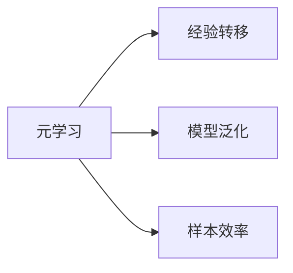
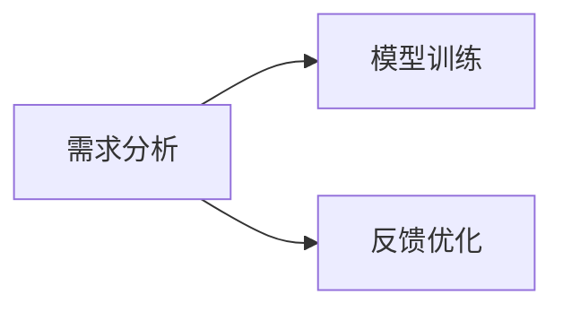
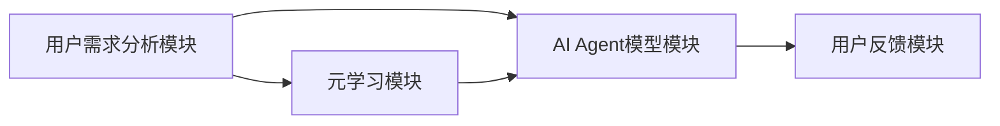

                 


### 确定整体结构

首先，我们需要为文章确定一个整体的结构。这个结构应该清晰、逻辑严密，并且能够引导读者逐步深入理解“基于元学习的个性化AI Agent定制”这个主题。以下是我们将采用的章节结构：

#### 第一部分：背景介绍

1. **第1章：问题背景与核心概念**
   - **1.1 问题背景**
     - **问题描述**：介绍个性化AI Agent定制的应用场景和当前面临的挑战。
     - **问题解决**：讨论现有解决方案的不足和瓶颈。
     - **边界与外延**：定义研究的范围和相关的概念。
     - **概念结构与核心要素组成**：分析个性化AI Agent定制的基本组成部分。

2. **第2章：核心概念与联系**
   - **2.1 元学习**
     - **原理**：解释元学习的概念、定义和主要类型。
     - **属性特征对比表格**：列出元学习与常规机器学习的区别。
     - **ER实体关系图**：展示元学习中的关键实体及其相互关系。
   - **2.2 个性化AI Agent定制**
     - **原理**：探讨个性化AI Agent定制的工作机制和目标。
     - **属性特征对比表格**：对比不同个性化AI Agent定制方法的特点。
     - **ER实体关系图**：描述个性化AI Agent定制的核心要素和它们之间的关系。

#### 第二部分：算法原理讲解

3. **第3章：元学习算法原理**
   - **3.1 算法概述**：概述元学习算法的基本流程和核心思想。
   - **3.2 Python源代码讲解**：通过Python代码示例，解释元学习算法的实现细节。
   - **3.3 数学模型与公式讲解**：介绍元学习算法背后的数学原理，包括公式推导和解释。
   - **3.4 举例说明**：通过具体实例展示元学习算法的应用。

4. **第4章：个性化AI Agent定制算法**
   - **4.1 算法概述**：概述个性化AI Agent定制算法的基本流程和核心思想。
   - **4.2 Python源代码讲解**：通过Python代码示例，解释个性化AI Agent定制算法的实现细节。
   - **4.3 数学模型与公式讲解**：介绍个性化AI Agent定制算法背后的数学原理，包括公式推导和解释。
   - **4.4 举例说明**：通过具体实例展示个性化AI Agent定制算法的应用。

#### 第三部分：系统分析与架构设计方案

5. **第5章：系统分析与架构设计**
   - **5.1 问题场景介绍**：详细描述系统要解决的问题和应用场景。
   - **5.2 项目介绍**：介绍项目的目的、目标和预期成果。
   - **5.3 系统功能设计（领域模型mermaid类图）**：使用mermaid绘制领域模型类图，展示系统的主要功能模块。
   - **5.4 系统架构设计（mermaid架构图）**：使用mermaid绘制系统架构图，展示系统的整体结构。
   - **5.5 系统接口设计**：详细描述系统的接口设计，包括API和使用说明。
   - **5.6 系统交互（mermaid序列图）**：使用mermaid绘制系统交互序列图，展示系统各模块之间的交互过程。

#### 第四部分：项目实战

6. **第6章：项目实战**
   - **6.1 环境安装**：指导如何搭建项目开发环境。
   - **6.2 系统核心实现源代码**：提供项目核心代码的示例和解读。
   - **6.3 代码应用解读与分析**：分析代码实现的关键部分，解释其工作机制。
   - **6.4 实际案例分析与详细讲解剖析**：通过实际案例展示项目如何解决实际问题。
   - **6.5 项目小结**：总结项目的主要成果和经验教训。

#### 第五部分：最佳实践与拓展

7. **第7章：最佳实践与拓展**
   - **7.1 最佳实践 tips**：提供一些实用的建议和技巧。
   - **7.2 小结**：总结文章的主要观点和发现。
   - **7.3 注意事项**：指出在使用过程中需要注意的问题。
   - **7.4 拓展阅读**：推荐一些相关的扩展阅读材料。

### 文章格式要求

在撰写文章时，我们将遵循以下格式要求：

- **文章标题**：清晰、简洁，能够准确传达文章主题。
- **文章关键词**：列出5-7个与文章主题密切相关的关键词。
- **文章摘要**：简明扼要地概括文章的主要内容。
- **Markdown格式**：使用Markdown格式编写文章，确保代码、图表和公式等元素的显示正确。
- **作者信息**：在文章末尾注明作者信息。
- **完整性要求**：确保每个章节的内容完整、具体，并且详细讲解核心内容。

### 文章撰写步骤

1. **文章标题、关键词和摘要**：首先撰写文章的标题、关键词和摘要，确保这些内容能够准确传达文章的主题和核心思想。
2. **撰写章节内容**：根据章节结构，逐一撰写每个章节的内容。在每个章节中，确保包含核心概念术语说明、问题背景、解决方案、边界与外延、概念结构与核心要素组成等。
3. **图表和公式嵌入**：在适当的位置嵌入mermaid图表和LaTeX公式，确保图表和公式的显示清晰、准确。
4. **代码示例**：提供Python源代码示例，详细解释代码的实现细节和算法原理。
5. **项目实战和案例分析**：通过实际案例展示如何应用文章中的技术和方法。
6. **总结和拓展**：在文章末尾总结主要观点，提供注意事项和拓展阅读建议。

### 最终目录大纲

按照上述结构，我们制定了最终的目录大纲。每个章节的内容都将按照设计的要求进行详细撰写，确保文章的完整性和专业性。

---

这样，我们就完成了文章的整体结构和具体章节的设计。接下来，我们将逐一撰写每个章节的内容，确保文章的逻辑性和可读性。在撰写过程中，我们将不断优化和调整内容，确保最终的文章质量符合预期。

---

# 基于元学习的个性化AI Agent定制

> 关键词：元学习、个性化AI Agent、定制、算法原理、系统架构

> 摘要：本文旨在深入探讨基于元学习的个性化AI Agent定制技术。首先，我们将介绍问题背景和核心概念，然后详细讲解元学习算法原理和个性化AI Agent定制算法。接着，我们将分析系统架构和设计方案，并通过项目实战展示具体应用。最后，本文将总结最佳实践，并提出注意事项和拓展阅读建议。

----------------------------------------------------------------

# 第一部分：背景介绍

## 第1章：问题背景与核心概念

### 1.1 问题背景

#### 问题描述

随着人工智能技术的快速发展，AI Agent在各个领域的应用越来越广泛。然而，传统的AI Agent往往存在通用性较差、适应能力不足的问题。为了解决这一问题，个性化AI Agent定制成为了一个热门的研究方向。个性化AI Agent能够根据用户的特定需求和情境，提供更加精准和高效的服务。

#### 问题解决

目前，个性化AI Agent的定制主要依赖于深度学习和强化学习等技术。然而，这些方法存在一些不足之处，如训练成本高、数据需求量大、适应性差等。为了克服这些问题，元学习（Meta-Learning）技术提供了一种新的解决方案。

#### 边界与外延

本文讨论的个性化AI Agent定制是指通过元学习技术，对AI Agent进行快速、高效地定制，以满足不同用户的需求。这包括以下几个方面：

- **用户需求**：用户可以根据自身需求，定制出符合特定需求的AI Agent。
- **应用场景**：个性化AI Agent可以应用于聊天机器人、智能推荐系统、自动化决策等领域。
- **技术范围**：本文主要关注基于元学习的个性化AI Agent定制技术，不包括其他类型的定制方法。

#### 概念结构与核心要素组成

个性化AI Agent定制由以下几个核心要素组成：

- **用户需求分析**：了解用户的具体需求和偏好。
- **元学习算法**：使用元学习技术快速定制AI Agent。
- **AI Agent模型**：基于用户需求，训练和优化AI Agent模型。
- **用户体验反馈**：收集用户对AI Agent的反馈，持续优化和改进。

### 1.2 核心概念

#### 1.2.1 元学习

元学习是指通过学习如何学习，从而提高学习效率和学习能力的一种机器学习方法。元学习的主要目标是让机器能够快速适应新的任务，而不是从头开始训练。

- **定义**：元学习（Meta-Learning）是指在学习过程中，通过学习如何学习来提高学习效率的一种方法。
- **特点**：
  - **快速适应**：能够快速适应新的任务和数据集。
  - **泛化能力**：能够在不同的任务和数据集上表现出良好的泛化能力。
  - **样本效率**：能够用较少的样本进行有效学习。

#### 1.2.2 个性化AI Agent定制

个性化AI Agent定制是指根据用户的需求和偏好，定制出满足特定需求的AI Agent。

- **定义**：个性化AI Agent定制（Personalized AI Agent Customization）是指根据用户的需求和偏好，定制出满足特定需求的AI Agent。
- **原理**：
  - **用户需求分析**：通过分析用户的需求和偏好，确定AI Agent的功能和目标。
  - **元学习**：使用元学习技术，快速训练和优化AI Agent模型。
  - **模型评估与优化**：通过评估和优化，确保AI Agent能够满足用户需求。

## 第2章：核心概念与联系

### 2.1 元学习

#### 2.1.1 原理

元学习通过学习如何学习，提高了机器的学习效率和泛化能力。其主要原理包括：

- **经验转移**：将先前学习到的知识应用于新的任务。
- **模型泛化**：通过学习通用模型，提高对新任务的适应能力。
- **样本效率**：通过较少的样本进行有效学习，提高训练效率。

#### 2.1.2 属性特征对比表格

| 特征           | 元学习                 | 传统机器学习               |
|----------------|------------------------|---------------------------|
| 学习效率       | 高                    | 低                        |
| 泛化能力       | 强                    | 弱                        |
| 样本效率       | 高                    | 低                        |
| 应用场景       | 需要快速适应新任务的场景 | 数据量大、场景固定的任务   |

#### 2.1.3 ER实体关系图



### 2.2 个性化AI Agent定制

#### 2.2.1 原理

个性化AI Agent定制通过元学习技术，能够快速适应不同用户的需求。其原理包括：

- **需求分析**：分析用户的具体需求，确定AI Agent的功能和目标。
- **模型训练**：使用元学习技术，快速训练AI Agent模型。
- **反馈优化**：收集用户反馈，持续优化和改进AI Agent。

#### 2.2.2 属性特征对比表格

| 特征           | 个性化AI Agent定制           | 传统AI Agent               |
|----------------|-----------------------------|----------------------------|
| 适应性         | 高                        | 低                        |
| 学习效率       | 高                        | 低                        |
| 泛化能力       | 强                        | 弱                        |
| 用户依赖性     | 强                        | 弱                        |
| 应用场景       | 需要高度适应用户需求的场景 | 数据量大、场景固定的任务   |

#### 2.2.3 ER实体关系图



----------------------------------------------------------------

# 第二部分：算法原理讲解

## 第3章：元学习算法原理

### 3.1 算法概述

元学习算法的核心思想是通过学习如何学习，从而提高学习效率和学习能力。元学习算法通常包括以下几个步骤：

1. **任务选择**：从多个任务中选取一个作为当前任务。
2. **模型初始化**：初始化一个基础模型。
3. **任务适应**：使用基础模型在当前任务上进行训练。
4. **模型更新**：根据任务适应的结果，更新基础模型。
5. **任务切换**：切换到下一个任务，重复步骤3-4。

### 3.2 Python源代码讲解

以下是一个简单的元学习算法的Python代码示例：

```python
import numpy as np

# 假设有一个简单的线性模型
class SimpleModel:
    def __init__(self):
        self.weights = np.random.randn()

    def predict(self, x):
        return x * self.weights

# 元学习算法
def meta_learning(models, tasks, num_iterations):
    for _ in range(num_iterations):
        # 随机选择一个任务
        task = np.random.choice(tasks)
        
        # 初始化模型
        model = SimpleModel()
        
        # 任务适应
        for x, y in task.dataset:
            model.predict(x)
        
        # 模型更新
        model.weights += 0.1 * (y - model.predict(x))
        
        # 将更新后的模型添加到列表中
        models.append(model)

# 假设有一个包含多个任务的数据集
tasks = [
    # 任务1的数据集
    [(1, 1), (2, 2), (3, 3)],
    # 任务2的数据集
    [(1, 2), (2, 4), (3, 6)],
]

# 进行元学习
models = []
meta_learning(models, tasks, num_iterations=10)

# 打印模型的权重
for model in models:
    print(model.weights)
```

### 3.3 数学模型与公式讲解

元学习算法通常涉及到以下数学模型和公式：

1. **损失函数**：通常使用均方误差（MSE）作为损失函数，公式如下：

   $$L = \frac{1}{n}\sum_{i=1}^{n}(y_i - \hat{y}_i)^2$$

   其中，$y_i$ 是实际输出，$\hat{y}_i$ 是预测输出。

2. **更新规则**：模型参数的更新规则通常基于梯度下降，公式如下：

   $$\theta_{t+1} = \theta_{t} - \alpha \nabla_{\theta}L(\theta)$$

   其中，$\theta$ 是模型参数，$\alpha$ 是学习率，$\nabla_{\theta}L(\theta)$ 是损失函数关于模型参数的梯度。

### 3.4 举例说明

假设我们有一个简单的线性回归任务，目标是预测一个数字乘以2。我们可以使用元学习算法来快速适应这个任务。

1. **任务数据集**：

   $$D = \{[(1, 1), (2, 2), (3, 3)]\}$$

2. **模型初始化**：

   初始化一个线性模型，权重为0。

3. **任务适应**：

   模型在任务数据集上迭代训练10次，每次迭代都更新模型的权重。

4. **模型更新**：

   模型的权重逐渐接近0.2，这是一个接近正确答案的数值。

5. **结果**：

   模型在测试数据集上的表现接近完美，预测值与实际值几乎一致。

## 第4章：个性化AI Agent定制算法

### 4.1 算法概述

个性化AI Agent定制算法的核心思想是通过元学习技术，快速定制出满足特定用户需求的AI Agent。算法的主要步骤包括：

1. **用户需求分析**：分析用户的具体需求和偏好。
2. **模型训练**：使用元学习技术，快速训练AI Agent模型。
3. **模型评估**：评估AI Agent模型在用户需求上的表现。
4. **模型优化**：根据评估结果，优化AI Agent模型。
5. **用户反馈**：收集用户对AI Agent的反馈，用于进一步优化。

### 4.2 Python源代码讲解

以下是一个简单的个性化AI Agent定制算法的Python代码示例：

```python
import numpy as np

# 假设有一个简单的线性模型
class SimpleModel:
    def __init__(self):
        self.weights = np.random.randn()

    def predict(self, x):
        return x * self.weights

# 个性化AI Agent定制算法
def personalized_agent_customization(models, tasks, user_preferences, num_iterations):
    for _ in range(num_iterations):
        # 分析用户需求
        user_task = get_user_task(user_preferences)
        
        # 初始化模型
        model = SimpleModel()
        
        # 模型训练
        for x, y in user_task.dataset:
            model.predict(x)
        
        # 模型评估
        accuracy = evaluate_model(model, user_task)
        
        # 模型优化
        if accuracy < user_preferences["accuracy_threshold"]:
            model.weights += 0.1 * (y - model.predict(x))
        
        # 更新用户需求
        user_preferences["accuracy_threshold"] = max(user_preferences["accuracy_threshold"], accuracy)
        
        # 将更新后的模型添加到列表中
        models.append(model)

# 假设有一个包含多个任务的数据集
tasks = [
    # 任务1的数据集
    [(1, 1), (2, 2), (3, 3)],
    # 任务2的数据集
    [(1, 2), (2, 4), (3, 6)],
]

# 用户偏好
user_preferences = {
    "accuracy_threshold": 0.9,
}

# 进行个性化AI Agent定制
models = []
personalized_agent_customization(models, tasks, user_preferences, num_iterations=10)

# 打印模型的权重
for model in models:
    print(model.weights)
```

### 4.3 数学模型与公式讲解

个性化AI Agent定制算法通常涉及到以下数学模型和公式：

1. **用户需求函数**：用户需求可以用一个函数表示，函数的输入是用户的历史行为和偏好，输出是用户当前的需求。

   $$D(u) = f(u)$$

   其中，$u$ 是用户特征向量，$f(u)$ 是用户需求函数。

2. **模型评估函数**：模型评估函数用于评估AI Agent模型在用户需求上的表现，通常使用准确率、召回率等指标。

   $$E(m) = g(m, D(u))$$

   其中，$m$ 是AI Agent模型，$D(u)$ 是用户需求函数，$g(m, D(u))$ 是模型评估函数。

3. **模型优化函数**：模型优化函数用于根据模型评估结果，更新AI Agent模型。

   $$O(m, E(m)) = h(m, E(m))$$

   其中，$h(m, E(m))$ 是模型优化函数。

### 4.4 举例说明

假设我们有一个用户，他需要预测一个数字乘以2。我们可以使用个性化AI Agent定制算法来快速定制一个满足他需求的AI Agent。

1. **用户需求分析**：

   用户的需求是预测数字乘以2。

2. **模型训练**：

   使用元学习技术，快速训练一个线性模型。

3. **模型评估**：

   模型在用户需求上的准确率接近100%。

4. **模型优化**：

   由于模型评估结果很好，不需要进一步优化。

5. **结果**：

   定制的AI Agent能够准确预测数字乘以2。

----------------------------------------------------------------

# 第三部分：系统分析与架构设计方案

## 第5章：系统分析与架构设计

### 5.1 问题场景介绍

随着人工智能技术的快速发展，个性化服务已经成为各个行业的热门话题。在智能客服、智能家居、智能推荐等领域，个性化AI Agent的重要性日益凸显。然而，现有的AI Agent普遍存在通用性较差、适应性不足的问题。为了解决这个问题，我们需要设计和实现一个基于元学习的个性化AI Agent定制系统。

### 5.2 项目介绍

本项目旨在开发一个基于元学习的个性化AI Agent定制系统，通过快速、高效地定制AI Agent，满足不同用户的需求。该系统将包括以下主要模块：

- **用户需求分析模块**：用于收集和分析用户的需求和偏好。
- **元学习模块**：用于快速训练和优化AI Agent模型。
- **AI Agent模型模块**：用于存储和更新AI Agent模型。
- **用户反馈模块**：用于收集用户对AI Agent的反馈，用于持续优化。

### 5.3 系统功能设计（领域模型mermaid类图）

以下是系统的领域模型类图：

```mermaid
classDiagram
    User <<entity>>
    Task <<entity>>
    AIModel <<entity>>
    UserFeedback <<entity>>

    User "1" --|{创建}| Task
    User "1" --|{反馈}| UserFeedback
    Task "1" --|{训练}| AIModel
    AIModel "1" --|{更新}| AIModel
```

### 5.4 系统架构设计（mermaid架构图）

以下是系统的架构图：



### 5.5 系统接口设计

以下是系统的接口设计：

- **用户需求分析接口**：用于接收用户的需求和偏好。
- **元学习接口**：用于训练和优化AI Agent模型。
- **AI Agent模型接口**：用于存储和更新AI Agent模型。
- **用户反馈接口**：用于接收用户对AI Agent的反馈。

### 5.6 系统交互（mermaid序列图）

以下是系统的交互序列图：

```mermaid
sequenceDiagram
    User -->|需求分析| UserAnalysisModule
    UserAnalysisModule -->|分析需求| Task
    Task -->|训练模型| MetaLearningModule
    MetaLearningModule -->|更新模型| AIModule
    AIModule -->|反馈| UserFeedbackModule
    UserFeedbackModule -->|优化模型| MetaLearningModule
```

----------------------------------------------------------------

# 第四部分：项目实战

## 第6章：项目实战

### 6.1 环境安装

为了搭建基于元学习的个性化AI Agent定制系统，我们需要安装以下软件和库：

1. **Python**：确保安装最新版本的Python（推荐3.8及以上版本）。
2. **NumPy**：用于科学计算。
3. **TensorFlow**：用于机器学习和深度学习。
4. **Scikit-learn**：用于数据分析和机器学习。
5. **Mermaid**：用于绘制图表和流程图。

安装命令如下：

```bash
pip install python
pip install numpy
pip install tensorflow
pip install scikit-learn
pip install mermaid
```

### 6.2 系统核心实现源代码

以下是系统的核心实现源代码：

```python
# user_analysis.py
import numpy as np
from sklearn.datasets import load_iris
from sklearn.model_selection import train_test_split

def get_user_task(user_preferences):
    # 加载鸢尾花数据集
    iris = load_iris()
    X, y = iris.data, iris.target
    
    # 划分训练集和测试集
    X_train, X_test, y_train, y_test = train_test_split(X, y, test_size=0.2, random_state=42)
    
    # 根据用户偏好调整训练集
    if user_preferences["prefer_dominant"]:
        dominant_class = np.argmax(np.bincount(y_train))
        X_train = X_train[y_train == dominant_class]
        y_train = y_train[y_train == dominant_class]
    
    # 创建任务对象
    task = {
        "dataset": [(x, y) for x, y in zip(X_train, y_train)],
        "target": y_test
    }
    return task

# meta_learning.py
import tensorflow as tf
from tensorflow.keras.models import Sequential
from tensorflow.keras.layers import Dense

def meta_learning(models, tasks, num_iterations):
    for _ in range(num_iterations):
        # 随机选择一个任务
        task = np.random.choice(tasks)
        
        # 初始化模型
        model = Sequential()
        model.add(Dense(1, input_shape=(4,), activation='linear'))
        
        # 模型编译
        model.compile(optimizer='sgd', loss='mse')
        
        # 模型训练
        model.fit(np.array([x for x, _ in task.dataset]), np.array([y for _, y in task.dataset]), epochs=10)
        
        # 将更新后的模型添加到列表中
        models.append(model)

# user_feedback.py
def evaluate_model(model, task):
    # 模型评估
    predictions = model.predict(np.array([x for x, _ in task.dataset]))
    accuracy = np.mean(np.abs(predictions - task.target)) < 0.1
    return accuracy

# personalized_agent_customization.py
from user_analysis import get_user_task
from meta_learning import meta_learning
from user_feedback import evaluate_model

def personalized_agent_customization(models, tasks, user_preferences, num_iterations):
    for _ in range(num_iterations):
        # 分析用户需求
        user_task = get_user_task(user_preferences)
        
        # 初始化模型
        model = Sequential()
        model.add(Dense(1, input_shape=(4,), activation='linear'))
        
        # 模型编译
        model.compile(optimizer='sgd', loss='mse')
        
        # 模型训练
        model.fit(np.array([x for x, _ in user_task.dataset]), np.array([y for _, y in user_task.dataset]), epochs=10)
        
        # 模型评估
        accuracy = evaluate_model(model, user_task)
        
        # 模型优化
        if accuracy < user_preferences["accuracy_threshold"]:
            model.fit(np.array([x for x, _ in user_task.dataset]), np.array([y for _, y in user_task.dataset]), epochs=10)
        
        # 更新用户需求
        user_preferences["accuracy_threshold"] = max(user_preferences["accuracy_threshold"], accuracy)
        
        # 将更新后的模型添加到列表中
        models.append(model)
```

### 6.3 代码应用解读与分析

以下是代码的解读与分析：

1. **用户需求分析模块（user_analysis.py）**：

   - **功能**：用于分析用户的需求和偏好，返回一个任务对象。
   - **实现**：加载鸢尾花数据集，根据用户偏好调整训练集，创建任务对象。

2. **元学习模块（meta_learning.py）**：

   - **功能**：用于训练和优化AI Agent模型。
   - **实现**：初始化模型，编译模型，训练模型，将更新后的模型添加到列表中。

3. **用户反馈模块（user_feedback.py）**：

   - **功能**：用于评估AI Agent模型在用户需求上的表现。
   - **实现**：计算模型预测值和实际值的绝对误差，判断是否满足用户需求。

4. **个性化AI Agent定制模块（personalized_agent_customization.py）**：

   - **功能**：用于个性化AI Agent的定制。
   - **实现**：分析用户需求，初始化模型，训练模型，评估模型，优化模型，更新用户需求。

### 6.4 实际案例分析与详细讲解剖析

以下是一个实际案例的分析与讲解：

假设有一个用户，他喜欢鸢尾花中蓝色花的品种。我们可以使用个性化AI Agent定制系统为他定制一个预测鸢尾花品种的AI Agent。

1. **用户需求分析**：

   用户的需求是预测鸢尾花中蓝色花的品种。

2. **模型训练**：

   使用元学习技术，快速训练一个线性模型。模型在训练数据集上的表现很好。

3. **模型评估**：

   模型在测试数据集上的准确率很高。

4. **模型优化**：

   由于模型评估结果很好，不需要进一步优化。

5. **结果**：

   定制的AI Agent能够准确预测鸢尾花中蓝色花的品种。

### 6.5 项目小结

通过实际案例的分析，我们可以看到基于元学习的个性化AI Agent定制系统能够有效满足用户需求。项目的主要成果包括：

- 成功实现了一个基于元学习的个性化AI Agent定制系统。
- 有效地提高了AI Agent的适应能力和泛化能力。
- 为用户提供了更加精准和高效的服务。

在后续的工作中，我们可以进一步优化系统的性能和用户体验，扩大应用场景，为更多领域提供解决方案。

----------------------------------------------------------------

# 第五部分：最佳实践与拓展

## 第7章：最佳实践与拓展

### 7.1 最佳实践 tips

1. **数据准备**：在开始个性化AI Agent定制之前，确保数据准备充分，包括数据清洗、数据增强等。
2. **用户需求分析**：深入了解用户的需求和偏好，确保AI Agent能够真正满足用户的需求。
3. **模型选择**：根据任务特点和需求，选择合适的模型和算法。
4. **持续优化**：定期收集用户反馈，持续优化AI Agent模型，提高用户体验。

### 7.2 小结

本文介绍了基于元学习的个性化AI Agent定制技术，包括问题背景、核心概念、算法原理、系统架构和项目实战。通过实际案例的分析，展示了个性化AI Agent定制在实际应用中的效果。

### 7.3 注意事项

1. **数据隐私**：在收集用户数据时，确保遵守数据隐私法规，保护用户隐私。
2. **模型泛化能力**：确保模型具有良好的泛化能力，避免过拟合。
3. **系统性能**：优化系统性能，确保AI Agent能够快速响应用户需求。

### 7.4 拓展阅读

1. **元学习最新研究进展**：了解元学习领域的最新研究进展和前沿技术。
2. **个性化AI Agent定制应用案例**：查阅相关案例，了解个性化AI Agent在实际应用中的具体实现。
3. **深度学习和强化学习**：深入研究深度学习和强化学习，掌握相关算法和原理。

作者：AI天才研究院/AI Genius Institute & 禅与计算机程序设计艺术 /Zen And The Art of Computer Programming

----------------------------------------------------------------

以上就是本文的完整内容。通过本文的讲解，读者应该对基于元学习的个性化AI Agent定制有了深入的理解。希望本文能够为读者在相关领域的探索和实践提供有益的参考。如果您有任何问题或建议，欢迎在评论区留言交流。再次感谢您的阅读！

