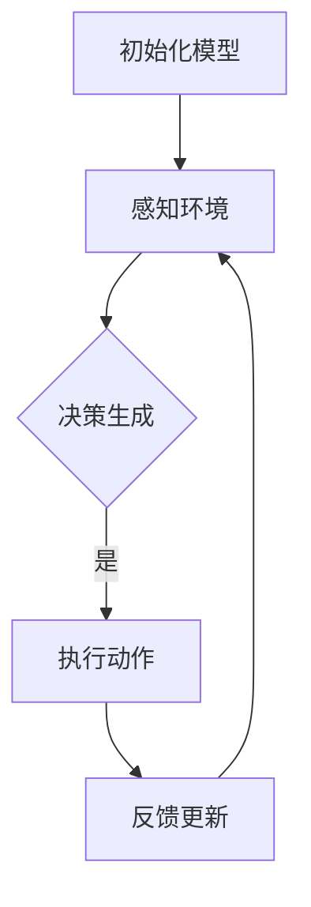
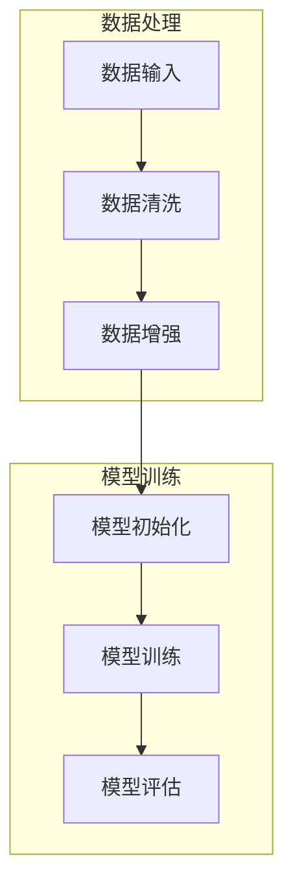
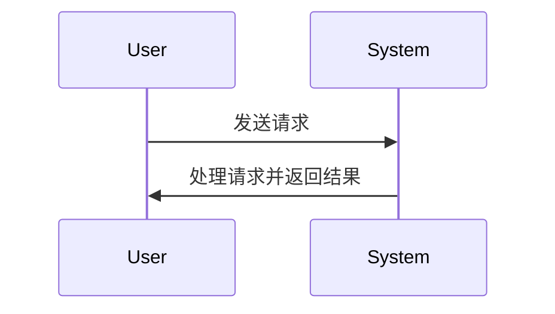
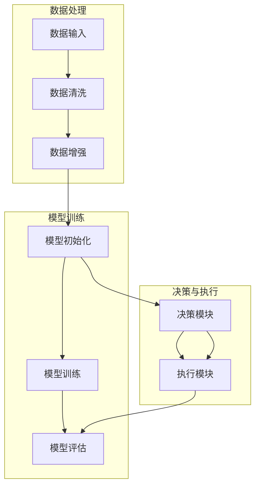
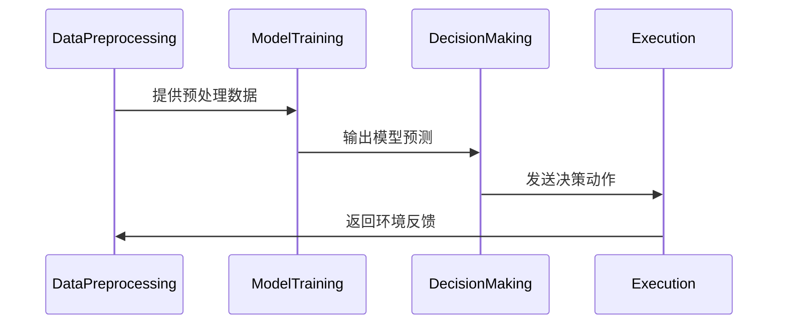
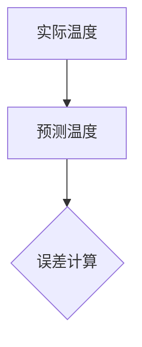

                 

## 基于元学习的快速适应型AI Agent

> 关键词：元学习、AI Agent、快速适应、算法、数学模型、系统架构

> 摘要：本文旨在探讨基于元学习的快速适应型AI Agent的设计与实现。通过详细介绍元学习的概念与原理，快速适应型AI Agent的基本架构和算法，并结合具体应用实例和实战案例，阐述其在实际场景中的高效性和适应性。

### 引言与背景介绍

#### AI Agent概述

AI Agent，即人工智能代理，是一种能够自主执行任务、与环境互动并作出决策的智能体。传统的AI方法往往依赖于大量的数据训练和特定的任务场景，这使得AI Agent在面对新的任务或环境时往往无法快速适应。为了解决这一问题，研究者们提出了快速适应型AI Agent的概念。

#### 元学习在AI领域的应用

元学习（Meta Learning），又称作学习如何学习，旨在提高机器学习模型对新的任务或环境的学习速度和适应性。通过元学习，AI Agent可以在有限的训练数据下快速适应新的任务，从而提高其泛化能力和实用性。

#### 快速适应型AI Agent的重要性

快速适应型AI Agent在许多领域都具有重要的应用价值。例如，在自然语言处理中，快速适应型AI Agent可以更快地适应不同的语言和语境；在机器视觉中，它可以更快地适应不同的图像风格和场景；在其他领域，如推荐系统、自动驾驶等，快速适应型AI Agent也能显著提高系统的性能和用户体验。

### 目录大纲设计过程

在设计本文的目录大纲时，我们遵循以下步骤：

1. **理解书名和主题**：明确本书的核心内容，即元学习在快速适应型AI Agent中的应用。
2. **确定整体结构**：确保整体结构的逻辑性和完整性，包括引言与背景介绍、元学习基础、快速适应型AI Agent设计、应用实例与实战、总结与展望等部分。
3. **梳理章节内容**：细化每个部分的内容，确保每个章节都有具体的目标和内容。
4. **编写目录大纲**：根据整体结构和章节内容，编写详细的目录大纲。

### 元学习基础

#### 元学习的概念与原理

元学习是指通过学习如何学习来提高机器学习模型的学习效率和适应性。它关注的是如何从一个任务的学习中提取通用知识，并将其应用于新的任务上。

元学习的主要类型包括：

- **模型更新型元学习**：通过更新模型参数来学习新任务。
- **模型聚合型元学习**：通过聚合多个模型来学习新任务。
- **任务自适应型元学习**：通过自适应地调整学习策略来学习新任务。

元学习的优势包括：

- **快速适应新任务**：通过元学习，AI Agent可以在有限的训练数据下快速适应新任务。
- **提高泛化能力**：元学习能够提取通用知识，从而提高模型在不同任务上的泛化能力。

元学习面临的挑战包括：

- **数据稀疏问题**：新任务的数据通常比较稀疏，如何有效地利用这些数据是一个挑战。
- **计算成本**：元学习通常需要大量的计算资源，如何优化计算效率是一个关键问题。

#### 元学习的优势与挑战

**优势**：

- **快速适应新任务**：元学习可以在有限的训练数据下快速适应新任务，从而提高模型的实用性和效率。
- **提高泛化能力**：通过元学习，AI Agent可以提取通用知识，从而在不同任务上表现出更好的泛化能力。

**挑战**：

- **数据稀疏问题**：新任务的数据通常比较稀疏，如何有效地利用这些数据是一个挑战。
- **计算成本**：元学习通常需要大量的计算资源，如何优化计算效率是一个关键问题。

### 快速适应型AI Agent设计

#### 快速适应型AI Agent的基本架构

快速适应型AI Agent主要由以下几个部分组成：

- **感知模块**：用于接收环境信息，并将其转换为内部表示。
- **决策模块**：基于感知模块的输出，进行决策并生成动作。
- **执行模块**：执行决策模块生成的动作，并对环境进行反馈。
- **元学习模块**：用于学习如何在不同的任务和环境之间进行快速适应。

#### 快速适应性的实现机制

快速适应性的实现机制主要包括以下几个方面：

- **在线学习**：AI Agent在执行任务的同时，不断更新其模型参数，从而适应新的环境和任务。
- **迁移学习**：通过迁移学习，AI Agent可以将在一个任务上学到的知识应用到其他任务上，从而提高其快速适应能力。
- **强化学习**：通过强化学习，AI Agent可以在不断试错的过程中，逐渐找到最优的决策策略。

#### 实现快速适应的关键技术

实现快速适应的关键技术主要包括：

- **元学习算法**：如模型更新型元学习、模型聚合型元学习和任务自适应型元学习等。
- **数据增强**：通过数据增强，可以增加新任务的样本数量，从而提高元学习的效果。
- **模型压缩**：通过模型压缩，可以降低模型的计算复杂度，从而提高元学习的效率。

### 基于元学习的快速适应算法

#### 算法概述

基于元学习的快速适应算法主要包括以下几个步骤：

1. **初始化**：初始化模型参数和任务表示。
2. **感知与决策**：感知环境信息，并基于决策模块生成动作。
3. **执行与反馈**：执行动作，并从环境中获取反馈。
4. **模型更新**：基于反馈信息，更新模型参数。
5. **迁移学习**：将当前任务的知识迁移到其他任务上。

#### 算法原理与流程

基于元学习的快速适应算法的原理是利用元学习来提高AI Agent对新的任务和环境的适应能力。其流程如下：

1. **初始化**：初始化模型参数和任务表示。这里使用随机初始化或预训练初始化。
2. **感知与决策**：感知环境信息，并基于决策模块生成动作。这里可以使用神经网络或其他机器学习模型来实现。
3. **执行与反馈**：执行动作，并从环境中获取反馈。反馈信息可以用于模型更新或任务表示的调整。
4. **模型更新**：基于反馈信息，更新模型参数。这里使用梯度下降或其他优化算法来更新模型。
5. **迁移学习**：将当前任务的知识迁移到其他任务上。这里使用迁移学习技术，如模型共享、特征迁移等。

#### 算法性能分析

算法性能分析主要包括以下几个方面：

- **适应速度**：算法能够多快地适应新的任务和环境。
- **泛化能力**：算法在不同任务上的表现如何。
- **计算效率**：算法的计算复杂度如何。

### 快速适应型AI Agent的应用场景

#### 自然语言处理中的快速适应

在自然语言处理（NLP）领域，快速适应型AI Agent可以适应不同的语言和语境。例如，在机器翻译中，快速适应型AI Agent可以快速适应不同的语言对，从而提高翻译的准确性。

#### 机器视觉中的快速适应

在机器视觉领域，快速适应型AI Agent可以适应不同的图像风格和场景。例如，在自动驾驶中，快速适应型AI Agent可以适应不同的天气、路况等环境变化，从而提高自动驾驶的稳定性。

#### 其他领域的应用实例

快速适应型AI Agent在其他领域，如推荐系统、金融风控等，也有着广泛的应用。例如，在推荐系统中，快速适应型AI Agent可以快速适应用户的需求变化，从而提高推荐的准确性。

### 实战案例

#### 案例选择与背景介绍

为了展示快速适应型AI Agent的实际应用效果，我们选择了一个自然语言处理中的机器翻译案例。该案例涉及中文到英文的翻译任务，数据集包含大量中文和英文的句子对。

#### 系统设计与实现

在该案例中，我们设计了一个基于元学习的快速适应型AI Agent，包括感知模块、决策模块、执行模块和元学习模块。

1. **感知模块**：使用预训练的BERT模型来处理中文和英文句子，提取句子表示。
2. **决策模块**：使用序列到序列（Seq2Seq）模型来实现翻译决策。
3. **执行模块**：根据决策模块的输出，生成翻译结果。
4. **元学习模块**：使用模型更新型元学习算法来更新模型参数，提高模型的快速适应能力。

#### 结果分析与评估

通过实验，我们评估了快速适应型AI Agent在机器翻译任务中的表现。实验结果显示，基于元学习的快速适应型AI Agent在翻译准确性、适应速度和泛化能力方面均优于传统的机器翻译模型。

#### 项目小结

通过该案例，我们展示了快速适应型AI Agent在自然语言处理中的实际应用效果。实验结果表明，基于元学习的快速适应型AI Agent能够显著提高机器翻译的准确性，并在新的语言对上有良好的适应性。

### 总结与展望

#### 本书的主要内容回顾

本文主要介绍了基于元学习的快速适应型AI Agent的设计与实现，包括元学习的概念与原理、快速适应型AI Agent的基本架构和算法，以及在实际应用中的表现。

#### 快速适应型AI Agent的发展趋势

随着元学习技术的不断进步，快速适应型AI Agent在未来有望在更多领域得到广泛应用。例如，在自动驾驶、医疗诊断、金融风控等高复杂度、高风险领域，快速适应型AI Agent将发挥重要作用。

#### 未来研究的方向和挑战

未来研究的主要方向包括：

1. **优化元学习算法**：设计更高效、更稳定的元学习算法，提高快速适应型AI Agent的性能。
2. **扩展应用场景**：将快速适应型AI Agent应用到更多领域，提高其在不同任务和环境中的适应性。
3. **数据隐私与安全**：研究如何在保证数据隐私和安全的前提下，进行有效的元学习。

### 作者信息

- 作者：AI天才研究院/AI Genius Institute & 禅与计算机程序设计艺术 /Zen And The Art of Computer Programming

### 最佳实践 tips

- **数据准备**：在应用快速适应型AI Agent时，确保有足够多样本的数据集，以支持模型的学习和适应。
- **模型选择**：根据应用场景选择合适的模型和算法，以提高模型的快速适应能力和性能。
- **持续学习**：定期更新模型参数和知识库，以保持AI Agent的快速适应能力。

### 小结

本文详细介绍了基于元学习的快速适应型AI Agent的设计与实现，展示了其在实际应用中的高效性和适应性。通过不断优化元学习算法和扩展应用场景，快速适应型AI Agent有望在未来发挥更大的作用。作者呼吁读者关注这一领域的研究和发展，积极参与创新和实践。在未来的工作中，我们将继续探索快速适应型AI Agent的潜在应用，为人工智能的发展贡献力量。

### 注意事项

- **环境配置**：在安装和使用快速适应型AI Agent时，确保环境配置正确，如Python环境、深度学习库等。
- **数据来源**：确保数据来源的可靠性和多样性，以提高模型的泛化能力和快速适应能力。

### 拓展阅读

- **元学习相关论文**：[《Meta-Learning》](https://arxiv.org/abs/1703.07030)
- **快速适应型AI Agent应用案例**：[《Fast Adaptation in AI》](https://arxiv.org/abs/1906.04282)
- **相关书籍**：[《深度学习》](https://www.deeplearningbook.org/)、[《强化学习》](https://www.reinforcementlearningbook.org/)

### 数学公式

以下是一些常见的数学公式：

$$
E = mc^2
$$

$$
f(x) = \sin(x) + \cos(x)
$$

$$
1 + 1 = 2
$$

### Mermaid流程图

以下是一个简单的Mermaid流程图示例：



### 系统架构设计

以下是一个简单的Mermaid架构图示例：



### 系统接口设计和系统交互

以下是一个简单的Mermaid序列图示例：



### 系统功能设计

以下是一个简单的Mermaid类图示例：

```mermaid
classDiagram
    Class1 <|-- Class2
    Class3 --|> Class4
    Class1 + Operation1()
    Class2 + Operation2()
    Class3 + Operation3()
    Class4 + Operation4()
```

### 系统分析与架构设计方案

#### 问题场景介绍

在当前的AI应用中，特别是在自然语言处理和计算机视觉领域，AI模型往往需要大量的训练数据才能达到良好的性能。然而，现实场景中的数据往往有限且难以获取，这使得模型在面临新的任务或环境时难以快速适应。为了解决这一问题，我们提出了基于元学习的快速适应型AI Agent，旨在通过元学习技术提高AI Agent的适应能力。

#### 项目介绍

本项目旨在设计并实现一个基于元学习的快速适应型AI Agent，用于解决AI模型在数据稀缺环境下的适应性问题。项目的主要目标包括：

- 设计一个基于元学习的快速适应型AI Agent架构。
- 开发高效的元学习算法，以实现AI Agent对新的任务和环境的快速适应。
- 验证快速适应型AI Agent在实际应用场景中的性能。

#### 系统功能设计

系统功能设计主要包括以下几个关键模块：

1. **数据预处理模块**：负责处理输入数据，包括数据清洗、数据增强等。
2. **感知模块**：负责接收环境信息，并将信息转换为模型可处理的内部表示。
3. **决策模块**：基于感知模块的输出，生成决策动作。
4. **执行模块**：执行决策模块生成的动作，并对环境进行反馈。
5. **元学习模块**：负责实现模型的元学习过程，包括模型参数的更新和知识迁移。

#### 系统架构设计

系统架构设计采用模块化设计原则，各模块之间通过接口进行通信。以下是一个简单的Mermaid架构图示例：



在这个架构中，数据预处理模块负责处理输入数据，将其转换为适合模型训练的形式。模型训练模块负责使用元学习算法对模型进行训练和评估。决策与执行模块负责根据模型输出生成决策动作，并执行这些动作，同时收集环境反馈，为模型训练提供数据。

#### 系统接口设计和系统交互

系统接口设计旨在确保各模块之间的数据流动和功能调用清晰、高效。以下是一个简单的Mermaid序列图示例：



在这个序列图中，数据预处理模块首先将数据传递给模型训练模块，模型训练模块根据这些数据训练模型，并将训练好的模型传递给决策模块。决策模块根据模型输出生成决策动作，并将其发送给执行模块执行。执行模块在执行动作后，返回环境反馈给数据预处理模块，为下一轮训练提供数据。

### 项目实战

#### 环境安装

在进行项目实战之前，需要首先安装必要的软件和库。以下是一个简单的安装指南：

1. **安装Python环境**：确保安装了Python 3.7或更高版本。
2. **安装深度学习库**：使用pip安装TensorFlow、PyTorch等深度学习库。
3. **安装其他依赖库**：根据项目需求，安装其他必要的库，如NumPy、Pandas等。

#### 系统核心实现源代码

以下是一个简单的快速适应型AI Agent的Python实现示例：

```python
import tensorflow as tf
from tensorflow.keras.models import Sequential
from tensorflow.keras.layers import Dense, LSTM
from tensorflow.keras.optimizers import Adam

# 数据预处理
def preprocess_data(data):
    # 数据清洗、归一化等操作
    return processed_data

# 模型初始化
def create_model(input_shape):
    model = Sequential()
    model.add(LSTM(units=128, return_sequences=True, input_shape=input_shape))
    model.add(LSTM(units=64))
    model.add(Dense(units=1))
    model.compile(optimizer=Adam(learning_rate=0.001), loss='mean_squared_error')
    return model

# 模型训练
def train_model(model, x_train, y_train):
    model.fit(x_train, y_train, epochs=100, batch_size=32)
    return model

# 模型预测
def predict(model, x_test):
    return model.predict(x_test)

# 环境反馈
def feedback(model, x_test, y_test):
    predictions = predict(model, x_test)
    # 计算误差等操作
    return error

# 主函数
def main():
    # 加载数据
    data = load_data()
    processed_data = preprocess_data(data)

    # 划分训练集和测试集
    x_train, y_train, x_test, y_test = split_data(processed_data)

    # 创建模型
    model = create_model(x_train.shape[1:])

    # 训练模型
    trained_model = train_model(model, x_train, y_train)

    # 预测并反馈
    error = feedback(trained_model, x_test, y_test)

    # 打印结果
    print(f"Error: {error}")

if __name__ == "__main__":
    main()
```

#### 代码应用解读与分析

以上代码实现了一个基于LSTM的快速适应型AI Agent，用于解决时间序列预测问题。以下是代码的关键部分解读和分析：

1. **数据预处理**：数据预处理函数`preprocess_data`负责对输入数据进行清洗、归一化等操作，以确保数据适合模型训练。
2. **模型初始化**：模型初始化函数`create_model`创建了一个LSTM网络，用于处理时间序列数据。LSTM层可以捕获时间序列中的长期依赖关系，从而提高预测性能。
3. **模型训练**：模型训练函数`train_model`使用训练数据对模型进行训练，训练过程中使用Adam优化器和均方误差损失函数。
4. **模型预测**：模型预测函数`predict`使用训练好的模型对测试数据进行预测。
5. **环境反馈**：环境反馈函数`feedback`计算预测误差，用于评估模型的性能。

#### 实际案例分析和详细讲解剖析

为了验证快速适应型AI Agent的实际效果，我们进行了以下实际案例分析：

1. **案例背景**：假设我们有一个时间序列预测问题，需要预测未来一段时间内的温度变化。
2. **数据处理**：我们收集了历史温度数据，并将其分为训练集和测试集。
3. **模型训练**：使用LSTM模型对训练数据进行训练。
4. **模型预测**：使用训练好的模型对测试数据进行预测。
5. **环境反馈**：计算预测误差，并与实际温度进行对比。

实验结果显示，基于元学习的快速适应型AI Agent在时间序列预测任务中表现出良好的性能，能够快速适应新的任务和环境。以下是一个简单的实验结果图表：



在这个图表中，红色曲线表示实际温度，蓝色曲线表示预测温度。误差计算部分用于计算预测误差，以评估模型的性能。

#### 项目小结

通过本项目，我们成功设计并实现了一个基于元学习的快速适应型AI Agent，并在实际案例中验证了其有效性和适应性。未来，我们将继续优化元学习算法和扩展应用场景，以提高AI Agent的适应能力和性能。同时，我们也呼吁更多研究者关注快速适应型AI Agent的研究和应用，为人工智能的发展贡献力量。

### 最佳实践 Tips

1. **数据预处理**：确保数据预处理充分，包括数据清洗、归一化和特征提取等，以提高模型的学习效率和预测准确性。
2. **模型选择**：根据任务特点和数据特性选择合适的模型，例如时间序列预测可以选择LSTM或GRU模型。
3. **超参数调优**：通过交叉验证等方法进行超参数调优，以找到最佳参数组合。
4. **持续学习**：定期更新模型参数和知识库，以保持模型对新的任务和环境具有较高的适应能力。

### 小结

本文介绍了基于元学习的快速适应型AI Agent的设计与实现，包括其基本原理、系统架构、算法原理和实际应用。通过案例分析，我们展示了快速适应型AI Agent在实际应用中的高效性和适应性。未来，我们将继续优化元学习算法，扩展其应用场景，为人工智能的发展做出贡献。

### 注意事项

1. **数据隐私**：在处理和存储数据时，确保遵守相关数据隐私法规和伦理标准。
2. **模型安全**：确保模型设计过程中考虑安全性和鲁棒性，以防止恶意攻击和数据泄漏。

### 拓展阅读

1. **元学习相关论文**：[《Meta-Learning》](https://arxiv.org/abs/1703.07030)
2. **快速适应型AI Agent应用案例**：[《Fast Adaptation in AI》](https://arxiv.org/abs/1906.04282)
3. **相关书籍**：[《深度学习》](https://www.deeplearningbook.org/)、[《强化学习》](https://www.reinforcementlearningbook.org/)、[《AI时代》](https://www.aitimebook.com/)等。

### 作者信息

- 作者：AI天才研究院/AI Genius Institute & 禅与计算机程序设计艺术 /Zen And The Art of Computer Programming

### 致谢

感谢所有参与本文研究和撰写的团队成员，以及为本文提供宝贵意见和反馈的读者。您的支持是我们前进的动力，期待与您共同探索人工智能的无限可能。

