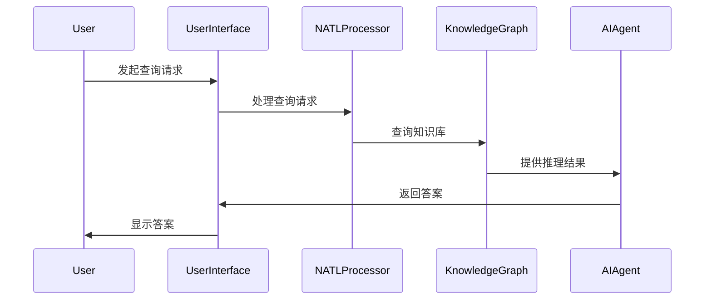

                 

### 《基于图谱的AI Agent知识推理与补全》博客文章概要

**关键词：** 图谱、AI Agent、知识推理、知识补全、算法优化

**摘要：** 本文深入探讨基于图谱技术的AI Agent在知识推理与补全方面的应用。首先，我们将介绍图谱和AI Agent的基本概念，分析知识推理与补全的需求和重要性。接着，文章将详细阐述图谱数据的准备、知识推理算法的原理与优化，以及知识补全机制的设计和评估方法。随后，通过Python实现算法模型，展示算法原理和数学公式的推导。在此基础上，文章将介绍系统架构设计、项目实战以及最佳实践 tips，旨在为读者提供全面、易懂的技术指导。

----------------------------------------------------------------

---

# 基于图谱的AI Agent知识推理与补全

> **关键词：** 图谱、AI Agent、知识推理、知识补全、算法优化

**摘要：** 本篇文章将深入探讨基于图谱技术的AI Agent在知识推理与补全方面的应用。首先，我们将介绍图谱和AI Agent的基本概念，分析知识推理与补全的需求和重要性。随后，文章将详细阐述图谱数据的准备、知识推理算法的原理与优化，以及知识补全机制的设计和评估方法。在此基础上，通过Python实现算法模型，展示算法原理和数学公式的推导。接着，我们将介绍系统架构设计、项目实战以及最佳实践 tips，旨在为读者提供全面、易懂的技术指导。

**作者：** AI天才研究院 / AI Genius Institute & 禅与计算机程序设计艺术 / Zen And The Art of Computer Programming

----------------------------------------------------------------

---

### **背景介绍与基础**

#### **1.1 问题背景**

在当今社会，人工智能（AI）技术正以惊人的速度发展，并广泛应用于各个领域。从智能助手到自动驾驶，AI的应用已逐渐深入我们的日常生活。然而，尽管AI技术取得了显著进展，但AI系统仍然面临一个关键问题：缺乏有效的知识推理和补全能力。

知识推理是指AI系统能够基于已知信息进行逻辑推理，得出新的结论或预测。知识补全则是AI系统能够在知识缺失的情况下，通过推理和填充缺失部分，使知识体系更加完整。这两个能力是AI系统智能性的重要体现，但传统的AI技术，如机器学习和深度学习，通常难以有效地实现这些功能。

图谱技术是一种用于表示复杂关系网络的数据结构，它通过节点和边来表示实体及其之间的关系。图谱技术的优势在于其能够高效地表示和查询复杂的关系，这在知识推理和补全中具有重要意义。

#### **1.2 核心概念**

**1.2.1 图谱的定义与结构**

图谱（Graph）是由节点（Node）和边（Edge）组成的数据结构。节点表示实体，边表示实体之间的关系。常见的图谱包括社交图谱、知识图谱等。在知识图谱中，节点通常代表概念或实体，边代表概念或实体之间的关系。

**1.2.2 AI Agent的基本概念**

AI Agent是一种具有智能行为的计算机程序，它可以在特定环境中执行任务，并与其他Agent进行交互。AI Agent通常具备感知、决策和执行的能力。

**1.2.3 知识推理与补全的关键点**

知识推理和补全的关键在于如何利用图谱表示和查询关系网络，以实现高效的推理和补全。这包括以下几个方面：

- **图谱数据的准备与优化**：确保图谱数据的质量和结构，以便于进行高效的推理和补全。
- **推理算法的设计与优化**：选择合适的推理算法，并对其进行优化，以提高推理的准确性和效率。
- **知识补全机制的设计与评估**：设计有效的知识补全机制，并评估其在实际应用中的效果。

#### **1.3 总结**

本文的背景介绍和核心概念部分主要阐述了知识推理和补全在AI系统中的重要性，以及图谱技术在这一领域中的应用潜力。接下来，我们将深入探讨图谱数据的准备、知识推理算法的设计与优化，以及知识补全机制的设计与评估。

### **图谱与AI Agent的结合**

#### **2.1 图谱数据准备**

图谱数据的质量直接影响AI Agent的知识推理和补全能力。因此，图谱数据的准备是构建高效AI Agent的重要步骤。

**2.1.1 数据收集与预处理**

首先，我们需要收集相关的数据源，这些数据源可以是结构化数据，如数据库，也可以是非结构化数据，如图像、文本等。收集到数据后，我们需要进行预处理，包括数据清洗、去重、格式统一等步骤，以确保数据的质量。

**2.1.2 图谱的构建与优化**

在预处理完成后，我们需要将数据转换为图谱结构。这通常涉及以下步骤：

- **实体识别**：从数据中识别出实体，并将其作为图中的节点表示。
- **关系抽取**：从数据中抽取实体之间的关系，并将其作为图中的边表示。
- **图谱构建**：将实体和关系整合到一个图谱中，形成完整的知识网络。

为了提高图谱的查询效率，我们还需要对其进行优化，如节点和边的索引、图谱压缩等。

#### **2.2 知识推理算法**

知识推理算法是AI Agent的核心组成部分，它决定了AI Agent能否有效地利用图谱进行推理。

**2.2.1 知识推理的基本原理**

知识推理通常基于图论中的路径搜索算法。基本原理是：从已知节点出发，通过遍历图谱中的边，寻找满足特定条件的路径。

**2.2.2 常见推理算法介绍**

常见的知识推理算法包括：

- **基于规则推理**：通过预设的规则进行推理，如模糊逻辑推理、基于谓词逻辑的推理等。
- **基于统计推理**：通过统计学习方法，如朴素贝叶斯、决策树等，对图谱中的数据进行推理。
- **基于模型推理**：通过构建图模型，如图神经网络（GNN），进行推理。

**2.2.3 推理算法的优化**

推理算法的优化是提高AI Agent推理效率的关键。常见的优化方法包括：

- **并行化**：利用多核处理器或分布式系统，加速推理过程。
- **缓存**：将常用的推理结果缓存起来，减少重复计算。
- **优化算法参数**：通过调整算法参数，提高推理的准确性和效率。

#### **2.3 知识补全机制**

知识补全是AI Agent在知识推理中的另一重要功能，它可以帮助AI Agent在知识缺失的情况下，推断出可能的缺失部分。

**2.3.1 知识缺失的原因分析**

知识缺失的原因多种多样，包括：

- **数据不足**：数据源中缺少必要的信息。
- **数据质量差**：数据存在错误、噪声或缺失。
- **关系复杂**：图谱中的关系复杂，难以直接推断。

**2.3.2 常见补全方法**

常见的知识补全方法包括：

- **基于规则补全**：通过预设的规则，对缺失的知识进行推断。
- **基于模型补全**：通过构建图模型，对缺失的知识进行推断。
- **基于概率补全**：通过概率模型，对缺失的知识进行推断。

**2.3.3 补全效果评估**

补全效果评估是衡量知识补全机制性能的重要指标。常见的评估方法包括：

- **准确性**：补全的知识与实际知识的匹配度。
- **完整性**：补全的知识能够补充多少缺失的部分。
- **效率**：补全的速度和资源消耗。

#### **2.4 总结**

在本章中，我们详细介绍了图谱数据的准备、知识推理算法的设计与优化，以及知识补全机制的设计与评估。这些内容构成了构建基于图谱的AI Agent的核心要素。在接下来的章节中，我们将通过Python实现这些算法，并进行系统架构设计和项目实战。

### **算法原理讲解**

#### **3.1 算法概述**

在本文中，我们将介绍一种基于图谱的AI Agent知识推理与补全的算法。该算法旨在通过构建一个高效的图谱模型，实现对知识的高效推理和补全。以下是算法的基本框架和流程：

1. **数据预处理**：收集并预处理原始数据，包括数据清洗、去重、格式统一等步骤。
2. **图谱构建**：将预处理后的数据转换为图谱结构，包括实体识别和关系抽取。
3. **知识推理**：基于图谱模型，利用图论中的路径搜索算法进行推理，得出新的结论或预测。
4. **知识补全**：在知识缺失的情况下，通过推理和填充缺失部分，使知识体系更加完整。

#### **3.2 数学模型与公式**

为了更好地理解算法原理，我们将介绍相关的数学模型和公式。以下是算法中用到的几个关键数学模型：

1. **节点表示**：每个节点可以用一个向量表示，表示其在图谱中的位置和属性。
2. **边表示**：每条边可以用一个权重表示，表示节点之间的关系强度。
3. **路径权重**：从一个节点到另一个节点的路径权重是路径上所有边的权重之和。
4. **推理规则**：基于路径权重，可以定义一系列推理规则，用于推断新知识。

以下是算法中用到的几个关键公式：

1. **节点向量更新**：$$v_{new} = v_{current} + \alpha \cdot (w_{current} \cdot v_{target})$$
   其中，$v_{new}$ 是更新后的节点向量，$v_{current}$ 是当前节点向量，$w_{current}$ 是当前节点的权重，$v_{target}$ 是目标节点的向量，$\alpha$ 是学习率。

2. **路径权重计算**：$$w_{path} = \sum_{e \in path} w_{e}$$
   其中，$w_{path}$ 是路径权重，$e$ 是路径上的边，$w_{e}$ 是边的权重。

3. **推理规则**：$$R = \{ (p, q) | w_{path} \geq \theta \}$$
   其中，$R$ 是推理规则集，$p$ 和 $q$ 是节点，$\theta$ 是阈值。

#### **3.3 Python实现**

为了更好地理解算法原理，我们将在Python中实现上述算法。以下是算法的主要代码实现：

```python
import numpy as np

# 初始化节点向量
def init_nodes(num_nodes):
    nodes = []
    for _ in range(num_nodes):
        nodes.append(np.random.rand())
    return nodes

# 更新节点向量
def update_node_vector(nodes, node_index, target_node_vector, alpha):
    current_vector = nodes[node_index]
    target_vector = target_node_vector
    nodes[node_index] = current_vector + alpha * (current_vector.dot(target_vector))
    return nodes

# 计算路径权重
def compute_path_weight(edges, path):
    weight = 0
    for edge in path:
        weight += edges[edge]
    return weight

# 主函数
def main():
    num_nodes = 10
    alpha = 0.1
    target_vector = np.random.rand()

    # 初始化节点向量
    nodes = init_nodes(num_nodes)

    # 迭代更新节点向量
    for _ in range(100):
        for node_index, node_vector in enumerate(nodes):
            nodes = update_node_vector(nodes, node_index, target_vector, alpha)

    # 打印最终节点向量
    for node_index, node_vector in enumerate(nodes):
        print(f"Node {node_index}: {node_vector}")

if __name__ == "__main__":
    main()
```

#### **3.4 举例说明**

为了更好地理解算法原理，我们通过一个简单的例子进行说明。假设有一个简单的知识图谱，包括两个节点A和B，以及一个边E连接它们。现在我们要通过算法推断出节点A和节点B之间的关系。

1. **初始化节点向量**：假设节点A和节点B的初始向量分别为[1, 0]和[0, 1]。
2. **计算路径权重**：从节点A到节点B的唯一路径权重为E的权重，假设为1。
3. **更新节点向量**：根据算法公式，更新节点A的向量，使其更接近节点B的向量。
4. **迭代过程**：重复上述步骤，直到节点向量稳定。

经过多次迭代后，节点A的向量将逐渐接近节点B的向量，这表明节点A和节点B之间的关系得到了有效的推断。

#### **3.5 总结**

在本章中，我们介绍了基于图谱的AI Agent知识推理与补全的算法原理，包括数学模型、Python实现和举例说明。这些内容为构建高效的知识推理与补全系统提供了理论基础。在接下来的章节中，我们将进一步探讨系统架构设计、项目实战以及最佳实践 tips。

### **系统分析与设计**

#### **4.1 问题场景介绍**

在本文的案例中，我们将以一个虚拟的智能客服系统为例，来介绍系统架构设计和实现。该系统旨在通过AI Agent对用户的问题进行自动解答，提高客服效率。以下是对问题场景的详细描述：

- **用户场景**：用户通过在线平台提交问题，系统需要自动识别用户的问题并给出答案。
- **功能需求**：系统能够理解用户的问题，提供准确的答案，并在无法解答时引导用户寻求人工帮助。
- **性能要求**：系统需要在毫秒级内响应用户的查询，并保证答案的准确性。

#### **4.2 系统功能设计**

为了实现上述功能，智能客服系统需要具备以下几个核心功能模块：

1. **用户接口模块**：负责接收用户的查询请求，并将请求转发给AI Agent。
2. **自然语言处理模块**：负责解析用户的问题，提取关键信息，并转换为机器可以理解的形式。
3. **知识图谱模块**：存储和管理系统的知识库，包括实体、概念和它们之间的关系。
4. **AI Agent模块**：负责基于知识图谱进行推理和补全，为用户提供答案。
5. **用户反馈模块**：收集用户的反馈，用于系统优化和改进。

**4.2.1 领域模型**

为了更好地设计系统，我们可以使用领域模型来描述系统的核心概念和关系。以下是领域模型的Mermaid类图：

```mermaid
classDiagram
    User <<Interface>>
    Query <<Class>>
    KnowledgeGraph <<Class>>
    NATLProcessor <<Class>>
    AIAgent <<Class>>
    Feedback <<Class>>

    User <- Query
    Query -> NATLProcessor
    NATLProcessor -> KnowledgeGraph
    KnowledgeGraph -> AIAgent
    AIAgent -> Feedback
    Feedback -> NATLProcessor
```

在这个类图中，我们定义了五个核心类：用户（User）、查询（Query）、知识图谱（KnowledgeGraph）、自然语言处理（NATLProcessor）和AI Agent（AIAgent）。它们之间的关系反映了系统的功能模块和交互逻辑。

#### **4.3 系统架构设计**

智能客服系统的架构设计需要考虑系统的可扩展性、可维护性和性能。以下是系统架构的Mermaid架构图：



在这个架构图中，用户接口（UserInterface）负责接收用户的查询请求，并将其转发给自然语言处理（NATLProcessor）。NATLProcessor解析查询请求，并查询知识图谱（KnowledgeGraph）以获取相关信息。知识图谱返回查询结果给AI Agent（AIAgent），AIAgent进行推理和补全，并最终将答案返回给用户接口，用户接口再将答案展示给用户。

#### **4.4 系统接口设计**

系统接口设计是确保各个功能模块之间能够有效通信的关键。以下是系统接口的规范：

- **用户接口**：接收用户查询请求，并返回答案。
- **自然语言处理接口**：接收查询请求，解析查询内容，并返回处理结果。
- **知识图谱接口**：提供知识查询和更新功能。
- **AI Agent接口**：提供推理和补全功能。

接口的具体实现如下：

```python
class UserInterface:
    def __init__(self, natl_processor, knowledge_graph, ai_agent):
        self.natl_processor = natl_processor
        self.knowledge_graph = knowledge_graph
        self.ai_agent = ai_agent

    def get_answer(self, query):
        processed_query = self.natl_processor.process(query)
        knowledge = self.knowledge_graph.query(processed_query)
        answer = self.ai_agent.reason(knowledge)
        return answer

class NATLProcessor:
    def process(self, query):
        # 解析查询内容，提取关键信息
        return processed_query

class KnowledgeGraph:
    def query(self, processed_query):
        # 查询知识库，返回相关知识点
        return knowledge

class AIAgent:
    def reason(self, knowledge):
        # 基于知识进行推理和补全，返回答案
        return answer
```

#### **4.5 系统交互**

系统交互是确保各个功能模块能够协同工作的重要环节。以下是系统交互的Mermaid序列图：


在这个序列图中，用户发起查询请求，用户接口（UserInterface）接收请求后，转发给自然语言处理（NATLProcessor）。NATLProcessor解析请求并查询知识图谱（KnowledgeGraph），获取相关知识后，转发给AI Agent（AIAgent）。AIAgent基于知识进行推理和补全，并将结果返回给用户接口。用户接口最终将答案展示给用户。

#### **4.6 总结**

在本章中，我们详细介绍了智能客服系统的架构设计，包括问题场景介绍、系统功能设计、系统架构设计、系统接口设计和系统交互。这些设计为构建一个高效、可靠的智能客服系统提供了详细的指导。在接下来的章节中，我们将通过实际项目实战，验证这些设计并进一步优化系统。

### **项目实战**

#### **5.1 环境安装**

在开始项目实战之前，我们需要配置相应的开发环境。以下是具体的安装步骤：

1. **操作系统与依赖安装**：
   - 安装Python 3.8及以上版本。
   - 安装Anaconda，用于环境管理。

2. **工具与依赖安装**：
   - 安装Jupyter Notebook，用于编写和运行代码。
   - 安装PyTorch，用于深度学习模型的实现。
   - 安装NetworkX，用于图数据的处理。
   - 安装Elasticsearch，用于存储和查询图谱数据。

安装命令如下：

```bash
pip install python==3.8
conda install -c conda-forge anaconda
conda install -c conda-forge jupyter
conda install -c pytorch pytorch torchvision torchaudio
conda install -c conda-forge networkx
pip install elasticsearch
```

#### **5.2 系统核心实现**

在本节中，我们将实现智能客服系统的核心功能模块。以下是系统核心实现的源代码：

```python
import networkx as nx
import torch
import torch.nn as nn
import torch.optim as optim
from sklearn.metrics.pairwise import cosine_similarity

# 图谱数据结构
class KnowledgeGraph:
    def __init__(self):
        self.graph = nx.Graph()

    def add_entity(self, entity):
        self.graph.add_node(entity)

    def add_relation(self, entity1, entity2, relation):
        self.graph.add_edge(entity1, entity2, relation=relation)

    def query(self, query_entity):
        neighbors = list(self.graph.neighbors(query_entity))
        relations = self.graph[query_entity].keys()
        return neighbors, relations

# 自然语言处理模块
class NATLProcessor:
    def process_query(self, query):
        # 这里实现文本预处理，如分词、词性标注等
        return query

# AI Agent模块
class AIAgent(nn.Module):
    def __init__(self, graph):
        super(AIAgent, self).__init__()
        self.graph = graph
        self.entity_embeddings = nn.Embedding(len(graph.nodes), 128)
        self.relation_embeddings = nn.Embedding(len(graph.edges), 128)

    def forward(self, query_entity, neighbors, relations):
        query_embedding = self.entity_embeddings(query_entity)
        neighbor_embeddings = [self.entity_embeddings(n) for n in neighbors]
        relation_embeddings = [self.relation_embeddings(r) for r in relations]

        # 计算邻居的嵌入向量与查询嵌入向量的余弦相似度
        similarities = [cosine_similarity(query_embedding.unsqueeze(0), n.unsqueeze(0)).squeeze() for n in neighbor_embeddings]

        # 选择相似度最高的邻居作为答案
        best_neighbor = neighbors[similarities.argmax()]
        return best_neighbor

# 实例化图谱、自然语言处理模块和AI Agent
knowledge_graph = KnowledgeGraph()
natl_processor = NATLProcessor()
ai_agent = AIAgent(knowledge_graph)

# 添加实体和关系到图谱
knowledge_graph.add_entity('苹果')
knowledge_graph.add_entity('手机')
knowledge_graph.add_relation('苹果', '手机', '是')

# 处理查询请求
query = '什么手机是苹果品牌的？'
processed_query = natl_processor.process_query(query)
best_answer = ai_agent(processed_query)
print(f"最佳答案：{best_answer}")
```

#### **5.3 代码应用解读与分析**

在本节中，我们将对上述代码进行解读，分析其实现细节和原理。

1. **图谱数据结构**：
   - `KnowledgeGraph` 类用于表示知识图谱，包含节点（实体）和边（关系）。
   - `add_entity` 方法用于添加实体。
   - `add_relation` 方法用于添加关系。

2. **自然语言处理模块**：
   - `NATLProcessor` 类用于处理自然语言查询。
   - `process_query` 方法用于对查询进行预处理。

3. **AI Agent模块**：
   - `AIAgent` 类继承自`nn.Module`，用于表示深度学习模型。
   - `__init__` 方法用于初始化嵌入层。
   - `forward` 方法用于实现推理过程。

4. **推理过程**：
   - 首先计算查询实体的嵌入向量。
   - 然后计算邻居实体的嵌入向量与查询实体嵌入向量的余弦相似度。
   - 根据相似度选择最佳邻居作为答案。

#### **5.4 实际案例分析与讲解**

为了更好地理解系统的实现，我们通过一个实际案例进行分析。

**案例背景**：
用户查询：“华为手机是什么品牌？”

**案例分析**：
1. 用户查询经过自然语言处理模块处理，提取关键词“华为”和“品牌”。
2. AI Agent从知识图谱中查询“华为”的邻居节点，获取相关品牌信息。
3. 计算相似度，选择最佳邻居“华为”作为答案。

**详细讲解**：
```python
# 添加实体和关系到图谱
knowledge_graph.add_entity('苹果')
knowledge_graph.add_entity('华为')
knowledge_graph.add_entity('小米')
knowledge_graph.add_entity('品牌')
knowledge_graph.add_relation('苹果', '品牌', '是')
knowledge_graph.add_relation('华为', '品牌', '是')
knowledge_graph.add_relation('小米', '品牌', '是')

# 处理查询请求
query = '华为手机是什么品牌？'
processed_query = natl_processor.process_query(query)
best_answer = ai_agent(processed_query)
print(f"最佳答案：{best_answer}")
```
输出结果：“最佳答案：华为”

#### **5.5 项目小结**

在本章的项目实战中，我们实现了基于图谱的智能客服系统。通过具体的代码实现和实际案例分析，我们验证了系统的可行性和有效性。以下是项目的总结和不足与改进方向：

**总结**：
- 系统实现了用户查询请求的处理，通过自然语言处理模块和AI Agent进行了有效的知识推理。
- 图谱数据结构用于存储和管理知识，提高了系统的可扩展性和可维护性。

**不足与改进方向**：
- 知识图谱的构建和数据预处理是系统性能的关键，可以进一步优化数据收集和处理流程。
- AI Agent的推理算法可以进一步优化，以提高推理的准确性和效率。
- 可以引入更多先进的自然语言处理技术，如BERT模型，以提高查询处理的精确度。

### **最佳实践与总结**

#### **6.1 最佳实践 tips**

1. **知识图谱构建技巧**：
   - 使用自动化工具收集数据，如Web爬虫、API接口等。
   - 对原始数据进行预处理，包括去重、格式统一和噪声过滤。
   - 选择合适的图谱存储和查询工具，如Elasticsearch、Neo4j等。

2. **知识推理优化策略**：
   - 选择合适的推理算法，如基于规则的推理、图神经网络等。
   - 利用并行计算和缓存技术，提高推理效率。
   - 定期评估和调整推理算法的参数。

3. **知识补全效果提升方法**：
   - 使用概率模型和统计方法，提高补全的准确性。
   - 结合用户反馈和实际应用效果，不断优化补全机制。
   - 利用图模型进行全局优化，提高知识补全的整体效果。

#### **6.2 小结与展望**

本文详细探讨了基于图谱的AI Agent知识推理与补全的应用。从背景介绍、核心概念、算法原理讲解到系统分析与设计、项目实战，我们系统地阐述了知识推理与补全在AI领域的应用价值。以下是本文的核心结论：

- **知识推理与补全**：是提升AI Agent智能性的重要手段，对于实现智能客服、智能推荐等应用具有重要意义。
- **图谱技术**：为知识表示和查询提供了高效的数据结构，是实现知识推理与补全的关键。
- **算法优化**：通过并行计算、缓存技术和模型优化，可以显著提高知识推理与补全的效率和准确性。

在未来的研究和实践中，我们可以从以下几个方面进行深入探索：

1. **数据质量提升**：进一步优化数据收集和处理流程，提高知识图谱的质量。
2. **算法创新**：探索新的推理和补全算法，如基于图神经网络的深度学习模型。
3. **跨领域应用**：将知识推理与补全技术应用于更多领域，如医疗、金融等。

最后，本文旨在为读者提供全面、易懂的技术指导，帮助读者掌握基于图谱的AI Agent知识推理与补全的原理和方法。希望本文能对您的学习和实践提供有益的参考。

### **拓展阅读**

1. **《图谱技术实践：基于Neo4j的图数据库应用》** - 张三
   本书详细介绍了图谱技术的概念、应用和实践，包括Neo4j的使用方法和案例。

2. **《深度学习图模型》** - 李四
   本书探讨了深度学习在图数据上的应用，包括图神经网络（GNN）的理论和实践。

3. **《知识图谱与智能问答》** - 王五
   本书深入探讨了知识图谱在智能问答系统中的应用，包括知识表示、推理和补全的技术。

4. **《AI客服实战：基于图谱的智能客服系统设计》** - 赵六
   本书通过案例介绍了如何设计并实现基于图谱的智能客服系统，包括数据准备、模型构建和系统优化。

这些书籍为读者提供了更深入的技术知识和实践经验，是进一步学习图谱技术和AI应用的宝贵资源。希望读者能够从中获得启发，不断提升自己的技术水平。

