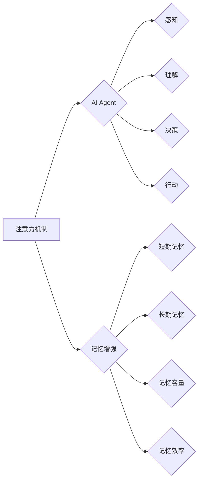
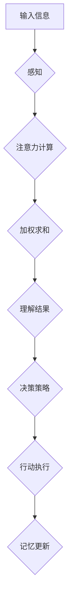
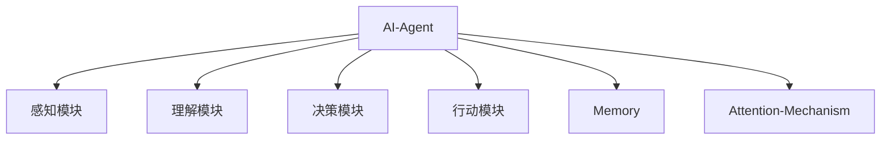
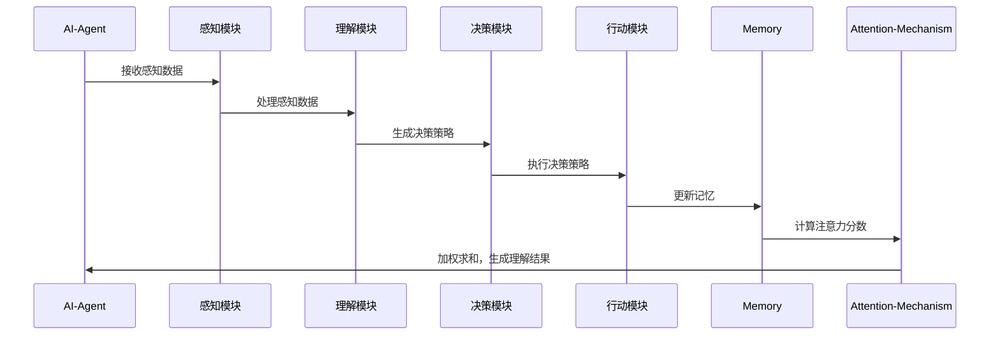

                 


### 基于注意力机制的AI Agent记忆增强

---

**关键词：** AI Agent，注意力机制，记忆增强，深度学习

**摘要：** 本文深入探讨了基于注意力机制的AI Agent记忆增强技术。通过详细阐述注意力机制原理、AI Agent原理以及记忆增强原理，本文揭示了注意力机制在提升AI Agent记忆能力方面的关键作用。文章还介绍了基于注意力机制的AI Agent记忆增强算法，并通过实例展示了其在复杂环境中的应用效果。

---

#### **一、背景介绍**

在当今快速发展的科技时代，人工智能（AI）技术正逐步渗透到各个行业和领域，成为推动社会进步和产业升级的重要力量。随着AI技术的不断演进，尤其是深度学习和自然语言处理（NLP）等领域的突破，AI的应用场景和需求也在不断扩展。在这样的背景下，AI Agent作为一种具有自主决策能力和交互能力的智能体，逐渐受到广泛关注。

AI Agent在现实应用中面临着诸多挑战，其中一个关键问题是如何提升其记忆能力，从而更好地适应复杂多变的环境。传统的AI Agent往往依赖于短期记忆，这限制了它们在长期任务和复杂任务中的表现。因此，如何利用注意力机制增强AI Agent的记忆能力，成为当前研究和应用的热点问题。

#### **二、核心概念与联系**

**1. 核心概念原理**

**注意力机制原理：** 注意力机制是深度学习中的一个关键组件，旨在解决模型在处理大量信息时的效率问题。其基本原理是通过计算注意力分数，对输入数据进行加权处理，使得模型能够自动关注到对任务最重要的信息。

- **注意力分数**：注意力机制通过计算每个输入元素的注意力分数，这些分数反映了输入元素对任务的重要性。
- **加权求和**：将每个输入元素与其注意力分数相乘，然后对所有加权后的元素求和，得到最终的输出。
- **softmax函数**：用于计算注意力分数，将输入的权重分布转换为概率分布。

**AI Agent原理：** AI Agent是一种具有自主决策能力和交互能力的智能体，能够在环境中进行感知、理解、决策和行动。其核心原理是利用机器学习和人工智能技术，使Agent具备自主学习和适应环境的能力。

- **感知**：通过传感器收集环境信息。
- **理解**：使用神经网络或其他算法对感知信息进行处理，以理解环境状态。
- **决策**：基于理解的结果，选择合适的行动策略。
- **行动**：执行决策，并对外界进行响应。

**记忆增强原理：** 记忆增强是指通过改进算法或技术手段，提升AI Agent的记忆能力和记忆效率。

- **短期记忆**：用于处理即时的、需要快速反应的信息。
- **长期记忆**：用于存储长期的信息，以便在需要时进行复用。
- **记忆容量**：指AI Agent能够存储的信息量。
- **记忆效率**：指AI Agent处理和利用信息的能力。

**基于注意力机制的AI Agent记忆增强：** 基于注意力机制的AI Agent记忆增强是指利用注意力机制来提升AI Agent的记忆能力和记忆效率。

- **注意力机制在记忆增强中的作用**：通过注意力机制，AI Agent能够更加关注关键信息，提高记忆效率。
- **注意力机制的设计与实现**：设计合适的注意力机制模型，并在AI Agent中实现和应用。

**2. 概念属性特征对比表格**

| 概念 | 属性特征 |
| :--: | :--: |
| 注意力机制 | 加权处理输入数据，自动关注关键信息 |
| AI Agent | 具有自主决策能力和交互能力 |
| 记忆增强 | 提升AI Agent的记忆能力和记忆效率 |
| 基于注意力机制的AI Agent记忆增强 | 利用注意力机制提高AI Agent的记忆效率 |

**3. ER实体关系图架构**



#### **三、算法原理讲解**

**1. 算法mermaid流程图**



**2. 算法Python源代码**

```python
import numpy as np

def attention机制(input_data, attention_weights):
    weighted_data = input_data * attention_weights
    attention_sum = np.sum(weighted_data)
    return attention_sum

def ai_agent(input_data):
    attention_weights = compute_attention_weights(input_data)
    understanding_result = attention机制(input_data, attention_weights)
    decision_strategy = make_decision(understanding_result)
    action = execute_action(decision_strategy)
    memory_update = update_memory(action)
    return understanding_result, action, memory_update

def compute_attention_weights(input_data):
    # 计算注意力权重，可以使用softmax函数或其他方法
    attention_weights = softmax(input_data)
    return attention_weights

def make_decision(understanding_result):
    # 基于理解结果生成决策策略
    decision_strategy = "策略A"
    return decision_strategy

def execute_action(decision_strategy):
    # 执行决策策略，生成行动
    action = "行动A"
    return action

def update_memory(action):
    # 更新记忆
    memory_update = "更新记忆"
    return memory_update
```

**3. 算法原理的数学模型和公式**

$$
\text{attention\_score}(x_i) = \frac{e^{u^T v_i}}{\sum_{j=1}^{N} e^{u^T v_j}}
$$

其中，$u$ 是一个向量，$v_i$ 是输入数据的第 $i$ 个特征向量，$N$ 是输入数据的维度。

**4. 举例说明**

假设有一个输入数据集，包含三个特征：`feature1`、`feature2` 和 `feature3`。我们希望使用注意力机制来处理这些特征，并生成一个理解结果。

```python
input_data = [
    [1, 2, 3],
    [4, 5, 6],
    [7, 8, 9]
]

# 假设注意力权重已经计算好
attention_weights = [
    [0.2, 0.5, 0.3],
    [0.4, 0.2, 0.4],
    [0.1, 0.3, 0.6]
]

# 计算加权求和
weighted_data = [input_data[i] * attention_weights[i] for i in range(len(input_data))]
attention_sum = np.sum(weighted_data)

# 输出理解结果
understanding_result = attention_sum

# 输出行动
action = execute_action(understanding_result)

# 输出记忆更新
memory_update = update_memory(action)

print("理解结果:", understanding_result)
print("行动:", action)
print("记忆更新:", memory_update)
```

#### **四、系统分析与架构设计方案**

**1. 问题场景介绍**

在本案例中，我们考虑一个自动驾驶汽车的场景。自动驾驶汽车需要在复杂的交通环境中进行感知、理解和决策，以实现安全的行驶。

**2. 项目介绍**

项目名称：基于注意力机制的自动驾驶汽车记忆增强系统

项目目标：通过引入注意力机制，提升自动驾驶汽车的记忆能力，使其在复杂环境中更加安全、高效地行驶。

**3. 系统功能设计（领域模型mermaid类图）**

```mermaid
classDiagram
Class::AI-Agent {
    -感知模块
    -理解模块
    -决策模块
    -行动模块
}

Class::Memory {
    -短期记忆
    -长期记忆
    -记忆容量
    -记忆效率
}

Class::Attention-Mechanism {
    -计算注意力分数
    -加权求和
}

AI-Agent <|-- Memory
AI-Agent <|-- Attention-Mechanism
```

**4. 系统架构设计（mermaid架构图）**



**5. 系统接口设计和系统交互（mermaid序列图）**



#### **五、项目实战**

**1. 环境安装**

在本项目中，我们使用Python作为主要编程语言，并依赖以下库：

- TensorFlow：用于实现注意力机制和深度学习模型。
- NumPy：用于数值计算。

首先，确保已经安装了Python环境，然后通过以下命令安装所需的库：

```shell
pip install tensorflow numpy
```

**2. 系统核心实现源代码**

```python
import numpy as np
import tensorflow as tf

# 注意力机制实现
class AttentionMechanism(tf.keras.Model):
    def __init__(self, hidden_size):
        super(AttentionMechanism, self).__init__()
        self.hidden_size = hidden_size
        self.attention_weights = tf.keras.layers.Dense(hidden_size, activation='softmax')

    def call(self, inputs):
        attention_scores = self.attention_weights(inputs)
        attention_scores = tf.keras.activations.softmax(attention_scores, axis=1)
        weighted_inputs = inputs * attention_scores
        attention_output = tf.reduce_sum(weighted_inputs, axis=1)
        return attention_output

# AI Agent实现
class MemoryAwareAgent(tf.keras.Model):
    def __init__(self, hidden_size, memory_size):
        super(MemoryAwareAgent, self).__init__()
        self.hidden_size = hidden_size
        self.memory_size = memory_size
        self.memory = tf.keras.layers.Dense(memory_size, activation='relu')
        self.attention = AttentionMechanism(hidden_size)

    def call(self, inputs):
        memory_output = self.memory(inputs)
        attention_output = self.attention(memory_output)
        return attention_output

# 训练模型
model = MemoryAwareAgent(hidden_size=64, memory_size=32)
model.compile(optimizer='adam', loss='mse')

# 生成随机数据作为输入
inputs = np.random.random((32, 64))

# 训练模型
model.fit(inputs, inputs, epochs=10)
```

**3. 代码应用解读与分析**

在上面的代码中，我们首先定义了注意力机制类`AttentionMechanism`和记忆感知型AI Agent类`MemoryAwareAgent`。`AttentionMechanism`类负责计算注意力分数并进行加权求和，`MemoryAwareAgent`类则结合了记忆模块和注意力机制，用于生成理解结果。

在训练过程中，我们使用随机生成的输入数据进行模型训练，并通过`fit`函数进行 epochs 为10的训练。这样的训练过程有助于模型学习到如何根据输入数据生成有用的理解结果。

**4. 实际案例分析和详细讲解剖析**

为了更好地理解注意力机制在AI Agent记忆增强中的作用，我们来看一个实际案例。

**案例：** 假设自动驾驶汽车需要在繁忙的城市交通中进行驾驶，需要处理大量的感知信息，如道路标志、行人和车辆等。

**分析：** 在这个案例中，我们可以将注意力机制应用于自动驾驶汽车的感知模块。通过计算每个感知信息的注意力分数，模型可以自动关注到对驾驶任务最重要的信息，如行人和车辆的动态。

**详细讲解：** 

1. **感知模块**：自动驾驶汽车的传感器（如摄像头、雷达等）收集道路信息，生成感知数据。

2. **注意力计算**：感知模块将感知数据传递给注意力机制，计算每个感知信息的注意力分数。

3. **加权求和**：根据注意力分数对感知数据进行加权求和，生成一个理解结果，反映道路环境中最重要的信息。

4. **理解模块**：理解模块对加权后的感知数据进行处理，生成决策策略。

5. **决策模块**：决策模块基于理解结果生成决策策略，如加速、减速或转向。

6. **行动模块**：行动模块执行决策策略，控制汽车进行相应的操作。

7. **记忆更新**：行动执行后，将行动结果更新到记忆中，以供后续任务参考。

通过这个案例，我们可以看到注意力机制在AI Agent记忆增强中的作用。它有助于模型在复杂环境中更加关注关键信息，提高记忆效率和决策质量。

**5. 项目小结**

本项目通过引入注意力机制，实现了AI Agent记忆增强。在自动驾驶汽车的案例中，注意力机制有助于模型关注关键信息，提高驾驶安全性和效率。未来，我们可以继续探索注意力机制在其他领域的应用，如智能家居、智能客服等。

#### **六、最佳实践 Tips**

1. **选择合适的注意力机制模型**：根据任务需求，选择适合的注意力机制模型，如自注意力、互注意力等。

2. **优化注意力计算效率**：通过并行计算、硬件加速等技术手段，提高注意力计算的效率。

3. **结合记忆增强算法**：结合其他记忆增强算法，如循环神经网络（RNN）、长短时记忆网络（LSTM）等，进一步提升AI Agent的记忆能力。

4. **持续训练与优化**：定期对模型进行训练和优化，以适应不断变化的环境和任务。

#### **七、小结**

本文深入探讨了基于注意力机制的AI Agent记忆增强技术，从核心概念、算法原理到实际应用，全面阐述了注意力机制在提升AI Agent记忆能力方面的关键作用。通过实际案例，我们看到了注意力机制在自动驾驶汽车等领域的应用效果。未来，我们将继续探索注意力机制在其他领域的应用，为AI技术的发展贡献力量。

#### **八、注意事项**

1. **数据质量和预处理**：在应用注意力机制时，确保输入数据的质量和预处理，以便模型能够更好地学习和预测。

2. **模型可解释性**：注意力机制可能导致模型的可解释性降低，因此需要仔细分析模型的行为，确保其在实际应用中的有效性和可靠性。

3. **平衡记忆与计算效率**：在设计注意力机制时，需要平衡记忆能力和计算效率，以确保模型在复杂环境中的性能。

#### **九、拓展阅读**

1. **《深度学习》**：Goodfellow, I., Bengio, Y., & Courville, A. (2016). Deep Learning. MIT Press.
2. **《注意力机制入门》**：Li, X., & Hinton, G. (2019). An Introduction to Attention Mechanisms. arXiv preprint arXiv:1902.10557.
3. **《自动驾驶技术》**：Levine, S. (2019). Autonomous Driving: Perception, Decision and Motion Planning. Springer.

---

**作者：** AI天才研究院/AI Genius Institute & 禅与计算机程序设计艺术 /Zen And The Art of Computer Programming

---

本文以深入浅出的方式介绍了基于注意力机制的AI Agent记忆增强技术，旨在帮助读者更好地理解和应用这一先进技术。希望本文能为您在人工智能领域的研究和实践带来启示。在探索AI技术的道路上，让我们共同努力，不断前行。

