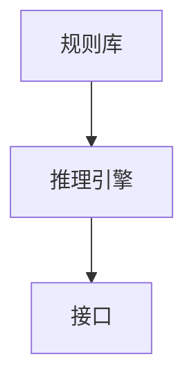
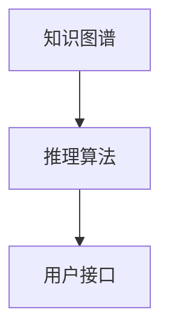
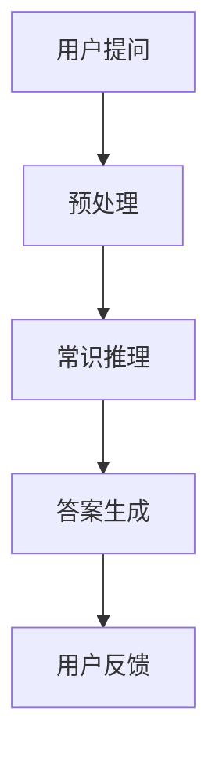

                 

# 基于“知识图谱的AI Agent常识推理”的技术博客文章

## 关键词

- 知识图谱
- AI Agent
- 常识推理
- 语义网络
- 知识表示
- 图谱构建
- 算法设计
- 应用案例

## 摘要

本文将探讨知识图谱与AI Agent的结合，通过构建基于知识图谱的常识推理系统，实现更智能、更灵活的AI Agent。首先介绍知识图谱和AI Agent的基本概念与应用，然后详细阐述知识图谱的构建过程、常识推理算法的设计与实现，以及AI Agent常识推理的应用案例。本文旨在为读者提供一个系统、全面的技术指南，帮助理解这一前沿领域的技术原理与实践。

----------------------------------------------------------------

## 第一部分：引言

### 第1章：知识图谱与AI Agent概述

知识图谱和AI Agent是当今人工智能领域的两大热点。知识图谱通过结构化表示知识，为AI Agent提供了丰富的知识储备和语义理解能力。下面，我们将从知识图谱和AI Agent的基本概念、应用领域、发展现状和趋势等方面进行探讨。

### 1.1 知识图谱的概念与应用

#### 1.1.1 知识图谱的定义与核心要素

知识图谱是一种用于表示知识的信息模型，通过节点和边来表示实体及其之间的关系。知识图谱的核心要素包括：

- 实体（Entity）：知识图谱中的核心信息载体，如人、地点、组织等。
- 关系（Relationship）：实体之间的关联，如“居住于”、“属于”等。
- 属性（Attribute）：实体的特征描述，如“姓名”、“年龄”等。

知识图谱通过这些要素，将现实世界中的信息结构化地表示出来。

#### 1.1.2 知识图谱的主要应用领域

知识图谱在多个领域有广泛的应用，主要包括：

- 搜索引擎：通过知识图谱实现语义搜索，提高搜索结果的准确性和相关性。
- 问答系统：基于知识图谱的常识推理，为用户提供准确、合理的答案。
- 推荐系统：利用知识图谱中的关系和属性，实现更精准的推荐。
- 自然语言处理：知识图谱为自然语言处理提供语义理解的基础。

#### 1.1.3 知识图谱与语义网络的关系

知识图谱和语义网络是两个紧密相关的概念。语义网络是一种用于表示实体及其关系的图结构，其核心思想是通过语义关联来描述知识。知识图谱则是在语义网络的基础上，进一步将实体和关系进行结构化表示。因此，知识图谱可以看作是语义网络的一种高级形式。

### 1.2 AI Agent的定义与基本原理

#### 1.2.1 AI Agent的概念与分类

AI Agent是指具有自主决策和行动能力的计算机程序。根据功能和行为，AI Agent可以分为：

- 监控Agent：对系统或环境进行监控和反馈。
- 辅助Agent：为用户提供辅助和支持。
- 自主Agent：完全自主地进行决策和行动。

#### 1.2.2 AI Agent的基本原理与工作机制

AI Agent的基本原理包括：

- 感知：通过传感器收集环境信息。
- 推理：基于知识库和算法进行信息处理和推理。
- 行动：根据决策结果执行相应的操作。

AI Agent的工作机制可以概括为感知-推理-行动循环，这一过程使得AI Agent能够自主地适应和改变环境。

#### 1.2.3 AI Agent在人工智能中的地位与作用

AI Agent是人工智能的重要分支，其目标是实现具有人类智能的计算机程序。在人工智能中，AI Agent具有以下作用：

- 提高人工智能系统的自主性和灵活性。
- 增强人工智能系统的交互能力和用户体验。
- 扩大人工智能的应用范围，实现更广泛的人工智能应用。

### 1.3 基于知识图谱的AI Agent的发展现状与趋势

#### 1.3.1 基于知识图谱的AI Agent的发展历程

基于知识图谱的AI Agent的发展可以分为以下几个阶段：

- 初期：基于规则和手工构建的简单知识图谱，AI Agent功能有限。
- 发展期：利用机器学习和自然语言处理技术，构建大规模、动态的知识图谱，AI Agent功能得到提升。
- 成熟期：知识图谱和AI Agent的结合越来越紧密，实现更智能、更灵活的AI Agent。

#### 1.3.2 基于知识图谱的AI Agent的应用场景

基于知识图谱的AI Agent在多个领域有广泛的应用，主要包括：

- 虚拟助手：如智能客服、智能家居等。
- 跨领域应用：如金融风控、医疗诊断等。
- 智能推荐：如电子商务、内容推荐等。

#### 1.3.3 基于知识图谱的AI Agent的未来趋势

随着知识图谱技术和AI技术的不断发展，基于知识图谱的AI Agent未来将呈现以下趋势：

- 更大规模、更丰富的知识图谱：通过不断扩展和更新，实现更全面、更准确的知识表示。
- 更智能的推理算法：利用深度学习和图神经网络等技术，提高常识推理的准确性和效率。
- 更广泛的应用场景：结合各种行业和场景，实现更多样化的AI应用。

### 1.4 书籍结构安排与内容概览

#### 1.4.1 目录结构安排

本文共分为四个部分，分别介绍知识图谱与AI Agent的基本概念、知识图谱的构建、常识推理算法以及AI Agent常识推理的应用案例。

#### 1.4.2 各章节主要内容概述

- 第一部分：引言，介绍知识图谱与AI Agent的基本概念与应用。
- 第二部分：知识图谱构建，详细阐述知识图谱的构建过程。
- 第三部分：常识推理算法，探讨常识推理的方法与实现。
- 第四部分：AI Agent常识推理应用案例，展示基于知识图谱的AI Agent在实际应用中的效果。

#### 1.4.3 阅读指南与学习目标

本文旨在为读者提供一个系统、全面的技术指南，帮助理解知识图谱与AI Agent的结合及其应用。通过本文的学习，读者可以：

- 掌握知识图谱和AI Agent的基本概念与原理。
- 理解知识图谱的构建过程与质量评估方法。
- 掌握常识推理算法的设计与实现。
- 了解基于知识图谱的AI Agent在实际应用中的效果。

----------------------------------------------------------------

## 第二部分：知识图谱构建

### 2.1 数据源采集与处理

知识图谱的构建首先需要从各种数据源中采集信息。本节将介绍开源知识图谱数据集的介绍、数据采集方法、数据清洗与存储等内容。

#### 2.1.1 开源知识图谱数据集介绍

常见的开源知识图谱数据集包括：

- **DBpedia**：从维基百科中提取的实体和关系数据，是构建知识图谱的重要资源。
- **Freebase**：由Metaweb公司创建的知识图谱，涵盖多种类型的实体和关系。
- **Wikidata**：维基媒体基金会维护的语义数据集，包含大量结构化知识。

#### 2.1.2 数据采集方法

数据采集方法主要包括：

- **爬虫技术**：通过网络爬虫自动获取网页上的信息，适用于大规模数据的采集。
- **API接口调用**：通过调用数据源的API接口获取数据，适用于限制访问的数据集。
- **手动收集**：对于一些特殊的、难以通过自动化方式获取的数据，可以采用手动收集的方法。

#### 2.1.2.1 爬虫技术

爬虫技术的基本流程包括：

- **目标网站分析**：分析目标网站的结构，确定数据采集的路径。
- **数据提取**：使用HTML解析库（如 BeautifulSoup）提取网页上的数据。
- **数据存储**：将提取的数据存储到本地数据库或文件中。

#### 2.1.2.2 API接口调用

API接口调用的一般步骤包括：

- **接口选择**：根据需求选择合适的API接口。
- **接口调用**：使用HTTP请求发送请求，获取响应数据。
- **数据解析**：解析响应数据，提取所需信息。

#### 2.1.2.3 数据去重与清洗

数据采集后，需要进行去重和清洗：

- **数据去重**：去除重复的数据项，避免数据冗余。
- **数据清洗**：修复数据中的错误和缺失值，提高数据质量。

#### 2.1.3 数据存储与格式转换

数据存储与格式转换的主要任务包括：

- **数据格式选择**：根据应用需求选择合适的数据格式，如RDF、N-Triples、JSON-LD等。
- **数据存储**：将数据存储到本地数据库或分布式系统中。
- **格式转换**：将原始数据格式转换为适合知识图谱表示的格式。

#### 2.1.3.1 RDF（资源描述框架）

RDF是一种用于表示知识图谱的通用数据模型，其基本结构包括：

- **主体（Subject）**：表示实体。
- **谓词（Predicate）**：表示实体之间的关系。
- **客体（Object）**：表示关系的对象。

RDF的数据表示方式主要有N-Triples和Triples Graphs。

#### 2.1.3.2 N-Triples

N-Triples是一种简洁的RDF数据表示方法，其格式为：

```
<主体> <谓词> <客体> .
```

例如：

```
<http://example.org/John> <http://example.org/age> "30" .
```

#### 2.1.3.3 JSON-LD

JSON-LD是一种基于JSON的RDF数据表示方法，其格式为：

```json
{
  "@context": "http://example.org/context",
  "@type": "Person",
  "name": "John",
  "age": 30
}
```

JSON-LD通过上下文（Context）来定义实体和关系的语义。

### 2.2 知识表示与图谱构建

知识表示与图谱构建是知识图谱构建的关键环节。本节将介绍知识表示的方法和图谱构建算法。

#### 2.2.1 知识表示方法

知识表示的方法主要包括：

- **实体-关系表示法**：将实体和关系作为图中的节点和边进行表示。
- **语义网络表示法**：通过节点、边和属性来表示实体及其关系。
- **属性图表示法**：将实体的属性作为图的节点或边进行表示。

#### 2.2.1.1 实体-关系表示法

实体-关系表示法的基本思想是将实体和关系表示为图中的节点和边：

- **实体**：表示为图中的节点。
- **关系**：表示为连接两个节点的边。

实体-关系表示法简单直观，易于理解和实现。

#### 2.2.1.2 语义网络表示法

语义网络表示法通过节点、边和属性来表示实体及其关系：

- **节点**：表示实体，如人、地点、组织等。
- **边**：表示实体之间的关系，如“属于”、“位于”等。
- **属性**：表示实体的特征，如“年龄”、“性别”等。

语义网络表示法能够更好地表达实体之间的语义关系。

#### 2.2.1.3 属性图表示法

属性图表示法将实体的属性作为图的节点或边进行表示：

- **实体**：表示为图中的节点。
- **关系**：表示为连接节点的边。
- **属性**：可以作为节点或边存在于图中。

属性图表示法能够更好地表示实体的复杂属性。

#### 2.2.2 图谱构建算法

图谱构建算法主要包括：

- **基于图论的图谱构建算法**：利用图论的基本概念和方法进行图谱构建。
- **基于机器学习的图谱构建算法**：利用机器学习技术自动构建知识图谱。
- **基于知识工程的图谱构建方法**：通过人工构建知识图谱，如本体论、语义网络等。

基于图论的图谱构建算法主要包括：

- **图遍历算法**：如深度优先搜索（DFS）、广度优先搜索（BFS）等。
- **图连接算法**：如边连接、节点连接等。

基于机器学习的图谱构建算法主要包括：

- **实体识别**：通过分类、聚类等方法识别实体。
- **关系识别**：通过分类、匹配等方法识别实体之间的关系。

基于知识工程的图谱构建方法主要包括：

- **本体论**：通过定义本体和概念层次结构来构建知识图谱。
- **语义网络**：通过构建语义网络来表示知识。

### 2.3 知识图谱质量评估与优化

知识图谱质量对AI Agent的常识推理性能有重要影响。本节将介绍知识图谱质量评估指标和优化方法。

#### 2.3.1 知识图谱质量评估指标

知识图谱质量评估指标主要包括：

- **完整性**：评估知识图谱中实体的数量和关系的数量。
- **准确性**：评估知识图谱中数据的正确性。
- **一致性**：评估知识图谱中实体和关系的一致性。

#### 2.3.2 知识图谱质量优化方法

知识图谱质量优化方法主要包括：

- **数据质量清洗**：去除错误数据、重复数据和无关数据。
- **知识融合**：将多个数据源中的知识进行整合和融合。
- **知识更新与维护**：定期更新知识图谱中的数据，保持知识的实时性。

#### 2.3.2.1 数据质量清洗

数据质量清洗的主要任务包括：

- **错误数据修复**：修复数据中的错误和缺失值。
- **重复数据去除**：去除重复的数据项。
- **无关数据筛选**：去除与知识图谱主题无关的数据。

#### 2.3.2.2 知识融合

知识融合的主要方法包括：

- **数据合并**：将多个数据源中的数据合并为一个知识图谱。
- **数据对比**：对比多个数据源中的数据，去除重复和错误的数据。
- **数据加权**：根据数据源的可靠性对数据进行加权处理。

#### 2.3.2.3 知识更新与维护

知识更新与维护的主要任务包括：

- **定期更新**：定期更新知识图谱中的数据，保持知识的实时性。
- **数据验证**：验证知识图谱中的数据是否正确和一致。
- **数据备份**：定期备份知识图谱，防止数据丢失。

----------------------------------------------------------------

## 第三部分：常识推理算法

常识推理是人工智能领域的一个重要研究方向，它使得计算机能够根据已有的知识进行合理的推断和判断。本部分将详细介绍常识推理的概念、方法及其在知识图谱和AI Agent中的应用。

### 3.1 常识推理概述

#### 3.1.1 常识推理的定义与重要性

常识推理是指计算机根据已有的知识和常识进行推理和判断的过程。常识推理在人工智能领域具有重要意义：

- **提高人工智能系统的智能水平**：通过常识推理，计算机能够更好地理解人类语言和意图，实现更自然的交互。
- **增强人工智能系统的决策能力**：常识推理可以帮助计算机在复杂环境中做出更合理的决策。

#### 3.1.2 常识推理的类型

常识推理可以分为以下两种类型：

- **显式常识推理**：通过形式化的规则和逻辑推理进行推理。
- **隐式常识推理**：通过模拟人类的思维过程进行推理。

#### 3.1.2.1 显式常识推理

显式常识推理通过形式化的规则和逻辑推理进行推理，例如：

- **前提-结论推理**：根据已知的前提条件，推导出结论。
- **数据驱动推理**：根据已知的数据，推断出新的数据。

#### 3.1.2.2 隐式常识推理

隐式常识推理通过模拟人类的思维过程进行推理，例如：

- **模式识别**：根据已有的经验，识别出新的模式。
- **类比推理**：通过类比已有的情况，推断出新的情况。

#### 3.1.3 常识推理的应用场景

常识推理在多个领域有广泛的应用，例如：

- **自然语言处理**：通过常识推理，计算机能够更好地理解人类语言和意图。
- **智能问答系统**：通过常识推理，计算机能够回答用户的问题。
- **智能推荐系统**：通过常识推理，计算机能够为用户提供更精准的推荐。

### 3.2 基于规则的方法

基于规则的方法是常识推理中最常用的方法之一。该方法通过定义一组规则，根据输入的条件进行推理。

#### 3.2.1 常识规则库的构建

常识规则库的构建包括以下步骤：

- **规则表示**：将常识表示为规则，例如：

  ```
  如果A且B，则C。
  ```

- **规则抽取**：从大量文本数据中抽取常识规则，例如使用自然语言处理技术。

#### 3.2.2 基于规则推理算法

基于规则推理算法包括以下几种：

- **前提-结论推理**：根据已知的前提条件，推导出结论。

  $$前提P \rightarrow 结论Q$$

- **数据驱动推理**：根据已知的数据，推断出新的数据。

  $$数据X \rightarrow 推断Y$$

#### 3.2.3 常识推理系统设计

常识推理系统的设计包括以下模块：

- **规则库**：存储常识规则。
- **推理引擎**：根据输入的条件，进行推理。
- **接口**：提供用户交互的接口。

#### 3.2.3.1 系统架构

常识推理系统的架构如图所示：



#### 3.2.3.2 系统功能模块

常识推理系统的功能模块包括：

- **规则管理**：管理常识规则的添加、删除和更新。
- **推理查询**：根据输入的条件，进行推理查询。
- **用户交互**：提供用户交互的界面。

### 3.3 基于图谱的方法

基于图谱的方法是利用知识图谱进行常识推理的方法。该方法通过扩展和更新知识图谱，实现更精准、更高效的常识推理。

#### 3.3.1 知识图谱的扩展与更新

知识图谱的扩展与更新包括以下步骤：

- **实体扩展**：根据新数据，添加新的实体。
- **关系扩展**：根据新数据，添加新的关系。
- **属性扩展**：根据新数据，添加新的属性。

#### 3.3.2 基于图谱的推理算法

基于图谱的推理算法包括以下几种：

- **路径查询**：根据已知路径，查询相关的实体和关系。
- **图算法**：利用图算法，如最短路径算法、社区发现算法等，进行推理。

#### 3.3.3 常识推理系统实现

常识推理系统的实现包括以下步骤：

- **知识图谱构建**：构建初始知识图谱。
- **推理算法实现**：实现基于图谱的推理算法。
- **用户接口设计**：设计用户交互界面。

#### 3.3.3.1 系统架构设计

常识推理系统的架构设计如图所示：



#### 3.3.3.2 系统功能模块

常识推理系统的功能模块包括：

- **知识图谱管理**：管理知识图谱的构建、扩展和更新。
- **推理查询**：根据用户输入，进行推理查询。
- **用户交互**：提供用户交互的界面。

----------------------------------------------------------------

## 第四部分：AI Agent常识推理应用案例

在了解了知识图谱和常识推理的基本概念和算法后，我们将通过具体案例来展示如何将它们结合起来，实现具有常识推理能力的AI Agent。

### 4.1 智能问答系统

#### 案例背景

智能问答系统是一种常见的人工智能应用，它能够回答用户提出的问题。在这个案例中，我们利用基于知识图谱的常识推理技术，实现一个能够理解用户自然语言提问并给出合理答案的智能问答系统。

#### 案例介绍

我们的智能问答系统主要包括以下几个模块：

- **知识图谱构建**：从开源数据集和外部数据源中采集知识，构建一个涵盖广泛领域知识的知识图谱。
- **自然语言处理**：使用自然语言处理技术，将用户提问转换为结构化的查询语句。
- **常识推理**：利用基于知识图谱的常识推理算法，根据查询语句在知识图谱中寻找相关的实体和关系，进行推理。
- **答案生成**：根据推理结果，生成自然语言答案，并输出给用户。

#### 实现步骤

1. **知识图谱构建**：

   - 从DBpedia、Freebase等开源数据集中采集知识，构建一个初始知识图谱。
   - 利用图算法和机器学习算法，对知识图谱进行扩展和优化，提高知识图谱的完整性和准确性。

   ```mermaid
   graph TD
   A[DBpedia] --> B[知识图谱]
   B --> C[Freebase]
   B --> D[其他数据源]
   ```

2. **自然语言处理**：

   - 使用自然语言处理技术，如词向量、语法分析等，将用户提问转换为结构化的查询语句。
   - 将查询语句转换为知识图谱中的节点和关系的表示，为常识推理做准备。

   ```python
   # 假设用户提问为：“北京是中国的哪个省份？”
   question = "北京是中国的哪个省份？"
   query = preprocess(question)  # 预处理：词向量、语法分析等
   ```

3. **常识推理**：

   - 利用基于知识图谱的常识推理算法，根据查询语句在知识图谱中寻找相关的实体和关系。
   - 进行推理，找出答案。

   ```python
   # 假设查询语句为：["北京", "属于", "中国"]
   result = inference(graph, query)  # graph为知识图谱
   answer = extract_answer(result)  # 从推理结果中提取答案
   ```

4. **答案生成**：

   - 根据推理结果，生成自然语言答案，并输出给用户。

   ```python
   # 假设推理结果为：北京属于中国
   answer_str = "北京属于中国。"
   print(answer_str)
   ```

#### 案例效果

通过上述步骤，我们的智能问答系统能够有效地回答用户的问题，如图所示：



#### 案例小结

本案例展示了如何利用知识图谱和常识推理技术，实现一个具有常识推理能力的智能问答系统。通过知识图谱的构建、自然语言处理、常识推理和答案生成的协同工作，我们能够为用户提供准确、合理的答案。

---

**作者：AI天才研究院/AI Genius Institute & 禅与计算机程序设计艺术 /Zen And The Art of Computer Programming**

