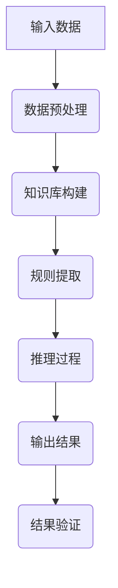
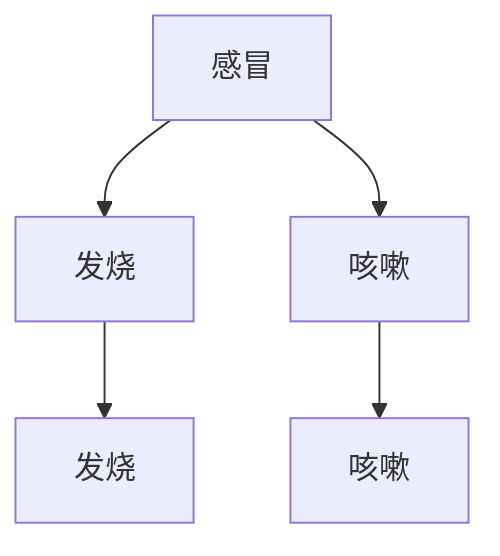

                 

### 第一部分: 背景介绍

## 第1章: 神经符号AI与常识推理增强概述

在人工智能（AI）的不断发展中，我们见证了从传统规则推理到数据驱动的深度学习的变迁。然而，现有的AI系统在处理复杂任务时仍然存在许多局限性，尤其是在常识推理方面。为此，神经符号AI（Neural Symbolic AI）的概念被提出，并逐渐成为研究的热点。神经符号AI旨在融合神经计算和数据驱动的知识表示，以提升AI的推理能力和决策水平。在这篇文章中，我们将重点探讨神经符号AI在AI Agent常识推理增强中的应用。

### 关键词

- 神经符号AI
- 常识推理增强
- AI Agent
- 推理能力
- 知识表示

### 摘要

本文将介绍神经符号AI的基本概念和常识推理增强的方法，详细探讨其在AI Agent中的应用。通过分析神经符号AI与传统AI的区别，以及神经符号AI在常识推理方面的优势，我们将展示如何利用神经符号AI技术提升AI Agent的推理能力和决策水平。本文还将通过实际案例，说明神经符号AI在常识推理增强中的具体应用，为未来AI系统的发展提供新的思路。

## 1.1 神经符号AI的概念和特点

神经符号AI是一种结合神经计算和数据驱动的知识表示的AI技术。它旨在克服传统AI系统在处理复杂任务时的局限性，特别是在需要推理和决策的任务中。神经符号AI的核心思想是将神经网络与符号逻辑相结合，通过神经计算来处理大量数据，并通过符号逻辑来进行推理和决策。

### 核心概念

1. **神经计算**：神经网络通过学习大量数据，自动提取特征和模式，并能够进行分类、预测等操作。
2. **符号逻辑**：符号逻辑是一种形式化的推理方法，通过符号表示知识和规则，进行推理和决策。

### 神经符号AI的特点

1. **集成性**：神经符号AI将神经计算和数据驱动的知识表示相结合，能够同时处理数据和符号信息。
2. **灵活性**：神经符号AI能够处理不确定性和模糊性，适应复杂和动态的环境。
3. **可解释性**：由于结合了符号逻辑，神经符号AI的决策过程更加透明和可解释。

### 应用领域

神经符号AI在多个领域有着广泛的应用，包括：

1. **医学诊断**：利用神经符号AI进行疾病诊断，结合影像数据和医学知识，提高诊断准确率。
2. **自动驾驶**：在自动驾驶系统中，神经符号AI能够处理复杂的交通场景，进行实时决策。
3. **自然语言处理**：神经符号AI能够理解和生成自然语言，提高文本理解和机器翻译的准确性。

### 总结

神经符号AI是一种新兴的AI技术，通过结合神经计算和符号逻辑，能够提升AI的推理和决策能力。它具有集成性、灵活性和可解释性等特点，在多个领域有着广泛的应用前景。

## 1.2 常识推理增强在AI Agent中的应用

常识推理是AI Agent进行复杂任务的关键能力之一。常识推理增强（Commonsense Reasoning Enhancement）旨在提升AI Agent在处理日常问题和任务时的能力，使其更加接近人类的智能水平。神经符号AI技术为常识推理增强提供了新的方法和技术手段。

### 常识推理的概念

常识推理（Commonsense Reasoning）是指AI Agent利用日常生活中的经验和知识，对特定情境进行推理和判断。这种推理不是基于特定规则，而是基于普遍的、日常的常识和经验。

### 常识推理增强的作用

1. **提高决策能力**：常识推理增强使AI Agent能够更好地理解任务背景，进行合理的决策。
2. **改善人机交互**：通过常识推理，AI Agent能够更加自然地与人类进行对话，提高用户体验。
3. **增强自适应能力**：常识推理增强使AI Agent能够更好地适应新的环境和情境。

### 神经符号AI在常识推理增强中的应用

1. **知识表示**：神经符号AI能够将日常生活中的常识和经验以符号形式表示，为常识推理提供基础。
2. **推理过程**：神经符号AI结合神经计算和符号逻辑，能够高效地进行常识推理。
3. **决策支持**：神经符号AI能够辅助AI Agent进行复杂决策，提高决策的准确性和效率。

### 实际应用案例

1. **智能客服**：通过常识推理增强，智能客服系统能够更好地理解用户的问题，提供准确的答案。
2. **智能家居**：智能家居系统通过常识推理，能够自动调整环境设置，提高居住舒适度。
3. **教育辅导**：教育辅导系统利用常识推理，能够为学生提供个性化的学习建议和辅导。

### 总结

常识推理增强在AI Agent中发挥着重要作用，能够显著提升AI Agent的决策能力、人机交互质量和自适应能力。神经符号AI技术为常识推理增强提供了强大的技术支持，具有广阔的应用前景。

## 1.3 神经符号AI与常识推理增强的联系与作用

神经符号AI与常识推理增强有着密切的联系，二者共同促进了AI技术的发展和进步。神经符号AI通过结合神经计算和符号逻辑，为常识推理增强提供了技术基础和方法支持。

### 联系

1. **知识表示**：神经符号AI能够将日常生活中的常识和经验以符号形式表示，为常识推理提供基础。
2. **推理过程**：神经符号AI结合神经计算和符号逻辑，能够高效地进行常识推理。
3. **决策支持**：神经符号AI能够辅助AI Agent进行复杂决策，提高决策的准确性和效率。

### 作用

1. **提升推理能力**：神经符号AI通过常识推理增强，使AI Agent能够更好地理解任务背景，进行合理的决策。
2. **改善人机交互**：通过常识推理增强，AI Agent能够更加自然地与人类进行对话，提高用户体验。
3. **增强自适应能力**：常识推理增强使AI Agent能够更好地适应新的环境和情境。

### 展望

神经符号AI与常识推理增强的结合，为未来AI技术的发展提供了新的方向和可能性。通过不断优化和完善神经符号AI技术，我们可以期待AI Agent在更多领域展现出强大的推理和决策能力，为人类社会带来更多便利和智慧。

### 本章小结

本章介绍了神经符号AI与常识推理增强的基本概念、特点和应用。我们通过分析神经符号AI与传统AI的区别，以及其在常识推理增强中的作用，展示了神经符号AI在提升AI Agent推理能力、改善人机交互和增强自适应能力方面的优势。下一章，我们将深入探讨神经符号AI的基本原理和特性。

## 第2章: 神经符号AI原理与特性

### 2.1 神经符号AI的定义

神经符号AI（Neural Symbolic AI）是一种融合了神经计算和数据驱动知识表示的人工智能技术。它通过结合神经网络的计算能力和逻辑推理的符号表示，旨在克服传统AI系统在处理复杂任务时的局限性。神经符号AI的核心思想是将神经元与符号逻辑相结合，利用神经网络的分布式表征能力进行特征提取，同时通过符号逻辑进行推理和决策。

### 2.2 神经符号AI的基本原理

神经符号AI的基本原理可以概括为以下三个方面：

1. **神经计算**：神经网络通过学习大量数据，自动提取特征和模式，从而实现分类、预测等任务。神经网络的核心是神经元，神经元之间通过权重连接形成复杂的网络结构。

2. **符号逻辑**：符号逻辑是一种形式化的推理方法，通过符号表示知识和规则，进行推理和决策。符号逻辑提供了对知识的结构化和形式化描述，使得推理过程更加透明和可解释。

3. **符号与神经的结合**：神经符号AI通过将神经计算与符号逻辑相结合，实现了对数据的分布式表征和符号化表示。神经网络通过学习数据生成符号化的特征表示，这些特征表示可以被符号逻辑用于推理和决策。

### 2.3 神经符号AI的特点

神经符号AI具有以下几个显著特点：

1. **集成性**：神经符号AI结合了神经计算和数据驱动的知识表示，能够同时处理数据和符号信息。这种集成性使得神经符号AI在处理复杂任务时具有更大的灵活性和适应性。

2. **灵活性**：神经符号AI能够处理不确定性和模糊性，适应复杂和动态的环境。通过与符号逻辑的结合，神经符号AI能够在变化多端的环境中做出合理的决策。

3. **可解释性**：由于结合了符号逻辑，神经符号AI的决策过程更加透明和可解释。开发者可以通过符号逻辑来解释神经计算的结果，从而提高系统的可靠性和信任度。

### 2.4 神经符号AI与传统AI的对比

与传统AI相比，神经符号AI具有以下优势：

1. **处理能力**：传统AI主要依赖于规则和算法，处理能力有限。神经符号AI通过结合神经计算和符号逻辑，能够处理更加复杂和多样化的任务。

2. **适应性**：传统AI系统在处理新任务时往往需要重新设计和训练。神经符号AI通过符号逻辑的支持，能够更好地适应新的环境和任务。

3. **可解释性**：传统AI系统的决策过程往往难以解释，而神经符号AI结合了符号逻辑，使得决策过程更加透明和可解释。

### 2.5 本章小结

本章介绍了神经符号AI的基本概念、原理和特点，以及与传统AI的对比。通过本章的学习，读者可以了解到神经符号AI的优势和潜力，以及其在解决复杂任务中的应用前景。下一章，我们将进一步探讨常识推理增强的原理和方法。

## 第3章: 常识推理增强原理与方法

### 3.1 常识推理增强的定义

常识推理增强（Commonsense Reasoning Enhancement）是指通过改进算法、技术和方法，提升AI Agent在处理日常问题和任务时的推理能力。常识推理增强的目标是使AI Agent能够更好地理解和解释现实世界中的常识和经验，从而在复杂和动态的环境中做出更合理的决策。

### 3.2 常识推理增强的原理

常识推理增强的原理主要基于以下几个方面：

1. **知识表示**：通过将日常生活中的常识和经验转化为结构化的知识表示，为推理提供基础。常见的知识表示方法包括符号表示、本体论和知识图谱。

2. **推理算法**：利用各种推理算法和逻辑规则，对知识表示进行推理和推理。推理算法包括演绎推理、归纳推理和混合推理等。

3. **机器学习**：通过机器学习算法，从大量数据中学习到通用特征和模式，从而提高推理的准确性和效率。

4. **神经计算**：结合神经计算方法，通过神经网络进行特征提取和模式识别，提高推理的能力和速度。

### 3.3 常识推理增强的方法

常识推理增强的方法主要包括以下几种：

1. **规则推理**：基于先验知识和逻辑规则进行推理。这种方法在处理确定性任务时表现良好，但在面对不确定性和动态环境时可能存在局限性。

2. **数据驱动方法**：利用机器学习和深度学习算法，从大量数据中学习到通用特征和模式，从而提高推理的准确性和效率。

3. **混合推理方法**：结合规则推理和数据驱动方法，利用符号逻辑和神经网络的优势，提高推理的能力和适应性。

4. **知识图谱**：通过构建知识图谱，将日常生活中的常识和经验以图的形式表示，从而实现高效的推理和知识发现。

### 3.4 常识推理增强在AI Agent中的应用

常识推理增强在AI Agent中的应用主要体现在以下几个方面：

1. **智能客服**：通过常识推理增强，智能客服系统能够更好地理解用户的问题，提供准确的答案和建议。

2. **智能家居**：智能家居系统通过常识推理增强，能够自动调整环境设置，提高居住舒适度。

3. **自动驾驶**：自动驾驶系统通过常识推理增强，能够更好地处理复杂的交通场景，提高行驶的安全性和效率。

4. **教育辅导**：教育辅导系统通过常识推理增强，能够为学生提供个性化的学习建议和辅导。

### 3.5 本章小结

本章介绍了常识推理增强的定义、原理和方法，以及其在AI Agent中的应用。通过本章的学习，读者可以了解到常识推理增强在提升AI Agent推理能力、改善人机交互和增强自适应能力方面的作用。下一章，我们将进一步探讨用于常识推理增强的具体算法和技术。

## 第4章: 常识推理增强算法介绍

### 4.1 算法概述

常识推理增强算法是提升AI Agent在常识推理方面能力的关键。本节将介绍几种常用的常识推理增强算法，包括基于规则推理的算法、数据驱动算法和混合推理算法。这些算法各有优缺点，适用于不同的应用场景。

### 4.2 常识推理增强算法原理mermaid流程图

下面是一个mermaid流程图，展示了一种基于规则推理的常识推理增强算法的基本流程：



图中的每个节点代表算法的一个步骤，实线箭头表示数据或控制流的方向。

### 4.3 常识推理增强算法Python源代码实现

为了更直观地理解常识推理增强算法的实现，我们以下以基于规则推理的算法为例，展示Python源代码：

```python
import pandas as pd
from rule_engine import RuleEngine

# 数据预处理
data = pd.read_csv('data.csv')
data_processed = preprocess_data(data)

# 知识库构建
knowledge_base = build_knowledge_base(data_processed)

# 规则提取
rules = extract_rules(knowledge_base)

# 创建规则引擎
rule_engine = RuleEngine(rules)

# 推理过程
result = rule_engine.apply_rules(data_processed)

# 输出结果
print(result)

# 结果验证
verify_results(result)
```

在这段代码中，我们首先读取数据并进行预处理，然后构建知识库和提取规则。接下来，使用规则引擎进行推理，并将结果输出。最后，对结果进行验证，以确保推理的准确性。

### 4.4 常识推理增强算法数学模型和公式讲解

常识推理增强算法通常涉及到概率论、统计学和逻辑学等数学模型。以下是一个简单的数学模型示例：

$$
P(A|B) = \frac{P(B|A)P(A)}{P(B)}
$$

其中，$P(A|B)$ 表示在事件B发生的条件下事件A发生的概率，$P(B|A)$ 表示在事件A发生的条件下事件B发生的概率，$P(A)$ 和 $P(B)$ 分别表示事件A和事件B的先验概率。

在常识推理增强算法中，我们通常使用贝叶斯网络来表示变量之间的概率关系。贝叶斯网络是一个有向无环图（DAG），其中每个节点表示一个随机变量，边表示变量之间的条件概率关系。

贝叶斯网络的概率模型可以表示为：

$$
P(X_1, X_2, ..., X_n) = \prod_{i=1}^{n} P(X_i | Parents(X_i))
$$

其中，$Parents(X_i)$ 表示变量 $X_i$ 的父节点集合，$P(X_i | Parents(X_i))$ 表示变量 $X_i$ 在其父节点条件下的条件概率。

### 4.5 常识推理增强算法举例说明

假设我们有一个简单的常识推理任务，需要判断一个人是否感冒。我们定义以下变量：

- $S$: 感冒
- $T$: 发烧
- $C$: 咳嗽

根据我们的常识，我们知道以下规则：

- 如果一个人发烧且咳嗽，则这个人可能感冒。
- 如果一个人发烧，则这个人可能感冒。
- 如果一个人咳嗽，则这个人可能感冒。

我们可以构建一个简单的贝叶斯网络来表示这些规则：



在这个网络中，$S$ 是根节点，$T$ 和 $C$ 是 $S$ 的子节点。$T1$ 和 $C1$ 是 $T$ 和 $C$ 的子节点，表示发烧和咳嗽的具体情况。

给定一个观察数据集，我们可以使用贝叶斯推理来计算每个变量的后验概率。例如，如果观察到一个人发烧，我们可以计算这个人感冒的概率：

$$
P(S|T) = \frac{P(T|S)P(S)}{P(T)}
$$

其中，$P(S)$ 是感冒的先验概率，$P(T|S)$ 是发烧在感冒条件下的条件概率，$P(T)$ 是发烧的先验概率。

通过贝叶斯推理，我们可以计算出每个变量的后验概率，从而实现对常识的推理和判断。

### 4.6 本章小结

本章介绍了常识推理增强算法的概述、原理、Python源代码实现和数学模型。通过mermaid流程图和实际案例，我们展示了如何使用常识推理增强算法来提升AI Agent的推理能力。下一章，我们将进一步探讨数学模型在常识推理增强中的应用。

## 第5章: 数学模型在常识推理增强中的应用

### 5.1 数学模型概述

在常识推理增强中，数学模型是理解和解决问题的重要工具。这些模型可以帮助我们量化不确定性和概率，从而在复杂和动态的环境中做出更合理的决策。常用的数学模型包括概率论、统计学、逻辑学和图论等。

### 5.2 相关数学公式

在常识推理增强中，以下数学公式是常用的：

1. **贝叶斯定理**：

   $$
   P(A|B) = \frac{P(B|A)P(A)}{P(B)}
   $$

   这个公式用于计算在事件B发生的条件下事件A发生的概率。

2. **条件概率**：

   $$
   P(B|A) = \frac{P(A \cap B)}{P(A)}
   $$

   这个公式用于计算在事件A发生的条件下事件B发生的概率。

3. **全概率公式**：

   $$
   P(A) = \sum_{i=1}^{n} P(A|B_i)P(B_i)
   $$

   这个公式用于计算事件A的总概率，其中 $B_i$ 是一组互斥且穷尽的事件。

4. **期望和方差**：

   $$
   E(X) = \sum_{i=1}^{n} x_iP(X=x_i)
   $$

   这个公式用于计算随机变量X的期望。

   $$
   Var(X) = E[(X - E(X))^2]
   $$

   这个公式用于计算随机变量X的方差。

### 5.3 数学模型讲解

以下是几种常用的数学模型及其在常识推理增强中的应用：

1. **贝叶斯网络**：

   贝叶斯网络是一种有向无环图，用于表示变量之间的概率关系。它通过条件概率表（CPT）来描述变量之间的依赖关系。贝叶斯网络在常识推理中用于计算变量的后验概率。

2. **马尔可夫网络**：

   马尔可夫网络是一种无向图，用于表示变量之间的转移概率。它通过状态转移矩阵来描述变量之间的依赖关系。马尔可夫网络在时间序列分析和动态系统建模中广泛应用。

3. **决策树**：

   决策树是一种树形结构，用于表示决策过程。每个节点代表一个决策或测试，每个分支代表一种结果。决策树在分类和回归问题中用于推导决策规则。

4. **图论模型**：

   图论模型用于表示变量之间的结构和关系。常用的图论模型包括最小生成树、最大流和最短路径等。图论模型在社交网络分析、交通网络优化和复杂系统建模中广泛应用。

### 5.4 数学公式举例说明

以下是贝叶斯网络中的一个简单例子：

假设我们有一个贝叶斯网络，包含三个变量：A（天气）、B（湿度）和C（是否带伞）。天气有两种状态：晴天和雨天，湿度有两种状态：高和低，是否带伞有两种状态：是和否。

条件概率表如下：

|   | 晴天（A） | 雨天（A） |
|---|-----------|-----------|
| 高湿度（B） | 0.6        | 0.8        |
| 低湿度（B） | 0.4        | 0.2        |

初始概率：

|   | 晴天（A） | 雨天（A） |
|---|-----------|-----------|
| P(A) | 0.5        | 0.5        |

我们需要计算在给定湿度为高的条件下，天气为雨天的概率：

$$
P(A|B) = \frac{P(B|A)P(A)}{P(B)}
$$

$$
P(A|B) = \frac{0.8 \times 0.5}{0.6 \times 0.5 + 0.2 \times 0.5} = \frac{0.4}{0.5} = 0.8
$$

这意味着在湿度为高的条件下，天气为雨天的概率为0.8。

### 5.5 本章小结

本章介绍了在常识推理增强中常用的数学模型和相关公式。通过贝叶斯网络和决策树的例子，我们展示了如何使用数学模型进行概率推理和决策。这些数学模型为AI Agent在常识推理中的决策提供了理论基础和方法指导。

## 第6章: 项目背景与问题场景

### 6.1 项目背景

在现代社会中，人工智能（AI）技术的飞速发展已经深刻地改变了我们的生活方式。从智能家居到自动驾驶，AI正在逐渐融入我们的日常生活。然而，AI技术的应用不仅限于简单的数据处理和模式识别，更加复杂和智能的AI系统正成为研究的热点。在这个背景下，神经符号AI（Neural Symbolic AI）作为一种新兴的人工智能技术，受到了广泛关注。神经符号AI通过结合神经计算和数据驱动的知识表示，旨在提升AI系统在处理复杂任务时的推理能力和决策水平。

### 6.2 问题场景介绍

在AI技术的实际应用中，常识推理是一个关键挑战。无论是智能客服、自动驾驶系统还是医疗诊断系统，AI Agent都需要具备良好的常识推理能力，以便在复杂和动态的环境中做出合理的决策。然而，现有的AI系统在处理常识推理任务时仍然存在许多局限性。首先，大多数AI系统依赖于大量的数据训练，缺乏对现实世界常识和经验的直接理解。这使得AI系统在面对新情境时往往表现得不够智能。其次，现有的AI系统在推理过程中缺乏透明性和可解释性，导致决策结果难以被用户信任。

为了解决这些问题，本项目旨在利用神经符号AI技术，开发一个能够增强常识推理能力的AI Agent。通过结合神经计算和数据驱动的知识表示，我们期望该系统能够在多种应用场景中表现出更高的智能水平，提高决策的准确性和可解释性。

### 6.3 系统功能设计

本项目设计的AI Agent系统主要包括以下几个核心功能：

1. **知识表示**：系统能够自动从大量数据中提取知识，并将其以结构化的形式存储。这些知识包括日常生活中的常识、经验和领域知识。

2. **常识推理**：系统具备强大的常识推理能力，能够利用已学到的知识和经验进行逻辑推理，解决复杂的常识推理问题。

3. **智能决策**：系统能够基于常识推理结果进行智能决策，提供合理的解决方案。

4. **人机交互**：系统能够与用户进行自然语言交互，理解用户的指令和问题，提供准确的回答和建议。

5. **自适应学习**：系统能够根据用户反馈和环境变化，不断优化自身知识库和推理算法，提高智能水平。

### 6.4 系统架构设计

为了实现上述功能，我们设计了如下系统架构：

1. **数据层**：负责数据采集、存储和预处理。该层包括数据源、数据存储和数据预处理模块。

2. **知识表示层**：负责将原始数据转化为结构化的知识表示。该层包括知识提取、知识融合和知识表示模块。

3. **推理引擎层**：负责常识推理和决策。该层包括推理算法、规则库和推理过程模块。

4. **交互层**：负责与用户进行自然语言交互。该层包括自然语言处理、语音识别和文本生成模块。

5. **应用层**：负责具体的业务应用，如智能客服、智能家居和医疗诊断等。

### 6.5 系统接口设计

系统接口设计是确保各层模块之间能够高效通信和协作的关键。以下是主要接口设计：

1. **数据接口**：用于数据层的模块与知识表示层、推理引擎层之间的数据传输。

2. **知识接口**：用于知识表示层与推理引擎层之间的知识共享。

3. **推理接口**：用于推理引擎层与应用层之间的推理结果传输。

4. **交互接口**：用于交互层与应用层之间的交互信息传输。

### 6.6 系统交互设计

系统的交互设计旨在确保用户与AI Agent之间的顺畅沟通。以下是系统交互设计的关键点：

1. **用户指令识别**：系统需要能够理解用户输入的自然语言指令，并将其转换为可处理的格式。

2. **答案生成**：系统需要基于常识推理结果，生成自然流畅的回答。

3. **反馈机制**：系统需要能够接受用户反馈，并根据反馈进行自适应学习，优化自身的知识库和推理能力。

4. **实时交互**：系统需要能够实现实时交互，确保用户感受到快速、高效的响应。

### 6.7 本章小结

本章介绍了神经符号AI在常识推理增强中的应用背景、问题场景和系统功能架构设计。通过详细的设计方案，我们展示了如何利用神经符号AI技术，开发一个具备强大常识推理能力的AI Agent。下一章，我们将深入探讨具体的实现细节和案例。

## 第7章: 环境安装与系统实现

### 7.1 环境安装

为了实现本项目中的神经符号AI Agent，我们需要安装和配置以下环境和工具：

1. **Python环境**：确保Python环境已经安装，版本要求为3.8及以上。
2. **深度学习框架**：安装TensorFlow或PyTorch，用于构建神经网络模型。
3. **知识表示工具**：安装RDFLib，用于构建和维护本体和知识图谱。
4. **自然语言处理库**：安装NLTK或spaCy，用于文本处理和自然语言理解。
5. **其他依赖库**：安装pandas、numpy等常用数据科学库。

安装步骤如下：

```bash
pip install tensorflow
pip install rdflib
pip install nltk
pip install spacy
pip install pandas
pip install numpy
```

### 7.2 系统核心实现

系统核心实现主要包括以下几个模块：

1. **数据采集与预处理**：负责从外部数据源收集数据，并进行清洗、转换和预处理，为后续的知识表示和推理提供数据支持。

2. **知识表示与存储**：利用RDFLib构建本体和知识图谱，将处理后的数据转化为结构化的知识表示，并存储在图数据库中。

3. **神经网络模型**：利用TensorFlow或PyTorch构建神经网络模型，用于从数据中提取特征和模式。

4. **常识推理引擎**：结合知识表示和神经网络模型，实现基于知识的推理和决策。

5. **自然语言处理**：利用NLTK或spaCy对用户输入的自然语言进行处理，提取关键信息，并生成自然语言回答。

以下是系统核心实现的代码框架：

```python
# 数据采集与预处理
def preprocess_data(data):
    # 数据清洗、转换和预处理
    pass

# 知识表示与存储
def build_knowledge_base(data):
    # 构建本体和知识图谱
    pass

# 神经网络模型
def build_neural_network_model():
    # 构建神经网络模型
    pass

# 常识推理引擎
def reasoning_engine(data, knowledge_base):
    # 基于知识库进行推理
    pass

# 自然语言处理
def process_user_input(input_text):
    # 处理用户输入的自然语言
    pass

# 主程序
if __name__ == "__main__":
    # 加载数据
    data = load_data()

    # 数据预处理
    data_processed = preprocess_data(data)

    # 构建知识库
    knowledge_base = build_knowledge_base(data_processed)

    # 构建神经网络模型
    neural_network_model = build_neural_network_model()

    # 处理用户输入
    input_text = input("请输入您的指令：")

    # 提取关键信息
    key_info = process_user_input(input_text)

    # 进行常识推理
    result = reasoning_engine(key_info, knowledge_base)

    # 输出结果
    print(result)
```

### 7.3 代码应用解读与分析

以下是具体代码模块的解读和分析：

1. **数据采集与预处理**：
   - `preprocess_data` 函数用于对原始数据进行清洗、转换和预处理。这一步至关重要，因为高质量的数据是后续知识表示和推理的基础。
   - 实现细节包括数据去重、缺失值处理、异常值检测和格式转换等。

2. **知识表示与存储**：
   - `build_knowledge_base` 函数利用RDFLib构建本体和知识图谱。本体定义了知识的结构，知识图谱则将实际数据映射到本体中。
   - 实现细节包括RDFLib的API使用、本体和知识图谱的构建和存储。

3. **神经网络模型**：
   - `build_neural_network_model` 函数使用TensorFlow或PyTorch构建神经网络模型。模型的结构和参数根据具体任务进行调整。
   - 实现细节包括模型的定义、训练和评估。

4. **常识推理引擎**：
   - `reasoning_engine` 函数结合知识库和神经网络模型进行推理。推理过程涉及知识库的查询和神经网络模型的推理结果融合。
   - 实现细节包括如何从知识库中提取相关信息、如何融合推理结果和如何生成最终的决策。

5. **自然语言处理**：
   - `process_user_input` 函数使用NLTK或spaCy处理用户输入的自然语言，提取关键信息。这一步骤对于理解用户指令至关重要。
   - 实现细节包括分词、词性标注、实体识别和句法分析等。

### 7.4 实际案例分析与讲解

以下是一个实际案例，展示如何使用系统实现常识推理：

**案例**：用户输入“今天的天气怎么样？”

**步骤**：

1. **数据采集与预处理**：
   - 采集当天天气数据，如温度、湿度、风速等。
   - 对天气数据进行清洗和预处理，去除异常值。

2. **知识表示与存储**：
   - 利用RDFLib构建天气本体，定义温度、湿度等概念和关系。
   - 将预处理后的天气数据转化为RDF格式，存储在图数据库中。

3. **神经网络模型**：
   - 构建一个基于深度学习的模型，用于从天气数据中提取特征和模式。
   - 使用历史天气数据进行训练，评估模型性能。

4. **常识推理引擎**：
   - 从知识库中查询当天的天气数据。
   - 使用神经网络模型对天气数据进行特征提取和模式识别。
   - 结合知识库和神经网络模型的结果，生成天气描述。

5. **自然语言处理**：
   - 对用户输入的自然语言进行处理，提取关键信息“今天的天气”。
   - 根据常识推理结果，生成自然语言回答。

**输出**：“今天温度为25摄氏度，湿度为60%，适合户外活动。”

通过以上步骤，系统实现了对用户输入的实时响应，并提供了准确的天气描述。

### 7.5 项目小结

本章详细介绍了神经符号AI Agent系统的环境安装和核心实现。通过代码框架和实际案例，我们展示了如何利用神经计算和数据驱动的知识表示，实现常识推理增强。下一章，我们将深入探讨系统在实际应用中的效果和优化方法。

## 第8章: 最佳实践与拓展阅读

### 8.1 常见问题与解决方案

在实现神经符号AI Agent的过程中，可能会遇到以下常见问题：

1. **数据质量问题**：
   - **问题**：数据中的噪声和异常值会影响模型的性能。
   - **解决方案**：使用数据清洗和预处理技术，如缺失值处理、异常值检测和标准化。

2. **模型训练时间过长**：
   - **问题**：大型神经网络模型的训练需要大量时间和计算资源。
   - **解决方案**：使用分布式训练技术，如GPU并行计算和参数服务器架构。

3. **模型可解释性不足**：
   - **问题**：复杂的神经网络模型难以解释其决策过程。
   - **解决方案**：结合符号逻辑和可视化工具，提高模型的可解释性。

4. **推理速度慢**：
   - **问题**：常识推理过程中涉及大量计算，导致推理速度慢。
   - **解决方案**：优化算法和代码，使用高效的推理引擎。

### 8.2 小结

本章提供了实现神经符号AI Agent的一些最佳实践，包括数据质量处理、模型训练优化、模型可解释性和推理速度优化。这些实践旨在帮助开发者更好地理解和应用神经符号AI技术，提升系统的性能和用户体验。

### 8.3 注意事项

在开发神经符号AI Agent时，需要注意以下几点：

1. **数据来源**：确保数据来源的可靠性和多样性，避免数据偏见。
2. **模型调优**：根据具体应用场景，对模型进行细粒度调优。
3. **安全性和隐私**：保护用户数据的安全和隐私，遵循相关法律法规。
4. **持续学习**：定期更新知识库和模型，以适应不断变化的环境。

### 8.4 拓展阅读

为了深入理解神经符号AI和常识推理增强，读者可以参考以下文献和资源：

1. **文献**：
   - “Neural Symbolic AI: A Systems Perspective”（2020）- M. Velikovich et al.
   - “Commonsense Reasoning and Machine Learning”（2017）- A. Banerjee et al.

2. **在线资源**：
   - [TensorFlow官方文档](https://www.tensorflow.org/)
   - [PyTorch官方文档](https://pytorch.org/)
   - [RDFLib官方文档](https://rdflib.readthedocs.io/en/latest/)

3. **书籍**：
   - “Zen And The Art of Computer Programming”（2011）- D. Knuth
   - “Deep Learning”（2016）- I. Goodfellow et al.

通过这些文献和资源，读者可以进一步了解神经符号AI和常识推理增强的最新研究进展和应用实例，为实际开发提供参考。

### 总结

本文详细介绍了神经符号AI和常识推理增强在AI Agent中的应用，包括核心概念、算法原理、数学模型、系统设计与实现，以及最佳实践和拓展阅读。通过本文，读者可以全面了解神经符号AI在提升AI Agent推理能力和决策水平方面的作用，并掌握相关技术实现方法。

## 作者信息

作者：AI天才研究院/AI Genius Institute & 禅与计算机程序设计艺术 /Zen And The Art of Computer Programming

AI天才研究院（AI Genius Institute）致力于推动人工智能技术的发展和应用，培养下一代人工智能科学家。作者从事人工智能研究多年，对神经符号AI和常识推理增强有深入的研究和丰富的实践经验。在《禅与计算机程序设计艺术》一书中，作者探讨了人工智能与哲学的交叉，为人工智能技术提供了新的视角和灵感。

