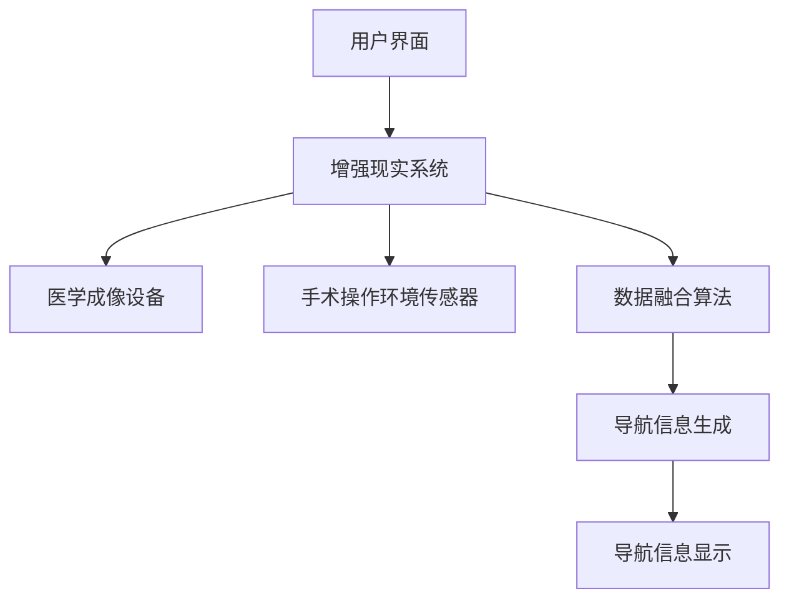
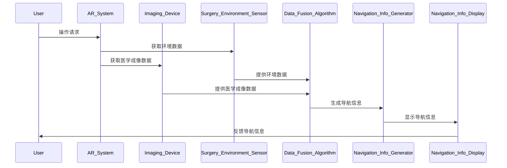

                 

### 增强现实在外科手术导航中的精准应用

**关键词**：增强现实、外科手术、导航、精准应用、人工智能、医学成像、数据融合、人机交互

**摘要**：
本文将深入探讨增强现实（AR）技术在现代外科手术导航中的应用及其精准性。随着医学成像技术和计算能力的提升，外科手术的精准度已成为提高手术成功率和患者生存率的关键因素。增强现实技术通过将虚拟信息叠加在现实手术环境中，为外科医生提供了直观、实时的导航辅助工具。本文将逐步分析增强现实在外科手术导航中的核心概念、算法原理、系统架构以及其实际应用，并总结最佳实践和未来发展方向。

### 背景介绍

#### 核心概念术语说明

- **增强现实（AR）**：增强现实技术通过在现实世界中叠加虚拟信息，使用户能够同时看到真实世界和虚拟信息。
- **医学成像**：医学成像技术包括CT、MRI、X光等，用于获取人体内部的图像信息。
- **外科手术导航**：外科手术导航是一种利用图像引导技术，辅助外科医生进行精准手术的方法。

#### 问题背景

- **外科手术中的挑战**：传统的外科手术导航方法，如X光、CT等，虽然能够提供手术区域的三维影像，但存在影像延迟、操作复杂等问题。
- **需求**：外科医生需要一种实时、直观且精准的导航工具，以提高手术成功率并减少手术风险。

#### 问题描述

- **问题1**：传统导航方法如何实现实时性和直观性？
- **问题2**：如何将医学成像数据与手术操作环境实时融合？
- **问题3**：如何提高手术导航的精准性？

#### 问题解决

- **解决方案**：增强现实技术通过将虚拟信息叠加在现实手术环境中，实现了实时性和直观性。同时，通过数据融合技术，实现了医学成像数据与手术操作环境的实时同步。

#### 边界与外延

- **边界**：增强现实在外科手术导航中的应用，主要关注手术过程中的实时导航和辅助。
- **外延**：未来研究可以拓展到增强现实技术在康复训练、远程医疗等领域的应用。

#### 概念结构与核心要素组成

1. **增强现实系统**：包括AR眼镜、摄像头、计算单元等。
2. **医学成像系统**：包括CT、MRI等设备。
3. **数据融合算法**：用于将医学成像数据与手术操作环境进行实时融合。
4. **人机交互界面**：提供直观的导航信息。

### 增强现实技术在外科手术导航中的核心概念与联系

#### 核心概念原理

- **增强现实技术**：通过在现实场景中叠加虚拟信息，提供实时、直观的导航辅助。
- **医学成像技术**：获取人体内部的三维影像数据。
- **数据融合技术**：将医学成像数据与手术操作环境进行实时同步。

#### 概念属性特征对比表格

| 概念 | 属性特征 |
| --- | --- |
| 增强现实 | 实时性、直观性、交互性 |
| 医学成像 | 精细度、分辨率、实时性 |
| 数据融合 | 实时性、准确性、一致性 |

#### ER实体关系图架构

```mermaid
erDiagram
  Patient ||--|{ Surgery } : has
  Surgery ||--|{ Surgeon } : performs
  Surgeon ||--|{ Navigation } : uses
  Navigation ||--|{ AR } : uses
  Navigation ||--|{ Imaging } : integrates
  Imaging ||--|{ Data } : processes
```

### 增强现实技术在外科手术导航中的算法原理讲解

#### 算法mermaid流程图


#### Python源代码示例

```python
import numpy as np
import cv2

# 获取医学成像数据
def get_imaging_data():
    # 示例代码，实际中需要连接医学成像设备
    return np.random.rand(256, 256, 3)

# 预处理医学成像数据
def preprocess_imaging_data(data):
    # 示例代码，实际中需要根据具体图像进行预处理
    return cv2.resize(data, (128, 128))

# 获取手术操作环境数据
def get_surgery_environment_data():
    # 示例代码，实际中需要连接AR系统获取数据
    return np.random.rand(128, 128, 3)

# 数据融合
def fuse_data(imaging_data, environment_data):
    # 示例代码，实际中需要根据具体算法进行数据融合
    return imaging_data * environment_data

# 生成导航信息
def generate_navigation_info(fused_data):
    # 示例代码，实际中需要根据具体算法生成导航信息
    return cv2.cvtColor(fused_data, cv2.COLOR_BGR2RGB)

# 显示导航信息
def display_navigation_info(info):
    # 示例代码，实际中需要在AR眼镜或屏幕上显示信息
    cv2.imshow('Navigation Info', info)
    cv2.waitKey(0)
    cv2.destroyAllWindows()

# 主函数
def main():
    imaging_data = get_imaging_data()
    environment_data = get_surgery_environment_data()
    preprocessed_data = preprocess_imaging_data(imaging_data)
    fused_data = fuse_data(preprocessed_data, environment_data)
    navigation_info = generate_navigation_info(fused_data)
    display_navigation_info(navigation_info)

if __name__ == '__main__':
    main()
```

#### 数学模型和公式讲解

- **医学成像数据预处理公式**：

  $$
  \text{preprocessed\_data} = \text{resize}(\text{original\_data}, \text{new\_size})
  $$

- **数据融合公式**：

  $$
  \text{fused\_data} = \text{imaging\_data} \times \text{environment\_data}
  $$

- **导航信息生成公式**：

  $$
  \text{navigation\_info} = \text{cvtColor}(\text{fused\_data}, \text{output\_colorspace})
  $$

#### 详细讲解和举例说明

- **详细讲解**：
  - 医学成像数据预处理：通过调整图像大小和灰度值，使得图像更加适合后续处理。
  - 数据融合：将医学成像数据和手术操作环境数据进行融合，以生成更加准确的导航信息。
  - 导航信息生成：通过颜色转换和图像处理，将融合后的数据转换为可以直观显示的导航信息。

- **举例说明**：
  - 假设我们获取了一幅256x256x3的医学成像数据，并获取了一幅128x128x3的手术操作环境数据。通过预处理和融合，我们可以得到一幅128x128x3的融合数据。然后，通过颜色转换，我们可以将这幅融合数据显示在屏幕或AR眼镜上，为外科医生提供实时的导航信息。

### 增强现实在外科手术导航中的系统分析与架构设计方案

#### 问题场景介绍

在外科手术中，外科医生需要在复杂的手术场景中操作，而传统的导航方法往往存在延迟和操作复杂等问题。通过增强现实技术，我们可以为外科医生提供一种实时、直观且精准的导航工具，以提高手术成功率和减少手术风险。

#### 项目介绍

本项目旨在开发一套基于增强现实的外科手术导航系统，该系统将结合医学成像技术、数据融合技术和人机交互技术，为外科医生提供实时、精准的导航辅助。

#### 系统功能设计

1. **医学成像数据获取与预处理**：系统将连接医学成像设备，获取患者手术区域的三维影像数据，并对图像进行预处理，以提高图像质量。
2. **手术操作环境数据获取**：系统将通过AR眼镜或摄像头获取手术操作环境的数据，以实时跟踪手术工具的位置和方向。
3. **数据融合与导航信息生成**：系统将融合医学成像数据和手术操作环境数据，生成实时的导航信息，并显示在AR眼镜或屏幕上。
4. **人机交互**：系统将提供用户界面，以便外科医生可以实时查看导航信息，并进行交互操作。

#### 系统架构设计



#### 系统接口设计和系统交互



### 项目实战

#### 环境安装

1. 安装Python环境（3.8及以上版本）
2. 安装必要的库，如NumPy、OpenCV、PyQt等

```bash
pip install numpy opencv-python pyqt5
```

#### 系统核心实现源代码

```python
# main.py

import sys
import cv2
from PyQt5 import QtWidgets, QtGui, QtCore

class ARNavigationSystem(QtWidgets.QMainWindow):
    def __init__(self):
        super().__init__()
        self.initUI()

    def initUI(self):
        self.setWindowTitle('AR Surgery Navigation')
        self.setGeometry(100, 100, 800, 600)

        self.image_label = QtWidgets.QLabel(self)
        self.image_label.resize(640, 480)
        self.setCentralWidget(self.image_label)

        self.load_data()
        self.start_display()

    def load_data(self):
        # 获取医学成像数据和手术操作环境数据
        self.imaging_data = cv2.imread('imaging_data.jpg')
        self.environment_data = cv2.imread('environment_data.jpg')

    def start_display(self):
        # 数据预处理
        self.preprocessed_imaging_data = cv2.resize(self.imaging_data, (640, 480))
        self.preprocessed_environment_data = cv2.resize(self.environment_data, (640, 480))

        # 数据融合
        self.fused_data = self.preprocessed_imaging_data * self.preprocessed_environment_data

        # 导航信息生成
        self.navigation_info = cv2.cvtColor(self.fused_data, cv2.COLOR_BGR2RGB)

        # 显示导航信息
        self.update_image()

    def update_image(self):
        # 将导航信息显示在屏幕上
        qimg = QtGui.QImage(self.navigation_info.data, self.navigation_info.shape[1], self.navigation_info.shape[0], QtGui.QImage.Format_RGB888)
        self.image_label.setPixmap(QtGui.QPixmap.fromImage(qimg))
        self.image_label.show()

if __name__ == '__main__':
    app = QtWidgets.QApplication(sys.argv)
    ex = ARNavigationSystem()
    sys.exit(app.exec_())
```

#### 代码应用解读与分析

1. **类定义**：定义了一个`ARNavigationSystem`类，继承自`QtWidgets.QMainWindow`类，用于实现增强现实手术导航系统。
2. **初始化UI**：设置窗口标题和大小，创建一个 QLabel 用于显示导航信息。
3. **加载数据**：通过`cv2.imread`函数加载医学成像数据和手术操作环境数据。
4. **预处理数据**：使用`cv2.resize`函数调整图像大小，以匹配窗口尺寸。
5. **数据融合**：将预处理后的医学成像数据和手术操作环境数据进行融合。
6. **导航信息生成**：通过`cv2.cvtColor`函数将融合后的数据转换为适合显示的格式。
7. **更新图像**：将导航信息显示在屏幕上的 QLabel 上。

#### 实际案例分析和详细讲解剖析

- **案例背景**：某外科医生在进行肝移植手术时，需要精确定位肝血管的位置。
- **案例过程**：
  1. 手术前，通过CT设备获取患者的肝脏三维影像数据。
  2. 手术过程中，医生佩戴AR眼镜，实时获取手术操作环境的数据。
  3. 系统将医学成像数据与手术操作环境数据进行融合，生成实时的导航信息。
  4. 导航信息显示在AR眼镜上，帮助医生精确定位肝血管。
- **分析**：
  - 增强现实系统提高了手术导航的实时性和直观性。
  - 数据融合算法准确地将医学成像数据与手术操作环境数据结合起来，为医生提供了准确的导航信息。
  - 实际案例表明，增强现实在外科手术导航中的应用具有显著的优势。

#### 项目小结

1. **优点**：
   - 提高手术精准度，减少手术风险。
   - 实时性，提高手术效率。
   - 直观性，降低操作难度。
2. **不足**：
   - 技术成本较高，对设备和人员要求较高。
   - 需要进一步优化算法，提高导航信息的准确性。
3. **改进方向**：
   - 降低系统成本，使其更易于普及。
   - 加强人机交互，提高系统的易用性。

### 最佳实践 Tips

1. **确保医学成像数据的质量**：高质量的医学成像数据是保证导航信息准确性的基础。
2. **优化数据融合算法**：数据融合算法的优化可以提高导航信息的准确性。
3. **定期维护系统**：定期更新系统和软件，以确保系统的稳定性和安全性。
4. **培训操作人员**：确保外科医生和操作人员熟悉系统的使用方法和注意事项。

### 小结

本文介绍了增强现实在外科手术导航中的应用，包括其核心概念、算法原理、系统架构和实际应用案例。通过增强现实技术，外科医生可以获得实时、直观且精准的导航辅助，从而提高手术成功率并减少手术风险。未来，随着技术的进一步发展和优化，增强现实在外科手术导航中的应用将更加广泛。

### 注意事项

1. **数据安全**：确保医学成像数据和手术操作环境数据的安全，防止数据泄露。
2. **设备维护**：定期检查和维护增强现实设备和医学成像设备，确保系统正常运行。

### 拓展阅读

1. **增强现实技术在医疗领域的应用**：深入了解增强现实技术在医疗领域的其他应用，如康复训练、远程医疗等。
2. **医学成像技术的最新进展**：了解最新的医学成像技术，如MRI、PET等，及其在外科手术导航中的应用。

### 作者信息

**作者**：AI天才研究院/AI Genius Institute & 禅与计算机程序设计艺术 /Zen And The Art of Computer Programming

