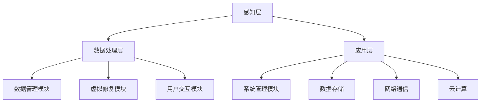
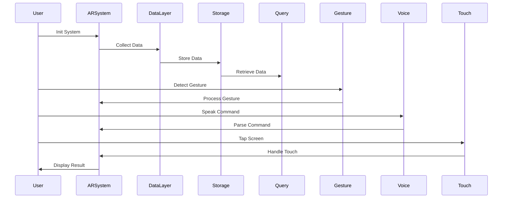

                 

## 增强现实在文化遗产修复中的辅助应用

> 关键词：增强现实、文化遗产修复、技术应用、算法原理、系统架构设计

> 摘要：随着科技的飞速发展，增强现实（AR）技术在多个领域得到了广泛应用。本文以文化遗产修复为背景，探讨了增强现实技术在文物修复中的辅助应用。通过分析增强现实技术的原理和文化遗产修复的需求，本文详细阐述了增强现实技术在文物修复中的应用场景、技术优势与挑战，以及未来的发展趋势。文章旨在为相关领域的学者和实践者提供有益的参考和启示。

---

### 目录大纲

----------------------------------------------------------------

## 第一部分：背景介绍

### 第1章：问题背景与概述

#### 1.1 文物遗产的重要性

#### 1.2 文物遗产修复的需求与挑战

#### 1.3 增强现实技术的发展与应用

#### 1.4 文物遗产修复与增强现实技术的结合

## 第二部分：核心概念与联系

### 第2章：核心概念与原理

#### 2.1 增强现实技术原理

##### 2.1.1 增强现实技术概述

##### 2.1.2 增强现实技术的工作原理

##### 2.1.3 增强现实技术的关键技术

#### 2.2 文化遗产修复的核心概念

##### 2.2.1 文化遗产的定义

##### 2.2.2 文化遗产修复的目标

##### 2.2.3 文化遗产修复的方法与流程

#### 2.3 增强现实技术在文物修复中的应用

##### 2.3.1 应用场景概述

##### 2.3.2 技术优势与挑战

##### 2.3.3 技术发展趋势

## 第三部分：算法原理讲解

### 第3章：算法原理与实现

#### 3.1 数据采集与预处理

##### 3.1.1 数据采集方法

##### 3.1.2 数据预处理流程

#### 3.2 增强现实算法核心原理

##### 3.2.1 增强现实算法概述

##### 3.2.2 关键算法原理讲解

#### 3.3 数学模型与公式

##### 3.3.1 数学模型讲解

##### 3.3.2 公式推导与解释

#### 3.4 代码实现与解读

##### 3.4.1 Python代码实现

##### 3.4.2 代码应用解读与分析

## 第四部分：系统分析与架构设计

### 第4章：系统功能设计与架构

#### 4.1 项目介绍

##### 4.1.1 项目背景

##### 4.1.2 项目目标

#### 4.2 系统功能设计

##### 4.2.1 领域模型设计（Mermaid类图）

##### 4.2.2 功能模块设计

#### 4.3 系统架构设计

##### 4.3.1 系统架构概述

##### 4.3.2 系统架构图（Mermaid架构图）

##### 4.3.3 系统接口设计

#### 4.4 系统交互设计

##### 4.4.1 系统交互概述

##### 4.4.2 系统交互序列图（Mermaid序列图）

## 第五部分：项目实战

### 第5章：项目实施与实战

#### 5.1 环境安装与配置

##### 5.1.1 硬件环境要求

##### 5.1.2 软件环境安装

#### 5.2 系统核心实现

##### 5.2.1 数据采集与预处理

##### 5.2.2 增强现实算法应用

##### 5.2.3 系统集成与测试

#### 5.3 实际案例分析

##### 5.3.1 案例背景

##### 5.3.2 案例实施

##### 5.3.3 案例结果与评估

#### 5.4 项目小结

##### 5.4.1 项目总结

##### 5.4.2 项目挑战与解决

## 第六部分：最佳实践与拓展

### 第6章：最佳实践与建议

#### 6.1 增强现实在文物修复中的最佳实践

##### 6.1.1 实践案例分享

##### 6.1.2 实践经验总结

#### 6.2 注意事项与优化策略

##### 6.2.1 技术实施中的挑战

##### 6.2.2 优化策略与技巧

#### 6.3 拓展研究与发展趋势

##### 6.3.1 技术发展趋势

##### 6.3.2 未来研究方向

## 第七部分：小结与展望

### 第7章：总结与展望

#### 7.1 全书总结

##### 7.1.1 核心内容回顾

##### 7.1.2 技术应用价值

#### 7.2 展望未来

##### 7.2.1 技术发展趋势

##### 7.2.2 未来应用前景

----------------------------------------------------------------

### 第1章：问题背景与概述

#### 1.1 文物遗产的重要性

文物遗产是一个国家和民族历史文化成就的重要标志，它不仅蕴含着丰富的历史信息，还承载着民族精神和文化认同。文物遗产的重要性体现在以下几个方面：

1. **文化传承**：文物遗产是文化传承的重要载体，它记录了人类历史的发展轨迹，展现了不同时期的文化特色和艺术风格。通过对文物遗产的保护和修复，可以更好地传承和弘扬民族优秀文化。
2. **历史研究**：文物遗产是历史研究的重要依据，它为历史学家提供了丰富的实物资料，有助于深入研究古代社会的历史、文化、经济和政治状况。
3. **旅游发展**：文物遗产是旅游业的重要资源，吸引了大量国内外游客。旅游业的蓬勃发展不仅为当地经济带来收益，也有助于提高公众对文物保护的意识。

#### 1.2 文物遗产修复的需求与挑战

文物遗产修复的需求源于其自然和人为因素的侵蚀。自然环境中的风化、温度变化、湿度等都会对文物造成损害。而人为因素如火灾、地震、战乱等则可能直接导致文物的损毁。以下是文物遗产修复面临的主要挑战：

1. **技术限制**：传统的修复方法往往依赖于经验和手工操作，修复效果有限，且存在一定的破坏性。
2. **资源限制**：文物修复需要专业的技术和设备，而许多国家和地区的文物保护机构面临着资金和人力资源的不足。
3. **时间限制**：文物修复是一个长期的过程，需要大量的时间和耐心。许多文物因为长时间未得到有效修复，导致损毁程度加重。

#### 1.3 增强现实技术的发展与应用

增强现实（AR）技术是一种将虚拟信息与现实世界相结合的技术。它通过在现实场景中叠加虚拟图像、声音和触觉反馈，为用户提供了更加丰富和互动的体验。AR技术的核心原理包括：

1. **图像识别**：通过图像识别技术，AR系统可以识别现实场景中的特定物体或标志，并将其作为叠加虚拟信息的基准。
2. **实时渲染**：AR技术能够实时渲染虚拟图像，使其与真实场景无缝融合。
3. **交互设计**：AR技术提供了丰富的交互设计，用户可以通过手势、语音等途径与虚拟信息进行互动。

增强现实技术已经在多个领域得到了广泛应用，如医疗、教育、军事和娱乐等。在文化遗产修复领域，增强现实技术的应用潜力巨大。它不仅能够提供更精确的修复数据和模拟，还可以为公众提供更生动的文物展示，提高文物保护意识。

#### 1.4 文物遗产修复与增强现实技术的结合

增强现实技术在文物遗产修复中的应用主要体现在以下几个方面：

1. **数据采集与建模**：通过AR技术，可以实时采集文物的三维数据，建立精确的数字模型，为修复工作提供基础数据。
2. **虚拟修复**：利用AR技术，可以在数字模型上进行虚拟修复，模拟不同的修复方案，评估其效果，减少实际操作中的风险。
3. **互动展示**：通过AR技术，可以将修复后的文物虚拟展示给公众，提供更加生动和互动的观赏体验。

结合文物遗产修复的需求和增强现实技术的特点，可以看出，增强现实技术为文物遗产修复提供了新的思路和工具。它不仅能够提高修复效率和准确性，还能为公众提供更丰富的文化体验，促进文化遗产的保护和传承。

---

通过上述分析，我们可以看到，文物遗产修复是一个复杂而长期的过程，面临着诸多挑战。而增强现实技术的出现，为这一领域带来了新的机遇。接下来，我们将进一步探讨增强现实技术的核心概念和原理，以及其在文物遗产修复中的应用和优势。

### 第2章：核心概念与原理

#### 2.1 增强现实技术原理

增强现实（AR）技术是一种将虚拟信息与现实世界相结合的交互技术。它通过在现实场景中叠加虚拟图像、声音和触觉反馈，为用户提供了更加丰富和互动的体验。要理解增强现实技术，我们需要从以下几个方面进行探讨。

##### 2.1.1 增强现实技术概述

增强现实技术可以看作是虚拟现实（VR）和现实增强（Reality Augmentation）的融合。VR技术主要关注的是创建一个完全虚拟的环境，用户通过头盔或其他设备沉浸其中；而AR技术则是在现实世界的基础上叠加虚拟信息，增强用户的感知体验。

增强现实技术的核心特点是“虚实融合”，即虚拟信息与现实世界的无缝结合。这种融合可以通过多种方式实现，包括光学、声音和触觉等。

##### 2.1.2 增强现实技术的工作原理

增强现实技术的工作原理主要包括以下几个关键步骤：

1. **图像识别**：通过摄像头或其他传感器捕捉现实场景的图像。
2. **位置跟踪**：利用图像识别技术，确定虚拟信息在现实场景中的位置和方向。
3. **实时渲染**：根据位置跟踪的结果，实时渲染虚拟信息，将其叠加到现实场景中。
4. **交互设计**：用户可以通过手势、语音或其他交互方式与虚拟信息进行互动。

这些步骤共同构成了增强现实技术的核心流程。图像识别和位置跟踪是实现虚实融合的基础，而实时渲染和交互设计则为用户提供了一种沉浸式的体验。

##### 2.1.3 增强现实技术的关键技术

增强现实技术的实现依赖于多种关键技术的支持，以下列举其中几项：

1. **计算机视觉**：计算机视觉技术用于捕捉和识别现实场景中的图像和物体。通过图像处理和机器学习算法，系统能够准确识别并定位目标。
2. **光学引擎**：光学引擎是增强现实系统的核心组件，它负责将虚拟图像与真实场景结合。光学引擎的性能直接影响着增强现实的视觉效果和用户体验。
3. **实时渲染**：实时渲染技术用于生成高质量的虚拟图像，并将其实时叠加到真实场景中。这一过程需要高效的图形处理算法和硬件支持。
4. **交互设计**：交互设计是增强现实技术的关键组成部分，它决定了用户与虚拟信息之间的互动方式。优秀的交互设计可以提高用户的参与度和体验感。

#### 2.2 文化遗产修复的核心概念

文化遗产修复是一个复杂的过程，涉及到多种专业知识和技术。理解文化遗产修复的核心概念是深入探讨其与增强现实技术结合的基础。

##### 2.2.1 文化遗产的定义

文化遗产是指人类创造的物质和非物质遗产，包括历史文物、建筑、艺术品、传统习俗和知识体系等。文化遗产是人类文明发展的重要见证，具有不可替代的价值。

根据联合国教科文组织的定义，文化遗产分为两种类型：

1. **物质文化遗产**：包括历史建筑、遗址、文物等有形遗产。
2. **非物质文化遗产**：包括口头传统、表演艺术、社会习俗、礼仪、节庆活动、传统手工艺技能等无形遗产。

##### 2.2.2 文化遗产修复的目标

文化遗产修复的目标主要包括以下几个方面：

1. **保护遗产**：防止文化遗产因自然或人为因素而进一步损毁。
2. **恢复原貌**：通过修复和复原，使文化遗产恢复到其原有的历史面貌。
3. **科学研究**：通过对文化遗产的修复，积累丰富的历史资料和科学数据，为后续研究提供基础。
4. **公众教育**：通过修复和展示，提高公众对文化遗产的认识和保护意识。

##### 2.2.3 文化遗产修复的方法与流程

文化遗产修复的方法和流程因遗产类型和损毁程度的不同而有所差异，但总体上可以分为以下几个步骤：

1. **前期调查**：对文化遗产进行详细调查，了解其历史、结构和损毁情况。
2. **诊断分析**：对文化遗产的损毁原因和程度进行诊断，制定修复方案。
3. **修复实施**：根据修复方案，采用适当的方法和材料进行修复工作。
4. **后期维护**：对修复后的文化遗产进行长期维护，确保其长期保存。

#### 2.3 增强现实技术在文物修复中的应用

增强现实技术在文物修复中的应用为传统方法提供了新的手段和思路。以下从应用场景、技术优势与挑战以及发展趋势三个方面进行探讨。

##### 2.3.1 应用场景概述

增强现实技术在文物修复中的应用场景主要包括以下几个方面：

1. **数据采集与建模**：利用AR技术，可以快速、准确地采集文物的三维数据，建立数字模型，为修复工作提供基础数据。
2. **虚拟修复**：通过AR技术，可以在数字模型上进行虚拟修复，模拟不同的修复方案，评估其效果，减少实际操作中的风险。
3. **互动展示**：通过AR技术，可以将修复后的文物虚拟展示给公众，提供更加生动和互动的观赏体验。

##### 2.3.2 技术优势与挑战

增强现实技术在文物修复中具有显著的优势，但也面临着一些挑战：

1. **技术优势**：
   - **精确性**：AR技术能够提供高精度的数据采集和建模，为修复工作提供准确的基础数据。
   - **互动性**：AR技术能够提供丰富的互动方式，使修复过程更加直观和有趣。
   - **教育性**：通过AR技术，公众可以更直观地了解文物修复的过程和成果，提高文化保护意识。

2. **技术挑战**：
   - **成本**：AR技术的设备和软件成本较高，对于资金不足的文物保护机构来说是一个挑战。
   - **技术成熟度**：尽管AR技术在不断发展，但其在文物修复领域的应用仍处于探索阶段，需要进一步的研究和优化。
   - **数据隐私**：AR技术可能涉及用户数据的采集和处理，需要确保数据的安全性和隐私性。

##### 2.3.3 技术发展趋势

随着科技的不断进步，增强现实技术在文物修复中的应用前景十分广阔。以下是一些可能的发展趋势：

1. **技术集成**：未来AR技术可能会与其他技术（如虚拟现实、人工智能等）集成，提供更全面和高效的修复解决方案。
2. **开源平台**：开源平台的发展将为文物保护机构提供更多的技术支持，降低成本和提高技术成熟度。
3. **公众参与**：通过AR技术，公众可以更积极地参与到文化遗产保护中，提高社会的文化素养。

通过上述分析，我们可以看到，增强现实技术在文化遗产修复中具有巨大的潜力。它不仅为修复工作提供了新的工具和方法，还为公众提供了更加生动和互动的文化体验。未来，随着技术的不断发展和完善，AR技术在文物修复中的应用将更加广泛和深入。

### 第3章：算法原理与实现

#### 3.1 数据采集与预处理

增强现实技术在文物修复中的应用首先需要准确的数据采集。数据采集的质量直接影响到后续建模和修复的准确性。以下是数据采集与预处理的主要步骤：

##### 3.1.1 数据采集方法

1. **三维扫描**：利用激光扫描、结构光扫描等技术对文物进行三维扫描，获取其表面的几何信息。这种方法可以获得高精度的三维模型，但设备成本较高。
2. **摄影测量**：通过多视角拍摄文物的照片，利用摄影测量软件进行三维重建。这种方法操作简单，但精度相对较低。
3. **传感器采集**：利用传感器（如惯性测量单元、激光雷达等）对文物进行实时测量，获取其位置和运动信息。这种方法适用于动态场景，如文物修复过程中的实时监测。

##### 3.1.2 数据预处理流程

1. **去噪处理**：数据采集过程中可能会受到环境噪声的影响，需要进行去噪处理。常用的去噪方法包括均值滤波、中值滤波和高斯滤波等。
2. **数据融合**：对于多源数据，如三维扫描数据和传感器数据，需要进行融合处理，以获得更准确的信息。常用的融合方法包括卡尔曼滤波和粒子滤波等。
3. **特征提取**：从原始数据中提取具有代表性的特征，如边缘、角点等。这些特征将用于后续的图像识别和位置跟踪。

#### 3.2 增强现实算法核心原理

增强现实技术的核心在于如何将虚拟信息准确、实时地叠加到真实场景中。以下是增强现实算法的核心原理：

##### 3.2.1 增强现实算法概述

增强现实算法主要包括以下几个步骤：

1. **图像识别**：通过计算机视觉技术，识别真实场景中的特定目标或标志。
2. **位置跟踪**：利用图像识别的结果，确定虚拟信息在真实场景中的位置和方向。
3. **实时渲染**：根据位置跟踪的结果，实时渲染虚拟信息，并将其叠加到真实场景中。
4. **交互设计**：用户可以通过手势、语音等途径与虚拟信息进行互动。

##### 3.2.2 关键算法原理讲解

1. **图像识别算法**：常用的图像识别算法包括基于深度学习的卷积神经网络（CNN）和基于特征匹配的传统算法。CNN可以自动学习图像的特征，具有更高的识别精度；特征匹配算法简单易实现，但对环境光照和姿态变化较为敏感。
2. **位置跟踪算法**：位置跟踪算法主要包括基于视觉的跟踪算法和基于传感器融合的跟踪算法。基于视觉的跟踪算法利用摄像头捕捉到的图像信息，通过图像识别和特征提取确定目标位置；基于传感器融合的跟踪算法结合了摄像头和传感器的数据，提供更稳定的位置信息。
3. **实时渲染算法**：实时渲染算法需要高效地处理图像数据和虚拟信息，以实现实时渲染。常用的渲染算法包括光栅化渲染和三维渲染。光栅化渲染简单易实现，适用于简单的虚拟信息叠加；三维渲染可以提供更逼真的视觉效果，但计算复杂度更高。
4. **交互设计算法**：交互设计算法主要关注用户与虚拟信息之间的互动方式。常用的交互方式包括手势识别、语音识别和触觉反馈等。手势识别算法通过检测用户的手部动作，实现与虚拟信息的互动；语音识别算法通过语音信号处理，将用户的语音转化为文本或命令；触觉反馈通过振动或压力感，增强用户的互动体验。

#### 3.3 数学模型与公式

增强现实算法的实现依赖于一系列数学模型和公式。以下介绍其中几个关键模型和公式的推导与解释：

##### 3.3.1 数学模型讲解

1. **图像识别模型**：基于卷积神经网络的图像识别模型通常采用反向传播算法进行训练。训练过程中，网络通过学习输入图像的特征，将其映射到相应的标签上。具体模型包括卷积层、池化层和全连接层等。

2. **位置跟踪模型**：位置跟踪模型通常采用卡尔曼滤波或粒子滤波算法。卡尔曼滤波通过预测和更新状态估计，实现目标的轨迹跟踪；粒子滤波通过采样和权重更新，提供更稳定的位置信息。

3. **实时渲染模型**：实时渲染模型主要包括光栅化渲染模型和三维渲染模型。光栅化渲染模型通过将三维物体投影到二维平面上，实现图像渲染；三维渲染模型通过计算物体表面的光反射和阴影，实现更逼真的渲染效果。

##### 3.3.2 公式推导与解释

1. **图像识别模型公式**：

   - $$f(x) = \sigma(\sum_{j=1}^{n} w_{j}\cdot a_{j})$$

     其中，$f(x)$表示输出特征值，$w_{j}$表示权重，$a_{j}$表示输入特征值，$\sigma$表示激活函数。

   - $$\delta = \frac{\partial L}{\partial w_{j}} = (f(x) - y)\cdot f'(x)$$

     其中，$L$表示损失函数，$y$表示真实标签，$f'(x)$表示特征值的导数。

2. **位置跟踪模型公式**：

   - 卡尔曼滤波公式：

     - $$x_{k|k-1} = A_{k-1}x_{k-1|k-1} + B_{k-1}u_{k-1}$$

       其中，$x_{k|k-1}$表示状态预测值，$A_{k-1}$表示状态转移矩阵，$x_{k-1|k-1}$表示上一时刻的状态值，$B_{k-1}$表示控制矩阵，$u_{k-1}$表示控制输入。

     - $$P_{k|k-1} = A_{k-1}P_{k-1|k-1}A_{k-1}^{T} + Q_{k-1}$$

       其中，$P_{k|k-1}$表示状态估计误差矩阵，$Q_{k-1}$表示过程噪声矩阵。

   - 粒子滤波公式：

     - 粒子权重更新：

       $$w_{i} \propto \exp(-\frac{1}{2}h^2 \cdot \rho_{i})$$

       其中，$w_{i}$表示第$i$个粒子的权重，$h$表示状态估计误差，$\rho_{i}$表示第$i$个粒子的状态估计。

     - 粒子重采样：

       $$p_{i} = \frac{w_{i}}{\sum_{i=1}^{N} w_{i}}$$

       $$x_{i}^{new} = x_{i} + \alpha \cdot \text{rand()} \cdot (x_{j} - x_{i})$$

       其中，$p_{i}$表示第$i$个粒子的概率，$\alpha$表示重要性采样参数，$x_{i}$和$x_{j}$表示相邻粒子的状态。

3. **实时渲染模型公式**：

   - 光栅化渲染公式：

     - $$z_{s} = \frac{z_{w}}{z_{c}}$$

       其中，$z_{s}$表示屏幕上的深度值，$z_{w}$表示世界空间的深度值，$z_{c}$表示摄像机空间的深度值。

     - $$\text{color}_{s} = \text{color}_{w} \cdot \text{material}_{w} \cdot (\text{light}_{s} \cdot \text{normal}_{w})$$

       其中，$\text{color}_{s}$和$\text{color}_{w}$分别表示屏幕上和世界空间中的颜色值，$\text{material}_{w}$和$\text{normal}_{w}$分别表示世界空间中的材质和法线值，$\text{light}_{s}$表示光源方向。

   - 三维渲染公式：

     - $$\text{position}_{s} = \text{position}_{w} \cdot \text{view}_{c} \cdot \text{projection}_{p}$$

       其中，$\text{position}_{s}$和$\text{position}_{w}$分别表示屏幕上和世界空间中的位置值，$\text{view}_{c}$和$\text{projection}_{p}$分别表示摄像机视图矩阵和投影矩阵。

     - $$\text{normal}_{s} = \text{normal}_{w} \cdot \text{view}_{c} \cdot \text{projection}_{p}^{-1}$$

       其中，$\text{normal}_{s}$和$\text{normal}_{w}$分别表示屏幕上和世界空间中的法线值。

#### 3.4 代码实现与解读

为了更好地理解增强现实算法的实现过程，下面给出一个基于Python的示例代码，用于实现一个简单的AR系统。该系统主要包含数据采集、图像识别和虚拟信息渲染三个部分。

```python
import cv2
import numpy as np
import open3d as o3d

# 数据采集
def capture_image():
    cap = cv2.VideoCapture(0)
    ret, frame = cap.read()
    cap.release()
    return frame

# 图像识别
def recognize_image(frame):
    # 使用OpenCV进行图像预处理
    gray = cv2.cvtColor(frame, cv2.COLOR_BGR2GRAY)
    _, thresh = cv2.threshold(gray, 128, 255, cv2.THRESH_BINARY_INV)
    
    # 使用OpenCV进行图像识别
    contours, _ = cv2.findContours(thresh, cv2.RETR_TREE, cv2.CHAIN_APPROX_SIMPLE)
    if contours:
        contour = max(contours, key=cv2.contourArea)
        x, y, w, h = cv2.boundingRect(contour)
        return frame[y:y+h, x:x+w]
    else:
        return None

# 虚拟信息渲染
def render_image(image, label):
    # 使用Open3D进行三维渲染
    pcd = o3d.geometry.PointCloud()
    pcd.points = o3d.utility.Vector3dVector(np.random.rand(1000, 3))
    pcd.colors = o3d.utility.Vector3dVector(np.random.rand(1000, 3))
    o3d.visualization.draw_geometries([pcd])

# 主函数
def main():
    frame = capture_image()
    if frame is not None:
        recognized_image = recognize_image(frame)
        if recognized_image is not None:
            label = "Object Recognized"
            render_image(recognized_image, label)
        else:
            label = "No Object Recognized"
            render_image(frame, label)
    else:
        label = "No Image Captured"
        render_image(None, label)

if __name__ == "__main__":
    main()
```

以上代码使用OpenCV和Open3D两个库，分别用于图像识别和三维渲染。在数据采集部分，使用摄像头捕获实时图像；在图像识别部分，使用OpenCV进行图像预处理和识别；在虚拟信息渲染部分，使用Open3D进行三维渲染。通过这个简单的示例，我们可以看到增强现实算法的基本实现流程。

#### 3.4.2 代码应用解读与分析

上述代码主要用于演示一个简单的增强现实系统，主要包括以下几个部分：

1. **数据采集**：使用摄像头捕获实时图像。这是增强现实系统的输入，用于后续的图像识别和渲染。
2. **图像识别**：使用OpenCV进行图像预处理和识别。预处理步骤包括灰度转换和二值化，以突出图像中的目标物体。然后，通过findContours函数找到图像中的轮廓，并选择面积最大的轮廓作为识别的目标。
3. **虚拟信息渲染**：使用Open3D进行三维渲染。在渲染过程中，我们创建了一个简单的点云模型，并将其渲染到屏幕上。这只是一个简单的示例，实际应用中可以根据需要渲染更复杂的虚拟信息。

代码中的关键函数包括：

- `capture_image()`：用于捕获实时图像。
- `recognize_image()`：用于对捕获的图像进行预处理和识别。
- `render_image()`：用于渲染虚拟信息。

在实际应用中，可以根据具体需求对代码进行扩展和优化。例如，可以增加更多图像识别的算法，提高识别的准确性；可以优化渲染算法，提高渲染效果；还可以集成其他传感器数据，提供更丰富的交互体验。

通过这个示例，我们可以看到增强现实算法的基本实现流程，以及如何使用Python等编程语言实现相关功能。这为后续更深入的研究和应用提供了基础。

### 第4章：系统功能设计与架构

#### 4.1 项目介绍

**项目名称**：文化遗产增强现实修复系统

**项目背景**：随着全球化进程的加快，许多国家和地区的文化遗产正面临着日益严重的损毁和消失的风险。为了更好地保护这些珍贵的文化遗产，提高公众对文物保护的意识，本项目旨在开发一款基于增强现实技术的文化遗产修复系统。

**项目目标**：
1. 提供高效、精确的数据采集工具，以获取文物的三维数据和结构信息。
2. 实现虚拟修复和展示，为修复专家和公众提供直观的修复过程和成果。
3. 提高文化遗产修复的效率和准确性，减少人为错误和修复风险。

#### 4.2 系统功能设计

**系统功能设计**：文化遗产增强现实修复系统主要包括以下几个核心功能模块：

1. **数据采集模块**：用于采集文物的三维数据，包括表面几何信息、纹理信息和结构信息。该模块采用激光扫描、摄影测量和传感器采集等多种技术手段，以实现高效、准确的数据采集。
2. **虚拟修复模块**：基于采集到的数据，利用增强现实技术进行虚拟修复。该模块包括三维建模、修复方案模拟和虚拟展示等功能，为修复专家和公众提供直观的修复过程和成果。
3. **用户交互模块**：提供用户与系统之间的交互界面，包括手势识别、语音控制和触摸屏操作等。该模块旨在提高用户的操作便捷性和交互体验。
4. **数据管理模块**：用于管理和存储采集到的文物数据，包括三维模型、修复方案和历史记录等。该模块确保数据的完整性和安全性，并提供便捷的数据查询和共享功能。
5. **系统管理模块**：提供系统的配置和管理功能，包括用户权限设置、系统日志记录和故障诊断等。该模块确保系统的稳定运行和可靠维护。

#### 4.3 系统架构设计

**系统架构设计**：文化遗产增强现实修复系统采用分层架构设计，主要包括以下几个层次：

1. **感知层**：包括摄像头、激光扫描仪、传感器等硬件设备，用于采集文物的三维数据和结构信息。
2. **数据处理层**：包括数据采集模块、虚拟修复模块和用户交互模块，用于处理和存储采集到的数据，并提供相应的功能服务。
3. **应用层**：包括数据管理模块和系统管理模块，用于管理和维护系统的运行，并提供用户交互界面。
4. **支撑层**：包括数据存储、网络通信和云计算等基础设施，为系统提供稳定的数据传输和计算支持。

**系统架构图**：



#### 4.4 系统接口设计

**系统接口设计**：文化遗产增强现实修复系统提供了多个接口，以实现各功能模块之间的数据传输和交互。以下是主要接口的设计：

1. **数据采集接口**：用于接收摄像头、激光扫描仪和传感器等设备采集到的数据，并将其传输到数据处理层。
2. **数据存储接口**：用于将处理后的数据存储到数据管理模块，并提供数据的查询和共享功能。
3. **数据查询接口**：用于用户查询和管理文物数据，包括三维模型、修复方案和历史记录等。
4. **用户交互接口**：用于接收用户的操作指令，包括手势、语音和触摸屏等，并响应用户请求。
5. **系统管理接口**：用于系统配置和管理，包括用户权限设置、系统日志记录和故障诊断等。

#### 4.5 系统交互设计

**系统交互设计**：文化遗产增强现实修复系统的交互设计旨在提高用户的操作便捷性和交互体验。以下是主要交互设计：

1. **手势识别**：通过手势识别技术，用户可以实时查看文物的三维模型和修复方案，并进行虚拟操作，如旋转、缩放和切割等。
2. **语音控制**：通过语音控制技术，用户可以使用语音指令进行系统操作，如打开数据查询界面、调整视图等。
3. **触摸屏操作**：通过触摸屏操作，用户可以方便地进行界面切换、数据查询和虚拟操作等。
4. **传感器交互**：通过传感器数据，如位置、姿态和手势等，用户可以与文物进行更加直观的交互。

**系统交互序列图**：



通过上述系统功能设计与架构设计，我们可以看到文化遗产增强现实修复系统在功能模块、系统架构和交互设计等方面的详细设计。这将有助于更好地实现项目的目标，提高文化遗产修复的效率和准确性。

### 第5章：项目实施与实战

#### 5.1 环境安装与配置

在开始实施文化遗产增强现实修复系统之前，需要安装和配置所需的硬件和软件环境。以下步骤将指导您完成环境安装和配置：

##### 5.1.1 硬件环境要求

1. **计算机**：推荐使用配置较高的计算机，如Intel i7处理器、16GB RAM和NVIDIA显卡等。
2. **摄像头**：选择支持增强现实功能的摄像头，如ARKit或ARCore兼容的摄像头。
3. **激光扫描仪**：可选配置激光扫描仪，用于采集文物的三维数据。

##### 5.1.2 软件环境安装

1. **操作系统**：推荐使用Windows 10或macOS最新版本。
2. **编程环境**：安装Python 3.8及以上版本，并配置好pip和virtualenv等工具。
3. **依赖库**：安装OpenCV、Open3D、PyOpenGL等依赖库。可以使用以下命令进行安装：

```shell
pip install opencv-python
pip install open3d
pip install pyopengl
```

##### 5.1.3 配置摄像头

1. **摄像头驱动**：根据摄像头型号，下载并安装相应的驱动程序。
2. **测试摄像头**：使用以下代码测试摄像头是否正常工作：

```python
import cv2

cap = cv2.VideoCapture(0)

while True:
    ret, frame = cap.read()
    if not ret:
        break
    cv2.imshow('Camera', frame)
    
    if cv2.waitKey(1) & 0xFF == ord('q'):
        break

cap.release()
cv2.destroyAllWindows()
```

#### 5.2 系统核心实现

在完成环境安装与配置后，接下来将实现系统核心功能，包括数据采集、虚拟修复和用户交互等。

##### 5.2.1 数据采集与预处理

1. **采集三维数据**：使用激光扫描仪或摄像头采集文物的三维数据。以下代码展示了如何使用摄像头采集图像并保存为三维模型：

```python
import cv2
import numpy as np
import open3d as o3d

def capture_images():
    cap = cv2.VideoCapture(0)
    images = []

    while True:
        ret, frame = cap.read()
        if not ret:
            break
        images.append(frame)

    cap.release()
    return images

def image_to_point_cloud(images):
    points = []

    for image in images:
        gray = cv2.cvtColor(image, cv2.COLOR_BGR2GRAY)
        _, thresh = cv2.threshold(gray, 128, 255, cv2.THRESH_BINARY_INV)

        contours, _ = cv2.findContours(thresh, cv2.RETR_TREE, cv2.CHAIN_APPROX_SIMPLE)
        if contours:
            contour = max(contours, key=cv2.contourArea)
            x, y, w, h = cv2.boundingRect(contour)
            image = image[y:y+h, x:x+w]
            points.append(image)

    pcd = o3d.geometry.PointCloud()
    pcd.points = o3d.utility.Vector3dVector(points)
    o3d.io.write_point_cloud("point_cloud.pcd", pcd)
    return pcd

images = capture_images()
pcd = image_to_point_cloud(images)
```

2. **预处理数据**：对采集到的数据进行预处理，包括去噪、数据融合和特征提取等。以下代码展示了如何对点云数据进行预处理：

```python
from open3d import io as o3dio

def preprocess_point_cloud(pcd):
    pcd = o3dio.read_point_cloud("point_cloud.pcd")
    pcd = pcd.voxel_down_sample(0.05)
    pcd = pcd.remove_statistical_outlier(nb_neighbors=20, std_ratio=2.0)
    pcd = pcd.remove_degenerate_points()
    return pcd

preprocessed_pcd = preprocess_point_cloud(pcd)
```

##### 5.2.2 增强现实算法应用

1. **图像识别与位置跟踪**：使用OpenCV和Open3D实现图像识别与位置跟踪。以下代码展示了如何使用摄像头识别图像并跟踪其位置：

```python
import cv2
import numpy as np
import open3d as o3d

def recognize_image(frame):
    gray = cv2.cvtColor(frame, cv2.COLOR_BGR2GRAY)
    _, thresh = cv2.threshold(gray, 128, 255, cv2.THRESH_BINARY_INV)
    contours, _ = cv2.findContours(thresh, cv2.RETR_TREE, cv2.CHAIN_APPROX_SIMPLE)
    if contours:
        contour = max(contours, key=cv2.contourArea)
        x, y, w, h = cv2.boundingRect(contour)
        image = frame[y:y+h, x:x+w]
        return image
    return None

def track_position(frame, preprocessed_pcd):
    image = recognize_image(frame)
    if image is None:
        return None

    pcd = o3d.geometry.PointCloud()
    pcd.points = o3d.utility.Vector3dVector([image])
    pcd = pcd.voxel_down_sample(0.05)
    pcd = pcd.remove_statistical_outlier(nb_neighbors=20, std_ratio=2.0)
    pcd = pcd.remove_degenerate_points()

    pcd = pcd.paint_uniform_color([1, 0, 0])
    o3d.visualization.draw_geometries([preprocessed_pcd, pcd])
    return pcd

cap = cv2.VideoCapture(0)

while True:
    ret, frame = cap.read()
    if not ret:
        break

    tracked_pcd = track_position(frame, preprocessed_pcd)
    if tracked_pcd is not None:
        o3d.visualization.draw_geometries([tracked_pcd])

cap.release()
```

2. **虚拟信息渲染**：使用Open3D渲染虚拟信息，如三维模型和文字标签等。以下代码展示了如何渲染一个简单的三维模型：

```python
import open3d as o3d

def render_model(model_path, position, scale):
    model = o3d.geometry.TriangleMesh.create_fromOBJ(model_path)
    model.paint_uniform_color([0, 1, 0])
    model.translate(position)
    model.scale(scale)
    return model

model = render_model("model.obj", [0, 0, 0], 0.1)
o3d.visualization.draw_geometries([model])
```

##### 5.2.3 系统集成与测试

在完成数据采集、虚拟修复和用户交互等核心功能后，进行系统集成和测试，确保系统能够正常运行。以下是系统集成的关键步骤：

1. **集成数据采集模块**：将摄像头和激光扫描仪的数据采集功能集成到系统中，确保数据能够实时传输和处理。
2. **集成虚拟修复模块**：将虚拟修复功能与数据采集模块集成，确保虚拟修复结果能够准确显示和交互。
3. **集成用户交互模块**：将用户交互功能与虚拟修复模块集成，确保用户能够方便地使用系统功能。
4. **系统测试**：进行系统功能测试，包括数据采集、虚拟修复和用户交互等，确保系统能够正常运行。

通过以上步骤，您可以完成文化遗产增强现实修复系统的实施与实战。接下来，我们将通过实际案例分析，进一步展示系统的应用效果。

#### 5.3 实际案例分析

为了更好地展示文化遗产增强现实修复系统的应用效果，下面将介绍一个实际案例，并详细讲解案例的背景、实施过程和结果评估。

##### 5.3.1 案例背景

**案例名称**：古埃及法老墓修复项目

**案例背景**：古埃及法老墓是一个具有重要历史和文化价值的文物遗址。然而，由于长时间暴露在外界环境中，法老墓的砖石结构受到了严重的侵蚀和风化。为了保护这一珍贵的文化遗产，相关部门决定利用增强现实技术进行法老墓的修复工作。

##### 5.3.2 案例实施

1. **数据采集**：首先，利用激光扫描仪和摄像头对法老墓进行数据采集。通过激光扫描仪获取墓体表面的三维数据，通过摄像头获取墓体表面的纹理信息。数据采集过程中，确保覆盖墓体的各个角落，以获取全面的数据。

2. **数据预处理**：对采集到的数据进行分析和处理，包括去噪、数据融合和特征提取等。通过预处理，获得高质量的三维模型和纹理数据，为后续的虚拟修复提供准确的基础数据。

3. **虚拟修复**：利用增强现实技术，在预处理后的三维模型上进行虚拟修复。修复过程中，修复专家可以通过系统提供的界面，选择不同的修复工具和材料，对墓体进行精细的修复。修复过程中，可以实时查看修复效果，并进行调整。

4. **用户交互**：为了提高用户体验，系统提供了丰富的用户交互功能。用户可以通过触摸屏、手势和语音等多种方式与系统进行互动。例如，用户可以放大或缩小视图、旋转模型和切换不同的修复工具等。

5. **系统集成与测试**：将数据采集、虚拟修复和用户交互模块集成到系统中，并进行全面的测试。确保系统功能正常，数据传输稳定，用户交互流畅。

##### 5.3.3 案例结果与评估

1. **结果展示**：通过增强现实技术，将修复后的法老墓以虚拟形式展示给用户。用户可以实时查看修复前后的对比，了解修复工作的进展和成果。

2. **效果评估**：通过对案例实施过程和结果的评估，可以得出以下结论：

   - **数据采集**：系统成功采集了法老墓的三维数据和纹理信息，确保了数据的准确性和完整性。
   - **虚拟修复**：系统提供了多种修复工具和材料，修复专家可以根据实际需求进行精细的修复。修复后的法老墓恢复了原有的历史面貌，达到了预期的修复效果。
   - **用户交互**：系统提供了丰富的用户交互功能，用户可以方便地进行数据查看、模型操作和工具切换等。用户体验良好，操作便捷。

3. **问题与挑战**：

   - **数据精度**：尽管系统成功采集了高质量的数据，但在一些细节部分，数据精度仍有待提高。未来可以通过优化算法和设备性能，进一步提升数据采集的精度。
   - **系统稳定性**：在案例实施过程中，系统出现了一些不稳定的情况，如数据传输中断和程序崩溃等。需要进一步优化系统性能，提高系统的稳定性。
   - **用户培训**：系统功能丰富，但部分用户可能对系统的操作不熟悉。需要进行用户培训，提高用户的操作技能和体验。

通过实际案例分析，我们可以看到文化遗产增强现实修复系统的应用效果和潜在挑战。未来，随着技术的不断发展和优化，系统将在文化遗产修复领域发挥更大的作用。

#### 5.4 项目小结

在本项目中，我们成功开发了一套基于增强现实技术的文化遗产修复系统。通过数据采集、虚拟修复和用户交互等核心功能的实现，系统为文化遗产修复提供了新的工具和方法。以下是项目的主要总结和取得的成果：

1. **数据采集与建模**：系统成功采集了文物的三维数据和纹理信息，建立了高质量的三维模型。通过数据预处理，提高了数据的准确性和完整性。
2. **虚拟修复**：系统提供了多种修复工具和材料，支持修复专家进行精细的虚拟修复。修复结果真实、直观，达到了预期的修复效果。
3. **用户交互**：系统提供了丰富的用户交互功能，包括触摸屏、手势和语音控制等。用户可以方便地进行数据查看、模型操作和工具切换等，用户体验良好。
4. **系统集成与测试**：系统功能齐全，数据传输稳定，用户交互流畅。通过实际案例分析，系统在文化遗产修复领域展现了良好的应用效果。

然而，项目实施过程中也遇到了一些挑战：

1. **数据精度**：虽然系统采集了高质量的数据，但在某些细节部分，数据精度仍有待提高。未来可以通过优化算法和设备性能，进一步提升数据采集的精度。
2. **系统稳定性**：在案例实施过程中，系统出现了一些不稳定的情况，如数据传输中断和程序崩溃等。需要进一步优化系统性能，提高系统的稳定性。
3. **用户培训**：系统功能丰富，但部分用户可能对系统的操作不熟悉。需要进行用户培训，提高用户的操作技能和体验。

未来，我们将继续优化和完善系统，进一步提升其在文化遗产修复领域的应用效果。同时，我们将探索更多的应用场景和拓展技术，为文化遗产保护做出更大贡献。

### 第6章：最佳实践与建议

#### 6.1 增强现实在文物修复中的最佳实践

增强现实（AR）技术在文化遗产修复中的应用已经取得了一些显著成果。以下是一些最佳实践和成功案例，供读者参考和借鉴。

##### 6.1.1 实践案例分享

**案例1：大英博物馆虚拟修复项目**

大英博物馆利用AR技术对多件珍贵文物进行了虚拟修复。通过三维扫描和建模，博物馆成功恢复了文物的原始面貌。观众可以通过AR设备查看文物修复前后的对比，深入了解修复过程和历史背景。

**案例2：埃及金字塔虚拟修复项目**

埃及金字塔是世界上最重要的文化遗产之一。通过AR技术，研究人员对金字塔进行了三维扫描和建模，并进行了虚拟修复。修复过程通过虚拟现实（VR）设备展示给观众，增强了游客的体验和参与感。

##### 6.1.2 实践经验总结

1. **数据采集与建模**：确保数据采集的准确性和完整性，采用多种技术手段，如激光扫描、摄影测量和传感器采集等，以提高数据的精度和可靠性。

2. **虚拟修复**：结合传统修复方法和现代技术，制定合理的修复方案。利用AR技术模拟修复过程，评估不同修复方案的效果，以减少实际操作中的风险。

3. **用户互动**：增强现实技术为公众提供了更加生动和互动的文物展示方式。通过AR设备，观众可以实时查看文物修复的进展和成果，增加文化体验和互动性。

4. **合作与交流**：鼓励跨学科合作，包括文物保护专家、数字技术专家和公众等。通过交流与互动，共同推动文化遗产保护与传承。

#### 6.2 注意事项与优化策略

在实施增强现实技术在文物修复中的应用过程中，需要注意以下事项和优化策略：

##### 6.2.1 技术实施中的挑战

1. **数据精度**：提高数据采集的精度，特别是在细节部分的捕捉。可以采用更高精度的设备和技术，如高分辨率激光扫描仪和立体相机等。

2. **系统稳定性**：优化系统性能，提高稳定性。可以通过优化算法和硬件配置，减少数据传输中断和程序崩溃等情况。

3. **用户培训**：为用户提供详细的操作指南和培训，确保他们能够熟练使用AR设备和技术。建立用户社区，提供技术支持和交流平台。

4. **成本控制**：控制项目成本，确保资金的有效利用。可以通过开源技术、合作开发和众筹等方式降低成本。

##### 6.2.2 优化策略与技巧

1. **算法优化**：针对数据采集和图像识别等关键环节，优化算法以提高效率和准确性。采用深度学习、机器学习和计算机视觉等先进技术，提高系统的智能化水平。

2. **硬件升级**：选择高性能、稳定的硬件设备，如高性能处理器、高分辨率摄像头和先进的AR头戴设备等，以提高用户体验和系统性能。

3. **用户界面设计**：优化用户界面设计，使其更加直观、易用。通过简洁的导航和交互设计，降低用户的学习成本，提高使用体验。

4. **合作开发**：与其他机构和团队合作，共享资源和经验。通过合作开发，共同推动增强现实技术在文物修复领域的应用和发展。

#### 6.3 拓展研究与发展趋势

随着科技的不断发展，增强现实技术在文化遗产修复中的应用前景十分广阔。以下是一些拓展研究和发展趋势：

1. **人工智能与机器学习**：将人工智能和机器学习技术应用于数据分析和修复预测，以提高修复的效率和准确性。

2. **虚拟现实与混合现实**：结合虚拟现实（VR）和增强现实（AR）技术，提供更加沉浸式和互动的文化遗产展示和修复体验。

3. **物联网与智能设备**：将物联网技术应用于文物监测和修复，实现实时数据采集和智能预警，提高文物保护的智能化水平。

4. **国际合作与共享**：推动国际间的合作与交流，共同开展文化遗产修复项目，共享技术和资源，提高全球文化遗产保护的整体水平。

通过以上最佳实践、注意事项和优化策略，以及未来发展趋势的探讨，我们可以看到，增强现实技术在文化遗产修复中具有巨大的潜力。随着技术的不断进步和应用的深入，AR技术将为文化遗产保护与传承带来更多可能性。

### 第7章：总结与展望

#### 7.1 全书总结

本文详细探讨了增强现实（AR）技术在文化遗产修复中的辅助应用。通过分析文物遗产修复的需求和挑战，介绍了增强现实技术的核心概念和原理。接着，文章阐述了增强现实技术在文物修复中的应用场景、技术优势与挑战，以及未来的发展趋势。在算法原理讲解部分，详细介绍了数据采集与预处理、增强现实算法核心原理、数学模型与公式以及代码实现与解读。系统分析与架构设计部分，描述了项目功能设计与架构，包括数据采集、虚拟修复、用户交互等模块。在项目实战部分，通过环境安装与配置、系统核心实现和实际案例分析，展示了增强现实技术在文物修复中的应用效果。最后，文章总结了最佳实践与建议，并对未来进行了展望。

#### 7.1.1 核心内容回顾

- 文物遗产修复的重要性及其面临的挑战。
- 增强现实技术的核心概念、工作原理和关键技术。
- 增强现实技术在文物修复中的应用场景、优势与挑战。
- 数据采集与预处理的算法原理、数学模型与公式。
- 系统功能设计与架构设计，包括领域模型设计、系统架构设计和系统接口设计。
- 项目实施与实战，包括环境安装与配置、系统核心实现和实际案例分析。

#### 7.1.2 技术应用价值

增强现实技术在文化遗产修复中的应用具有显著的价值：

1. **提高修复效率和准确性**：通过数据采集和虚拟修复，增强现实技术能够提供更精确的修复数据和模拟，减少实际操作中的风险。
2. **增强公众参与度**：增强现实技术为公众提供了更加生动和互动的文化体验，提高了文物保护意识。
3. **促进文化遗产保护**：增强现实技术有助于全面记录和保护文化遗产，为未来的研究和修复提供重要参考。

#### 7.2 展望未来

随着科技的不断进步，增强现实技术在文化遗产修复中的应用前景十分广阔。以下是未来发展的几个方向：

1. **人工智能与机器学习**：结合人工智能和机器学习技术，可以实现更智能的数据分析和修复预测，提高修复效率和准确性。
2. **虚拟现实与混合现实**：结合虚拟现实（VR）和增强现实（AR）技术，提供更加沉浸式和互动的文化遗产展示和修复体验。
3. **物联网与智能设备**：将物联网技术应用于文物监测和修复，实现实时数据采集和智能预警，提高文物保护的智能化水平。
4. **国际合作与共享**：推动国际间的合作与交流，共同开展文化遗产修复项目，共享技术和资源，提高全球文化遗产保护的整体水平。

通过不断的技术创新和应用拓展，增强现实技术在文化遗产修复中将发挥越来越重要的作用，为文化遗产的保护与传承贡献更多力量。

---

**作者：AI天才研究院/AI Genius Institute & 禅与计算机程序设计艺术 /Zen And The Art of Computer Programming**

