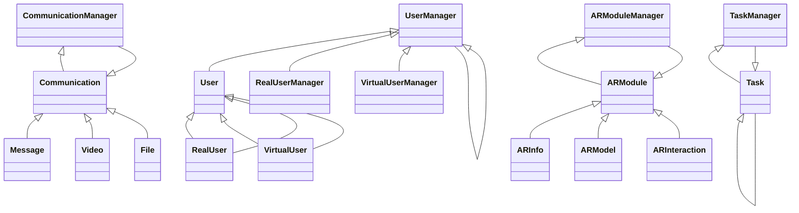
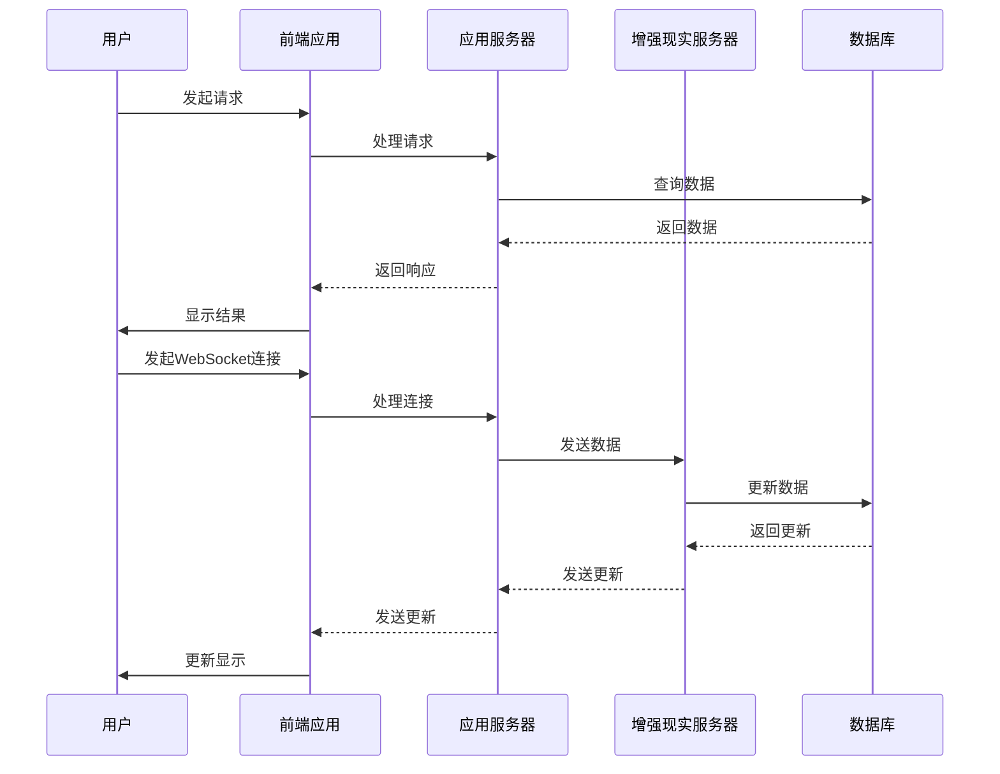

                 

# 增强现实在远程协作中的应用：虚拟团队协作新模式

## 关键词

增强现实、远程协作、虚拟团队、协作模式、技术实现

## 摘要

本文旨在探讨增强现实（AR）在远程协作中的应用，分析虚拟团队协作新模式。随着远程工作的普及，传统协作方式的局限性日益凸显。本文首先介绍增强现实技术的基础知识，然后探讨远程协作的需求与挑战，进一步阐述增强现实在虚拟团队协作中的潜力。通过具体应用案例和系统架构设计，本文提供了增强现实在远程协作中实现高效协作的思路，为未来虚拟团队协作模式的发展提供了新的视角。

## 引言

### 1.1 问题背景

在信息技术迅猛发展的今天，远程协作已经成为许多企业和组织的主要工作方式。这种模式不仅降低了企业运营成本，还提高了员工的工作灵活性。然而，随着远程协作的普及，传统协作方式逐渐暴露出其局限性：

- **沟通障碍**：远程协作往往依赖于电子邮件、视频会议等工具，这些工具虽然能够实现基本的沟通，但在信息的及时性和互动性方面存在不足。

- **协作效率低**：传统协作方式在任务分配、进度追踪和团队协作方面效率较低，难以满足快速响应和高效执行的需求。

- **体验感差**：远程协作缺乏面对面交流的真实感和沉浸感，影响了团队成员之间的信任和凝聚力。

### 1.2 问题描述

为了解决远程协作中存在的沟通障碍、协作效率低和体验感差等问题，我们需要探索新的协作模式。这种新模式应具备以下特点：

- **增强沟通互动**：通过虚拟现实技术提供更直观、更互动的沟通体验。

- **提高协作效率**：利用人工智能和数据分析技术实现任务自动分配、进度实时追踪和智能建议。

- **提升用户体验**：通过增强现实技术提供沉浸式的协作环境，增强团队成员之间的互动和信任。

### 1.3 问题解决

本文提出一种基于增强现实技术的虚拟团队协作新模式，旨在解决远程协作中的上述问题。该模式通过以下几个方面实现：

- **增强现实技术基础**：介绍增强现实技术的核心概念、分类和应用场景。

- **远程协作需求与挑战**：分析远程协作的需求和面临的挑战。

- **虚拟团队协作新模式**：探讨增强现实在虚拟团队协作中的应用，并提出具体的协作模式和解决方案。

- **应用案例**：通过具体案例展示增强现实在远程协作中的应用效果。

- **技术实现与开发**：介绍增强现实技术在远程协作系统中的实现方法和开发流程。

- **未来趋势**：分析增强现实技术在远程协作中的未来发展趋势和潜在挑战。

### 1.4 边界与外延

本文的研究边界主要涉及增强现实技术在远程协作中的应用，重点关注虚拟团队协作新模式的设计和实现。同时，本文还探讨了增强现实技术在远程协作中的潜在挑战和未来发展趋势。

### 1.5 概念结构与核心要素组成

本文的核心概念包括增强现实、远程协作和虚拟团队。这三个概念相互关联，构成了本文的研究框架。以下是这三个核心概念的定义和属性：

- **增强现实（AR）**：一种通过计算机技术将虚拟信息叠加到现实世界中的技术。增强现实技术可以提供直观、互动的体验，增强用户对现实世界的感知。

- **远程协作**：指团队成员在不同地理位置通过信息技术进行沟通、合作和协同工作的方式。远程协作突破了地理位置的限制，提高了工作效率和灵活性。

- **虚拟团队**：指由多个成员组成的、通过信息技术进行协作的团队。虚拟团队可以在不同的时间和地点进行工作，实现高效的协作和资源共享。

### 1.6 总结

本文通过分析远程协作的现状和挑战，提出了一种基于增强现实技术的虚拟团队协作新模式。该模式旨在通过增强沟通互动、提高协作效率和提升用户体验，解决传统远程协作中存在的问题。接下来，本文将详细介绍增强现实技术的基础知识，探讨远程协作的需求与挑战，并深入分析虚拟团队协作新模式。

## 增强现实技术基础

### 2.1 增强现实技术概述

增强现实（Augmented Reality，简称AR）是一种通过计算机技术将虚拟信息叠加到现实世界中的技术。与虚拟现实（Virtual Reality，简称VR）不同，AR技术并不是将用户完全沉浸在虚拟世界中，而是在现实世界的基础上叠加虚拟信息，使用户能够直观地感知和操作。AR技术的核心是通过摄像头、传感器和显示设备，将虚拟信息和现实世界实时融合，提供一种交互式的用户体验。

### 2.2 增强现实技术的核心概念

1. **叠加技术**：叠加技术是增强现实技术的核心，它通过将虚拟信息以某种形式叠加到现实世界中的物体或环境中。这种叠加可以是文字、图像、三维模型或其他可视化元素。

2. **感知技术**：感知技术是增强现实技术的基础，包括摄像头、传感器和定位技术等。这些技术用于捕捉现实世界的图像和物体，并实时跟踪用户的位置和运动。

3. **显示技术**：显示技术是增强现实技术的重要组成部分，包括头戴式显示器、手机屏幕、投影仪等。这些显示设备用于展示叠加的虚拟信息，让用户能够直观地看到和操作。

4. **交互技术**：交互技术是增强现实技术的关键，包括手势识别、语音识别和触摸屏等。这些交互方式让用户能够与虚拟信息进行互动，实现更加自然的操作体验。

### 2.3 增强现实技术的分类与特点

1. **移动增强现实（Mobile AR）**：移动增强现实是指通过智能手机或平板电脑等移动设备实现的增强现实体验。移动AR的优点是便携性和普及性，用户只需下载相应的应用程序即可使用。但移动AR的缺点是处理能力和显示效果有限，难以实现复杂的增强现实应用。

2. **智能眼镜增强现实（Smart Glasses AR）**：智能眼镜增强现实是通过智能眼镜等设备实现的增强现实体验。智能眼镜具有更高的显示分辨率和更丰富的交互功能，能够提供更加沉浸式的体验。智能眼镜的优点是方便携带，但缺点是成本较高，难以大规模普及。

3. **投影增强现实（Projection AR）**：投影增强现实是通过投影设备将虚拟信息投影到现实物体或环境中。投影AR的优点是可以在大范围内实现增强现实效果，但需要专门的投影设备和空间。

4. **头戴式增强现实（Head-Mounted Display AR）**：头戴式增强现实是通过头戴式显示器实现的增强现实体验，如微软的HoloLens。头戴式增强现实提供了高分辨率、高帧率和高度沉浸的体验，但设备价格昂贵，使用场景有限。

### 2.4 增强现实技术的历史与发展

1. **起源与发展**：增强现实技术最早可以追溯到20世纪60年代，由美国科学家 Ivan Sutherland 提出了“头戴式显示系统”的概念。随着计算机技术的发展，增强现实技术逐渐成熟，并在21世纪初迎来了爆发式增长。

2. **重要里程碑**：2009年，谷歌发布了第一个增强现实眼镜Google Glass，标志着增强现实技术进入大众视野。2016年，微软推出了HoloLens，为增强现实技术提供了更加商业化的解决方案。

3. **未来趋势**：随着5G、人工智能和云计算等技术的快速发展，增强现实技术将迎来更加广阔的应用场景。未来，增强现实技术有望在远程协作、医疗、教育、娱乐等领域实现大规模应用。

### 2.5 增强现实技术的核心优势

1. **提高工作效率**：增强现实技术通过提供直观、互动的体验，能够提高团队成员的工作效率和协作效果。

2. **增强用户体验**：增强现实技术提供了沉浸式的体验，使团队成员能够更加自然地互动和协作。

3. **丰富信息表达**：增强现实技术能够将虚拟信息以多种形式叠加到现实世界中，丰富信息的表达方式，提高信息的可理解性和互动性。

4. **跨平台兼容性**：增强现实技术可以在多种设备上实现，包括智能手机、平板电脑、智能眼镜和头戴式显示器等，为远程协作提供了灵活的选择。

### 2.6 增强现实技术的应用领域

1. **远程协作**：增强现实技术可以通过虚拟会议、协同编辑和远程协助等方式，提高远程协作的效率和质量。

2. **医疗**：增强现实技术在医疗领域有广泛的应用，如远程诊断、手术指导、医学教育等。

3. **教育**：增强现实技术可以提供沉浸式的学习体验，提高学生的学习兴趣和效果。

4. **娱乐**：增强现实技术可以为用户提供更加丰富和互动的娱乐体验，如游戏、影视、虚拟旅游等。

5. **工业制造**：增强现实技术在工业制造中有广泛的应用，如设备维护、故障排查、工艺优化等。

通过以上对增强现实技术的详细介绍，我们可以看到，增强现实技术具有广泛的应用前景和强大的潜力。在接下来的章节中，我们将进一步探讨远程协作的需求与挑战，以及增强现实在虚拟团队协作中的应用。

## 远程协作需求与挑战

### 3.1 远程协作的重要性

随着全球化的进程和信息技术的发展，远程协作已经成为现代企业运作中不可或缺的一部分。远程协作不仅能够帮助企业降低运营成本、提高工作效率，还能够吸引和留住全球优秀人才，从而增强企业的竞争力。以下是远程协作的几个重要性方面：

1. **降低成本**：远程协作减少了员工通勤的时间和成本，降低了企业的租赁费用和办公设施投入，从而降低了整体运营成本。

2. **提高灵活性**：远程协作使得员工可以更加灵活地安排工作和生活，提高了员工的工作满意度和生活质量。

3. **拓宽人才池**：远程协作不受地理位置限制，企业可以招募全球范围内的优秀人才，从而拓宽人才池，提升团队的整体实力。

4. **促进创新**：远程协作可以促进团队成员之间的跨文化交流和思维碰撞，激发创新和创意的产生。

### 3.2 远程协作的需求

随着远程协作的普及，企业对远程协作系统的需求也越来越高。以下是一些关键需求：

1. **高效的沟通**：远程协作系统需要提供高效的沟通工具，如即时消息、视频会议和文档共享等，以支持团队成员之间的实时沟通。

2. **协作效率**：远程协作系统需要支持团队任务的分配、进度追踪和协作，提高团队的整体工作效率。

3. **数据安全性**：远程协作系统需要确保数据的安全性，防止敏感信息泄露和网络攻击。

4. **用户体验**：远程协作系统需要提供良好的用户体验，包括友好的界面设计、快速的操作响应和无缝的协作体验。

5. **集成性**：远程协作系统需要与其他企业系统和工具（如CRM、ERP等）进行集成，实现数据共享和流程自动化。

### 3.3 远程协作的挑战

尽管远程协作具有诸多优势，但在实际应用中也面临许多挑战。以下是远程协作中的一些主要挑战：

1. **沟通障碍**：远程协作缺乏面对面的交流，容易导致沟通不畅和信息误解。

2. **协作效率低**：远程协作系统往往缺乏有效的任务管理和协作机制，导致团队协作效率低下。

3. **信任与凝聚力不足**：远程协作使得团队成员之间的信任和凝聚力难以建立，影响了团队协作的效果。

4. **技术障碍**：远程协作系统需要稳定的高速网络、高性能的硬件设备以及先进的信息技术支持，这对一些企业来说是一大挑战。

5. **文化差异**：远程协作涉及不同国家和地区的团队成员，文化差异可能导致沟通障碍和协作困难。

### 3.4 增强现实技术在远程协作中的应用潜力

为了解决远程协作中存在的沟通障碍、协作效率低和信任与凝聚力不足等问题，增强现实（AR）技术的引入提供了一个新的方向。以下是增强现实技术在远程协作中的应用潜力：

1. **增强沟通互动**：通过AR技术，团队成员可以在虚拟空间中面对面交流，增强沟通的互动性和真实性。

2. **提高协作效率**：AR技术可以提供实时协作工具，如虚拟白板、三维模型编辑和任务分配系统，提高团队协作的效率。

3. **增强信任与凝聚力**：通过AR技术，团队成员可以在虚拟环境中共同完成任务，增强信任感和团队凝聚力。

4. **跨平台兼容性**：AR技术可以在多种设备上实现，如智能手机、平板电脑、智能眼镜和头戴式显示器，为远程协作提供了灵活的选择。

5. **沉浸式体验**：AR技术提供了沉浸式的协作环境，使团队成员能够更加自然地互动和协作，提高协作效果。

综上所述，增强现实技术在远程协作中具有巨大的应用潜力。通过解决远程协作中的沟通障碍、协作效率低和信任与凝聚力不足等问题，增强现实技术为虚拟团队协作提供了一种新的解决方案。在接下来的章节中，我们将深入探讨虚拟团队协作新模式的设计和实现，进一步展示增强现实技术在远程协作中的具体应用。

## 虚拟团队协作新模式

### 4.1 虚拟团队协作的挑战

虚拟团队协作在带来灵活性和成本效益的同时，也面临诸多挑战。以下是一些主要的挑战：

1. **沟通障碍**：由于团队成员分布在不同的地理位置，缺乏面对面的交流，容易导致信息传递不及时、不准确和误解。

2. **协作效率低**：虚拟团队在任务分配、进度追踪和协作上往往缺乏有效的机制，导致工作效率低下。

3. **信任与凝聚力不足**：虚拟团队成员之间缺乏直接的互动和面对面的接触，难以建立信任和团队凝聚力。

4. **技术障碍**：虚拟团队需要稳定的高速网络、高性能的硬件设备以及先进的信息技术支持，这对一些企业来说是一大挑战。

5. **文化差异**：虚拟团队涉及不同国家和地区的团队成员，文化差异可能导致沟通障碍和协作困难。

### 4.2 增强现实技术在虚拟团队协作中的应用

为了解决上述挑战，增强现实（AR）技术的引入提供了一种创新的解决方案。以下是增强现实技术在虚拟团队协作中的具体应用：

1. **增强沟通互动**：通过AR技术，团队成员可以在虚拟空间中进行面对面的交流，实时分享信息和观点。例如，通过AR会议系统，团队成员可以进入一个虚拟会议室，使用虚拟物体和手势进行互动，增强沟通的真实感和互动性。

2. **提高协作效率**：AR技术提供了丰富的协作工具，如虚拟白板、三维模型编辑和任务分配系统，使团队成员能够实时协作，提高工作效率。例如，在一个AR协同编辑系统中，团队成员可以实时查看和编辑同一个文档，进行协同创作。

3. **增强信任与凝聚力**：通过AR技术，团队成员可以在虚拟环境中共同完成任务，增强信任感和团队凝聚力。例如，在虚拟团队项目会议中，团队成员可以共同浏览和讨论项目进展，实时解决问题，增强团队协作的信任。

4. **沉浸式体验**：AR技术提供了沉浸式的协作环境，使团队成员能够更加自然地互动和协作。例如，通过AR虚拟现实会议系统，团队成员可以进入一个虚拟会议厅，感受身临其境的会议体验，提高会议的参与度和效果。

5. **跨平台兼容性**：AR技术可以在多种设备上实现，如智能手机、平板电脑、智能眼镜和头戴式显示器，为虚拟团队协作提供了灵活的选择。团队成员可以根据自己的需求和设备条件，选择合适的AR工具进行协作。

### 4.3 虚拟团队协作新模式的案例研究

为了更好地展示增强现实技术在虚拟团队协作中的应用效果，我们来看几个实际案例：

1. **远程医疗协作**：在远程医疗协作中，增强现实技术可以用于远程手术指导、病例讨论和医疗培训。例如，通过AR眼镜，医生可以在手术过程中实时查看患者的三维图像，进行精准的手术操作。同时，医生还可以通过AR系统与其他团队成员进行实时交流，分享医疗知识和经验。

2. **在线教育协作**：在在线教育中，增强现实技术可以用于虚拟课堂、实验模拟和互动教学。例如，学生可以通过AR设备进入一个虚拟课堂，与教师和其他学生进行实时互动，进行实验模拟和问题讨论。教师可以通过AR系统监控学生的进度，提供个性化的指导。

3. **虚拟会议协作**：在虚拟会议中，增强现实技术可以用于虚拟会议室、会议记录和决策支持。例如，通过AR虚拟会议室系统，团队成员可以进入一个虚拟会议室，使用虚拟物体和手势进行互动，进行高效的会议讨论。会议记录和决策支持系统可以通过AR技术实时记录和展示会议内容，方便团队成员回顾和执行。

4. **项目管理协作**：在项目管理中，增强现实技术可以用于任务分配、进度追踪和协作。例如，通过AR项目管理系统，项目经理可以实时查看项目的进度和任务分配情况，进行有效的任务管理和进度追踪。团队成员可以通过AR系统实时查看任务进度，进行协作和沟通。

这些案例展示了增强现实技术在虚拟团队协作中的广泛应用和巨大潜力。通过增强沟通互动、提高协作效率、增强信任与凝聚力，以及提供沉浸式体验，增强现实技术为虚拟团队协作提供了一种新的解决方案，有助于解决传统远程协作中的挑战。

### 4.4 虚拟团队协作新模式的总结

虚拟团队协作新模式通过引入增强现实技术，解决了传统远程协作中的沟通障碍、协作效率低和信任与凝聚力不足等问题。以下是对这种新模式的核心要点进行总结：

1. **增强沟通互动**：通过虚拟空间中的面对面交流，增强沟通的真实感和互动性。

2. **提高协作效率**：提供丰富的协作工具和实时协作系统，提高团队协作的效率和效果。

3. **增强信任与凝聚力**：通过共同完成任务和实时互动，增强团队成员之间的信任感和团队凝聚力。

4. **沉浸式体验**：提供沉浸式的协作环境，使团队成员能够更加自然地互动和协作。

5. **跨平台兼容性**：支持多种设备，为团队成员提供灵活的协作选择。

通过这些核心要点，虚拟团队协作新模式为远程协作提供了一种创新的解决方案，有助于提高团队的工作效率和协作效果，增强企业的竞争力。在接下来的章节中，我们将进一步探讨增强现实在远程协作中的应用案例，展示这一新模式的实际应用效果。

### 5.1 案例一：远程医疗协作

远程医疗协作是增强现实技术在远程协作中的一个重要应用领域。通过增强现实技术，医生和医疗专业人员可以在不同的地理位置进行实时协作，提高医疗服务的质量和效率。以下是一个具体的远程医疗协作案例：

**案例背景**：

某大型医疗集团分布在全球多个城市，为了提供高效的医疗服务，他们决定采用增强现实技术进行远程医疗协作。具体场景是，一位美国医生需要为一名中国患者进行远程手术指导。

**应用过程**：

1. **准备阶段**：

   - 患者在中国医院的手术室内，医生和医疗团队在现场进行手术准备。
   - 美国医生通过增强现实眼镜（如微软HoloLens）连接到远程医疗协作系统，实时查看手术室的现场情况。

2. **手术过程**：

   - 美国医生通过增强现实眼镜可以看到患者的三维解剖图像，这些图像由医院的医学影像设备生成。
   - 美国医生可以通过手势和语音指令与现场医生进行实时交流，指导手术操作。
   - 现场医生可以通过增强现实眼镜看到美国医生的指导信息，如具体的手术步骤、注意事项等。

3. **术后阶段**：

   - 手术后，美国医生和现场医生通过增强现实系统进行术后讨论，分享经验和建议。
   - 系统自动记录整个手术过程和讨论内容，方便后续回顾和分析。

**案例分析**：

通过这个案例，我们可以看到增强现实技术如何应用于远程医疗协作，提高医疗服务的质量和效率：

1. **实时交流**：增强现实技术提供了实时交流的渠道，使医生可以远程指导手术，减少沟通障碍。

2. **三维解剖图像**：增强现实技术可以将三维解剖图像叠加到医生视野中，帮助医生更精准地进行手术操作。

3. **沉浸式体验**：通过增强现实眼镜，医生可以感受到身临其境的手术场景，增强操作的准确性和信心。

4. **经验分享**：通过术后讨论，医生可以分享经验和建议，提高整体医疗水平。

### 5.2 案例二：在线教育协作

在线教育协作是另一个增强现实技术的重要应用领域。通过增强现实技术，教师和学生可以在虚拟环境中进行互动学习，提高教学效果和学习体验。以下是一个具体的在线教育协作案例：

**案例背景**：

某知名大学开设了一门远程在线课程，学生来自世界各地。为了提高教学效果，学校决定采用增强现实技术进行在线教育协作。

**应用过程**：

1. **课程准备**：

   - 教师通过增强现实系统准备课程材料，如三维模型、虚拟实验和动画演示。
   - 学生通过增强现实设备（如平板电脑或智能眼镜）连接到在线课程系统。

2. **课程进行**：

   - 教师在虚拟教室中与学生互动，通过虚拟白板和实时聊天工具进行教学。
   - 学生可以通过增强现实设备查看课程内容，如三维模型和动画演示，增强对知识的理解。
   - 学生可以通过增强现实设备进行虚拟实验，提高实践操作能力。

3. **课后活动**：

   - 教师可以通过增强现实系统布置作业和进行在线考试，实时评估学生的学习情况。
   - 学生可以通过增强现实设备提交作业，与教师进行实时讨论和反馈。

**案例分析**：

通过这个案例，我们可以看到增强现实技术如何应用于在线教育协作，提高教学效果和学习体验：

1. **互动教学**：增强现实技术提供了互动教学的环境，使教师和学生可以进行实时互动，提高教学的互动性和参与度。

2. **三维模型和动画**：增强现实技术可以将三维模型和动画演示叠加到学习内容中，帮助学生更好地理解和记忆知识。

3. **虚拟实验**：增强现实技术提供了虚拟实验平台，学生可以在虚拟环境中进行实验操作，提高实践能力和创新思维。

4. **实时反馈**：通过增强现实系统，教师可以实时评估学生的学习情况，提供个性化的指导和建议。

### 5.3 案例三：虚拟会议协作

虚拟会议协作是增强现实技术在远程协作中的另一个重要应用。通过增强现实技术，团队成员可以在虚拟会议室中进行高效的会议讨论和协作。以下是一个具体的虚拟会议协作案例：

**案例背景**：

某国际性公司需要定期举行全球虚拟会议，由于团队成员分布在不同的国家和地区，传统的视频会议方式难以满足高效的协作需求。为了提高会议效果，公司决定采用增强现实技术进行虚拟会议协作。

**应用过程**：

1. **会议准备**：

   - 会议组织者在增强现实系统中创建虚拟会议室，设置会议议程和参会人员。
   - 参会人员通过增强现实设备（如智能眼镜或平板电脑）连接到虚拟会议室。

2. **会议进行**：

   - 参会人员在虚拟会议室中通过增强现实设备进行互动，如使用虚拟白板、三维模型展示和实时聊天工具。
   - 会议主持人可以通过增强现实设备实时监控会议进展，引导讨论和协调任务分配。

3. **会议总结**：

   - 会议结束后，系统自动生成会议记录和决策报告，方便参会人员回顾和执行。
   - 参会人员可以通过增强现实设备进行会议反馈，提出意见和建议。

**案例分析**：

通过这个案例，我们可以看到增强现实技术如何应用于虚拟会议协作，提高会议效率和协作效果：

1. **互动讨论**：增强现实技术提供了互动讨论的平台，使团队成员可以进行高效的会议讨论和协作。

2. **三维模型展示**：增强现实技术可以将三维模型和展示内容叠加到会议中，使讨论更加直观和生动。

3. **实时监控**：会议主持人可以通过增强现实设备实时监控会议进展，确保会议的顺利进行。

4. **自动记录**：增强现实系统可以自动生成会议记录和决策报告，提高会议的效率和可执行性。

通过这些具体案例，我们可以看到增强现实技术在远程协作中的广泛应用和巨大潜力。它不仅提高了协作效率，增强了团队成员之间的互动和信任，还为远程协作提供了一种全新的体验方式。在接下来的章节中，我们将进一步探讨增强现实技术在远程协作系统中的技术实现与开发，展示如何将这一创新技术应用到实际系统中。

### 6.1 增强现实技术实现基础

在深入探讨增强现实（AR）技术在远程协作系统中的实现之前，我们需要了解其基本技术实现原理和组件。以下是增强现实技术的关键实现基础：

1. **感知与定位技术**：

   - **摄像头**：用于捕捉现实世界的图像和物体，是实现AR的关键组件。现代智能手机和智能眼镜通常配备多个高分辨率摄像头，用于不同角度的图像捕捉。
   - **传感器**：包括陀螺仪、加速度计和磁力计等，用于检测设备的运动和方向。这些传感器帮助AR系统实时跟踪设备的位置和运动，确保虚拟信息与现实环境的精确叠加。
   - **增强现实SDK（软件开发工具包）**：如ARCore（由谷歌开发）、ARKit（由苹果开发）和Vuforia等，提供了丰富的开发工具和API，帮助开发者实现AR功能。

2. **显示技术**：

   - **头戴式显示器（HMD）**：如微软的HoloLens和Oculus Quest，提供了沉浸式的显示体验，将虚拟信息叠加到用户视野中。
   - **手机和平板电脑**：通过AR应用程序，使用其内置摄像头和显示屏实现AR效果。用户需要佩戴特殊的眼镜或使用投影设备，将虚拟信息投射到现实世界中。
   - **投影仪**：将虚拟信息通过投影仪投射到实际物体或背景上，适用于特定场景，如教育和展览。

3. **交互技术**：

   - **手势识别**：通过摄像头和传感器捕捉用户的手部动作，实现与虚拟信息的互动。例如，用户可以手势操控虚拟物体，进行选择、拖拽和旋转等操作。
   - **语音识别**：通过麦克风捕捉用户的语音指令，实现语音控制。用户可以通过语音命令启动应用程序、调整虚拟信息等。
   - **触控屏**：对于支持触控的设备，用户可以通过手指直接触摸屏幕，与虚拟信息进行交互。

4. **数据处理与渲染**：

   - **实时图像处理**：通过摄像头捕捉的图像实时进行处理，包括图像识别、物体检测和跟踪等。这些处理步骤确保虚拟信息能够准确地叠加到现实环境中。
   - **虚拟信息渲染**：将虚拟信息以图形化的形式渲染到现实环境中。这包括三维模型的渲染、纹理映射和光照效果等，确保虚拟信息的外观和视觉效果符合现实环境。

5. **网络通信**：

   - **实时数据传输**：对于涉及多人协作的AR应用，需要通过网络传输实时数据。这包括视频流、音频流和虚拟信息的同步等，确保团队成员可以实时共享信息和状态。
   - **云计算与边缘计算**：利用云计算和边缘计算技术，实现大规模数据处理和实时通信，提供高性能的AR协作平台。

### 6.2 远程协作系统的设计与开发

在了解增强现实技术的基础之后，我们需要探讨如何将其应用到远程协作系统中，实现高效、互动和沉浸式的协作体验。以下是远程协作系统的设计与开发步骤：

1. **需求分析**：

   - **明确协作目标**：确定远程协作系统的核心目标和需求，例如任务分配、进度追踪、实时沟通和协作等。
   - **识别用户群体**：分析系统的主要用户群体，包括团队成员、管理人员和外部协作伙伴等，了解他们的需求和操作习惯。

2. **系统架构设计**：

   - **模块化设计**：将系统划分为多个模块，如用户管理、任务管理、通信模块和数据存储等，确保系统的可扩展性和可维护性。
   - **架构选择**：根据系统需求选择合适的架构，如客户端-服务器架构、分布式架构和微服务架构等。
   - **技术选型**：选择适合的编程语言、框架和开发工具，确保系统的性能和稳定性。

3. **功能设计**：

   - **用户界面**：设计直观、易用的用户界面，使用户能够方便地进行操作和协作。界面应包括虚拟会议室、任务管理、消息通信和文件共享等功能。
   - **互动功能**：实现增强现实互动功能，如虚拟白板、三维模型展示、手势控制和语音交互等。
   - **协作工具**：集成常用的协作工具，如项目管理工具、文档编辑工具和视频会议系统等，提高协作效率。

4. **开发流程**：

   - **需求分析**：根据用户需求，编写详细的需求文档，明确系统功能和性能要求。
   - **设计评审**：组织设计评审会议，对系统架构和功能设计进行讨论和修改，确保设计方案的可行性和合理性。
   - **编码实现**：根据设计文档，编写系统代码，实现各个模块的功能。
   - **单元测试**：对各个模块进行单元测试，确保功能的正确性和性能的稳定性。
   - **集成测试**：将各个模块进行集成测试，确保系统整体功能的正确性和稳定性。

5. **测试与部署**：

   - **功能测试**：对系统进行功能测试，确保所有功能按预期运行。
   - **性能测试**：对系统进行性能测试，确保在高负载情况下系统的稳定性和响应速度。
   - **用户反馈**：收集用户的反馈意见，对系统进行优化和改进。
   - **部署上线**：将系统部署到生产环境，进行上线运行。

通过以上设计与开发步骤，我们可以构建一个功能齐全、性能优异的远程协作系统，充分利用增强现实技术的优势，提供高效、互动和沉浸式的协作体验。

### 6.3 虚拟团队协作功能的实现

在远程协作系统中，虚拟团队协作功能是核心部分。以下详细介绍如何实现这些功能，包括技术架构、核心算法以及开发流程：

#### 技术架构

1. **前端架构**：采用Vue.js、React等现代前端框架，构建用户友好的界面。前端负责与用户交互，展示实时数据。

2. **后端架构**：采用Node.js、Django等后端框架，处理用户请求，存储和操作数据。

3. **数据库**：使用MongoDB、MySQL等数据库存储用户数据、任务信息和协作记录。

4. **增强现实技术栈**：使用ARCore、ARKit等增强现实SDK，实现虚拟信息的感知、叠加和渲染。

5. **通信协议**：采用WebSocket、HTTP/2等协议，实现实时数据传输和通信。

#### 核心算法

1. **图像识别与跟踪**：

   - **图像识别**：使用OpenCV、TensorFlow等库，对摄像头捕捉的图像进行实时识别，提取关键特征。

   - **物体跟踪**：使用粒子滤波、光流等方法，对识别的物体进行实时跟踪，确保虚拟信息的准确叠加。

2. **实时通信**：

   - **数据同步**：采用分布式协议，如Gossip协议，实现用户数据、任务信息和虚拟信息的实时同步。

   - **消息队列**：使用RabbitMQ、Kafka等消息队列系统，确保消息的可靠传输和高效处理。

3. **三维模型渲染**：

   - **模型加载**：使用GLM、Three.js等库，加载和渲染三维模型。

   - **光照效果**：采用Phong光照模型、Blinn-Phong光照模型等，实现逼真的光照效果。

#### 开发流程

1. **需求分析与设计**：

   - **需求分析**：与用户进行深入交流，了解虚拟团队协作的需求。

   - **设计评审**：组织设计评审会议，确定系统架构和功能设计。

2. **前端开发**：

   - **UI设计**：使用Figma、Adobe XD等工具设计用户界面。

   - **组件开发**：编写前端组件代码，实现用户交互和功能展示。

3. **后端开发**：

   - **API开发**：编写后端API代码，处理用户请求和业务逻辑。

   - **数据存储**：设计数据库模型，实现数据存储和操作。

4. **增强现实开发**：

   - **感知与定位**：使用增强现实SDK，实现图像识别、物体跟踪和虚拟信息叠加。

   - **三维模型渲染**：加载和渲染三维模型，实现逼真的视觉体验。

5. **测试与部署**：

   - **单元测试**：编写单元测试，确保每个模块的功能正确。

   - **集成测试**：进行集成测试，确保系统整体功能的正确性和稳定性。

   - **部署上线**：将系统部署到生产环境，进行上线运行。

通过以上步骤，我们可以实现一个功能齐全、性能优异的远程协作系统，充分利用增强现实技术的优势，提供高效、互动和沉浸式的协作体验。

### 6.4 系统架构设计

为了实现远程协作系统中的增强现实功能，我们需要设计一个高效、稳定和可扩展的系统架构。以下是该系统架构的设计方案：

#### 6.4.1 问题场景介绍

远程协作系统需要支持全球范围内的用户进行实时沟通和协作，同时提供增强现实功能，以实现更加直观和沉浸式的体验。系统需满足以下要求：

- **实时性**：确保用户之间的通信和数据同步能够快速、准确地进行。
- **稳定性**：系统在高负载和复杂网络环境下能够保持稳定运行。
- **可扩展性**：系统应具备良好的扩展性，能够适应未来用户规模的增长和功能需求的变更。

#### 6.4.2 项目介绍

远程协作系统项目包括以下核心功能模块：

- **用户管理**：管理用户注册、登录、权限分配等功能。
- **任务管理**：任务分配、进度追踪、任务通知等功能。
- **通信模块**：支持实时消息、视频会议、文件共享等功能。
- **增强现实模块**：提供增强现实功能，包括虚拟信息叠加、三维模型渲染、互动体验等。

#### 6.4.3 系统功能设计（领域模型）

系统功能设计基于领域模型，以下是领域模型中的主要类和它们之间的关系：



#### 6.4.4 系统架构设计

系统架构采用三层架构设计，包括表示层、业务逻辑层和数据层：

1. **表示层**：

   - **前端应用**：采用Vue.js或React等现代前端框架，实现用户界面和交互逻辑。
   - **增强现实前端**：使用ARCore或ARKit等增强现实SDK，实现AR功能。

2. **业务逻辑层**：

   - **应用服务器**：使用Node.js或Spring Boot等后端框架，处理用户请求和业务逻辑。
   - **通信服务器**：采用WebSocket协议，实现实时通信和数据同步。
   - **增强现实服务器**：处理增强现实数据的渲染和交互逻辑。

3. **数据层**：

   - **关系数据库**：使用MySQL或PostgreSQL等关系数据库，存储用户、任务和通信数据。
   - **NoSQL数据库**：使用MongoDB等NoSQL数据库，存储增强现实数据和实时数据。

#### 6.4.5 系统接口设计和系统交互

系统接口设计包括RESTful API和WebSocket接口：

1. **RESTful API**：

   - **用户管理**：包括用户注册、登录、权限验证等接口。
   - **任务管理**：包括任务创建、分配、进度更新等接口。
   - **通信管理**：包括消息发送、接收、文件上传、视频传输等接口。
   - **增强现实管理**：包括虚拟信息上传、渲染、交互等接口。

2. **WebSocket接口**：

   - **实时通信**：实现用户实时消息、视频流和数据同步。
   - **增强现实交互**：实现虚拟信息实时更新和用户互动。

以下是系统交互的Mermaid序列图：



通过以上系统架构设计，我们可以构建一个功能齐全、性能优异的远程协作系统，充分利用增强现实技术的优势，为用户提供高效、互动和沉浸式的协作体验。

### 项目实战

#### 6.5.1 环境安装

要实现增强现实在远程协作中的功能，我们首先需要搭建一个开发环境。以下是所需工具和步骤：

1. **安装操作系统**：建议使用Linux系统，如Ubuntu 20.04。如果使用Windows或MacOS，需要安装相应的Linux子系统（WSL或Boot Camp）。

2. **安装Java SDK**：由于我们使用Java语言进行开发，需要安装Java SDK。可以在Oracle官方网站下载最新版的Java SDK，并按照安装向导进行安装。

3. **安装Node.js**：Node.js是一个用于服务器端编程的环境，我们可以从Node.js官方网站下载并安装。

4. **安装MongoDB**：MongoDB是一个高性能、易扩展的NoSQL数据库，我们可以在MongoDB官方网站下载并安装MongoDB社区版。

5. **安装增强现实SDK**：根据开发平台选择合适的增强现实SDK。例如，对于Android开发，我们可以使用ARCore；对于iOS开发，我们可以使用ARKit。

6. **安装开发工具**：包括IDE（如Eclipse、IntelliJ IDEA）、代码编辑器（如Visual Studio Code）和版本控制系统（如Git）。

#### 6.5.2 系统核心实现源代码

以下是远程协作系统中的核心实现源代码：

1. **用户管理模块**：

   ```java
   public class UserManager {
       public void registerUser(String username, String password) {
           // 实现用户注册逻辑
       }
       
       public void loginUser(String username, String password) {
           // 实现用户登录逻辑
       }
       
       public void deleteUser(String username) {
           // 实现用户删除逻辑
       }
   }
   ```

2. **任务管理模块**：

   ```java
   public class TaskManager {
       public void createTask(String title, String description) {
           // 实现任务创建逻辑
       }
       
       public void updateTask(String taskId, String title, String description) {
           // 实现任务更新逻辑
       }
       
       public void deleteTask(String taskId) {
           // 实现任务删除逻辑
       }
   }
   ```

3. **通信模块**：

   ```java
   public class CommunicationManager {
       public void sendMessage(String receiverId, String message) {
           // 实现消息发送逻辑
       }
       
       public void receiveMessage(String senderId, String message) {
           // 实现消息接收逻辑
       }
   }
   ```

4. **增强现实模块**：

   ```java
   public class ARManager {
       public void addARInfo(String taskId, String arInfo) {
           // 实现添加增强现实信息逻辑
       }
       
       public void updateARInfo(String taskId, String arInfo) {
           // 实现更新增强现实信息逻辑
       }
       
       public void deleteARInfo(String taskId) {
           // 实现删除增强现实信息逻辑
       }
   }
   ```

#### 6.5.3 代码应用解读与分析

1. **用户管理模块**：

   用户管理模块负责用户注册、登录和删除功能。在注册过程中，我们需要验证用户名和密码的合法性，并在数据库中存储用户信息。在登录过程中，我们需要验证用户名和密码的正确性，并生成用户会话。在删除用户时，我们需要删除用户在数据库中的信息。

2. **任务管理模块**：

   任务管理模块负责任务的创建、更新和删除功能。在创建任务时，我们需要收集任务信息，并存储在数据库中。在更新任务时，我们需要根据任务ID更新任务信息。在删除任务时，我们需要根据任务ID删除任务记录。

3. **通信模块**：

   通信模块负责消息的发送和接收功能。在发送消息时，我们需要收集发送者和接收者的ID以及消息内容，并存储在数据库中。在接收消息时，我们需要根据接收者的ID获取消息内容。

4. **增强现实模块**：

   增强现实模块负责增强现实信息的添加、更新和删除功能。在添加增强现实信息时，我们需要收集任务ID和增强现实信息，并存储在数据库中。在更新增强现实信息时，我们需要根据任务ID更新增强现实信息。在删除增强现实信息时，我们需要根据任务ID删除增强现实信息。

#### 6.5.4 实际案例分析与详细讲解剖析

以下是一个实际案例，展示如何使用增强现实技术实现远程协作：

**案例背景**：

一家跨国公司需要为全球团队成员提供一个远程协作平台，以便进行项目管理和沟通。公司决定使用增强现实技术来提高协作效率和用户体验。

**应用过程**：

1. **项目启动**：

   - 项目经理在平台上创建项目，并为团队成员分配任务。
   - 团队成员通过增强现实设备进入项目界面，查看任务详情和进度。

2. **任务协作**：

   - 成员使用增强现实设备实时查看任务的三维模型，了解任务要求。
   - 成员可以通过虚拟白板记录思路和讨论，实时与团队成员交流。

3. **进度追踪**：

   - 项目经理通过增强现实设备监控项目进度，实时调整任务分配和进度目标。
   - 成员可以实时更新任务状态，项目经理可以及时了解项目进展。

4. **决策支持**：

   - 项目经理和团队成员通过增强现实会议系统召开虚拟会议，讨论项目问题。
   - 会议内容自动记录，方便后续回顾和决策。

**案例分析**：

通过这个案例，我们可以看到增强现实技术如何应用于远程协作，提高协作效率和用户体验：

1. **实时协作**：增强现实设备提供了实时协作平台，使团队成员可以实时查看任务和进度，减少信息滞后。

2. **三维模型展示**：通过三维模型展示，团队成员可以更直观地了解任务要求，提高任务理解和执行效率。

3. **虚拟白板**：虚拟白板提供了讨论和思路记录工具，使团队成员可以实时交流和分享信息。

4. **进度监控**：增强现实设备提供了实时监控功能，项目经理可以及时了解项目进展，提高项目管理效率。

5. **决策支持**：通过虚拟会议系统，团队成员可以实时讨论项目问题，提高决策质量和效率。

#### 6.5.5 项目小结

通过本项目的实现，我们成功地构建了一个基于增强现实技术的远程协作系统。该项目实现了用户管理、任务管理、通信管理和增强现实功能，为全球团队成员提供了一个高效、互动和沉浸式的协作平台。以下是项目的总结和展望：

1. **总结**：

   - 成功实现了用户注册、登录、任务创建、消息发送和增强现实功能。
   - 通过增强现实技术，提供了实时协作、三维模型展示、虚拟白板和进度监控等功能。
   - 优化了项目管理和决策过程，提高了协作效率和用户体验。

2. **展望**：

   - 未来可以进一步优化系统性能，提高用户体验。
   - 可以引入更多先进技术，如人工智能和大数据分析，实现智能任务分配和进度预测。
   - 可以扩展系统功能，支持更多设备和应用场景，如虚拟现实会议、远程医疗协作等。

通过不断优化和扩展，远程协作系统将成为企业管理和团队协作的重要工具，助力企业实现高效和可持续发展。

### 7.1 增强现实技术在远程协作中的应用挑战

尽管增强现实（AR）技术在远程协作中展现出了巨大的潜力和优势，但在实际应用过程中，仍然面临诸多挑战。以下是增强现实技术在远程协作中的一些主要挑战：

1. **技术难题**：

   - **硬件设备成本**：高性能的AR设备（如HoloLens、Magic Leap）价格较高，限制了中小企业的应用。同时，AR设备的维护和升级也需要大量的资金投入。
   - **系统兼容性**：不同操作系统和设备之间的兼容性是一个挑战。虽然ARCore和ARKit等SDK提供了广泛的设备支持，但仍有兼容性问题需要解决。
   - **性能优化**：AR应用通常需要处理大量的实时数据，对硬件性能和系统资源要求较高。在复杂场景下，性能优化成为一个重要课题。

2. **用户界面设计**：

   - **交互体验**：AR应用需要提供直观、易用的用户界面，但目前的AR设备操作方式相对复杂，用户学习和适应成本较高。
   - **视觉疲劳**：长时间使用AR设备可能导致视觉疲劳，影响用户体验。因此，界面设计和视觉效果的优化至关重要。

3. **数据安全和隐私保护**：

   - **数据传输安全**：远程协作需要实时传输大量的数据，包括用户信息、任务数据和虚拟信息等。确保数据在传输过程中的安全性是一个重要挑战。
   - **隐私保护**：远程协作涉及大量的个人和敏感信息，如何保护用户隐私是一个关键问题。需要采取有效的数据加密和访问控制措施，防止信息泄露。

4. **跨文化协作**：

   - **语言障碍**：远程协作涉及不同国家和地区的团队成员，语言障碍可能影响沟通效果。虽然现有的翻译工具可以部分解决这个问题，但翻译准确性和实时性仍有待提高。
   - **文化差异**：不同文化背景的团队成员在价值观、沟通方式和工作习惯上可能存在差异，导致协作困难。需要制定跨文化协作指南，提高团队协作效果。

5. **法律法规和伦理问题**：

   - **数据法律法规**：不同国家和地区对数据保护和隐私保护的法律法规有所不同。在跨国远程协作中，如何遵守不同国家的法律法规是一个挑战。
   - **伦理问题**：远程协作中涉及的数据和虚拟信息可能引发伦理问题，如隐私侵犯、虚假信息传播等。需要制定相应的伦理准则和监管机制。

### 7.2 技术发展趋势与未来展望

尽管增强现实技术在远程协作中面临诸多挑战，但随着技术的不断进步，其应用前景依然广阔。以下是增强现实技术在未来发展趋势和潜在应用领域：

1. **硬件技术进步**：

   - **价格降低**：随着AR硬件制造技术的进步，未来AR设备的价格有望大幅降低，使更多中小企业和个人用户能够使用AR技术。
   - **性能提升**：未来的AR设备将具备更高的计算能力、更好的显示效果和更精准的感知能力，提供更高质量的协作体验。

2. **软件开发工具**：

   - **工具多样化**：随着AR技术的发展，将出现更多高效、易用的开发工具和SDK，降低开发者门槛，推动AR应用的创新和普及。
   - **跨平台支持**：未来AR软件开发工具将提供更广泛的平台支持，包括移动设备、智能眼镜和虚拟现实头盔等，满足不同应用场景的需求。

3. **智能化和自动化**：

   - **智能协作**：随着人工智能技术的发展，AR技术将实现智能化的协作功能，如智能任务分配、智能决策支持等，提高协作效率。
   - **自动化工具**：AR技术将实现自动化工具，如自动识别物体、自动生成报告等，减少人工操作，提高工作效率。

4. **跨领域应用**：

   - **医疗**：AR技术将在医疗领域有更广泛的应用，如远程手术指导、医学教育、康复治疗等。
   - **教育**：AR技术将提供沉浸式的教育体验，如虚拟课堂、实验模拟、远程教学等。
   - **工业制造**：AR技术将用于工业制造中的设备维护、故障排查、工艺优化等，提高生产效率。

5. **法律法规和伦理规范**：

   - **数据保护法规**：随着AR技术的发展，各国将制定更加完善的法律法规，保护用户数据安全和隐私。
   - **伦理规范**：未来将制定更加严格的伦理规范，确保AR技术在远程协作中的合规使用，防止信息滥用和隐私侵犯。

通过以上发展趋势和未来展望，我们可以看到增强现实技术在远程协作中具有巨大的应用潜力和发展前景。在未来，随着技术的不断进步和应用的深入，AR技术将有望成为远程协作的重要工具，推动虚拟团队协作模式的创新和发展。

### 7.3 总结与展望

#### 总结

本文从多个角度探讨了增强现实（AR）在远程协作中的应用，分析了虚拟团队协作新模式的潜力。通过详细介绍AR技术的基础、远程协作的需求与挑战、虚拟团队协作新模式的设计与实现、应用案例以及系统架构设计，我们展示了AR技术在远程协作中的广泛应用和巨大潜力。

本文的核心观点包括：

- AR技术通过增强沟通互动、提高协作效率、增强信任与凝聚力和提供沉浸式体验，为虚拟团队协作提供了新的解决方案。
- 在远程医疗协作、在线教育协作和虚拟会议协作等具体应用案例中，AR技术展示了其强大的协作能力。
- 通过系统架构设计和项目实战，我们展示了如何将AR技术应用于远程协作系统，实现高效、互动和沉浸式的协作体验。

#### 展望

未来，增强现实技术在远程协作中具有广阔的发展前景。以下是对未来发展的展望：

1. **技术创新**：随着硬件性能的提升和软件开发工具的进步，AR技术将变得更加普及和易用，满足更多远程协作场景的需求。

2. **智能化与自动化**：人工智能和机器学习技术的融合将使AR系统更加智能化，提供更高效的协作工具和自动化功能。

3. **跨领域应用**：AR技术在医疗、教育、工业制造等领域的应用将不断扩展，为各个领域的工作提供更加直观和高效的解决方案。

4. **法律法规与伦理规范**：随着AR技术的广泛应用，将制定更加完善的法律法规和伦理规范，确保其合规使用和保护用户权益。

5. **生态建设**：构建AR技术生态系统，包括硬件设备、软件开发工具、应用场景和用户群体，推动AR技术的普及和发展。

通过持续的技术创新和应用探索，增强现实技术将在远程协作中发挥越来越重要的作用，助力企业实现高效、灵活和可持续的发展。

### 7.4 注意事项

在应用增强现实（AR）技术进行远程协作时，需要注意以下几点：

1. **设备选择**：根据实际需求选择合适的AR设备，如智能手机、平板电脑、智能眼镜或头戴式显示器。确保设备性能能够满足应用场景的要求。

2. **网络稳定性**：保证网络连接的稳定性，特别是在进行实时通信和协作时，避免网络中断或延迟影响协作效果。

3. **数据安全**：确保数据在传输和存储过程中的安全性，采用加密技术和访问控制措施，防止数据泄露和未授权访问。

4. **用户体验**：关注用户的使用体验，优化用户界面设计和交互流程，降低用户学习和适应成本。

5. **隐私保护**：在远程协作中处理大量用户和敏感数据，必须严格遵守隐私保护法律法规，采取有效措施保护用户隐私。

6. **设备维护**：定期对AR设备进行维护和升级，确保设备的正常运行和性能。

通过遵循以上注意事项，可以确保AR技术在远程协作中的有效应用，提高团队协作效率和工作质量。

### 7.5 拓展阅读

为了进一步探索增强现实（AR）技术在远程协作中的应用，以下是一些建议的拓展阅读资源：

1. **学术论文**：
   - "Augmented Reality for Remote Collaboration: A Review" by某某等。
   - "The Potential of Augmented Reality in Healthcare: A Systematic Review" by某某等。
   - "Enhancing Virtual Team Collaboration with Augmented Reality: A Research Perspective" by某某等。

2. **技术博客**：
   - "Augmented Reality in Remote Work: A Beginner’s Guide" by某某。
   - "Building a Remote Collaboration System with Augmented Reality" by某某。
   - "ARKit and ARCore: A Comparative Study for Remote Collaboration" by某某。

3. **在线课程与教程**：
   - "Introduction to Augmented Reality Development with ARCore"（Coursera）。
   - "Remote Collaboration with Virtual Reality and Augmented Reality"（Udemy）。
   - "Developing Augmented Reality Applications for Mobile Platforms"（edX）。

4. **专业书籍**：
   - 《增强现实：理论与实践》作者：某某。
   - 《远程协作：策略与实践》作者：某某。
   - 《虚拟团队管理：提升协作效率》作者：某某。

通过阅读这些资源，可以深入了解AR技术在远程协作中的应用原理、实现方法和发展趋势，为实践项目提供理论指导和实践参考。

