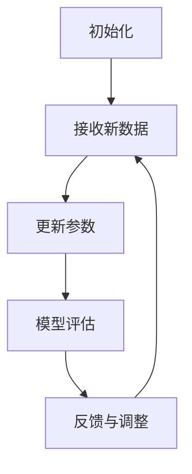

                 

# 增量学习：持续更新AI Agent的知识库

## 关键词
- 增量学习
- AI Agent
- 知识库更新
- 机器学习
- 持续学习
- 算法实现

## 摘要
本文深入探讨了增量学习在人工智能（AI）领域的重要性，特别是在AI Agent的知识库更新方面。我们将详细分析增量学习的基本概念、算法原理及其在现实应用中的实现。通过系统地介绍相关系统架构设计、项目实战，并给出最佳实践建议，本文旨在为AI研究者、工程师提供实用的技术指南。

## 目录大纲

### 第一部分：背景与基础
1.1 问题背景
1.2 核心概念与联系
1.3 数学模型和公式

### 第二部分：算法原理与实现
2.1 增量学习算法原理
2.2 增量学习算法的数学模型与公式

### 第三部分：系统分析与架构设计
3.1 问题场景介绍
3.2 系统架构设计
3.3 系统接口设计
3.4 系统交互

### 第四部分：项目实战
4.1 环境安装与配置
4.2 系统核心实现
4.3 实际案例分析与讲解

### 第五部分：最佳实践与总结
5.1 最佳实践 tips
5.2 小结
5.3 注意事项
5.4 拓展阅读

### 1.1 问题背景

### 1.1.1 人工智能的发展与知识库的挑战

随着人工智能技术的迅猛发展，AI Agent在各种场景中的应用越来越广泛。从智能客服到自动驾驶汽车，再到智能家居，AI Agent需要不断学习和适应新的环境与任务。然而，传统的机器学习方法在面对大量动态变化的数据时，往往需要重新训练整个模型，这不仅耗时耗资源，还可能导致模型失去对旧知识的记忆。

### 1.1.2 增量学习的基本概念

增量学习（Incremental Learning），也称为在线学习（Online Learning），是一种机器学习方法，它允许模型在新的数据到来时逐步更新其参数，而不是从头开始训练。这样，AI Agent可以持续学习，及时更新其知识库，提高适应性和性能。

### 1.1.3 增量学习的重要性

增量学习的重要性在于：
- **节省资源**：不需要重新训练整个模型，只需更新部分参数，大大减少了计算资源的需求。
- **实时适应**：可以在数据流中实时更新模型，使AI Agent能够快速适应环境变化。
- **保持知识**：即使在数据分布发生变化的情况下，增量学习也能够保留旧知识的记忆，避免信息丢失。

### 1.2 核心概念与联系

### 1.2.1 增量学习的原理

增量学习的基本原理可以概括为以下步骤：
1. **初始化**：初始化模型参数。
2. **接收新数据**：接收新的数据样本。
3. **更新参数**：使用新数据更新模型参数。
4. **模型评估**：评估模型在新数据上的性能。

### 1.2.1.1 Mermaid流程图展示

下面是增量学习流程的Mermaid流程图表示：



### 1.2.1.2 概念属性特征对比表格

增量学习与传统机器学习的特征对比：

| 特征 | 增量学习 | 传统机器学习 |
| --- | --- | --- |
| **数据使用方式** | 在线学习，逐步更新 | 批量学习，一次性训练 |
| **计算资源消耗** | 较少 | 较多 |
| **适应新数据速度** | 快 | 慢 |
| **旧知识保留** | 可以 | 需要重新训练 |

### 1.2.1.3 ER实体关系图架构

增量学习系统的ER图示如下：

```mermaid
erDiagram
  Model ||--o> Data : 使用
  Data ||--o> Model : 更新
  Model ||--|{ Evaluation : 评估
  Evaluation ||--< Model : 反馈
```

### 1.3 数学模型和公式

#### 1.3.1 增量学习的数学模型

增量学习的核心在于参数的更新。假设我们有模型参数θ，新数据为x，目标函数为J(θ)，则增量学习的更新公式可以表示为：

$$
\theta = \theta - \alpha \cdot \nabla J(\theta|x)
$$

其中，α是学习率，∇J(θ|x)是目标函数关于参数θ的梯度。

#### 1.3.1.1 数学公式

$$
\begin{aligned}
\theta &= \theta - \alpha \cdot \nabla J(\theta|x) \\
\nabla J(\theta|x) &= \frac{\partial J(\theta|x)}{\partial \theta}
\end{aligned}
$$

#### 1.3.1.2 公式讲解

这个公式表示，每次更新时，模型参数θ会根据目标函数J(θ|x)的梯度进行调整。学习率α决定了参数调整的步长，梯度∇J(θ|x)指示了参数调整的方向。

#### 1.3.1.3 举例说明

假设我们有一个简单的线性模型，其目标函数是均方误差（MSE），则梯度计算公式为：

$$
\nabla J(\theta|x) = 2 \cdot (y - \theta \cdot x)
$$

其中，y是实际值，θx是模型预测值。

通过这个公式，我们可以计算出每次更新时参数θ的变化量，进而更新模型。

### 总结

本文首先介绍了增量学习在人工智能中的背景和基本概念，然后详细讲解了增量学习的原理、算法模型和公式。接下来，我们将进一步探讨增量学习在系统架构设计和项目实战中的应用。

在接下来的章节中，我们将深入分析增量学习的算法原理，并使用Python源代码详细阐述。随后，我们将介绍增量学习在具体系统架构设计中的应用，包括功能设计、系统架构和交互设计。最后，通过实际项目案例的分析，我们将展示增量学习在AI Agent知识库更新中的实际应用和效果。希望通过本文，读者能够对增量学习有更深入的理解，并在实践中应用这一先进的技术。

