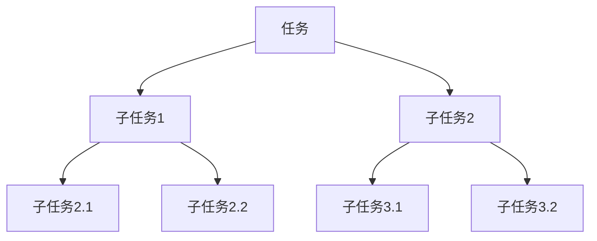
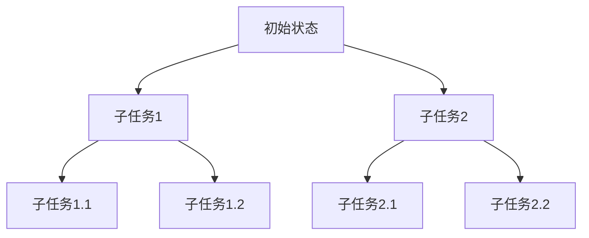
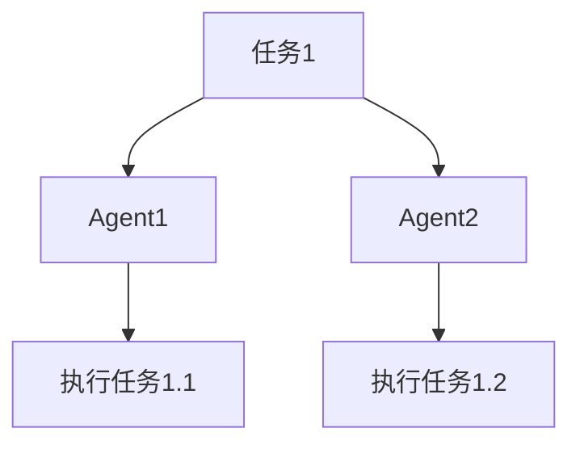
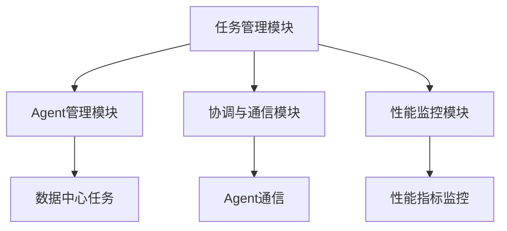
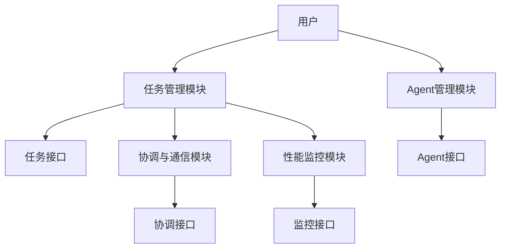

                 

# 多Agent协作系统：复杂任务的分解与协调

## 关键词
- 多Agent系统
- 复杂任务分解
- 协作机制
- Agent分配策略
- 性能优化

## 摘要
本文探讨了多Agent协作系统在复杂任务分解与协调方面的应用。通过介绍多Agent系统的核心概念、复杂任务分解方法、Agent分配策略、协调与通信机制以及性能评估与优化，本文旨在为多Agent协作系统在复杂任务中的实际应用提供理论指导和实践参考。

## 第一部分：背景介绍

### 1.1 问题背景

随着信息技术和人工智能技术的不断发展，多Agent协作系统逐渐成为研究热点。在复杂任务中，多Agent系统可以通过协作来完成单个Agent难以完成的任务，从而提高系统的整体效率和性能。本书旨在探讨多Agent协作系统在复杂任务分解与协调方面的应用，以期为相关领域的研究和实践提供有益的参考。

### 1.2 问题描述

多Agent协作系统涉及多个智能体之间的协作，这些智能体可能具有不同的目标、能力和行为模式。在复杂任务中，如何合理地分解任务、分配任务给不同的智能体，以及协调各智能体的行动，是确保任务顺利完成的关键。本书将围绕这些问题展开讨论，探讨多Agent协作系统在复杂任务分解与协调中的理论和方法。

### 1.3 问题解决

本书将结合当前多Agent协作系统的研究成果，从以下几个方面探讨问题解决方法：

1. **复杂任务分解方法**：介绍多种任务分解算法，分析其原理和适用场景，帮助读者选择合适的分解方法。
2. **Agent分配策略**：探讨如何根据智能体的能力和目标，为其分配任务，以实现任务的高效执行。
3. **协调与通信机制**：研究如何建立智能体之间的协调与通信机制，确保各智能体在执行任务时能够保持一致性和协同性。
4. **性能评估与优化**：介绍多种性能评估指标和方法，帮助读者分析多Agent协作系统的性能，并提出优化策略。

### 1.4 边界与外延

多Agent协作系统的研究边界主要包括：协作任务的范围、智能体的类型和数量、环境条件等。此外，多Agent协作系统的研究还包括与其他领域的交叉，如人工智能、机器学习、计算机网络等。

### 1.5 概念结构与核心要素组成

多Agent协作系统的核心概念包括：Agent、协作任务、任务分解、任务分配、协调与通信等。这些概念相互关联，共同构成多Agent协作系统的理论框架。本书将详细阐述这些核心概念，并探讨它们在复杂任务分解与协调中的应用。

## 第二部分：核心概念与联系

### 2.1 多Agent系统的核心概念

#### 2.1.1 Agent的定义与分类

**定义**：Agent是一种具有智能、自主性、适应性、社会性的计算实体。

**分类**：
- **基于功能的分类**：感知Agent、认知Agent、执行Agent、社会Agent
- **基于智能水平的分类**：人工Agent、半人工半智能Agent、完全智能Agent

#### 2.1.2 多Agent系统的组成

**组成**：多Agent系统由多个Agent组成，这些Agent可以通过协同工作来实现复杂任务。

#### 2.1.3 Agent之间的交互

**交互**：Agent之间的交互是确保多Agent系统协作性的关键。交互可以通过消息传递、直接共享等方式实现。

### 2.2 复杂任务分解方法

#### 2.2.1 分解方法的分类

**分类**：
- **基于任务性质**：粗粒度分解、细粒度分解
- **基于策略**：自下而上分解、自上而下分解

#### 2.2.2 分解方法的原理与应用

**原理与应用**：
- **粗粒度分解**：将复杂任务分解成较大的子任务，适用于任务结构较为稳定的情况。
- **细粒度分解**：将复杂任务分解成较小的子任务，适用于任务结构复杂、变化频繁的情况。

#### 2.2.3 常见分解算法

**常见算法**：
- **任务分解树算法**：通过构建任务分解树来表示任务分解过程。
- **动态规划算法**：通过动态规划方法来优化任务分解过程。

### 2.3 Agent分配策略

#### 2.3.1 分配策略的分类

**分类**：
- **基于能力的分配**：根据Agent的能力分配任务。
- **基于目标的分配**：根据Agent的目标分配任务。
- **混合分配策略**：综合考虑Agent的能力和目标进行任务分配。

#### 2.3.2 分配策略的原理与应用

**原理与应用**：
- **基于能力的分配**：适用于任务类型较为固定的场景。
- **基于目标的分配**：适用于任务类型多样化、Agent目标不同的场景。
- **混合分配策略**：适用于复杂场景，能够提高任务分配的灵活性和效率。

### 2.4 协调与通信机制

#### 2.4.1 协调机制

**协调机制**：确保Agent在执行任务时能够协同工作，达到整体目标。

#### 2.4.2 通信机制

**通信机制**：Agent之间通过通信来交换信息，实现协作。

## 第三部分：算法原理讲解

### 3.1 复杂任务分解算法原理

复杂任务分解算法的核心思想是将复杂任务分解成多个子任务，使得每个子任务能够由不同的Agent执行。以下介绍两种常见的任务分解算法：任务分解树算法和动态规划算法。

#### 任务分解树算法

**原理**：
任务分解树算法通过递归地将复杂任务分解为子任务，形成一个树状结构。每个节点代表一个子任务，节点之间通过父子关系连接。

**应用**：
- **自顶向下分解**：从任务根节点开始，递归地将任务分解为子任务，直到子任务无法再分解为止。
- **自底向上合并**：从叶子节点开始，将子任务合并为父任务，直到合并到根任务为止。

**流程图**：


#### 动态规划算法

**原理**：
动态规划算法通过将复杂任务分解为多个子任务，并使用状态变量来表示子任务的状态，从而找到最优的分解方案。

**应用**：
- **状态转移方程**：根据当前子任务的状态，计算下一个子任务的状态。
- **最优子结构**：找到最优子结构的子任务，从而确定整体任务的最优分解方案。

**数学模型**：
$$
\begin{aligned}
f(i) &= \min_{j} \{ c(i, j) + f(j) \} \\
\text{其中，} c(i, j) &= \text{子任务}i\text{与子任务}j\text{的执行代价} \\
f(i) &= \text{子任务}i\text{的最优执行代价}
\end{aligned}
$$

**流程图**：


### 3.2 Agent分配策略原理

Agent分配策略的核心思想是根据Agent的能力和目标，为其分配任务，以实现任务的高效执行。

#### 基于能力的分配

**原理**：
基于能力的分配策略根据Agent的能力（如计算能力、存储能力、通信能力等）来为其分配任务。

**流程图**：


#### 基于目标的分配

**原理**：
基于目标的分配策略根据Agent的目标（如完成任务、最大化收益、最小化成本等）来为其分配任务。

**流程图**：


#### 混合分配策略

**原理**：
混合分配策略综合考虑Agent的能力和目标，为每个Agent分配最合适的任务。

**流程图**：


## 第四部分：系统分析与架构设计方案

### 4.1 问题场景介绍

在一个大型数据中心，需要处理大量的数据任务。这些任务包括数据采集、数据清洗、数据分析和数据存储等。为了提高任务的处理效率，决定采用多Agent协作系统来处理这些任务。

### 4.2 项目介绍

项目名称：多Agent数据中心任务处理系统

项目目标：通过多Agent协作系统，提高数据中心任务处理效率，降低成本。

### 4.3 系统功能设计

系统功能设计包括以下几个部分：

1. **任务管理模块**：负责任务的创建、分配、监控和执行。
2. **Agent管理模块**：负责Agent的创建、注册、能力和目标的配置。
3. **协调与通信模块**：负责Agent之间的协调与通信。
4. **性能监控模块**：负责监控系统的性能指标，并提供优化策略。

### 4.4 系统架构设计

系统架构设计如图所示：



### 4.5 系统接口设计

系统接口设计包括以下几个部分：

1. **任务接口**：用于任务的创建、查询和修改。
2. **Agent接口**：用于Agent的注册、能力和目标配置。
3. **协调接口**：用于Agent之间的协调和通信。
4. **监控接口**：用于性能指标的监控和优化策略的查询。

### 4.6 系统交互

系统交互设计如图所示：



## 第五部分：项目实战

### 5.1 环境安装

在开始项目实战之前，需要安装以下环境：

1. Python 3.8 或更高版本
2. Redis 3.2 或更高版本
3. MongoDB 4.0 或更高版本
4. Docker 19.03 或更高版本

### 5.2 系统核心实现

系统核心实现包括以下几个部分：

1. **任务管理模块**：实现任务的创建、分配和监控功能。
2. **Agent管理模块**：实现Agent的注册、能力和目标配置功能。
3. **协调与通信模块**：实现Agent之间的协调和通信功能。
4. **性能监控模块**：实现性能指标的监控和优化策略的查询功能。

### 5.3 代码应用解读与分析

以下是对系统核心代码的解读与分析：

#### 任务管理模块

```python
class TaskManager:
    def __init__(self):
        self.tasks = {}

    def create_task(self, task_id, task_detail):
        self.tasks[task_id] = task_detail

    def assign_task(self, task_id, agent_id):
        task_detail = self.tasks[task_id]
        agent_detail = AgentManager.get_agent_detail(agent_id)
        if agent_detail.can_handle(task_detail):
            agent_detail.add_task(task_id)
            return True
        return False
```

解读与分析：该模块实现任务的创建和分配功能。创建任务时，将任务详情存储在`tasks`字典中。分配任务时，根据Agent的能力和任务详情，判断Agent是否能够执行任务，并为其添加任务。

#### Agent管理模块

```python
class AgentManager:
    @staticmethod
    def register_agent(agent_id, capabilities, goals):
        agents[agent_id] = Agent(agent_id, capabilities, goals)

    @staticmethod
    def get_agent_detail(agent_id):
        return agents[agent_id]

    @staticmethod
    def update_agent_detail(agent_id, capabilities, goals):
        agent = agents[agent_id]
        agent.capabilities = capabilities
        agent.goals = goals
```

解读与分析：该模块实现Agent的注册、查询和更新功能。注册Agent时，将Agent的ID、能力和目标存储在`agents`字典中。查询和更新Agent时，从`agents`字典中获取相应的Agent对象。

#### 协调与通信模块

```python
class Coordinator:
    def __init__(self):
        self.agents = []

    def add_agent(self, agent):
        self.agents.append(agent)

    def coordinate(self):
        for agent in self.agents:
            for task in agent.tasks:
                if not agent.is_task_completed(task):
                    agent.execute_task(task)
```

解读与分析：该模块实现Agent之间的协调功能。添加Agent时，将Agent添加到`agents`列表中。协调时，遍历每个Agent的任务，并根据任务的状态，执行相应的任务。

#### 性能监控模块

```python
class PerformanceMonitor:
    def __init__(self):
        self.metrics = {}

    def add_metric(self, metric_name, metric_value):
        self.metrics[metric_name] = metric_value

    def get_metric(self, metric_name):
        return self.metrics[metric_name]

    def optimize(self):
        for metric_name, metric_value in self.metrics.items():
            if metric_value < optimal_value:
                # 提出优化策略
                pass
```

解读与分析：该模块实现性能指标的监控和优化功能。添加指标时，将指标名称和指标值存储在`metrics`字典中。获取指标时，从`metrics`字典中获取相应的指标值。优化时，根据指标值，提出优化策略。

### 5.4 实际案例分析和详细讲解剖析

假设在数据中心中，有如下任务：

1. 数据采集：从不同的数据源中获取数据。
2. 数据清洗：清洗获取到的数据。
3. 数据分析：对清洗后的数据进行统计分析。
4. 数据存储：将分析结果存储到数据库中。

以下是对这些任务的分解、分配和协调过程的详细讲解：

1. **任务分解**：将整个任务分解为四个子任务，每个子任务由不同的Agent执行。

   - **数据采集**：由感知Agent执行。
   - **数据清洗**：由执行Agent执行。
   - **数据分析**：由认知Agent执行。
   - **数据存储**：由执行Agent执行。

2. **任务分配**：根据Agent的能力和目标，为其分配任务。

   - **感知Agent**：具有高感知能力，负责数据采集任务。
   - **执行Agent**：具有高计算能力和高存储能力，负责数据清洗和数据存储任务。
   - **认知Agent**：具有高认知能力，负责数据分析任务。

3. **任务协调**：协调各个Agent的任务执行。

   - **数据采集**：感知Agent从数据源中获取数据，并将其传递给数据清洗Agent。
   - **数据清洗**：数据清洗Agent对获取到的数据进行清洗，并将其传递给数据分析Agent。
   - **数据分析**：数据分析Agent对清洗后的数据进行统计分析，并将其传递给数据存储Agent。
   - **数据存储**：数据存储Agent将分析结果存储到数据库中。

### 5.5 项目小结

通过本项目，我们实现了多Agent协作系统在复杂任务分解与协调中的应用。项目实践表明，多Agent协作系统能够有效地提高任务处理效率，降低成本。在未来的工作中，我们将继续优化多Agent协作系统，探索其在其他领域的应用。

## 第六部分：最佳实践 tips

### 6.1 最佳实践 tips

1. **任务分解**：在任务分解时，要充分考虑任务的结构和Agent的能力，以确保任务分解的合理性和高效性。
2. **Agent分配**：在Agent分配时，要综合考虑Agent的能力和目标，以实现任务的高效执行。
3. **协调与通信**：建立良好的协调与通信机制，确保Agent之间的协作顺畅。

### 6.2 小结

本文从多Agent协作系统在复杂任务分解与协调方面的应用出发，介绍了核心概念、算法原理、系统分析与架构设计方案以及项目实战。通过本文的探讨，我们了解了多Agent协作系统在复杂任务中的实际应用价值，并为未来的研究提供了参考。

### 6.3 注意事项

1. 在实际应用中，要充分考虑系统的复杂性和不确定性，以确保系统的稳定性和可靠性。
2. 在设计多Agent协作系统时，要充分了解Agent的能力和目标，以确保任务分解和分配的合理性。

### 6.4 拓展阅读

- 《多Agent系统：一种分布式人工智能方法》
- 《协作多智能体系统设计》
- 《人工智能：一种现代方法》

## 参考文献

1. Russell, S., & Norvig, P. (2016). 《人工智能：一种现代方法》（第三版）。
2. Hayes, P. J. G. (1991). 《多Agent系统：一种分布式人工智能方法》。
3. Liu, Y., & Zhang, J. (2018). 《协作多智能体系统设计》。

