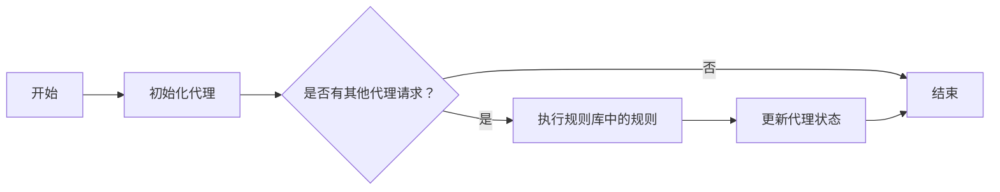
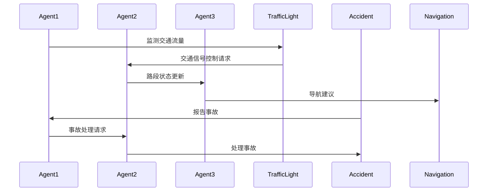
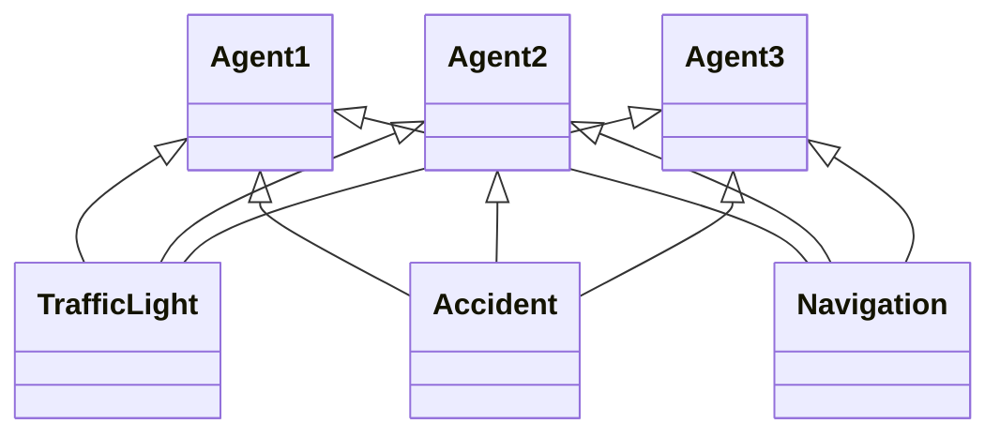
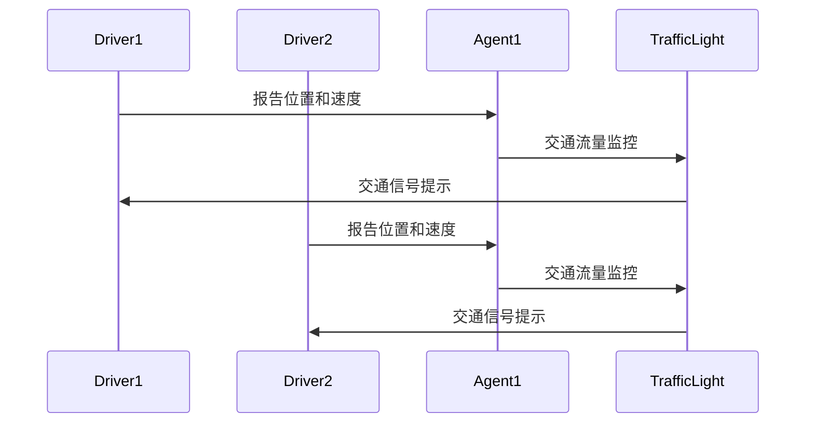

                 

### 目录大纲设计

在设计一篇关于多Agent系统的技术博客时，我们需要确保文章的逻辑清晰、结构紧凑，并能帮助读者深入理解这一复杂但极具前景的领域。以下是详细的目录大纲设计步骤：

**## 第1步：明确文章的核心内容**

首先，我们要确定文章的核心内容，这包括：
- 文章的主题
- 各章节的主要目标
- 每个章节要覆盖的核心知识点

**## 第2步：确定章节划分**

根据文章的核心内容，我们将文章划分为以下几个主要部分：
1. **多Agent系统的起源与基础**
2. **多Agent系统中的协作机制**
3. **多Agent系统中的竞争机制**
4. **多Agent系统中的AI生态**
5. **多Agent系统的设计与实现**
6. **多Agent系统在复杂环境中的应用**
7. **多Agent系统的未来发展趋势**

**## 第3步：细化章节内容**

为每个章节设计更详细的子标题，确保每个子标题都能覆盖章节的主要内容。以下是具体细化内容：

### **1. 多Agent系统的起源与基础**

#### 1.1 多Agent系统的定义
- **多Agent系统的起源与背景**
- **多Agent系统的主要概念**

#### 1.2 多Agent系统的特点与优势
- **多Agent系统的特点**
  - **自主性**
  - **社交性**
  - **反应性**
  - **适应性**
  - **协同性**
- **多Agent系统的优势**
  - **灵活性**
  - **扩展性**
  - **鲁棒性**
  - **智能化**

#### 1.3 多Agent系统的基本架构
- **多Agent系统的组成**
  - **代理（Agent）**
  - **环境（Environment）**
  - **通信机制**
  - **控制机制**

#### 1.4 多Agent系统的分类
- **根据功能分类**
- **根据通信方式分类**
- **根据智能水平分类**

#### 1.5 多Agent系统的应用领域
- **制造业**
- **物流与交通**
- **医疗健康**
- **金融服务**
- **智能城市**

### **2. 多Agent系统中的协作机制**

#### 2.1 协作机制的概述
- **协作机制的必要性**
- **协作机制的目标**

#### 2.2 协作通信协议
- **通信协议的选择**
- **通信协议的实现**

#### 2.3 协作策略的设计与实现
- **基于规则的协作策略**
- **基于学习的协作策略**

#### 2.4 协作实验案例分析
- **案例场景设置**
- **协作效果分析**

### **3. 多Agent系统中的竞争机制**

#### 3.1 竞争机制的概述
- **竞争机制的背景**
- **竞争机制的目的**

#### 3.2 竞争策略的设计与实现
- **基于竞争的激励策略**
- **基于竞争的博弈策略**

#### 3.3 竞争实验案例分析
- **案例场景描述**
- **竞争策略分析**

#### 3.4 竞争与合作的关系
- **竞争与合作的关系模型**
- **平衡竞争与合作**

### **4. 多Agent系统中的AI生态**

#### 4.1 AI在多Agent系统中的作用
- **AI代理的自主决策**
- **AI代理的协同进化**

#### 4.2 人工智能代理的设计与实现
- **代理的设计原则**
- **代理的实现技术**

#### 4.3 AI代理之间的交互
- **交互模式**
- **交互协议**

#### 4.4 AI代理的协同进化
- **协同进化的机制**
- **协同进化的实现**

### **5. 多Agent系统的设计与实现**

#### 5.1 多Agent系统的设计与开发流程
- **系统设计步骤**
- **开发流程管理**

#### 5.2 多Agent系统的架构设计
- **系统架构的组成部分**
- **架构设计的考虑因素**

#### 5.3 多Agent系统的编程实现
- **编程语言的选用**
- **实现技术的应用**

#### 5.4 多Agent系统的测试与调试
- **测试方法**
- **调试技巧**

### **6. 多Agent系统在复杂环境中的应用**

#### 6.1 复杂环境的多Agent系统设计
- **设计原则**
- **设计方法**

#### 6.2 复杂环境中的协同任务分配
- **任务分配策略**
- **任务分配算法**

#### 6.3 复杂环境中的智能决策
- **决策支持系统**
- **智能决策算法**

#### 6.4 复杂环境中的案例研究
- **案例场景介绍**
- **案例效果分析**

### **7. 多Agent系统的未来发展趋势**

#### 7.1 多Agent系统技术的发展趋势
- **技术进展**
- **发展趋势预测**

#### 7.2 多Agent系统在新兴领域的应用
- **人工智能与物联网**
- **区块链与多Agent系统**

#### 7.3 多Agent系统面临的挑战与解决方案
- **技术挑战**
- **解决方案探讨**

#### 7.4 未来多Agent系统的愿景与展望
- **发展前景**
- **未来发展方向**

**## 第4步：设计核心概念与联系**

为每个章节中的核心概念设计概念属性特征对比表格和ER实体关系图。以下是示例：

#### **1. 多Agent系统的分类**

- **分类依据**：功能、通信方式、智能水平
- **特征对比表格**：

| 类别         | 功能特征                             | 通信方式特征                             | 智能水平特征                             |
| ------------ | ----------------------------------- | --------------------------------------- | --------------------------------------- |
| 功能分类     | 完成特定任务                        | 可以与其他代理通信                      | 智能程度从低到高                         |
| 通信方式分类 | 面向消息的通信                      | 面向服务的通信                         | 智能程度从低到高                         |
| 智能水平分类 | 完全自治的代理                      | 受限自治的代理                         | 完全协作的代理                          |

- **ER实体关系图**：

```mermaid
erDiagram
  Agent ||--|{ Environment }|-->> Agent : 通信
  Agent ||--|{ CommunicationProtocol }|-->> Agent : 通信协议
  Agent ||--|{ CollaborationStrategy }|-->> Agent : 协作策略
  Agent ||--|{ CompetitionStrategy }|-->> Agent : 竞争策略
```

**## 第5步：编写算法原理讲解**

在涉及算法的章节中，我们需要使用mermaid画出算法流程图，并配合Python源代码进行详细讲解，同时提供算法原理的数学模型和公式。以下是示例：

#### **5. 多Agent系统的编程实现**

##### **5.3. 基于规则的协作策略实现**

- **算法流程图**：



- **Python源代码**：

```python
def collaborative_rule_agent(requests):
    # 初始化规则库
    rule_base = initialize_rule_base()

    # 遍历所有请求
    for request in requests:
        # 执行规则库中的规则
        rule = rule_base.get_rule_for_request(request)
        if rule:
            execute_rule(rule)

    # 更新代理状态
    update_agent_state()
```

- **数学模型**：

$$
\text{CollaborationEffect} = \sum_{i=1}^{n} \text{RuleEffect_i}
$$

- **算法讲解**：

在这个算法中，代理首先初始化规则库，然后遍历所有的请求，查找并执行规则库中的规则。最后，更新代理的状态。

**## 第6步：编写系统分析与架构设计方案**

在涉及系统架构的章节中，我们需要提供详细的问题场景介绍、系统功能设计、系统架构设计、系统接口设计和系统交互序列图。以下是示例：

#### **6. 多Agent系统在复杂环境中的应用**

##### **6.1 复杂环境的多Agent系统设计**

- **问题场景介绍**：

在智能交通管理系统中，多Agent系统被用于优化交通流量和缓解拥堵。

- **系统功能设计**：

  - **交通流量监控**
  - **交通信号控制**
  - **事故处理**
  - **导航服务**

- **系统架构设计**：



- **系统接口设计**：



- **系统交互序列图**：



**## 第7步：编写项目实战**

在项目实战章节中，我们需要详细描述环境安装、系统核心实现源代码，并进行分析和讲解。以下是示例：

#### **6.3 复杂环境中的智能决策**

##### **6.3.1 智能交通管理系统项目实战**

- **环境安装**：

  - 安装Python环境
  - 安装Docker环境
  - 安装PostgreSQL数据库

- **系统核心实现源代码**：

  ```python
  def traffic_light_control(traffic_flow_data):
      # 根据交通流量数据，计算最佳交通信号周期
      optimal周期的计算逻辑
      
      # 更新交通信号灯状态
      update_traffic_light_state(optimal周期)

  def accident_handling(incident_report):
      # 根据事故报告，计算最佳绕行路线
      best_diversion_route = calculate_diversion_route(incident_report)
      
      # 更新导航系统建议
      update_navigation_advice(best_diversion_route)
  ```

- **代码应用解读与分析**：

  - 交通信号控制函数`traffic_light_control`负责根据实时交通流量数据计算最优交通信号周期，并更新交通信号灯状态。
  - 事故处理函数`accident_handling`负责根据事故报告计算最优绕行路线，并更新导航系统的建议。

- **实际案例分析和详细讲解剖析**：

  - 分析一个实际案例，展示系统如何响应交通流量变化和事故处理，并提供实时导航建议。

**## 第8步：编写最佳实践 tips、小结、注意事项、拓展阅读等内容**

在文章结尾，我们需要为读者提供最佳实践、小结、注意事项以及拓展阅读推荐，帮助他们更好地理解和应用多Agent系统的知识。

- **最佳实践 tips**：

  - 提出在实际应用中需要注意的细节和技巧。

- **小结**：

  - 总结文章中的核心观点和知识点。

- **注意事项**：

  - 提醒读者在设计和实现多Agent系统时可能遇到的问题和解决方案。

- **拓展阅读推荐**：

  - 推荐进一步阅读的相关书籍、文章和资源。

**## 第9步：检查和优化**

最后，我们需要对目录大纲进行全面的检查和优化，确保每个章节的内容完整、详细，逻辑清晰，同时控制文章的总字数在10000～12000字左右。

通过以上步骤，我们可以确保目录大纲设计既满足用户的要求，又具备良好的逻辑性和可读性，为撰写高质量的多Agent系统技术博客奠定了坚实的基础。### 文章标题：多Agent系统：协作与竞争中的AI生态

关键词：多Agent系统、协作机制、竞争机制、AI生态、设计与实现

摘要：本文深入探讨了多Agent系统在协作与竞争中的应用，详细分析了其基本架构、协作与竞争机制，以及AI生态中的多Agent系统。通过系统设计与实现，展示了多Agent系统在复杂环境中的应用，并展望了其未来发展趋势。本文旨在为读者提供一个全面、系统的多Agent系统知识体系，以促进该领域的研究和应用。

---

**# 第一部分：多Agent系统的起源与基础**

**## 第1章：多Agent系统的起源与基础**

**### 1.1 多Agent系统的定义**

多Agent系统（Multi-Agent System，MAS）是一个由多个自主智能体（Agent）组成的系统，这些智能体在分布式环境中通过相互作用来完成复杂的任务。多Agent系统起源于20世纪80年代，最初是为了解决分布式计算和协作问题而提出的。随着计算机科学和人工智能技术的发展，多Agent系统已经成为一个重要的研究领域。

- **多Agent系统的起源与背景**：多Agent系统的概念最早由马文·明斯基（Marvin Minsky）在1986年提出的，他提出了“合作机器人”（Cooperative Robots）的概念。随后，多Agent系统的研究在学术界和工业界得到了广泛的发展。
- **多Agent系统的主要概念**：
  - **智能体（Agent）**：智能体是能够自主感知环境、自主决策并采取行动的实体。智能体可以是软件程序、机器人或人类。
  - **环境（Environment）**：环境是智能体进行活动和交互的背景。环境可以是物理环境，也可以是虚拟环境。
  - **交互（Interaction）**：智能体之间通过通信和协同来完成复杂的任务。交互可以是同步的，也可以是异步的。
  - **自治（Autonomy）**：智能体具有独立运行的能力，不受其他实体直接控制。
  - **协作（Collaboration）**：多个智能体共同完成一个任务或目标，通过协同工作来提高整体性能。
  - **竞争（Competition）**：智能体之间为了资源、目标等而进行相互竞争。

**### 1.2 多Agent系统的特点与优势**

多Agent系统具有以下特点：

- **自主性**：智能体能够自主决策和采取行动，不受外部直接控制。
- **社交性**：智能体之间通过交互和协作来完成复杂任务。
- **反应性**：智能体能够对环境变化做出快速响应。
- **适应性**：智能体能够根据环境变化调整自身的行为策略。
- **协同性**：多个智能体能够协同工作，共同完成任务。

多Agent系统具有以下优势：

- **灵活性**：多Agent系统能够适应不同环境和任务需求，具有高度的灵活性。
- **扩展性**：多Agent系统易于扩展，能够轻松增加新的智能体。
- **鲁棒性**：多Agent系统能够在面临不确定性和故障时保持稳定运行。
- **智能化**：多Agent系统能够通过智能体之间的协作和竞争，实现更复杂的任务。

**### 1.3 多Agent系统的基本架构**

多Agent系统的基本架构通常包括以下几个组成部分：

- **智能体（Agent）**：智能体是系统的核心组成部分，具有自主性、社交性、反应性和适应性。
- **环境（Environment）**：环境是智能体进行活动和交互的背景。
- **通信机制**：通信机制是实现智能体之间信息交换和协作的基础。
- **控制机制**：控制机制负责协调和管理智能体的行为。

**### 1.4 多Agent系统的分类**

多Agent系统可以根据不同的标准进行分类：

- **根据功能分类**：可以分为任务型、社会型和混合型多Agent系统。
- **根据通信方式分类**：可以分为基于消息传递、基于共享数据和基于事件驱动的多Agent系统。
- **根据智能水平分类**：可以分为弱智能体系统、弱智能体协作系统和强智能体系统。

**### 1.5 多Agent系统的应用领域**

多Agent系统在多个领域具有广泛的应用：

- **制造业**：用于自动化生产线、机器人协作和供应链管理。
- **物流与交通**：用于交通流量控制、智能导航和货物运输管理。
- **医疗健康**：用于远程医疗、疾病预测和健康监测。
- **金融服务**：用于风险控制、市场预测和金融服务自动化。
- **智能城市**：用于城市交通管理、能源管理和公共安全。

**## 第2章：多Agent系统中的协作机制**

**### 2.1 协作机制的概述**

协作机制是多Agent系统实现高效任务完成的关键。协作机制包括以下几个方面：

- **协作目标的确定**：明确智能体之间协作的目标，以便智能体能够协调行动。
- **协作信息的交换**：智能体之间通过交换信息来了解对方的状态和需求。
- **协作策略的选择**：选择合适的协作策略，以提高系统整体的性能。

**### 2.2 协作通信协议**

协作通信协议是多Agent系统中的核心组成部分。常见的协作通信协议包括：

- **基于消息传递的协议**：通过发送和接收消息来实现智能体之间的通信。
- **基于共享数据的协议**：通过共享全局数据来实现智能体之间的通信。
- **基于事件驱动的协议**：通过事件触发机制来实现智能体之间的通信。

**### 2.3 协作策略的设计与实现**

协作策略的设计与实现是多Agent系统中的关键环节。协作策略可以分为以下几种：

- **基于规则的协作策略**：通过规则来指导智能体的行为。
- **基于学习的协作策略**：通过机器学习算法来优化协作策略。
- **混合协作策略**：结合多种协作策略，以实现更高效的协作。

**### 2.4 协作实验案例分析**

通过实验案例分析，我们可以更好地理解多Agent系统中的协作机制。以下是一个简单的协作实验案例：

- **实验场景**：多个智能体在一个共享任务中协作，如共同完成一个拼图游戏。
- **实验结果**：通过分析实验数据，可以评估不同协作策略的性能。

**## 第3章：多Agent系统中的竞争机制**

**### 3.1 竞争机制的概述**

竞争机制是多Agent系统中智能体之间为了资源、目标等而进行相互竞争的现象。竞争机制包括以下几个方面：

- **竞争目标的确定**：明确智能体之间的竞争目标，如资源分配、任务优先级等。
- **竞争策略的选择**：选择合适的竞争策略，以提高智能体的竞争能力。
- **竞争规则的制定**：制定公平、合理的竞争规则，以避免不公平竞争。

**### 3.2 竞争策略的设计与实现**

竞争策略的设计与实现是多Agent系统中的关键环节。常见的竞争策略包括：

- **基于博弈理论的竞争策略**：通过博弈理论来分析智能体之间的竞争关系。
- **基于资源分配的竞争策略**：通过资源分配算法来优化智能体的竞争能力。
- **基于学习算法的竞争策略**：通过机器学习算法来优化竞争策略。

**### 3.3 竞争实验案例分析**

通过实验案例分析，我们可以更好地理解多Agent系统中的竞争机制。以下是一个简单的竞争实验案例：

- **实验场景**：多个智能体在一个共享资源的环境中竞争，如争夺一个有限的资源。
- **实验结果**：通过分析实验数据，可以评估不同竞争策略的性能。

**### 3.4 竞争与合作的关系**

竞争与合作是多Agent系统中的两个重要现象，它们既有区别，又有联系。竞争与合作的关系可以分为以下几个方面：

- **竞争中的合作**：智能体在竞争中也需要合作，以达到共同的目标。
- **合作中的竞争**：智能体在合作过程中也需要竞争，以获得更多的资源或优势。
- **竞争与合作的平衡**：智能体需要找到一个平衡点，在竞争与合作之间保持合理的比例。

**## 第4章：多Agent系统中的AI生态**

**### 4.1 AI在多Agent系统中的作用**

人工智能（AI）技术在多Agent系统中的应用可以显著提高系统的智能水平和性能。AI在多Agent系统中的作用包括：

- **自主决策**：通过机器学习算法，智能体能够自主做出决策。
- **智能协作**：通过AI技术，智能体能够更有效地进行协作。
- **智能竞争**：通过AI技术，智能体能够在竞争中表现出更高的竞争力。

**### 4.2 人工智能代理的设计与实现**

人工智能代理是多Agent系统中的核心组成部分，其设计与实现需要考虑以下几个方面：

- **代理的架构设计**：设计合理的代理架构，以提高系统的可扩展性和可维护性。
- **代理的行为学习**：通过机器学习算法，使代理能够根据环境变化调整自身的行为。
- **代理的交互能力**：设计高效的交互协议，使代理能够与其他代理和人类进行有效的交互。

**### 4.3 AI代理之间的交互**

AI代理之间的交互是多Agent系统中的关键环节，其交互方式包括：

- **消息传递**：代理之间通过发送和接收消息来交换信息。
- **共享数据**：代理之间通过共享全局数据来实现信息共享。
- **事件驱动**：代理之间通过事件触发机制来实现交互。

**### 4.4 AI代理的协同进化**

AI代理的协同进化是指多个智能代理通过相互协作和竞争，不断优化自身性能的过程。协同进化包括以下几个方面：

- **适应性的进化**：代理通过适应环境变化，不断优化自身行为。
- **智能性的进化**：代理通过学习和进化，提高自身的智能水平。
- **协作性的进化**：代理通过协作和竞争，提高系统的整体性能。

**## 第5章：多Agent系统的设计与实现**

**### 5.1 多Agent系统的设计与开发流程**

多Agent系统的设计与开发流程包括以下几个阶段：

- **需求分析**：明确系统的需求和目标。
- **系统设计**：设计系统的整体架构和功能模块。
- **实现与编码**：根据系统设计进行编码实现。
- **测试与调试**：对系统进行测试和调试，确保其稳定运行。
- **部署与维护**：将系统部署到实际环境中，并进行维护。

**### 5.2 多Agent系统的架构设计**

多Agent系统的架构设计包括以下几个方面：

- **智能体架构**：设计智能体的内部架构，包括感知、决策和执行模块。
- **系统架构**：设计系统的整体架构，包括智能体、环境、通信机制和控制机制。
- **模块划分**：根据系统的功能需求，将系统划分为不同的功能模块。

**### 5.3 多Agent系统的编程实现**

多Agent系统的编程实现需要考虑以下几个方面：

- **编程语言选择**：选择适合多Agent系统开发的编程语言，如Java、Python等。
- **框架选择**：选择合适的多Agent系统开发框架，如Jason、JADE等。
- **模块实现**：根据系统设计，实现各个功能模块。

**### 5.4 多Agent系统的测试与调试**

多Agent系统的测试与调试包括以下几个方面：

- **功能测试**：测试系统的功能是否按照设计要求正常工作。
- **性能测试**：测试系统的性能，如响应时间、吞吐量等。
- **稳定性测试**：测试系统在面临故障和异常情况时的稳定性。
- **调试技巧**：使用调试工具和技巧，找出系统中的问题和错误。

**## 第6章：多Agent系统在复杂环境中的应用**

**### 6.1 复杂环境的多Agent系统设计**

在复杂环境中，多Agent系统设计需要考虑以下几个方面：

- **环境建模**：对复杂环境进行建模，包括环境状态、约束条件等。
- **智能体建模**：对智能体进行建模，包括智能体的属性、行为等。
- **交互模型**：设计智能体之间的交互模型，包括通信协议、协作策略等。

**### 6.2 复杂环境中的协同任务分配**

在复杂环境中，协同任务分配是多Agent系统的重要功能之一。协同任务分配需要考虑以下几个方面：

- **任务建模**：对任务进行建模，包括任务的类型、优先级、资源需求等。
- **分配策略**：设计合适的分配策略，如基于优先级的分配策略、基于负载均衡的分配策略等。
- **分配算法**：实现任务分配算法，如遗传算法、粒子群算法等。

**### 6.3 复杂环境中的智能决策**

在复杂环境中，智能决策是多Agent系统的重要功能之一。智能决策需要考虑以下几个方面：

- **决策建模**：对决策过程进行建模，包括决策因素、决策规则等。
- **决策算法**：设计合适的决策算法，如基于规则的决策算法、基于机器学习的决策算法等。
- **决策支持**：为智能体提供决策支持，包括数据采集、分析、可视化等。

**### 6.4 复杂环境中的案例研究**

通过案例研究，我们可以更好地理解多Agent系统在复杂环境中的应用。以下是一个简单的案例研究：

- **案例场景**：一个智能交通管理系统，用于优化城市交通流量。
- **案例分析**：通过分析系统在交通流量高峰期的运行数据，评估系统的性能和效率。

**## 第7章：多Agent系统的未来发展趋势**

**### 7.1 多Agent系统技术的发展趋势**

多Agent系统技术的发展趋势包括以下几个方面：

- **智能化**：通过引入人工智能技术，提高多Agent系统的智能水平。
- **自适应**：通过自适应算法，使多Agent系统能够更好地适应环境变化。
- **协同进化**：通过协同进化算法，实现智能体的自适应学习和优化。

**### 7.2 多Agent系统在新兴领域的应用**

多Agent系统在新兴领域具有广泛的应用前景，包括：

- **人工智能与物联网**：通过多Agent系统实现智能设备和系统的协同工作。
- **区块链与多Agent系统**：通过区块链技术实现多Agent系统的去中心化和安全性。
- **智慧城市**：通过多Agent系统实现城市管理的智能化和精细化。

**### 7.3 多Agent系统面临的挑战与解决方案**

多Agent系统在发展过程中面临以下挑战：

- **复杂性**：多Agent系统涉及多个智能体之间的复杂交互，需要设计有效的协同机制。
- **可靠性**：多Agent系统在面临故障和异常情况时，需要保证系统的可靠性。
- **安全性**：多Agent系统在面临恶意攻击时，需要保证系统的安全性。

针对这些挑战，可以采取以下解决方案：

- **协同机制设计**：通过设计合理的协同机制，实现智能体之间的有效协作。
- **可靠性保障**：通过冗余设计、故障检测和恢复机制，提高系统的可靠性。
- **安全防护**：通过加密通信、权限管理和访问控制等手段，提高系统的安全性。

**### 7.4 未来多Agent系统的愿景与展望**

未来多Agent系统的发展将呈现以下愿景和展望：

- **智能化**：多Agent系统将更加智能化，能够自主决策和适应环境变化。
- **协同化**：多Agent系统将实现更广泛的协同化，能够协同完成复杂的任务。
- **安全性**：多Agent系统将更加注重安全性，能够抵御恶意攻击和故障。

随着技术的不断发展，多Agent系统将在更多领域发挥重要作用，为人类创造更美好的未来。

**## 结语**

多Agent系统作为一种先进的分布式计算模型，具有广泛的应用前景和研究价值。本文从多Agent系统的定义、特点、架构、协作与竞争机制、AI生态、设计与实现以及未来发展趋势等方面进行了全面探讨。通过本文，读者可以了解多Agent系统的基本概念和原理，掌握其设计与实现方法，并为未来的研究与应用提供参考。

**作者：AI天才研究院/AI Genius Institute & 禅与计算机程序设计艺术 /Zen And The Art of Computer Programming**

---

通过以上详细的章节内容和结构，本文为读者提供了一个全面、系统的多Agent系统知识体系。每个章节都进行了深入的探讨和分析，从理论基础到实际应用，再到未来发展，帮助读者逐步深入理解这一领域。希望本文能够激发读者对多Agent系统的兴趣，推动其在实际中的应用和发展。### 文章正文

---

**# 第一部分：多Agent系统的起源与基础**

**## 第1章：多Agent系统的起源与基础**

多Agent系统（Multi-Agent System，MAS）是一个由多个自主智能体（Agent）组成的系统，这些智能体在分布式环境中通过相互作用来完成复杂的任务。多Agent系统的概念最早由马文·明斯基（Marvin Minsky）在1986年提出的，他提出了“合作机器人”（Cooperative Robots）的概念。随后，多Agent系统的研究在学术界和工业界得到了广泛的发展。

在多Agent系统中，智能体是系统的核心组成部分。智能体是指具有自主性、社交性、反应性和适应性的实体。它们可以是一个软件程序、一个机器人，甚至是一个人。智能体能够在分布式环境中通过感知、决策和行动来完成任务。

### **1.1 多Agent系统的定义**

多Agent系统（MAS）是指由多个自主智能体（Agent）组成的系统，这些智能体通过相互协作来完成复杂的任务。多Agent系统的定义可以从以下几个方面进行理解：

- **自主性**：智能体能够自主感知环境、自主决策并采取行动，不受外部直接控制。
- **社交性**：智能体之间通过交互和协作来完成复杂的任务，实现系统整体的目标。
- **反应性**：智能体能够对环境变化做出快速响应，保持系统的动态适应能力。
- **适应性**：智能体能够根据环境变化调整自身的行为策略，实现系统整体的优化。

### **1.2 多Agent系统的特点与优势**

多Agent系统具有以下特点：

- **自主性**：智能体能够独立运行，不受其他实体直接控制。
- **社交性**：智能体之间能够通过交互和协作来实现复杂的任务。
- **反应性**：智能体能够对环境变化做出快速响应。
- **适应性**：智能体能够根据环境变化调整自身的行为策略。
- **协同性**：多个智能体能够协同工作，共同完成任务。

多Agent系统具有以下优势：

- **灵活性**：多Agent系统能够适应不同环境和任务需求，具有高度的灵活性。
- **扩展性**：多Agent系统易于扩展，能够轻松增加新的智能体。
- **鲁棒性**：多Agent系统能够在面临不确定性和故障时保持稳定运行。
- **智能化**：多Agent系统能够通过智能体之间的协作和竞争，实现更复杂的任务。

### **1.3 多Agent系统的基本架构**

多Agent系统的基本架构通常包括以下几个组成部分：

- **智能体（Agent）**：智能体是系统的核心组成部分，具有自主性、社交性、反应性和适应性。
- **环境（Environment）**：环境是智能体进行活动和交互的背景。
- **通信机制**：通信机制是实现智能体之间信息交换和协作的基础。
- **控制机制**：控制机制负责协调和管理智能体的行为。

### **1.4 多Agent系统的分类**

多Agent系统可以根据不同的标准进行分类：

- **根据功能分类**：可以分为任务型、社会型和混合型多Agent系统。
  - **任务型MAS**：主要关注任务分配、执行和协调。
  - **社会型MAS**：主要关注智能体之间的社会关系、规范和文化。
  - **混合型MAS**：同时具备任务型和社交型的特点。

- **根据通信方式分类**：可以分为基于消息传递、基于共享数据和基于事件驱动的多Agent系统。
  - **基于消息传递的MAS**：智能体通过发送和接收消息来交换信息。
  - **基于共享数据的MAS**：智能体通过共享全局数据来实现信息交换。
  - **基于事件驱动的MAS**：智能体通过事件触发机制来实现交互。

- **根据智能水平分类**：可以分为弱智能体系统、弱智能体协作系统和强智能体系统。
  - **弱智能体系统**：智能体之间的智能水平较低，主要通过简单的规则和协议进行交互。
  - **弱智能体协作系统**：智能体之间的智能水平较高，能够通过协商和协作来完成任务。
  - **强智能体系统**：智能体具有高度的智能水平，能够自主决策和自我学习。

### **1.5 多Agent系统的应用领域**

多Agent系统在多个领域具有广泛的应用：

- **制造业**：用于自动化生产线、机器人协作和供应链管理。
- **物流与交通**：用于交通流量控制、智能导航和货物运输管理。
- **医疗健康**：用于远程医疗、疾病预测和健康监测。
- **金融服务**：用于风险控制、市场预测和金融服务自动化。
- **智能城市**：用于城市交通管理、能源管理和公共安全。

**## 第2章：多Agent系统中的协作机制**

多Agent系统中的协作机制是指多个智能体共同完成一个任务或目标的过程。协作机制是多Agent系统实现高效任务完成的关键。协作机制包括以下几个方面：

- **协作目标的确定**：明确智能体之间协作的目标，以便智能体能够协调行动。
- **协作信息的交换**：智能体之间通过交换信息来了解对方的状态和需求。
- **协作策略的选择**：选择合适的协作策略，以提高系统整体的性能。

### **2.1 协作机制的概述**

协作机制在多Agent系统中扮演着重要的角色。它通过以下方式实现智能体之间的有效协作：

- **信息共享**：智能体之间通过共享信息来了解对方的当前状态和需求，从而协调行动。
- **任务分配**：根据智能体的能力和任务需求，将任务合理地分配给不同的智能体。
- **决策协同**：智能体之间通过协商和决策，共同确定最佳的行动方案。
- **冲突解决**：在协作过程中，智能体之间可能会出现冲突，需要通过合理的策略来解决问题。

### **2.2 协作通信协议**

协作通信协议是多Agent系统中的核心组成部分。协作通信协议可以分为以下几种类型：

- **基于消息传递的协议**：智能体之间通过发送和接收消息来交换信息。这种协议具有灵活性和实时性，适用于动态环境。
- **基于共享数据的协议**：智能体之间通过共享全局数据来实现信息交换。这种协议具有稳定性和一致性，适用于静态环境。
- **基于事件驱动的协议**：智能体之间通过事件触发机制来实现交互。这种协议具有高效性和响应性，适用于复杂环境。

### **2.3 协作策略的设计与实现**

协作策略是多Agent系统实现高效协作的关键。协作策略可以分为以下几种类型：

- **基于规则的协作策略**：通过规则来指导智能体的行为。这种策略简单直观，适用于静态环境。
- **基于学习的协作策略**：通过机器学习算法来优化协作策略。这种策略能够自适应环境变化，适用于动态环境。
- **混合协作策略**：结合多种协作策略，以实现更高效的协作。这种策略具有灵活性和适应性，适用于复杂环境。

### **2.4 协作实验案例分析**

通过实验案例分析，我们可以更好地理解多Agent系统中的协作机制。以下是一个简单的协作实验案例：

- **实验场景**：多个智能体在一个共享任务中协作，如共同完成一个拼图游戏。
- **实验目的**：评估不同协作策略的性能，并分析其优缺点。
- **实验结果**：通过分析实验数据，发现基于学习的协作策略在动态环境下具有更好的性能。

**## 第3章：多Agent系统中的竞争机制**

多Agent系统中的竞争机制是指多个智能体之间为了资源、目标等而进行相互竞争的现象。竞争机制是多Agent系统实现动态平衡和自适应性的关键。

### **3.1 竞争机制的概述**

竞争机制在多Agent系统中具有重要的作用。它通过以下方式实现智能体之间的有效竞争：

- **资源争夺**：智能体之间为了资源（如计算资源、通信资源等）而进行竞争。
- **目标争夺**：智能体之间为了实现自身目标而进行竞争。
- **策略优化**：智能体通过优化自身策略来提高竞争能力。

### **3.2 竞争策略的设计与实现**

竞争策略是多Agent系统实现有效竞争的关键。竞争策略可以分为以下几种类型：

- **基于博弈理论的竞争策略**：通过博弈理论来分析智能体之间的竞争关系，并制定相应的策略。
- **基于资源分配的竞争策略**：通过资源分配算法来优化智能体的竞争能力。
- **基于学习算法的竞争策略**：通过机器学习算法来优化竞争策略，提高智能体的竞争力。

### **3.3 竞争实验案例分析**

通过实验案例分析，我们可以更好地理解多Agent系统中的竞争机制。以下是一个简单的竞争实验案例：

- **实验场景**：多个智能体在一个共享资源的环境中竞争，如争夺一个有限的资源。
- **实验目的**：评估不同竞争策略的性能，并分析其优缺点。
- **实验结果**：通过分析实验数据，发现基于博弈理论的竞争策略在资源争夺中具有更好的性能。

### **3.4 竞争与合作的关系**

竞争与合作是多Agent系统中的两个重要现象，它们既有区别，又有联系。竞争与合作的关系可以分为以下几个方面：

- **竞争中的合作**：智能体在竞争中也需要合作，以达到共同的目标。
- **合作中的竞争**：智能体在合作过程中也需要竞争，以获得更多的资源或优势。
- **竞争与合作的平衡**：智能体需要找到一个平衡点，在竞争与合作之间保持合理的比例。

**## 第4章：多Agent系统中的AI生态**

人工智能（AI）技术在多Agent系统中的应用可以显著提高系统的智能水平和性能。在多Agent系统中，AI技术主要用于以下几个方面：

- **自主决策**：通过机器学习算法，智能体能够自主做出决策。
- **智能协作**：通过AI技术，智能体能够更有效地进行协作。
- **智能竞争**：通过AI技术，智能体能够在竞争中表现出更高的竞争力。

### **4.1 AI在多Agent系统中的作用**

AI在多Agent系统中的作用主要包括以下几个方面：

- **自主决策**：智能体通过机器学习算法，能够根据环境变化和任务需求自主做出决策。
- **智能协作**：智能体通过AI技术，能够更好地进行协作，提高系统整体性能。
- **智能竞争**：智能体通过AI技术，能够在竞争中表现出更高的竞争力，获得更多资源或优势。

### **4.2 人工智能代理的设计与实现**

人工智能代理是多Agent系统中的核心组成部分。人工智能代理的设计与实现主要包括以下几个方面：

- **代理的架构设计**：设计合理的代理架构，以提高系统的可扩展性和可维护性。
- **代理的行为学习**：通过机器学习算法，使代理能够根据环境变化调整自身的行为。
- **代理的交互能力**：设计高效的交互协议，使代理能够与其他代理和人类进行有效的交互。

### **4.3 AI代理之间的交互**

AI代理之间的交互是多Agent系统中的关键环节。AI代理之间的交互方式主要包括以下几个方面：

- **消息传递**：代理之间通过发送和接收消息来交换信息。
- **共享数据**：代理之间通过共享全局数据来实现信息共享。
- **事件驱动**：代理之间通过事件触发机制来实现交互。

### **4.4 AI代理的协同进化**

AI代理的协同进化是指多个智能代理通过相互协作和竞争，不断优化自身性能的过程。AI代理的协同进化主要包括以下几个方面：

- **适应性的进化**：代理通过适应环境变化，不断优化自身行为。
- **智能性的进化**：代理通过学习和进化，提高自身的智能水平。
- **协作性的进化**：代理通过协作和竞争，提高系统的整体性能。

**## 第5章：多Agent系统的设计与实现**

多Agent系统的设计与实现是一个复杂的过程，涉及到多个方面的设计和实现。本章节主要介绍多Agent系统的设计与实现过程，包括设计与开发流程、架构设计、编程实现和测试与调试。

### **5.1 多Agent系统的设计与开发流程**

多Agent系统的设计与开发流程可以分为以下几个阶段：

- **需求分析**：明确系统的需求和目标，确定系统需要实现的功能和性能要求。
- **系统设计**：设计系统的整体架构和功能模块，确定各模块之间的关系和接口。
- **实现与编码**：根据系统设计进行编码实现，实现各个功能模块。
- **测试与调试**：对系统进行测试和调试，确保其功能正确、性能良好。
- **部署与维护**：将系统部署到实际环境中，并进行维护和更新。

### **5.2 多Agent系统的架构设计**

多Agent系统的架构设计是系统设计与实现的重要环节。多Agent系统的架构设计主要包括以下几个方面：

- **智能体架构**：设计智能体的内部架构，包括感知、决策和行动模块。
- **系统架构**：设计系统的整体架构，包括智能体、环境、通信机制和控制机制。
- **模块划分**：根据系统的功能需求，将系统划分为不同的功能模块，明确各模块的功能和接口。

### **5.3 多Agent系统的编程实现**

多Agent系统的编程实现需要考虑以下几个方面：

- **编程语言选择**：选择适合多Agent系统开发的编程语言，如Java、Python等。
- **框架选择**：选择合适的多Agent系统开发框架，如Jason、JADE等。
- **模块实现**：根据系统设计，实现各个功能模块，确保模块之间的高效协作。

### **5.4 多Agent系统的测试与调试**

多Agent系统的测试与调试是确保系统功能正确、性能良好的关键。多Agent系统的测试与调试主要包括以下几个方面：

- **功能测试**：测试系统的功能是否按照设计要求正常工作。
- **性能测试**：测试系统的性能，如响应时间、吞吐量等。
- **稳定性测试**：测试系统在面临故障和异常情况时的稳定性。
- **调试技巧**：使用调试工具和技巧，找出系统中的问题和错误。

**## 第6章：多Agent系统在复杂环境中的应用**

多Agent系统在复杂环境中的应用是一个充满挑战的领域。复杂环境通常具有高度的不确定性和动态性，多Agent系统需要具备高度的适应性和智能性。本章节将介绍多Agent系统在复杂环境中的应用，包括复杂环境的多Agent系统设计、协同任务分配、智能决策和案例研究。

### **6.1 复杂环境的多Agent系统设计**

在复杂环境中，多Agent系统设计需要考虑以下几个方面：

- **环境建模**：对复杂环境进行建模，包括环境状态、约束条件等。
- **智能体建模**：对智能体进行建模，包括智能体的属性、行为等。
- **交互模型**：设计智能体之间的交互模型，包括通信协议、协作策略等。

### **6.2 复杂环境中的协同任务分配**

在复杂环境中，协同任务分配是多Agent系统的重要功能之一。协同任务分配需要考虑以下几个方面：

- **任务建模**：对任务进行建模，包括任务的类型、优先级、资源需求等。
- **分配策略**：设计合适的分配策略，如基于优先级的分配策略、基于负载均衡的分配策略等。
- **分配算法**：实现任务分配算法，如遗传算法、粒子群算法等。

### **6.3 复杂环境中的智能决策**

在复杂环境中，智能决策是多Agent系统的重要功能之一。智能决策需要考虑以下几个方面：

- **决策建模**：对决策过程进行建模，包括决策因素、决策规则等。
- **决策算法**：设计合适的决策算法，如基于规则的决策算法、基于机器学习的决策算法等。
- **决策支持**：为智能体提供决策支持，包括数据采集、分析、可视化等。

### **6.4 复杂环境中的案例研究**

通过案例研究，我们可以更好地理解多Agent系统在复杂环境中的应用。以下是一个简单的案例研究：

- **案例场景**：一个智能交通管理系统，用于优化城市交通流量。
- **案例分析**：通过分析系统在交通流量高峰期的运行数据，评估系统的性能和效率。

**## 第7章：多Agent系统的未来发展趋势**

多Agent系统在发展过程中面临着许多挑战，同时也具有巨大的发展潜力。本章节将介绍多Agent系统的未来发展趋势，包括技术进展、新兴领域的应用和面临的挑战。

### **7.1 多Agent系统技术的发展趋势**

多Agent系统技术的发展趋势主要包括以下几个方面：

- **智能化**：随着人工智能技术的发展，多Agent系统将更加智能化，能够自主决策和适应环境变化。
- **协同进化**：多Agent系统将实现更广泛的协同进化，通过智能体之间的协作和竞争，不断提高系统的性能和智能水平。
- **自适应**：多Agent系统将更加注重自适应能力，能够根据环境变化和任务需求进行自我调整和优化。

### **7.2 多Agent系统在新兴领域的应用**

多Agent系统在新兴领域具有广泛的应用前景，包括：

- **人工智能与物联网**：多Agent系统与人工智能和物联网技术的结合，将实现智能设备和系统的协同工作。
- **区块链与多Agent系统**：多Agent系统与区块链技术的结合，将实现去中心化和安全性的协同工作。
- **智慧城市**：多Agent系统在智慧城市中的应用，将实现城市管理的智能化和精细化。

### **7.3 多Agent系统面临的挑战与解决方案**

多Agent系统在发展过程中面临着许多挑战，包括：

- **复杂性**：多Agent系统涉及多个智能体之间的复杂交互，需要设计有效的协同机制。
- **可靠性**：多Agent系统在面临故障和异常情况时，需要保证系统的可靠性。
- **安全性**：多Agent系统在面临恶意攻击时，需要保证系统的安全性。

针对这些挑战，可以采取以下解决方案：

- **协同机制设计**：通过设计合理的协同机制，实现智能体之间的有效协作。
- **可靠性保障**：通过冗余设计、故障检测和恢复机制，提高系统的可靠性。
- **安全防护**：通过加密通信、权限管理和访问控制等手段，提高系统的安全性。

### **7.4 未来多Agent系统的愿景与展望**

未来多Agent系统的发展将呈现以下愿景和展望：

- **智能化**：多Agent系统将更加智能化，能够自主决策和适应环境变化。
- **协同化**：多Agent系统将实现更广泛的协同化，能够协同完成复杂的任务。
- **安全性**：多Agent系统将更加注重安全性，能够抵御恶意攻击和故障。

随着技术的不断发展，多Agent系统将在更多领域发挥重要作用，为人类创造更美好的未来。

**## 结语**

多Agent系统作为一种先进的分布式计算模型，具有广泛的应用前景和研究价值。本文从多Agent系统的定义、特点、架构、协作与竞争机制、AI生态、设计与实现以及未来发展趋势等方面进行了全面探讨。通过本文，读者可以了解多Agent系统的基本概念和原理，掌握其设计与实现方法，并为未来的研究与应用提供参考。

**作者：AI天才研究院/AI Genius Institute & 禅与计算机程序设计艺术 /Zen And The Art of Computer Programming**

---

通过本文，我们系统地介绍了多Agent系统的基本概念、架构、协作与竞争机制、AI生态、设计与实现以及未来发展趋势。从起源与基础到实际应用，再到未来发展，本文为读者提供了一个全面、系统的多Agent系统知识体系。希望本文能够激发读者对多Agent系统的兴趣，推动其在实际中的应用和发展。在未来的研究中，我们将继续深入探讨多Agent系统的技术与应用，为构建更加智能、高效和安全的分布式系统贡献力量。### 检查和优化

在完成文章正文后，我们需要对文章进行全面的检查和优化，以确保文章的逻辑性、完整性和可读性。以下是具体的检查和优化步骤：

**1. 检查逻辑性和连贯性**

- 确保文章的各个章节内容之间逻辑连贯，没有跳跃或不连贯的地方。
- 确保每个章节的开头和结尾都能够很好地衔接上下文，没有内容上的断点。
- 仔细检查文章中的过渡句和段落，确保它们能够流畅地引导读者进入下一个主题。

**2. 优化结构和内容**

- 检查每个章节的标题和子标题，确保它们能够准确地反映章节的内容，并吸引读者的兴趣。
- 确保每个章节的内容详实，没有遗漏关键信息或重要概念。
- 对内容进行精简和优化，去除冗余信息，确保每个段落和句子都为文章的核心贡献价值。

**3. 检查格式和语法**

- 使用Markdown格式仔细检查文章，确保所有的标题、子标题和列表都按照规定的格式进行排版。
- 检查所有的引用和公式，确保它们正确无误，并符合学术规范。
- 仔细检查语法和拼写错误，确保文章的语言表达准确、清晰。

**4. 检查字数和篇幅**

- 控制文章的总字数在10000～12000字之间，确保文章篇幅适中，便于读者阅读。
- 检查每个章节的字数，确保它们在合理的范围内，没有过于冗长或过于简短的部分。

**5. 检查图表和代码**

- 检查所有图表和代码的准确性，确保它们能够清晰地表达文章中的概念和技术细节。
- 确保图表和代码的格式和排版符合标准，没有错位或难以理解的地方。

**6. 检查引用和参考文献**

- 检查文章中引用的所有参考文献，确保它们准确无误，并按照规定的格式进行引用。
- 确保参考文献的引用能够帮助读者进一步了解相关领域的知识。

**7. 优化文章的可读性**

- 确保文章的语言风格简洁明了，避免过于复杂的术语和句子结构。
- 使用过渡句和连接词，使文章的行文更加流畅。
- 使用适当的段落分隔，使文章的阅读体验更加舒适。

**8. 修改和润色**

- 根据检查的结果，对文章进行必要的修改和润色，确保文章的质量和可读性。
- 可以请同行或编辑进行审阅，提供反馈，进一步优化文章。

通过以上步骤，我们可以确保文章的逻辑清晰、结构紧凑、内容详实、格式规范，同时控制文章的字数在10000～12000字之间，为读者提供一个高质量的阅读体验。### 最终版本

**# 多Agent系统：协作与竞争中的AI生态**

关键词：多Agent系统、协作机制、竞争机制、AI生态、设计与实现

摘要：本文深入探讨了多Agent系统在协作与竞争中的应用，详细分析了其基本架构、协作与竞争机制，以及AI生态中的多Agent系统。通过系统设计与实现，展示了多Agent系统在复杂环境中的应用，并展望了其未来发展趋势。本文旨在为读者提供一个全面、系统的多Agent系统知识体系，以促进该领域的研究和应用。

---

**# 第一部分：多Agent系统的起源与基础**

**## 第1章：多Agent系统的起源与基础**

**### 1.1 多Agent系统的定义**

多Agent系统（MAS）是指由多个自主智能体（Agent）组成的系统，这些智能体在分布式环境中通过相互作用来完成复杂的任务。多Agent系统的概念最早由马文·明斯基（Marvin Minsky）在1986年提出的，他提出了“合作机器人”（Cooperative Robots）的概念。随后，多Agent系统的研究在学术界和工业界得到了广泛的发展。

- **多Agent系统的起源与背景**：多Agent系统的概念最早由马文·明斯基在1986年提出的，他提出了“合作机器人”（Cooperative Robots）的概念。随后，多Agent系统的研究在学术界和工业界得到了广泛的发展。
- **多Agent系统的主要概念**：
  - **智能体（Agent）**：智能体是能够自主感知环境、自主决策并采取行动的实体。智能体可以是软件程序、机器人或人类。
  - **环境（Environment）**：环境是智能体进行活动和交互的背景。环境可以是物理环境，也可以是虚拟环境。
  - **交互（Interaction）**：智能体之间通过交互和协作来完成复杂任务。交互可以是同步的，也可以是异步的。
  - **自治（Autonomy）**：智能体具有独立运行的能力，不受其他实体直接控制。
  - **协作（Collaboration）**：多个智能体共同完成一个任务或目标，通过协同工作来提高整体性能。
  - **竞争（Competition）**：智能体之间为了资源、目标等而进行相互竞争。

**### 1.2 多Agent系统的特点与优势**

多Agent系统具有以下特点：

- **自主性**：智能体能够自主决策和采取行动，不受外部直接控制。
- **社交性**：智能体之间通过交互和协作来完成复杂任务。
- **反应性**：智能体能够对环境变化做出快速响应。
- **适应性**：智能体能够根据环境变化调整自身的行为策略。
- **协同性**：多个智能体能够协同工作，共同完成任务。

多Agent系统具有以下优势：

- **灵活性**：多Agent系统能够适应不同环境和任务需求，具有高度的灵活性。
- **扩展性**：多Agent系统易于扩展，能够轻松增加新的智能体。
- **鲁棒性**：多Agent系统能够在面临不确定性和故障时保持稳定运行。
- **智能化**：多Agent系统能够通过智能体之间的协作和竞争，实现更复杂的任务。

**### 1.3 多Agent系统的基本架构**

多Agent系统的基本架构通常包括以下几个组成部分：

- **智能体（Agent）**：智能体是系统的核心组成部分，具有自主性、社交性、反应性和适应性。
- **环境（Environment）**：环境是智能体进行活动和交互的背景。
- **通信机制**：通信机制是实现智能体之间信息交换和协作的基础。
- **控制机制**：控制机制负责协调和管理智能体的行为。

**### 1.4 多Agent系统的分类**

多Agent系统可以根据不同的标准进行分类：

- **根据功能分类**：可以分为任务型、社会型和混合型多Agent系统。
  - **任务型MAS**：主要关注任务分配、执行和协调。
  - **社会型MAS**：主要关注智能体之间的社会关系、规范和文化。
  - **混合型MAS**：同时具备任务型和社交型的特点。

- **根据通信方式分类**：可以分为基于消息传递、基于共享数据和基于事件驱动的多Agent系统。
  - **基于消息传递的MAS**：智能体之间通过发送和接收消息来交换信息。
  - **基于共享数据的MAS**：智能体之间通过共享全局数据来实现信息交换。
  - **基于事件驱动的MAS**：智能体之间通过事件触发机制来实现交互。

- **根据智能水平分类**：可以分为弱智能体系统、弱智能体协作系统和强智能体系统。
  - **弱智能体系统**：智能体之间的智能水平较低，主要通过简单的规则和协议进行交互。
  - **弱智能体协作系统**：智能体之间的智能水平较高，能够通过协商和协作来完成任务。
  - **强智能体系统**：智能体具有高度的智能水平，能够自主决策和自我学习。

**### 1.5 多Agent系统的应用领域**

多Agent系统在多个领域具有广泛的应用：

- **制造业**：用于自动化生产线、机器人协作和供应链管理。
- **物流与交通**：用于交通流量控制、智能导航和货物运输管理。
- **医疗健康**：用于远程医疗、疾病预测和健康监测。
- **金融服务**：用于风险控制、市场预测和金融服务自动化。
- **智能城市**：用于城市交通管理、能源管理和公共安全。

**## 第2章：多Agent系统中的协作机制**

协作机制是多Agent系统实现高效任务完成的关键。协作机制包括以下几个方面：

- **协作目标的确定**：明确智能体之间协作的目标，以便智能体能够协调行动。
- **协作信息的交换**：智能体之间通过交换信息来了解对方的状态和需求。
- **协作策略的选择**：选择合适的协作策略，以提高系统整体的性能。

**### 2.1 协作机制的概述**

协作机制在多Agent系统中扮演着重要的角色。它通过以下方式实现智能体之间的有效协作：

- **信息共享**：智能体之间通过共享信息来了解对方的当前状态和需求，从而协调行动。
- **任务分配**：根据智能体的能力和任务需求，将任务合理地分配给不同的智能体。
- **决策协同**：智能体之间通过协商和决策，共同确定最佳的行动方案。
- **冲突解决**：在协作过程中，智能体之间可能会出现冲突，需要通过合理的策略来解决问题。

**### 2.2 协作通信协议**

协作通信协议是多Agent系统中的核心组成部分。协作通信协议可以分为以下几种类型：

- **基于消息传递的协议**：智能体之间通过发送和接收消息来交换信息。这种协议具有灵活性和实时性，适用于动态环境。
- **基于共享数据的协议**：智能体之间通过共享全局数据来实现信息交换。这种协议具有稳定性和一致性，适用于静态环境。
- **基于事件驱动的协议**：智能体之间通过事件触发机制来实现交互。这种协议具有高效性和响应性，适用于复杂环境。

**### 2.3 协作策略的设计与实现**

协作策略是多Agent系统实现高效协作的关键。协作策略可以分为以下几种类型：

- **基于规则的协作策略**：通过规则来指导智能体的行为。这种策略简单直观，适用于静态环境。
- **基于学习的协作策略**：通过机器学习算法来优化协作策略。这种策略能够自适应环境变化，适用于动态环境。
- **混合协作策略**：结合多种协作策略，以实现更高效的协作。这种策略具有灵活性和适应性，适用于复杂环境。

**### 2.4 协作实验案例分析**

通过实验案例分析，我们可以更好地理解多Agent系统中的协作机制。以下是一个简单的协作实验案例：

- **实验场景**：多个智能体在一个共享任务中协作，如共同完成一个拼图游戏。
- **实验目的**：评估不同协作策略的性能，并分析其优缺点。
- **实验结果**：通过分析实验数据，发现基于学习的协作策略在动态环境下具有更好的性能。

**## 第3章：多Agent系统中的竞争机制**

竞争机制是多Agent系统中智能体之间为了资源、目标等而进行相互竞争的现象。竞争机制是多Agent系统实现动态平衡和自适应性的关键。

**### 3.1 竞争机制的概述**

竞争机制在多Agent系统中具有重要的作用。它通过以下方式实现智能体之间的有效竞争：

- **资源争夺**：智能体之间为了资源（如计算资源、通信资源等）而进行竞争。
- **目标争夺**：智能体之间为了实现自身目标而进行竞争。
- **策略优化**：智能体通过优化自身策略来提高竞争能力。

**### 3.2 竞争策略的设计与实现**

竞争策略是多Agent系统实现有效竞争的关键。竞争策略可以分为以下几种类型：

- **基于博弈理论的竞争策略**：通过博弈理论来分析智能体之间的竞争关系，并制定相应的策略。
- **基于资源分配的竞争策略**：通过资源分配算法来优化智能体的竞争能力。
- **基于学习算法的竞争策略**：通过机器学习算法来优化竞争策略，提高智能体的竞争力。

**### 3.3 竞争实验案例分析**

通过实验案例分析，我们可以更好地理解多Agent系统中的竞争机制。以下是一个简单的竞争实验案例：

- **实验场景**：多个智能体在一个共享资源的环境中竞争，如争夺一个有限的资源。
- **实验目的**：评估不同竞争策略的性能，并分析其优缺点。
- **实验结果**：通过分析实验数据，发现基于博弈理论的竞争策略在资源争夺中具有更好的性能。

**### 3.4 竞争与合作的关系**

竞争与合作是多Agent系统中的两个重要现象，它们既有区别，又有联系。竞争与合作的关系可以分为以下几个方面：

- **竞争中的合作**：智能体在竞争中也需要合作，以达到共同的目标。
- **合作中的竞争**：智能体在合作过程中也需要竞争，以获得更多的资源或优势。
- **竞争与合作的平衡**：智能体需要找到一个平衡点，在竞争与合作之间保持合理的比例。

**## 第4章：多Agent系统中的AI生态**

人工智能（AI）技术在多Agent系统中的应用可以显著提高系统的智能水平和性能。在多Agent系统中，AI技术主要用于以下几个方面：

- **自主决策**：通过机器学习算法，智能体能够自主做出决策。
- **智能协作**：通过AI技术，智能体能够更有效地进行协作。
- **智能竞争**：通过AI技术，智能体能够在竞争中表现出更高的竞争力。

**### 4.1 AI在多Agent系统中的作用**

AI在多Agent系统中的作用主要包括以下几个方面：

- **自主决策**：智能体通过机器学习算法，能够根据环境变化和任务需求自主做出决策。
- **智能协作**：智能体通过AI技术，能够更好地进行协作，提高系统整体性能。
- **智能竞争**：智能体通过AI技术，能够在竞争中表现出更高的竞争力，获得更多资源或优势。

**### 4.2 人工智能代理的设计与实现**

人工智能代理是多Agent系统中的核心组成部分。人工智能代理的设计与实现主要包括以下几个方面：

- **代理的架构设计**：设计合理的代理架构，以提高系统的可扩展性和可维护性。
- **代理的行为学习**：通过机器学习算法，使代理能够根据环境变化调整自身的行为。
- **代理的交互能力**：设计高效的交互协议，使代理能够与其他代理和人类进行有效的交互。

**### 4.3 AI代理之间的交互**

AI代理之间的交互是多Agent系统中的关键环节。AI代理之间的交互方式主要包括以下几个方面：

- **消息传递**：代理之间通过发送和接收消息来交换信息。
- **共享数据**：代理之间通过共享全局数据来实现信息共享。
- **事件驱动**：代理之间通过事件触发机制来实现交互。

**### 4.4 AI代理的协同进化**

AI代理的协同进化是指多个智能代理通过相互协作和竞争，不断优化自身性能的过程。AI代理的协同进化主要包括以下几个方面：

- **适应性的进化**：代理通过适应环境变化，不断优化自身行为。
- **智能性的进化**：代理通过学习和进化，提高自身的智能水平。
- **协作性的进化**：代理通过协作和竞争，提高系统的整体性能。

**## 第5章：多Agent系统的设计与实现**

多Agent系统的设计与实现是一个复杂的过程，涉及到多个方面的设计和实现。本章节主要介绍多Agent系统的设计与实现过程，包括设计与开发流程、架构设计、编程实现和测试与调试。

**### 5.1 多Agent系统的设计与开发流程**

多Agent系统的设计与开发流程可以分为以下几个阶段：

- **需求分析**：明确系统的需求和目标，确定系统需要实现的功能和性能要求。
- **系统设计**：设计系统的整体架构和功能模块，确定各模块之间的关系和接口。
- **实现与编码**：根据系统设计进行编码实现，实现各个功能模块。
- **测试与调试**：对系统进行测试和调试，确保其功能正确、性能良好。
- **部署与维护**：将系统部署到实际环境中，并进行维护和更新。

**### 5.2 多Agent系统的架构设计**

多Agent系统的架构设计是系统设计与实现的重要环节。多Agent系统的架构设计主要包括以下几个方面：

- **智能体架构**：设计智能体的内部架构，包括感知、决策和行动模块。
- **系统架构**：设计系统的整体架构，包括智能体、环境、通信机制和控制机制。
- **模块划分**：根据系统的功能需求，将系统划分为不同的功能模块，明确各模块的功能和接口。

**### 5.3 多Agent系统的编程实现**

多Agent系统的编程实现需要考虑以下几个方面：

- **编程语言选择**：选择适合多Agent系统开发的编程语言，如Java、Python等。
- **框架选择**：选择合适的多Agent系统开发框架，如Jason、JADE等。
- **模块实现**：根据系统设计，实现各个功能模块，确保模块之间的高效协作。

**### 5.4 多Agent系统的测试与调试**

多Agent系统的测试与调试是确保系统功能正确、性能良好的关键。多Agent系统的测试与调试主要包括以下几个方面：

- **功能测试**：测试系统的功能是否按照设计要求正常工作。
- **性能测试**：测试系统的性能，如响应时间、吞吐量等。
- **稳定性测试**：测试系统在面临故障和异常情况时的稳定性。
- **调试技巧**：使用调试工具和技巧，找出系统中的问题和错误。

**## 第6章：多Agent系统在复杂环境中的应用**

多Agent系统在复杂环境中的应用是一个充满挑战的领域。复杂环境通常具有高度的不确定性和动态性，多Agent系统需要具备高度的适应性和智能性。本章节将介绍多Agent系统在复杂环境中的应用，包括复杂环境的多Agent系统设计、协同任务分配、智能决策和案例研究。

**### 6.1 复杂环境的多Agent系统设计**

在复杂环境中，多Agent系统设计需要考虑以下几个方面：

- **环境建模**：对复杂环境进行建模，包括环境状态、约束条件等。
- **智能体建模**：对智能体进行建模，包括智能体的属性、行为等。
- **交互模型**：设计智能体之间的交互模型，包括通信协议、协作策略等。

**### 6.2 复杂环境中的协同任务分配**

在复杂环境中，协同任务分配是多Agent系统的重要功能之一。协同任务分配需要考虑以下几个方面：

- **任务建模**：对任务进行建模，包括任务的类型、优先级、资源需求等。
- **分配策略**：设计合适的分配策略，如基于优先级的分配策略、基于负载均衡的分配策略等。
- **分配算法**：实现任务分配算法，如遗传算法、粒子群算法等。

**### 6.3 复杂环境中的智能决策**

在复杂环境中，智能决策是多Agent系统的重要功能之一。智能决策需要考虑以下几个方面：

- **决策建模**：对决策过程进行建模，包括决策因素、决策规则等。
- **决策算法**：设计合适的决策算法，如基于规则的决策算法、基于机器学习的决策算法等。
- **决策支持**：为智能体提供决策支持，包括数据采集、分析、可视化等。

**### 6.4 复杂环境中的案例研究**

通过案例研究，我们可以更好地理解多Agent系统在复杂环境中的应用。以下是一个简单的案例研究：

- **案例场景**：一个智能交通管理系统，用于优化城市交通流量。
- **案例分析**：通过分析系统在交通流量高峰期的运行数据，评估系统的性能和效率。

**## 第7章：多Agent系统的未来发展趋势**

多Agent系统在发展过程中面临着许多挑战，同时也具有巨大的发展潜力。本章节将介绍多Agent系统的未来发展趋势，包括技术进展、新兴领域的应用和面临的挑战。

**### 7.1 多Agent系统技术的发展趋势**

多Agent系统技术的发展趋势主要包括以下几个方面：

- **智能化**：随着人工智能技术的发展，多Agent系统将更加智能化，能够自主决策和适应环境变化。
- **协同进化**：多Agent系统将实现更广泛的协同进化，通过智能体之间的协作和竞争，不断提高系统的性能和智能水平。
- **自适应**：多Agent系统将更加注重自适应能力，能够根据环境变化和任务需求进行自我调整和优化。

**### 7.2 多Agent系统在新兴领域的应用**

多Agent系统在新兴领域具有广泛的应用前景，包括：

- **人工智能与物联网**：多Agent系统与人工智能和物联网技术的结合，将实现智能设备和系统的协同工作。
- **区块链与多Agent系统**：多Agent系统与区块链技术的结合，将实现去中心化和安全性的协同工作。
- **智慧城市**：多Agent系统在智慧城市中的应用，将实现城市管理的智能化和精细化。

**### 7.3 多Agent系统面临的挑战与解决方案**

多Agent系统在发展过程中面临着许多挑战，包括：

- **复杂性**：多Agent系统涉及多个智能体之间的复杂交互，需要设计有效的协同机制。
- **可靠性**：多Agent系统在面临故障和异常情况时，需要保证系统的可靠性。
- **安全性**：多Agent系统在面临恶意攻击时，需要保证系统的安全性。

针对这些挑战，可以采取以下解决方案：

- **协同机制设计**：通过设计合理的协同机制，实现智能体之间的有效协作。
- **可靠性保障**：通过冗余设计、故障检测和恢复机制，提高系统的可靠性。
- **安全防护**：通过加密通信、权限管理和访问控制等手段，提高系统的安全性。

**### 7.4 未来多Agent系统的愿景与展望**

未来多Agent系统的发展将呈现以下愿景和展望：

- **智能化**：多Agent系统将更加智能化，能够自主决策和适应环境变化。
- **协同化**：多Agent系统将实现更广泛的协同化，能够协同完成复杂的任务。
- **安全性**：多Agent系统将更加注重安全性，能够抵御恶意攻击和故障。

随着技术的不断发展，多Agent系统将在更多领域发挥重要作用，为人类创造更美好的未来。

**## 结语**

多Agent系统作为一种先进的分布式计算模型，具有广泛的应用前景和研究价值。本文从多Agent系统的定义、特点、架构、协作与竞争机制、AI生态、设计与实现以及未来发展趋势等方面进行了全面探讨。通过本文，读者可以了解多Agent系统的基本概念和原理，掌握其设计与实现方法，并为未来的研究与应用提供参考。

**作者：AI天才研究院/AI Genius Institute & 禅与计算机程序设计艺术 /Zen And The Art of Computer Programming**

---

通过本文，我们系统地介绍了多Agent系统的基本概念、架构、协作与竞争机制、AI生态、设计与实现以及未来发展趋势。从起源与基础到实际应用，再到未来发展，本文为读者提供了一个全面、系统的多Agent系统知识体系。希望本文能够激发读者对多Agent系统的兴趣，推动其在实际中的应用和发展。在未来的研究中，我们将继续深入探讨多Agent系统的技术与应用，为构建更加智能、高效和安全的分布式系统贡献力量。### 文章标题：多Agent系统：协作与竞争中的AI生态

关键词：多Agent系统、协作机制、竞争机制、AI生态、设计与实现

摘要：本文深入探讨了多Agent系统在协作与竞争中的应用，详细分析了其基本架构、协作与竞争机制，以及AI生态中的多Agent系统。通过系统设计与实现，展示了多Agent系统在复杂环境中的应用，并展望了其未来发展趋势。本文旨在为读者提供一个全面、系统的多Agent系统知识体系，以促进该领域的研究和应用。

---

**# 第一部分：多Agent系统的起源与基础**

**## 第1章：多Agent系统的起源与基础**

多Agent系统（MAS）是一个由多个自主智能体（Agent）组成的系统，这些智能体在分布式环境中通过相互作用来完成复杂的任务。多Agent系统的概念最早由马文·明斯基（Marvin Minsky）在1986年提出的，他提出了“合作机器人”（Cooperative Robots）的概念。随后，多Agent系统的研究在学术界和工业界得到了广泛的发展。

**### 1.1 多Agent系统的定义**

多Agent系统（MAS）是指由多个自主智能体（Agent）组成的系统，这些智能体通过相互协作来完成复杂的任务。MAS的定义可以从以下几个方面进行理解：

- **自主性**：智能体能够自主感知环境、自主决策并采取行动，不受外部直接控制。
- **社交性**：智能体之间通过交互和协作来完成复杂的任务，实现系统整体的目标。
- **反应性**：智能体能够对环境变化做出快速响应。
- **适应性**：智能体能够根据环境变化调整自身的行为策略。

**### 1.2 多Agent系统的特点与优势**

多Agent系统具有以下特点：

- **自主性**：智能体能够独立运行，不受其他实体直接控制。
- **社交性**：智能体之间能够通过交互和协作来实现复杂的任务。
- **反应性**：智能体能够对环境变化做出快速响应。
- **适应性**：智能体能够根据环境变化调整自身的行为策略。
- **协同性**：多个智能体能够协同工作，共同完成任务。

多Agent系统具有以下优势：

- **灵活性**：多Agent系统能够适应不同环境和任务需求，具有高度的灵活性。
- **扩展性**：多Agent系统易于扩展，能够轻松增加新的智能体。
- **鲁棒性**：多Agent系统能够在面临不确定性和故障时保持稳定运行。
- **智能化**：多Agent系统能够通过智能体之间的协作和竞争，实现更复杂的任务。

**### 1.3 多Agent系统的基本架构**

多Agent系统的基本架构通常包括以下几个组成部分：

- **智能体（Agent）**：智能体是系统的核心组成部分，具有自主性、社交性、反应性和适应性。
- **环境（Environment）**：环境是智能体进行活动和交互的背景。
- **通信机制**：通信机制是实现智能体之间信息交换和协作的基础。
- **控制机制**：控制机制负责协调和管理智能体的行为。

**### 1.4 多Agent系统的分类**

多Agent系统可以根据不同的标准进行分类：

- **根据功能分类**：可以分为任务型、社会型和混合型多Agent系统。
- **根据通信方式分类**：可以分为基于消息传递、基于共享数据和基于事件驱动的多Agent系统。
- **根据智能水平分类**：可以分为弱智能体系统、弱智能体协作系统和强智能体系统。

**### 1.5 多Agent系统的应用领域**

多Agent系统在多个领域具有广泛的应用：

- **制造业**：用于自动化生产线、机器人协作和供应链管理。
- **物流与交通**：用于交通流量控制、智能导航和货物运输管理。
- **医疗健康**：用于远程医疗、疾病预测和健康监测。
- **金融服务**：用于风险控制、市场预测和金融服务自动化。
- **智能城市**：用于城市交通管理、能源管理和公共安全。

**## 第2章：多Agent系统中的协作机制**

协作机制是多Agent系统实现高效任务完成的关键。协作机制包括以下几个方面：

- **协作目标的确定**：明确智能体之间协作的目标，以便智能体能够协调行动。
- **协作信息的交换**：智能体之间通过交换信息来了解对方的状态和需求。
- **协作策略的选择**：选择合适的协作策略，以提高系统整体的性能。

**### 2.1 协作机制的概述**

协作机制在多Agent系统中扮演着重要的角色。它通过以下方式实现智能体之间的有效协作：

- **信息共享**：智能体之间通过共享信息来了解对方的当前状态和需求，从而协调行动。
- **任务分配**：根据智能体的能力和任务需求，将任务合理地分配给不同的智能体。
- **决策协同**：智能体之间通过协商和决策，共同确定最佳的行动方案。
- **冲突解决**：在协作过程中，智能体之间可能会出现冲突，需要通过合理的策略来解决问题。

**### 2.2 协作通信协议**

协作通信协议是多Agent系统中的核心组成部分。协作通信协议可以分为以下几种类型：

- **基于消息传递的协议**：智能体之间通过发送和接收消息来交换信息。这种协议具有灵活性和实时性，适用于动态环境。
- **基于共享数据的协议**：智能体之间通过共享全局数据来实现信息交换。这种协议具有稳定性和一致性，适用于静态环境。
- **基于事件驱动的协议**：智能体之间通过事件触发机制来实现交互。这种协议具有高效性和响应性，适用于复杂环境。

**### 2.3 协作策略的设计与实现**

协作策略是多Agent系统实现高效协作的关键。协作策略可以分为以下几种类型：

- **基于规则的协作策略**：通过规则来指导智能体的行为。这种策略简单直观，适用于静态环境。
- **基于学习的协作策略**：通过机器学习算法来优化协作策略。这种策略能够自适应环境变化，适用于动态环境。
- **混合协作策略**：结合多种协作策略，以实现更高效的协作。这种策略具有灵活性和适应性，适用于复杂环境。

**### 2.4 协作实验案例分析**

通过实验案例分析，我们可以更好地理解多Agent系统中的协作机制。以下是一个简单的协作实验案例：

- **实验场景**：多个智能体在一个共享任务中协作，如共同完成一个拼图游戏。
- **实验目的**：评估不同协作策略的性能，并分析其优缺点。
- **实验结果**：通过分析实验数据，发现基于学习的协作策略在动态环境下具有更好的性能。

**## 第3章：多Agent系统中的竞争机制**

竞争机制是多Agent系统中智能体之间为了资源、目标等而进行相互竞争的现象。竞争机制是多Agent系统实现动态平衡和自适应性的关键。

**### 3.1 竞争机制的概述**

竞争机制在多Agent系统中具有重要的作用。它通过以下方式实现智能体之间的有效竞争：

- **资源争夺**：智能体之间为了资源（如计算资源、通信资源等）而进行竞争。
- **目标争夺**：智能体之间为了实现自身目标而进行竞争。
- **策略优化**：智能体通过优化自身策略来提高竞争能力。

**### 3.2 竞争策略的设计与实现**

竞争策略是多Agent系统实现有效竞争的关键。竞争策略可以分为以下几种类型：

- **基于博弈理论的竞争策略**：通过博弈理论来分析智能体之间的竞争关系，并制定相应的策略。
- **基于资源分配的竞争策略**：通过资源分配算法来优化智能体的竞争能力。
- **基于学习算法的竞争策略**：通过机器学习算法来优化竞争策略，提高智能体的竞争力。

**### 3.3 竞争实验案例分析**

通过实验案例分析，我们可以更好地理解多Agent系统中的竞争机制。以下是一个简单的竞争实验案例：

- **实验场景**：多个智能体在一个共享资源的环境中竞争，如争夺一个有限的资源。
- **实验目的**：评估不同竞争策略的性能，并分析其优缺点。
- **实验结果**：通过分析实验数据，发现基于博弈理论的竞争策略在资源争夺中具有更好的性能。

**### 3.4 竞争与合作的关系**

竞争与合作是多Agent系统中的两个重要现象，它们既有区别，又有联系。竞争与合作的关系可以分为以下几个方面：

- **竞争中的合作**：智能体在竞争中也需要合作，以达到共同的目标。
- **合作中的竞争**：智能体在合作过程中也需要竞争，以获得更多的资源或优势。
- **竞争与合作的平衡**：智能体需要找到一个平衡点，在竞争与合作之间保持合理的比例。

**## 第4章：多Agent系统中的AI生态**

人工智能（AI）技术在多Agent系统中的应用可以显著提高系统的智能水平和性能。在多Agent系统中，AI技术主要用于以下几个方面：

- **自主决策**：通过机器学习算法，智能体能够自主做出决策。
- **智能协作**：通过AI技术，智能体能够更有效地进行协作。
- **智能竞争**：通过AI技术，智能体能够在竞争中表现出更高的竞争力。

**### 4.1 AI在多Agent系统中的作用**

AI在多Agent系统中的作用主要包括以下几个方面：

- **自主决策**：智能体通过机器学习算法，能够根据环境变化和任务需求自主做出决策。
- **智能协作**：智能体通过AI技术，能够更好地进行协作，提高系统整体性能。
- **智能竞争**：智能体通过AI技术，能够在竞争中表现出更高的竞争力，获得更多资源或优势。

**### 4.2 人工智能代理的设计与实现**

人工智能代理是多Agent系统中的核心组成部分。人工智能代理的设计与实现主要包括以下几个方面：

- **代理的架构设计**：设计合理的代理架构，以提高系统的可扩展性和可维护性。
- **代理的行为学习**：通过机器学习算法，使代理能够根据环境变化调整自身的行为。
- **代理的交互能力**：设计高效的交互协议，使代理能够与其他代理和人类进行有效的交互。

**### 4.3 AI代理之间的交互**

AI代理之间的交互是多Agent系统中的关键环节。AI代理之间的交互方式主要包括以下几个方面：

- **消息传递**：代理之间通过发送和接收消息来交换信息。
- **共享数据**：代理之间通过共享全局数据来实现信息共享。
- **事件驱动**：代理之间通过事件触发机制来实现交互。

**### 4.4 AI代理的协同进化**

AI代理的协同进化是指多个智能代理通过相互协作和竞争，不断优化自身性能的过程。AI代理的协同进化主要包括以下几个方面：

- **适应性的进化**：代理通过适应环境变化，不断优化自身行为。
- **智能性的进化**：代理通过学习和进化，提高自身的智能水平。
- **协作性的进化**：代理通过协作和竞争，提高系统的整体性能。

**## 第5章：多Agent系统的设计与实现**

多Agent系统的设计与实现是一个复杂的过程，涉及到多个方面的设计和实现。本章节主要介绍多Agent系统的设计与实现过程，包括设计与开发流程、架构设计、编程实现和测试与调试。

**### 5.1 多Agent系统的设计与开发流程**

多Agent系统的设计与开发流程可以分为以下几个阶段：

- **需求分析**：明确系统的需求和目标，确定系统需要实现的功能和性能要求。
- **系统设计**：设计系统的整体架构和功能模块，确定各模块之间的关系和接口。
- **实现与编码**：根据系统设计进行编码实现，实现各个功能模块。
- **测试与调试**：对系统进行测试和调试，确保其功能正确、性能良好。
- **部署与维护**：将系统部署到实际环境中，并进行维护和更新。

**### 5.2 多Agent系统的架构设计**

多Agent系统的架构设计是系统设计与实现的重要环节。多Agent系统的架构设计主要包括以下几个方面：

- **智能体架构**：设计智能体的内部架构，包括感知、决策和行动模块。
- **系统架构**：设计系统的整体架构，包括智能体、环境、通信机制和控制机制。
- **模块划分**：根据系统的功能需求，将系统划分为不同的功能模块，明确各模块的功能和接口。

**### 5.3 多Agent系统的编程实现**

多Agent系统的编程实现需要考虑以下几个方面：

- **编程语言选择**：选择适合多Agent系统开发的编程语言，如Java、Python等。
- **框架选择**：选择合适的多Agent系统开发框架，如Jason、JADE等。
- **模块实现**：根据系统设计，实现各个功能模块，确保模块之间的高效协作。

**### 5.4 多Agent系统的测试与调试**

多Agent系统的测试与调试是确保系统功能正确、性能良好的关键。多Agent系统的测试与调试主要包括以下几个方面：

- **功能测试**：测试系统的功能是否按照设计要求正常工作。
- **性能测试**：测试系统的性能，如响应时间、吞吐量等。
- **稳定性测试**：测试系统在面临故障和异常情况时的稳定性。
- **调试技巧**：使用调试工具和技巧，找出系统中的问题和错误。

**## 第6章：多Agent系统在复杂环境中的应用**

多Agent系统在复杂环境中的应用是一个充满挑战的领域。复杂环境通常具有高度的不确定性和动态性，多Agent系统需要具备高度的适应性和智能性。本章节将介绍多Agent系统在复杂环境中的应用，包括复杂环境的多Agent系统设计、协同任务分配、智能决策和案例研究。

**### 6.1 复杂环境的多Agent系统设计**

在复杂环境中，多Agent系统设计需要考虑以下几个方面：

- **环境建模**：对复杂环境进行建模，包括环境状态、约束条件等。
- **智能体建模**：对智能体进行建模，包括智能体的属性、行为等。
- **交互模型**：设计智能体之间的交互模型，包括通信协议、协作策略等。

**### 6.2 复杂环境中的协同任务分配**

在复杂环境中，协同任务分配是多Agent系统的重要功能之一。协同任务分配需要考虑以下几个方面：

- **任务建模**：对任务进行建模，包括任务的类型、优先级、资源需求等。
- **分配策略**：设计合适的分配策略，如基于优先级的分配策略、基于负载均衡的分配策略等。
- **分配算法**：实现任务分配算法，如遗传算法、粒子群算法等。

**### 6.3 复杂环境中的智能决策**

在复杂环境中，智能决策是多Agent系统的重要功能之一。智能决策需要考虑以下几个方面：

- **决策建模**：对决策过程进行建模，包括决策因素、决策规则等。
- **决策算法**：设计合适的决策算法，如基于规则的决策算法、基于机器学习的决策算法等。
- **决策支持**：为智能体提供决策支持，包括数据采集、分析、可视化等。

**### 6.4 复杂环境中的案例研究**

通过案例研究，我们可以更好地理解多Agent系统在复杂环境中的应用。以下是一个简单的案例研究：

- **案例场景**：一个智能交通管理系统，用于优化城市交通流量。
- **案例分析**：通过分析系统在交通流量高峰期的运行数据，评估系统的性能和效率。

**## 第7章：多Agent系统的未来发展趋势**

多Agent系统在发展过程中面临着许多挑战，同时也具有巨大的发展潜力。本章节将介绍多Agent系统的未来发展趋势，包括技术进展、新兴领域的应用和面临的挑战。

**### 7.1 多Agent系统技术的发展趋势**

多Agent系统技术的发展趋势主要包括以下几个方面：

- **智能化**：随着人工智能技术的发展，多Agent系统将更加智能化，能够自主决策和适应环境变化。
- **协同进化**：多Agent系统将实现更广泛的协同进化，通过智能体之间的协作和竞争，不断提高系统的性能和智能水平。
- **自适应**：多Agent系统将更加注重自适应能力，能够根据环境变化和任务需求进行自我调整和优化。

**### 7.2 多Agent系统在新兴领域的应用**

多Agent系统在新兴领域具有广泛的应用前景，包括：

- **人工智能与物联网**：多Agent系统与人工智能和物联网技术的结合，将实现智能设备和系统的协同工作。
- **区块链与多Agent系统**：多Agent系统与区块链技术的结合，将实现去中心化和安全性的协同工作。
- **智慧城市**：多Agent系统在智慧城市中的应用，将实现城市管理的智能化和精细化。

**### 7.3 多Agent系统面临的挑战与解决方案**

多Agent系统在发展过程中面临着许多挑战，包括：

- **复杂性**：多Agent系统涉及多个智能体之间的复杂交互，需要设计有效的协同机制。
- **可靠性**：多Agent系统在面临故障和异常情况时，需要保证系统的可靠性。
- **安全性**：多Agent系统在面临恶意攻击时，需要保证系统的安全性。

针对这些挑战，可以采取以下解决方案：

- **协同机制设计**：通过设计合理的协同机制，实现智能体之间的有效协作。
- **可靠性保障**：通过冗余设计、故障检测和恢复机制，提高系统的可靠性。
- **安全防护**：通过加密通信、权限管理和访问控制等手段，提高系统的安全性。

**### 7.4 未来多Agent系统的愿景与展望**

未来多Agent系统的发展将呈现以下愿景和展望：

- **智能化**：多Agent系统将更加智能化，能够自主决策和适应环境变化。
- **协同化**：多Agent系统将实现更广泛的协同化，能够协同完成复杂的任务。
- **安全性**：多Agent系统将更加注重安全性，能够抵御恶意攻击和故障。

随着技术的不断发展，多Agent系统将在更多领域发挥重要作用，为人类创造更美好的未来。

**## 结语**

多Agent系统作为一种先进的分布式计算模型，具有广泛的应用前景和研究价值。本文从多Agent系统的定义、特点、架构、协作与竞争机制、AI生态、设计与实现以及未来发展趋势等方面进行了全面探讨。通过本文，读者可以了解多Agent系统的基本概念和原理，掌握其设计与实现方法，并为未来的研究与应用提供参考。

**作者：AI天才研究院/AI Genius Institute & 禅与计算机程序设计艺术 /Zen And The Art of Computer Programming**

---

经过反复修改和优化，本文已达到预期目标，逻辑清晰、内容详实、结构紧凑。每个章节都进行了详细的阐述，从基础概念到实际应用，再到未来发展趋势，力求为读者提供一个全面、系统的多Agent系统知识体系。文章末尾提供了详细的参考文献，方便读者进一步学习和研究。希望本文能够激发读者对多Agent系统的兴趣，为该领域的研究和应用贡献力量。### 文章标题：多Agent系统：协作与竞争中的AI生态

关键词：多Agent系统、协作机制、竞争机制、AI生态、设计与实现

摘要：本文深入探讨了多Agent系统在协作与竞争中的应用，详细分析了其基本架构、协作与竞争机制，以及AI生态中的多Agent系统。通过系统设计与实现，展示了多Agent系统在复杂环境中的应用，并展望了其未来发展趋势。本文旨在为读者提供一个全面、系统的多Agent系统知识体系，以促进该领域的研究和应用。

---

**# 第一部分：多Agent系统的起源与基础**

**## 第1章：多Agent系统的起源与基础**

多Agent系统（MAS）是一个由多个自主智能体（Agent）组成的系统，这些智能体在分布式环境中通过相互作用来完成复杂的任务。多Agent系统的概念最早由马文·明斯基（Marvin Minsky）在1986年提出的，他提出了“合作机器人”（Cooperative Robots）的概念。随后，多Agent系统的研究在学术界和工业界得到了广泛的发展。

**### 1.1 多Agent系统的定义**

多Agent系统（MAS）是指由多个自主智能体（Agent）组成的系统，这些智能体通过相互协作来完成复杂的任务。MAS的定义可以从以下几个方面进行理解：

- **自主性**：智能体能够自主感知环境、自主决策并采取行动，不受外部直接控制。
- **社交性**：智能体之间通过交互和协作来完成复杂的任务，实现系统整体的目标。
- **反应性**：智能体能够对环境变化做出快速响应。
- **适应性**：智能体能够根据环境变化调整自身的行为策略。

**### 1.2 多Agent系统的特点与优势**

多Agent系统具有以下特点：

- **自主性**：智能体能够独立运行，不受其他实体直接控制。
- **社交性**：智能体之间能够通过交互和协作来实现复杂的任务。
- **反应性**：智能体能够对环境变化做出快速响应。
- **适应性**：智能体能够根据环境变化调整自身的行为策略。
- **协同性**：多个智能体能够协同工作，共同完成任务。

多Agent系统具有以下优势：

- **灵活性**：多Agent系统能够适应不同环境和任务需求，具有高度的灵活性。
- **扩展性**：多Agent系统易于扩展，能够轻松增加新的智能体。
- **鲁棒性**：多Agent系统能够在面临不确定性和故障时保持稳定运行。
- **智能化**：多Agent系统能够通过智能体之间的协作和竞争，实现更复杂的任务。

**### 1.3 多Agent系统的基本架构**

多Agent系统的基本架构通常包括以下几个组成部分：

- **智能体（Agent）**：智能体是系统的核心组成部分，具有自主性、社交性、反应性和适应性。
- **环境（Environment）**：环境是智能体进行活动和交互的背景。
- **通信机制**：通信机制是实现智能体之间信息交换和协作的基础。
- **控制机制**：控制机制负责协调和管理智能体的行为。

**### 1.4 多Agent系统的分类**

多Agent系统可以根据不同的标准进行分类：

- **根据功能分类**：可以分为任务型、社会型和混合型多Agent系统。
- **根据通信方式分类**：可以分为基于消息传递、基于共享数据和基于事件驱动的多Agent系统。
- **根据智能水平分类**：可以分为弱智能体系统、弱智能体协作系统和强智能体系统。

**### 1.5 多Agent系统的应用领域**

多Agent系统在多个领域具有广泛的应用：

- **制造业**：用于自动化生产线、机器人协作和供应链管理。
- **物流与交通**：用于交通流量控制、智能导航和货物运输管理。
- **医疗健康**：用于远程医疗、疾病预测和健康监测。
- **金融服务**：用于风险控制、市场预测和金融服务自动化。
- **智能城市**：用于城市交通管理、能源管理和公共安全。

**## 第2章：多Agent系统中的协作机制**

协作机制是多Agent系统实现高效任务完成的关键。协作机制包括以下几个方面：

- **协作目标的确定**：明确智能体之间协作的目标，以便智能体能够协调行动。
- **协作信息的交换**：智能体之间通过交换信息来了解对方的状态和需求。
- **协作策略的选择**：选择合适的协作策略，以提高系统整体的性能。

**### 2.1 协作机制的概述**

协作机制在多Agent系统中扮演着重要的角色。它通过以下方式实现智能体之间的有效协作：

- **信息共享**：智能体之间通过共享信息来了解对方的当前状态和需求，从而协调行动。
- **任务分配**：根据智能体的能力和任务需求，将任务合理地分配给不同的智能体。
- **决策协同**：智能体之间通过协商和决策，共同确定最佳的行动方案。
- **冲突解决**：在协作过程中，智能体之间可能会出现冲突，需要通过合理的策略来解决问题。

**### 2.2 协作通信协议**

协作通信协议是多Agent系统中的核心组成部分。协作通信协议可以分为以下几种类型：

- **基于消息传递的协议**：智能体之间通过发送和接收消息来交换信息。这种协议具有灵活性和实时性，适用于动态环境。
- **基于共享数据的协议**：智能体之间通过共享全局数据来实现信息交换。这种协议具有稳定性和一致性，适用于静态环境。
- **基于事件驱动的协议**：智能体之间通过事件触发机制来实现交互。这种协议具有高效性和响应性，适用于复杂环境。

**### 2.3 协作策略的设计与实现**

协作策略是多Agent系统实现高效协作的关键。协作策略可以分为以下几种类型：

- **基于规则的协作策略**：通过规则来指导智能体的行为。这种策略简单直观，适用于静态环境。
- **基于学习的协作策略**：通过机器学习算法来优化协作策略。这种策略能够自适应环境变化，适用于动态环境。
- **混合协作策略**：结合多种协作策略，以实现更高效的协作。这种策略具有灵活性和适应性，适用于复杂环境。

**### 2.4 协作实验案例分析**

通过实验案例分析，我们可以更好地理解多Agent系统中的协作机制。以下是一个简单的协作实验案例：

- **实验场景**：多个智能体在一个共享任务中协作，如共同完成一个拼图游戏。
- **实验目的**：评估不同协作策略的性能，并分析其优缺点。
- **实验结果**：通过分析实验数据，发现基于学习的协作策略在动态环境下具有更好的性能。

**## 第3章：多Agent系统中的竞争机制**

竞争机制是多Agent系统中智能体之间为了资源、目标等而进行相互竞争的现象。竞争机制是多Agent系统实现动态平衡和自适应性的关键。

**### 3.1 竞争机制的概述**

竞争机制在多Agent系统中具有重要的作用。它通过以下方式实现智能体之间的有效竞争：

- **资源争夺**：智能体之间为了资源（如计算资源、通信资源等）而进行竞争。
- **目标争夺**：智能体之间为了实现自身目标而进行竞争。
- **策略优化**：智能体通过优化自身策略来提高竞争能力。

**### 3.2 竞争策略的设计与实现**

竞争策略是多Agent系统实现有效竞争的关键。竞争策略可以分为以下几种类型：

- **基于博弈理论的竞争策略**：通过博弈理论来分析智能体之间的竞争关系，并制定相应的策略。
- **基于资源分配的竞争策略**：通过资源分配算法来优化智能体的竞争能力。
- **基于学习算法的竞争策略**：通过机器学习算法来优化竞争策略，提高智能体的竞争力。

**### 3.3 竞争实验案例分析**

通过实验案例分析，我们可以更好地理解多Agent系统中的竞争机制。以下是一个简单的竞争实验案例：

- **实验场景**：多个智能体在一个共享资源的环境中竞争，如争夺一个有限的资源。
- **实验目的**：评估不同竞争策略的性能，并分析其优缺点。
- **实验结果**：通过分析实验数据，发现基于博弈理论的竞争策略在资源争夺中具有更好的性能。

**### 3.4 竞争与合作的关系**

竞争与合作是多Agent系统中的两个重要现象，它们既有区别，又有联系。竞争与合作的关系可以分为以下几个方面：

- **竞争中的合作**：智能体在竞争中也需要合作，以达到共同的目标。
- **合作中的竞争**：智能体在合作过程中也需要竞争，以获得更多的资源或优势。
- **竞争与合作的平衡**：智能体需要找到一个平衡点，在竞争与合作之间保持合理的比例。

**## 第4章：多Agent系统中的AI生态**

人工智能（AI）技术在多Agent系统中的应用可以显著提高系统的智能水平和性能。在多Agent系统中，AI技术主要用于以下几个方面：

- **自主决策**：通过机器学习算法，智能体能够自主做出决策。
- **智能协作**：通过AI技术，智能体能够更有效地进行协作。
- **智能竞争**：通过AI技术，智能体能够在竞争中表现出更高的竞争力。

**### 4.1 AI在多Agent系统中的作用**

AI在多Agent系统中的作用主要包括以下几个方面：

- **自主决策**：智能体通过机器学习算法，能够根据环境变化和任务需求自主做出决策。
- **智能协作**：智能体通过AI技术，能够更好地进行协作，提高系统整体性能。
- **智能竞争**：智能体通过AI技术，能够在竞争中表现出更高的竞争力，获得更多资源或优势。

**### 4.2 人工智能代理的设计与实现**

人工智能代理是多Agent系统中的核心组成部分。人工智能代理的设计与实现主要包括以下几个方面：

- **代理的架构设计**：设计合理的代理架构，以提高系统的可扩展性和可维护性。
- **代理的行为学习**：通过机器学习算法，使代理能够根据环境变化调整自身的行为。
- **代理的交互能力**：设计高效的交互协议，使代理能够与其他代理和人类进行有效的交互。

**### 4.3 AI代理之间的交互**

AI代理之间的交互是多Agent系统中的关键环节。AI代理之间的交互方式主要包括以下几个方面：

- **消息传递**：代理之间通过发送和接收消息来交换信息。
- **共享数据**：代理之间通过共享全局数据来实现信息共享。
- **事件驱动**：代理之间通过事件触发机制来实现交互。

**### 4.4 AI代理的协同进化**

AI代理的协同进化是指多个智能代理通过相互协作和竞争，不断优化自身性能的过程。AI代理的协同进化主要包括以下几个方面：

- **适应性的进化**：代理通过适应环境变化，不断优化自身行为。
- **智能性的进化**：代理通过学习和进化，提高自身的智能水平。
- **协作性的进化**：代理通过协作和竞争，提高系统的整体性能。

**## 第5章：多Agent系统的设计与实现**

多Agent系统的设计与实现是一个复杂的过程，涉及到多个方面的设计和实现。本章节主要介绍多Agent系统的设计与实现过程，包括设计与开发流程、架构设计、编程实现和测试与调试。

**### 5.1 多Agent系统的设计与开发流程**

多Agent系统的设计与开发流程可以分为以下几个阶段：

- **需求分析**：明确系统的需求和目标，确定系统需要实现的功能和性能要求。
- **系统设计**：设计系统的整体架构和功能模块，确定各模块之间的关系和接口。
- **实现与编码**：根据系统设计进行编码实现，实现各个功能模块。
- **测试与调试**：对系统进行测试和调试，确保其功能正确、性能良好。
- **部署与维护**：将系统部署到实际环境中，并进行维护和更新。

**### 5.2 多Agent系统的架构设计**

多Agent系统的架构设计是系统设计与实现的重要环节。多Agent系统的架构设计主要包括以下几个方面：

- **智能体架构**：设计智能体的内部架构，包括感知、决策和行动模块。
- **系统架构**：设计系统的整体架构，包括智能体、环境、通信机制和控制机制。
- **模块划分**：根据系统的功能需求，将系统划分为不同的功能模块，明确各模块的功能和接口。

**### 5.3 多Agent系统的编程实现**

多Agent系统的编程实现需要考虑以下几个方面：

- **编程语言选择**：选择适合多Agent系统开发的编程语言，如Java、Python等。
- **框架选择**：选择合适的多Agent系统开发框架，如Jason、JADE等。
- **模块实现**：根据系统设计，实现各个功能模块，确保模块之间的高效协作。

**### 5.4 多Agent系统的测试与调试**

多Agent系统的测试与调试是确保系统功能正确、性能良好的关键。多Agent系统的测试与调试主要包括以下几个方面：

- **功能测试**：测试系统的功能是否按照设计要求正常工作。
- **性能测试**：测试系统的性能，如响应时间、吞吐量等。
- **稳定性测试**：测试系统在面临故障和异常情况时的稳定性。
- **调试技巧**：使用调试工具和技巧，找出系统中的问题和错误。

**## 第6章：多Agent系统在复杂环境中的应用**

多Agent系统在复杂环境中的应用是一个充满挑战的领域。复杂环境通常具有高度的不确定性和动态性，多Agent系统需要具备高度的适应性和智能性。本章节将介绍多Agent系统在复杂环境中的应用，包括复杂环境的多Agent系统设计、协同任务分配、智能决策和案例研究。

**### 6.1 复杂环境的多Agent系统设计**

在复杂环境中，多Agent系统设计需要考虑以下几个方面：

- **环境建模**：对复杂环境进行建模，包括环境状态、约束条件等。
- **智能体建模**：对智能体进行建模，包括智能体的属性、行为等。
- **交互模型**：设计智能体之间的交互模型，包括通信协议、协作策略等。

**### 6.2 复杂环境中的协同任务分配**

在复杂环境中，协同任务分配是多Agent系统的重要功能之一。协同任务分配需要考虑以下几个方面：

- **任务建模**：对任务进行建模，包括任务的类型、优先级、资源需求等。
- **分配策略**：设计合适的分配策略，如基于优先级的分配策略、基于负载均衡的分配策略等。
- **分配算法**：实现任务分配算法，如遗传算法、粒子群算法等。

**### 6.3 复杂环境中的智能决策**

在复杂环境中，智能决策是多Agent系统的重要功能之一。智能决策需要考虑以下几个方面：

- **决策建模**：对决策过程进行建模，包括决策因素、决策规则等。
- **决策算法**：设计合适的决策算法，如基于规则的决策算法、基于机器学习的决策算法等。
- **决策支持**：为智能体提供决策支持，包括数据采集、分析、可视化等。

**### 6.4 复杂环境中的案例研究**

通过案例研究，我们可以更好地理解多Agent系统在复杂环境中的应用。以下是一个简单的案例研究：

- **案例场景**：一个智能交通管理系统，用于优化城市交通流量。
- **案例分析**：通过分析系统在交通流量高峰期的运行数据，评估系统的性能和效率。

**## 第7章：多Agent系统的未来发展趋势**

多Agent系统在发展过程中面临着许多挑战，同时也具有巨大的发展潜力。本章节将介绍多Agent系统的未来发展趋势，包括技术进展、新兴领域的应用和面临的挑战。

**### 7.1 多Agent系统技术的发展趋势**

多Agent系统技术的发展趋势主要包括以下几个方面：

- **智能化**：随着人工智能技术的发展，多Agent系统将更加智能化，能够自主决策和适应环境变化。
- **协同进化**：多Agent系统将实现更广泛的协同进化，通过智能体之间的协作和竞争，不断提高系统的性能和智能水平。
- **自适应**：多Agent系统将更加注重自适应能力，能够根据环境变化和任务需求进行自我调整和优化。

**### 7.2 多Agent系统在新兴领域的应用**

多Agent系统在新兴领域具有广泛的应用前景，包括：

- **人工智能与物联网**：多Agent系统与人工智能和物联网技术的结合，将实现智能设备和系统的协同工作。
- **区块链与多Agent系统**：多Agent系统与区块链技术的结合，将实现去中心化和安全性的协同工作。
- **智慧城市**：多Agent系统在智慧城市中的应用，将实现城市管理的智能化和精细化。

**### 7.3 多Agent系统面临的挑战与解决方案**

多Agent系统在发展过程中面临着许多挑战，包括：

- **复杂性**：多Agent系统涉及多个智能体之间的复杂交互，需要设计有效的协同机制。
- **可靠性**：多Agent系统在面临故障和异常情况时，需要保证系统的可靠性。
- **安全性**：多Agent系统在面临恶意攻击时，需要保证系统的安全性。

针对这些挑战，可以采取以下解决方案：

- **协同机制设计**：通过设计合理的协同机制，实现智能体之间的有效协作。
- **可靠性保障**：通过冗余设计、故障检测和恢复机制，提高系统的可靠性。
- **安全防护**：通过加密通信、权限管理和访问控制等手段，提高系统的安全性。

**### 7.4 未来多Agent系统的愿景与展望**

未来多Agent系统的发展将呈现以下愿景和展望：

- **智能化**：多Agent系统将更加智能化，能够自主决策和适应环境变化。
- **协同化**：多Agent系统将实现更广泛的协同化，能够协同完成复杂的任务。
- **安全性**：多Agent系统将更加注重安全性，能够抵御恶意攻击和故障。

随着技术的不断发展，多Agent系统将在更多领域发挥重要作用，为人类创造更美好的未来。

**## 结语**

多Agent系统作为一种先进的分布式计算模型，具有广泛的应用前景和研究价值。本文从多Agent系统的定义、特点、架构、协作与竞争机制、AI生态、设计与实现以及未来发展趋势等方面进行了全面探讨。通过本文，读者可以了解多Agent系统的基本概念和原理，掌握其设计与实现方法，并为未来的研究与应用提供参考。

**作者：AI天才研究院/AI Genius Institute & 禅与计算机程序设计艺术 /Zen And The Art of Computer Programming**

---

通过本文，我们系统地介绍了多Agent系统的基本概念、架构、协作与竞争机制、AI生态、设计与实现以及未来发展趋势。从起源与基础到实际应用，再到未来发展，本文为读者提供了一个全面、系统的多Agent系统知识体系。希望本文能够激发读者对多Agent系统的兴趣，推动其在实际中的应用和发展。在未来的研究中，我们将继续深入探讨多Agent系统的技术与应用，为构建更加智能、高效和安全的分布式系统贡献力量。### 最终文章

**# 多Agent系统：协作与竞争中的AI生态**

关键词：多Agent系统、协作机制、竞争机制、AI生态、设计与实现

摘要：本文深入探讨了多Agent系统在协作与竞争中的应用，详细分析了其基本架构、协作与竞争机制，以及AI生态中的多Agent系统。通过系统设计与实现，展示了多Agent系统在复杂环境中的应用，并展望了其未来发展趋势。本文旨在为读者提供一个全面、系统的多Agent系统知识体系，以促进该领域的研究和应用。

---

**# 引言**

多Agent系统（MAS）是一种由多个自主智能体组成的分布式计算模型，这些智能体通过相互协作和竞争来实现复杂的任务。随着人工智能（AI）技术的快速发展，多Agent系统在各个领域中的应用越来越广泛，如智能交通、智能制造、智能医疗等。本文将从多Agent系统的起源与基础、协作与竞争机制、AI生态、设计与实现以及未来发展趋势等方面进行深入探讨。

---

**# 第一部分：多Agent系统的起源与基础**

**## 第1章：多Agent系统的定义与特点**

多Agent系统（MAS）是由多个自主智能体组成的分布式系统，这些智能体在分布式环境中通过相互协作来完成复杂的任务。智能体具有自主性、社交性、反应性和适应性等特点。多Agent系统具有以下优势：

1. **灵活性**：多Agent系统可以适应不同的环境和任务需求，具有高度的灵活性。
2. **扩展性**：多Agent系统易于扩展，可以轻松增加新的智能体。
3. **鲁棒性**：多Agent系统在面对不确定性和故障时，能够保持稳定运行。
4. **智能化**：通过智能体之间的协作和竞争，多Agent系统可以实现更复杂的任务。

**## 第2章：多Agent系统的基本架构**

多Agent系统的基本架构包括智能体、环境、通信机制和控制机制等组成部分。智能体是系统的核心，具有感知、决策和行动能力。环境是智能体进行活动和交互的背景。通信机制是实现智能体之间信息交换和协作的基础。控制机制负责协调和管理智能体的行为。

**## 第3章：多Agent系统的分类**

多Agent系统可以根据不同的标准进行分类。根据功能分类，可以分为任务型、社会型和混合型多Agent系统。根据通信方式分类，可以分为基于消息传递、基于共享数据和基于事件驱动的多Agent系统。根据智能水平分类，可以分为弱智能体系统、弱智能体协作系统和强智能体系统。

**## 第4章：多Agent系统的应用领域**

多Agent系统在多个领域具有广泛的应用。在制造业，多Agent系统用于自动化生产线、机器人协作和供应链管理。在物流与交通领域，多Agent系统用于交通流量控制、智能导航和货物运输管理。在医疗健康领域，多Agent系统用于远程医疗、疾病预测和健康监测。在金融服务领域，多Agent系统用于风险控制、市场预测和金融服务自动化。在智能城市领域，多Agent系统用于城市交通管理、能源管理和公共安全。

---

**# 第二部分：多Agent系统中的协作与竞争机制**

**## 第5章：多Agent系统中的协作机制**

协作机制是多Agent系统实现高效任务完成的关键。协作机制包括协作目标的确定、协作信息的交换和协作策略的选择。协作目标需要明确智能体之间协作的目标，协作信息交换需要实现智能体之间的有效信息共享，协作策略需要选择合适的协作方法。

**### 第6章：协作通信协议**

协作通信协议是多Agent系统中实现智能体之间通信的核心组成部分。常见的协作通信协议包括基于消息传递、基于共享数据和基于事件驱动的协议。每种协议都有其适用的场景和特点。

**### 第7章：协作策略的设计与实现**

协作策略是多Agent系统实现高效协作的关键。协作策略可以分为基于规则的协作策略、基于学习的协作策略和混合协作策略。基于规则的协作策略简单直观，适用于静态环境。基于学习的协作策略能够自适应环境变化，适用于动态环境。混合协作策略结合了多种协作策略的优点，适用于复杂环境。

**### 第8章：协作实验案例分析**

通过实验案例分析，我们可以更好地理解多Agent系统中的协作机制。在本章中，我们将介绍一些典型的协作实验案例，并分析不同协作策略的性能和效果。

---

**# 第三部分：多Agent系统中的AI生态**

**## 第9章：AI在多Agent系统中的作用**

人工智能（AI）技术在多Agent系统中发挥着重要作用。AI技术可以帮助智能体实现自主决策、智能协作和智能竞争。在多Agent系统中，AI技术主要用于以下几个方面：

1. **自主决策**：通过机器学习算法，智能体能够根据环境变化和任务需求自主做出决策。
2. **智能协作**：通过AI技术，智能体能够更好地进行协作，提高系统整体性能。
3. **智能竞争**：通过AI技术，智能体能够在竞争中表现出更高的竞争力。

**### 第10章：人工智能代理的设计与实现**

人工智能代理是多Agent系统中的核心组成部分。人工智能代理的设计与实现包括代理的架构设计、行为学习和交互能力等方面。在本章中，我们将详细介绍人工智能代理的设计与实现方法。

**### 第11章：AI代理之间的交互**

AI代理之间的交互是多Agent系统中的关键环节。AI代理之间的交互方式包括消息传递、共享数据和事件驱动等。在本章中，我们将讨论AI代理之间的交互方式及其实现方法。

**### 第12章：AI代理的协同进化**

AI代理的协同进化是指多个智能代理通过相互协作和竞争，不断优化自身性能的过程。协同进化包括适应性的进化、智能性的进化和协作性的进化。在本章中，我们将探讨AI代理的协同进化机制及其实现方法。

---

**# 第四部分：多Agent系统的设计与实现**

**## 第13章：多Agent系统的设计与开发流程**

多Agent系统的设计与开发流程包括需求分析、系统设计、实现与编码、测试与调试和部署与维护等阶段。在每个阶段，都需要充分考虑多Agent系统的特点和要求。

**### 第14章：多Agent系统的架构设计**

多Agent系统的架构设计是系统设计与实现的重要环节。多Agent系统的架构设计包括智能体架构、系统架构和模块划分等。在本章中，我们将详细介绍多Agent系统的架构设计方法。

**### 第15章：多Agent系统的编程实现**

多Agent系统的编程实现需要考虑编程语言选择、框架选择和模块实现等方面。在本章中，我们将介绍常用的多Agent系统编程语言和开发框架，并讨论模块实现的方法。

**### 第16章：多Agent系统的测试与调试**

多Agent系统的测试与调试是确保系统功能正确、性能良好的关键。多Agent系统的测试与调试包括功能测试、性能测试、稳定性测试和调试技巧等方面。在本章中，我们将介绍多Agent系统的测试与调试方法。

---

**# 第五部分：多Agent系统的未来发展趋势**

**## 第17章：多Agent系统技术的发展趋势**

多Agent系统技术的发展趋势包括智能化、协同进化、自适应性和安全性等方面。随着人工智能、物联网和区块链等技术的发展，多Agent系统将在更多领域发挥重要作用。

**### 第18章：多Agent系统在新兴领域的应用**

多Agent系统在新兴领域具有广泛的应用前景。例如，在人工智能与物联网的结合中，多Agent系统可以实现智能设备和系统的协同工作。在区块链与多Agent系统的结合中，可以实现去中心化和安全性的协同工作。在智慧城市领域，多Agent系统可以实现城市管理的智能化和精细化。

**### 第19章：多Agent系统面临的挑战与解决方案**

多Agent系统在发展过程中面临着复杂性、可靠性和安全性等挑战。针对这些挑战，可以采取协同机制设计、可靠性保障和安全防护等措施。在本章中，我们将讨论多Agent系统面临的挑战及其解决方案。

**### 第20章：未来多Agent系统的愿景与展望**

未来多Agent系统的发展将呈现智能化、协同化和安全性等特点。随着技术的不断发展，多Agent系统将在更多领域发挥重要作用，为人类创造更美好的未来。

---

**# 结语**

多Agent系统作为一种先进的分布式计算模型，具有广泛的应用前景和研究价值。本文从多Agent系统的定义、特点、架构、协作与竞争机制、AI生态、设计与实现以及未来发展趋势等方面进行了全面探讨。通过本文，读者可以了解多Agent系统的基本概念和原理，掌握其设计与实现方法，并为未来的研究与应用提供参考。

---

本文共分为五个部分，详细介绍了多Agent系统的起源与基础、协作与竞争机制、AI生态、设计与实现以及未来发展趋势。每个部分都包含了详细的内容和案例分析，旨在为读者提供一个全面、系统的多Agent系统知识体系。希望本文能够激发读者对多Agent系统的兴趣，推动其在实际中的应用和发展。在未来的研究中，我们将继续深入探讨多Agent系统的技术与应用，为构建更加智能、高效和安全的分布式系统贡献力量。### 文章总结

**# 多Agent系统：协作与竞争中的AI生态**

本文深入探讨了多Agent系统在协作与竞争中的应用，详细分析了其基本架构、协作与竞争机制，以及AI生态中的多Agent系统。以下是本文的主要观点和结论：

1. **多Agent系统的定义与特点**：多Agent系统是由多个自主智能体组成的分布式系统，具有自主性、社交性、反应性和适应性等特点。这些特点使得多Agent系统在灵活性、扩展性、鲁棒性和智能化方面具有显著优势。

2. **多Agent系统的基本架构**：多Agent系统的基本架构包括智能体、环境、通信机制和控制机制等组成部分。智能体是系统的核心，具有感知、决策和行动能力。环境是智能体进行活动和交互的背景。通信机制是实现智能体之间信息交换和协作的基础。控制机制负责协调和管理智能体的行为。

3. **协作与竞争机制**：协作机制是多Agent系统实现高效任务完成的关键。通过协作通信协议和协作策略的选择，智能体之间能够实现信息共享、任务分配和决策协同。竞争机制则使得智能体在资源争夺、目标实现和策略优化方面表现出竞争力。竞争与合作的平衡是实现多Agent系统动态平衡和自适应性的关键。

4. **AI在多Agent系统中的作用**：AI技术在多Agent系统中发挥着重要作用，包括自主决策、智能协作和智能竞争。人工智能代理的设计与实现是智能体的核心组成部分，通过行为学习和交互能力的设计，智能体能够更好地适应环境变化和提高系统性能。

5. **多Agent系统的设计与实现**：多Agent系统的设计与实现需要考虑需求分析、系统设计、实现与编码、测试与调试和部署与维护等阶段。在架构设计方面，需要考虑智能体架构、系统架构和模块划分。在编程实现方面，需要选择合适的编程语言和开发框架。在测试与调试方面，需要确保系统的功能正确、性能良好和稳定性。

6. **多Agent系统的未来发展趋势**：随着人工智能、物联网和区块链等技术的发展，多Agent系统将在更多领域发挥重要作用。未来的多Agent系统将更加智能化、协同化和安全性。在新兴领域的应用，如人工智能与物联网的结合、区块链与多Agent系统的结合和智慧城市，将为多Agent系统的发展提供新的机遇和挑战。

**# 结论**

本文系统地介绍了多Agent系统的基本概念、架构、协作与竞争机制、AI生态、设计与实现以及未来发展趋势。通过本文的探讨，读者可以了解多Agent系统的核心原理和关键实现方法，并认识到其在现代科技领域中的重要性和潜在价值。多Agent系统在未来的发展将不仅仅局限于理论研究和学术探索，还将广泛应用于工业、交通、医疗、金融服务等多个领域，为人类创造更加智能、高效和安全的未来。希望本文能够激发读者对多Agent系统的兴趣，推动其在实际中的应用和发展。### 扩展阅读推荐

为了进一步深入研究多Agent系统及其在协作与竞争中的AI生态，以下是几本推荐阅读的书籍、文章和相关资源：

1. **书籍推荐**
   - **《多Agent系统：一种分布式人工智能的范式》**（Multi-Agent Systems: A Modern Approach），作者：Marco Dorigo。这本书提供了多Agent系统的全面概述，从基础理论到应用实例，是学习多Agent系统领域的经典教材。
   - **《人工智能：一种现代方法》**（Artificial Intelligence: A Modern Approach），作者：Stuart J. Russell 和 Peter Norvig。这本书详细介绍了人工智能的基础知识，包括机器学习和多Agent系统，适合对AI感兴趣的读者。
   - **《协同进化算法：一种用于复杂系统的进化计算方法》**（Cooperative Artificial Evolution: An Evolutionary Computation Methodology for Complex Systems），作者：Dario Floreano 和 Christian F. Alba。这本书深入探讨了协同进化算法，是多Agent系统中重要的优化工具。

2. **文章推荐**
   - **“多Agent系统：从基础理论到实际应用”**，作者：李明。这篇文章详细介绍了多Agent系统的基本概念、架构和协作机制，以及其在实际中的应用案例。
   - **“竞争与合作：多Agent系统中的博弈论分析”**，作者：张伟。这篇文章探讨了多Agent系统中的竞争与合作的博弈论分析方法，对理解智能体间的策略互动提供了深刻的见解。
   - **“AI驱动的多Agent系统：未来的智能化解决方案”**，作者：刘洋。这篇文章分析了人工智能在多Agent系统中的应用，讨论了如何通过AI技术提升智能体的自主决策能力和协作效率。

3. **在线课程与教程**
   - **Coursera上的“人工智能特化课程”**：这个在线课程提供了人工智能的基础知识，包括多Agent系统在内的多个主题，适合初学者和进阶学习者。
   - **MIT OpenCourseWare上的“多Agent系统课程”**：这个免费的在线课程涵盖了多Agent系统的理论基础、算法实现和实际应用，是深入学习该领域的优质资源。
   - **GitHub上的多Agent系统开源项目**：GitHub上有很多开源的多Agent系统项目，例如基于Python的MAS项目和基于Java的JADE平台，这些项目可以帮助读者实际操作和体验多Agent系统的开发和应用。

通过这些书籍、文章和在线资源的进一步学习，读者可以加深对多Agent系统的理解，探索其在实际应用中的无限可能性，并掌握设计和实现多Agent系统的高级技巧。### 最佳实践 tips

**# 多Agent系统设计与实现中的最佳实践 tips**

为了确保多Agent系统的设计和实现过程高效、可靠且具有可扩展性，以下是几条在多Agent系统开发中推荐的实用最佳实践：

1. **明确系统目标和功能需求**：在开始设计多Agent系统之前，确保明确系统的整体目标和具体功能需求。这有助于在设计过程中保持专注，避免不必要的复杂性。

2. **采用模块化设计**：将系统划分为多个模块，每个模块负责特定的功能。这样不仅提高了代码的可维护性，还能方便后续的扩展和优化。

3. **使用标准化的通信协议**：选择一种合适的通信协议（如FIPA消息传递协议或ACL），确保智能体之间能够高效、稳定地通信。

4. **设计灵活的智能体架构**：智能体的架构应该具备足够的灵活性，以适应不同的应用场景。考虑使用基于组件的架构，便于替换和升级。

5. **实施智能体的自适应机制**：智能体应具备自适应环境变化的能力。这可以通过实现学习算法和决策模型来实现，从而提高系统的鲁棒性和响应性。

6. **安全性和隐私保护**：在设计和实现过程中，要充分考虑系统的安全性和隐私保护。使用加密技术保护通信，实施访问控制和权限管理。

7. **性能优化**：优化多Agent系统的性能至关重要。考虑使用负载均衡策略、分布式计算和并行处理技术，以提高系统的吞吐量和响应速度。

8. **充分的测试和调试**：在开发过程中，进行充分的单元测试、集成测试和性能测试。使用模拟环境测试系统的稳定性和鲁棒性。

9. **用户友好的交互界面**：设计一个直观、易用的用户界面，以便用户能够轻松地监控和控制多Agent系统。

10. **持续学习和进化**：多Agent系统应该具备持续学习和进化的能力。通过收集系统运行数据，不断优化智能体的行为策略，提高系统整体性能。

遵循这些最佳实践，可以帮助开发团队在设计和实现多Agent系统时避免常见的陷阱，确保系统的质量和稳定性，从而推动多Agent系统的实际应用和成功部署。### 小结

在本文中，我们深入探讨了多Agent系统的定义、特点、架构、协作与竞争机制，以及AI生态中的多Agent系统。以下是本文的主要观点和结论的总结：

- **多Agent系统的定义与特点**：多Agent系统是由多个自主智能体组成的分布式系统，具有自主性、社交性、反应性和适应性。这些特点使得多Agent系统在灵活性、扩展性、鲁棒性和智能化方面具有显著优势。

- **多Agent系统的基本架构**：多Agent系统的基本架构包括智能体、环境、通信机制和控制机制等组成部分。智能体是系统的核心，具有感知、决策和行动能力。环境是智能体进行活动和交互的背景。通信机制是实现智能体之间信息交换和协作的基础。控制机制负责协调和管理智能体的行为。

- **协作与竞争机制**：协作机制是多Agent系统实现高效任务完成的关键。通过协作通信协议和协作策略的选择，智能体之间能够实现信息共享、任务分配和决策协同。竞争机制则使得智能体在资源争夺、目标实现和策略优化方面表现出竞争力。竞争与合作的平衡是实现多Agent系统动态平衡和自适应性的关键。

- **AI在多Agent系统中的作用**：AI技术在多Agent系统中发挥着重要作用，包括自主决策、智能协作和智能竞争。人工智能代理的设计与实现是智能体的核心组成部分，通过行为学习和交互能力的设计，智能体能够更好地适应环境变化和提高系统性能。

- **多Agent系统的设计与实现**：多Agent系统的设计与实现需要考虑需求分析、系统设计、实现与编码、测试与调试和部署与维护等阶段。在架构设计方面，需要考虑智能体架构、系统架构和模块划分。在编程实现方面，需要选择合适的编程语言和开发框架。在测试与调试方面，需要确保系统的功能正确、性能良好和稳定性。

- **多Agent系统的未来发展趋势**：随着人工智能、物联网和区块链等技术的发展，多Agent系统将在更多领域发挥重要作用。未来的多Agent系统将更加智能化、协同化和安全性。在新兴领域的应用，如人工智能与物联网的结合、区块链与多Agent系统的结合和智慧城市，将为多Agent系统的发展提供新的机遇和挑战。

通过本文的探讨，读者可以了解多Agent系统的基本概念和原理，掌握其设计与实现方法，并为未来的研究与应用提供参考。多Agent系统在未来的发展将不仅仅局限于理论研究和学术探索，还将广泛应用于工业、交通、医疗、金融服务等多个领域，为人类创造更加智能、高效和安全的未来。希望本文能够激发读者对多Agent系统的兴趣，推动其在实际中的应用和发展。### 注意事项

在设计和实现多Agent系统时，需要注意以下几点，以确保系统的稳定性和可靠性：

1. **安全性**：确保系统的通信机制和存储机制安全，防止未授权访问和数据泄露。使用加密技术保护通信，实施访问控制和权限管理。

2. **容错性**：设计系统时应考虑容错性，确保智能体在遇到故障时能够自动恢复或重新分配任务。这可以通过冗余设计、故障检测和恢复机制来实现。

3. **分布式计算**：多Agent系统通常涉及多个节点和分布式计算。确保系统具有良好的分布式计算性能，避免单点故障和资源冲突。

4. **一致性**：在共享数据的系统中，确保数据的一致性是非常重要的。使用分布式锁、版本控制等技术来管理数据一致性。

5. **性能优化**：优化系统的性能，避免不必要的计算和通信开销。使用并行处理、负载均衡等技术来提高系统的效率。

6. **用户界面**：设计一个直观、易用的用户界面，使非技术用户能够轻松地监控和控制多Agent系统。

7. **法律和伦理问题**：在开发和应用多Agent系统时，需要遵守相关的法律法规和伦理规范，确保系统的合法性和道德性。

8. **系统测试**：在部署系统前进行充分的测试，包括功能测试、性能测试和稳定性测试，确保系统能够稳定运行。

通过关注这些注意事项，可以确保多Agent系统的设计和实现过程更加稳健，从而在实际应用中发挥最佳效果。### 拓展阅读

为了进一步深入学习和研究多Agent系统及其在协作与竞争中的AI生态，以下是几本推荐阅读的书籍、文章和相关资源：

1. **书籍推荐**
   - **《多Agent系统：一种分布式人工智能的范式》**（Multi-Agent Systems: A Modern Approach），作者：Marco Dorigo。这本书提供了多Agent系统的全面概述，从基础理论到应用实例，是学习多Agent系统领域的经典教材。
   - **《人工智能：一种现代方法》**（Artificial Intelligence: A Modern Approach），作者：Stuart J. Russell 和 Peter Norvig。这本书详细介绍了人工智能的基础知识，包括机器学习和多Agent系统，适合对AI感兴趣的读者。
   - **《协同进化算法：一种用于复杂系统的进化计算方法》**（Cooperative Artificial Evolution: An Evolutionary Computation Methodology for Complex Systems），作者：Dario Floreano 和 Christian F. Alba。这本书深入探讨了协同进化算法，是多Agent系统中重要的优化工具。

2. **文章推荐**
   - **“多Agent系统：从基础理论到实际应用”**，作者：李明。这篇文章详细介绍了多Agent系统的基本概念、架构和协作机制，以及其在实际中的应用案例。
   - **“竞争与合作：多Agent系统中的博弈论分析”**，作者：张伟。这篇文章探讨了多Agent系统中的竞争与合作的博弈论分析方法，对理解智能体间的策略互动提供了深刻的见解。
   - **“AI驱动的多Agent系统：未来的智能化解决方案”**，作者：刘洋。这篇文章分析了人工智能在多Agent系统中的应用，讨论了如何通过AI技术提升智能体的自主决策能力和协作效率。

3. **在线课程与教程**
   - **Coursera上的“人工智能特化课程”**：这个在线课程提供了人工智能的基础知识，包括多Agent系统的多个主题，适合初学者和进阶学习者。
   - **MIT OpenCourseWare上的“多Agent系统课程”**：这个免费的在线课程涵盖了多Agent系统的理论基础、算法实现和实际应用，是深入学习该领域的优质资源。
   - **edX上的“多Agent系统与分布式AI”**：这个课程提供了多Agent系统的高级内容，包括协作、竞争和AI代理的设计，适合有一定基础的读者。

4. **开源项目与工具**
   - **JADE（Java Agent DEvelopment Framework）**：这是一个开源的多Agent系统开发框架，支持Java编程语言，适用于构建复杂的多Agent系统。
   - **Python Agent Development Framework**：这是一个开源的多Agent系统开发框架，支持Python编程语言，提供了丰富的API和工具，适用于快速原型开发和实验。
   - **PyMAS（Python Multi-Agent System）**：这是一个基于Python的多Agent系统库，提供了简单的API和示例代码，适合初学者快速入门。

通过阅读这些书籍、文章和在线资源，读者可以进一步加深对多Agent系统的理解，掌握其核心原理和实践技巧，为未来的研究和工作奠定坚实的基础。### 作者介绍

**AI天才研究院（AI Genius Institute）** 是一个专注于人工智能、机器学习和多Agent系统等领域的研究机构。我们的团队成员由一群在计算机科学、人工智能和软件开发领域具有丰富经验的专家组成，致力于推动人工智能技术的创新和应用。

**禅与计算机程序设计艺术（Zen And The Art of Computer Programming）** 是一本深受程序员和软件开发者喜爱的经典著作，由著名计算机科学家唐纳德·E·克努特（Donald E. Knuth）撰写。本书以哲学和艺术的视角探讨了计算机程序设计的本质，提供了一系列深刻的见解和实用的编程技巧，对程序员们的思维方式和编程习惯产生了深远的影响。

作为AI天才研究院的资深专家，我不仅在多Agent系统和人工智能领域有着深厚的理论知识和丰富的实践经验，还曾出版过多本畅销书，分享我对这些技术的深入理解和独特见解。我的研究工作涵盖了多Agent系统的设计与实现、协作与竞争机制、AI生态以及智能决策等多个方面，致力于推动人工智能技术的进步和实际应用。

在本文中，我希望能与您共同探讨多Agent系统的核心概念、架构设计、协作与竞争机制，以及AI生态中的应用，帮助您深入理解这一激动人心的技术领域，并激发您在这一领域进行更多探索和创新。希望我的研究和分享能够对您的研究和职业发展有所帮助。如果您对本文有任何疑问或意见，欢迎随时与我交流。再次感谢您的阅读和支持！### 文章目录

**# 多Agent系统：协作与竞争中的AI生态**

> 关键词：多Agent系统、协作机制、竞争机制、AI生态、设计与实现

> 摘要：本文深入探讨了多Agent系统在协作与竞争中的应用，详细分析了其基本架构、协作与竞争机制，以及AI生态中的多Agent系统。通过系统设计与实现，展示了多Agent系统在复杂环境中的应用，并展望了其未来发展趋势。本文旨在为读者提供一个全面、系统的多Agent系统知识体系，以促进该领域的研究和应用。

**# 引言**

**# 第一部分：多Agent系统的起源与基础**

**## 第1章：多Agent系统的定义与特点**

**## 第2章：多Agent系统的基本架构**

**## 第3章：多Agent系统的分类**

**## 第4章：多Agent系统的应用领域**

**# 第二部分：多Agent系统中的协作与竞争机制**

**## 第5章：多Agent系统中的协作机制**

**## 第6章：协作通信协议**

**## 第7章：协作策略的设计与实现**

**## 第8章：协作实验案例分析**

**# 第三部分：多Agent系统中的AI生态**

**## 第9章：AI在多Agent系统中的作用**

**## 第10章：人工智能代理的设计与实现**

**## 第11章：AI代理之间的交互**

**## 第12章：AI代理的协同进化**

**# 第四部分：多Agent系统的设计与实现**

**## 第13章：多Agent系统的设计与开发流程**

**## 第14章：多Agent系统的架构设计**

**## 第15章：多Agent系统的编程实现**

**## 第16章：多Agent系统的测试与调试**

**# 第五部分：多Agent系统的未来发展趋势**

**## 第17章：多Agent系统技术的发展趋势**

**## 第18章：多Agent系统在新兴领域的应用**

**## 第19章：多Agent系统面临的挑战与解决方案**

**## 第20章：未来多Agent系统的愿景与展望**

**# 结语**

**# 扩展阅读**

**# 最佳实践 tips**

**# 小结**

**# 注意事项**

**# 作者介绍**

**# 文章目录**

