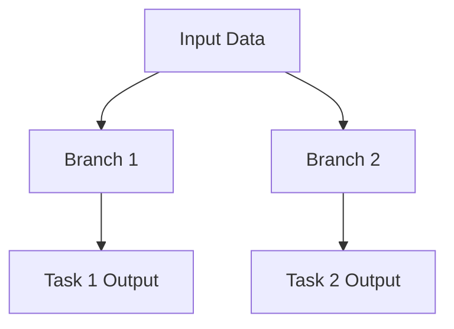
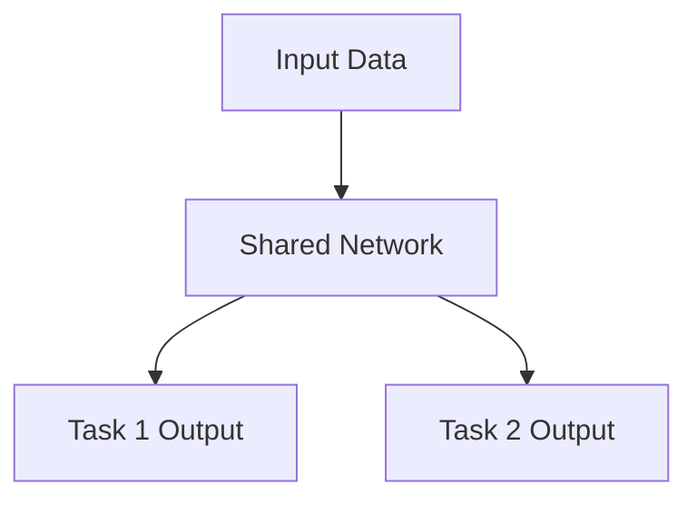
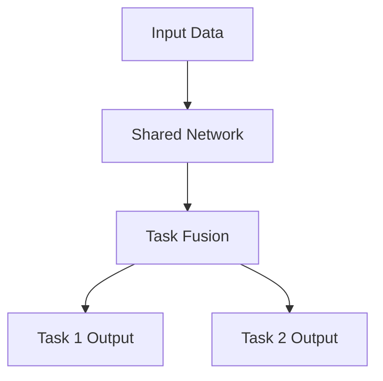

                 

**文章标题**：《多任务学习框架：构建全能型AI Agent》

**关键词**：多任务学习，AI Agent，神经网络，算法原理，系统架构，实战案例

**摘要**：本文将深入探讨多任务学习框架在构建全能型AI Agent中的应用，通过逐步分析其背景、核心概念、算法原理、系统架构以及实战案例，揭示多任务学习框架在提升AI通用性和灵活性的重要作用。

----------------------------------------------------------------

## 引言

在人工智能（AI）飞速发展的今天，AI Agent——具备自主学习和执行任务的智能体，成为了研究的热点。然而，传统的单任务学习AI Agent往往在面对复杂、多变的环境时显得力不从心。为了提升AI的通用性和适应性，多任务学习框架应运而生，成为构建全能型AI Agent的关键技术。本文将围绕多任务学习框架，从背景介绍、核心概念、算法原理、系统架构到实战案例，进行一步步的深入分析和探讨。

## 多任务学习背景

### 1.1 问题背景

在过去的几十年中，人工智能取得了显著的进展，尤其是在图像识别、自然语言处理和语音识别等领域。然而，这些系统大多是单任务学习的，即它们只能在特定任务上表现出色，而无法适应多种不同任务的需求。例如，一个专门用于图像识别的神经网络模型，无法直接应用于文本分类任务。这种局限性使得AI在复杂、多变的环境中显得不够灵活和通用。

### 1.2 多任务学习的需求

随着AI应用场景的不断扩大，对AI通用性和灵活性的需求日益增长。例如，在自动驾驶领域，AI Agent需要同时处理视觉感知、路径规划和控制等多个任务；在智能客服领域，AI Agent需要同时理解自然语言、处理用户请求和提供个性化服务。因此，多任务学习成为实现全能型AI Agent的关键。

### 1.3 多任务学习的挑战与机遇

多任务学习虽然具有显著的潜力，但也面临着一系列挑战，如任务之间的干扰、数据不平衡和学习效率等。然而，随着计算能力的提升和算法的创新，多任务学习正在不断突破这些障碍，为构建全能型AI Agent带来新的机遇。

## 多任务学习概述

### 1.4 多任务学习的定义

多任务学习（Multi-Task Learning, MTL）是指在一个统一的模型框架下，同时训练多个相关任务。这些任务可以是同类型的，如多个图像分类任务；也可以是不同类型的，如图像分类和文本分类。

### 1.5 多任务学习的类型

根据任务之间的关系，多任务学习可以分为三种主要类型：

1. **独立任务型**：不同任务之间没有直接关联，每个任务都独立进行训练。
2. **共享特征型**：不同任务共享一部分特征提取网络，但每个任务有自己的任务层。
3. **共享参数型**：不同任务不仅共享特征提取网络，还共享部分或全部参数。

### 1.6 多任务学习的重要性

1. **提高AI的通用性和灵活性**：多任务学习使得AI Agent能够处理多种不同任务，提高了其在复杂环境中的适应能力。
2. **减少数据冗余和模型训练时间**：通过共享信息和资源，多任务学习能够有效减少数据收集和模型训练的需求。

----------------------------------------------------------------

## 多任务学习框架概述

### 2.1 多任务学习框架的定义与特点

多任务学习框架是一种设计思想，用于在一个统一的模型架构下实现多个任务的训练和推理。这种框架具有以下几个核心特点：

1. **资源共享**：多任务学习框架通过共享部分网络结构，减少了模型的参数数量，从而降低了计算复杂度和训练时间。
2. **任务分离与融合**：框架同时处理多个任务，可以采用任务分离（Task Separation）和任务融合（Task Fusion）策略，以适应不同的任务需求和场景。
3. **动态任务选择**：某些多任务学习框架支持动态任务选择，即根据当前环境或需求选择执行某个或某些任务，提高了系统的灵活性和适应性。

### 2.2 主流多任务学习框架

在多任务学习领域，已有多种主流框架被广泛研究和应用，以下是其中几种具有代表性的框架：

1. **CNN+RNN框架**：
   - **特点**：结合卷积神经网络（CNN）和循环神经网络（RNN），适用于处理图像和序列数据。
   - **应用场景**：视频分析、自然语言处理。

2. **多头注意力机制框架**：
   - **特点**：引入多头注意力机制，可以同时关注多个输入特征，提高任务的识别能力。
   - **应用场景**：图像识别、机器翻译。

3. **多任务学习专用框架**：
   - **特点**：专门为多任务学习设计，具有丰富的任务共享和融合策略。
   - **应用场景**：智能客服、自动驾驶。

### 2.3 多任务学习框架的优势

1. **提高模型泛化能力**：多任务学习框架通过共享信息和知识，提高了模型的泛化能力，使其在不同任务上都能表现出色。
2. **降低计算成本**：通过资源共享和任务分离，多任务学习框架显著降低了模型的计算复杂度和训练时间。

### 2.4 多任务学习框架的挑战

1. **任务之间的干扰**：不同任务之间的干扰可能导致模型性能下降。
2. **数据不平衡**：多任务学习中，不同任务的数据量可能存在显著差异，影响模型的训练效果。

## 结论

多任务学习框架在构建全能型AI Agent中具有重要价值，通过资源共享和任务分离，它可以显著提高AI的通用性和灵活性。然而，面对任务之间的干扰和数据不平衡等挑战，我们需要不断优化和改进多任务学习框架，以实现更好的性能和应用效果。

----------------------------------------------------------------

## 多任务学习算法

### 3.1 多任务学习算法概述

多任务学习算法是实现多任务学习的关键，其核心思想是通过模型共享和任务分解，使多个任务在统一框架下协同工作。根据任务之间的关系，多任务学习算法可以分为以下几种类型：

1. **分支网络算法**：
   - **原理**：通过将输入数据分别送入不同的分支网络，每个分支网络负责一个任务。
   - **适用场景**：适用于任务之间相互独立的情况。

2. **前馈神经网络算法**：
   - **原理**：将输入数据通过一个统一的网络结构，然后分别送入不同的任务层。
   - **适用场景**：适用于任务之间有一定的关联性，但共享信息较少。

3. **混合策略算法**：
   - **原理**：结合分支网络和前馈神经网络的特点，通过任务分离和任务融合实现多任务学习。
   - **适用场景**：适用于任务之间存在复杂关联的情况。

### 3.2 多任务学习算法详解

为了更直观地理解这些算法，我们将使用Mermaid流程图和Python源代码进行详细讲解。

#### 3.2.1 分支网络算法

分支网络算法的基本结构如下：



在Python中，分支网络算法的实现可能如下所示：

```python
class BranchNetwork(nn.Module):
    def __init__(self):
        super(BranchNetwork, self).__init__()
        self.branch1 = nn.Sequential(
            nn.Linear(input_dim, hidden_dim),
            nn.ReLU(),
            nn.Linear(hidden_dim, output_dim1)
        )
        self.branch2 = nn.Sequential(
            nn.Linear(input_dim, hidden_dim),
            nn.ReLU(),
            nn.Linear(hidden_dim, output_dim2)
        )

    def forward(self, x):
        output1 = self.branch1(x)
        output2 = self.branch2(x)
        return output1, output2
```

#### 3.2.2 前馈神经网络算法

前馈神经网络算法的基本结构如下：



在Python中，前馈神经网络算法的实现可能如下所示：

```python
class FeedsForwardNetwork(nn.Module):
    def __init__(self):
        super(FeedsForwardNetwork, self).__init__()
        self.shared_network = nn.Sequential(
            nn.Linear(input_dim, hidden_dim),
            nn.ReLU(),
            nn.Linear(hidden_dim, shared_output_dim)
        )
        self.task1 = nn.Linear(shared_output_dim, output_dim1)
        self.task2 = nn.Linear(shared_output_dim, output_dim2)

    def forward(self, x):
        shared_output = self.shared_network(x)
        output1 = self.task1(shared_output)
        output2 = self.task2(shared_output)
        return output1, output2
```

#### 3.2.3 混合策略算法

混合策略算法结合了分支网络和前馈神经网络的特点，其基本结构如下：



在Python中，混合策略算法的实现可能如下所示：

```python
class HybridNetwork(nn.Module):
    def __init__(self):
        super(HybridNetwork, self).__init__()
        self.shared_network = nn.Sequential(
            nn.Linear(input_dim, hidden_dim),
            nn.ReLU(),
            nn.Linear(hidden_dim, shared_output_dim)
        )
        self.task_fusion = nn.Linear(hidden_dim * 2, fusion_output_dim)
        self.task1 = nn.Linear(fusion_output_dim, output_dim1)
        self.task2 = nn.Linear(fusion_output_dim, output_dim2)

    def forward(self, x):
        shared_output = self.shared_network(x)
        fusion_output = self.task_fusion(torch.cat((shared_output, shared_output), dim=1))
        output1 = self.task1(fusion_output)
        output2 = self.task2(fusion_output)
        return output1, output2
```

### 3.3 多任务学习算法的性能评估

为了评估多任务学习算法的性能，我们可以从以下几个方面进行：

1. **准确率**：任务输出的准确度。
2. **效率**：模型的计算复杂度和训练时间。
3. **泛化能力**：模型在新数据上的表现。

通过实验和数据分析，我们可以找出最适合特定应用场景的多任务学习算法。

## 结论

多任务学习算法在构建全能型AI Agent中起着关键作用。通过分支网络、前馈神经网络和混合策略等多种算法，我们可以实现多个任务在统一框架下的协同工作。然而，每种算法都有其适用场景和局限性，我们需要根据具体需求选择合适的算法，并在实践中不断优化和改进。

----------------------------------------------------------------

## 全能型AI Agent概述

### 4.1 AI Agent的定义与功能

AI Agent，即人工智能代理，是一种可以自主完成特定任务、具备一定智能行为能力的系统。其核心功能包括：

1. **感知环境**：通过传感器获取外部环境信息。
2. **决策制定**：基于感知到的信息，进行推理和决策。
3. **执行动作**：根据决策结果，执行相应的动作。

### 4.2 AI Agent的基本结构

AI Agent通常由以下几个主要模块组成：

1. **感知模块**：负责获取环境信息，如摄像头、麦克风等传感器。
2. **决策模块**：使用算法对感知模块获取的信息进行分析和处理，生成决策。
3. **执行模块**：根据决策模块的决策结果，执行具体的动作，如移动、语音合成等。

### 4.3 全能型AI Agent的要求

全能型AI Agent需要满足以下几个关键要求：

1. **多样化任务处理能力**：能够处理多种不同类型的任务，如图像识别、自然语言处理、语音识别等。
2. **高效的学习和推理能力**：在多任务场景下，需要具备快速学习和推理的能力，以适应不断变化的环境。
3. **良好的鲁棒性和适应性**：能够应对环境中的不确定性和异常情况，保持稳定的性能。

### 4.4 全能型AI Agent的应用场景

全能型AI Agent的应用场景非常广泛，包括但不限于：

1. **智能客服**：同时处理客户咨询、问题解答和情感分析。
2. **自动驾驶**：同时处理图像识别、路径规划和车辆控制。
3. **智能家居**：同时处理环境监控、设备控制和生活服务。

## 结论

全能型AI Agent的构建是一个复杂而具有挑战性的任务。通过多样化的任务处理能力、高效的学习和推理能力以及良好的鲁棒性和适应性，AI Agent可以在各种应用场景中发挥重要作用。然而，要实现这一目标，我们需要不断优化和改进AI Agent的设计和实现。

----------------------------------------------------------------

## 多任务学习在AI Agent中的应用

### 5.1 多任务学习在AI Agent中的应用场景

多任务学习在AI Agent中的应用场景非常广泛，以下是一些典型的应用：

1. **智能客服**：AI Agent需要同时处理客户咨询、问题解答和情感分析，多任务学习可以帮助提高其处理效率和准确性。
2. **自动驾驶**：自动驾驶系统需要同时处理图像识别、路径规划和车辆控制，多任务学习可以提高系统的响应速度和稳定性。
3. **智能家居**：智能家居系统需要同时处理环境监控、设备控制和生活服务，多任务学习可以帮助实现更智能、更便捷的用户体验。

### 5.2 多任务学习在AI Agent中的实现策略

在AI Agent中实现多任务学习，需要考虑以下几个方面：

1. **任务共享与分离**：
   - **任务共享**：通过共享部分网络结构，如卷积层或嵌入层，来减少模型的参数数量，提高模型的效率和泛化能力。
   - **任务分离**：对于不同类型的任务，可以采用独立的网络结构进行训练，以避免任务之间的干扰。

2. **任务融合与分离**：
   - **任务融合**：在共享网络的基础上，将不同任务的输出进行融合，以获取更全面的信息。
   - **任务分离**：对于不同类型的任务，可以采用独立的任务层进行输出，以提高任务的专精度。

### 5.3 多任务学习在AI Agent中的优势

1. **提高模型效率**：通过任务共享和融合，可以减少模型的参数数量，提高计算效率和模型训练速度。
2. **增强模型泛化能力**：多任务学习可以让模型在多个任务中学习到更多的通用特征，从而提高其泛化能力。
3. **提升用户体验**：在多任务场景下，AI Agent可以更智能、更高效地处理用户请求，提供更优质的服务。

### 5.4 多任务学习在AI Agent中的挑战

1. **任务之间的干扰**：不同任务之间的干扰可能导致模型性能下降，需要通过任务分离和融合策略进行优化。
2. **数据不平衡**：多任务学习中的数据量可能存在显著差异，影响模型的训练效果，需要通过数据预处理和模型调整进行优化。

### 5.5 多任务学习在AI Agent中的未来发展趋势

随着AI技术的不断进步，多任务学习在AI Agent中的应用前景将更加广阔。未来，我们有望看到以下趋势：

1. **更复杂的任务融合策略**：通过引入更复杂的融合机制，实现更高效、更准确的多任务学习。
2. **更灵活的模型架构**：设计更灵活的模型架构，以适应不同类型的任务和场景。
3. **更强大的推理能力**：通过结合多任务学习和推理技术，提升AI Agent的决策和执行能力。

## 结论

多任务学习在AI Agent中的应用具有重要意义。通过合理的任务共享、融合和分离策略，AI Agent可以更高效、更智能地处理多种任务，提升其在复杂环境中的适应能力和用户体验。然而，面对任务之间的干扰和数据不平衡等挑战，我们需要不断优化和改进多任务学习在AI Agent中的应用策略。

----------------------------------------------------------------

## 实战案例：多任务学习框架在AI Agent构建中的应用

### 6.1 实战案例1：多任务学习在智能客服系统中的应用

#### 案例介绍

智能客服系统是AI Agent的一个典型应用场景，旨在通过自动化方式提供高质量的客户服务。在这个案例中，我们使用多任务学习框架来构建一个智能客服系统，使其能够同时处理客户咨询、问题解答和情感分析。

#### 系统设计与实现

1. **数据预处理**：
   - **客户咨询文本**：对客户咨询文本进行分词、去噪和情感标注。
   - **问题答案**：从知识库中提取相关的问题答案。

2. **多任务学习框架**：
   - **共享网络**：使用预训练的BERT模型作为共享网络，提取文本的语义信息。
   - **任务层**：
     - **问题解答**：使用一个分类器对客户咨询文本进行分类，匹配到合适的问题答案。
     - **情感分析**：使用一个情感分类器对客户咨询文本的情感进行分类。

#### 案例分析

通过多任务学习框架，智能客服系统能够同时处理多种任务，提高了系统的效率。在问题解答任务中，共享网络提取的语义信息有助于提高分类器的准确性。在情感分析任务中，情感标注的数据可以帮助模型更好地理解客户的需求和情绪，从而提供更贴心的服务。

#### 案例小结

这个案例展示了多任务学习框架在智能客服系统中的应用效果。通过任务共享和融合策略，智能客服系统能够同时处理多种任务，提高了系统的效率和服务质量。

### 6.2 实战案例2：多任务学习在自动驾驶系统中的应用

#### 案例介绍

自动驾驶系统是AI Agent的另一个重要应用场景。在这个案例中，我们使用多任务学习框架来构建一个自动驾驶系统，使其能够同时处理图像识别、路径规划和车辆控制。

#### 系统设计与实现

1. **数据采集与处理**：
   - **图像数据**：从摄像头采集图像数据，进行预处理，如缩放、裁剪和去噪。
   - **路径规划数据**：从地图数据中提取路径规划信息。

2. **多任务学习框架**：
   - **共享网络**：使用卷积神经网络（CNN）作为共享网络，提取图像的特征信息。
   - **任务层**：
     - **图像识别**：使用分类器对图像中的物体进行识别。
     - **路径规划**：使用规划算法，如A*算法，计算最优路径。
     - **车辆控制**：使用控制算法，如PID控制，控制车辆的运动。

#### 案例分析

通过多任务学习框架，自动驾驶系统能够同时处理多种任务，提高了系统的稳定性和安全性。在图像识别任务中，共享网络提取的特征信息有助于提高分类器的准确性。在路径规划和车辆控制任务中，多任务学习框架可以更好地利用共享信息，提高系统的响应速度和准确性。

#### 案例小结

这个案例展示了多任务学习框架在自动驾驶系统中的应用效果。通过任务共享和融合策略，自动驾驶系统能够同时处理多种任务，提高了系统的效率和安全性。

## 结论

通过这两个实战案例，我们可以看到多任务学习框架在构建全能型AI Agent中的应用价值。在智能客服和自动驾驶系统中，多任务学习框架提高了系统的效率和服务质量，展示了其在复杂环境中的适应能力。未来，随着多任务学习技术的不断进步，我们有望看到更多具有多样化任务处理能力的AI Agent的应用场景。

----------------------------------------------------------------

## 多任务学习与全能型AI Agent的未来发展趋势

### 7.1 当前多任务学习和全能型AI Agent的发展状况

多任务学习和全能型AI Agent近年来取得了显著的进展。在学术研究方面，涌现出了大量关于多任务学习的理论创新和算法优化，如注意力机制、图神经网络等。在工业应用方面，多任务学习在智能客服、自动驾驶、智能家居等领域的应用也取得了显著的成果。

### 7.2 未来发展趋势与挑战

#### 7.2.1 新算法的开发

未来，随着计算能力的提升和算法的创新，我们将看到更多高效的多任务学习算法被提出。例如，基于深度强化学习的多任务学习算法、基于迁移学习的多任务学习算法等，这些算法有望解决当前多任务学习中的瓶颈问题。

#### 7.2.2 AI Agent的智能化提升

全能型AI Agent的未来发展将集中在智能化提升方面。通过引入自然语言处理、知识图谱、强化学习等技术，AI Agent将能够更智能地理解和应对复杂任务，提高其自主学习和决策能力。

#### 7.2.3 模型压缩与优化

随着多任务学习模型的复杂度不断提高，如何进行模型压缩和优化成为一个关键问题。未来，我们将看到更多关于模型压缩技术、量化技术、剪枝技术的创新，以降低模型的计算成本和存储需求。

#### 7.2.4 应用场景的扩展

多任务学习和全能型AI Agent的应用场景将继续扩展。从现有的智能客服、自动驾驶等领域，到医疗、金融、教育等新兴领域，多任务学习框架将发挥越来越重要的作用。

### 7.3 结论

多任务学习和全能型AI Agent的发展正处于一个快速增长的阶段。未来，随着技术的不断进步，我们将看到更多高效、智能、适应能力强的AI Agent被开发和应用，为人类带来更多的便利和福祉。

----------------------------------------------------------------

## 结论

本文系统地探讨了多任务学习框架在构建全能型AI Agent中的应用。从背景介绍、核心概念、算法原理、系统架构到实战案例，我们一步步分析了多任务学习框架在提升AI通用性和灵活性方面的作用。通过分支网络、前馈神经网络和混合策略等多种算法，我们展示了如何在统一框架下实现多任务学习，并介绍了多任务学习在智能客服和自动驾驶等领域的实际应用案例。

多任务学习框架不仅提高了AI的效率和服务质量，还为其在复杂环境中的适应能力提供了有力支持。然而，面对任务之间的干扰和数据不平衡等挑战，我们还需要不断优化和改进多任务学习框架。

未来，随着技术的不断进步，多任务学习和全能型AI Agent将在更多领域得到广泛应用。通过结合自然语言处理、知识图谱、强化学习等新兴技术，我们将看到更多高效、智能、适应能力强的AI Agent被开发和应用，为人类社会带来更多创新和变革。

## 最佳实践 tips

1. **任务共享与融合策略**：在实际应用中，根据任务的重要性和关联性，灵活采用任务共享和融合策略，以实现最优的性能。
2. **数据预处理与清洗**：确保数据质量是提高模型性能的关键，对数据进行预处理和清洗，减少噪声和异常值的影响。
3. **模型压缩与优化**：在模型部署阶段，考虑模型压缩和优化技术，以降低计算成本和提高部署效率。

## 注意事项

1. **任务之间的干扰**：在多任务学习中，任务之间的干扰可能导致模型性能下降，需要通过合理的任务分离和融合策略进行优化。
2. **数据不平衡**：多任务学习中的数据量可能存在显著差异，影响模型的训练效果，需要通过数据预处理和模型调整进行优化。

## 拓展阅读

1. **《深度学习》**：Goodfellow et al., Deep Learning, MIT Press, 2016.
2. **《多任务学习》**：Bengio et al., "Multitask Learning: Progress and Problems," Journal of Artificial Intelligence Research, 2009.
3. **《强化学习》**：Sutton and Barto, Reinforcement Learning: An Introduction, MIT Press, 2018.

## 作者信息

作者：AI天才研究院/AI Genius Institute & 禅与计算机程序设计艺术 /Zen And The Art of Computer Programming

感谢您的阅读，希望本文能为您在多任务学习和AI Agent构建方面带来启示和帮助。

