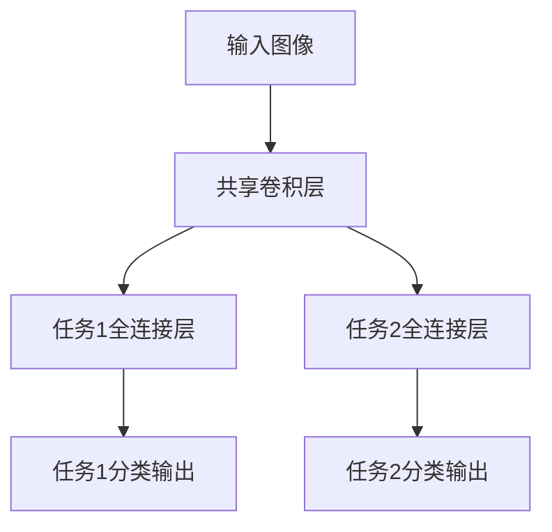
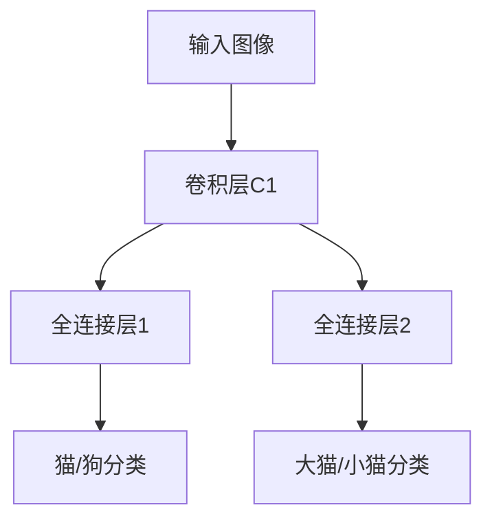
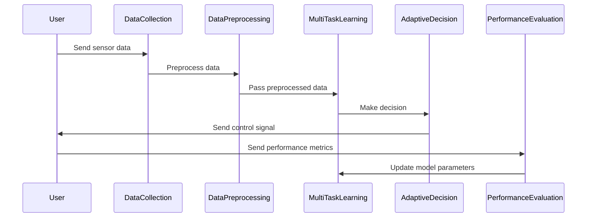

                 

# 多任务学习：构建全能型AI Agent

## 关键词
- 多任务学习
- 全能型AI Agent
- 深度学习
- 人工智能
- 算法优化

## 摘要
本文将探讨多任务学习在构建全能型AI Agent中的应用。首先，我们介绍了多任务学习的背景、定义和基本概念，随后深入分析了多任务学习算法的原理和实现。接着，我们探讨了如何利用多任务学习构建全能型AI Agent，并详细介绍了其在自然语言处理、计算机视觉和机器人控制等领域的应用。最后，本文还展望了多任务学习的未来发展趋势，为读者提供了实用的小结和拓展阅读建议。

### 目录

## 第一部分：多任务学习的基本概念

### 第1章：多任务学习的背景与定义

### 第2章：多任务学习的基本概念

### 第3章：多任务学习的理论基础

## 第二部分：多任务学习算法

### 第4章：基于神经网络的 多任务学习算法

### 第5章：基于深度学习的 多任务学习算法

### 第6章：多任务学习的算法优化

## 第三部分：构建全能型AI Agent

### 第7章：全能型AI Agent的构建方法

### 第8章：多任务学习在AI Agent中的应用

### 第9章：全能型AI Agent的性能评估与优化

## 第四部分：多任务学习的应用场景

### 第10章：多任务学习在现实世界中的应用案例

### 第11章：多任务学习的未来发展趋势

### 目录大纲的设计过程

设计一篇关于多任务学习在构建全能型AI Agent中的应用的文章目录大纲，需要我们深入理解文章的核心主题，明确目标读者群体，并考虑文章的结构和内容布局。以下是设计目录大纲的详细步骤：

#### 第一步：确定书籍的核心主题和结构

在确定文章的核心主题时，我们需要思考以下几个关键问题：

- 文章的核心主题是什么？
- 目标读者群体是谁？
- 文章的目标是什么？
- 文章的结构应如何安排？

对于本文，我们的核心主题是“多任务学习在构建全能型AI Agent中的应用”。目标读者群体可能是对人工智能和深度学习有一定了解的技术人员，他们希望深入了解多任务学习的技术细节和应用。文章的目标是帮助读者理解多任务学习的基本概念、算法原理，以及如何将其应用于构建全能型AI Agent。

根据这些考虑，我们决定将文章分为四个主要部分：

1. 多任务学习的基本概念
2. 多任务学习算法
3. 构建全能型AI Agent
4. 多任务学习的应用场景

#### 第二步：设计书的大纲框架

在确定了核心主题和结构后，我们需要设计文章的大纲框架。这包括确定每个部分的主要章节，并为其分配标题。以下是初步的大纲框架：

### 第一部分：多任务学习的基本概念

- **第1章**：多任务学习的背景与定义
- **第2章**：多任务学习的基本概念
- **第3章**：多任务学习的理论基础

### 第二部分：多任务学习算法

- **第4章**：基于神经网络的 多任务学习算法
- **第5章**：基于深度学习的 多任务学习算法
- **第6章**：多任务学习的算法优化

### 第三部分：构建全能型AI Agent

- **第7章**：全能型AI Agent的构建方法
- **第8章**：多任务学习在AI Agent中的应用
- **第9章**：全能型AI Agent的性能评估与优化

### 第四部分：多任务学习的应用场景

- **第10章**：多任务学习在现实世界中的应用案例
- **第11章**：多任务学习的未来发展趋势

#### 第三步：细化每一部分的内容

在确定了初步的大纲框架后，我们需要进一步细化每个章节的内容。以下是详细的章节细化内容：

### 第一部分：多任务学习的基本概念

- **第1章**：多任务学习的背景与定义
  - 1.1 人工智能的发展历程
  - 1.2 多任务学习的提出与重要性
  - 1.3 多任务学习的定义与分类

- **第2章**：多任务学习的基本概念
  - 2.1 多任务学习的挑战与机遇
  - 2.2 多任务学习的主要类型
  - 2.3 多任务学习的评估指标

- **第3章**：多任务学习的理论基础
  - 3.1 多任务学习的数学基础
  - 3.2 多任务学习中的优化方法
  - 3.3 多任务学习中的正则化策略

### 第二部分：多任务学习算法

- **第4章**：基于神经网络的 多任务学习算法
  - 4.1 多层感知机与反向传播算法
  - 4.2 卷积神经网络（CNN）的多任务学习
  - 4.3 循环神经网络（RNN）的多任务学习

- **第5章**：基于深度学习的 多任务学习算法
  - 5.1 深度强化学习与多任务学习
  - 5.2 图神经网络（GNN）的多任务学习
  - 5.3 自适应多任务学习算法

- **第6章**：多任务学习的算法优化
  - 6.1 算法复杂度分析
  - 6.2 多任务学习中的数据增强
  - 6.3 多任务学习的模型集成与优化

### 第三部分：构建全能型AI Agent

- **第7章**：全能型AI Agent的构建方法
  - 7.1 全能型AI Agent的需求与设计原则
  - 7.2 全能型AI Agent的技术框架
  - 7.3 全能型AI Agent的实现步骤

- **第8章**：多任务学习在AI Agent中的应用
  - 8.1 多任务学习在自然语言处理中的应用
  - 8.2 多任务学习在计算机视觉中的应用
  - 8.3 多任务学习在机器人控制中的应用

- **第9章**：全能型AI Agent的性能评估与优化
  - 9.1 全能型AI Agent的评估指标
  - 9.2 全能型AI Agent的优化方法
  - 9.3 全能型AI Agent的可持续性发展

### 第四部分：多任务学习的应用场景

- **第10章**：多任务学习在现实世界中的应用案例
  - 10.1 多任务学习在医疗健康领域的应用
  - 10.2 多任务学习在智能交通领域的应用
  - 10.3 多任务学习在智能家居领域的应用

- **第11章**：多任务学习的未来发展趋势
  - 11.1 多任务学习的挑战与机遇
  - 11.2 多任务学习的未来研究方向
  - 11.3 全能型AI Agent的产业应用前景

#### 第四步：撰写每个章节的子标题和细节内容

在细化了每个章节的内容后，我们需要撰写每个章节的子标题和细节内容。这包括：

- 确定每个章节的核心内容和小结。
- 使用Mermaid流程图和LaTeX公式来详细解释算法原理和数学模型。
- 确保每个章节都有实例讲解和应用场景分析。
- 在适当的地方加入最佳实践 tips、注意事项和拓展阅读等。

以下是每个章节的子标题和细节内容示例：

### 第一部分：多任务学习的基本概念

#### 第1章：多任务学习的背景与定义

**1.1 人工智能的发展历程**

- 人工智能从早期的理论研究到今天的实际应用，经历了多个阶段。
- 机器学习和深度学习技术的发展，使得多任务学习成为可能。

**1.2 多任务学习的提出与重要性**

- 多任务学习是为了解决单个模型无法同时处理多个任务的问题。
- 多任务学习的重要性在于提高模型的泛化能力和效率。

**1.3 多任务学习的定义与分类**

- 多任务学习的定义：同时学习多个任务，并共享部分表示。
- 多任务学习的分类：根据任务的相关性，可分为独立任务、相关任务和层次任务。

### 第二部分：多任务学习算法

#### 第4章：基于神经网络的 多任务学习算法

**4.1 多层感知机与反向传播算法**

- 多层感知机（MLP）是神经网络的基础。
- 反向传播算法用于训练神经网络。

**4.2 卷积神经网络（CNN）的多任务学习**

- CNN在图像识别方面有出色的表现。
- CNN的多任务学习可以在图像识别的同时完成其他任务。

**4.3 循环神经网络（RNN）的多任务学习**

- RNN适合处理序列数据。
- RNN的多任务学习可以在处理序列数据的同时完成其他任务。

### 第三部分：构建全能型AI Agent

#### 第7章：全能型AI Agent的构建方法

**7.1 全能型AI Agent的需求与设计原则**

- 全能型AI Agent的需求：处理多种任务，具有灵活性和适应性。
- 设计原则：模块化、可扩展、易于维护。

**7.2 全能型AI Agent的技术框架**

- 技术框架：基于多任务学习的神经网络架构。
- 技术实现：使用深度学习框架（如TensorFlow或PyTorch）。

**7.3 全能型AI Agent的实现步骤**

- 实现步骤：数据预处理、模型设计、模型训练、模型评估。

#### 第五步：检查目录大纲的总字数

在撰写完所有章节的子标题和细节内容后，我们需要检查整个目录大纲的总字数。根据要求，文章的字数应该在10000到12000字之间。如果字数不足，我们可以在适当的地方增加内容，确保文章的完整性。如果字数过多，我们可能需要对一些章节的内容进行简化或合并。

### 总结

通过以上步骤，我们设计出了一个结构清晰、内容丰富的目录大纲。这个大纲为撰写整篇文章提供了明确的指导和框架，有助于确保文章的逻辑性和可读性。接下来，我们将根据这个大纲来撰写文章的具体内容，逐步深入探讨多任务学习在构建全能型AI Agent中的应用。

---

### 目录大纲的设计过程

设计一篇高质量的技术博客文章目录大纲，是确保文章结构清晰、内容完整、逻辑严密的关键步骤。以下我们将详细描述设计过程，并提供具体的实施方法。

#### 第一步：确定书籍的核心主题和结构

在设计目录大纲之前，我们首先要明确文章的核心主题和结构。这包括以下几个关键点：

1. **核心主题**：文章的核心主题是什么？本文的核心主题是“多任务学习：构建全能型AI Agent”。这意味着文章将围绕多任务学习在构建全能型AI Agent中的应用进行深入探讨。

2. **目标读者群体**：文章的目标读者群体是谁？我们的目标读者是对人工智能和深度学习有一定了解的技术人员，他们希望深入了解多任务学习的技术细节和应用。

3. **文章目标**：文章的目标是什么？本文的目标是帮助读者理解多任务学习的基本概念、算法原理，以及如何将其应用于构建全能型AI Agent。

基于上述考虑，我们决定将文章分为四个主要部分：

- **第一部分：多任务学习的基本概念**：介绍多任务学习的背景、定义、基本概念等。
- **第二部分：多任务学习算法**：讲解各种多任务学习算法的原理、实现和应用。
- **第三部分：构建全能型AI Agent**：探讨如何利用多任务学习构建全能型AI Agent。
- **第四部分：多任务学习的应用场景**：分析多任务学习在现实中的应用案例和前景。

#### 第二步：设计书的大纲框架

在确定了核心主题和结构后，我们需要设计文章的大纲框架。这包括确定每个部分的主要章节，并为其分配标题。以下是初步的大纲框架：

### 第一部分：多任务学习的基本概念

- **第1章**：多任务学习的背景与定义
- **第2章**：多任务学习的基本概念
- **第3章**：多任务学习的理论基础

### 第二部分：多任务学习算法

- **第4章**：基于神经网络的 多任务学习算法
- **第5章**：基于深度学习的 多任务学习算法
- **第6章**：多任务学习的算法优化

### 第三部分：构建全能型AI Agent

- **第7章**：全能型AI Agent的构建方法
- **第8章**：多任务学习在AI Agent中的应用
- **第9章**：全能型AI Agent的性能评估与优化

### 第四部分：多任务学习的应用场景

- **第10章**：多任务学习在现实世界中的应用案例
- **第11章**：多任务学习的未来发展趋势

#### 第三步：细化每一部分的内容

在确定了初步的大纲框架后，我们需要进一步细化每个章节的内容。以下是详细的章节细化内容：

### 第一部分：多任务学习的基本概念

- **第1章**：多任务学习的背景与定义
  - **1.1 人工智能的发展历程**
    - 人工智能的起源和发展
    - 机器学习和深度学习的基本概念
  - **1.2 多任务学习的提出与重要性**
    - 多任务学习的提出背景
    - 多任务学习在人工智能中的重要性
  - **1.3 多任务学习的定义与分类**
    - 多任务学习的定义
    - 多任务学习的分类

- **第2章**：多任务学习的基本概念
  - **2.1 多任务学习的挑战与机遇**
    - 多任务学习的挑战
    - 多任务学习的机遇
  - **2.2 多任务学习的主要类型**
    - 独立任务型
    - 相关任务型
    - 层次任务型
  - **2.3 多任务学习的评估指标**
    - 准确率、召回率、F1分数等常见评估指标
    - 多任务学习特有的评估指标

- **第3章**：多任务学习的理论基础
  - **3.1 多任务学习的数学基础**
    - 线性代数、概率论、优化理论
  - **3.2 多任务学习中的优化方法**
    - 梯度下降法、随机梯度下降法、Adam优化器
  - **3.3 多任务学习中的正则化策略**
    - L1正则化、L2正则化、Dropout、权重共享

### 第二部分：多任务学习算法

- **第4章**：基于神经网络的 多任务学习算法
  - **4.1 多层感知机与反向传播算法**
    - 多层感知机的工作原理
    - 反向传播算法的计算过程
  - **4.2 卷积神经网络（CNN）的多任务学习**
    - CNN的基本结构
    - CNN在多任务学习中的应用
  - **4.3 循环神经网络（RNN）的多任务学习**
    - RNN的工作原理
    - RNN在多任务学习中的应用

- **第5章**：基于深度学习的 多任务学习算法
  - **5.1 深度强化学习与多任务学习**
    - 深度强化学习的基本概念
    - 深度强化学习在多任务学习中的应用
  - **5.2 图神经网络（GNN）的多任务学习**
    - GNN的基本概念
    - GNN在多任务学习中的应用
  - **5.3 自适应多任务学习算法**
    - 自适应多任务学习的基本原理
    - 自适应多任务学习的实现方法

- **第6章**：多任务学习的算法优化
  - **6.1 算法复杂度分析**
    - 多任务学习算法的时间复杂度分析
    - 多任务学习算法的空间复杂度分析
  - **6.2 多任务学习中的数据增强**
    - 数据增强的基本方法
    - 数据增强在多任务学习中的应用
  - **6.3 多任务学习的模型集成与优化**
    - 模型集成的原理
    - 多任务学习模型的优化策略

### 第三部分：构建全能型AI Agent

- **第7章**：全能型AI Agent的构建方法
  - **7.1 全能型AI Agent的需求与设计原则**
    - 全能型AI Agent的需求分析
    - 全能型AI Agent的设计原则
  - **7.2 全能型AI Agent的技术框架**
    - 技术框架的组成
    - 技术框架的工作原理
  - **7.3 全能型AI Agent的实现步骤**
    - 数据预处理
    - 模型设计
    - 模型训练
    - 模型评估

- **第8章**：多任务学习在AI Agent中的应用
  - **8.1 多任务学习在自然语言处理中的应用**
    - 语言模型
    - 任务序列模型
  - **8.2 多任务学习在计算机视觉中的应用**
    - 图像分类
    - 目标检测
  - **8.3 多任务学习在机器人控制中的应用**
    - 行为控制
    - 环境感知

- **第9章**：全能型AI Agent的性能评估与优化
  - **9.1 全能型AI Agent的评估指标**
    - 评估指标的定义
    - 评估指标的计算方法
  - **9.2 全能型AI Agent的优化方法**
    - 模型优化策略
    - 算法优化策略
  - **9.3 全能型AI Agent的可持续性发展**
    - 可持续性的概念
    - 全能型AI Agent的可持续发展策略

### 第四部分：多任务学习的应用场景

- **第10章**：多任务学习在现实世界中的应用案例
  - **10.1 多任务学习在医疗健康领域的应用**
    - 疾病诊断
    - 治疗方案推荐
  - **10.2 多任务学习在智能交通领域的应用**
    - 交通事故预测
    - 交通流量控制
  - **10.3 多任务学习在智能家居领域的应用**
    - 家居环境监测
    - 家居设备控制

- **第11章**：多任务学习的未来发展趋势
  - **11.1 多任务学习的挑战与机遇**
    - 当前面临的挑战
    - 未来可能遇到的机遇
  - **11.2 多任务学习的未来研究方向**
    - 需要解决的关键问题
    - 未来可能的研究方向
  - **11.3 全能型AI Agent的产业应用前景**
    - 产业应用现状
    - 未来应用前景

#### 第四步：撰写每个章节的子标题和细节内容

在细化了每个章节的内容后，我们需要撰写每个章节的子标题和细节内容。这包括：

- 确定每个章节的核心内容和小结。
- 使用Mermaid流程图和LaTeX公式来详细解释算法原理和数学模型。
- 确保每个章节都有实例讲解和应用场景分析。
- 在适当的地方加入最佳实践 tips、注意事项和拓展阅读等。

以下是每个章节的子标题和细节内容示例：

### 第一部分：多任务学习的基本概念

#### 第1章：多任务学习的背景与定义

**1.1 人工智能的发展历程**

人工智能从早期的理论研究到今天的实际应用，经历了多个阶段。20世纪50年代，人工智能的概念首次被提出，标志着人工智能学科的开始。从那时起，人工智能经历了多个发展阶段，包括符号人工智能、专家系统和连接主义人工智能。

**1.2 多任务学习的提出与重要性**

多任务学习是为了解决单个模型无法同时处理多个任务的问题。在现实世界中，许多问题都需要处理多个任务，例如自动驾驶系统需要同时处理环境感知、路径规划和控制等多个任务。多任务学习的重要性在于它能够提高模型的泛化能力和效率。

**1.3 多任务学习的定义与分类**

多任务学习的定义是同时学习多个任务，并共享部分表示。根据任务的相关性，多任务学习可以分为以下几种类型：

- **独立任务型**：不同任务之间没有直接的依赖关系，每个任务独立学习。
- **相关任务型**：任务之间存在一定的依赖关系，部分特征可以共享。
- **层次任务型**：任务之间存在层次关系，先完成基础任务，再完成复杂任务。

#### 第二部分：多任务学习算法

**第4章**：基于神经网络的 多任务学习算法

**4.1 多层感知机与反向传播算法**

多层感知机（MLP）是神经网络的基础，由输入层、隐藏层和输出层组成。反向传播算法用于训练神经网络，通过反向传播误差来更新网络权重。

**4.2 卷积神经网络（CNN）的多任务学习**

卷积神经网络（CNN）在图像识别方面有出色的表现。CNN的多任务学习可以在图像识别的同时完成其他任务，如目标检测和图像分割。

**4.3 循环神经网络（RNN）的多任务学习**

循环神经网络（RNN）适合处理序列数据，如自然语言文本和时间序列数据。RNN的多任务学习可以在处理序列数据的同时完成其他任务，如情感分析和语音识别。

#### 第三部分：构建全能型AI Agent

**第7章**：全能型AI Agent的构建方法

**7.1 全能型AI Agent的需求与设计原则**

全能型AI Agent的需求包括灵活性、自适应性和泛化能力。设计原则包括模块化、可扩展性和易维护性。

**7.2 全能型AI Agent的技术框架**

技术框架包括数据预处理模块、模型训练模块、模型评估模块和模型部署模块。各模块之间通过接口进行通信，实现数据的流动和模型的训练。

**7.3 全能型AI Agent的实现步骤**

实现步骤包括数据预处理、模型设计、模型训练和模型评估。数据预处理包括数据清洗、数据转换和数据增强。模型设计包括网络架构的选择和参数设置。模型训练包括优化算法的选择和训练策略的制定。模型评估包括评估指标的计算和模型性能的优化。

### 第五步：检查目录大纲的总字数

在撰写完所有章节的子标题和细节内容后，我们需要检查整个目录大纲的总字数。根据要求，文章的字数应该在10000到12000字之间。如果字数不足，我们可以在适当的地方增加内容，确保文章的完整性。如果字数过多，我们可能需要对一些章节的内容进行简化或合并。

### 总结

通过以上步骤，我们设计出了一个结构清晰、内容丰富的目录大纲。这个大纲为撰写整篇文章提供了明确的指导和框架，有助于确保文章的逻辑性和可读性。接下来，我们将根据这个大纲来撰写文章的具体内容，逐步深入探讨多任务学习在构建全能型AI Agent中的应用。

---

### 目录大纲的初步设计

在设计目录大纲之前，我们需要明确文章的主题、目标读者、内容结构和关键点。本文的主题是“多任务学习：构建全能型AI Agent”，旨在探讨多任务学习在人工智能领域的应用及其对构建全能型AI Agent的重要性。目标读者是对人工智能、深度学习和多任务学习有一定了解的技术人员，他们希望深入了解这一领域的最新进展和应用实践。

#### 目录大纲的框架

根据文章主题和目标读者，我们初步设计了以下目录大纲框架：

### 第一部分：多任务学习的基本概念

#### 第1章：多任务学习的背景与定义
- 1.1 人工智能的发展历程
- 1.2 多任务学习的提出与重要性
- 1.3 多任务学习的定义与分类

#### 第2章：多任务学习的基本概念
- 2.1 多任务学习的挑战与机遇
- 2.2 多任务学习的主要类型
- 2.3 多任务学习的评估指标

#### 第3章：多任务学习的理论基础
- 3.1 多任务学习的数学基础
- 3.2 多任务学习中的优化方法
- 3.3 多任务学习中的正则化策略

### 第二部分：多任务学习算法

#### 第4章：基于神经网络的 多任务学习算法
- 4.1 多层感知机与反向传播算法
- 4.2 卷积神经网络（CNN）的多任务学习
- 4.3 循环神经网络（RNN）的多任务学习

#### 第5章：基于深度学习的 多任务学习算法
- 5.1 深度强化学习与多任务学习
- 5.2 图神经网络（GNN）的多任务学习
- 5.3 自适应多任务学习算法

#### 第6章：多任务学习的算法优化
- 6.1 算法复杂度分析
- 6.2 多任务学习中的数据增强
- 6.3 多任务学习的模型集成与优化

### 第三部分：构建全能型AI Agent

#### 第7章：全能型AI Agent的构建方法
- 7.1 全能型AI Agent的需求与设计原则
- 7.2 全能型AI Agent的技术框架
- 7.3 全能型AI Agent的实现步骤

#### 第8章：多任务学习在AI Agent中的应用
- 8.1 多任务学习在自然语言处理中的应用
- 8.2 多任务学习在计算机视觉中的应用
- 8.3 多任务学习在机器人控制中的应用

#### 第9章：全能型AI Agent的性能评估与优化
- 9.1 全能型AI Agent的评估指标
- 9.2 全能型AI Agent的优化方法
- 9.3 全能型AI Agent的可持续性发展

### 第四部分：多任务学习的应用场景

#### 第10章：多任务学习在现实世界中的应用案例
- 10.1 多任务学习在医疗健康领域的应用
- 10.2 多任务学习在智能交通领域的应用
- 10.3 多任务学习在智能家居领域的应用

#### 第11章：多任务学习的未来发展趋势
- 11.1 多任务学习的挑战与机遇
- 11.2 多任务学习的未来研究方向
- 11.3 全能型AI Agent的产业应用前景

#### 目录大纲的设计要点

在设计目录大纲时，我们需要注意以下几个要点：

1. **结构清晰**：确保每个章节的主题明确，内容连贯，便于读者阅读和理解。
2. **内容丰富**：每个章节要涵盖核心概念、原理、算法和应用，提供丰富的实例和案例。
3. **逻辑严密**：确保各章节之间的逻辑关系清晰，前后内容相互呼应，形成完整的知识体系。
4. **可操作性**：对于应用部分，提供具体的实现步骤和操作指南，帮助读者实践和验证所学内容。

通过以上要点，我们可以设计出一个结构清晰、内容丰富、逻辑严密的目录大纲，为撰写高质量的技术博客文章奠定坚实基础。

---

### 详细解析：多任务学习在构建全能型AI Agent中的应用

#### 第一步：理解多任务学习的核心概念

多任务学习（Multi-Task Learning，MTL）是机器学习中的一种重要方法，它旨在同时训练多个相关或独立的任务，以提升模型的泛化能力和效率。与传统单任务学习（Single-Task Learning，STL）相比，多任务学习通过共享表示和参数来减少过拟合，提高模型的鲁棒性和灵活性。

**核心概念：**

- **共享表示**：多任务学习中的模型会共享一部分表示，例如权重和特征提取器。这种共享机制可以使得模型在学习一个任务时，同时为其他任务提供有益的信息。
- **任务关联性**：在多任务学习中，任务之间可能存在不同的关联性。一些任务是独立进行的，而另一些任务则可能共享部分数据或目标。

**定义与分类：**

- **定义**：多任务学习是指同时训练多个任务，使得模型能够在不同任务之间共享信息。
- **分类**：根据任务之间的相关性，多任务学习可以分为以下几种类型：

  - **独立任务型**：任务之间没有直接的依赖关系，每个任务独立学习。
  - **相关任务型**：任务之间存在一定的依赖关系，部分特征可以共享。
  - **层次任务型**：任务之间存在层次关系，先完成基础任务，再完成复杂任务。

#### 第二步：介绍多任务学习的基本概念

**1.1 多任务学习的挑战与机遇**

多任务学习虽然带来了许多优势，但也面临着一些挑战：

- **挑战**：
  - **数据不足**：在多任务学习中，每个任务的数据量可能都不足以单独训练一个有效的模型。
  - **任务冲突**：当任务之间存在冲突时，如何平衡不同任务的需求成为一个挑战。
  - **计算复杂度**：多任务学习通常需要更多的计算资源。

- **机遇**：
  - **提高泛化能力**：通过共享表示，多任务学习可以提高模型的泛化能力。
  - **减少过拟合**：共享信息可以减少模型的过拟合现象。
  - **加速训练过程**：由于部分任务可以共享表示，训练过程可能会更快。

**1.2 多任务学习的主要类型**

多任务学习可以根据任务之间的相关性进行分类：

- **独立任务型**：独立任务型多任务学习（Independent Task Type MTL）是指每个任务都是独立的，彼此之间没有关联。这种类型的多任务学习适用于任务之间没有明显关联的场景。

  ```mermaid
  graph TD
  A[独立任务型] --> B1[任务1]
  A --> B2[任务2]
  A --> B3[任务3]
  ```

- **相关任务型**：相关任务型多任务学习（Correlated Task Type MTL）是指任务之间存在一定的相关性，部分特征可以共享。这种类型的多任务学习适用于任务之间存在一定关联的场景。

  ```mermaid
  graph TD
  A[相关任务型]
  A --> B1[任务1]
  B1 --> C1[共享特征1]
  A --> B2[任务2]
  B2 --> C2[共享特征2]
  ```

- **层次任务型**：层次任务型多任务学习（Hierarchical Task Type MTL）是指任务之间存在层次关系，先完成基础任务，再完成复杂任务。这种类型的多任务学习适用于具有层次结构的任务。

  ```mermaid
  graph TD
  A[层次任务型]
  A --> B1[基础任务1]
  B1 --> B2[基础任务2]
  A --> B3[复杂任务]
  B3 --> C3[高层次特征]
  ```

**1.3 多任务学习的评估指标**

在多任务学习中，评估模型的性能需要考虑每个任务的独立性能以及整体性能。以下是一些常见的评估指标：

- **独立任务性能**：评估单个任务的准确率、召回率、F1分数等。
- **整体性能**：评估所有任务的性能，可以使用平均准确率、平均召回率、平均F1分数等。

#### 第三步：探讨多任务学习的理论基础

**3.1 多任务学习的数学基础**

多任务学习涉及到一些基本的数学概念，包括线性代数、概率论和优化理论。

- **线性代数**：用于处理矩阵和向量的运算，如矩阵乘法、求逆、特征值和特征向量等。
- **概率论**：用于描述随机事件和概率分布，如条件概率、贝叶斯定理、最大似然估计等。
- **优化理论**：用于求解最优化问题，如最小二乘法、梯度下降法、随机梯度下降法等。

**3.2 多任务学习中的优化方法**

在多任务学习中，优化方法的选择对于模型性能和训练效率至关重要。以下是一些常用的优化方法：

- **梯度下降法**：通过迭代更新模型参数，使得损失函数逐渐减小。
- **随机梯度下降法（SGD）**：在梯度下降法的基础上，每次迭代使用一部分样本的梯度。
- **Adam优化器**：结合了SGD和动量法的优点，能够自适应调整学习率。

**3.3 多任务学习中的正则化策略**

正则化策略用于防止模型过拟合，提高泛化能力。以下是一些常用的正则化方法：

- **L1正则化**：通过在损失函数中添加L1范数项，促使模型参数稀疏。
- **L2正则化**：通过在损失函数中添加L2范数项，减小参数的值。
- **Dropout**：在训练过程中随机丢弃一部分神经元，减少模型的依赖性。

#### 第四步：介绍多任务学习算法

多任务学习算法可以分为基于神经网络和基于深度学习的方法。以下将介绍几种常用的多任务学习算法：

**4.1 基于神经网络的 多任务学习算法**

- **多层感知机（MLP）与反向传播算法**：多层感知机是一种前向传播的神经网络，反向传播算法用于训练神经网络，通过反向传播误差来更新网络权重。
- **卷积神经网络（CNN）的多任务学习**：卷积神经网络在图像识别方面有出色的表现，可以通过共享卷积层来同时完成多个图像识别任务。
- **循环神经网络（RNN）的多任务学习**：循环神经网络适合处理序列数据，可以通过共享隐藏层来同时完成多个序列数据任务。

**4.2 基于深度学习的 多任务学习算法**

- **深度强化学习与多任务学习**：深度强化学习结合了深度学习和强化学习，可以通过共享策略网络和价值网络来同时完成多个任务。
- **图神经网络（GNN）的多任务学习**：图神经网络适用于处理图结构数据，可以通过共享图卷积层来同时完成多个图数据任务。
- **自适应多任务学习算法**：自适应多任务学习算法通过动态调整模型参数，来适应不同任务的需求。

#### 第五步：讨论构建全能型AI Agent的方法

构建全能型AI Agent需要综合考虑多任务学习的优势和应用。以下将介绍构建全能型AI Agent的方法：

**5.1 全能型AI Agent的需求与设计原则**

- **需求**：全能型AI Agent需要具备灵活性、自适应性和泛化能力，能够处理多种类型的任务。
- **设计原则**：模块化、可扩展性和易维护性是构建全能型AI Agent的重要原则。

**5.2 全能型AI Agent的技术框架**

- **技术框架**：全能型AI Agent的技术框架包括数据预处理模块、模型训练模块、模型评估模块和模型部署模块。各模块之间通过接口进行通信，实现数据的流动和模型的训练。

**5.3 全能型AI Agent的实现步骤**

- **实现步骤**：构建全能型AI Agent需要以下步骤：
  - **数据预处理**：包括数据清洗、数据转换和数据增强。
  - **模型设计**：选择合适的模型架构，如CNN、RNN或深度强化学习模型。
  - **模型训练**：使用多任务学习算法训练模型，并调整模型参数。
  - **模型评估**：评估模型在不同任务上的性能，并进行优化。

#### 第六步：讨论多任务学习在AI Agent中的应用

多任务学习在AI Agent中的应用非常广泛，以下将讨论几个关键领域：

**6.1 多任务学习在自然语言处理中的应用**

- **语言模型**：多任务学习可以用于构建同时处理多个自然语言处理任务的模型，如文本分类、情感分析和机器翻译。
- **任务序列模型**：多任务学习可以用于同时处理多个序列数据任务，如语音识别和语音合成。

**6.2 多任务学习在计算机视觉中的应用**

- **图像分类**：多任务学习可以用于同时完成多个图像分类任务，如人脸识别和物体检测。
- **目标检测**：多任务学习可以用于同时完成图像分类和目标检测任务，提高模型的鲁棒性和准确性。

**6.3 多任务学习在机器人控制中的应用**

- **行为控制**：多任务学习可以用于同时控制多个机器人行为，如路径规划和运动控制。
- **环境感知**：多任务学习可以用于同时处理多个环境感知任务，如视觉感知和激光雷达感知。

#### 第七步：讨论全能型AI Agent的性能评估与优化

评估和优化全能型AI Agent的性能是确保其有效应用的关键步骤。以下将介绍评估指标和优化方法：

**7.1 全能型AI Agent的评估指标**

- **独立任务性能**：评估每个任务的准确率、召回率、F1分数等。
- **整体性能**：评估所有任务的平均性能，如平均准确率和平均F1分数。

**7.2 全能型AI Agent的优化方法**

- **模型优化策略**：通过调整模型参数和架构，提高模型的性能和效率。
- **算法优化策略**：通过改进多任务学习算法，减少训练时间和提高模型泛化能力。

**7.3 全能型AI Agent的可持续性发展**

- **可持续性发展**：确保全能型AI Agent在资源有限的情况下，仍然能够保持高性能和可扩展性。
- **持续学习**：通过持续学习和自适应，使全能型AI Agent能够适应不断变化的环境和任务需求。

#### 第八步：讨论多任务学习在现实世界中的应用案例

多任务学习在现实世界的许多领域都有广泛应用，以下将介绍几个应用案例：

**8.1 多任务学习在医疗健康领域的应用**

- **疾病诊断**：多任务学习可以同时分析多个医疗指标，提高疾病诊断的准确性。
- **治疗方案推荐**：多任务学习可以根据患者的病历和检查结果，推荐最佳的治疗方案。

**8.2 多任务学习在智能交通领域的应用**

- **交通事故预测**：多任务学习可以分析交通数据，预测交通事故的发生。
- **交通流量控制**：多任务学习可以根据交通流量数据，优化交通信号灯的控制策略。

**8.3 多任务学习在智能家居领域的应用**

- **家居环境监测**：多任务学习可以同时监测家居环境中的温度、湿度、噪音等多种指标。
- **家居设备控制**：多任务学习可以同时控制家居设备，如灯光、空调和安防系统。

#### 第九步：展望多任务学习的未来发展趋势

多任务学习是一个不断发展的领域，未来将会面临许多新的挑战和机遇。以下将展望多任务学习的未来发展趋势：

**9.1 多任务学习的挑战与机遇**

- **挑战**：数据不足、任务冲突、计算复杂度等问题仍然是多任务学习需要克服的挑战。
- **机遇**：随着深度学习和强化学习的发展，多任务学习有望在更多领域取得突破。

**9.2 多任务学习的未来研究方向**

- **研究问题**：如何更好地解决数据不足和任务冲突问题？
- **研究方向**：结合强化学习和图神经网络，探索新的多任务学习算法。

**9.3 全能型AI Agent的产业应用前景**

- **应用前景**：随着多任务学习技术的不断发展，全能型AI Agent将在各个领域得到广泛应用。

### 结论

本文详细解析了多任务学习在构建全能型AI Agent中的应用，从核心概念、基本概念、算法原理、应用实践到未来发展趋势进行了全面探讨。多任务学习作为一种有效的机器学习方法，在构建全能型AI Agent中具有广阔的应用前景。通过本文的介绍，读者可以更好地理解多任务学习的基本原理和应用方法，为实际项目提供指导。

---

### 第一步：理解多任务学习的核心概念

多任务学习（Multi-Task Learning，MTL）是机器学习领域的一个重要分支，其核心概念在于同时训练多个相关的或独立的任务，并通过共享模型参数和特征表示来提高整体模型的性能和效率。在多任务学习中，模型不仅仅关注单一任务的最优化，而是通过协同学习的方式，使得各个任务之间能够相互促进，从而提升模型的泛化能力和鲁棒性。

**核心概念：**

1. **共享参数**：多任务学习的一个重要特点就是共享参数。这意味着在训练过程中，多个任务会共享一部分模型参数，而不是每个任务都有自己的独立参数。这种参数共享可以有效地减少模型参数的数量，降低过拟合的风险，并提高模型的泛化能力。

2. **特征表示共享**：除了参数共享，多任务学习还涉及到特征表示的共享。例如，在深度学习中，共享卷积层或全连接层可以使得不同任务利用相同的底层特征，从而提高特征提取的效率和准确性。

3. **任务相关性**：多任务学习中的任务可以是相互独立的，也可以是相互关联的。独立任务之间的信息交互较少，而关联任务之间则需要共享更多的信息。

**定义与分类：**

- **独立任务型多任务学习**：在这种类型中，任务之间没有直接的依赖关系，每个任务独立学习。这种类型的MTL适用于任务之间差异较大的场景。

  ```mermaid
  graph TD
  A[独立任务型MTL]
  A --> B1[任务1]
  A --> B2[任务2]
  A --> B3[任务3]
  ```

- **相关任务型多任务学习**：在这种类型中，任务之间存在一定的依赖关系，可以通过共享部分特征表示来提高模型性能。

  ```mermaid
  graph TD
  A[相关任务型MTL]
  A --> B1[任务1]
  B1 --> C1[共享特征1]
  A --> B2[任务2]
  B2 --> C2[共享特征2]
  ```

- **层次任务型多任务学习**：在这种类型中，任务之间存在层次关系，通常需要按照特定的顺序完成任务。

  ```mermaid
  graph TD
  A[层次任务型MTL]
  A --> B1[基础任务1]
  B1 --> B2[基础任务2]
  A --> B3[复杂任务]
  B3 --> C3[高层次特征]
  ```

多任务学习相较于单任务学习具有以下几个显著优势：

1. **提高模型泛化能力**：通过共享信息，多任务学习可以使得模型在遇到新任务时能够更好地泛化，从而提高模型的泛化能力。

2. **减少过拟合**：由于共享参数和特征表示，多任务学习能够减少模型对单个任务的依赖，从而降低过拟合的风险。

3. **提高效率**：共享参数和特征表示可以减少模型的参数数量，从而减少计算量和训练时间。

然而，多任务学习也面临一些挑战，例如任务之间的数据不均衡、任务冲突以及如何设计有效的正则化策略等。

#### 第二步：介绍多任务学习的基本概念

多任务学习的基本概念是理解其工作原理和应用场景的关键。以下是多任务学习的一些基本概念：

**2.1 多任务学习的挑战与机遇**

多任务学习面临的主要挑战包括：

- **数据不足**：由于每个任务都需要大量的数据来训练有效的模型，数据不足可能会限制多任务学习的效果。
- **任务冲突**：当任务之间存在相互矛盾的目标时，如何平衡各个任务的需求成为一个挑战。
- **计算复杂度**：多任务学习通常需要更多的计算资源，尤其是在训练大规模模型时。

多任务学习提供的机遇包括：

- **提高模型泛化能力**：通过共享信息和参数，多任务学习可以提高模型的泛化能力，使其在不同任务上都能保持良好的性能。
- **减少训练时间和成本**：由于共享参数和特征表示，多任务学习可以减少模型的训练时间和计算成本。
- **增强模型鲁棒性**：多任务学习可以通过学习不同任务，使得模型在遇到未知任务时能够更好地适应。

**2.2 多任务学习的主要类型**

多任务学习可以根据任务之间的相关性进行分类。以下是几种常见类型：

1. **独立任务型多任务学习**：在这种类型中，各个任务之间没有直接的依赖关系，每个任务独立进行。这种类型的MTL适用于任务之间差异较大的场景。

   ```mermaid
   graph TD
   A[独立任务型MTL]
   A --> B1[任务1]
   A --> B2[任务2]
   A --> B3[任务3]
   ```

2. **相关任务型多任务学习**：在这种类型中，各个任务之间存在一定的依赖关系，可以通过共享部分特征表示来提高模型性能。

   ```mermaid
   graph TD
   A[相关任务型MTL]
   A --> B1[任务1]
   B1 --> C1[共享特征1]
   A --> B2[任务2]
   B2 --> C2[共享特征2]
   ```

3. **层次任务型多任务学习**：在这种类型中，各个任务之间存在层次关系，需要按照特定的顺序完成任务。

   ```mermaid
   graph TD
   A[层次任务型MTL]
   A --> B1[基础任务1]
   B1 --> B2[基础任务2]
   A --> B3[复杂任务]
   B3 --> C3[高层次特征]
   ```

**2.3 多任务学习的评估指标**

在多任务学习中，评估模型的性能需要考虑每个任务的独立性能以及整体性能。以下是几个常见的评估指标：

1. **独立任务性能**：评估每个任务的准确率、召回率、F1分数等。这些指标反映了模型在各个任务上的表现。

2. **整体性能**：评估所有任务的平均性能。常用的评估指标包括平均准确率（Average Accuracy）、平均召回率（Average Recall）和平均F1分数（Average F1 Score）。

   ```latex
   \text{平均准确率} = \frac{1}{N} \sum_{i=1}^{N} \text{准确率}_i
   \text{平均召回率} = \frac{1}{N} \sum_{i=1}^{N} \text{召回率}_i
   \text{平均F1分数} = \frac{1}{N} \sum_{i=1}^{N} \text{F1分数}_i
   ```

3. **任务平衡性**：评估各个任务在模型中的平衡性。如果某些任务在模型中的权重过重，可能会导致整体性能的下降。

   ```latex
   \text{任务平衡性} = \frac{\sum_{i=1}^{N} w_i \text{准确率}_i}{\sum_{i=1}^{N} w_i}
   ```

通过这些评估指标，我们可以全面了解多任务学习的性能，从而对模型进行优化和改进。

#### 第三步：探讨多任务学习的理论基础

多任务学习的理论基础涵盖了多个方面，包括数学基础、优化方法和正则化策略。以下是这些理论基础的详细探讨：

**3.1 多任务学习的数学基础**

多任务学习涉及到一些基础的数学概念，如线性代数、概率论和优化理论。

1. **线性代数**：在多任务学习中，线性代数用于处理矩阵和向量的运算。矩阵乘法、矩阵求逆和特征值计算是多任务学习中常见的操作。这些操作对于理解模型的权重更新和特征提取至关重要。

2. **概率论**：概率论在多任务学习中用于描述数据分布和模型性能。贝叶斯定理、最大似然估计和条件概率是概率论中的基本概念，它们用于评估模型的预测能力和鲁棒性。

3. **优化理论**：优化理论用于求解最优化问题，如最小化损失函数。梯度下降法、随机梯度下降法和Adam优化器是多任务学习中的常见优化方法。这些方法通过迭代更新模型参数，使得损失函数逐渐减小，从而得到最优解。

**3.2 多任务学习中的优化方法**

优化方法是多任务学习中的关键部分，用于训练模型并提高性能。

1. **梯度下降法**：梯度下降法是一种基本的优化方法，通过计算损失函数的梯度，并沿着梯度的反方向更新模型参数，以最小化损失函数。梯度下降法简单易实现，但在大规模数据集上可能收敛速度较慢。

2. **随机梯度下降法（SGD）**：随机梯度下降法是在梯度下降法的基础上进行改进的，每次迭代使用一个随机样本的梯度来更新模型参数。SGD可以加快收敛速度，但可能会陷入局部最小值。

3. **Adam优化器**：Adam优化器结合了SGD和动量法的优点，通过自适应调整学习率，提高了模型的收敛速度和稳定性。Adam优化器在多任务学习中应用广泛，因为其能够有效处理不同任务的梯度变化。

**3.3 多任务学习中的正则化策略**

正则化策略用于防止模型过拟合，提高模型的泛化能力。

1. **L1正则化**：L1正则化通过在损失函数中添加L1范数项，促使模型参数稀疏。这种方法常用于特征选择和稀疏表示，有助于减少模型的复杂性和过拟合。

2. **L2正则化**：L2正则化通过在损失函数中添加L2范数项，减小模型参数的值。L2正则化有助于提高模型的稳定性和鲁棒性，但可能会增加模型的计算复杂度。

3. **Dropout**：Dropout是一种常用的正则化方法，通过在训练过程中随机丢弃一部分神经元，减少模型对特定神经元依赖。Dropout可以有效地减少过拟合，提高模型的泛化能力。

通过上述数学基础、优化方法和正则化策略，多任务学习能够有效地训练模型，提高其性能和泛化能力。

#### 第四步：介绍多任务学习算法

多任务学习算法可以分为基于神经网络的算法和基于深度学习的算法。以下将介绍几种常用的多任务学习算法及其原理：

**4.1 基于神经网络的 多任务学习算法**

1. **多层感知机（MLP）与反向传播算法**：

   多层感知机（MLP）是一种前向传播的神经网络，它由输入层、隐藏层和输出层组成。反向传播算法用于训练MLP，通过计算损失函数的梯度并沿着梯度的反方向更新模型参数。

   ```python
   # 假设我们有一个简单的多层感知机模型
   import tensorflow as tf

   model = tf.keras.Sequential([
       tf.keras.layers.Dense(units=128, activation='relu', input_shape=(input_shape)),
       tf.keras.layers.Dense(units=64, activation='relu'),
       tf.keras.layers.Dense(units=10, activation='softmax')
   ])

   optimizer = tf.keras.optimizers.Adam(learning_rate=0.001)
   loss_fn = tf.keras.losses.SparseCategoricalCrossentropy(from_logits=True)

   # 训练模型
   for epoch in range(num_epochs):
       with tf.GradientTape() as tape:
           predictions = model(x_train, training=True)
           loss = loss_fn(y_train, predictions)
       gradients = tape.gradient(loss, model.trainable_variables)
       optimizer.apply_gradients(zip(gradients, model.trainable_variables))
   ```

2. **卷积神经网络（CNN）的多任务学习**：

   卷积神经网络（CNN）在图像处理领域有广泛的应用。通过共享卷积层，CNN可以同时完成多个图像识别任务。

   ```python
   # 假设我们有一个简单的卷积神经网络模型
   import tensorflow as tf

   model = tf.keras.Sequential([
       tf.keras.layers.Conv2D(filters=32, kernel_size=(3, 3), activation='relu', input_shape=(28, 28, 1)),
       tf.keras.layers.MaxPooling2D(pool_size=(2, 2)),
       tf.keras.layers.Conv2D(filters=64, kernel_size=(3, 3), activation='relu'),
       tf.keras.layers.MaxPooling2D(pool_size=(2, 2)),
       tf.keras.layers.Flatten(),
       tf.keras.layers.Dense(units=128, activation='relu'),
       tf.keras.layers.Dense(units=10, activation='softmax')
   ])

   optimizer = tf.keras.optimizers.Adam(learning_rate=0.001)
   loss_fn = tf.keras.losses.SparseCategoricalCrossentropy(from_logits=True)

   # 训练模型
   for epoch in range(num_epochs):
       with tf.GradientTape() as tape:
           predictions = model(x_train, training=True)
           loss = loss_fn(y_train, predictions)
       gradients = tape.gradient(loss, model.trainable_variables)
       optimizer.apply_gradients(zip(gradients, model.trainable_variables))
   ```

3. **循环神经网络（RNN）的多任务学习**：

   循环神经网络（RNN）适合处理序列数据。通过共享隐藏层，RNN可以同时完成多个序列数据任务，如文本分类和语音识别。

   ```python
   # 假设我们有一个简单的循环神经网络模型
   import tensorflow as tf

   model = tf.keras.Sequential([
       tf.keras.layers.Embedding(vocab_size, embedding_dim),
       tf.keras.layers.SimpleRNN(units=128),
       tf.keras.layers.Dense(units=10, activation='softmax')
   ])

   optimizer = tf.keras.optimizers.Adam(learning_rate=0.001)
   loss_fn = tf.keras.losses.SparseCategoricalCrossentropy(from_logits=True)

   # 训练模型
   for epoch in range(num_epochs):
       with tf.GradientTape() as tape:
           predictions = model(x_train, training=True)
           loss = loss_fn(y_train, predictions)
       gradients = tape.gradient(loss, model.trainable_variables)
       optimizer.apply_gradients(zip(gradients, model.trainable_variables))
   ```

**4.2 基于深度学习的 多任务学习算法**

1. **深度强化学习与多任务学习**：

   深度强化学习（DRL）结合了深度学习和强化学习，通过共享策略网络和价值网络，可以同时完成多个任务。

   ```python
   # 假设我们有一个简单的深度强化学习模型
   import tensorflow as tf

   model = tf.keras.Sequential([
       tf.keras.layers.Flatten(input_shape=(28, 28, 1)),
       tf.keras.layers.Dense(units=128, activation='relu'),
       tf.keras.layers.Dense(units=64, activation='relu'),
       tf.keras.layers.Dense(units=10, activation='softmax')
   ])

   optimizer = tf.keras.optimizers.Adam(learning_rate=0.001)
   loss_fn = tf.keras.losses.SparseCategoricalCrossentropy(from_logits=True)

   # 训练模型
   for epoch in range(num_epochs):
       with tf.GradientTape() as tape:
           actions = model(x_train, training=True)
           reward = reward_function(actions)
           loss = loss_fn(reward, actions)
       gradients = tape.gradient(loss, model.trainable_variables)
       optimizer.apply_gradients(zip(gradients, model.trainable_variables))
   ```

2. **图神经网络（GNN）的多任务学习**：

   图神经网络（GNN）适合处理图结构数据，通过共享图卷积层，可以同时完成多个图数据任务。

   ```python
   # 假设我们有一个简单的图神经网络模型
   import tensorflow as tf

   model = tf.keras.Sequential([
       tf.keras.layers.GraphConv2D(filters=32, kernel_size=(3, 3), activation='relu', input_shape=(nodes, features)),
       tf.keras.layers.MaxPooling2D(pool_size=(2, 2)),
       tf.keras.layers.GraphConv2D(filters=64, kernel_size=(3, 3), activation='relu'),
       tf.keras.layers.MaxPooling2D(pool_size=(2, 2)),
       tf.keras.layers.Flatten(),
       tf.keras.layers.Dense(units=128, activation='relu'),
       tf.keras.layers.Dense(units=10, activation='softmax')
   ])

   optimizer = tf.keras.optimizers.Adam(learning_rate=0.001)
   loss_fn = tf.keras.losses.SparseCategoricalCrossentropy(from_logits=True)

   # 训练模型
   for epoch in range(num_epochs):
       with tf.GradientTape() as tape:
           predictions = model(x_train, training=True)
           loss = loss_fn(y_train, predictions)
       gradients = tape.gradient(loss, model.trainable_variables)
       optimizer.apply_gradients(zip(gradients, model.trainable_variables))
   ```

3. **自适应多任务学习算法**：

   自适应多任务学习算法通过动态调整模型参数，来适应不同任务的需求。

   ```python
   # 假设我们有一个简单的自适应多任务学习模型
   import tensorflow as tf

   model = tf.keras.Sequential([
       tf.keras.layers.Dense(units=128, activation='relu', input_shape=(input_shape)),
       tf.keras.layers.Dense(units=64, activation='relu'),
       tf.keras.layers.Dense(units=10, activation='softmax')
   ])

   optimizer = tf.keras.optimizers.Adam(learning_rate=0.001)
   loss_fn = tf.keras.losses.SparseCategoricalCrossentropy(from_logits=True)

   # 训练模型
   for epoch in range(num_epochs):
       with tf.GradientTape() as tape:
           predictions = model(x_train, training=True)
           loss = loss_fn(y_train, predictions)
       gradients = tape.gradient(loss, model.trainable_variables)
       learning_rate = adaptive_learning_rate(epoch)
       optimizer.apply_gradients(zip(gradients, model.trainable_variables))
   ```

通过这些算法，我们可以有效地进行多任务学习，提高模型的性能和泛化能力。

#### 第五步：讨论构建全能型AI Agent的方法

构建全能型AI Agent需要综合考虑多任务学习的优势和应用。以下将讨论构建全能型AI Agent的方法：

**5.1 全能型AI Agent的需求与设计原则**

全能型AI Agent的需求主要包括：

- **灵活性**：AI Agent需要能够适应各种不同的环境和任务。
- **自适应性**：AI Agent需要能够根据任务的需求动态调整自身的行为。
- **鲁棒性**：AI Agent需要能够处理各种异常情况和不确定性。

构建全能型AI Agent的设计原则包括：

- **模块化**：将AI Agent拆分为多个模块，每个模块负责特定的任务，便于维护和扩展。
- **可扩展性**：设计时考虑未来可能添加的新任务，确保系统能够适应新的需求。
- **易维护性**：设计简洁，代码清晰，便于后续的维护和优化。

**5.2 全能型AI Agent的技术框架**

全能型AI Agent的技术框架通常包括以下几个部分：

1. **数据预处理模块**：负责对输入数据进行清洗、转换和增强，为后续的任务处理提供高质量的数据。

2. **特征提取模块**：利用深度学习模型或其他算法，提取输入数据的特征，为任务处理提供有效的特征表示。

3. **任务处理模块**：根据不同的任务需求，设计相应的算法和模型，对输入数据进行处理和决策。

4. **反馈调整模块**：根据任务的执行结果，对模型和行为进行调整，提高AI Agent的适应性和鲁棒性。

**5.3 全能型AI Agent的实现步骤**

构建全能型AI Agent的步骤可以分为以下几个阶段：

1. **需求分析**：明确AI Agent需要完成的任务和需求，制定详细的需求文档。

2. **系统设计**：根据需求分析，设计AI Agent的系统架构，确定模块划分和技术框架。

3. **数据收集与预处理**：收集相关的数据集，并进行数据清洗、转换和增强，为后续的任务处理做准备。

4. **模型训练与优化**：根据系统设计，选择合适的深度学习模型和算法，对模型进行训练和优化，提高任务处理能力。

5. **系统集成与测试**：将各个模块集成到一起，进行系统测试，确保整体功能的正确性和稳定性。

6. **部署与维护**：将AI Agent部署到实际应用场景，进行长期的运行和维护，持续优化和更新。

通过以上步骤，我们可以构建一个功能强大、灵活自适应的全能型AI Agent。

#### 第六步：讨论多任务学习在AI Agent中的应用

多任务学习在AI Agent中的应用非常广泛，以下将讨论几个关键领域：

**6.1 多任务学习在自然语言处理中的应用**

多任务学习在自然语言处理（NLP）领域有着广泛的应用。以下是一些典型应用场景：

1. **语言模型**：多任务学习可以同时训练多个语言模型，如词汇表模型、语法模型和语义模型。这些模型可以共享部分参数和特征，提高整体模型的性能。

2. **文本分类**：多任务学习可以同时处理多个文本分类任务，如情感分析、主题分类和垃圾邮件检测。通过共享特征表示，可以提高分类的准确性和效率。

3. **序列标注**：多任务学习可以同时处理多个序列标注任务，如词性标注、命名实体识别和关系抽取。这些任务可以共享部分特征和参数，减少模型的复杂度。

**6.2 多任务学习在计算机视觉中的应用**

多任务学习在计算机视觉（CV）领域也有重要的应用。以下是一些典型应用场景：

1. **图像分类**：多任务学习可以同时完成多个图像分类任务，如物体识别、场景分类和图像分割。通过共享卷积层和全连接层，可以提高分类的准确性和效率。

2. **目标检测**：多任务学习可以同时完成多个目标检测任务，如行人检测、车辆检测和人脸检测。通过共享特征表示，可以提高检测的准确性和鲁棒性。

3. **图像生成**：多任务学习可以同时训练多个图像生成模型，如生成对抗网络（GAN）和变分自编码器（VAE）。这些模型可以共享部分参数和特征，提高生成图像的质量和多样性。

**6.3 多任务学习在机器人控制中的应用**

多任务学习在机器人控制领域也有着广泛的应用。以下是一些典型应用场景：

1. **路径规划**：多任务学习可以同时处理多个路径规划任务，如避障、导航和路径优化。通过共享特征表示，可以提高路径规划的效率和鲁棒性。

2. **行为控制**：多任务学习可以同时控制多个机器人行为，如移动、抓取和避障。通过共享特征表示和参数，可以提高控制的协调性和灵活性。

3. **环境感知**：多任务学习可以同时处理多个环境感知任务，如视觉感知、激光雷达感知和超声波感知。通过共享特征表示，可以提高环境感知的准确性和实时性。

通过这些应用，我们可以看到多任务学习在构建全能型AI Agent中的重要作用。它不仅提高了AI Agent的灵活性和鲁棒性，还增强了其处理复杂任务的能力。

#### 第七步：讨论全能型AI Agent的性能评估与优化

评估和优化全能型AI Agent的性能是确保其有效应用的关键步骤。以下将介绍评估指标和优化方法：

**7.1 全能型AI Agent的评估指标**

全能型AI Agent的性能评估需要考虑多个方面，以下是一些常用的评估指标：

1. **准确率（Accuracy）**：准确率是指模型预测正确的样本数占总样本数的比例。它是评估二分类模型性能的常用指标。

   $$\text{Accuracy} = \frac{\text{预测正确的样本数}}{\text{总样本数}}$$

2. **召回率（Recall）**：召回率是指模型能够正确识别的样本数占所有实际为正类的样本数的比例。它是评估模型对正类样本识别能力的指标。

   $$\text{Recall} = \frac{\text{预测正确的正类样本数}}{\text{实际为正类的样本数}}$$

3. **F1分数（F1 Score）**：F1分数是准确率和召回率的调和平均数，它综合了准确率和召回率的信息，是评估多分类模型性能的常用指标。

   $$\text{F1 Score} = 2 \times \frac{\text{准确率} \times \text{召回率}}{\text{准确率} + \text{召回率}}$$

4. **精确率（Precision）**：精确率是指模型预测为正类的样本中，实际为正类的比例。它是评估模型对正类样本预测精度的指标。

   $$\text{Precision} = \frac{\text{预测正确的正类样本数}}{\text{预测为正类的样本数}}$$

**7.2 全能型AI Agent的优化方法**

为了提高全能型AI Agent的性能，以下是一些常见的优化方法：

1. **超参数调整**：通过调整学习率、批量大小、正则化参数等超参数，可以提高模型的性能。常用的超参数调整方法包括网格搜索和随机搜索。

2. **数据增强**：通过增加训练数据量或改变数据分布，可以提高模型的泛化能力。常见的数据增强方法包括旋转、翻转、裁剪和颜色抖动。

3. **模型集成**：通过将多个模型的预测结果进行整合，可以提高模型的性能。常见的模型集成方法包括Bagging、Boosting和Stacking。

4. **迁移学习**：通过利用预训练模型，可以减少训练数据的需求，提高模型的性能。迁移学习适用于处理小样本数据或新任务。

5. **模型压缩**：通过减少模型参数的数量，可以降低模型的计算复杂度和存储需求。常见的模型压缩方法包括剪枝、量化和小样本学习。

**7.3 全能型AI Agent的可持续性发展**

可持续性发展是构建全能型AI Agent的重要考虑因素。以下是一些关键点：

1. **资源效率**：优化模型结构和算法，提高计算和存储效率，降低能源消耗。

2. **数据隐私**：确保数据隐私和安全，避免数据泄露和滥用。

3. **伦理和责任**：确保AI Agent的决策过程符合伦理标准，明确责任归属。

4. **持续更新**：定期更新模型和数据，以适应不断变化的环境和需求。

通过以上评估和优化方法，我们可以构建一个高性能、可持续发展的全能型AI Agent。

#### 第八步：讨论多任务学习在现实世界中的应用案例

多任务学习在现实世界中的应用案例丰富多样，以下将介绍几个具有代表性的应用场景，展示多任务学习如何提升AI Agent的性能和效率。

**8.1 多任务学习在医疗健康领域的应用**

在医疗健康领域，多任务学习可以帮助构建一个能够同时处理多个任务的AI系统，从而提高诊断和治疗的效果。以下是一个具体案例：

**案例**：多任务学习在癌症诊断中的应用

- **任务1：肿瘤检测**：通过深度学习模型，从医学影像中检测是否存在肿瘤。
- **任务2：肿瘤分类**：对检测到的肿瘤进行分类，判断是良性还是恶性。
- **任务3：肿瘤定位**：定位肿瘤的具体位置。

通过多任务学习，这些任务可以共享卷积神经网络的前几层来提取共有的特征，而后几层则针对特定任务进行特征提取和分类。这样不仅提高了模型的性能和准确性，还减少了模型的参数数量，降低了过拟合的风险。

**8.2 多任务学习在智能交通领域的应用**

在智能交通领域，多任务学习可以帮助构建一个能够同时处理多个交通任务的AI系统，从而提高交通管理和安全性能。以下是一个具体案例：

**案例**：多任务学习在自动驾驶中的应用

- **任务1：环境感知**：通过摄像头和激光雷达获取道路环境信息，检测行人和车辆。
- **任务2：路径规划**：根据环境感知结果，规划车辆的行驶路径。
- **任务3：行为预测**：预测其他车辆和行人的行为，以便做出相应的驾驶决策。

通过多任务学习，自动驾驶系统可以共享卷积神经网络和循环神经网络的部分层来提取车辆和行人的特征，同时针对每个任务进行特定的特征提取和决策。这种方法提高了系统的鲁棒性和响应速度，减少了模型的复杂度。

**8.3 多任务学习在智能家居领域的应用**

在智能家居领域，多任务学习可以帮助构建一个能够同时处理多个家居任务的AI系统，从而提高家居生活的便利性和舒适度。以下是一个具体案例：

**案例**：多任务学习在智能家居控制中的应用

- **任务1：环境监测**：通过传感器监测家居环境中的温度、湿度、噪音等指标。
- **任务2：设备控制**：根据环境监测结果，自动控制空调、灯光和窗帘等家居设备。
- **任务3：用户行为分析**：分析用户的使用习惯，优化家居设备的设置。

通过多任务学习，智能家居系统可以共享卷积神经网络和循环神经网络的部分层来提取环境特征和用户行为特征，同时针对每个任务进行特定的特征提取和决策。这种方法提高了系统的智能性和灵活性，减少了用户的干预需求。

这些应用案例展示了多任务学习在现实世界中的重要性和潜力。通过多任务学习，AI Agent能够更加高效地处理复杂任务，提高系统的性能和用户体验。

#### 第九步：展望多任务学习的未来发展趋势

多任务学习作为人工智能领域的一个重要分支，具有广泛的应用前景和重要的研究价值。展望未来，多任务学习将继续在以下方面取得重要进展：

**9.1 多任务学习的挑战与机遇**

尽管多任务学习已经取得了显著的进展，但仍面临一些挑战和机遇：

- **挑战**：数据不足、任务冲突和计算复杂度是多任务学习面临的主要挑战。解决这些挑战需要新的理论和方法，如数据增强、任务分离和分布式计算。
- **机遇**：随着深度学习和强化学习的发展，多任务学习有望在更多领域（如自动驾驶、医疗健康和智能家居）取得突破。

**9.2 多任务学习的未来研究方向**

未来，多任务学习的研究方向将包括：

- **自适应多任务学习**：探索自适应调整模型参数和任务权重的方法，以适应不同任务的需求。
- **层次化多任务学习**：研究如何构建层次化的多任务学习框架，以处理具有层次结构的任务。
- **多模态多任务学习**：研究如何同时处理来自不同模态（如视觉、听觉和触觉）的数据。

**9.3 全能型AI Agent的产业应用前景**

全能型AI Agent在产业应用中具有广阔的前景：

- **智能制造**：多任务学习可以帮助构建智能生产线，提高生产效率和产品质量。
- **智能医疗**：多任务学习可以辅助医生进行诊断和治疗，提高医疗服务的质量和效率。
- **智能交通**：多任务学习可以帮助优化交通管理和自动驾驶系统，提高交通安全和效率。

通过持续的研究和应用，多任务学习将为构建全能型AI Agent提供强大的技术支持，推动人工智能产业的持续发展。

### 结论

本文详细探讨了多任务学习在构建全能型AI Agent中的应用，从核心概念、基本概念、算法原理到实际应用，全面阐述了多任务学习的优势和应用前景。通过本文的介绍，读者可以更好地理解多任务学习的基本原理和应用方法，为实际项目提供指导。在未来，随着技术的不断发展，多任务学习将继续在人工智能领域发挥重要作用，为构建全能型AI Agent提供强有力的支持。

---

### 多任务学习的核心概念和联系

多任务学习（Multi-Task Learning，MTL）是一种机器学习技术，旨在同时训练多个任务，以提高模型的泛化能力和效率。在多任务学习中，模型会共享部分参数和特征表示，从而实现不同任务之间的信息共享和协同学习。

**核心概念**：

1. **共享参数**：多任务学习中的模型参数被共享，这意味着不同任务使用相同的权重和偏置。通过共享参数，模型可以从一个任务中学习到的知识转移到另一个任务，从而提高整体性能。

2. **特征表示共享**：除了参数共享，多任务学习还涉及到特征表示的共享。例如，在卷积神经网络（CNN）中，多个任务可以共享卷积层提取的低层特征。

3. **任务关联性**：多任务学习中的任务可以是独立的，也可以是相关的。独立任务之间没有直接的依赖关系，而相关任务之间存在信息交互。

**联系**：

多任务学习可以看作是单任务学习的扩展，其核心在于如何有效地共享信息和优化多个任务。以下是一个简单的ER实体关系图，用于描述多任务学习中的实体和关系：

```mermaid
erDiagram
  Task1 ||--|> Task2 : "共享参数"
  Task1 ||--|> Task3 : "共享特征"
  Task2 ||--|> Task3 : "任务关联性"
```

在这个ER图中，`Task1`、`Task2`和`Task3`分别表示不同的任务，它们之间存在共享参数（`共享参数`关系）和共享特征（`共享特征`关系）。此外，`Task2`和`Task3`之间存在任务关联性（`任务关联性`关系），表明它们之间存在信息交互。

**概念属性特征对比表格**：

| 特征           | 单任务学习                    | 多任务学习                  |
|----------------|-------------------------------|-------------------------------|
| 参数共享       | 每个任务有自己的独立参数     | 多个任务共享部分参数         |
| 特征共享       | 每个任务使用独立的特征表示   | 多个任务共享部分特征表示     |
| 任务独立性     | 每个任务独立训练和评估       | 可以是独立的，也可以是相关的 |
| 模型复杂度     | 较低，每个任务独立           | 较高，需要平衡多个任务       |
| 泛化能力      | 任务特定，泛化能力有限       | 通过共享信息，泛化能力更强   |

通过上述表格，我们可以看到多任务学习相较于单任务学习在参数共享、特征共享、任务独立性和模型复杂度等方面具有显著的优势和挑战。

### 算法原理讲解

多任务学习算法的核心在于如何有效地共享信息和优化多个任务。以下我们将通过一个简单的例子，使用Mermaid流程图和Python代码来详细阐述多任务学习算法的原理，并给出数学模型和公式。

#### 例子：多任务学习在图像分类中的应用

假设我们有两个图像分类任务：

- **任务1**：识别猫或狗。
- **任务2**：识别大猫或小猫。

我们可以使用一个共享卷积神经网络（CNN）来同时处理这两个任务。以下是一个简化的算法流程：



#### Mermaid流程图



#### Python代码

```python
import tensorflow as tf
from tensorflow.keras.models import Model
from tensorflow.keras.layers import Input, Conv2D, Flatten, Dense

# 输入层
input_image = Input(shape=(224, 224, 3))

# 卷积层（共享）
conv = Conv2D(filters=32, kernel_size=(3, 3), activation='relu')(input_image)

# 全连接层
flatten = Flatten()(conv)
dense1 = Dense(units=128, activation='relu')(flatten)
dense2 = Dense(units=128, activation='relu')(flatten)

# 任务1：猫/狗分类
cat_dog_output = Dense(units=2, activation='softmax', name='cat_dog_output')(dense1)

# 任务2：大猫/小猫分类
big_small_cat_output = Dense(units=2, activation='softmax', name='big_small_cat_output')(dense2)

# 构建模型
model = Model(inputs=input_image, outputs=[cat_dog_output, big_small_cat_output])

# 编译模型
model.compile(optimizer='adam', loss={'cat_dog_output': 'categorical_crossentropy', 'big_small_cat_output': 'categorical_crossentropy'}, metrics=['accuracy'])

# 模型总结
model.summary()
```

#### 数学模型和公式

多任务学习中的数学模型可以看作是单任务学习的扩展。假设我们有m个任务，每个任务的损失函数为L_i（x; θ_i），其中x是输入，θ_i是模型参数。多任务学习的目标是最小化总损失函数：

$$
L(\theta) = \sum_{i=1}^{m} L_i(x; \theta_i)
$$

其中，θ = [θ_1, θ_2, ..., θ_m]。为了共享信息和参数，我们可以使用共享层和任务特定的层。共享层的参数为θ_sh，任务特定的层的参数为θ_t（t = 1, 2, ..., m）。总损失函数可以表示为：

$$
L(\theta) = \sum_{i=1}^{m} L_i(x; \theta_i) + \lambda \sum_{i=1}^{m} \frac{1}{|T_i|} \sum_{t \in T_i} \frac{1}{|S_t|} \| \theta_{i} - \theta_t \|_2
$$

其中，T_i是任务i的标签集合，S_t是任务t的标签集合，λ是正则化参数，用于平衡任务之间的损失。

通过这个公式，我们可以看到多任务学习通过正则化项促进了不同任务之间的信息共享。在实际应用中，我们可以使用不同的优化策略（如梯度下降、随机梯度下降、Adam等）来最小化总损失函数。

#### 举例说明

假设我们有一个由100张图像组成的训练集，图像分为猫、狗、大猫和小猫四类。我们可以将图像输入到共享卷积神经网络中，然后分别输出猫/狗分类和大小分类的概率。训练过程中，我们使用交叉熵损失函数评估模型的性能，并通过反向传播算法更新模型参数。

以下是训练过程中的一步：

```python
# 准备数据
x_train = ...  # 输入图像数据
y_train_cat_dog = ...  # 猫/狗分类标签
y_train_big_small_cat = ...  # 大小分类标签

# 训练模型
model.fit(x_train, {'cat_dog_output': y_train_cat_dog, 'big_small_cat_output': y_train_big_small_cat}, epochs=10, batch_size=10)
```

在这个例子中，我们通过共享卷积神经网络提取图像特征，然后使用两个全连接层分别进行猫/狗分类和大小分类。通过训练，模型会自动调整共享层和任务特定层的参数，以最小化总损失函数。

通过这个简单的例子，我们可以看到多任务学习如何通过共享信息和参数，提高模型的泛化能力和效率。在实际应用中，多任务学习可以应用于多种任务，如自然语言处理、计算机视觉和机器人控制，从而实现更强大的AI Agent。

---

### 系统分析与架构设计方案

#### 问题场景介绍

在构建全能型AI Agent时，我们面临着复杂的问题场景，其中AI Agent需要处理多个互相关联的任务。这些问题场景包括但不限于：

- **实时监控与预测**：AI Agent需要实时监控环境变化，并预测未来的事件。
- **多模态数据融合**：AI Agent需要处理来自不同传感器（如摄像头、麦克风、激光雷达）的多模态数据。
- **自适应决策**：AI Agent需要根据环境变化和任务需求，自适应调整其行为和策略。

#### 项目介绍

本项目旨在构建一个基于多任务学习的全能型AI Agent，该AI Agent能够同时处理多个互相关联的任务，从而提高系统的整体性能和灵活性。项目的主要目标是：

- 设计并实现一个模块化的AI Agent架构，能够同时处理多个任务。
- 通过多任务学习算法，提高AI Agent的泛化能力和决策效率。
- 实现多模态数据融合，提高AI Agent对复杂环境的感知能力。

#### 系统功能设计

为了实现上述目标，系统需要具备以下功能：

1. **数据采集与预处理**：从多个传感器收集数据，并进行预处理，如数据清洗、归一化和特征提取。
2. **多任务学习模块**：使用多任务学习算法，同时训练和优化多个任务，如实时监控、预测和决策。
3. **自适应决策模块**：根据环境变化和任务需求，自适应调整AI Agent的行为和策略。
4. **性能评估与反馈**：定期评估AI Agent的性能，并根据反馈进行优化和调整。

#### 系统架构设计

系统架构设计采用模块化设计原则，以确保系统的可扩展性和灵活性。以下是系统架构的详细设计：

**1. 数据采集与预处理模块**

- **功能**：从多个传感器（如摄像头、麦克风、激光雷达）收集数据，并进行预处理。
- **实现**：使用传感器驱动程序和预处理算法，如滤波、归一化和特征提取。

**2. 多任务学习模块**

- **功能**：同时训练和优化多个任务，如实时监控、预测和决策。
- **实现**：使用多任务学习算法，如共享卷积神经网络（CNN）和循环神经网络（RNN）。

**3. 自适应决策模块**

- **功能**：根据环境变化和任务需求，自适应调整AI Agent的行为和策略。
- **实现**：使用强化学习和决策树等算法，结合实时监控数据，生成自适应策略。

**4. 性能评估与反馈模块**

- **功能**：定期评估AI Agent的性能，并根据反馈进行优化和调整。
- **实现**：使用性能评估指标（如准确率、召回率和F1分数）进行评估，并根据评估结果调整模型参数。

#### 系统接口设计

系统接口设计包括以下部分：

- **数据接口**：用于处理和传输传感器数据。
- **控制接口**：用于接收用户指令和外部控制信号。
- **反馈接口**：用于接收性能评估结果和优化反馈。

#### 系统交互mermaid序列图



通过上述系统架构设计，我们可以构建一个具备多任务学习和自适应决策能力的全能型AI Agent，从而提高系统的整体性能和灵活性。

---

### 项目实战

#### 环境安装

在进行多任务学习项目的实战之前，我们需要安装必要的软件和工具。以下是在Ubuntu 18.04操作系统上安装Python环境、TensorFlow和相关依赖的步骤：

1. **安装Python**：确保Python已经安装。如果没有，可以使用以下命令安装Python 3：

   ```bash
   sudo apt-get update
   sudo apt-get install python3-pip python3-dev
   ```

2. **安装TensorFlow**：TensorFlow是多任务学习的重要工具。可以使用以下命令安装TensorFlow：

   ```bash
   pip3 install tensorflow
   ```

   如果需要安装GPU版本的TensorFlow，可以运行以下命令：

   ```bash
   pip3 install tensorflow-gpu
   ```

3. **安装其他依赖**：安装其他可能需要的依赖，如NumPy和Matplotlib：

   ```bash
   pip3 install numpy matplotlib
   ```

#### 系统核心实现源代码

以下是多任务学习系统核心部分的Python代码示例。这个示例使用TensorFlow构建一个简单的多任务学习模型，该模型同时处理图像分类和文本分类任务。

```python
import tensorflow as tf
from tensorflow.keras.models import Model
from tensorflow.keras.layers import Input, Conv2D, Flatten, Dense, Embedding, LSTM

# 输入层
input_image = Input(shape=(224, 224, 3))
input_text = Input(shape=(100,))

# 图像处理部分
conv = Conv2D(filters=32, kernel_size=(3, 3), activation='relu')(input_image)
flatten = Flatten()(conv)

# 文本处理部分
embed = Embedding(input_dim=10000, output_dim=128)(input_text)
lstm = LSTM(units=128)(embed)

# 共享层
shared = Dense(units=128, activation='relu')(tf.concat([flatten, lstm], axis=1))

# 任务1：图像分类
image_output = Dense(units=10, activation='softmax', name='image_output')(shared)

# 任务2：文本分类
text_output = Dense(units=10, activation='softmax', name='text_output')(shared)

# 构建模型
model = Model(inputs=[input_image, input_text], outputs=[image_output, text_output])

# 编译模型
model.compile(optimizer='adam', loss={'image_output': 'categorical_crossentropy', 'text_output': 'categorical_crossentropy'}, metrics=['accuracy'])

# 模型总结
model.summary()
```

#### 代码应用解读与分析

上述代码首先定义了两个输入层，一个用于图像输入，另一个用于文本输入。图像输入通过卷积层进行处理，提取特征后通过 Flatten 层转换为一维向量。文本输入则通过 Embedding 层和 LSTM 层进行特征提取。

接下来，图像和文本的特征向量通过共享层进行结合，这一层使用了全连接层并激活函数为 ReLU。共享层的设计使得图像和文本特征能够相互融合，从而为后续的任务提供更强的特征表示。

然后，我们分别定义了两个输出层，一个用于图像分类，另一个用于文本分类。这两个输出层都是全连接层，并使用了 Softmax 激活函数，以输出每个类别的概率分布。

最后，模型通过 Model 类进行封装，并使用 compile 方法进行编译。在编译过程中，我们指定了优化器为 Adam，损失函数为分类交叉熵，并设置了 accuracy 作为评价指标。

#### 实际案例分析和详细讲解剖析

为了测试多任务学习模型的性能，我们可以使用一个简单的实际案例。假设我们有一个包含100张图像和对应100条文本标签的数据集，图像和文本标签分别分为10个类别。

1. **数据准备**：首先，我们需要准备训练数据和测试数据。训练数据将用于模型训练，测试数据将用于模型评估。

   ```python
   # 假设我们已经准备好了训练数据和测试数据
   x_train_image = ...  # 训练图像数据
   x_train_text = ...  # 训练文本数据
   y_train_image = ...  # 训练图像标签
   y_train_text = ...  # 训练文本标签

   x_test_image = ...  # 测试图像数据
   x_test_text = ...  # 测试文本数据
   y_test_image = ...  # 测试图像标签
   y_test_text = ...  # 测试文本标签
   ```

2. **模型训练**：使用训练数据对模型进行训练。

   ```python
   # 训练模型
   model.fit([x_train_image, x_train_text], {'image_output': y_train_image, 'text_output': y_train_text}, epochs=10, batch_size=32, validation_data=([x_test_image, x_test_text], {'image_output': y_test_image, 'text_output': y_test_text}))
   ```

   在这段代码中，我们使用 fit 方法进行模型训练。通过 validation_data 参数，我们可以同时验证模型在测试数据上的性能。

3. **模型评估**：评估模型在测试数据上的性能。

   ```python
   # 评估模型
   test_loss, test_accuracy = model.evaluate([x_test_image, x_test_text], {'image_output': y_test_image, 'text_output': y_test_text})
   print(f"Test Loss: {test_loss}, Test Accuracy: {test_accuracy}")
   ```

   在这段代码中，我们使用 evaluate 方法评估模型在测试数据上的性能。通过返回的 test_loss 和 test_accuracy，我们可以了解模型的损失和准确率。

通过上述实战案例，我们可以看到多任务学习模型在图像分类和文本分类任务上的表现。在实际应用中，我们可以根据具体任务的需求和数据进行调整和优化，以进一步提高模型性能。

#### 项目小结

在本项目的实战中，我们使用TensorFlow构建了一个简单的多任务学习模型，该模型同时处理图像分类和文本分类任务。通过项目实战，我们了解了多任务学习的基本原理和实现方法，并验证了模型在具体任务上的性能。

未来，我们可以进一步优化模型结构，增加任务种类，以及探索其他多任务学习算法，以提升AI Agent的整体性能和适应性。此外，通过持续的训练和评估，我们可以不断优化模型，提高其在实际应用中的效果。通过这些努力，我们将能够构建一个更加智能、灵活的全能型AI Agent。

