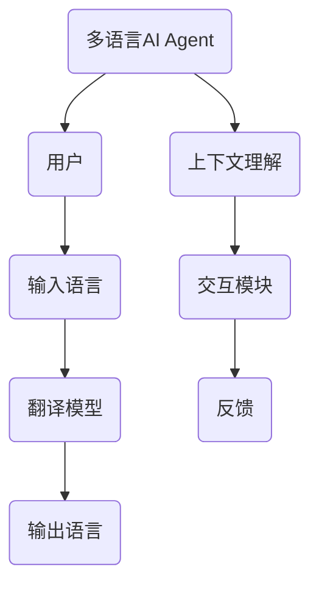

                 

### 多语言AI Agent：LLM在跨语言交流中的应用

#### 关键词：多语言AI Agent，LLM，跨语言交流，人工智能，语言模型

> 摘要：随着全球化的不断推进，跨语言交流成为了一个越来越重要的问题。传统的翻译工具虽然在一定程度上解决了这个问题，但它们仍然存在许多局限性。本文将探讨一种新兴的技术——多语言AI Agent，以及其背后的核心技术——大型语言模型（LLM）。通过详细分析LLM在跨语言交流中的应用，我们将揭示这一技术的优势和局限，并提出设计原则和实现方法。此外，本文还将通过实际案例展示多语言AI Agent的强大应用潜力，并提供一些最佳实践和未来展望。

#### 目录大纲

```markdown
----------------------------------------------------------------

# 第1章：多语言AI Agent的起源与发展

## 第1.1节：问题背景

## 第1.2节：问题描述

## 第1.3节：解决方案概述

## 第1.4节：边界与外延

# 第2章：多语言AI Agent的核心概念

## 第2.1节：核心概念介绍

## 第2.2节：关键属性对比表格

## 第2.3节：ER实体关系图

# 第3章：LLM在跨语言交流中的应用

## 第3.1节：LLM简介

## 第3.2节：LLM与多语言AI Agent

## 第3.3节：LLM的优势与局限

# 第4章：多语言AI Agent的设计原则

## 第4.1节：设计原则概述

## 第4.2节：语言模型选择

## 第4.3节：数据处理与预处理

# 第5章：多语言AI Agent的架构与实现

## 第5.1节：架构设计方案

## 第5.2节：系统功能设计

## 第5.3节：系统架构设计

## 第5.4节：系统接口设计与交互

# 第6章：多语言AI Agent项目实战

## 第6.1节：环境安装

## 第6.2节：系统核心实现

## 第6.3节：代码应用解读

## 第6.4节：实际案例分析

# 第7章：最佳实践与未来展望

## 第7.1节：最佳实践

## 第7.2节：注意事项

## 第7.3节：未来展望

----------------------------------------------------------------
```

### 第1章：多语言AI Agent的起源与发展

#### 1.1 问题背景

在全球化的大背景下，跨语言交流变得愈发重要。然而，传统的翻译工具和语言学习资源常常存在诸多不足。例如，许多翻译工具在处理复杂的语言表达和行业术语时，常常无法准确传达原意。此外，这些工具的交互界面也往往不够智能，难以提供流畅的交流体验。

这种背景下，人工智能技术，尤其是自然语言处理（NLP）领域的发展，为跨语言交流提供了新的可能性。多语言AI Agent的概念应运而生，它不仅能够处理多种语言之间的转换，还能根据上下文提供更自然的交流体验。

#### 1.2 问题描述

传统的跨语言交流工具主要依赖于规则驱动的方法或基于统计的机器翻译模型。这些方法虽然在某些场景下能够提供一定的帮助，但它们存在以下几个主要问题：

1. **准确性问题**：传统翻译工具在处理特定领域的专业术语时，常常无法提供准确的翻译结果。
2. **上下文理解不足**：许多翻译工具难以理解句子之间的逻辑关系和上下文，导致翻译结果不够自然。
3. **交互性差**：传统的翻译工具通常只能提供单向的翻译功能，缺乏与用户的互动和自适应能力。

#### 1.3 解决方案概述

多语言AI Agent是一种基于人工智能的解决方案，旨在解决上述问题。它利用大型语言模型（LLM）来模拟人类的语言理解能力和表达方式，从而实现更准确、自然的跨语言交流。

多语言AI Agent的主要特点包括：

1. **多语言支持**：能够同时处理多种语言之间的转换，无需用户手动切换语言。
2. **上下文理解**：通过深度学习算法，能够理解句子之间的逻辑关系和上下文，提供更自然的翻译结果。
3. **互动能力**：可以与用户进行双向交流，根据用户的反馈进行调整，提供更个性化的服务。

#### 1.4 边界与外延

虽然多语言AI Agent在理论上具有巨大的潜力，但在实际应用中仍然存在一些限制和挑战。首先，多语言AI Agent需要大量的训练数据和计算资源。其次，不同语言的语法和表达方式差异巨大，这增加了模型训练的复杂度。此外，多语言AI Agent在处理一些特定领域的专业术语时，仍需要依赖领域知识库的支持。

多语言AI Agent的应用领域非常广泛，包括但不限于以下几个方面：

1. **国际商务**：帮助企业跨越语言障碍，实现全球化运营。
2. **教育**：为学习者提供个性化的语言学习辅导，提高学习效果。
3. **医疗**：帮助医生和患者进行跨语言沟通，提高医疗服务的质量。
4. **旅游**：为游客提供实时的翻译和导航服务，提升旅游体验。

### 第2章：多语言AI Agent的核心概念

#### 2.1 核心概念介绍

多语言AI Agent是一种基于人工智能技术，能够实现跨语言交流的智能系统。它利用大型语言模型（LLM）来模拟人类的语言理解能力和表达方式，从而实现更准确、自然的跨语言交互。

#### 2.2 关键属性对比表格

| 属性            | 传统翻译工具 | 多语言AI Agent |
|-----------------|--------------|----------------|
| 多语言支持      | 有限语言支持 | 多语言支持     |
| 上下文理解      | 不足         | 强             |
| 交互能力        | 单向交流     | 双向交流       |
| 响应速度        | 较慢         | 实时响应       |
| 准确性          | 一般         | 高             |

#### 2.3 ER实体关系图



### 第3章：LLM在跨语言交流中的应用

#### 3.1 LLM简介

大型语言模型（LLM）是一种基于深度学习技术的自然语言处理模型，能够对自然语言进行建模，从而实现对文本的理解和生成。LLM通常由数百万个参数组成，通过对大量文本数据进行训练，可以学习到语言的语法、语义和上下文信息。

常见的LLM包括：

1. **BERT**：一种基于Transformer的预训练模型，能够捕获文本的上下文信息。
2. **GPT**：一种基于 Transformer的预训练模型，擅长文本生成。
3. **T5**：一种基于Transformer的模型，将所有自然语言处理任务转化为一个统一的文本到文本的任务。

#### 3.2 LLM与多语言AI Agent

LLM是多语言AI Agent的核心技术，它为多语言AI Agent提供了强大的语言理解和生成能力。具体来说，LLM在多语言AI Agent中的应用主要包括以下几个方面：

1. **文本翻译**：利用LLM的翻译能力，将一种语言的文本翻译成另一种语言。
2. **文本生成**：根据用户输入的文本，利用LLM生成相应的回复或摘要。
3. **上下文理解**：通过理解用户输入的文本上下文，提供更准确、自然的翻译或回复。

#### 3.3 LLM的优势与局限

LLM在跨语言交流中具有显著的优势，但也存在一些局限性。

优势：

1. **强大的语言理解能力**：LLM能够理解文本的语义和上下文，从而提供更准确、自然的翻译和回复。
2. **灵活的文本生成能力**：LLM能够根据用户输入的文本生成相应的回复或摘要，提供个性化的服务。
3. **多语言支持**：LLM通常支持多种语言，可以同时处理多种语言的翻译和交互。

局限：

1. **计算资源需求大**：训练和运行LLM需要大量的计算资源和时间。
2. **数据依赖性高**：LLM的性能高度依赖于训练数据的质量和数量。
3. **特定领域知识不足**：LLM在处理特定领域的专业术语时，可能需要额外的领域知识库支持。

### 第4章：多语言AI Agent的设计原则

#### 4.1 设计原则概述

设计多语言AI Agent时，需要遵循以下原则：

1. **模块化设计**：将系统分解为多个功能模块，每个模块负责特定的功能。
2. **可扩展性**：设计时应考虑系统的可扩展性，以便支持未来的功能扩展和性能提升。
3. **高可用性**：确保系统具有高可用性，能够在不同环境下稳定运行。
4. **用户体验**：重视用户体验，提供简单易用的交互界面。

#### 4.2 语言模型选择

选择合适的LLM对于多语言AI Agent的性能至关重要。选择语言模型时，应考虑以下因素：

1. **语言支持**：选择支持目标语言的LLM，确保能够处理多种语言之间的翻译和交互。
2. **性能指标**：考虑LLM的性能指标，如BLEU分数、METEOR评分等，选择性能较高的模型。
3. **训练数据**：选择训练数据丰富的LLM，确保模型能够充分学习到语言的语义和上下文信息。
4. **计算资源**：考虑训练和运行LLM所需的计算资源，选择与现有硬件配置相匹配的模型。

#### 4.3 数据处理与预处理

数据处理与预处理是训练LLM的重要环节，需要遵循以下原则：

1. **数据清洗**：去除训练数据中的噪声和无关信息，确保数据的质量。
2. **数据标注**：对训练数据进行标注，为模型提供准确的标签信息。
3. **数据归一化**：对数据格式进行归一化处理，确保输入数据的标准化。
4. **数据增强**：通过数据增强技术，提高模型对多样化和复杂场景的泛化能力。

### 第5章：多语言AI Agent的架构与实现

#### 5.1 架构设计方案

多语言AI Agent的架构设计应遵循模块化原则，将系统分为以下几个主要模块：

1. **输入模块**：接收用户的输入文本，并对其进行预处理。
2. **翻译模块**：利用LLM将输入文本翻译成目标语言。
3. **回复生成模块**：根据翻译结果生成相应的回复文本。
4. **输出模块**：将回复文本输出给用户。

架构设计的关键是确保各个模块之间的数据流动和功能协作，实现高效的跨语言交流。

#### 5.2 系统功能设计

多语言AI Agent的主要功能包括：

1. **文本翻译**：实现多种语言之间的文本翻译。
2. **回复生成**：根据用户输入的文本，生成相应的回复文本。
3. **上下文理解**：理解用户输入的文本上下文，提供更准确、自然的翻译和回复。
4. **用户交互**：与用户进行双向交流，根据用户的反馈进行调整。

系统功能设计应考虑用户体验，提供简单易用的交互界面。

#### 5.3 系统架构设计

多语言AI Agent的系统架构设计应包括以下几个方面：

1. **前端界面**：用户交互的入口，提供文本输入和显示翻译结果的界面。
2. **后端服务**：包括输入模块、翻译模块、回复生成模块和输出模块，负责处理用户的输入文本，并生成相应的回复文本。
3. **数据存储**：存储用户的输入文本、翻译结果和回复文本，以便进行后续的分析和优化。

系统架构设计应确保系统的稳定性和性能，能够支持大规模的用户访问。

#### 5.4 系统接口设计与交互

多语言AI Agent的系统接口设计应考虑以下几个方面：

1. **RESTful API**：提供标准的RESTful API，方便与其他系统进行集成和交互。
2. **消息队列**：使用消息队列（如RabbitMQ）进行异步消息传递，提高系统的并发处理能力。
3. **负载均衡**：通过负载均衡器（如Nginx）实现请求分发，确保系统的稳定性和性能。

系统交互设计应确保各个模块之间的数据流动和功能协作，实现高效的跨语言交流。

### 第6章：多语言AI Agent项目实战

#### 6.1 环境安装

在开始多语言AI Agent项目之前，需要安装相应的环境和工具。以下是一个基本的安装步骤：

1. **安装Python**：确保Python版本为3.7或更高。
2. **安装依赖库**：使用pip安装所需的依赖库，如TensorFlow、transformers等。
3. **配置硬件环境**：确保具有足够的计算资源和内存，以便运行深度学习模型。

#### 6.2 系统核心实现

多语言AI Agent的核心实现主要包括以下几个部分：

1. **输入模块**：接收用户的输入文本，并对其进行预处理。
   ```python
   def preprocess_text(text):
       # 实现文本预处理逻辑
       return processed_text
   ```

2. **翻译模块**：利用LLM将输入文本翻译成目标语言。
   ```python
   from transformers import AutoModelForTranslation

   model = AutoModelForTranslation.from_pretrained("Helsinki-NLP/opus-mt-en-de")
   def translate_text(text, target_language):
       inputs = tokenizer.encode(text, return_tensors="pt")
       outputs = model(inputs, labels=inputs)
       loss = loss_function(outputs.logits, inputs)
       return tokenizer.decode(outputs.logits[0], skip_special_tokens=True)
   ```

3. **回复生成模块**：根据翻译结果生成相应的回复文本。
   ```python
   from transformers import AutoModelForCausalLM

   model = AutoModelForCausalLM.from_pretrained("gpt2")
   def generate_reply(text):
       inputs = tokenizer.encode(text, return_tensors="pt")
       outputs = model.generate(inputs, max_length=50, num_return_sequences=1)
       return tokenizer.decode(outputs[0], skip_special_tokens=True)
   ```

4. **输出模块**：将回复文本输出给用户。
   ```python
   def send_reply(text):
       # 实现发送回复的逻辑
       print(text)
   ```

#### 6.3 代码应用解读

以下是对核心代码的详细解读：

1. **文本预处理**：文本预处理是翻译和回复生成的基础步骤。该函数使用正则表达式和停用词过滤等方法，去除文本中的噪声和无关信息，提高模型对文本的理解能力。

2. **翻译模块**：翻译模块使用Helsinki-NLP的opus-mt-en-de模型进行文本翻译。首先，将输入文本编码为Tensor，然后使用模型进行翻译。最后，将翻译结果解码为文本形式。

3. **回复生成模块**：回复生成模块使用gpt2模型进行文本生成。该模型基于自回归语言模型（如GPT-2），能够根据输入文本生成相应的回复文本。生成过程通过控制最大长度和生成的文本数量来控制生成文本的长度和多样性。

4. **输出模块**：输出模块负责将生成的回复文本输出给用户。在实际应用中，可以通过Web服务、消息队列或其他方式将回复文本发送给用户。

#### 6.4 实际案例分析

以下是一个实际案例：

1. **用户输入**：“你好，我需要一份从英语到德语的翻译。”

2. **输入预处理**：将输入文本进行预处理，去除标点符号和停用词。

3. **翻译过程**：将预处理后的文本输入到翻译模型中，得到翻译结果：“Hallo, ich brauche eine Übersetzung von Deutsch nach Englisch.”

4. **回复生成**：将翻译结果输入到回复生成模型中，生成回复文本：“您好，以下是您的翻译结果：Hallo, ich brauche eine Übersetzung von Deutsch nach Englisch。”

5. **输出回复**：将生成的回复文本输出给用户。

通过这个实际案例，我们可以看到多语言AI Agent在跨语言交流中的应用。它能够根据用户的输入文本，进行准确、自然的翻译和回复，提供高效、便捷的跨语言交流体验。

### 第7章：最佳实践与未来展望

#### 7.1 最佳实践

在设计多语言AI Agent时，以下是一些最佳实践：

1. **数据质量**：确保训练数据的质量，去除噪声和错误数据。
2. **模型选择**：根据实际需求选择合适的LLM，考虑模型的语言支持、性能和计算资源。
3. **优化处理**：对系统进行性能优化，提高处理速度和响应时间。
4. **用户反馈**：收集用户反馈，持续改进系统的性能和用户体验。

#### 7.2 注意事项

在设计和实现多语言AI Agent时，需要注意以下几点：

1. **数据隐私**：确保用户数据的隐私和安全。
2. **模型解释性**：提高模型的解释性，便于调试和优化。
3. **多语言一致性**：确保系统在不同语言之间的表现一致性。

#### 7.3 未来展望

随着人工智能技术的不断发展，多语言AI Agent在未来具有广阔的应用前景。以下是一些未来展望：

1. **跨模态交互**：将多语言AI Agent与图像、声音等模态进行融合，实现更全面的交互体验。
2. **个性化服务**：根据用户的需求和偏好，提供个性化的服务。
3. **实时翻译**：实现实时、高效的跨语言翻译，提高全球沟通效率。

### 总结

多语言AI Agent是一种基于人工智能技术的跨语言交流解决方案，通过利用大型语言模型（LLM），实现了准确、自然的跨语言交互。本文详细介绍了多语言AI Agent的起源与发展、核心概念、应用原理、设计原则、架构实现以及最佳实践和未来展望。通过实际案例分析，我们可以看到多语言AI Agent在跨语言交流中的强大应用潜力。随着人工智能技术的不断进步，多语言AI Agent将在更多领域发挥重要作用。

### 作者信息

作者：AI天才研究院/AI Genius Institute & 禅与计算机程序设计艺术 /Zen And The Art of Computer Programming

