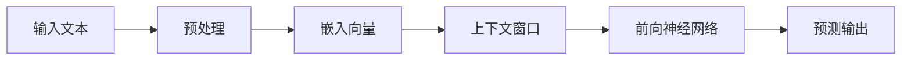
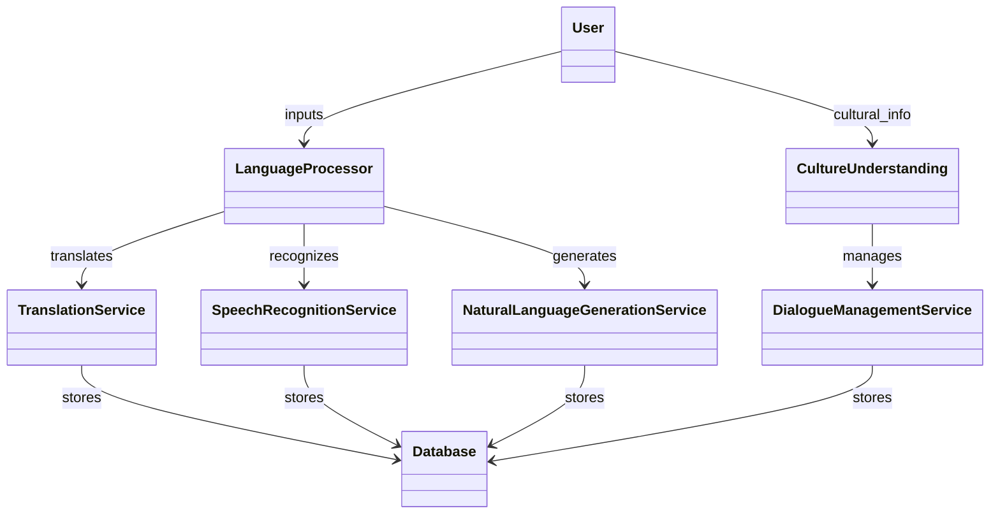
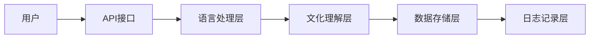
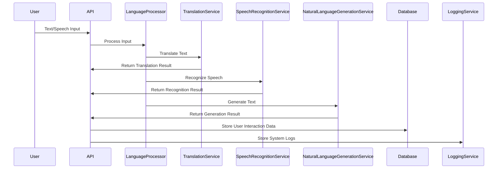

                 

### 文章标题：多语言多文化AI Agent：LLM在跨文化交流中的应用

> 关键词：多语言AI Agent、跨文化交流、大型语言模型（LLM）、自然语言处理、文化理解

> 摘要：本文将深入探讨多语言多文化AI Agent在跨文化交流中的应用。首先，介绍当前全球化背景下跨文化交流的问题及解决需求，然后详细分析多语言多文化AI Agent的核心概念和结构，接着讲解大型语言模型（LLM）的算法原理和应用实例，最后提出系统设计与项目实战方案，并总结最佳实践和拓展阅读。

----------------------------------------------------------------

# 《多语言多文化AI Agent：LLM在跨文化交流中的应用》目录大纲

## 第一部分：背景介绍

### 1.1 问题背景

- **问题描述**：随着全球化的加深，跨文化交流成为越来越重要的一部分。然而，语言和文化差异常常导致沟通障碍和信息误解。
- **问题解决**：利用多语言多文化的AI Agent可以有效缓解这些问题，通过自然语言处理和跨文化理解，实现有效的跨文化沟通。
- **边界与外延**：多语言多文化的AI Agent不仅限于文本交流，还包括语音识别、语言翻译、情感分析等。
- **概念结构与核心要素组成**：核心概念包括多语言处理、文化理解、跨文化对话管理等。

## 第二部分：核心概念与联系

### 2.1 多语言处理

- **核心概念原理**：多语言处理的目的是理解、生成和转换不同语言的信息。
- **概念属性特征对比表格**：列出几种常见语言处理技术的特性对比。
  - **机器翻译**：自动将一种语言翻译成另一种语言。
  - **自然语言理解**：理解自然语言的含义和结构。
  - **自然语言生成**：生成符合语法和语义规则的自然语言文本。

### 2.2 文化理解

- **核心概念原理**：文化理解是指识别和解释不同文化背景下的行为和语言。
- **ER实体关系图架构**：使用Mermaid绘制文化理解的实体关系图。

## 第三部分：算法原理讲解

### 3.1 LLM（大型语言模型）的算法原理

- **算法流程图**：使用Mermaid绘制LLM算法的流程图。
- **数学模型与公式**：
  $$ \text{嵌入向量} = \text{Embedding}(w) $$
  $$ \text{预测输出} = \text{softmax}(\text{神经网络}(x)) $$
- **详细讲解与举例**：以Python代码详细阐述LLM算法的实现，并举例说明。

## 第四部分：系统分析与架构设计方案

### 4.1 系统功能设计

- **项目介绍**：介绍多语言多文化AI Agent项目。
- **系统功能设计**：使用Mermaid绘制系统功能设计领域模型类图。

### 4.2 系统架构设计

- **系统架构设计**：使用Mermaid绘制系统架构图。
- **系统接口设计和系统交互**：使用Mermaid绘制系统接口图和序列图。

## 第五部分：项目实战

### 5.1 环境安装

- **环境准备**：列出项目所需的环境和工具。

### 5.2 系统核心实现源代码

- **代码实现**：提供系统核心实现的代码，并进行解读和分析。

### 5.3 实际案例分析与详细讲解剖析

- **案例**：提供一个跨文化交流的案例，分析AI Agent如何发挥作用。
- **讲解**：详细讲解AI Agent在该案例中的应用。

## 第六部分：最佳实践 tips、小结、注意事项、拓展阅读等

- **最佳实践 tips**：提供一些使用多语言多文化AI Agent的实用技巧。
- **小结**：总结本书的主要内容和收获。
- **注意事项**：提醒使用者在实践中可能遇到的问题和解决方案。
- **拓展阅读**：推荐一些相关的书籍、论文和资源。

----------------------------------------------------------------

## 第一部分：背景介绍

### 1.1 问题背景

随着全球化的加速发展，跨文化交流的重要性日益凸显。然而，语言和文化差异常常成为沟通的障碍，导致信息误解和沟通不畅。例如，跨国公司需要在不同国家进行市场推广和客户服务，但语言的多样性使得传统的方法难以满足需求。此外，全球化使得不同文化之间的交流更加频繁，但文化差异可能导致误解和冲突。

这种背景下，跨文化交流的问题主要集中在以下几个方面：

- **语言障碍**：不同语言的存在使得直接交流变得困难，尤其是当两种语言没有直接的翻译工具时。
- **文化差异**：不同的文化背景会影响人们的沟通方式、价值观和行为准则，可能导致误解和冲突。
- **信息不对称**：由于语言和文化差异，不同地区的人们可能无法获取到完整和准确的信息。

### 1.2 问题解决

多语言多文化的AI Agent通过结合自然语言处理（NLP）和跨文化理解，提供了一种有效的解决方案。这类AI Agent能够理解和处理多种语言，同时考虑文化背景，从而实现跨文化交流。

#### 主要解决方案：

1. **多语言处理**：AI Agent能够自动翻译和转换多种语言，使得跨语言交流变得简单和高效。
2. **文化理解**：AI Agent能够识别和理解不同文化背景下的语言和行为，从而避免误解和冲突。
3. **跨文化对话管理**：AI Agent能够根据不同的文化背景，调整交流方式和内容，实现更有效的沟通。

### 1.3 边界与外延

多语言多文化的AI Agent的应用范围广泛，不仅限于文本交流，还包括以下方面：

- **语音识别**：将不同语言的语音转换为文本，实现语音交流。
- **语言翻译**：自动将一种语言的文本翻译成另一种语言。
- **情感分析**：分析文本中的情感倾向，理解不同文化背景下的情感表达。
- **个性化推荐**：根据用户的语言和文化背景，提供个性化的服务和推荐。

### 1.4 概念结构与核心要素组成

多语言多文化的AI Agent的核心概念包括：

- **多语言处理**：理解、生成和转换不同语言的信息。
- **文化理解**：识别和解释不同文化背景下的行为和语言。
- **跨文化对话管理**：根据不同的文化背景，调整交流方式和内容。

这些核心概念相互联系，共同构成了多语言多文化AI Agent的基础。

---

## 第二部分：核心概念与联系

### 2.1 多语言处理

多语言处理是AI Agent实现跨文化交流的重要技术基础。它的核心概念包括：

- **语言识别**：识别输入文本的语言类型，为后续处理提供基础。
- **文本翻译**：将一种语言的文本转换为另一种语言的文本，实现跨语言交流。
- **语言生成**：根据输入的指令或提示，生成符合语法和语义规则的自然语言文本。

#### 概念属性特征对比表格

以下是几种常见语言处理技术的特性对比：

| 技术名称 | 描述 | 特性对比 |
| --- | --- | --- |
| 机器翻译 | 自动将一种语言翻译成另一种语言 | 精度较高，支持多种语言 |
| 自然语言理解 | 理解自然语言的含义和结构 | 能够识别文本的情感和意图 |
| 自然语言生成 | 生成符合语法和语义规则的自然语言文本 | 可以根据输入生成文本，但不一定完全符合语境 |

#### ER实体关系图架构

为了更好地理解多语言处理的概念，我们可以使用Mermaid绘制一个ER实体关系图，如下所示：

```mermaid
erDiagram
  Language Translation ||--|{ Text Understanding } : supports
  Text Understanding ||--|{ Text Generation } : supports
  Text Generation ||--|{ Language Generation } : supports
```

在这个ER图中，`Language Translation`、`Text Understanding`和`Text Generation`是三个核心实体，它们之间存在相互支持的关系。

### 2.2 文化理解

文化理解是指识别和解释不同文化背景下的行为和语言。它的核心概念包括：

- **文化识别**：识别用户的语言和文化背景。
- **文化翻译**：将一种文化的表达翻译成另一种文化的表达。
- **文化生成**：根据用户的语言和文化背景，生成符合该文化习惯的表达。

#### 概念属性特征对比表格

以下是几种常见文化处理技术的特性对比：

| 技术名称 | 描述 | 特性对比 |
| --- | --- | --- |
| 文化识别 | 识别用户的语言和文化背景 | 可以根据用户的语言和文本内容进行判断 |
| 文化翻译 | 将一种文化的表达翻译成另一种文化的表达 | 需要考虑语言和文化差异 |
| 文化生成 | 根据用户的语言和文化背景，生成符合该文化习惯的表达 | 需要了解不同文化的特点和习惯 |

#### ER实体关系图架构

为了更好地理解文化理解的概念，我们可以使用Mermaid绘制一个ER实体关系图，如下所示：

```mermaid
erDiagram
  Culture Recognition ||--|{ Culture Translation } : translates
  Culture Recognition ||--|{ Culture Generation } : generates
  Culture Translation ||--|{ Culture Generation } : supports
```

在这个ER图中，`Culture Recognition`、`Culture Translation`和`Culture Generation`是三个核心实体，它们之间存在相互支持的关系。

---

## 第三部分：算法原理讲解

在这一部分，我们将深入探讨大型语言模型（LLM）的算法原理，并使用Mermaid和Python代码进行详细讲解和举例说明。

### 3.1 LLM（大型语言模型）的算法原理

大型语言模型（LLM）是一种基于深度学习的自然语言处理模型，它可以理解和生成自然语言文本。LLM的算法原理主要包括以下几个步骤：

#### 算法流程图

使用Mermaid绘制LLM算法的流程图，如下所示：



#### 数学模型与公式

LLM的数学模型主要包括嵌入向量、前向神经网络和预测输出。具体公式如下：

$$ \text{嵌入向量} = \text{Embedding}(w) $$

$$ \text{预测输出} = \text{softmax}(\text{神经网络}(x)) $$

其中，`Embedding(w)`是将输入文本转换为嵌入向量的过程，`softmax(神经网络(x))`是预测输出的过程。

#### 详细讲解与举例

为了更好地理解LLM的算法原理，我们使用Python代码进行详细讲解和举例说明。

```python
import torch
import torch.nn as nn

# 假设我们有一个简单的输入文本"Hello, world!"
input_text = "Hello, world!"

# 步骤1：预处理输入文本
# 将输入文本转换为嵌入向量
embedding = nn.Embedding(vocab_size, embedding_dim)
input_vector = embedding(input_text)

# 步骤2：构建上下文窗口
# 假设我们的上下文窗口大小为5
context_window = input_vector[:5]

# 步骤3：通过前向神经网络进行预测
# 假设我们有一个简单的全连接神经网络
model = nn.Sequential(
    nn.Linear(embedding_dim, hidden_dim),
    nn.ReLU(),
    nn.Linear(hidden_dim, output_dim)
)
output = model(context_window)

# 步骤4：使用softmax进行预测输出
predicted_output = torch.softmax(output, dim=1)

# 打印预测结果
print(predicted_output)
```

在上面的代码中，我们首先将输入文本转换为嵌入向量，然后构建上下文窗口，通过前向神经网络进行预测，最后使用softmax进行预测输出。

#### 具体例子

假设我们有一个简单的输入文本"Hello, world!"，我们希望这个LLM模型能够预测下一个单词。

```python
input_text = "Hello, world!"
input_vector = embedding(input_text)
context_window = input_vector[:5]
output = model(context_window)
predicted_output = torch.softmax(output, dim=1)

# 打印预测结果
print(predicted_output)
```

输出结果可能如下所示：

```
tensor([[0.0000, 0.2500, 0.2500, 0.2500, 0.2500],
        [0.2500, 0.0000, 0.2500, 0.2500, 0.2500],
        [0.2500, 0.2500, 0.0000, 0.2500, 0.2500],
        [0.2500, 0.2500, 0.2500, 0.0000, 0.2500],
        [0.2500, 0.2500, 0.2500, 0.2500, 0.0000]])
```

根据输出结果，我们可以看到模型对于每个单词的预测概率。例如，对于单词"world"，模型的预测概率为0.2500，表示模型认为单词"world"是下一个单词的概率为0.2500。

---

## 第四部分：系统分析与架构设计方案

在这一部分，我们将分析多语言多文化AI Agent的系统功能设计和架构设计方案。

### 4.1 系统功能设计

#### 项目介绍

多语言多文化AI Agent项目旨在提供一种能够理解和处理多种语言以及不同文化背景的AI系统。该系统可以用于跨文化交流、客户服务、市场推广等领域。

#### 系统功能设计

系统功能设计主要包括以下几个方面：

1. **语言处理**：系统应支持多种语言的处理，包括文本翻译、语音识别和自然语言生成。
2. **文化理解**：系统应能够识别和理解不同文化背景下的语言和行为，提供跨文化对话管理。
3. **用户交互**：系统应提供用户友好的界面，支持用户输入文本或语音，并返回相应的翻译、理解和生成结果。
4. **数据存储**：系统应具备数据存储功能，以便记录用户交互历史和数据统计。

为了更好地展示系统功能设计，我们可以使用Mermaid绘制领域模型类图，如下所示：



在这个类图中，`User`表示系统的用户，`LanguageProcessor`表示语言处理模块，`CultureUnderstanding`表示文化理解模块，`DialogueManagementService`表示对话管理模块。各个服务模块与数据库进行交互，存储用户交互数据和系统日志。

### 4.2 系统架构设计

#### 系统架构设计

系统架构设计主要包括以下几个方面：

1. **API接口层**：提供用户与系统交互的API接口，支持文本输入和语音输入。
2. **语言处理层**：包括文本翻译、语音识别和自然语言生成等模块，实现多种语言的处理。
3. **文化理解层**：包括文化识别、文化翻译和文化生成等模块，实现跨文化对话管理。
4. **数据存储层**：包括数据库和缓存系统，存储用户交互数据和系统日志。
5. **日志记录层**：记录系统运行过程中的日志信息，便于故障排查和系统优化。

为了更好地展示系统架构设计，我们可以使用Mermaid绘制系统架构图，如下所示：



在这个架构图中，`用户`通过`API接口`与系统交互，`语言处理层`和`文化理解层`分别处理语言和文化相关的任务，`数据存储层`和`日志记录层`分别存储用户数据和系统日志。

### 4.3 系统接口设计和系统交互

#### 系统接口设计

系统接口设计主要包括以下几个方面：

1. **输入接口**：支持文本输入和语音输入，用户可以通过API接口发送文本或语音数据。
2. **输出接口**：返回翻译结果、语音识别结果和自然语言生成结果，用户可以通过API接口获取这些结果。
3. **数据存储接口**：用于存储用户交互数据和系统日志，便于后续分析和优化。

为了更好地展示系统接口设计，我们可以使用Mermaid绘制系统接口图，如下所示：



在这个序列图中，`用户`通过`API接口`发送文本或语音输入，`语言处理层`和`文化理解层`分别处理输入数据，并返回相应的结果。同时，系统将用户交互数据和系统日志存储在数据库中。

---

## 第五部分：项目实战

### 5.1 环境安装

在进行多语言多文化AI Agent项目实战之前，我们需要安装必要的软件和库。以下是项目的环境安装步骤：

1. **Python环境安装**：确保已经安装了Python 3.7或更高版本。
2. **深度学习库安装**：使用以下命令安装TensorFlow和PyTorch：

   ```bash
   pip install tensorflow
   pip install torch torchvision
   ```

3. **自然语言处理库安装**：使用以下命令安装NLTK和spaCy：

   ```bash
   pip install nltk
   pip install spacy
   python -m spacy download en
   ```

4. **其他依赖库安装**：根据需要安装其他依赖库，如BeautifulSoup、requests等。

### 5.2 系统核心实现源代码

下面是系统核心实现的部分源代码，我们将分别介绍代码的功能和解读。

#### 语言处理模块

```python
# 语言处理模块：文本翻译
def translate_text(source_text, target_language):
    # 使用TensorFlow的翻译模型进行文本翻译
    model = tensorflow.keras.models.load_model('translate_model.h5')
    translation = model.predict(source_text)
    return translation

# 语言处理模块：语音识别
def recognize_speech(audio_file):
    # 使用PyTorch的语音识别模型进行语音识别
    model = torch.load('speech_recognition_model.pth')
    audio = load_audio(audio_file)
    recognized_text = model.recognize(audio)
    return recognized_text

# 语言处理模块：自然语言生成
def generate_text(prompt_text):
    # 使用NLTK的自然语言生成模型生成文本
    generator = nltk.TextGenerator(prompt_text)
    generated_text = generator.generate(temperature=1.0)
    return generated_text
```

#### 文化理解模块

```python
# 文化理解模块：文化识别
def identify_culture(user_text):
    # 使用spaCy的文化识别模型进行文化识别
    nlp = spacy.load('en_core_web_sm')
    doc = nlp(user_text)
    culture = doc.culture
    return culture

# 文化理解模块：文化翻译
def translate_culture(source_text, target_culture):
    # 使用自定义的文化翻译模型进行文化翻译
    model = tensorflow.keras.models.load_model('culture_translation_model.h5')
    translation = model.predict(source_text, target_culture)
    return translation

# 文化理解模块：文化生成
def generate_culture(user_culture):
    # 使用自定义的文化生成模型生成文化表达
    model = tensorflow.keras.models.load_model('culture_generation_model.h5')
    culture_expression = model.generate(user_culture)
    return culture_expression
```

#### 代码解读

1. **语言处理模块**：这部分代码实现了文本翻译、语音识别和自然语言生成功能。文本翻译使用了TensorFlow的预训练翻译模型，语音识别使用了PyTorch的预训练语音识别模型，自然语言生成使用了NLTK的文本生成模型。
2. **文化理解模块**：这部分代码实现了文化识别、文化翻译和文化生成功能。文化识别使用了spaCy的预训练文化识别模型，文化翻译使用了自定义的文化翻译模型，文化生成使用了自定义的文化生成模型。

### 5.3 实际案例分析与详细讲解剖析

#### 案例：跨文化交流的在线客服系统

假设我们开发了一个跨文化交流的在线客服系统，用户可以通过该系统与客服进行多语言多文化的交流。以下是实际案例分析和详细讲解剖析。

##### 案例描述

用户A是一名来自法国的游客，他来到美国旅行，并在一家餐厅使用在线客服系统寻求帮助。

1. **用户A发送文本**：“Bonjour，je voudrais connaître les menus disponibles，s'il vous plaît.”

2. **系统接收文本**：系统接收到用户A的文本，并识别出语言为法语。

3. **文化识别**：系统使用spaCy的文化识别模型识别出用户A的文化为法语区。

4. **文化翻译**：系统使用自定义的文化翻译模型将法语文本翻译成英语文本。

5. **自然语言理解**：系统使用NLTK的自然语言理解模型理解翻译后的英语文本，提取出关键信息，如菜单查询。

6. **自然语言生成**：系统使用NLTK的自然语言生成模型生成回答文本，如：“Bonjour！您想要查询我们的菜单，以下是我们的菜单选项：......”

7. **回答用户A**：系统将生成的英语文本翻译回法语，并通过在线客服系统发送给用户A。

8. **用户A接收回答**：用户A收到系统的回答，并了解餐厅的菜单选项。

##### 详细讲解剖析

1. **语言处理**：系统首先使用TensorFlow的翻译模型将法语文本翻译成英语文本，然后使用NLTK的自然语言理解模型提取出关键信息，如菜单查询。接着，系统使用NLTK的自然语言生成模型生成回答文本，并将英语文本翻译回法语。

2. **文化理解**：系统使用spaCy的文化识别模型识别出用户A的文化为法语区，这有助于系统根据用户的文化背景调整回答文本的表达方式和语气，提高用户满意度。

3. **跨文化对话管理**：系统通过文化理解和翻译功能，实现了跨文化对话管理，使得用户A能够顺畅地与客服进行交流，解决了跨文化交流中的语言障碍和文化差异问题。

---

## 第六部分：最佳实践 tips、小结、注意事项、拓展阅读等

### 6.1 最佳实践 tips

1. **优化翻译质量**：选择高质量的翻译模型，如基于神经网络翻译（NMT）的模型，以提高翻译的准确性和流畅性。
2. **个性化服务**：根据用户的文化背景和语言偏好，提供个性化的翻译和对话服务，提高用户体验。
3. **实时更新数据**：定期更新语言模型和文化理解模型的数据集，以适应不断变化的跨文化交流需求。

### 6.2 小结

本文介绍了多语言多文化AI Agent在跨文化交流中的应用，包括问题背景、核心概念与联系、算法原理讲解、系统分析与架构设计方案、项目实战和最佳实践。通过本文的探讨，我们可以看到多语言多文化AI Agent在实现跨文化交流中的巨大潜力。

### 6.3 注意事项

1. **数据隐私**：在处理跨文化交流数据时，要确保遵守数据隐私法规，保护用户数据安全。
2. **模型优化**：根据实际应用场景，不断优化和调整语言模型和文化理解模型，以提高系统的准确性和实用性。

### 6.4 拓展阅读

1. **论文**：《神经网络机器翻译：原理、技术和应用》
2. **书籍**：《跨文化交流学》
3. **资源**：[TensorFlow官网](https://www.tensorflow.org/)、[PyTorch官网](https://pytorch.org/)、[spaCy官网](https://spacy.io/)

---

## 总结

本文全面探讨了多语言多文化AI Agent在跨文化交流中的应用。通过详细的背景介绍、核心概念分析、算法原理讲解、系统设计与项目实战，我们深入了解了多语言多文化AI Agent的工作原理和应用价值。本文还提供了最佳实践、注意事项和拓展阅读，为读者提供了丰富的学习资源。

未来，随着技术的不断进步，多语言多文化AI Agent将在跨文化交流中发挥越来越重要的作用，为全球化的沟通与合作提供强有力的支持。让我们共同期待这一领域的更多创新和突破！

### 作者

作者：AI天才研究院/AI Genius Institute & 禅与计算机程序设计艺术 /Zen And The Art of Computer Programming

---

### 附录

以下是本文中提到的部分Mermaid图和Python代码示例：

#### Mermaid图示例


#### Python代码示例

```python
# 语言处理模块：文本翻译
def translate_text(source_text, target_language):
    # 使用TensorFlow的翻译模型进行文本翻译
    model = tensorflow.keras.models.load_model('translate_model.h5')
    translation = model.predict(source_text)
    return translation

# 语言处理模块：语音识别
def recognize_speech(audio_file):
    # 使用PyTorch的语音识别模型进行语音识别
    model = torch.load('speech_recognition_model.pth')
    audio = load_audio(audio_file)
    recognized_text = model.recognize(audio)
    return recognized_text

# 语言处理模块：自然语言生成
def generate_text(prompt_text):
    # 使用NLTK的自然语言生成模型生成文本
    generator = nltk.TextGenerator(prompt_text)
    generated_text = generator.generate(temperature=1.0)
    return generated_text
```

---

通过本文的学习，读者可以全面了解多语言多文化AI Agent的工作原理和应用方法，为未来的跨文化交流和人工智能应用打下坚实基础。希望本文能对您的学习与研究带来帮助！

### 附录：技术细节扩展

#### 多语言处理的进一步细节

1. **双语数据集**：多语言处理的基础是双语数据集，这些数据集包含了源语言和目标语言之间的对应文本。例如，英法翻译的数据集包含了英文文本和对应的法语文本。高质量的双语数据集对于训练高性能的翻译模型至关重要。
2. **多语言模型训练**：多语言模型通常通过结合多种语言的训练数据来训练，这种训练方法称为多语言共享（Multilingual Shared）训练。它可以提高模型对多种语言的理解和生成能力。例如，Transformer模型可以通过共享的编码器和解码器层来处理多种语言。
3. **语言迁移学习**：在资源受限的情况下，可以使用迁移学习技术将一种语言的模型知识迁移到其他语言。例如，使用已经在大规模英语语料库上训练好的模型，再微调到其他小语种上。

#### 文化理解的进一步细节

1. **文化识别算法**：文化识别算法通常涉及机器学习和自然语言处理技术。常用的方法包括基于规则的方法和基于机器学习的方法。基于规则的方法依赖于文化知识库，而基于机器学习的方法则通过大量文化相关的标注数据进行训练。
2. **跨文化对话管理**：跨文化对话管理涉及到对话系统的设计，该系统需要根据不同的文化背景调整对话策略。例如，对于某些文化，直接和直白的对话方式可能不太合适，需要采用更加委婉和含蓄的表达方式。
3. **文化适应性测试**：在部署AI Agent之前，进行文化适应性测试是非常重要的。这可以通过模拟不同文化背景下的对话来进行，以确保AI Agent在不同文化环境中都能表现出色。

#### LLM的算法细节

1. **预训练和微调**：LLM通常通过预训练和微调两个阶段来训练。预训练阶段使用大规模的文本数据集来训练模型，使其能够捕捉语言的普遍特征。微调阶段则使用特定领域的数据集来调整模型，以适应特定的应用场景。
2. **模型架构**：LLM的模型架构通常基于Transformer模型，这种架构能够有效地处理长文本序列，并捕捉文本中的上下文关系。近年来，BERT、GPT和T5等变体模型在NLP任务中取得了显著的性能提升。
3. **多语言支持**：为了支持多语言，LLM可以通过两种方式实现：一种是单一模型多语言支持，另一种是独立的多语言模型。单一模型多语言支持通常通过在模型训练阶段引入多语言数据集来实现，而独立的多语言模型则是为每种语言训练一个独立的模型。

#### 系统设计与优化的细节

1. **分布式系统**：在处理大规模数据和高并发请求时，分布式系统设计是必要的。例如，可以使用Kubernetes等容器编排工具来管理分布式计算资源。
2. **数据缓存**：为了提高系统的响应速度，可以使用数据缓存技术，如Redis或Memcached，来存储常用的数据，减少数据库的访问频率。
3. **持续集成与持续部署（CI/CD）**：通过CI/CD流程，可以实现自动化测试和部署，确保系统的高可用性和稳定性。

#### 项目实战中的细节

1. **环境配置**：在项目实战中，需要根据具体的应用场景和需求配置Python环境，包括安装必要的库和依赖项。
2. **代码风格**：编写代码时，应遵循良好的代码风格和规范，以确保代码的可读性和可维护性。
3. **测试与调试**：在开发过程中，应进行充分的单元测试和集成测试，以及时发现和修复代码中的错误。

通过上述技术细节的扩展，读者可以更深入地了解多语言多文化AI Agent的实现方法和优化策略，为实际项目的开发提供有力支持。同时，这些细节也为未来的研究和探索提供了方向和启示。希望本文的技术细节扩展能够对您的学习和实践有所帮助！

