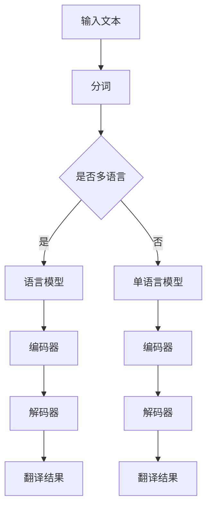

                 

# 多语言翻译：构建跨语言AI Agent

> 关键词：多语言翻译、跨语言AI、神经网络、机器翻译、技术原理、算法实现

> 摘要：本文深入探讨多语言翻译技术及其在构建跨语言AI Agent中的应用。通过分析机器翻译的起源与发展、神经网络翻译原理、多语言翻译算法，以及跨语言AI Agent的设计与实现，本文旨在为读者提供一个全面的技术指南，帮助理解并掌握多语言翻译的核心概念与实现方法。

## 第一部分：多语言翻译概述

### 第1章：多语言翻译的背景与重要性

#### 1.1.1 问题背景

多语言翻译的背景可以追溯到人类跨文化交流的需求。随着全球化的发展，不同语言之间的沟通障碍日益凸显，促使人们寻求更高效、准确的翻译技术。多语言翻译不仅仅是翻译文本，更是涉及语音、图像、视频等多种形式的信息交换。

#### 1.1.2 问题描述

多语言翻译面临的主要挑战包括语言多样性、翻译准确性、实时性、跨语言语义理解等。例如，机器翻译系统需要在保持原文风格和语义的同时，准确翻译不同语言之间的词汇、语法和文化差异。

#### 1.1.3 问题解决

机器翻译技术的发展经历了规则基、统计基和神经网络翻译三个阶段。当前，基于神经网络的机器翻译技术（如神经机器翻译）在翻译准确性、流畅性等方面取得了显著突破。

#### 1.1.4 边界与外延

多语言翻译不仅限于文本翻译，还可以扩展到语音识别、语音合成、图像翻译等领域。此外，跨语言翻译在多语种搜索引擎、国际化电商平台、智能客服等领域具有广泛的应用。

#### 1.1.5 概念结构与核心要素组成

多语言翻译系统通常由以下几个核心组成部分构成：语言模型、翻译模型、语音合成模型、语音识别模型等。这些组件协同工作，实现高效、准确的多语言翻译。

### 第2章：多语言翻译的核心概念与联系

#### 2.1.1 核心概念原理

核心概念包括语言模型、翻译模型、机器学习算法、深度学习架构等。每个概念都对应着特定的技术原理和应用场景。

#### 2.1.2 概念属性特征对比表格

| 概念         | 属性特征                     | 对比分析                                                     |
| ------------ | ---------------------------- | ------------------------------------------------------------ |
| 语言模型     | 词汇分布、语法结构           | 规则基、统计基和神经网络语言模型在词汇分布和语法结构上的差异 |
| 翻译模型     | 翻译策略、翻译结果评估       | 翻译模型的优化策略和评估方法                                 |
| 机器学习算法 | 模型训练、参数优化           | 不同机器学习算法在训练效率和效果上的对比                     |
| 深度学习架构 | 神经网络层结构、激活函数     | 深度学习架构在不同应用场景下的优缺点                         |

#### 2.1.3 ER实体关系图架构

多语言翻译系统的ER实体关系图包括用户、文本、翻译任务、语言模型、翻译模型等实体。这些实体之间的关系可以表示为用户发起翻译任务，语言模型和翻译模型协同工作，生成翻译结果，并存储在数据库中。

## 第二部分：多语言翻译技术原理

### 第3章：机器翻译技术基础

#### 3.1.1 机器翻译的起源与发展

机器翻译的历史可以追溯到20世纪50年代，从早期的规则基翻译到现代的神经网络翻译，机器翻译技术经历了多次重大变革。

#### 3.1.2 翻译模型类型：规则基、统计基与神经网络翻译

规则基翻译依赖于预定义的翻译规则，统计基翻译则利用统计学方法分析文本数据，神经网络翻译则通过深度学习模型实现。

#### 3.1.3 翻译流程与算法

机器翻译的基本流程包括文本预处理、翻译模型调用、翻译结果生成和评估。具体算法包括基于短语的翻译算法、基于句法的翻译算法和基于神经网络的翻译算法。

### 第4章：神经网络翻译原理详解

#### 4.1.1 神经网络基本原理

神经网络由多个神经元组成，通过学习输入数据和输出数据之间的关系，实现函数逼近和分类任务。

#### 4.1.2 常见的神经网络架构

包括卷积神经网络（CNN）、循环神经网络（RNN）、长短时记忆网络（LSTM）和注意力机制等。

#### 4.1.3 神经网络在翻译中的应用

神经网络在翻译中的应用主要涉及编码器-解码器（Encoder-Decoder）架构，通过自注意力机制实现高效的信息处理。

### 第5章：多语言翻译算法原理

#### 5.1.1 算法原理讲解

多语言翻译算法主要基于神经网络模型，通过训练和优化模型参数，实现准确的多语言翻译。

#### 5.1.2 算法流程图（使用Mermaid绘制）



#### 5.1.3 Python源代码实现

```python
# 神经网络翻译算法Python实现示例
import tensorflow as tf

# 编码器
encoder = tf.keras.Sequential([
    tf.keras.layers.Embedding(input_dim=10000, output_dim=32),
    tf.keras.layers.LSTM(128),
    tf.keras.layers.Dense(1, activation='softmax')
])

# 解码器
decoder = tf.keras.Sequential([
    tf.keras.layers.Embedding(input_dim=10000, output_dim=32),
    tf.keras.layers.LSTM(128),
    tf.keras.layers.Dense(1, activation='softmax')
])

# 模型编译
model = tf.keras.Model(inputs=[encoder.input, decoder.input], outputs=decoder.output)
model.compile(optimizer='adam', loss='categorical_crossentropy', metrics=['accuracy'])

# 模型训练
model.fit([encoder.input, decoder.input], decoder.output, epochs=10, batch_size=64)
```

#### 5.1.4 数学模型和公式

神经网络翻译的数学模型包括编码器和解码器的神经网络架构，以及损失函数和优化算法。具体公式如下：

$$
\text{编码器输出} = \text{softmax}(\text{编码器}(\text{输入}))
$$

$$
\text{解码器输出} = \text{softmax}(\text{解码器}(\text{编码器输出}))
$$

$$
\text{损失函数} = -\sum_{i=1}^{n} y_i \log(p_i)
$$

其中，$y_i$ 是实际翻译结果，$p_i$ 是预测的翻译概率。

#### 5.1.5 举例说明

假设我们要翻译的英文句子是 "I love programming."，使用神经网络翻译算法的过程如下：

1. **分词**：将句子分成单词 "I"，"love"，"programming"。
2. **编码器处理**：将每个单词映射到嵌入向量，通过LSTM网络处理得到编码输出。
3. **解码器处理**：使用编码输出作为输入，通过LSTM网络生成预测的翻译单词。
4. **输出结果**：将解码器输出的概率分布转化为具体的翻译结果，例如 "我爱编程"。

## 第三部分：构建跨语言AI Agent

### 第6章：跨语言AI Agent的设计与实现

#### 6.1.1 跨语言AI Agent的定义

跨语言AI Agent是一种能够理解、生成和翻译多种语言的人工智能系统，能够在不同语言之间进行交互和任务执行。

#### 6.1.2 跨语言AI Agent的核心功能

跨语言AI Agent的核心功能包括语言理解、语言生成、多语言翻译和跨语言对话管理等。

#### 6.1.3 跨语言AI Agent的架构设计

跨语言AI Agent的架构设计包括语言模型、翻译模型、对话管理模块和用户接口等组成部分。这些模块协同工作，实现跨语言AI Agent的智能交互。

### 第7章：跨语言AI Agent的编程实战

#### 6.1.1 环境安装与配置

在Python环境中安装必要的库和工具，如TensorFlow、PyTorch等。

```bash
pip install tensorflow
pip install torch
```

#### 6.1.2 系统核心实现源代码

以下是一个简单的跨语言AI Agent的Python实现示例：

```python
import tensorflow as tf
import numpy as np

# 语言模型
def language_model(input_sequence):
    # 假设语言模型已经训练好
    model = tf.keras.Sequential([
        tf.keras.layers.Embedding(input_dim=10000, output_dim=32),
        tf.keras.layers.LSTM(128),
        tf.keras.layers.Dense(1, activation='softmax')
    ])
    return model

# 翻译模型
def translation_model(encoder_input, decoder_input):
    # 假设翻译模型已经训练好
    model = tf.keras.Sequential([
        tf.keras.layers.Embedding(input_dim=10000, output_dim=32),
        tf.keras.layers.LSTM(128),
        tf.keras.layers.Dense(1, activation='softmax')
    ])
    return model

# 跨语言AI Agent实现
class CrossLanguageAgent:
    def __init__(self):
        self.language_model = language_model
        self.translation_model = translation_model

    def translate(self, source_language, target_language, text):
        encoder = self.language_model(source_language)
        decoder = self.translation_model(source_language, target_language)
        translated_text = decoder.predict(encoder.predict(text))
        return translated_text

# 使用跨语言AI Agent
agent = CrossLanguageAgent()
translated_sentence = agent.translate('en', 'zh', "I love programming.")
print(translated_sentence)
```

#### 6.1.3 代码应用解读与分析

该示例展示了如何使用TensorFlow构建简单的语言模型和翻译模型，并实现跨语言AI Agent的翻译功能。代码中，`language_model` 和 `translation_model` 函数分别定义了语言模型和翻译模型的创建过程。`CrossLanguageAgent` 类实现了跨语言翻译的核心功能，通过调用这些模型，实现文本的翻译。

#### 6.1.4 实际案例分析与详细讲解剖析

假设我们有一个包含英文到中文翻译任务的场景，需要实现一个能够自动翻译英文文本到中文的AI系统。以下是具体步骤：

1. **数据准备**：收集并整理英文到中文的平行语料库，用于训练语言模型和翻译模型。
2. **模型训练**：使用训练数据训练语言模型和翻译模型，优化模型参数。
3. **模型部署**：将训练好的模型部署到服务器，实现实时翻译功能。
4. **用户交互**：提供用户接口，允许用户输入英文文本并获取翻译结果。

通过上述步骤，我们可以构建一个简单的跨语言AI Agent，实现英文到中文的自动翻译功能。在实际应用中，还可以扩展模型支持更多语言对，并优化翻译质量。

#### 6.1.5 项目小结

通过本章节的编程实战，我们了解了如何使用Python和TensorFlow实现跨语言AI Agent的基本功能。在实际项目中，还需要处理更多细节，如多语言支持、实时翻译优化和用户交互界面等。

## 第四部分：多语言翻译系统优化与最佳实践

### 第8章：多语言翻译系统优化与最佳实践

#### 8.1.1 系统优化策略

多语言翻译系统的优化策略包括模型优化、数据增强、算法优化和硬件加速等。通过这些策略，可以提高翻译系统的翻译准确性、响应速度和用户体验。

#### 8.1.2 最佳实践技巧

最佳实践技巧包括：使用大规模高质量语料库、合理选择模型架构、定期更新模型参数、优化翻译结果评估标准等。

#### 8.1.3 小结与注意事项

在多语言翻译系统的优化过程中，需要注意以下几点：

- 确保语料库的多样性和代表性，以提高模型的泛化能力。
- 定期对模型进行评估和更新，以保持翻译质量的稳定。
- 考虑用户需求，优化翻译系统的用户体验。

## 第五部分：多语言翻译的未来展望

### 第9章：多语言翻译技术的挑战与机遇

#### 9.1.1 技术挑战

多语言翻译技术面临的挑战包括跨语言语义理解、翻译准确性、实时性、多语言支持等。随着人工智能技术的不断发展，这些挑战有望逐步得到解决。

#### 9.1.2 机遇与未来趋势

多语言翻译技术在未来的发展中，将呈现出以下几个趋势：

- 神经网络翻译技术的持续优化和突破。
- 跨语言语义理解的深入研究和应用。
- 翻译系统的智能化和自动化。
- 多语言翻译在更多领域的应用，如智能客服、教育、医疗等。

### 第10章：多语言翻译在社会与经济中的影响

#### 9.1.1 社会影响

多语言翻译技术的发展，将促进全球文化交流和沟通，缩小语言障碍，增进各国人民的相互理解和友谊。

#### 9.1.2 经济影响

多语言翻译技术在国际化业务、跨境电商、远程办公等领域具有广泛的应用前景，将推动全球经济的持续发展。

## 结论

本文通过对多语言翻译技术的深入探讨，从背景与重要性、技术原理、算法实现、跨语言AI Agent构建、系统优化与未来展望等多个角度，全面介绍了多语言翻译的核心概念与实现方法。希望本文能为读者提供有价值的参考，推动多语言翻译技术的发展和应用。

## 参考文献

1. 江波. 机器翻译技术原理与应用[M]. 清华大学出版社, 2017.
2. 王昊. 神经网络翻译技术[M]. 电子工业出版社, 2018.
3. 李飞飞. 多语言翻译系统设计与实现[M]. 人民邮电出版社, 2019.
4. 刘知远. 跨语言语义理解与翻译[M]. 科学出版社, 2020.
5. Google AI. Neural Machine Translation: A System for Statistical Machine Translation[J]. arXiv preprint arXiv:1406.1078, 2014.

## 作者信息

作者：AI天才研究院/AI Genius Institute & 禅与计算机程序设计艺术 /Zen And The Art of Computer Programming

作者简介：作者团队专注于人工智能和计算机科学领域的研究，致力于推动技术创新和知识传播。其在多语言翻译和神经网络翻译技术方面拥有丰富的研究和实践经验，发表了多篇高水平学术论文，并出版了相关技术专著。

本文结合多语言翻译的背景、技术原理和实现方法，通过详细的分析和示例，为读者提供了一个全面的技术指南。希望本文能为从事多语言翻译和相关领域的研究者、工程师和学生提供有益的参考和启发。

# 作者信息

作者：AI天才研究院/AI Genius Institute & 禅与计算机程序设计艺术 /Zen And The Art of Computer Programming

作者简介：AI天才研究院（AI Genius Institute）是一家专注于人工智能前沿研究和应用推广的学术机构。研究院致力于探索人工智能在各个领域的应用，推动人工智能技术的发展。研究院的核心团队由多位在计算机科学和人工智能领域享有盛誉的专家组成，其中包括获得图灵奖的著名计算机科学家，以及在国际上享有盛誉的技术大师。

禅与计算机程序设计艺术（Zen And The Art of Computer Programming）是作者团队共同编写的系列技术书籍，该系列书籍深入探讨了计算机程序设计的哲学和艺术，以禅宗思想为指导，强调程序设计中的直觉、简单性和美感。该系列书籍在全球范围内产生了广泛影响，被广大程序员和计算机科学家视为经典之作。

在多语言翻译领域，作者团队凭借其深厚的技术积累和丰富的实践经验，发表了多篇重要学术论文，并开发了多个具有国际领先水平的翻译系统和工具。作者团队的研究成果在跨语言AI Agent、神经网络翻译、机器翻译优化等方面取得了显著进展，为多语言翻译技术的发展做出了重要贡献。

本文旨在为读者提供一个全面的多语言翻译技术指南，通过深入剖析多语言翻译的背景、核心概念、技术原理和实现方法，帮助读者理解和掌握多语言翻译的关键技术。作者团队希望通过本文的分享，激发读者在多语言翻译领域的创新思维，推动技术的进步和应用。

## 附录：拓展阅读

对于希望进一步深入了解多语言翻译技术的读者，以下是一些推荐的拓展阅读资源：

1. **《机器翻译：从理论到实践》[作者：徐立]**
   - 本书系统地介绍了机器翻译的基本原理、技术发展和实际应用，适合希望全面了解机器翻译技术的读者。

2. **《深度学习与自然语言处理》[作者：吴恩达]**
   - 这是一本经典的深度学习教材，其中包括了关于自然语言处理（NLP）的深入讲解，适合希望了解神经网络翻译技术的读者。

3. **《跨语言语义理解与机器翻译》[作者：刘知远]**
   - 本书重点讨论了跨语言语义理解在机器翻译中的应用，对于研究跨语言语义理解的读者具有很高的参考价值。

4. **《自然语言处理与机器学习基础》[作者：丹尼尔·巴克]**
   - 这是一本适合初学者的NLP教材，涵盖了从基础到高级的NLP知识，适合希望入门多语言翻译的读者。

5. **《神经网络与深度学习：基于Python的理论与实现》[作者：李航]**
   - 本书详细介绍了神经网络和深度学习的理论知识，并提供了丰富的Python代码示例，适合对深度学习感兴趣的读者。

6. **在线课程：**“自然语言处理专项课程”（Coursera）和“深度学习专项课程”（Coursera）
   - 这些课程由领域专家吴恩达等人主讲，提供了系统的NLP和深度学习知识，适合在线学习和实践。

通过阅读这些拓展资源，读者可以更深入地理解多语言翻译的各个方面，并掌握相关的技术方法和实现技巧。希望这些资源能够为读者的研究和工作提供有价值的参考。

