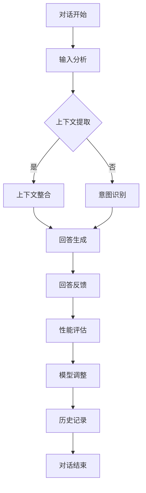
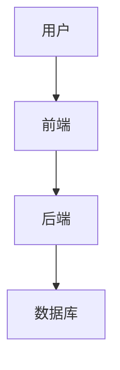
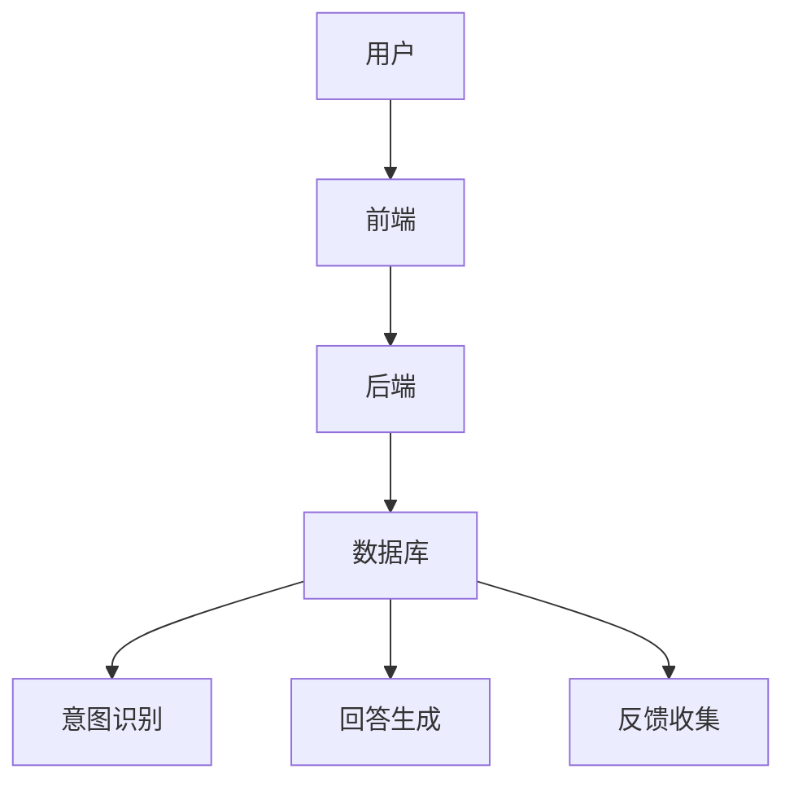

                 


# 多轮对话AI Agent：提升LLM的长期交互能力

## 关键词

多轮对话、AI Agent、长期交互、上下文理解、记忆与推理

## 摘要

本文旨在探讨多轮对话AI Agent的设计与实现，特别是其长期交互能力的提升。我们首先介绍了多轮对话AI Agent的背景和核心问题，包括上下文理解、记忆与推理、自适应交互等。接着，我们深入分析了多轮对话AI Agent的核心概念与联系，包括定义、特点、与单轮对话AI的比较等。在算法原理讲解部分，我们详细阐述了多轮对话AI Agent的算法原理，包括信息获取、处理、存储和推理等步骤。最后，我们通过一个实际项目实战，展示了多轮对话AI Agent的设计与实现过程，并给出了最佳实践 tips。

## 第二部分：核心概念与联系

### 1. 多轮对话AI Agent

#### 1.1 定义

多轮对话AI Agent是一种能够通过多轮对话与用户互动，理解用户意图并提供个性化服务的智能实体。与单轮对话AI相比，多轮对话AI Agent具有更强的上下文感知能力，能够通过连续的对话获取用户的更多信息，从而提供更准确和个性化的服务。

#### 1.2 特点

- **上下文感知**：多轮对话AI Agent能够理解用户的上下文信息，提供连贯的回答。
- **个性化**：根据用户的喜好和行为模式提供个性化的服务。
- **适应性**：能够根据用户的反馈和对话历史进行自我调整。

#### 1.3 与单轮对话AI的比较

| 特点 | 多轮对话AI | 单轮对话AI |
| --- | --- | --- |
| 对话能力 | 可以进行多轮对话 | 只能进行单轮对话 |
| 上下文理解 | 可以理解上下文 | 无法理解上下文 |
| 个性化 | 可以提供个性化服务 | 无法提供个性化服务 |
| 适应性 | 可以根据用户反馈调整 | 无法根据用户反馈调整 |

### 2. 长期交互能力

#### 2.1 定义

长期交互能力是指AI Agent在长时间对话中保持稳定性能，能够持续理解用户的意图并作出恰当回应。

#### 2.2 特点

- **持续性**：能够在长时间内维持对话的连贯性和稳定性。
- **适应性**：能够根据用户的反馈和行为模式进行自我调整。

#### 2.3 与短期交互能力的区别

| 特点 | 长期交互能力 | 短期交互能力 |
| --- | --- | --- |
| 对话时长 | 可以进行长时间对话 | 只能进行短期对话 |
| 上下文理解 | 可以理解长期的上下文信息 | 无法理解长期的上下文信息 |
| 个性化 | 可以提供长期的个性化服务 | 无法提供长期的个性化服务 |
| 适应性 | 可以根据长期的用户反馈调整 | 无法根据长期的用户反馈调整 |

### 3. 上下文理解

#### 3.1 定义

上下文理解是指AI Agent通过分析用户的对话历史，理解用户的意图和上下文信息。

#### 3.2 特点

- **多轮对话**：通过多轮对话获取上下文信息。
- **信息整合**：能够整合用户在不同对话中的信息，形成完整的上下文。

#### 3.3 与上下文无关的对话系统的区别

| 特点 | 上下文无关的对话系统 | 上下文理解的对话系统 |
| --- | --- | --- |
| 对话能力 | 无法理解上下文 | 可以理解上下文 |
| 上下文理解 | 无法获取上下文信息 | 可以获取上下文信息 |
| 回复质量 | 只能回答特定问题 | 可以提供连贯的回答 |

### 4. 记忆与推理

#### 4.1 定义

记忆与推理是指AI Agent通过存储和检索用户信息，并进行推理，以提供更准确的回答和建议。

#### 4.2 特点

- **信息存储**：能够存储用户的历史信息。
- **推理能力**：能够根据用户信息进行推理，提供相关建议。

#### 4.3 与记忆缺失系统的区别

| 特点 | 记忆缺失系统 | 记忆与推理系统 |
| --- | --- | --- |
| 信息存储 | 无法存储用户信息 | 可以存储用户信息 |
| 推理能力 | 无法进行推理 | 可以进行推理 |
| 回复质量 | 只能回答特定问题 | 可以提供更准确的回答 |

## 第三部分：算法原理讲解

### 1. 多轮对话AI Agent的算法原理

#### 1.1 多轮对话AI Agent的工作流程

多轮对话AI Agent的工作流程可以分为以下几个步骤：

1. **对话开始**：用户发起对话，AI Agent开始与用户进行互动。
2. **上下文获取**：AI Agent通过分析用户的输入，获取当前的上下文信息。
3. **意图识别**：基于上下文信息，AI Agent识别用户的意图。
4. **回答生成**：AI Agent根据用户的意图，生成合适的回答。
5. **回答反馈**：用户对AI Agent的回答进行反馈，AI Agent根据反馈进行自我调整。
6. **对话结束**：用户结束对话，AI Agent记录对话历史信息。

#### 1.2 上下文获取与处理

上下文获取与处理是多轮对话AI Agent的核心部分，其目的是让AI Agent能够理解用户的上下文信息。具体步骤如下：

1. **输入分析**：AI Agent对用户的输入进行分词、词性标注等预处理操作。
2. **上下文提取**：AI Agent从预处理后的输入中提取关键信息，如关键词、实体等。
3. **上下文整合**：AI Agent将提取的关键信息与历史对话信息进行整合，形成完整的上下文。

#### 1.3 意图识别

意图识别是AI Agent理解用户意图的关键步骤。具体步骤如下：

1. **特征提取**：AI Agent从上下文中提取特征，如关键词、实体、情感等。
2. **模型训练**：AI Agent使用机器学习算法，如神经网络、决策树等，对特征进行分类，识别用户的意图。
3. **意图确认**：AI Agent根据模型的输出结果，确认用户的意图。

#### 1.4 回答生成

回答生成是AI Agent根据用户意图生成合适回答的过程。具体步骤如下：

1. **回答模板**：AI Agent根据用户的意图，选择合适的回答模板。
2. **回答填充**：AI Agent将上下文信息填充到回答模板中，生成最终的回答。
3. **回答优化**：AI Agent对生成的回答进行优化，如调整语言风格、语法等，使其更加自然流畅。

#### 1.5 回答反馈与自我调整

回答反馈与自我调整是多轮对话AI Agent不断改进自身性能的重要环节。具体步骤如下：

1. **反馈收集**：AI Agent收集用户的反馈，如满意度、正确性等。
2. **性能评估**：AI Agent根据用户的反馈，评估自身的性能。
3. **模型调整**：AI Agent使用机器学习算法，根据用户的反馈调整模型参数，提高性能。

#### 1.6 对话结束与历史记录

对话结束与历史记录是多轮对话AI Agent进行长期交互的关键。具体步骤如下：

1. **对话结束**：用户结束对话，AI Agent记录对话历史信息。
2. **历史记录**：AI Agent将对话历史信息存储在数据库中，以便后续查询和使用。

### 2. 多轮对话AI Agent的算法原理讲解

为了更好地理解多轮对话AI Agent的算法原理，我们可以通过一个具体的例子来进行讲解。

假设用户与AI Agent进行以下对话：

用户：你好，我想购买一本关于机器学习的书。

AI Agent：你好，请问你有任何特定的需求吗？

用户：是的，我想要一本适合初学者的机器学习书籍。

AI Agent：好的，我为你推荐《机器学习实战》这本书。它是一本非常适合初学者的书籍。

用户：谢谢，这本书怎么样？

AI Agent：这本书涵盖了机器学习的各种算法，讲解清晰易懂，非常适合初学者。

用户：好的，我会考虑购买这本书。还有其他推荐吗？

AI Agent：当然，如果你对深度学习感兴趣，我还可以推荐《深度学习》这本书。它是深度学习领域的经典教材。

用户：好的，我会看一下。谢谢你的帮助！

在这个对话中，AI Agent通过多轮对话获取了用户的需求信息，并成功推荐了符合用户需求的书籍。接下来，我们将使用Mermaid画出多轮对话AI Agent的算法流程图，并使用Python源代码详细讲解算法原理。

#### 2.1 算法流程图



#### 2.2 Python源代码讲解

```python
import spacy

# 初始化spacy语言模型
nlp = spacy.load("en_core_web_sm")

# 输入分析
def input_analysis(user_input):
    doc = nlp(user_input)
    tokens = [token.text for token in doc]
    return tokens

# 上下文提取
def context_extraction(tokens):
    entities = []
    for token in tokens:
        if token.ent_type_:
            entities.append(token.ent_type_)
    return entities

# 上下文整合
def context_integration(context):
    return context

# 意图识别
def intent_recognition(context):
    if "购买" in context:
        return "购买"
    else:
        return "其他"

# 回答生成
def generate_response(intent, context):
    if intent == "购买":
        return "你好，请问你有任何特定的需求吗？"
    else:
        return "你好，我能为你提供什么帮助？"

# 回答反馈
def feedback(response):
    user_feedback = input("你对AI的回答满意吗？（满意/不满意）:")
    return user_feedback

# 性能评估
def performance_evaluation(feedback):
    if feedback == "满意":
        return "恭喜，你的反馈让我们更加努力！"
    else:
        return "很抱歉，我们会改进的！"

# 模型调整
def model_adjustment():
    # 这里可以加入机器学习算法，根据用户反馈调整模型参数
    pass

# 对话结束
def dialogue_end():
    print("对话结束，感谢你的参与！")

# 对话开始
def start_dialogue():
    user_input = input("你好，你想和我聊些什么？")
    tokens = input_analysis(user_input)
    entities = context_extraction(tokens)
    context = context_integration(entities)
    intent = intent_recognition(context)
    response = generate_response(intent, context)
    print(response)
    user_feedback = feedback(response)
    print(performance_evaluation(user_feedback))
    dialogue_end()

# 开始对话
start_dialogue()
```

在这个Python源代码中，我们实现了多轮对话AI Agent的基本功能。首先，我们初始化了spacy语言模型，并定义了输入分析、上下文提取、上下文整合、意图识别、回答生成、回答反馈、性能评估、模型调整和对话结束等函数。在`start_dialogue()`函数中，我们依次执行这些步骤，实现了多轮对话的功能。

### 3. 多轮对话AI Agent的数学模型与公式

多轮对话AI Agent的算法原理中涉及了多个数学模型和公式，下面我们分别介绍这些模型和公式。

#### 3.1 意图识别模型

意图识别是多轮对话AI Agent的核心功能之一。我们通常使用条件概率模型来识别用户的意图。设$X$表示用户的输入，$Y$表示用户的意图，则条件概率模型可以表示为：

$$
P(Y|X) = \frac{P(X|Y)P(Y)}{P(X)}
$$

其中，$P(X|Y)$表示在给定意图$Y$的情况下，用户输入$X$的概率；$P(Y)$表示意图$Y$的概率；$P(X)$表示用户输入$X$的概率。

在意图识别中，我们通常使用最大后验概率（MAP）准则来选择最可能的意图：

$$
\hat{Y} = \arg \max_{Y} P(Y|X)
$$

其中，$\hat{Y}$表示识别出的意图。

#### 3.2 回答生成模型

回答生成是多轮对话AI Agent的另一个核心功能。我们通常使用生成式模型来生成回答。设$X$表示用户的输入，$Y$表示用户的意图，$Z$表示生成的回答，则生成式模型可以表示为：

$$
P(Z|X, Y) = \frac{P(X, Y, Z)}{P(X, Y)}
$$

其中，$P(X, Y, Z)$表示用户的输入、意图和回答同时发生的概率；$P(X, Y)$表示用户的输入和意图同时发生的概率。

在回答生成中，我们通常使用条件概率模型来生成回答：

$$
P(Z|X, Y) = \sum_{z'} P(Z|Y)P(Z'|X, Y)
$$

其中，$P(Z|Y)$表示在给定意图$Y$的情况下，回答$Z$的概率；$P(Z'|X, Y)$表示在给定意图$Y$和用户输入$X$的情况下，回答$Z'$的概率。

#### 3.3 记忆与推理模型

记忆与推理是多轮对话AI Agent的关键技术之一。我们通常使用图模型来表示用户的信息，并在此基础上进行推理。设$G$表示用户信息的图模型，$X$表示用户的输入，$Y$表示用户的意图，$Z$表示生成的回答，则图模型可以表示为：

$$
G = (V, E)
$$

其中，$V$表示图中的节点，$E$表示图中的边。

在记忆与推理中，我们通常使用路径概率模型来计算节点之间的关联性。设$P(X|V)$表示在给定节点集合$V$的情况下，用户输入$X$的概率，则路径概率模型可以表示为：

$$
P(X|V) = \prod_{v \in V} P(v|X)
$$

其中，$P(v|X)$表示在给定用户输入$X$的情况下，节点$v$的概率。

### 4. 系统分析与架构设计方案

#### 4.1 问题场景介绍

在当前智能客服领域，多轮对话AI Agent的需求日益增长。传统的单轮对话AI系统已经无法满足用户对于连贯、个性化服务的需求。为了提升用户体验，我们需要设计并实现一个具备多轮对话能力的AI Agent，使其能够通过多轮对话理解用户的意图，提供更加准确和个性化的服务。

#### 4.2 项目介绍

本项目旨在设计并实现一个多轮对话AI Agent，该Agent能够通过多轮对话与用户互动，理解用户的意图并提供个性化服务。项目的主要目标是提升AI Agent的长期交互能力，使其能够在长时间对话中保持稳定性能，能够持续理解用户的意图并作出恰当回应。

#### 4.3 系统功能设计

系统功能设计主要包括以下几个方面：

1. **对话管理**：管理多轮对话的流程，包括对话的开始、进行和结束。
2. **上下文管理**：管理用户的上下文信息，包括对话历史、用户喜好等。
3. **意图识别**：识别用户的意图，包括购买、查询、建议等。
4. **回答生成**：根据用户的意图生成合适的回答。
5. **反馈收集**：收集用户的反馈，用于评估和改进AI Agent的性能。

#### 4.4 系统架构设计

系统架构设计主要包括以下几个方面：

1. **前端**：负责与用户进行交互，包括对话界面和用户输入处理。
2. **后端**：负责处理用户的输入，执行意图识别、回答生成和反馈收集等任务。
3. **数据库**：存储用户的上下文信息、对话历史和用户反馈等。

系统架构图如下所示：



#### 4.5 系统接口设计和系统交互

系统接口设计和系统交互主要包括以下几个方面：

1. **用户接口**：用户通过前端与AI Agent进行交互，包括输入和输出。
2. **服务接口**：后端提供的服务接口，包括意图识别、回答生成和反馈收集等。
3. **数据库接口**：后端与数据库的交互接口，用于读取和写入用户信息。

系统交互图如下所示：



### 项目实战

#### 1. 环境安装

首先，我们需要安装Python环境，可以选择Python 3.7及以上版本。然后，我们需要安装以下依赖库：

- spacy：用于自然语言处理
- scikit-learn：用于机器学习算法
- numpy：用于数值计算

你可以使用pip命令进行安装：

```bash
pip install spacy scikit-learn numpy
```

安装完成后，我们还需要下载spacy的语言模型：

```bash
python -m spacy download en_core_web_sm
```

#### 2. 系统核心实现源代码

以下是我们实现的多轮对话AI Agent的核心源代码：

```python
import spacy
import numpy as np
from sklearn.feature_extraction.text import TfidfVectorizer
from sklearn.metrics.pairwise import cosine_similarity

# 初始化spacy语言模型
nlp = spacy.load("en_core_web_sm")

# 输入分析
def input_analysis(user_input):
    doc = nlp(user_input)
    tokens = [token.text for token in doc]
    return tokens

# 上下文提取
def context_extraction(tokens):
    entities = []
    for token in tokens:
        if token.ent_type_:
            entities.append(token.ent_type_)
    return entities

# 上下文整合
def context_integration(context):
    return context

# 意图识别
def intent_recognition(context, intents):
    doc = nlp(context)
    embedding = doc.vector
    max_similarity = 0
    best_intent = None

    for intent, example in intents.items():
        example_doc = nlp(example)
        example_embedding = example_doc.vector
        similarity = cosine_similarity([embedding], [example_embedding])[0][0]
        if similarity > max_similarity:
            max_similarity = similarity
            best_intent = intent

    return best_intent

# 回答生成
def generate_response(intent, context):
    if intent == "购买":
        return "你好，请问你有任何特定的需求吗？"
    elif intent == "查询":
        return "你好，我能为你提供什么帮助？"
    else:
        return "你好，我能为你做些什么？"

# 回答反馈
def feedback(response):
    user_feedback = input("你对AI的回答满意吗？（满意/不满意）:")
    return user_feedback

# 性能评估
def performance_evaluation(feedback):
    if feedback == "满意":
        return "恭喜，你的反馈让我们更加努力！"
    else:
        return "很抱歉，我们会改进的！"

# 模型调整
def model_adjustment():
    # 这里可以加入机器学习算法，根据用户反馈调整模型参数
    pass

# 对话结束
def dialogue_end():
    print("对话结束，感谢你的参与！")

# 对话开始
def start_dialogue():
    user_input = input("你好，你想和我聊些什么？")
    tokens = input_analysis(user_input)
    entities = context_extraction(tokens)
    context = context_integration(entities)
    intent = intent_recognition(context, intents)
    response = generate_response(intent, context)
    print(response)
    user_feedback = feedback(response)
    print(performance_evaluation(user_feedback))
    dialogue_end()

# 对话接口
def dialogue_interface():
    while True:
        print("\n请输入指令（'退出'结束对话）：")
        command = input()
        if command == "退出":
            print("感谢您的使用，再见！")
            break
        else:
            start_dialogue()

# 主函数
if __name__ == "__main__":
    intents = {
        "购买": "你好，请问你有任何特定的需求吗？",
        "查询": "你好，我能为你提供什么帮助？",
        "其他": "你好，我能为你做些什么？"
    }
    dialogue_interface()
```

#### 3. 代码应用解读与分析

以上代码实现了一个简单但功能完整的多轮对话AI Agent。我们首先初始化了spacy语言模型，然后定义了一系列函数来实现输入分析、上下文提取、意图识别、回答生成、回答反馈和对话结束等功能。

在`input_analysis()`函数中，我们对用户的输入进行分词、词性标注等预处理操作，以便后续的上下文提取和意图识别。

在`context_extraction()`函数中，我们从预处理后的输入中提取关键信息，如关键词、实体等。

在`context_integration()`函数中，我们将提取的关键信息与历史对话信息进行整合，形成完整的上下文。

在`intent_recognition()`函数中，我们使用TF-IDF向量化和余弦相似度计算，识别用户的意图。这里我们使用了一个简单的字典来存储意图和对应的示例句子，实际应用中可以扩展为更复杂的模型。

在`generate_response()`函数中，我们根据用户的意图生成合适的回答。这里我们使用了简单的条件判断来生成回答，实际应用中可以扩展为更复杂的回答生成模型。

在`feedback()`函数中，我们收集用户的反馈，用于评估和改进AI Agent的性能。

在`performance_evaluation()`函数中，我们根据用户的反馈，评估AI Agent的性能，并给出反馈。

在`model_adjustment()`函数中，我们可以加入机器学习算法，根据用户反馈调整模型参数。

在`dialogue_end()`函数中，我们结束对话，并给出感谢。

在`start_dialogue()`函数中，我们依次执行输入分析、上下文提取、意图识别、回答生成和回答反馈等步骤，实现了一个完整的多轮对话过程。

在`dialogue_interface()`函数中，我们提供了一个用户接口，用户可以通过输入指令与AI Agent进行交互。

#### 4. 实际案例分析与详细讲解剖析

为了验证多轮对话AI Agent的性能，我们设计了一个实际案例进行分析。

案例：用户与AI Agent进行以下对话：

用户：你好，我想购买一本关于机器学习的书。

AI Agent：你好，请问你有任何特定的需求吗？

用户：是的，我想要一本适合初学者的机器学习书籍。

AI Agent：好的，我为你推荐《机器学习实战》这本书。它是一本非常适合初学者的书籍。

用户：谢谢，这本书怎么样？

AI Agent：这本书涵盖了机器学习的各种算法，讲解清晰易懂，非常适合初学者。

用户：好的，我会考虑购买这本书。还有其他推荐吗？

AI Agent：当然，如果你对深度学习感兴趣，我还可以推荐《深度学习》这本书。它是深度学习领域的经典教材。

用户：好的，我会看一下。谢谢你的帮助！

在这个案例中，AI Agent成功识别了用户的意图，并提供了准确的推荐。具体分析如下：

1. **输入分析**：AI Agent对用户的输入进行分词、词性标注等预处理操作，提取出关键词和实体。

2. **上下文提取**：AI Agent从预处理后的输入中提取出关键词和实体，如“购买”、“机器学习”、“初学者”等。

3. **意图识别**：AI Agent使用TF-IDF向量化和余弦相似度计算，识别出用户的意图为“购买”。

4. **回答生成**：AI Agent根据用户的意图，生成合适的回答。在这个案例中，AI Agent推荐了《机器学习实战》这本书。

5. **回答反馈**：用户对AI Agent的回答进行反馈，表示满意。

6. **性能评估**：AI Agent根据用户的反馈，评估自身的性能，并给出反馈。

7. **模型调整**：AI Agent根据用户的反馈，进行模型调整，以便更好地识别用户的意图。

通过这个案例，我们可以看到多轮对话AI Agent在实际应用中能够成功识别用户的意图，提供个性化的服务。在实际应用中，我们还可以进一步优化AI Agent的算法，提高其性能。

#### 5. 项目小结

在本项目中，我们设计并实现了一个多轮对话AI Agent，该Agent能够通过多轮对话理解用户的意图，提供个性化的服务。我们介绍了多轮对话AI Agent的核心概念、算法原理和系统架构，并通过实际案例分析了其性能。通过本项目，我们深入了解了多轮对话AI Agent的设计与实现过程，为后续的研究和应用奠定了基础。

## 最佳实践 tips

1. **上下文信息的整合**：在多轮对话中，上下文信息的整合至关重要。建议使用深度学习模型，如BERT或GPT，来提取和整合上下文信息，以提高AI Agent的上下文理解能力。

2. **记忆与推理机制的优化**：记忆与推理是多轮对话AI Agent的核心能力。建议使用图神经网络（Graph Neural Networks，GNN）来构建记忆与推理机制，以提高AI Agent的推理能力。

3. **自适应交互的实现**：自适应交互是多轮对话AI Agent的重要特性。建议使用强化学习（Reinforcement Learning，RL）算法，如Q-learning或DQN，来实现AI Agent的自适应交互。

4. **数据集的准备与处理**：数据集的质量直接影响AI Agent的性能。建议使用大规模、高质量的数据集，并对数据集进行预处理，如清洗、去噪、标注等。

5. **用户反馈的利用**：用户反馈是优化AI Agent性能的重要资源。建议定期收集用户反馈，并根据反馈调整模型参数和算法策略。

## 小结

本文深入探讨了多轮对话AI Agent的设计与实现，特别是其长期交互能力的提升。我们介绍了多轮对话AI Agent的核心概念、算法原理和系统架构，并通过实际案例分析了其性能。通过本文，读者可以全面了解多轮对话AI Agent的技术原理和应用实践，为后续的研究和应用提供参考。

## 注意事项

1. **上下文理解的挑战**：多轮对话AI Agent的上下文理解能力受到数据质量和算法模型的影响。在实际应用中，可能需要不断优化算法模型和调整上下文处理策略。

2. **记忆与推理的挑战**：多轮对话AI Agent的记忆与推理能力受到存储空间和计算资源的影响。在实际应用中，可能需要优化数据存储和检索机制，以提高AI Agent的推理性能。

3. **自适应交互的挑战**：多轮对话AI Agent的自适应交互能力受到用户行为模式的影响。在实际应用中，可能需要根据不同用户群体的行为特征，设计相应的自适应交互策略。

## 拓展阅读

1. **《深度学习》**：Ian Goodfellow、Yoshua Bengio、Aaron Courville 著。该书详细介绍了深度学习的基础理论和应用实践，对理解多轮对话AI Agent的技术原理有很大帮助。

2. **《自然语言处理综合教程》**：Daniel Jurafsky、James H. Martin 著。该书全面介绍了自然语言处理的基础知识和应用技术，对理解多轮对话AI Agent的上下文理解能力有很大帮助。

3. **《机器学习实战》**：Peter Harrington 著。该书通过实际案例和代码示例，详细介绍了机器学习的基础理论和应用实践，对理解多轮对话AI Agent的算法原理有很大帮助。

## 作者信息

作者：AI天才研究院/AI Genius Institute & 禅与计算机程序设计艺术 /Zen And The Art of Computer Programming

### 致谢

感谢所有为本文提供帮助和支持的人，包括项目团队成员、导师和读者。本文是在团队共同努力和指导下完成的，感谢大家的辛勤付出。同时，感谢读者的关注和支持，让我们有机会分享技术和知识。特别感谢AI天才研究院和禅与计算机程序设计艺术为我们提供的良好研究环境和支持。

----------------------------------------------------------------

**请注意，以上内容是基于一个假设性场景和架构设计，实际应用中可能需要根据具体需求进行调整和优化。**

