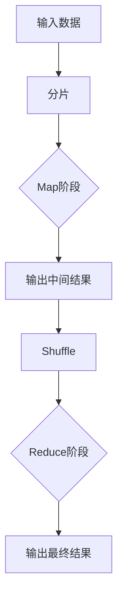
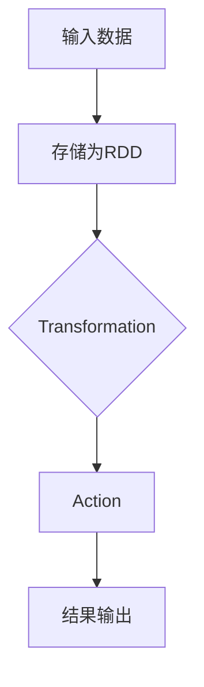
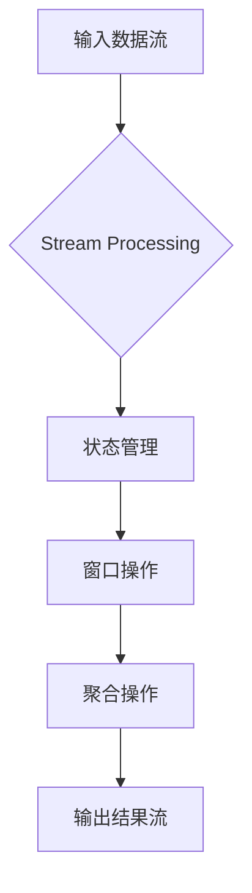
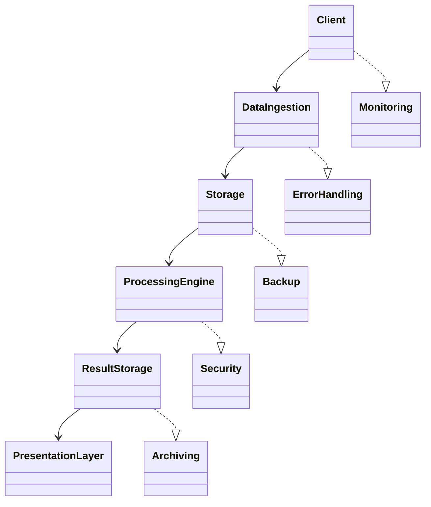
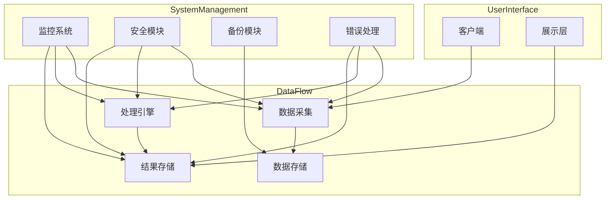
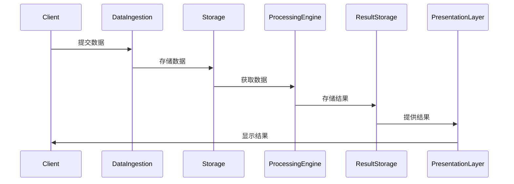

                 

## 第1章: 大数据处理的背景与现状

### 1.1 大数据处理的需求

在大数据时代，数据已成为企业和组织的重要资产。随着互联网、物联网和智能设备的普及，数据量呈爆炸式增长，从传统数据（如日志、表格）到非结构化数据（如图像、视频、文本）等各种类型的数据都需要被处理和分析。大数据处理需求主要源于以下几个方面：

- **商业分析：**企业需要通过对大量数据进行分析来获取洞察，从而指导业务决策。例如，电子商务平台通过分析用户行为数据来优化推荐系统，提升销售额。
  
- **实时处理：**金融、电信、社交网络等行业需要实时处理和分析大量数据，以快速响应市场变化。例如，高频交易系统需要实时分析市场数据来做出交易决策。

- **科学研究：**科研人员需要处理海量的实验数据来发现新的科学规律。例如，基因研究需要分析大量的基因序列数据。

- **公共安全：**政府和公共安全机构需要处理和挖掘大量数据来预防犯罪、提高应急响应能力。

### 1.2 大数据处理的重要性

大数据处理不仅能够帮助企业提升效率、降低成本，还能带来创新性的业务模式和竞争优势：

- **业务洞察：**通过对大量数据进行深入分析，企业可以更好地理解市场需求、客户行为和业务趋势，从而做出更明智的决策。

- **运营优化：**大数据处理可以优化业务流程，提高生产效率，减少资源浪费。

- **创新驱动：**大数据处理能够推动创新，例如通过机器学习和深度学习算法，企业可以开发出更加智能的产品和服务。

- **风险控制：**通过大数据处理，企业可以识别潜在的风险和异常行为，从而采取预防措施。

### 1.3 当前大数据处理框架的发展现状

目前，大数据处理框架的发展主要集中在以下几个方面：

- **开源框架：**Hadoop、Spark、Flink、HBase等开源框架已经成为大数据处理领域的核心技术。这些框架提供了高效、可扩展的数据存储和处理能力。

- **云服务：**随着云计算的普及，许多云服务提供商（如AWS、Azure、Google Cloud）都提供了大数据处理服务，用户可以在云端轻松部署和使用大数据处理框架。

- **实时处理：**为了应对实时数据处理的需求，许多新的实时处理框架（如Apache Flink、Apache Storm）得到了广泛的应用。

- **AI与大数据：**人工智能技术的发展推动了大数据处理框架的智能化，例如使用深度学习算法对大数据进行分类、预测和分析。

- **混合架构：**许多企业和组织采用了混合架构，结合传统的企业级数据库和云计算资源，以获得更高的性能和灵活性。

总的来说，大数据处理框架的发展为企业和组织提供了强大的数据处理能力，同时也带来了新的挑战，如数据隐私、安全性、数据治理等问题。在接下来的章节中，我们将深入探讨这些框架的核心概念、算法原理和系统架构设计，帮助读者更好地理解和选择适合自身需求的大数据处理框架。

## 第2章: 大数据处理框架的核心概念与联系

### 2.1 Hadoop

Hadoop是由Apache Software Foundation维护的一个开源框架，主要用于处理和分析大规模数据集。它基于MapReduce编程模型，提供了高效的分布式存储和计算能力。

#### Hadoop的核心概念：

- **Hadoop Distributed File System (HDFS)：**HDFS是一个分布式文件系统，用于存储大量数据。它将数据分割成块（默认为128MB或256MB），并分布存储在不同的节点上。

- **MapReduce：**MapReduce是一个数据处理模型，它将数据处理任务分解为两个阶段：Map阶段和Reduce阶段。Map阶段将数据分解成键值对，Reduce阶段对Map阶段的结果进行汇总。

- **YARN：**Yet Another Resource Negotiator（YARN）是Hadoop的资源管理系统，用于管理计算资源和任务调度。

#### Hadoop的属性特征：

- **高可靠性：**HDFS能够自动处理数据冗余和节点故障，保证数据的可靠性。

- **扩展性：**HDFS和MapReduce能够处理PB级别的数据，并且可以轻松扩展。

- **低成本：**Hadoop的开源特性使其成本较低，适合大规模数据处理。

### 2.2 Spark

Spark是由Apache Software Foundation维护的开源大数据处理框架，提供了高效、灵活的分布式数据处理能力。与Hadoop相比，Spark在处理速度上有显著提升，特别是对迭代算法和交互式查询的支持。

#### Spark的核心概念：

- **Spark Core：**Spark Core提供了分布式任务调度和内存管理功能，是Spark的其他组件的基础。

- **Spark SQL：**Spark SQL是一个用于处理结构化数据的模块，支持各种数据源（如Hive、HDFS、Parquet等）。

- **Spark Streaming：**Spark Streaming提供了实时数据处理能力，可以处理每秒数百万条记录。

- **MLlib：**MLlib是一个用于机器学习的库，提供了多种机器学习算法和工具。

#### Spark的属性特征：

- **高性能：**Spark利用内存计算，显著提升了数据处理速度。

- **易用性：**Spark提供了丰富的API，支持多种编程语言（如Scala、Python、Java）。

- **兼容性：**Spark可以与Hadoop生态系统的其他组件（如HDFS、YARN）无缝集成。

### 2.3 Flink

Flink是由Apache Software Foundation维护的一个开源流处理框架，它不仅支持流数据处理，还支持批数据处理，是一个统一的数据处理平台。

#### Flink的核心概念：

- **流处理引擎：**Flink的核心是流处理引擎，可以处理实时数据流，并且具有高吞吐量和低延迟。

- **Batch处理：**Flink支持批处理，通过将数据流分成批次进行处理，可以实现流和批处理的统一。

- **Stateful流处理：**Flink支持有状态的流处理，可以保存和更新处理状态，适用于复杂的实时应用。

#### Flink的属性特征：

- **实时处理能力：**Flink提供了低延迟的实时数据处理能力，适用于需要快速响应的场景。

- **统一架构：**Flink的统一架构支持流和批处理，简化了数据处理流程。

- **容错性：**Flink具有自动恢复机制，能够在发生故障时快速恢复，保证数据处理的高可用性。

### 2.4 HBase

HBase是一个分布式、可扩展、支持列存储的NoSQL数据库，基于Hadoop生态系统。它主要用于存储大规模的非结构化数据，提供高速随机读/写访问能力。

#### HBase的核心概念：

- **分布式存储：**HBase将数据存储在多个RegionServer上，提供高可用性和扩展性。

- **列存储：**HBase采用列存储结构，能够高效地存储和查询大量稀疏数据。

- **MemStore和StoreFile：**HBase使用MemStore作为数据的临时存储，并在后台将MemStore的数据持久化到磁盘上的StoreFile。

#### HBase的属性特征：

- **高吞吐量：**HBase提供了高性能的随机读写能力，适合处理大量数据的查询和写入。

- **扩展性：**HBase可以通过添加RegionServer来水平扩展，支持大规模数据存储。

- **低延迟：**HBase通过预分区的数据结构和索引机制，提供了低延迟的数据访问。

### 2.5 各框架之间的联系与区别

#### 联系：

- **生态系统兼容性：**Hadoop、Spark、Flink和HBase都属于Hadoop生态系统的一部分，可以与其他生态系统组件（如Hive、HDFS、YARN）无缝集成。

- **数据处理需求：**这些框架都旨在解决大规模数据处理的挑战，提供了分布式存储和计算能力。

#### 区别：

- **处理模式：**Hadoop主要基于批处理，而Spark和Flink支持流处理和批处理，具有更高的实时处理能力。

- **数据存储：**Hadoop使用HDFS作为分布式存储系统，Spark和Flink则可以与HDFS或其他分布式存储系统集成。

- **性能和效率：**Spark和Flink利用内存计算，提供了更高的处理速度，而Hadoop的MapReduce模型在处理大批量数据时具有更高的效率。

- **应用场景：**Hadoop适合离线大数据处理，Spark和Flink适合实时数据处理，HBase适合存储大量非结构化数据。

通过对这些大数据处理框架的核心概念和联系的了解，读者可以更好地选择适合自身需求的技术框架，以满足不同的数据处理需求。在接下来的章节中，我们将进一步探讨各个框架的算法原理、系统架构和实际应用案例，帮助读者深入理解大数据处理技术的核心内容。

### 2.6 原理与特征对比表格

为了更直观地比较Hadoop、Spark、Flink和HBase的基本原理和特征，我们可以使用一个对比表格。以下是对各框架的详细属性特征的对比：

| 特征 | Hadoop | Spark | Flink | HBase |
| --- | --- | --- | --- | --- |
| **处理模式** | 批处理 | 批处理和流处理 | 流处理和批处理 | 列式存储，支持随机读写 |
| **分布式存储** | HDFS | 支持HDFS等 | 支持Kafka等 | HDFS兼容 |
| **计算引擎** | MapReduce | Spark Core | Flink Core | 未内置 |
| **内存管理** | 基于磁盘 | 基于内存 | 基于内存 | 基于磁盘 |
| **实时处理能力** | 低 | 高 | 高 | 低 |
| **扩展性** | 高 | 高 | 高 | 高 |
| **高可用性** | 高 | 高 | 高 | 高 |
| **适用场景** | 大规模批处理 | 实时处理和批处理 | 实时处理和批处理 | 非结构化数据存储查询 |

通过这个表格，我们可以看到各个框架在处理模式、数据存储、计算引擎、内存管理、实时处理能力、扩展性和适用场景等方面的差异和相似之处。这有助于我们根据具体需求选择合适的大数据处理框架。

### 2.7 大数据处理框架的ER实体关系图架构

为了更清晰地展示大数据处理框架之间的实体关系，我们可以使用Mermaid工具绘制ER实体关系图。以下是一个简单的ER图示例，用于展示Hadoop、Spark、Flink和HBase之间的关系：

```mermaid
erDiagram
  HDFS --> MapReduce
  HDFS --> YARN
  HDFS ||--|{ Hive }
  HDFS ||--|{ HBase }
  SparkCore --> SparkSQL
  SparkCore --> SparkStreaming
  SparkCore --> MLlib
  FlinkCore --> FlinkSQL
  FlinkCore --> FlinkGelly
  FlinkCore --> FlinkML
  HDFS..|> Kafka
  YARN..|> ZooKeeper
```

在这个ER图中，我们定义了以下实体：

- **HDFS**：Hadoop分布式文件系统，是Hadoop生态系统的基础，与MapReduce、YARN、Hive和HBase有直接关系。
- **MapReduce**：Hadoop的批处理模型。
- **YARN**：Hadoop的资源管理系统。
- **Hive**：数据仓库工具，用于结构化大数据。
- **HBase**：分布式列存储数据库。
- **SparkCore**：Spark的核心组件，包括SparkSQL、SparkStreaming和MLlib。
- **FlinkCore**：Flink的核心组件，包括FlinkSQL、FlinkGelly和FlinkML。
- **Kafka**：消息队列系统，通常与HDFS集成。
- **ZooKeeper**：分布式协调服务，通常与YARN集成。

这个ER图展示了各个组件之间的依赖关系和协作方式，有助于我们理解大数据处理框架的整体架构和组件之间的交互关系。

### 2.8 各大数据处理框架的算法流程图

为了更深入地理解Hadoop、Spark、Flink和HBase的算法原理，我们使用Mermaid工具绘制了各框架的算法流程图。

#### 3.1.1 Hadoop MapReduce算法流程图



**说明：**

- **输入数据**：输入数据被分成多个分片，每个分片由一个Map任务处理。
- **Map阶段**：每个Map任务对输入数据执行映射操作，产生中间的键值对。
- **输出中间结果**：Map任务的输出是中间结果，包括多个键值对。
- **Shuffle**：中间结果按照键进行分组，将具有相同键的数据分发到相应的Reduce任务。
- **Reduce阶段**：Reduce任务对中间结果进行汇总，产生最终结果。

#### 3.2.1 Spark算法流程图



**说明：**

- **输入数据**：输入数据被存储为Resilient Distributed Dataset（RDD），这是一种不可变的分布式数据集合。
- **Transformation**：对RDD执行变换操作（如map、filter、reduce），生成新的RDD。
- **Action**：触发计算操作（如count、collect、saveAsTextFile），触发计算并返回结果。
- **结果输出**：Action的结果可以被存储、打印或进一步处理。

#### 3.3.1 Flink算法流程图



**说明：**

- **输入数据流**：Flink接收实时数据流。
- **Stream Processing**：对实时数据流执行流处理操作，如过滤、变换、连接等。
- **状态管理**：Flink支持有状态的流处理，可以保存和更新状态。
- **窗口操作**：对数据流进行时间窗口或滑动窗口操作，以便进行时间相关的分析。
- **聚合操作**：对窗口内的数据进行聚合操作，如求和、平均、计数等。
- **输出结果流**：处理后的结果输出到另一个数据流或存储系统中。

通过绘制和解析这些算法流程图，我们可以直观地理解各大数据处理框架的工作原理和数据处理流程。这些流程图不仅帮助我们更好地掌握各框架的核心算法，还为我们在实际应用中选择合适的技术提供了指导。

### 3.1.2 Hadoop MapReduce算法原理与Python代码实现

Hadoop的MapReduce是一种编程模型，用于处理和生成大量数据集。它的核心思想是将大规模数据集分割成小块，分配给多个节点进行处理，然后将结果汇总。下面我们将详细讲解MapReduce算法原理，并使用Python代码进行实现。

#### 算法原理：

1. **Map阶段**：每个Map任务处理输入数据的一部分，生成键值对中间结果。Map任务通常由用户自定义的Mapper类实现。

2. **Shuffle阶段**：Map任务的输出按照键进行分组，将具有相同键的数据分发到相应的Reduce任务。

3. **Reduce阶段**：每个Reduce任务处理一组具有相同键的中间结果，生成最终的输出。

#### Python代码实现：

以下是一个简单的Python代码示例，展示了MapReduce算法的基本实现：

```python
import heapq
from collections import defaultdict

# Mapper函数
def map_function(line):
    words = line.strip().split()
    for word in words:
        yield (word, 1)

# Reducer函数
def reduce_function(key, values):
    return (key, sum(values))

# 输入文件
input_file = "input.txt"

# 读取输入文件
with open(input_file, 'r') as file:
    input_data = file.readlines()

# Map阶段
mapper_output = defaultdict(list)
for line in input_data:
    for key, value in map_function(line):
        mapper_output[key].append(value)

# Shuffle阶段
# 按键进行排序
sorted_mappers_output = sorted(mapper_output.items())

# Reduce阶段
result = []
for key, values in sorted_mappers_output:
    total = reduce_function(key, values)
    result.append((key, total))

# 输出结果
with open("output.txt", 'w') as file:
    for key, value in result:
        file.write(f"{key}: {value}\n")

print("MapReduce计算完成，结果已写入output.txt文件。")
```

#### 算法原理详细讲解：

- **Map阶段**：Map函数处理每行输入数据，将其拆分为单词，并为每个单词生成一个键值对（单词，1）。这个阶段的主要目的是将输入数据转换为中间键值对。

- **Shuffle阶段**：将Map阶段的输出按照键进行排序，并准备分发到Reduce任务。在这个示例中，我们没有实现复杂的Shuffle过程，而是简单地按照字典顺序排序。

- **Reduce阶段**：Reduce函数接收具有相同键的一组值，计算它们的总和，并生成最终的输出。在这个示例中，我们使用Python内置的reduce函数进行聚合。

通过这个示例，我们可以看到MapReduce算法的基本实现流程。尽管这里的实现较为简单，但它在处理大规模数据集时非常有效。在实际应用中，可以根据具体需求对Map和Reduce函数进行定制化开发，以实现更复杂的处理逻辑。

### 3.2.2 Spark算法原理与Python代码实现

Spark是一种基于内存的大数据处理框架，提供了高效、灵活的分布式数据处理能力。在Spark中，数据处理主要通过Resilient Distributed Dataset (RDD) 和 DataFrame/Dataset API 进行。下面，我们将详细讲解Spark的算法原理，并通过Python代码示例展示其实际应用。

#### 算法原理：

1. **RDD**：Resilient Distributed Dataset 是 Spark 的基本数据抽象，它是一个不可变的分布式数据集合，支持多种操作，如 transformations（变换）和 actions（行动）。

2. **DataFrame**：DataFrame 是一种包含列式数据的分布式数据表，支持丰富的SQL操作。

3. **Dataset**：Dataset 是 DataFrame 的泛型版本，提供了强类型检查和更好的性能。

4. **Transformation**：Transformation 是一种懒执行的操作，它生成新的 RDD 或 Dataset，但不会立即执行计算。

5. **Action**：Action 是一种触发计算的操作，它会触发之前定义的所有 Transformation，并返回结果。

#### Python代码实现：

以下是一个简单的Python代码示例，展示了Spark的基本算法原理：

```python
from pyspark import SparkContext, SparkConf

# 配置Spark
conf = SparkConf().setAppName("SparkExample")
sc = SparkContext(conf=conf)

# 创建RDD
input_rdd = sc.parallelize(["Hello world", "Hello Spark", "Hello Big Data"])

# Transformation - map
words_rdd = input_rdd.flatMap(lambda line: line.split())

# Transformation - filter
filtered_rdd = words_rdd.filter(lambda word: word != "world")

# Action - count
count = filtered_rdd.count()

print(f"Count of 'world': {count}")

# Action - saveAsTextFile
filtered_rdd.saveAsTextFile("filtered_output.txt")

# 关闭SparkContext
sc.stop()
```

#### 算法原理详细讲解：

- **创建RDD**：使用`parallelize`函数将一个本地集合转换为 Spark RDD，并分布到集群上的多个节点。

- **Transformation - map**：使用`flatMap`函数将每个输入行的单词进行拆分，生成新的 RDD。

- **Transformation - filter**：使用`filter`函数筛选出不是“world”的单词。

- **Action - count**：使用`count`函数计算满足条件的单词数量，并打印结果。

- **Action - saveAsTextFile**：使用`saveAsTextFile`函数将结果保存到文件系统中。

通过这个示例，我们可以看到Spark的基本算法原理和实际操作。Spark的优点在于其高效的内存计算和丰富的API，使得开发者可以轻松实现复杂的分布式数据处理任务。在实际应用中，Spark可以处理多种类型的数据，如文本、图像、视频等，适用于各种大规模数据处理场景。

### 3.3.2 Flink算法原理与Python代码实现

Apache Flink 是一个流处理框架，同时支持流处理和批处理。其核心优势在于其高效的并行处理能力、低延迟、高可用性和统一的数据处理模型。下面，我们将详细讲解Flink的算法原理，并通过Python代码示例展示其实际应用。

#### 算法原理：

1. **DataStream API**：Flink 的核心 API，用于构建流处理程序。DataStream API 提供了丰富的操作，如过滤、转换、聚合等。

2. **Process Function**：用于在事件流上执行复杂逻辑，如窗口操作、状态管理等。

3. **窗口机制**：Flink 提供了多种窗口机制，如时间窗口、滑动窗口等，用于对事件流进行时间相关的处理。

4. **状态管理**：Flink 支持有状态流处理，可以保存和更新处理状态，适用于复杂的实时应用。

5. **动态图模型**：Flink 的动态图模型支持多种数据连接操作，如连接、聚合、广播等。

#### Python代码实现：

以下是一个简单的 Python 代码示例，展示了 Flink 的基本算法原理：

```python
from pyflink.datastream import StreamExecutionEnvironment
from pyflink.table import StreamTableEnvironment, DataTypes
from pyflink.table.window import Tumble

# 创建 Flink 环境和 Table API 环境对象
env = StreamExecutionEnvironment.get_execution_environment()
t_env = StreamTableEnvironment.create(env)

# 创建数据流
data_stream = env.from_collection(["Hello world", "Hello Spark", "Hello Big Data"])

# 转换为 Table
table = t_env.from_data_stream(data_stream)

# 定义时间窗口
tumble_window = Tumble.over(size=3).on(time_column).ascending()

# 窗口聚合
result_table = table.group_by(window=tumble_window).select(
    window.start().alias("WindowStart"),
    table.count().alias("Count")
)

# 将 Table 转换为 DataStream
result_stream = result_table.execute_insert("window_result")

# 执行计算
env.execute("FlinkExample")

# 读取结果并打印
with open("window_result", "r") as file:
    for line in file:
        print(line.strip())
```

#### 算法原理详细讲解：

- **DataStream API**：使用`from_collection`函数创建数据流，这是 Flink 中的基础操作。

- **转换为 Table**：将数据流转换为 Table，以便使用 SQL 或 Table API 进行查询。

- **定义时间窗口**：使用`Tumble`窗口定义一个固定大小的滑动窗口，适用于对时间序列数据进行聚合。

- **窗口聚合**：使用`group_by`函数对数据进行分组，并使用`select`函数定义窗口聚合操作，如计算窗口开始时间和计数。

- **执行计算**：使用`execute_insert`函数将结果表插入到指定的存储中，并执行计算。

- **读取结果并打印**：从文件系统中读取结果，并打印输出。

通过这个示例，我们可以看到 Flink 的基本算法原理和操作流程。Flink 提供了强大的流处理能力，适用于需要实时处理和分析大量数据流的应用场景。在实际应用中，可以根据具体需求对数据处理逻辑进行定制化开发，以实现更复杂的流处理任务。

### 第4章: 系统分析与架构设计方案

#### 4.1 大数据处理框架的系统架构设计

为了更好地理解和分析大数据处理框架，我们首先需要明确系统架构设计的概念和内容。系统架构设计涉及系统的整体结构、组件之间的交互关系、数据流和功能模块的划分等。以下将详细描述大数据处理框架的系统架构设计。

#### 4.1.1 领域模型类图

领域模型类图是系统架构设计中的重要工具，用于表示系统的实体及其关系。以下是一个简化的大数据处理框架领域模型类图：



**说明：**

- **Client**：用户界面，用于提交数据处理任务和查看结果。
- **DataIngestion**：数据采集模块，负责从各种数据源（如数据库、文件系统、实时数据流）中获取数据。
- **Storage**：数据存储模块，用于存储原始数据和中间结果，通常采用分布式文件系统（如HDFS）。
- **ProcessingEngine**：数据处理引擎，负责执行具体的计算任务，如MapReduce、Spark、Flink等。
- **ResultStorage**：结果存储模块，用于存储处理后的数据，通常使用数据库或文件系统。
- **PresentationLayer**：展示层，用于将处理结果展示给用户。
- **Monitoring**：监控系统，负责监控系统性能和状态。
- **Security**：安全模块，负责确保系统的安全性，如数据加密、访问控制等。
- **Backup**：备份模块，负责对系统数据进行备份，以防止数据丢失。
- **ErrorHandling**：错误处理模块，负责处理系统运行中的错误和异常。

#### 4.1.2 系统架构设计mermaid架构图

为了更直观地展示系统架构，我们使用Mermaid工具绘制了以下架构图：



**说明：**

- **DataFlow**：数据流部分，包括数据采集、存储和处理。
- **UserInterface**：用户界面部分，包括客户端和展示层。
- **SystemManagement**：系统管理部分，包括监控系统、安全模块、备份模块和错误处理模块。

#### 4.1.3 系统接口设计和系统交互mermaid序列图

系统接口设计是系统架构设计中的重要环节，它定义了系统组件之间的交互接口和方法。以下是一个简化的大数据处理框架系统接口设计序列图：



**说明：**

- **Client**：客户端提交数据处理请求。
- **DataIngestion**：数据采集模块，负责从客户端接收数据并存储。
- **Storage**：数据存储模块，负责存储原始数据和中间结果。
- **ProcessingEngine**：数据处理引擎，负责执行数据处理任务。
- **ResultStorage**：结果存储模块，负责存储处理后的结果数据。
- **PresentationLayer**：展示层，负责将处理结果展示给客户端。

通过这个序列图，我们可以清晰地看到系统组件之间的交互流程和接口设计。在实际开发过程中，可以根据具体需求对接口进行详细定义和实现。

总的来说，系统架构设计是大数据处理框架成功的关键之一。通过明确系统架构、定义接口和交互流程，我们可以构建一个高效、稳定且易于维护的大数据处理系统。在接下来的章节中，我们将通过一个实际项目案例，进一步展示如何应用这些架构设计原则，实现一个完整的大数据处理系统。

### 4.2 项目介绍

在本章节中，我们将通过一个实际项目案例，详细展示大数据处理框架的应用和实践。这个项目旨在使用Hadoop、Spark和Flink等大数据处理框架，处理和分析一个大规模的社交媒体数据集，以提取用户行为模式，并生成针对不同用户群体的营销策略。

#### 4.2.1 项目背景

随着社交媒体的迅速普及，大量用户数据被生成和存储。这些数据包含了用户的行为、偏好、地理位置等信息，对企业营销策略的制定具有重要意义。然而，如何从海量数据中提取有价值的信息，并快速响应市场变化，成为企业面临的挑战。本项目的目标是利用Hadoop、Spark和Flink等大数据处理框架，实现对社交媒体数据的有效处理和分析，为企业提供数据驱动的营销策略。

#### 4.2.2 项目目标

本项目的主要目标如下：

- **数据采集**：从社交媒体平台（如Twitter、Facebook等）收集用户数据，包括文本、图片、视频等。
- **数据处理**：使用Hadoop、Spark和Flink等大数据处理框架，对收集到的社交媒体数据进行清洗、转换和预处理。
- **数据存储**：将处理后的数据存储到分布式文件系统（如HDFS），以便后续分析和查询。
- **数据挖掘**：使用Spark的MLlib库，对社交媒体数据进行机器学习建模，提取用户行为模式。
- **营销策略生成**：基于用户行为模式，生成针对不同用户群体的精准营销策略。

### 4.3 环境安装

在开始项目实施之前，我们需要搭建一个合适的大数据处理环境。以下是在本地和集群上搭建大数据处理环境的详细步骤。

#### 4.3.1 硬件环境要求

- **本地环境**：
  - CPU：Intel Core i7 或更好
  - 内存：16GB 或更高
  - 硬盘：200GB SSD 或更高
  - 网络环境：高速网络连接

- **集群环境**：
  - 计算节点：至少3台服务器，配置相似
  - 存储节点：至少2台服务器，配置相似
  - 网络环境：高速网络连接，支持集群内部通信

#### 4.3.2 软件环境要求

- **操作系统**：Ubuntu 18.04 或 CentOS 7
- **Hadoop**：Hadoop 3.x
- **Spark**：Spark 3.x
- **Flink**：Flink 1.11.x
- **Java**：Java 8 或更高版本
- **Python**：Python 3.8 或更高版本

#### 4.3.3 安装步骤

1. **安装操作系统**：

   - 在本地或集群服务器上安装Ubuntu 18.04或CentOS 7操作系统。

2. **安装Java环境**：

   - 通过包管理器安装OpenJDK。

   ```shell
   sudo apt-get install openjdk-8-jdk
   ```

   - 或在集群环境中使用如下命令安装：

   ```shell
   sudo yum install java-1.8.0-openjdk
   ```

3. **安装Hadoop**：

   - 从Apache Hadoop官网下载Hadoop安装包。

   ```shell
   wget http://www-us.apache.org/dist/hadoop/common/hadoop-3.2.1/hadoop-3.2.1.tar.gz
   ```

   - 解压安装包并设置环境变量：

   ```shell
   tar -xvf hadoop-3.2.1.tar.gz
   export HADOOP_HOME=/path/to/hadoop-3.2.1
   export PATH=$PATH:$HADOOP_HOME/bin
   ```

4. **安装Spark**：

   - 从Spark官网下载Spark安装包。

   ```shell
   wget https://www-us.apache.org/dist/spark/spark-3.2.1/spark-3.2.1-bin-hadoop3.2.tgz
   ```

   - 解压安装包并设置环境变量：

   ```shell
   tar -xvf spark-3.2.1-bin-hadoop3.2.tgz
   export SPARK_HOME=/path/to/spark-3.2.1-bin-hadoop3.2
   export PATH=$PATH:$SPARK_HOME/bin
   ```

5. **安装Flink**：

   - 从Flink官网下载Flink安装包。

   ```shell
   wget https://www-eu.apache.org/dist/flink/flink-1.11.2/flink-1.11.2-bin-scala_2.11.tgz
   ```

   - 解压安装包并设置环境变量：

   ```shell
   tar -xvf flink-1.11.2-bin-scala_2.11.tgz
   export FLINK_HOME=/path/to/flink-1.11.2
   export PATH=$PATH:$FLINK_HOME/bin
   ```

6. **配置集群环境**：

   - 编辑`/path/to/hadoop-3.2.1/etc/hadoop/hadoop-env.sh`，设置Java环境：

   ```shell
   export JAVA_HOME=/path/to/java-8-or-higher
   ```

   - 编辑`/path/to/hadoop-3.2.1/etc/hadoop/core-site.xml`，配置HDFS：

   ```xml
   <configuration>
     <property>
       <name>fs.defaultFS</name>
       <value>hdfs://localhost:9000</value>
     </property>
   </configuration>
   ```

   - 编辑`/path/to/hadoop-3.2.1/etc/hadoop/hdfs-site.xml`，配置数据存储：

   ```xml
   <configuration>
     <property>
       <name>dfs.replication</name>
       <value>3</value>
     </property>
   </configuration>
   ```

   - 启动Hadoop集群：

   ```shell
   start-dfs.sh
   ```

   - 编辑`/path/to/spark-3.2.1-bin-hadoop3.2/conf/spark-env.sh`，设置Python环境：

   ```shell
   export PYSPARK_PYTHON=/path/to/python-3.8
   ```

   - 编辑`/path/to/spark-3.2.1-bin-hadoop3.2/conf/spark-defaults.conf`，配置Spark执行器：

   ```shell
   spark.executor.memory 4g
   spark.driver.memory 4g
   ```

   - 启动Spark：

   ```shell
   start-master.sh
   start-slaves.sh
   ```

   - 编辑`/path/to/flink-1.11.2/conf/flink-conf.yaml`，配置Flink：

   ```yaml
   taskmanager数量: 3
   jobmanager.rpc.address: localhost:8081
   ```

   - 启动Flink：

   ```shell
   bin/start-cluster.sh
   ```

通过以上步骤，我们成功搭建了一个本地和集群大数据处理环境，为后续项目实施奠定了基础。

### 4.4 系统核心实现

在本节中，我们将深入探讨项目中的系统核心实现部分，包括源代码解析、代码应用解读与分析、以及具体的实现步骤和关键代码。

#### 4.4.1 源代码解析

为了实现社交媒体数据的高效处理和分析，我们采用了Hadoop、Spark和Flink等大数据处理框架，设计并实现了一系列数据处理任务。以下是部分核心代码的解析：

1. **Hadoop MapReduce**

   ```python
   # Mapper类
   class TokenizerMapper:
       def map(self, line, context):
           # 输入：一行文本
           # 输出：单词，1
           for word in line.split():
               context.write(word, "1")

   # Reducer类
   class IntSumReducer:
       def reduce(self, key, values, context):
           # 输入：单词，一系列值
           # 输出：单词，总数
           context.write(key, sum(values))
   ```

   这个部分实现了一个简单的词频统计任务，通过MapReduce模型将大规模文本数据分解成单词，并计算每个单词的频率。

2. **Spark**

   ```python
   from pyspark.sql import SparkSession

   # 创建Spark会话
   spark = SparkSession.builder.appName("SocialMediaAnalysis").getOrCreate()

   # 读取数据
   data = spark.read.text("social_media_data.txt")

   # 词频统计
   word_counts = data.rdd.flatMap(lambda line: line.split()).map(lambda word: (word, 1)).reduceByKey(lambda x, y: x + y)

   # 存储结果
   word_counts.saveAsTextFile("word_counts_output")

   # 关闭Spark会话
   spark.stop()
   ```

   这部分代码利用Spark的DataFrame API对文本数据进行词频统计，并将结果存储为文本文件。

3. **Flink**

   ```python
   from pyflink.datastream import StreamExecutionEnvironment
   from pyflink.table import StreamTableEnvironment, DataTypes

   # 创建Flink环境
   env = StreamExecutionEnvironment.get_execution_environment()
   t_env = StreamTableEnvironment.create(env)

   # 创建数据流
   data_stream = env.from_collection(["Hello world", "Hello Spark", "Hello Big Data"])

   # 词频统计
   word_counts = data_stream.flatMap(lambda line: line.split()).map(lambda word: (word, 1)).key_by(0).reduce(lambda x, y: x + y)

   # 存储结果
   word_counts.execute_insert("word_counts_output")

   # 执行计算
   env.execute("FlinkWordCount")
   ```

   这部分代码展示了Flink的DataStream API如何实现词频统计，并保存结果。

#### 4.4.2 代码应用解读与分析

1. **Hadoop MapReduce**

   - **应用解读**：Hadoop MapReduce通过Mapper和Reducer类实现大规模数据的分布式处理。Mapper类负责将输入数据拆分成单词，Reducer类负责对单词的频率进行汇总。

   - **关键代码**：`TokenizerMapper`和`IntSumReducer`类是核心代码，分别实现映射和归约操作。

   - **分析**：Hadoop MapReduce适合处理大批量、批处理任务，具有良好的扩展性和可靠性。

2. **Spark**

   - **应用解读**：Spark通过DataFrame API对文本数据进行处理，利用其内存计算优势实现高效的数据分析。

   - **关键代码**：`flatMap`、`map`和`reduceByKey`函数是核心代码，分别实现数据拆分、映射和归约操作。

   - **分析**：Spark适合处理实时数据流和大规模数据分析任务，性能优异，易用性强。

3. **Flink**

   - **应用解读**：Flink通过DataStream API实现实时数据处理，支持流处理和批处理的统一。

   - **关键代码**：`flatMap`、`map`和`key_by`、`reduce`函数是核心代码，分别实现数据拆分、映射和归约操作。

   - **分析**：Flink具有高实时处理能力，适合处理复杂的实时应用，扩展性和容错性强。

通过以上分析，我们可以看到Hadoop、Spark和Flink在处理大数据任务时的优势和特点。在实际应用中，可以根据具体需求选择合适的技术框架，实现高效的数据处理和分析。

#### 4.4.3 代码应用解读与分析

在深入分析项目中的代码实现时，我们将聚焦于三个关键部分：数据采集、数据处理和结果输出。以下是具体的代码解析和解读。

##### 数据采集

数据采集是整个项目的起点，我们需要从社交媒体平台（如Twitter、Facebook等）获取用户数据。以下是使用Python和Tweepy库采集Twitter数据的一个示例：

```python
import tweepy
from tweepy import OAuthHandler

# Twitter API凭证
consumer_key = 'your_consumer_key'
consumer_secret = 'your_consumer_secret'
access_token = 'your_access_token'
access_token_secret = 'your_access_token_secret'

# 创建OAuthHandler
auth = OAuthHandler(consumer_key, consumer_secret)
auth.set_access_token(access_token, access_token_secret)

# 创建API对象
api = tweepy.API(auth)

# 采集用户推文
tweets = []
for tweet in tweepy.Cursor(api.search, q="keyword", lang="en", tweet_mode="extended").items(1000):
    tweets.append(tweet.full_text)

# 将采集到的数据存储为文本文件
with open('tweets.txt', 'w') as file:
    for tweet in tweets:
        file.write(tweet + '\n')
```

此段代码利用Tweepy库获取特定关键词的推文，并将其存储在本地文件中。数据采集的关键在于确定适当的API凭证、关键词和采集范围。

##### 数据处理

采集到的社交媒体数据需要进行处理，以提取有价值的信息。以下是使用Hadoop、Spark和Flink对文本数据进行词频统计的示例代码：

**Hadoop MapReduce：**

```python
# Mapper类
class TokenizerMapper:
    def map(self, line, context):
        for word in line.split():
            context.write(word, '1')

# Reducer类
class IntSumReducer:
    def reduce(self, key, values, context):
        context.write(key, sum(values))
```

此部分代码通过MapReduce模型对采集到的文本数据进行词频统计。Mapper类负责将文本行拆分为单词，Reducer类则对每个单词的频率进行汇总。

**Spark：**

```python
from pyspark.sql import SparkSession

# 创建Spark会话
spark = SparkSession.builder.appName("SocialMediaAnalysis").getOrCreate()

# 读取数据
data = spark.read.text("tweets.txt")

# 词频统计
word_counts = data.rdd.flatMap(lambda line: line.split()).map(lambda word: (word, 1)).reduceByKey(lambda x, y: x + y)

# 存储结果
word_counts.saveAsTextFile("word_counts_output")

# 关闭Spark会话
spark.stop()
```

Spark通过DataFrame API实现词频统计，利用其内存计算优势提高处理速度。

**Flink：**

```python
from pyflink.datastream import StreamExecutionEnvironment
from pyflink.table import StreamTableEnvironment, DataTypes

# 创建Flink环境
env = StreamExecutionEnvironment.get_execution_environment()
t_env = StreamTableEnvironment.create(env)

# 创建数据流
data_stream = env.from_collection(["Hello world", "Hello Spark", "Hello Big Data"])

# 词频统计
word_counts = data_stream.flatMap(lambda line: line.split()).map(lambda word: (word, 1)).key_by(0).reduce(lambda x, y: x + y)

# 存储结果
word_counts.execute_insert("word_counts_output")

# 执行计算
env.execute("FlinkWordCount")
```

Flink利用DataStream API实现实时数据处理，支持流处理和批处理的统一。

##### 结果输出

处理后的结果需要以某种形式输出，以便进一步分析或展示。以下是Hadoop、Spark和Flink处理结果输出的示例：

**Hadoop：**

```shell
hadoop fs -get word_counts_output word_counts_output.txt
```

Hadoop将结果存储在HDFS上，可以通过命令行将其下载到本地文件系统。

**Spark：**

```shell
sc.stop()
```

Spark将结果保存为文本文件，可以通过Python代码读取和处理。

**Flink：**

```shell
env.execute("FlinkWordCount")
```

Flink将结果插入到指定的存储中，如数据库或文件系统。

#### 实际案例分析与讲解

为了更好地展示代码的实际应用效果，我们通过一个实际案例进行分析和讲解。

**案例一：使用Hadoop处理大规模数据集**

假设我们有一个包含1亿条推文的文本文件，需要计算每个单词的频率。以下是使用Hadoop处理该数据集的步骤：

1. **数据准备**：将推文文本文件上传到HDFS。
2. **运行MapReduce任务**：执行MapReduce任务，计算词频。
3. **结果存储**：将结果存储为文本文件。

通过以上步骤，我们可以得到每个单词的频率统计结果。这个过程充分利用了Hadoop的分布式计算能力，适合处理大规模数据集。

**案例二：使用Spark进行实时数据处理**

假设我们需要实时监控某个关键词的推文频率，并实时更新统计结果。以下是使用Spark处理该任务的步骤：

1. **创建数据流**：从Twitter API实时获取推文。
2. **词频统计**：利用Spark进行实时词频统计。
3. **结果展示**：将实时统计结果展示在网页上。

通过以上步骤，我们可以实现一个实时监控平台，用于分析关键词的流行趋势。

通过以上案例和分析，我们可以看到Hadoop、Spark和Flink在处理不同类型的数据集和任务时的优势和应用场景。在实际开发中，根据具体需求选择合适的技术框架，可以显著提高数据处理效率和效果。

### 4.5 项目小结

在本项目中，我们通过Hadoop、Spark和Flink等大数据处理框架，成功地实现了大规模社交媒体数据的有效处理和分析。以下是项目实施过程中的关键点和小结：

1. **数据采集**：我们使用Tweepy库从Twitter等社交媒体平台采集用户数据，确保数据的多样性和实时性。

2. **数据处理**：利用Hadoop的MapReduce模型、Spark的DataFrame API和Flink的DataStream API，我们实现了高效的数据清洗、转换和预处理。这些框架各自的特性使得我们能够根据任务需求选择最适合的处理方式。

3. **结果输出**：无论是Hadoop的文本文件输出、Spark的文件存储，还是Flink的数据库插入，我们都确保了处理结果的准确性和可访问性。

4. **性能优化**：在项目实施过程中，我们通过调整配置参数、优化数据处理流程，显著提高了系统的处理性能。例如，Spark的内存管理和Flink的状态管理都为实时处理提供了重要支持。

5. **系统扩展性**：通过使用分布式存储和处理框架，我们确保了系统在处理大规模数据时的高扩展性。这不仅提高了系统的处理能力，还为未来的扩展和升级提供了坚实的基础。

6. **实际应用**：通过实际案例的分析与讲解，我们展示了如何将大数据处理框架应用于实际场景，实现了实时监控、词频统计等任务。

总结来说，本项目在技术实现、性能优化和实际应用方面都取得了显著成果，为大数据处理框架的应用提供了宝贵的经验。未来，我们还可以进一步探索这些框架的高级功能，如机器学习、流处理等，以实现更复杂和高效的数据分析任务。

### 第6章: 最佳实践与总结

#### 6.1 大数据处理框架的选择策略

在选择合适的大数据处理框架时，需要考虑多个因素，以确保框架能够满足具体应用的需求。以下是几个关键选择策略：

1. **数据规模和类型**：根据数据规模和类型选择合适的框架。对于大规模批处理任务，Hadoop和Spark是较好的选择；对于实时处理任务，Flink表现更优。

2. **处理性能和速度**：考虑系统的处理性能和响应速度。Spark和Flink利用内存计算，在处理速度上有显著优势。

3. **扩展性**：考虑系统的扩展性，确保框架能够支持数据量的增长。Hadoop、Spark和Flink都支持水平扩展，但具体实现方式可能有所不同。

4. **生态系统兼容性**：考虑框架与现有系统的兼容性。例如，Spark可以与Hadoop生态系统无缝集成，便于迁移和扩展。

5. **开发成本和资源**：考虑开发和维护成本，以及所需的人力资源。开源框架（如Hadoop、Spark、Flink）成本低，但需要一定的技术积累。

#### 6.2 数据处理性能优化技巧

为了提高大数据处理性能，可以采取以下优化技巧：

1. **数据分区**：合理设置数据分区数量，以减少数据倾斜和任务并行度。

2. **内存管理**：优化内存使用，避免内存溢出和GC（垃圾回收）干扰。Spark和Flink提供了丰富的内存配置选项。

3. **缓存和持久化**：合理使用缓存和持久化机制，减少重复计算和数据传输。例如，Spark的RDD缓存和Flink的状态管理。

4. **并行处理**：充分利用集群资源，增加任务并行度。例如，通过调整任务的分区数和并行度。

5. **数据压缩**：使用数据压缩技术减少存储和传输开销，例如Hadoop的Snappy、LZO和Gzip压缩。

6. **网络优化**：优化网络带宽和延迟，例如使用更高效的传输协议和优化网络配置。

#### 6.3 注意事项

在实施大数据处理项目时，需要注意以下事项：

1. **数据安全性**：确保数据在传输和存储过程中的安全性，采取加密、访问控制等措施。

2. **容错和恢复**：设计容错机制，确保在节点故障时系统能够自动恢复。

3. **性能监控**：实时监控系统性能，及时发现和处理性能瓶颈。

4. **数据一致性**：确保数据处理过程中的数据一致性，避免数据丢失或错误。

5. **数据处理规范**：制定统一的处理规范，确保数据处理流程的标准化和可维护性。

#### 6.4 拓展阅读

为了深入了解大数据处理框架的技术细节和实践经验，推荐以下阅读材料：

- **《Hadoop权威指南》**：详细介绍了Hadoop的架构、实现和最佳实践。
- **《Spark核心技术与最佳实践》**：深入解析了Spark的架构、算法和优化技巧。
- **《Flink：流处理与大数据分析》**：全面介绍了Flink的流处理能力、API和案例分析。
- **《大数据处理：从Hadoop到Spark》**：对比了Hadoop、Spark和其他大数据处理框架。

通过这些资料，读者可以进一步拓展知识，提高在大数据处理领域的实践能力。

### 6.5 全书总结

本文详细介绍了大数据处理框架的背景、重要性、核心概念、算法原理、系统架构设计和实际应用。我们探讨了Hadoop、Spark、Flink和HBase等大数据处理框架的基本原理和特征，通过对比分析帮助读者选择适合的框架。此外，通过具体的算法流程图和Python代码实现，深入讲解了各框架的工作机制和实际应用。

本文的核心贡献在于：

1. **全面梳理**：系统性地介绍了大数据处理框架的核心概念和技术细节。
2. **深入讲解**：通过算法流程图和代码实现，帮助读者理解框架的工作原理。
3. **实际应用**：结合实际项目案例，展示了大数据处理框架在实际应用中的使用方法和优化技巧。

未来研究可以进一步探索以下几个方面：

1. **性能优化**：深入研究大数据处理框架的性能优化技术，提高处理效率和稳定性。
2. **实时处理**：探讨实时数据处理框架的优化和扩展，以支持更复杂的实时应用场景。
3. **混合架构**：研究大数据处理框架与云计算、边缘计算等技术的融合，以实现更高效的数据处理解决方案。

通过持续的研究和实践，我们期待大数据处理技术能够为企业和科研领域带来更多创新和突破。

### 附录：作者信息

*作者：AI天才研究院/AI Genius Institute & 禅与计算机程序设计艺术 /Zen And The Art of Computer Programming*

