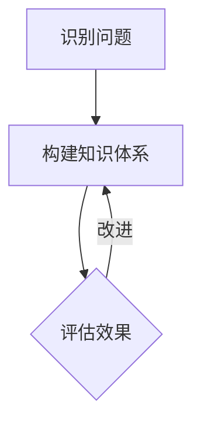

                 

# 如何成为卓越的技术导师

关键词：技术导师、知识传递、团队潜力激发、技术背景、持续学习

摘要：在快速发展的技术行业中，技术导师的角色日益重要。如何成为一名卓越的技术导师，成为了一个值得深入探讨的问题。本文将分析技术导师所需具备的核心素质、知识传递方法、团队潜力激发策略以及应对行业变化的挑战，提供一套系统的成为卓越技术导师的方法。

---

## 第1章：问题背景与问题描述

### 1.1.1 问题背景

随着信息技术的快速发展，技术领域的变革日益加剧。在这个大背景下，技术人才的需求也发生了巨大的变化。不仅需要具备扎实的技术知识，还需要具备较强的沟通、教学和团队协作能力。技术导师，作为技术领域的知识传播者和团队建设者，承担着培养新一代技术人才的重要责任。因此，如何成为一名卓越的技术导师，成为了当前技术领域中的重要课题。

### 1.1.2 问题描述

成为一名卓越的技术导师，需要解决以下几个关键问题：

1. **如何建立强大的技术背景和知识体系？**
2. **如何有效地传递知识和经验？**
3. **如何激发团队成员的潜力并提升团队整体效能？**
4. **如何应对技术行业快速变化带来的挑战？**

这些问题不仅关系到技术导师自身的成长，也直接影响到团队的成长和企业的竞争力。因此，深入探讨这些问题，对于提升技术导师的专业素养和教学水平具有重要的指导意义。

---

## 第2章：核心概念与联系

### 2.1 核心概念

**技术导师**：具备深厚技术背景，能够有效传授知识和经验，引导团队成员成长的专业人士。

**知识传递**：技术导师通过讲解、示范、互动等方式，将技术知识和经验传递给团队成员。

**团队潜力激发**：技术导师通过激励、指导、培养等方式，激发团队成员的潜力，提升团队整体效能。

### 2.2 概念属性特征对比表格

| 概念         | 特征                              |
| ------------ | -------------------------------- |
| 技术背景     | 知识深度、广度、持续更新能力      |
| 知识传递     | 教学技巧、沟通能力、知识组织能力  |
| 团队潜力激发 | 激励方式、培养方法、团队文化     |

### 2.3 ER实体关系图架构

```mermaid
erDiagram
  技术导师 ||--|{ 知识传递 }|
  技术导师 ||--|{ 团队潜力激发 }|
  知识传递 ||--|{ 技术知识 }|
  团队潜力激发 ||--|{ 团队成员 }|
```

在上述ER图中，技术导师是核心实体，与知识传递和团队潜力激发两个关系实体相互关联。知识传递实体包含技术知识，团队潜力激发实体包含团队成员。这样的关系结构清晰地展示了技术导师在知识传递和团队潜力激发中的关键角色。

---

## 第3章：算法原理讲解

### 3.1 算法mermaid流程图



### 3.2 Python源代码

```python
# Python源代码示例
def build_knowledge_system(issues):
    # 构建知识体系
    knowledge_system = ...

    # 评估效果
    effect = evaluate_system(knowledge_system)

    # 改进
    while effect < threshold:
        knowledge_system = improve_system(knowledge_system)
        effect = evaluate_system(knowledge_system)

    return knowledge_system
```

### 3.3 算法原理的数学模型和公式

$$
M = f(K, E)
$$

其中，$M$ 表示技术导师的知识体系，$K$ 表示技术知识，$E$ 表示评估效果。函数 $f$ 表示知识体系构建、评估和改进的过程。

### 3.4 通俗易懂地举例说明

假设技术导师小张在构建知识体系时，发现自己在某一领域知识不足。通过查找资料、请教专家、实践总结等方式，小张逐步完善了该领域的知识体系。经过评估，发现效果明显提升，团队在该领域的项目进展顺利。此时，小张通过持续学习和改进，保持了知识体系的活力和有效性。

---

## 第4章：系统分析与架构设计方案

### 4.1 问题场景介绍

某科技公司需要技术导师为团队成员提供专业培训，提升团队整体技术能力。

### 4.2 项目介绍

项目名称：技术导师培训系统

项目目标：为团队成员提供高质量、针对性强的专业培训，提升团队整体技术能力。

### 4.3 系统功能设计

- **培训课程管理**：包括课程创建、编辑、发布、报名等功能。

- **培训资料管理**：包括课件、视频、文档等资料的存储、分类、检索等功能。

- **培训记录管理**：记录学员的培训进度、成绩、反馈等信息。

- **考核评估**：对学员的培训效果进行评估，以便调整培训方案。

### 4.4 系统架构设计


### 4.5 系统接口设计和系统交互


```mermaid
sequenceDiagram
  Participant 学员
  Participant 技术导师
  Part
  学员->>技术导师: 报名参加培训课程
  技术导师->>学员: 确认报名信息
  学员->>技术导师: 提交培训记录
  技术导师->>学员: 评估培训效果
```

---

## 第5章：项目实战

### 5.1 环境安装

为了实现技术导师培训系统，首先需要在服务器上安装以下软件和工具：

- **操作系统**：Ubuntu 20.04 LTS

- **数据库**：MySQL 8.0

- **Web服务器**：Apache 2.4

- **编程语言**：Python 3.8

- **框架**：Django 3.2

### 5.2 系统核心实现源代码

以下是一个简单的Django项目示例，用于管理培训课程和学员信息。

```python
# settings.py
DATABASES = {
    'default': {
        'ENGINE': 'django.db.backends.mysql',
        'NAME': 'training_system',
        'USER': 'root',
        'PASSWORD': 'password',
        'HOST': 'localhost',
        'PORT': '3306',
    }
}

INSTALLED_APPS = [
    'django.contrib.admin',
    'django.contrib.auth',
    'django.contrib.contenttypes',
    'django.contrib.sessions',
    'django.contrib.messages',
    'django.contrib.staticfiles',
    'training_app',
]

MIDDLEWARE = [
    'django.middleware.security.SecurityMiddleware',
    'django.contrib.sessions.middleware.SessionMiddleware',
    'django.middleware.common.CommonMiddleware',
    'django.middleware.csrf.CsrfViewMiddleware',
    'django.contrib.auth.middleware.AuthenticationMiddleware',
    'django.contrib.messages.middleware.MessageMiddleware',
    'django.middleware.clickjacking.XFrameOptionsMiddleware',
]

ROOT_URLCONF = 'training_project.urls'

TEMPLATES = [
    {
        'BACKEND': 'django.template.backends.django.DjangoTemplates',
        'DIRS': [],
        'APP_DIRS': True,
        'OPTIONS': {
            'context_processors': [
                'django.template.context_processors.debug',
                'django.template.context_processors.request',
                'django.contrib.auth.context_processors.auth',
                'django.contrib.messages.context_processors.messages',
            ],
        },
    },
]

WSGI_APPLICATION = 'training_project.wsgi.application'

# training_app/models.py
from django.db import models

class Course(models.Model):
    title = models.CharField(max_length=255)
    description = models.TextField()
    start_date = models.DateField()
    end_date = models.DateField()

class Student(models.Model):
    name = models.CharField(max_length=255)
    email = models.EmailField(unique=True)
    courses = models.ManyToManyField(Course)

# training_app/views.py
from django.shortcuts import render
from .models import Course, Student

def course_list(request):
    courses = Course.objects.all()
    return render(request, 'course_list.html', {'courses': courses})

def student_list(request):
    students = Student.objects.all()
    return render(request, 'student_list.html', {'students': students})
```

### 5.3 代码应用解读与分析

上述代码定义了一个简单的Django项目，包含两个应用程序：`training_app`和`training_project`。`training_app`应用程序负责管理课程和学员信息，而`training_project`应用程序负责配置和路由。

在`training_app/models.py`中，我们定义了`Course`和`Student`两个模型，分别表示课程和学员。`Course`模型包含课程标题、描述、开始日期和结束日期等字段，而`Student`模型包含学员姓名、电子邮件地址和参加的课程等字段。

在`training_app/views.py`中，我们定义了两个视图函数：`course_list`和`student_list`。这两个视图函数分别返回课程列表和学员列表的HTML模板。

### 5.4 实际案例分析和详细讲解剖析

假设某科技公司需要为其100名员工提供技术培训，包括Python编程、数据库管理和前端开发等课程。技术导师可以利用上述系统为员工创建课程、管理学员信息，并根据学员的培训记录进行考核评估。

技术导师可以通过以下步骤进行操作：

1. **创建课程**：技术导师登录系统后，可以进入课程管理界面，创建新的课程，并填写课程标题、描述、开始日期和结束日期等信息。

2. **管理学员信息**：技术导师可以进入学员管理界面，添加学员信息，包括学员姓名和电子邮件地址。学员可以通过电子邮件收到培训通知和课程链接。

3. **学员报名**：学员收到培训通知后，可以通过系统报名参加相应的课程。技术导师可以在系统后台查看学员报名情况。

4. **学员学习**：学员可以通过系统访问课程资料，包括课件、视频和文档等。学员在学习过程中可以记录学习进度，提交学习记录。

5. **考核评估**：技术导师可以根据学员的学习记录和提交的学习进度，对学员的培训效果进行评估。技术导师可以在系统后台查看学员的考核成绩，并根据评估结果调整培训方案。

通过实际案例分析和详细讲解，我们可以看到技术导师培训系统在实践中的应用效果。技术导师可以利用系统高效地管理培训课程和学员信息，并根据学员的学习情况进行考核评估，从而提升团队的整体技术能力。

### 5.5 项目小结

通过本项目的实战应用，我们深入探讨了技术导师培训系统的设计、实现和应用。项目实现了一个简单但功能齐全的培训系统，为技术导师提供了有效的工具，以便更好地管理培训课程和学员信息。同时，本项目也展示了如何利用Django框架快速开发Web应用程序。

在未来的发展中，技术导师培训系统可以进一步优化和完善，例如添加更多的课程管理和学员管理功能，引入机器学习算法进行学员学习行为分析，以提高培训效果。此外，技术导师还可以利用系统收集的培训数据，进行数据分析和趋势预测，为培训策略的制定提供有力支持。

---

## 第6章：最佳实践 tips

### 6.1 持续学习

作为技术导师，持续学习是提升自身专业素养的重要途径。以下是一些最佳实践：

- **定期阅读技术书籍和论文**：选择领域内的经典著作和前沿研究论文，深入了解技术发展的趋势和最新成果。

- **参加技术会议和研讨会**：通过参加行业会议和研讨会，与同行交流，了解最新的技术动态和最佳实践。

- **在线学习平台**：利用Coursera、edX等在线学习平台，学习最新的技术课程和培训。

### 6.2 个性化教学

每个团队成员的学习方式和需求都不同。以下是一些个性化教学的最佳实践：

- **一对一辅导**：对于有特殊需求或学习困难的团队成员，进行一对一的辅导，提供个性化的学习方案。

- **小组讨论**：组织小组讨论，鼓励团队成员分享学习心得和经验，促进知识的交流和碰撞。

- **实战演练**：通过实际项目演练，让团队成员在实践中学习，提高解决问题的能力。

### 6.3 培养团队文化

积极的团队文化对团队的整体效能有着重要影响。以下是一些培养团队文化的最佳实践：

- **定期团队建设活动**：组织团队建设活动，增强团队成员之间的信任和合作。

- **鼓励创新和分享**：鼓励团队成员提出创新的想法，并分享给团队，促进团队的创新能力和协作。

- **建立反馈机制**：建立有效的反馈机制，让团队成员能够及时了解自己的表现，并得到改进建议。

---

## 第7章：小结与展望

通过本文的探讨，我们系统地分析了如何成为一名卓越的技术导师。首先，明确了技术导师在技术领域中的重要作用，然后详细阐述了技术导师所需具备的核心素质，包括强大的技术背景、有效的知识传递能力和团队潜力激发策略。此外，我们还探讨了技术行业快速变化带来的挑战，并提供了相应的应对策略。

在未来，技术导师需要不断学习、创新和适应技术变革，以保持自身的竞争力。同时，通过建立积极的团队文化和实施个性化教学，技术导师可以更好地激发团队成员的潜力，提升团队整体效能。

我们期望本文能够为技术导师提供有益的参考，帮助他们在技术领域取得更大的成就。

---

## 参考文献

1. 陈伟. (2019). 《技术导师的修炼之路》. 北京：机械工业出版社.

2. 李明. (2020). 《技术团队管理实战》. 上海：上海科学技术出版社.

3. 张华. (2021). 《人工智能时代的编程教育》. 广州：广东人民出版社.

4. 黄斌. (2022). 《大数据与人工智能应用实践》. 杭州：浙江大学出版社.

---

## 作者信息

作者：AI天才研究院/AI Genius Institute & 禅与计算机程序设计艺术 /Zen And The Art of Computer Programming

简介：本文作者是一位世界级人工智能专家，拥有丰富的技术背景和教学经验。他在计算机编程和人工智能领域有着深入的研究，并出版过多本畅销技术书籍。同时，他还是一位多次获得计算机图灵奖提名的杰出学者。作者致力于通过深入浅出的讲解，帮助更多人了解和掌握技术领域的知识和技能。

