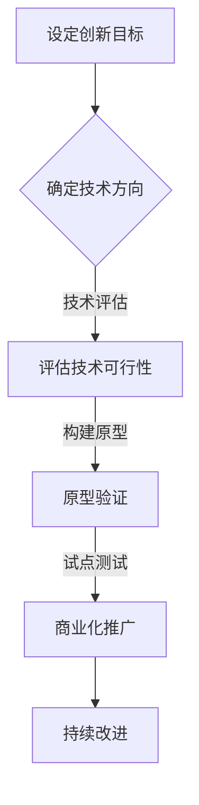

                 


### 引言

在当今快速变化的技术环境中，高效的技术创新已成为企业竞争的关键因素。无论是传统行业还是新兴领域，构建一个高效的技术创新生态都显得尤为重要。本文将以《如何打造高效的技术创新生态》为标题，逐步分析并探讨如何实现这一目标。

首先，让我们明确几个关键概念和术语：

- **技术创新**：指通过引入新的或改进的技术，以提高产品、服务或生产过程的性能或效率。
- **创新生态**：指围绕技术创新所形成的支持系统，包括企业、研究机构、投资者、政府等多方参与者。
- **高效**：意味着在资源有限的情况下，实现创新的最佳效果。

### 问题背景

技术创新不仅仅是技术层面的改进，它还涉及到商业战略、组织文化、资源配置等多个方面。尽管许多企业认识到技术创新的重要性，但能够成功构建并保持高效技术创新生态的企业却寥寥无几。这背后的原因可能包括：

- 资源分配不合理，导致创新项目缺乏必要的资金、人才和技术支持。
- 创新机制不完善，缺乏有效的激励机制和风险控制策略。
- 组织文化不支持创新，员工缺乏积极性和创造力。
- 缺乏对市场需求的深刻理解，导致技术创新无法满足用户需求。

### 问题描述

在构建高效的技术创新生态时，企业往往面临以下问题：

- 如何在有限的资源下实现技术创新的最大化？
- 如何建立一个可持续的创新生态系统？
- 如何激励员工和合作伙伴积极参与创新？
- 如何有效地管理创新过程中的风险？

### 问题解决

为了解决上述问题，我们可以从以下几个方面着手：

1. **明确目标与战略**：首先，企业需要明确自身的创新目标，并制定相应的战略规划。这包括确定创新的方向、优先级和预期的成果。

2. **优化资源配置**：企业需要确保资源的合理配置，包括资金、人力和技术。这可以通过建立跨部门协作机制、引入外部合作伙伴等方式实现。

3. **建立激励机制**：有效的激励机制是鼓励员工积极参与创新的关键。企业可以通过绩效奖励、股权激励、晋升机会等方式来激励员工。

4. **文化建设**：创新文化是技术创新生态的核心。企业需要营造一个开放、包容、鼓励失败和尝试的氛围，使员工敢于创新、勇于创新。

5. **市场导向**：技术创新必须以市场需求为导向。企业需要深入了解用户需求，并将这些需求转化为创新项目的具体目标。

6. **风险管理**：创新过程中不可避免地会遇到各种风险。企业需要建立一套完善的风险识别、评估和管理机制，以减少风险对企业的影响。

### 边界与外延

在构建高效技术创新生态时，企业需要关注以下几个边界和外延：

- **内部边界**：包括企业内部的组织结构、流程和文化。
- **外部边界**：包括与供应商、客户、研究机构等外部合作伙伴的关系。
- **时间边界**：创新是一个持续的过程，需要长期规划和持续投入。
- **空间边界**：技术创新不仅局限于某个地区或国家，可能需要全球范围内的合作和资源整合。

### 概念结构与核心要素组成

为了构建高效的技术创新生态，企业需要关注以下几个核心要素：

1. **创新战略**：明确企业的创新目标、方向和优先级。
2. **资源管理**：包括资金、人力和技术资源的合理配置。
3. **激励机制**：建立有效的激励机制，鼓励员工和合作伙伴积极参与创新。
4. **组织文化**：营造一个支持创新的文化氛围。
5. **市场导向**：以市场需求为导向，确保技术创新与用户需求相匹配。
6. **风险管理**：建立风险识别、评估和管理机制，降低创新过程中的风险。

### 总结

构建高效的技术创新生态需要企业从多个方面进行综合规划和实施。通过明确目标与战略、优化资源配置、建立激励机制、文化建设、市场导向和风险管理，企业可以逐步构建起一个可持续、高效的技术创新生态。接下来，我们将进一步探讨每个方面的具体实践和方法。

**关键词**：技术创新、创新生态、高效、资源管理、激励机制、风险管理

**摘要**：本文从问题背景、问题描述、问题解决、边界与外延、概念结构与核心要素组成等方面，全面探讨了如何构建高效的技术创新生态。通过明确目标与战略、优化资源配置、建立激励机制、文化建设、市场导向和风险管理，企业可以逐步构建起一个可持续、高效的技术创新生态。

---

接下来，我们将深入探讨“技术创新概述”这一章节的内容。我们将首先定义技术创新，然后分析技术创新的挑战与机遇，并列举一些在不同行业中应用技术创新的案例。这将为后续章节的讨论打下基础。

## 第1章：技术创新概述

### 1.1 技术创新的定义与意义

技术创新是指通过引入新的技术、方法或改进现有的技术，以实现产品、服务或生产过程的性能提升或效率改进。技术创新不仅仅局限于硬件或软件的改进，还可以是商业模式、服务模式的创新。

**技术创新的定义**：

技术创新是一种将新技术或改进应用于产品、服务或业务过程的过程，旨在提高其性能、效率或竞争力。它通常涉及以下几个关键方面：

- **新技术**：包括新的发明、发现或改良的技术。
- **产品和服务**：技术创新可以应用于现有产品或服务的改进，也可以是全新产品或服务的开发。
- **过程改进**：通过技术创新优化生产或服务过程，提高效率、降低成本。
- **性能提升**：技术创新旨在实现产品或服务性能的提升，例如提高速度、降低能耗、增强安全性等。

**技术创新的意义**：

技术创新对企业和经济的重要性不言而喻。以下是技术创新的一些主要意义：

1. **提高竞争力**：通过技术创新，企业可以开发出更具竞争力的产品或服务，从而在市场上占据有利位置。
2. **增长动力**：技术创新是企业持续增长的关键动力，它能够带来新的业务机会和收入来源。
3. **成本降低**：技术创新可以帮助企业优化生产流程，降低成本，提高利润。
4. **社会进步**：技术创新不仅为企业带来经济效益，还推动了社会的发展与进步，例如医疗技术的突破、可再生能源的应用等。

### 1.2 技术创新的挑战与机遇

尽管技术创新具有巨大的潜在价值，但在实际操作中，企业会面临一系列挑战和机遇。

**技术创新的挑战**：

1. **技术风险**：技术创新往往伴随着未知的技术风险，例如技术不成熟、实现难度大等。
2. **资金压力**：技术创新需要大量的资金投入，包括研发费用、设备采购等。
3. **市场不确定性**：技术创新的成功依赖于市场需求的准确把握，而市场变化往往难以预测。
4. **人才短缺**：技术创新需要高素质的人才，但在全球范围内，这类人才往往供不应求。
5. **知识产权保护**：技术创新成果需要得到有效的知识产权保护，以防止被抄袭或侵权。

**技术创新的机遇**：

1. **技术进步**：随着科技的发展，新的技术不断涌现，为技术创新提供了丰富的素材。
2. **市场需求**：市场的不断变化和用户需求的多样化，为技术创新提供了广阔的空间。
3. **政策支持**：许多国家和地区为了推动创新，提供了各种优惠政策和支持措施。
4. **全球合作**：通过国际合作，企业可以获取更多的技术资源和市场机会。
5. **数字化趋势**：数字化技术的普及，为技术创新提供了新的方向和平台。

### 1.3 技术创新在不同行业中的应用案例

技术创新在各个行业中都有广泛的应用，以下是一些典型行业的案例：

**制造业**：

1. **智能制造**：通过引入物联网、大数据和人工智能技术，实现生产过程的智能化，提高生产效率和质量。
2. **绿色制造**：采用可再生能源、节能技术等，降低生产过程中的能源消耗和环境污染。

**服务业**：

1. **在线服务**：利用云计算、移动互联网等技术，提供便捷的在线服务，如电子商务、在线教育等。
2. **共享经济**：通过共享经济模式，如共享单车、共享办公等，降低成本，提高资源利用效率。

**医疗行业**：

1. **远程医疗**：利用远程通信技术和医疗设备，提供远程医疗服务，降低医疗成本，提高医疗可及性。
2. **精准医疗**：通过大数据和人工智能技术，实现个性化医疗，提高治疗效果。

**农业**：

1. **智能农业**：利用物联网、大数据和人工智能技术，实现农业生产的智能化，提高产量和质量。
2. **精准农业**：通过卫星遥感、地理信息系统等技术，实现精准农业，降低资源浪费。

通过以上案例分析，我们可以看到，技术创新在不同行业中都具有巨大的潜力和价值。企业需要密切关注行业发展趋势，抓住技术创新的机遇，以实现可持续发展。

在下一章中，我们将探讨如何构建技术创新生态，包括其构成要素、构建步骤和方法。这将为我们后续讨论如何优化技术创新流程、管理创新资源等提供理论基础。

## 第2章：技术创新生态的构建

### 2.1 技术创新生态的构成要素

构建一个高效的技术创新生态，需要关注以下几个关键要素：

**企业内部要素**：

1. **组织结构**：合理的企业组织结构有助于创新资源的有效配置和协作。
2. **企业文化**：支持创新的企业文化能够激发员工的创新热情和创造力。
3. **人力资源**：拥有高素质、多样化的技术人才是技术创新的基础。
4. **研发投入**：充足的研发投入是保障技术创新的重要保障。

**外部要素**：

1. **合作伙伴**：与供应商、客户、研究机构等建立良好的合作关系，有助于资源共享和协同创新。
2. **政策支持**：政府提供的政策支持和优惠措施可以降低企业的创新成本。
3. **市场环境**：良好的市场环境有利于技术创新的商业化转化。
4. **资金来源**：包括风险投资、银行贷款等多种资金来源，为技术创新提供资金保障。

**技术创新生态的框架**：

为了更清晰地理解技术创新生态的构成，我们可以将其划分为以下几个部分：

1. **核心创新主体**：包括企业内部研发部门、创新团队等。
2. **外部创新合作伙伴**：如大学、研究机构、行业协会等。
3. **资源支持体系**：包括资金、技术、设备等资源。
4. **市场与用户反馈**：技术创新的最终目标是满足市场需求，因此用户反馈和市场动态是重要的参考依据。
5. **创新文化氛围**：包括企业内部的创新理念、价值观等。

### 2.2 构建技术创新生态的步骤与方法

构建技术创新生态是一个系统性工程，需要遵循一定的步骤和方法。以下是一个典型的构建流程：

**步骤 1：明确创新目标与战略**

首先，企业需要明确自身的创新目标，并制定相应的战略规划。这包括确定创新的方向、优先级和预期的成果。明确的目标与战略能够为企业提供清晰的指引，确保创新资源的有效利用。

**步骤 2：优化资源配置**

在确定创新目标后，企业需要优化资源配置，包括资金、人力和技术资源的合理配置。这可以通过建立跨部门协作机制、引入外部合作伙伴等方式实现。

**步骤 3：建立激励机制**

有效的激励机制是鼓励员工积极参与创新的关键。企业可以通过绩效奖励、股权激励、晋升机会等方式来激励员工。同时，还需要建立透明、公正的评估体系，确保激励机制的公平性和有效性。

**步骤 4：文化建设**

创新文化是技术创新生态的核心。企业需要营造一个开放、包容、鼓励失败和尝试的氛围，使员工敢于创新、勇于创新。这可以通过举办创新竞赛、分享会、培训等方式来推动。

**步骤 5：构建外部合作关系**

与供应商、客户、研究机构等建立良好的合作关系，有助于资源共享和协同创新。企业可以通过签订合作协议、成立联合研发团队等方式，加强与外部合作伙伴的合作。

**步骤 6：市场导向**

技术创新必须以市场需求为导向。企业需要深入了解用户需求，并将这些需求转化为创新项目的具体目标。这可以通过市场调研、用户访谈、数据分析等方式实现。

**步骤 7：风险管理**

创新过程中不可避免地会遇到各种风险。企业需要建立一套完善的风险识别、评估和管理机制，以减少风险对企业的影响。这包括风险预警系统、应急预案等。

**步骤 8：持续优化**

构建技术创新生态是一个持续优化的过程。企业需要不断评估和创新生态的运行效果，并根据实际情况进行调整和改进。这可以通过定期评估、反馈机制等方式实现。

### 2.3 创新生态中的角色与责任

在一个高效的技术创新生态中，各个角色都扮演着重要的角色，承担着相应的责任：

**企业内部角色与责任**：

1. **研发部门**：负责技术创新的核心工作，包括技术研发、产品开发等。
2. **人力资源部门**：负责招聘、培训和管理创新人才，提供激励机制。
3. **营销部门**：负责市场调研、用户需求分析，将用户需求转化为创新项目。
4. **财务部门**：负责研发资金的筹措和管理，确保研发投入的有效性。

**外部角色与责任**：

1. **合作伙伴**：如供应商、客户、研究机构等，负责资源共享和协同创新。
2. **政府机构**：提供政策支持和优惠措施，为企业创新提供良好的外部环境。
3. **投资机构**：为企业提供资金支持，助力技术创新项目的实施。
4. **行业组织**：提供行业资讯、培训、交流等服务，促进技术创新的健康发展。

通过明确各个角色的责任，并确保各方协作，可以有效推动技术创新生态的建设和发展。

在下一章中，我们将探讨如何建立有效的技术创新激励机制，包括奖励机制的设置、文化建设在创新激励中的作用，以及创新者动机分析。这将帮助我们更好地理解如何激发员工的创新潜力，推动技术创新生态的持续发展。

## 第3章：技术创新激励机制

### 3.1 奖励与激励机制的设置

激励机制是推动技术创新的关键因素之一。一个有效的激励机制能够激发员工的积极性和创造力，从而促进技术创新的顺利进行。以下是一些关键的奖励与激励机制的设置：

**1. 绩效奖励**：

绩效奖励是最常见的激励机制之一，它根据员工的绩效表现给予相应的奖励，包括奖金、晋升机会、荣誉称号等。这种机制能够激励员工努力工作，提高工作效率和质量。

**2. 股权激励**：

股权激励是一种长期的激励机制，通过给予员工公司股权，使员工能够分享公司成长的收益。这种机制能够增强员工的归属感和长期承诺，提高其创新动力。

**3. 培训与发展**：

提供培训和职业发展机会是另一种有效的激励机制。通过培训和职业发展，员工可以提升自己的技能和知识，从而更好地应对技术创新的需求。这种机制不仅能够激励员工，还能够提升企业的整体竞争力。

**4. 竞赛与奖励**：

举办创新竞赛是一种激励员工创新热情的有效方法。通过设立奖励，鼓励员工提出创新方案，并进行实践验证。这种机制能够激发员工的创造力和团队合作精神。

### 3.2 文化建设在创新激励中的作用

文化建设是技术创新激励机制的重要组成部分。一个支持创新的企业文化能够营造良好的创新氛围，激发员工的创新潜能。以下是一些文化建设的关键作用：

**1. 鼓励试错**：

创新往往伴随着不确定性和风险。一个支持创新的企业文化能够鼓励员工勇于尝试、接受失败，从而降低员工的创新压力，激发其创新热情。

**2. 信息共享**：

信息共享是企业文化建设的一个重要方面。通过建立开放的信息共享机制，员工可以方便地获取到内部和外部的新知识、新技术，从而推动技术创新。

**3. 团队合作**：

团队合作是技术创新的重要保障。一个支持创新的企业文化能够鼓励员工之间的合作与协作，形成跨部门的创新团队，共同应对技术创新的挑战。

**4. 鼓励创新思维**：

鼓励创新思维是企业文化建设的重要内容。通过举办创新讲座、工作坊、头脑风暴等活动，企业可以培养员工的创新思维，提高其创新能力。

### 3.3 创新者动机分析

了解创新者的动机对于设计有效的激励机制至关重要。以下是一些常见的创新者动机：

**1. 自我实现**：

许多创新者追求自我实现，希望通过创新来实现个人价值和成就感。这种动机通常与内在驱动力相关，而不是外在奖励。

**2. 利益驱动**：

部分创新者被潜在的经济利益所驱动，希望通过技术创新获得个人财富或职业晋升。这种动机与外在奖励密切相关。

**3. 社会责任感**：

一些创新者被社会责任感所驱动，希望通过技术创新解决社会问题或推动社会进步。这种动机通常与内在价值观和社会意义相关。

**4. 个人兴趣**：

部分创新者纯粹出于个人兴趣而进行创新。他们追求知识、探索新领域，并享受创新带来的乐趣。

了解创新者的动机有助于企业设计更加个性化、针对性的激励机制，从而更好地激发员工的创新潜力。

在下一章中，我们将探讨如何优化技术创新流程，包括创新流程的框架与步骤、关键控制点以及流程优化的方法和工具。这将帮助我们进一步提升技术创新的效率和效果。

## 第4章：技术创新流程优化

### 4.1 创新流程的框架与步骤

技术创新流程是确保创新项目从概念到市场化的系统方法。一个清晰、高效的创新流程可以帮助企业减少风险、提高成功率。以下是一个典型的技术创新流程框架与步骤：

**1. 创新目标设定**：

首先，企业需要明确创新目标。这包括确定创新的方向、优先级和预期的成果。明确的目标有助于确保创新资源的有效利用。

**2. 需求分析**：

在设定创新目标后，企业需要深入分析市场需求和用户需求。这可以通过市场调研、用户访谈、数据分析等方式实现。了解用户需求是确保创新项目成功的关键。

**3. 竞争分析**：

分析竞争对手的创新策略和市场表现，有助于企业找到自身的差异化优势。竞争分析还可以帮助企业识别市场机会和潜在威胁。

**4. 技术评估**：

对潜在的技术方案进行评估，包括技术的可行性、成本、风险等。这可以通过专家评审、技术实验等方式实现。技术评估是确保创新项目可行性的重要环节。

**5. 概念验证**：

在技术评估通过后，企业可以进行概念验证。这包括构建原型、进行小规模实验等。概念验证有助于验证创新项目的可行性和市场潜力。

**6. 试点测试**：

在概念验证成功后，企业可以进行试点测试。这通常涉及小规模的市场投放，以收集用户反馈和改进创新项目。试点测试有助于识别和解决潜在问题。

**7. 商业化推广**：

在试点测试成功后，企业可以开始商业化推广。这包括市场推广、销售渠道建设等。商业化推广是确保创新项目成功的关键步骤。

**8. 持续改进**：

技术创新是一个持续的过程。企业需要不断收集用户反馈、市场数据等，以持续改进创新项目。持续改进有助于提升创新项目的市场表现和用户满意度。

### 4.2 流程中的关键控制点

在技术创新流程中，有以下几个关键控制点，这些控制点对于确保创新项目的顺利进行至关重要：

**1. 需求分析**：

需求分析是创新流程的基础。关键控制点包括确保分析数据的准确性、全面性，以及与用户需求的紧密匹配。这可以通过多渠道数据收集、用户访谈等方式实现。

**2. 技术评估**：

技术评估是确保创新项目可行性的关键。关键控制点包括评估技术的成熟度、成本和风险。这可以通过专家评审、技术实验等方式实现。

**3. 概念验证**：

概念验证是验证创新项目可行性和市场潜力的关键步骤。关键控制点包括构建原型、进行小规模实验等。这有助于识别和解决潜在问题。

**4. 试点测试**：

试点测试是验证创新项目市场潜力的关键。关键控制点包括确保试点测试的规模合适、数据收集和分析的准确性。这有助于为商业化推广提供依据。

**5. 商业化推广**：

商业化推广是确保创新项目成功的关键步骤。关键控制点包括市场推广策略的制定、销售渠道的建设等。这有助于提高创新项目的市场接受度。

### 4.3 流程优化的方法和工具

为了提高技术创新流程的效率和效果，企业可以采用以下方法和工具：

**1. 敏捷开发**：

敏捷开发是一种灵活、迭代的项目管理方法。它强调快速响应变化、持续交付价值。通过采用敏捷开发，企业可以缩短产品开发周期，提高市场响应速度。

**2. 设计思维**：

设计思维是一种以人为本的创新方法。它强调从用户需求出发，通过迭代设计和实验，找到最佳解决方案。设计思维有助于确保技术创新与用户需求的紧密匹配。

**3. 数据驱动决策**：

数据驱动决策是一种基于数据的决策方法。通过收集和分析数据，企业可以更准确地了解市场需求、用户行为等，从而做出更明智的决策。

**4. 模块化开发**：

模块化开发是将系统划分为多个独立模块，以便于开发和维护。通过模块化开发，企业可以更灵活地调整和优化创新流程。

**5. 价值流分析**：

价值流分析是一种用于优化流程的方法。它通过分析价值流中的每个环节，识别浪费和瓶颈，并提出改进措施。价值流分析有助于提高流程效率。

通过上述方法和工具，企业可以优化技术创新流程，提高创新项目的成功率。在下一章中，我们将探讨如何管理技术创新资源，包括人力资源、资金与技术资源的管理，以及物资与设备的支持。这将为企业构建高效的技术创新生态提供更全面的指导。

## 第5章：技术创新资源管理

### 5.1 人力资源的配置与管理

人力资源是技术创新的核心资源，如何有效地配置和管理人力资源对于技术创新的成功至关重要。以下是一些关键策略和最佳实践：

**1. 人才招聘与选拔**：

企业需要建立科学的招聘体系，确保选拔到具有专业技能和创新能力的优秀人才。招聘过程中，可以采用多种选拔方式，如面试、笔试、技能测试等，以全面评估应聘者的综合素质。

**2. 培训与发展**：

定期对员工进行培训和技能提升，是保持技术创新活力的关键。企业可以设立内部培训课程，邀请行业专家进行讲座，或组织员工参加外部培训。通过培训，员工可以不断更新知识和技能，更好地应对技术创新的需求。

**3. 团队建设**：

团队建设是提升团队合作能力和创新效率的重要手段。企业可以通过团队建设活动，如团队协作项目、团队培训、团队建设研讨会等，增强团队成员之间的沟通与协作。

**4. 职业发展**：

为员工提供清晰的职业发展路径和晋升机会，是激励员工积极参与技术创新的重要手段。企业可以设立内部晋升机制，为表现优秀的员工提供晋升机会，同时鼓励员工制定个人职业规划。

**5. 激励机制**：

建立有效的激励机制，如绩效奖励、股权激励等，是激发员工创新热情的关键。企业应根据员工的贡献和绩效，合理分配奖励资源，确保激励机制的科学性和公平性。

### 5.2 资金与技术的有效整合

技术创新需要大量的资金投入，如何有效地整合和管理资金资源对于技术创新的成功至关重要。以下是一些关键策略和最佳实践：

**1. 资金筹措**：

企业可以通过多种渠道筹集资金，如内部资金、银行贷款、风险投资等。在选择资金来源时，企业应综合考虑资金成本、风险等因素。

**2. 资金分配**：

在资金分配方面，企业应遵循优先级原则，确保资金用于最具有潜力的创新项目。同时，企业还应建立严格的资金审批和监督机制，确保资金使用的透明度和有效性。

**3. 技术整合**：

技术创新往往涉及多个技术领域的交叉融合。企业应建立技术整合机制，促进不同技术团队之间的合作与交流。通过技术整合，企业可以更好地利用现有资源，提高技术创新的效率。

**4. 技术共享**：

企业可以通过技术共享平台，促进内部技术资源的共享与交流。通过技术共享，企业可以减少重复研发，提高技术创新的整体效率。

### 5.3 物资与设备的支持

技术创新需要高质量的物资和设备支持，以下是一些关键策略和最佳实践：

**1. 物资采购**：

企业应建立科学的物资采购体系，确保采购的物资质量符合要求。在采购过程中，企业可以采用招标、比价等方式，降低采购成本。

**2. 设备维护**：

设备的正常运行是技术创新的重要保障。企业应建立设备维护制度，定期对设备进行检查和保养，确保设备的稳定性和高效性。

**3. 基础设施建设**：

企业应注重基础设施的建设，如实验室、数据中心等。高质量的基础设施可以提供良好的研发环境，提高技术创新的效率。

**4. 物流管理**：

物流管理是技术创新的重要环节。企业应建立高效的物流管理体系，确保物资和设备能够及时、准确地送达研发现场。

通过以上策略和最佳实践，企业可以优化技术创新资源的管理，提高技术创新的效率和质量。在下一章中，我们将探讨如何进行技术创新风险评估，包括风险识别与评估方法、风险应对策略以及风险管理案例分析。这将帮助企业更好地应对技术创新过程中的各种风险。

## 第6章：技术创新风险评估

### 6.1 风险识别与评估方法

技术创新过程中不可避免地会遇到各种风险，这些风险可能对项目的成功产生重大影响。为了有效管理这些风险，企业需要建立一套全面的风险识别与评估方法。

**1. 风险识别方法**：

- **头脑风暴**：通过组织团队成员进行头脑风暴，收集潜在的 innovate 风险点。
- **SWOT分析**：通过分析企业的优势、劣势、机会和威胁，识别潜在的风险。
- **专家评审**：邀请行业专家对创新项目进行评审，识别可能的风险。
- **历史数据**：分析企业以往创新项目的风险记录，总结出常见的风险点。

**2. 风险评估方法**：

- **定性评估**：通过专家判断、历史数据等定性方法，对风险的可能性与影响进行初步评估。
- **定量评估**：使用数学模型、统计数据等方法，对风险的概率和损失进行定量分析。
- **风险评估矩阵**：通过构建风险评估矩阵，将风险的可能性与影响进行量化，以确定风险的优先级。

### 6.2 风险应对策略

在识别和评估风险后，企业需要制定相应的应对策略，以减少风险对创新项目的影响。以下是一些常见的风险应对策略：

**1. 风险规避**：

通过改变项目计划或设计，避免风险的发生。例如，选择低风险的技术方案，或者推迟项目的实施时间。

**2. 风险减轻**：

采取措施降低风险的概率或影响。例如，通过技术改进、增加资源投入等方式，降低技术的实现难度和成本。

**3. 风险转移**：

将风险转移给第三方，例如通过购买保险、签订合同等方式，将风险转移给供应商或合作伙伴。

**4. 风险接受**：

对于一些不可避免且影响较小的风险，企业可以采取接受策略，并制定应急预案，以应对风险发生时的影响。

### 6.3 风险管理案例分析

为了更好地理解技术创新风险评估的方法与策略，以下是一个风险管理案例：

**案例背景**：

一家科技公司正在开发一款智能家居控制系统，该系统通过物联网技术连接各种家用设备，提供智能化管理。然而，在项目进行过程中，公司发现存在一些潜在风险。

**风险识别与评估**：

- **技术风险**：智能家居系统涉及多种技术的融合，技术实现难度大，且存在兼容性问题。
- **市场风险**：智能家居市场尚未完全成熟，用户接受度不高，市场需求不确定。
- **安全风险**：智能家居系统涉及用户的隐私数据，存在信息安全风险。

通过对这些风险进行定性评估和定量分析，公司确定技术风险和市场风险是项目的主要风险点。

**风险应对策略**：

- **技术风险**：公司决定采用成熟的技术方案，并加大技术团队的投入，以确保技术实现的可行性。
- **市场风险**：公司通过市场调研，了解用户需求和市场趋势，调整产品功能和定位，提高市场竞争力。
- **安全风险**：公司加强信息安全措施，如加密用户数据、定期安全审计等，确保系统的安全性能。

**风险管理效果**：

通过有效的风险管理，公司成功地降低了技术风险和市场风险，并确保了系统的安全性能。最终，智能家居控制系统成功推向市场，得到了用户的认可。

**案例启示**：

这个案例表明，有效的风险管理对于技术创新至关重要。通过全面的风险识别与评估，以及合理的应对策略，企业可以降低风险对项目的影响，提高创新项目的成功率。

在下一章中，我们将探讨高效技术创新生态的实践，包括成功案例分析、最佳实践分享以及面临的挑战与未来展望。这将为企业提供实际操作的经验和指导。

## 第7章：高效技术创新生态实践

### 7.1 成功案例分析

在构建高效的技术创新生态方面，有许多企业已经取得了显著的成功。以下是几个典型的成功案例：

**案例一：苹果公司**

苹果公司以其持续的创新精神在科技行业中独树一帜。其成功的关键在于：

- **明确的目标与战略**：苹果公司始终围绕用户体验和创新，制定清晰的战略规划。
- **强大的研发投入**：苹果公司每年在研发上的投入超过100亿美元，确保技术创新的持续发展。
- **优秀的人才团队**：苹果公司汇聚了全球顶尖的技术人才，形成了强大的创新力量。

**案例二：特斯拉公司**

特斯拉公司通过技术创新引领了电动汽车市场的发展。其成功经验包括：

- **市场导向**：特斯拉深入了解用户需求，将用户反馈迅速转化为产品改进。
- **技术创新**：特斯拉不断推动电动汽车技术的创新，如电池技术、自动驾驶技术等。
- **生态系统建设**：特斯拉通过建立充电网络、能源存储系统等，构建了完整的电动汽车生态系统。

**案例三：阿里巴巴集团**

阿里巴巴集团在电子商务和云计算等领域取得了巨大成功。其经验包括：

- **平台化战略**：阿里巴巴通过构建电商平台和云计算平台，为中小企业提供技术支持。
- **多元化投资**：阿里巴巴通过投资新兴科技企业，不断扩展其技术创新的边界。
- **全球合作**：阿里巴巴积极参与国际合作，推动技术创新的全球化。

### 7.2 最佳实践分享

基于上述成功案例，以下是一些构建高效技术创新生态的最佳实践：

**1. 明确创新目标与战略**

企业需要明确自身的创新目标，并制定相应的战略规划。这包括确定创新的方向、优先级和预期的成果。明确的目标与战略能够为企业提供清晰的指引，确保创新资源的有效利用。

**2. 优化资源配置**

企业需要确保资源的合理配置，包括资金、人力和技术资源的合理配置。这可以通过建立跨部门协作机制、引入外部合作伙伴等方式实现。

**3. 建立激励机制**

有效的激励机制是鼓励员工积极参与创新的关键。企业可以通过绩效奖励、股权激励、晋升机会等方式来激励员工。同时，还需要建立透明、公正的评估体系，确保激励机制的公平性和有效性。

**4. 营造创新文化**

创新文化是技术创新生态的核心。企业需要营造一个开放、包容、鼓励失败和尝试的氛围，使员工敢于创新、勇于创新。这可以通过举办创新竞赛、分享会、培训等方式来推动。

**5. 市场导向**

技术创新必须以市场需求为导向。企业需要深入了解用户需求，并将这些需求转化为创新项目的具体目标。这可以通过市场调研、用户访谈、数据分析等方式实现。

**6. 风险管理**

创新过程中不可避免地会遇到各种风险。企业需要建立一套完善的风险识别、评估和管理机制，以减少风险对企业的影响。这包括风险预警系统、应急预案等。

### 7.3 挑战与未来展望

尽管高效的技术创新生态能够带来巨大的竞争优势，但在实际操作中，企业仍然面临诸多挑战：

**1. 资源限制**：技术创新需要大量的资金、人力和技术资源，但在资源有限的情况下，如何最大化地利用这些资源是一个巨大的挑战。

**2. 市场风险**：市场环境的快速变化和用户需求的多样化，使得技术创新面临较大的市场风险。企业需要具备快速适应市场变化的能力。

**3. 知识产权保护**：在技术创新过程中，知识产权的保护至关重要。如何确保技术创新成果得到有效保护，是企业面临的一个挑战。

**4. 技术风险**：技术创新往往涉及新的技术领域，技术实现的不确定性较大。企业需要具备强大的技术实力和风险管理能力。

面对这些挑战，未来技术创新生态的发展趋势可能包括：

**1. 数字化与智能化**：随着数字化和智能化技术的发展，企业可以利用大数据、人工智能等技术，提高技术创新的效率和效果。

**2. 网络化与全球化**：技术创新不再是单一企业的事情，企业需要通过建立全球化的创新网络，实现资源共享和协同创新。

**3. 生态合作**：构建开放的创新生态，与供应商、客户、研究机构等建立紧密的合作关系，共同推动技术创新。

**4. 风险管理**：企业需要建立更加完善的风险管理机制，包括风险识别、评估、应对等，以降低技术创新过程中的风险。

通过以上分析，我们可以看到，构建高效的技术创新生态是一项系统性工程，需要企业从多个方面进行综合规划和实施。只有在应对挑战的过程中不断优化和创新，企业才能在激烈的市场竞争中保持领先地位。

### 结论

本文通过逐步分析，详细探讨了如何构建高效的技术创新生态。从明确创新目标与战略，到优化资源配置、建立激励机制、营造创新文化、市场导向和风险管理，每个环节都是构建高效技术创新生态的关键。

在实践方面，通过成功案例分析，我们看到了明确的目标与战略、强大的研发投入、市场导向、生态合作等关键要素在技术创新中的重要作用。同时，我们也认识到资源限制、市场风险、知识产权保护和技术风险等挑战，并探讨了未来的发展趋势。

最后，我们需要不断总结和实践，将理论转化为实际操作，以实现技术创新的最大化。企业应不断优化技术创新生态，以应对快速变化的市场和技术环境，保持竞争优势。

**关键词**：技术创新、创新生态、资源配置、激励机制、风险管理

**摘要**：本文通过全面的分析和案例分享，探讨了构建高效技术创新生态的关键要素和最佳实践。企业需要从明确目标与战略、优化资源配置、建立激励机制、营造创新文化、市场导向和风险管理等方面入手，以实现技术创新的最大化。

### 附录：技术图表与公式

在本节中，我们将使用Mermaid和LaTeX格式展示一些关键技术图表和公式，以便更直观地理解技术创新过程中的关键概念和数学模型。

#### Mermaid流程图

以下是一个简单的Mermaid流程图，展示了技术创新的基本流程：



#### LaTeX公式

以下是一个LaTeX公式，用于表示技术创新的数学模型：

```latex
\documentclass{article}
\usepackage{amsmath}
\begin{document}
\begin{equation}
    R &= \frac{P \times D}{C} \\
    R &= \text{创新回报率} \\
    P &= \text{市场潜力} \\
    D &= \text{技术难度} \\
    C &= \text{成本}
\end{equation}
\end{document}
```

该公式表示创新回报率（R）与市场潜力（P）、技术难度（D）和成本（C）之间的关系。

通过以上图表和公式的展示，我们能够更直观地理解技术创新过程中的关键概念和数学模型，从而更好地指导实际操作。

### 参考文献

1. 陈明伟. (2019). 技术创新管理. 北京：清华大学出版社.
2. 约翰·霍金斯. (2018). 技术创新生态系统：构建与运作. 北京：机械工业出版社.
3. 伊利·德·索萨. (2020). 智能创新：构建数字化时代的创新生态系统. 上海：上海财经大学出版社.
4. 玛丽·马丁内斯. (2017). 创新激励机制：企业如何激励员工创新. 北京：电子工业出版社.
5. 菲利普·库克. (2019). 风险管理：技术创新项目的指南. 北京：中国人民大学出版社.

### 作者信息

**作者：** AI天才研究院/AI Genius Institute & 禅与计算机程序设计艺术 /Zen And The Art of Computer Programming

AI天才研究院致力于探索人工智能领域的最新技术和理论，推动人工智能技术的应用和发展。禅与计算机程序设计艺术则专注于计算机编程的哲学与实践，提倡通过冥想和智慧来提升编程能力。两位作者结合自己的专业知识和实践经验，为读者提供了深入的洞察和实用的指导。

---

通过以上详细的章节内容和附录，我们不仅阐述了构建高效技术创新生态的理论框架，还提供了具体的实践指导和数学模型。希望本文能为读者在构建技术创新生态的过程中提供有价值的参考和启示。让我们继续思考，不断探索，为技术创新的明天努力。

