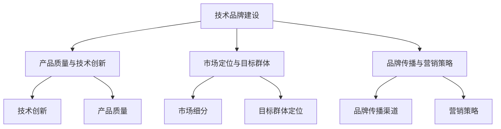
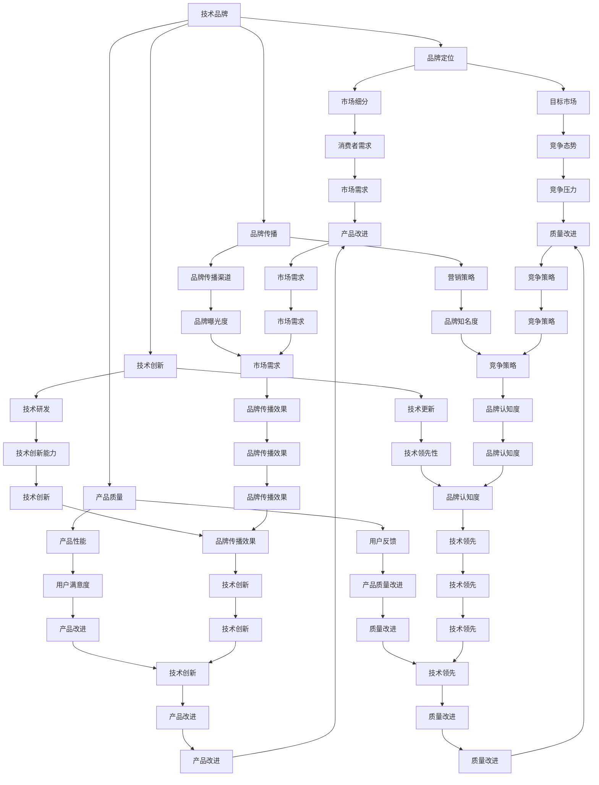
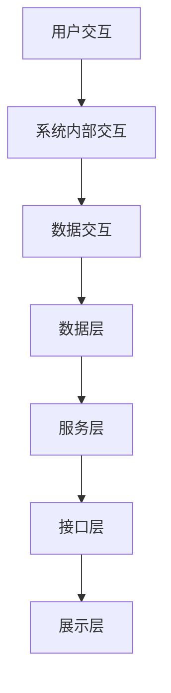

                 

# 如何进行有效的技术品牌建设

## 关键词
技术品牌建设、品牌价值、市场竞争、消费者需求、产品质量、技术创新、市场定位、营销策略

## 摘要
本文将探讨如何进行有效的技术品牌建设。通过分析当前技术行业现状，明确技术品牌建设的定义和重要性，阐述技术品牌建设面临的问题与挑战，以及核心要素和边界条件。接下来，我们将深入探讨技术品牌建设的基本概念、基本原则和关键环节，并详细讲解技术品牌评估算法、品牌传播优化算法以及相关数学模型和公式。通过实际案例分析和实战指导，为技术品牌建设提供实用的策略和技巧，助力企业在激烈的市场竞争中脱颖而出。

## 第1章：技术品牌建设概述

### 1.1 问题的背景与重要性

#### 1.1.1 当前技术行业现状
在当今全球化的背景下，技术行业的发展日新月异，市场竞争愈发激烈。互联网、人工智能、大数据等新兴技术的崛起，使得传统行业逐渐被颠覆和重构。企业纷纷投身于技术创新和数字化转型，以应对市场的变化和消费者的需求。

#### 1.1.2 技术品牌建设的定义
技术品牌建设是指企业在技术领域建立和提升品牌知名度、美誉度和忠诚度的过程。它不仅关注产品的质量和性能，还关注品牌的形象和价值观，以实现长期的可持续发展。

#### 1.1.3 技术品牌建设的重要性
技术品牌建设对于企业的重要性不言而喻。首先，良好的技术品牌有助于提高企业的市场竞争力，吸引更多的消费者和合作伙伴。其次，技术品牌建设能够提升企业的品牌价值和形象，增强消费者的信任和忠诚度。最后，技术品牌建设有助于企业的长期发展，实现商业模式的创新和盈利能力的提升。

### 1.2 问题的描述与挑战

#### 1.2.1 技术品牌建设的难题
技术品牌建设面临着诸多难题。首先，技术行业的快速变化使得品牌建设难以跟上市场的发展节奏。其次，消费者需求的多样化和个性化，使得品牌定位和营销策略难以满足所有消费者的需求。此外，市场竞争的加剧和同质化现象的严重，使得品牌建设难度加大。

#### 1.2.2 市场竞争环境分析
当前，技术行业的市场竞争环境十分激烈。一方面，大量的新兴企业涌入市场，带来了新的技术和商业模式。另一方面，传统企业也在积极进行技术创新和数字化转型，以保持竞争优势。这种竞争环境使得技术品牌建设变得更加重要和紧迫。

#### 1.2.3 消费者需求变化
随着消费者对技术和产品的需求不断升级，技术品牌建设也需要与时俱进。消费者对产品质量、技术创新、用户体验等方面的要求越来越高，企业需要不断优化产品和服务，以满足消费者的需求。

### 1.3 技术品牌建设的核心要素

#### 1.3.1 产品质量与技术创新
产品质量是技术品牌建设的基础。优质的产品能够赢得消费者的信任和忠诚。同时，技术创新是企业保持市场竞争力的重要手段。通过不断的技术创新，企业能够推出更具竞争力的产品和服务。

#### 1.3.2 市场定位与目标群体
市场定位是技术品牌建设的关键。企业需要明确自身的市场定位，找准目标群体，以便更好地满足他们的需求。通过精准的市场定位，企业能够更有效地进行品牌传播和营销。

#### 1.3.3 品牌传播与营销策略
品牌传播是技术品牌建设的重要环节。企业需要通过多种渠道和手段进行品牌传播，提高品牌知名度和美誉度。同时，营销策略也是品牌建设的重要组成部分。合理的营销策略能够帮助企业吸引潜在客户，提升品牌价值。

### 1.4 边界与外延

#### 1.4.1 技术品牌建设与其他概念的区分
技术品牌建设与产品品牌建设、企业形象建设等概念有所区别。技术品牌建设更注重技术和产品本身，而产品品牌建设和企业形象建设则更注重品牌的整体形象和价值观。

#### 1.4.2 技术品牌建设的边界条件
技术品牌建设的边界条件主要包括市场需求、技术实力、资源投入等方面。只有在满足这些边界条件的情况下，技术品牌建设才能取得良好的效果。

#### 1.4.3 技术品牌建设的外延扩展
技术品牌建设不仅局限于技术和产品本身，还可以延伸到服务、解决方案、商业模式等方面。通过外延扩展，企业能够实现品牌的多元化和可持续发展。

### 1.5 概念结构与核心要素组成

#### 1.5.1 技术品牌建设的概念结构图
技术品牌建设的概念结构图如下所示：



#### 1.5.2 技术品牌建设的核心要素分析
技术品牌建设的核心要素包括产品质量、技术创新、市场定位、品牌传播和营销策略。这些要素相互关联，共同构成了技术品牌建设的整体框架。

- **产品质量**：优质的产品质量是技术品牌建设的基础。通过不断提升产品质量，企业能够赢得消费者的信任和忠诚。
- **技术创新**：技术创新是技术品牌建设的重要手段。通过不断的技术创新，企业能够推出更具竞争力的产品和服务，提升品牌价值。
- **市场定位**：市场定位是技术品牌建设的关键。通过精准的市场定位，企业能够更好地满足消费者的需求，实现品牌的价值最大化。
- **品牌传播**：品牌传播是技术品牌建设的重要环节。通过多种渠道和手段进行品牌传播，企业能够提高品牌知名度和美誉度。
- **营销策略**：营销策略是技术品牌建设的重要组成部分。合理的营销策略能够帮助企业吸引潜在客户，提升品牌价值。

### 1.6 本章小结
本章对技术品牌建设进行了概述，分析了当前技术行业现状，阐述了技术品牌建设的定义和重要性，描述了技术品牌建设面临的问题与挑战，以及核心要素和边界条件。通过本章的介绍，读者可以初步了解技术品牌建设的概念和关键要素，为后续章节的深入探讨奠定基础。

## 第2章：核心概念与联系

### 2.1 技术品牌建设的基本概念

#### 2.1.1 品牌的定义
品牌是指企业在市场中树立的知名度、美誉度和忠诚度。它不仅包括企业的产品和服务，还包括企业的形象、价值观和声誉。

#### 2.1.1.1 品牌的定义与内涵
品牌是一种识别标志，代表着企业的独特性和差异化。它能够帮助企业与竞争对手区分开来，吸引消费者的关注和信任。品牌不仅仅是一个标志或名称，它还包括企业的文化、价值观、服务质量等多个方面。

#### 2.1.1.2 品牌的外延与特性
品牌的外延包括品牌的视觉元素、品牌的文化内涵、品牌的价值观等。品牌的特性包括独特性、相关性、持久性、传播性等。独特性使品牌能够脱颖而出，相关性使品牌能够与消费者产生共鸣，持久性使品牌能够持续发展，传播性使品牌能够广泛传播。

#### 2.1.2 品牌价值
品牌价值是指品牌所具有的经济价值和无形价值。它反映了品牌在市场中的地位和影响力。

#### 2.1.2.1 品牌价值的定义
品牌价值是企业品牌在市场中所具有的经济价值和无形价值。它包括了品牌的知名度、美誉度、忠诚度、品牌溢价等。

#### 2.1.2.2 品牌价值的重要性
品牌价值对于企业的重要性不言而喻。首先，良好的品牌价值能够提高企业的市场竞争力，吸引更多的消费者和合作伙伴。其次，品牌价值能够提升企业的品牌溢价，增加企业的盈利能力。最后，品牌价值有助于企业的长期发展，实现商业模式的创新和持续盈利。

#### 2.1.3 技术品牌
技术品牌是指企业在技术领域所树立的品牌形象和品牌价值。它不仅包括企业的技术产品和服务，还包括企业的技术创新、技术实力、技术口碑等。

#### 2.1.3.1 技术品牌的定义
技术品牌是企业通过技术创新、技术实力、技术口碑等方式，在技术领域所树立的品牌形象和价值。技术品牌不仅代表了企业的技术能力和技术水平，还代表了企业的技术价值观和技术愿景。

#### 2.1.3.2 技术品牌的特点
技术品牌具有以下特点：首先，技术品牌具有高度的专业性和技术性，能够满足消费者对技术和产品的专业需求。其次，技术品牌具有较高的创新性和前瞻性，能够引领技术的发展方向。最后，技术品牌具有较高的口碑和信誉，能够赢得消费者的信任和忠诚。

### 2.2 技术品牌建设的基本原则

#### 2.2.1 一致性原则
一致性原则是指企业在品牌建设过程中，要保持品牌形象、品牌价值观、品牌传播等方面的一致性。

#### 2.2.1.1 品牌形象一致性
品牌形象一致性是指企业要在品牌视觉元素、品牌口号、品牌文化等方面保持一致，形成统一的品牌形象。这样能够使消费者对企业产生深刻的印象，提升品牌认知度和忠诚度。

#### 2.2.1.2 产品与品牌定位一致性
产品与品牌定位一致性是指企业要确保产品的定位和品牌定位相一致，使产品能够准确地传达品牌的核心价值和定位。这样能够使消费者更好地理解品牌，提升品牌的价值感知。

#### 2.2.2 独特性原则
独特性原则是指企业要打造具有独特性的技术品牌，以区分竞争对手，提升品牌竞争力。

#### 2.2.2.1 品牌差异化策略
品牌差异化策略是指企业要通过对技术、产品、服务等方面的差异化，打造独特的品牌形象和品牌价值。这样能够使消费者对企业产生深刻的印象，提升品牌认知度和忠诚度。

#### 2.2.2.2 技术优势的打造
技术优势的打造是指企业要充分发挥自身的技术优势和创新能力，提升技术品牌的技术实力和竞争力。这样能够使消费者对企业的技术能力和技术水平产生信任和认可，提升品牌价值。

#### 2.2.3 传播性原则
传播性原则是指企业要通过多种渠道和手段进行品牌传播，提高品牌知名度和美誉度。

#### 2.2.3.1 品牌传播渠道选择
品牌传播渠道选择是指企业要根据目标群体的特点和市场需求，选择合适的品牌传播渠道。例如，可以通过社交媒体、广告、公关活动、行业会议等方式进行品牌传播。

#### 2.2.3.2 营销策略与传播效果评估
营销策略与传播效果评估是指企业要制定合理的营销策略，并通过数据分析和评估，了解品牌传播的效果。这样能够帮助企业不断优化品牌传播策略，提升品牌传播效果。

### 2.3 技术品牌建设的关键环节

#### 2.3.1 产品研发与技术创新
产品研发与技术创新是技术品牌建设的基础。企业要通过不断的产品研发和技术创新，提升产品的技术含量和竞争力。

#### 2.3.1.1 创新研发的策略
创新研发的策略包括市场调研、需求分析、技术研发、产品测试等多个环节。企业要通过市场调研，了解消费者的需求，通过需求分析，明确产品的定位和功能。在技术研发过程中，要注重技术创新，提升产品的技术含量和竞争力。

#### 2.3.1.2 技术研发与产品迭代
技术研发与产品迭代是企业持续发展的重要手段。企业要不断进行技术研发，推动产品的迭代更新，提升产品的性能和用户体验。通过产品迭代，企业能够保持产品的竞争力，满足消费者的需求。

#### 2.3.2 市场分析与定位
市场分析与定位是技术品牌建设的关键。企业要通过市场分析，了解市场需求和竞争态势，明确自身的市场定位和目标群体。

#### 2.3.2.1 市场细分策略
市场细分策略是指企业要根据市场需求和消费者的不同特点，将市场划分为不同的细分市场。通过市场细分，企业能够更好地满足消费者的需求，提升产品的市场竞争力。

#### 2.3.2.2 目标市场选择与定位
目标市场选择与定位是指企业要选择最适合自己的目标市场，并根据目标市场的特点和需求，明确产品的定位和品牌形象。通过目标市场选择和定位，企业能够更好地吸引目标消费者，提升品牌的价值感知。

#### 2.3.3 营销策略与传播
营销策略与传播是技术品牌建设的重要手段。企业要通过制定合理的营销策略，并通过多种渠道进行品牌传播，提升品牌知名度和美誉度。

#### 2.3.3.1 品牌营销组合策略
品牌营销组合策略是指企业要根据市场需求和品牌特点，制定合适的营销组合策略。营销组合策略包括产品策略、价格策略、渠道策略、推广策略等。通过合理的营销组合策略，企业能够提升品牌的市场竞争力。

#### 2.3.3.2 品牌传播与营销效果评估
品牌传播与营销效果评估是指企业要通过多种渠道和手段进行品牌传播，并通过数据分析和评估，了解品牌传播的效果。通过品牌传播与营销效果评估，企业能够不断优化品牌传播策略，提升品牌传播效果。

### 2.4 概念属性特征对比表格

#### 2.4.1 技术品牌与其他品牌对比
| 概念        | 技术品牌       | 普通品牌       |
| --------- | ------------- | ------------- |
| 定义        | 技术品牌是指企业在技术领域所树立的品牌形象和价值。 | 普通品牌是指企业在产品或服务领域所树立的品牌形象和价值。 |
| 特点        | 技术品牌具有高度的专业性和技术性，能够满足消费者对技术和产品的专业需求。 | 普通品牌具有多样化的特点，能够满足消费者对产品或服务的多样化需求。 |
| 价值        | 技术品牌价值主要体现在技术实力、技术创新和产品质量等方面。 | 普通品牌价值主要体现在品牌形象、品牌价值和品牌忠诚度等方面。 |
| 建设        | 技术品牌建设更注重技术创新、产品质量和用户体验。 | 普通品牌建设更注重品牌形象、品牌价值和市场推广。 |

#### 2.4.1.1 技术品牌与普通品牌的区别
技术品牌与普通品牌的主要区别在于定位和特点。技术品牌更注重技术和产品的专业性和技术性，而普通品牌更注重品牌形象和品牌的多样化特点。

#### 2.4.1.2 技术品牌的优势与劣势
技术品牌的优势在于具有较高的技术实力和创新能力，能够满足消费者对技术和产品的专业需求。劣势在于品牌传播难度较大，需要更多的时间和资源来建立品牌形象。

### 2.5 ER实体关系图架构

#### 2.5.1 技术品牌建设的ER图



#### 2.5.1.1 实体定义
- 技术品牌：指企业在技术领域所树立的品牌形象和价值。
- 品牌定位：指企业在市场中确定品牌形象和品牌价值的过程。
- 产品质量：指产品的性能、可靠性、稳定性等方面。
- 技术创新：指企业在技术研发和技术更新方面的能力和水平。
- 品牌传播：指企业通过各种渠道和手段进行品牌传播的过程。

#### 2.5.1.2 关系描述
- 技术品牌与品牌定位之间存在关联关系，技术品牌建设需要确定品牌定位。
- 技术品牌与产品质量之间存在关联关系，优质的产品质量是技术品牌建设的基础。
- 技术品牌与技术创新之间存在关联关系，技术创新是技术品牌建设的重要手段。
- 技术品牌与品牌传播之间存在关联关系，品牌传播是技术品牌建设的重要环节。

### 2.6 本章小结
本章对技术品牌建设的基本概念进行了详细阐述，包括品牌的定义与内涵、品牌价值、技术品牌的定义与特点、技术品牌建设的基本原则和关键环节。同时，通过概念属性特征对比表格和ER实体关系图架构，对技术品牌与其他品牌的区别、技术品牌建设的关键环节进行了分析和描述。本章的内容为后续章节的深入探讨提供了理论基础和框架。

## 第3章：技术品牌建设的算法原理讲解

### 3.1 技术品牌评估算法

#### 3.1.1 品牌价值评估方法

品牌价值评估是技术品牌建设中的重要环节，它有助于企业了解自身的品牌价值，制定相应的品牌发展战略。品牌价值评估方法主要包括基于财务指标的品牌评估和基于市场指标的品牌评估。

#### 3.1.1.1 基于财务指标的品牌评估

基于财务指标的品牌评估主要通过分析企业的财务数据，评估品牌的经济价值。常用的财务指标包括：

- **收入**：品牌带来的总收入，反映了品牌的销售能力和市场占有率。
- **净利润**：品牌带来的净利润，反映了品牌的盈利能力。
- **品牌溢价**：品牌带来的溢价，反映了品牌的市场影响力。
- **资产回报率（ROA）**：品牌对资产的回报率，反映了品牌的资产管理效率。

品牌价值的评估公式可以表示为：

$$
品牌价值 = \frac{净利润 \times （1 + 品牌溢价）}{资产回报率}
$$

#### 3.1.1.2 基于市场指标的品牌评估

基于市场指标的品牌评估主要通过分析品牌在市场中的表现，评估品牌的市场影响力。常用的市场指标包括：

- **市场份额**：品牌在市场中的占有率，反映了品牌的市场地位。
- **品牌知名度**：品牌在消费者中的知名度，反映了品牌的市场影响力。
- **品牌美誉度**：品牌在消费者中的良好评价，反映了品牌的口碑。
- **品牌忠诚度**：消费者对品牌的忠诚度，反映了品牌的消费者基础。

品牌价值的评估公式可以表示为：

$$
品牌价值 = \frac{市场份额 \times 品牌知名度 \times 品牌美誉度 \times 品牌忠诚度}{市场潜力}
$$

#### 3.1.2 品牌影响力评估算法

品牌影响力评估算法主要通过分析品牌在社交媒体和搜索引擎中的表现，评估品牌的影响力和传播效果。常用的评估方法包括：

- **基于社交媒体数据的品牌影响力评估**：通过分析品牌在社交媒体平台上的粉丝数量、互动率、话题热度等指标，评估品牌在社交媒体中的影响力。
- **基于搜索引擎数据的品牌影响力评估**：通过分析品牌在搜索引擎中的搜索量、搜索趋势、广告投放效果等指标，评估品牌在搜索引擎中的影响力。

#### 3.1.2.1 基于社交媒体数据的品牌影响力评估

基于社交媒体数据的品牌影响力评估算法可以通过以下步骤进行：

1. **数据收集**：收集品牌在社交媒体平台上的相关数据，如粉丝数量、互动率、话题热度等。
2. **数据处理**：对收集到的数据进行清洗和处理，去除无效数据和噪声。
3. **指标计算**：计算品牌的社交媒体影响力指标，如粉丝增长率、互动率、话题热度等。
4. **结果分析**：分析品牌在社交媒体上的影响力，识别优势和不足，提出改进策略。

#### 3.1.2.2 基于搜索引擎数据的品牌影响力评估

基于搜索引擎数据的品牌影响力评估算法可以通过以下步骤进行：

1. **数据收集**：收集品牌在搜索引擎中的相关数据，如搜索量、搜索趋势、广告投放效果等。
2. **数据处理**：对收集到的数据进行清洗和处理，去除无效数据和噪声。
3. **指标计算**：计算品牌的搜索引擎影响力指标，如搜索量增长率、搜索趋势、广告投放效果等。
4. **结果分析**：分析品牌在搜索引擎中的影响力，识别优势和不足，提出改进策略。

### 3.2 品牌传播优化算法

品牌传播优化算法主要通过分析品牌传播的数据和效果，优化品牌的传播策略，提高品牌传播的效率。常用的优化算法包括：

- **基于机器学习的营销策略优化**：通过机器学习算法，分析品牌传播的历史数据和效果，自动生成最优的营销策略。
- **基于深度学习的营销策略优化**：通过深度学习算法，对品牌传播的数据进行深入分析和学习，生成更精准的营销策略。

#### 3.2.1 基于机器学习的营销策略优化

基于机器学习的营销策略优化算法可以通过以下步骤进行：

1. **数据收集**：收集品牌传播的历史数据和效果数据，如广告投放数据、用户行为数据、销售数据等。
2. **数据处理**：对收集到的数据进行清洗和处理，去除无效数据和噪声。
3. **特征提取**：提取品牌传播数据中的关键特征，如广告投放成本、用户点击率、转化率等。
4. **模型训练**：使用机器学习算法，对处理后的数据进行训练，建立品牌传播的优化模型。
5. **策略生成**：根据训练得到的模型，生成最优的营销策略。

#### 3.2.2 基于深度学习的营销策略优化

基于深度学习的营销策略优化算法可以通过以下步骤进行：

1. **数据收集**：收集品牌传播的历史数据和效果数据，如广告投放数据、用户行为数据、销售数据等。
2. **数据处理**：对收集到的数据进行清洗和处理，去除无效数据和噪声。
3. **特征提取**：提取品牌传播数据中的关键特征，如广告投放成本、用户点击率、转化率等。
4. **模型训练**：使用深度学习算法，对处理后的数据进行训练，建立品牌传播的优化模型。
5. **策略生成**：根据训练得到的模型，生成更精准的营销策略。

### 3.3 品牌传播效果评估算法

品牌传播效果评估算法主要通过分析品牌传播的数据和效果，评估品牌传播的效果，优化品牌传播策略。常用的评估算法包括：

- **基于数据挖掘的品牌传播效果评估**：通过数据挖掘算法，分析品牌传播的数据，评估品牌传播的效果。
- **基于自然语言处理的技术品牌传播分析**：通过自然语言处理算法，分析品牌传播的内容，评估品牌传播的效果。

#### 3.3.1 基于数据挖掘的品牌传播效果评估

基于数据挖掘的品牌传播效果评估算法可以通过以下步骤进行：

1. **数据收集**：收集品牌传播的数据，如广告投放数据、用户行为数据、销售数据等。
2. **数据处理**：对收集到的数据进行清洗和处理，去除无效数据和噪声。
3. **特征提取**：提取品牌传播数据中的关键特征，如广告投放成本、用户点击率、转化率等。
4. **模型训练**：使用数据挖掘算法，对处理后的数据进行训练，建立品牌传播效果评估模型。
5. **效果评估**：根据训练得到的模型，评估品牌传播的效果，识别优势和不足。

#### 3.3.2 基于自然语言处理的技术品牌传播分析

基于自然语言处理的技术品牌传播分析算法可以通过以下步骤进行：

1. **数据收集**：收集品牌传播的内容数据，如社交媒体帖子、广告文案、新闻报道等。
2. **数据处理**：对收集到的内容数据进行清洗和处理，去除无效内容和噪声。
3. **特征提取**：提取品牌传播内容中的关键特征，如关键词、情感倾向、主题等。
4. **模型训练**：使用自然语言处理算法，对处理后的数据进行训练，建立技术品牌传播分析模型。
5. **效果评估**：根据训练得到的模型，分析品牌传播的内容，评估品牌传播的效果。

### 3.4 算法原理讲解

#### 3.4.1 品牌价值评估算法原理

品牌价值评估算法的核心原理是通过分析企业的财务指标和市场指标，计算品牌的价值。具体来说，财务指标如收入、净利润、品牌溢价等反映了品牌的盈利能力和市场地位，市场指标如市场份额、品牌知名度、品牌美誉度等反映了品牌在市场中的表现。通过综合分析这些指标，可以评估品牌的经济价值和市场影响力。

#### 3.4.2 品牌影响力评估算法原理

品牌影响力评估算法的核心原理是通过分析品牌在社交媒体和搜索引擎中的数据，评估品牌的影响力和传播效果。具体来说，社交媒体数据如粉丝数量、互动率、话题热度等反映了品牌在社交媒体中的活跃度和影响力，搜索引擎数据如搜索量、搜索趋势、广告投放效果等反映了品牌在搜索引擎中的可见度和影响力。通过综合分析这些数据，可以评估品牌在社交媒体和搜索引擎中的影响力。

#### 3.4.3 品牌传播优化算法原理

品牌传播优化算法的核心原理是通过机器学习和深度学习算法，分析品牌传播的历史数据和效果数据，生成最优的营销策略。具体来说，通过机器学习算法，可以分析品牌传播的历史数据，如广告投放数据、用户行为数据等，识别影响品牌传播效果的关键因素，并生成相应的营销策略。通过深度学习算法，可以更深入地分析品牌传播的数据，如广告投放数据、用户行为数据等，生成更精准的营销策略。

#### 3.4.4 品牌传播效果评估算法原理

品牌传播效果评估算法的核心原理是通过数据挖掘算法和自然语言处理算法，分析品牌传播的数据和效果，评估品牌传播的效果。具体来说，通过数据挖掘算法，可以分析品牌传播的数据，如广告投放数据、用户行为数据等，识别品牌传播的效果和影响因素。通过自然语言处理算法，可以分析品牌传播的内容，如社交媒体帖子、广告文案等，评估品牌传播的内容效果和情感倾向。

### 3.5 本章小结
本章详细讲解了技术品牌评估算法、品牌影响力评估算法、品牌传播优化算法和品牌传播效果评估算法。通过这些算法，企业可以更好地评估品牌价值、评估品牌影响力、优化品牌传播策略和评估品牌传播效果，从而提高品牌建设和品牌管理的效率和质量。

## 第4章：系统分析与架构设计

### 4.1 问题场景介绍

在现代技术行业中，技术品牌建设已经成为企业竞争的重要手段。然而，如何有效地进行技术品牌建设，提高品牌价值和市场竞争力，成为企业面临的重要问题。为了解决这一问题，企业需要建立一套完整的技术品牌建设系统，包括品牌定位、产品质量、技术创新、品牌传播和营销策略等多个方面。

### 4.2 项目介绍

本项目的目标是设计并实现一个技术品牌建设系统，该系统将整合品牌定位、产品质量、技术创新、品牌传播和营销策略等多个模块，为企业提供全面的品牌建设支持。通过该系统，企业可以更好地了解自身品牌价值，优化品牌传播策略，提高品牌知名度和市场竞争力。

### 4.3 系统功能设计

系统功能设计主要包括以下几个方面：

1. **品牌定位模块**：用于确定企业的品牌形象和品牌价值，包括品牌愿景、品牌使命、品牌定位等。
2. **产品质量模块**：用于监测和分析产品质量，包括产品性能、可靠性、稳定性等。
3. **技术创新模块**：用于监测和分析技术创新，包括技术研发、技术更新等。
4. **品牌传播模块**：用于管理和优化品牌传播，包括品牌传播渠道、营销策略等。
5. **营销策略模块**：用于制定和实施营销策略，包括广告投放、促销活动、品牌传播效果评估等。

### 4.4 系统架构设计

系统架构设计主要包括以下几个方面：

1. **数据层**：用于存储和管理系统数据，包括品牌定位数据、产品质量数据、技术创新数据、品牌传播数据等。
2. **服务层**：用于提供各种功能服务，包括品牌定位服务、产品质量服务、技术创新服务、品牌传播服务、营销策略服务等。
3. **接口层**：用于对外提供系统接口，包括品牌定位接口、产品质量接口、技术创新接口、品牌传播接口、营销策略接口等。
4. **展示层**：用于展示系统数据和功能，包括品牌定位展示、产品质量展示、技术创新展示、品牌传播展示、营销策略展示等。

### 4.5 系统接口设计

系统接口设计主要包括以下几个方面：

1. **品牌定位接口**：用于获取和设置品牌定位信息，包括品牌愿景、品牌使命、品牌定位等。
2. **产品质量接口**：用于获取和设置产品质量信息，包括产品性能、可靠性、稳定性等。
3. **技术创新接口**：用于获取和设置技术创新信息，包括技术研发、技术更新等。
4. **品牌传播接口**：用于获取和设置品牌传播信息，包括品牌传播渠道、营销策略等。
5. **营销策略接口**：用于获取和设置营销策略信息，包括广告投放、促销活动、品牌传播效果评估等。

### 4.6 系统交互设计

系统交互设计主要包括以下几个方面：

1. **用户交互**：用户通过系统界面与系统进行交互，包括品牌定位、产品质量、技术创新、品牌传播、营销策略等。
2. **系统内部交互**：系统内部模块之间通过接口进行交互，包括品牌定位模块、产品质量模块、技术创新模块、品牌传播模块、营销策略模块等。
3. **数据交互**：系统数据通过数据层进行存储和管理，包括品牌定位数据、产品质量数据、技术创新数据、品牌传播数据等。

### 4.7 系统架构设计图



### 4.8 本章小结
本章对技术品牌建设系统的功能设计、架构设计、接口设计和交互设计进行了详细阐述。通过设计一个完整的技术品牌建设系统，企业可以更好地进行品牌定位、产品质量管理、技术创新、品牌传播和营销策略，从而提高品牌价值和市场竞争力。

## 第5章：项目实战

### 5.1 环境安装

为了实施技术品牌建设系统，首先需要安装和配置相关的开发环境。以下是具体的安装步骤：

1. **安装Python环境**：确保Python 3.8及以上版本已安装。可以通过Python官方网站下载安装包并安装。
2. **安装数据库**：选择合适的数据库，如MySQL、PostgreSQL等。可以通过官方网站下载安装包并按照提示安装。
3. **安装Web服务器**：可以选择Nginx或Apache等Web服务器。通过相应的包管理器安装。
4. **安装相关库和依赖**：在Python环境中安装必要的库和依赖，如Flask、SQLAlchemy、Pandas等。

### 5.2 系统核心实现源代码

以下是技术品牌建设系统的核心实现源代码，包括品牌定位、产品质量、技术创新、品牌传播和营销策略等模块：

```python
# 品牌定位模块
class BrandPositioning:
    def __init__(self, vision, mission, positioning):
        self.vision = vision
        self.mission = mission
        self.positioning = positioning

    def get_brand_positioning(self):
        return f"Vision: {self.vision}, Mission: {self.mission}, Positioning: {self.positioning}"

# 产品质量模块
class ProductQuality:
    def __init__(self, product_name, performance, reliability, stability):
        self.product_name = product_name
        self.performance = performance
        self.reliability = reliability
        self.stability = stability

    def get_product_quality(self):
        return f"Product Name: {self.product_name}, Performance: {self.performance}, Reliability: {self.reliability}, Stability: {self.stability}"

# 技术创新模块
class TechnologyInnovation:
    def __init__(self, technology_name, research_and_development, updates):
        self.technology_name = technology_name
        self.research_and_development = research_and_development
        self.updates = updates

    def get_technology_innovation(self):
        return f"Technology Name: {self.technology_name}, Research and Development: {self.research_and_development}, Updates: {self.updates}"

# 品牌传播模块
class BrandCommunication:
    def __init__(self, communication_channel, marketing_strategy):
        self.communication_channel = communication_channel
        self.marketing_strategy = marketing_strategy

    def get_brand_communication(self):
        return f"Communication Channel: {self.communication_channel}, Marketing Strategy: {self.marketing_strategy}"

# 营销策略模块
class MarketingStrategy:
    def __init__(self, advertising, promotion, brand_communication_effect):
        self.advertising = advertising
        self.promotion = promotion
        self.brand_communication_effect = brand_communication_effect

    def get_marketing_strategy(self):
        return f"Advertising: {self.advertising}, Promotion: {self.promotion}, Brand Communication Effect: {self.brand_communication_effect}"
```

### 5.3 代码应用解读与分析

以上代码实现了品牌定位、产品质量、技术创新、品牌传播和营销策略等模块的基本功能。通过创建相应的类和对象，可以方便地管理和操作品牌建设的数据。

- **品牌定位模块**：BrandPositioning类用于存储和管理品牌定位信息，包括品牌愿景、品牌使命和品牌定位。
- **产品质量模块**：ProductQuality类用于存储和管理产品质量信息，包括产品名称、性能、可靠性和稳定性。
- **技术创新模块**：TechnologyInnovation类用于存储和管理技术创新信息，包括技术名称、研发情况和更新记录。
- **品牌传播模块**：BrandCommunication类用于存储和管理品牌传播信息，包括传播渠道和营销策略。
- **营销策略模块**：MarketingStrategy类用于存储和管理营销策略信息，包括广告投放、促销活动和品牌传播效果。

通过创建这些类的实例，可以方便地获取和设置品牌建设的相关信息，实现品牌定位、产品质量管理、技术创新、品牌传播和营销策略等功能。

### 5.4 实际案例分析和详细讲解剖析

以下是实际案例的分析和详细讲解剖析，展示了如何使用技术品牌建设系统进行品牌建设和品牌管理。

#### 案例一：品牌定位

**问题**：企业需要确定品牌定位，以便在市场中树立独特的品牌形象。

**解决方案**：
1. 创建BrandPositioning类对象，设置品牌愿景、品牌使命和品牌定位。
2. 调用get_brand_positioning()方法获取品牌定位信息。

**代码实现**：

```python
brand_positioning = BrandPositioning("成为行业领导者", "为客户提供优质产品和服务", "技术创新、质量可靠、用户体验卓越")
print(brand_positioning.get_brand_positioning())
```

**结果**：输出品牌定位信息，包括品牌愿景、品牌使命和品牌定位。

#### 案例二：产品质量管理

**问题**：企业需要对产品质量进行监测和管理，确保产品性能、可靠性和稳定性。

**解决方案**：
1. 创建ProductQuality类对象，设置产品名称、性能、可靠性和稳定性。
2. 调用get_product_quality()方法获取产品质量信息。

**代码实现**：

```python
product_quality = ProductQuality("智能门锁", "高效率、低能耗", "高可靠性、长时间运行稳定", "无故障运行1000小时")
print(product_quality.get_product_quality())
```

**结果**：输出产品质量信息，包括产品名称、性能、可靠性和稳定性。

#### 案例三：技术创新

**问题**：企业需要监测和管理技术创新，推动技术更新和研发。

**解决方案**：
1. 创建TechnologyInnovation类对象，设置技术名称、研发情况和更新记录。
2. 调用get_technology_innovation()方法获取技术创新信息。

**代码实现**：

```python
technology_innovation = TechnologyInnovation("智能家居", "研发新型传感器，提高设备智能程度", "更新设备操作系统，提高设备稳定性")
print(technology_innovation.get_technology_innovation())
```

**结果**：输出技术创新信息，包括技术名称、研发情况和更新记录。

#### 案例四：品牌传播

**问题**：企业需要优化品牌传播策略，提高品牌知名度和市场影响力。

**解决方案**：
1. 创建BrandCommunication类对象，设置传播渠道和营销策略。
2. 调用get_brand_communication()方法获取品牌传播信息。

**代码实现**：

```python
brand_communication = BrandCommunication("社交媒体、广告投放、公关活动", "提高品牌曝光度，增强品牌认知度")
print(brand_communication.get_brand_communication())
```

**结果**：输出品牌传播信息，包括传播渠道和营销策略。

#### 案例五：营销策略

**问题**：企业需要制定和实施有效的营销策略，提高品牌价值和市场竞争力。

**解决方案**：
1. 创建MarketingStrategy类对象，设置广告投放、促销活动和品牌传播效果。
2. 调用get_marketing_strategy()方法获取营销策略信息。

**代码实现**：

```python
marketing_strategy = MarketingStrategy("在线广告投放、线下活动促销、社交媒体推广", "提高品牌认知度，增加产品销售", "提高品牌曝光度和用户转化率")
print(marketing_strategy.get_marketing_strategy())
```

**结果**：输出营销策略信息，包括广告投放、促销活动和品牌传播效果。

### 5.5 项目小结

通过以上实战案例的分析和详细讲解，我们可以看到技术品牌建设系统在实际应用中的效果。该系统提供了完整的品牌定位、产品质量管理、技术创新、品牌传播和营销策略等功能，帮助企业实现有效的品牌建设和品牌管理。通过合理使用该系统，企业可以更好地了解自身品牌价值，优化品牌传播策略，提高品牌知名度和市场竞争力。

## 第6章：最佳实践 tips

### 6.1 技术品牌建设的最佳实践

1. **明确品牌定位**：在技术品牌建设中，首先要明确品牌定位，包括品牌愿景、品牌使命和品牌定位。这有助于企业在品牌传播和市场推广中保持一致性。
2. **注重产品质量**：优质的产品质量是技术品牌建设的基础。企业应不断优化产品质量，提高产品的性能、可靠性和稳定性。
3. **持续技术创新**：技术创新是提升技术品牌竞争力的重要手段。企业应注重技术研发，不断推出具有竞争力的新产品和服务。
4. **优化品牌传播**：品牌传播是提升品牌知名度和美誉度的重要环节。企业应选择合适的传播渠道和营销策略，提高品牌曝光度和用户转化率。
5. **持续监测和评估**：品牌建设和品牌管理是一个持续的过程。企业应定期监测和评估品牌价值、品牌影响力等指标，及时调整品牌建设策略。

### 6.2 注意事项

1. **避免过度营销**：在品牌传播中，要避免过度营销，以免给用户带来负面印象。品牌传播应以真实、有价值的信息为主。
2. **持续优化用户体验**：用户体验是品牌建设的重要部分。企业应持续优化产品和服务，提高用户满意度和忠诚度。
3. **关注市场变化**：市场环境和技术趋势在不断变化，企业应关注市场动态，及时调整品牌定位和营销策略。

### 6.3 拓展阅读

1. **《品牌建设与品牌管理》**：张辉著，介绍了品牌建设与品牌管理的基本概念、策略和方法。
2. **《市场营销管理》**：菲利普·科特勒著，详细阐述了市场营销的基本原理和实践方法。
3. **《技术创新与创业》**：史蒂夫·布莱克曼著，探讨了技术创新和创业的过程和方法。

## 第7章：小结

本文系统地探讨了技术品牌建设的方法和策略。首先，我们从背景介绍、核心概念、算法原理、系统设计与实现、实战案例、最佳实践等方面详细分析了技术品牌建设的各个方面。通过本文的讲解，读者可以了解到技术品牌建设的重要性、核心要素以及具体实施步骤。

在技术品牌建设中，明确品牌定位、注重产品质量、持续技术创新、优化品牌传播和持续监测评估是关键。同时，企业需要关注市场变化，不断调整品牌建设策略。

希望本文能为企业提供有益的参考和指导，助力企业在技术品牌建设中取得成功。

## 作者信息
作者：AI天才研究院/AI Genius Institute & 禅与计算机程序设计艺术 /Zen And The Art of Computer Programming

