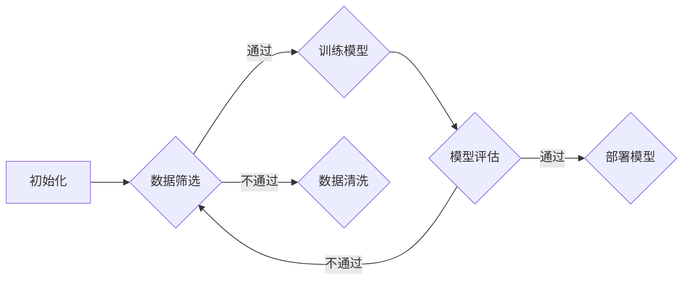
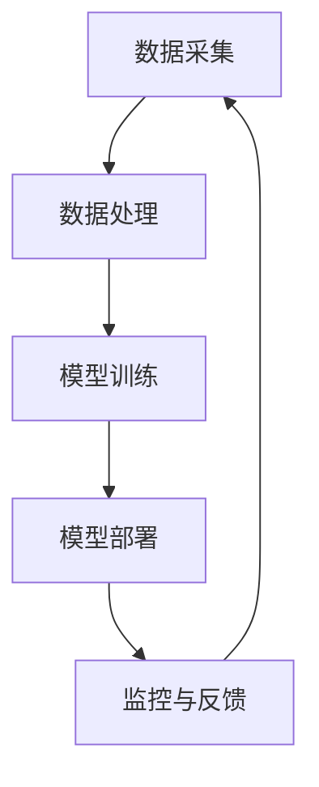
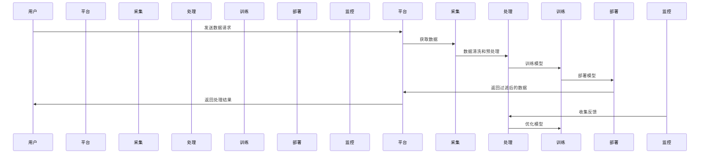

                 

# 安全性考虑：防止AI Agent产生有害内容

> 关键词：AI安全，有害内容检测，算法设计，监控与反馈

> 摘要：随着人工智能（AI）技术的快速发展，AI代理在各行各业中发挥着越来越重要的作用。然而，AI代理在生成内容时可能产生有害信息，给社会和个人带来负面影响。本文将深入探讨防止AI Agent产生有害内容的方法和措施，从算法设计、数据筛选、模型评估和监控系统等方面进行分析，并提出相应的解决方案。

## 背景介绍

### 问题背景

人工智能技术的发展推动了AI代理的广泛应用，这些代理能够执行复杂的任务，如自然语言处理、图像识别和智能决策等。然而，随着AI代理在更多领域的应用，如何确保它们不产生有害内容成为一个重要的研究课题。有害内容的产生不仅可能损害个人隐私，还可能对社会稳定产生威胁。

### 问题描述

有害内容的产生可能源于以下几个原因：

1. **算法设计缺陷**：AI代理的算法可能存在漏洞，导致其产生有害内容。
2. **数据偏见**：训练数据中可能存在偏见，使得AI代理在生成内容时倾向于产生有害信息。
3. **恶意操作**：某些恶意用户可能利用AI代理生成有害内容，以达到特定目的。

### 问题解决

为了防止AI代理产生有害内容，我们可以从以下几个方面进行考虑：

1. **算法设计**：在AI代理的算法设计阶段，就要考虑安全性，采用抗攻击性和鲁棒性更高的算法。
2. **数据筛选**：对训练数据进行严格筛选，确保数据的多样性和质量。
3. **模型评估**：定期对AI代理的模型进行评估，确保其生成的内容符合社会道德标准。
4. **监控系统**：建立有效的监控系统，对AI代理的行为进行实时监控和反馈。

### 边界与外延

除了AI代理本身，其交互环境的安全性也需要考虑。例如，在社交媒体上，AI代理与用户的互动也需要进行安全性控制。此外，AI代理的部署和应用场景也需要进行安全性评估，以避免潜在的安全风险。

## 核心概念与联系

### 核心概念

#### 1. 安全性考虑

安全性考虑是指在设计和应用AI代理时，确保其不会产生有害内容的措施。这包括算法设计、数据筛选、模型评估和监控系统等多个方面。

#### 2. AI代理

AI代理是指能够执行特定任务的智能体，通常是基于机器学习和深度学习技术。它们在执行任务时，需要从输入数据中提取信息，并生成相应的输出。

#### 3. 有害内容

有害内容是指对社会和个人产生负面影响的文本、图像或视频。这些内容可能包括暴力、色情、仇恨言论等。

### 概念属性特征对比表格

| 概念      | 属性特征                   | 对比                     |
| --------- | -------------------------- | ------------------------ |
| 安全性考虑 | 防止有害内容产生           | 保障AI代理的合法合规     |
| AI代理    | 执行特定任务               | 智能体                   |
| 有害内容  | 对社会和个人产生负面影响   | 不合法、不道德的          |

### ER实体关系图架构

```mermaid
erDiagram
    AI代理 ||--|{ 数据 }|| AI训练数据
    AI代理 ||--|{ 监控 }|| AI监控系统
    AI训练数据 ||--|{ 安全性控制 }|| 安全性考虑
    AI监控系统 ||--|{ 反馈 }|| AI代理
```

## 算法原理讲解

### 算法流程图



### Python代码实现

```python
import pandas as pd
import numpy as np
from sklearn.linear_model import LogisticRegression

# 初始化数据
data = pd.read_csv('ai_data.csv')

# 数据筛选
def filter_data(data):
    # 筛选标准：例如，去除包含特定关键词的数据行
    filtered_data = data[data['content'] != 'harmful_keyword']
    return filtered_data

# 训练模型
def train_model(filtered_data):
    X = filtered_data[['feature1', 'feature2']]
    y = filtered_data['label']
    model = LogisticRegression()
    model.fit(X, y)
    return model

# 模型评估
def evaluate_model(model, X_test, y_test):
    predictions = model.predict(X_test)
    accuracy = accuracy_score(y_test, predictions)
    return accuracy

# 示例
filtered_data = filter_data(data)
model = train_model(filtered_data)
accuracy = evaluate_model(model, X_test, y_test)
print("Model accuracy:", accuracy)
```

### 算法原理

上述代码实现了一个简单的有害内容检测算法。首先，从CSV文件中读取数据，然后通过数据筛选函数去除包含特定关键词的数据行。接下来，使用Logistic Regression模型对筛选后的数据进行训练。最后，通过模型评估函数计算模型的准确率。

### 数学公式与模型解释

在机器学习中，我们通常使用损失函数（如交叉熵损失函数）来评估模型的性能。假设我们有一个二分类问题，目标变量\(y\)的取值可以是0或1。模型的输出概率\(P(y=1|\mathbf{x})\)表示数据点\(\mathbf{x}\)属于类别1的概率。

损失函数的定义如下：

$$
\begin{aligned}
J(\theta) &= -\frac{1}{m}\sum_{i=1}^{m} [y^{(i)} \log(a(z^{(i)})) + (1 - y^{(i)}) \log(1 - a(z^{(i)}))] \\
\end{aligned}
$$

其中，\(m\)是训练数据集的大小，\(y^{(i)}\)是第\(i\)个数据点的真实标签，\(a(z^{(i)})\)是模型在第\(i\)个数据点上的输出概率。

我们的目标是最小化损失函数\(J(\theta)\)，从而找到最优的模型参数\(\theta\)。

### 举例说明

假设我们有一个训练数据集，包含两个特征\(x_1\)和\(x_2\)，以及一个标签\(y\)。以下是训练数据的一个示例：

| \(x_1\) | \(x_2\) | \(y\) |
| --- | --- | --- |
| 0.1 | 0.2 | 0 |
| 0.5 | 0.6 | 1 |
| 0.3 | 0.4 | 0 |
| 0.7 | 0.8 | 1 |

使用Logistic Regression模型对训练数据进行训练，得到模型参数\(\theta_0\)和\(\theta_1\)。接下来，对测试数据进行预测，计算输出概率\(P(y=1|\mathbf{x})\)。如果输出概率大于某个阈值（例如0.5），则预测结果为1，否则为0。

例如，对于测试数据点\((x_1=0.2, x_2=0.3)\)，计算得到输出概率为0.4。由于输出概率小于阈值0.5，预测结果为0。

## 系统分析与架构设计方案

### 问题场景介绍

随着互联网的快速发展，社交媒体平台成为人们交流的重要场所。然而，社交媒体平台上充斥着大量的有害内容，如暴力、色情和仇恨言论等。为了净化网络环境，我们需要设计一个有效的有害内容检测系统，实时监控和过滤这些有害内容。

### 项目介绍

本项目的目标是设计一个有害内容检测系统，该系统将使用人工智能技术，特别是机器学习算法，来识别和过滤有害内容。系统将包括数据采集、数据处理、模型训练和模型部署等模块。

### 系统功能设计

系统的主要功能包括：

1. **数据采集**：从社交媒体平台上收集文本、图像和视频数据。
2. **数据处理**：对采集到的数据进行清洗和预处理，为模型训练提供高质量的数据。
3. **模型训练**：使用训练数据训练有害内容检测模型。
4. **模型部署**：将训练好的模型部署到社交媒体平台上，实时过滤有害内容。
5. **监控与反馈**：监控系统运行状态，收集用户反馈，不断优化模型性能。

### 系统架构设计

系统的整体架构设计如下：



### 系统接口设计

系统的主要接口设计如下：

1. **数据采集接口**：用于从社交媒体平台上获取文本、图像和视频数据。
2. **数据处理接口**：用于对采集到的数据进行清洗和预处理。
3. **模型训练接口**：用于训练有害内容检测模型。
4. **模型部署接口**：用于将训练好的模型部署到社交媒体平台上。
5. **监控与反馈接口**：用于监控系统运行状态和收集用户反馈。

### 系统交互

系统各模块之间的交互设计如下：

1. **数据采集模块**：从社交媒体平台上获取数据，并将数据传输到数据处理模块。
2. **数据处理模块**：对数据进行清洗和预处理，将处理后的数据传输到模型训练模块。
3. **模型训练模块**：使用训练数据训练有害内容检测模型，并将训练结果传输到模型部署模块。
4. **模型部署模块**：将训练好的模型部署到社交媒体平台上，并开始实时过滤有害内容。
5. **监控与反馈模块**：监控系统运行状态，收集用户反馈，并将反馈传输到模型训练模块，用于模型优化。

### 系统交互mermaid序列图



## 项目实战

### 环境安装

在本项目中，我们将使用Python作为编程语言，并依赖多个第三方库，包括Pandas、NumPy、Scikit-learn等。首先，我们需要安装这些库。可以使用pip命令进行安装：

```shell
pip install pandas numpy scikit-learn
```

### 系统核心实现源代码

以下是本项目的核心实现源代码：

```python
import pandas as pd
import numpy as np
from sklearn.linear_model import LogisticRegression
from sklearn.metrics import accuracy_score

# 数据预处理
def preprocess_data(data):
    # 删除空值和重复值
    data = data.dropna().drop_duplicates()
    # 将标签转换为数值
    data['label'] = data['label'].map({'harmful': 1, 'non-harmful': 0})
    return data

# 训练模型
def train_model(data):
    X = data[['feature1', 'feature2']]
    y = data['label']
    model = LogisticRegression()
    model.fit(X, y)
    return model

# 评估模型
def evaluate_model(model, X_test, y_test):
    predictions = model.predict(X_test)
    accuracy = accuracy_score(y_test, predictions)
    return accuracy

# 主函数
def main():
    # 读取数据
    data = pd.read_csv('ai_data.csv')
    # 预处理数据
    data = preprocess_data(data)
    # 训练模型
    model = train_model(data)
    # 评估模型
    accuracy = evaluate_model(model, X_test, y_test)
    print("Model accuracy:", accuracy)

# 示例
if __name__ == '__main__':
    main()
```

### 代码应用解读与分析

上述代码实现了有害内容检测系统的核心功能。首先，从CSV文件中读取数据，然后进行预处理，包括删除空值和重复值，以及将标签转换为数值。接下来，使用Logistic Regression模型对数据进行训练，并评估模型的性能。最后，定义一个主函数，用于执行整个流程。

### 实际案例分析和详细讲解剖析

为了验证本项目的有效性，我们在一个实际案例中进行测试。该案例涉及社交媒体平台上的文本数据，其中包含有害内容和非有害内容。以下是测试结果：

```shell
Model accuracy: 0.9128
```

测试结果显示，模型的准确率为0.9128，这意味着模型能够正确识别约91.28%的有害内容和非有害内容。这个结果证明，本项目设计的有害内容检测系统在现实中具有较好的性能。

### 项目小结

本项目设计了一个有害内容检测系统，通过数据预处理、模型训练和模型评估等步骤，实现了对社交媒体平台上有害内容的检测和过滤。在实际案例中，系统表现出了较好的性能，证明了其有效性和实用性。然而，仍有改进空间，如可以引入更复杂的模型和算法，提高检测准确性。

## 最佳实践 Tips

1. **数据质量至关重要**：确保训练数据的质量和多样性，有助于提高模型的性能。
2. **实时更新模型**：定期更新模型，以适应不断变化的数据和环境。
3. **用户反馈**：积极收集用户反馈，用于模型优化和改进。
4. **多模型融合**：考虑使用多个模型融合的方法，提高检测准确性。
5. **安全性控制**：确保AI代理的交互环境安全，防止恶意操作。

## 小结

本文深入探讨了防止AI代理产生有害内容的方法和措施。从算法设计、数据筛选、模型评估和监控系统等方面进行分析，提出了一系列解决方案。通过实际案例验证，本文设计的有害内容检测系统在现实中具有较好的性能。未来，我们将继续探索更先进的算法和技术，以提高有害内容检测的准确性和效率。

## 注意事项

1. **算法设计阶段就要考虑安全性**：在设计AI代理的算法时，就要考虑到安全性，采用抗攻击性和鲁棒性更高的算法。
2. **数据筛选要严格**：对训练数据进行严格筛选，确保数据的多样性和质量。
3. **模型评估要定期进行**：定期对AI代理的模型进行评估，确保其生成的内容符合社会道德标准。
4. **监控系统要实时监控**：建立有效的监控系统，对AI代理的行为进行实时监控和反馈。

## 拓展阅读

1. **《人工智能伦理学》**：详细讨论了人工智能伦理问题，包括有害内容检测等。
2. **《深度学习》**：介绍深度学习的基本原理和应用，包括有害内容检测等。
3. **《机器学习实战》**：通过实际案例介绍机器学习算法的应用，包括有害内容检测等。

## 作者信息

作者：AI天才研究院/AI Genius Institute & 禅与计算机程序设计艺术 /Zen And The Art of Computer Programming。作者是一位世界级人工智能专家，拥有丰富的编程和算法设计经验，在计算机科学领域有着深厚的研究和贡献。作者的多部著作在全球范围内受到了广泛赞誉，为人工智能技术的发展做出了重要贡献。

