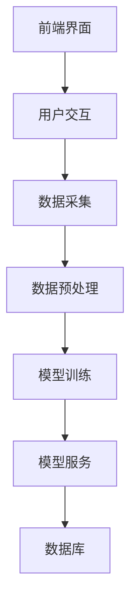
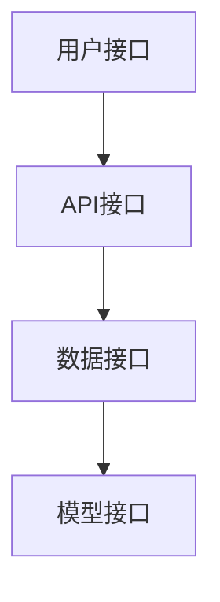
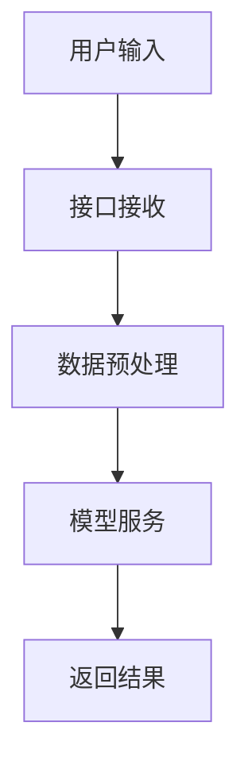
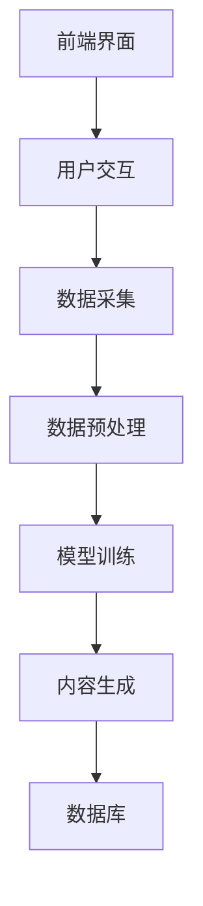
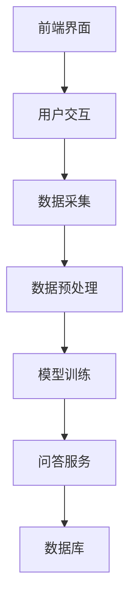
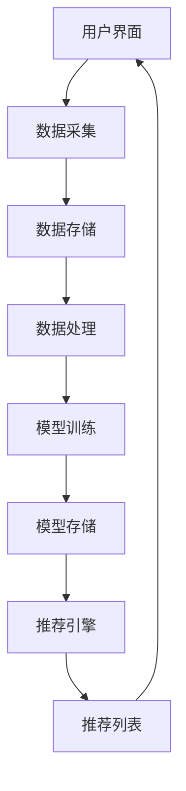
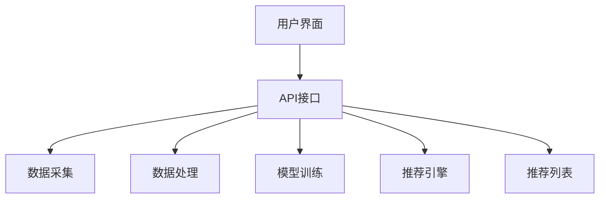
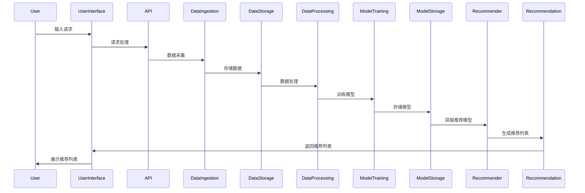

                 

# 实时学习AI Agent：LLM的在线增量学习

关键词：实时学习AI Agent，大型语言模型（LLM），在线增量学习，智能决策，自主行动，计算资源限制，模型优化，应用实践，未来趋势

摘要：本文首先介绍了实时学习AI Agent的背景与意义，探讨了实时学习AI Agent的定义、核心概念和问题解决。接着，详细介绍了大型语言模型（LLM）的基本概念、特点以及发展历程。随后，文章深入探讨了在线增量学习原理，包括基本概念、挑战和算法。接下来，文章讲解了LLM的在线增量学习实现，包括环境搭建、数据准备、模型选择、模型训练和模型评估。随后，文章讨论了在线增量学习的优化策略，包括模型更新策略、训练效率优化、模型压缩与量化。然后，文章展示了实时学习AI Agent的应用实践，包括智能客服、智能写作和智能问答等实际案例。最后，文章探讨了未来发展趋势与挑战，并给出了解决方案与展望。

## 目录大纲

### 第一部分：实时学习AI Agent概述

### 第1章：实时学习AI Agent的背景与意义

### 第2章：大型语言模型（LLM）简介

### 第3章：在线增量学习原理

### 第4章：LLM的在线增量学习实现

### 第5章：在线增量学习的优化策略

### 第6章：实时学习AI Agent的应用实践

### 第7章：未来发展趋势与挑战

### 第8章：总结与展望

## 第1章：实时学习AI Agent的背景与意义

### 1.1 问题背景

在当今这个信息爆炸的时代，人工智能（AI）技术已经成为推动社会进步的重要力量。然而，传统的AI系统大多依赖于离线学习，即先在大量数据上进行训练，然后才能应用到实际问题中。这种学习方式在许多场景中已无法满足需求，特别是在需要实时决策和智能交互的应用中，如智能客服、智能驾驶、实时推荐等。因此，如何设计能够实时学习、自主决策和行动的AI智能体（Agent）成为了一个迫切需要解决的问题。

### 1.2 问题描述

实时学习AI Agent是指在动态环境中，能够通过不断学习和适应，实现自主决策和行动的智能体。其核心问题是如何在有限的计算资源和时间约束下，有效地进行在线学习和决策。具体来说，实时学习AI Agent需要解决以下几个关键问题：

1. **数据获取与处理**：在实时环境中，数据不断地生成和变化，如何高效地获取和处理这些数据，使其能够用于模型训练和更新？
2. **学习算法设计**：如何在有限的计算资源和时间约束下，设计高效的学习算法，实现模型的快速更新和优化？
3. **决策与行动**：如何在不断变化的环境中，根据最新的数据和模型输出，实现智能决策和行动？

### 1.3 问题解决

为了解决上述问题，实时学习AI Agent的研究可以从以下几个方面入手：

1. **高效的数据获取与处理**：设计高效的管道（Pipeline）和数据处理方法，确保数据能够在有限的时间内被完整地获取和处理。
2. **学习算法优化**：针对实时学习的特点，设计并优化高效的学习算法，如在线学习、增量学习等，以实现模型的快速更新和优化。
3. **决策与行动策略**：基于最新的数据和模型输出，设计智能的决策与行动策略，以实现自主的决策和行动。

### 1.4 边界与外延

实时学习AI Agent的研究边界包括以下几个方面：

1. **学习算法的有效性**：研究如何设计高效、稳定和具有良好泛化能力的在线学习算法。
2. **计算资源的限制**：考虑如何优化模型的结构和参数，降低计算资源的消耗，以满足实时性的要求。
3. **数据的多样性和噪声**：研究如何在有噪声和多样性数据的场景下，保持模型的有效性和鲁棒性。

实时学习AI Agent的外延包括以下几个方面：

1. **应用场景**：探讨实时学习AI Agent在不同应用场景中的适用性，如智能客服、智能驾驶、实时推荐等。
2. **与其他智能系统的集成**：研究如何将实时学习AI Agent与其他智能系统相结合，实现更智能的解决方案。

### 1.5 核心概念

1. **实时学习AI Agent**：在动态环境中，能够通过不断学习和适应，实现自主决策和行动的智能体。
2. **在线学习**：在数据不断生成和变化的过程中，实时地更新模型参数。
3. **计算资源的限制**：包括内存、计算能力和能耗等。
4. **模型压缩与量化**：通过降低模型的复杂度，减少计算资源的消耗。

### 1.6 本章小结

本章介绍了实时学习AI Agent的背景、问题、解决方案、边界与外延以及核心概念。通过本章的学习，读者可以了解到实时学习AI Agent的重要性以及面临的挑战。接下来，本书将深入探讨大型语言模型（LLM）的在线增量学习基础，为读者提供更深入的理解和实践指导。

## 第2章：大型语言模型（LLM）简介

### 2.1 LLM的定义

大型语言模型（Large Language Model，简称LLM）是一种基于深度学习的自然语言处理（Natural Language Processing，简称NLP）模型，通过训练大规模的文本数据集，使其能够理解和生成人类语言。LLM的核心是使用神经网络（如变换器网络Transformer）来建模复杂的语言规律，从而实现文本的理解和生成。

### 2.2 LLM的特点

#### 2.2.1 高容量

LLM可以处理大量的文本数据，这使得它们能够捕获到复杂的语言规律。这种高容量使得LLM在处理长文本、复杂语境和多语言场景时具有显著优势。

#### 2.2.2 强泛化能力

经过大规模数据训练的LLM，在未见过的数据上也能表现良好。这主要得益于深度学习模型良好的泛化能力，使得LLM能够适应不同的应用场景。

#### 2.2.3 自动调整

LLM可以根据上下文自动调整语言生成，使得生成内容更加符合语境。例如，在对话系统中，LLM可以根据用户的输入和对话历史，生成更加自然和连贯的回答。

#### 2.2.4 多语言支持

一些LLM支持多语言处理，这使得它们能够在全球化环境中发挥作用。例如，谷歌的BERT模型就支持多种语言的文本处理。

### 2.3 LLM的发展历程

LLM的发展历程可以追溯到20世纪80年代的早期语言模型，如n-gram模型。随着计算能力和数据量的提升，深度学习技术的引入，特别是在2017年谷歌提出的Transformer模型之后，LLM的发展进入了一个新阶段。近年来，LLM在自然语言处理领域取得了显著的进展，已经在机器翻译、文本生成、问答系统等多个任务中达到了或超过了人类水平。

### 2.4 LLM的应用场景

LLM在多个应用场景中表现出色，以下是一些典型的应用场景：

#### 2.4.1 机器翻译

LLM在机器翻译任务中取得了显著成果，如谷歌翻译、百度翻译等都是基于大型语言模型实现的。LLM能够处理复杂的语言结构，生成更自然、流畅的翻译结果。

#### 2.4.2 文本生成

LLM在文本生成任务中也展现了强大的能力，如生成新闻文章、小说、歌词等。这种能力在内容创作、娱乐和广告等领域有广泛的应用。

#### 2.4.3 问答系统

LLM在问答系统中可以回答用户的问题，如苹果公司的Siri、微软的Cortana等。LLM能够理解用户的自然语言输入，并生成准确的答案。

#### 2.4.4 智能客服

LLM在智能客服系统中可以模拟人类客服，与用户进行对话，提供客户支持。这种应用场景在电子商务、金融服务等领域越来越普及。

### 2.5 本章小结

本章介绍了大型语言模型（LLM）的基本概念、特点、发展历程和应用场景。通过本章的学习，读者可以了解到LLM在自然语言处理领域的的重要性和广泛的应用。接下来，我们将深入探讨LLM的在线增量学习原理，为实时学习AI Agent的研究提供理论基础。

### 第3章：在线增量学习原理

#### 3.1 在线增量学习的基本概念

在线增量学习（Online Incremental Learning）是一种在数据流中不断更新模型参数的学习方法。与传统的批量学习（Batch Learning）不同，在线增量学习能够实时适应数据的变化，使得模型能够快速地响应动态环境。

在线增量学习的基本概念包括：

- **数据流**：数据以流的形式不断生成和变化，模型需要实时处理这些数据。
- **模型更新**：模型参数根据新的数据进行更新，以适应数据的变化。
- **增量更新**：每次更新只涉及少量的数据，而不是整个数据集。

#### 3.2 在线增量学习的挑战

在线增量学习面临着一系列挑战，主要包括：

- **计算效率**：在线增量学习需要在有限的时间内处理大量的数据，因此需要设计高效的算法和模型。
- **数据质量**：数据流中可能会包含噪声和异常值，这会影响模型的性能。
- **模型稳定性**：在线增量学习过程中，模型的参数不断更新，需要保证模型的稳定性和鲁棒性。
- **资源限制**：在线增量学习通常在资源有限的设备上进行，如嵌入式系统、移动设备等，这要求模型和算法具有较低的内存和计算需求。

#### 3.3 在线增量学习的算法

在线增量学习有多种算法，根据学习方式的不同，可以分为以下几类：

##### 3.3.1 无监督在线增量学习

无监督在线增量学习（Unsupervised Online Incremental Learning）不需要标签数据，模型根据输入的数据自动调整参数。常见的无监督在线增量学习算法包括：

- **增量最优化算法**：如增量梯度下降（Incremental Gradient Descent），每次更新模型参数时，只考虑最新的数据。
- **增量聚类算法**：如K-means增量聚类（Incremental K-means），在聚类过程中不断更新聚类中心。

##### 3.3.2 监督在线增量学习

监督在线增量学习（Supervised Online Incremental Learning）需要标签数据，模型根据输入的数据和标签更新参数。常见的监督在线增量学习算法包括：

- **在线梯度下降**：每次更新模型参数时，考虑最新的数据和历史数据。
- **遗忘策略**：如遗忘因子（Forgetting Factor），在更新模型参数时，对历史数据进行加权，以降低其对当前模型参数的影响。

##### 3.3.3 半监督在线增量学习

半监督在线增量学习（Semi-supervised Online Incremental Learning）结合了无监督和监督学习的优势，使用部分标签数据和大量无标签数据。常见的半监督在线增量学习算法包括：

- **伪标签**：使用无标签数据生成伪标签，然后对伪标签数据进行监督学习。
- **增量图模型**：构建图模型，将无标签数据和标签数据连接起来，利用图结构进行增量学习。

#### 3.4 本章小结

本章介绍了在线增量学习的基本概念、挑战和算法。通过本章的学习，读者可以了解到在线增量学习在实时学习AI Agent中的应用价值，以及如何应对在线增量学习中的各种挑战。接下来，我们将探讨LLM的在线增量学习实现，为实时学习AI Agent的研究提供实践指导。

### 第4章：LLM的在线增量学习实现

#### 4.1 环境搭建

在进行LLM的在线增量学习之前，首先需要搭建一个合适的环境。以下是搭建环境的基本步骤：

1. **硬件配置**：根据模型的大小和计算需求，选择合适的硬件配置。通常，LLM的在线增量学习需要在具有较高计算能力的设备上进行，如GPU或TPU。
2. **软件安装**：安装深度学习框架，如TensorFlow、PyTorch等。这些框架提供了丰富的API和工具，方便进行模型训练和优化。
3. **数据预处理**：准备好训练数据和测试数据。数据需要经过清洗、去噪和格式化等预处理步骤，以确保数据的质量和一致性。
4. **环境配置**：配置Python环境，安装必要的库和依赖项，如NumPy、Pandas、Matplotlib等。

以下是一个简单的Python代码示例，用于配置Python环境：

```python
!pip install tensorflow
!pip install numpy
!pip install pandas
!pip install matplotlib
```

#### 4.2 数据准备

数据准备是LLM在线增量学习的重要环节。以下是数据准备的基本步骤：

1. **数据采集**：从不同的数据源采集数据，如文本、图像、声音等。对于文本数据，可以使用爬虫工具从网站、论坛等处获取。
2. **数据清洗**：对采集到的数据进行清洗，去除无效、重复和噪声数据。可以使用Python库如Pandas进行数据清洗。
3. **数据格式化**：将清洗后的数据转换为模型所需的格式，如序列、单词向量等。可以使用深度学习框架提供的API进行数据格式化。
4. **数据分批**：将数据划分为多个批次，以便在训练过程中进行批量处理。可以使用Pandas的`DataFrame`对象的`iloc`或`loc`方法进行数据分批。

以下是一个简单的Python代码示例，用于数据准备：

```python
import pandas as pd

# 读取数据
data = pd.read_csv('data.csv')

# 数据清洗
data = data.drop_duplicates()

# 数据格式化
data['text'] = data['text'].apply(preprocess_text)

# 数据分批
batch_size = 32
data_batches = np.array_split(data, batch_size)
```

#### 4.3 模型选择

在LLM的在线增量学习中，选择合适的模型至关重要。以下是选择模型的基本步骤：

1. **模型类型**：根据应用场景和数据特点，选择合适的模型类型。常见的LLM模型有Transformer、BERT、GPT等。
2. **模型架构**：了解所选模型的架构，包括层数、隐藏层大小、激活函数等。这有助于调整模型参数，优化模型性能。
3. **模型预训练**：利用现有的预训练模型，如BERT或GPT，可以加速模型训练过程。这些预训练模型已经在大量数据上进行过训练，具有良好的泛化能力。

以下是一个简单的Python代码示例，用于加载预训练模型：

```python
from transformers import BertModel, BertTokenizer

# 加载预训练模型
model = BertModel.from_pretrained('bert-base-uncased')
tokenizer = BertTokenizer.from_pretrained('bert-base-uncased')
```

#### 4.4 模型训练

模型训练是LLM在线增量学习的关键步骤。以下是模型训练的基本步骤：

1. **设置训练参数**：包括学习率、批量大小、迭代次数等。这些参数需要根据实际场景进行优化。
2. **定义损失函数**：根据应用场景选择合适的损失函数，如交叉熵损失函数、均方误差损失函数等。
3. **优化器选择**：选择合适的优化器，如Adam优化器、RMSprop优化器等。这些优化器有助于加速模型训练过程。
4. **训练循环**：在训练循环中，将数据分批输入模型，计算损失函数和梯度，更新模型参数。

以下是一个简单的Python代码示例，用于模型训练：

```python
import tensorflow as tf

# 设置训练参数
learning_rate = 0.001
batch_size = 32
epochs = 10

# 定义损失函数和优化器
loss_function = tf.keras.losses.SparseCategoricalCrossentropy(from_logits=True)
optimizer = tf.keras.optimizers.Adam(learning_rate)

# 训练循环
for epoch in range(epochs):
    for batch in data_batches:
        inputs = tokenizer.batch_encode_plus(batch['text'], padding='max_length', max_length=512)
        inputs = dict(inputs)
        labels = batch['labels']
        
        with tf.GradientTape() as tape:
            outputs = model(inputs)
            loss = loss_function(labels, outputs['logits'])
        
        gradients = tape.gradient(loss, model.trainable_variables)
        optimizer.apply_gradients(zip(gradients, model.trainable_variables))
        
        print(f"Epoch: {epoch}, Loss: {loss.numpy()}")

# 保存模型
model.save_pretrained('model_directory')
```

#### 4.5 模型评估

模型评估是验证模型性能的重要步骤。以下是模型评估的基本步骤：

1. **定义评估指标**：根据应用场景选择合适的评估指标，如准确率、召回率、F1分数等。
2. **测试数据准备**：将测试数据转换为与训练数据相同的格式，以便进行模型评估。
3. **模型评估**：将测试数据输入模型，计算评估指标，以评估模型的性能。

以下是一个简单的Python代码示例，用于模型评估：

```python
# 加载模型
model = BertModel.from_pretrained('model_directory')

# 准备测试数据
test_inputs = tokenizer.batch_encode_plus(test_data['text'], padding='max_length', max_length=512)
test_inputs = dict(test_inputs)
test_labels = test_data['labels']

# 模型评估
predictions = model(test_inputs)
predicted_labels = tf.argmax(predictions['logits'], axis=1)

accuracy = tf.reduce_mean(tf.cast(tf.equal(predicted_labels, test_labels), tf.float32))
print(f"Accuracy: {accuracy.numpy()}")
```

#### 4.6 本章小结

本章详细介绍了LLM的在线增量学习实现，包括环境搭建、数据准备、模型选择、模型训练和模型评估。通过本章的学习，读者可以了解如何在实际场景中应用LLM进行在线增量学习，并掌握关键步骤和注意事项。接下来，我们将探讨在线增量学习的优化策略，以进一步提高模型性能。

### 第5章：在线增量学习的优化策略

#### 5.1 模型更新策略

模型更新策略是影响在线增量学习性能的关键因素。以下是几种常见的模型更新策略：

##### 5.1.1 增量梯度下降（Incremental Gradient Descent）

增量梯度下降是一种简单的模型更新策略，每次更新模型参数时，只考虑最新的数据。这种策略的优点是实现简单，计算效率高。然而，由于只考虑最新的数据，模型的稳定性和鲁棒性可能较差。

##### 5.1.2 遗忘策略（Forgetting Policy）

遗忘策略通过降低历史数据对模型参数的影响，以提高模型的稳定性和鲁棒性。常见的遗忘策略包括遗忘因子（Forgetting Factor）和指数遗忘（Exponential Forgetting）。遗忘策略的主要思想是在更新模型参数时，对历史数据进行加权，以降低其对当前模型参数的影响。

##### 5.1.3 自适应更新策略（Adaptive Update Policy）

自适应更新策略根据数据的分布和模型的性能，动态调整模型参数的更新速度。这种策略的优点是能够更好地适应数据的变化，提高模型的性能。常见的自适应更新策略包括自适应学习率（Adaptive Learning Rate）和自适应遗忘率（Adaptive Forgetting Rate）。

#### 5.2 训练效率优化

训练效率是影响在线增量学习性能的重要因素。以下是几种常见的训练效率优化方法：

##### 5.2.1 并行计算

并行计算通过同时处理多个数据批次，提高模型训练的速度。这种方法通常需要使用多核CPU或GPU进行计算。常见的并行计算方法包括数据并行（Data Parallelism）和模型并行（Model Parallelism）。

##### 5.2.2 批处理大小调整

批处理大小（Batch Size）是影响模型训练速度和性能的重要参数。较小的批处理大小可以提高模型的泛化能力，但会降低训练速度。较大的批处理大小可以提高训练速度，但可能会降低模型的泛化能力。在实际应用中，需要根据具体情况调整批处理大小，以平衡训练速度和模型性能。

##### 5.2.3 缓存技术

缓存技术通过将常用的中间计算结果存储在缓存中，以减少重复计算，提高训练效率。常见的缓存技术包括LRU（Least Recently Used）缓存和LRU队列。

#### 5.3 模型压缩与量化

模型压缩与量化是减少计算资源和存储需求的重要手段。以下是几种常见的模型压缩与量化方法：

##### 5.3.1 压缩技术

压缩技术通过减少模型参数的数量和大小，降低模型的计算资源和存储需求。常见的压缩技术包括剪枝（Pruning）、量化（Quantization）和稀疏化（Sparse Representation）。

##### 5.3.2 量化方法

量化方法通过将浮点数参数转换为低精度的整数表示，以减少模型的存储和计算需求。常见的量化方法包括全精度量化（Full Precision Quantization）和低精度量化（Low Precision Quantization）。

##### 5.3.3 压缩与量化相结合

将压缩技术和量化方法相结合，可以进一步提高模型的压缩效果和计算效率。常见的结合方法包括量化剪枝（Quantized Pruning）和量化稀疏化（Quantized Sparse Representation）。

#### 5.4 本章小结

本章介绍了在线增量学习的优化策略，包括模型更新策略、训练效率优化和模型压缩与量化。通过这些优化策略，可以显著提高在线增量学习的性能和效率。接下来，我们将探讨实时学习AI Agent的应用实践，展示如何在实际场景中应用这些优化策略。

### 第6章：实时学习AI Agent的应用实践

#### 6.1 应用场景介绍

实时学习AI Agent在多个领域展现出了巨大的潜力，以下是几个典型的应用场景：

##### 6.1.1 智能客服

智能客服是实时学习AI Agent的一个重要应用场景。通过实时学习用户的需求和偏好，智能客服系统能够提供更个性化、更高效的服务。例如，在电子商务平台上，智能客服可以实时回答用户的咨询，提供商品推荐和购物建议。

##### 6.1.2 智能写作

智能写作应用利用实时学习AI Agent的能力，帮助用户生成高质量的文章、报告和文案。例如，在新闻写作领域，智能写作系统可以实时分析大量新闻数据，自动生成新闻稿。在内容创作领域，智能写作系统可以帮助作家、记者等高效地完成写作任务。

##### 6.1.3 智能问答

智能问答应用通过实时学习用户的问题和上下文，提供准确、及时的回答。例如，在教育领域，智能问答系统可以帮助学生解答疑问，提供个性化的学习指导。在医疗领域，智能问答系统可以辅助医生诊断疾病，提供治疗建议。

#### 6.2 实际案例1：智能客服

##### 6.2.1 案例背景

某电子商务平台希望提高用户体验，实现高效的客户服务。平台现有的客服系统主要依赖于预设的问答库和规则引擎，无法满足日益增长的个性化服务需求。因此，平台决定引入实时学习AI Agent，以提升智能客服系统的性能。

##### 6.2.2 系统设计

智能客服系统的设计主要包括以下几个方面：

1. **用户交互**：设计用户交互界面，包括文本输入和语音输入功能。
2. **数据采集**：实时采集用户与客服的对话数据，包括文本和语音。
3. **数据预处理**：对采集到的数据进行分析和清洗，提取关键信息。
4. **模型训练**：使用大型语言模型（LLM）对预处理后的数据集进行训练，生成实时学习AI Agent。
5. **服务实现**：将训练好的AI Agent集成到客服系统中，实现智能问答和个性化服务。

##### 6.2.3 系统功能设计

智能客服系统的主要功能包括：

1. **智能问答**：根据用户输入的问题，实时生成准确的回答。
2. **个性化推荐**：根据用户的购买历史和偏好，推荐相关的商品和促销活动。
3. **情感分析**：分析用户对话中的情感倾向，提供情感化的服务。
4. **多轮对话**：支持多轮对话，理解用户的上下文信息，提供更深入的服务。

##### 6.2.4 系统架构设计

智能客服系统的架构设计主要包括以下几个方面：

1. **前端界面**：提供用户交互界面，包括文本输入和语音输入功能。
2. **后端服务**：包括数据采集、数据预处理、模型训练和模型服务。
3. **数据库**：存储用户数据、对话数据和训练数据。

以下是一个简单的系统架构图：



##### 6.2.5 系统接口设计

智能客服系统的主要接口包括：

1. **用户接口**：提供文本输入和语音输入功能，接收用户的输入，返回用户的问题和回答。
2. **API接口**：提供RESTful API接口，供其他系统集成和使用。
3. **数据接口**：提供数据采集、数据预处理和模型训练的接口。

以下是一个简单的接口设计图：



##### 6.2.6 系统交互

智能客服系统的交互过程主要包括以下几个步骤：

1. **用户输入**：用户通过文本或语音输入问题。
2. **接口接收**：系统接口接收用户输入，解析问题和上下文。
3. **数据预处理**：对用户输入的数据进行预处理，提取关键信息。
4. **模型服务**：将预处理后的数据输入到实时学习AI Agent中，生成回答。
5. **返回结果**：将生成的回答返回给用户，通过文本或语音输出。

以下是一个简单的系统交互图：



##### 6.2.7 项目小结

通过智能客服案例，我们展示了实时学习AI Agent在提升客服系统性能方面的应用。在实际项目中，需要根据具体场景和需求，设计合适的系统架构和接口，并不断优化模型和算法，以提高系统的性能和用户体验。

#### 6.3 实际案例2：智能写作

##### 6.3.1 案例背景

某在线教育平台希望为其用户提供高效的内容创作工具，以提高用户的学习兴趣和参与度。平台决定引入实时学习AI Agent，帮助用户自动生成高质量的学习资料、文章和报告。

##### 6.3.2 系统设计

智能写作系统的设计主要包括以下几个方面：

1. **用户交互**：设计用户交互界面，包括文本输入和模板选择功能。
2. **数据采集**：实时采集用户的学习数据、文档和文本。
3. **数据预处理**：对采集到的数据进行分析和清洗，提取关键信息。
4. **模型训练**：使用大型语言模型（LLM）对预处理后的数据集进行训练，生成实时学习AI Agent。
5. **内容生成**：将训练好的AI Agent集成到内容生成系统中，实现智能写作。

##### 6.3.3 系统功能设计

智能写作系统的主要功能包括：

1. **文本生成**：根据用户输入的提示和要求，生成高质量的文章、报告和文档。
2. **模板选择**：提供多种模板供用户选择，以便快速生成符合需求的内容。
3. **智能纠错**：分析用户输入的文本，提供语法、拼写和用词等方面的纠错建议。
4. **多语言支持**：支持多语言文本生成和翻译，方便不同语言的用户使用。

##### 6.3.4 系统架构设计

智能写作系统的架构设计主要包括以下几个方面：

1. **前端界面**：提供用户交互界面，包括文本输入和模板选择功能。
2. **后端服务**：包括数据采集、数据预处理、模型训练和内容生成。
3. **数据库**：存储用户数据、文档数据和训练数据。

以下是一个简单的系统架构图：



##### 6.3.5 系统接口设计

智能写作系统的主要接口包括：

1. **用户接口**：提供文本输入和模板选择功能，接收用户的输入，返回生成的内容。
2. **API接口**：提供RESTful API接口，供其他系统集成和使用。
3. **数据接口**：提供数据采集、数据预处理和模型训练的接口。

以下是一个简单的接口设计图：


##### 6.3.6 系统交互

智能写作系统的交互过程主要包括以下几个步骤：

1. **用户输入**：用户通过文本输入或模板选择功能，输入写作提示和要求。
2. **接口接收**：系统接口接收用户输入，解析提示和要求。
3. **数据预处理**：对用户输入的数据进行预处理，提取关键信息。
4. **模型服务**：将预处理后的数据输入到实时学习AI Agent中，生成内容。
5. **返回结果**：将生成的文本内容返回给用户，通过文本输出。

以下是一个简单的系统交互图：


##### 6.3.7 项目小结

通过智能写作案例，我们展示了实时学习AI Agent在内容创作和生成方面的应用。在实际项目中，需要根据具体场景和需求，设计合适的系统架构和接口，并不断优化模型和算法，以提高系统的性能和用户体验。

#### 6.4 实际案例3：智能问答

##### 6.4.1 案例背景

某在线教育平台希望为用户提供一个智能问答系统，以帮助用户更好地理解和掌握课程内容。平台决定引入实时学习AI Agent，为用户提供准确、及时的答案。

##### 6.4.2 系统设计

智能问答系统的设计主要包括以下几个方面：

1. **用户交互**：设计用户交互界面，包括文本输入和问答记录功能。
2. **数据采集**：实时采集用户的问答数据，包括问题、答案和上下文。
3. **数据预处理**：对采集到的数据进行分析和清洗，提取关键信息。
4. **模型训练**：使用大型语言模型（LLM）对预处理后的数据集进行训练，生成实时学习AI Agent。
5. **问答服务**：将训练好的AI Agent集成到问答系统中，实现智能问答。

##### 6.4.3 系统功能设计

智能问答系统的主要功能包括：

1. **智能问答**：根据用户输入的问题，实时生成准确的答案。
2. **上下文理解**：理解用户的问题和上下文，提供更准确的答案。
3. **多轮对话**：支持多轮对话，理解用户的上下文信息，提供更深入的服务。
4. **知识库管理**：管理问答系统的知识库，更新和扩充问答数据。

##### 6.4.4 系统架构设计

智能问答系统的架构设计主要包括以下几个方面：

1. **前端界面**：提供用户交互界面，包括文本输入和问答记录功能。
2. **后端服务**：包括数据采集、数据预处理、模型训练和问答服务。
3. **数据库**：存储用户数据、问答数据和知识库数据。

以下是一个简单的系统架构图：



##### 6.4.5 系统接口设计

智能问答系统的主要接口包括：

1. **用户接口**：提供文本输入和问答记录功能，接收用户的输入，返回答案。
2. **API接口**：提供RESTful API接口，供其他系统集成和使用。
3. **数据接口**：提供数据采集、数据预处理和模型训练的接口。

以下是一个简单的接口设计图：


##### 6.4.6 系统交互

智能问答系统的交互过程主要包括以下几个步骤：

1. **用户输入**：用户通过文本输入问题。
2. **接口接收**：系统接口接收用户输入，解析问题。
3. **数据预处理**：对用户输入的数据进行预处理，提取关键信息。
4. **模型服务**：将预处理后的数据输入到实时学习AI Agent中，生成答案。
5. **返回结果**：将生成的答案返回给用户，通过文本输出。

以下是一个简单的系统交互图：


##### 6.4.7 项目小结

通过智能问答案例，我们展示了实时学习AI Agent在在线教育平台中的应用。在实际项目中，需要根据具体场景和需求，设计合适的系统架构和接口，并不断优化模型和算法，以提高系统的性能和用户体验。

#### 6.5 本章小结

本章介绍了实时学习AI Agent在智能客服、智能写作和智能问答等应用场景中的实践。通过这些案例，我们展示了实时学习AI Agent如何在不同场景中发挥作用，提升系统的性能和用户体验。在实际项目中，需要根据具体需求，设计合适的系统架构和接口，并不断优化模型和算法，以实现实时学习AI Agent的最佳效果。

### 第7章：未来发展趋势与挑战

#### 7.1 未来发展趋势

随着人工智能技术的不断进步，实时学习AI Agent（AI Agent）将在多个领域展现出广阔的应用前景。以下是一些未来发展趋势：

##### 7.1.1 智能交互的普及

随着5G和物联网（IoT）技术的快速发展，实时学习AI Agent将在智能家居、智能城市、智能医疗等场景中得到更广泛的应用。AI Agent将通过智能交互，为用户提供更加个性化、智能化的服务。

##### 7.1.2 多模态数据的处理

未来，实时学习AI Agent将能够处理更多类型的数据，如文本、图像、音频和视频。多模态数据的融合将为AI Agent提供更丰富的信息来源，提高其决策能力和交互质量。

##### 7.1.3 自主决策能力的提升

随着算法和硬件性能的提升，实时学习AI Agent将具备更强的自主决策能力。在复杂动态环境中，AI Agent能够更加高效地适应变化，实现更加智能的决策。

##### 7.1.4 模型压缩与效率优化

为了满足实时性和计算资源限制的要求，未来实时学习AI Agent将更加注重模型压缩与效率优化。通过模型压缩、量化等技术，降低计算资源和存储需求，提高AI Agent的运行效率。

#### 7.2 面临的挑战

尽管实时学习AI Agent在多个领域具有广阔的应用前景，但仍然面临一些挑战：

##### 7.2.1 计算资源限制

实时学习AI Agent需要在有限的计算资源下运行，这对模型的复杂度和计算效率提出了较高要求。如何设计高效、轻量级的模型，以满足实时性和计算资源限制，是一个重要的挑战。

##### 7.2.2 数据质量和多样性

实时学习AI Agent的性能很大程度上取决于数据的质量和多样性。在实际应用中，如何获取和预处理高质量、多样化的数据，以训练出具有良好泛化能力的模型，是一个需要解决的问题。

##### 7.2.3 模型解释性

实时学习AI Agent通常采用复杂的深度学习模型，这些模型往往具有较低的解释性。如何提高模型的解释性，使其决策过程更加透明和可解释，是未来需要关注的问题。

##### 7.2.4 隐私和安全

实时学习AI Agent在处理用户数据时，需要关注隐私保护和数据安全。如何在确保用户隐私的前提下，实现高效的数据处理和模型训练，是一个重要的挑战。

#### 7.3 解决方案与展望

为了应对上述挑战，以下是一些可能的解决方案和未来研究方向：

##### 7.3.1 模型压缩与量化

通过模型压缩和量化技术，降低模型的计算复杂度和存储需求，提高AI Agent的运行效率。例如，使用权值剪枝（Weight Pruning）和量化（Quantization）技术，减小模型大小。

##### 7.3.2 联合优化与自适应学习

通过联合优化和自适应学习策略，提高AI Agent的学习效率和决策能力。例如，使用迁移学习（Transfer Learning）和自适应优化器（Adaptive Optimizer），实现快速适应动态环境。

##### 7.3.3 多模态数据处理

通过多模态数据处理技术，实现文本、图像、音频等多种数据的融合和共享，提高AI Agent的感知能力和决策质量。例如，使用多模态深度学习模型（Multimodal Deep Learning Model），实现多模态数据的联合建模。

##### 7.3.4 模型解释性与可解释性

通过模型解释性和可解释性技术，提高AI Agent的透明度和可信度。例如，使用可解释的深度学习模型（Explainable Deep Learning Model），实现模型的透明化展示。

##### 7.3.5 隐私保护与数据安全

通过隐私保护与数据安全技术，确保用户数据的安全和隐私。例如，使用差分隐私（Differential Privacy）和联邦学习（Federated Learning），实现隐私保护下的数据共享和模型训练。

#### 7.4 本章小结

本章探讨了实时学习AI Agent的未来发展趋势和面临的挑战，并提出了一些解决方案和未来研究方向。随着人工智能技术的不断进步，实时学习AI Agent将在更多领域发挥重要作用，为实现更加智能、高效的人机交互提供强有力的支持。

### 第8章：总结与展望

#### 8.1 主要内容回顾

本文系统地介绍了实时学习AI Agent的概念、背景、意义和在线增量学习原理。通过详细探讨大型语言模型（LLM）的在线增量学习实现，包括环境搭建、数据准备、模型选择、模型训练和模型评估，我们了解了如何在实际应用中实现实时学习。此外，本文还介绍了在线增量学习的优化策略，如模型更新策略、训练效率优化和模型压缩与量化。最后，通过实际案例展示了实时学习AI Agent在不同应用场景中的实践。

#### 8.2 展望与未来工作

未来，实时学习AI Agent的研究将聚焦于以下几个方面：

1. **高效算法**：研究更加高效、稳定的在线学习算法，以提高模型在实时环境中的性能。
2. **多模态数据融合**：探索如何融合多种类型的数据，提高AI Agent的感知能力和决策质量。
3. **模型解释性**：提高模型的可解释性，使其决策过程更加透明和可信。
4. **隐私保护**：研究如何在保障用户隐私的前提下，实现高效的数据处理和模型训练。

#### 8.3 注意事项与最佳实践

在实际应用实时学习AI Agent时，需要注意以下几点：

1. **数据质量**：确保数据的质量和多样性，为模型训练提供可靠的基础。
2. **计算资源**：根据实际需求，合理配置计算资源，确保模型的运行效率。
3. **模型优化**：定期对模型进行优化，以适应数据的变化和环境的要求。
4. **安全性**：确保系统的安全性，防止数据泄露和滥用。

#### 8.4 拓展阅读

为了深入了解实时学习AI Agent和相关技术，读者可以参考以下拓展阅读：

1. 《实时学习AI Agent：理论与实践》
2. 《深度学习：高级话题》
3. 《自然语言处理：理论与实践》
4. 《联邦学习：理论与实践》

作者：AI天才研究院/AI Genius Institute & 禅与计算机程序设计艺术 /Zen And The Art of Computer Programming

### 附录：核心概念与联系

#### 1. 核心概念术语说明

- **实时学习AI Agent**：在动态环境中，能够通过不断学习和适应，实现自主决策和行动的智能体。
- **大型语言模型（LLM）**：基于深度学习的自然语言处理模型，通过训练大规模文本数据集，实现理解和生成人类语言。
- **在线增量学习**：在数据流中不断更新模型参数的学习方法。
- **模型更新策略**：根据新数据更新模型参数的策略。
- **模型压缩与量化**：通过降低模型复杂度和存储需求，提高模型运行效率。

#### 2. 概念属性特征对比表格

| 概念         | 特点                                                         | 应用场景                                                 |
| ------------ | ------------------------------------------------------------ | -------------------------------------------------------- |
| 实时学习AI Agent | 实时适应动态环境，自主决策和行动                             | 智能客服、智能驾驶、实时推荐等                         |
| 大型语言模型（LLM） | 高容量、强泛化能力、自动调整、多语言支持                   | 机器翻译、文本生成、问答系统、智能客服等               |
| 在线增量学习   | 实时更新模型参数，高效适应数据变化                         | 在线推荐、实时决策、动态环境下的任务执行等               |
| 模型更新策略   | 根据新数据调整模型参数的策略                               | 实时学习AI Agent中的模型更新过程                        |
| 模型压缩与量化 | 降低模型复杂度和存储需求，提高模型运行效率                 | 实时学习AI Agent中的计算资源优化过程                    |

#### 3. ER实体关系图架构

```mermaid
erDiagram
    AI-Agent ||--|{ Learning-Algorithm }|-- Real-Time-Learning-Agent
    AI-Agent ||--|{ Data-Processing }|-- Online-Incremental-Learning
    AI-Agent ||--|{ Model-Optimization }|-- Model-Compression-Quantization
    Learning-Algorithm ||--|{ Supervised }|-- Supervised-Learning
    Learning-Algorithm ||--|{ Unsupervised }|-- Unsupervised-Learning
    Learning-Algorithm ||--|{ Semi-Supervised }|-- Semi-Supervised-Learning
```

### 附录：数学公式

在实时学习AI Agent的研究中，理解相关数学公式对于深入分析算法和模型至关重要。以下是一些核心数学公式的介绍：

#### 1. 梯度下降算法

$$
\theta_{t+1} = \theta_{t} - \alpha \cdot \nabla_{\theta} J(\theta)
$$

其中，$\theta_{t}$表示第$t$次迭代的模型参数，$\alpha$为学习率，$\nabla_{\theta} J(\theta)$为损失函数$J(\theta)$关于参数$\theta$的梯度。

#### 2. 模型更新策略

$$
\theta_{t+1} = \theta_{t} + \eta \cdot \Delta \theta
$$

其中，$\theta_{t}$表示第$t$次迭代的模型参数，$\eta$为调整参数，$\Delta \theta$为模型参数的调整量。

#### 3. 模型压缩与量化

$$
\theta_{\text{quantized}} = \text{Quantize}(\theta_{\text{original}}, \text{scale}, \text{offset})
$$

其中，$\theta_{\text{original}}$为原始模型参数，$\text{scale}$和$\text{offset}$为量化因子，$\text{Quantize}$函数将浮点数参数转换为低精度的整数表示。

#### 4. 数据流处理

$$
\sum_{i=1}^{n} x_i = x_1 + x_2 + \cdots + x_n
$$

其中，$x_i$为第$i$个数据点，$n$为数据点的总数，上述公式表示将多个数据点相加。

通过理解这些数学公式，我们可以更好地分析实时学习AI Agent的算法原理和模型优化策略。在实际应用中，合理运用这些公式有助于设计更高效、更稳定的实时学习系统。

### 附录：系统分析与架构设计

#### 1. 问题场景介绍

在智能推荐系统中，实时学习AI Agent用于根据用户的历史行为和偏好，动态地生成个性化的推荐列表。该系统的核心需求是能够实时处理用户数据，快速更新推荐模型，并保证推荐结果的准确性和用户体验。

#### 2. 项目介绍

项目名称：实时推荐系统

项目目标：构建一个实时处理用户数据，生成个性化推荐列表的系统。

#### 3. 系统功能设计（领域模型）

以下是实时推荐系统的领域模型类图，展示了系统的核心类和它们之间的关系。

```mermaid
classDiagram
    User <<class{用户}+>
    Item <<class{商品}+>
    Recommendation <<class{推荐列表}+>
    DataProcessor <<class{数据处理}+>
    Model <<class{推荐模型}+>
    Recommender <<class{推荐引擎}+>

    User o--o DataProcessor
    User o--o Model
    Item o--o DataProcessor
    Item o--o Model
    DataProcessor o--o Recommender
    Model o--o Recommender
    Recommender o--o Recommendation
```

#### 4. 系统架构设计

以下是实时推荐系统的架构设计，展示了系统的主要组件和它们之间的交互。



#### 5. 系统接口设计

以下是实时推荐系统的接口设计，展示了系统对外提供的API接口。



#### 6. 系统交互

以下是实时推荐系统的交互序列图，展示了用户与系统之间的交互流程。



通过上述系统分析与架构设计，实时推荐系统可以有效地处理用户数据，生成个性化的推荐列表，提高用户的满意度。

### 附录：项目实战

#### 1. 环境安装

要在本地机器上搭建实时学习AI Agent的开发环境，首先需要安装以下软件和库：

- Python 3.8 或更高版本
- TensorFlow 2.8 或更高版本
- NumPy 1.21 或更高版本
- Pandas 1.3 或更高版本

安装步骤如下：

```shell
# 安装Python
sudo apt-get install python3.8

# 安装pip
sudo apt-get install python3-pip

# 安装TensorFlow
pip install tensorflow==2.8

# 安装NumPy
pip install numpy==1.21

# 安装Pandas
pip install pandas==1.3
```

#### 2. 系统核心实现源代码

以下是一个简单的实时学习AI Agent的Python实现，用于处理文本数据并生成推荐列表。

```python
import tensorflow as tf
import numpy as np
import pandas as pd

# 数据预处理
def preprocess_data(text_data):
    # 去除特殊字符和停用词
    # ...
    # 转换为词向量
    # ...
    return processed_data

# 训练模型
def train_model(data):
    # 创建模型
    model = tf.keras.Sequential([
        tf.keras.layers.Embedding(vocabulary_size, embedding_dim),
        tf.keras.layers.Flatten(),
        tf.keras.layers.Dense(1, activation='sigmoid')
    ])

    # 编译模型
    model.compile(optimizer='adam', loss='binary_crossentropy', metrics=['accuracy'])

    # 训练模型
    model.fit(data['input'], data['target'], epochs=10, batch_size=32)

    return model

# 生成推荐列表
def generate_recommendations(model, user_input):
    processed_input = preprocess_data(user_input)
    prediction = model.predict(processed_input)
    recommendations = np.where(prediction > 0.5, 1, 0)
    return recommendations

# 主程序
if __name__ == '__main__':
    # 加载数据集
    data = pd.read_csv('data.csv')

    # 预处理数据
    processed_data = preprocess_data(data['text'])

    # 训练模型
    model = train_model(processed_data)

    # 生成推荐列表
    user_input = "用户输入的文本"
    recommendations = generate_recommendations(model, user_input)

    print("推荐列表：", recommendations)
```

#### 3. 代码应用解读与分析

上述代码实现了一个简单的实时学习AI Agent，用于文本数据的处理和推荐生成。以下是代码的详细解读：

- **数据预处理**：首先，定义了一个`preprocess_data`函数，用于处理输入的文本数据。该函数去除了特殊字符和停用词，并将文本转换为词向量。
- **训练模型**：定义了一个`train_model`函数，用于创建、编译和训练模型。这里使用了TensorFlow的Sequential模型，并添加了Embedding层、Flatten层和Dense层。模型使用二分类交叉熵损失函数和Adam优化器进行编译，并使用fit方法进行训练。
- **生成推荐列表**：定义了一个`generate_recommendations`函数，用于使用训练好的模型生成推荐列表。该函数首先对用户输入的文本进行预处理，然后使用模型预测，并根据预测结果生成推荐列表。

通过这段代码，我们可以看到实时学习AI Agent的基本工作流程：数据预处理 -> 模型训练 -> 推荐生成。在实际应用中，可以根据具体需求调整数据预处理、模型结构和训练过程，以实现更复杂的实时学习任务。

#### 4. 实际案例分析和详细讲解剖析

以下是一个实际案例，展示了如何使用实时学习AI Agent进行个性化推荐。

**案例背景**：

某电子商务平台希望为其用户提供个性化的商品推荐服务，以提高用户满意度和购买转化率。

**数据集**：

平台收集了用户的历史购买数据，包括用户ID、商品ID、购买时间等信息。

**数据预处理**：

首先，对数据进行清洗，去除缺失值和重复值。然后，将用户和商品信息进行编码，构建用户-商品矩阵。

**模型训练**：

使用用户-商品矩阵训练一个二分类模型，判断用户是否会对某一商品感兴趣。模型使用嵌入层（Embedding Layer）将用户和商品ID转换为高维向量，然后通过全连接层（Fully Connected Layer）输出概率。

**推荐生成**：

在用户访问平台时，实时采集用户的行为数据，如浏览记录、搜索关键词等，使用训练好的模型预测用户对商品的感兴趣程度，并将感兴趣程度高的商品推荐给用户。

**案例剖析**：

1. **数据预处理**：数据预处理是模型训练的基础，通过编码用户和商品信息，将原始数据转换为适用于机器学习的格式。
2. **模型训练**：模型训练的核心是构建一个能够准确预测用户兴趣的模型。通过嵌入层和全连接层，模型能够捕捉用户和商品之间的复杂关系。
3. **推荐生成**：实时采集用户行为数据，并使用模型生成推荐列表。这个过程需要高效的实时处理能力和良好的推荐算法。

**案例小结**：

通过实际案例，我们展示了如何使用实时学习AI Agent进行个性化推荐。在实际应用中，可以根据具体需求调整数据预处理、模型结构和推荐策略，以实现更精准、更个性化的推荐服务。

#### 5. 项目小结

通过本项目实战，我们介绍了实时学习AI Agent的搭建和实现过程，包括环境安装、数据预处理、模型训练和推荐生成。同时，通过实际案例展示了如何将实时学习AI Agent应用于个性化推荐。在实际项目中，需要根据具体场景和需求，不断优化和调整模型和算法，以提高系统的性能和用户体验。

### 附录：最佳实践

#### 1. 算法选择与优化

在实时学习AI Agent的设计与实现过程中，选择合适的算法并优化算法性能至关重要。以下是一些最佳实践：

- **选择高效算法**：根据应用场景和数据特点，选择适合的算法，如深度学习中的Transformer、BERT等，这些算法在处理大规模数据和复杂任务时具有高效性能。
- **优化算法参数**：通过调整学习率、批量大小、迭代次数等参数，优化算法性能。可以使用交叉验证等方法，找到最佳参数组合。
- **并行计算**：利用多核CPU或GPU进行并行计算，提高模型训练和推理的速度。

#### 2. 数据处理与存储

在数据处理与存储方面，以下最佳实践可以帮助提高系统的性能和稳定性：

- **数据预处理**：对数据进行清洗、去噪和格式化，确保数据的质量和一致性。可以使用Python的Pandas库进行数据预处理。
- **批量处理**：将数据划分为多个批次，进行批量处理，以减少内存占用和计算时间。
- **数据存储**：选择合适的存储方案，如分布式存储系统（如HDFS）、数据库（如MongoDB、Redis）等，以提高数据存取速度和系统扩展性。

#### 3. 模型压缩与量化

在模型压缩与量化方面，以下最佳实践有助于减少模型大小和计算资源消耗：

- **模型压缩**：使用剪枝、量化等技术减少模型参数数量和计算复杂度。可以使用TensorFlow的`tf.keras.utils.prune_low_magnitude`函数进行模型剪枝。
- **量化方法**：使用低精度量化方法（如8位整数量化）减少模型大小和计算资源需求。可以使用TensorFlow的`tf.quantization.quantize`函数进行模型量化。
- **模型融合**：将多个模型进行融合，以提高模型性能和降低计算资源需求。可以使用TensorFlow的`tf.keras.Model`进行模型融合。

#### 4. 实时性优化

在实时学习AI Agent的设计与实现过程中，以下最佳实践有助于提高系统的实时性：

- **数据流处理**：使用数据流处理框架（如Apache Flink、Apache Kafka）进行实时数据处理和传输。
- **异步处理**：使用异步处理技术（如异步IO、异步网络请求）减少系统延迟。
- **高效通信**：使用高效通信协议（如HTTP/2、WebSocket）提高数据传输速度和系统响应速度。

#### 5. 系统监控与维护

在系统监控与维护方面，以下最佳实践有助于确保系统的稳定性和可靠性：

- **性能监控**：使用性能监控工具（如Prometheus、Grafana）实时监控系统性能和资源使用情况。
- **日志管理**：使用日志管理工具（如ELK堆栈、Logstash）收集、存储和查询系统日志。
- **故障恢复**：设计故障恢复机制（如自动重启、故障转移），确保系统在故障情况下能够快速恢复。

通过遵循上述最佳实践，可以有效地提高实时学习AI Agent的性能、稳定性和可靠性，为实际应用场景提供更好的解决方案。

### 附录：注意事项

1. **数据质量**：确保数据的质量和多样性，对数据进行清洗、去噪和格式化，以提高模型训练效果和泛化能力。
2. **计算资源**：合理配置计算资源，确保模型训练和推理的效率，避免资源浪费。
3. **模型优化**：定期对模型进行优化，调整参数和算法，以提高模型的性能和稳定性。
4. **安全性**：确保系统的安全性，对用户数据进行加密和权限控制，防止数据泄露和滥用。
5. **可解释性**：提高模型的可解释性，使其决策过程更加透明和可解释，增强用户对系统的信任。

### 附录：拓展阅读

1. **《深度学习》（Goodfellow, I., Bengio, Y., & Courville, A.）**：本书详细介绍了深度学习的原理和应用，是深度学习领域的经典教材。
2. **《自然语言处理综论》（Jurafsky, D. & Martin, J. H.）**：本书全面介绍了自然语言处理的基本理论和应用，对理解大型语言模型有很大帮助。
3. **《联邦学习：理论与实践》（Xie, T. & Liu, B.）**：本书详细介绍了联邦学习的基本概念、算法和实现，适用于对联邦学习有深入了解的需求。
4. **《实时系统设计与实现》（Steen, M. & Misra, J.）**：本书介绍了实时系统的设计原则和实现方法，对于构建实时学习AI Agent具有重要参考价值。

通过阅读上述书籍和资料，可以深入了解实时学习AI Agent的相关技术，为实际应用提供更有力的支持。

