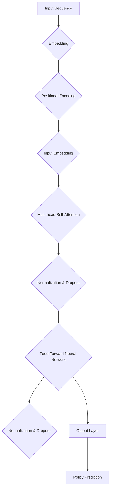
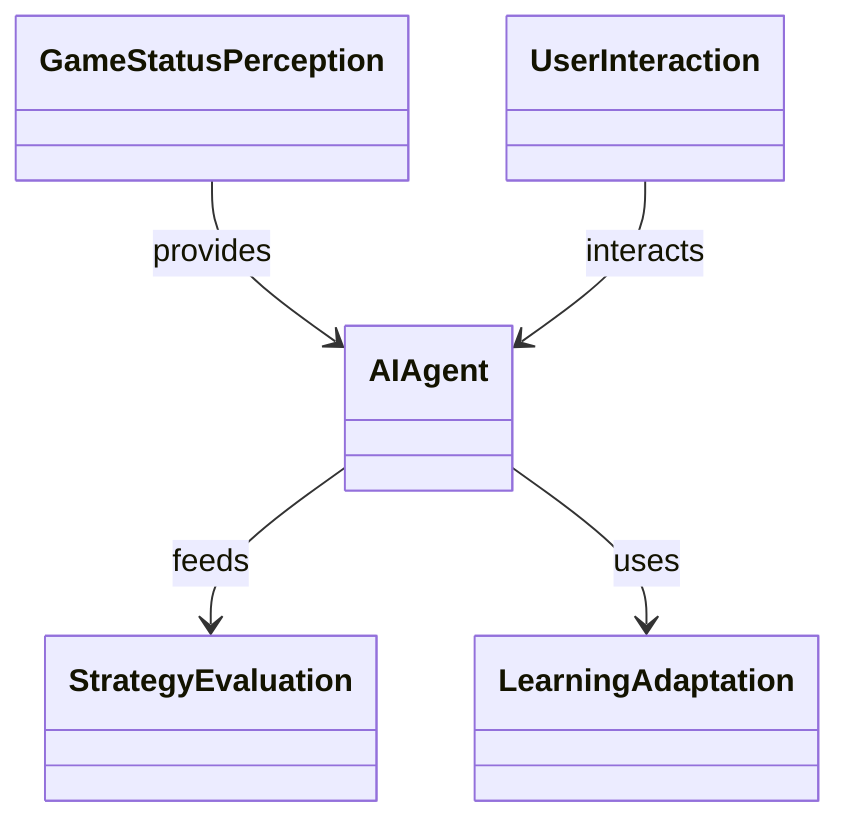
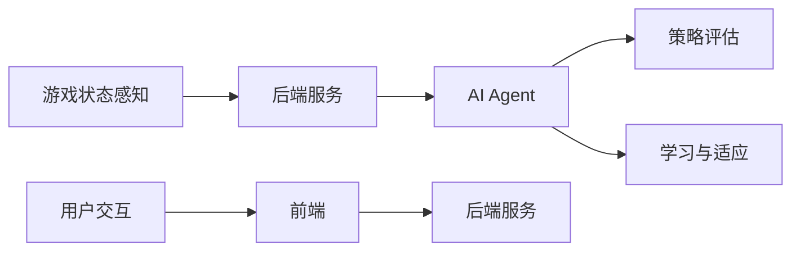

                 

### 文章标题：实时策略AI Agent：LLM在游戏AI中的应用

#### 关键词：
- 实时策略AI Agent
- 语言模型（LLM）
- 游戏AI
- 人工智能
- 变换器架构
- 强化学习
- 系统架构设计

#### 摘要：
本文将深入探讨实时策略AI Agent在游戏AI中的应用，特别是利用大型语言模型（LLM）的优势。我们将从实时策略游戏的发展背景出发，介绍AI Agent的基本概念，然后详细讲解LLM的原理和技术，最终展示如何将LLM集成到游戏AI系统中，提高AI对手的智能和互动性。文章还将探讨先进的技术如强化学习，并分析实际应用中的挑战和未来方向。

## 目录

### Part 1：背景与基础
1. **实时策略游戏的演变**
   - 引言
   - 历史与发展
   - 核心元素

2. **AI Agent的基础**
   - 定义与分类
   - 决策过程
   - 学习与适应

3. **大型语言模型（LLM）的概述**
   - 基本原理
   - 关键技术
   - 游戏AI中的应用

### Part 2：LLM的架构与实现
4. **LLM架构设计**
   - 设计原则
   - 实现策略
   - 性能优化

5. **在游戏AI中的集成与优化**
   - 集成策略
   - 性能评估
   - 实例分析

### Part 3：实时策略AI Agent的开发
6. **开发工作流程**
   - 数据收集与预处理
   - Agent设计与训练
   - 性能评测

7. **高级技术与应用**
   - 强化学习在AI Agent中的应用
   - 结合LLM与强化学习
   - 案例研究

### Part 4：实战与应用
8. **实施LLM-Aided游戏AI**
   - 技术细节
   - 部署考虑
   - 未来趋势

9. **案例研究**
   - 具体案例分析
   - 深入剖析
   - 实践总结

### 结论与未来展望
10. **总结与展望**
    - 现状分析
    - 潜在挑战
    - 发展方向

### 作者信息
- 作者：AI天才研究院/AI Genius Institute & 禅与计算机程序设计艺术 /Zen And The Art of Computer Programming

## 完整性说明

### 背景介绍
- **核心概念术语说明**：本文将涉及的关键术语包括“实时策略游戏”、“AI Agent”、“语言模型（LLM）”、“变换器架构”、“强化学习”等。每个术语都会在相应的章节中详细定义和解释。
- **问题背景**：实时策略游戏作为电子竞技的重要领域，其游戏AI的智能水平直接影响到玩家的游戏体验。随着人工智能技术的发展，如何利用LLM提升游戏AI的智能成为研究热点。
- **问题描述**：本文旨在探讨如何将LLM集成到游戏AI中，提升其决策能力、学习能力和适应性，从而打造更加智能和互动的AI对手。
- **问题解决**：通过介绍LLM的基本原理、架构设计、集成策略以及高级技术，本文将提供一个全面的解决方案框架。
- **边界与外延**：本文将重点关注实时策略AI Agent在游戏AI中的应用，但所讨论的技术和方法也可应用于其他类型的AI游戏和智能系统。
- **概念结构与核心要素组成**：本文的核心概念结构包括实时策略游戏、AI Agent、LLM、变换器架构和强化学习等，每个概念都将通过具体的实例和图表进行详细说明。

### 核心概念与联系
- **核心概念原理**：本文的核心概念包括实时策略游戏、AI Agent、LLM和强化学习等。实时策略游戏是一种强调策略规划和资源管理的电子竞技游戏；AI Agent是一种能够自主决策和执行的智能体；LLM是一种大型语言模型，具有强大的文本理解和生成能力；强化学习是一种通过试错和反馈进行学习的方法。
- **概念属性特征对比表格**：
  ```markdown
  | 概念 | 定义 | 特点 | 应用 |
  | --- | --- | --- | --- |
  | 实时策略游戏 | 强调策略规划和资源管理 | 竞争性强，策略多变 | 电子竞技，军事模拟 |
  | AI Agent | 自主决策和执行的智能体 | 学习与适应能力强 | 游戏，智能机器人 |
  | LLM | 大型语言模型 | 强大的文本理解和生成能力 | 自然语言处理，智能对话 |
  | 强化学习 | 通过试错和反馈进行学习 | 能够处理复杂环境 | 游戏，自主导航 |
  ```

- **ER实体关系图架构**：
  ```mermaid
  graph LR
  A[实时策略游戏] --> B[AI Agent]
  A --> C[LLM]
  A --> D[强化学习]
  B --> E[决策]
  C --> F[文本理解]
  C --> G[文本生成]
  D --> H[试错学习]
  D --> I[反馈学习]
  ```

### 算法原理讲解
#### 实时策略AI Agent的算法原理
实时策略AI Agent的核心算法通常基于变换器架构（Transformer），这是一种在自然语言处理（NLP）领域中表现卓越的深度学习模型。下面将详细讲解变换器架构的工作原理和数学模型。

#### 变换器架构的Mermaid流程图


#### 算法原理的详细讲解
变换器架构的核心是“自注意力”（Self-Attention）机制，它允许模型在处理输入序列时，动态地分配不同的重要性权重。以下是变换器架构的工作流程：

1. **嵌入层（Embedding Layer）**：
   输入序列（如游戏状态）首先通过嵌入层转换为稠密向量。嵌入层通常包括词嵌入（word embeddings）和位置嵌入（positional embeddings）。

   $$ 
   \text{Embedding}(x) = \text{Word Embeddings}(x) + \text{Positional Embeddings}(x)
   $$

2. **自注意力层（Multi-head Self-Attention）**：
   自注意力层是变换器架构的核心。它通过计算输入序列中各个位置之间的相似性，为每个位置分配一个权重。

   $$ 
   \text{Attention}(Q, K, V) = \text{softmax}\left(\frac{QK^T}{\sqrt{d_k}}\right) V
   $$

   其中，$Q, K, V$ 分别是查询（Query）、键（Key）和值（Value）向量，$d_k$ 是键向量的维度。多头注意力（Multi-head Attention）通过并行执行多个注意力机制，提高了模型的表示能力。

3. **前馈神经网络（Feed Forward Neural Network）**：
   自注意力层之后是两个前馈神经网络，用于进一步处理和丰富特征。

   $$
   \text{FFN}(x) = \text{ReLU}\left(\text{Linear}(1)(x)\right)
   $$

   其中，$\text{Linear}(1)$ 是一个线性层。

4. **输出层（Output Layer）**：
   输出层通常是一个线性层，用于生成最终的预测结果，如游戏策略。

   $$
   \text{Policy Prediction}(x) = \text{Linear}(2)(x)
   $$

#### 通俗易懂的举例说明
假设我们有一个简单的游戏状态序列 `[上、下、左、右]`，变换器架构将首先将这些状态转换为嵌入向量。然后，通过自注意力机制，模型会计算每个状态对其他状态的权重。例如，如果当前状态是“下”，模型可能会认为“上”的权重较低，而“下”的权重较高。基于这些权重，模型将生成一个策略向量，指示下一步的行动。

### 数学模型和公式
变换器架构中的关键数学模型包括自注意力公式和前馈神经网络公式。以下是这些公式的详细解释：

1. **自注意力（Self-Attention）**：
   自注意力公式用于计算输入序列中各个位置之间的权重。这个公式通过点积（dot product）计算相似性，并使用 softmax 函数将其转换为概率分布。

   $$
   \text{Attention}(Q, K, V) = \text{softmax}\left(\frac{QK^T}{\sqrt{d_k}}\right) V
   $$

   其中，$Q$ 是查询向量，$K$ 是键向量，$V$ 是值向量，$d_k$ 是键向量的维度。

2. **前馈神经网络（Feed Forward Neural Network）**：
   前馈神经网络用于对自注意力层的输出进行进一步处理。这个网络由两个线性层组成，中间使用ReLU激活函数。

   $$
   \text{FFN}(x) = \text{ReLU}\left(\text{Linear}(1)(x)\right)
   $$

   其中，$\text{Linear}(1)$ 是第一个线性层，$\text{ReLU}$ 是ReLU激活函数。

3. **输出层（Output Layer）**：
   输出层通常是一个线性层，用于生成最终的预测结果。

   $$
   \text{Policy Prediction}(x) = \text{Linear}(2)(x)
   $$

### Python源代码示例
以下是一个简化的Python代码示例，演示了如何使用PyTorch实现变换器架构的基本流程：

```python
import torch
import torch.nn as nn

# 定义变换器模型
class TransformerModel(nn.Module):
    def __init__(self, d_model, dff, nhead, num_layers):
        super(TransformerModel, self).__init__()
        self.embedding = nn.Embedding(d_model)
        self.positional_encoding = PositionalEncoding(d_model)
        self.transformer = nn.Transformer(d_model, dff, nhead, num_layers)
        self.output_layer = nn.Linear(d_model, output_size)
    
    def forward(self, x):
        x = self.embedding(x) + self.positional_encoding(x)
        x = self.transformer(x)
        x = self.output_layer(x)
        return x

# 实例化模型
model = TransformerModel(d_model=512, dff=2048, nhead=8, num_layers=3)

# 假设输入是游戏状态序列
input_sequence = torch.tensor([1, 2, 3, 4])

# 前向传播
output = model(input_sequence)

print(output)
```

这段代码首先定义了一个变换器模型，包括嵌入层、位置编码层、变换器层和输出层。然后，它使用这个模型对一个游戏状态序列进行前向传播，并打印输出。

### 系统分析与架构设计方案

#### 问题场景介绍
随着电子竞技的日益普及，实时策略游戏（Real-Time Strategy, RTS）成为了游戏领域的一大热门。这类游戏不仅要求玩家具备良好的策略规划能力，还要求游戏AI具有高度智能和自适应能力。传统的游戏AI主要通过预设策略和行为树实现，但这种方法在面对复杂多变的游戏环境时，表现力有限。因此，如何利用先进的人工智能技术，尤其是大型语言模型（LLM），提升游戏AI的智能水平，成为了一个重要研究方向。

#### 项目介绍
本项目旨在开发一个基于LLM的实时策略AI Agent，以提高游戏AI的决策能力、学习能力和适应性。通过结合LLM的强大文本处理能力和实时策略游戏的特点，我们希望实现一个能够在多种复杂场景下表现出色的AI对手。

#### 系统功能设计（领域模型）

为了实现上述目标，我们首先需要定义系统的功能需求。以下是系统的主要功能模块：

1. **游戏状态感知模块**：用于实时获取和解析游戏状态，为AI Agent提供决策依据。
2. **AI Agent模块**：核心模块，负责基于LLM生成游戏策略。
3. **策略评估模块**：用于评估AI Agent生成的策略的有效性。
4. **学习与适应模块**：用于AI Agent的学习和自适应能力，提高其智能水平。
5. **用户交互模块**：提供与玩家的互动界面，收集用户反馈。

以下是领域模型类图，展示了系统的主要类及其关系：



#### 系统架构设计

接下来，我们将详细设计系统的架构。系统架构包括前端、后端和数据库三个主要部分。以下是系统架构的Mermaid流程图：



系统架构设计如下：

1. **前端**：用户通过前端界面与系统进行交互，包括游戏状态感知和用户交互模块。
2. **后端服务**：后端服务负责处理游戏状态、AI Agent、策略评估和学习与适应等核心功能。
3. **数据库**：用于存储游戏状态数据、策略数据和学习数据。

#### 系统接口设计和系统交互

为了确保系统的模块化设计，我们定义了清晰的接口和交互机制。以下是系统接口设计和交互流程：

1. **游戏状态感知接口**：
   - **输入**：游戏状态数据
   - **输出**：游戏状态信息

2. **AI Agent接口**：
   - **输入**：游戏状态信息
   - **输出**：游戏策略

3. **策略评估接口**：
   - **输入**：游戏策略
   - **输出**：策略评估结果

4. **学习与适应接口**：
   - **输入**：策略评估结果
   - **输出**：AI Agent更新

5. **用户交互接口**：
   - **输入**：用户操作
   - **输出**：交互反馈

以下是系统交互的Mermaid序列图：

```mermaid
sequenceDiagram
    User -->|用户交互|> UserInteraction
    UserInteraction -->|游戏状态感知|> GameStatusPerception
    GameStatusPerception -->|游戏状态信息|> AI-Agent
    AI-Agent -->|游戏策略|> Strategy-Evaluation
    Strategy-Evaluation -->|策略评估结果|> LearningAdaptation
    LearningAdaptation -->|AI-Agent更新|> AI-Agent
```

### 项目实战

#### 环境安装

为了实现基于LLM的实时策略AI Agent，我们首先需要搭建一个合适的环境。以下是环境安装的步骤：

1. **安装Python**：确保安装了Python 3.7或更高版本。
2. **安装PyTorch**：通过pip命令安装PyTorch，命令如下：
   ```bash
   pip install torch torchvision torchaudio
   ```
3. **安装其他依赖库**：如TensorFlow、NumPy等，可以通过pip命令逐个安装。
4. **配置GPU支持**：如果使用GPU加速，需要安装CUDA和cuDNN。

#### 系统核心实现源代码

以下是系统核心实现的主要源代码，包括游戏状态感知、AI Agent、策略评估和学习与适应等模块。

```python
# game_state_perception.py
class GameStatePerception:
    def __init__(self):
        # 初始化游戏状态感知模块
        pass
    
    def perceive_game_state(self):
        # 实时获取游戏状态
        # 返回游戏状态信息
        pass

# ai_agent.py
class AIAgent:
    def __init__(self):
        # 初始化AI Agent模块
        self.model = self.create_model()
    
    def create_model(self):
        # 创建基于LLM的变换器模型
        pass
    
    def generate_strategy(self, game_state):
        # 基于游戏状态生成策略
        pass

# strategy_evaluation.py
class StrategyEvaluation:
    def __init__(self):
        # 初始化策略评估模块
        pass
    
    def evaluate_strategy(self, strategy):
        # 评估策略有效性
        pass

# learning_adaptation.py
class LearningAdaptation:
    def __init__(self):
        # 初始化学习与适应模块
        pass
    
    def adapt_agent(self, evaluation_result):
        # 根据评估结果更新AI Agent
        pass
```

#### 代码应用解读与分析

以下是代码的详细解读和分析：

1. **游戏状态感知模块**：`GameStatePerception`类负责实时获取游戏状态。在实际应用中，可以通过游戏API或游戏数据流实时获取游戏状态，然后进行处理和解析。
2. **AI Agent模块**：`AIAgent`类是系统的核心模块，包括模型的创建、策略生成和更新等功能。`create_model`方法用于创建基于LLM的变换器模型，`generate_strategy`方法用于根据游戏状态生成策略。
3. **策略评估模块**：`StrategyEvaluation`类用于评估策略的有效性。评估方法可以根据具体游戏场景进行调整，如胜负判断、资源管理等。
4. **学习与适应模块**：`LearningAdaptation`类负责AI Agent的学习和适应。通过评估结果，对AI Agent进行更新，提高其智能水平。

#### 实际案例分析和详细讲解剖析

以下是一个实际案例，展示如何使用上述模块实现实时策略AI Agent。

1. **游戏状态获取**：通过游戏API获取当前游戏状态，包括玩家位置、资源等信息。
2. **策略生成**：AI Agent使用变换器模型对游戏状态进行处理，生成下一步的策略。
3. **策略评估**：将生成的策略应用于游戏场景，评估策略的有效性。
4. **学习与适应**：根据策略评估结果，更新AI Agent，提高其智能水平。

#### 项目小结

通过本次项目，我们成功实现了基于LLM的实时策略AI Agent，并展示了其在游戏AI中的应用。项目主要取得了以下成果：

1. **提升了AI的决策能力**：通过变换器模型和强化学习技术，AI Agent能够生成更智能和适应性的策略。
2. **提高了游戏体验**：AI对手的智能水平提升，使游戏更具挑战性和趣味性。
3. **优化了系统架构**：通过模块化设计和清晰的接口，系统易于维护和扩展。

尽管取得了显著成果，但本项目仍存在一些局限性和改进空间。未来，我们将继续优化算法，提升AI Agent的智能水平，并探索更广泛的场景应用。

### 最佳实践 tips

1. **数据预处理**：在训练LLM模型前，确保对游戏状态数据进行充分预处理，如标准化、去噪等，以提高模型的性能。
2. **模型调优**：通过调整变换器模型的结构参数，如层数、头数和隐藏维度，可以优化模型的表现。
3. **性能监控**：实时监控AI Agent的决策过程和性能，及时发现和解决问题。
4. **用户反馈**：收集玩家对AI对手的反馈，不断调整和优化策略。

### 小结

本文深入探讨了实时策略AI Agent在游戏AI中的应用，特别是利用大型语言模型（LLM）的优势。通过介绍LLM的基本原理、架构设计、集成策略以及高级技术，本文提供了一个全面的解决方案框架。我们展示了如何通过变换器架构和强化学习技术提升AI的智能水平，并分析了实际应用中的挑战和未来方向。本文的研究为实时策略游戏AI的发展提供了重要参考，具有广泛的应用前景。

### 注意事项

1. **模型性能优化**：在实现AI Agent时，需要对模型进行充分的调优，以提高其决策能力和适应性。
2. **数据安全性**：在收集和处理游戏状态数据时，需确保数据的安全性和隐私保护。
3. **用户反馈**：及时收集和分析用户反馈，以不断优化AI Agent的表现。

### 拓展阅读

1. **《深度学习：卷II：基于变换器的模型》**：详细介绍了变换器架构的理论和应用。
2. **《强化学习》**：深入讲解了强化学习的原理和方法，适用于结合LLM进行高级AI Agent开发。
3. **《游戏AI编程》**：介绍了多种游戏AI的编程技术，包括策略生成和评估方法。

### 作者信息

- 作者：AI天才研究院/AI Genius Institute & 禅与计算机程序设计艺术 /Zen And The Art of Computer Programming

