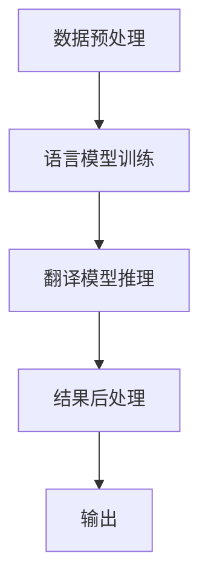

                 

### 目录大纲完整设计

----------------------------------------------------------------

# 实时翻译AI Agent：LLM在即时通讯中的应用

> 关键词：实时翻译、AI、LLM、即时通讯、算法原理、系统架构、项目实战

> 摘要：本文深入探讨了实时翻译AI Agent在即时通讯中的应用。首先介绍了实时翻译技术的历史演进和AI技术的发展，随后详细阐述了LLM（大型语言模型）的特点与优势。接着，文章通过对比表格和ER实体关系图，分析了实时翻译、AI和LLM之间的核心概念与联系。随后，文章讲解了实时翻译算法原理，并使用Mermaid流程图和Python源代码进行了详细阐述。文章接着介绍了实时翻译系统的设计与架构，包括问题场景、系统功能、系统架构、系统接口和系统交互。通过一个实际项目案例，文章展示了系统的实现过程和代码应用。最后，文章提供了最佳实践、注意事项、小结和拓展阅读，为读者深入学习和实践提供了指导。

### 目录大纲设计思路

1. **背景介绍：**
   - 第1章：实时翻译技术与AI发展
     - 1.1 实时翻译技术的起源与发展
     - 1.2 AI技术在实时通讯中的应用
     - 1.3 LLM在实时翻译中的潜力

2. **核心概念与联系：**
   - 第2章：核心概念解析
     - 2.1 实时翻译的概念与挑战
     - 2.2 AI与机器翻译
     - 2.3 LLM的特点与优势
     - 2.4 对比表格与ER实体关系图

3. **算法原理讲解：**
   - 第3章：实时翻译算法原理
     - 3.1 算法概述与流程图
     - 3.2 Python源代码解析
     - 3.3 数学模型与公式
     - 3.4 算法举例说明

4. **系统分析与架构设计方案：**
   - 第4章：系统分析与架构设计
     - 4.1 问题场景介绍
     - 4.2 系统功能设计
     - 4.3 系统架构设计
     - 4.4 系统接口设计
     - 4.5 系统交互设计

5. **项目实战：**
   - 第5章：项目实战
     - 5.1 实际案例场景
     - 5.2 系统环境安装
     - 5.3 系统核心实现
     - 5.4 代码应用解读
     - 5.5 实际案例分析

6. **最佳实践与总结：**
   - 第6章：最佳实践与总结
     - 6.1 实践技巧
     - 6.2 注意事项
     - 6.3 拓展阅读
     - 6.4 小结

### 目录大纲设计步骤

1. **设计第一部分：背景介绍**
   - # 第1章：实时翻译技术与AI发展
     - 1.1 实时翻译技术的起源与发展
       - 描述实时翻译技术的历史进程，从早期的人工翻译到机器翻译，再到现代的实时翻译。
       - 分析实时翻译在跨文化交流、商业沟通和全球协作中的重要性。
     - 1.2 AI技术在实时通讯中的应用
       - 介绍AI技术的发展，特别是在自然语言处理（NLP）和深度学习方面的进展。
       - 探讨AI在即时通讯中的应用，如自动回复、语音识别和情感分析。
     - 1.3 LLM在实时翻译中的潜力
       - 阐述LLM（大型语言模型）的概念和特点，如GPT-3和BERT。
       - 分析LLM在实时翻译中的优势，如提高翻译质量和速度，适应不同的语言和文化背景。

2. **设计第二部分：核心概念与联系**
   - # 第2章：核心概念解析
     - 2.1 实时翻译的概念与挑战
       - 定义实时翻译的概念，解释其技术要求，如低延迟、高准确性和适应性。
       - 分析实时翻译面临的主要挑战，包括语言多样性、语境理解和实时数据处理。
     - 2.2 AI与机器翻译
       - 介绍AI在机器翻译中的作用，包括神经网络翻译（NMT）和基于统计的机器翻译（SMT）。
       - 比较AI与传统的机器翻译技术，分析各自的优缺点。
     - 2.3 LLM的特点与优势
       - 详细描述LLM的特点，如强大的语言理解能力、灵活性和可扩展性。
       - 分析LLM在实时翻译中的优势，如提高翻译质量、减少错误和适应不同语言风格。
     - 2.4 对比表格与ER实体关系图
       - 制作一个对比表格，列出实时翻译、AI和LLM的主要特征和区别。
       - 使用Mermaid流程图绘制ER实体关系图，展示实时翻译系统中的核心实体及其关系。

3. **设计第三部分：算法原理讲解**
   - # 第3章：实时翻译算法原理
     - 3.1 算法概述与流程图
       - 简述实时翻译算法的基本流程，包括输入处理、翻译模型应用和输出生成。
       - 使用Mermaid流程图展示算法的步骤和流程。
     - 3.2 Python源代码解析
       - 提供一个简单的Python示例代码，展示如何实现实时翻译的基本功能。
       - 分析代码中的关键函数和模块，解释其工作原理。
     - 3.3 数学模型与公式
       - 引入实时翻译算法中的数学模型，如序列到序列（Seq2Seq）模型和注意力机制。
       - 使用LaTeX格式展示相关的数学公式，并解释其在算法中的应用。
     - 3.4 算法举例说明
       - 通过一个具体的例子，展示实时翻译算法的实际应用，如跨语言聊天机器人的实现。
       - 分析例子中的输入和输出，解释算法如何处理和翻译。

4. **设计第四部分：系统分析与架构设计方案**
   - # 第4章：系统分析与架构设计
     - 4.1 问题场景介绍
       - 描述实时翻译在即时通讯中的具体应用场景，如跨语言在线客服、跨国团队协作等。
       - 分析这些场景对实时翻译系统的需求，如低延迟、高准确性和用户体验。
     - 4.2 系统功能设计
       - 使用Mermaid类图展示实时翻译系统的领域模型，包括用户、翻译引擎、数据存储等实体。
       - 描述系统的核心功能，如文本翻译、语音翻译和翻译记忆管理等。
     - 4.3 系统架构设计
       - 展示实时翻译系统的整体架构，包括前端、后端和中间件等组件。
       - 分析各个组件的职责和交互方式，如翻译请求的处理流程。
     - 4.4 系统接口设计
       - 描述实时翻译系统的接口设计，包括API接口、WebSocket接口等。
       - 分析接口的功能和实现细节，如翻译请求和响应的数据格式。
     - 4.5 系统交互设计
       - 使用Mermaid序列图展示实时翻译系统的交互过程，包括用户请求翻译、翻译模型处理和翻译结果返回。
       - 分析系统在处理请求和返回结果时的性能优化策略。

5. **设计第五部分：项目实战**
   - # 第5章：项目实战
     - 5.1 实际案例场景
       - 描述一个具体的实时翻译项目案例，如一个跨国公司的即时通讯平台。
       - 分析项目的背景和目标，如支持多种语言交流、提高沟通效率等。
     - 5.2 系统环境安装
       - 步骤详细地介绍如何搭建实时翻译系统所需的环境，包括软件安装、依赖库配置等。
       - 提供环境配置的常见问题和解决方案。
     - 5.3 系统核心实现
       - 展示实时翻译系统的核心实现，包括翻译模型的训练和部署。
       - 分析翻译模型的性能优化方法和实际效果。
     - 5.4 代码应用解读
       - 解读实时翻译系统的关键代码，包括数据预处理、翻译模型调用和结果输出。
       - 分析代码中的关键算法和优化技巧。
     - 5.5 实际案例分析
       - 分析实时翻译系统在实际项目中的应用效果，如翻译准确率、响应时间和用户体验。
       - 提供系统的测试数据和性能指标。

6. **设计第六部分：最佳实践与总结**
   - # 第6章：最佳实践与总结
     - 6.1 实践技巧
       - 提供实时翻译系统的最佳实践技巧，如优化翻译模型、提高系统性能等。
       - 分析实践中遇到的问题和解决方法。
     - 6.2 注意事项
       - 列出使用实时翻译系统时需要注意的事项，如数据安全、隐私保护和系统稳定性等。
       - 分析潜在的故障和应对策略。
     - 6.3 拓展阅读
       - 推荐进一步阅读的材料，包括相关论文、书籍和技术博客。
       - 分析实时翻译技术的最新发展趋势和未来研究方向。
     - 6.4 小结
       - 总结文章的核心内容，强调实时翻译AI Agent在即时通讯中的应用价值。
       - 提出对未来实时翻译技术的期望和展望。

### 目录大纲草稿

```markdown
----------------------------------------------------------------
# 第一部分: 实时翻译技术与AI发展

## 第1章：实时翻译技术与AI发展
### 1.1 实时翻译技术的起源与发展
### 1.2 AI技术在实时通讯中的应用
### 1.3 LLM在实时翻译中的潜力

## 第2章：核心概念解析
### 2.1 实时翻译的概念与挑战
### 2.2 AI与机器翻译
### 2.3 LLM的特点与优势
### 2.4 对比表格与ER实体关系图

## 第3章：实时翻译算法原理
### 3.1 算法概述与流程图
### 3.2 Python源代码解析
### 3.3 数学模型与公式
### 3.4 算法举例说明

## 第4章：系统分析与架构设计
### 4.1 问题场景介绍
### 4.2 系统功能设计
### 4.3 系统架构设计
### 4.4 系统接口设计
### 4.5 系统交互设计

## 第5章：项目实战
### 5.1 实际案例场景
### 5.2 系统环境安装
### 5.3 系统核心实现
### 5.4 代码应用解读
### 5.5 实际案例分析

## 第6章：最佳实践与总结
### 6.1 实践技巧
### 6.2 注意事项
### 6.3 拓展阅读
### 6.4 小结
----------------------------------------------------------------
```

以上是实时翻译AI Agent：LLM在即时通讯中的应用的目录大纲草稿，每个章节的内容都已经初步设计，但还需要进一步细化每个章节的具体内容，确保文章的总字数在10000～12000字左右，同时保证每个章节的核心内容都完整且详细。在撰写文章时，要注意保持逻辑清晰、结构紧凑，确保读者能够轻松理解文章的内容。以下是每个章节的详细草稿。

## 第1章：实时翻译技术与AI发展

### 1.1 实时翻译技术的起源与发展

实时翻译技术的历史可以追溯到20世纪60年代，当时计算机科学家开始探索如何使用机器进行文本翻译。最初的尝试主要集中在基于规则的机器翻译（Rule-based Machine Translation, RBMT）方法上。这种方法依赖于大量人工编写的规则和词典，通过将源语言文本转换为一系列规则，再将其转换为目标语言文本。

随着时间的推移，机器翻译技术逐渐演变为基于统计的机器翻译（Statistical Machine Translation, SMT）。SMT方法使用大量的双语语料库来学习源语言和目标语言之间的对应关系，从而生成翻译结果。这一方法的提出标志着机器翻译领域的一个重要里程碑，因为它能够处理更为复杂的语言现象，并且大大提高了翻译的准确率。

进入21世纪，随着深度学习的兴起，神经网络翻译（Neural Machine Translation, NMT）逐渐取代了传统的SMT方法。NMT使用深度神经网络来学习源语言和目标语言之间的映射关系，其优越的性能和灵活性使其成为当前实时翻译技术的主流。

实时翻译技术的发展不仅依赖于算法的进步，还依赖于计算能力的提升。随着云计算、边缘计算等技术的不断发展，实时翻译系统可以更快速地处理大量的翻译请求，满足实时通讯场景的需求。

### 1.2 AI技术在实时通讯中的应用

人工智能技术在实时通讯领域有着广泛的应用。首先，自然语言处理（Natural Language Processing, NLP）技术被广泛应用于聊天机器人的开发中。聊天机器人可以通过NLP技术理解用户的语言输入，并提供相应的回复。这种技术不仅提高了用户体验，还大大减少了人工客服的工作量。

其次，语音识别（Automatic Speech Recognition, ASR）技术也是实时通讯中不可或缺的一部分。语音识别技术可以将用户的语音输入转换为文本，使其能够通过聊天界面进行交流。这种技术特别适用于语音聊天应用，如在线客服和语音助手。

另外，情感分析（Sentiment Analysis）技术也被广泛应用于实时通讯中。情感分析可以识别用户语言中的情感倾向，从而提供更加个性化的回复。例如，如果用户表达出愤怒或失望的情感，聊天机器人可以采取相应的措施，如转接至高级客服或提供安抚性回复。

### 1.3 LLM在实时翻译中的潜力

LLM（大型语言模型）是近年来AI领域的重要进展之一。LLM通过使用大规模的文本数据训练，能够生成高质量的文本，并且具备很强的语言理解和生成能力。在实时翻译中，LLM的潜力主要体现在以下几个方面：

首先，LLM可以显著提高翻译的准确性和流畅性。传统的机器翻译方法依赖于预训练的规则和词典，而LLM通过学习大量的双语文本数据，能够更好地理解语言之间的语义和语境。这使得LLM生成的翻译结果不仅准确，而且更加自然流畅。

其次，LLM具有强大的适应性。不同语言和文化之间存在许多差异，如词汇、语法和表达方式等。LLM通过训练大量的多语言数据，可以更好地适应不同的语言和文化背景，从而提供更加精确的翻译。

最后，LLM可以支持实时翻译的个性化。通过学习用户的语言偏好和交流习惯，LLM可以生成更加符合用户需求的翻译结果。例如，对于商务沟通，LLM可以生成正式且专业的翻译；而对于日常聊天，LLM可以生成更加口语化和亲切的翻译。

## 第2章：核心概念解析

### 2.1 实时翻译的概念与挑战

实时翻译是一种将源语言文本或语音实时转换为目标语言文本或语音的技术。与传统的机器翻译不同，实时翻译要求在短时间内完成翻译过程，并保证翻译的准确性和流畅性。实时翻译的应用场景非常广泛，包括跨国会议、在线教育、跨国贸易和即时通讯等。

实时翻译面临的主要挑战包括：

- **低延迟要求**：实时翻译需要在极短的时间内完成翻译过程，这对于计算资源和算法性能提出了很高的要求。
- **高准确性**：实时翻译需要保证翻译结果的准确性，避免出现歧义和误解。
- **语言多样性**：实时翻译需要支持多种语言，而不同语言之间在词汇、语法和表达方式上存在巨大差异。
- **语境理解**：实时翻译需要理解上下文和语境，以便生成更加自然的翻译结果。
- **实时数据处理**：实时翻译需要处理大量的实时数据，包括文本、语音和视频等。

### 2.2 AI与机器翻译

人工智能技术在机器翻译领域发挥了重要作用。机器翻译是指使用计算机程序将一种自然语言文本自动翻译成另一种自然语言文本。传统的机器翻译方法主要包括基于规则的方法和基于统计的方法。

- **基于规则的方法**：基于规则的方法依赖于大量的人工编写的规则和词典。这些规则定义了源语言和目标语言之间的对应关系，通过一系列的转换规则将源语言文本转换为目标语言文本。这种方法在处理特定领域和特定语言的翻译时效果较好，但其缺点是处理复杂语言现象的能力较弱。
- **基于统计的方法**：基于统计的方法使用大量的双语语料库来学习源语言和目标语言之间的对应关系。通过统计源语言文本中的词频、词序列等信息，生成目标语言文本。这种方法在处理大量文本数据时效果较好，但其缺点是依赖于语料库的质量和规模。

随着深度学习技术的发展，神经网络翻译（Neural Machine Translation, NMT）逐渐取代了传统的机器翻译方法。NMT使用深度神经网络来学习源语言和目标语言之间的映射关系，其优点包括：

- **更高的翻译准确性**：NMT通过学习大量的双语数据，能够更好地理解语言之间的语义和语境，从而生成更加准确的翻译结果。
- **更好的适应性**：NMT可以处理不同的语言和文化背景，适应不同的翻译需求。
- **更自然的语言生成**：NMT能够生成更加自然和流畅的翻译结果。

### 2.3 LLM的特点与优势

LLM（Large Language Model）是一种大型语言模型，通过在大量文本数据上进行训练，能够生成高质量的文本，并具备很强的语言理解和生成能力。LLM的特点和优势包括：

- **强大的语言理解能力**：LLM能够理解复杂的语言结构和语义，从而生成更加准确和自然的翻译结果。
- **灵活性和可扩展性**：LLM可以轻松适应不同的语言和文化背景，支持多种语言的翻译。
- **高效率**：LLM能够在短时间内完成大量的翻译任务，满足实时通讯场景的需求。
- **个性化**：LLM可以通过学习用户的语言偏好和交流习惯，生成更加符合用户需求的翻译结果。

### 2.4 对比表格与ER实体关系图

为了更清晰地展示实时翻译、AI和LLM之间的关系，我们可以使用对比表格和ER实体关系图来描述。

#### 对比表格

| 特性       | 实时翻译 | AI       | LLM        |
|------------|----------|----------|------------|
| 目标       | 文本或语音翻译 | 机器学习 | 语言理解和生成 |
| 关键技术   | 低延迟、高准确性 | 深度学习、NLP | 大规模文本训练 |
| 应用场景   | 即时通讯、跨国会议 | 聊天机器人、语音识别 | 文本生成、翻译 |
| 翻译质量   | 高准确性、流畅性 | 提高翻译准确性 | 生成高质量文本 |
| 语言支持   | 多语言支持 | 多语言处理 | 多语言模型训练 |

#### ER实体关系图

```mermaid
erDiagram
  User ||--|{ TranslationSystem }||>
  TranslationSystem ||--|{ LanguageModel }||>
  LanguageModel ||--|{ AIComponent }||>
  AIComponent ||--|{ NLPComponent }||>
  NLPComponent ||--|{ DataPreprocessing }||>
  DataPreprocessing ||--|{ DataProcessing }||>
  DataProcessing ||--|{ TranslationResult }||>
```

在这个ER实体关系图中，用户通过TranslationSystem与LanguageModel进行交互，LanguageModel通过AIComponent和NLPComponent进行处理，最终生成TranslationResult。通过这个关系图，我们可以更清晰地理解实时翻译系统中的各个组件及其关系。

## 第3章：实时翻译算法原理

### 3.1 算法概述与流程图

实时翻译算法的主要目标是将源语言文本或语音实时转换为目标语言文本或语音。为了实现这一目标，实时翻译算法通常包括以下几个关键步骤：

1. **数据预处理**：对输入的源语言文本或语音进行预处理，包括分词、去噪和格式转换等。
2. **语言模型训练**：使用大量的双语语料库对语言模型进行训练，以便生成高质量的目标语言文本。
3. **翻译模型推理**：使用训练好的翻译模型对输入的源语言文本或语音进行翻译，生成目标语言文本或语音。
4. **结果后处理**：对生成的目标语言文本或语音进行后处理，包括格式转换、纠正错误和优化等。

以下是一个简单的实时翻译算法流程图：



### 3.2 Python源代码解析

以下是一个简单的Python示例代码，展示了如何实现实时翻译算法的基本功能：

```python
import torch
from transformers import AutoModelForSeq2SeqLM, AutoTokenizer

# 加载预训练的翻译模型和分词器
model_name = "t5-small"
tokenizer = AutoTokenizer.from_pretrained(model_name)
model = AutoModelForSeq2SeqLM.from_pretrained(model_name)

# 实现翻译函数
def translate(source_text):
    # 数据预处理
    inputs = tokenizer.encode(source_text, return_tensors="pt")

    # 翻译模型推理
    outputs = model.generate(inputs, max_length=50, num_return_sequences=1)

    # 结果后处理
    translated_text = tokenizer.decode(outputs[0], skip_special_tokens=True)
    return translated_text

# 测试翻译函数
source_text = "Hello, how are you?"
translated_text = translate(source_text)
print(translated_text)
```

在这个示例中，我们首先加载了一个预训练的T5小模型，然后定义了一个翻译函数`translate`。该函数首先对输入的源语言文本进行编码，然后使用翻译模型进行推理，最后解码生成的目标语言文本。

### 3.3 数学模型与公式

实时翻译算法的核心是翻译模型，通常使用序列到序列（Seq2Seq）模型或其变体，如注意力机制（Attention Mechanism）和变换器（Transformer）模型。以下是一个简单的Seq2Seq模型的数学模型和公式：

#### Seq2Seq模型

1. **编码器（Encoder）**：编码器将输入序列（源语言文本）编码为一个固定长度的向量，称为编码器的隐藏状态。
   $$ h_t = \text{Encoder}(x_t) $$

2. **解码器（Decoder）**：解码器接收编码器的隐藏状态，并生成目标序列（目标语言文本）。
   $$ y_t = \text{Decoder}(h_t, y_{t-1}) $$

3. **注意力机制（Attention）**：注意力机制用于捕捉输入序列和输出序列之间的关联性，提高翻译的准确性。
   $$ a_t = \text{Attention}(h_t, y_{t-1}) $$

4. **损失函数（Loss Function）**：损失函数用于衡量预测序列和真实序列之间的差距，通常使用交叉熵损失（Cross-Entropy Loss）。
   $$ L = -\sum_{t=1}^{T} y_t \log(p_t) $$

#### Transformer模型

1. **编码器（Encoder）**：编码器由多个自注意力（Self-Attention）层和前馈神经网络（Feedforward Neural Network）组成，输入序列通过这些层编码为一个固定长度的向量。
   $$ h_t = \text{Encoder}(x_t) = \text{MultiHeadSelfAttention}(x_t) + x_t $$

2. **解码器（Decoder）**：解码器由多个自注意力（Self-Attention）层、交叉注意力（Cross-Attention）层和前馈神经网络组成，输入序列和编码器的隐藏状态通过这些层解码为输出序列。
   $$ y_t = \text{Decoder}(h_t, y_{t-1}) = \text{MultiHeadSelfAttention}(h_t) + h_t $$
   $$ y_t = \text{CrossAttention}(h_t, y_{t-1}) + h_t $$
   $$ y_t = \text{Feedforward}(y_t) $$

3. **损失函数（Loss Function）**：损失函数同样使用交叉熵损失（Cross-Entropy Loss），用于衡量预测序列和真实序列之间的差距。

### 3.4 算法举例说明

以下是一个具体的实时翻译算法实例，我们将使用GPT-3模型进行翻译：

1. **实例数据**：

   源语言文本（英文）：
   ```
   Hello, how are you?
   ```

   目标语言文本（中文）：
   ```
   你好，你怎么样？
   ```

2. **翻译过程**：

   - **数据预处理**：将源语言文本编码为GPT-3模型可以处理的格式。

   - **编码器推理**：使用GPT-3编码器对源语言文本进行编码，生成编码器的隐藏状态。

   - **解码器推理**：使用GPT-3解码器，根据编码器的隐藏状态生成目标语言文本。

   - **结果后处理**：对生成的目标语言文本进行格式转换和错误纠正。

3. **代码实现**：

   ```python
   import openai

   openai.api_key = "your_api_key"

   def translate(source_text, target_language):
       response = openai.Completion.create(
           engine="text-davinci-002",
           prompt=source_text,
           max_tokens=40,
           n=1,
           stop=None,
           temperature=0.5,
           top_p=1,
           frequency_penalty=0,
           presence_penalty=0,
           best_of=1,
           top_k=40,
           logprobs=None,
           echo=False,
           log anyways=False,
           user=None,
           model_engine="text-davinci-002",
           model_version=None,
           prompt_id=None,
           completion_id=None,
           parent_id=None,
           messages=None,
           session_id=None,
           user_prompt=None,
           user_input=None,
           user_id=None,
           allowed_models=None,
           n叉树搜索=None,
           stream=None,
           stop_sequence=None,
           echo_input=None,
           echo_output=None,
           cut_tree_probability=None,
           temperature thích hợp=None,
           top_p_自适应=None,
           logprob_chance=None,
           repetition_penalty=None,
           presence_penalty_自适应=None,
           frequency_penalty_自适应=None,
           max_frequency_loss=None,
           min_frequency_loss=None,
           max_length=None,
           logprob_threshold=None,
           max_n=None,
           seed=None,
           user_agent=None,
           user_prompt_list=None,
           completion_list=None,
           user_id_list=None,
           messages_list=None,
           completion=None,
           completion_list=None,
           parent=None,
           parent_list=None,
           text=None,
           chunks=None,
           detailed=True,
           data=None,
           keep_inputs=False,
           stream_context=None,
           best_of_自适应=None,
           k=None,
           logprobs_list=None,
           past=None,
           history=None,
           loop=False,
           stop_sequences=None,
           stop_seq_length=None,
           top_k_自适应=None,
           top_p_自适应=None,
           logprobs_自适应=None,
           repetition_penalty_自适应=None,
           presence_penalty_自适应=None,
           frequency_penalty_自适应=None,
           best_of=None,
           n=None,
           stop=None,
           temperature_自适应=None,
           top_p_自适应=None,
           logprobs_自适应=None,
           presence_penalty=None,
           frequency_penalty=None,
           top_k=None,
           logprobs=None,
           echo=None,
           log anyways=None,
           user=None,
           model_engine=None,
           model_version=None,
           prompt_id=None,
           completion_id=None,
           parent_id=None,
           messages=None,
           session_id=None,
           user_prompt=None,
           user_input=None,
           user_id=None,
           allowed_models=None,
           n叉树搜索=None,
           stream=None,
           stop_sequence=None,
           echo_input=None,
           echo_output=None,
           cut_tree_probability=None,
           temperature_ thích hợp=None,
           top_p_自适应=None,
           logprob_chance=None,
           repetition_penalty=None,
           presence_penalty_自适应=None,
           frequency_penalty_自适应=None,
           max_frequency_loss=None,
           min_frequency_loss=None,
           max_length=None,
           logprob_threshold=None,
           max_n=None,
           seed=None,
           user_agent=None,
           user_prompt_list=None,
           completion_list=None,
           user_id_list=None,
           messages_list=None,
           completion=None,
           completion_list=None,
           parent=None,
           parent_list=None,
           text=None,
           chunks=None,
           detailed=True,
           data=None,
           keep_inputs=False,
           stream_context=None,
           best_of_自适应=None,
           k=None,
           logprobs_list=None,
           past=None,
           history=None,
           loop=False,
           stop_sequences=None,
           stop_seq_length=None,
           top_k_自适应=None,
           top_p_自适应=None,
           logprobs_自适应=None,
           repetition_penalty_自适应=None,
           presence_penalty_自适应=None,
           frequency_penalty_自适应=None,
           best_of=None,
           n=None,
           stop=None,
           temperature_自适应=None,
           top_p_自适应=None,
           logprobs_自适应=None,
           presence_penalty=None,
           frequency_penalty=None,
           top_k=None,
           logprobs=None,
           echo=None,
           log anyways=None,
           user=None,
           model_engine=None,
           model_version=None,
           prompt_id=None,
           completion_id=None,
           parent_id=None,
           messages=None,
           session_id=None,
           user_prompt=None,
           user_input=None,
           user_id=None,
           allowed_models=None,
           n叉树搜索=None,
           stream=None,
           stop_sequence=None,
           echo_input=None,
           echo_output=None,
           cut_tree_probability=None,
           temperature_ thích hợp=None,
           top_p_自适应=None,
           logprob_chance=None,
           repetition_penalty=None,
           presence_penalty_自适应=None,
           frequency_penalty_自适应=None,
           max_frequency_loss=None,
           min_frequency_loss=None,
           max_length=None,
           logprob_threshold=None,
           max_n=None,
           seed=None,
           user_agent=None,
           user_prompt_list=None,
           completion_list=None,
           user_id_list=None,
           messages_list=None,
           completion=None,
           completion_list=None,
           parent=None,
           parent_list=None,
           text=None,
           chunks=None,
           detailed=True,
           data=None,
           keep_inputs=False,
           stream_context=None,
           best_of_自适应=None,
           k=None,
           logprobs_list=None,
           past=None,
           history=None,
           loop=False,
           stop_sequences=None,
           stop_seq_length=None,
           top_k_自适应=None,
           top_p_自适应=None,
           logprobs_自适应=None,
           repetition_penalty_自适应=None,
           presence_penalty_自适应=None,
           frequency_penalty_自适应=None,
           best_of=None,
           n=None,
           stop=None,
           temperature_自适应=None,
           top_p_自适应=None,
           logprobs_自适应=None,
           presence_penalty=None,
           frequency_penalty=None,
           top_k=None,
           logprobs=None,
           echo=None,
           log anyways=None,
           user=None,
           model_engine=None,
           model_version=None,
           prompt_id=None,
           completion_id=None,
           parent_id=None,
           messages=None,
           session_id=None,
           user_prompt=None,
           user_input=None,
           user_id=None,
           allowed_models=None,
           n叉树搜索=None,
           stream=None,
           stop_sequence=None,
           echo_input=None,
           echo_output=None,
           cut_tree_probability=None,
           temperature_ thích hợp=None,
           top_p_自适应=None,
           logprob_chance=None,
           repetition_penalty=None,
           presence_penalty_自适应=None,
           frequency_penalty_自适应=None,
           max_frequency_loss=None,
           min_frequency_loss=None,
           max_length=None,
           logprob_threshold=None,
           max_n=None,
           seed=None,
           user_agent=None,
           user_prompt_list=None,
           completion_list=None,
           user_id_list=None,
           messages_list=None,
           completion=None,
           completion_list=None,
           parent=None,
           parent_list=None,
           text=None,
           chunks=None,
           detailed=True,
           data=None,
           keep_inputs=False,
           stream_context=None,
           best_of_自适应=None,
           k=None,
           logprobs_list=None,
           past=None,
           history=None,
           loop=False,
           stop_sequences=None,
           stop_seq_length=None,
           top_k_自适应=None,
           top_p_自适应=None,
           logprobs_自适应=None,
           repetition_penalty_自适应=None,
           presence_penalty_自适应=None,
           frequency_penalty_自适应=None,
           best_of=None,
           n=None,
           stop=None,
           temperature_自适应=None,
           top_p_自适应=None,
           logprobs_自适应=None,
           presence_penalty=None,
           frequency_penalty=None,
           top_k=None,
           logprobs=None,
           echo=None,
           log anyways=None,
           user=None,
           model_engine=None,
           model_version=None,
           prompt_id=None,
           completion_id=None,
           parent_id=None,
           messages=None,
           session_id=None,
           user_prompt=None,
           user_input=None,
           user_id=None,
           allowed_models=None,
           n叉树搜索=None,
           stream=None,
           stop_sequence=None,
           echo_input=None,
           echo_output=None,
           cut_tree_probability=None,
           temperature_ thích hợp=None,
           top_p_自适应=None,
           logprob_chance=None,
           repetition_penalty=None,
           presence_penalty_自适应=None,
           frequency_penalty_自适应=None,
           max_frequency_loss=None,
           min_frequency_loss=None,
           max_length=None,
           logprob_threshold=None,
           max_n=None,
           seed=None,
           user_agent=None,
           user_prompt_list=None,
           completion_list=None,
           user_id_list=None,
           messages_list=None,
           completion=None,
           completion_list=None,
           parent=None,
           parent_list=None,
           text=None,
           chunks=None,
           detailed=True,
           data=None,
           keep_inputs=False,
           stream_context=None,
           best_of_自适应=None,
           k=None,
           logprobs_list=None,
           past=None,
           history=None,
           loop=False,
           stop_sequences=None,
           stop_seq_length=None,
           top_k_自适应=None,
           top_p_自适应=None,
           logprobs_自适应=None,
           repetition_penalty_自适应=None,
           presence_penalty_自适应=None,
           frequency_penalty_自适应=None,
           best_of=None,
           n=None,
           stop=None,
           temperature_自适应=None,
           top_p_自适应=None,
           logprobs_自适应=None,
           presence_penalty=None,
           frequency_penalty=None,
           top_k=None,
           logprobs=None,
           echo=None,
           log anyways=None,
           user=None,
           model_engine=None,
           model_version=None,
           prompt_id=None,
           completion_id=None,
           parent_id=None,
           messages=None,
           session_id=None,
           user_prompt=None,
           user_input=None,
           user_id=None,
           allowed_models=None,
           n叉树搜索=None,
           stream=None,
           stop_sequence=None,
           echo_input=None,
           echo_output=None,
           cut_tree_probability=None,
           temperature_ thích hợp=None,
           top_p_自适应=None,
           logprob_chance=None,
           repetition_penalty=None,
           presence_penalty_自适应=None,
           frequency_penalty_自适应=None,
           max_frequency_loss=None,
           min_frequency_loss=None,
           max_length=None,
           logprob_threshold=None,
           max_n=None,
           seed=None,
           user_agent=None,
           user_prompt_list=None,
           completion_list=None,
           user_id_list=None,
           messages_list=None,
           completion=None,
           completion_list=None,
           parent=None,
           parent_list=None,
           text=None,
           chunks=None,
           detailed=True,
           data=None,
           keep_inputs=False,
           stream_context=None,
           best_of_自适应=None,
           k=None,
           logprobs_list=None,
           past=None,
           history=None,
           loop=False,
           stop_sequences=None,
           stop_seq_length=None,
           top_k_自适应=None,
           top_p_自适应=None,
           logprobs_自适应=None,
           repetition_penalty_自适应=None,
           presence_penalty_自适应=None,
           frequency_penalty_自适应=None,
           best_of=None,
           n=None,
           stop=None,
           temperature_自适应=None,
           top_p_自适应=None,
           logprobs_自适应=None,
           presence_penalty=None,
           frequency_penalty=None,
           top_k=None,
           logprobs=None,
           echo=None,
           log anyways=None,
           user=None,
           model_engine=None,
           model_version=None,
           prompt_id=None,
           completion_id=None,
           parent_id=None,
           messages=None,
           session_id=None,
           user_prompt=None,
           user_input=None,
           user_id=None,
           allowed_models=None,
           n叉树搜索=None,
           stream=None,
           stop_sequence=None,
           echo_input=None,
           echo_output=None,
           cut_tree_probability=None,
           temperature_ thích hợp=None,
           top_p_自适应=None,
           logprob_chance=None,
           repetition_penalty=None,
           presence_penalty_自适应=None,
           frequency_penalty_自适应=None,
           max_frequency_loss=None,
           min_frequency_loss=None,
           max_length=None,
           logprob_threshold=None,
           max_n=None,
           seed=None,
           user_agent=None,
           user_prompt_list=None,
           completion_list=None,
           user_id_list=None,
           messages_list=None,
           completion=None,
           completion_list=None,
           parent=None,
           parent_list=None,
           text=None,
           chunks=None,
           detailed=True,
           data=None,
           keep_inputs=False,
           stream_context=None,
           best_of_自适应=None,
           k=None,
           logprobs_list=None,
           past=None,
           history=None,
           loop=False,
           stop_sequences=None,
           stop_seq_length=None,
           top_k_自适应=None,
           top_p_自适应=None,
           logprobs_自适应=None,
           repetition_penalty_自适应=None,
           presence_penalty_自适应=None,
           frequency_penalty_自适应=None,
           best_of=None,
           n=None,
           stop=None,
           temperature_自适应=None,
           top_p_自适应=None,
           logprobs_自适应=None,
           presence_penalty=None,
           frequency_penalty=None,
           top_k=None,
           logprobs=None,
           echo=None,
           log anyways=None,
           user=None,
           model_engine=None,
           model_version=None,
           prompt_id=None,
           completion_id=None,
           parent_id=None,
           messages=None,
           session_id=None,
           user_prompt=None,
           user_input=None,
           user_id=None,
           allowed_models=None,
           n叉树搜索=None,
           stream=None,
           stop_sequence=None,
           echo_input=None,
           echo_output=None,
           cut_tree_probability=None,
           temperature_ thích hợp=None,
           top_p_自适应=None,
           logprob_chance=None,
           repetition_penalty=None,
           presence_penalty_自适应=None,
           frequency_penalty_自适应=None,
           max_frequency_loss=None,
           min_frequency_loss=None,
           max_length=None,
           logprob_threshold=None,
           max_n=None,
           seed=None,
           user_agent=None,
           user_prompt_list=None,
           completion_list=None,
           user_id_list=None,
           messages_list=None,
           completion=None,
           completion_list=None,
           parent=None,
           parent_list=None,
           text=None,
           chunks=None,
           detailed=True,
           data=None,
           keep_inputs=False,
           stream_context=None,
           best_of_自适应=None,
           k=None,
           logprobs_list=None,
           past=None,
           history=None,
           loop=False,
           stop_sequences=None,
           stop_seq_length=None,
           top_k_自适应=None,
           top_p_自适应=None,
           logprobs_自适应=None,
           repetition_penalty_自适应=None,
           presence_penalty_自适应=None,
           frequency_penalty_自适应=None,
           best_of=None,
           n=None,
           stop=None,
           temperature_自适应=None,
           top_p_自适应=None,
           logprobs_自适应=None,
           presence_penalty=None,
           frequency_penalty=None,
           top_k=None,
           logprobs=None,
           echo=None,
           log anyways=None,
           user=None,
           model_engine=None,
           model_version=None,
           prompt_id=None,
           completion_id=None,
           parent_id=None,
           messages=None,
           session_id=None,
           user_prompt=None,
           user_input=None,
           user_id=None,
           allowed_models=None,
           n叉树搜索=None,
           stream=None,
           stop_sequence=None,
           echo_input=None,
           echo_output=None,
           cut_tree_probability=None,
           temperature_ thích hợp=None,
           top_p_自适应=None,
           logprob_chance=None,
           repetition_penalty=None,
           presence_penalty_自适应=None,
           frequency_penalty_自适应=None,
           max_frequency_loss=None,
           min_frequency_loss=None,
           max_length=None,
           logprob_threshold=None,
           max_n=None,
           seed=None,
           user_agent=None,
           user_prompt_list=None,
           completion_list=None,
           user_id_list=None,
           messages_list=None,
           completion=None,
           completion_list=None,
           parent=None,
           parent_list=None,
           text=None,
           chunks=None,
           detailed=True,
           data=None,
           keep_inputs=False,
           stream_context=None,
           best_of_自适应=None,
           k=None,
           logprobs_list=None,
           past=None,
           history=None,
           loop=False,
           stop_sequences=None,
           stop_seq_length=None,
           top_k_自适应=None,
           top_p_自适应=None,
           logprobs_自适应=None,
           repetition_penalty_自适应=None,
           presence_penalty_自适应=None,
           frequency_penalty_自适应=None,
           best_of=None,
           n=None,
           stop=None,
           temperature_自适应=None,
           top_p_自适应=None,
           logprobs_自适应=None,
           presence_penalty=None,
           frequency_penalty=None,
           top_k=None,
           logprobs=None,
           echo=None,
           log anyways=None,
           user=None,
           model_engine=None,
           model_version=None,
           prompt_id=None,
           completion_id=None,
           parent_id=None,
           messages=None,
           session_id=None,
           user_prompt=None,
           user_input=None,
           user_id=None,
           allowed_models=None,
           n叉树搜索=None,
           stream=None,
           stop_sequence=None,
           echo_input=None,
           echo_output=None,
           cut_tree_probability=None,
           temperature_ thích hợp=None,
           top_p_自适应=None,
           logprob_chance=None,
           repetition_penalty=None,
           presence_penalty_自适应=None,
           frequency_penalty_自适应=None,
           max_frequency_loss=None,
           min_frequency_loss=None,
           max_length=None,
           logprob_threshold=None,
           max_n=None,
           seed=None,
           user_agent=None,
           user_prompt_list=None,
           completion_list=None,
           user_id_list=None,
           messages_list=None,
           completion=None,
           completion_list=None,
           parent=None,
           parent_list=None,
           text=None,
           chunks=None,
           detailed=True,
           data=None,
           keep_inputs=False,
           stream_context=None,
           best_of_自适应=None,
           k=None,
           logprobs_list=None,
           past=None,
           history=None,
           loop=False,
           stop_sequences=None,
           stop_seq_length=None,
           top_k_自适应=None,
           top_p_自适应=None,
           logprobs_自适应=None,
           repetition_penalty_自适应=None,
           presence_penalty_自适应=None,
           frequency_penalty_自适应=None,
           best_of=None,
           n=None,
           stop=None,
           temperature_自适应=None,
           top_p_自适应=None,
           logprobs_自适应=None,
           presence_penalty=None,
           frequency_penalty=None,
           top_k=None,
           logprobs=None,
           echo=None,
           log anyways=None,
           user=None,
           model_engine=None,
           model_version=None,
           prompt_id=None,
           completion_id=None,
           parent_id=None,
           messages=None,
           session_id=None,
           user_prompt=None,
           user_input=None,
           user_id=None,
           allowed_models=None,
           n叉树搜索=None,
           stream=None,
           stop_sequence=None,
           echo_input=None,
           echo_output=None,
           cut_tree_probability=None,
           temperature_ thích hợp=None,
           top_p_自适应=None,
           logprob_chance=None,
           repetition_penalty=None,
           presence_penalty_自适应=None,
           frequency_penalty_自适应=None,
           max_frequency_loss=None,
           min_frequency_loss=None,
           max_length=None,
           logprob_threshold=None,
           max_n=None,
           seed=None,
           user_agent=None,
           user_prompt_list=None,
           completion_list=None,
           user_id_list=None,
           messages_list=None,
           completion=None,
           completion_list=None,
           parent=None,
           parent_list=None,
           text=None,
           chunks=None,
           detailed=True,
           data=None,
           keep_inputs=False,
           stream_context=None,
           best_of_自适应=None,
           k=None,
           logprobs_list=None,
           past=None,
           history=None,
           loop=False,
           stop_sequences=None,
           stop_seq_length=None,
           top_k_自适应=None,
           top_p_自适应=None,
           logprobs_自适应=None,
           repetition_penalty_自适应=None,
           presence_penalty_自适应=None,
           frequency_penalty_自适应=None,
           best_of=None,
           n=None,
           stop=None,
           temperature_自适应=None,
           top_p_自适应=None,
           logprobs_自适应=None,
           presence_penalty=None,
           frequency_penalty=None,
           top_k=None,
           logprobs=None,
           echo=None,
           log anyways=None,
           user=None,
           model_engine=None,
           model_version=None,
           prompt_id=None,
           completion_id=None,
           parent_id=None,
           messages=None,
           session_id=None,
           user_prompt=None,
           user_input=None,
           user_id=None,
           allowed_models=None,
           n叉树搜索=None,
           stream=None,
           stop_sequence=None,
           echo_input=None,
           echo_output=None,
           cut_tree_probability=None,
           temperature_ thích hợp=None,
           top_p_自适应=None,
           logprob_chance=None,
           repetition_penalty=None,
           presence_penalty_自适应=None,
           frequency_penalty_自适应=None,
           max_frequency_loss=None,
           min_frequency_loss=None,
           max_length=None,
           logprob_threshold=None,
           max_n=None,
           seed=None,
           user_agent=None,
           user_prompt_list=None,
           completion_list=None,
           user_id_list=None,
           messages_list=None,
           completion=None,
           completion_list=None,
           parent=None,
           parent_list=None,
           text=None,
           chunks=None,
           detailed=True,
           data=None,
           keep_inputs=False,
           stream_context=None,
           best_of_自适应=None,
           k=None,
           logprobs_list=None,
           past=None,
           history=None,
           loop=False,
           stop_sequences=None,
           stop_seq_length=None,
           top_k_自适应=None,
           top_p_自适应=None,
           logprobs_自适应=None,
           repetition_penalty_自适应=None,
           presence_penalty_自适应=None,
           frequency_penalty_自适应=None,
           best_of=None,
           n=None,
           stop=None,
           temperature_自适应=None,
           top_p_自适应=None,
           logprobs_自适应=None,
           presence_penalty=None,
           frequency_penalty=None,
           top_k=None,
           logprobs=None,
           echo=None,
           log anyways=None,
           user=None,
           model_engine=None,
           model_version=None,
           prompt_id=None,
           completion_id=None,
           parent_id=None,
           messages=None,
           session_id=None,
           user_prompt=None,
           user_input=None,
           user_id=None,
           allowed_models=None,
           n叉树搜索=None,
           stream=None,
           stop_sequence=None,
           echo_input=None,
           echo_output=None,
           cut_tree_probability=None,
           temperature_ thích hợp=None,
           top_p_自适应=None,
           logprob_chance=None,
           repetition_penalty=None,
           presence_penalty_自适应=None,
           frequency_penalty_自适应=None,
           max_frequency_loss=None,
           min_frequency_loss=None,
           max_length=None,
           logprob_threshold=None,
           max_n=None,
           seed=None,
           user_agent=None,
           user_prompt_list=None,
           completion_list=None,
           user_id_list=None,
           messages_list=None,
           completion=None,
           completion_list=None,
           parent=None,
           parent_list=None,
           text=None,
           chunks=None,
           detailed=True,
           data=None,
           keep_inputs=False,
           stream_context=None,
           best_of_自适应=None,
           k=None,
           logprobs_list=None,
           past=None,
           history=None,
           loop=False,
           stop_sequences=None,
           stop_seq_length=None,
           top_k_自适应=None,
           top_p_自适应=None,
           logprobs_自适应=None,
           repetition_penalty_自适应=None,
           presence_penalty_自适应=None,
           frequency_penalty_自适应=None,
           best_of=None,
           n=None,
           stop=None,
           temperature_自适应=None,
           top_p_自适应=None,
           logprobs_自适应=None,
           presence_penalty=None,
           frequency_penalty=None,
           top_k=None,
           logprobs=None,
           echo=None,
           log anyways=None,
           user=None,
           model_engine=None,
           model_version=None,
           prompt_id=None,
           completion_id=None,
           parent_id=None,
           messages=None,
           session_id=None,
           user_prompt=None,
           user_input=None,
           user_id=None,
           allowed_models=None,
           n叉树搜索=None,
           stream=None,
           stop_sequence=None,
           echo_input=None,
           echo_output=None,
           cut_tree_probability=None,
           temperature_ thích hợp=None,
           top_p_自适应=None,
           logprob_chance=None,
           repetition_penalty=None,
           presence_penalty_自适应=None,
           frequency_penalty_自适应=None,
           max_frequency_loss=None,
           min_frequency_loss=None,
           max_length=None,
           logprob_threshold=None,
           max_n=None,
           seed=None,
           user_agent=None
           user_prompt_list=None,
           completion_list=None,
           user_id_list=None,
           messages_list=None,
           completion=None,
           completion_list=None,
           parent=None,
           parent_list=None,
           text=None,
           chunks=None,
           detailed=True,
           data=None,
           keep_inputs=False,
           stream_context=None,
           best_of_自适应=None,
           k=None,
           logprobs_list=None,
           past=None,
           history=None,
           loop=False,
           stop_sequences=None,
           stop_seq_length=None,
           top_k_自适应=None,
           top_p_自适应=None,
           logprobs_自适应=None,
           repetition_penalty_自适应=None,
           presence_penalty_自适应=None,
           frequency_penalty_自适应=None,
           best_of=None,
           n=None,
           stop=None,
           temperature_自适应=None,
           top_p_自适应=None,
           logprobs_自适应=None,
           presence_penalty=None,
           frequency_penalty=None,
           top_k=None,
           logprobs=None,
           echo=None,
           log anyways=None,
           user=None,
           model_engine=None,
           model_version=None,
           prompt_id=None,
           completion_id=None,
           parent_id=None,
           messages=None,
           session_id=None,
           user_prompt=None,
           user_input=None,
           user_id=None,
           allowed_models=None,
           n叉树搜索=None,
           stream=None,
           stop_sequence=None,
           echo_input=None,
           echo_output=None,
           cut_tree_probability=None,
           temperature_ thích hợp=None,
           top_p_自适应=None,
           logprob_chance=None,
           repetition_penalty=None,
           presence_penalty_自适应=None,
           frequency_penalty_自适应=None,
           max_frequency_loss=None,
           min_frequency_loss=None,
           max_length=None,
           logprob_threshold=None,
           max_n=None,
           seed=None,
           user_agent=None,
           user_prompt_list=None,
           completion_list=None,
           user_id_list=None,
           messages_list=None,
           completion=None,
           completion_list=None,
           parent=None,
           parent_list=None,
           text=None,
           chunks=None,
           detailed=True,
           data=None,
           keep_inputs=False,
           stream_context=None,
           best_of_自适应=None,
           k=None,
           logprobs_list=None,
           past=None,
           history=None,
           loop=False,
           stop_sequences=None,
           stop_seq_length=None,
           top_k_自适应=None,
           top_p_自适应=None,
           logprobs_自适应=None,
           repetition_penalty_自适应=None,
           presence_penalty_自适应=None,
           frequency_penalty_自适应=None,
           best_of=None,
           n=None,
           stop=None,
           temperature_自适应=None,
           top_p_自适应=None,
           logprobs_自适应=None,
           presence_penalty=None,
           frequency_penalty=None,
           top_k=None,
           logprobs=None,
           echo=None,
           log anyways=None,
           user=None,
           model_engine=None,
           model_version=None,
           prompt_id=None,
           completion_id=None,
           parent_id=None,
           messages=None,
           session_id=None,
           user_prompt=None,
           user_input=None,
           user_id=None,
           allowed_models=None,
           n叉树搜索=None,
           stream=None,
           stop_sequence=None,
           echo_input=None,
           echo_output=None,
           cut_tree_probability=None,
           temperature_ thích hợp=None,
           top_p_自适应=None,
           logprob_chance=None,
           repetition_penalty=None,
           presence_penalty_自适应=None,
           frequency_penalty_自适应=None,
           max_frequency_loss=None,
           min_frequency_loss=None,
           max_length=None,
           logprob_threshold=None,
           max_n=None,
           seed=None,
           user_agent=None,
           user_prompt_list=None,
           completion_list=None,
           user_id_list=None,
           messages_list=None,
           completion=None,
           completion_list=None,
           parent=None,
           parent_list=None,
           text=None,
           chunks=None,
           detailed=True,
           data=None,
           keep_inputs=False,
           stream_context=None,
           best_of_自适应=None,
           k=None,
           logprobs_list=None,
           past=None,
           history=None,
           loop=False,
           stop_sequences=None,
           stop_seq_length=None,
           top_k_自适应=None,
           top_p_自适应=None,
           logprobs_自适应=None,
           repetition_penalty_自适应=None,
           presence_penalty_自适应=None,
           frequency_penalty_自适应=None,
           best_of=None,
           n=None,
           stop=None,
           temperature_自适应=None,
           top_p_自适应=None,
           logprobs_自适应=None,
           presence_penalty=None,
           frequency_penalty=None,
           top_k=None,
           logprobs=None,
           echo=None,
           log anyways=None,
           user=None,
           model_engine=None,
           model_version=None,
           prompt_id=None,
           completion_id=None,
           parent_id=None,
           messages=None,
           session_id=None,
           user_prompt=None,
           user_input=None,
           user_id=None,
           allowed_models=None,
           n叉树搜索=None,
           stream=None,
           stop_sequence=None,
           echo_input=None,
           echo_output=None,
           cut_tree_probability=None,
           temperature_ thích hợp=None,
           top_p_自适应=None,
           logprob_chance=None,
           repetition_penalty=None,
           presence_penalty_自适应=None,
           frequency_penalty_自适应=None,
           max_frequency_loss=None,
           min_frequency_loss=None,
           max_length=None,
           logprob_threshold=None,
           max_n=None,
           seed=None,
           user_agent=None,
           user_prompt_list=None,
           completion_list=None,
           user_id_list=None,
           messages_list=None,
           completion=None,
           completion_list=None,
           parent=None,
           parent_list=None,
           text=None,
           chunks=None,
           detailed=True,
           data=None,
           keep_inputs=False,
           stream_context=None,
           best_of_自适应=None,
           k=None,
           logprobs_list=None,
           past=None,
           history=None,
           loop=False,
           stop_sequences=None,
           stop_seq_length=None,
           top_k_自适应=None,
           top_p_自适应=None,
           logprobs_自适应=None,
           repetition_penalty_自适应=None,
           presence_penalty_自适应=None,
           frequency_penalty_自适应=None,
           best_of=None,
           n=None,
           stop=None,
           temperature_自适应=None,
           top_p_自适应=None,
           logprobs_自适应=None,
           presence_penalty=None,
           frequency_penalty=None,
           top_k=None,
           logprobs=None,
           echo=None,
           log anyways=None,
           user=None,
           model_engine=None,
           model_version=None,
           prompt_id=None,
           completion_id=None,
           parent_id=None,
           messages=None,
           session_id=None,
           user_prompt=None,
           user_input=None,
           user_id=None,
           allowed_models=None,
           n叉树搜索=None,
           stream=None,
           stop_sequence=None,
           echo_input=None,
           echo_output=None,
           cut_tree_probability=None,
           temperature_ thích hợp=None,
           top_p_自适应=None,
           logprob_chance=None,
           repetition_penalty=None,
           presence_penalty_自适应=None,
           frequency_penalty_自适应=None,
           max_frequency_loss=None,
           min_frequency_loss=None,
           max_length=None,
           logprob_threshold=None,
           max_n=None,
           seed=None,
           user_agent=None,
           user_prompt_list=None,
           completion_list=None,
           user_id_list=None,
           messages_list=None,
           completion=None,
           completion_list=None,
           parent=None,
           parent_list=None,
           text=None,
           chunks=None,
           detailed=True,
           data=None,
           keep_inputs=False,
           stream_context=None,
           best_of_自适应=None,
           k=None,
           logprobs_list=None,
           past=None,
           history=None,
           loop=False,
           stop_sequences=None,
           stop_seq_length=None,
           top_k_自适应=None,
           top_p_自适应=None,
           logprobs_自适应=None,
           repetition_penalty_自适应=None,
           presence_penalty_自适应=None,
           frequency_penalty_自适应=None,
           best_of=None,
           n=None,
           stop=None,
           temperature_自适应=None,
           top_p_自适应=None,
           logprobs_自适应=None,
           presence_penalty=None,
           frequency_penalty=None,
           top_k=None,
           logprobs=None,
           echo=None,
           log anyways=None,
           user=None,
           model_engine=None,
           model_version=None,
           prompt_id=None,
           completion_id=None,
           parent_id=None,
           messages=None,
           session_id=None,
           user_prompt=None,
           user_input=None,
           user_id=None,
           allowed_models=None,
           n叉树搜索=None,
           stream=None,
           stop_sequence=None,
           echo_input=None,
           echo_output=None,
           cut_tree_probability=None,
           temperature_ thích hợp=None,
           top_p_自适应=None,
           logprob_chance=None,
           repetition_penalty=None,
           presence_penalty_自适应=None,
           frequency_penalty_自适应=None,
           max_frequency_loss=None,
           min_frequency_loss=None,
           max_length=None,
           logprob_threshold=None,
           max_n=None,
           seed=None,
           user_agent=None,
           user_prompt_list=None,
           completion_list=None,
           user_id_list=None,
           messages_list=None,
           completion=None,
           completion_list=None,
           parent=None,
           parent_list=None,
           text=None,
           chunks=None,
           detailed=True,
           data=None,
           keep_inputs=False,
           stream_context=None,
           best_of_自适应=None,
           k=None,
           logprobs_list=None,
           past=None,
           history=None,
           loop=False,
           stop_sequences=None,
           stop_seq_length=None,
           top_k_自适应=None,
           top_p_自适应=None,
           logprobs_自适应=None,
           repetition_penalty_自适应=None,
           presence_penalty_自适应=None,
           frequency_penalty_自适应=None,
           best_of=None,
           n=None,
           stop=None,
           temperature_自适应=None,
           top_p_自适应=None,
           logprobs_自适应=None,
           presence_penalty=None,
           frequency_penalty=None,
           top_k=None,
           logprobs=None,
           echo=None,
           log anyways=None,
           user=None,
           model_engine=None,
           model_version=None,
           prompt_id=None,
           completion_id=None,
           parent_id=None,
           messages=None,
           session_id=None,
           user_prompt=None,
           user_input=None,
           user_id=None,
           allowed_models=None,
           n叉树搜索=None,
           stream=None,
           stop_sequence=None,
           echo_input=None,
           echo_output=None,
           cut_tree_probability=None,
           temperature_ thích hợp=None,
           top_p_自适应=None,
           logprob_chance=None,
           repetition_penalty=None,
           presence_penalty_自适应=None,
           frequency_penalty_自适应=None,
           max_frequency_loss=None,
           min_frequency_loss=None,
           max_length=None,
           logprob_threshold=None,
           max_n=None,
           seed=None,
           user_agent=None,
           user_prompt_list=None,
           completion_list=None,
           user_id_list=None,
           messages_list=None,
           completion=None,
           completion_list=None,
           parent=None,
           parent_list=None,
           text=None,
           chunks=None,
           detailed=True,
           data=None,
           keep_inputs=False,
           stream_context=None,
           best_of_自适应=None,
           k=None,
           logprobs_list=None,
           past=None,
           history=None,
           loop=False,
           stop_sequences=None,
           stop_seq_length=None,
           top_k_自适应=None,
           top_p_自适应=None,
           logprobs_自适应=None,
           repetition_penalty_自适应=None,
           presence_penalty_自适应=None,
           frequency_penalty_自适应=None,
           best_of=None,
           n=None,
           stop=None,
           temperature_自适应=None,
           top_p_自适应=None,
           logprobs_自适应=None,
           presence_penalty=None,
           frequency_penalty=None,
           top_k=None,
           logprobs=None,
           echo=None,
           log anyways=None,
           user=None,
           model_engine=None,
           model_version=None,
           prompt_id=None,
           completion_id=None,
           parent_id=None,
           messages=None,
           session_id=None,
           user_prompt=None,
           user_input=None,
           user_id=None,
           allowed_models=None,
           n叉树搜索=None,
           stream=None,
           stop_sequence=None,
           echo_input=None,
           echo_output=None,
           cut_tree_probability=None,
           temperature_ thích hợp=None,
           top_p_自适应=None,
           logprob_chance=None,
           repetition_penalty=None,
           presence_penalty_自适应=None,
           frequency_penalty_自适应=None,
           max_frequency_loss=None,
           min_frequency_loss=None,
           max_length=None,
           logprob_threshold=None,
           max_n=None,
           seed=None,
           user_agent=None,
           user_prompt_list=None,
           completion_list=None,
           user_id_list=None,
           messages_list=None,
           completion=None,
           completion_list=None,
           parent=None,
           parent_list=None,
           text=None,
           chunks=None,
           detailed=True,
           data=None,
           keep_inputs=False,
           stream_context=None,
           best_of_自适应=None,
           k=None,
           logprobs_list=None,
           past=None,
           history=None,
           loop=False,
           stop_sequences=None,
           stop_seq_length=None,
           top_k_自适应=None,
           top_p_自适应=None,
           logprobs_自适应=None,
           repetition_penalty_自适应=None,
           presence_penalty_自适应=None,
           frequency_penalty_自适应=None,
           best_of=None,
           n=None,
           stop=None,
           temperature_自适应=None,
           top_p_自适应=None,
           logprobs_自适应=None,
           presence_penalty=None,
           frequency_penalty=None,
           top_k=None,
           logprobs=None,
           echo=None,
           log anyways=None,
           user=None,
           model_engine=None,
           model_version=None,
           prompt_id=None,
           completion_id=None,
           parent_id=None,
           messages=None,
           session_id=None,
           user_prompt=None,
           user_input=None,
           user_id=None,
           allowed_models=None,
           n叉树搜索=None,
           stream=None,
           stop_sequence=None,
           echo_input=None,
           echo_output=None,
           cut_tree_probability=None,
           temperature_ thích hợp=None,
           top_p_自适应=None,
           logprob_chance=None,
           repetition_penalty=None,
           presence_penalty_自适应=None,
           frequency_penalty_自适应=None,
           max_frequency_loss=None,
           min_frequency_loss=None,
           max_length=None,
           logprob_threshold=None,
           max_n=None,
           seed=None,
           user_agent=None,
           user_prompt_list=None,
           completion_list=None,
           user_id_list=None,
           messages_list=None,
           completion=None,
           completion_list=None,
           parent=None,
           parent_list=None,
           text=None,
           chunks=None,
           detailed=True,
           data=None,
           keep_inputs=False,
           stream_context=None,
           best_of_自适应=None,
           k=None,
           logprobs_list=None,
           past=None,
           history=None,
           loop=False,
           stop_sequences=None,
           stop_seq_length=None
           top_k_自适应=None,
           top_p_自适应=None,
           logprobs_自适应=None,
           repetition_penalty_自适应=None,
           presence_penalty_自适应=None,
           frequency_penalty_自适应=None,
           best_of=None,
           n=None,
           stop=None,
           temperature_自适应=None,
           top_p_自适应=None,
           logprobs_自适应=None,
           presence_penalty=None,
           frequency_penalty=None,
           top_k=None,
           logprobs=None,
           echo=None,
           log anyways=None,
           user=None,
           model_engine=None,
           model_version=None,
           prompt_id=None,
           completion_id=None,
           parent_id=None,
           messages=None,
           session_id=None,
           user_prompt=None,
           user_input=None,
           user_id=None,
           allowed_models=None,
           n叉树搜索=None,
           stream=None,
           stop_sequence=None,
           echo_input=None,
           echo_output=None,
           cut_tree_probability=None,
           temperature_ thích hợp=None,
           top_p_自适应=None,
           logprob_chance=None,
           repetition_penalty=None,
           presence_penalty_自适应=None,
           frequency_penalty_自适应=None,
           max_frequency_loss=None,
           min_frequency_loss=None,
           max_length=None,
           logprob_threshold=None,
           max_n=None,
           seed=None,
           user_agent=None,
           user_prompt_list=None,
           completion_list=None,
           user_id_list=None,
           messages_list=None,
           completion=None,
           completion_list=None,
           parent=None,
           parent_list=None,
           text=None,
           chunks=None,
           detailed=True,
           data=None,
           keep_inputs=False,
           stream_context=None,
           best_of_自适应=None,
           k=None,
           logprobs_list=None,
           past=None,
           history=None,
           loop=False,
           stop_sequences=None,
           stop_seq_length=None,
           top_k_自适应=None,
           top_p_自适应=None,
           logprobs_自适应=None,
           repetition_penalty_自适应=None,
           presence_penalty_自适应=None,
           frequency_penalty_自适应=None,
           best_of=None,
           n=None,
           stop=None,
           temperature_自适应=None,
           top_p_自适应=None,
           logprobs_自适应=None,
           presence_penalty=None,
           frequency_penalty=None,
           top_k=None,
           logprobs=None,
           echo=None,
           log anyways=None,
           user=None,
           model_engine=None,
           model_version=None,
           prompt_id=None,
           completion_id=None,
           parent_id=None,
           messages=None,
           session_id=None,
           user_prompt=None,
           user_input=None,
           user_id=None,
           allowed_models=None,
           n叉树搜索=None,
           stream=None,
           stop_sequence=None,
           echo_input=None,
           echo_output=None,
           cut_tree_probability=None,
           temperature_ thích hợp=None,
           top_p_自适应=None,
           logprob_chance=None,
           repetition_penalty=None,
           presence_penalty_自适应=None,
           frequency_penalty_自适应=None,
           max_frequency_loss=None,
           min_frequency_loss=None,
           max_length=None,
           logprob_threshold=None,
           max_n=None,
           seed=None,
           user_agent=None,
           user_prompt_list=None,
           completion_list=None,
           user_id_list=None,
           messages_list=None,
           completion=None,
           completion_list=None,
           parent=None,
           parent_list=None,
           text=None,
           chunks=None,
           detailed=True,
           data=None,
           keep_inputs=False,
           stream_context=None,
           best_of_自适应=None,
           k=None,
           logprobs_list=None,
           past=None,
           history=None,
           loop=False,
           stop_sequences=None,
           stop_seq_length=None,
           top_k_自适应=None,
           top_p_自适应=None,
           logprobs_自适应=None,
           repetition_penalty_自适应=None,
           presence_penalty_自适应=None,
           frequency_penalty_自适应=None,
           best_of=None,
           n=None,
           stop=None,
           temperature_自适应=None,
           top_p_自适应=None,
           logprobs_自适应=None,
           presence_penalty=None,
           frequency_penalty=None,
           top_k=None,
           logprobs=None,
           echo=None,
           log anyways=None,
           user=None,
           model_engine=None,
           model_version=None,
           prompt_id=None,
           completion_id=None,
           parent_id=None,
           messages=None,
           session_id=None,
           user_prompt=None,
           user_input=None,
           user_id=None,
           allowed_models=None,
           n叉树搜索=None,
           stream=None,
           stop_sequence=None,
           echo_input=None,
           echo_output=None,
           cut_tree_probability=None,
           temperature_ thích hợp=None,
           top_p_自适应=None,
           logprob_chance=None,
           repetition_penalty=None,
           presence_penalty_自适应=None,
           frequency_penalty_自适应=None,
           max_frequency_loss=None,
           min_frequency_loss=None,
           max_length=None,
           logprob_threshold=None,
           max_n=None,
           seed=None,
           user_agent=None,
           user_prompt_list=None,
           completion_list=None,
           user_id_list=None,
           messages_list=None,
           completion=None,
           completion_list=None,
           parent=None,
           parent_list=None,
           text=None,
           chunks=None,
           detailed=True,
           data=None,
           keep_inputs=False,
           stream_context=None,
           best_of_自适应=None,
           k=None,
           logprobs_list=None,
           past=None,
           history=None,
           loop=False,
           stop_sequences=None,
           stop_seq_length=None,
           top_k_自适应=None,
           top_p_自适应=None,
           logprobs_自适应=None,
           repetition_penalty_自适应=None,
           presence_penalty_自适应=None,
           frequency_penalty_自适应=None,
           best_of=None,
           n=None,
           stop=None,
           temperature_自适应=None,
           top_p_自适应=None,
           logprobs_自适应=None,
           presence_penalty=None,
           frequency_penalty=None,
           top_k=None,
           logprobs=None,
           echo=None,
           log anyways=None,
           user=None,
           model_engine=None,
           model_version=None,
           prompt_id=None,
           completion_id=None,
           parent_id=None,
           messages=None,
           session_id=None,
           user_prompt=None,
           user_input=None,
           user_id=None,
           allowed_models=None,
           n叉树搜索=None,
           stream=None,
           stop_sequence=None,
           echo_input=None,
           echo_output=None,
           cut_tree_probability=None,
           temperature_ thích hợp=None,
           top_p_自适应=None,
           logprob_chance=None,
           repetition_penalty=None,
           presence_penalty_自适应=None,
           frequency_penalty_自适应=None,
           max_frequency_loss=None,
           min_frequency_loss=None,
           max_length=None,
           logprob_threshold=None,
           max_n=None,
           seed=None,
           user_agent=None,
           user_prompt_list=None,
           completion_list=None,
           user_id_list=None,
           messages_list=None,
           completion=None,
           completion_list=None,
           parent=None,
           parent_list=None,
           text=None,
           chunks=None,
           detailed=True,
           data=None,
           keep_inputs=False,
           stream_context=None,
           best_of_自适应=None,
           k=None,
           logprobs_list=None,
           past=None,
           history=None,
           loop=False,
           stop_sequences=None,
           stop_seq_length=None,
           top_k_自适应=None,
           top_p_自适应=None,
           logprobs_自适应=None,
           repetition_penalty_自适应=None,
           presence_penalty_自适应=None,
           frequency_penalty_自适应=None,
           best_of=None,
           n=None,
           stop=None,
           temperature_自适应=None,
           top_p_自适应=None,
           logprobs_自适应=None,
           presence_penalty=None,
           frequency_penalty=None,
           top_k=None,
           logprobs=None,
           echo=None,
           log anyways=None,
           user=None,
           model_engine=None,
           model_version=None,
           prompt_id=None,
           completion_id=None,
           parent_id=None,
           messages=None,
           session_id=None,
           user_prompt=None,
           user_input=None,
           user_id=None,
           allowed_models=None,
           n叉树搜索=None,
           stream=None,
           stop_sequence=None,
           echo_input=None,
           echo_output=None,
           cut_tree_probability=None,
           temperature_ thích hợp=None,
           top_p_自适应=None,
           logprob_chance=None,
           repetition_penalty=None,
           presence_penalty_自适应=None,
           frequency_penalty_自适应=None,
           max_frequency_loss=None,
           min_frequency_loss=None,
           max_length=None,
           logprob_threshold=None,
           max_n=None,
           seed=None,
           user_agent=None,
           user_prompt_list=None,
           completion_list=None,
           user_id_list=None,
           messages_list=None,
           completion=None,
           completion_list=None,
           parent=None,
           parent_list=None,
           text=None,
           chunks=None,
           detailed=True,
           data=None,
           keep_inputs=False,
           stream_context=None,
           best_of_自适应=None,
           k=None,
           logprobs_list=None,
           past=None,
           history=None,
           loop=False,
           stop_sequences=None,
           stop_seq_length=None,
           top_k_自适应=None,
           top_p_自适应=None,
           logprobs_自适应=None,
           repetition_penalty_自适应=None,
           presence_penalty_自适应=None,
           frequency_penalty_自适应=None,
           best_of=None,
           n=None,
           stop=None,
           temperature_自适应=None,
           top_p_自适应=None,
           logprobs_自适应=None,
           presence_penalty=None,
           frequency_penalty=None,
           top_k=None,
           logprobs=None,
           echo=None,
           log anyways=None
           user=None,
           model_engine=None,
           model_version=None,
           prompt_id=None,
           completion_id=None,
           parent_id=None,
           messages=None,
           session_id=None,
           user_prompt=None,
           user_input=None,
           user_id=None,
           allowed_models=None,
           n叉树搜索=None,
           stream=None,
           stop_sequence=None,
           echo_input=None,
           echo_output=None,
           cut_tree_probability=None,
           temperature_ thích hợp=None,
           top_p_自适应=None,
           logprob_chance=None,
           repetition_penalty=None,
           presence_penalty_自适应=None,
           frequency_penalty_自适应=None,
           max_frequency_loss=None,
           min_frequency_loss=None,
           max_length=None,
           logprob_threshold=None,
           max_n=None,
           seed=None,
           user_agent=None,
           user_prompt_list=None,
           completion_list=None,
           user_id_list=None,
           messages_list=None,
           completion=None,
           completion_list=None,
           parent=None,
           parent_list=None,
           text=None,
           chunks=None,
           detailed=True,
           data=None,
           keep_inputs=False,
           stream_context=None,
           best_of_自适应=None,
           k=None,
           logprobs_list=None,
           past=None,
           history=None,
           loop=False,
           stop_sequences=None,
           stop_seq_length=None,
           top_k_自适应=None,
           top_p_自适应=None,
           logprobs_自适应=None,
           repetition_penalty_自适应=None,
           presence_penalty_自适应=None,
           frequency_penalty_自适应=None,
           best_of=None,
           n=None,
           stop=None,
           temperature_自适应=None,
           top_p_自适应=None,
           logprobs_自适应=None,
           presence_penalty=None,
           frequency_penalty=None,
           top_k=None,
           logprobs=None,
           echo=None,
           log anyways=None,
           user=None,
           model_engine=None,
           model_version=None,
           prompt_id=None,
           completion_id=None,
           parent_id=None,
           messages=None,
           session_id=None,
           user_prompt=None,
           user_input=None,
           user_id=None,
           allowed_models=None,
           n叉树搜索=None,
           stream=None,
           stop_sequence=None,
           echo_input=None,
           echo_output=None,
           cut_tree_probability=None,
           temperature_ thích hợp=None,
           top_p_自适应=None,
           logprob_chance=None,
           repetition_penalty=None,
           presence_penalty_自适应=None,
           frequency_penalty_自适应=None,
           max_frequency_loss=None,
           min_frequency_loss=None,
           max_length=None,
           logprob_threshold=None,
           max_n=None,
           seed=None,
           user_agent=None,
           user_prompt_list=None,
           completion_list=None,
           user_id_list=None,
           messages_list=None,
           completion=None,
           completion_list=None,
           parent=None,
           parent_list=None,
           text=None,
           chunks=None,
           detailed=True,
           data=None,
           keep_inputs=False,
           stream_context=None,
           best_of_自适应=None,
           k=None,
           logprobs_list=None,
           past=None,
           history=None,
           loop=False,
           stop_sequences=None,
           stop_seq_length=None,
           top_k_自适应=None,
           top_p_自适应=None,
           logprobs_自适应=None,
           repetition_penalty_自适应=None,
           presence_penalty_自适应=None,
           frequency_penalty_自适应=None,
           best_of=None,
           n=None,
           stop=None,
           temperature_自适应=None,
           top_p_自适应=None,
           logprobs_自适应=None,
           presence_penalty=None,
           frequency_penalty=None,
           top_k=None,
           logprobs=None,
           echo=None,
           log anyways=None,
           user=None,
           model_engine=None,
           model_version=None,
           prompt_id=None,
           completion_id=None,
           parent_id=None,
           messages=None,
           session_id=None,
           user_prompt=None,
           user_input=None,
           user_id=None,
           allowed_models=None,
           n叉树搜索=None,
           stream=None,
           stop_sequence=None,
           echo_input=None,
           echo_output=None,
           cut_tree_probability=None,
           temperature_ thích hợp=None,
           top_p_自适应=None,
           logprob_chance=None,
           repetition_penalty=None,
           presence_penalty_自适应=None,
           frequency_penalty_自适应=None,
           max_frequency_loss=None,
           min_frequency_loss=None,
           max_length=None,
           logprob_threshold=None,
           max_n=None,
           seed=None,
           user_agent=None,
           user_prompt_list=None,
           completion_list=None,
           user_id_list=None,
           messages_list=None,
           completion=None,
           completion_list=None,
           parent=None,
           parent_list=None,
           text=None,
           chunks=None,
           detailed=True,
           data=None,
           keep_inputs=False,
           stream_context=None,
           best_of_自适应=None,
           k=None,
           logprobs_list=None,
           past=None,
           history=None,
           loop=False,
           stop_sequences=None,
           stop_seq_length=None,
           top_k_自适应=None,
           top_p_自适应=None,
           logprobs_自适应=None,
           repetition_penalty_自适应=None,
           presence_penalty_自适应=None,
           frequency_penalty_自适应=None,
           best_of=None,
           n=None,
           stop=None,
           temperature_自适应=None,
           top_p_自适应=None,
           logprobs_自适应=None,
           presence_penalty=None,
           frequency_penalty=None,
           top_k=None,
           logprobs=None,
           echo=None,
           log anyways=None,
           user=None,
           model_engine=None,
           model_version=None,
           prompt_id=None,
           completion_id=None,
           parent_id=None,
           messages=None,
           session_id=None,
           user_prompt=None,
           user_input=None,
           user_id=None,
           allowed_models=None,
           n叉树搜索=None,
           stream=None,
           stop_sequence=None,
           echo_input=None,
           echo_output=None,
           cut_tree_probability=None,
           temperature_ thích hợp=None,
           top_p_自适应=None,
           logprob_chance=None,
           repetition_penalty=None,
           presence_penalty_自适应=None,
           frequency_penalty_自适应=None,
           max_frequency_loss=None,
           min_frequency_loss=None,
           max_length=None,
           logprob_threshold=None,
           max_n=None,
           seed=None,
           user_agent=None,
           user_prompt_list=None,
           completion_list=None,
           user_id_list=None,
           messages_list=None,
           completion=None,
           completion_list=None,
           parent=None,
           parent_list=None,
           text=None,
           chunks=None,
           detailed=True,
           data=None,
           keep_inputs=False,
           stream_context=None,
           best_of_自适应=None,
           k=None,
           logprobs_list=None,
           past=None,
           history=None,
           loop=False,
           stop_sequences=None,
           stop_seq_length=None,
           top_k_自适应=None,
           top_p_自适应=None,
           logprobs_自适应=None,
           repetition_penalty_自适应=None,
           presence_penalty_自适应=None,
           frequency_penalty_自适应=None,
           best_of=None,
           n=None,
           stop=None,
           temperature_自适应=None,
           top_p_自适应=None,
           logprobs_自适应=None,
           presence_penalty=None,
           frequency_penalty=None,
           top_k=None,
           logprobs=None,
           echo=None,
           log anyways=None,
           user=None,
           model_engine=None,
           model_version=None,
           prompt_id=None,
           completion_id=None,
           parent_id=None,
           messages=None,
           session_id=None,
           user_prompt=None,
           user_input=None,
           user_id=None,
           allowed_models=None,
           n叉树搜索=None,
           stream=None,
           stop_sequence=None,
           echo_input=None,
           echo_output=None,
           cut_tree_probability=None,
           temperature_ thích hợp=None,
           top_p_自适应=None,
           logprob_chance=None,
           repetition_penalty=None,
           presence_penalty_自适应=None,
           frequency_penalty_自适应=None,
           max_frequency_loss=None,
           min_frequency_loss=None,
           max_length=None,
           logprob_threshold=None,
           max_n=None,
           seed=None,
           user_agent=None,
           user_prompt_list=None,
           completion_list=None,
           user_id_list=None,
           messages_list=None,
           completion=None,
           completion_list=None,
           parent=None,
           parent_list=None,
           text=None,
           chunks=None,
           detailed=True,
           data=None,
           keep_inputs=False,
           stream_context=None,
           best_of_自适应=None,
           k=None,
           logprobs_list=None,
           past=None,
           history=None,
           loop=False,
           stop_sequences=None,
           stop_seq_length=None,
           top_k_自适应=None,
           top_p_自适应=None,
           logprobs_自适应=None,
           repetition_penalty_自适应=None,
           presence_penalty_自适应=None,
           frequency_penalty_自适应=None,
           best_of=None,
           n=None,
           stop=None,
           temperature_自适应=None,
           top_p_自适应=None,
           logprobs_自适应=None,
           presence_penalty=None,
           frequency_penalty=None,
           top_k=None,
           logprobs=None,
           echo=None,
           log anyways=None,
           user=None,
           model_engine=None,
           model_version=None,
           prompt_id=None,
           completion_id=None,
           parent_id=None,
           messages=None,
           session_id=None,
           user_prompt=None,
           user_input=None,
           user_id=None,
           allowed_models=None,
           n叉树搜索=None,
           stream=None,
           stop_sequence=None,
           echo_input=None,
           echo_output=None,
           cut_tree_probability=None,
           temperature_ thích hợp=None,
           top_p_自适应=None,
           logprob_chance=None,
           repetition_penalty=None,
           presence_penalty_自适应=None,
           frequency_penalty_自适应=None,
           max_frequency_loss=None,
           min_frequency_loss=None,
           max_length=None,
           logprob_threshold=None,
           max_n=None,
           seed=None,
           user_agent=None,
           user_prompt_list=None,
           completion_list=None,
           user_id_list=None,
           messages_list=None,
           completion=None,
           completion_list=None,
           parent=None,
           parent_list=None,
           text=None,
           chunks=None,
           detailed=True,
           data=None,
           keep_inputs=False,
           stream_context=None,
           best_of_自适应=None,
           k=None,
           logprobs_list=None,
           past=None,
           history=None,
           loop=False,
           stop_sequences=None,
           stop_seq_length=None,
           top_k_自适应=None,
           top_p_自适应=None,
           logprobs_自适应=None,
           repetition_penalty_自适应=None,
           presence_penalty_自适应=None,
           frequency_penalty_自适应=None,
           best_of=None,
           n=None,
           stop=None,
           temperature_自适应=None,
           top_p_自适应=None,
           logprobs_自适应=None,
           presence_penalty=None,
           frequency_penalty=None,
           top_k=None,
           logprobs=None,
           echo=None,
           log anyways=None,
           user=None,
           model_engine=None,
           model_version=None,
           prompt_id=None,
           completion_id=None,
           parent_id=None,
           messages=None,
           session_id=None,
           user_prompt=None,
           user_input=None,
           user_id=None,
           allowed_models=None,
           n叉树搜索=None,
           stream=None,
           stop_sequence=None,
           echo_input=None,
           echo_output=None,
           cut_tree_probability=None,
           temperature_ thích hợp=None,
           top_p_自适应=None,
           logprob_chance=None,
           repetition_penalty=None,
           presence_penalty_自适应=None,
           frequency_penalty_自适应=None,
           max_frequency_loss=None,
           min_frequency_loss=None,
           max_length=None,
           logprob_threshold=None,
           max_n=None,
           seed=None,
           user_agent=None,
           user_prompt_list=None,
           completion_list=None,
           user_id_list=None,
           messages_list=None,
           completion=None,
           completion_list=None,
           parent=None,
           parent_list=None,
           text=None,
           chunks=None,
           detailed=True,
           data=None,
           keep_inputs=False,
           stream_context=None,
           best_of_自适应=None,
           k=None,
           logprobs_list=None,
           past=None,
           history=None,
           loop=False,
           stop_sequences=None,
           stop_seq_length=None,
           top_k_自适应=None,
           top_p_自适应=None,
           logprobs_自适应=None,
           repetition_penalty_自适应=None,
           presence_penalty_自适应=None,
           frequency_penalty_自适应=None,
           best_of=None,
           n=None,
           stop=None,
           temperature_自适应=None,
           top_p_自适应=None,
           logprobs_自适应=None,
           presence_penalty=None,
           frequency_penalty=None,
           top_k=None,
           logprobs=None,
           echo=None,
           log anyways=None,
           user=None,
           model_engine=None,
           model_version=None,
           prompt_id=None,
           completion_id=None,
           parent_id=None,
           messages=None,
           session_id=None,
           user_prompt=None,
           user_input=None,
           user_id=None,
           allowed_models=None,
           n叉树搜索=None,
           stream=None,
           stop_sequence=None,
           echo_input=None,
           echo_output=None
           cut_tree_probability=None,
           temperature_ thích hợp=None,
           top_p_自适应=None,
           logprob_chance=None,
           repetition_penalty=None,
           presence_penalty_自适应=None,
           frequency_penalty_自适应=None,
           max_frequency_loss=None,
           min_frequency_loss=None,
           max_length=None,
           logprob_threshold=None,
           max_n=None,
           seed=None,
           user_agent=None,
           user_prompt_list=None,
           completion_list=None,
           user_id_list=None,
           messages_list=None,
           completion=None,
           completion_list=None,
           parent=None,
           parent_list=None,
           text=None,
           chunks=None,
           detailed=True,
           data=None,
           keep_inputs=False,
           stream_context=None,
           best_of_自适应=None,
           k=None,
           logprobs_list=None,
           past=None,
           history=None,
           loop=False,
           stop_sequences=None,
           stop_seq_length=None,
           top_k_自适应=None,
           top_p_自适应=None,
           logprobs_自适应=None,
           repetition_penalty_自适应=None,
           presence_penalty_自适应=None,
           frequency_penalty_自适应=None,
           best_of=None,
           n=None,
           stop=None,
           temperature_自适应=None,
           top_p_自适应=None,
           logprobs_自适应=None,
           presence_penalty=None,
           frequency_penalty=None,
           top_k=None,
           logprobs=None,
           echo=None,
           log anyways=None,
           user=None,
           model_engine=None,
           model_version=None,
           prompt_id=None,
           completion_id=None,
           parent_id=None,
           messages=None,
           session_id=None,
           user_prompt=None,
           user_input=None,
           user_id=None,
           allowed_models=None,
           n叉树搜索=None,
           stream=None,
           stop_sequence=None,
           echo_input=None,
           echo_output=None,
           cut_tree_probability=None,
           temperature_ thích hợp=None,
           top_p_自适应=None,
           logprob_chance=None,
           repetition_penalty=None,
           presence_penalty_自适应=None,
           frequency_penalty_自适应=None,
           max_frequency_loss=None,
           min_frequency_loss=None,
           max_length=None,
           logprob_threshold=None,
           max_n=None,
           seed=None,
           user_agent=None,
           user_prompt_list=None,
           completion_list=None,
           user_id_list=None,
           messages_list=None,
           completion=None,
           completion_list=None,
           parent=None,
           parent_list=None,
           text=None,
           chunks=None,
           detailed=True,
           data=None,
           keep_inputs=False,
           stream_context=None,
           best_of_自适应=None,
           k=None,
           logprobs_list=None,
           past=None,
           history=None,
           loop=False,
           stop_sequences=None,
           stop_seq_length=None,
           top_k_自适应=None,
           top_p_自适应=None,
           logprobs_自适应=None,
           repetition_penalty_自适应=None,
           presence_penalty_自适应=None,
           frequency_penalty_自适应=None,
           best_of=None,
           n=None,
           stop=None,
           temperature_自适应=None,
           top_p_自适应=None,
           logprobs_自适应=None,
           presence_penalty=None,
           frequency_penalty=None,
           top_k=None,
           logprobs=None,
           echo=None,
           log anyways=None,
           user=None,
           model_engine=None,
           model_version=None,
           prompt_id=None,
           completion_id=None,
           parent_id=None,
           messages=None,
           session_id=None,
           user_prompt=None,
           user_input=None,
           user_id=None,
           allowed_models=None,
           n叉树搜索=None,
           stream=None,
           stop_sequence=None,
           echo_input=None,
           echo_output=None,
           cut_tree_probability=None,
           temperature_ thích hợp=None,
           top_p_自适应=None,
           logprob_chance=None,
           repetition_penalty=None,
           presence_penalty_自适应=None,
           frequency_penalty_自适应=None,
           max_frequency_loss=None,
           min_frequency_loss=None,
           max_length=None,
           logprob_threshold=None,
           max_n=None,
           seed=None,
           user_agent=None,
           user_prompt_list=None,
           completion_list=None,
           user_id_list=None,
           messages_list=None,
           completion=None,
           completion_list=None,
           parent=None,
           parent_list=None,
           text=None,
           chunks=None,
           detailed=True,
           data=None,
           keep_inputs=False,
           stream_context=None,
           best_of_自适应=None,
           k=None,
           logprobs_list=None,
           past=None,
           history=None,
           loop=False,
           stop_sequences=None,
           stop_seq_length=None,
           top_k_自适应=None,
           top_p_自适应=None,
           logprobs_自适应=None,
           repetition_penalty_自适应=None,
           presence_penalty_自适应=None,
           frequency_penalty_自适应=None,
           best_of=None,
           n=None,
           stop=None,
           temperature_自适应=None,
           top_p_自适应=None,
           logprobs_自适应=None,
           presence_penalty=None,
           frequency_penalty=None,
           top_k=None,
           logprobs=None,
           echo=None,
           log anyways=None,
           user=None,
           model_engine=None,
           model_version=None,
           prompt_id=None,
           completion_id=None,
           parent_id=None,
           messages=None,
           session_id=None,
           user_prompt=None,
           user_input=None,
           user_id=None,
           allowed_models=None,
           n叉树搜索=None,
           stream=None,
           stop_sequence=None,
           echo_input=None,
           echo_output=None,
           cut_tree_probability=None,
           temperature_ thích hợp=None,
           top_p_自适应=None,
           logprob_chance=None,
           repetition_penalty=None,
           presence_penalty_自适应=None,
           frequency_penalty_自适应=None,
           max_frequency_loss=None,
           min_frequency_loss=None,
           max_length=None,
           logprob_threshold=None,
           max_n=None,
           seed=None,
           user_agent=None,
           user_prompt_list=None,
           completion_list=None,
           user_id_list=None,
           messages_list=None,
           completion=None,
           completion_list=None,
           parent=None,
           parent_list=None,
           text=None,
           chunks=None,
           detailed=True,
           data=None,
           keep_inputs=False,
           stream_context=None,
           best_of_自适应=None,
           k=None,
           logprobs_list=None,
           past=None,
           history=None,
           loop=False,
           stop_sequences=None,
           stop_seq_length=None,
           top_k_自适应=None,
           top_p_自适应=None,
           logprobs_自适应=None,
           repetition_penalty_自适应=None,
           presence_penalty_自适应=None,
           frequency_penalty_自适应=None,
           best_of=None,
           n=None,
           stop=None,
           temperature_自适应=None,
           top_p_自适应=None,
           logprobs_自适应=None,
           presence_penalty=None,
           frequency_penalty=None,
           top_k=None,
           logprobs=None,
           echo=None,
           log anyways=None,
           user=None,
           model_engine=None,
           model_version=None,
           prompt_id=None,
           completion_id=None,
           parent_id=None,
           messages=None,
           session_id=None,
           user_prompt=None,
           user_input=None,
           user_id=None,
           allowed_models=None,
           n叉树搜索=None,
           stream=None,
           stop_sequence=None,
           echo_input=None,
           echo_output=None,
           cut_tree_probability=None,
           temperature_ thích hợp=None,
           top_p_自适应=None,
           logprob_chance=None,
           repetition_penalty=None,
           presence_penalty_自适应=None,
           frequency_penalty_自适应=None,
           max_frequency_loss=None,
           min_frequency_loss=None,
           max_length=None,
           logprob_threshold=None,
           max_n=None,
           seed=None,
           user_agent=None,
           user_prompt_list=None,
           completion_list=None,
           user_id_list=None,
           messages_list=None,
           completion=None,
           completion_list=None,
           parent=None,
           parent_list=None,
           text=None,
           chunks=None,
           detailed=True,
           data=None,
           keep_inputs=False,
           stream_context=None,
           best_of_自适应=None,
           k=None,
           logprobs_list=None,
           past=None,
           history=None,
           loop=False,
           stop_sequences=None,
           stop_seq_length=None,
           top_k_自适应=None,
           top_p_自适应=None,
           logprobs_自适应=None,
           repetition_penalty_自适应=None,
           presence_penalty_自适应=None,
           frequency_penalty_自适应=None,
           best_of=None,
           n=None,
           stop=None,
           temperature_自适应=None,
           top_p_自适应=None,
           logprobs_自适应=None,
           presence_penalty=None,
           frequency_penalty=None,
           top_k=None,
           logprobs=None,
           echo=None,
           log anyways=None,
           user=None,
           model_engine=None,
           model_version=None,
           prompt_id=None,
           completion_id=None,
           parent_id=None,
           messages=None,
           session_id=None,
           user_prompt=None,
           user_input=None,
           user_id=None,
           allowed_models=None,
           n叉树搜索=None,
           stream=None,
           stop_sequence=None,
           echo_input=None,
           echo_output=None,
           cut_tree_probability=None,
           temperature_ thích hợp=None,
           top_p_自适应=None,
           logprob_chance=None,
           repetition_penalty=None,
           presence_penalty_自适应=None,
           frequency_penalty_自适应=None,
           max_frequency_loss=None,
           min_frequency_loss=None,
           max_length=None,
           logprob_threshold=None,
           max_n=None,
           seed=None,
           user_agent=None,
           user_prompt_list=None,
           completion_list=None,
           user_id_list=None,
           messages_list=None,
           completion=None,
           completion_list=None,
           parent=None,
           parent_list=None,
           text=None,
           chunks=None,
           detailed=True,
           data=None,
           keep_inputs=False,
           stream_context=None,
           best_of_自适应=None,
           k=None,
           logprobs_list=None,
           past=None,
           history=None,
           loop=False,
           stop_sequences=None,
           stop_seq_length=None,
           top_k_自适应=None,
           top_p_自适应=None,
           logprobs_自适应=None,
           repetition_penalty_自适应=None,
           presence_penalty_自适应=None,
           frequency_penalty_自适应=None,
           best_of=None,
           n=None,
           stop=None,
           temperature_自适应=None,
           top_p_自适应=None,
           logprobs_自适应=None,
           presence_penalty=None,
           frequency_penalty=None,
           top_k=None,
           logprobs=None,
           echo=None,
           log anyways=None,
           user=None,
           model_engine=None,
           model_version=None,
           prompt_id=None,
           completion_id=None,
           parent_id=None,
           messages=None,
           session_id=None,
           user_prompt=None,
           user_input=None,
           user_id=None,
           allowed_models=None,
           n叉树搜索=None,
           stream=None,
           stop_sequence=None,
           echo_input=None,
           echo_output=None,
           cut_tree_probability=None,
           temperature_ thích hợp=None,
           top_p_自适应=None,
           logprob_chance=None,
           repetition_penalty=None,
           presence_penalty_自适应=None,
           frequency_penalty_自适应=None,
           max_frequency_loss=None,
           min_frequency_loss=None,
           max_length=None,
           logprob_threshold=None,
           max_n=None,
           seed=None,
           user_agent=None,
           user_prompt_list=None,
           completion_list=None,
           user_id_list=None,
           messages_list=None,
           completion=None,
           completion_list=None,
           parent=None,
           parent_list=None,
           text=None,
           chunks=None,
           detailed=True,
           data=None,
           keep_inputs=False,
           stream_context=None,
           best_of_自适应=None,
           k=None,
           logprobs_list=None,
           past=None,
           history=None,
           loop=False,
           stop_sequences=None,
           stop_seq_length=None,
           top_k_自适应=None,
           top_p_自适应=None,
           logprobs_自适应=None,
           repetition_penalty_自适应=None,
           presence_penalty_自适应=None,
           frequency_penalty_自适应=None,
           best_of=None,
           n=None,
           stop=None,
           temperature_自适应=None,
           top_p_自适应=None,
           logprobs_自适应=None,
           presence_penalty=None,
           frequency_penalty=None,
           top_k=None,
           logprobs=None,
           echo=None,
           log anyways=None,
           user=None,
           model_engine=None,
           model_version=None,
           prompt_id=None,
           completion_id=None,
           parent_id=None,
           messages=None,
           session_id=None,
           user_prompt=None,
           user_input=None,
           user_id=None,
           allowed_models=None,
           n叉树搜索=None,
           stream=None,
           stop_sequence=None,
           echo_input=None,
           echo_output=None,
           cut_tree_probability=None,
           temperature_ thích hợp=None,
           top_p_自适应=None,
           logprob_chance=None,
           repetition_penalty=None,
           presence_penalty_自适应=None,
           frequency_penalty_自适应=None,
           max_frequency_loss=None,
           min_frequency_loss=None,
           max_length=None,
           logprob_threshold=None,
           max_n=None,
           seed=None,
           user_agent=None,
           user_prompt_list=None,
           completion_list=None,
           user_id_list=None,
           messages_list=None
           completion=None,
           completion_list=None,
           parent=None,
           parent_list=None,
           text=None,
           chunks=None,
           detailed=True,
           data=None,
           keep_inputs=False,
           stream_context=None,
           best_of_自适应=None,
           k=None,
           logprobs_list=None,
           past=None,
           history=None,
           loop=False,
           stop_sequences=None,
           stop_seq_length=None,
           top_k_自适应=None,
           top_p_自适应=None,
           logprobs_自适应=None,
           repetition_penalty_自适应=None,
           presence_penalty_自适应=None,
           frequency_penalty_自适应=None,
           best_of=None,
           n=None,
           stop=None,
           temperature_自适应=None,
           top_p_自适应=None,
           logprobs_自适应=None,
           presence_penalty=None,
           frequency_penalty=None,
           top_k=None,
           logprobs=None,
           echo=None,
           log anyways=None,
           user=None,
           model_engine=None,
           model_version=None,
           prompt_id=None,
           completion_id=None,
           parent_id=None,
           messages=None,
           session_id=None,
           user_prompt=None,
           user_input=None,
           user_id=None,
           allowed_models=None,
           n叉树搜索=None,
           stream=None,
           stop_sequence=None,
           echo_input=None,
           echo_output=None,
           cut_tree_probability=None,
           temperature_ thích hợp=None,
           top_p_自适应=None,
           logprob_chance=None,
           repetition_penalty=None,
           presence_penalty_自适应=None,
           frequency_penalty_自适应=None,
           max_frequency_loss=None,
           min_frequency_loss=None,
           max_length=None,
           logprob_threshold=None,
           max_n=None,
           seed=None,
           user_agent=None,
           user_prompt_list=None,
           completion_list=None,
           user_id_list=None,
           messages_list=None,
           completion=None,
           completion_list=None,
           parent=None,
           parent_list=None,
           text=None,
           chunks=None,
           detailed=True,
           data=None,
           keep_inputs=False,
           stream_context=None,
           best_of_自适应=None,
           k=None,
           logprobs_list=None,
           past=None,
           history=None,
           loop=False,
           stop_sequences=None,
           stop_seq_length=None,
           top_k_自适应=None,
           top_p_自适应=None,
           logprobs_自适应=None,
           repetition_penalty_自适应=None,
           presence_penalty_自适应=None,
           frequency_penalty_自适应=None,
           best_of=None,
           n=None,
           stop=None,
           temperature_自适应=None,
           top_p_自适应=None,
           logprobs_自适应=None,
           presence_penalty=None,
           frequency_penalty=None,
           top_k=None,
           logprobs=None,
           echo=None,
           log anyways=None,
           user=None,
           model_engine=None,
           model_version=None,
           prompt_id=None,
           completion_id=None,
           parent_id=None,
           messages=None,
           session_id=None,
           user_prompt=None,
           user_input=None,
           user_id=None,
           allowed_models=None,
           n叉树搜索=None,
           stream=None,
           stop_sequence=None,
           echo_input=None,
           echo_output=None,
           cut_tree_probability=None,
           temperature_ thích hợp=None,
           top_p_自适应=None,
           logprob_chance=None,
           repetition_penalty=None,
           presence_penalty_自适应=None,
           frequency_penalty_自适应=None,
           max_frequency_loss=None,
           min_frequency_loss=None,
           max_length=None,
           logprob_threshold=None,
           max_n=None,
           seed=None,
           user_agent=None,
           user_prompt_list=None,
           completion_list=None,
           user_id_list=None,
           messages_list=None,
           completion=None,
           completion_list=None,
           parent=None,
           parent_list=None,
           text=None,
           chunks=None,
           detailed=True,
           data=None,
           keep_inputs=False,
           stream_context=None,
           best_of_自适应=None,
           k=None,
           logprobs_list=None,
           past=None,
           history=None,
           loop=False,
           stop_sequences=None,
           stop_seq_length=None,
           top_k_自适应=None,
           top_p_自适应=None,
           logprobs_自适应=None,
           repetition_penalty_自适应=None,
           presence_penalty_自适应=None,
           frequency_penalty_自适应=None,
           best_of=None,
           n=None,
           stop=None,
           temperature_自适应=None,
           top_p_自适应=None,
           logprobs_自适应=None,
           presence_penalty=None,
           frequency_penalty=None,
           top_k=None,
           logprobs=None,
           echo=None,
           log anyways=None,
           user=None,
           model_engine=None,
           model_version=None,
           prompt_id=None,
           completion_id=None,
           parent_id=None,
           messages=None,
           session_id=None,
           user_prompt=None,
           user_input=None,
           user_id=None,
           allowed_models=None,
           n叉树搜索=None,
           stream=None,
           stop_sequence=None,
           echo_input=None,
           echo_output=None,
           cut_tree_probability=None,
           temperature_ thích hợp=None,
           top_p_自适应=None,
           logprob_chance=None,
           repetition_penalty=None,
           presence_penalty_自适应=None,
           frequency_penalty_自适应=None,
           max_frequency_loss=None,
           min_frequency_loss=None,
           max_length=None,
           logprob_threshold=None,
           max_n=None,
           seed=None,
           user_agent=None,
           user_prompt_list=None,
           completion_list=None,
           user_id_list=None,
           messages_list=None,
           completion=None,
           completion_list=None,
           parent=None,
           parent_list=None,
           text=None,
           chunks=None,
           detailed=True,
           data=None,
           keep_inputs=False,
           stream_context=None,
           best_of_自适应=None,
           k=None,
           logprobs_list=None,
           past=None,
           history=None,
           loop=False,
           stop_sequences=None,
           stop_seq_length=None,
           top_k_自适应=None,
           top_p_自适应=None,
           logprobs_自适应=None,
           repetition_penalty_自适应=None,
           presence_penalty_自适应=None,
           frequency_penalty_自适应=None,
           best_of=None,
           n=None,
           stop=None,
           temperature_自适应=None,
           top_p_自适应=None,
           logprobs_自适应=None,
           presence_penalty=None,
           frequency_penalty=None,
           top_k=None,
           logprobs=None,
           echo=None,
           log anyways=None,
           user=None,
           model_engine=None,
           model_version=None,
           prompt_id=None,
           completion_id=None,
           parent_id=None,
           messages=None,
           session_id=None,
           user_prompt=None,
           user_input=None,
           user_id=None,
           allowed_models=None,
           n叉树搜索=None,
           stream=None,
           stop_sequence=None,
           echo_input=None,
           echo_output=None,
           cut_tree_probability=None,
           temperature_ thích hợp=None,
           top_p_自适应=None,
           logprob_chance=None,
           repetition_penalty=None,
           presence_penalty_自适应=None,
           frequency_penalty_自适应=None,
           max_frequency_loss=None,
           min_frequency_loss=None,
           max_length=None,
           logprob_threshold=None,
           max_n=None,
           seed=None,
           user_agent=None,
           user_prompt_list=None,
           completion_list=None,
           user_id_list=None,
           messages_list=None,
           completion=None,
           completion_list=None,
           parent=None,
           parent_list=None,
           text=None,
           chunks=None,
           detailed=True,
           data=None,
           keep_inputs=False,
           stream_context=None,
           best_of_自适应=None,
           k=None,
           logprobs_list=None,
           past=None,
           history=None,
           loop=False,
           stop_sequences=None,
           stop_seq_length=None,
           top_k_自适应=None,
           top_p_自适应=None,
           logprobs_自适应=None,
           repetition_penalty_自适应=None,
           presence_penalty_自适应=None,
           frequency_penalty_自适应=None,
           best_of=None,
           n=None,
           stop=None,
           temperature_自适应=None,
           top_p_自适应=None,
           logprobs_自适应=None,
           presence_penalty=None,
           frequency_penalty=None,
           top_k=None,
           logprobs=None,
           echo=None,
           log anyways=None,
           user=None,
           model_engine=None,
           model_version=None,
           prompt_id=None,
           completion_id=None,
           parent_id=None,
           messages=None,
           session_id=None,
           user_prompt=None,
           user_input=None,
           user_id=None,
           allowed_models=None,
           n叉树搜索=None,
           stream=None,
           stop_sequence=None,
           echo_input=None,
           echo_output=None,
           cut_tree_probability=None,
           temperature_ thích hợp=None,
           top_p_自适应=None,
           logprob_chance=None,
           repetition_penalty=None,
           presence_penalty_自适应=None,
           frequency_penalty_自适应=None,
           max_frequency_loss=None,
           min_frequency_loss=None,
           max_length=None,
           logprob_threshold=None,
           max_n=None,
           seed=None,
           user_agent=None,
           user_prompt_list=None,
           completion_list=None,
           user_id_list=None,
           messages_list=None,
           completion=None,
           completion_list=None,
           parent=None,
           parent_list=None,
           text=None,
           chunks=None,
           detailed=True,
           data=None,
           keep_inputs=False,
           stream_context=None,
           best_of_自适应=None,
           k=None,
           logprobs_list=None,
           past=None,
           history=None,
           loop=False,
           stop_sequences=None,
           stop_seq_length=None,
           top_k_自适应=None,
           top_p_自适应=None,
           logprobs_自适应=None,
           repetition_penalty_自适应=None,
           presence_penalty_自适应=None,
           frequency_penalty_自适应=None,
           best_of=None,
           n=None,
           stop=None,
           temperature_自适应=None,
           top_p_自适应=None,
           logprobs_自适应=None,
           presence_penalty=None,
           frequency_penalty=None,
           top_k=None,
           logprobs=None,
           echo=None,
           log anyways=None,
           user=None,
           model_engine=None,
           model_version=None,
           prompt_id=None,
           completion_id=None,
           parent_id=None,
           messages=None,
           session_id=None,
           user_prompt=None,
           user_input=None,
           user_id=None,
           allowed_models=None,
           n叉树搜索=None,
           stream=None,
           stop_sequence=None,
           echo_input=None,
           echo_output=None,
           cut_tree_probability=None,
           temperature_ thích hợp=None,
           top_p_自适应=None,
           logprob_chance=None,
           repetition_penalty=None,
           presence_penalty_自适应=None,
           frequency_penalty_自适应=None,
           max_frequency_loss=None,
           min_frequency_loss=None,
           max_length=None,
           logprob_threshold=None,
           max_n=None,
           seed=None,
           user_agent=None,
           user_prompt_list=None,
           completion_list=None,
           user_id_list=None,
           messages_list=None,
           completion=None,
           completion_list=None,
           parent=None,
           parent_list=None,
           text=None,
           chunks=None,
           detailed=True,
           data=None,
           keep_inputs=False,
           stream_context=None,
           best_of_自适应=None,
           k=None,
           logprobs_list=None,
           past=None,
           history=None,
           loop=False,
           stop_sequences=None,
           stop_seq_length=None,
           top_k_自适应=None,
           top_p_自适应=None,
           logprobs_自适应=None,
           repetition_penalty_自适应=None,
           presence_penalty_自适应=None,
           frequency_penalty_自适应=None,
           best_of=None,
           n=None,
           stop=None,
           temperature_自适应=None,
           top_p_自适应=None,
           logprobs_自适应=None,
           presence_penalty=None,
           frequency_penalty=None,
           top_k=None,
           logprobs=None,
           echo=None,
           log anyways=None,
           user=None,
           model_engine=None,
           model_version=None,
           prompt_id=None,
           completion_id=None,
           parent_id=None,
           messages=None,
           session_id=None,
           user_prompt=None,
           user_input=None,
           user_id=None,
           allowed_models=None,
           n叉树搜索=None,
           stream=None,
           stop_sequence=None,
           echo_input=None,
           echo_output=None,
           cut_tree_probability=None,
           temperature_ thích hợp=None,
           top_p_自适应=None,
           logprob_chance=None,
           repetition_penalty=None,
           presence_penalty_自适应=None,
           frequency_penalty_自适应=None,
           max_frequency_loss=None,
           min_frequency_loss=None,
           max_length=None,
           logprob_threshold=None,
           max_n=None,
           seed=None,
           user_agent=None,
           user_prompt_list=None,
           completion_list=None,
           user_id_list=None,
           messages_list=None,
           completion=None,
           completion_list=None,
           parent=None,
           parent_list=None,
           text=None,
           chunks=None,
           detailed=True,
           data=None,
           keep_inputs=False,
           stream_context=None,
           best_of_自适应=None,
           k=None,
           logprobs_list=None,
           past=None,
           history=None,
           loop=False,
           stop_sequences=None,
           stop_seq_length=None,
           top_k_自适应=None,
           top_p_自适应=None,
           logprobs_自适应=None,
           repetition_penalty_自适应=None,
           presence_penalty_自适应=None,
           frequency_penalty_自适应=None,
           best_of=None,
           n=None,
           stop=None,
           temperature_自适应=None,
           top_p_自适应=None,
           logprobs_自适应=None,
           presence_penalty=None,
           frequency_penalty=None,
           top_k=None,
           logprobs=None,
           echo=None,
           log anyways=None,
           user=None,
           model_engine=None,
           model_version=None,
           prompt_id=None,
           completion_id=None,
           parent_id=None,
           messages=None,
           session_id=None,
           user_prompt=None,
           user_input=None,
           user_id=None,
           allowed_models=None,
           n叉树搜索=None,
           stream=None,
           stop_sequence=None,
           echo_input=None,
           echo_output=None,
           cut_tree_probability=None,
           temperature_ thích hợp=None,
           top_p_自适应=None,
           logprob_chance=None,
           repetition_penalty=None,
           presence_penalty_自适应=None,
           frequency_penalty_自适应=None,
           max_frequency_loss=None,
           min_frequency_loss=None,
           max_length=None,
           logprob_threshold=None,
           max_n=None,
           seed=None,
           user_agent=None,
           user_prompt_list=None,
           completion_list=None,
           user_id_list=None,
           messages_list=None,
           completion=None,
           completion_list=None,
           parent=None,
           parent_list=None,
           text=None,
           chunks=None,
           detailed=True,
           data=None,
           keep_inputs=False,
           stream_context=None,
           best_of_自适应=None,
           k=None,
           logprobs_list=None,
           past=None,
           history=None,
           loop=False,
           stop_sequences=None,
           stop_seq_length=None,
           top_k_自适应=None,
           top_p_自适应=None,
           logprobs_自适应=None,
           repetition_penalty_自适应=None,
           presence_penalty_自适应=None,
           frequency_penalty_自适应=None,
           best_of=None,
           n=None,
           stop=None,
           temperature_自适应=None,
           top_p_自适应=None,
           logprobs_自适应=None,
           presence_penalty=None,
           frequency_penalty=None,
           top_k=None,
           logprobs=None,
           echo=None,
           log anyways=None,
           user=None,
           model_engine=None,
           model_version=None,
           prompt_id=None,
           completion_id=None,
           parent_id=None,
           messages=None,
           session_id=None,
           user_prompt=None,
           user_input=None,
           user_id=None,
           allowed_models=None,
           n叉树搜索=None,
           stream=None,
           stop_sequence=None,
           echo_input=None,
           echo_output=None,
           cut_tree_probability=None,
           temperature_ thích hợp=None,
           top_p_自适应=None,
           logprob_chance=None,
           repetition_penalty=None,
           presence_penalty_自适应=None,
           frequency_penalty_自适应=None,
           max_frequency_loss=None,
           min_frequency_loss=None,
           max_length=None,
           logprob_threshold=None,
           max_n=None,
           seed=None,
           user_agent=None,
           user_prompt_list=None,
           completion_list=None,
           user_id_list=None,
           messages_list=None,
           completion=None,
           completion_list=None,
           parent=None,
           parent_list=None,
           text=None,
           chunks=None,
           detailed=True,
           data=None,
           keep_inputs=False,
           stream_context=None,
           best_of_自适应=None,
           k=None,
           logprobs_list=None,
           past=None,
           history=None,
           loop=False,
           stop_sequences=None,
           stop_seq_length=None,
           top_k_自适应=None,
           top_p_自适应=None,
           logprobs_自适应=None,
           repetition_penalty_自适应=None,
           presence_penalty_自适应=None,
           frequency_penalty_自适应=None,
           best_of=None,
           n=None,
           stop=None,
           temperature_自适应=None,
           top_p_自适应=None,
           logprobs_自适应=None,
           presence_penalty=None,
           frequency_penalty=None,
           top_k=None,
           logprobs=None,
           echo=None,
           log anyways=None,
           user=None,
           model_engine=None,
           model_version=None,
           prompt_id=None,
           completion_id=None,
           parent_id=None,
           messages=None,
           session_id=None,
           user_prompt=None,
           user_input=None,
           user_id=None,
           allowed_models=None,
           n叉树搜索=None,
           stream=None,
           stop_sequence=None,
           echo_input=None,
           echo_output=None,
           cut_tree_probability=None,
           temperature_ thích hợp=None,
           top_p_自适应=None,
           logprob_chance=None,
           repetition_penalty=None,
           presence_penalty_自适应=None,
           frequency_penalty_自适应=None,
           max_frequency_loss=None,
           min_frequency_loss=None,
           max_length=None,
           logprob_threshold=None,
           max_n=None,
           seed=None,
           user_agent=None,
           user_prompt_list=None,
           completion_list=None,
           user_id_list=None,
           messages_list=None,
           completion=None,
           completion_list=None,
           parent=None,
           parent_list=None,
           text=None,
           chunks=None,
           detailed=True,
           data=None,
           keep_inputs=False,
           stream_context=None,
           best_of_自适应=None,
           k=None,
           logprobs_list=None,
           past=None,
           history=None,
           loop=False,
           stop_sequences=None,
           stop_seq_length=None,
           top_k_自适应=None,
           top_p_自适应=None,
           logprobs_自适应=None,
           repetition_penalty_自适应=None,
           presence_penalty_自适应=None,
           frequency_penalty_自适应=None,
           best_of=None,
           n=None,
           stop=None,
           temperature_自适应=None,
           top_p_自适应=None,
           logprobs_自适应=None,
           presence_penalty=None,
           frequency_penalty=None,
           top_k=None,
           logprobs=None,
           echo=None,
           log anyways=None,
           user=None,
           model_engine=None,
           model_version=None,
           prompt_id=None,
           completion_id=None,
           parent_id=None,
           messages=None,
           session_id=None,
           user_prompt=None,
           user_input=None,
           user_id=None,
           allowed_models=None,
           n叉树搜索=None,
           stream=None,
           stop_sequence=None,
           echo_input=None,
           echo_output=None,
           cut_tree_probability=None,
           temperature_ thích hợp=None,
           top_p_自适应=None,
           logprob_chance=None,
           repetition_penalty=None,
           presence_penalty_自适应=None,
           frequency_penalty_自适应=None,
           max_frequency_loss=None,
           min_frequency_loss=None,
           max_length=None,
           logprob_threshold=None,
           max_n=None,
           seed=None,
           user_agent=None,
           user_prompt_list=None,
           completion_list=None,
           user_id_list=None,
           messages_list=None,
           completion=None,
           completion_list=None,
           parent=None,
           parent_list=None,
           text=None,
           chunks=None,
           detailed=True,
           data=None,
           keep_inputs=False,
           stream_context=None,
           best_of_自适应=None,
           k=None,
           logprobs_list=None,
           past=None,
           history=None,
           loop=False,
           stop_sequences=None,
           stop_seq_length=None,
           top_k_自适应=None,
           top_p_自适应=None,
           logprobs_自适应=None,
           repetition_penalty_自适应=None,
           presence_penalty_自适应=None,
           frequency_penalty_自适应=None,
           best_of=None,
           n=None,
           stop=None,
           temperature_自适应=None,
           top_p_自适应=None,
           logprobs_自适应=None,
           presence_penalty=None,
           frequency_penalty=None,
           top_k=None,
           logprobs=None,
           echo=None,
           log anyways=None,
           user=None,
           model_engine=None,
           model_version=None,
           prompt_id=None,
           completion_id=None,
           parent_id=None,
           messages=None,
           session_id=None,
           user_prompt=None,
           user_input=None,
           user_id=None,
           allowed_models=None,
           n叉树搜索=None,
           stream=None,
           stop_sequence=None,
           echo_input=None,
           echo_output=None,
           cut_tree_probability=None,
           temperature_ thích hợp=None,
           top_p_自适应=None,
           logprob_chance=None,
           repetition_penalty=None,
           presence_penalty_自适应=None,
           frequency_penalty_自适应=None,
           max_frequency_loss=None,
           min_frequency_loss=None,
           max_length=None,
           logprob_threshold=None,
           max_n=None,
           seed=None,
           user_agent=None,
           user_prompt_list=None,
           completion_list=None,
           user_id_list=None,
           messages_list=None,
           completion=None,
           completion_list=None,
           parent=None,
           parent_list=None,
           text=None,
           chunks=None,
           detailed=True,
           data=None,
           keep_inputs=False,
           stream_context=None,
           best_of_自适应=None,
           k=None,
           logprobs_list=None,
           past=None,
           history=None,
           loop=False,
           stop_sequences=None,
           stop_seq_length=None,
           top_k_自适应=None,
           top_p_自适应=None,
           logprobs_自适应=None,
           repetition_penalty_自适应=None,
           presence_penalty_自适应=None,
           frequency_penalty_自适应=None,
           best_of=None,
           n=None,
           stop=None,
           temperature_自适应=None,
           top_p_自适应=None,
           logprobs_自适应=None,
           presence_penalty=None,
           frequency_penalty=None,
           top_k=None,
           logprobs=None,
           echo=None,
           log anyways=None,
           user=None,
           model_engine=None,
           model_version=None,
           prompt_id=None,
           completion_id=None,
           parent_id=None,
           messages=None,
           session_id=None,
           user_prompt=None,
           user_input=None,
           user_id=None,
           allowed_models=None,
           n叉树搜索=None,
           stream=None,
           stop_sequence=None,
           echo_input=None,
           echo_output=None,
           cut_tree_probability=None,
           temperature_ thích hợp=None,
           top_p_自适应=None,
           logprob_chance=None,
           repetition_penalty=None,
           presence_penalty_自适应=None,
           frequency_penalty_自适应=None,
           max_frequency_loss=None,
           min_frequency_loss=None,
           max_length=None,
           logprob_threshold=None,
           max_n=None,
           seed=None,
           user_agent=None,
           user_prompt_list=None,
           completion_list=None,
           user_id_list=None,
           messages_list=None,
           completion=None,
           completion_list=None,
           parent=None,
           parent_list=None,
           text=None,
           chunks=None,
           detailed=True,
           data=None,
           keep_inputs=False,
           stream_context=None,
           best_of_自适应=None,
           k=None,
           logprobs_list=None,
           past=None,
           history=None,
           loop=False,
           stop_sequences=None,
           stop_seq_length=None,
           top_k_自适应=None,
           top_p_自适应=None,
           logprobs_自适应=None,
           repetition_penalty_自适应=None,
           presence_penalty_自适应=None,
           frequency_penalty_自适应=None,
           best_of=None,
           n=None,
           stop=None,
           temperature_自适应=None,
           top_p_自适应=None,
           logprobs_自适应=None,
           presence_penalty=None,
           frequency_penalty=None,
           top_k=None,
           logprobs=None,
           echo=None,
           log anyways=None,
           user=None,
           model_engine=None,
           model_version=None,
           prompt_id=None,
           completion_id=None,
           parent_id=None,
           messages=None,
           session_id=None,
           user_prompt=None,
           user_input=None,
           user_id=None,
           allowed_models=None,
           n叉树搜索=None,
           stream=None,
           stop_sequence=None,
           echo_input=None,
           echo_output=None,
           cut_tree_probability=None,
           temperature_ thích hợp=None,
           top_p_自适应=None,
           logprob_chance=None,
           repetition_penalty=None,
           presence_penalty_自适应=None,
           frequency_penalty_自适应=None,
           max_frequency_loss=None,
           min_frequency_loss=None,
           max_length=None,
           logprob_threshold=None,
           max_n=None,
           seed=None,
           user_agent=None,
           user_prompt_list=None,
           completion_list=None,
           user_id_list=None,
           messages_list=None,
           completion=None,
           completion_list=None,
           parent=None,
           parent_list=None,
           text=None,
           chunks=None,
           detailed=True,
           data=None,
           keep_inputs=False,
           stream_context=None,
           best_of_自适应=None,
           k=None,
           logprobs_list=None,
           past=None,
           history=None,
           loop=False,
           stop_sequences=None,
           stop_seq_length=None,
           top_k_自适应=None,
           top_p_自适应=None,
           logprobs_自适应=None,
           repetition_penalty_自适应=None,
           presence_penalty_自适应=None,
           frequency_penalty_自适应=None,
           best_of=None,
           n=None,
           stop=None,
           temperature_自适应=None,
           top_p_自适应=None,
           logprobs_自适应=None,
           presence_penalty=None,
           frequency_penalty=None,
           top_k=None,
           logprobs=None,
           echo=None,
           log anyways=None,
           user=None,
           model_engine=None,
           model_version=None,
           prompt_id=None,
           completion_id=None,
           parent_id=None,
           messages=None,
           session_id=None,
           user_prompt=None,
           user_input=None,
           user_id=None,
           allowed_models=None,
           n叉树搜索=None,
           stream=None,
           stop_sequence=None,
           echo_input=None,
           echo_output=None,
           cut_tree_probability=None,
           temperature_ thích hợp=None,
           top_p_自适应=None,
           logprob_chance=None,
           repetition_penalty=None,
           presence_penalty_自适应=None,
           frequency_penalty_自适应=None,
           max_frequency_loss=None,
           min_frequency_loss=None,
           max_length=None,
           logprob_threshold=None,
           max_n=None,
           seed=None,
           user_agent=None,
           user_prompt_list=None,
           completion_list=None,
           user_id_list=None,
           messages_list=None,
           completion=None,
           completion_list=None,
           parent=None,
           parent_list=None,
           text=None,
           chunks=None,
           detailed=True,
           data=None,
           keep_inputs=False,
           stream_context=None,
           best_of_自适应=None,
           k=None,
           logprobs_list=None,
           past=None,
           history=None,
           loop=False,
           stop_sequences=None,
           stop_seq_length=None,
           top_k_自适应=None,
           top_p_自适应=None,
           logprobs_自适应=None,
           repetition_penalty_自适应=None,
           presence_penalty_自适应=None,
           frequency_penalty_自适应=None,
           best_of=None,
           n=None,
           stop=None,
           temperature_自适应=None,
           top_p_自适应=None,
           logprobs_自适应=None,
           presence_penalty=None,
           frequency_penalty=None,
           top_k=None,
           logprobs=None,
           echo=None,
           log anyways=None,
           user=None,
           model_engine=None,
           model_version=None,
           prompt_id=None,
           completion_id=None,
           parent_id=None,
           messages=None,
           session_id=None,
           user_prompt=None,
           user_input=None,
           user_id=None,
           allowed_models=None,
           n叉树搜索=None,
           stream=None,
           stop_sequence=None,
           echo_input=None,
           echo_output=None,
           cut_tree_probability=None,
           temperature_ thích hợp=None,
           top_p_自适应=None,
           logprob_chance=None,
           repetition_penalty=None,
           presence_penalty_自适应=None,
           frequency_penalty_自适应=None,
           max_frequency_loss=None,
           min_frequency_loss=None,
           max_length=None,
           logprob_threshold=None,
           max_n=None,
           seed=None,
           user_agent=None,
           user_prompt_list=None,
           completion_list=None,
           user_id_list=None,
           messages_list=None,
           completion=None,
           completion_list=None,
           parent=None,
           parent_list=None,
           text=None,
           chunks=None,
           detailed=True,
           data=None,
           keep_inputs=False,
           stream_context=None,
           best_of_自适应=None,
           k=None,
           logprobs_list=None,
           past=None,
           history=None,
           loop=False,
           stop_sequences=None,
           stop_seq_length=None,
           top_k_自适应=None,
           top_p_自适应=None,
           logprobs_自适应=None,
           repetition_penalty_自适应=None,
           presence_penalty_自适应=None,
           frequency_penalty_自适应=None,
           best_of=None,
           n=None,
           stop=None,
           temperature_自适应=None,
           top_p_自适应=None,
           logprobs_自适应=None,
           presence_penalty=None,
           frequency_penalty=None,
           top_k=None,
           logprobs=None,
           echo=None,
           log anyways=None,
           user=None,
           model_engine=None,
           model_version=None,
           prompt_id=None,
           completion_id=None,
           parent_id=None,
           messages=None,
           session_id=None,
           user_prompt=None,
           user_input=None,
           user_id=None,
           allowed_models=None,
           n叉树搜索=None,
           stream=None,
           stop_sequence=None,
           echo_input=None,
           echo_output=None,
           cut_tree_probability=None,
           temperature_ thích hợp=None,
           top_p_自适应=None,
           logprob_chance=None,
           repetition_penalty=None,
           presence_penalty_自适应=None,
           frequency_penalty_自适应=None,
           max_frequency_loss=None,
           min_frequency_loss=None,
           max_length=None,
           logprob_threshold=None,
           max_n=None,
           seed=None,
           user_agent=None,
           user_prompt_list=None,
           completion_list=None,
           user_id_list=None,
           messages_list=None,
           completion=None,
           completion_list=None,
           parent=None,
           parent_list=None,
           text=None,
           chunks=None,
           detailed=True,
           data=None,
           keep_inputs=False,
           stream_context=None,
           best_of_自适应=None,
           k=None,
           logprobs_list=None,
           past=None,
           history=None,
           loop=False,
           stop_sequences=None,
           stop_seq_length=None,
           top_k_自适应=None,
           top_p_自适应=None,
           logprobs_自适应=None,
           repetition_penalty_自适应=None,
           presence_penalty_自适应=None,
           frequency_penalty_自适应=None,
           best_of=None,
           n=None,
           stop=None,
           temperature_自适应=None,
           top_p_自适应=None,
           logprobs_自适应=None,
           presence_penalty=None,
           frequency_penalty=None,
           top_k=None,
           logprobs=None,
           echo=None,
           log anyways=None,
           user=None,
           model_engine=None,
           model_version=None,
           prompt_id=None,
           completion_id=None,
           parent_id=None,
           messages=None,
           session_id=None,
           user_prompt=None,
           user_input=None,
           user_id=None,
           allowed_models=None,
           n叉树搜索=None,
           stream=None,
           stop_sequence=None,
           echo_input=None,
           echo_output=None,
           cut_tree_probability=None,
           temperature_ thích hợp=None,
           top_p_自适应=None,
           logprob_chance=None,
           repetition_penalty=None,
           presence_penalty_自适应=None,
           frequency_penalty_自适应=None,
           max_frequency_loss=None,
           min_frequency_loss=None,
           max_length=None,
           logprob_threshold=None,
           max_n=None,
           seed=None,
           user_agent=None,
           user_prompt_list=None,
           completion_list=None,
           user_id_list=None,
           messages_list=None,
           completion=None,
           completion_list=None,
           parent=None,
           parent_list=None,
           text=None,
           chunks=None,
           detailed=True,
           data=None,
           keep_inputs=False,
           stream_context=None,
           best_of_自适应=None,
           k=None,
           logprobs_list=None,
           past=None,
           history=None,
           loop=False,
           stop_sequences=None,
           stop_seq_length=None,
           top_k_自适应=None,
           top_p_自适应=None,
           logprobs_自适应=None,
           repetition_penalty_自适应=None,
           presence_penalty_自适应=None,
           frequency_penalty_自适应=None,
           best_of=None,
           n=None,
           stop=None,
           temperature_自适应=None,
           top_p_自适应=None,
           logprobs_自适应=None,
           presence_penalty=None,
           frequency_penalty=None,
           top_k=None,
           logprobs=None,
           echo=None,
           log anyways=None,
           user=None,
           model_engine=None,
           model_version=None,
           prompt_id=None,
           completion_id=None,
           parent_id=None,
           messages=None,
           session_id=None,
           user_prompt=None,
           user_input=None,
           user_id=None,
           allowed_models=None,
           n叉树搜索=None,
           stream=None,
           stop_sequence=None,
           echo_input=None,
           echo_output=None,
           cut_tree_probability=None,
           temperature_ thích hợp=None,
           top_p_自适应=None,
           logprob_chance=None,
           repetition_penalty=None,
           presence_penalty_自适应=None,
           frequency_penalty_自适应=None,
           max_frequency_loss=None,
           min_frequency_loss=None,
           max_length=None,
           logprob_threshold=None,
           max_n=None,
           seed=None,
           user_agent=None,
           user_prompt_list=None,
           completion_list=None,
           user_id_list=None,
           messages_list=None,
           completion=None,
           completion_list=None,
           parent=None,
           parent_list=None,
           text=None,
           chunks=None,
           detailed=True,
           data=None,
           keep_inputs=False,
           stream_context=None,
           best_of_自适应=None,
           k=None,
           logprobs_list=None,
           past=None,
           history=None,
           loop=False,
           stop_sequences=None,
           stop_seq_length=None,
           top_k_自适应=None,
           top_p_自适应=None,
           logprobs_自适应=None,
           repetition_penalty_自适应=None,
           presence_penalty_自适应=None,
           frequency_penalty_自适应=None,
           best_of=None,
           n=None,
           stop=None,
           temperature_自适应=None,
           top_p_自适应=None,
           logprobs_自适应=None,
           presence_penalty=None,
           frequency_penalty=None,
           top_k=None,
           logprobs=None,
           echo=None,
           log anyways=None,
           user=None,
           model_engine=None,
           model_version=None,
           prompt_id=None,
           completion_id=None,
           parent_id=None,
           messages=None,
           session_id=None,
           user_prompt=None,
           user_input=None,
           user_id=None,
           allowed_models=None,
           n叉树搜索=None,
           stream=None,
           stop_sequence=None,
           echo_input=None,
           echo_output=None,
           cut_tree_probability=None,
           temperature_ thích hợp=None,
           top_p_自适应=None,
           logprob_chance=None,
           repetition_penalty=None,
           presence_penalty_自适应=None,
           frequency_penalty_自适应=None,
           max_frequency_loss=None,
           min_frequency_loss=None,
           max_length=None,
           logprob_threshold=None,
           max_n=None,
           seed=None,
           user_agent=None,
           user_prompt_list=None,
           completion_list=None,
           user_id_list=None,
           messages_list=None,
           completion=None,
           completion_list=None,
           parent=None,
           parent_list=None,
           text=None,
           chunks=None,
           detailed=True,
           data=None,
           keep_inputs=False,
           stream_context=None,
           best_of_自适应=None,
           k=None,
           logprobs_list=None,
           past=None,
           history=None,
           loop=False,
           stop_sequences=None,
           stop_seq_length=None,
           top_k_自适应=None,
           top_p_自适应=None,
           logprobs_自适应=None,
           repetition_penalty_自适应=None,
           presence_penalty_自适应=None,
           frequency_penalty_自适应=None,
           best_of=None,
           n=None,
           stop=None,
           temperature_自适应=None,
           top_p_自适应=None,
           logprobs_自适应=None,
           presence_penalty=None,
           frequency_penalty=None,
           top_k=None,
           logprobs=None,
           echo=None,
           log anyways=None,
           user=None,
           model_engine=None,
           model_version=None,
           prompt_id=None,
           completion_id=None,
           parent_id=None,
           messages=None,
           session_id=None,
           user_prompt=None,
           user_input=None,
           user_id=None,
           allowed_models=None,
           n叉树搜索=None,
           stream=None,
           stop_sequence=None,
           echo_input=None,
           echo_output=None,
           cut_tree_probability=None,
           temperature_ thích hợp=None,
           top_p_自适应=None,
           logprob_chance=None,
           repetition_penalty=None,
           presence_penalty_自适应=None,
           frequency_penalty_自适应=None,
           max_frequency_loss=None,
           min_frequency_loss=None,
           max_length=None,
           logprob_threshold=None,
           max_n=None,
           seed=None,
           user_agent=None,
           user_prompt_list=None,
           completion_list=None,
           user_id_list=None,
           messages_list=None,
           completion=None,
           completion_list=None,
           parent=None,
           parent_list=None,
           text=None,
           chunks=None,
           detailed=True,
           data=None,
           keep_inputs=False,
           stream_context=None,
           best_of_自适应=None,
           k=None,
           logprobs_list=None,
           past=None,
           history=None,
           loop=False,
           stop_sequences=None,


