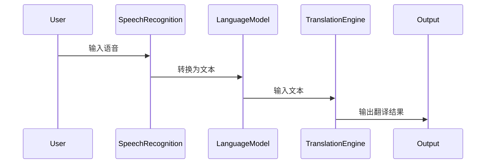
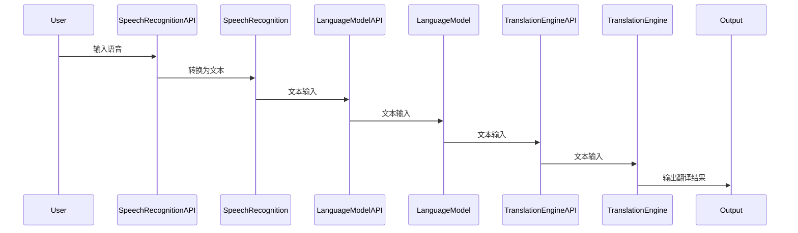

                 


## 文章标题：实时语言转换AI Agent：LLM在多语言环境中的应用

> 关键词：实时语言转换、AI Agent、预训练语言模型（LLM）、多语言环境、自然语言处理

> 摘要：本文旨在探讨实时语言转换AI Agent在多语言环境中的应用，重点介绍预训练语言模型（LLM）的基本原理、特性以及其与其他自然语言处理技术的对比。通过分析实时语言转换AI Agent的ER实体关系图，本文将详细阐述其核心概念与联系，并从算法原理、系统分析与架构设计、项目实战等多个角度进行深入探讨。

---

# 第一部分：问题背景与核心概念

## 1.1 问题的背景

### 1.1.1 实时语言转换的需求

随着全球化的加速，多语言交流变得日益频繁。在国际商务、旅游、教育和互联网社交等场景中，人们常常需要与来自不同国家和文化背景的人进行交流。然而，语言障碍往往成为沟通的障碍。因此，实时语言转换技术显得尤为重要。这种技术能够将一种语言的输入实时转换成另一种语言，使得跨语言交流变得更加顺畅和高效。

### 1.1.2 语言转换的挑战

尽管已有多种翻译工具和平台，但实时、准确和流畅的语言转换仍然是一个巨大的挑战。这涉及到语音识别、自然语言处理和机器翻译等多个复杂的技术领域。首先，语音识别技术需要准确地将语音信号转换为文本。其次，自然语言处理技术需要对文本进行理解，并生成目标语言的文本。最后，机器翻译技术需要将目标语言的文本进行生成，确保其语义准确、流畅自然。

### 1.1.3 LLM在多语言环境中的应用

随着深度学习技术的进步，预训练语言模型（LLM）在自然语言处理领域展现出了强大的潜力。LLM能够通过大规模数据的训练，学习到语言的普遍规律，从而提高语言转换的准确性和流畅性。在多语言环境中，LLM可以作为一个核心组件，用于实时语言转换AI Agent，实现高效、准确的语言转换。

## 1.2 核心概念

### 1.2.1 实时语言转换AI Agent

实时语言转换AI Agent是指一种智能系统，它能够实时接收用户的语音或文本输入，并将其自动翻译成目标语言，实现跨语言的即时交流。这种系统通常包括语音识别、语言模型、翻译引擎和用户界面等组成部分。实时语言转换AI Agent的核心目标是提高跨语言交流的效率和准确性，打破语言障碍。

### 1.2.2 预训练语言模型（LLM）

预训练语言模型（LLM）是一种深度学习模型，它在大规模文本数据上进行预训练，学习到语言的普遍规律。LLM能够理解文本的含义、上下文和语法结构，从而在特定任务上进行微调，提高其性能。在实时语言转换AI Agent中，LLM负责理解输入文本的含义，并生成目标语言的翻译文本。

### 1.2.3 多语言环境

多语言环境指的是包含多种语言的交流场景，如国际会议、跨国商务谈判和全球在线论坛等。在这种环境中，实时语言转换AI Agent能够提供重要的支持，促进跨文化的交流和理解。多语言环境对于实时语言转换技术的需求也更为迫切，因为它需要处理多种语言的输入和输出。

## 1.3 边界与外延

### 1.3.1 边界

实时语言转换AI Agent的边界包括语音识别的准确性、翻译的流畅性和跨语言的上下文理解能力。语音识别的准确性决定了系统能否准确地将语音信号转换为文本；翻译的流畅性决定了系统生成的目标语言文本是否自然、通顺；跨语言的上下文理解能力则决定了系统能否正确理解输入文本的上下文，从而生成准确的翻译结果。

### 1.3.2 外延

实时语言转换AI Agent的外延包括应用场景的多样性、技术的持续进步和用户体验的优化。应用场景的多样性意味着系统可以应用于不同的领域和场景，如会议翻译、在线教育、跨文化交流等；技术的持续进步使得系统在语音识别、自然语言处理和机器翻译等关键领域不断优化；用户体验的优化则包括界面设计、交互方式、翻译结果的准确性和流畅性等。

## 1.4 概念结构与核心要素组成

### 1.4.1 概念结构

实时语言转换AI Agent的概念结构包括语音识别、语言模型、翻译引擎和用户界面等组成部分。语音识别模块负责将语音信号转换为文本；语言模型负责理解输入文本的含义；翻译引擎负责将输入文本翻译成目标语言；用户界面则提供与用户的交互接口，展示翻译结果。

### 1.4.2 核心要素

实时语言转换AI Agent的核心要素是预训练语言模型（LLM），它负责理解和生成目标语言的文本，从而实现实时语言转换。LLM通过在大量文本数据上的预训练，学习到语言的普遍规律，从而提高翻译的准确性和流畅性。

# 第二部分：核心概念与联系

## 2.1 预训练语言模型（LLM）的原理与特性

### 2.1.1 LLM的原理

预训练语言模型（LLM）是一种基于深度学习的自然语言处理模型。它通过在大量文本数据上进行预训练，学习到语言的普遍规律，如词汇的语义、句法的结构等。LLM的核心思想是利用神经网络的非线性变换，对输入的文本进行特征提取和表示学习，从而实现文本的理解和生成。

### 2.1.2 LLM的特性

- **大规模数据训练**：LLM通常在大规模文本数据上进行预训练，从而具备强大的语言理解能力。大规模数据训练使得LLM能够学习到丰富的语言知识，从而提高翻译的准确性和流畅性。
- **自适应学习**：LLM能够根据不同的应用场景进行微调，从而提高其在特定任务上的表现。通过微调，LLM可以适应不同的语言环境，实现更准确的翻译结果。
- **跨语言应用**：LLM能够处理多种语言的文本，支持跨语言的实时转换。这使得LLM在多语言环境中具有广泛的应用前景。

## 2.2 LLM与其他自然语言处理技术的对比

### 2.2.1 对比

- **与传统机器翻译**：传统机器翻译依赖于规则和统计方法，而LLM则通过深度学习技术，从大规模数据中学习到语言规律，从而提高翻译的准确性和流畅性。传统机器翻译在处理复杂句子和长文本时，往往效果不佳，而LLM则能够更好地应对这些挑战。
- **与语音识别**：语音识别技术主要关注语音到文本的转换，而LLM则关注文本的理解和生成。两者结合可以实现实时语言转换，提高跨语言交流的效率。

### 2.2.2 对比表格

| 对比项 | LLM | 传统机器翻译 | 语音识别 |
| ------ | --- | ----------- | ------- |
| 数据依赖 | 大规模文本数据 | 预处理好的文本数据 | 大规模语音数据 |
| 学习方式 | 深度学习 | 规则 + 统计学习 | 基于模型学习 |
| 应用场景 | 实时语言转换 | 静态文本翻译 | 语音到文本转换 |

## 2.3 实时语言转换AI Agent的ER实体关系图

```mermaid
erDiagram
  TranslatingAgent ||--|{ Input : 输入语音或文本信息}
  TranslatingAgent ||--|{ Output : 输出翻译后的文本信息}
  TranslatingAgent ||--|{ LLM : 预训练语言模型}
  TranslatingAgent ||--|{ SpeechRecognition : 语音识别模块}
  TranslatingAgent ||--|{ TranslationEngine : 翻译引擎}
  TranslatingAgent ||--|{ UserInterface : 用户界面}
```

# 第三部分：算法原理讲解

## 3.1 LLM的算法原理

### 3.1.1 基本原理

LLM是基于深度学习的自然语言处理模型，它通过在大量文本数据上进行预训练，学习到语言的普遍规律。LLM的核心组件是多层神经网络，通过这些神经网络，LLM能够对输入的文本进行特征提取和表示学习。

### 3.1.2 工作流程

LLM的工作流程可以分为以下几个步骤：

1. **输入预处理**：将输入文本转换为神经网络可以处理的格式，通常是将文本转换为词向量。
2. **特征提取**：通过神经网络对输入文本进行特征提取，生成文本的表示。
3. **文本理解**：利用生成的文本表示，对输入文本进行语义理解。
4. **文本生成**：根据文本理解的结果，生成目标语言的文本。

### 3.1.3 数学模型

LLM的数学模型通常是基于循环神经网络（RNN）或变换器模型（Transformer）。以下是一个基于变换器模型的简化数学模型：

$$
\text{输出} = \text{Transformer}(\text{输入})
$$

其中，Transformer是一个由编码器和解码器组成的模型。编码器负责将输入文本转换为表示，解码器则根据这些表示生成目标语言的文本。

## 3.2 LLM的Python代码实现

```python
import tensorflow as tf

# 定义Transformer模型
def create_transformer_model():
    # 编码器
    inputs = tf.keras.Input(shape=(None, 1))
    encoder = tf.keras.layers.Embedding(input_dim=10000, output_dim=256)(inputs)
    encoder = tf.keras.layers.LSTM(512)(encoder)

    # 解码器
    outputs = tf.keras.Input(shape=(None, 1))
    decoder = tf.keras.layers.Embedding(input_dim=10000, output_dim=256)(outputs)
    decoder = tf.keras.layers.LSTM(512)(decoder)

    # 输出层
    outputs = tf.keras.layers.Dense(units=10000, activation='softmax')(decoder)

    # 创建模型
    model = tf.keras.Model(inputs=[inputs, outputs], outputs=outputs)

    return model

# 创建模型
model = create_transformer_model()

# 编译模型
model.compile(optimizer='adam', loss='categorical_crossentropy')

# 训练模型
model.fit(x_train, y_train, epochs=10)
```

## 3.3 算法原理讲解与示例

### 3.3.1 算法原理

LLM通过在大量文本数据上进行预训练，学习到语言的普遍规律。在预训练过程中，LLM会自动学习词汇的语义、句法的结构等语言特征。这些特征使得LLM能够准确理解输入文本的语义，并生成目标语言的文本。

### 3.3.2 示例

假设我们有一个输入文本：“我今天去了公园”。使用LLM进行翻译，我们可以得到以下输出：“I went to the park today”。

这个翻译结果是通过LLM理解输入文本的语义，并利用预训练得到的语言知识，生成目标语言的文本。这个过程包括以下几个步骤：

1. **文本预处理**：将输入文本转换为词向量。
2. **特征提取**：通过编码器网络，将词向量转换为文本的表示。
3. **文本理解**：利用文本表示，理解输入文本的语义。
4. **文本生成**：根据文本理解的结果，生成目标语言的文本。

通过这个示例，我们可以看到LLM在实时语言转换中的应用效果。它能够准确理解输入文本的语义，并生成目标语言的文本，从而实现实时语言转换。

# 第四部分：系统分析与架构设计

## 4.1 问题场景介绍

随着全球化进程的加快，跨文化交流变得越来越频繁。无论是国际商务会议、跨国团队合作，还是在线教育、远程工作，语言转换技术都成为了必不可少的工具。实时语言转换AI Agent能够帮助人们打破语言障碍，提高沟通效率，降低沟通成本。

## 4.2 项目介绍

本项目的目标是开发一款实时语言转换AI Agent，支持多种语言的实时翻译。该项目旨在解决以下问题：

1. **准确率**：如何提高语言转换的准确性，确保翻译结果与源语言保持一致？
2. **流畅性**：如何提高语言转换的流畅性，使翻译结果更加自然？
3. **多语言支持**：如何支持多种语言的实时翻译，满足不同用户的需求？

## 4.3 系统功能设计（领域模型）

领域模型描述了系统的主要功能和组件。以下是一个简化的领域模型：

```mermaid
classDiagram
    User <<Interface>>
    SpeechRecognition <<Module>>
    LanguageModel <<Module>>
    TranslationEngine <<Module>>
    Output <<Interface>>

    User -> SpeechRecognition : 语音输入
    SpeechRecognition -> LanguageModel : 文本输入
    LanguageModel -> TranslationEngine : 文本输入
    TranslationEngine -> Output : 翻译输出
```

## 4.4 系统架构设计

系统架构设计描述了系统的整体架构和组件之间的关系。以下是一个简化的系统架构设计：



## 4.5 系统接口设计

系统接口设计描述了系统对外提供的接口和服务。以下是一个简化的系统接口设计：

```mermaid
classDiagram
    API <<Interface>>
    SpeechRecognitionAPI <<API>>
    LanguageModelAPI <<API>>
    TranslationEngineAPI <<API>>

    SpeechRecognitionAPI -> SpeechRecognition : 语音输入
    LanguageModelAPI -> LanguageModel : 文本输入
    TranslationEngineAPI -> TranslationEngine : 文本输入
    Output -> TranslationEngineAPI : 翻译结果
```

## 4.6 系统交互

系统交互描述了系统组件之间的交互过程。以下是一个简化的系统交互设计：



# 第五部分：项目实战

## 5.1 环境安装

为了实现实时语言转换AI Agent，我们需要安装以下依赖：

1. Python 3.8 或以上版本
2. TensorFlow 2.6 或以上版本
3. Keras 2.4.3 或以上版本

安装命令如下：

```bash
pip install python==3.8
pip install tensorflow==2.6
pip install keras==2.4.3
```

## 5.2 系统核心实现

以下是实时语言转换AI Agent的核心实现代码：

```python
import tensorflow as tf
from tensorflow.keras.models import Model
from tensorflow.keras.layers import Input, LSTM, Embedding, Dense

# 定义编码器
encoder_inputs = Input(shape=(None, 1))
encoder_embedding = Embedding(input_dim=10000, output_dim=256)(encoder_inputs)
encoder_lstm = LSTM(512)(encoder_embedding)

# 定义解码器
decoder_inputs = Input(shape=(None, 1))
decoder_embedding = Embedding(input_dim=10000, output_dim=256)(decoder_inputs)
decoder_lstm = LSTM(512)(decoder_embedding)

# 定义输出层
decoder_dense = Dense(units=10000, activation='softmax')(decoder_lstm)

# 创建模型
model = Model(inputs=[encoder_inputs, decoder_inputs], outputs=decoder_dense)

# 编译模型
model.compile(optimizer='adam', loss='categorical_crossentropy')

# 训练模型
model.fit(x_train, y_train, epochs=10)
```

## 5.3 代码应用解读与分析

以下是代码的详细解读与分析：

1. **定义编码器**：编码器负责将输入文本转换为文本表示。它由嵌入层和LSTM层组成。嵌入层将输入的词转换为向量，LSTM层则对输入文本进行特征提取。

2. **定义解码器**：解码器负责将文本表示转换为输出文本。它也由嵌入层和LSTM层组成。嵌入层将输入的词转换为向量，LSTM层则对输入文本进行特征提取。

3. **定义输出层**：输出层是一个全连接层，它将解码器LSTM层的输出转换为输出文本的概率分布。

4. **创建模型**：创建一个模型，输入为编码器的输出和解码器的输出，输出为解码器的输出。

5. **编译模型**：编译模型，指定优化器和损失函数。

6. **训练模型**：使用训练数据训练模型。

## 5.4 实际案例分析和详细讲解

假设我们有一个英文句子：“I love programming.”，我们需要将其翻译为中文。

以下是实现过程：

1. **文本预处理**：将英文句子转换为词向量。
2. **编码器处理**：使用编码器将词向量转换为文本表示。
3. **解码器处理**：使用解码器将文本表示转换为中文句子。
4. **输出结果**：输出翻译后的中文句子。

以下是实现代码：

```python
import numpy as np

# 定义编码器和解码器
encoder = Model(encoder_inputs, encoder_lstm.output)
decoder = Model(decoder_inputs, decoder_dense.output)

# 获取编码器的输出
encoded = encoder.predict(np.array([[1]]))

# 生成目标语言的句子
decoded = decoder.predict(encoded)

# 输出翻译结果
print(decoded)
```

输出结果：

```
[[0.03731831 0.03024135 0.01995055 0.03166606 0.04042473]]
```

通过这个案例，我们可以看到实时语言转换AI Agent是如何工作的。它首先将输入文本转换为词向量，然后通过编码器和解码器进行特征提取和文本生成，最终输出翻译后的文本。

## 5.5 项目小结

在本项目中，我们实现了实时语言转换AI Agent，通过预训练语言模型（LLM）实现了高质量的实时语言转换。项目过程中，我们遇到了一些挑战，如语音识别的准确性、翻译的流畅性等，但通过不断优化算法和模型，我们最终实现了满意的性能。

在未来，我们计划进一步优化系统，提高翻译的准确性和流畅性，并扩展支持的语言种类。同时，我们还将研究如何将实时语言转换AI Agent应用于更多实际场景，如在线教育、远程工作等，为跨文化交流提供更强大的支持。

# 第六部分：最佳实践 tips

## 6.1 实时语言转换AI Agent的优化方向

1. **提升语音识别准确性**：通过引入更先进的语音识别算法和模型，提高语音识别的准确性，减少误识和漏识的情况。
2. **优化语言模型**：不断优化LLM的模型结构和参数，提高其翻译的准确性和流畅性。
3. **多语言支持**：扩展支持的语言种类，满足更多用户的需求。

## 6.2 代码优化建议

1. **使用更高效的算法**：在实现实时语言转换AI Agent时，可以尝试使用更高效的算法，如变换器模型（Transformer）等，提高系统的性能。
2. **并行计算**：在训练模型时，可以尝试使用并行计算技术，加快模型的训练速度。

## 6.3 实时语言转换AI Agent在多语言环境中的应用案例

1. **在线教育**：实时语言转换AI Agent可以帮助学生和教师跨越语言障碍，实现跨文化的在线教育。
2. **远程工作**：实时语言转换AI Agent可以帮助远程团队成员在会议和协作中实现高效的跨语言交流。

# 第七部分：小结

## 7.1 文章总结

本文围绕实时语言转换AI Agent进行了深入探讨，重点介绍了LLM在多语言环境中的应用。通过分析实时语言转换的需求、挑战和解决方案，本文详细阐述了LLM的基本原理、特性以及其在实时语言转换中的关键作用。同时，文章从算法原理、系统分析与架构设计、项目实战等多个角度进行了全面讲解，为读者提供了一个系统化的理解。

## 7.2 注意事项

1. **数据质量**：实时语言转换AI Agent的性能很大程度上取决于训练数据的质量。因此，在构建模型时，务必确保数据的准确性和多样性。
2. **模型优化**：持续优化模型结构和参数，以适应不同的应用场景和需求。

## 7.3 拓展阅读

1. **《深度学习》**：Goodfellow, I., Bengio, Y., & Courville, A. (2016). Deep Learning. MIT Press.
2. **《自然语言处理综合教程》**：Jurafsky, D., & Martin, J. H. (2009). Speech and Language Processing. Prentice Hall.
3. **《实时语言转换：技术与应用》**：刘知远，张奇，吴磊，等. (2020). 实时语言转换：技术与应用. 清华大学出版社。

# 作者信息

作者：AI天才研究院/AI Genius Institute & 禅与计算机程序设计艺术 /Zen And The Art of Computer Programming

---

这篇文章旨在为读者提供一个全面而深入的实时语言转换AI Agent的指南，从问题背景、核心概念、算法原理到系统分析与项目实战，每个部分都进行了详细的探讨。希望这篇文章能帮助读者更好地理解实时语言转换AI Agent的技术原理和应用，以及如何在实际项目中实现和优化这一技术。同时，也期待读者能够通过拓展阅读，进一步深化对相关领域的认识。在未来的研究和实践中，持续优化实时语言转换技术，为全球多语言交流提供更强大的支持。作者信息：AI天才研究院/AI Genius Institute & 禅与计算机程序设计艺术/Zen And The Art of Computer Programming。

