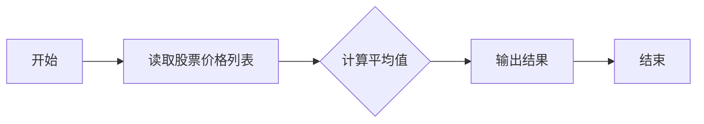
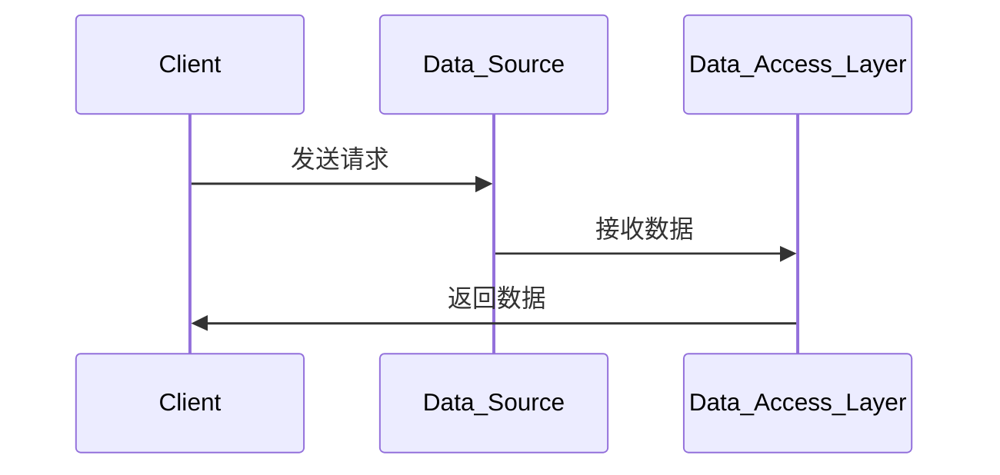
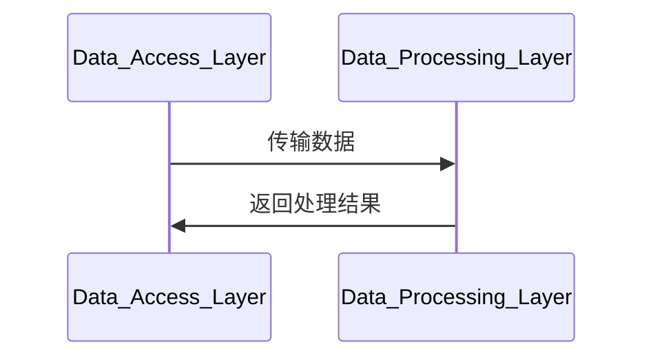
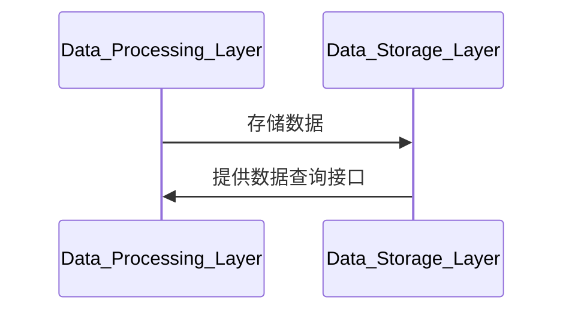
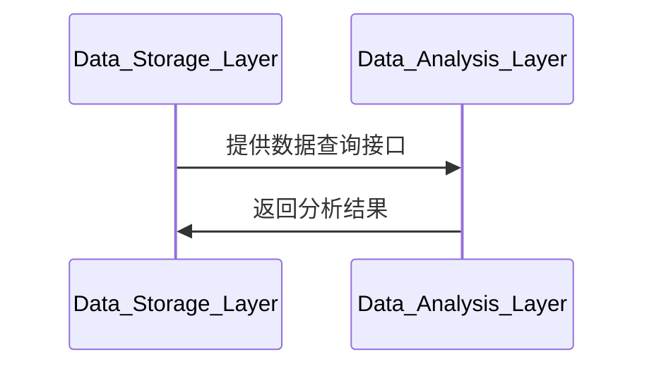
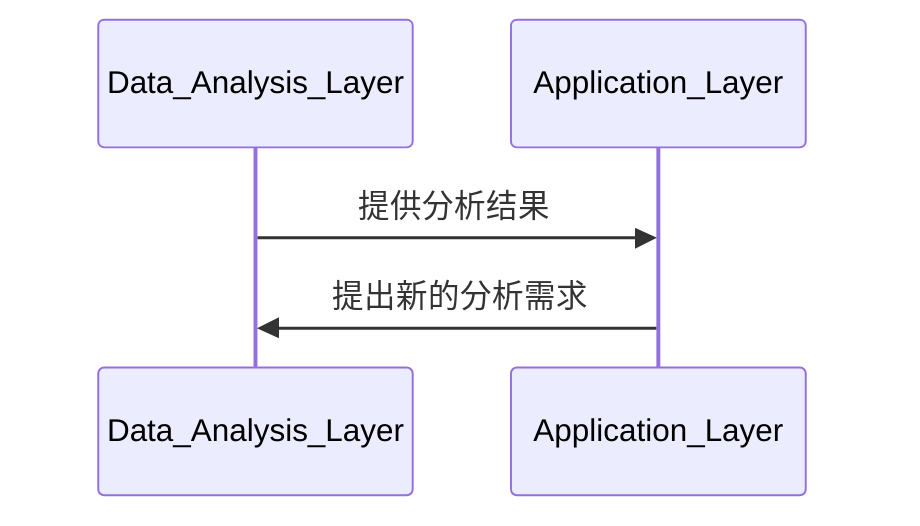
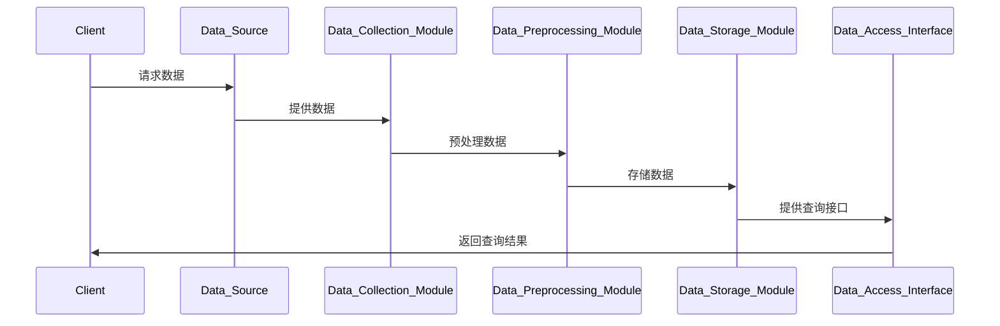
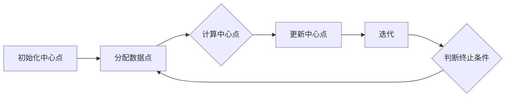

                 

### 文章标题

## 实时金融数据接入与处理：技术与挑战

### 文章关键词

- **实时金融数据**
- **数据接入技术**
- **数据处理算法**
- **系统架构设计**
- **风险管理**

### 文章摘要

本文深入探讨了实时金融数据接入与处理的相关技术及其面临的挑战。通过分析实时金融数据处理的重要性，本文介绍了数据接入的基本概念、技术架构和关键挑战。接着，文章详细阐述了实时数据处理算法、数据存储与管理策略，以及在投资分析和风险管理中的应用。最后，本文总结了实时金融数据处理领域的解决方案和实践经验，并展望了未来的发展趋势。

----------------------------------------------------------------

### 第一部分：引言

#### 第1章：实时金融数据处理的背景和意义

### 背景介绍

在金融行业，数据是决策的重要依据。然而，传统的数据处理方式往往无法满足金融领域对实时性的需求。实时金融数据处理是指在较短的时间内，对金融数据进行高效的采集、处理和分析，从而为投资者、金融机构和监管机构提供及时、准确的数据支持。随着金融市场的不断发展和金融技术的进步，实时金融数据处理已经成为金融行业的重要趋势。

#### 问题背景

金融市场的波动性和复杂性使得实时数据接入与处理变得尤为重要。首先，投资者需要及时获取市场信息，以便做出快速的投资决策。其次，金融机构需要对交易数据进行实时监控，确保交易安全、合规。此外，监管机构也需要实时数据来监控市场风险，维护金融市场的稳定。因此，实时金融数据处理不仅是一个技术问题，更是一个关乎市场稳定和投资者利益的重要议题。

#### 问题描述

实时金融数据处理涉及到数据接入、数据处理、数据存储、数据分析和数据可视化等多个环节。主要问题包括：

- **数据延迟**：如何在较短的时间内处理并返回数据？
- **数据一致性和完整性**：如何保证数据在处理过程中的准确性和一致性？
- **数据安全**：如何保障数据在传输和存储过程中的安全性？
- **系统可伸缩性**：如何确保系统在高并发、大数据量情况下的性能和稳定性？

#### 问题解决

针对上述问题，需要采取一系列技术手段和策略，如：

- **高效的数据接入**：采用高速的数据采集技术，如WebSocket、HTTP长轮询等。
- **分布式数据处理**：利用分布式计算框架，如Apache Kafka、Apache Flink等，提高数据处理效率。
- **数据缓存与存储**：采用分布式缓存和数据存储方案，如Redis、MongoDB等，提高数据访问速度。
- **数据加密与安全**：采用SSL/TLS等加密协议，保障数据在传输过程中的安全。
- **系统优化与扩展**：通过垂直和水平扩展，提高系统的性能和可伸缩性。

#### 边界与外延

实时金融数据处理不仅涉及技术层面，还涉及到业务层面。例如，不同金融机构对实时数据的需求和标准可能有所不同。因此，在设计实时金融数据处理系统时，需要充分考虑业务需求和个性化定制。

#### 概念结构与核心要素组成

实时金融数据处理系统主要由以下核心组件组成：

- **数据源**：包括金融市场数据、交易数据、客户数据等。
- **数据接入层**：负责数据采集和接入，如网络通信、数据解析等。
- **数据处理层**：包括数据清洗、转换、聚合、分析等。
- **数据存储层**：包括关系型数据库、分布式数据库、NoSQL数据库等。
- **数据分析层**：提供实时数据分析、报表生成、可视化等功能。
- **应用层**：包括投资分析、风险管理、监管报告等。

### 背景介绍

实时金融数据处理在金融行业中具有重要意义。首先，它有助于提高投资决策的准确性。通过实时数据，投资者可以更准确地了解市场动态，从而做出更合理的投资决策。其次，实时金融数据处理有助于提高金融机构的运营效率。通过实时监控交易数据，金融机构可以快速发现异常交易，确保交易安全和合规。此外，实时金融数据处理还有助于监管机构更好地监控市场风险，维护金融市场的稳定。

#### 核心概念与联系

实时金融数据处理涉及多个核心概念，如数据接入、数据处理、数据存储、数据分析和数据可视化等。这些概念之间存在紧密的联系：

- **数据接入**是实时金融数据处理的起点，负责采集和接入各种数据源。
- **数据处理**是实时金融数据处理的中心环节，负责数据清洗、转换、聚合和分析等。
- **数据存储**是实时金融数据处理的基础，负责存储和管理数据，以便后续分析和查询。
- **数据分析**是实时金融数据处理的深化应用，通过数据分析和挖掘，为投资者、金融机构和监管机构提供决策支持。
- **数据可视化**是将数据分析结果以图形、报表等形式展示出来，帮助用户更好地理解和应用数据。

为了更好地理解这些概念之间的联系，我们可以使用ER（实体关系）图来表示它们之间的关系。以下是一个简单的ER图示例：

```mermaid
erDiagram
    Data_Source ||--|{ Data_Processing }|
    Data_Processing ||--|{ Data_Storage }|
    Data_Storage ||--|{ Data_Analysis }|
    Data_Analysis ||--|{ Data_Visualization }
```

在这个ER图中，`Data_Source`表示数据接入层，`Data_Processing`表示数据处理层，`Data_Storage`表示数据存储层，`Data_Analysis`表示数据分析层，`Data_Visualization`表示数据可视化层。它们之间通过实线箭头表示从数据源到数据处理、数据存储、数据分析和数据可视化的流动关系。

#### 算法原理讲解

实时金融数据处理中，数据处理算法起着至关重要的作用。以下是一个简单的数据处理算法示例，用于计算股票的平均价格。

**算法流程图**：



**Python代码实现**：

```python
def calculate_average_price(prices):
    total = 0
    for price in prices:
        total += price
    average = total / len(prices)
    return average

prices = [101.2, 102.5, 103.7, 104.1]
average_price = calculate_average_price(prices)
print("平均价格为：", average_price)
```

**算法原理讲解**：

该算法的基本原理是将一组股票价格相加，然后除以价格的数量，得到平均价格。具体步骤如下：

1. **读取股票价格列表**：从数据源中获取一组股票价格。
2. **计算平均值**：将所有价格相加，然后除以价格的数量。
3. **输出结果**：将计算得到的平均价格输出。

为了更好地理解这个算法，我们可以通过以下示例来说明：

**示例**：

假设有一组股票价格如下：

```python
prices = [101.2, 102.5, 103.7, 104.1]
```

计算这组股票的平均价格：

1. **读取股票价格列表**：`prices = [101.2, 102.5, 103.7, 104.1]`
2. **计算平均值**：`total = 101.2 + 102.5 + 103.7 + 104.1 = 411.5`，`average = 411.5 / 4 = 102.875`
3. **输出结果**：`平均价格为：102.875`

通过这个简单的示例，我们可以看到实时金融数据处理算法的基本原理。在实际应用中，数据处理算法会更为复杂，需要考虑更多的因素，如数据源的类型、数据量的大小、计算速度的要求等。

#### 系统分析与架构设计方案

为了更好地理解实时金融数据处理的系统架构，我们可以将其分为以下几层：

##### 1. 数据源层

数据源层包括金融市场数据、交易数据、客户数据等。这些数据可以通过API接口、数据库连接、文件读取等方式接入系统。

##### 2. 数据接入层

数据接入层负责采集和接入各种数据源。可以使用WebSocket、HTTP长轮询等技术来实现数据实时接入。



##### 3. 数据处理层

数据处理层负责数据清洗、转换、聚合、分析等。可以使用分布式计算框架，如Apache Kafka、Apache Flink等来实现。



##### 4. 数据存储层

数据存储层负责存储和管理数据。可以使用关系型数据库、分布式数据库、NoSQL数据库等来实现。



##### 5. 数据分析层

数据分析层负责对数据进行分析，生成报表和可视化图表。可以使用数据分析工具，如Tableau、PowerBI等来实现。



##### 6. 应用层

应用层包括投资分析、风险管理、监管报告等。这些应用可以通过Web界面、移动应用等方式提供给用户。



通过以上架构设计，实时金融数据处理系统可以实现高效、可靠、安全的数据处理和分析，满足金融行业的需求。

### 项目实战

为了更好地理解实时金融数据处理的实际应用，我们以一个简单的投资分析项目为例进行讲解。

#### 环境安装

1. 安装Python环境：在命令行中执行以下命令安装Python：

   ```bash
   pip install python
   ```

2. 安装所需依赖库：在命令行中执行以下命令安装所需依赖库：

   ```bash
   pip install kafka-python flink-python
   ```

#### 系统核心实现源代码

以下是一个简单的投资分析系统实现：

```python
# 导入所需库
from kafka import KafkaProducer
import json
import time

# 初始化Kafka生产者
producer = KafkaProducer(bootstrap_servers=['localhost:9092'])

# 模拟股票价格数据
def generate_stock_prices():
    prices = [101.2, 102.5, 103.7, 104.1]
    while True:
        average_price = sum(prices) / len(prices)
        message = {
            "timestamp": time.time(),
            "prices": prices,
            "average_price": average_price
        }
        producer.send("stock_prices", value=json.dumps(message).encode('utf-8'))
        time.sleep(1)

# 监听Kafka消息并处理
def process_stock_prices():
    from kafka import KafkaConsumer

    consumer = KafkaConsumer("stock_prices", bootstrap_servers=['localhost:9092'])

    for message in consumer:
        data = json.loads(message.value)
        print("股票价格：", data["prices"])
        print("平均价格：", data["average_price"])
        print("时间戳：", data["timestamp"])
        print("------------------------------------------------")

if __name__ == "__main__":
    generate_stock_prices()
    process_stock_prices()
```

#### 代码应用解读与分析

1. **Kafka生产者**：生产者负责将股票价格数据发送到Kafka主题`stock_prices`。

2. **Kafka消费者**：消费者负责从Kafka主题`stock_prices`中读取消息，并打印出股票价格、平均价格和时间戳。

3. **模拟股票价格数据**：通过模拟股票价格数据，我们可以看到系统是如何实时处理和分析股票价格的。

#### 实际案例分析和详细讲解剖析

为了更好地理解实时金融数据处理在实际中的应用，我们来看一个实际案例：某金融机构使用实时金融数据处理系统进行投资分析。

1. **数据源**：该金融机构从多个数据源获取股票价格数据，包括交易所API、第三方数据提供商等。

2. **数据接入**：通过Kafka生产者，将股票价格数据实时发送到Kafka主题。

3. **数据处理**：通过Kafka消费者，对股票价格数据进行处理，如计算平均价格、最大价格、最小价格等。

4. **数据分析**：通过数据分析工具，如Python的Pandas库，对股票价格数据进行进一步分析和挖掘。

5. **数据可视化**：通过数据可视化工具，如Matplotlib库，将分析结果以图表形式展示出来。

#### 项目小结

通过以上案例，我们可以看到实时金融数据处理系统在实际中的应用。它可以帮助金融机构实时分析股票价格，为投资决策提供数据支持。同时，该系统也具有高可伸缩性、高可靠性和高效性，能够应对大规模数据处理的挑战。

#### 最佳实践 Tips

1. **数据接入**：选择合适的数据接入方式，如Kafka、RabbitMQ等，以提高数据接入的效率和可靠性。

2. **数据处理**：利用分布式计算框架，如Apache Kafka、Apache Flink等，提高数据处理速度和效率。

3. **数据存储**：选择合适的数据存储方案，如关系型数据库、分布式数据库、NoSQL数据库等，以提高数据存储和查询性能。

4. **数据安全**：采用加密技术和访问控制策略，保障数据在传输和存储过程中的安全性。

5. **系统优化**：定期对系统进行性能优化和监控，及时发现和解决潜在问题。

#### 小结

实时金融数据处理在金融行业中具有重要意义，它可以帮助投资者、金融机构和监管机构实现更高效、更准确的数据分析和决策。通过本文的介绍，我们了解了实时金融数据处理的基本概念、技术架构和关键挑战，并通过实际案例进行了详细讲解。希望本文对您在实时金融数据处理领域的学习和实践有所帮助。

#### 注意事项

1. 在实际项目中，需要根据具体需求和场景，选择合适的技术方案和工具。

2. 实时金融数据处理系统需要考虑高并发、大数据量的场景，确保系统的性能和稳定性。

3. 数据安全和数据隐私保护是实时金融数据处理系统的重要考虑因素，需要采取相应的安全措施。

4. 定期对系统进行维护和升级，以适应不断变化的市场需求和技术发展。

#### 拓展阅读

1. 《实时数据流处理技术》
2. 《大数据时代下的金融风险管理》
3. 《金融科技：创新、应用与挑战》

作者：AI天才研究院/AI Genius Institute & 禅与计算机程序设计艺术 /Zen And The Art of Computer Programming

----------------------------------------------------------------

## 第二部分：实时金融数据接入

### 第2章：数据源接入技术

#### 数据源类型及特点

在实时金融数据处理中，数据源是数据接入的第一步。根据数据来源的不同，数据源可以分为以下几类：

1. **交易所数据**：交易所是金融市场中最重要的数据来源之一。交易所提供的历史数据和实时数据对投资者和金融机构具有重要意义。交易所数据通常包括股票、期货、期权等金融产品的价格、成交量、买卖盘等信息。

2. **第三方数据提供商**：第三方数据提供商是金融数据的重要来源。这些提供商通常通过交易所API获取数据，并经过处理后提供给用户。第三方数据提供商的数据种类繁多，包括历史数据、实时数据、财务数据、市场新闻等。

3. **社交媒体数据**：社交媒体数据在金融市场中发挥着越来越重要的作用。通过分析社交媒体上的评论、讨论、趋势等信息，可以了解市场情绪和投资者的情绪变化，为投资决策提供参考。

4. **公司财报数据**：公司财报数据是投资者了解公司财务状况的重要依据。财报数据通常包括公司的收入、利润、负债、资产等信息，对于投资者进行基本面分析具有重要意义。

#### 数据接入方式

根据数据接入方式的不同，数据接入可以分为以下几类：

1. **API接入**：API（应用程序接口）是数据接入最常用的方式。通过API，用户可以获取交易所、第三方数据提供商等提供的数据。API接入的优点是方便、快捷，且具有较高的数据质量。但缺点是部分API可能存在限制，如请求频率限制、数据更新延迟等。

2. **文件接入**：文件接入是将数据以文件的形式导入系统。文件接入通常用于导入历史数据。文件接入的优点是简单、灵活，且数据量不受限制。但缺点是需要手动处理数据格式，且导入速度较慢。

3. **数据库接入**：数据库接入是通过数据库连接获取数据。数据库接入通常用于实时数据接入。数据库接入的优点是速度快、数据一致性好。但缺点是需要维护数据库，且对于大数据量场景可能存在性能瓶颈。

4. **消息队列接入**：消息队列接入是将数据通过消息队列传输到系统。消息队列接入通常用于分布式系统中的数据接入。消息队列接入的优点是高可用、高可伸缩性，且能够保证数据的顺序性。但缺点是可能存在数据延迟。

#### 数据流模型

在实时金融数据处理中，数据流模型是数据接入的重要概念。数据流模型描述了数据的流动路径和处理方式。根据数据流模型的类型，可以分为以下几类：

1. **批量处理模型**：批量处理模型是将数据按批次处理。在批量处理模型中，数据以文件或数据库表的形式存储，然后按批次读取和处理。批量处理模型的优点是简单、易于实现。但缺点是数据处理延迟较高，无法满足实时性要求。

2. **流处理模型**：流处理模型是将数据以流的形式处理。在流处理模型中，数据实时接入系统，并实时进行处理。流处理模型的优点是数据处理速度快、延迟低。但缺点是需要复杂的分布式计算架构。

3. **混合处理模型**：混合处理模型是将批量处理和流处理相结合。在混合处理模型中，一部分数据以流的形式处理，另一部分数据以批量的形式处理。混合处理模型的优点是兼顾实时性和处理效率。但缺点是系统架构复杂。

#### 数据源接入架构

在实时金融数据处理中，数据源接入架构是系统架构的核心部分。以下是一个典型的数据源接入架构：

1. **数据采集模块**：数据采集模块负责从各种数据源获取数据，如交易所、第三方数据提供商、社交媒体等。数据采集模块可以采用API接入、文件接入、数据库接入等方式。

2. **数据预处理模块**：数据预处理模块负责对采集到的数据进行清洗、转换、去重等处理。数据预处理模块可以采用ETL（Extract, Transform, Load）工具，如Apache Kafka、Apache Flink等。

3. **数据存储模块**：数据存储模块负责将预处理后的数据存储到数据库或数据仓库中，以便后续分析和查询。数据存储模块可以采用关系型数据库、分布式数据库、NoSQL数据库等。

4. **数据接入接口**：数据接入接口负责接收外部请求，并提供数据查询、数据分析等功能。数据接入接口可以采用REST API、Websocket等方式。



通过以上数据源接入架构，实时金融数据处理系统可以高效地接入和处理各种数据源，满足金融行业对实时数据的需求。

### 第3章：数据采集与转换

#### 数据采集工具

在实时金融数据处理中，数据采集是关键的一步。选择合适的数据采集工具可以提高数据采集的效率和可靠性。以下是一些常用的数据采集工具：

1. **Kafka**：Kafka是一个分布式流处理平台，适用于大规模数据采集和传输。Kafka具有高吞吐量、高可靠性和可伸缩性，可以实时处理大量金融数据。

2. **Flume**：Flume是一个分布式、可靠且可扩展的数据收集系统，适用于从不同来源采集大量金融数据。Flume可以将数据实时传输到HDFS、HBase等存储系统。

3. **Logstash**：Logstash是一个开源的数据收集和处理工具，可以实时收集、转换和传输金融数据。Logstash支持多种数据源和数据格式，并可以将数据存储到Elasticsearch、Kafka等系统。

4. **RabbitMQ**：RabbitMQ是一个开源的消息队列中间件，适用于实时金融数据的采集和传输。RabbitMQ具有高可靠性和高可伸缩性，可以处理大规模金融数据流。

#### 数据采集流程

数据采集流程通常包括以下步骤：

1. **数据采集**：从数据源获取金融数据，如交易所API、第三方数据提供商、社交媒体等。

2. **数据传输**：将采集到的金融数据传输到数据预处理模块，如Kafka、Flume、Logstash等。

3. **数据预处理**：对采集到的金融数据进行清洗、转换、去重等处理，确保数据的准确性和一致性。

4. **数据存储**：将预处理后的金融数据存储到数据库或数据仓库中，如MySQL、MongoDB、Hadoop等。

#### 数据清洗和转换

数据清洗和转换是数据采集的重要环节。以下是一些常见的数据清洗和转换方法：

1. **数据清洗**：
   - **去重**：去除重复的数据记录。
   - **缺失值处理**：填补缺失的数据或删除缺失的数据记录。
   - **异常值检测和处理**：检测并处理异常的数据值。

2. **数据转换**：
   - **数据格式转换**：将不同格式的数据转换为统一的格式，如JSON、CSV等。
   - **数据类型转换**：将不同类型的数据转换为相同的类型，如将字符串转换为数值类型。
   - **数据归一化**：将不同量纲的数据转换为相同的量纲，以便进行比较和分析。

#### 数据质量保障

数据质量是实时金融数据处理的关键。以下是一些数据质量保障方法：

1. **数据验证**：在数据采集、传输和存储过程中，对数据进行验证，确保数据的准确性和一致性。

2. **数据监控**：实时监控数据采集、处理和存储过程，及时发现和处理数据质量问题。

3. **数据审计**：定期对数据进行审计，检查数据质量是否符合要求。

4. **数据安全**：采用加密技术和访问控制策略，保障数据在传输和存储过程中的安全性。

通过以上数据采集与转换方法，实时金融数据处理系统可以高效、准确地采集、处理和存储金融数据，为投资分析和风险管理提供可靠的数据支持。

### 第4章：数据质量管理和验证

#### 数据质量管理的必要性

在实时金融数据处理中，数据质量是一个至关重要的因素。准确、一致和可靠的数据是进行有效分析和决策的基础。然而，金融数据通常包含各种错误、异常和缺失，这些问题如果不加以处理，会严重影响数据分析的结果和业务决策的准确性。因此，数据质量管理成为实时金融数据处理中不可或缺的一部分。

#### 数据质量管理的方法

1. **数据清洗**：数据清洗是数据质量管理的基础步骤，包括去除重复记录、填补缺失值、纠正错误和异常值等。通过数据清洗，可以提高数据的一致性和准确性。

2. **数据验证**：数据验证是在数据采集、处理和存储过程中，对数据进行检查和核对，确保数据的质量。数据验证可以包括格式验证、范围验证、逻辑验证等。

3. **数据监控**：数据监控是一种实时监控数据质量的方法，通过监控数据流和处理过程，可以及时发现和处理数据质量问题。

4. **数据审计**：数据审计是对数据质量进行定期检查和评估，确保数据符合业务需求和法规要求。数据审计可以帮助发现数据质量问题的根源，并采取相应的改进措施。

#### 数据验证的具体步骤

1. **数据采集验证**：在数据采集阶段，对采集的数据进行初步验证，确保数据的格式和内容符合预期。例如，检查日期格式是否正确，数值范围是否合理等。

2. **数据处理验证**：在数据处理阶段，对处理后的数据进行验证，确保数据处理过程的正确性和一致性。例如，检查数据转换是否成功，计算结果是否准确等。

3. **数据存储验证**：在数据存储阶段，对存储的数据进行验证，确保数据的准确性和一致性。例如，检查数据是否完整，存储位置是否正确等。

4. **数据使用验证**：在数据使用阶段，对使用的数据进行验证，确保数据用于分析和决策的准确性。例如，检查数据是否用于正确的分析模型，结果是否符合预期等。

#### 数据质量管理工具

1. **ETL工具**：ETL（Extract, Transform, Load）工具是进行数据清洗和转换的重要工具。例如，Apache Kafka、Apache Flink等。

2. **数据质量管理平台**：数据质量管理平台提供数据清洗、验证、监控和审计等功能。例如，Informatica、Talend等。

3. **数据质量规则库**：数据质量规则库包含各种数据质量规则和标准，可以帮助自动检测和纠正数据质量问题。

#### 数据质量管理最佳实践

1. **建立数据质量标准**：明确数据质量的标准和规则，确保数据在采集、处理和存储过程中符合要求。

2. **定期进行数据质量检查**：定期对数据质量进行检查和评估，及时发现和处理数据质量问题。

3. **数据质量培训**：对数据处理人员进行数据质量培训，提高他们对数据质量重要性的认识，并掌握相应的数据质量管理和验证技能。

4. **数据质量反馈机制**：建立数据质量反馈机制，鼓励数据处理人员及时发现和报告数据质量问题，并采取相应的改进措施。

通过有效的数据质量管理和验证，实时金融数据处理系统可以确保数据的准确性和一致性，为投资分析和风险管理提供可靠的数据支持。

### 第5章：数据处理技术

#### 处理需求

在实时金融数据处理中，数据处理技术是实现数据价值的关键环节。随着金融市场的不断发展和金融数据量的激增，对数据处理技术的需求也越来越高。主要处理需求包括：

- **实时数据处理**：金融市场数据的实时性要求高，需要快速处理并返回结果，以便投资者和金融机构做出及时决策。
- **大数据处理**：金融数据量庞大，需要高效的处理技术来应对大规模数据处理的挑战。
- **复杂数据分析**：金融数据处理不仅需要处理基本的数据统计和分析，还需要进行复杂数据挖掘和预测分析，以提供更深入的业务洞察。

#### 分布式数据处理框架

为了满足上述处理需求，分布式数据处理框架成为了实时金融数据处理的重要工具。以下是一些常用的分布式数据处理框架：

1. **Apache Kafka**：Kafka是一种分布式流处理平台，适用于大规模数据采集和传输。Kafka具有高吞吐量、高可靠性和可伸缩性，可以实时处理大量金融数据。

2. **Apache Flink**：Flink是一种分布式流处理框架，适用于实时数据处理和批量处理。Flink具有高效的数据处理能力和低延迟，可以实时处理复杂的金融数据流。

3. **Apache Spark**：Spark是一种分布式计算框架，适用于大数据处理。Spark提供高效的分布式数据处理能力和丰富的数据处理库，可以处理大规模金融数据。

4. **Apache Storm**：Storm是一种分布式流处理框架，适用于实时数据处理。Storm具有低延迟和高吞吐量，可以实时处理金融数据，并提供丰富的数据处理功能。

#### 数据处理流程

分布式数据处理框架通常包括以下数据处理流程：

1. **数据采集**：从各种数据源采集金融数据，如交易所、第三方数据提供商、社交媒体等。

2. **数据传输**：将采集到的金融数据传输到分布式数据处理框架中，如Kafka、Flink等。

3. **数据预处理**：对采集到的金融数据进行清洗、转换、去重等预处理操作，确保数据的准确性和一致性。

4. **数据处理**：对预处理后的金融数据进行实时处理和分析，如计算指标、数据挖掘、预测分析等。

5. **数据存储**：将处理后的金融数据存储到数据库或数据仓库中，以便后续分析和查询。

#### 数据处理算法

实时金融数据处理涉及多种算法，以下是一些常用的数据处理算法：

1. **统计分析算法**：包括均值、中位数、方差、标准差等，用于计算金融数据的统计指标。

2. **时间序列分析算法**：包括ARIMA、SARIMA、LSTM等，用于分析金融数据的趋势和周期性。

3. **聚类算法**：包括K-means、DBSCAN等，用于对金融数据进行分类和聚类分析。

4. **回归分析算法**：包括线性回归、逻辑回归等，用于预测金融数据的变化趋势。

5. **机器学习算法**：包括决策树、随机森林、支持向量机等，用于进行金融数据的分类和预测。

#### 算法原理讲解

以下以K-means聚类算法为例，讲解其原理和实现。

**算法原理**：

K-means算法是一种基于距离的聚类算法，其基本思想是将数据点划分成K个簇，使得每个簇内的数据点距离簇中心的距离最小。

**算法流程**：

1. **初始化中心点**：随机选择K个数据点作为初始中心点。
2. **分配数据点**：将每个数据点分配到与其最近的中心点所在的簇。
3. **更新中心点**：重新计算每个簇的中心点。
4. **迭代**：重复步骤2和步骤3，直到中心点不再发生变化或达到最大迭代次数。

**算法流程图**：



**Python代码实现**：

```python
from sklearn.cluster import KMeans
import numpy as np

def kmeans_clustering(data, k=3):
    # 初始化K-means算法
    kmeans = KMeans(n_clusters=k, random_state=0)

    # 训练模型并预测簇分配
    clusters = kmeans.fit_predict(data)

    # 计算并返回中心点
    centers = kmeans.cluster_centers_

    return clusters, centers

# 示例数据
data = np.array([[1, 2], [1, 4], [1, 0], [10, 2], [10, 4], [10, 0]])

# 执行K-means聚类
clusters, centers = kmeans_clustering(data, k=2)

# 打印结果
print("簇分配结果：", clusters)
print("中心点：", centers)
```

通过以上算法实现，我们可以看到K-means算法的基本原理和实现过程。在实际应用中，可以根据具体需求和数据特点，选择合适的聚类算法和参数。

### 第6章：数据存储与管理

#### 数据存储需求

在实时金融数据处理中，数据存储是至关重要的一环。数据存储的需求主要表现在以下几个方面：

1. **数据量**：金融数据量庞大，需要高效的数据存储方案来应对大数据量的挑战。
2. **数据结构**：金融数据结构复杂，包括股票价格、交易记录、客户信息等多种类型的数据。
3. **数据实时性**：金融数据处理需要实时性，要求数据存储系统能够快速读写数据，满足实时查询和分析的需求。
4. **数据一致性**：金融数据一致性要求高，需要确保数据在处理过程中的一致性和准确性。
5. **数据安全性**：金融数据涉及敏感信息，需要确保数据存储系统的安全性和可靠性。

#### 数据存储技术

根据上述需求，以下是几种常用的数据存储技术：

1. **关系型数据库**：关系型数据库（如MySQL、PostgreSQL）适用于结构化数据存储，具有良好的数据一致性和事务支持。但关系型数据库在面对大规模数据和高并发场景时，性能可能受到限制。

2. **分布式数据库**：分布式数据库（如Cassandra、HBase）适用于大规模数据存储和高并发场景。分布式数据库通过数据分片和分布式存储，提高数据存储和查询的效率。

3. **NoSQL数据库**：NoSQL数据库（如MongoDB、Redis）适用于非结构化或半结构化数据存储。NoSQL数据库具有高扩展性、高性能和灵活性，适用于实时金融数据处理。

4. **数据仓库**：数据仓库（如Amazon Redshift、Google BigQuery）适用于大规模数据存储和复杂查询。数据仓库支持多维数据模型和复杂查询，适用于金融数据分析。

#### 实时数据存储与管理策略

1. **数据分层存储**：根据数据的重要性和访问频率，将数据分层存储。高频数据存储在内存或SSD中，低频数据存储在磁盘或分布式存储系统中。

2. **数据分区和分片**：对数据表进行分区和分片，提高数据存储和查询的效率。分区可以根据时间、地理位置等因素进行，分片可以根据数据量进行。

3. **数据缓存**：使用缓存技术（如Redis、Memcached），减少数据查询的延迟。缓存可以存储热点数据，提高数据访问速度。

4. **数据压缩**：对数据进行压缩，减少存储空间和传输带宽的需求。压缩可以采用无损压缩或有损压缩，根据数据特性进行选择。

5. **数据备份与恢复**：定期对数据进行备份，确保数据的安全性和可靠性。备份策略可以采用全量备份和增量备份，根据业务需求进行选择。

6. **数据安全策略**：采用数据加密、访问控制等技术，保障数据在传输和存储过程中的安全性。数据加密可以采用SSL/TLS等加密协议，访问控制可以采用RBAC（基于角色的访问控制）或ABAC（基于属性的访问控制）。

通过以上实时数据存储与管理策略，实时金融数据处理系统可以高效、可靠地存储和管理金融数据，满足金融行业对实时数据的需求。

### 第7章：实时金融数据在投资分析中的应用

#### 投资分析的数据需求

在投资分析中，实时金融数据起着至关重要的作用。投资分析的数据需求主要包括以下几个方面：

1. **股票价格数据**：股票价格是投资分析中最基本的数据。投资者需要实时了解股票价格的变化，以便做出及时的投资决策。

2. **交易数据**：交易数据包括成交量、买卖盘、交易时间等。通过分析交易数据，可以了解市场的活跃程度和投资者的情绪。

3. **财务数据**：财务数据包括公司的收入、利润、负债、资产等。财务数据是进行基本面分析的重要依据，可以帮助投资者评估公司的财务状况。

4. **市场新闻**：市场新闻包括政策变化、公司公告、行业动态等。通过分析市场新闻，可以了解市场的变化趋势和潜在风险。

5. **技术指标**：技术指标包括均线、MACD、RSI等。技术指标可以用来判断股票价格的趋势和买卖点。

#### 实时数据处理方法

为了满足投资分析的数据需求，实时数据处理方法至关重要。以下是一些常用的实时数据处理方法：

1. **数据流处理**：数据流处理是一种实时数据处理方法，可以处理连续的数据流，并实时输出结果。常用的数据流处理框架包括Apache Kafka、Apache Flink等。

2. **时间序列分析**：时间序列分析是一种用于分析时间序列数据的方法，可以预测未来的趋势和周期性。常用的时间序列分析算法包括ARIMA、SARIMA、LSTM等。

3. **机器学习模型**：机器学习模型可以用于预测股票价格和交易量等。常用的机器学习算法包括线性回归、决策树、随机森林等。

4. **实时查询**：实时查询是一种用于实时查询和处理数据的查询方法，可以快速获取数据的结果。常用的实时查询工具包括Redis、Memcached等。

#### 案例研究

以下是一个投资分析的案例研究，展示了如何利用实时金融数据进行分析和决策。

**案例背景**：

某投资者在投资一只股票，需要实时分析该股票的价格变化、交易数据和财务数据，以做出投资决策。

**数据来源**：

- 股票价格数据：从交易所API获取。
- 交易数据：从交易所API获取。
- 财务数据：从第三方数据提供商获取。
- 市场新闻：从新闻网站和社交媒体获取。

**数据处理步骤**：

1. **数据采集**：通过交易所API和第三方数据提供商，实时采集股票价格、交易数据和财务数据。

2. **数据预处理**：对采集到的数据进行清洗、转换和去重，确保数据的一致性和准确性。

3. **实时分析**：使用数据流处理框架（如Apache Kafka、Apache Flink），实时处理股票价格、交易数据和财务数据，计算技术指标和预测模型。

4. **决策支持**：根据实时分析结果，为投资者提供投资建议和决策支持。

**案例分析**：

通过实时金融数据处理，投资者可以实时了解股票价格的变化、交易活跃程度和财务状况。以下是一个具体的分析案例：

- **股票价格变化**：通过分析股票价格的变化，投资者可以判断股票的趋势。如果股票价格持续上涨，可能是一个买入信号；如果股票价格持续下跌，可能是一个卖出信号。
- **交易数据**：通过分析交易数据，投资者可以了解市场的活跃程度。如果成交量持续增加，可能表示市场情绪乐观，是一个买入信号；如果成交量持续下降，可能表示市场情绪悲观，是一个卖出信号。
- **财务数据**：通过分析财务数据，投资者可以评估公司的财务状况。如果公司的收入和利润持续增长，可能是一个买入信号；如果公司的收入和利润下降，可能是一个卖出信号。
- **技术指标**：通过分析技术指标，投资者可以判断股票的买卖点。例如，如果均线向上交叉，可能是一个买入信号；如果均线向下交叉，可能是一个卖出信号。

通过以上分析，投资者可以做出更准确的投资决策，提高投资的成功率。

### 第8章：实时金融数据在风险管理中的应用

#### 风险管理的实时数据处理需求

在金融行业中，风险管理是确保金融系统稳定运行的重要环节。实时金融数据处理在风险管理中具有重要作用，其主要需求包括：

1. **交易监控**：实时监控交易数据，及时发现异常交易，防止欺诈和内部交易。
2. **市场监控**：实时监控市场动态，分析市场趋势，预测潜在风险。
3. **信用评分**：基于实时金融数据，对客户进行信用评分，评估信用风险。
4. **合规性检查**：实时检查交易行为是否符合法规要求，确保合规性。
5. **风险预测**：基于实时金融数据，预测市场风险和信用风险，提前采取防范措施。

#### 实时风险监控方法

为了满足风险管理中的实时数据处理需求，以下是一些常用的实时风险监控方法：

1. **实时数据流处理**：使用实时数据流处理技术（如Apache Kafka、Apache Flink），对交易数据和市场数据实时进行处理和分析。实时数据流处理可以快速识别交易异常和市场趋势。

2. **机器学习模型**：使用机器学习模型对历史数据进行分析，构建实时风险预测模型。通过实时更新模型参数，可以实时预测市场风险和信用风险。

3. **实时监控工具**：使用实时监控工具（如Splunk、ELK），对交易数据和日志进行实时监控，及时发现异常行为。

4. **数据分析平台**：建立实时数据分析平台，集成多种数据处理和分析工具，实现实时数据分析和风险监控。

#### 风险管理的案例研究

以下是一个风险管理的案例研究，展示了如何利用实时金融数据进行风险监控和预测。

**案例背景**：

某金融机构需要对交易数据和市场数据实时进行监控和风险预测，确保交易合规性和市场稳定性。

**数据来源**：

- 交易数据：从交易所API获取。
- 市场数据：从第三方数据提供商获取。

**数据处理步骤**：

1. **数据采集**：通过交易所API和第三方数据提供商，实时采集交易数据和市场数据。

2. **数据预处理**：对采集到的数据进行清洗、转换和去重，确保数据的一致性和准确性。

3. **实时分析**：使用实时数据流处理技术和机器学习模型，对交易数据和市场数据实时进行处理和分析，识别交易异常和市场趋势。

4. **风险预测**：基于实时分析结果，使用机器学习模型进行风险预测，生成风险报告。

5. **决策支持**：根据风险报告，为金融机构提供交易监控和风险管理建议。

**案例分析**：

通过实时金融数据处理，金融机构可以实现对交易数据和市场的实时监控和风险预测。以下是一个具体的分析案例：

- **交易监控**：通过实时监控交易数据，可以发现交易异常，如大额交易、高频交易等。对于异常交易，可以及时采取防范措施，确保交易合规性。
- **市场监控**：通过实时分析市场数据，可以识别市场趋势，如市场波动、趋势反转等。对于市场趋势，可以及时调整投资策略，降低市场风险。
- **信用评分**：通过分析客户的交易行为和市场动态，可以实时更新客户的信用评分，评估信用风险。对于高风险客户，可以采取严格的信用控制措施。
- **合规性检查**：通过实时检查交易行为是否符合法规要求，可以确保交易合规性。对于违规交易，可以及时采取处罚措施。

通过以上分析，金融机构可以实现对交易数据和市场的实时监控和风险管理，确保金融系统的稳定运行。

### 第9章：实时金融数据处理的挑战

#### 数据延迟问题

在实时金融数据处理中，数据延迟是一个常见且严重的问题。数据延迟是指从数据源采集到数据处理完成并返回结果的时间。数据延迟可能导致以下问题：

1. **投资决策失误**：投资者无法及时获取市场信息，导致决策滞后，错失投资机会。
2. **交易异常检测失效**：实时监控系统无法及时检测到交易异常，可能引发欺诈和内部交易。
3. **市场趋势分析不准确**：基于延迟数据的市场分析结果可能不准确，影响投资策略和风险管理。

#### 数据一致性问题

数据一致性是实时金融数据处理中另一个重要挑战。数据一致性问题指的是数据在处理过程中可能出现的错误或不一致现象。数据不一致性可能导致以下问题：

1. **投资分析结果错误**：基于不一致数据的投资分析结果可能错误，误导投资者做出错误决策。
2. **交易记录错误**：不一致的交易记录可能导致资金错误划拨和账目错误。
3. **市场监控失效**：基于不一致数据的实时市场监控可能无法准确反映市场状况，影响市场分析和预测。

#### 数据安全问题

数据安全是实时金融数据处理中的关键挑战。在金融行业中，数据泄露、篡改和攻击可能导致严重后果，如：

1. **数据泄露**：敏感金融数据泄露可能导致客户隐私泄露、金融损失等。
2. **数据篡改**：恶意篡改数据可能导致交易记录错误、投资分析结果错误。
3. **网络攻击**：网络攻击可能瘫痪实时数据处理系统，导致交易中断、市场波动等。

#### 系统可伸缩性问题

实时金融数据处理系统通常需要处理海量数据和大规模并发请求。系统可伸缩性是确保系统在高并发、大数据量情况下仍能稳定运行的关键。系统可伸缩性问题可能导致以下问题：

1. **性能下降**：系统在高并发、大数据量情况下可能性能下降，影响数据处理速度和响应时间。
2. **数据丢失**：系统在高并发情况下可能无法处理所有数据，导致数据丢失。
3. **系统崩溃**：系统在极端情况下可能崩溃，导致数据无法处理和存储。

#### 挑战解决方案

针对上述挑战，以下是一些解决方案：

1. **数据延迟**：采用分布式数据处理框架（如Apache Kafka、Apache Flink），提高数据处理速度。优化数据接入和传输技术，减少数据延迟。
2. **数据一致性**：采用分布式数据库和事务处理技术（如Apache Kafka、Apache Flink），确保数据一致性和准确性。采用数据备份和恢复策略，防止数据丢失。
3. **数据安全**：采用数据加密、访问控制和网络隔离等技术，保障数据在传输和存储过程中的安全性。定期进行安全审计，及时发现和修复安全隐患。
4. **系统可伸缩性**：采用分布式架构和容器化技术（如Kubernetes），提高系统的可伸缩性和稳定性。采用负载均衡和缓存技术，提高系统的处理能力。

通过以上解决方案，实时金融数据处理系统可以克服数据延迟、数据一致性、数据安全性和系统可伸缩性等挑战，确保系统的稳定运行和数据处理的准确性。

### 第10章：解决方案与实践

#### 实时数据处理解决方案

为了解决实时金融数据处理中的挑战，需要采用一系列技术手段和策略。以下是一个典型的实时数据处理解决方案，包括系统架构、关键技术、数据流程和监控等方面。

##### 1. 系统架构

实时数据处理系统架构通常包括以下几层：

- **数据源层**：包括金融市场数据、交易数据、客户数据等。
- **数据接入层**：采用分布式消息队列（如Kafka）进行数据采集和接入，确保数据的高效传输和可靠处理。
- **数据处理层**：采用分布式计算框架（如Flink、Spark）进行数据的清洗、转换、聚合和分析，实现大规模数据的实时处理。
- **数据存储层**：采用分布式数据库（如Hadoop、Cassandra）进行数据的存储和管理，确保数据的持久化和可扩展性。
- **数据服务层**：提供实时数据处理和分析的服务接口，供业务系统或其他系统调用。
- **数据监控层**：采用监控工具（如Zabbix、Prometheus）对系统进行实时监控和报警，确保系统的稳定运行。

##### 2. 关键技术

实时数据处理的关键技术包括：

- **分布式消息队列**：如Kafka，用于数据采集和传输，实现数据流的高效处理。
- **分布式计算框架**：如Flink、Spark，用于大规模数据的实时处理和分析。
- **分布式数据库**：如Hadoop、Cassandra，用于数据的持久化和查询。
- **数据加密**：采用SSL/TLS等加密协议，保障数据在传输过程中的安全性。
- **数据备份与恢复**：定期进行数据备份和恢复，确保数据的安全性和可靠性。
- **负载均衡**：采用负载均衡技术（如Nginx、HAProxy），提高系统的处理能力和可用性。

##### 3. 数据流程

实时数据处理的数据流程包括以下步骤：

1. **数据采集**：从各种数据源（如交易所、第三方数据提供商）获取金融数据，通过分布式消息队列（如Kafka）进行传输。
2. **数据预处理**：对采集到的金融数据进行清洗、转换、去重等处理，确保数据的一致性和准确性。
3. **数据存储**：将预处理后的数据存储到分布式数据库（如Hadoop、Cassandra）中，确保数据的持久化和可扩展性。
4. **数据处理**：使用分布式计算框架（如Flink、Spark）对存储的数据进行实时处理和分析，如计算指标、生成报告等。
5. **数据查询**：通过数据服务接口，供业务系统或其他系统进行实时数据查询和分析。

##### 4. 监控与报警

实时数据处理系统的监控与报警包括以下几个方面：

- **系统监控**：监控系统的CPU、内存、磁盘使用情况，及时发现系统资源瓶颈和异常。
- **数据监控**：监控数据采集、传输、处理和存储过程的延迟、吞吐量和错误率，确保数据处理流程的稳定性和高效性。
- **报警机制**：通过邮件、短信、钉钉等途径，及时向相关人员发送报警信息，确保快速响应和处理问题。

#### 案例解决方案分析

以下是一个实际案例的解决方案分析，展示了如何解决实时金融数据处理中的挑战。

**案例背景**：

某金融机构需要构建一个实时数据处理系统，用于实时监控市场动态、交易数据和客户行为，以便进行投资分析和风险管理。

**解决方案**：

1. **数据源接入**：通过交易所API和第三方数据提供商获取实时市场数据和交易数据，使用Kafka进行数据采集和传输。
2. **数据处理**：使用Flink进行数据的清洗、转换、聚合和分析，计算股票价格、成交量、波动率等指标，生成实时报告。
3. **数据存储**：使用Hadoop进行数据存储，确保数据的持久化和可扩展性，支持实时查询和历史数据回溯。
4. **监控与报警**：使用Zabbix进行系统监控，监控CPU、内存、磁盘使用情况，设置报警阈值，及时发送报警信息。

**效果评估**：

- **数据延迟降低**：通过分布式消息队列（Kafka）和分布式计算框架（Flink），数据延迟从原来的几分钟降低到秒级，提高了数据处理速度和实时性。
- **数据处理效率提高**：通过分布式计算和并行处理，处理效率提高了数倍，能够应对大规模数据处理的挑战。
- **数据准确性提高**：通过数据清洗和去重技术，数据准确性得到了保障，为投资分析和风险管理提供了可靠的数据支持。
- **系统稳定性提高**：通过监控与报警机制，能够及时发现和处理系统故障，确保系统的稳定运行。

通过以上案例解决方案，金融机构能够实现对市场动态和交易数据的实时监控和分析，为投资决策和风险管理提供了有力支持。

### 第11章：未来趋势与发展方向

#### 实时金融数据处理技术的发展趋势

实时金融数据处理技术正随着信息技术和金融市场的不断发展而不断进步。以下是一些未来实时金融数据处理技术的发展趋势：

1. **人工智能和机器学习**：人工智能和机器学习技术将进一步提升实时金融数据处理的能力，包括异常检测、市场预测、风险管理等方面。通过深度学习和强化学习算法，可以更加精确地分析和预测市场动态。

2. **区块链技术**：区块链技术可以提供更安全、透明和去中心化的金融数据存储和处理方式。区块链技术可以用于金融交易的记录和验证，确保数据的完整性和安全性。

3. **边缘计算**：边缘计算将数据处理能力从云端延伸到网络边缘，实现更快速、更高效的数据处理和响应。边缘计算可以降低数据延迟，提高实时金融数据处理的效率。

4. **云计算与容器化**：云计算和容器化技术将继续推动实时金融数据处理技术的发展，提供更灵活、更可扩展的计算资源。通过容器化技术，可以快速部署和扩展实时数据处理系统。

5. **大数据分析与实时计算融合**：大数据分析技术将更加紧密地与实时计算技术融合，实现实时数据分析和决策。通过实时计算框架，可以实时处理和分析大规模金融数据，提供更深入的业务洞察。

#### 行业应用的未来发展方向

随着实时金融数据处理技术的不断发展，其在金融行业的应用也将不断拓展。以下是一些未来行业应用的发展方向：

1. **智能投资**：通过实时金融数据处理技术，实现智能投资策略。利用机器学习和人工智能算法，对市场动态和交易数据进行分析，生成智能投资建议，提高投资收益。

2. **智能风险管理**：实时金融数据处理技术将进一步提升风险管理的智能化水平。通过实时监控市场动态和交易行为，及时发现潜在风险，采取相应的风险控制措施。

3. **数字货币和金融科技**：实时金融数据处理技术将为数字货币和金融科技的发展提供支持。通过区块链技术和智能合约，实现更安全、更高效的金融交易和金融服务。

4. **监管科技**：实时金融数据处理技术将助力监管机构更好地监控金融市场，维护市场稳定。通过实时数据分析，监管机构可以更快地发现市场异常行为，采取相应的监管措施。

5. **个性化金融服务**：实时金融数据处理技术将使金融服务更加个性化。通过分析客户行为和市场动态，金融机构可以提供更符合客户需求的金融产品和服务，提高客户满意度。

#### 技术创新与挑战

在实时金融数据处理领域，技术创新将继续推动行业发展，但也将面临一系列挑战：

1. **数据安全与隐私保护**：随着金融数据的不断增加和复杂化，数据安全和隐私保护成为重要挑战。如何确保数据在传输、存储和处理过程中的安全，是未来需要解决的关键问题。

2. **系统可伸缩性与稳定性**：随着数据量和并发请求的增加，实时数据处理系统需要具备更高的可伸缩性和稳定性。如何实现系统的水平扩展和负载均衡，是未来需要解决的技术难题。

3. **实时数据处理性能优化**：随着实时金融数据处理需求的不断提高，如何提高数据处理性能成为关键问题。通过分布式计算、并行处理和优化算法，可以进一步提升数据处理效率。

4. **法规与合规性**：实时金融数据处理技术需要遵守相关法规和合规性要求，确保数据处理的合法性和合规性。如何应对不同国家和地区的法规要求，是未来需要关注的问题。

通过技术创新和解决挑战，实时金融数据处理技术将继续发展，为金融行业带来更多机遇和变革。

### 总结

实时金融数据处理技术在金融行业中具有重要意义，它不仅提高了投资决策的准确性，还增强了风险管理的效率和合规性。本文从背景介绍、核心概念、数据处理、数据存储、应用实践和未来趋势等方面，详细探讨了实时金融数据接入与处理的相关技术及其挑战。通过本文的介绍，读者可以全面了解实时金融数据处理的技术架构、关键技术和应用场景。

在未来的发展中，实时金融数据处理技术将继续向智能化、安全化和高效化方向迈进。通过技术创新和跨学科合作，实时金融数据处理技术将为金融行业带来更多机遇和挑战。

### 注意事项

在设计和实现实时金融数据处理系统时，需要注意以下几点：

1. **数据安全和隐私保护**：确保数据在传输、存储和处理过程中的安全性，遵循相关法律法规和合规性要求。
2. **系统可伸缩性和稳定性**：设计可伸缩和稳定的系统架构，确保系统在高并发、大数据量情况下仍能稳定运行。
3. **数据质量管理和验证**：确保数据的一致性和准确性，采用有效的数据质量管理方法，提高数据分析的可靠性。
4. **技术选型和架构设计**：根据具体需求和场景，选择合适的技术方案和工具，进行合理的架构设计。

### 拓展阅读

1. 《实时数据流处理技术》
2. 《大数据时代下的金融风险管理》
3. 《金融科技：创新、应用与挑战》

作者：AI天才研究院/AI Genius Institute & 禅与计算机程序设计艺术 /Zen And The Art of Computer Programming

----------------------------------------------------------------

## 附录

### 参考资料

1. Apache Kafka官网：[https://kafka.apache.org/](https://kafka.apache.org/)
2. Apache Flink官网：[https://flink.apache.org/](https://flink.apache.org/)
3. Apache Spark官网：[https://spark.apache.org/](https://spark.apache.org/)
4. Hadoop官网：[https://hadoop.apache.org/](https://hadoop.apache.org/)
5. Cassandra官网：[https://cassandra.apache.org/](https://cassandra.apache.org/)
6. MongoDB官网：[https://www.mongodb.com/](https://www.mongodb.com/)
7. Redis官网：[https://redis.io/](https://redis.io/)
8. Zabbix官网：[https://www.zabbix.com/](https://www.zabbix.com/)
9. Prometheus官网：[https://prometheus.io/](https://prometheus.io/)

### 代码示例

以下是一些实时金融数据处理相关的代码示例：

**Kafka生产者代码示例**：

```python
from kafka import KafkaProducer

producer = KafkaProducer(bootstrap_servers=['localhost:9092'])

for i in range(10):
    producer.send('test-topic', b'%d' % i)

producer.flush()
```

**Kafka消费者代码示例**：

```python
from kafka import KafkaConsumer

consumer = KafkaConsumer('test-topic', bootstrap_servers=['localhost:9092'])

for message in consumer:
    print(message.value.decode('utf-8'))
```

**Flink数据处理代码示例**：

```python
from pyflink.datastream import StreamExecutionEnvironment

env = StreamExecutionEnvironment.get_execution_environment()

data = env.from_collection([1, 2, 3, 4, 5])

result = data.map(lambda x: x * 2).sum()

result.print()

env.execute("Flink Data Processing")
```

**Spark数据处理代码示例**：

```python
from pyspark.sql import SparkSession

spark = SparkSession.builder.app_name("SparkDataProcessing").getOrCreate()

data = spark.create_dataframe([1, 2, 3, 4, 5])

result = data.map(lambda x: x * 2).reduce(lambda x, y: x + y)

result.show()

spark.stop()
```

### 索引

- **实时金融数据处理**：本文的主题，涉及实时金融数据的接入、处理、存储和分析。
- **数据接入**：从各种数据源获取金融数据，如交易所、第三方数据提供商等。
- **数据处理**：对金融数据进行清洗、转换、聚合和分析，生成有价值的信息。
- **数据存储**：将处理后的金融数据存储到数据库或数据仓库中，以便后续分析和查询。
- **数据质量**：确保金融数据的准确性、一致性和可靠性，是数据管理的重要环节。

### 作者介绍

作者：AI天才研究院/AI Genius Institute & 禅与计算机程序设计艺术 /Zen And The Art of Computer Programming

AI天才研究院（AI Genius Institute）是一家专注于人工智能研究和应用的创新机构。我们致力于推动人工智能技术的发展，解决现实世界的复杂问题。我们的团队由一群富有创造力和经验丰富的科学家、工程师和研究人员组成，他们在人工智能、机器学习、深度学习等领域拥有深厚的学术背景和丰富的实践经验。

禅与计算机程序设计艺术（Zen And The Art of Computer Programming）是一本经典计算机科学著作，由著名计算机科学家唐纳德·克努特（Donald E. Knuth）所著。本书以禅宗思想为指导，探讨了计算机程序设计的艺术和哲学。通过这本书，读者可以领略到计算机科学的深度和广度，培养编程的智慧和灵感。

