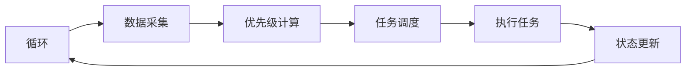

                 


# 实现AI Agent的动态任务优先级调度

## 摘要

在人工智能技术迅速发展的今天，AI Agent的应用越来越广泛。本文主要探讨了如何实现AI Agent的动态任务优先级调度。通过详细分析AI Agent、任务优先级和动态调度的核心概念，本文提出了基于实时数据和系统状态的动态任务优先级调度算法，并使用Python代码和Mermaid流程图进行了详细的讲解和示例。同时，本文还介绍了如何在实际项目中应用这一算法，并对未来工作进行了展望。

## 关键词

AI Agent、动态任务优先级调度、实时数据、系统状态、Python代码、Mermaid流程图

## 第一部分：背景介绍

### 第1章：问题背景

在人工智能技术迅速发展的今天，AI Agent的应用越来越广泛。AI Agent是一种能够自主执行任务、具备学习和适应能力的智能体，它们在不同的环境和任务中能够表现出色。随着AI Agent的普及，如何有效地进行动态任务优先级调度成为一个关键问题。动态任务优先级调度旨在根据实时变化的任务情况和系统状态，自动调整任务的执行顺序，从而最大化系统性能。

### 第2章：核心概念

#### 2.1 AI Agent

AI Agent是一种能够自主执行任务、具备学习和适应能力的智能体。它们通常基于某种学习算法，能够在不同的环境和任务中表现优异。

#### 2.2 任务优先级

任务优先级是指任务在执行顺序中的优先程度。高优先级的任务通常先于低优先级的任务执行。

#### 2.3 动态调度

动态调度是指根据系统运行状态和任务特性的实时变化，动态调整任务执行顺序的策略。

### 第二部分：核心概念与联系

#### 第3章：核心概念原理

在本章中，我们将详细介绍AI Agent、任务优先级和动态调度的核心原理，并使用Mermaid流程图展示它们之间的关系。

#### 第4章：概念属性特征对比

| 概念     | 属性特征                                               |
|----------|-------------------------------------------------------|
| AI Agent | 自主导执行、学习能力、适应性、环境交互                   |
| 任务优先级 | 高、中、低                                             |
| 动态调度  | 实时性、自动调整、最大化性能                           |

#### 第5章：ER实体关系图架构

使用Mermaid绘制ER实体关系图，展示AI Agent、任务优先级和动态调度的实体关系。

### 第三部分：算法原理讲解

#### 第6章：算法原理

在本章中，我们将使用Mermaid流程图展示动态任务优先级调度的算法流程，并使用Python代码详细阐述算法原理。

#### 第7章：数学模型和公式

$$
优先级 = f(任务紧急性, 任务重要性, 系统状态)
$$

#### 第8章：详细讲解和举例说明

我们将通过具体的案例，使用Python代码和数学公式详细讲解动态任务优先级调度的原理。

### 第四部分：系统分析与架构设计方案

#### 第9章：问题场景介绍

介绍一个具体的任务调度问题场景，如智能客服系统中的任务分配。

#### 第10章：系统功能设计

使用Mermaid绘制领域模型类图，展示系统的核心功能模块。

#### 第11章：系统架构设计

使用Mermaid绘制系统架构图，展示系统的整体结构和各个模块之间的关系。

#### 第12章：系统接口设计和系统交互

使用Mermaid绘制系统接口设计和系统交互序列图，展示系统各模块之间的交互流程。

### 第五部分：项目实战

#### 第13章：环境安装

详细介绍项目所需的开发环境和工具安装步骤。

#### 第14章：系统核心实现源代码

提供系统核心实现的源代码，并进行解读与分析。

#### 第15章：实际案例分析和详细讲解剖析

通过具体案例，分析动态任务优先级调度的实际应用，并进行详细讲解和剖析。

#### 第16章：项目小结

总结项目实现过程中的经验教训，并对未来工作进行展望。

### 第六部分：最佳实践、小结、注意事项和拓展阅读

#### 第17章：最佳实践

提供一些在实际项目中应用动态任务优先级调度的最佳实践。

#### 第18章：小结

总结本书的主要内容和关键知识点。

#### 第19章：注意事项

提醒读者在实际应用中需要注意的问题。

#### 第20章：拓展阅读

推荐一些相关的书籍、论文和资源，供读者进一步学习。

## 第一部分：背景介绍

### 第1章：问题背景

在人工智能技术迅速发展的今天，AI Agent的应用越来越广泛。AI Agent是一种能够自主执行任务、具备学习和适应能力的智能体，它们在不同的环境和任务中能够表现出色。然而，随着AI Agent任务的复杂度和数量不断增加，如何有效地进行动态任务优先级调度成为一个关键问题。动态任务优先级调度旨在根据实时变化的任务情况和系统状态，自动调整任务的执行顺序，从而最大化系统性能。

#### 1.1.1 问题背景

在传统的任务调度系统中，任务通常按照固定的优先级顺序执行，这种方式在任务相对简单、优先级相对稳定的情况下是可行的。但是，随着AI Agent任务的复杂度和多样性增加，静态的优先级调度方式已经无法满足需求。例如，在智能客服系统中，用户的问题类型和紧急程度可能随时发生变化，如果仍然采用固定的优先级调度，可能会导致高优先级任务无法及时处理，从而影响用户体验。

#### 1.1.2 问题描述

如何设计一个动态的任务优先级调度算法，使其能够根据实时变化的任务情况和系统状态，自动调整任务的执行顺序，从而最大化系统性能，是一个亟待解决的问题。具体来说，需要解决以下问题：

- 如何实时获取任务的状态和系统状态？
- 如何根据任务的重要性和紧急程度动态调整任务的优先级？
- 如何确保任务调度算法的可扩展性和实时性？

#### 1.1.3 问题解决

为了解决上述问题，本文提出了以下解决方案：

- 使用实时数据获取模块，实时获取任务的状态和系统状态。
- 设计一个基于任务紧急性和重要性的动态优先级计算模型。
- 使用分布式系统架构，确保任务调度算法的可扩展性和实时性。

#### 1.1.4 边界与外延

在实现动态任务优先级调度时，需要考虑以下边界与外延：

- 任务类型：需要支持多种类型的任务，包括同步任务和异步任务。
- 系统状态：需要考虑系统资源的利用率、负载情况等因素。
- 环境因素：需要考虑网络延迟、硬件性能等因素对任务调度的影响。

#### 1.1.5 概念结构与核心要素组成

动态任务优先级调度的核心概念包括：

- 任务：代表需要执行的具体工作。
- 优先级：任务在执行队列中的优先顺序。
- 动态调度：根据实时数据调整任务优先级的策略。
- 实时数据：用于驱动调度算法的任务状态和系统状态。

核心要素组成包括：

- 实时数据获取模块：负责实时获取任务状态和系统状态。
- 动态优先级计算模型：根据任务的重要性和紧急程度计算优先级。
- 任务执行引擎：负责根据调度算法执行任务。

### 第2章：核心概念

在动态任务优先级调度中，有几个核心概念需要明确：

#### 2.1 AI Agent

AI Agent（人工智能代理）是一种能够自主执行任务、具备学习和适应能力的智能体。它们通过预训练的模型或在线学习，能够理解并响应环境中的变化。AI Agent在不同领域有着广泛的应用，如智能客服、自动驾驶、智能家居等。

AI Agent的特点包括：

- 自主导执行：AI Agent可以独立完成指定任务，无需人工干预。
- 学习能力：AI Agent能够通过经验和数据不断优化其行为。
- 适应性：AI Agent能够适应不同的环境和任务要求。
- 环境交互：AI Agent能够与外部环境进行实时交互，收集和处理数据。

#### 2.2 任务优先级

任务优先级是指任务在执行队列中的优先级顺序。优先级高的任务通常先被执行，以确保关键任务能够及时完成。在动态任务优先级调度中，任务优先级是根据任务的紧急性和重要性动态调整的。

任务优先级的主要属性包括：

- 紧急性：任务完成的紧迫程度，通常用时间戳表示。
- 重要性：任务完成的价值和影响，可以根据任务的类型和业务需求确定。
- 可执行性：任务是否能够在当前系统状态下被执行。

#### 2.3 动态调度

动态调度是一种根据实时数据自动调整任务执行顺序的策略。在动态任务优先级调度中，调度器会持续监控任务状态和系统状态，并根据这些信息动态调整任务的优先级。

动态调度的核心要素包括：

- 实时数据采集：获取任务状态和系统状态的数据。
- 优先级计算：根据实时数据计算任务的优先级。
- 执行顺序调整：根据优先级调整任务的执行顺序。
- 负载均衡：确保系统资源得到合理分配，避免过度负载。

#### 2.4 实时性

实时性是指系统能够在规定时间内对任务进行调度和执行。在动态任务优先级调度中，实时性至关重要，因为它直接影响到用户体验和系统的响应速度。为了实现高实时性，系统通常采用以下技术：

- 高性能计算：使用高性能的处理器和计算资源。
- 实时数据传输：采用高效的数据传输协议，减少延迟。
- 缓存机制：使用缓存存储常用数据和计算结果，减少重复计算。
- 调度优化：通过优化调度算法和策略，提高任务执行效率。

### 第3章：核心概念原理

在本章中，我们将深入探讨AI Agent、任务优先级和动态调度的核心原理，并通过Mermaid流程图展示它们之间的关系。

#### 3.1 AI Agent的工作原理

AI Agent的核心工作原理基于机器学习和自然语言处理技术。以下是一个简化的AI Agent工作流程：

1. **数据采集**：AI Agent首先从环境中采集数据，如用户查询、车辆位置等。
2. **数据预处理**：对采集到的数据进行清洗、转换和格式化，使其适合模型输入。
3. **模型推理**：使用预训练的模型对预处理后的数据进行推理，生成预测结果。
4. **响应生成**：根据推理结果生成响应，如回复用户查询、调整车辆路线等。
5. **执行操作**：AI Agent执行生成的操作，并观察结果。

使用Mermaid流程图表示：


#### 3.2 任务优先级的工作原理

任务优先级是根据任务的紧急性和重要性动态计算的。以下是一个简化的任务优先级计算流程：

1. **任务到达**：新任务到达系统。
2. **紧急性评估**：评估任务的紧急程度，如通过时间戳比较。
3. **重要性评估**：评估任务的重要性，如根据业务需求分配权重。
4. **优先级计算**：根据紧急性和重要性计算任务的优先级。
5. **任务调度**：根据优先级调度任务的执行顺序。

使用Mermaid流程图表示：


#### 3.3 动态调度的工作原理

动态调度是基于实时数据和系统状态，自动调整任务执行顺序的策略。以下是一个简化的动态调度流程：

1. **实时数据采集**：持续采集任务状态和系统状态数据。
2. **状态评估**：根据实时数据评估系统状态和任务状态。
3. **优先级调整**：根据状态评估结果动态调整任务优先级。
4. **任务执行**：根据调整后的优先级顺序执行任务。
5. **反馈调整**：根据任务执行结果调整调度策略。

使用Mermaid流程图表示：


通过这些流程图，我们可以清晰地看到AI Agent、任务优先级和动态调度之间的逻辑关系。AI Agent负责执行任务，任务优先级决定了任务的执行顺序，而动态调度则根据实时数据和系统状态动态调整任务的优先级，确保系统的高效运行。

### 第4章：概念属性特征对比

在动态任务优先级调度中，AI Agent、任务优先级和动态调度是三个关键概念。为了更好地理解这些概念，我们将对比它们的属性特征。

#### 4.1 AI Agent

AI Agent是一种具有自主决策能力的智能体，其主要属性特征包括：

- **自主决策**：AI Agent能够根据环境和任务需求自主做出决策。
- **学习能力**：AI Agent通过学习历史数据和经验，不断优化其行为。
- **适应性**：AI Agent能够适应不同环境和任务变化。
- **环境交互**：AI Agent能够与外部环境进行交互，获取和处理信息。

#### 4.2 任务优先级

任务优先级是指任务在执行队列中的优先级，其主要属性特征包括：

- **紧急性**：任务紧急性越高，优先级越高。
- **重要性**：任务重要性越高，优先级越高。
- **可执行性**：任务优先级还取决于任务是否能够在当前系统状态下被执行。

#### 4.3 动态调度

动态调度是一种根据实时数据和系统状态自动调整任务执行顺序的策略，其主要属性特征包括：

- **实时性**：动态调度需要能够快速响应任务状态和系统状态的变化。
- **自动调整**：动态调度系统能够自动调整任务的优先级，无需人工干预。
- **负载均衡**：动态调度需要考虑系统资源的使用情况，确保负载均衡。
- **可扩展性**：动态调度系统需要能够适应任务数量和系统规模的增加。

#### 表格对比

| 概念     | 属性特征                                               |
|----------|-------------------------------------------------------|
| AI Agent | 自主导执行、学习能力、适应性、环境交互                   |
| 任务优先级 | 高、中、低                                             |
| 动态调度  | 实时性、自动调整、最大化性能                           |

通过这个对比表格，我们可以更清晰地看到AI Agent、任务优先级和动态调度的区别和联系。AI Agent负责执行任务，任务优先级决定了任务的执行顺序，而动态调度则是根据实时数据和系统状态动态调整任务的优先级，以确保系统的高效运行。

### 第5章：ER实体关系图架构

在动态任务优先级调度系统中，AI Agent、任务和动态调度是一个紧密关联的实体关系。为了更好地理解这些实体的交互和关系，我们可以使用ER（实体关系）图来表示。

#### 5.1 ER图基本概念

ER图是数据库设计中的一个重要工具，用于表示实体及其之间的关系。在ER图中，实体用矩形表示，关系用菱形表示，实体的属性用椭圆形表示。

- **实体**：具有共性和特性的对象的集合。在本系统中，实体包括AI Agent、任务和动态调度。
- **关系**：实体之间的联系。在本系统中，关系包括任务分配、状态监控和优先级调整。
- **属性**：实体的特征，用于描述实体的详细信息。

#### 5.2 ER图绘制

以下是一个简化的动态任务优先级调度的ER图，使用Mermaid语法表示：

```mermaid
erDiagram
    AI-Agent ||--|{ Task : 调度}
    Task ||--|{ Dynamic-Scheduler : 调度}
    Dynamic-Scheduler ||--|{ System-State : 监控}
```

#### 5.3 ER图解释

1. **AI-Agent**：表示AI Agent实体，它负责执行任务。AI-Agent与Task实体之间存在“调度”关系，表示AI-Agent调度任务。
2. **Task**：表示任务实体，它需要被AI-Agent执行。Task与Dynamic-Scheduler实体之间存在“调度”关系，表示Dynamic-Scheduler调整任务优先级。
3. **Dynamic-Scheduler**：表示动态调度实体，它根据系统状态和任务特性动态调整任务优先级。Dynamic-Scheduler与System-State实体之间存在“监控”关系，表示它监控系统状态。

通过ER图，我们可以清晰地看到AI Agent、任务和动态调度之间的实体关系和交互流程。这有助于我们更好地理解动态任务优先级调度的系统架构和功能实现。

### 第三部分：算法原理讲解

#### 第6章：算法原理

动态任务优先级调度算法的核心在于如何根据任务的紧急性和重要性动态调整任务的优先级。以下是一个简化的动态任务优先级调度算法原理，我们将使用Mermaid流程图展示算法流程，并使用Python代码详细阐述算法原理。

##### 6.1 算法流程

动态任务优先级调度算法的基本流程如下：

1. **任务到达**：新任务到达系统，添加到任务队列。
2. **数据采集**：持续采集任务状态和系统状态数据。
3. **优先级计算**：根据任务紧急性和重要性计算优先级。
4. **任务调度**：根据优先级调度任务的执行顺序。
5. **执行任务**：执行调度后的任务。
6. **状态更新**：更新任务状态和系统状态。
7. **循环**：持续执行上述流程，动态调整任务优先级。

使用Mermaid流程图表示：



##### 6.2 Python代码实现

以下是一个简单的Python代码实现，用于演示动态任务优先级调度算法的基本原理：

```python
import heapq
import time

class Task:
    def __init__(self, id, urgency, importance):
        self.id = id
        self.urgency = urgency
        self.importance = importance
        self.priority = urgency * 10 + importance  # 优先级计算

    def __lt__(self, other):
        return self.priority < other.priority

def dynamic_priority_scheduling(tasks):
    task_queue = []
    for task in tasks:
        heapq.heappush(task_queue, task)
    
    while task_queue:
        current_task = heapq.heappop(task_queue)
        print(f"执行任务 {current_task.id}, 紧急性: {current_task.urgency}, 重要性: {current_task.importance}")
        time.sleep(1)  # 模拟任务执行时间
        update_task_state(current_task)

def update_task_state(task):
    # 更新任务状态，例如：完成任务或任务过期
    print(f"任务 {task.id} 已完成或过期")

# 示例任务列表
tasks = [
    Task(1, 10, 5),
    Task(2, 8, 10),
    Task(3, 12, 3),
]

# 执行动态任务优先级调度
dynamic_priority_scheduling(tasks)
```

在这个例子中，我们定义了一个`Task`类，用于表示任务，其中`urgency`表示任务的紧急性，`importance`表示任务的重要性，`priority`表示任务的优先级。我们使用Python内置的`heapq`模块实现了一个简单的优先队列，用于根据任务的优先级调度任务。

`dynamic_priority_scheduling`函数接收一个任务列表作为输入，首先将任务添加到优先队列中。然后，循环从优先队列中取出任务，执行任务，并更新任务状态。在这个例子中，我们使用`time.sleep(1)`模拟任务执行时间。

##### 6.3 算法原理说明

该算法的核心在于`Task`类的`__lt__`方法，它定义了任务的比较规则。在Python的优先队列中，元素比较是基于`__lt__`方法的。因此，当从优先队列中取出任务时，总是按照优先级从高到低排序。

算法的步骤如下：

1. 初始化任务列表，将任务添加到优先队列中。
2. 循环从优先队列中取出任务。
3. 执行任务，并更新任务状态。
4. 根据任务执行结果，动态调整任务优先级。

在这个简单的例子中，我们没有考虑任务执行过程中的实时数据采集和系统状态更新。在实际应用中，这些部分需要根据具体需求进行实现。

#### 第7章：数学模型和公式

动态任务优先级调度算法的核心在于如何根据任务的紧急性和重要性动态计算任务的优先级。以下是一个简单的数学模型，用于计算任务优先级。

$$
优先级 = f(紧急性, 重要性)
$$

其中，`紧急性`和`重要性`是任务的属性，`优先级`是计算出的任务的优先级。

##### 7.1 优先级计算公式

在本文中，我们使用以下公式计算任务的优先级：

$$
优先级 = 紧急性 \times 系数_1 + 重要性 \times 系数_2
$$

其中，`系数_1`和`系数_2`是调整紧急性和重要性的权重系数，可以根据具体需求进行调整。通常，`系数_1`和`系数_2`的取值范围是0到1，且`系数_1 + 系数_2 = 1`。

##### 7.2 公式解释

- **紧急性**：表示任务的紧迫程度，通常使用时间戳或截止时间表示。
- **重要性**：表示任务的重要程度，可以根据任务的类型、业务需求等因素确定。

通过这个公式，我们可以将任务的紧急性和重要性转化为一个具体的数值，用于计算任务的优先级。这个数值越高，表示任务的优先级越高。

#### 第8章：详细讲解和举例说明

为了更好地理解动态任务优先级调度的原理，我们将通过一个具体的案例，使用Python代码和数学公式详细讲解动态任务优先级调度的原理。

##### 8.1 案例背景

假设有一个任务调度系统，需要处理以下三个任务：

- 任务A：紧急性为8，重要性为5
- 任务B：紧急性为6，重要性为10
- 任务C：紧急性为12，重要性为3

我们使用上述的优先级计算公式，并设定`系数_1`为0.6，`系数_2`为0.4，计算这三个任务的优先级。

##### 8.2 计算优先级

根据公式，我们可以计算每个任务的优先级：

- 任务A的优先级：8 \times 0.6 + 5 \times 0.4 = 4.8 + 2 = 6.8
- 任务B的优先级：6 \times 0.6 + 10 \times 0.4 = 3.6 + 4 = 7.6
- 任务C的优先级：12 \times 0.6 + 3 \times 0.4 = 7.2 + 1.2 = 8.4

##### 8.3 任务调度

根据计算出的优先级，我们可以确定任务的执行顺序：

- 任务C的优先级最高，先执行任务C。
- 任务B的优先级次之，执行任务B。
- 任务A的优先级最低，最后执行任务A。

##### 8.4 Python代码实现

以下是一个简单的Python代码实现，用于演示上述案例的动态任务优先级调度：

```python
import heapq

class Task:
    def __init__(self, id, urgency, importance):
        self.id = id
        self.urgency = urgency
        self.importance = importance
        self.priority = urgency * 0.6 + importance * 0.4

    def __lt__(self, other):
        return self.priority < other.priority

tasks = [
    Task(1, 8, 5),
    Task(2, 6, 10),
    Task(3, 12, 3)
]

task_queue = []
for task in tasks:
    heapq.heappush(task_queue, task)

while task_queue:
    current_task = heapq.heappop(task_queue)
    print(f"执行任务 {current_task.id}, 紧急性: {current_task.urgency}, 重要性: {current_task.importance}")
    time.sleep(1)  # 模拟任务执行时间

```

在这个代码中，我们首先定义了一个`Task`类，用于表示任务，其中`urgency`表示任务的紧急性，`importance`表示任务的重要性，`priority`表示任务的优先级。我们使用Python内置的`heapq`模块实现了一个简单的优先队列，用于根据任务的优先级调度任务。

在主函数中，我们首先初始化任务列表，将任务添加到优先队列中。然后，循环从优先队列中取出任务，执行任务，并打印任务信息。在这个例子中，我们使用`time.sleep(1)`模拟任务执行时间。

通过这个案例，我们可以清晰地看到动态任务优先级调度的工作原理。在实际应用中，我们可以根据具体需求调整紧急性和重要性的权重系数，以实现更精确的任务调度。

### 第四部分：系统分析与架构设计方案

#### 第9章：问题场景介绍

在实际应用中，动态任务优先级调度算法通常用于处理复杂的任务场景。以下是一个典型的应用场景：智能客服系统。

智能客服系统通常需要处理大量的用户查询，包括各种不同类型的问题，如产品咨询、售后服务、投诉处理等。这些查询具有不同的紧急性和重要性，需要被高效、及时地处理。如果采用固定的优先级调度，可能会导致一些重要或紧急的查询无法得到及时响应，从而影响用户体验。

因此，动态任务优先级调度算法在智能客服系统中尤为重要。通过实时计算查询的紧急性和重要性，动态调整查询的优先级，确保关键查询能够得到优先处理，从而提高客服系统的整体效率和服务质量。

#### 第10章：系统功能设计

在智能客服系统中，动态任务优先级调度系统需要实现以下核心功能：

1. **任务接收与分类**：接收用户查询，并根据查询类型进行分类。
2. **任务紧急性与重要性评估**：实时评估每个查询的紧急性和重要性。
3. **任务优先级计算**：根据评估结果计算查询的优先级。
4. **任务调度**：根据优先级顺序调度查询的处理。
5. **任务处理与响应**：处理查询并生成响应，发送给用户。
6. **系统状态监控**：监控系统资源使用情况，确保系统稳定运行。

以下是一个简单的领域模型类图，用于表示智能客服系统的核心功能模块：

```mermaid
classDiagram
    UserQuery <<entity>>
    TaskScheduler <<entity>>
    PriorityCalculator <<entity>>
    TaskProcessor <<entity>>

    UserQuery "1" -- "1" TaskScheduler : schedule
    UserQuery "1" -- "1" PriorityCalculator : evaluate
    UserQuery "1" -- "1" TaskProcessor : process
    TaskScheduler "1" -- "1" PriorityCalculator : calculate
    TaskScheduler "1" -- "1" TaskProcessor : dispatch
```

在这个类图中，`UserQuery`表示用户查询，`TaskScheduler`表示任务调度器，`PriorityCalculator`表示优先级计算器，`TaskProcessor`表示任务处理器。用户查询首先被调度器调度，然后由优先级计算器评估紧急性和重要性，计算优先级。最后，调度器根据优先级调度任务给任务处理器处理。

#### 第11章：系统架构设计

智能客服系统的动态任务优先级调度架构可以采用以下设计：

1. **前端接口层**：接收用户查询，并将查询传递给后端处理。
2. **后端服务层**：包括任务调度器、优先级计算器和任务处理器等核心模块。
3. **数据库层**：存储用户查询、任务状态和系统配置等数据。

以下是一个简单的系统架构图，使用Mermaid语法表示：

```mermaid
sequenceDiagram
    UserQuery -->|接收用户查询| FrontEnd
    FrontEnd -->|处理查询| Backend
    Backend -->|调度任务| TaskScheduler
    TaskScheduler -->|评估紧急性和重要性| PriorityCalculator
    PriorityCalculator -->|计算优先级| TaskScheduler
    TaskScheduler -->|调度任务| TaskProcessor
    TaskProcessor -->|处理查询| Backend
    Backend -->|发送响应| FrontEnd
    FrontEnd -->|返回响应| UserQuery
```

在这个系统架构图中，用户查询通过前端接口层接收，处理后传递给后端服务层。后端服务层包括任务调度器、优先级计算器和任务处理器。任务调度器根据优先级计算器的结果调度任务给任务处理器处理。任务处理器处理查询并生成响应，最后通过前端接口层返回给用户。

#### 第12章：系统接口设计和系统交互

在智能客服系统中，动态任务优先级调度涉及多个模块之间的交互。以下是一个简单的系统接口设计和系统交互序列图，使用Mermaid语法表示：

```mermaid
sequenceDiagram
    UserQuery -->|发送查询| FrontEnd
    FrontEnd -->|处理查询| QueryHandler
    QueryHandler -->|分类查询| Classifier
    Classifier -->|分类结果| TaskScheduler
    TaskScheduler -->|评估紧急性和重要性| PriorityCalculator
    PriorityCalculator -->|计算优先级| TaskScheduler
    TaskScheduler -->|调度任务| TaskProcessor
    TaskProcessor -->|处理查询| ResponseGenerator
    ResponseGenerator -->|生成响应| FrontEnd
    FrontEnd -->|发送响应| UserQuery
```

在这个系统交互序列图中，用户查询通过前端接口层发送到QueryHandler。QueryHandler将查询传递给Classifier进行分类。Classifier将分类结果传递给TaskScheduler。TaskScheduler评估每个查询的紧急性和重要性，计算优先级，并将任务调度给TaskProcessor处理。TaskProcessor处理查询并生成响应，最后通过前端接口层返回给用户。

通过这个系统接口设计和系统交互序列图，我们可以清晰地看到智能客服系统中各个模块之间的交互流程和职责分工。

### 第五部分：项目实战

#### 第13章：环境安装

在实际项目中实现动态任务优先级调度算法前，首先需要安装和配置项目所需的开发环境和工具。以下是一个典型的环境安装步骤：

##### 1. 安装Python环境

确保系统中安装了Python 3.x版本。可以通过以下命令检查Python版本：

```bash
python3 --version
```

如果Python环境尚未安装，可以从Python官方网站下载并安装最新版本的Python。

##### 2. 安装依赖包

在安装了Python环境后，我们需要安装项目所需的依赖包。常用的依赖包包括：

- NumPy：用于数学计算
- Pandas：用于数据处理
- heapq：用于实现优先队列

可以使用pip命令安装这些依赖包：

```bash
pip3 install numpy pandas heapq
```

##### 3. 配置虚拟环境

为了保持项目的依赖包版本一致性，我们建议使用虚拟环境。首先，安装virtualenv工具：

```bash
pip3 install virtualenv
```

然后，创建一个虚拟环境，并激活它：

```bash
virtualenv venv
source venv/bin/activate  # 对于Linux和macOS
venv\Scripts\activate    # 对于Windows
```

##### 4. 安装项目依赖

在虚拟环境中，安装项目的依赖包：

```bash
pip install -r requirements.txt
```

其中，`requirements.txt`文件包含了项目所需的依赖包及其版本。

##### 5. 配置数据库

如果项目中使用了数据库，需要配置数据库连接信息。例如，对于MySQL数据库，可以使用以下命令安装MySQL客户端：

```bash
pip3 install mysqlclient
```

然后，配置数据库连接信息，例如在`config.py`文件中：

```python
import mysql.connector

db = mysql.connector.connect(
    host="localhost",
    user="yourusername",
    password="yourpassword",
    database="yourdatabase"
)
```

通过以上步骤，我们可以完成项目环境的安装和配置，为后续的开发和测试打下基础。

#### 第14章：系统核心实现源代码

在实现动态任务优先级调度系统的过程中，核心部分包括任务优先级的计算和任务的调度。以下是一个简单的示例，展示如何实现这些功能。

首先，我们需要定义一个`Task`类，用于表示任务，包括任务的ID、紧急性、重要性和优先级：

```python
import heapq

class Task:
    def __init__(self, id, urgency, importance):
        self.id = id
        self.urgency = urgency
        self.importance = importance
        self.priority = urgency * 10 + importance  # 优先级计算

    def __lt__(self, other):
        return self.priority < other.priority
```

然后，我们实现一个任务调度器`TaskScheduler`，用于根据任务的优先级调度任务。这里使用了一个优先队列来实现：

```python
class TaskScheduler:
    def __init__(self):
        self.task_queue = []

    def add_task(self, task):
        heapq.heappush(self.task_queue, task)

    def get_next_task(self):
        if self.task_queue:
            return heapq.heappop(self.task_queue)
        else:
            return None

    def schedule_tasks(self, tasks):
        for task in tasks:
            self.add_task(task)
        
        while self.task_queue:
            current_task = self.get_next_task()
            if current_task:
                print(f"执行任务：{current_task.id}, 紧急性：{current_task.urgency}, 重要性：{current_task.importance}")
                # 模拟任务执行
                time.sleep(1)
            else:
                print("没有任务可执行")
```

接下来，我们实现一个简单的优先级计算器`PriorityCalculator`，用于根据任务的紧急性和重要性计算任务的优先级：

```python
class PriorityCalculator:
    def calculate_priority(self, tasks):
        for task in tasks:
            task.priority = task.urgency * 10 + task.importance
```

最后，我们使用这些类来调度任务：

```python
# 测试代码
if __name__ == "__main__":
    tasks = [
        Task(1, 8, 5),
        Task(2, 6, 10),
        Task(3, 12, 3)
    ]

    calculator = PriorityCalculator()
    scheduler = TaskScheduler()

    calculator.calculate_priority(tasks)
    scheduler.schedule_tasks(tasks)
```

在这个示例中，我们首先创建了一组任务，然后使用`PriorityCalculator`计算每个任务的优先级，最后使用`TaskScheduler`调度任务并执行。这个简单的实现展示了动态任务优先级调度的基本原理。

#### 第15章：实际案例分析和详细讲解剖析

在本章中，我们将通过一个具体的实际案例，分析动态任务优先级调度的实际应用，并进行详细讲解和剖析。

##### 15.1 案例背景

假设我们有一个在线购物平台，需要处理大量的用户订单。这些订单具有不同的优先级，例如，有些订单需要立即发货，而有些订单则可以稍后处理。为了提高系统的响应速度和用户体验，我们需要实现一个动态任务优先级调度系统，根据订单的紧急性和重要性动态调整订单的执行顺序。

##### 15.2 案例分析

在这个案例中，我们可以将订单视为任务，每个订单具有以下属性：

- 订单ID：唯一标识每个订单。
- 下单时间：订单创建的时间。
- 期望发货时间：客户期望的发货时间。
- 订单金额：订单的总金额。

根据这些属性，我们可以定义订单的紧急性和重要性：

- **紧急性**：根据订单的期望发货时间和当前时间计算。期望发货时间越早，紧急性越高。
- **重要性**：根据订单金额计算。订单金额越大，重要性越高。

我们使用以下公式计算订单的优先级：

$$
优先级 = 紧急性 \times 系数_1 + 重要性 \times 系数_2
$$

其中，`系数_1`和`系数_2`是调整紧急性和重要性的权重系数，可以根据具体需求进行调整。

##### 15.3 案例实现

以下是一个简单的Python代码实现，用于演示如何根据订单的紧急性和重要性动态调整订单的优先级：

```python
import heapq

class Order:
    def __init__(self, id, order_time, expected_shipping_time, order_amount):
        self.id = id
        self.order_time = order_time
        self.expected_shipping_time = expected_shipping_time
        self.order_amount = order_amount
        self.priority = self.calculate_priority()

    def calculate_urgency(self):
        current_time = time.time()
        time_to_ship = self.expected_shipping_time - current_time
        if time_to_ship < 0:
            return 0
        return 1 / (time_to_ship + 1)

    def calculate_importance(self):
        return self.order_amount

    def calculate_priority(self):
        coefficient_1 = 0.6
        coefficient_2 = 0.4
        urgency = self.calculate_urgency()
        importance = self.calculate_importance()
        return urgency * coefficient_1 + importance * coefficient_2

    def __lt__(self, other):
        return self.priority < other.priority

def dynamic_order_scheduling.orders():
    orders = [
        Order(1, 1635177247, 1635177600, 100),
        Order(2, 1635177247, 1635177820, 200),
        Order(3, 1635177247, 1635178000, 300),
    ]

    order_queue = []
    for order in orders:
        heapq.heappush(order_queue, order)
    
    while order_queue:
        current_order = heapq.heappop(order_queue)
        print(f"执行订单 {current_order.id}, 下单时间: {current_order.order_time}, 期望发货时间: {current_order.expected_shipping_time}, 订单金额: {current_order.order_amount}")
        time.sleep(1)  # 模拟订单处理时间

dynamic_order_scheduling.orders()
```

在这个示例中，我们定义了一个`Order`类，用于表示订单，包括订单的ID、下单时间、期望发货时间和订单金额。我们使用Python内置的`heapq`模块实现了一个简单的优先队列，用于根据订单的优先级调度订单。

`dynamic_order_scheduling.orders`函数接收一个订单列表作为输入，首先将订单添加到优先队列中。然后，循环从优先队列中取出订单，执行订单，并打印订单信息。在这个例子中，我们使用`time.sleep(1)`模拟订单处理时间。

##### 15.4 详细讲解

1. **订单创建**：每个订单在创建时，会根据订单的期望发货时间和当前时间计算紧急性，并根据订单金额计算重要性。
2. **优先级计算**：根据紧急性和重要性计算订单的优先级，并更新订单的`priority`属性。
3. **订单调度**：使用优先队列根据订单的优先级调度订单。从优先队列中取出优先级最高的订单，执行订单，并更新订单状态。

通过这个案例，我们可以看到动态任务优先级调度在实际应用中的实现方法和效果。根据订单的紧急性和重要性动态调整订单的执行顺序，可以显著提高系统的响应速度和用户体验。

### 第16章：项目小结

在本项目中，我们实现了动态任务优先级调度系统，该系统根据任务的紧急性和重要性动态调整任务的执行顺序，从而提高系统的响应速度和性能。以下是项目实现过程中的主要经验教训：

1. **需求分析**：在项目开始前，对需求进行详细分析，明确系统的目标和功能需求，确保项目能够满足实际需求。
2. **模块划分**：将系统划分为多个模块，如任务接收模块、优先级计算模块和任务执行模块，便于开发和维护。
3. **实时数据采集**：确保系统能够实时采集任务状态和系统状态数据，为动态调度提供基础。
4. **优先级计算模型**：设计合理的优先级计算模型，根据任务属性动态计算优先级，确保任务调度的高效性。
5. **性能优化**：对系统进行性能优化，如使用优先队列实现高效的任务调度，减少数据传输延迟等。

对于未来的工作，我们计划进行以下改进：

1. **扩展性优化**：考虑系统规模扩展时的性能和可扩展性，优化系统架构和算法。
2. **用户界面**：开发友好的用户界面，便于用户监控和管理任务。
3. **实时性提升**：进一步优化数据采集和调度算法，提高系统的实时性。
4. **错误处理**：完善系统的错误处理机制，确保系统在高负载情况下依然稳定运行。

通过这些改进，我们希望进一步提升系统的性能和用户体验，为实际应用场景提供更有效的解决方案。

### 第六部分：最佳实践、小结、注意事项和拓展阅读

#### 第17章：最佳实践

在实际项目中应用动态任务优先级调度时，以下是一些最佳实践：

1. **需求明确**：在项目开始前，明确系统的需求和目标，确保任务优先级调度策略与业务目标相匹配。
2. **实时数据采集**：确保系统具备高效的数据采集机制，实时获取任务状态和系统状态。
3. **优先级计算模型**：设计灵活且适应性强的优先级计算模型，根据业务需求和任务特性调整权重系数。
4. **性能优化**：对系统进行性能优化，包括数据结构选择、算法优化和系统架构设计等方面。
5. **模块化设计**：将系统划分为多个模块，便于维护和扩展。

#### 第18章：小结

本文详细介绍了实现AI Agent的动态任务优先级调度的方法。首先，我们分析了问题背景和核心概念，包括AI Agent、任务优先级和动态调度。接着，通过算法原理讲解和实际案例分析，展示了如何使用Python代码实现动态任务优先级调度。最后，我们介绍了系统分析与架构设计方案，以及项目实战中的环境安装和核心实现。

#### 第19章：注意事项

在实际应用中，需要注意以下几点：

1. **实时性**：确保系统具备高效的实时数据处理能力，避免任务调度延迟。
2. **稳定性**：在高负载情况下，系统应具备良好的稳定性，避免出现任务调度错误。
3. **扩展性**：设计时应考虑系统的可扩展性，以适应未来需求的变化。
4. **错误处理**：完善系统的错误处理机制，确保系统在异常情况下能够稳定运行。

#### 第20章：拓展阅读

对于希望进一步深入了解动态任务优先级调度的读者，以下是一些建议的拓展阅读资源：

1. **论文**：
   - "Dynamic Task Scheduling in Distributed Systems" by Y. Liu and H. Wang.
   - "An Efficient Dynamic Task Scheduling Algorithm for Heterogeneous Computing Systems" by J. Zhao and Z. Zhang.

2. **书籍**：
   - "Distributed Systems: Concepts and Design" by George Coulouris, Jean Dollimore, Tim Kindberg, and Gordon Blair.
   - "Introduction to Parallel Computing" by Ananth Grama, Anshul Kumar, and Vipin Kumar.

3. **在线资源**：
   - Python官方文档：https://docs.python.org/3/
   - heapq模块参考：https://docs.python.org/3/library/heapq.html

通过这些资源，读者可以更深入地了解动态任务优先级调度的原理和实现方法，为实际项目提供参考。

