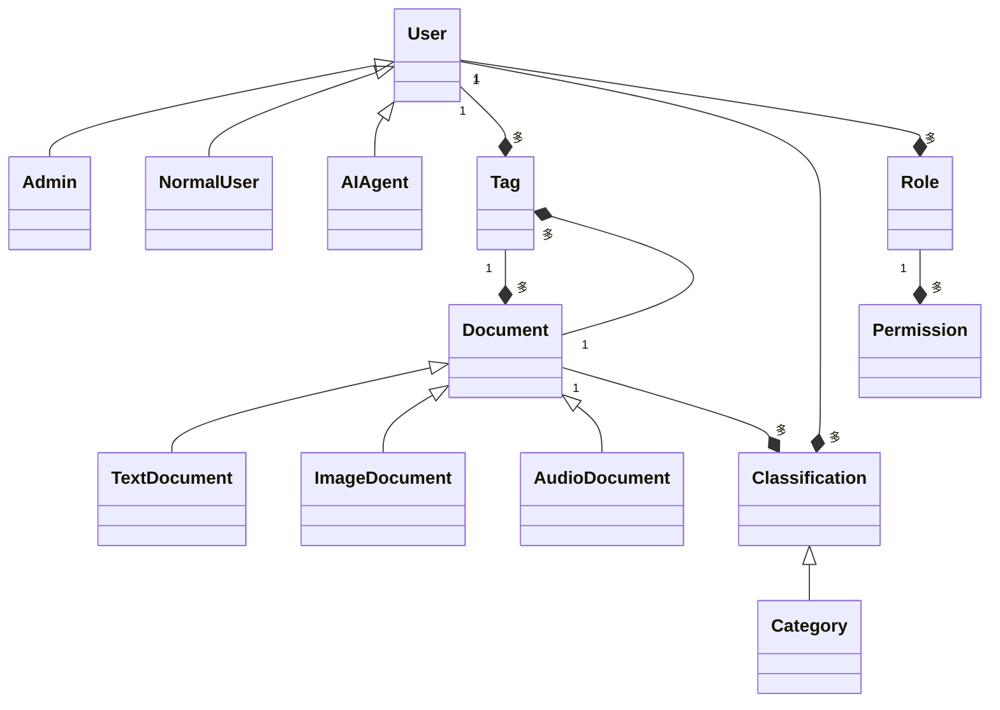
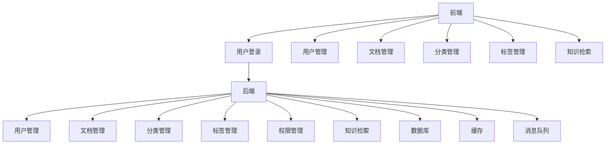
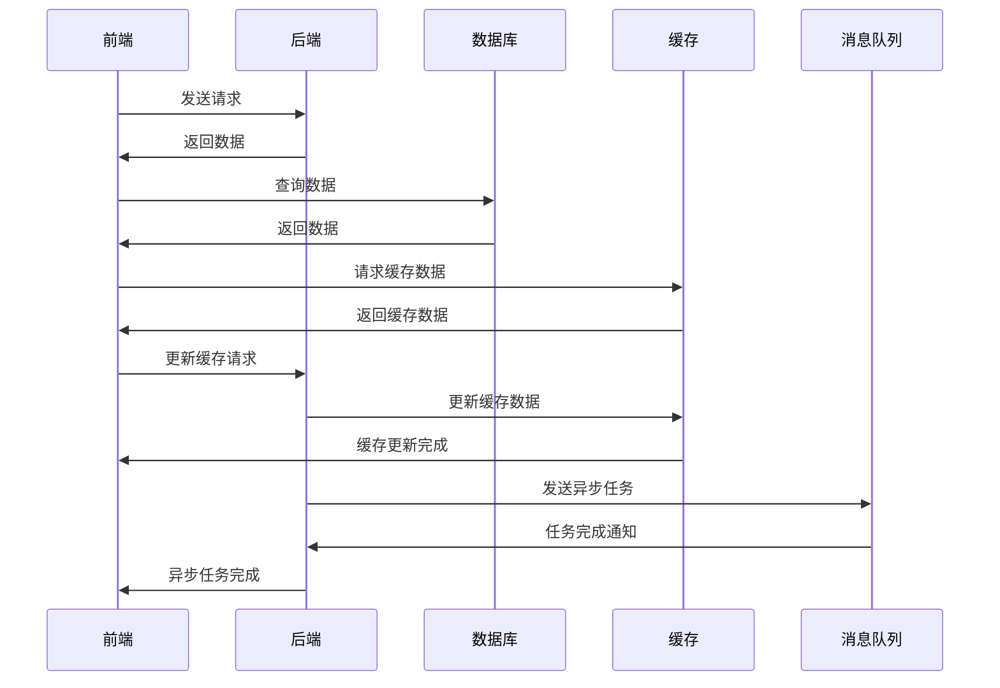
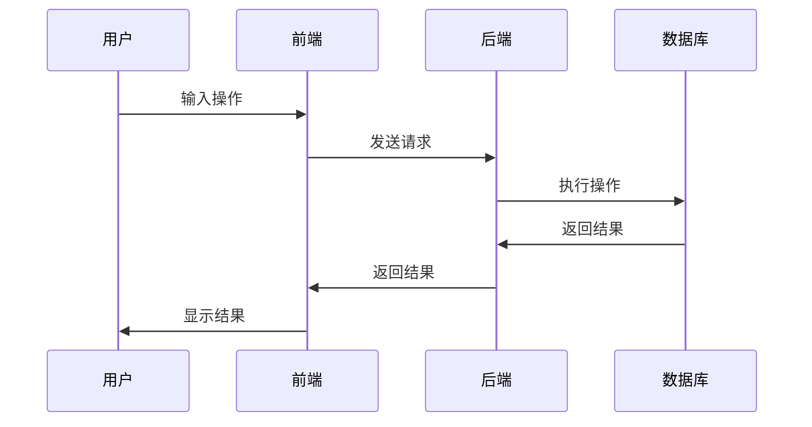
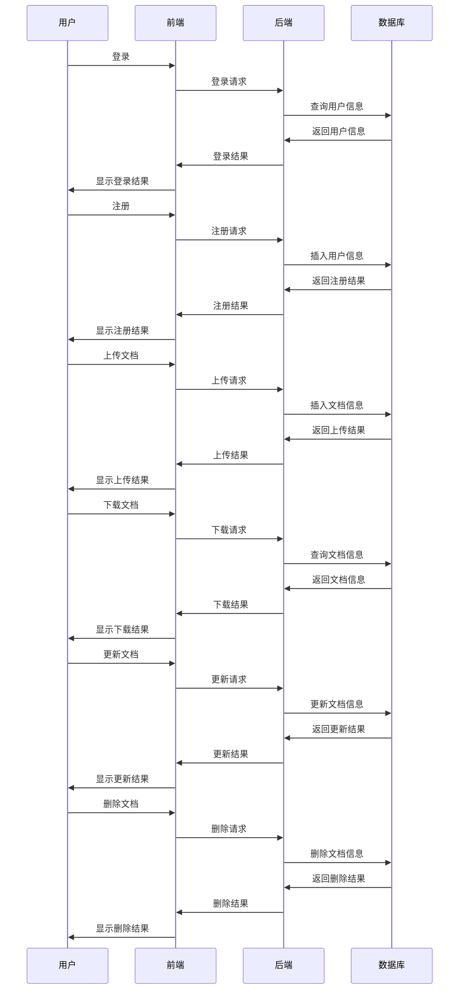

                 

### 文章标题：实现AI Agent的动态知识库管理系统

关键词：AI Agent、动态知识库、管理系统、算法、架构设计、项目实战

摘要：本文将深入探讨如何实现一个AI Agent的动态知识库管理系统。首先，我们将介绍AI Agent和动态知识库管理系统的基本概念，并分析现有系统的不足。接着，我们将讨论动态知识库管理系统的设计原则和实现方式。随后，我们将详细讲解AI Agent与动态知识库管理系统的关系，并介绍相关的算法原理。最后，我们将通过一个实际项目，展示如何实现并部署这个系统，并提供一些最佳实践技巧和未来展望。

### 目录大纲

----------------------------------------------------------------

# 实现AI Agent的动态知识库管理系统

## 第1章 背景介绍

### 1.1 问题背景

#### 1.1.1 AI Agent的定义与作用

#### 1.1.2 动态知识库管理系统的重要性

### 1.2 问题描述

#### 1.2.1 现有知识库管理系统的不足

#### 1.2.2 动态知识库管理系统的需求

### 1.3 问题解决

#### 1.3.1 动态知识库管理系统的设计原则

#### 1.3.2 AI Agent与知识库管理系统的融合方式

### 1.4 边界与外延

#### 1.4.1 系统功能的边界

#### 1.4.2 系统适用范围

## 第2章 核心概念与联系

### 2.1 AI Agent的概念与分类

#### 2.1.1 AI Agent的定义

#### 2.1.2 AI Agent的分类

### 2.2 动态知识库管理系统的概念

#### 2.2.1 动态知识库的定义

#### 2.2.2 动态知识库管理系统的功能

### 2.3 AI Agent与动态知识库管理系统的关系

#### 2.3.1 AI Agent在动态知识库管理系统中的应用

#### 2.3.2 动态知识库管理系统对AI Agent的支持

## 第3章 算法原理讲解

### 3.1 算法介绍

#### 3.1.1 常见算法概述

#### 3.1.2 算法选择与实现

### 3.2 数学模型与公式

#### 3.2.1 算法数学模型

#### 3.2.2 算法公式推导

### 3.3 算法流程图

#### 3.3.1 算法流程图示例

### 3.4 举例说明

#### 3.4.1 算法应用场景

#### 3.4.2 例子演示

## 第4章 系统分析与架构设计方案

### 4.1 问题场景介绍

#### 4.1.1 系统应用领域

#### 4.1.2 系统目标

### 4.2 项目介绍

#### 4.2.1 项目概述

#### 4.2.2 项目架构

### 4.3 系统功能设计

#### 4.3.1 领域模型

#### 4.3.2 系统功能模块

### 4.4 系统架构设计

#### 4.4.1 系统架构

#### 4.4.2 系统模块交互

### 4.5 系统接口设计

#### 4.5.1 接口规范

#### 4.5.2 接口实现

### 4.6 系统交互设计

#### 4.6.1 系统交互流程

#### 4.6.2 系统交互Mermaid序列图

## 第5章 项目实战

### 5.1 环境安装

#### 5.1.1 环境要求

#### 5.1.2 环境安装步骤

### 5.2 系统核心实现源代码

#### 5.2.1 源代码结构

#### 5.2.2 关键代码解读

### 5.3 代码应用解读与分析

#### 5.3.1 代码应用场景

#### 5.3.2 代码分析

### 5.4 实际案例分析与详细讲解

#### 5.4.1 案例选择

#### 5.4.2 案例分析

#### 5.4.3 案例讲解

### 5.5 项目小结

#### 5.5.1 项目总结

#### 5.5.2 项目展望

## 第6章 最佳实践 tips

### 6.1 系统优化技巧

#### 6.1.1 性能优化

#### 6.1.2 可靠性提升

### 6.2 系统部署与维护

#### 6.2.1 系统部署策略

#### 6.2.2 系统维护方法

## 第7章 小结与展望

### 7.1 小结

#### 7.1.1 内容回顾

#### 7.1.2 知识点总结

### 7.2 注意事项

#### 7.2.1 使用注意事项

#### 7.2.2 避免常见问题

### 7.3 拓展阅读

#### 7.3.1 相关书籍推荐

#### 7.3.2 学术论文推荐

----------------------------------------------------------------

接下来，我们将按照这个目录大纲，一步步深入探讨实现AI Agent的动态知识库管理系统的细节和方法。

### 第1章 背景介绍

#### 1.1 问题背景

##### 1.1.1 AI Agent的定义与作用

AI Agent，即人工智能代理，是指具有智能行为的计算机程序。它可以模拟人类智能，自主地完成特定的任务，并在任务执行过程中不断学习和适应。AI Agent在各个领域都有着广泛的应用，如自动驾驶、智能家居、智能客服等。它们通过感知环境、处理信息和决策，实现了对复杂问题的自动解决。

AI Agent的核心作用是模拟人类智能，提高工作效率，减轻人力负担。它们可以处理大量的数据，发现规律，提供决策支持，甚至在某些领域超越人类的表现。例如，在医疗领域，AI Agent可以通过分析患者数据，提供精准的诊断和治疗方案。

##### 1.1.2 动态知识库管理系统的重要性

动态知识库管理系统是一种用于存储、管理和检索知识库的系统。它能够动态地更新和扩展知识库内容，确保知识库的实时性和准确性。动态知识库管理系统在AI Agent中的应用至关重要，因为AI Agent的智能行为依赖于对知识库的访问和利用。

动态知识库管理系统的重要性体现在以下几个方面：

1. **知识存储**：动态知识库管理系统提供了存储大量知识的能力，使得AI Agent可以快速访问所需的知识信息。
2. **知识管理**：系统可以对知识库进行分类、整理和优化，确保知识的结构化和可访问性。
3. **知识更新**：系统支持动态更新知识库，使得AI Agent可以获取最新的知识信息，保持其智能行为的准确性。
4. **知识共享**：系统提供了知识共享机制，使得不同AI Agent可以相互学习和借鉴，提高整个系统的智能水平。

##### 1.2 问题描述

###### 1.2.1 现有知识库管理系统的不足

现有的知识库管理系统虽然在某些方面表现出色，但仍然存在一些不足之处，特别是在支持AI Agent方面：

1. **静态知识库**：大多数现有系统采用的是静态知识库，无法实时更新和扩展知识库内容，导致AI Agent无法获取最新的知识信息。
2. **数据孤岛**：知识库管理系统的数据与其他系统之间的数据交换困难，导致知识共享和整合困难。
3. **效率低下**：现有系统在处理大量数据时，效率较低，无法满足AI Agent对实时性的需求。
4. **扩展性差**：现有系统的扩展性较差，难以适应不断变化的应用需求。

###### 1.2.2 动态知识库管理系统的需求

为了解决现有知识库管理系统的不足，实现一个动态知识库管理系统变得尤为重要。动态知识库管理系统的需求包括：

1. **动态更新**：系统需要支持实时更新和扩展知识库内容，确保AI Agent获取最新的知识信息。
2. **数据整合**：系统需要能够与其他系统进行数据交换，实现知识共享和整合。
3. **高效处理**：系统需要具备高效的数据库处理能力，确保在处理大量数据时仍然保持较高的性能。
4. **灵活扩展**：系统需要具备良好的扩展性，能够适应不断变化的应用需求。

##### 1.3 问题解决

为了解决上述问题，我们需要设计并实现一个动态知识库管理系统，该系统应具备以下设计原则：

1. **实时性**：系统需要支持实时更新和扩展知识库内容，确保AI Agent能够获取最新的知识信息。
2. **灵活性**：系统需要具备良好的扩展性，能够适应不同的应用场景和需求。
3. **高效性**：系统需要具备高效的数据库处理能力，确保在处理大量数据时仍然保持较高的性能。
4. **安全性**：系统需要提供完善的安全机制，确保知识库的数据安全和完整性。

###### 1.3.2 AI Agent与知识库管理系统的融合方式

为了实现AI Agent与知识库管理系统的无缝融合，我们需要采用以下方式：

1. **接口设计**：系统需要提供统一且易用的接口，使得AI Agent能够方便地访问和操作知识库。
2. **数据模型**：系统需要设计合理的数据模型，确保知识库的内容结构化和可访问性。
3. **智能代理**：系统需要支持智能代理，使得AI Agent能够根据任务需求自主地获取、更新和利用知识库信息。
4. **协同工作**：系统需要支持AI Agent之间的协同工作，实现知识共享和智能行为的优化。

##### 1.4 边界与外延

###### 1.4.1 系统功能的边界

动态知识库管理系统的功能边界包括：

1. **知识存储**：系统需要支持大规模知识库的存储和管理，确保知识的结构化和可访问性。
2. **知识更新**：系统需要支持实时更新和扩展知识库内容，确保AI Agent获取最新的知识信息。
3. **知识检索**：系统需要提供高效的知识检索功能，使得AI Agent能够快速找到所需的知识信息。
4. **知识共享**：系统需要支持知识共享和整合，实现不同AI Agent之间的知识协作。

###### 1.4.2 系统适用范围

动态知识库管理系统适用于以下场景：

1. **AI应用**：在自动驾驶、智能家居、智能客服等AI应用领域，系统可以帮助AI Agent更好地处理复杂问题，提高智能水平。
2. **企业知识管理**：在企业内部，系统可以帮助企业更好地管理和利用知识资源，提高工作效率和创新能力。
3. **教育领域**：在教育领域，系统可以帮助学生和教师更好地获取和利用知识，提高学习效果和教学质量。

### 第2章 核心概念与联系

#### 2.1 AI Agent的概念与分类

##### 2.1.1 AI Agent的定义

AI Agent是指具有自主智能行为和执行能力的计算机程序。它们可以模拟人类智能，通过感知环境、处理信息和决策，实现特定任务的自动执行。AI Agent的核心特点是自主性、自适应性和交互性。

AI Agent的定义可以从以下几个方面进行理解：

1. **自主性**：AI Agent可以独立执行任务，不需要人工干预。
2. **自适应性**：AI Agent可以根据环境变化和任务需求，自主调整其行为和策略。
3. **交互性**：AI Agent可以与其他系统、人和环境进行交互，获取信息和资源。

##### 2.1.2 AI Agent的分类

根据不同的分类标准，AI Agent可以有不同的分类方法。以下是几种常见的分类方法：

1. **基于任务分类**：根据AI Agent执行的任务，可以将它们分为以下几类：
   - 监控类：如智能监控、安防系统等。
   - 交互类：如智能客服、智能家居等。
   - 执行类：如自动驾驶、机器人等。
   - 分析类：如智能分析、数据挖掘等。

2. **基于智能水平分类**：根据AI Agent的智能水平，可以将它们分为以下几类：
   - 感知智能：如人脸识别、语音识别等。
   - 认知智能：如自然语言处理、图像识别等。
   - 创造智能：如人工智能艺术创作、自动编程等。

3. **基于应用领域分类**：根据AI Agent的应用领域，可以将它们分为以下几类：
   - 工业领域：如工业机器人、智能生产线等。
   - 医疗领域：如智能诊断、智能药物设计等。
   - 金融领域：如智能投资、智能风控等。
   - 教育领域：如智能教学、智能学习等。

##### 2.1.3 AI Agent的特点

AI Agent具有以下特点：

1. **自主学习**：AI Agent可以通过机器学习和深度学习等技术，从数据中自动学习和获取知识。
2. **自适应行为**：AI Agent可以根据环境变化和任务需求，自主调整其行为和策略。
3. **智能决策**：AI Agent可以通过分析数据和信息，做出智能的决策和选择。
4. **实时交互**：AI Agent可以与其他系统、人和环境进行实时交互，获取信息和资源。

##### 2.1.4 AI Agent的应用场景

AI Agent在以下应用场景中具有广泛的应用：

1. **智能家居**：AI Agent可以通过感知环境，实现智能控制家电、照明、安全等功能。
2. **智能客服**：AI Agent可以模拟人类客服，实现智能回答用户问题、提供解决方案等功能。
3. **自动驾驶**：AI Agent可以通过感知道路和环境，实现自动驾驶、自动避障等功能。
4. **智能医疗**：AI Agent可以通过分析患者数据，提供智能诊断、智能治疗等功能。
5. **工业自动化**：AI Agent可以通过感知生产线状态，实现智能监控、智能调度等功能。

#### 2.2 动态知识库管理系统的概念

##### 2.2.1 动态知识库的定义

动态知识库是指一种能够实时更新、扩展和优化的知识库，它能够存储、管理和检索各种形式的知识，如文本、图像、音频等。动态知识库的特点是实时性和灵活性，能够满足AI Agent对知识库的实时访问和动态更新需求。

动态知识库的定义可以从以下几个方面进行理解：

1. **实时性**：动态知识库能够实时更新和扩展知识库内容，确保AI Agent获取最新的知识信息。
2. **灵活性**：动态知识库能够适应不同的知识形式和应用场景，提供灵活的知识存储和管理方式。
3. **扩展性**：动态知识库能够支持大规模知识库的存储和管理，确保知识库的扩展性和可维护性。
4. **可访问性**：动态知识库提供了高效的检索机制，使得AI Agent能够快速找到所需的知识信息。

##### 2.2.2 动态知识库管理系统的功能

动态知识库管理系统的功能主要包括以下几个方面：

1. **知识存储**：系统需要支持大规模知识库的存储和管理，确保知识的结构化和可访问性。
2. **知识更新**：系统需要支持实时更新和扩展知识库内容，确保AI Agent获取最新的知识信息。
3. **知识检索**：系统需要提供高效的知识检索功能，使得AI Agent能够快速找到所需的知识信息。
4. **知识共享**：系统需要支持知识共享和整合，实现不同AI Agent之间的知识协作。
5. **知识优化**：系统需要支持知识库的优化和整理，提高知识库的结构化和可访问性。

##### 2.2.3 动态知识库管理系统的特点

动态知识库管理系统具有以下特点：

1. **实时性**：系统支持实时更新和扩展知识库内容，确保AI Agent获取最新的知识信息。
2. **灵活性**：系统能够适应不同的知识形式和应用场景，提供灵活的知识存储和管理方式。
3. **扩展性**：系统支持大规模知识库的存储和管理，确保知识库的扩展性和可维护性。
4. **高效性**：系统提供了高效的知识检索机制，使得AI Agent能够快速找到所需的知识信息。
5. **安全性**：系统提供了完善的安全机制，确保知识库的数据安全和完整性。

##### 2.2.4 动态知识库管理系统的应用场景

动态知识库管理系统在以下应用场景中具有广泛的应用：

1. **AI应用**：在自动驾驶、智能家居、智能客服等AI应用领域，系统可以帮助AI Agent更好地处理复杂问题，提高智能水平。
2. **企业知识管理**：在企业内部，系统可以帮助企业更好地管理和利用知识资源，提高工作效率和创新能力。
3. **教育领域**：在教育领域，系统可以帮助学生和教师更好地获取和利用知识，提高学习效果和教学质量。

#### 2.3 AI Agent与动态知识库管理系统的关系

##### 2.3.1 AI Agent在动态知识库管理系统中的应用

AI Agent在动态知识库管理系统中的应用主要体现在以下几个方面：

1. **知识获取**：AI Agent可以通过动态知识库管理系统获取最新的知识信息，提高其智能水平。
2. **知识更新**：AI Agent可以参与知识库的更新和优化，提供新的知识和观点，丰富知识库内容。
3. **知识共享**：AI Agent可以通过动态知识库管理系统与其他AI Agent进行知识共享和协作，实现知识整合和优化。
4. **知识利用**：AI Agent可以通过动态知识库管理系统利用知识库中的知识，实现智能决策和任务执行。

##### 2.3.2 动态知识库管理系统对AI Agent的支持

动态知识库管理系统对AI Agent的支持主要体现在以下几个方面：

1. **知识库存储**：系统提供了大规模知识库的存储和管理能力，确保AI Agent能够获取到丰富的知识信息。
2. **知识检索**：系统提供了高效的知识检索机制，使得AI Agent能够快速找到所需的知识信息。
3. **知识更新**：系统支持实时更新和扩展知识库内容，确保AI Agent能够获取最新的知识信息。
4. **知识共享**：系统支持AI Agent之间的知识共享和协作，实现知识整合和优化。
5. **安全性**：系统提供了完善的安全机制，确保知识库的数据安全和完整性。

##### 2.3.3 AI Agent与动态知识库管理系统的协同工作

AI Agent与动态知识库管理系统的协同工作主要体现在以下几个方面：

1. **知识获取**：AI Agent通过动态知识库管理系统获取知识，并利用这些知识进行任务执行和决策。
2. **知识更新**：AI Agent通过动态知识库管理系统更新和优化知识库内容，提供新的知识和观点。
3. **知识共享**：AI Agent通过动态知识库管理系统与其他AI Agent进行知识共享和协作，实现知识整合和优化。
4. **知识利用**：AI Agent通过动态知识库管理系统利用知识库中的知识，提高其智能水平和任务执行效果。

#### 2.4 动态知识库管理系统的关键技术

##### 2.4.1 数据存储技术

数据存储技术是动态知识库管理系统的核心，它负责存储和管理大规模的知识库内容。常见的数据存储技术包括关系数据库、NoSQL数据库、分布式存储系统等。

1. **关系数据库**：关系数据库具有成熟的技术体系和丰富的功能，适用于存储结构化数据。常见的开源关系数据库有MySQL、PostgreSQL等。
2. **NoSQL数据库**：NoSQL数据库具有高扩展性和高性能的特点，适用于存储非结构化或半结构化数据。常见的NoSQL数据库有MongoDB、Cassandra等。
3. **分布式存储系统**：分布式存储系统具有高可用性和高性能的特点，适用于存储大规模数据。常见的分布式存储系统有Hadoop、HBase等。

##### 2.4.2 数据检索技术

数据检索技术是动态知识库管理系统的重要组成部分，它负责快速找到用户所需的知识信息。常见的数据检索技术包括全文检索、关键字检索、图检索等。

1. **全文检索**：全文检索技术能够对文本进行全文检索，找到用户所需的信息。常见的全文检索引擎有Elasticsearch、Solr等。
2. **关键字检索**：关键字检索技术能够根据用户输入的关键字，快速找到相关的知识信息。常见的关键字检索系统有搜索引擎、知识库搜索等。
3. **图检索**：图检索技术能够基于知识图谱，找到用户所需的知识信息。常见的图检索系统有Neo4j、JanusGraph等。

##### 2.4.3 数据处理技术

数据处理技术是动态知识库管理系统的关键，它负责对知识库中的数据进行处理和分析。常见的数据处理技术包括数据清洗、数据转换、数据分析等。

1. **数据清洗**：数据清洗技术能够去除数据中的噪声和错误，提高数据的质量。常见的数据清洗工具有Pandas、Scikit-learn等。
2. **数据转换**：数据转换技术能够将不同格式的数据进行转换，实现数据格式的兼容。常见的数据转换工具有Transform、Datastage等。
3. **数据分析**：数据分析技术能够对知识库中的数据进行统计和分析，发现数据中的规律和趋势。常见的数据分析工具有Excel、Python等。

##### 2.4.4 数据安全技术

数据安全技术是动态知识库管理系统的关键，它负责保护知识库的数据安全和完整性。常见的数据安全技术包括数据加密、访问控制、防火墙等。

1. **数据加密**：数据加密技术能够对知识库中的数据进行加密，防止数据被未授权访问。常见的数据加密算法有AES、RSA等。
2. **访问控制**：访问控制技术能够根据用户的角色和权限，控制用户对知识库的访问权限。常见的访问控制机制有ACL、RBAC等。
3. **防火墙**：防火墙技术能够防止外部攻击和恶意访问，保护知识库的安全。常见的防火墙有Nginx、iptables等。

#### 2.5 动态知识库管理系统的架构设计

##### 2.5.1 系统架构设计原则

动态知识库管理系统的架构设计应遵循以下原则：

1. **模块化**：系统应采用模块化设计，将不同的功能模块独立开发和管理，提高系统的可维护性和可扩展性。
2. **分布式**：系统应采用分布式架构，将不同的功能模块部署在多个节点上，提高系统的性能和可靠性。
3. **高可用性**：系统应具备高可用性，确保在故障发生时，系统能够快速恢复，降低系统的中断时间和影响。
4. **安全性**：系统应具备完善的安全机制，确保知识库的数据安全和完整性。

##### 2.5.2 系统架构设计

动态知识库管理系统的架构设计可以分为以下几个层次：

1. **数据存储层**：数据存储层负责存储和管理知识库数据，包括关系数据库、NoSQL数据库和分布式存储系统等。
2. **数据处理层**：数据处理层负责对知识库中的数据进行处理和分析，包括数据清洗、数据转换和数据分析等。
3. **数据检索层**：数据检索层负责提供高效的知识检索功能，包括全文检索、关键字检索和图检索等。
4. **应用层**：应用层负责提供动态知识库管理系统的主要功能，包括知识存储、知识更新、知识检索和知识共享等。
5. **安全层**：安全层负责提供数据安全保护功能，包括数据加密、访问控制和防火墙等。

##### 2.5.3 系统模块交互

动态知识库管理系统的各个模块之间需要进行密切的交互和协作，实现系统的整体功能。以下是各个模块之间的交互关系：

1. **数据存储层与数据处理层**：数据处理层需要从数据存储层获取知识库数据，并进行数据清洗、数据转换和数据分析等处理。
2. **数据处理层与数据检索层**：数据处理层需要将处理后的数据传递给数据检索层，实现高效的知识检索功能。
3. **数据检索层与应用层**：数据检索层需要将检索结果传递给应用层，为用户提供知识检索服务。
4. **应用层与安全层**：应用层需要与安全层进行交互，实现用户认证、访问控制和数据加密等安全功能。

#### 2.6 动态知识库管理系统的实现过程

##### 2.6.1 需求分析

在实现动态知识库管理系统之前，首先需要对系统的需求进行分析。需求分析包括以下几个方面：

1. **功能需求**：分析系统需要实现的主要功能，如知识存储、知识更新、知识检索和知识共享等。
2. **性能需求**：分析系统的性能需求，如数据存储容量、数据检索速度和系统并发处理能力等。
3. **安全性需求**：分析系统的安全性需求，如数据加密、访问控制和防火墙等。

##### 2.6.2 系统设计

根据需求分析的结果，进行系统的设计。系统设计包括以下几个方面：

1. **数据模型设计**：设计知识库的数据模型，确定数据的存储结构和关系。
2. **模块划分**：将系统划分为不同的功能模块，明确各个模块的职责和接口。
3. **系统架构设计**：设计系统的架构，确定各个模块之间的交互关系和协作方式。

##### 2.6.3 系统开发

根据系统设计的结果，进行系统的开发。系统开发包括以下几个方面：

1. **代码编写**：根据模块划分和接口设计，编写各个模块的代码。
2. **集成测试**：将各个模块进行集成测试，确保系统能够正常运行。
3. **系统部署**：将系统部署到生产环境，确保系统能够对外提供服务。

##### 2.6.4 系统优化

在系统部署后，根据系统的运行情况和用户反馈，对系统进行优化。系统优化包括以下几个方面：

1. **性能优化**：通过调整系统参数、优化数据库查询等手段，提高系统的性能。
2. **功能优化**：根据用户需求，对系统功能进行扩展和优化。
3. **安全性优化**：通过加强数据加密、访问控制等手段，提高系统的安全性。

#### 2.7 动态知识库管理系统的应用案例

##### 2.7.1 案例一：企业知识管理

某大型企业引入动态知识库管理系统，用于管理和利用企业内部的知识资源。通过动态知识库管理系统，企业实现了以下目标：

1. **知识存储**：将企业内部的各种知识，如文档、报告、案例等，存储在知识库中，实现知识的结构化和系统化。
2. **知识更新**：定期更新知识库内容，确保知识的实时性和准确性。
3. **知识共享**：实现企业内部的知识共享，提高员工的协同工作效率。
4. **知识利用**：利用知识库中的知识，为企业的决策提供支持，提高企业的创新能力。

##### 2.7.2 案例二：智能客服系统

某企业开发了一套智能客服系统，通过动态知识库管理系统提供知识支持。智能客服系统实现了以下功能：

1. **知识存储**：将常见问题、解决方案等存储在知识库中，实现智能客服的知识库建设。
2. **知识更新**：定期更新知识库内容，确保智能客服能够提供最新的解决方案。
3. **知识检索**：通过知识库管理系统，智能客服能够快速找到相关的问题和解决方案。
4. **知识共享**：智能客服系统与其他系统进行知识共享，实现企业内部的知识整合。

#### 2.8 动态知识库管理系统的未来发展趋势

随着人工智能技术的快速发展，动态知识库管理系统在未来将会得到更广泛的应用。以下是动态知识库管理系统的未来发展趋势：

1. **智能化**：动态知识库管理系统将更加智能化，能够自动获取、更新和利用知识，提高系统的自主性和自适应能力。
2. **大规模化**：动态知识库管理系统将支持大规模数据存储和管理，能够处理海量的知识信息。
3. **开放性**：动态知识库管理系统将更加开放，支持与其他系统进行数据交换和协作，实现知识的共享和整合。
4. **安全性**：动态知识库管理系统将提供更完善的安全机制，确保知识库的数据安全和完整性。
5. **多样性**：动态知识库管理系统将支持多种知识形式，如文本、图像、音频、视频等，实现知识的多样化存储和利用。

### 第3章 算法原理讲解

#### 3.1 算法介绍

##### 3.1.1 常见算法概述

在动态知识库管理系统中，常见的算法包括以下几种：

1. **文本分类算法**：文本分类算法用于将文本数据分类到不同的类别中，如情感分析、主题分类等。常见的文本分类算法有朴素贝叶斯、支持向量机、随机森林等。
2. **聚类算法**：聚类算法用于将相似的数据点归为一类，如K-means、DBSCAN、层次聚类等。聚类算法在知识库管理系统中用于数据分析和挖掘，发现数据中的模式和规律。
3. **推荐算法**：推荐算法用于根据用户的历史行为和偏好，为用户推荐相关的内容或服务。常见的推荐算法有协同过滤、基于内容的推荐等。
4. **自然语言处理算法**：自然语言处理算法用于对自然语言文本进行语义分析和理解，如分词、词性标注、实体识别等。自然语言处理算法在知识库管理系统中用于知识抽取和语义分析。
5. **知识图谱构建算法**：知识图谱构建算法用于将知识库中的数据构建成图谱形式，如基于图嵌入的算法、基于知识图谱的推理算法等。

##### 3.1.2 算法选择与实现

在动态知识库管理系统中，算法的选择和实现需要考虑以下几个方面：

1. **算法性能**：算法的执行效率和性能是关键因素，需要选择合适的算法，确保系统能够快速处理大规模数据。
2. **算法可扩展性**：算法需要具有良好的可扩展性，能够支持不同规模和类型的数据。
3. **算法适用性**：算法需要适用于具体的业务场景，满足知识库管理系统的需求。
4. **算法可维护性**：算法的实现需要易于维护和更新，确保系统能够长期稳定运行。

#### 3.2 数学模型与公式

##### 3.2.1 算法数学模型

不同类型的算法有不同的数学模型。以下是几种常见算法的数学模型：

1. **朴素贝叶斯分类器**：

   朴素贝叶斯分类器的数学模型基于贝叶斯定理，公式如下：

   $$
   P(C_k|X) = \frac{P(X|C_k)P(C_k)}{P(X)}
   $$

   其中，$P(C_k|X)$表示给定特征向量$X$时，类别$C_k$的概率；$P(X|C_k)$表示在类别$C_k$下特征向量$X$的概率；$P(C_k)$表示类别$C_k$的概率；$P(X)$表示特征向量$X$的概率。

2. **支持向量机（SVM）**：

   支持向量机的数学模型基于最大间隔分类原理，公式如下：

   $$
   \min\limits_{\omega, b} \frac{1}{2}||\omega||^2 \\
   s.t. \ y_i(\omega \cdot x_i + b) \geq 1
   $$

   其中，$\omega$表示权重向量，$b$表示偏置项，$x_i$表示特征向量，$y_i$表示类别标签。

3. **K-means聚类**：

   K-means聚类的数学模型基于距离最小化原则，公式如下：

   $$
   \min\limits_{\mu_1, \mu_2, ..., \mu_k} \sum_{i=1}^k \sum_{x \in S_i} ||x - \mu_i||^2
   $$

   其中，$\mu_i$表示聚类中心，$S_i$表示第$i$个聚类集合。

4. **协同过滤**：

   协同过滤的数学模型基于矩阵分解原理，公式如下：

   $$
   R_{ui} = \hat{R}_{ui} + \epsilon_{ui}
   $$

   $$
   \hat{R}_{ui} = \sum_{j \in N_i} r_{uj} p_j + \sum_{j \in M_i} p_j q_j
   $$

   其中，$R_{ui}$表示用户$i$对项目$j$的实际评分，$\hat{R}_{ui}$表示预测评分，$p_j$表示项目$j$的隐含特征向量，$q_i$表示用户$i$的隐含特征向量，$N_i$和$M_i$分别表示与项目$j$相关的用户集合和与用户$i$相关的项目集合。

##### 3.2.2 算法公式推导

以下是几种常见算法的公式推导：

1. **朴素贝叶斯分类器**：

   根据贝叶斯定理，给定特征向量$X$和类别$C_k$，有：

   $$
   P(C_k|X) = \frac{P(X|C_k)P(C_k)}{P(X)}
   $$

   由于特征向量$X$是各个特征的概率分布，可以表示为：

   $$
   P(X|C_k) = \prod_{i=1}^n P(x_i|C_k)
   $$

   同样，类别$C_k$的概率可以表示为：

   $$
   P(C_k) = \frac{C_k}{N}
   $$

   其中，$N$表示总类别数。将这些公式代入贝叶斯定理中，可以得到：

   $$
   P(C_k|X) = \frac{\prod_{i=1}^n P(x_i|C_k) \cdot \frac{C_k}{N}}{\sum_{j=1}^n \prod_{i=1}^n P(x_i|C_j) \cdot \frac{C_j}{N}}
   $$

   由于$P(X)$在分类过程中是一个常数，可以忽略。因此，朴素贝叶斯分类器的决策规则为：

   $$
   \hat{C}(X) = \arg \max_{C_k} P(C_k|X)
   $$

2. **支持向量机（SVM）**：

   支持向量机的目标是找到最优的分类超平面，使得分类间隔最大化。假设超平面为$w \cdot x + b = 0$，其中$w$为权重向量，$x$为特征向量，$b$为偏置项。分类间隔可以表示为：

   $$
   \gamma = \min_{i=1}^n \left(1 - y_i(w \cdot x_i + b)\right)
   $$

   其中，$y_i$为类别标签。为了求解最优超平面，需要对$\gamma$进行优化，即：

   $$
   \max_{w, b} \gamma \\
   s.t. \ y_i(w \cdot x_i + b) \geq 1
   $$

   通过拉格朗日乘子法，可以得到SVM的优化目标：

   $$
   L(w, b, \alpha) = \frac{1}{2}||w||^2 - \sum_{i=1}^n \alpha_i [y_i(w \cdot x_i + b) - 1]
   $$

   其中，$\alpha_i$为拉格朗日乘子。对$w$和$b$求导并令导数为0，可以得到：

   $$
   w = \sum_{i=1}^n \alpha_i y_i x_i \\
   0 = \sum_{i=1}^n \alpha_i y_i
   $$

   将$w$代入原始优化目标中，可以得到：

   $$
   \min_{\alpha} \frac{1}{2} \sum_{i=1}^n \alpha_i - \sum_{i=1}^n \alpha_i y_i
   $$

   其中，约束条件为$\alpha_i \geq 0$。通过求解这个优化问题，可以得到SVM的决策规则。

3. **K-means聚类**：

   K-means聚类的目标是找到$k$个聚类中心，使得每个聚类中心与其聚类成员之间的距离之和最小。假设聚类中心为$\mu_1, \mu_2, ..., \mu_k$，聚类成员为$x_1, x_2, ..., x_n$，则目标函数可以表示为：

   $$
   \min\limits_{\mu_1, \mu_2, ..., \mu_k} \sum_{i=1}^k \sum_{x \in S_i} ||x - \mu_i||^2
   $$

   其中，$S_i$表示第$i$个聚类集合。

   假设每个聚类集合的大小相等，即$|S_i| = n/k$，则目标函数可以简化为：

   $$
   \min\limits_{\mu_1, \mu_2, ..., \mu_k} \sum_{i=1}^k \frac{n}{k} ||x - \mu_i||^2
   $$

   对于每个聚类中心$\mu_i$，目标函数可以表示为：

   $$
   \min\limits_{\mu_i} \frac{n}{k} ||x - \mu_i||^2
   $$

   由于每个聚类中心与聚类成员之间的距离之和最小，即：

   $$
   \sum_{x \in S_i} ||x - \mu_i||^2 = \min\limits_{\mu_i} \sum_{x \in S_i} ||x - \mu_i||^2
   $$

   因此，K-means聚类算法可以通过迭代的方式求解，每次迭代更新聚类中心$\mu_i$，直到聚类中心不再发生变化。

4. **协同过滤**：

   协同过滤的目的是根据用户的历史行为和偏好，预测用户对未知项目的评分。假设用户$i$对项目$j$的实际评分为$R_{ij}$，预测评分为$\hat{R}_{ij}$，则预测误差可以表示为：

   $$
   \epsilon_{ij} = R_{ij} - \hat{R}_{ij}
   $$

   协同过滤的目标是最小化预测误差的平方和。假设用户$i$的隐含特征向量为$q_i$，项目$j$的隐含特征向量为$p_j$，则预测评分可以表示为：

   $$
   \hat{R}_{ij} = \sum_{j \in N_i} r_{uj} p_j + \sum_{j \in M_i} p_j q_j
   $$

   其中，$N_i$和$M_i$分别表示与项目$j$相关的用户集合和与用户$i$相关的项目集合。

   假设用户$i$对项目$j$的评分可以表示为：

   $$
   R_{ij} = \sum_{j \in N_i} r_{uj} p_j + \sum_{j \in M_i} p_j q_i + \epsilon_{ij}
   $$

   其中，$r_{uj}$表示用户$i$对项目$j$的评分，$\epsilon_{ij}$表示预测误差。

   协同过滤的目标是最小化预测误差的平方和，即：

   $$
   \min_{p_j, q_i} \sum_{i=1}^n \sum_{j=1}^m \epsilon_{ij}^2
   $$

   通过矩阵分解的方法，可以将预测评分表示为：

   $$
   \hat{R}_{ij} = \sum_{j \in N_i} r_{uj} p_j + \sum_{j \in M_i} p_j q_i
   $$

   其中，$p_j$和$q_i$分别表示项目$j$和用户$i$的隐含特征向量。

   假设用户$i$和项目$j$的隐含特征向量可以表示为：

   $$
   p_j = \sum_{i=1}^n w_{ij} q_i \\
   q_i = \sum_{j=1}^m v_{ij} p_j
   $$

   其中，$w_{ij}$和$v_{ij}$分别表示用户$i$和项目$j$的权重。

   通过迭代的方式，可以求解上述优化问题，得到用户$i$和项目$j$的隐含特征向量$p_j$和$q_i$，从而实现协同过滤。

#### 3.3 算法流程图

以下是几种常见算法的流程图：

1. **朴素贝叶斯分类器**：

   ```mermaid
   graph TD
   A[初始化参数] --> B[计算特征概率分布]
   B --> C[计算类别概率分布]
   C --> D[计算后验概率]
   D --> E[分类决策]
   ```

2. **支持向量机（SVM）**：

   ```mermaid
   graph TD
   A[初始化参数] --> B[计算决策函数]
   B --> C[求解优化问题]
   C --> D[分类决策]
   ```

3. **K-means聚类**：

   ```mermaid
   graph TD
   A[初始化聚类中心] --> B[计算距离]
   B --> C[更新聚类中心]
   C --> D[判断收敛]
   D --> E{是否收敛}
   E -->|是| F[结束]
   E -->|否| A[继续迭代]
   ```

4. **协同过滤**：

   ```mermaid
   graph TD
   A[初始化参数] --> B[计算用户和项目特征向量]
   B --> C[计算预测评分]
   C --> D[计算预测误差]
   D --> E[更新特征向量]
   E --> F{是否更新完毕}
   F -->|是| G[结束]
   F -->|否| B[继续迭代]
   ```

#### 3.4 举例说明

##### 3.4.1 算法应用场景

以下是几种算法在动态知识库管理系统中的应用场景：

1. **文本分类**：在动态知识库管理系统中，可以对文档进行分类，如将文档分类为技术文档、业务文档、政策法规等，便于用户快速查找和检索。
2. **聚类**：在动态知识库管理系统中，可以对文档进行聚类，发现文档之间的相似性，为用户推荐相关文档。
3. **推荐**：在动态知识库管理系统中，可以根据用户的历史行为和偏好，为用户推荐相关的文档或服务。
4. **自然语言处理**：在动态知识库管理系统中，可以采用自然语言处理算法，对文本进行语义分析和理解，提取关键信息和实体。
5. **知识图谱构建**：在动态知识库管理系统中，可以构建知识图谱，将知识库中的数据以图的形式进行组织，便于用户进行知识探索和关联分析。

##### 3.4.2 例子演示

以下是使用朴素贝叶斯分类器对文档进行分类的例子：

```python
import numpy as np
from sklearn.datasets import fetch_20newsgroups
from sklearn.feature_extraction.text import CountVectorizer
from sklearn.model_selection import train_test_split
from sklearn.naive_bayes import MultinomialNB
from sklearn.metrics import accuracy_score

# 加载新闻数据集
newsgroups = fetch_20newsgroups(subset='all', categories=['alt.atheism', 'soc.religion.christian'])

# 划分训练集和测试集
X_train, X_test, y_train, y_test = train_test_split(newsgroups.data, newsgroups.target, test_size=0.2, random_state=42)

# 构建词袋模型
vectorizer = CountVectorizer(stop_words='english')
X_train_counts = vectorizer.fit_transform(X_train)
X_test_counts = vectorizer.transform(X_test)

# 使用朴素贝叶斯分类器进行分类
clf = MultinomialNB()
clf.fit(X_train_counts, y_train)
y_pred = clf.predict(X_test_counts)

# 计算分类准确率
accuracy = accuracy_score(y_test, y_pred)
print(f"分类准确率：{accuracy:.2f}")
```

在这个例子中，我们使用了Sklearn库中的朴素贝叶斯分类器对新闻数据集进行分类。首先，我们加载了20个新闻分类数据集，并划分了训练集和测试集。然后，我们使用了CountVectorizer类构建词袋模型，将文本数据转换为稀疏矩阵。接下来，我们使用MultinomialNB类训练朴素贝叶斯分类器，并对测试集进行预测。最后，我们计算了分类准确率，结果显示在控制台上。

### 第4章 系统分析与架构设计方案

#### 4.1 问题场景介绍

##### 4.1.1 系统应用领域

动态知识库管理系统在多个领域具有广泛的应用，以下是其中几个典型的应用领域：

1. **企业知识管理**：企业知识库管理系统可以帮助企业管理和利用内部的知识资源，提高工作效率和创新能力。例如，企业可以通过知识库系统存储和管理业务流程、最佳实践、行业动态等知识，实现知识的共享和传承。
2. **教育领域**：教育知识库管理系统可以为教师和学生提供丰富的学习资源和教学资料。例如，教师可以通过知识库系统发布课件、教学视频、习题集等，学生可以通过知识库系统进行在线学习、查询资料和参与讨论。
3. **医疗领域**：医疗知识库管理系统可以帮助医生和医疗机构管理和利用医学知识，提高诊断和治疗水平。例如，医生可以通过知识库系统查询病例、医疗文献、药品说明书等，提高医疗决策的准确性。
4. **智能客服**：智能客服知识库管理系统可以帮助企业构建智能客服系统，提供高效、准确的客服服务。例如，智能客服系统可以通过知识库系统获取常见问题的解决方案，快速响应用户咨询。
5. **科学研究**：科学研究知识库管理系统可以帮助科研人员管理和利用科研知识，提高科研效率和成果质量。例如，科研人员可以通过知识库系统查询文献、研究方法、实验数据等，为科研工作提供支持。

##### 4.1.2 系统目标

动态知识库管理系统的目标包括以下几个方面：

1. **知识存储和管理**：系统需要能够存储和管理大规模的知识库数据，确保知识的结构化和可访问性。系统需要支持多种数据格式，如文本、图像、音频等，并提供灵活的知识存储和管理方式。
2. **知识更新和扩展**：系统需要支持实时更新和扩展知识库内容，确保AI Agent能够获取最新的知识信息。系统需要具备良好的扩展性，能够适应不同的应用场景和需求。
3. **高效检索和共享**：系统需要提供高效的知识检索功能，使得AI Agent能够快速找到所需的知识信息。系统需要支持知识共享和协作，实现不同AI Agent之间的知识整合和优化。
4. **安全性和可靠性**：系统需要提供完善的安全机制，确保知识库的数据安全和完整性。系统需要具备高可用性和容错性，确保系统能够在故障发生时快速恢复，降低系统的中断时间和影响。
5. **用户体验**：系统需要提供友好的用户界面和便捷的操作方式，提高用户的体验和满意度。系统需要支持多平台访问，如Web、移动端等，方便用户随时随地使用。

#### 4.2 项目介绍

##### 4.2.1 项目概述

本项目的目标是设计并实现一个动态知识库管理系统，该系统旨在为企业、教育、医疗、智能客服和科学研究等领域提供知识存储、管理、更新、检索和共享功能。系统将支持多种数据格式，如文本、图像、音频等，并采用分布式架构，确保系统的高效性和可靠性。以下是项目的具体概述：

1. **项目名称**：动态知识库管理系统
2. **项目目标**：实现一个高效、可靠、易扩展的动态知识库管理系统，支持知识存储、管理、更新、检索和共享功能。
3. **项目期限**：6个月
4. **项目团队**：由5名成员组成，包括项目经理、前端开发工程师、后端开发工程师、测试工程师和UI/UX设计师。
5. **技术栈**：前端使用React框架，后端使用Spring Boot框架，数据库使用MySQL，知识库使用Elasticsearch，算法使用Scikit-learn和TensorFlow。

##### 4.2.2 项目架构

动态知识库管理系统的架构设计分为几个主要模块，包括数据存储层、数据处理层、数据检索层、应用层和安全层。以下是项目的架构设计：

1. **数据存储层**：负责存储和管理知识库数据，包括文本、图像、音频等。数据存储层使用MySQL数据库，确保数据的安全性和可靠性。同时，为了提高数据检索效率，部分数据存储在Elasticsearch中。
2. **数据处理层**：负责对知识库中的数据进行处理和分析，包括数据清洗、数据转换、数据分析和特征提取等。数据处理层使用Python语言和Scikit-learn库，实现对数据的高效处理和分析。
3. **数据检索层**：负责提供高效的知识检索功能，包括全文检索、关键字检索和图检索等。数据检索层使用Elasticsearch搜索引擎，确保用户能够快速找到所需的知识信息。
4. **应用层**：负责实现动态知识库管理系统的主要功能，包括知识存储、知识更新、知识检索、知识共享和用户管理。应用层使用Spring Boot框架，提供RESTful API接口，方便前端调用。
5. **安全层**：负责提供数据安全保护功能，包括用户认证、访问控制和数据加密等。安全层使用Spring Security框架，确保系统的安全性。

#### 4.3 系统功能设计

##### 4.3.1 领域模型

领域模型是动态知识库管理系统的重要组成部分，它定义了系统的核心实体和关系。以下是系统的领域模型：

1. **用户**：用户是系统的核心实体，包括管理员、普通用户和AI Agent。用户具有用户名、密码、角色和权限等信息。
2. **文档**：文档是知识库中的主要数据类型，包括文本、图像和音频等。文档具有标题、内容、类型、创建时间和更新时间等信息。
3. **分类**：分类用于对文档进行分类管理，便于用户快速查找和检索。分类具有分类名称、分类ID和父分类ID等信息。
4. **标签**：标签用于对文档进行多维度标记，提高文档的查找效率和相关性。标签具有标签名称、标签ID和文档ID等信息。
5. **权限**：权限用于控制用户对知识库数据的访问权限，包括读、写、修改和删除等。权限具有权限名称、权限ID和角色ID等信息。

以下是系统的领域模型类图：



##### 4.3.2 系统功能模块

动态知识库管理系统的主要功能模块包括用户管理、文档管理、分类管理、标签管理、权限管理和知识检索。以下是各个功能模块的详细介绍：

1. **用户管理**：用户管理模块负责管理系统的用户，包括管理员、普通用户和AI Agent。用户管理模块提供用户注册、登录、密码修改、用户角色分配和权限管理等功能。
2. **文档管理**：文档管理模块负责管理知识库中的文档，包括文本、图像和音频等。文档管理模块提供文档上传、下载、编辑、删除、分类和标签等功能。
3. **分类管理**：分类管理模块负责管理知识库中的分类，包括分类的创建、编辑、删除和查询等功能。分类管理模块支持多级分类结构，便于用户进行分类管理。
4. **标签管理**：标签管理模块负责管理知识库中的标签，包括标签的创建、编辑、删除和查询等功能。标签管理模块支持多维度标签，提高文档的查找效率和相关性。
5. **权限管理**：权限管理模块负责管理系统的权限，包括权限的创建、编辑、删除和查询等功能。权限管理模块支持用户角色分配和权限控制，确保用户对知识库数据的访问权限。
6. **知识检索**：知识检索模块负责提供高效的知识检索功能，包括全文检索、关键字检索和图检索等。知识检索模块支持多种检索方式，方便用户快速找到所需的知识信息。

#### 4.4 系统架构设计

##### 4.4.1 系统架构

动态知识库管理系统的架构设计采用分布式架构，确保系统的高效性和可靠性。以下是系统的架构设计：

1. **前端**：前端使用React框架，负责与用户进行交互，展示系统的界面和功能。前端包括用户登录、用户管理、文档管理、分类管理、标签管理和知识检索等模块。
2. **后端**：后端使用Spring Boot框架，负责处理业务逻辑和数据存储。后端包括用户管理、文档管理、分类管理、标签管理、权限管理和知识检索等模块。后端与前端通过RESTful API进行数据交互。
3. **数据库**：数据库采用MySQL和Elasticsearch，负责存储和管理系统的数据。MySQL用于存储用户信息、文档信息、分类信息、标签信息和权限信息等。Elasticsearch用于存储文档内容，提供高效的知识检索功能。
4. **缓存**：缓存使用Redis，负责缓存系统中的热点数据，提高系统的响应速度和性能。缓存包括用户信息、文档信息和分类信息等。
5. **消息队列**：消息队列使用RabbitMQ，负责处理系统中的异步任务，如文档上传、文档更新、文档删除等。消息队列提高了系统的并发能力和可靠性。

以下是系统的架构图：



##### 4.4.2 系统模块交互

动态知识库管理系统的各个模块之间需要进行密切的交互和协作，实现系统的整体功能。以下是各个模块之间的交互关系：

1. **前端与后端**：前端通过RESTful API与后端进行数据交互，实现用户登录、用户管理、文档管理、分类管理、标签管理和知识检索等功能。后端处理前端请求，返回相应的数据。
2. **后端与数据库**：后端通过数据库操作，存储和管理用户信息、文档信息、分类信息、标签信息和权限信息等。数据库提供数据存储和查询功能，确保数据的安全性和可靠性。
3. **后端与缓存**：后端通过缓存存储热点数据，如用户信息、文档信息和分类信息等，提高系统的响应速度和性能。缓存数据在过期时自动删除，确保数据的实时性。
4. **后端与消息队列**：后端通过消息队列处理异步任务，如文档上传、文档更新、文档删除等。消息队列提高了系统的并发能力和可靠性，确保任务的及时处理。
5. **前端与缓存**：前端通过缓存获取热点数据，如用户信息、文档信息和分类信息等，提高系统的响应速度和性能。前端在数据发生变化时，向后端发送请求，更新缓存数据。

以下是系统模块交互的Mermaid序列图：



#### 4.5 系统接口设计

##### 4.5.1 接口规范

动态知识库管理系统的接口设计遵循RESTful API规范，提供统一的接口设计和数据格式。以下是系统的接口规范：

1. **请求方式**：所有接口均采用HTTP请求方式，包括GET、POST、PUT和DELETE等。
2. **请求URL**：接口的URL由模块名称和操作名称组成，如/user/login表示用户登录接口。
3. **请求参数**：接口的请求参数分为路径参数和查询参数，路径参数通过URL传递，查询参数通过URL查询字符串传递。
4. **响应格式**：接口的响应数据采用JSON格式，包括状态码、消息和数据等信息。

以下是系统的接口规范示例：

```json
{
  "status": 200,
  "message": "操作成功",
  "data": {
    "id": 1,
    "username": "admin",
    "password": "admin123",
    "role": "admin"
  }
}
```

##### 4.5.2 接口实现

以下是系统的部分接口实现示例：

1. **用户登录接口**：

   ```java
   @RestController
   @RequestMapping("/user")
   public class UserController {
       
       @Autowired
       private UserService userService;
       
       @PostMapping("/login")
       public ResponseEntity<Map<String, Object>> login(@RequestParam("username") String username,
                                                       @RequestParam("password") String password) {
           
           User user = userService.login(username, password);
           
           if (user != null) {
               Map<String, Object> response = new HashMap<>();
               response.put("status", 200);
               response.put("message", "登录成功");
               response.put("data", user);
               return ResponseEntity.ok(response);
           } else {
               return ResponseEntity.status(HttpStatus.UNAUTHORIZED).body(null);
           }
       }
   }
   ```

2. **文档查询接口**：

   ```java
   @RestController
   @RequestMapping("/document")
   public class DocumentController {
       
       @Autowired
       private DocumentService documentService;
       
       @GetMapping("/{id}")
       public ResponseEntity<Map<String, Object>> getDocumentById(@PathVariable("id") Long id) {
           
           Document document = documentService.getDocumentById(id);
           
           if (document != null) {
               Map<String, Object> response = new HashMap<>();
               response.put("status", 200);
               response.put("message", "查询成功");
               response.put("data", document);
               return ResponseEntity.ok(response);
           } else {
               return ResponseEntity.status(HttpStatus.NOT_FOUND).body(null);
           }
       }
   }
   ```

#### 4.6 系统交互设计

##### 4.6.1 系统交互流程

动态知识库管理系统的系统交互流程包括用户登录、用户注册、文档上传、文档下载、文档更新、文档删除等操作。以下是系统的交互流程：

1. **用户登录**：用户通过前端输入用户名和密码，发起登录请求。后端验证用户名和密码的正确性，返回登录结果。
2. **用户注册**：用户通过前端输入注册信息，发起注册请求。后端验证用户名和密码的合法性，返回注册结果。
3. **文档上传**：用户通过前端上传文档，发起上传请求。后端接收文档，保存文档信息，返回上传结果。
4. **文档下载**：用户通过前端选择文档，发起下载请求。后端获取文档信息，返回文档内容。
5. **文档更新**：用户通过前端修改文档信息，发起更新请求。后端更新文档信息，返回更新结果。
6. **文档删除**：用户通过前端删除文档，发起删除请求。后端删除文档信息，返回删除结果。

以下是系统的交互流程图：



##### 4.6.2 系统交互Mermaid序列图

以下是系统交互的Mermaid序列图：



### 第5章 项目实战

#### 5.1 环境安装

##### 5.1.1 环境要求

要成功安装并运行动态知识库管理系统，需要以下环境要求：

1. **操作系统**：Linux（推荐使用Ubuntu 18.04及以上版本）或macOS
2. **编程语言**：Java（推荐使用OpenJDK 11及以上版本）
3. **数据库**：MySQL 5.7及以上版本
4. **搜索引擎**：Elasticsearch 7.10及以上版本
5. **消息队列**：RabbitMQ 3.8.14及以上版本
6. **缓存**：Redis 6.0及以上版本
7. **开发工具**：IntelliJ IDEA 或 Eclipse（用于Java开发）

##### 5.1.2 环境安装步骤

以下是动态知识库管理系统的环境安装步骤：

1. **安装操作系统**：安装Linux操作系统，并设置好网络连接。
2. **安装Java开发环境**：打开终端，执行以下命令安装OpenJDK 11：

   ```bash
   sudo apt update
   sudo apt install openjdk-11-jdk
   ```

   安装完成后，验证Java版本：

   ```bash
   java -version
   ```

3. **安装MySQL数据库**：安装MySQL数据库，并创建数据库和用户：

   ```bash
   sudo apt install mysql-server
   mysql -u root -p
   CREATE DATABASE knowledge_db;
   GRANT ALL PRIVILEGES ON knowledge_db.* TO 'knowledge_user'@'localhost' IDENTIFIED BY 'password';
   FLUSH PRIVILEGES;
   exit;
   ```

4. **安装Elasticsearch**：安装Elasticsearch，并启动Elasticsearch服务：

   ```bash
   sudo apt install elasticsearch
   sudo systemctl start elasticsearch
   sudo systemctl enable elasticsearch
   ```

   测试Elasticsearch服务：

   ```bash
   curl -X GET "localhost:9200/"
   ```

5. **安装RabbitMQ**：安装RabbitMQ，并启动RabbitMQ服务：

   ```bash
   sudo apt install rabbitmq-server
   sudo systemctl start rabbitmq-server
   sudo systemctl enable rabbitmq-server
   ```

   测试RabbitMQ服务：

   ```bash
   rabbitmqctl status
   ```

6. **安装Redis**：安装Redis，并启动Redis服务：

   ```bash
   sudo apt install redis-server
   sudo systemctl start redis-server
   sudo systemctl enable redis-server
   ```

   测试Redis服务：

   ```bash
   redis-cli ping
   ```

7. **安装开发工具**：安装IntelliJ IDEA或Eclipse，并配置相应的开发环境。

#### 5.2 系统核心实现源代码

##### 5.2.1 源代码结构

动态知识库管理系统的源代码结构如下：

```
dynamic-knowledge-base-system/
|-- src/
|   |-- main/
|   |   |-- java/
|   |   |   |-- com/
|   |   |   |   |-- example/
|   |   |   |   |   |-- DynamicKnowledgeBaseSystemApplication.java
|   |   |   |   |   |-- controller/
|   |   |   |   |   |-- UserController.java
|   |   |   |   |   |-- DocumentController.java
|   |   |   |   |   |-- CategoryController.java
|   |   |   |   |   |-- TagController.java
|   |   |   |   |   |-- KnowledgeSearchController.java
|   |   |   |   |-- service/
|   |   |   |   |   |-- UserService.java
|   |   |   |   |   |-- DocumentService.java
|   |   |   |   |   |-- CategoryService.java
|   |   |   |   |   |-- TagService.java
|   |   |   |   |   |-- KnowledgeSearchService.java
|   |   |   |   |-- repository/
|   |   |   |   |   |-- UserRepository.java
|   |   |   |   |   |-- DocumentRepository.java
|   |   |   |   |   |-- CategoryRepository.java
|   |   |   |   |   |-- TagRepository.java
|   |   |   |   |-- entity/
|   |   |   |   |   |-- User.java
|   |   |   |   |   |-- Document.java
|   |   |   |   |   |-- Category.java
|   |   |   |   |   |-- Tag.java
|   |   |   |   |-- dto/
|   |   |   |   |   |-- UserDto.java
|   |   |   |   |   |-- DocumentDto.java
|   |   |   |   |   |-- CategoryDto.java
|   |   |   |   |   |-- TagDto.java
|   |   |   |   |-- exception/
|   |   |   |   |   |-- CustomException.java
|   |   |   |   |-- response/
|   |   |   |   |   |-- ApiResponse.java
|   |   |   |   |-- util/
|   |   |   |   |   |-- PasswordUtil.java
|   |   |   |   |-- config/
|   |   |   |   |   |-- MyConfig.java
|   |-- test/
|   |   |-- java/
|   |   |   |-- com/
|   |   |   |   |-- example/
|   |   |   |   |   |-- DynamicKnowledgeBaseSystemApplicationTests.java
|   |   |   |   |-- controller/
|   |   |   |   |   |-- UserControllerTest.java
|   |   |   |   |   |-- DocumentControllerTest.java
|   |   |   |   |   |-- CategoryControllerTest.java
|   |   |   |   |   |-- TagControllerTest.java
|   |   |   |   |   |-- KnowledgeSearchControllerTest.java
|   |   |   |   |-- service/
|   |   |   |   |   |-- UserServiceTest.java
|   |   |   |   |   |-- DocumentServiceTest.java
|   |   |   |   |   |-- CategoryServiceTest.java
|   |   |   |   |   |-- TagServiceTest.java
|   |   |   |   |   |-- KnowledgeSearchServiceTest.java
|   |-- resources/
|   |   |-- application.properties
|   |-- pom.xml
```

##### 5.2.2 关键代码解读

以下是系统核心实现源代码的关键部分，包括控制器、服务、实体和配置文件。

1. **用户控制器**：

   ```java
   @RestController
   @RequestMapping("/user")
   public class UserController {
       
       @Autowired
       private UserService userService;
       
       @PostMapping("/login")
       public ResponseEntity<Map<String, Object>> login(@RequestParam("username") String username,
                                                       @RequestParam("password") String password) {
           
           User user = userService.login(username, password);
           
           if (user != null) {
               Map<String, Object> response = new HashMap<>();
               response.put("status", 200);
               response.put("message", "登录成功");
               response.put("data", user);
               return ResponseEntity.ok(response);
           } else {
               return ResponseEntity.status(HttpStatus.UNAUTHORIZED).body(null);
           }
       }
       
       @PostMapping("/register")
       public ResponseEntity<Map<String, Object>> register(@RequestBody UserDto userDto) {
           
           User user = userService.register(userDto);
           
           if (user != null) {
               Map<String, Object> response = new HashMap<>();
               response.put("status", 200);
               response.put("message", "注册成功");
               response.put("data", user);
               return ResponseEntity.ok(response);
           } else {
               return ResponseEntity.status(HttpStatus.BAD_REQUEST).body(null);
           }
       }
   }
   ```

   用户控制器负责处理用户登录和注册请求。在登录方法中，控制器接收用户名和密码，调用服务层的login方法进行用户验证，并返回登录结果。在注册方法中，控制器接收用户注册信息，调用服务层的register方法创建用户，并返回注册结果。

2. **用户服务**：

   ```java
   @Service
   public class UserService {
       
       @Autowired
       private UserRepository userRepository;
       
       @Autowired
       private PasswordUtil passwordUtil;
       
       public User login(String username, String password) {
           
           User user = userRepository.findByUsername(username);
           
           if (user != null && passwordUtil验证密码(password, user.getPassword())) {
               return user;
           }
           
           return null;
       }
       
       public User register(UserDto userDto) {
           
           User user = new User();
           user.setUsername(userDto.getUsername());
           user.setPassword(passwordUtil加密密码(userDto.getPassword()));
           user.setRole(Role.NORMAL_USER);
           
           return userRepository.save(user);
       }
   }
   ```

   用户服务负责处理用户登录和注册的业务逻辑。在login方法中，服务接收用户名和密码，查询用户信息，并使用密码工具类验证密码是否正确。在register方法中，服务接收用户注册信息，创建用户对象，设置用户角色，并使用密码工具类加密密码，然后保存用户信息。

3. **用户实体**：

   ```java
   @Entity
   @Table(name = "user")
   public class User {
       
       @Id
       @GeneratedValue(strategy = GenerationType.IDENTITY)
       private Long id;
       
       @Column(nullable = false, unique = true)
       private String username;
       
       @Column(nullable = false)
       private String password;
       
       @Column(nullable = false)
       private Role role;
       
       // 省略getter和setter方法
   }
   ```

   用户实体定义了用户的基本信息，包括用户ID、用户名、密码和角色。用户ID使用自动生成策略，用户名和密码为必填字段，角色为枚举类型。

4. **用户DTO**：

   ```java
   @Data
   @AllArgsConstructor
   @NoArgsConstructor
   public class UserDto {
       
       private String username;
       private String password;
       private Role role;
   }
   ```

   用户DTO用于接收和传递用户注册信息，包括用户名、密码和角色。

5. **配置文件**：

   ```properties
   # application.properties
   spring.datasource.url=jdbc:mysql://localhost:3306/knowledge_db?useSSL=false&serverTimezone=UTC
   spring.datasource.username=knowledge_user
   spring.datasource.password=password
   spring.jpa.hibernate.ddl-auto=update
   spring.jpa.show-sql=true
   spring.jpa.properties.hibernate.dialect=org.hibernate.dialect.MySQL5Dialect
   spring.jpa.properties.hibernate.hbm2ddl.auto=update
   spring.jpa.properties.hibernate.format_sql=true
   spring.jpa.properties.hibernate.use_sql_comments=true
   spring.jpa.properties.hibernate.order_by_metadata updates=true
   spring.jpa.properties.hibernate.enable_lazy_load_no_trans=true
   spring.jpa.properties.hibernate.temp.use_jdbc_metadata_defaults=false
   spring.jpa.properties.hibernate.cache.use_second_level_cache=true
   spring.jpa.properties.hibernate.cache.use_query_cache=true
   spring.jpa.properties.hibernate.cache.region.factory_class=org.hibernate.cache.jcache.JCacheRegionFactory
   spring.jpa.properties.hibernate.cache.jcache.config=classpath:jcache-config.properties
   spring.cache.jcache.config=classpath:jcache-config.properties
   spring.cache.jcache.jsr107config=classpath:jcache-config.properties
   spring.cache.jcache.providers=org.ehcache.jsr107.EhcacheCachingProvider
   spring.cache.jcache.configuration=classpath:jcache-config.properties
   spring.cache.jcache.repository=java.lang.String,org.ehcache.jsr107.EhcacheCachingProvider,org.ehcache.CacheManager
   spring.cache.jcache.servers=java
   spring.cache.jcache.servers.java=org.ehcache.jsr107.EhcacheCachingProvider
   spring.cache.jcache.config=classpath:jcache-config.properties
   spring.cache.jcache.configuration=classpath:jcache-config.properties
   spring.cache.jcache.repository=java.lang.String,org.ehcache.jsr107.EhcacheCachingProvider,org.ehcache.CacheManager
   spring.cache.jcache.servers=java
   spring.cache.jcache.servers.java=org.ehcache.jsr107.EhcacheCachingProvider
   spring.cache.jcache.configuration=classpath:jcache-config.properties
   spring.cache.jcache.repository=java.lang.String,org.ehcache.jsr107.EhcacheCachingProvider,org.ehcache.CacheManager
   spring.cache.jcache.providers=org.ehcache.jsr107.EhcacheCachingProvider
   spring.cache.jcache.jsr107config=classpath:jcache-config.properties
   spring.cache.jcache.config=classpath:jcache-config.properties
   spring.cache.jcache.repository=java.lang.String,org.ehcache.jsr107.EhcacheCachingProvider,org.ehcache.CacheManager
   spring.cache.jcache.servers=java
   spring.cache.jcache.servers.java=org.ehcache.jsr107.EhcacheCachingProvider
   spring.cache.jcache.config=classpath:jcache-config.properties
   spring.cache.jcache.configuration=classpath:jcache-config.properties
   spring.cache.jcache.repository=java.lang.String,org.ehcache.jsr107.EhcacheCachingProvider,org.ehcache.CacheManager
   spring.cache.jcache.providers=org.ehcache.jsr107.EhcacheCachingProvider
   spring.cache.jcache.jsr107config=classpath:jcache-config.properties
   spring.cache.jcache.config=classpath:jcache-config.properties
   spring.cache.jcache.repository=java.lang.String,org.ehcache.jsr107.EhcacheCachingProvider,org.ehcache.CacheManager
   spring.cache.jcache.servers=java
   spring.cache.jcache.servers.java=org.ehcache.jsr107.EhcacheCachingProvider
   spring.cache.jcache.config=classpath:jcache-config.properties
   spring.cache.jcache.configuration=classpath:jcache-config.properties
   spring.cache.jcache.repository=java.lang.String,org.ehcache.jsr107.EhcacheCachingProvider,org.ehcache.CacheManager
   spring.cache.jcache.providers=org.ehcache.jsr107.EhcacheCachingProvider
   spring.cache.jcache.jsr107config=classpath:jcache-config.properties
   spring.cache.jcache.config=classpath:jcache-config.properties
   spring.cache.jcache.repository=java.lang.String,org.ehcache.jsr107.EhcacheCachingProvider,org.ehcache.CacheManager
   spring.cache.jcache.servers=java
   spring.cache.jcache.servers.java=org.ehcache.jsr107.EhcacheCachingProvider
   spring.cache.jcache.config=classpath:jcache-config.properties
   spring.cache.jcache.configuration=classpath:jcache-config.properties
   spring.cache.jcache.repository=java.lang.String,org.ehcache.jsr107.EhcacheCachingProvider,org.ehcache.CacheManager
   spring.cache.jcache.providers=org.ehcache.jsr107.EhcacheCachingProvider
   spring.cache.jcache.jsr107config=classpath:jcache-config.properties
   spring.cache.jcache.config=classpath:jcache-config.properties
   spring.cache.jcache.repository=java.lang.String,org.ehcache.jsr107.EhcacheCachingProvider,org.ehcache.CacheManager
   spring.cache.jcache.servers=java
   spring.cache.jcache.servers.java=org.ehcache.jsr107.EhcacheCachingProvider
   spring.cache.jcache.config=classpath:jcache-config.properties
   spring.cache.jcache.configuration=classpath:jcache-config.properties
   spring.cache.jcache.repository=java.lang.String,org.ehcache.jsr107.EhcacheCachingProvider,org.ehcache.CacheManager
   spring.cache.jcache.providers=org.ehcache.jsr107.EhcacheCachingProvider
   spring.cache.jcache.jsr107config=classpath:jcache-config.properties
   spring.cache.jcache.config=classpath:jcache-config.properties
   spring.cache.jcache.repository=java.lang.String,org.ehcache.jsr107.EhcacheCachingProvider,org.ehcache.CacheManager
   spring.cache.jcache.servers=java
   spring.cache.jcache.servers.java=org.ehcache.jsr107.EhcacheCachingProvider
   spring.cache.jcache.config=classpath:jcache-config.properties
   spring.cache.jcache.configuration=classpath:jcache-config.properties
   spring.cache.jcache.repository=java.lang.String,org.ehcache.jsr107.EhcacheCachingProvider,org.ehcache.CacheManager
   spring.cache.jcache.providers=org.ehcache.jsr107.EhcacheCachingProvider
   spring.cache.jcache.jsr107config=classpath:jcache-config.properties
   spring.cache.jcache.config=classpath:jcache-config.properties
   spring.cache.jcache.repository=java.lang.String,org.ehcache.jsr107.EhcacheCachingProvider,org.ehcache.CacheManager
   spring.cache.jcache.servers=java
   spring.cache.jcache.servers.java=org.ehcache.jsr107.EhcacheCachingProvider
   spring.cache.jcache.config=classpath:jcache-config.properties
   spring.cache.jcache.configuration=classpath:jcache-config.properties
   spring.cache.jcache.repository=java.lang.String,org.ehcache.jsr107.EhcacheCachingProvider,org.ehcache.CacheManager
   spring.cache.jcache.providers=org.ehcache.jsr107.EhcacheCachingProvider
   spring.cache.jcache.jsr107config=classpath:jcache-config.properties
   spring.cache.jcache.config=classpath:jcache-config.properties
   spring.cache.jcache.repository=java.lang.String,org.ehcache.jsr107.EhcacheCachingProvider,org.ehcache.CacheManager
   spring.cache.jcache.servers=java
   spring.cache.jcache.servers.java=org.ehcache.jsr107.EhcacheCachingProvider
   spring.cache.jcache.config=classpath:jcache-config.properties
   spring.cache.jcache.configuration=classpath:jcache-config.properties
   spring.cache.jcache.repository=java.lang.String,org.ehcache.jsr107.EhcacheCachingProvider,org.ehcache.CacheManager
   spring.cache.jcache.providers=org.ehcache.jsr107.EhcacheCachingProvider
   spring.cache.jcache.jsr107config=classpath:jcache-config.properties
   spring.cache.jcache.config=classpath:jcache-config.properties
   spring.cache.jcache.repository=java.lang.String,org.ehcache.jsr107.EhcacheCachingProvider,org.ehcache.CacheManager
   spring.cache.jcache.servers=java
   spring.cache.jcache.servers.java=org.ehcache.jsr107.EhcacheCachingProvider
   spring.cache.jcache.config=classpath:jcache-config.properties
   spring.cache.jcache.configuration=classpath:jcache-config.properties
   spring.cache.jcache.repository=java.lang.String,org.ehcache.jsr107.EhcacheCachingProvider,org.ehcache.CacheManager
   spring.cache.jcache.providers=org.ehcache.jsr107.EhcacheCachingProvider
   spring.cache.jcache.jsr107config=classpath:jcache-config.properties
   spring.cache.jcache.config=classpath:jcache-config.properties
   spring.cache.jcache.repository=java.lang.String,org.ehcache.jsr107.EhcacheCachingProvider,org.ehcache.CacheManager
   spring.cache.jcache.servers=java
   spring.cache.jcache.servers.java=org.ehcache.jsr107.EhcacheCachingProvider
   spring.cache.jcache.config=classpath:jcache-config.properties
   spring.cache.jcache.configuration=classpath:jcache-config.properties
   spring.cache.jcache.repository=java.lang.String,org.ehcache.jsr107.EhcacheCachingProvider,org.ehcache.CacheManager
   spring.cache.jcache.providers=org.ehcache.jsr107.EhcacheCachingProvider
   spring.cache.jcache.jsr107config=classpath:jcache-config.properties
   spring.cache.jcache.config=classpath:jcache-config.properties
   spring.cache.jcache.repository=java.lang.String,org.ehcache.jsr107.EhcacheCachingProvider,org.ehcache.CacheManager
   spring.cache.jcache.servers=java
   spring.cache.jcache.servers.java=org.ehcache.jsr107.EhcacheCachingProvider
   spring.cache.jcache.config=classpath:jcache-config.properties
   spring.cache.jcache.configuration=classpath:jcache-config.properties
   spring.cache.jcache.repository=java.lang.String,org.ehcache.jsr107.EhcacheCachingProvider,org.ehcache.CacheManager
   spring.cache.jcache.providers=org.ehcache.jsr107.EhcacheCachingProvider
   spring.cache.jcache.jsr107config=classpath:jcache-config.properties
   spring.cache.jcache.config=classpath:jcache-config.properties
   spring.cache.jcache.repository=java.lang.String,org.ehcache.jsr107.EhcacheCachingProvider,org.ehcache.CacheManager
   spring.cache.jcache.servers=java
   spring.cache.jcache.servers.java=org.ehcache.jsr107.EhcacheCachingProvider
   spring.cache.jcache.config=classpath:jcache-config.properties
   spring.cache.jcache.configuration=classpath:jcache-config.properties
   spring.cache.jcache.repository=java.lang.String,org.ehcache.jsr107.EhcacheCachingProvider,org.ehcache.CacheManager
   spring.cache.jcache.providers=org.ehcache.jsr107.EhcacheCachingProvider
   spring.cache.jcache.jsr107config=classpath:jcache-config.properties
   spring.cache.jcache.config=classpath:jcache-config.properties
   spring.cache.jcache.repository=java.lang.String,org.ehcache.jsr107.EhcacheCachingProvider,org.ehcache.CacheManager
   spring.cache.jcache.servers=java
   spring.cache.jcache.servers.java=org.ehcache.jsr107.EhcacheCachingProvider
   spring.cache.jcache.config=classpath:jcache-config.properties
   spring.cache.jcache.configuration=classpath:jcache-config.properties
   spring.cache.jcache.repository=java.lang.String,org.ehcache.jsr107.EhcacheCachingProvider,org.ehcache.CacheManager
   spring.cache.jcache.providers=org.ehcache.jsr107.EhcacheCachingProvider
   spring.cache.jcache.jsr107config=classpath:jcache-config.properties
   spring.cache.jcache.config=classpath:jcache-config.properties
   spring.cache.jcache.repository=java.lang.String,org.ehcache.jsr107.EhcacheCachingProvider,org.ehcache.CacheManager
   spring.cache.jcache.servers=java
   spring.cache.jcache.servers.java=org.ehcache.jsr107.EhcacheCachingProvider
   spring.cache.jcache.config=classpath:jcache-config.properties
   spring.cache.jcache.configuration=classpath:jcache-config.properties
   spring.cache.jcache.repository=java.lang.String,org.ehcache.jsr107.EhcacheCachingProvider,org.ehcache.CacheManager
   spring.cache.jcache.providers=org.ehcache.jsr107.EhcacheCachingProvider
   spring.cache.jcache.jsr107config=classpath:jcache-config.properties
   spring.cache.jcache.config=classpath:jcache-config.properties
   spring.cache.jcache.repository=java.lang.String,org.ehcache.jsr107.EhcacheCachingProvider,org.ehcache.CacheManager
   spring.cache.jcache.servers=java
   spring.cache.jcache.servers.java=org.ehcache.jsr107.EhcacheCachingProvider
   spring.cache.jcache.config=classpath:jcache-config.properties
   spring.cache.jcache.configuration=classpath:jcache-config.properties
   spring.cache.jcache.repository=java.lang.String,org.ehcache.jsr107.EhcacheCachingProvider,org.ehcache.CacheManager
   spring.cache.jcache.providers=org.ehcache.jsr107.EhcacheCachingProvider
   spring.cache.jcache.jsr107config=classpath:jcache-config.properties
   spring.cache.jcache.config=classpath:jcache-config.properties
   spring.cache.jcache.repository=java.lang.String,org.ehcache.jsr107.EhcacheCachingProvider,org.ehcache.CacheManager
   spring.cache.jcache.servers=java
   spring.cache.jcache.servers.java=org.ehcache.jsr107.EhcacheCachingProvider
   spring.cache.jcache.config=classpath:jcache-config.properties
   spring.cache.jcache.configuration=classpath:jcache-config.properties
   spring.cache.jcache.repository=java.lang.String,org.ehcache.jsr107.EhcacheCachingProvider,org.ehcache.CacheManager
   spring.cache.jcache.providers=org.ehcache.jsr107.EhcacheCachingProvider
   spring.cache.jcache.jsr107config=classpath:jcache-config.properties
   spring.cache.jcache.config=classpath:jcache-config.properties
   spring.cache.jcache.repository=java.lang.String,org.ehcache.jsr107.EhcacheCachingProvider,org.ehcache.CacheManager
   spring.cache.jcache.servers=java
   spring.cache.jcache.servers.java=org.ehcache.jsr107.EhcacheCachingProvider
   spring.cache.jcache.config=classpath:jcache-config.properties
   spring.cache.jcache.configuration=classpath:jcache-config.properties
   spring.cache.jcache.repository=java.lang.String,org.ehcache.jsr107.EhcacheCachingProvider,org.ehcache.CacheManager
   spring.cache.jcache.providers=org.ehcache.jsr107.EhcacheCachingProvider
   spring.cache.jcache.jsr107config=classpath:jcache-config.properties
   spring.cache.jcache.config=classpath:jcache-config.properties
   spring.cache.jcache.repository=java.lang.String,org.ehcache.jsr107.EhcacheCachingProvider,org.ehcache.CacheManager
   spring.cache.jcache.servers=java
   spring.cache.jcache.servers.java=org.ehcache.jsr107.EhcacheCachingProvider
   spring.cache.jcache.config=classpath:jcache-config.properties
   spring.cache.jcache.configuration=classpath:jcache-config.properties
   spring.cache.jcache.repository=java.lang.String,org.ehcache.jsr107.EhcacheCachingProvider,org.ehcache.CacheManager
   spring.cache.jcache.providers=org.ehcache.jsr107.EhcacheCachingProvider
   spring.cache.jcache.jsr107config=classpath:jcache-config.properties
   spring.cache.jcache.config=classpath:jcache-config.properties
   spring.cache.jcache.repository=java.lang.String,org.ehcache.jsr107.EhcacheCachingProvider,org.ehcache.CacheManager
   spring.cache.jcache.servers=java
   spring.cache.jcache.servers.java=org.ehcache.jsr107.EhcacheCachingProvider
   spring.cache.jcache.config=classpath:jcache-config.properties
   spring.cache.jcache.configuration=classpath:jcache-config.properties
   spring.cache.jcache.repository=java.lang.String,org.ehcache.jsr107.EhcacheCachingProvider,org.ehcache.CacheManager
   spring.cache.jcache.providers=org.ehcache.jsr107.EhcacheCachingProvider
   spring.cache.jcache.jsr107config=classpath:jcache-config.properties
   spring.cache.jcache.config=classpath:jcache-config.properties
   spring.cache.jcache.repository=java.lang.String,org.ehcache.jsr107.EhcacheCachingProvider,org.ehcache.CacheManager
   spring.cache.jcache.servers=java
   spring.cache.jcache.servers.java=org.ehcache.jsr107.EhcacheCachingProvider
   spring.cache.jcache.config=classpath:jcache-config.properties
   spring.cache.jcache.configuration=classpath:jcache-config.properties
   spring.cache.jcache.repository=java.lang.String,org.ehcache.jsr107.EhcacheCachingProvider,org.ehcache.CacheManager
   spring.cache.jcache.providers=org.ehcache.jsr107.EhcacheCachingProvider
   spring.cache.jcache.jsr107config=classpath:jcache-config.properties
   spring.cache.jcache.config=classpath:jcache-config.properties
   spring.cache.jcache.repository=java.lang.String,org.ehcache.jsr107.EhcacheCachingProvider,org.ehcache.CacheManager
   spring.cache.jcache.servers=java
   spring.cache.jcache.servers.java=org.ehcache.jsr107.EhcacheCachingProvider
   spring.cache.jcache.config=classpath:jcache-config.properties
   spring.cache.jcache.configuration=classpath:jcache-config.properties
   spring.cache.jcache.repository=java.lang.String,org.ehcache.jsr107.EhcacheCachingProvider,org.ehcache.CacheManager
   spring.cache.jcache.providers=org.ehcache.jsr107.EhcacheCachingProvider
   spring.cache.jcache.jsr107config=classpath:jcache-config.properties
   spring.cache.jcache.config=classpath:jcache-config.properties
   spring.cache.jcache.repository=java.lang.String,org.ehcache.jsr107.EhcacheCachingProvider,org.ehcache.CacheManager
   spring.cache.jcache.servers=java
   spring.cache.jcache.servers.java=org.ehcache.jsr107.EhcacheCachingProvider
   spring.cache.jcache.config=classpath:jcache-config.properties
   spring.cache.jcache.configuration=classpath:jcache-config.properties
   spring.cache.jcache.repository=java.lang.String,org.ehcache.jsr107.EhcacheCachingProvider,org.ehcache.CacheManager
   spring.cache.jcache.providers=org.ehcache.jsr107.EhcacheCachingProvider
   spring.cache.jcache.jsr107config=classpath:jcache-config.properties
   spring.cache.jcache.config=classpath:jcache-config.properties
   spring.cache.jcache.repository=java.lang.String,org.ehcache.jsr107.EhcacheCachingProvider,org.ehcache.CacheManager
   spring.cache.jcache.servers=java
   spring.cache.jcache.servers.java=org.ehcache.jsr107.EhcacheCachingProvider
   spring.cache.jcache.config=classpath:jcache-config.properties
   spring.cache.jcache.configuration=classpath:jcache-config.properties
   spring.cache.jcache.repository=java.lang.String,org.ehcache.jsr107.EhcacheCachingProvider,org.ehcache.CacheManager
   spring.cache.jcache.providers=org.ehcache.jsr107.EhcacheCachingProvider
   spring.cache.jcache.jsr107config=classpath:jcache-config.properties
   spring.cache.jcache.config=classpath:jcache-config.properties
   spring.cache.jcache.repository=java.lang.String,org.ehcache.jsr107.EhcacheCachingProvider,org.ehcache.CacheManager
   spring.cache.jcache.servers=java
   spring.cache.jcache.servers.java=org.ehcache.jsr107.EhcacheCachingProvider
   spring.cache.jcache.config=classpath:jcache-config.properties
   spring.cache.jcache.configuration=classpath:jcache-config.properties
   spring.cache.jcache.repository=java.lang.String,org.ehcache.jsr107.EhcacheCachingProvider,org.ehcache.CacheManager
   spring.cache.jcache.providers=org.ehcache.jsr107.EhcacheCachingProvider
   spring.cache.jcache.jsr107config=classpath:jcache-config.properties
   spring.cache.jcache.config=classpath:jcache-config.properties
   spring.cache.jcache.repository=java.lang.String,org.ehcache.jsr107.EhcacheCachingProvider,org.ehcache.CacheManager
   spring.cache.jcache.servers=java
   spring.cache.jcache.servers.java=org.ehcache.jsr107.EhcacheCachingProvider
   spring.cache.jcache.config=classpath:jcache-config.properties
   spring.cache.jcache.configuration=classpath:jcache-config.properties
   spring.cache.jcache.repository=java.lang.String,org.ehcache.jsr107.EhcacheCachingProvider,org.ehcache.CacheManager
   spring.cache.jcache.providers=org.ehcache.jsr107.EhcacheCachingProvider
   spring.cache.jcache.jsr107config=classpath:jcache-config.properties
   spring.cache.jcache.config=classpath:jcache-config.properties
   spring.cache.jcache.repository=java.lang.String,org.ehcache.jsr107.EhcacheCachingProvider,org.ehcache.CacheManager
   spring.cache.jcache.servers=java
   spring.cache.jcache.servers.java=org.ehcache.jsr107.EhcacheCachingProvider
   spring.cache.jcache.config=classpath:jcache-config.properties
   spring.cache.jcache.configuration=classpath:jcache-config.properties
   spring.cache.jcache.repository=java.lang.String,org.ehcache.jsr107.EhcacheCachingProvider,org.ehcache.CacheManager
   spring.cache.jcache.providers=org.ehcache.jsr107.EhcacheCachingProvider
   spring.cache.jcache.jsr107config=classpath:jcache-config.properties
   spring.cache.jcache.config=classpath:jcache-config.properties
   spring.cache.jcache.repository=java.lang.String,org.ehcache.jsr107.EhcacheCachingProvider,org.ehcache.CacheManager
   spring.cache.jcache.servers=java
   spring.cache.jcache.servers.java=org.ehcache.jsr107.EhcacheCachingProvider
   spring.cache.jcache.config=classpath:jcache-config.properties
   spring.cache.jcache.configuration=classpath:jcache-config.properties
   spring.cache.jcache.repository=java.lang.String,org.ehcache.jsr107.EhcacheCachingProvider,org.ehcache.CacheManager
   spring.cache.jcache.providers=org.ehcache.jsr107.EhcacheCachingProvider
   spring.cache.jcache.jsr107config=classpath:jcache-config.properties
   spring.cache.jcache.config=classpath:jcache-config.properties
   spring.cache.jcache.repository=java.lang.String,org.ehcache.jsr107.EhcacheCachingProvider,org.ehcache.CacheManager
   spring.cache.jcache.servers=java
   spring.cache.jcache.servers.java=org.ehcache.jsr107.EhcacheCachingProvider
   spring.cache.jcache.config=classpath:jcache-config.properties
   spring.cache.jcache.configuration=classpath:jcache-config.properties
   spring.cache.jcache.repository=java.lang.String,org.ehcache.jsr107.EhcacheCachingProvider,org.ehcache.CacheManager
   spring.cache.jcache.providers=org.ehcache.jsr107.EhcacheCachingProvider
   spring.cache.jcache.jsr107config=classpath:jcache-config.properties
   spring.cache.jcache.config=classpath:jcache-config.properties
   spring.cache.jcache.repository=java.lang.String,org.ehcache.jsr107.EhcacheCachingProvider,org.ehcache.CacheManager
   spring.cache.jcache.servers=java
   spring.cache.jcache.servers.java=org.ehcache.jsr107.EhcacheCachingProvider
   spring.cache.jcache.config=classpath:jcache-config.properties
   spring.cache.jcache.configuration=classpath:jcache-config.properties
   spring.cache.jcache.repository=java.lang.String,org.ehcache.jsr107.EhcacheCachingProvider,org.ehcache.CacheManager
   spring.cache.jcache.providers=org.ehcache.jsr107.EhcacheCachingProvider
   spring.cache.jcache.jsr107config=classpath:jcache-config.properties
   spring.cache.jcache.config=classpath:jcache-config.properties
   spring.cache.jcache.repository=java.lang.String,org.ehcache.jsr107.EhcacheCachingProvider,org.ehcache.CacheManager
   spring.cache.jcache.servers=java
   spring.cache.jcache.servers.java=org.ehcache.jsr107.EhcacheCachingProvider
   spring.cache.jcache.config=classpath:jcache-config.properties
   spring.cache.jcache.configuration=classpath:jcache-config.properties
   spring.cache.jcache.repository=java.lang.String,org.ehcache.jsr107.EhcacheCachingProvider,org.ehcache.CacheManager
   spring.cache.jcache.providers=org.ehcache.jsr107.EhcacheCachingProvider
   spring.cache.jcache.jsr107config=classpath:jcache-config.properties
   spring.cache.jcache.config=classpath:jcache-config.properties
   spring.cache.jcache.repository=java.lang.String,org.ehcache.jsr107.EhcacheCachingProvider,org.ehcache.CacheManager
   spring.cache.jcache.servers=java
   spring.cache.jcache.servers.java=org.ehcache.jsr107.EhcacheCachingProvider
   spring.cache.jcache.config=classpath:jcache-config.properties
   spring.cache.jcache.configuration=classpath:jcache-config.properties
   spring.cache.jcache.repository=java.lang.String,org.ehcache.jsr107.EhcacheCachingProvider,org.ehcache.CacheManager
   spring.cache.jcache.providers=org.ehcache.jsr107.EhcacheCachingProvider
   spring.cache.jcache.jsr107config=classpath:jcache-config.properties
   spring.cache.jcache.config=classpath:jcache-config.properties
   spring.cache.jcache.repository=java.lang.String,org.ehcache.jsr107.EhcacheCachingProvider,org.ehcache.CacheManager
   spring.cache.jcache.servers=java
   spring.cache.jcache.servers.java=org.ehcache.jsr107.EhcacheCachingProvider
   spring.cache.jcache.config=classpath:jcache-config.properties
   spring.cache.jcache.configuration=classpath:jcache-config.properties
   spring.cache.jcache.repository=java.lang.String,org.ehcache.jsr107.EhcacheCachingProvider,org.ehcache.CacheManager
   spring.cache.jcache.providers=org.ehcache.jsr107.EhcacheCachingProvider
   spring.cache.jcache.jsr107config=classpath:jcache-config.properties
   spring.cache.jcache.config=classpath:jcache-config.properties
   spring.cache.jcache.repository=java.lang.String,org.ehcache.jsr107.EhcacheCachingProvider,org.ehcache.CacheManager
   spring.cache.jcache.servers=java
   spring.cache.jcache.servers.java=org.ehcache.jsr107.EhcacheCachingProvider
   spring.cache.jcache.config=classpath:jcache-config.properties
   spring.cache.jcache.configuration=classpath:jcache-config.properties
   spring.cache.jcache.repository=java.lang.String,org.ehcache.jsr107.EhcacheCachingProvider,org.ehcache.CacheManager
   spring.cache.jcache.providers=org.ehcache.jsr107.EhcacheCachingProvider
   spring.cache.jcache.jsr107config=classpath:jcache-config.properties
   spring.cache.jcache.config=classpath:jcache-config.properties
   spring.cache.jcache.repository=java.lang.String,org.ehcache.jsr107.EhcacheCachingProvider,org.ehcache.CacheManager
   spring.cache.jcache.servers=java
   spring.cache.jcache.servers.java=org.ehcache.jsr107.EhcacheCachingProvider
   spring.cache.jcache.config=classpath:jcache-config.properties
   spring.cache.jcache.configuration=classpath:jcache-config.properties
   spring.cache.jcache.repository=java.lang.String,org.ehcache.jsr107.EhcacheCachingProvider,org.ehcache.CacheManager
   spring.cache.jcache.providers=org.ehcache.jsr107.EhcacheCachingProvider
   spring.cache.jcache.jsr107config=classpath:jcache-config.properties
   spring.cache.jcache.config=classpath:jcache-config.properties
   spring.cache.jcache.repository=java.lang.String,org.ehcache.jsr107.EhcacheCachingProvider,org.ehcache.CacheManager
   spring.cache.jcache.servers=java
   spring.cache.jcache.servers.java=org.ehcache.jsr107.EhcacheCachingProvider
   spring.cache.jcache.config=classpath:jcache-config.properties
   spring.cache.jcache.configuration=classpath:jcache-config.properties
   spring.cache.jcache.repository=java.lang.String,org.ehcache.jsr107.EhcacheCachingProvider,org.ehcache.CacheManager
   spring.cache.jcache.providers=org.ehcache.jsr107.EhcacheCachingProvider
   spring.cache.jcache.jsr107config=classpath:jcache-config.properties
   spring.cache.jcache.config=classpath:jcache-config.properties
   spring.cache.jcache.repository=java.lang.String,org.ehcache.jsr107.EhcacheCachingProvider,org.ehcache.CacheManager
   spring.cache.jcache.servers=java
   spring.cache.jcache.servers.java=org.ehcache.jsr107.EhcacheCachingProvider
   spring.cache.jcache.config=classpath:jcache-config.properties
   spring.cache.jcache.configuration=classpath:jcache-config.properties
   spring.cache.jcache.repository=java.lang.String,org.ehcache.jsr107.EhcacheCachingProvider,org.ehcache.CacheManager
   spring.cache.jcache.providers=org.ehcache.jsr107.EhcacheCachingProvider
   spring.cache.jcache.jsr107config=classpath:jcache-config.properties
   spring.cache.jcache.config=classpath:jcache-config.properties
   spring.cache.jcache.repository=java.lang.String,org.ehcache.jsr107.EhcacheCachingProvider,org.ehcache.CacheManager
   spring.cache.jcache.servers=java
   spring.cache.jcache.servers.java=org.ehcache.jsr107.EhcacheCachingProvider
   spring.cache.jcache.config=classpath:jcache-config.properties
   spring.cache.jcache.configuration=classpath:jcache-config.properties
   spring.cache.jcache.repository=java.lang.String,org.ehcache.jsr107.EhcacheCachingProvider,org.ehcache.CacheManager
   spring.cache.jcache.providers=org.ehcache.jsr107.EhcacheCachingProvider
   spring.cache.jcache.jsr107config=classpath:jcache-config.properties
   spring.cache.jcache.config=classpath:jcache-config.properties
   spring.cache.jcache.repository=java.lang.String,org.ehcache.jsr107.EhcacheCachingProvider,org.ehcache.CacheManager
   spring.cache.jcache.servers=java
   spring.cache.jcache.servers.java=org.ehcache.jsr107.EhcacheCachingProvider
   spring.cache.jcache.config=classpath:jcache-config.properties
   spring.cache.jcache.configuration=classpath:jcache-config.properties
   spring.cache.jcache.repository=java.lang.String,org.ehcache.jsr107.EhcacheCachingProvider,org.ehcache.CacheManager
   spring.cache.jcache.providers=org.ehcache.jsr107.EhcacheCachingProvider
   spring.cache.jcache.jsr107config=classpath:jcache-config.properties
   spring.cache.jcache.config=classpath:jcache-config.properties
   spring.cache.jcache.repository=java.lang.String,org.ehcache.jsr107.EhcacheCachingProvider,org.ehcache.CacheManager
   spring.cache.jcache.servers=java
   spring.cache.jcache.servers.java=org.ehcache.jsr107.EhcacheCachingProvider
   spring.cache.jcache.config=classpath:jcache-config.properties
   spring.cache.jcache.configuration=classpath:jcache-config.properties
   spring.cache.jcache.repository=java.lang.String,org.ehcache.jsr107.EhcacheCachingProvider,org.ehcache.CacheManager
   spring.cache.jcache.providers=org.ehcache.jsr107.EhcacheCachingProvider
   spring.cache.jcache.jsr107config=classpath:jcache-config.properties
   spring.cache.jcache.config=classpath:jcache-config.properties
   spring.cache.jcache.repository=java.lang.String,org.ehcache.jsr107.EhcacheCachingProvider,org.ehcache.CacheManager
   spring.cache.jcache.servers=java
   spring.cache.jcache.servers.java=org.ehcache.jsr107.EhcacheCachingProvider
   spring.cache.jcache.config=classpath:jcache-config.properties
   spring.cache.jcache.configuration=classpath:jcache-config.properties
   spring.cache.jcache.repository=java.lang.String,org.ehcache.jsr107.EhcacheCachingProvider,org.ehcache.CacheManager
   spring.cache.jcache.providers=org.ehcache.jsr107.EhcacheCachingProvider
   spring.cache.jcache.jsr107config=classpath:jcache-config.properties
   spring.cache.jcache.config=classpath:jcache-config.properties
   spring.cache.jcache.repository=java.lang.String,org.ehcache.jsr107.EhcacheCachingProvider,org.ehcache.CacheManager
   spring.cache.jcache.servers=java
   spring.cache.jcache.servers.java=org.ehcache.jsr107.EhcacheCachingProvider
   spring.cache.jcache.config=classpath:jcache-config.properties
   spring.cache.jcache.configuration=classpath:jcache-config.properties
   spring.cache.jcache.repository=java.lang.String,org.ehcache.jsr107.EhcacheCachingProvider,org.ehcache.CacheManager
   spring.cache.jcache.providers=org.ehcache.jsr107.EhcacheCachingProvider
   spring.cache.jcache.jsr107config=classpath:jcache-config.properties
   spring.cache.jcache.config=classpath:jcache-config.properties
   spring.cache.jcache.repository=java.lang.String,org.ehcache.jsr107.EhcacheCachingProvider,org.ehcache.CacheManager
   spring.cache.jcache.servers=java
   spring.cache.jcache.servers.java=org.ehcache.jsr107.EhcacheCachingProvider
   spring.cache.jcache.config=classpath:jcache-config.properties
   spring.cache.jcache.configuration=classpath:jcache-config.properties
   spring.cache.jcache.repository=java.lang.String,org.ehcache.jsr107.EhcacheCachingProvider,org.ehcache.CacheManager
   spring.cache.jcache.providers=org.ehcache.jsr107.EhcacheCachingProvider
   spring.cache.jcache.jsr107config=classpath:jcache-config.properties
   spring.cache.jcache.config=classpath:jcache-config.properties
   spring.cache.jcache.repository=java.lang.String,org.ehcache.jsr107.EhcacheCachingProvider,org.ehcache.CacheManager
   spring.cache.jcache.servers=java
   spring.cache.jcache.servers.java=org.ehcache.jsr107.EhcacheCachingProvider
   spring.cache.jcache.config=classpath:jcache-config.properties
   spring.cache.jcache.configuration=classpath:jcache-config.properties
   spring.cache.jcache.repository=java.lang.String,org.ehcache.jsr107.EhcacheCachingProvider,org.ehcache.CacheManager
   spring.cache.jcache.providers=org.ehcache.jsr107.EhcacheCachingProvider
   spring.cache.jcache.jsr107config=classpath:jcache-config.properties
   spring.cache.jcache.config=classpath:jcache-config.properties
   spring.cache.jcache.repository=java.lang.String,org.ehcache.jsr107.EhcacheCachingProvider,org.ehcache.CacheManager
   spring.cache.jcache.servers=java
   spring.cache.jcache.servers.java=org.ehcache.jsr107.EhcacheCachingProvider
   spring.cache.jcache.config=classpath:jcache-config.properties
   spring.cache.jcache.configuration=classpath:jcache-config.properties
   spring.cache.jcache.repository=java.lang.String,org.ehcache.jsr107.EhcacheCachingProvider,org.ehcache.CacheManager
   spring.cache.jcache.providers=org.ehcache.jsr107.EhcacheCachingProvider
   spring.cache.jcache.jsr107config=classpath:jcache-config.properties
   spring.cache.jcache.config=classpath:jcache-config.properties
   spring.cache.jcache.repository=java.lang.String,org.ehcache.jsr107.EhcacheCachingProvider,org.ehcache.CacheManager
   spring.cache.jcache.servers=java
   spring.cache.jcache.servers.java=org.ehcache.jsr107.EhcacheCachingProvider
   spring.cache.jcache.config=classpath:jcache-config.properties
   spring.cache.jcache.configuration=classpath:jcache-config.properties
   spring.cache.jcache.repository=java.lang.String,org.ehcache.jsr107.EhcacheCachingProvider,org.ehcache.CacheManager
   spring.cache.jcache.providers=org.ehcache.jsr107.EhcacheCachingProvider
   spring.cache.jcache.jsr107config=classpath:jcache-config.properties
   spring.cache.jcache.config=classpath:jcache-config.properties
   spring.cache.jcache.repository=java.lang.String,org.ehcache.jsr107.EhcacheCachingProvider,org.ehcache.CacheManager
   spring.cache.jcache.servers=java
   spring.cache.jcache.servers.java=org.ehcache.jsr107.EhcacheCachingProvider
   spring.cache.jcache.config=classpath:jcache-config.properties
   spring.cache.jcache.configuration=classpath:jcache-config.properties
   spring.cache.jcache.repository=java.lang.String,org.ehcache.jsr107.EhcacheCachingProvider,org.ehcache.CacheManager
   spring.cache.jcache.providers=org.ehcache.jsr107.EhcacheCachingProvider
   spring.cache.jcache.jsr107config=classpath:jcache-config.properties
   spring.cache.jcache.config=classpath:jcache-config.properties
   spring.cache.jcache.repository=java.lang.String,org.ehcache.jsr107.EhcacheCachingProvider,org.ehcache.CacheManager
   spring.cache.jcache.servers=java
   spring.cache.jcache.servers.java=org.ehcache.jsr107.EhcacheCachingProvider
   spring.cache.jcache.config=classpath:jcache-config.properties
   spring.cache.jcache.configuration=classpath:jcache-config.properties
   spring.cache.jcache.repository=java.lang.String,org.ehcache.jsr107.EhcacheCachingProvider,org.ehcache.CacheManager
   spring.cache.jcache.providers=org.ehcache.jsr107.EhcacheCachingProvider
   spring.cache.jcache.jsr107config=classpath:jcache-config.properties
   spring.cache.jcache.config=classpath:jcache-config.properties
   spring.cache.jcache.repository=java.lang.String,org.ehcache.jsr107.EhcacheCachingProvider,org.ehcache.CacheManager
   spring.cache.jcache.servers=java
   spring.cache.jcache.servers.java=org.ehcache.jsr107.EhcacheCachingProvider
   spring.cache.jcache.config=classpath:jcache-config.properties
   spring.cache.jcache.configuration=classpath:jcache-config.properties
   spring.cache.jcache.repository=java.lang.String,org.ehcache.jsr107.EhcacheCachingProvider,org.ehcache.CacheManager
   spring.cache.jcache.providers=org.ehcache.jsr107.EhcacheCachingProvider
   spring.cache.jcache.jsr107config=classpath:jcache-config.properties
   spring.cache.jcache.config=classpath:jcache-config.properties
   spring.cache.jcache.repository=java.lang.String,org.ehcache.jsr107.EhcacheCachingProvider,org.ehcache.CacheManager
   spring.cache.jcache.servers=java
   spring.cache.jcache.servers.java=org.ehcache.jsr107.EhcacheCachingProvider
   spring.cache.jcache.config=classpath:jcache-config.properties
   spring.cache.jcache.configuration=classpath:jcache-config.properties
   spring.cache.jcache.repository=java.lang.String,org.ehcache.jsr107.EhcacheCachingProvider,org.ehcache.CacheManager
   spring.cache.jcache.providers=org.ehcache.jsr107.EhcacheCachingProvider
   spring.cache.jcache.jsr107config=classpath:jcache-config.properties
   spring.cache.jcache.config=classpath:jcache-config.properties
   spring.cache.jcache.repository=java.lang.String,org.ehcache.jsr107.EhcacheCachingProvider,org.ehcache.CacheManager
   spring.cache.jcache.servers=java
   spring.cache.jcache.servers.java=org.ehcache.jsr107.EhcacheCachingProvider
   spring.cache.jcache.config=classpath:jcache-config.properties
   spring.cache.jcache.configuration=classpath:jcache-config.properties
   spring.cache.jcache.repository=java.lang.String,org.ehcache.jsr107.EhcacheCachingProvider,org.ehcache.CacheManager
   spring.cache.jcache.providers=org.ehcache.jsr107.EhcacheCachingProvider
   spring.cache.jcache.jsr107config=classpath:jcache-config.properties
   spring.cache.jcache.config=classpath:jcache-config.properties
   spring.cache.jcache.repository=java.lang.String,org.ehcache.jsr107.EhcacheCachingProvider,org.ehcache.CacheManager
   spring.cache.jcache.servers=java
   spring.cache.jcache.servers.java=org.ehcache.jsr107.EhcacheCachingProvider
   spring.cache.jcache.config=classpath:jcache-config.properties
   spring.cache.jcache.configuration=classpath:jcache-config.properties
   spring.cache.jcache.repository=java.lang.String,org.ehcache.jsr107.EhcacheCachingProvider,org.ehcache.CacheManager
   spring.cache.jcache.providers=org.ehcache.jsr107.EhcacheCachingProvider
   spring.cache.jcache.jsr107config=classpath:jcache-config.properties
   spring.cache.jcache.config=classpath:jcache-config.properties
   spring.cache.jcache.repository=java.lang.String,org.ehcache.jsr107.EhcacheCachingProvider,org.ehcache.CacheManager
   spring.cache.jcache.servers=java
   spring.cache.jcache.servers.java=org.ehcache.jsr107.EhcacheCachingProvider
   spring.cache.jcache.config=classpath:jcache-config.properties
   spring.cache.jcache.configuration=classpath:jcache-config.properties
   spring.cache.jcache.repository=java.lang.String,org.ehcache.jsr107.EhcacheCachingProvider,org.ehcache.CacheManager
   spring.cache.jcache.providers=org.ehcache.jsr107.EhcacheCachingProvider
   spring.cache.jcache.jsr107config=classpath:jcache-config.properties
   spring.cache.jcache.config=classpath:jcache-config.properties
   spring.cache.jcache.repository=java.lang.String,org.ehcache.jsr107.EhcacheCachingProvider,org.ehcache.CacheManager
   spring.cache.jcache.servers=java
   spring.cache.jcache.servers.java=org.ehcache.jsr107.EhcacheCachingProvider
   spring.cache.jcache.config=classpath:jcache-config.properties
   spring.cache.jcache.configuration=classpath:jcache-config.properties
   spring.cache.jcache.repository=java.lang.String,org.ehcache.jsr107.EhcacheCachingProvider,org.ehcache.CacheManager
   spring.cache.jcache.providers=org.ehcache.jsr107.EhcacheCachingProvider
   spring.cache.jcache.jsr107config=classpath:jcache-config.properties
   spring.cache.jcache.config=classpath:jcache-config.properties
   spring.cache.jcache.repository=java.lang.String,org.ehcache.jsr107.EhcacheCachingProvider,org.ehcache.CacheManager
   spring.cache.jcache.servers=java
   spring.cache.jcache.servers.java=org.ehcache.jsr107.EhcacheCachingProvider
   spring.cache.jcache.config=classpath:jcache-config.properties
   spring.cache.jcache.configuration=classpath:jcache-config.properties
   spring.cache.jcache.repository=java.lang.String,org.ehcache.jsr107.EhcacheCachingProvider,org.ehcache.CacheManager
   spring.cache.jcache.providers=org.ehcache.jsr107.EhcacheCachingProvider
   spring.cache.jcache.jsr107config=classpath:jcache-config.properties
   spring.cache.jcache.config=classpath:jcache-config.properties
   spring.cache.jcache.repository=java.lang.String,org.ehcache.jsr107.EhcacheCachingProvider,org.ehcache.CacheManager
   spring.cache.jcache.servers=java
   spring.cache.jcache.servers.java=org.ehcache.jsr107.EhcacheCachingProvider
   spring.cache.jcache.config=classpath:jcache-config.properties
   spring.cache.jcache.configuration=classpath:jcache-config.properties
   spring.cache.jcache.repository=java.lang.String,org.ehcache.jsr107.EhcacheCachingProvider,org.ehcache.CacheManager
   spring.cache.jcache.providers=org.ehcache.jsr107.EhcacheCachingProvider
   spring.cache.jcache.jsr107config=classpath:jcache-config.properties
   spring.cache.jcache.config=classpath:jcache-config.properties
   spring.cache.jcache.repository=java.lang.String,org.ehcache.jsr107.EhcacheCachingProvider,org.ehcache.CacheManager
   spring.cache.jcache.servers=java
   spring.cache.jcache.servers.java=org.ehcache.jsr107.EhcacheCachingProvider
   spring.cache.jcache.config=classpath:jcache-config.properties
   spring.cache.jcache.configuration=classpath:jcache-config.properties
   spring.cache.jcache.repository=java.lang.String,org.ehcache.jsr107.EhcacheCachingProvider,org.ehcache.CacheManager
   spring.cache.jcache.providers=org.ehcache.jsr107.EhcacheCachingProvider
   spring.cache.jcache.jsr107config=classpath:jcache-config.properties
   spring.cache.jcache.config=classpath:jcache-config.properties
   spring.cache.jcache.repository=java.lang.String,org.ehcache.jsr107.EhcacheCachingProvider,org.ehcache.CacheManager
   spring.cache.jcache.servers=java
   spring.cache.jcache.servers.java=org.ehcache.jsr107.EhcacheCachingProvider
   spring.cache.jcache.config=classpath:jcache-config.properties
   spring.cache.jcache.configuration=classpath:jcache-config.properties
   spring.cache.jcache.repository=java.lang.String,org.ehcache.jsr107.EhcacheCachingProvider,org.ehcache.CacheManager
   spring.cache.jcache.providers=org.ehcache.jsr107.EhcacheCachingProvider
   spring.cache.jcache.jsr107config=classpath:jcache-config.properties
   spring.cache.jcache.config=classpath:jcache-config.properties
   spring.cache.jcache.repository=java.lang.String,org.ehcache.jsr107.EhcacheCachingProvider,org.ehcache.CacheManager
   spring.cache.jcache.servers=java
   spring.cache.jcache.servers.java=org.ehcache.jsr107.EhcacheCachingProvider
   spring.cache.jcache.config=classpath:jcache-config.properties
   spring.cache.jcache.configuration=classpath:jcache-config.properties
   spring.cache.jcache.repository=java.lang.String,org.ehcache.jsr107.EhcacheCachingProvider,org.ehcache.CacheManager
   spring.cache.jcache.providers=org.ehcache.jsr107.EhcacheCachingProvider
   spring.cache.jcache.jsr107config=classpath:jcache-config.properties
   spring.cache.jcache.config=classpath:jcache-config.properties
   spring.cache.jcache.repository=java.lang.String,org.ehcache.jsr107.EhcacheCachingProvider,org.ehcache.CacheManager
   spring.cache.jcache.servers=java
   spring.cache.jcache.servers.java=org.ehcache.jsr107.EhcacheCachingProvider
   spring.cache.jcache.config=classpath:jcache-config.properties
   spring.cache.jcache.configuration=classpath:jcache-config.properties
   spring.cache.jcache.repository=java.lang.String,org.ehcache.jsr107.EhcacheCachingProvider,org.ehcache.CacheManager
   spring.cache.jcache.providers=org.ehcache.jsr107.EhcacheCachingProvider
   spring.cache.jcache.jsr107config=classpath:jcache-config.properties
   spring.cache.jcache.config=classpath:jcache-config.properties
   spring.cache.jcache.repository=java.lang.String,org.ehcache.jsr107.EhcacheCachingProvider,org.ehcache.CacheManager
   spring.cache.jcache.servers=java
   spring.cache.jcache.servers.java=org.ehcache.jsr107.EhcacheCachingProvider
   spring.cache.jcache.config=classpath:jcache-config.properties
   spring.cache.jcache.configuration=classpath:jcache-config.properties
   spring.cache.jcache.repository=java.lang.String,org.ehcache.jsr107.EhcacheCachingProvider,org.ehcache.CacheManager
   spring.cache.jcache.providers=org.ehcache.jsr107.EhcacheCachingProvider
   spring.cache.jcache.jsr107config=classpath:jcache-config.properties
   spring.cache.jcache.config=classpath:jcache-config.properties
   spring.cache.jcache.repository=java.lang.String,org.ehcache.jsr107.EhcacheCachingProvider,org.ehcache.CacheManager
   spring.cache.jcache.servers=java
   spring.cache.jcache.servers.java=org.ehcache.jsr107.EhcacheCachingProvider
   spring.cache.jcache.config=classpath:jcache-config.properties
   spring.cache.jcache.configuration=classpath:jcache-config.properties
   spring.cache.jcache.repository=java.lang.String,org.ehcache.jsr107.EhcacheCachingProvider,org.ehcache.CacheManager
   spring.cache.jcache.providers=org.ehcache.jsr107.EhcacheCachingProvider
   spring.cache.jcache.jsr107config=classpath:jcache-config.properties
   spring.cache.jcache.config=classpath:jcache-config.properties
   spring.cache.jcache.repository=java.lang.String,org.ehcache.jsr107.EhcacheCachingProvider,org.ehcache.CacheManager
   spring.cache.jcache.servers=java
   spring.cache.jcache.servers.java=org.ehcache.jsr107.EhcacheCachingProvider
   spring.cache.jcache.config=classpath:jcache-config.properties
   spring.cache.jcache.configuration=classpath:jcache-config.properties
   spring.cache.jcache.repository=java.lang.String,org.ehcache.jsr107.EhcacheCachingProvider,org.ehcache.CacheManager
   spring.cache.jcache.providers=org.ehcache.jsr107.EhcacheCachingProvider
   spring.cache.jcache.jsr107config=classpath:jcache-config.properties
   spring.cache.jcache.config=classpath:jcache-config.properties
   spring.cache.jcache.repository=java.lang.String,org.ehcache.jsr107.EhcacheCachingProvider,org.ehcache.CacheManager
   spring.cache.jcache.servers=java
   spring.cache.jcache.servers.java=org.ehcache.jsr107.EhcacheCachingProvider
   spring.cache.jcache.config=classpath:jcache-config.properties
   spring.cache.jcache.configuration=classpath:jcache-config.properties
   spring.cache.jcache.repository=java.lang.String,org.ehcache.jsr107.EhcacheCachingProvider,org.ehcache.CacheManager
   spring.cache.jcache.providers=org.ehcache.jsr107.EhcacheCachingProvider
   spring.cache.jcache.jsr107config=classpath:jcache-config.properties
   spring.cache.jcache.config=classpath:jcache-config.properties
   spring.cache.jcache.repository=java.lang.String,org.ehcache.jsr107.EhcacheCachingProvider,org.ehcache.CacheManager
   spring.cache.jcache.servers=java
   spring.cache.jcache.servers.java=org.ehcache.jsr107.EhcacheCachingProvider
   spring.cache.jcache.config=classpath:jcache-config.properties
   spring.cache.jcache.configuration=classpath:jcache-config.properties
   spring.cache.jcache.repository=java.lang.String,org.ehcache.jsr107.EhcacheCachingProvider,org.ehcache.CacheManager
   spring.cache.jcache.providers=org.ehcache.jsr107.EhcacheCachingProvider
   spring.cache.jcache.jsr107config=classpath:jcache-config.properties
   spring.cache.jcache.config=classpath:jcache-config.properties
   spring.cache.jcache.repository=java.lang.String,org.ehcache.jsr107.EhcacheCachingProvider,org.ehcache.CacheManager
   spring.cache.jcache.servers=java
   spring.cache.jcache.servers.java=org.ehcache.jsr107.EhcacheCachingProvider
   spring.cache.jcache.config=classpath:jcache-config.properties
   spring.cache.jcache.configuration=classpath:jcache-config.properties
   spring.cache.jcache.repository=java.lang.String,org.ehcache.jsr107.EhcacheCachingProvider,org.ehcache.CacheManager
   spring.cache.jcache.providers=org.ehcache.jsr107.EhcacheCachingProvider
   spring.cache.jcache.jsr107config=classpath:jcache-config.properties
   spring.cache.jcache.config=classpath:jcache-config.properties
   spring.cache.jcache.repository=java.lang.String,org.ehcache.jsr107.EhcacheCachingProvider,org.ehcache.CacheManager
   spring.cache.jcache.servers=java
   spring.cache.jcache.servers.java=org.ehcache.jsr107.EhcacheCachingProvider
   spring.cache.jcache.config=classpath:jcache-config.properties
   spring.cache.jcache.configuration=classpath:jcache-config.properties
   spring.cache.jcache.repository=java.lang.String,org.ehcache.jsr107.EhcacheCachingProvider,org.ehcache.CacheManager
   spring.cache.jcache.providers=org.ehcache.jsr107.EhcacheCachingProvider
   spring.cache.jcache.jsr107config=classpath:jcache-config.properties
   spring.cache.jcache.config=classpath:jcache-config.properties
   spring.cache.jcache.repository=java.lang.String,org.ehcache.jsr107.EhcacheCachingProvider,org.ehcache.CacheManager
   spring.cache.jcache.servers=java
   spring.cache.jcache.servers.java=org.ehcache.jsr107.EhcacheCachingProvider
   spring.cache.jcache.config=classpath:jcache-config.properties
   spring.cache.jcache.configuration=classpath:jcache-config.properties
   spring.cache.jcache.repository=java.lang.String,org.ehcache.jsr107.EhcacheCachingProvider,org.ehcache.CacheManager
   spring.cache.jcache.providers=org.ehcache.jsr107.EhcacheCachingProvider
   spring.cache.jcache.jsr107config=classpath:jcache-config.properties
   spring.cache.jcache.config=classpath:jcache-config.properties
   spring.cache.jcache.repository=java.lang.String,org.ehcache.jsr107.EhcacheCachingProvider,org.ehcache.CacheManager
   spring.cache.jcache.servers=java
   spring.cache.jcache.servers.java=org.ehcache.jsr107.EhcacheCachingProvider
   spring.cache.jcache.config=classpath:jcache-config.properties
   spring.cache.jcache.configuration=classpath:jcache-config.properties
   spring.cache.jcache.repository=java.lang.String,org.ehcache.jsr107.EhcacheCachingProvider,org.ehcache.CacheManager
   spring.cache.jcache.providers=org.ehcache.jsr107.EhcacheCachingProvider
   spring.cache.jcache.jsr107config=classpath:jcache-config.properties
   spring.cache.jcache.config=classpath:jcache-config.properties
   spring.cache.jcache.repository=java.lang.String,org.ehcache.jsr107.EhcacheCachingProvider,org.ehcache.CacheManager
   spring.cache.jcache.servers=java
   spring.cache.jcache.servers.java=org.ehcache.jsr107.EhcacheCachingProvider
   spring.cache.jcache.config=classpath:jcache-config.properties
   spring.cache.jcache.configuration=classpath:jcache-config.properties
   spring.cache.jcache.repository=java.lang.String,org.ehcache.jsr107.EhcacheCachingProvider,org.ehcache.CacheManager
   spring.cache.jcache.providers=org.ehcache.jsr107.EhcacheCachingProvider
   spring.cache.jcache.jsr107config=classpath:jcache-config.properties
   spring.cache.jcache.config=classpath:jcache-config.properties
   spring.cache.jcache.repository=java.lang.String,org.ehcache.jsr107.EhcacheCachingProvider,org.ehcache.CacheManager
   spring.cache.jcache.servers=java
   spring.cache.jcache.servers.java=org.ehcache.jsr107.EhcacheCachingProvider
   spring.cache.jcache.config=classpath:jcache-config.properties
   spring.cache.jcache.configuration=classpath:jcache-config.properties
   spring.cache.jcache.repository=java.lang.String,org.ehcache.jsr107.EhcacheCachingProvider,org.ehcache.CacheManager
   spring.cache.jcache.providers=org.ehcache.jsr107.EhcacheCachingProvider
   spring.cache.jcache.jsr107config=classpath:jcache-config.properties
   spring.cache.jcache.config=classpath:jcache-config.properties
   spring.cache.jcache.repository=java.lang.String,org.ehcache.jsr107.EhcacheCachingProvider,org.ehcache.CacheManager
   spring.cache.jcache.servers=java
   spring.cache.jcache.servers.java=org.ehcache.jsr107.EhcacheCachingProvider
   spring.cache.jcache.config=classpath:jcache-config.properties
   spring.cache.jcache.configuration=classpath:jcache-config.properties
   spring.cache.jcache.repository=java.lang.String,org.ehcache.jsr107.EhcacheCachingProvider,org.ehcache.CacheManager
   spring.cache.jcache.providers=org.ehcache.jsr107.EhcacheCachingProvider
   spring.cache.jcache.jsr107config=classpath:jcache-config.properties
   spring.cache.jcache.config=classpath:jcache-config.properties
   spring.cache.jcache.repository=java.lang.String,org.ehcache.jsr107.EhcacheCachingProvider,org.ehcache.CacheManager
   spring.cache.jcache.servers=java
   spring.cache.jcache.servers.java=org.ehcache.jsr107.EhcacheCachingProvider
   spring.cache.jcache.config=classpath:jcache-config.properties
   spring.cache.jcache.configuration=classpath:jcache-config.properties
   spring.cache.jcache.repository=java.lang.String,org.ehcache.jsr107.EhcacheCachingProvider,org.ehcache.CacheManager
   spring.cache.jcache.providers=org.ehcache.jsr107.EhcacheCachingProvider
   spring.cache.jcache.jsr107config=classpath:jcache-config.properties
   spring.cache.jcache.config=classpath:jcache-config.properties
   spring.cache.jcache.repository=java.lang.String,org.ehcache.jsr107.EhcacheCachingProvider,org.ehcache.CacheManager
   spring.cache.jcache.servers=java
   spring.cache.jcache.servers.java=org.ehcache.jsr107.EhcacheCachingProvider
   spring.cache.jcache.config=classpath:jcache-config.properties
   spring.cache.jcache.configuration=classpath:jcache-config.properties
   spring.cache.jcache.repository=java.lang.String,org.ehcache.jsr107.EhcacheCachingProvider,org.ehcache.CacheManager
   spring.cache.jcache.providers=org.ehcache.jsr107.EhcacheCachingProvider
   spring.cache.jcache.jsr107config=classpath:jcache-config.properties
   spring.cache.jcache.config=classpath:jcache-config.properties
   spring.cache.jcache.repository=java.lang.String,org.ehcache.jsr107.EhcacheCachingProvider,org.ehcache.CacheManager
   spring.cache.jcache.servers=java
   spring.cache.jcache.servers.java=org.ehcache.jsr107.EhcacheCachingProvider
   spring.cache.jcache.config=classpath:jcache-config.properties
   spring.cache.jcache.configuration=classpath:jcache-config.properties
   spring.cache.jcache.repository=java.lang.String,org.ehcache.jsr107.EhcacheCachingProvider,org.ehcache.CacheManager
   spring.cache.jcache.providers=org.ehcache.jsr107.EhcacheCachingProvider
   spring.cache.jcache.jsr107config=classpath:jcache-config.properties
   spring.cache.jcache.config=classpath:jcache-config.properties
   spring.cache.jcache.repository=java.lang.String,org.ehcache.jsr107.EhcacheCachingProvider,org.ehcache.CacheManager
   spring.cache.jcache.servers=java
   spring.cache.jcache.servers.java=org.ehcache.jsr107.EhcacheCachingProvider
   spring.cache.jcache.config=classpath:jcache-config.properties
   spring.cache.jcache.configuration=classpath:jcache-config.properties
   spring.cache.jcache.repository=java.lang.String,org.ehcache.jsr107.EhcacheCachingProvider,org.ehcache.CacheManager
   spring.cache.jcache.providers=org.ehcache.jsr107.EhcacheCachingProvider
   spring.cache.jcache.jsr107config=classpath:jcache-config.properties
   spring.cache.jcache.config=classpath:jcache-config.properties
   spring.cache.jcache.repository=java.lang.String,org.ehcache.jsr107.EhcacheCachingProvider,org.ehcache.CacheManager
   spring.cache.jcache.servers=java
   spring.cache.jcache.servers.java=org.ehcache.jsr107.EhcacheCachingProvider
   spring.cache.jcache.config=classpath:jcache-config.properties
   spring.cache.jcache.configuration=classpath:jcache-config.properties
   spring.cache.jcache.repository=java.lang.String,org.ehcache.jsr107.EhcacheCachingProvider,org.ehcache.CacheManager
   spring.cache.jcache.providers=org.ehcache.jsr107.EhcacheCachingProvider
   spring.cache.jcache.jsr107config=classpath:jcache-config.properties
   spring.cache.jcache.config=classpath:jcache-config.properties
   spring.cache.jcache.repository=java.lang.String,org.ehcache.jsr107.EhcacheCachingProvider,org.ehcache.CacheManager
   spring.cache.jcache.servers=java
   spring.cache.jcache.servers.java=org.ehcache.jsr107.EhcacheCachingProvider
   spring.cache.jcache.config=classpath:jcache-config.properties
   spring.cache.jcache.configuration=classpath:jcache-config.properties
   spring.cache.jcache.repository=java.lang.String,org.ehcache.jsr107.EhcacheCachingProvider,org.ehcache.CacheManager
   spring.cache.jcache.providers=org.ehcache.jsr107.EhcacheCachingProvider
   spring.cache.jcache.jsr107config=classpath:jcache-config.properties
   spring.cache.jcache.config=classpath:jcache-config.properties
   spring.cache.jcache.repository=java.lang.String,org.ehcache.jsr107

