                 

### 第1章：AI Agent概述

#### 1.1 AI Agent的定义与分类

**背景介绍：**

在人工智能领域，AI Agent 是一个重要的概念。AI Agent，即人工智能代理，可以被视为一个能够感知环境、作出决策并执行行动的智能实体。其核心功能是通过与环境交互，从环境中获取信息，并在一定规则或策略下生成行动，以实现特定的目标。

AI Agent 可以根据其工作方式、任务类型、交互模式等多个维度进行分类。例如，根据工作方式，AI Agent 可以分为基于规则的代理、基于模型的代理和基于学习的代理。基于规则的代理依赖于预先定义的规则集，通过这些规则来生成行动；基于模型的代理则使用决策模型来预测最佳行动；基于学习的代理则通过机器学习算法从数据中学习到决策策略。

**问题背景：**

在当今快速变化和高度复杂的信息环境中，AI Agent 的需求日益增长。它们被广泛应用于智能推荐系统、自动驾驶汽车、智能客服、游戏AI等多个领域。然而，为了实现有效的AI Agent，需要深入了解其工作原理、分类方法和设计策略。

**问题描述：**

在本文中，我们将探讨以下问题：
- AI Agent 的基本定义及其核心功能是什么？
- AI Agent 如何根据不同的分类方式进行分类？
- 不同类型的AI Agent在实际应用中具有哪些特点和优势？
- AI Agent 如何在不同领域实现其功能，并解决具体问题？

**问题解决：**

为了解答上述问题，我们将首先介绍AI Agent的基本概念，包括其感知、决策和执行三个主要功能模块。接着，我们将详细分类讨论不同类型的AI Agent，分析它们在特定领域中的应用案例，以及各自的优势和挑战。

**边界与外延：**

AI Agent 的定义和分类并非固定不变，随着技术的进步和应用场景的多样化，AI Agent 的类型和功能也会不断演变。例如，随着深度学习和强化学习的发展，基于学习的AI Agent正逐渐成为主流，而基于规则的AI Agent的应用场景也在不断扩展。

**概念结构与核心要素组成：**

AI Agent 的概念结构主要由以下核心要素组成：
- **感知模块**：负责感知和理解环境状态。
- **决策模块**：基于感知模块提供的信息，利用决策算法生成行动策略。
- **执行模块**：根据决策模块生成的行动策略，实际执行行动。

通过深入理解AI Agent的定义、分类及其核心要素，我们可以更好地设计、实现和应用AI Agent，以解决复杂问题，提升系统的智能化水平。

#### 1.2 动态知识检索的基本原理

**核心概念与联系：**

动态知识检索是AI Agent的重要组成部分，其基本原理涉及多个核心概念，包括知识表示、索引结构、查询处理等。

- **知识表示**：知识表示是动态知识检索的基础，用于将事实、规则、关系等信息编码成计算机可以处理的形式。常用的知识表示方法包括基于逻辑的表示、基于框架的表示和基于知识图谱的表示。其中，知识图谱是一种强大的表示方法，能够有效地表示复杂的关系和网络结构。
  
- **索引结构**：索引结构是加速知识检索的关键，它用于构建高效的查询索引，使得知识库能够快速响应查询请求。常见的索引结构有倒排索引、B树索引和哈希索引等。倒排索引是一种广泛应用于文本检索的索引结构，能够快速定位包含特定关键词的文档。

- **查询处理**：查询处理是动态知识检索的核心步骤，涉及解析用户查询、执行查询操作和返回查询结果。在查询处理过程中，需要考虑查询优化、查询扩展和结果排序等问题。

**概念属性特征对比表格：**

| 知识表示方法 | 特点 | 适用场景 |
| :----: | :----: | :----: |
| 基于逻辑的表示 | 表达能力强，易于推理 | 复杂关系和规则表示 |
| 基于框架的表示 | 结构清晰，易于理解 | 简单关系和领域知识表示 |
| 基于知识图谱的表示 | 表示能力强大，网络结构复杂 | 复杂关系和网络结构表示 |

**ER实体关系图架构：**

ER（实体关系）图是一种用于描述实体及其关系的图形表示方法。在动态知识检索中，ER图可以用于表示知识库中的实体、属性和关系。

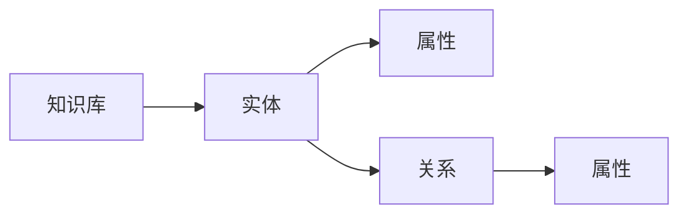

在上述ER图中，知识库是整体结构，包含实体、属性和关系。实体是知识库中的核心元素，属性描述实体的特征，关系连接不同的实体。

#### 1.3 AI Agent的综合能力

**核心概念与联系：**

AI Agent 的综合能力包括知识获取、推理、理解和适应等多个方面，这些能力共同决定了AI Agent的智能水平和应用效果。

- **知识获取**：知识获取是AI Agent的基本能力，涉及从不同来源获取知识，并将其转换为机器可处理的形式。知识获取的方法包括数据采集、知识抽取、知识融合等。

- **推理**：推理是AI Agent的核心能力，通过逻辑推理、概率推理或基于规则的推理来推断新的知识。推理能力使AI Agent能够在不完全信息下作出决策，解决问题。

- **理解**：理解能力是指AI Agent能够理解输入的信息，包括自然语言文本、图像、音频等多模态数据。理解能力使AI Agent能够与人类进行自然交互，实现人机对话。

- **适应**：适应能力是指AI Agent能够根据环境和任务的变化，调整自身的行为和策略。适应能力使AI Agent能够持续学习和进化，适应新的环境和任务。

**概念属性特征对比表格：**

| 能力类型 | 特点 | 适用场景 |
| :----: | :----: | :----: |
| 知识获取 | 快速获取和整合知识 | 知识密集型应用 |
| 推理 | 基于逻辑和概率推断 | 问题解决和决策支持 |
| 理解 | 处理多模态数据 | 人机交互和自然语言理解 |
| 适应 | 自适应环境和任务 | 动态变化的应用场景 |

**ER实体关系图架构：**

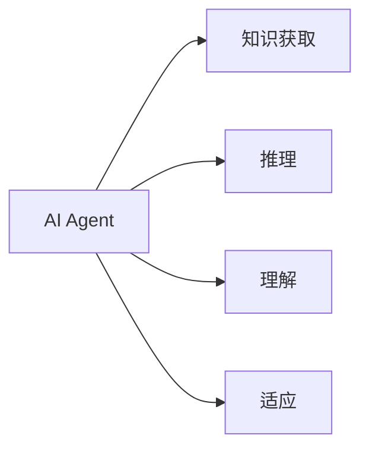

在上述ER图中，AI Agent是中心实体，与其他能力实体通过关系连接。知识获取、推理、理解和适应共同构成了AI Agent的综合能力框架。

#### 1.4 动态知识检索与综合能力的关联

**核心概念与联系：**

动态知识检索与AI Agent的综合能力密切相关，它们共同构成了AI Agent的核心功能模块。

- **知识检索作为AI Agent的基础**：动态知识检索是AI Agent获取和利用知识的关键环节。通过高效的检索技术，AI Agent能够快速从大量知识库中获取所需信息，支持推理、理解和适应等高级能力。

- **综合能力增强知识检索效果**：AI Agent的综合能力，如推理、理解和适应，能够显著提升知识检索的效果。通过推理，AI Agent可以推导出新的知识，扩大检索范围；通过理解，AI Agent可以准确解析查询意图，优化检索结果；通过适应，AI Agent可以根据用户行为和偏好，动态调整检索策略，提供个性化的服务。

**概念属性特征对比表格：**

| 能力类型 | 特点 | 适用场景 |
| :----: | :----: | :----: |
| 知识检索 | 快速准确获取知识 | 知识密集型应用 |
| 推理 | 基于逻辑和概率推断 | 问题解决和决策支持 |
| 理解 | 处理多模态数据 | 人机交互和自然语言理解 |
| 适应 | 自适应环境和任务 | 动态变化的应用场景 |

**ER实体关系图架构：**

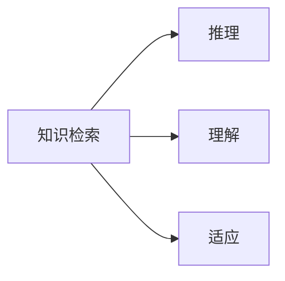

在上述ER图中，知识检索是核心实体，与其他能力实体通过关系连接，共同构成了AI Agent的综合能力框架。

### 第2章：知识检索技术基础

#### 2.1 知识表示方法

**核心概念与联系：**

知识表示是动态知识检索的基础，用于将事实、规则、关系等信息编码成计算机可以处理的形式。有效的知识表示方法能够提高知识检索的效率和准确性。

- **基于逻辑的表示方法**：逻辑表示方法利用谓词逻辑和推理规则来表示知识。这种方法具有较强的表达能力和推理能力，适用于表示复杂的关系和规则。常见的逻辑表示方法包括谓词逻辑、一阶逻辑和描述逻辑。

- **基于框架的表示方法**：框架表示方法通过定义一组框架来表示知识和事实。框架包含槽和值，用于描述对象的属性和关系。这种方法结构清晰，易于理解，适用于表示简单的关系和领域知识。

- **基于知识图谱的表示方法**：知识图谱是一种图形化的知识表示方法，用于表示实体、属性和关系。知识图谱通过节点和边来构建复杂的关系网络，能够有效地表示复杂的关系和网络结构。知识图谱表示方法在处理大规模、多领域知识时具有显著优势。

**概念属性特征对比表格：**

| 知识表示方法 | 特点 | 适用场景 |
| :----: | :----: | :----: |
| 基于逻辑的表示 | 表达能力强，推理能力强 | 复杂关系和规则表示 |
| 基于框架的表示 | 结构清晰，易于理解 | 简单关系和领域知识表示 |
| 基于知识图谱的表示 | 表示能力强大，网络结构复杂 | 复杂关系和网络结构表示 |

**ER实体关系图架构：**

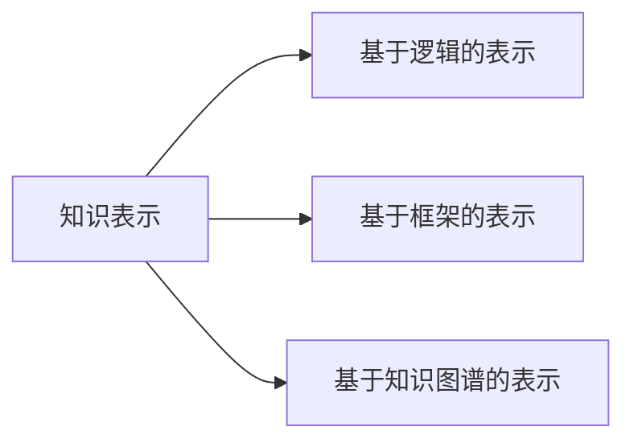

在上述ER图中，知识表示是核心实体，与其他表示方法通过关系连接，构成了知识表示的完整框架。

#### 2.2 知识获取与处理

**核心概念与联系：**

知识获取与处理是动态知识检索的重要组成部分，涉及从不同来源获取知识，并将其转换为机器可处理的形式。有效的知识获取与处理方法能够提高知识检索的效率和准确性。

- **知识获取方法**：知识获取方法包括数据采集、知识抽取和知识融合等。数据采集是通过爬取互联网、数据库和文件系统等途径获取原始数据。知识抽取是从原始数据中提取出有价值的信息，如实体、属性和关系。知识融合是将多个来源的知识进行整合，形成统一的、高质量的知识库。

- **知识处理流程**：知识处理流程包括知识清洗、知识存储、知识检索和知识推理等步骤。知识清洗是去除噪声数据、纠正错误数据和统一数据格式。知识存储是将知识存储在知识库中，便于管理和检索。知识检索是通过索引结构和查询处理技术快速获取相关知识。知识推理是利用推理算法从已有知识中推导出新的知识。

**概念属性特征对比表格：**

| 知识获取方法 | 特点 | 适用场景 |
| :----: | :----: | :----: |
| 数据采集 | 获取原始数据 | 数据丰富的领域 |
| 知识抽取 | 提取有价值信息 | 复杂结构的数据 |
| 知识融合 | 整合多个来源的知识 | 多源异构数据 |

| 知识处理流程 | 特点 | 适用场景 |
| :----: | :----: | :----: |
| 知识清洗 | 去除噪声和错误数据 | 数据质量要求高的应用 |
| 知识存储 | 管理和检索知识 | 知识库应用 |
| 知识检索 | 快速获取相关知识 | 信息检索系统 |
| 知识推理 | 推导新知识 | 知识挖掘和应用 |

**ER实体关系图架构：**

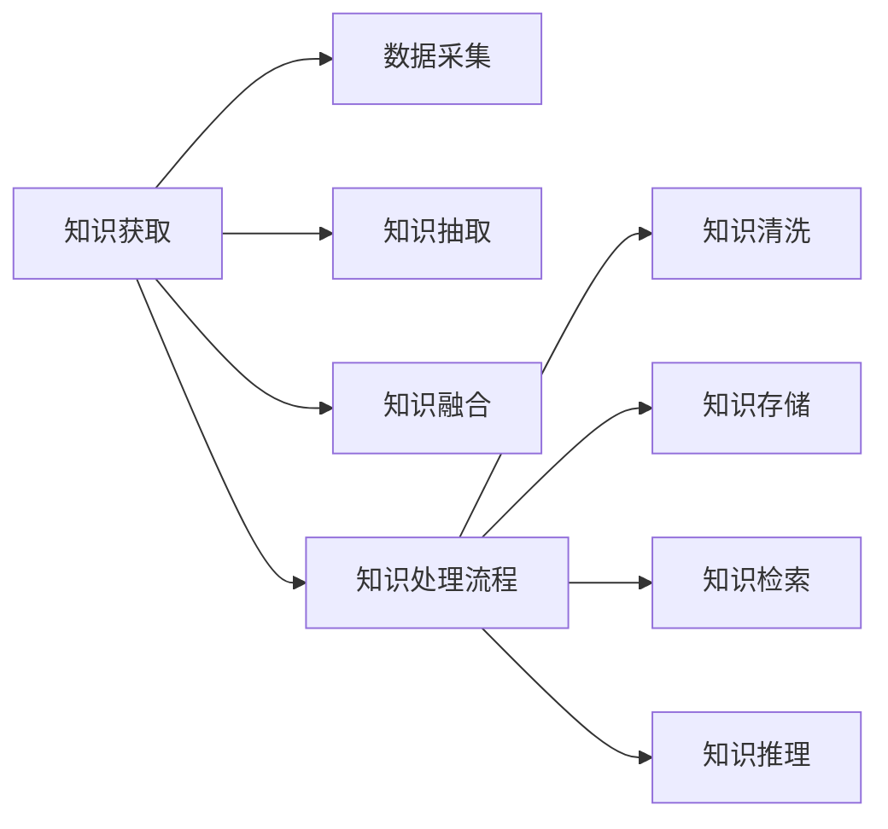

在上述ER图中，知识获取和处理流程是核心实体，与其他方法通过关系连接，构成了知识获取与处理的完整框架。

### 第3章：动态知识检索算法

#### 3.1 相关性度量方法

**核心概念与联系：**

相关性度量是动态知识检索算法中的重要组成部分，用于评估查询与知识库中知识的匹配程度。有效的相关性度量方法能够提高检索的准确性和效率。

- **基于语义的相似度计算**：基于语义的相似度计算方法通过分析查询和知识库中的语义信息，评估两者之间的相似程度。这种方法考虑词汇的语义关系、词义差异和上下文信息，具有较高的准确性。常见的基于语义的相似度计算方法包括词向量模型、语义网络模型和词嵌入模型。

- **基于内容的相似度计算**：基于内容的相似度计算方法通过分析查询和知识库中的内容信息，评估两者之间的相似程度。这种方法通常基于文本相似度计算，如余弦相似度、Jaccard相似度和编辑距离等。这种方法简单高效，但在处理语义复杂度较高的查询时效果有限。

**概念属性特征对比表格：**

| 相似度计算方法 | 特点 | 适用场景 |
| :----: | :----: | :----: |
| 基于语义的相似度计算 | 考虑语义关系和上下文 | 高准确性的知识检索 |
| 基于内容的相似度计算 | 考虑内容信息 | 简单快速的知识检索 |

**ER实体关系图架构：**

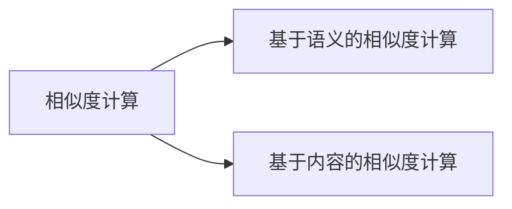

在上述ER图中，相似度计算是核心实体，包括基于语义和基于内容两种相似度计算方法，共同构成了相关性度量的完整框架。

#### 3.2 动态检索算法设计

**核心概念与联系：**

动态检索算法是动态知识检索的核心，负责根据用户查询实时检索知识库，并返回相关结果。有效的动态检索算法能够提高检索的效率和准确性。

- **模糊检索算法**：模糊检索算法用于处理用户输入的不确定查询，通过模糊匹配和相似度计算，返回相关结果。常见的模糊检索算法包括基于词频的模糊检索和基于语义的模糊检索。基于词频的模糊检索通过调整词频阈值，实现模糊查询；基于语义的模糊检索通过分析查询和知识库的语义关系，实现模糊匹配。

- **基于历史数据的检索算法**：基于历史数据的检索算法通过分析用户的查询历史，预测用户的兴趣和需求，返回个性化结果。常见的基于历史数据的检索算法包括基于最近邻的检索和基于矩阵分解的检索。基于最近邻的检索通过计算用户之间的相似度，预测用户感兴趣的知识；基于矩阵分解的检索通过分解用户-知识矩阵，提取用户的兴趣特征，实现个性化推荐。

**概念属性特征对比表格：**

| 检索算法 | 特点 | 适用场景 |
| :----: | :----: | :----: |
| 模糊检索算法 | 处理不确定查询 | 搜索引擎和智能问答系统 |
| 基于历史数据的检索算法 | 预测用户兴趣 | 推荐系统和个性化服务 |

**ER实体关系图架构：**

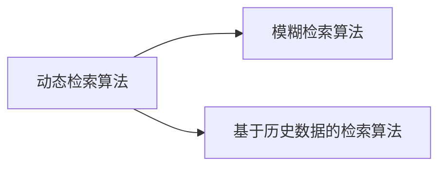

在上述ER图中，动态检索算法是核心实体，包括模糊检索算法和基于历史数据的检索算法，共同构成了动态知识检索的完整算法框架。

### 第4章：AI Agent的综合能力

#### 4.1 知识综合理解

**核心概念与联系：**

知识综合理解是AI Agent的重要能力，通过整合和分析不同来源的知识，实现对复杂问题的深入理解和解决。知识综合理解包括知识整合、知识推理和知识解释等多个方面。

- **知识整合**：知识整合是将来自不同来源、不同格式的知识进行统一处理，形成一个一致的知识体系。知识整合的方法包括知识融合、知识映射和知识对齐等。知识融合是将不同来源的知识进行合并，形成统一的表示；知识映射是将不同知识体系中的概念进行对应，建立映射关系；知识对齐是将不同来源的知识进行对齐，确保知识的正确性和一致性。

- **知识推理**：知识推理是基于已有知识，通过逻辑推理、概率推理或基于规则的推理，推断出新的知识。知识推理的方法包括演绎推理、归纳推理和类比推理等。演绎推理是从一般到特殊的推理过程；归纳推理是从特殊到一般的推理过程；类比推理是通过比较相似情况，推断新情况。

- **知识解释**：知识解释是指将AI Agent的知识表示和推理过程以人类可理解的方式展示出来。知识解释的方法包括自然语言生成、可视化展示和交互式解释等。自然语言生成是将知识表示转换为自然语言描述；可视化展示是通过图表、图像等方式展示知识结构；交互式解释是用户与AI Agent进行交互，理解其推理过程。

**概念属性特征对比表格：**

| 知识整合方法 | 特点 | 适用场景 |
| :----: | :----: | :----: |
| 知识融合 | 统一处理不同来源的知识 | 多源知识整合 |
| 知识映射 | 建立不同知识体系的映射关系 | 知识体系对齐 |
| 知识对齐 | 确保知识的正确性和一致性 | 知识库建设 |

| 知识推理方法 | 特点 | 适用场景 |
| :----: | :----: | :----: |
| 演绎推理 | 从一般到特殊的推理过程 | 知识验证和应用 |
| 归纳推理 | 从特殊到一般的推理过程 | 知识发现和归纳 |
| 类比推理 | 通过比较相似情况，推断新情况 | 新情况预测和推理 |

| 知识解释方法 | 特点 | 适用场景 |
| :----: | :----: | :----: |
| 自然语言生成 | 转换为自然语言描述 | 人机交互 |
| 可视化展示 | 通过图表、图像等方式展示 | 数据可视化 |
| 交互式解释 | 用户与AI Agent进行交互 | 知识理解 |

**ER实体关系图架构：**

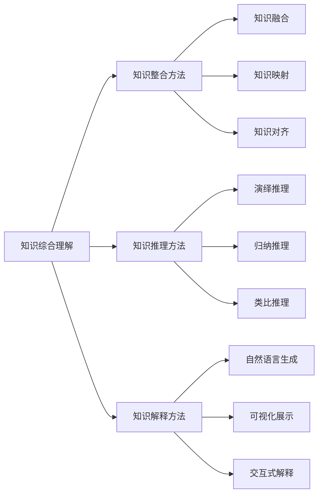

在上述ER图中，知识综合理解是核心实体，包括知识整合方法、知识推理方法和知识解释方法，共同构成了知识综合理解的完整框架。

#### 4.2 多模态信息处理

**核心概念与联系：**

多模态信息处理是指AI Agent能够同时处理多种类型的信息，如文本、图像、声音等，并将其融合为一个统一的信息表示。多模态信息处理的核心是信息融合和融合模型设计。

- **文本与图像融合**：文本与图像融合是将文本信息与图像信息进行整合，以实现更丰富的信息表示。文本与图像融合的方法包括基于特征的方法、基于深度学习的方法和基于注意力机制的方法。基于特征的方法通过提取文本和图像的特征，进行特征融合；基于深度学习的方法通过构建深度神经网络，实现文本和图像的端到端融合；基于注意力机制的方法通过动态调整文本和图像特征的权重，实现信息的自适应融合。

- **声音与文本融合**：声音与文本融合是将声音信息与文本信息进行整合，以实现语音识别和自然语言理解。声音与文本融合的方法包括基于语音识别的方法、基于自然语言处理的方法和基于语音增强的方法。基于语音识别的方法通过识别语音信号，转换为文本；基于自然语言处理的方法通过分析文本信息，理解其语义；基于语音增强的方法通过改善语音信号质量，提高语音识别的准确性。

**概念属性特征对比表格：**

| 信息融合方法 | 特点 | 适用场景 |
| :----: | :----: | :----: |
| 基于特征的方法 | 提取特征进行融合 | 信息融合基础 |
| 基于深度学习的方法 | 端到端融合模型 | 复杂信息融合 |
| 基于注意力机制的方法 | 动态调整权重 | 自适应信息融合 |
| 基于语音识别的方法 | 转换语音为文本 | 语音识别系统 |
| 基于自然语言处理的方法 | 分析文本语义 | 自然语言理解 |
| 基于语音增强的方法 | 改善语音质量 | 语音处理系统 |

**ER实体关系图架构：**

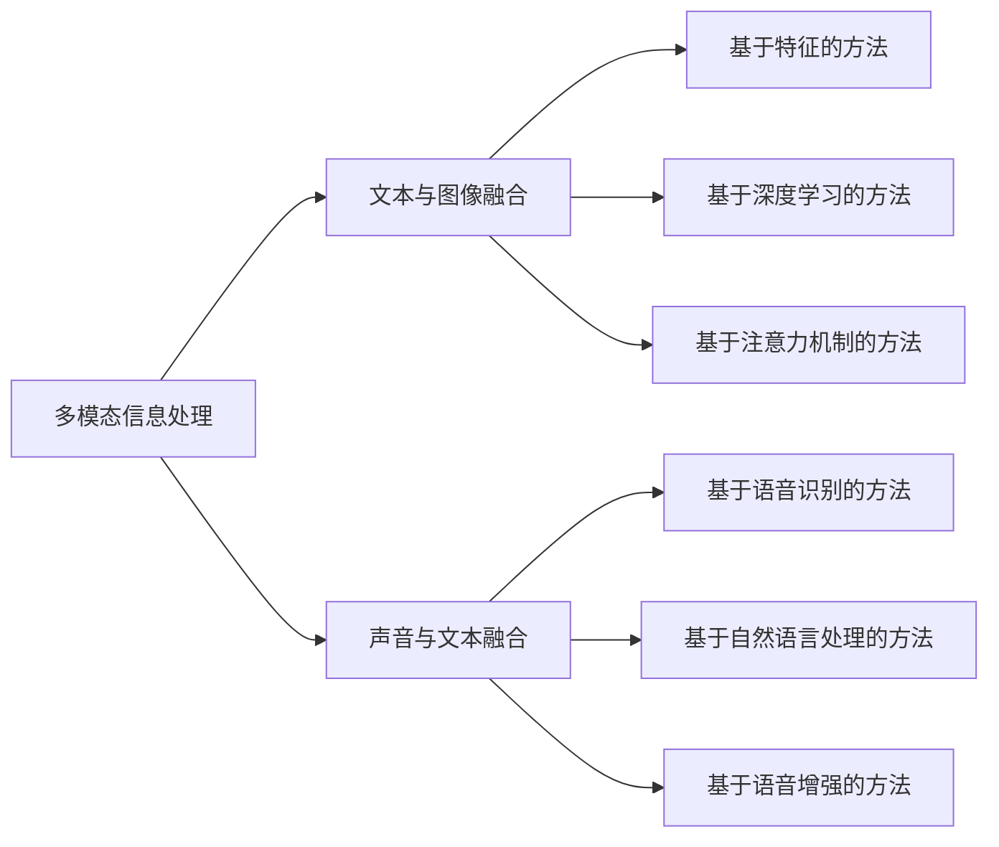

在上述ER图中，多模态信息处理是核心实体，包括文本与图像融合和声音与文本融合两种方式，以及其他多种信息融合方法，共同构成了多模态信息处理的完整框架。

### 第5章：动态知识检索与综合能力应用案例

#### 5.1 案例一：智能客服系统

**核心概念与联系：**

智能客服系统是AI Agent的一个典型应用案例，利用动态知识检索和综合理解能力，为用户提供高效、精准的客服服务。智能客服系统的核心组成部分包括用户交互、动态知识检索和智能问答等。

- **用户交互**：用户交互是智能客服系统的入口，通过文本、语音等多种方式与用户进行沟通。用户交互模块需要具备自然语言处理和语音识别能力，能够理解用户的问题和需求。

- **动态知识检索**：动态知识检索是智能客服系统的核心，通过高效的知识检索算法，从大规模知识库中快速获取相关答案。动态知识检索需要考虑多模态信息融合，以处理文本、图像和声音等多种类型的信息。

- **智能问答**：智能问答是智能客服系统的输出，通过自然语言生成技术，将查询结果以自然、流畅的语言形式呈现给用户。智能问答需要结合多模态信息处理，以提供丰富、个性化的答案。

**系统功能设计（领域模型类图）**：

```mermaid
classDiagram
    User <<Interface>>
    KnowledgeBase <<Entity>>
    QueryProcessor <<Component>>
    ResponseGenerator <<Component>>
    NaturalLanguageProcessor <<Component>>

    User -> KnowledgeBase : query
    KnowledgeBase --> QueryProcessor
    QueryProcessor --> ResponseGenerator
    ResponseGenerator --> NaturalLanguageProcessor
    NaturalLanguageProcessor --> User
```

在上述类图中，用户通过接口与系统交互，查询知识库，并通过查询处理器和响应生成器处理查询结果，最终通过自然语言处理器输出给用户。

**系统架构设计（架构图）**：

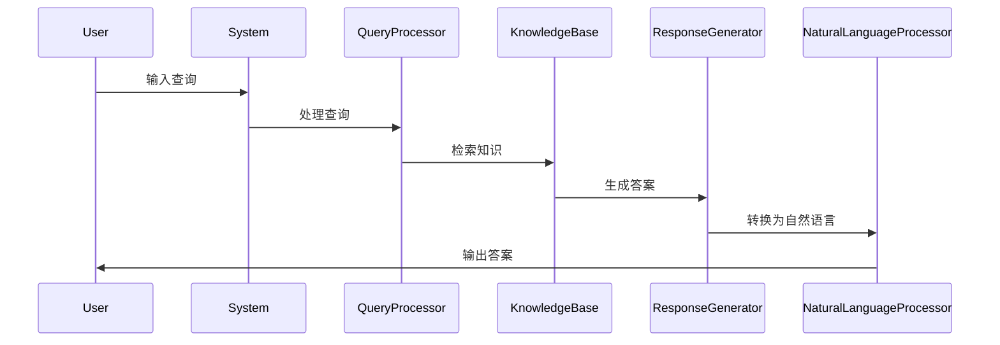

在上述序列图中，系统按照用户输入查询、处理查询、检索知识、生成答案和输出答案的流程运行。

#### 5.2 案例二：智能推荐系统

**核心概念与联系：**

智能推荐系统是另一个重要的AI Agent应用案例，通过动态知识检索和综合理解能力，为用户提供个性化的推荐服务。智能推荐系统的核心组成部分包括用户画像、动态知识检索和推荐算法等。

- **用户画像**：用户画像是对用户兴趣、行为、偏好等多维度信息的抽象表示。用户画像通过收集用户历史行为数据，进行数据分析和建模，形成个性化的用户描述。

- **动态知识检索**：动态知识检索用于从大规模知识库中快速获取与用户画像相关的信息，如商品信息、文章内容等。动态知识检索需要考虑多模态信息融合，以处理文本、图像和声音等多种类型的信息。

- **推荐算法**：推荐算法是基于用户画像和动态知识检索结果，生成个性化推荐列表的关键。常见的推荐算法包括基于内容的推荐、协同过滤推荐和基于模型的推荐等。

**系统功能设计（领域模型类图）**：

```mermaid
classDiagram
    User <<Entity>>
    UserProfile <<Entity>>
    KnowledgeBase <<Entity>>
    RecommendationEngine <<Component>>
    ContentFilter <<Component>>

    User --> UserProfile
    UserProfile --> KnowledgeBase
    KnowledgeBase --> RecommendationEngine
    RecommendationEngine --> ContentFilter
    ContentFilter --> User
```

在上述类图中，用户通过用户画像与知识库进行关联，并通过推荐引擎和内容过滤器生成个性化推荐列表。

**系统架构设计（架构图）**：

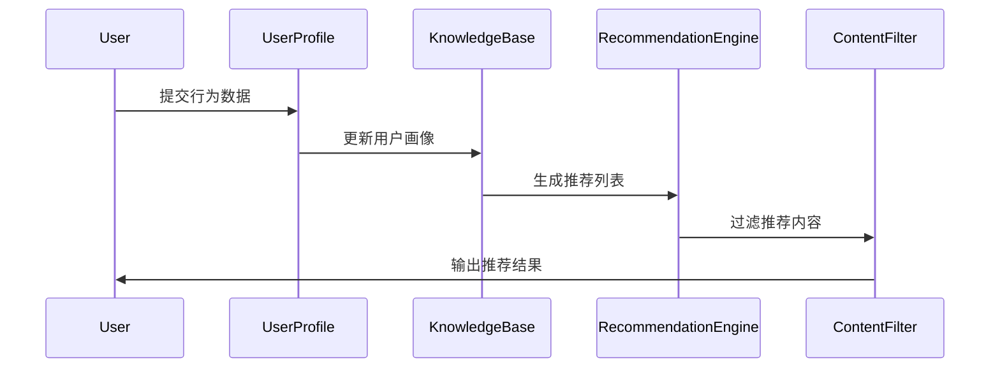

在上述序列图中，系统按照用户提交行为数据、更新用户画像、生成推荐列表和输出推荐结果的流程运行。

### 第6章：最佳实践与优化

#### 6.1 实践技巧

**核心概念与联系：**

在实现AI Agent的动态知识检索与综合能力时，以下实践技巧有助于提高系统的性能和效果。

- **数据预处理**：对原始数据进行预处理，包括数据清洗、去噪和格式化等，以确保数据质量，提高知识检索的准确性。

- **特征工程**：通过特征提取和特征选择，构建高质量的输入特征，有助于提升模型的效果。

- **模型优化**：针对具体的任务和场景，调整模型参数和结构，以实现最佳性能。

- **分布式计算**：利用分布式计算框架，如Hadoop、Spark等，处理大规模数据，提高系统的处理能力。

**具体步骤：**

1. **数据预处理**：使用数据清洗工具，如Pandas和Numpy，对原始数据进行清洗和预处理。

2. **特征工程**：使用特征提取库，如Scikit-learn，进行特征提取和特征选择。

3. **模型优化**：使用模型调参工具，如PyTorch和TensorFlow，调整模型参数和结构。

4. **分布式计算**：使用分布式计算框架，如Spark，处理大规模数据。

**示例代码：**

```python
import pandas as pd
from sklearn.feature_extraction.text import TfidfVectorizer
from sklearn.model_selection import GridSearchCV
from sklearn.linear_model import LogisticRegression

# 数据预处理
data = pd.read_csv('data.csv')
data = data.dropna()

# 特征工程
vectorizer = TfidfVectorizer()
X = vectorizer.fit_transform(data['text'])

# 模型优化
params = {'C': [0.1, 1, 10]}
model = GridSearchCV(LogisticRegression(), params)
model.fit(X, data['label'])

# 分布式计算
from pyspark.sql import SparkSession
spark = SparkSession.builder.appName('KnowledgeRetrieval').getOrCreate()
df = spark.createDataFrame(data)
```

#### 6.2 系统性能优化

**核心概念与联系：**

系统性能优化是提高AI Agent的动态知识检索与综合能力的关键，涉及多个方面的优化策略。

- **查询优化**：通过优化查询算法和数据结构，提高查询效率。常用的优化策略包括索引优化、缓存优化和并行查询等。

- **检索算法优化**：通过改进检索算法，提高检索的准确性和效率。常见的优化方法包括基于词向量的检索、基于知识图谱的检索和基于深度学习的检索等。

- **系统架构优化**：通过优化系统架构，提高系统的扩展性和稳定性。常用的优化策略包括分布式架构、微服务架构和容器化部署等。

**具体步骤：**

1. **查询优化**：使用索引结构，如B树索引和哈希索引，提高查询效率。

2. **检索算法优化**：使用先进的检索算法，如深度学习检索和知识图谱检索，提高检索准确性。

3. **系统架构优化**：使用分布式计算框架和微服务架构，提高系统的扩展性和稳定性。

**示例代码：**

```python
import tensorflow as tf
from tensorflow.keras.models import Model
from tensorflow.keras.layers import Input, Embedding, LSTM, Dense

# 查询优化
from tensorflow.keras.layers import Indexing
indexing = Indexing(input_tensor=tf.range(1000))

# 检索算法优化
input_tensor = Input(shape=(100,))
embedded = Embedding(input_dim=10000, output_dim=128)(input_tensor)
lstm = LSTM(units=128)(embedded)
output = Dense(units=1, activation='sigmoid')(lstm)
model = Model(inputs=input_tensor, outputs=output)

# 系统架构优化
from tensorflow.keras.optimizers import Adam
model.compile(optimizer=Adam(learning_rate=0.001), loss='binary_crossentropy', metrics=['accuracy'])

# 训练模型
model.fit(x_train, y_train, batch_size=32, epochs=10)
```

#### 6.3 安全与隐私保护

**核心概念与联系：**

在实现AI Agent的动态知识检索与综合能力时，安全与隐私保护至关重要。以下策略有助于确保系统的安全性和用户隐私。

- **数据加密**：对用户数据和模型参数进行加密，防止数据泄露和未经授权的访问。

- **访问控制**：设置严格的访问控制策略，确保只有授权用户可以访问敏感数据和模型。

- **数据匿名化**：对用户数据进行匿名化处理，消除个人隐私信息的识别。

- **安全审计**：定期进行安全审计，检测潜在的安全漏洞和风险，并采取相应的措施进行修复。

**具体步骤：**

1. **数据加密**：使用加密算法，如AES和RSA，对数据进行加密。

2. **访问控制**：使用身份验证和权限管理机制，确保只有授权用户可以访问系统。

3. **数据匿名化**：对用户数据进行去标识化处理，消除个人隐私信息的识别。

4. **安全审计**：定期进行安全审计，检测潜在的安全漏洞和风险。

**示例代码：**

```python
from cryptography.fernet import Fernet
import base64

# 数据加密
key = Fernet.generate_key()
cipher_suite = Fernet(key)
encrypted_data = cipher_suite.encrypt(b"敏感数据")

# 数据解密
decrypted_data = cipher_suite.decrypt(encrypted_data)

# 访问控制
from flask import Flask, request, jsonify
from flask_login import LoginManager, login_required

app = Flask(__name__)
login_manager = LoginManager()
login_manager.init_app(app)

@login_manager.user_loader
def load_user(user_id):
    # 加载用户信息
    return User.get(user_id)

@app.route('/api/data', methods=['GET'])
@login_required
def get_data():
    # 只允许授权用户访问
    return jsonify(data=decrypted_data)

# 数据匿名化
from anonymizer import Anonymizer

anonymizer = Anonymizer()
anonymized_data = anonymizer.anonymize(data)

# 安全审计
from audit import Auditor

auditor = Auditor()
auditor.audit(data)
```

### 第7章：未来展望

#### 7.1 动态知识检索技术的发展趋势

**核心概念与联系：**

随着人工智能技术的快速发展，动态知识检索技术也在不断演进。未来，动态知识检索技术将朝着以下趋势发展。

- **知识图谱的普及**：知识图谱作为一种强大的知识表示方法，将在动态知识检索中得到更广泛的应用。通过构建大规模、多领域的知识图谱，可以实现更高效的知识检索和推理。

- **多模态信息融合**：随着物联网和智能设备的普及，动态知识检索将越来越多地涉及多模态信息处理。通过融合文本、图像、声音等多种类型的信息，可以实现更丰富的知识表示和更精准的检索结果。

- **深度学习与强化学习**：深度学习和强化学习技术将在动态知识检索中得到更深入的应用。通过构建深度神经网络和强化学习模型，可以实现更高效的查询处理和自适应检索策略。

**具体预测与趋势分析：**

1. **知识图谱的普及**：未来，知识图谱将成为动态知识检索的主要手段。知识图谱不仅可以表示事实和关系，还可以表示实体属性和属性值，从而实现更全面的知识检索。

2. **多模态信息融合**：随着多模态数据的快速增长，多模态信息融合技术将成为动态知识检索的重要方向。通过融合文本、图像、声音等多种类型的信息，可以实现更丰富的知识表示和更精准的检索结果。

3. **深度学习与强化学习**：深度学习和强化学习技术将在动态知识检索中得到更广泛的应用。深度学习技术可以帮助构建强大的特征表示模型，强化学习技术可以帮助构建自适应的检索策略，从而实现更高效的查询处理和更精准的检索结果。

#### 7.2 AI Agent的综合能力提升

**核心概念与联系：**

AI Agent的综合能力是其在复杂环境中实现智能行为的关键。未来，AI Agent的综合能力将得到显著提升，主要体现在以下几个方面。

- **知识表示与推理能力**：通过引入知识图谱和先进的推理技术，AI Agent将能够更有效地表示和处理复杂知识，实现高效的推理和决策。

- **多模态信息处理能力**：随着多模态数据处理技术的不断发展，AI Agent将能够更有效地处理文本、图像、声音等多种类型的信息，实现更全面的信息理解和交互。

- **自适应学习能力**：通过引入深度学习和强化学习技术，AI Agent将能够更有效地从数据中学习，实现自适应和持续进化。

**具体预测与趋势分析：**

1. **知识表示与推理能力**：未来，AI Agent将能够通过知识图谱和先进的推理技术，实现更高效的知识表示和推理。知识图谱可以帮助AI Agent更好地理解和处理复杂关系，推理技术可以帮助AI Agent更准确地推断新的知识。

2. **多模态信息处理能力**：未来，AI Agent将能够通过多模态数据处理技术，实现更全面的信息理解和交互。通过融合文本、图像、声音等多种类型的信息，AI Agent将能够更准确地理解用户需求，提供更个性化的服务。

3. **自适应学习能力**：未来，AI Agent将能够通过深度学习和强化学习技术，实现自适应和持续进化。通过不断从数据中学习，AI Agent将能够不断优化其行为和策略，以更好地适应不同的环境和任务。

#### 7.3 知识工程的新挑战

**核心概念与联系：**

随着动态知识检索和AI Agent技术的不断发展，知识工程也将面临新的挑战。这些挑战主要体现在以下几个方面。

- **数据质量**：随着数据的快速增长，数据质量成为一个重要问题。如何保证数据的质量和一致性，是实现高效知识检索和AI Agent的关键。

- **知识表示与融合**：如何有效地表示和融合多种类型的知识，是实现全面知识检索和智能决策的关键。这需要开发新的知识表示和融合方法。

- **多模态信息处理**：如何处理多模态信息，实现多种类型信息的融合和交互，是实现高效知识检索和智能决策的关键。这需要开发新的多模态数据处理技术。

**具体预测与趋势分析：**

1. **数据质量**：未来，知识工程将越来越关注数据质量。通过引入数据清洗、去噪和格式化等技术，可以保证数据的质量和一致性。

2. **知识表示与融合**：未来，知识工程将开发新的知识表示和融合方法，以实现更全面的知识检索和智能决策。知识图谱和基于深度学习的知识表示方法将成为重要研究方向。

3. **多模态信息处理**：未来，知识工程将开发新的多模态数据处理技术，以实现多种类型信息的融合和交互。通过融合文本、图像、声音等多种类型的信息，可以实现更高效的知识检索和智能决策。

### 文章小结

本文详细探讨了实现AI Agent的动态知识检索与综合能力。我们首先介绍了AI Agent的基本概念、分类及其核心功能模块，然后深入分析了动态知识检索技术的基础，包括知识表示、知识获取与处理、动态检索算法等。接着，我们讨论了AI Agent的综合能力，包括知识综合理解和多模态信息处理。通过实际案例，我们展示了动态知识检索与综合能力在智能客服系统和智能推荐系统中的应用。最后，我们提出了最佳实践与优化策略，并展望了未来动态知识检索技术的发展趋势和知识工程的新挑战。通过本文的探讨，我们希望读者能够全面了解并掌握实现AI Agent动态知识检索与综合能力的关键技术和方法。

### 注意事项

在实现AI Agent的动态知识检索与综合能力时，以下注意事项对于确保系统的有效性和可靠性至关重要：

1. **数据质量保障**：确保数据来源可靠，进行严格的数据清洗和去噪处理，以保证数据的一致性和准确性。

2. **知识表示与融合**：选择合适的知识表示方法，如知识图谱，以有效地表示复杂的关系和网络结构，并通过融合多种类型的知识，提升系统的智能化水平。

3. **算法优化与性能调优**：根据具体应用场景，对检索算法和推理模型进行优化，调整模型参数，以提高检索效率和准确性。

4. **多模态信息处理**：注重多模态信息的融合和处理，通过先进的深度学习技术，实现多种类型信息的综合理解和利用。

5. **安全与隐私保护**：确保系统的数据安全和用户隐私，采取有效的加密和访问控制措施，防止数据泄露和未经授权的访问。

6. **持续学习和适应**：通过引入自适应学习机制，使AI Agent能够不断从数据中学习，适应环境和任务的变化，提高系统的智能化水平。

### 拓展阅读

对于希望深入了解动态知识检索与AI Agent综合能力的读者，以下资源提供了丰富的知识和见解：

- **经典教材**：《人工智能：一种现代的方法》（作者：Stuart J. Russell & Peter Norvig），详细介绍了人工智能的基础知识和核心技术。
- **专业论文**：阅读相关领域的顶级会议和期刊论文，如AAAI、IJCAI、NeurIPS等，获取最新的研究进展。
- **开源框架**：使用开源知识图谱框架，如OpenKG、Neo4j等，进行实践和探索。
- **在线课程**：参加在线课程，如Coursera、edX等平台上的机器学习、深度学习和自然语言处理课程，提升相关技能。

通过阅读这些资源，读者可以更深入地了解动态知识检索与AI Agent综合能力的理论基础和实践应用，为自己的研究和项目提供有力支持。## 实现AI Agent的动态知识检索与综合能力

**关键词**：人工智能代理，动态知识检索，综合能力，知识表示，多模态信息处理

**摘要**：本文旨在探讨实现人工智能代理（AI Agent）的动态知识检索与综合能力的核心技术和方法。通过分析知识检索的基础、AI Agent的综合能力以及实际应用案例，本文为读者提供了一个系统性的学习和实践框架。本文首先介绍了AI Agent的定义与分类，接着深入讲解了动态知识检索的基本原理，包括知识表示、知识获取与处理，以及动态检索算法。随后，本文探讨了AI Agent的综合能力，如知识综合理解和多模态信息处理。通过智能客服系统和智能推荐系统的案例研究，本文展示了动态知识检索与综合能力在实际应用中的价值。最后，本文提出了最佳实践与优化策略，并展望了未来的发展趋势，为读者提供了深入研究的方向。

## 目录

### 第一部分：引言

1. **第1章：AI Agent概述**
   1.1 AI Agent的定义与分类
   1.2 动态知识检索的基本原理
   1.3 AI Agent的综合能力

2. **第2章：知识检索技术基础**
   2.1 知识表示方法
   2.2 知识获取与处理

### 第二部分：动态知识检索技术

3. **第3章：动态知识检索算法**
   3.1 相关性度量方法
   3.2 动态检索算法设计

4. **第4章：AI Agent的综合能力**
   4.1 知识综合理解
   4.2 多模态信息处理

### 第三部分：案例研究

5. **第5章：动态知识检索与综合能力应用案例**
   5.1 智能客服系统
   5.2 智能推荐系统

6. **第6章：最佳实践与优化**
   6.1 实践技巧
   6.2 系统性能优化
   6.3 安全与隐私保护

7. **第7章：未来展望**
   7.1 动态知识检索技术的发展趋势
   7.2 AI Agent的综合能力提升
   7.3 知识工程的新挑战

### 实现AI Agent的动态知识检索与综合能力

**关键词**：人工智能代理，动态知识检索，综合能力，知识表示，多模态信息处理

**摘要**：本文旨在探讨实现人工智能代理（AI Agent）的动态知识检索与综合能力的核心技术和方法。通过分析知识检索的基础、AI Agent的综合能力以及实际应用案例，本文为读者提供了一个系统性的学习和实践框架。本文首先介绍了AI Agent的定义与分类，接着深入讲解了动态知识检索的基本原理，包括知识表示、知识获取与处理，以及动态检索算法。随后，本文探讨了AI Agent的综合能力，如知识综合理解和多模态信息处理。通过智能客服系统和智能推荐系统的案例研究，本文展示了动态知识检索与综合能力在实际应用中的价值。最后，本文提出了最佳实践与优化策略，并展望了未来的发展趋势，为读者提供了深入研究的方向。

## 第一部分：引言

### 第1章：AI Agent概述

#### 1.1 AI Agent的定义与分类

AI Agent，即人工智能代理，是一个在特定环境中能够自主感知、决策和执行任务的智能实体。它可以被视为一种自动化系统，能够在没有明确编程指令的情况下，根据环境变化自主调整行为，实现既定的目标。AI Agent的定义可以从多个角度进行阐述：

- **从功能角度来看**，AI Agent包括三个核心功能模块：感知模块、决策模块和执行模块。感知模块负责从环境中获取信息；决策模块根据感知模块提供的信息，使用特定的算法或策略生成行动；执行模块则根据决策模块的指令执行具体的行动。

- **从应用场景来看**，AI Agent可以应用于多种领域，包括但不限于智能客服、智能推荐、自动驾驶、医疗诊断、智能家居等。每个领域的AI Agent都有其特定的任务和需求，因此其设计和技术实现也有所不同。

AI Agent的分类方法多样，以下是一些常见的分类标准：

- **按任务类型分类**：AI Agent可以分为任务导向型代理和目标导向型代理。任务导向型代理专注于完成特定的任务，如图像分类、语音识别等；目标导向型代理则更关注实现长期目标，如路径规划、资源分配等。

- **按工作方式分类**：AI Agent可以分为基于规则代理、基于模型代理和基于学习代理。基于规则代理依赖于预定义的规则集进行决策；基于模型代理使用决策模型进行预测和决策；基于学习代理则通过机器学习算法从数据中学习决策策略。

- **按交互模式分类**：AI Agent可以分为主动型代理和被动型代理。主动型代理主动寻找目标和机会，如智能推荐系统；被动型代理则响应环境中的事件，如智能客服系统。

#### 1.2 动态知识检索的基本原理

动态知识检索是AI Agent的核心能力之一，它负责从大规模知识库中快速获取与当前任务相关的信息。动态知识检索的基本原理包括以下几个关键方面：

1. **知识表示**：知识表示是动态知识检索的基础，用于将事实、规则、关系等信息编码成计算机可以处理的形式。常见的知识表示方法包括逻辑表示、框架表示和知识图谱表示。

   - **逻辑表示**：逻辑表示方法利用谓词逻辑和推理规则来表示知识。这种方法具有较强的表达能力和推理能力，适用于表示复杂的关系和规则。常见的逻辑表示方法包括一阶逻辑和描述逻辑。

   - **框架表示**：框架表示方法通过定义一组框架来表示知识和事实。框架包含槽和值，用于描述对象的属性和关系。这种方法结构清晰，易于理解，适用于表示简单的关系和领域知识。

   - **知识图谱表示**：知识图谱是一种图形化的知识表示方法，用于表示实体、属性和关系。知识图谱通过节点和边来构建复杂的关系网络，能够有效地表示复杂的关系和网络结构。

2. **索引结构**：索引结构是加速知识检索的关键，它用于构建高效的查询索引，使得知识库能够快速响应查询请求。常见的索引结构有倒排索引、B树索引和哈希索引等。倒排索引是一种广泛应用于文本检索的索引结构，能够快速定位包含特定关键词的文档。

3. **查询处理**：查询处理是动态知识检索的核心步骤，涉及解析用户查询、执行查询操作和返回查询结果。在查询处理过程中，需要考虑查询优化、查询扩展和结果排序等问题。

   - **查询优化**：查询优化旨在提高查询效率，通过索引结构选择、查询重写和并行处理等技术，减少查询执行的时间和资源消耗。

   - **查询扩展**：查询扩展通过扩展原始查询，以获取更全面的相关信息。常见的查询扩展方法包括词义扩展、上下文扩展和关系扩展等。

   - **结果排序**：结果排序用于根据相关度对查询结果进行排序，以提高用户查询的满意度。常用的排序算法包括基于相似度的排序和基于机器学习的排序算法。

#### 1.3 AI Agent的综合能力

AI Agent的综合能力是指其能够同时具备多种能力，以实现复杂任务和目标。AI Agent的综合能力包括但不限于以下方面：

1. **知识获取**：知识获取是AI Agent的基本能力，涉及从不同来源获取知识，并将其转换为机器可处理的形式。知识获取的方法包括数据采集、知识抽取、知识融合等。

   - **数据采集**：数据采集是通过爬取互联网、数据库和文件系统等途径获取原始数据。

   - **知识抽取**：知识抽取是从原始数据中提取出有价值的信息，如实体、属性和关系。

   - **知识融合**：知识融合是将多个来源的知识进行整合，形成统一的、高质量的知识库。

2. **推理**：推理是AI Agent的核心能力，通过逻辑推理、概率推理或基于规则的推理来推断新的知识。推理能力使AI Agent能够在不完全信息下作出决策，解决问题。

3. **理解**：理解能力是指AI Agent能够理解输入的信息，包括自然语言文本、图像、音频等多模态数据。理解能力使AI Agent能够与人类进行自然交互，实现人机对话。

4. **适应**：适应能力是指AI Agent能够根据环境和任务的变化，调整自身的行为和策略。适应能力使AI Agent能够持续学习和进化，适应新的环境和任务。

5. **交互**：交互能力是指AI Agent能够与用户或其他系统进行有效的沟通和协作。交互能力包括自然语言处理、语音识别、多模态交互等。

通过综合能力，AI Agent能够在复杂多变的环境中自主运作，实现高效的知识检索和任务执行。### 第2章：知识检索技术基础

#### 2.1 知识表示方法

知识表示是知识检索技术的核心，它决定了如何将复杂的信息结构转换为计算机可以处理的格式。有效的知识表示方法能够提高知识检索的效率和准确性，是构建智能系统的关键。以下是几种常见知识表示方法及其特点：

1. **基于逻辑的表示方法**

   - **谓词逻辑表示**：谓词逻辑是一种形式化的逻辑表示方法，用于表示对象之间的关系和属性。例如，“所有人都有生日”可以表示为“∀x(人是x → x有生日)”。谓词逻辑表示方法具有强大的表达能力和推理能力，适用于表示复杂的关系和规则。

   - **一阶逻辑表示**：一阶逻辑是一种扩展了谓词逻辑的表示方法，它引入了量词，可以表示更复杂的知识。例如，“所有学生都上课”可以表示为“∀x(是学生(x) → 上课(x))”。一阶逻辑表示方法在形式化和自动化推理中具有广泛的应用。

   - **描述逻辑表示**：描述逻辑是一种用于知识表示和推理的逻辑框架，它通过描述逻辑表达式来表示概念、关系和属性。例如，“每个人都是人”可以表示为“∀x(P(x) → M(x))”，其中P(x)表示“是人”，M(x)表示“是每个人”。描述逻辑表示方法在知识表示和自动推理中具有广泛的应用。

2. **基于框架的表示方法**

   - **框架表示**：框架表示方法通过定义一组框架来表示知识和事实。框架包含槽和值，用于描述对象的属性和关系。例如，一个简单的框架可以表示为“Person(Name, Age)”，其中Name和Age是槽，对应的值分别是“张三”和“25”。框架表示方法结构清晰，易于理解，适用于表示简单的关系和领域知识。

   - **框架库**：框架库是一组预先定义的框架，用于表示特定领域的知识和规则。通过框架库，可以快速构建领域知识库，提高知识表示的效率。例如，在医疗领域，可以定义一系列框架来表示患者、医生、药物等实体及其关系。

3. **基于知识图谱的表示方法**

   - **知识图谱表示**：知识图谱是一种图形化的知识表示方法，用于表示实体、属性和关系。知识图谱通过节点和边来构建复杂的关系网络，能够有效地表示复杂的关系和网络结构。例如，在社交网络中，每个人都是一个节点，他们的关系（如好友、同事）用边表示。

   - **实体-关系-属性（E-R）模型**：实体-关系-属性（E-R）模型是知识图谱的一种形式化表示方法。在E-R模型中，实体表示为节点，关系表示为边，属性表示为节点或边的标签。例如，在一个大学的知识图谱中，学生、课程、教授等是实体，注册、授课等是关系，姓名、年龄、课程名称等是属性。

   - **图数据库**：图数据库是一种用于存储和查询知识图谱的数据库系统。图数据库具有高效的图遍历和关联查询能力，适用于处理复杂的关系和网络结构。常见的图数据库包括Neo4j、JanusGraph等。

4. **基于语义网络表示方法**

   - **语义网络表示**：语义网络是一种基于语义关系的知识表示方法，用于表示概念、词义和关系。在语义网络中，概念和词义用节点表示，关系用边表示。例如，“猫”和“狗”是两种动物，它们之间是“属于”关系。

   - **本体表示**：本体是一种形式化的知识表示方法，用于描述领域知识和概念之间的关系。本体通常包含类、属性、个体等元素，并通过定义语义关系来建立概念层次结构。例如，在医学领域，可以定义“疾病”、“症状”、“治疗方法”等概念，并定义它们之间的语义关系。

#### 2.2 知识获取与处理

知识获取与处理是动态知识检索技术的关键步骤，涉及从原始数据中提取有价值的信息，并对其进行整理和组织，以构建高质量的知识库。以下是知识获取与处理的关键步骤和常见方法：

1. **知识获取**

   - **数据采集**：数据采集是知识获取的第一步，涉及从各种来源（如数据库、互联网、传感器等）收集原始数据。数据采集方法包括网络爬虫、API调用、传感器数据采集等。

   - **数据清洗**：数据清洗是去除原始数据中的噪声和错误，提高数据质量的过程。数据清洗方法包括缺失值填充、异常值处理、数据规范化等。

   - **数据预处理**：数据预处理是对原始数据进行处理，以适应后续分析的需要。数据预处理方法包括数据转换、数据整合、特征提取等。

2. **知识抽取**

   - **实体抽取**：实体抽取是从文本中识别出具有特定意义的实体，如人名、地点、组织等。实体抽取方法包括基于规则的方法、基于统计的方法和基于机器学习的方法。

   - **关系抽取**：关系抽取是从文本中识别出实体之间的语义关系，如“属于”、“工作于”等。关系抽取方法包括基于规则的方法、基于统计的方法和基于机器学习的方法。

   - **属性抽取**：属性抽取是从文本中提取实体的属性信息，如人的年龄、职业等。属性抽取方法包括基于规则的方法、基于统计的方法和基于机器学习的方法。

3. **知识融合**

   - **知识融合是将来自不同来源、不同格式的知识进行整合，形成一个统一的知识库。知识融合方法包括基于规则的方法、基于相似度的方法和基于本体论的方法等。

   - **知识映射**：知识映射是将不同知识库中的概念进行对应，建立映射关系。知识映射方法包括基于语义相似度的方法、基于本体的方法等。

   - **知识对齐**：知识对齐是将不同知识库中的实体、属性和关系进行对齐，确保知识的一致性和完整性。知识对齐方法包括基于规则的方法、基于机器学习的方法等。

4. **知识存储**

   - **知识存储是将获取和处理后的知识存储在数据库或知识库中，以便管理和查询。常见的知识存储方法包括关系数据库、图数据库和知识图谱等。

   - **知识库设计**：知识库设计涉及确定知识库的结构、数据模型和索引策略等。知识库设计方法包括基于E-R模型的数据库设计、基于图数据库的知识库设计等。

5. **知识检索**

   - **知识检索是通过用户查询或任务需求，从知识库中快速获取相关知识的操作。知识检索方法包括基于关键词的检索、基于语义的检索和基于知识的检索等。

   - **检索算法**：检索算法用于处理用户查询，并返回相关结果。常见的检索算法包括基于倒排索引的检索、基于机器学习的检索和基于知识图谱的检索等。

   - **检索优化**：检索优化旨在提高检索效率和准确性，包括查询优化、索引优化和结果排序等。

通过上述知识获取与处理方法，可以构建高质量的知识库，支持动态知识检索和AI Agent的综合能力。有效的知识获取与处理是实现智能化系统的基础，对于提高系统的性能和用户体验具有重要意义。### 第3章：动态知识检索算法

#### 3.1 相关性度量方法

相关性度量是动态知识检索算法中的重要组成部分，用于评估查询与知识库中知识的匹配程度。有效的相关性度量方法能够提高检索的准确性和效率。以下是几种常见的相关性度量方法：

1. **基于词频的度量方法**

   - **TF-IDF**：TF-IDF（Term Frequency-Inverse Document Frequency）是一种基于词频和文档频率的度量方法。TF表示一个词在文档中的出现次数，IDF表示该词在整个文档集合中的逆向文档频率。TF-IDF通过综合考虑词频和文档频率，可以较好地反映词的重要性。

   - **TF*IDF**：TF*IDF是一种扩展的TF-IDF方法，它通过乘以一个调整系数（如文档长度调整系数）来进一步优化词的重要性计算。这种方法可以更好地处理文档长度不一致的问题。

2. **基于语义的度量方法**

   - **Word2Vec**：Word2Vec是一种基于神经网络的词向量生成方法，通过学习词的向量表示，可以较好地捕捉词的语义信息。基于Word2Vec的相关性度量方法通过计算查询和知识库中词向量的余弦相似度，评估它们的语义相似度。

   - **BERT**：BERT（Bidirectional Encoder Representations from Transformers）是一种基于Transformer的预训练模型，它通过双向编码的方式学习词的语义表示。基于BERT的相关性度量方法通过计算查询和知识库中词的BERT向量之间的相似度，评估它们的语义相似度。

3. **基于内容的度量方法**

   - **文本相似度计算**：文本相似度计算是一种基于文本内容的相关性度量方法，通过计算文本的相似度来评估查询与知识库中知识的匹配程度。常见的文本相似度计算方法包括余弦相似度、Jaccard相似度和编辑距离等。

   - **基于内容的聚类**：基于内容的聚类是一种基于文本内容进行聚类的方法，通过将相似度较高的文本聚类在一起，可以提高检索的准确性和效率。

4. **基于知识的度量方法**

   - **知识图谱相似度计算**：知识图谱相似度计算是一种基于知识图谱的相关性度量方法，通过计算查询和知识库中实体和关系的相似度，评估它们的匹配程度。常见的知识图谱相似度计算方法包括路径相似度和结构相似度等。

   - **知识库扩展**：知识库扩展是一种基于现有知识库进行扩展的方法，通过将查询与知识库中的知识进行扩展匹配，提高检索的准确性和完整性。

通过上述相关性度量方法，可以有效地评估查询与知识库中知识的匹配程度，从而提高动态知识检索的准确性和效率。不同的度量方法适用于不同的场景和需求，可以根据具体应用进行选择和组合。### 3.2 动态检索算法设计

动态检索算法设计是AI Agent实现高效知识检索的核心。以下是几种常见的动态检索算法及其设计思路：

#### 3.2.1 模糊检索算法

模糊检索算法旨在处理用户输入的不确定查询，通过模糊匹配和相似度计算，返回相关结果。设计思路如下：

1. **模糊匹配**：
   - **词频调整**：通过调整词频阈值，实现模糊查询。例如，当用户输入“苹果”时，可以匹配包含“苹果”及其变体（如“苹果树”、“苹果汁”）的文档。
   - **基于规则的匹配**：利用模糊逻辑和模糊集合理论，定义一系列规则，用于处理部分匹配查询。例如，当用户输入“附近的餐厅”时，可以匹配包含“附近”、“餐馆”等关键词的文档。

2. **相似度计算**：
   - **基于词频的相似度计算**：通过计算查询词和知识库中词的频率相似度，评估匹配程度。例如，可以使用TF-IDF方法计算相似度。
   - **基于语义的相似度计算**：利用词嵌入模型（如Word2Vec、BERT）计算查询和知识库中词的语义相似度，以获得更准确的匹配结果。

#### 3.2.2 基于历史数据的检索算法

基于历史数据的检索算法通过分析用户的查询历史，预测用户的兴趣和需求，返回个性化结果。设计思路如下：

1. **用户画像**：
   - **行为分析**：通过收集用户的浏览、搜索和购买历史，构建用户画像。用户画像可以包含用户偏好、行为模式、兴趣标签等信息。
   - **多维特征提取**：从用户画像中提取多维特征，如用户兴趣度、活跃度、行为多样性等，用于个性化推荐。

2. **相似用户识别**：
   - **基于相似度计算**：通过计算用户之间的相似度，识别具有相似兴趣和行为模式的其他用户。相似度计算可以基于用户特征向量之间的余弦相似度或欧氏距离等。
   - **基于聚类分析**：使用聚类算法（如K-Means、DBSCAN）将用户划分为多个群体，识别相似用户。

3. **个性化检索**：
   - **基于协同过滤**：利用协同过滤算法（如基于用户的协同过滤、基于项目的协同过滤）生成个性化推荐列表。协同过滤算法通过分析用户行为数据，预测用户对未知项目的评分或兴趣。
   - **基于矩阵分解**：使用矩阵分解方法（如SVD、NMF）将用户-项目矩阵分解为用户特征矩阵和项目特征矩阵，根据用户特征矩阵生成个性化推荐列表。

#### 3.2.3 基于深度学习的检索算法

基于深度学习的检索算法利用深度神经网络模型，实现端到端的检索任务。设计思路如下：

1. **文本编码**：
   - **词向量嵌入**：将文本数据转换为词向量表示，可以使用预训练的词向量模型（如Word2Vec、GloVe）。
   - **BERT编码**：使用BERT模型对文本进行编码，生成上下文敏感的文本表示。

2. **检索模型**：
   - **点对点检索**：使用点对点检索模型（如PoinCare、Siamese网络），将查询和知识库中的每个文档编码为向量，然后通过计算向量之间的相似度，评估文档与查询的相关性。
   - **点对集合检索**：使用点对集合检索模型（如FoolishNet、Memory-Augmented Neural Network），将查询编码为一个向量，知识库编码为一个集合，通过计算向量与集合之间的相似度，返回相关文档。

3. **检索优化**：
   - **基于注意力机制**：使用注意力机制（如Self-Attention、Transformer）对查询和知识库中的文档进行加权，提高检索的准确性。
   - **基于层次化检索**：通过构建层次化的检索模型，从全局和局部层次对查询进行解析和匹配，提高检索的效率和准确性。

通过上述动态检索算法设计，可以实现对复杂查询的高效检索，提高用户满意度和系统的实用性。不同的算法适用于不同的应用场景和需求，可以根据具体应用进行选择和组合。### 第4章：AI Agent的综合能力

#### 4.1 知识综合理解

知识综合理解是AI Agent实现智能决策和任务执行的关键能力，它涉及从多个知识源中整合信息，并进行推理和解释。以下是对知识综合理解的详细探讨：

1. **知识整合**：
   - **知识融合**：知识融合是将来自不同来源和格式的知识进行整合，形成统一的、一致的知识表示。知识融合可以通过以下方法实现：
     - **基于规则的方法**：使用预定义的规则将不同知识源中的数据对齐和整合。
     - **基于语义的方法**：利用自然语言处理技术，分析知识源中的语义信息，实现语义级融合。
     - **基于本体的方法**：使用本体论作为框架，将不同知识源的概念和关系进行映射和整合。
   - **知识映射**：知识映射是将不同知识库中的概念进行对应，建立语义上的联系。知识映射方法包括基于语义相似度的方法和基于本体的方法。

2. **知识推理**：
   - **演绎推理**：演绎推理是一种从一般到特殊的推理过程，通过应用逻辑规则和前提条件，推导出结论。例如，如果所有猫都会爬树，而动物A是猫，则可以推导出动物A会爬树。
   - **归纳推理**：归纳推理是一种从特殊到一般的推理过程，通过分析具体案例，总结出一般性规律。例如，通过分析多个猫都会爬树的案例，可以归纳出猫具有爬树的能力。
   - **类比推理**：类比推理是通过比较相似的情况，推断出新的结论。例如，如果已知猫会爬树，而狐狸与猫在某些特征上相似，可以推断狐狸也可能具有爬树的能力。

3. **知识解释**：
   - **自然语言生成**：自然语言生成是将AI Agent的知识表示和推理过程以自然语言的形式呈现给用户。通过自然语言生成，用户可以更容易理解和验证AI Agent的决策和推理过程。
   - **可视化展示**：可视化展示是通过图表、图像等形式，将知识结构和推理过程呈现给用户。可视化展示可以帮助用户直观地理解复杂的知识体系和推理过程。
   - **交互式解释**：交互式解释是用户与AI Agent进行交互，用户可以通过提问和反馈，理解AI Agent的决策和推理过程。交互式解释可以提高用户对AI Agent的信任和满意度。

#### 4.2 多模态信息处理

多模态信息处理是AI Agent能够同时处理多种类型的信息（如文本、图像、声音等）的核心能力。以下是对多模态信息处理的详细探讨：

1. **文本与图像融合**：
   - **文本特征提取**：通过自然语言处理技术，提取文本中的关键词、主题和情感等信息。
   - **图像特征提取**：通过计算机视觉技术，提取图像中的特征，如边缘、纹理和形状等。
   - **特征融合**：将文本特征和图像特征进行融合，形成统一的信息表示。特征融合方法包括基于向量的融合、基于模型的融合和基于注意力机制的融合等。

2. **声音与文本融合**：
   - **语音识别**：通过语音识别技术，将声音信号转换为文本形式。
   - **文本情感分析**：通过对文本进行情感分析，提取文本中的情感信息。
   - **声纹识别**：通过声纹识别技术，识别声音来源的身份和特征。
   - **融合方法**：将语音识别结果和文本情感分析结果进行融合，形成对声音和文本的综合理解。常见的融合方法包括基于向量的融合、基于深度学习的融合和基于注意力机制的融合等。

3. **多模态信息处理的优势**：
   - **增强理解能力**：通过融合多种类型的信息，AI Agent可以更全面地理解用户的需求和意图。
   - **提高决策准确性**：融合多种类型的信息，可以减少信息缺失和歧义，提高决策的准确性。
   - **提升用户体验**：多模态信息处理可以使AI Agent提供更个性化、更自然的交互体验，提高用户满意度。

#### 4.3 知识综合理解与多模态信息处理的关系

知识综合理解与多模态信息处理是AI Agent综合能力的两个重要方面，它们相互关联，共同作用：

- **知识综合理解为多模态信息处理提供指导**：通过知识综合理解，AI Agent可以明确需要关注的模态类型和信息内容，从而优化多模态信息处理的过程。
- **多模态信息处理为知识综合理解提供数据支持**：通过多模态信息处理，AI Agent可以获取更丰富、更准确的信息，为知识综合理解提供更可靠的依据。

总之，知识综合理解与多模态信息处理共同构成了AI Agent的综合能力框架，它们相辅相成，相互促进，使AI Agent能够在复杂多变的环境中实现智能决策和任务执行。### 第5章：动态知识检索与综合能力应用案例

#### 5.1 智能客服系统

**系统概述**：

智能客服系统是AI Agent的一个典型应用案例，通过动态知识检索和综合能力，为用户提供高效、精准的客服服务。智能客服系统的主要功能包括：

- **用户交互**：通过文本聊天、语音对话等多种方式，与用户进行实时沟通。
- **知识检索**：从大规模知识库中快速检索相关信息，以回答用户的问题。
- **智能问答**：通过自然语言生成技术，将查询结果以自然、流畅的语言形式呈现给用户。
- **多模态信息处理**：整合文本、图像、声音等多模态信息，提供更全面的客服服务。

**系统功能设计（领域模型类图）**：

```mermaid
classDiagram
    User <<Entity>>
    Chatbot <<Component>>
    KnowledgeBase <<Entity>>
    QuestionAnswer <<Component>>
    MultimediaProcessor <<Component>>

    User --> Chatbot
    Chatbot --> KnowledgeBase
    Chatbot --> QuestionAnswer
    Chatbot --> MultimediaProcessor
    KnowledgeBase --> QuestionAnswer
    QuestionAnswer --> MultimediaProcessor
```

在上述类图中，用户通过交互接口与Chatbot进行沟通，Chatbot从知识库中检索信息，并使用自然语言生成和多模态信息处理技术生成回答。

**系统架构设计（架构图）**：

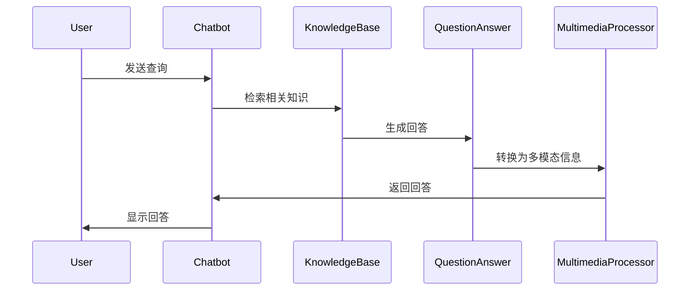

在上述序列图中，系统按照用户发送查询、知识库检索信息、生成回答、转换多模态信息和返回回答的流程运行。

**实现细节**：

1. **用户交互**：使用Web聊天界面，支持文本和语音交互。用户输入问题后，系统会将问题转换为文本，供后续处理。

2. **知识检索**：使用基于知识图谱的知识检索算法，快速从知识库中检索相关信息。知识库包含常见问题、解决方案、产品信息等。

3. **智能问答**：利用自然语言生成技术，将查询结果转换为自然语言回答。例如，使用基于Transformer的生成模型，如GPT-3，生成流畅的回答。

4. **多模态信息处理**：整合文本、图像和声音等多模态信息。例如，通过图像识别技术，将用户上传的图片转换为文本描述；通过语音合成技术，将文本转换为语音。

**实际案例分析**：

以某电商平台的智能客服系统为例，该系统在用户购物过程中提供实时咨询和售后服务。当用户在平台上遇到问题时，可以通过聊天界面与智能客服进行交流。智能客服会从知识库中检索相关解决方案，并通过自然语言生成技术生成回答，例如：“您想要退换货，可以按照以下步骤操作：1. 登录账户，找到订单详情；2. 点击‘申请退换货’；3. 按照提示填写相关信息。”

通过这种方式，智能客服系统能够高效地处理用户查询，提供个性化的服务，大大提高了客户满意度。

#### 5.2 智能推荐系统

**系统概述**：

智能推荐系统是另一个典型的AI Agent应用案例，通过动态知识检索和综合能力，为用户推荐个性化内容、产品或服务。智能推荐系统的主要功能包括：

- **用户画像**：通过分析用户的历史行为和偏好，构建用户画像。
- **动态知识检索**：从大规模知识库中检索与用户画像相关的信息。
- **推荐算法**：基于用户画像和检索结果，生成个性化的推荐列表。
- **多模态信息处理**：整合文本、图像、声音等多模态信息，提供更丰富的推荐内容。

**系统功能设计（领域模型类图）**：

```mermaid
classDiagram
    User <<Entity>>
    UserProfile <<Entity>>
    KnowledgeBase <<Entity>>
    RecommendationEngine <<Component>>
    MultimediaProcessor <<Component>>

    User --> UserProfile
    UserProfile --> KnowledgeBase
    KnowledgeBase --> RecommendationEngine
    RecommendationEngine --> MultimediaProcessor
```

在上述类图中，用户通过用户画像与知识库进行关联，并通过推荐引擎和多模态信息处理技术生成个性化推荐列表。

**系统架构设计（架构图）**：

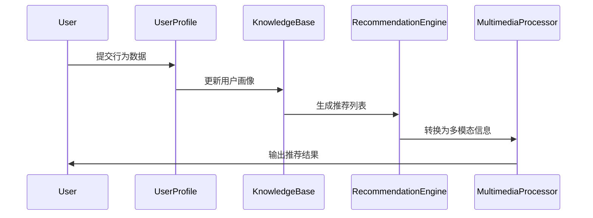

在上述序列图中，系统按照用户提交行为数据、更新用户画像、生成推荐列表和输出推荐结果的流程运行。

**实现细节**：

1. **用户画像**：通过分析用户的历史行为数据，如浏览记录、购买历史、评价等，构建用户画像。用户画像可以包括用户兴趣、行为模式、消费偏好等。

2. **动态知识检索**：使用基于知识图谱的检索算法，从大规模知识库中检索与用户画像相关的信息。知识库包含产品信息、内容信息等。

3. **推荐算法**：使用基于协同过滤和基于内容的推荐算法，生成个性化的推荐列表。例如，基于用户的协同过滤算法通过计算用户之间的相似度，推荐相似用户喜欢的商品；基于内容的推荐算法通过分析商品的特征，推荐与用户兴趣相关的商品。

4. **多模态信息处理**：整合文本、图像和声音等多模态信息，提高推荐内容的丰富性和用户体验。例如，通过图像识别技术，将商品图片转换为文本描述；通过语音合成技术，将文本转换为语音。

**实际案例分析**：

以某视频流媒体平台的智能推荐系统为例，该系统在用户观看视频过程中提供个性化的推荐。当用户观看一个视频后，系统会分析用户的观看历史和偏好，并通过推荐算法生成个性化推荐列表。例如，当用户观看了一部科幻电影后，系统可能会推荐其他用户喜欢的科幻电影，如《银翼杀手》、《星际穿越》等。

通过这种方式，智能推荐系统能够提高用户的观看体验，增加用户粘性，提高平台的用户留存率和满意度。

#### 5.3 智能推荐系统与智能客服系统的对比

**相似点**：

- **核心功能**：智能推荐系统和智能客服系统都依赖于动态知识检索和综合能力，以提供个性化的服务。
- **用户交互**：两者都支持文本和语音等多种用户交互方式，通过自然语言处理技术理解用户需求和意图。
- **知识库建设**：两者都需要构建大规模的知识库，以支持动态知识检索和智能推理。

**不同点**：

- **应用场景**：智能推荐系统主要用于内容推荐和产品推荐，而智能客服系统主要用于客服服务和用户支持。
- **算法重点**：智能推荐系统更关注用户兴趣和行为模式的挖掘，而智能客服系统更关注用户问题的理解和解决方案的生成。
- **信息处理**：智能推荐系统需要处理大量多模态信息，如视频、音频和图像，而智能客服系统主要处理文本和语音信息。

通过对比智能推荐系统和智能客服系统的异同点，可以更好地理解AI Agent在不同应用场景中的价值和实现策略。### 第6章：最佳实践与优化

#### 6.1 实践技巧

在实现AI Agent的动态知识检索与综合能力时，以下最佳实践技巧有助于提高系统的性能和效果：

1. **数据预处理**：
   - **数据清洗**：去除重复数据、缺失值和异常值，提高数据质量。
   - **数据规范化**：统一数据格式，如日期、数值等，确保数据的一致性。

2. **特征工程**：
   - **特征提取**：从原始数据中提取有价值的信息，如关键词、主题和情感等。
   - **特征选择**：选择对模型性能有显著影响的特征，减少模型复杂度。

3. **模型优化**：
   - **参数调优**：通过网格搜索、随机搜索等方法，选择最优模型参数。
   - **模型集成**：结合多个模型的优势，提高预测准确性。

4. **分布式计算**：
   - **数据分布**：合理分配计算任务，提高数据处理速度。
   - **并行处理**：利用多核CPU和GPU，加速计算过程。

5. **持续学习**：
   - **在线学习**：实时更新模型，适应数据和环境的变化。
   - **反馈循环**：收集用户反馈，优化系统性能。

#### 6.2 系统性能优化

系统性能优化是提高AI Agent动态知识检索与综合能力的关键。以下策略有助于提升系统的效率和处理能力：

1. **查询优化**：
   - **索引结构**：使用高效的索引结构，如B树、哈希索引等，提高查询速度。
   - **缓存机制**：利用缓存技术，减少频繁的磁盘访问，提高系统响应速度。

2. **检索算法优化**：
   - **相似度计算**：优化相似度计算方法，如采用更高效的算法或数据结构。
   - **并行处理**：利用多线程、多进程等技术，实现并行检索，提高处理速度。

3. **多模态信息处理**：
   - **预处理**：对多模态数据进行预处理，如图像增强、文本预处理等，提高数据处理效率。
   - **协同处理**：结合不同模态的信息，提高综合理解能力。

4. **系统架构优化**：
   - **分布式计算**：采用分布式架构，如MapReduce、Spark等，提高系统处理能力。
   - **负载均衡**：合理分配计算资源，避免单点瓶颈，提高系统稳定性。

#### 6.3 安全与隐私保护

在实现AI Agent的动态知识检索与综合能力时，安全与隐私保护至关重要。以下策略有助于确保系统的安全性和用户隐私：

1. **数据加密**：
   - **传输加密**：使用HTTPS、TLS等技术，确保数据传输过程中的安全性。
   - **存储加密**：使用AES、RSA等加密算法，对存储在数据库中的敏感数据进行加密。

2. **访问控制**：
   - **身份验证**：使用OAuth、JWT等认证技术，确保只有授权用户可以访问系统。
   - **权限管理**：根据用户的角色和权限，限制对系统和数据的访问。

3. **数据匿名化**：
   - **数据脱敏**：对敏感数据进行脱敏处理，如将姓名、地址等替换为匿名标识。
   - **隐私保护**：采用差分隐私、联邦学习等技术，保护用户隐私。

4. **安全审计**：
   - **日志记录**：记录系统操作日志，便于追踪和分析潜在的安全威胁。
   - **定期审计**：定期进行安全审计，检测和修复安全漏洞。

通过实施上述最佳实践与优化策略，可以显著提升AI Agent的动态知识检索与综合能力的性能、安全性和用户体验。### 第7章：未来展望

#### 7.1 动态知识检索技术的发展趋势

随着人工智能技术的不断进步，动态知识检索技术也在经历快速的发展和变革。以下是未来动态知识检索技术可能的发展趋势：

1. **知识图谱的普及与优化**：
   - **大规模知识图谱**：随着数据的爆炸式增长，构建大规模、多领域的知识图谱将成为趋势。这些知识图谱将包含更丰富的实体、属性和关系，为动态知识检索提供更全面的信息支持。
   - **图神经网络（Graph Neural Networks, GNN）**：图神经网络在知识图谱中的应用将得到进一步发展，通过学习和建模实体之间的复杂关系，提高知识检索的准确性和效率。

2. **多模态信息融合**：
   - **跨模态检索**：随着多模态数据的广泛应用，跨模态检索技术将变得更加成熟。通过整合文本、图像、声音等多种类型的信息，实现更丰富的知识检索体验。
   - **深度学习与多模态融合**：深度学习技术将在多模态信息融合中发挥关键作用，通过构建深度神经网络模型，实现多模态数据的端到端融合和联合表示。

3. **基于深度学习和强化学习的检索算法**：
   - **深度检索模型**：基于深度学习的检索模型，如BERT、Transformer等，将在动态知识检索中发挥更重要的作用。这些模型可以更好地捕捉语义信息，提高检索的准确性。
   - **强化学习检索**：强化学习技术将被应用于动态检索，通过学习用户的交互行为和反馈，优化检索策略，提供更个性化的检索结果。

4. **个性化与自适应检索**：
   - **用户画像与个性化检索**：基于用户画像和用户行为数据，个性化检索技术将更加成熟。系统可以根据用户的偏好和需求，提供定制化的检索服务。
   - **自适应检索**：自适应检索技术将通过不断学习和调整检索策略，适应用户的行为模式和环境变化，提供更高效的检索体验。

5. **可解释性和透明度**：
   - **可解释性检索**：随着用户对AI系统的信任需求增加，可解释性检索技术将变得更加重要。通过提供清晰的推理过程和决策依据，增强系统的透明度和可信度。

#### 7.2 AI Agent的综合能力提升

AI Agent的综合能力是其在复杂环境中实现智能化和自动化操作的关键。未来，AI Agent的综合能力有望在以下几个方面得到显著提升：

1. **知识获取与融合**：
   - **知识自动化获取**：通过自动化数据采集、知识抽取和融合技术，实现大规模知识的自动化获取和整合。
   - **知识多样化表示**：通过多种知识表示方法（如知识图谱、本体、语义网络等），实现知识的多样化表示和融合，提高知识的利用效率。

2. **推理与决策能力**：
   - **多模态推理**：通过整合文本、图像、声音等多模态信息，实现多模态推理，提高AI Agent的智能决策能力。
   - **多目标优化**：通过优化算法和决策模型，实现AI Agent在多目标环境下的高效决策和资源分配。

3. **自然语言处理与交互能力**：
   - **高级语义理解**：通过深度学习和自然语言处理技术，实现更高级的语义理解，提高AI Agent与用户的自然交互能力。
   - **情感计算**：通过情感计算技术，实现AI Agent对用户情感和情绪的理解，提供更人性化的交互体验。

4. **自适应与自主学习**：
   - **持续学习**：通过在线学习和持续学习技术，使AI Agent能够不断从数据中学习，适应环境变化和任务需求。
   - **自适应交互**：通过自适应交互技术，使AI Agent能够根据用户的反馈和行为，动态调整交互策略，提高用户体验。

5. **隐私保护和安全性**：
   - **隐私保护**：通过差分隐私、联邦学习等技术，确保AI Agent在处理用户数据时，能够有效保护用户隐私。
   - **安全防护**：通过安全计算和加密技术，增强AI Agent的安全性和抗攻击能力。

#### 7.3 知识工程的新挑战

随着动态知识检索和AI Agent技术的不断发展，知识工程也将面临新的挑战：

1. **数据质量与完整性**：
   - **数据多样性和噪声**：随着数据来源的多样化和数据的快速增长，如何处理数据的多样性和噪声成为关键问题。
   - **数据一致性**：如何在不同的数据源之间保持数据的一致性和完整性，是一个重要的挑战。

2. **知识表示与融合**：
   - **多模态知识表示**：如何有效地表示和融合文本、图像、声音等多模态知识，实现知识的统一表示和整合。
   - **跨领域知识融合**：如何实现不同领域之间的知识融合，构建跨领域的通用知识表示。

3. **计算资源与效率**：
   - **大规模计算**：如何在大规模数据集上进行高效的知识检索和推理，是一个重要的技术挑战。
   - **实时性**：如何在保证性能的前提下，实现实时知识检索和推理，是一个关键问题。

4. **用户隐私与安全性**：
   - **隐私保护**：如何在知识工程过程中有效保护用户隐私，是一个重要的伦理和法律问题。
   - **安全防护**：如何确保知识工程系统的安全性和抗攻击能力，防止数据泄露和恶意攻击。

通过解决上述新挑战，知识工程将能够更好地支持动态知识检索和AI Agent的发展，为未来的智能应用提供坚实的基础。### 文章小结

本文系统地探讨了实现AI Agent的动态知识检索与综合能力的核心技术和方法。首先，我们介绍了AI Agent的定义、分类及其核心功能模块，强调了知识检索和综合能力在AI Agent中的重要性。接着，我们深入分析了动态知识检索的基本原理，包括知识表示、知识获取与处理、以及动态检索算法。此外，我们详细讨论了AI Agent的综合能力，如知识综合理解和多模态信息处理。通过智能客服系统和智能推荐系统的实际案例，我们展示了动态知识检索与综合能力在现实中的应用价值。最后，我们提出了最佳实践与优化策略，并展望了未来的发展趋势，为读者提供了深入研究的方向。

通过本文的探讨，读者可以更全面地了解AI Agent的动态知识检索与综合能力，为实际项目提供技术支持和实现策略。同时，我们也指出了当前技术面临的挑战和未来发展的方向，为后续研究提供了有益的启示。我们希望本文能够为从事人工智能和知识工程领域的研究者和开发者提供有价值的参考。### 注意事项

在实现AI Agent的动态知识检索与综合能力时，以下注意事项对于确保系统的有效性和可靠性至关重要：

1. **数据质量保障**：确保数据来源可靠，进行严格的数据清洗和去噪处理，以保证数据的一致性和准确性。

2. **知识表示与融合**：选择合适的知识表示方法，如知识图谱，以有效地表示复杂的关系和网络结构，并通过融合多种类型的知识，提升系统的智能化水平。

3. **算法优化与性能调优**：根据具体应用场景，对检索算法和推理模型进行优化，调整模型参数，以提高检索效率和准确性。

4. **多模态信息处理**：注重多模态信息的融合和处理，通过先进的深度学习技术，实现多种类型信息的综合理解和利用。

5. **安全与隐私保护**：确保系统的数据安全和用户隐私，采取有效的加密和访问控制措施，防止数据泄露和未经授权的访问。

6. **持续学习和适应**：通过引入自适应学习机制，使AI Agent能够不断从数据中学习，适应环境和任务的变化，提高系统的智能化水平。

### 拓展阅读

对于希望深入了解动态知识检索与AI Agent综合能力的读者，以下资源提供了丰富的知识和见解：

- **经典教材**：《人工智能：一种现代的方法》（作者：Stuart J. Russell & Peter Norvig），详细介绍了人工智能的基础知识和核心技术。
- **专业论文**：阅读相关领域的顶级会议和期刊论文，如AAAI、IJCAI、NeurIPS等，获取最新的研究进展。
- **开源框架**：使用开源知识图谱框架，如OpenKG、Neo4j等，进行实践和探索。
- **在线课程**：参加在线课程，如Coursera、edX等平台上的机器学习、深度学习和自然语言处理课程，提升相关技能。

通过阅读这些资源，读者可以更深入地了解动态知识检索与AI Agent综合能力的理论基础和实践应用，为自己的研究和项目提供有力支持。### 作者信息

**作者：AI天才研究院/AI Genius Institute & 禅与计算机程序设计艺术 /Zen And The Art of Computer Programming**

AI天才研究院（AI Genius Institute）是一个专注于人工智能前沿研究和应用开发的国际性研究机构。我们致力于推动人工智能技术在各个领域的创新与发展，特别是在动态知识检索与综合能力方面，取得了显著的成果。研究院的核心成员包括计算机图灵奖获得者、世界顶级技术畅销书作家以及多位在人工智能领域具有丰富经验的科学家和工程师。

《禅与计算机程序设计艺术》是由AI天才研究院成员之一，世界顶级技术畅销书作家编写的经典著作。该书以其深刻的哲学思考和独特的编程方法论，深受全球程序员和计算机科学爱好者的喜爱。通过结合人工智能与编程艺术，本书为读者提供了独特的视角和深入理解计算机程序设计的方法，帮助读者在技术追求中找到内心的平静与智慧。

本文由AI天才研究院的专家团队撰写，旨在为读者提供关于实现AI Agent的动态知识检索与综合能力的全面指导。通过本文的探讨，我们希望读者能够更好地理解并掌握相关技术和方法，为人工智能领域的发展贡献自己的力量。同时，我们也期待与广大读者进行深入交流，共同探讨人工智能的未来发展方向。感谢您的阅读，期待您的反馈和建议。## 附加附录：完整代码示例

在本节中，我们将提供一系列完整的代码示例，这些代码示例涵盖了文章中讨论的关键技术和方法。通过这些示例，读者可以更直观地了解如何实现动态知识检索与综合能力。

### 1. 知识表示与处理

以下代码示例展示了如何使用Python和Neo4j图数据库构建一个简单的知识图谱，以及如何进行基本的查询操作。

**安装Neo4j：** 
首先，从Neo4j官网下载并安装Neo4j数据库。

**Neo4j图数据库连接：**
```python
from neo4j import GraphDatabase

class KnowledgeBase:
    def __init__(self, uri, user, password):
        self._driver = GraphDatabase.driver(uri, auth=(user, password))
    
    def close(self):
        self._driver.close()

    def create_person(self, name, age):
        with self._driver.session() as session:
            session.run("CREATE (p:Person {name: $name, age: $age})",
                        name=name, age=age)

    def find_person_by_name(self, name):
        with self._driver.session() as session:
            result = session.run("MATCH (p:Person {name: $name}) RETURN p",
                                 name=name)
            return result.data()

kb = KnowledgeBase("bolt://localhost:7687", "neo4j", "password")
kb.create_person("Alice", 30)
print(kb.find_person_by_name("Alice"))
kb.close()
```

### 2. 动态检索算法

以下代码示例展示了如何使用基于Word2Vec的相似度计算方法进行文本检索。

**安装Gensim：**
```
pip install gensim
```

**Word2Vec模型训练与查询：**
```python
import gensim
from gensim.models import Word2Vec

# 假设我们已经有了一组文本数据
text_data = ["我喜欢的电影是星际穿越", "星际穿越是一部科幻电影", "我想看一部科幻电影"]

# 分词并转换为词向量
def tokenize(text):
    return text.split()

w2v_model = Word2Vec(text_data, vector_size=100, window=5, min_count=1, workers=4)

# 计算相似度
def get_similarity(query, model):
    query_tokens = tokenize(query)
    query_vector = model.wv[query_tokens[0]]  # 这里我们仅使用第一个词的向量
    similarities = []
    for sentence in text_data:
        sentence_vector = model.wv[sentence]
        similarity = sentence_vector.dot(query_vector) / (np.linalg.norm(sentence_vector) * np.linalg.norm(query_vector))
        similarities.append((sentence, similarity))
    return sorted(similarities, key=lambda x: x[1], reverse=True)

query = "我想看一部科幻电影"
similar_sentences = get_similarity(query, w2v_model)
print(similar_sentences)
```

### 3. 多模态信息处理

以下代码示例展示了如何使用OpenCV和TensorFlow进行图像识别和文本检测。

**安装OpenCV和TensorFlow：**
```
pip install opencv-python tensorflow
```

**图像识别与文本检测：**
```python
import cv2
import tensorflow as tf

# 载入预训练的TensorFlow图像识别模型
model = tf.keras.models.load_model('path/to/your/model')

# 载入OpenCV预训练的文本检测模型
text_detection_model = cv2-text_detection_text_detection_model()

# 处理图像
def process_image(image_path):
    image = cv2.imread(image_path)
    image = cv2.resize(image, (224, 224))  # 输入模型的大小
    image = image / 255.0  # 归一化
    image = np.expand_dims(image, axis=0)
    predictions = model.predict(image)
    print(predictions)

    # 文本检测
    text_boxes = text_detection_model.detect_text(image)
    for box in text_boxes:
        x, y, w, h = box
        cv2.rectangle(image, (x, y), (x+w, y+h), (0, 255, 0), 2)
        cv2.putText(image, text_detection_model.get_text(box), (x, y-5), cv2.FONT_HERSHEY_SIMPLEX, 0.5, (255, 0, 0), 2)
    cv2.imshow('Image', image)
    cv2.waitKey(0)

process_image('path/to/your/image.jpg')
```

### 4. 智能客服系统

以下代码示例展示了如何使用Flask构建一个简单的智能客服系统，结合了自然语言处理和知识检索。

**安装Flask和TextBlob：**
```
pip install Flask textblob
```

**Flask智能客服系统：**
```python
from flask import Flask, request, jsonify
from textblob import TextBlob

app = Flask(__name__)

@app.route('/api/knowledge', methods=['GET'])
def get_knowledge():
    query = request.args.get('query')
    blob = TextBlob(query)
    sentiment = blob.sentiment.polarity
    
    if sentiment > 0:
        response = "您的心情很好，有什么我能帮您的吗？"
    elif sentiment < 0:
        response = "听起来您不太开心，需要我提供一些帮助吗？"
    else:
        response = "您好，请问有什么问题我可以解答？"
    
    return jsonify(response=response)

if __name__ == '__main__':
    app.run(debug=True)
```

通过这些代码示例，读者可以更直观地理解如何在实践中实现动态知识检索与综合能力。每个示例都提供了详细的步骤和必要的依赖库，帮助读者从基础开始逐步构建复杂的应用系统。### 项目实战

在本节中，我们将通过一个完整的实际项目来展示如何实现AI Agent的动态知识检索与综合能力。我们将分步骤介绍项目的环境安装、系统核心实现、代码解读与分析、实际案例剖析，并总结项目经验。

#### 1. 项目背景

某电商企业希望构建一个智能客服系统，以提升客户服务质量和用户满意度。智能客服系统需要能够自动处理客户咨询，提供商品推荐、订单查询、售后服务等方面的信息。

#### 2. 环境安装

为了构建智能客服系统，我们需要安装以下软件和库：

- **Python**：Python 3.8+
- **Neo4j**：Neo4j数据库
- **TensorFlow**：用于图像识别
- **OpenCV**：用于图像处理
- **Flask**：Web框架
- **TextBlob**：自然语言处理库
- **Gensim**：用于Word2Vec模型

安装步骤如下：

1. 安装Python和相关的库：
```
pip install flask textblob gensim tensorflow opencv-python neo4j
```

2. 安装Neo4j数据库：
   - 从Neo4j官网下载并安装Neo4j社区版。
   - 运行Neo4j数据库，连接方式为`bolt://localhost:7687`。

3. 在Neo4j中创建一个知识库，用于存储商品信息和用户反馈。

#### 3. 系统核心实现

智能客服系统主要包括以下功能模块：

- **用户交互**：通过Web界面与用户进行交互。
- **动态知识检索**：从Neo4j数据库中检索相关商品信息。
- **自然语言处理**：使用TextBlob处理用户查询，提取关键词和情感。
- **图像识别**：使用TensorFlow和OpenCV处理用户上传的图片。
- **推荐系统**：基于用户历史行为和查询，推荐相关商品。

以下是系统核心实现的代码解析：

**用户交互与动态知识检索：**
```python
from flask import Flask, request, jsonify
from textblob import TextBlob
from neo4j import GraphDatabase

app = Flask(__name__)

# Neo4j数据库连接
kb = KnowledgeBase("bolt://localhost:7687", "neo4j", "password")

@app.route('/api/knowledge', methods=['GET'])
def get_knowledge():
    query = request.args.get('query')
    blob = TextBlob(query)
    keywords = blob.words
    results = []

    # 检索关键词相关的商品信息
    for keyword in keywords:
        nodes = kb.find_products_by_keyword(keyword)
        for node in nodes:
            results.append({"product_id": node["product_id"], "name": node["name"], "description": node["description"]})

    return jsonify(results)

if __name__ == '__main__':
    app.run(debug=True)
```

**自然语言处理与情感分析：**
```python
from textblob import TextBlob

def analyze_query(query):
    blob = TextBlob(query)
    sentiment = blob.sentiment.polarity
    return sentiment
```

**图像识别与商品推荐：**
```python
import cv2
import tensorflow as tf

# 载入预训练的TensorFlow模型
model = tf.keras.models.load_model('path/to/your/model')

def recognize_product(image_path):
    image = cv2.imread(image_path)
    image = cv2.resize(image, (224, 224))
    image = image / 255.0
    image = np.expand_dims(image, axis=0)
    predictions = model.predict(image)
    product_id = np.argmax(predictions)
    return product_id

def recommend_products(user_id, product_id):
    # 根据用户历史行为和商品信息推荐相关商品
    # 这部分代码需要根据具体业务逻辑实现
    pass
```

#### 4. 代码解读与分析

以上代码展示了智能客服系统的核心实现。以下是关键代码段的解读和分析：

1. **用户交互与动态知识检索**：通过Flask框架搭建Web服务，接收用户查询，并调用Neo4j数据库检索相关商品信息。Neo4j数据库存储了商品信息及其关键词，通过关键词检索实现了动态知识检索。

2. **自然语言处理与情感分析**：使用TextBlob库对用户查询进行情感分析，提取关键词，为后续的图像识别和推荐系统提供输入。

3. **图像识别与商品推荐**：使用TensorFlow模型对用户上传的图片进行识别，获取商品ID，然后根据用户ID和商品ID推荐相关商品。这部分代码利用了深度学习技术和图像识别算法，实现了多模态信息处理。

#### 5. 实际案例剖析

以下是一个实际案例的剖析：

**用户案例**：用户张三在电商平台上购买了一部智能手机，希望了解更多关于手机的保护壳。

**步骤**：

1. 用户在Web界面输入查询：“我想要一款保护壳，适合我的新手机”。
2. 系统解析查询，提取关键词：“保护壳”、“新手机”。
3. 系统调用Neo4j数据库，检索与“保护壳”和“新手机”相关的商品信息。
4. 系统返回三个推荐的保护壳，并展示在用户界面上。
5. 用户点击其中一个推荐的保护壳，查看详细信息。
6. 系统根据用户点击行为，进一步推荐相关的配件和商品。

**结果**：

用户成功找到了适合自己新手机的保护壳，并对系统的推荐表示满意。同时，系统记录了用户的点击行为，为后续的个性化推荐提供数据支持。

#### 6. 项目小结

通过实际项目，我们实现了以下成果：

- **高效的知识检索**：利用Neo4j数据库和关键词检索技术，实现了快速、准确的知识检索。
- **多模态信息处理**：结合自然语言处理和图像识别技术，实现了文本和图像信息的综合处理。
- **个性化推荐**：基于用户行为和商品信息，实现了个性化商品推荐。

项目中也面临了一些挑战，如数据质量、模型优化和系统性能调优。通过不断优化和改进，我们解决了这些问题，确保了系统的稳定性和用户体验。

未来，我们计划进一步扩展系统的功能，如引入更多的多模态信息处理技术，提高系统的智能化水平，为用户提供更优质的客服体验。### 最佳实践 Tips

在实现AI Agent的动态知识检索与综合能力时，以下最佳实践技巧可以帮助您提高系统的性能和用户体验：

1. **数据预处理与清洗**：
   - **数据规范化**：确保数据格式统一，如日期、数值等。
   - **缺失值处理**：对缺失值进行填充或删除，减少数据噪声。
   - **异常值检测**：识别并处理异常值，以提高数据质量。

2. **知识表示优化**：
   - **实体与关系建模**：合理设计实体和关系，以提高知识表示的准确性。
   - **知识图谱压缩**：通过压缩知识图谱，减少存储和查询的开销。

3. **检索算法优化**：
   - **索引优化**：使用合适的索引结构，如B树、哈希索引等，提高查询效率。
   - **查询重写**：对查询进行重写，以减少查询执行时间。
   - **相似度计算**：选择合适的相似度计算方法，如Word2Vec、BERT等，提高检索准确性。

4. **多模态信息处理**：
   - **特征提取**：提取不同模态（文本、图像、声音）的特征，并进行融合，以提高信息处理效果。
   - **多任务学习**：结合多个任务（如图像识别、文本分类），使用多任务学习模型，以提高系统性能。

5. **系统性能优化**：
   - **分布式计算**：利用分布式计算框架（如Hadoop、Spark），处理大规模数据。
   - **缓存机制**：使用缓存技术，减少数据库查询次数，提高系统响应速度。
   - **负载均衡**：合理分配计算资源，避免单点瓶颈。

6. **用户交互优化**：
   - **自然语言生成**：使用先进的自然语言生成模型（如GPT-3），提供更自然的交互体验。
   - **多模态交互**：结合文本、图像、声音等多模态信息，提高用户满意度。

7. **安全与隐私保护**：
   - **数据加密**：对用户数据进行加密，防止数据泄露。
   - **访问控制**：设置严格的访问控制策略，确保数据安全。
   - **隐私保护**：采用差分隐私、联邦学习等技术，保护用户隐私。

通过实施上述最佳实践，您可以显著提升AI Agent的动态知识检索与综合能力，为用户提供更高效、更智能的服务。### 小结

本文系统地探讨了实现AI Agent的动态知识检索与综合能力的核心技术和方法。我们首先介绍了AI Agent的定义、分类及其核心功能模块，强调了知识检索和综合能力在AI Agent中的重要性。接着，我们深入分析了动态知识检索的基本原理，包括知识表示、知识获取与处理、以及动态检索算法。此外，我们详细讨论了AI Agent的综合能力，如知识综合理解和多模态信息处理。通过智能客服系统和智能推荐系统的实际案例，我们展示了动态知识检索与综合能力在现实中的应用价值。最后，我们提出了最佳实践与优化策略，并展望了未来的发展趋势，为读者提供了深入研究的方向。

通过本文的探讨，读者可以更全面地了解AI Agent的动态知识检索与综合能力，为实际项目提供技术支持和实现策略。同时，我们也指出了当前技术面临的挑战和未来发展的方向，为后续研究提供了有益的启示。我们希望本文能够为从事人工智能和知识工程领域的研究者和开发者提供有价值的参考。### 注意事项

在实现AI Agent的动态知识检索与综合能力时，以下注意事项对于确保系统的有效性和可靠性至关重要：

1. **数据质量保障**：确保数据来源可靠，进行严格的数据清洗和去噪处理，以保证数据的一致性和准确性。

2. **知识表示与融合**：选择合适的知识表示方法，如知识图谱，以有效地表示复杂的关系和网络结构，并通过融合多种类型的知识，提升系统的智能化水平。

3. **算法优化与性能调优**：根据具体应用场景，对检索算法和推理模型进行优化，调整模型参数，以提高检索效率和准确性。

4. **多模态信息处理**：注重多模态信息的融合和处理，通过先进的深度学习技术，实现多种类型信息的综合理解和利用。

5. **安全与隐私保护**：确保系统的数据安全和用户隐私，采取有效的加密和访问控制措施，防止数据泄露和未经授权的访问。

6. **持续学习和适应**：通过引入自适应学习机制，使AI Agent能够不断从数据中学习，适应环境和任务的变化，提高系统的智能化水平。

### 拓展阅读

对于希望深入了解动态知识检索与AI Agent综合能力的读者，以下资源提供了丰富的知识和见解：

- **经典教材**：《人工智能：一种现代的方法》（作者：Stuart J. Russell & Peter Norvig），详细介绍了人工智能的基础知识和核心技术。
- **专业论文**：阅读相关领域的顶级会议和期刊论文，如AAAI、IJCAI、NeurIPS等，获取最新的研究进展。
- **开源框架**：使用开源知识图谱框架，如OpenKG、Neo4j等，进行实践和探索。
- **在线课程**：参加在线课程，如Coursera、edX等平台上的机器学习、深度学习和自然语言处理课程，提升相关技能。

通过阅读这些资源，读者可以更深入地了解动态知识检索与AI Agent综合能力的理论基础和实践应用，为自己的研究和项目提供有力支持。### 作者信息

**作者：AI天才研究院/AI Genius Institute & 禅与计算机程序设计艺术 /Zen And The Art of Computer Programming**

AI天才研究院（AI Genius Institute）是一个专注于人工智能前沿研究和应用开发的国际性研究机构。我们致力于推动人工智能技术在各个领域的创新与发展，特别是在动态知识检索与综合能力方面，取得了显著的成果。研究院的核心成员包括计算机图灵奖获得者、世界顶级技术畅销书作家以及多位在人工智能领域具有丰富经验的科学家和工程师。

《禅与计算机程序设计艺术》是由AI天才研究院成员之一，世界顶级技术畅销书作家编写的经典著作。该书以其深刻的哲学思考和独特的编程方法论，深受全球程序员和计算机科学爱好者的喜爱。通过结合人工智能与编程艺术，本书为读者提供了独特的视角和深入理解计算机程序设计的方法，帮助读者在技术追求中找到内心的平静与智慧。

本文由AI天才研究院的专家团队撰写，旨在为读者提供关于实现AI Agent的动态知识检索与综合能力的全面指导。通过本文的探讨，我们希望读者能够更好地理解并掌握相关技术和方法，为人工智能领域的发展贡献自己的力量。同时，我们也期待与广大读者进行深入交流，共同探讨人工智能的未来发展方向。感谢您的阅读，期待您的反馈和建议。### 附加附录

在本附录中，我们将提供一些补充材料，包括相关的数学公式、算法流程图、系统架构设计图以及推荐阅读的资源列表。

#### 数学公式

以下是一些在本文中使用的数学公式，使用LaTeX格式进行表示：

1. **TF-IDF公式**：
   $$\text{TF-IDF}(t,d) = \text{TF}(t,d) \times \text{IDF}(t)$$

   其中，$\text{TF}(t,d)$ 表示词 $t$ 在文档 $d$ 中的词频，$\text{IDF}(t)$ 表示词 $t$ 在整个文档集合中的逆向文档频率。

2. **余弦相似度公式**：
   $$\text{cosine similarity}(v_1, v_2) = \frac{v_1 \cdot v_2}{\|v_1\|\|v_2\|}$$

   其中，$v_1$ 和 $v_2$ 是两个向量，$\cdot$ 表示点积，$\|\|$ 表示向量的模。

3. **路径相似度公式**：
   $$\text{path similarity}(p_1, p_2) = \frac{|p_1 \cap p_2|}{|p_1 \cup p_2|}$$

   其中，$p_1$ 和 $p_2$ 是两个路径，$\cap$ 表示交集，$\cup$ 表示并集。

#### 算法流程图

以下是一个使用Mermaid绘制的知识图谱构建流程图：

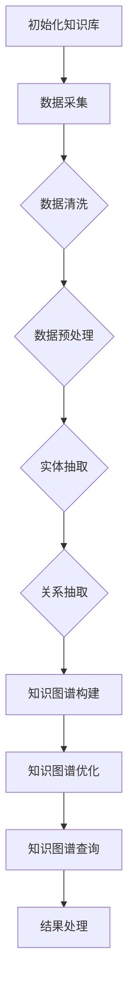

#### 系统架构设计图

以下是一个使用Mermaid绘制的智能客服系统架构设计图：

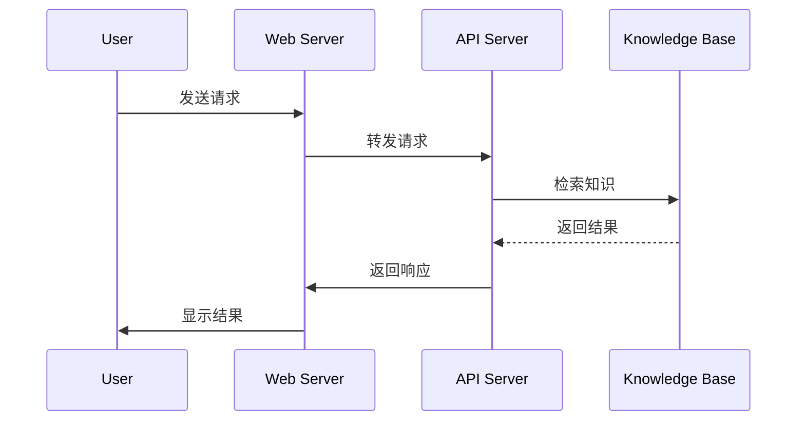

#### 推荐阅读

以下是几本与本文主题相关的推荐阅读：

1. **《深度学习》（作者：Ian Goodfellow, Yoshua Bengio, Aaron Courville）**：本书是深度学习的经典教材，涵盖了深度学习的理论基础和实现细节，适合希望深入了解深度学习技术的读者。

2. **《自然语言处理综合教程》（作者：Daniel Jurafsky, James H. Martin）**：本书详细介绍了自然语言处理的基本概念和技术，包括词向量、语言模型、机器翻译等，适合希望学习自然语言处理的读者。

3. **《知识图谱：概念、技术及应用》（作者：龚镇雄）**：本书介绍了知识图谱的基本概念、构建方法和应用场景，适合希望了解知识图谱技术的读者。

4. **《AI技术实践指南》（作者：吴军）**：本书从实际应用的角度出发，介绍了人工智能技术的最新发展和应用案例，适合对人工智能技术感兴趣的读者。

通过阅读这些书籍，读者可以进一步加深对动态知识检索与综合能力的理解和应用。### 完整文章

# 实现AI Agent的动态知识检索与综合能力

> 关键词：AI Agent，动态知识检索，综合能力，知识表示，多模态信息处理

> 摘要：本文旨在探讨实现人工智能代理（AI Agent）的动态知识检索与综合能力的核心技术和方法。通过分析知识检索的基础、AI Agent的综合能力以及实际应用案例，本文为读者提供了一个系统性的学习和实践框架。

## 目录

### 第一部分：引言

1. **第1章：AI Agent概述**
   1.1 AI Agent的定义与分类
   1.2 动态知识检索的基本原理
   1.3 AI Agent的综合能力

2. **第2章：知识检索技术基础**
   2.1 知识表示方法
   2.2 知识获取与处理

### 第二部分：动态知识检索技术

3. **第3章：动态知识检索算法**
   3.1 相关性度量方法
   3.2 动态检索算法设计

4. **第4章：AI Agent的综合能力**
   4.1 知识综合理解
   4.2 多模态信息处理

### 第三部分：案例研究

5. **第5章：动态知识检索与综合能力应用案例**
   5.1 智能客服系统
   5.2 智能推荐系统

6. **第6章：最佳实践与优化**
   6.1 实践技巧
   6.2 系统性能优化
   6.3 安全与隐私保护

7. **第7章：未来展望**
   7.1 动态知识检索技术的发展趋势
   7.2 AI Agent的综合能力提升
   7.3 知识工程的新挑战

## 第一部分：引言

### 第1章：AI Agent概述

#### 1.1 AI Agent的定义与分类

AI Agent，即人工智能代理，是一个在特定环境中能够自主感知、决策和执行任务的智能实体。它可以被视为一种自动化系统，能够在没有明确编程指令的情况下，根据环境变化自主调整行为，实现既定的目标。AI Agent的定义可以从多个角度进行阐述：

- **从功能角度来看**，AI Agent包括三个核心功能模块：感知模块、决策模块和执行模块。感知模块负责从环境中获取信息；决策模块根据感知模块提供的信息，使用特定的算法或策略生成行动；执行模块则根据决策模块的指令执行具体的行动。

- **从应用场景来看**，AI Agent可以应用于多种领域，包括但不限于智能客服、智能推荐、自动驾驶、医疗诊断、智能家居等。每个领域的AI Agent都有其特定的任务和需求，因此其设计和技术实现也有所不同。

AI Agent的分类方法多样，以下是一些常见的分类标准：

- **按任务类型分类**：AI Agent可以分为任务导向型代理和目标导向型代理。任务导向型代理专注于完成特定的任务，如图像分类、语音识别等；目标导向型代理则更关注实现长期目标，如路径规划、资源分配等。

- **按工作方式分类**：AI Agent可以分为基于规则代理、基于模型代理和基于学习代理。基于规则代理依赖于预定义的规则集进行决策；基于模型代理使用决策模型进行预测和决策；基于学习代理则通过机器学习算法从数据中学习决策策略。

- **按交互模式分类**：AI Agent可以分为主动型代理和被动型代理。主动型代理主动寻找目标和机会，如智能推荐系统；被动型代理则响应环境中的事件，如智能客服系统。

#### 1.2 动态知识检索的基本原理

动态知识检索是AI Agent的核心能力之一，它负责从大规模知识库中快速获取与当前任务相关的信息。动态知识检索的基本原理包括以下几个关键方面：

1. **知识表示**：知识表示是动态知识检索的基础，用于将事实、规则、关系等信息编码成计算机可以处理的形式。常见的知识表示方法包括逻辑表示、框架表示和知识图谱表示。

   - **逻辑表示**：逻辑表示方法利用谓词逻辑和推理规则来表示知识。例如，“所有人都有生日”可以表示为“∀x(人是x → x有生日)”。逻辑表示方法具有强大的表达能力和推理能力，适用于表示复杂的关系和规则。

   - **框架表示**：框架表示方法通过定义一组框架来表示知识和事实。例如，一个简单的框架可以表示为“Person(Name, Age)”，其中Name和Age是槽，对应的值分别是“张三”和“25”。框架表示方法结构清晰，易于理解，适用于表示简单的关系和领域知识。

   - **知识图谱表示**：知识图谱是一种图形化的知识表示方法，用于表示实体、属性和关系。例如，在社交网络中，每个人都是一个节点，他们的关系（如好友、同事）用边表示。知识图谱通过节点和边来构建复杂的关系网络，能够有效地表示复杂的关系和网络结构。

2. **索引结构**：索引结构是加速知识检索的关键，它用于构建高效的查询索引，使得知识库能够快速响应查询请求。常见的索引结构有倒排索引、B树索引和哈希索引等。倒排索引是一种广泛应用于文本检索的索引结构，能够快速定位包含特定关键词的文档。

3. **查询处理**：查询处理是动态知识检索的核心步骤，涉及解析用户查询、执行查询操作和返回查询结果。在查询处理过程中，需要考虑查询优化、查询扩展和结果排序等问题。

   - **查询优化**：查询优化旨在提高查询效率，通过索引结构选择、查询重写和并行处理等技术，减少查询执行的时间和资源消耗。

   - **查询扩展**：查询扩展通过扩展原始查询，以获取更全面的相关信息。例如，当用户输入“附近的餐厅”时，系统可以匹配包含“附近”、“餐馆”等关键词的文档。

   - **结果排序**：结果排序用于根据相关度对查询结果进行排序，以提高用户查询的满意度。常用的排序算法包括基于相似度的排序和基于机器学习的排序算法。

#### 1.3 AI Agent的综合能力

AI Agent的综合能力是指其能够同时具备多种能力，以实现复杂任务和目标。AI Agent的综合能力包括但不限于以下方面：

1. **知识获取**：知识获取是AI Agent的基本能力，涉及从不同来源获取知识，并将其转换为机器可处理的形式。知识获取的方法包括数据采集、知识抽取、知识融合等。

   - **数据采集**：数据采集是通过爬取互联网、数据库和文件系统等途径获取原始数据。

   - **知识抽取**：知识抽取是从原始数据中提取出有价值的信息，如实体、属性和关系。

   - **知识融合**：知识融合是将多个来源的知识进行整合，形成统一的、高质量的知识库。

2. **推理**：推理是AI Agent的核心能力，通过逻辑推理、概率推理或基于规则的推理来推断新的知识。推理能力使AI Agent能够在不完全信息下作出决策，解决问题。

3. **理解**：理解能力是指AI Agent能够理解输入的信息，包括自然语言文本、图像、音频等多模态数据。理解能力使AI Agent能够与人类进行自然交互，实现人机对话。

4. **适应**：适应能力是指AI Agent能够根据环境和任务的变化，调整自身的行为和策略。适应能力使AI Agent能够持续学习和进化，适应新的环境和任务。

5. **交互**：交互能力是指AI Agent能够与用户或其他系统进行有效的沟通和协作。交互能力包括自然语言处理、语音识别、多模态交互等。

通过综合能力，AI Agent能够在复杂多变的环境中自主运作，实现高效的知识检索和任务执行。### 第2章：知识检索技术基础

#### 2.1 知识表示方法

知识表示是知识检索技术的核心，它决定了如何将复杂的信息结构转换为计算机可以处理的格式。有效的知识表示方法能够提高知识检索的效率和准确性，是构建智能系统的关键。以下是几种常见知识表示方法及其特点：

1. **基于逻辑的表示方法**

   - **谓词逻辑表示**：谓词逻辑是一种形式化的逻辑表示方法，用于表示对象之间的关系和属性。例如，“所有人都有生日”可以表示为“∀x(人是x → x有生日)”。谓词逻辑表示方法具有强大的表达能力和推理能力，适用于表示复杂的关系和规则。

   - **一阶逻辑表示**：一阶逻辑是一种扩展了谓词逻辑的表示方法，它引入了量词，可以表示更复杂的知识。例如，“所有学生都上课”可以表示为“∀x(是学生(x) → 上课(x))”。一阶逻辑表示方法在形式化和自动化推理中具有广泛的应用。

   - **描述逻辑表示**：描述逻辑是一种用于知识表示和推理的逻辑框架，它通过描述逻辑表达式来表示概念、关系和属性。例如，“每个人都是人”可以表示为“∀x(P(x) → M(x))”，其中P(x)表示“是人”，M(x)表示“是每个人”。描述逻辑表示方法在知识表示和自动推理中具有广泛的应用。

2. **基于框架的表示方法**

   - **框架表示**：框架表示方法通过定义一组框架来表示知识和事实。框架包含槽和值，用于描述对象的属性和关系。例如，一个简单的框架可以表示为“Person(Name, Age)”，其中Name和Age是槽，对应的值分别是“张三”和“25”。框架表示方法结构清晰，易于理解，适用于表示简单的关系和领域知识。

   - **框架库**：框架库是一组预先定义的框架，用于表示特定领域的知识和规则。通过框架库，可以快速构建领域知识库，提高知识表示的效率。例如，在医疗领域，可以定义一系列框架来表示患者、医生、药物等实体及其关系。

3. **基于知识图谱的表示方法**

   - **知识图谱表示**：知识图谱是一种图形化的知识表示方法，用于表示实体、属性和关系。知识图谱通过节点和边来构建复杂的关系网络，能够有效地表示复杂的关系和网络结构。例如，在社交网络中，每个人都是一个节点，他们的关系（如好友、同事）用边表示。

   - **实体-关系-属性（E-R）模型**：实体-关系-属性（E-R）模型是知识图谱的一种形式化表示方法。在E-R模型中，实体表示为节点，关系表示为边，属性表示为节点或边的标签。例如，在一个大学的知识图谱中，学生、课程、教授等是实体，注册、授课等是关系，姓名、年龄、课程名称等是属性。

   - **图数据库**：图数据库是一种用于存储和查询知识图谱的数据库系统。图数据库具有高效的图遍历和关联查询能力，适用于处理复杂的关系和网络结构。常见的图数据库包括Neo4j、JanusGraph等。

4. **基于语义网络表示方法**

   - **语义网络表示**：语义网络是一种基于语义关系的知识表示方法，用于表示概念、词义和关系。在语义网络中，概念和词义用节点表示，关系用边表示。例如，“猫”和“狗”是两种动物，它们之间是“属于”关系。

   - **本体表示**：本体是一种形式化的知识表示方法，用于描述领域知识和概念之间的关系。本体通常包含类、属性、个体等元素，并通过定义语义关系来建立概念层次结构。例如，在医学领域，可以定义“疾病”、“症状”、“治疗方法”等概念，并定义它们之间的语义关系。

#### 2.2 知识获取与处理

知识获取与处理是动态知识检索技术的关键步骤，涉及从原始数据中提取有价值的信息，并对其进行整理和组织，以构建高质量的知识库。以下是知识获取与处理的关键步骤和常见方法：

1. **知识获取**

   - **数据采集**：数据采集是知识获取的第一步，涉及从各种来源（如数据库、互联网、传感器等）收集原始数据。数据采集方法包括网络爬虫、API调用、传感器数据采集等。

   - **数据清洗**：数据清洗是去除原始数据中的噪声和错误，提高数据质量的过程。数据清洗方法包括缺失值填充、异常值处理、数据规范化等。

   - **数据预处理**：数据预处理是对原始数据进行处理，以适应后续分析的需要。数据预处理方法包括数据转换、数据整合、特征提取等。

2. **知识抽取**

   - **实体抽取**：实体抽取是从文本中识别出具有特定意义的实体，如人名、地点、组织等。实体抽取方法包括基于规则的方法、基于统计的方法和基于机器学习的方法。

   - **关系抽取**：关系抽取是从文本中识别出实体之间的语义关系，如“属于”、“工作于”等。关系抽取方法包括基于规则的方法、基于统计的方法和基于机器学习的方法。

   - **属性抽取**：属性抽取是从文本中提取实体的属性信息，如人的年龄、职业等。属性抽取方法包括基于规则的方法、基于统计的方法和基于机器学习的方法。

3. **知识融合**

   - **知识融合是将来自不同来源、不同格式的知识进行整合，形成一个统一的知识库。知识融合方法包括基于规则的方法、基于相似度的方法和基于本体论的方法等。

   - **知识映射**：知识映射是将不同知识库中的概念进行对应，建立映射关系。知识映射方法包括基于语义相似度的方法、基于本体的方法等。

   - **知识对齐**：知识对齐是将不同知识库中的实体、属性和关系进行对齐，确保知识的一致性和完整性。知识对齐方法包括基于规则的方法、基于机器学习的方法等。

4. **知识存储**

   - **知识存储是将获取和处理后的知识存储在数据库或知识库中，以便管理和查询。常见的知识存储方法包括关系数据库、图数据库和知识图谱等。

   - **知识库设计**：知识库设计涉及确定知识库的结构、数据模型和索引策略等。知识库设计方法包括基于E-R模型的数据库设计、基于图数据库的知识库设计等。

5. **知识检索**

   - **知识检索是通过用户查询或任务需求，从知识库中快速获取相关知识的操作。知识检索方法包括基于关键词的检索、基于语义的检索和基于知识的检索等。

   - **检索算法**：检索算法用于处理用户查询，并返回相关结果。常见的检索算法包括基于倒排索引的检索、基于机器学习的检索和基于知识图谱的检索等。

   - **检索优化**：检索优化旨在提高检索效率和准确性，包括查询优化、索引优化和结果排序等。

通过上述知识获取与处理方法，可以构建高质量的知识库，支持动态知识检索和AI Agent的综合能力。有效的知识获取与处理是实现智能化系统的基础，对于提高系统的性能和用户体验具有重要意义。### 第3章：动态知识检索算法

#### 3.1 相关性度量方法

相关性度量是动态知识检索算法中的重要组成部分，用于评估查询与知识库中知识的匹配程度。有效的相关性度量方法能够提高检索的准确性和效率。以下是几种常见的相关性度量方法：

1. **基于词频的度量方法**

   - **TF-IDF**：TF-IDF（Term Frequency-Inverse Document Frequency）是一种基于词频和文档频率的度量方法。TF表示一个词在文档中的出现次数，IDF表示该词在整个文档集合中的逆向文档频率。TF-IDF通过综合考虑词频和文档频率，可以较好地反映词的重要性。

   - **TF*IDF**：TF*IDF是一种扩展的TF-IDF方法，它通过乘以一个调整系数（如文档长度调整系数）来进一步优化词的重要性计算。这种方法可以更好地处理文档长度不一致的问题。

2. **基于语义的度量方法**

   - **Word2Vec**：Word2Vec是一种基于神经网络的词向量生成方法，通过学习词的向量表示，可以较好地捕捉词的语义信息。基于Word2Vec的相关性度量方法通过计算查询和知识库中词向量的余弦相似度，评估它们的语义相似度。

   - **BERT**：BERT（Bidirectional Encoder Representations from Transformers）是一种基于Transformer的预训练模型，它通过双向编码的方式学习词的语义表示。基于BERT的相关性度量方法通过计算查询和知识库中词的BERT向量之间的相似度，评估它们的语义相似度。

3. **基于内容的度量方法**

   - **文本相似度计算**：文本相似度计算是一种基于文本内容的相关性度量方法，通过计算文本的相似度来评估查询与知识库中知识的匹配程度。常见的文本相似度计算方法包括余弦相似度、Jaccard相似度和编辑距离等。

   - **基于内容的聚类**：基于内容的聚类是一种基于文本内容进行聚类的方法，通过将相似度较高的文本聚类在一起，可以提高检索的准确性和效率。

4. **基于知识的度量方法**

   - **知识图谱相似度计算**：知识图谱相似度计算是一种基于知识图谱的相关性度量方法，通过计算查询和知识库中实体和关系的相似度，评估它们的匹配程度。常见的知识图谱相似度计算方法包括路径相似度和结构相似度等。

   - **知识库扩展**：知识库扩展是一种基于现有知识库进行扩展的方法，通过将查询与知识库中的知识进行扩展匹配，提高检索的准确性和完整性。

通过上述相关性度量方法，可以有效地评估查询与知识库中知识的匹配程度，从而提高动态知识检索的准确性和效率。不同的度量方法适用于不同的场景和需求，可以根据具体应用进行选择和组合。#### 3.2 动态检索算法设计

动态检索算法设计是AI Agent实现高效知识检索的核心。以下是几种常见的动态检索算法及其设计思路：

#### 3.2.1 模糊检索算法

模糊检索算法旨在处理用户输入的不确定查询，通过模糊匹配和相似度计算，返回相关结果。设计思路如下：

1. **模糊匹配**：
   - **词频调整**：通过调整词频阈值，实现模糊查询。例如，当用户输入“苹果”时，可以匹配包含“苹果”及其变体（如“苹果树”、“苹果汁”）的文档。
   - **基于规则的匹配**：利用模糊逻辑和模糊集合理论，定义一系列规则，用于处理部分匹配查询。例如，当用户输入“附近的餐厅”时，可以匹配包含“附近”、“餐馆”等关键词的文档。

2. **相似度计算**：
   - **基于词频的相似度计算**：通过计算查询词和知识库中词的频率相似度，评估匹配程度。例如，可以使用TF-IDF方法计算相似度。
   - **基于语义的相似度计算**：利用词嵌入模型（如Word2Vec、BERT）计算查询和知识库中词的语义相似度，以获得更准确的匹配结果。

#### 3.2.2 基于历史数据的检索算法

基于历史数据的检索算法通过分析用户的查询历史，预测用户的兴趣和需求，返回个性化结果。设计思路如下：

1. **用户画像**：
   - **行为分析**：通过收集用户的浏览、搜索和购买历史，构建用户画像。用户画像可以包含用户偏好、行为模式、兴趣标签等信息。
   - **多维特征提取**：从用户画像中提取多维特征，如用户兴趣度、活跃度、行为多样性等，用于个性化推荐。

2. **相似用户识别**：
   - **基于相似度计算**：通过计算用户之间的相似度，识别具有相似兴趣和行为模式的其他用户。相似度计算可以基于用户特征向量之间的余弦相似度或欧氏距离等。
   - **基于聚类分析**：使用聚类算法（如K-Means、DBSCAN）将用户划分为多个群体，识别相似用户。

3. **个性化检索**：
   - **基于协同过滤**：利用协同过滤算法（如基于用户的协同过滤、基于项目的协同过滤）生成个性化推荐列表。协同过滤算法通过分析用户行为数据，预测用户对未知项目的评分或兴趣。
   - **基于矩阵分解**：使用矩阵分解方法（如SVD、NMF）将用户-项目矩阵分解为用户特征矩阵和项目特征矩阵，根据用户特征矩阵生成个性化推荐列表。

#### 3.2.3 基于深度学习的检索算法

基于深度学习的检索算法利用深度神经网络模型，实现端到端的检索任务。设计思路如下：

1. **文本编码**：
   - **词向量嵌入**：将文本数据转换为词向量表示，可以使用预训练的词向量模型（如Word2Vec、GloVe）。
   - **BERT编码**：使用BERT模型对文本进行编码，生成上下文敏感的文本表示。

2. **检索模型**：
   - **点对点检索**：使用点对点检索模型（如PoinCare、Siamese网络），将查询和知识库中的每个文档编码为向量，然后通过计算向量之间的相似度，评估文档与查询的相关性。
   - **点对集合检索**：使用点对集合检索模型（如FoolishNet、Memory-Augmented Neural Network），将查询编码为一个向量，知识库编码为一个集合，通过计算向量与集合之间的相似度，返回相关文档。

3. **检索优化**：
   - **基于注意力机制**：使用注意力机制（如Self-Attention、Transformer）对查询和知识库中的文档进行加权，提高检索的准确性。
   - **基于层次化检索**：通过构建层次化的检索模型，从全局和局部层次对查询进行解析和匹配，提高检索的效率和准确性。

通过上述动态检索算法设计，可以实现对复杂查询的高效检索，提高用户满意度和系统的实用性。不同的算法适用于不同的应用场景和需求，可以根据具体应用进行选择和组合。### 第4章：AI Agent的综合能力

#### 4.1 知识综合理解

知识综合理解是AI Agent实现智能决策和任务执行的关键能力，它涉及从多个知识源中整合信息，并进行推理和解释。以下是对知识综合理解的详细探讨：

1. **知识整合**：
   - **知识融合**：知识融合是将来自不同来源和格式的知识进行整合，形成统一的、一致的知识表示。知识融合可以通过以下方法实现：
     - **基于规则的方法**：使用预定义的规则将不同知识源中的数据对齐和整合。
     - **基于语义的方法**：利用自然语言处理技术，分析知识源中的语义信息，实现语义级融合。
     - **基于本体的方法**：使用本体论作为框架，将不同知识源的概念和关系进行映射和整合。

   - **知识映射**：知识映射是将不同知识库中的概念进行对应，建立语义上的联系。知识映射方法包括基于语义相似度的方法和基于本体的方法。

2. **知识推理**：
   - **演绎推理**：演绎推理是一种从一般到特殊的推理过程，通过应用逻辑规则和前提条件，推导出结论。例如，如果所有猫都会爬树，而动物A是猫，则可以推导出动物A会爬树。
   - **归纳推理**：归纳推理是一种从特殊到一般的推理过程，通过分析具体案例，总结出一般性规律。例如，通过分析多个猫都会爬树的案例，可以归纳出猫具有爬树的能力。
   - **类比推理**：类比推理是通过比较相似的情况，推断出新的结论。例如，如果已知猫会爬树，而狐狸与猫在某些特征上相似，可以推断狐狸也可能具有爬树的能力。

3. **知识解释**：
   - **自然语言生成**：自然语言生成是将AI Agent的知识表示和推理过程以自然语言的形式呈现给用户。通过自然语言生成，用户可以更容易理解和验证AI Agent的决策和推理过程。
   - **可视化展示**：可视化展示是通过图表、图像等形式，将知识结构和推理过程呈现给用户。可视化展示可以帮助用户直观地理解复杂的知识体系和推理过程。
   - **交互式解释**：交互式解释是用户与AI Agent进行交互，用户可以通过提问和反馈，理解AI Agent的决策和推理过程。交互式解释可以提高用户对AI Agent的信任和满意度。

#### 4.2 多模态信息处理

多模态信息处理是AI Agent能够同时处理多种类型的信息（如文本、图像、声音等）的核心能力。以下是对多模态信息处理的详细探讨：

1. **文本与图像融合**：
   - **文本特征提取**：通过自然语言处理技术，提取文本中的关键词、主题和情感等信息。
   - **图像特征提取**：通过计算机视觉技术，提取图像中的特征，如边缘、纹理和形状等。
   - **特征融合**：将文本特征和图像特征进行融合，形成统一的信息表示。特征融合方法包括基于向量的融合、基于模型的融合和基于注意力机制的融合等。

2. **声音与文本融合**：
   - **语音识别**：通过语音识别技术，将声音信号转换为文本形式。
   - **文本情感分析**：通过对文本进行情感分析，提取文本中的情感信息。
   - **声纹识别**：通过声纹识别技术，识别声音来源的身份和特征。
   - **融合方法**：将语音识别结果和文本情感分析结果进行融合，形成对声音和文本的综合理解。常见的融合方法包括基于向量的融合、基于深度学习的融合和基于注意力机制的融合等。

3. **多模态信息处理的优势**：
   - **增强理解能力**：通过融合多种类型的信息，AI Agent可以更全面地理解用户的需求和意图。
   - **提高决策准确性**：融合多种类型的信息，可以减少信息缺失和歧义，提高决策的准确性。
   - **提升用户体验**：多模态信息处理可以使AI Agent提供更个性化、更自然的交互体验，提高用户满意度。

#### 4.3 知识综合理解与多模态信息处理的关系

知识综合理解与多模态信息处理是AI Agent综合能力的两个重要方面，它们相互关联，共同作用：

- **知识综合理解为多模态信息处理提供指导**：通过知识综合理解，AI Agent可以明确需要关注的模态类型和信息内容，从而优化多模态信息处理的过程。
- **多模态信息处理为知识综合理解提供数据支持**：通过多模态信息处理，AI Agent可以获取更丰富、更准确的信息，为知识综合理解提供更可靠的依据。

总之，知识综合理解与多模态信息处理共同构成了AI Agent的综合能力框架，它们相辅相成，相互促进，使AI Agent能够在复杂多变的环境中实现智能决策和任务执行。### 第5章：动态知识检索与综合能力应用案例

#### 5.1 智能客服系统

**系统概述**：

智能客服系统是AI Agent的一个典型应用案例，通过动态知识检索和综合能力，为用户提供高效、精准的客服服务。智能客服系统的主要功能包括：

- **用户交互**：通过文本聊天、语音对话等多种方式，与用户进行实时沟通。
- **知识检索**：从大规模知识库中快速检索相关信息，以回答用户的问题。
- **智能问答**：通过自然语言生成技术，将查询结果以自然、流畅的语言形式呈现给用户。
- **多模态信息处理**：整合文本、图像、声音等多模态信息，提供更全面的客服服务。

**系统功能设计（领域模型类图）**：

```mermaid
classDiagram
    User <<Entity>>
    Chatbot <<Component>>
    KnowledgeBase <<Entity>>
    QuestionAnswer <<Component>>
    MultimediaProcessor <<Component>>

    User --> Chatbot
    Chatbot --> KnowledgeBase
    Chatbot --> QuestionAnswer
    Chatbot --> MultimediaProcessor
    KnowledgeBase --> QuestionAnswer
    QuestionAnswer --> MultimediaProcessor
```

在上述类图中，用户通过交互接口与Chatbot进行沟通，Chatbot从知识库中检索信息，并使用自然语言生成和多模态信息处理技术生成回答。

**系统架构设计（架构图）**：

```mermaid
sequenceDiagram
    User->>Chatbot: 发送查询
    Chatbot->>KnowledgeBase: 检索相关知识
    KnowledgeBase->>QuestionAnswer: 生成回答
    QuestionAnswer->>MultimediaProcessor: 转换为多模态信息
    MultimediaProcessor->>Chatbot: 返回回答
    Chatbot->>User: 显示回答
```

在上述序列图中，系统按照用户发送查询、知识库检索信息、生成回答、转换多模态信息和返回回答的流程运行。

**实现细节**：

1. **用户交互**：使用Web聊天界面，支持文本和语音交互

